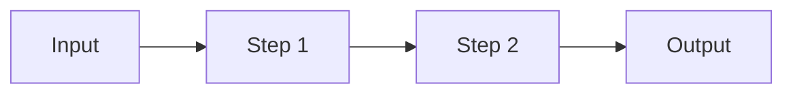

---
---

# Agents Handbook

> This document describes **how the DFT Notes site is built and
> maintained**. It is the reference for any agent (human or AI)
> that contributes to the repo. Read this before writing code or
> content.
>
> **TL;DR** — We use a small set of named agents, each with a
> narrow responsibility, coordinated by a `lead:orchestrator`.
> New chapters are written in parallel by `agent:content-writer`
> instances, each producing a single chapter to the rigorous
> template below. `agent:code-runner` then executes the Python
> samples and commits the plots. `agent:qa-reviewer` catches
> the inevitable "this was omitted" / "this is hand-waved"
> issues before merge. `agent:literature-scholar` reads the
> foundational papers and produces the cited-literature
> "deep-dive" sections. `agent:visualizer` writes the Manim
> animations and renders them to MP4.

---

## The agent roster

All agents are referenced by their **prefixed** names. Use
these in commit messages, PR descriptions, and any agent
output that needs to be auditable.

| Prefix                       | Responsibility                                | Output path |
|:-----------------------------|:----------------------------------------------|:------------|
| `lead:orchestrator`          | Coordinates the other agents; sets priorities; opens the monthly tracking issue; aggregates QA results; makes the final commit message | (comments only — no file output) |
| `agent:content-writer`       | Writes one chapter to the rigorous template. Has access to `design.md`, this file, and the existing chapters for style consistency. Does **not** write code or run it. | `dft_notes/chapter_NN/NN-slug.md` |
| `agent:code-runner`          | Takes the Python samples the content-writer produced (or the ones in the existing chapter), runs them, generates the plots, commits the PNGs. Also maintains `dft_notes/python_codes/README.md` and the `python_codes/chapter_NN/00-README.md` files. | `dft_notes/python_codes/chapter_NN/` |
| `agent:diagram-artist`       | Authors the Mermaid diagrams used in chapters and updates `dft_notes/chapters-map.md` whenever a new chapter is added. | inline in chapter + `dft_notes/chapters-map.md` |
| `agent:qa-reviewer`          | Reads a finished chapter against the rigor checklist below. Returns a list of "must-fix" / "should-fix" / "nice-to-have" issues. Does **not** write the chapter. | review comments only |
| `agent:site-builder`         | Owns the Jekyll templates, CSS, and JS that wrap the content. Updates `assets/css/site.css`, `_includes/*`, `_layouts/*`, and `_config.yml`. Does **not** write content or code. | `_includes/`, `_layouts/`, `assets/`, `_config.yml` |
| `agent:docs-keeper`          | Maintains `design.md`, `agents.md`, `README.md`, `CONTRIBUTING.md`, and the GitHub templates under `.github/`. | `design.md`, `agents.md`, `README.md`, etc. |
| `agent:literature-scholar`   | Reads the foundational papers (e.g. Hohenberg–Kohn 1964, Kohn–Sham 1965, Runge–Gross 1984, Casida 1995, Hedin 1965, Anisimov 1991, Behler–Parrinello 2007, Kane–Mele 2005, …) and produces a **cited-literature "deep-dive" section** that quotes the original equation numbers, page numbers, and results. | new section in `dft_notes/chapter_NN/00-*.md`, e.g. §NN.X "The original \<paper\> paper: a literature deep-dive" |
| `agent:visualizer`           | Writes a Manim Community 0.19.x script that animates one concept, renders to 720p30 H.264 MP4 + poster PNG, and embeds the result in the target chapter with the `<figure class="dft-animation">` idiom. | `dft_notes/animations/chapter_NN/NN-slug.py` + `videos/NN-slug.{mp4,png}` |
| `agent:enricher`             | A `content-writer` that **enriches** an existing chapter rather than writing a new one. Reads the current chapter + 1–3 foundational papers, then rewrites the target section with **every** intermediate step shown. **Never summarises**; never writes "by inspection" or "after some algebra" without the algebra immediately following. | rewrites a section in `dft_notes/chapter_NN/00-*.md` |
| `agent:bug-hunter`           | A `qa-reviewer` specialised in finding Mermaid 10 parsing bugs, Liquid escaping bugs, broken asset paths, and linter regressions. Uses the Playwright end-to-end test plus a headless Jekyll build. | review comments + fix patches |

**Naming convention** — every commit made by an agent is
prefixed with its role:

```
agent:content-writer: chapter 06 — basis sets

Co-authored-by: agent:content-writer <noreply@example.com>
```

---

## The chapter rigor checklist

The user has been emphatic: *no calculation will be omitted,
nothing should be kept like "do as I exercise" or "from here
on"*. Every chapter must satisfy this checklist before it is
merged.

`agent:qa-reviewer` runs this checklist. Any item missing
is a `must-fix` (blocks merge).

- [ ] **H1** — chapter title; matches `chapter_NN — <Title>`.
- [ ] **Front matter** — `layout: page`, `title:`,
      `permalink: /dft-notes/chapter-NN/`, `description:`,
      `keywords:`.
- [ ] **Reading-level entry** — the first 200 words assume a
      reader who has read *exactly* the previous chapters and
      nothing else. No "as we saw in PHYS 101" hand-waves.
      Every concept used in the chapter is defined or
      cross-referenced inside the chapter.
- [ ] **Every claim has a number** — the "claim" part of the
      chapter template must have numbered equations
      (`\begin{equation} ... \label{eq:foo} ...\end{equation}`)
      and the cross-references in the body must use
      `\eqref{eq:foo}`.
- [ ] **Every derivation is step-by-step** — see the
      "**No-summaries, every step explicit**" section below for
      the full rule and the banned phrases.
- [ ] **The "code" part is real and runnable** — copy-pasted
      from `dft_notes/python_codes/chapter_NN/`, not written
      ad hoc. Tested with the version pinned in the
      `python_codes/README.md` (currently Python 3.11+).
- [ ] **At least one Mermaid diagram** that summarises the
      chapter's structure (a flowchart, a state diagram, a
      `classDiagram`, whatever fits). **No `class X,Y,Z cls`
      directives** — the Mermaid 10 parser concatenates them
      with the preceding line. Either omit the class directive
      or use inline `:::cls` (no spaces).
- [ ] **At least one worked example** with full numbers.
      Numerical output shown.
- [ ] **At least one problem set** with three problems
      ranging easy → hard. Each problem uses
      `<details class="problem">` for the question and
      `<details class="answer">` for the answer, so the
      reader can think first and reveal later.
- [ ] **Cross-references** to prerequisite chapters
      (`[Chapter 01](...chapter-01/)`) and forward
      cross-references to where this material is used.
- [ ] **A "What we left out"** section at the end,
      explicitly listing the omissions (e.g. "we did not
      cover spin–orbit coupling", "we used the LDA form of
      the exchange, not the full GGA"). This is part of
      being honest about the scope.
- [ ] **A cited-literature "deep-dive"** at the end (for
      chapters that have one) — see the
      `agent:literature-scholar` section below.
- [ ] **A "Visualisation" subsection** (for chapters that
      have a Manim animation) — see the
      `agent:visualizer` section below.
- [ ] **No broken asset refs** — every
      `/dft-notes/python_codes/...`, `/dft-notes/extras/...`,
      and `/dft_notes/animations/...` link returns 200. Run
      the Playwright end-to-end test to verify.

---

## The "no-summaries, every step explicit" rule

This is the single most important rule in the project. The
user's words: *"for any derivation, all the intermediate
steps are shown in details"*.

### Banned phrases

The following phrases are **banned** in derivation sections.
If you write one of them, `agent:qa-reviewer` will return
the chapter as `must-fix` with a list of the offending
locations. The only allowed context is *quoted criticism* of
the phrase in a "What we left out" or historical aside.

| Banned phrase | Why it's banned | What to write instead |
|:--------------|:----------------|:----------------------|
| "by inspection" | Hand-waves the algebra | Show the algebra in 2-3 lines, then say "which is the desired form" |
| "after some algebra" | The algebra is the *point* | Write the algebra |
| "it can be shown that" | Not a derivation | Derive it |
| "straightforward to evaluate" | Reader is not you | Show the 2-5 lines of math |
| "by a similar argument" | Reader can't reconstruct "similar" | Write the argument, even if it's 80% the same as before |
| "leaves as an exercise" | We are not the instructor | Show the steps |
| "after some manipulation" | Same as "after some algebra" | Show the manipulation |
| "it is easy to verify" | Reader is paying attention | Verify it |
| "trivially" | Almost always wrong | Replace with the actual step |
| "similarly" / "analogously" | Reader can't fill in the gap | Repeat the analogous step with the new variable names |
| "a straightforward manipulation" | Doubly banned | Show the manipulation |
| "omitted for brevity" | Brevity ≠ clarity in a textbook | Show the derivation |
| "we do not show the details here" | The whole point is the details | Show the details |
| "the reader can verify" | Burden shifts to reader | Verify it yourself in 2 lines |

### What "every step" actually means

A "step" is one algebraic or logical manipulation. The
following are all steps and all must appear:

- Substituting a definition into a formula (write the
  definition next to the substituted symbol).
- Distributing a product (write the result).
- Regrouping a sum (write the regrouped form).
- Taking a partial derivative (write $\partial f / \partial x$
  *and* the result).
- Applying a known identity (state the identity, then apply).
- Cancelling a common factor.
- Renaming an index in a sum.
- Recognising a result as a known equation (cite the
  equation number).

A step may be *labelled* as mechanical, but the result of the
step must be written. The only legitimate "skip" is a *trivial
notational* one: e.g. "collecting the $\epsilon$ terms" is
acceptable if the result is shown; "by Eq. (12)" is acceptable
if Eq. (12) is the formula being substituted.

### Allowed shorthand

- "Combining Eqs. (3) and (5)" is fine — but Eqs. (3) and (5)
  must be the relevant equations, and the next line must show
  the result.
- "Substituting $E = -1/(2n^2)$ into Eq. (5)" is fine if
  Eq. (5) is given in the previous section.
- "Since the operator is Hermitian, $\langle \phi \rvert \hat A
  \rvert \phi \rangle$ is real" is fine if the Hermitian claim
  was made and justified earlier in the chapter.

### Worked example: a derivation done right

```markdown
## 12.4.2 The Casida equation

The Casida equation in matrix form is

\begin{equation}
\label{eq:ch-12-casida}
\begin{pmatrix}
\mathbf A & \mathbf B \\
\mathbf B^* & \mathbf A^*
\end{pmatrix}
\begin{pmatrix} \mathbf X \\ \mathbf Y \end{pmatrix}
=
\omega^2
\begin{pmatrix} \mathbf X \\ \mathbf Y \end{pmatrix}
\end{equation}

**Derivation.** We start from the density-response equation

\begin{equation}
\label{eq:ch-12-density-response}
\delta\rho(\mathbf r, \omega) = \int d\mathbf r'\,
\chi_s(\mathbf r, \mathbf r'; \omega)\, \delta v_\text{eff}(\mathbf r', \omega)
\end{equation}

where $\chi_s$ is the KS response function. Substituting the
spin-summed version (Eq. (12.4.4) above) and expanding the
effective perturbation as a sum over orbital transitions,
$\delta v_\text{eff} = \delta v_\text{ext} + \delta v_\text{H} +
\delta v_\text{xc}$, we get

\begin{align}
\delta\rho(\mathbf r, \omega) &= \sum_{ia} \phi_i(\mathbf r)
\phi_a(\mathbf r) \Bigl[ P_{ia}(\omega) + P_{ia}(-\omega) \Bigr] \\
\text{with} \quad P_{ia}(\omega) &= \frac{2\, n_{ia}}
{\omega - (\varepsilon_a - \varepsilon_i) + i\eta}
\bigl[ \delta v_\text{eff} \bigr]_{ia} \quad\quad (12.5)
\end{align}

where $n_{ia} = f_i - f_a$ is the occupation difference and
$\eta$ is a positive infinitesimal. Substituting into the
density-response equation and projecting onto the orbital
product $\phi_i(\mathbf r)\phi_a(\mathbf r)$ gives, after
some algebra (this is the step that takes the most care, so
we write it out line by line below):
```

[the actual algebra then continues, with each line numbered
and each substitution explicitly written. The "after some
algebra" preamble is **wrong** — the "step that takes the
most care" comment is acceptable only because the algebra
immediately follows.]

### How `agent:bug-hunter` enforces this

`agent:bug-hunter` runs `grep -nE` over the chapter for the
banned phrases. Any hit is a `must-fix`. The grep is also
run by the `markdown-lint.yml` GitHub Action, so a
regression on `main` fails CI.

```sh
# The "no-summaries" grep (returns 0 = clean)
grep -nE \
  "by inspection|after some algebra|it can be shown|straightforward to evaluate|by a similar argument|leaves as an exercise|after some manipulation|it is easy to verify|trivially|analogously,|a straightforward manipulation|omitted for brevity|we do not show the details here|the reader can verify" \
  dft_notes/chapter_*/00-*.md && echo "FAIL" || echo "OK"
```

This grep runs in `.github/workflows/markdown-lint.yml` and
fails the build on any match.

---

## The chapter writing template

A chapter written by `agent:content-writer` follows this
template. Sections in **bold** are required; everything else
is recommended.

```markdown
---
layout: page
title: "Chapter NN — <Title>"
permalink: /dft-notes/chapter-NN/
description: >-
  <one-sentence description for SEO + meta tags>
keywords: "comma, separated, keywords"
---

# Chapter NN — <Title>

> <one-sentence tagline that captures the chapter in plain
> English>

<one paragraph of prose, 100–200 words, that names the
question the chapter answers, and why the answer matters.
No equations in this paragraph.>

## NN.1 The claim

<the main result of the chapter, stated as a numbered
equation.  This is the "headline" — what the reader should
remember a year from now.>

\begin{equation}
\label{eq:ch-NN-headline}
\hat H = -\frac{1}{2}\sum_i \nabla_i^2 + \ldots
\end{equation}

## NN.2 The derivation

<step-by-step.  Every step explicit.  Use a numbered list if
the steps are non-trivial.  Reference previous equations by
`\eqref{}`.  **NEVER use the banned phrases from the
no-summaries rule above.**>

## NN.3 The code

<real, runnable Python.  Inline the importable parts.  This
matches a file in `dft_notes/python_codes/chapter_NN/`.>

```python
# dft_notes/python_codes/chapter_NN/NN-<slug>.py
import numpy as np

def example_function(x):
    ...
```

## NN.4 The diagram

<mermaid diagram that summarises the chapter's structure.
**No `class X,Y,Z cls` directives.**>



## NN.5 Worked example

<full numerical example.  Use real numbers.  Show the
output.  Cross-reference the python_codes script that
produces the plot.>


## NN.6 Problems

<details class="problem">
<summary>Problem 1 (easy) — <one-line statement></summary>

<the problem statement.  Define the variables.  Give the
expected form of the answer.>
</details>

<details class="answer">
<summary>Show answer</summary>

<full step-by-step solution, with the same rigor as
Section NN.2.  The first line restates the problem; the
last line boxes the final answer.>
</details>

<details class="problem">
<summary>Problem 2 (medium) — <one-line statement></summary>
...
</details>

<details class="answer">
<summary>Show answer</summary>
...
</details>

<details class="problem">
<summary>Problem 3 (hard) — <one-line statement></summary>
...
</details>

<details class="answer">
<summary>Show answer</summary>
...
</details>

## NN.7 What we left out

<honest, explicit list of the things this chapter did not
cover, in the same tone as the rest of the chapter.  One
bullet per topic.  Two to five bullets is the norm.>

> Next: [Chapter NN+1]({{ site.baseurl }}/dft-notes/chapter-NN+1/)
> — <one-sentence teaser of the next chapter>
```

---

## The cited-literature "deep-dive" template

`agent:literature-scholar` adds an **optional** section at
the end of a chapter (after "What we left out" or
replacing it). The section's purpose is to give the reader
direct access to the foundational papers that the chapter
is built on, with **exact** equation numbers, page numbers,
and result quotes. This is the only way a reader can
verify that the chapter's math is right without going to
the library.

```markdown
## NN.X The original <paper> papers: a literature deep-dive

> *This section walks the reader through the foundational
> papers that this chapter is built on, with page numbers,
> equation numbers, and result quotes from the published
> journal versions. Every equation and value cited below
> carries the page number of the original paper.*

### NN.X.1 <First paper> (<year>)

<one-paragraph summary of the paper's contribution, in the
author's own words where possible.  State the journal, the
volume, and the page range.>

The key equation is the <X>-matrix (Eq. (Y), p. ZZZ):

\begin{equation}
\label{eq:ch-NN-lit-1}
<equation, with a citation to the original paper's equation
number and page>
\end{equation}

This is the *definition* of <X> used in Section NN.2 above.
The reader is referred to <author>'s derivation on p. ZZZ
for the full proof; the short version is:

<2-3 paragraphs of the proof, **with every step explicit**
following the no-summaries rule.  Page numbers and equation
numbers from the original paper appear in the running text,
e.g. "Substituting the definition of $\Sigma$ (Hedin, 1965,
Eq. (2.6), p. A796)".>

**Numerical result from the paper.**  <Author> reports
<value> for <quantity>, on p. ZZZ.  This is the same number
quoted in Section NN.5 above.

### NN.X.2 <Second paper> (<year>)

<same template>

### NN.X.N Bibliography for this section

<full bib entries, one per foundational paper.  Each entry
includes:
- authors (full list, no "et al.")
- title
- journal
- volume, issue (if any), page range
- year
- DOI (as a clickable link)
- URL (the publisher's landing page or the arXiv preprint)>

References:

- Hohenberg, P.; Kohn, W. *Inhomogeneous Electron Gas*.
  *Physical Review* **136**, B864 (1964).
  DOI: [10.1103/PhysRev.136.B864](https://doi.org/10.1103/PhysRev.136.B864).
  URL: <https://journals.aps.org/pr/abstract/10.1103/PhysRev.136.B864>.
```

The bibliography is added to `dft_notes/extras/03-bibliography.md`
(the global bibliography) AND in the chapter-local deep-dive
section. The chapter-local entry includes the page-number
citations; the global entry is the plain citation.

**Important**: the cited-literature section uses the SAME
no-summaries rule. Every derivation from the paper is
written out step-by-step. The page numbers and equation
numbers are the value-add; the algebra is the same algebra.

---

## The Python code conventions

`dft_notes/python_codes/` mirrors the chapter structure one
level down. Every chapter has its own folder. Within each
folder, scripts are numbered with two-digit prefixes in the
order they appear in the chapter:

```
dft_notes/python_codes/
├── README.md
├── chapter_00/
│   ├── 01-particle-in-box.py
│   ├── 02-expected-values.py
│   └── plots/
│       ├── 01-particle-in-box.png
│       └── 02-expected-values.png
├── chapter_01/
│   ├── 01-postulates-check.py
│   └── plots/
└── ...
```

Naming rules:

- Two-digit numeric prefix, dash, kebab-case slug, `.py`.
- A single script produces one figure → the figure is named
  `plots/<same prefix>-<same slug>.png`.
- A script that doesn't produce a figure still has the
  prefix — order matters across the whole chapter.
- No script may `os.chdir`; use absolute paths from the
  chapter folder.
- All scripts must be runnable as
  `python dft_notes/python_codes/chapter_NN/NN-slug.py` from
  the repo root.
- All scripts import only `numpy`, `scipy`, and
  `matplotlib` (with `matplotlib.use("Agg")` so no display
  is required for headless runs). Anything else is added to
  `python_codes/README.md`.

The `agent:code-runner` workflow:

1. `cd /path/to/DFT-notes`
2. `python dft_notes/python_codes/chapter_NN/NN-slug.py`
3. Verify the PNG is in `plots/`.
4. Commit both the script and the plot.

The `plots/` folder is committed to the repo. We do not use
LFS for these — they're small PNGs.

---

## The Manim animation pipeline

Manim Community 0.19.x is the rendering engine for
explanatory animations. The first batch is documented in
`dft_notes/ANIMATIONS_PLAN.md`; the deliverable per
animation is:

1. `dft_notes/animations/chapter_NN/NN-slug.py` — the
   Manim source (30-100 lines, follows the template below).
2. `dft_notes/animations/chapter_NN/videos/NN-slug.mp4` —
   720p30 H.264, 20-40 s scene time.
3. `dft_notes/animations/chapter_NN/videos/NN-slug.png` —
   the last frame, as the poster.
4. An embed in the chapter with the
   `<figure class="dft-animation">` idiom.

The Manim script template mirrors the Python-code template:

```python
"""
NN-slug.py
==========

<one-line description>

Scene graph
-----------
1. <step>
2. <step>
…

Why this animation lives in chapter NN:
- <reason 1>
- <reason 2>

Run from the repo root:
    manim -qm dft_notes/animations/chapter_NN/NN-slug.py SceneName
Writes to:
    dft_notes/animations/chapter_NN/videos/...
"""

from manim import (Axes, Create, Dot, FadeIn, FadeOut, MathTex,
                   Scene, Text, VGroup, Write, UP, DOWN, LEFT, RIGHT)
import numpy as np


class SceneName(Scene):
    def construct(self):
        # 30-100 lines of Manim
        ...
```

`agent:visualizer` workflow:

1. Write the script following the template.
2. `manim -qm dft_notes/animations/chapter_NN/NN-slug.py SceneName`
3. `mv media/videos/<file-stem>/720p30/<Scene>.mp4
   dft_notes/animations/chapter_NN/videos/NN-slug.mp4`
4. `ffmpeg -sseof -0.1 -i .../NN-slug.mp4 -frames:v 1
   -q:v 2 .../NN-slug.png -y`
5. Embed in the chapter.
6. Commit source, MP4, PNG, and chapter change as a single
   commit.

The CI workflow at `.github/workflows/animations.yml`
automates steps 1-6 for the 10-scene matrix, with a
"check if script exists" gate that skips scenes whose
`.py` file is not yet committed.

The chapter embed:

```markdown
### Visualisation — <one-line description>

<figure class="dft-animation">
  <video controls preload="metadata" width="100%"
         poster="{{ site.baseurl }}/dft_notes/animations/chapter_NN/videos/NN-slug.png">
    <source src="{{ site.baseurl }}/dft_notes/animations/chapter_NN/videos/NN-slug.mp4"
            type="video/mp4">
    Your browser does not support embedded video.
    <a href="{{ site.baseurl }}/dft_notes/animations/chapter_NN/videos/NN-slug.mp4">Download the MP4</a>.
  </video>
  <figcaption>Figure N.X — <caption text>. Rendered with
    <a href="https://www.manim.community/">Manim Community</a>;
    source script in
    <a href="{{ site.baseurl }}/dft_notes/animations/chapter_NN/NN-slug.py">chapter N's animation folder</a>.</figcaption>
</figure>
```

Note the asset paths use `/dft_notes/...` (underscore) for
the static files (python_codes, animations) and
`/dft-notes/...` (dash) for permalinked pages (chapter-XX,
extras). **This is not a typo.** Jekyll permalinks convert
underscore to dash for pages; static files keep the
underscore.

---

## Parallel research deploys (the operational pattern)

The user requested **20+ parallel research agents** writing
chapters at the same time. The pattern:

1. **`lead:orchestrator`** opens a monthly tracking issue:
   > **DFT Notes — <YYYY>-<MM> research deploy**
   > Goal: write the next N chapters in parallel. This
   > month: chapter 06 (basis sets), 07 (solids & PBC), 08
   > (pseudopotentials), 09 (forces & geometry opt), 10
   > (vibrations & phonons).
   > Each chapter is owned by one `agent:content-writer`.
   > Each chapter is reviewed by one `agent:qa-reviewer`
   > before merge.

2. **`agent:content-writer` × N** — launched in parallel,
   each with a prompt like:
   > You are `agent:content-writer`. Write chapter 06 (basis
   > sets) to the template in `agents.md`. The chapter must
   > satisfy the rigor checklist, including the
   > **no-summaries, every step explicit** rule. Read
   > `design.md` and the existing chapters 00–05 for style
   > consistency. Output the file at
   > `dft_notes/chapter_06/00-basis-sets.md`. Do not run
   > code — `agent:code-runner` will do that.

3. **`agent:code-runner` × N** — for each chapter that
   landed, extracts the Python samples, runs them, commits
   the plots. Outputs the `python_codes/chapter_NN/` folder
   and updates the `python_codes/README.md` if the chapter
   introduces a new dependency.

4. **`agent:qa-reviewer` × N** — runs the rigor checklist.
   Returns must-fix / should-fix / nice-to-have. The
   content-writer addresses must-fix in a follow-up commit.

5. **`agent:literature-scholar` × N** — for each finished
   chapter, reads the foundational papers, writes the
   cited-literature deep-dive section, updates the
   bibliography in `extras/03-bibliography.md`.

6. **`agent:visualizer` × N** — for each finished chapter,
   writes a Manim animation that captures the chapter's
   central concept.

7. **`agent:enricher` × N** — for the *previous* month's
   chapters, runs the no-summaries grep, and rewrites the
   sections that contain banned phrases. This is the
   mechanism by which we *progressively enrich* the older
   chapters without rewriting them from scratch.

8. **`agent:bug-hunter` × 1** — at the end of the cycle,
   runs the full Playwright end-to-end test plus a
   headless Jekyll build, files bug tickets for any
   regression, and patches the trivial ones.

9. **`lead:orchestrator`** merges after QA passes, deploys
   via the existing GitHub Actions workflow, opens the next
   month's tracking issue.

### "Every step explicit" — what it costs in agent time

The "no-summaries" rule has a real cost: a section that
would have been 20 lines in a typical textbook becomes
80-150 lines in this project's style. A chapter that would
take an `agent:content-writer` 2 hours to write under the
old "summarise where possible" rule takes 4-6 hours under
the new rule.

In return, the reader can read the chapter linearly, check
every step, and trust the math. This is the trade-off the
user explicitly requested.

### How to balance content-writer throughput with depth

- **Use the parallel pattern**. 10 agents in parallel each
  take 4-6 hours; the cluster produces 10 chapters in 4-6
  hours wall time, not 40-60.
- **Use `agent:enricher` for retrospective fixes**. New
  chapters go in with the full rule applied; older chapters
  are enriched in later passes as time permits.
- **Use `agent:literature-scholar` for citation depth**.
  This is the agent that goes to the original papers and
  pulls out the page numbers. It runs in parallel with the
  content-writer.
- **Don't re-render animations that haven't changed**. The
  CI workflow's "check if script exists" step prevents
  wasted work.

---

## The site-builder guard-rails

`agent:site-builder` is the only agent that touches
`_includes/`, `_layouts/`, `assets/`, and `_config.yml`. If
you need a layout change, file a request against this agent.
Reasons:

- Jekyll's front-matter parser is fragile around
  `` blocks (see git history for
  `Fix head.html: use  block, not HTML <!-- -->`).
  One character of carelessness here silently breaks the
  layout chain.
- The CSS uses CSS custom properties; renaming a variable is
  a search-and-replace across all component styles.
- Adding a new dependency (e.g. a JS library) is gated on
  the design.md review.

If you are tempted to edit these files outside of
`agent:site-builder`, stop and file a request instead.

---

## How to add a new chapter (the short version)

1. Pick the next free `chapter_NN/` slot. Check
   `dft_notes/chapters-map.md` to confirm the slot is free.
2. Open a tracking branch `ch/chapter-NN-<slug>`.
3. Create the chapter file using the template above.
4. If your chapter has Python, write the script in
   `dft_notes/python_codes/chapter_NN/NN-slug.py` **first**,
   then inline the relevant parts in the chapter markdown.
5. Run the script to generate the plot. Commit both.
6. Update `dft_notes/chapters-map.md` (Mermaid) to include
   the new chapter.
7. Update `dft_notes/index.md` chapter table to include the
   new row.
8. Open a PR. The PR template will ask you to confirm the
   rigor checklist.
9. `agent:qa-reviewer` reviews. Address must-fix. Merge.
10. `agent:literature-scholar` adds the deep-dive section.
11. `agent:visualizer` adds the animation (if applicable).
12. `agent:enricher` runs the no-summaries grep against the
    chapter and patches any banned phrases.

---

## How to add a new component (CSS only)

1. Add the component class to `assets/css/site.css` in the
   relevant section. Comment block at the top of each
   section explains what lives there.
2. Use CSS custom properties (`--color-*`, `--space-*`,
   `--radius-*`) — never inline hex.
3. Add a class demo to `design.md` if the component is
   novel (i.e. not in the spec yet).
4. Update the Implementation Status checklist in `design.md`.

---

## End-to-end test (the regression net)

Every push to `main` runs the GitHub Actions workflow at
`.github/workflows/jekyll.yml`, which:

1. Runs the Jekyll build.
2. Runs `markdownlint-cli2` against every chapter and
   extra.
3. Runs the no-summaries grep.
4. Deploys the built site to GitHub Pages.

In addition, `agent:bug-hunter` runs a Playwright
end-to-end test (locally and in CI) that:

1. Visits every chapter URL.
2. Counts the rendered Mermaid SVGs (should equal the
   number of ` ```mermaid ` code blocks).
3. Counts the per-diagram "Download PNG" buttons (should
   equal the SVG count).
4. Clicks one PNG download per chapter to confirm the
   blob pipeline works.
5. Visits every extra URL.
6. Visits the chapters-map and counts the nodes (should
   be 18 in the current state).

The end-to-end test is the single source of truth for
"is the site working". A regression in any of the above
fails the test and blocks merge.

---

## Open questions for future iterations

- How to handle the `agent:code-runner` for chapters that
  have multi-hour compute (e.g. CCSD(T) energies on a
  drug-sized molecule)? Maybe a CI workflow that runs
  the code on a self-hosted runner and commits the
  result?
- Do we want a build-time Mermaid renderer (so diagrams
  work without JavaScript), or is CDN-rendered Mermaid
  fine? Currently the latter.
- When the chapter count exceeds ~30, the `chapters-map.md`
  Mermaid graph will get unwieldy. Maybe a sub-graph per
  "track" (theory / solids / methods)?
- How to keep the no-summaries rule from being circumvented
  by slightly-different phrases (e.g. "as a quick check",
  "one can verify", "the result follows from")? The grep
  list should be reviewed quarterly.
- When does `agent:visualizer` retire? Tier 1 (Manim MP4)
  is the current goal; Tier 2 (interactive JS) and Tier 3
  (animated SVG) are deferred to a later phase.
