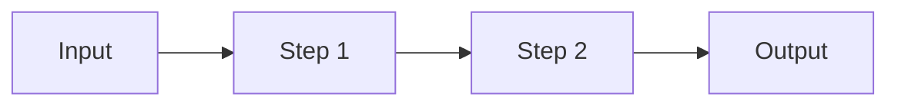

---
---

# Agents Handbook

> This document describes **how the DFT Notes site is built and
> maintained**.  It is the reference for any agent (human or AI)
> that contributes to the repo.  Read this before writing code or
> content.
>
> **TL;DR** — We use a small set of named agents, each with a
> narrow responsibility, coordinated by a `lead:orchestrator`.
> New chapters are written in parallel by `agent:content-writer`
> instances, each producing a single chapter to the rigorous
> template below.  `agent:code-runner` then executes the Python
> samples and commits the plots.  `agent:qa-reviewer` catches
> the inevitable "this was omitted" / "this is hand-waved"
> issues before merge.

---

## The agent roster

All agents are referenced by their **prefixed** names.  Use
these in commit messages, PR descriptions, and any agent
output that needs to be auditable.

| Prefix                  | Responsibility                                | Output path |
|:-----------------------|:----------------------------------------------|:------------|
| `lead:orchestrator`    | Coordinates the other agents; sets priorities; opens the monthly issue that tracks this month's parallel research deploy | (comments only — no file output) |
| `agent:content-writer` | Writes one chapter to the rigorous template.  Has access to design.md, this file, and the existing chapters for style consistency.  Does **not** write code or run it. | `dft_notes/chapter_NN/NN-slug.md` |
| `agent:code-runner`    | Takes the Python samples the content-writer produced (or the ones in the existing chapter), runs them, generates the plots, commits the PNGs.  Also maintains `dft_notes/python_codes/README.md` and the `python_codes/chapter_NN/00-README.md` files. | `dft_notes/python_codes/chapter_NN/` |
| `agent:diagram-artist` | Authors the Mermaid diagrams used in chapters and updates `dft_notes/chapters-map.md` whenever a new chapter is added. | inline in chapter + `dft_notes/chapters-map.md` |
| `agent:qa-reviewer`    | Reads a finished chapter against the rigor checklist below.  Returns a list of "must-fix" / "should-fix" / "nice-to-have" issues.  Does **not** write the chapter. | review comments only |
| `agent:site-builder`   | Owns the Jekyll templates, CSS, and JS that wrap the content.  Updates `assets/css/site.css`, `_includes/*`, `_layouts/*`, and `_config.yml`.  Does **not** write content or code. | `_includes/`, `_layouts/`, `assets/`, `_config.yml` |
| `agent:docs-keeper`    | Maintains `design.md`, `agents.md`, `README.md`, `CONTRIBUTING.md`, and the GitHub templates under `.github/`. | `design.md`, `agents.md`, `README.md`, etc. |

**Naming convention** — every commit made by an agent is
prefixed with its role:

```
agent:content-writer: chapter 06 — basis sets

Co-authored-by: agent:content-writer <noreply@example.com>
```

---

## The chapter rigor checklist

The user has been emphatic: *no calculation will be omitted,
nothing should be kept like "do as I exercise" or "from here
on"*.  Every chapter must satisfy this checklist before it is
merged.

`agent:qa-reviewer` runs this checklist.  Any item missing
is a `must-fix` (blocks merge).

- [ ] **H1** — chapter title; matches `chapter_NN — <Title>`.
- [ ] **Front matter** — `layout: page`, `title:`, `permalink:
      /dft-notes/chapter-NN/`, `description:`, `keywords:`.
- [ ] **Reading-level entry** — the first 200 words assume a
      reader who has read *exactly* the previous chapters and
      nothing else.  No "as we saw in PHYS 101" hand-waves.
      Every concept used in the chapter is defined or
      cross-referenced inside the chapter.
- [ ] **Every claim has a number** — the "claim" part of the
      chapter template must have numbered equations
      (`\begin{equation} ... \label{eq:foo} ...\end{equation}`)
      and the cross-references in the body must use
      `\eqref{eq:foo}`.
- [ ] **Every derivation is step-by-step** — no "by a
      straightforward manipulation", no "after some
      algebra", no "it can be shown that".  Every algebraic
      step appears.  If a step is purely mechanical
      (expand, distribute, collect), say so in one line, but
      do not skip the result.
- [ ] **The "code" part is real and runnable** — copy-pasted
      from `dft_notes/python_codes/chapter_NN/`, not written
      ad hoc.  Tested with the version pinned in the
      `python_codes/README.md` (currently Python 3.11+).
- [ ] **At least one Mermaid diagram** that summarises the
      chapter's structure (a flowchart, a state diagram, a
      `classDiagram`, whatever fits).
- [ ] **At least one worked example** with full numbers.
      Numerical output shown.
- [ ] **At least one problem set** with three problems
      ranging easy → hard.  Each problem uses
      `<details class="problem">` for the question and
      `<details class="answer">` for the answer, so the
      reader can think first and reveal later.
- [ ] **Cross-references** to prerequisite chapters
      (`[Chapter 01](...chapter-01/)`) and forward
      cross-references to where this material is used.
- [ ] **A "What we left out"** section at the end,
      explicitly listing the omissions (e.g. "we did not
      cover spin–orbit coupling", "we used the LDA form of
      the exchange, not the full GGA").  This is part of
      being honest about the scope.

---

## The chapter writing template

A chapter written by `agent:content-writer` follows this
template.  Sections in **bold** are required; everything else
is recommended.

```markdown
---
layout: page
title: "Chapter NN — <Title>"
permalink: /dft-notes/chapter-NN/
description: >-
  <one-sentence description for SEO + meta tags>
keywords: "comma, separated, keywords"
---

# Chapter NN — <Title>

> <one-sentence tagline that captures the chapter in plain
> English>

<one paragraph of prose, 100–200 words, that names the
question the chapter answers, and why the answer matters.
No equations in this paragraph.>

## NN.1 The claim

<the main result of the chapter, stated as a numbered
equation.  This is the "headline" — what the reader should
remember a year from now.>

\begin{equation}
\label{eq:ch-NN-headline}
\hat H = -\frac{1}{2}\sum_i \nabla_i^2 + \ldots
\end{equation}

## NN.2 The derivation

<step-by-step.  Every step explicit.  Use a numbered list if
the steps are non-trivial.  Reference previous equations by
`\eqref{}`.>

## NN.3 The code

<real, runnable Python.  Inline the importable parts.  This
matches a file in `dft_notes/python_codes/chapter_NN/`.>

```python
# dft_notes/python_codes/chapter_NN/NN-<slug>.py
import numpy as np

def example_function(x):
    ...
```

## NN.4 The diagram

<mermaid diagram that summarises the chapter's structure>



## NN.5 Worked example

<full numerical example.  Use real numbers.  Show the
output.  Cross-reference the python_codes script that
produces the plot.>


## NN.6 Problems

<details class="problem">
<summary>Problem 1 (easy) — <one-line statement></summary>

<the problem statement.  Define the variables.  Give the
expected form of the answer.>
</details>

<details class="answer">
<summary>Show answer</summary>

<full step-by-step solution, with the same rigor as
Section NN.2.  The first line restates the problem; the
last line boxes the final answer.>
</details>

<details class="problem">
<summary>Problem 2 (medium) — <one-line statement></summary>
...
</details>

<details class="answer">
<summary>Show answer</summary>
...
</details>

<details class="problem">
<summary>Problem 3 (hard) — <one-line statement></summary>
...
</details>

<details class="answer">
<summary>Show answer</summary>
...
</details>

## NN.7 What we left out

<honest, explicit list of the things this chapter did not
cover, in the same tone as the rest of the chapter.  One
bullet per topic.  Two to five bullets is the norm.>

> Next: [Chapter NN+1]({{ site.baseurl }}/dft-notes/chapter-NN+1/)
> — <one-sentence teaser of the next chapter>
```

---

## The Python code conventions

`dft_notes/python_codes/` mirrors the chapter structure one
level down.  Every chapter has its own folder.  Within each
folder, scripts are numbered with two-digit prefixes in the
order they appear in the chapter:

```
dft_notes/python_codes/
├── README.md
├── chapter_00/
│   ├── 01-particle-in-box.py
│   ├── 02-expected-values.py
│   └── plots/
│       ├── 01-particle-in-box.png
│       └── 02-expected-values.png
├── chapter_01/
│   ├── 01-postulates-check.py
│   └── plots/
└── ...
```

Naming rules:

- Two-digit numeric prefix, dash, kebab-case slug, `.py`.
- A single script produces one figure → the figure is named
  `plots/<same prefix>-<same slug>.png`.
- A script that doesn't produce a figure still has the
  prefix — order matters across the whole chapter.
- No script may `os.chdir`; use absolute paths from the
  chapter folder.
- All scripts must be runnable as
  `python dft_notes/python_codes/chapter_NN/NN-slug.py` from
  the repo root.
- All scripts import only `numpy`, `scipy`, and
  `matplotlib` (with `matplotlib.use("Agg")` so no display
  is required for headless runs).  Anything else is added to
  `python_codes/README.md`.

The `agent:code-runner` workflow:

1. `cd /path/to/DFT-notes`
2. `python dft_notes/python_codes/chapter_NN/NN-slug.py`
3. Verify the PNG is in `plots/`.
4. Commit both the script and the plot.

The `plots/` folder is committed to the repo.  We do not use
LFS for these — they're small PNGs.

---

## Parallel research deploys (monthly)

The user requested **20+ parallel research agents** writing
chapters at the same time.  The pattern:

1. **`lead:orchestrator`** opens a monthly tracking issue:
   > **DFT Notes — <YYYY>-<MM> research deploy**
   > Goal: write the next N chapters in parallel.  This month:
   > chapter 06 (basis sets), 07 (solids & PBC), 08
   > (pseudopotentials), 09 (forces & geometry opt), 10
   > (vibrations & phonons).
   > Each chapter is owned by one `agent:content-writer`.
   > Each chapter is reviewed by one `agent:qa-reviewer`
   > before merge.

2. **`agent:content-writer` × N** — launched in parallel,
   each with a prompt like:
   > You are `agent:content-writer`.  Write chapter 06 (basis
   > sets) to the template in `agents.md`.  The chapter must
   > satisfy the rigor checklist.  Read `design.md` and the
   > existing chapters 00–05 for style consistency.  Output
   > the file at `dft_notes/chapter_06/00-basis-sets.md`.
   > Do not run code — `agent:code-runner` will do that.

3. **`agent:code-runner` × N** — for each chapter that landed,
   extracts the Python samples, runs them, commits the
   plots.  Outputs the `python_codes/chapter_NN/` folder
   and updates the `python_codes/README.md` if the chapter
   introduces a new dependency.

4. **`agent:qa-reviewer` × N** — runs the rigor checklist.
   Returns must-fix / should-fix / nice-to-have.  The
   content-writer addresses must-fix in a follow-up commit.

5. **`lead:orchestrator`** merges after QA passes, deploys
   via the existing GitHub Actions workflow, opens the next
   month's tracking issue.

In this session we demonstrate the pattern with **3 parallel
content-writer agents** (chapters 06, 07, 08) and a single
code-runner that processes the resulting Python after the
content lands.  The pattern scales linearly; the orchestrator
issue is the only thing that changes between months.

---

## The site-builder guard-rails

`agent:site-builder` is the only agent that touches
`_includes/`, `_layouts/`, `assets/`, and `_config.yml`.  If
you need a layout change, file a request against this agent.
Reasons:

- Jekyll's front-matter parser is fragile around
  `` blocks (see git history for
  `Fix head.html: use  block, not HTML <!-- -->`).
  One character of carelessness here silently breaks the
  layout chain.
- The CSS uses CSS custom properties; renaming a variable is
  a search-and-replace across all component styles.
- Adding a new dependency (e.g. a JS library) is gated on
  the design.md review.

If you are tempted to edit these files outside of
`agent:site-builder`, stop and file a request instead.

---

## How to add a new chapter (the short version)

1. Pick the next free `chapter_NN/` slot.  Check
   `dft_notes/chapters-map.md` to confirm the slot is free.
2. Open a tracking branch `ch/chapter-NN-<slug>`.
3. Create the chapter file using the template above.
4. If your chapter has Python, write the script in
   `dft_notes/python_codes/chapter_NN/NN-slug.py` **first**,
   then inline the relevant parts in the chapter markdown.
5. Run the script to generate the plot.  Commit both.
6. Update `dft_notes/chapters-map.md` (Mermaid) to include
   the new chapter.
7. Update `dft_notes/index.md` chapter table to include the
   new row.
8. Open a PR.  The PR template will ask you to confirm the
   rigor checklist.
9. `agent:qa-reviewer` reviews.  Address must-fix.  Merge.

---

## How to add a new component (CSS only)

1. Add the component class to `assets/css/site.css` in the
   relevant section.  Comment block at the top of each
   section explains what lives there.
2. Use CSS custom properties (`--color-*`, `--space-*`,
   `--radius-*`) — never inline hex.
3. Add a class demo to `design.md` if the component is
   novel (i.e. not in the spec yet).
4. Update the Implementation Status checklist in `design.md`.

---

## Open questions for future iterations

- How to handle the `agent:code-runner` for chapters that
  have multi-hour compute (e.g. CCSD(T) energies on a
  drug-sized molecule)?  Maybe a CI workflow that runs
  the code on a self-hosted runner and commits the
  result?
- Do we want a build-time Mermaid renderer (so diagrams
  work without JavaScript), or is CDN-rendered Mermaid
  fine?  Currently the latter.
- When the chapter count exceeds ~30, the `chapters-map.md`
  Mermaid graph will get unwieldy.  Maybe a sub-graph
  per "track" (theory / solids / methods)?
