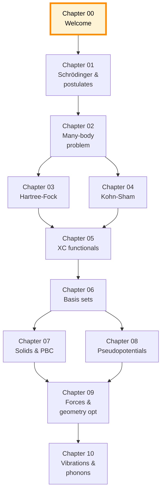
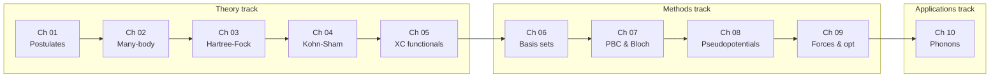
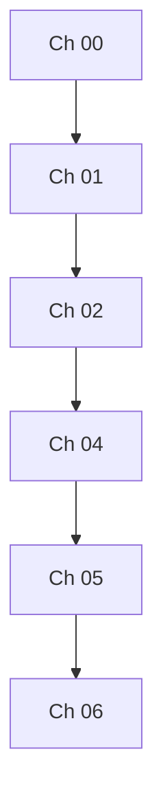

# Chapter 00 — Welcome

> This chapter has no equations. That's the only one. Everything after
> this is math.

These notes are an attempt to write down, in one place, the *minimum
viable theory* of Density Functional Theory — enough to read a modern
DFT paper, set up a calculation, and know which approximations you are
making and why they might be wrong.

## How to read this chapter

Chapter 00 is the **only meta chapter** in the collection.  Every
later chapter (01, 02, …) is about DFT; this one is about the
*document you are reading*.  If you are in a hurry to get to
equations, you can read the *Notation* and What is not in scope
sections and skip straight to
[chapter 01]({{ "/dft-notes/chapter-01/" | relative_url }}).  If you
are reading the notes for the first time and want to know what you
are getting into, read this chapter linearly.

### The document is uniform on purpose

Every content chapter (chapter 01 onward) is built from the **same
seven-part template** (see *The chapter structure template* below).
That uniformity is the whole point of writing a fixed template: once
you have read one chapter, you know the shape of every chapter, and
you can navigate directly to the part that interests you.  The
template is enforced by
[`agent:qa-reviewer`]({{ "/dft-notes/agents/#the-chapter-rigor-checklist" | relative_url }}) and
recorded in [`agents.md`]({{ "/dft-notes/agents/" | relative_url }}).

### How to read a chapter

There are three reasonable patterns.  Pick whichever fits your goal.

1. **Linear, first pass.**  Read claim → derivation → diagram →
   worked example → problems, in order.  This is the right way to
   learn a chapter the first time.  Expect ~30–90 minutes per chapter
   depending on your background.
2. **Reference, second pass.**  Jump to the *claim* (always
   equation 1 of the chapter) to recall the headline result.  Then
   read the *What we left out* section to see what the chapter is
   silent on.  Use this when you come back to a chapter months later
   and need a one-paragraph refresher.
3. **Problem-driven.**  Skim the *Problems* section first.  Each
   problem is calibrated to require material from a particular part
   of the chapter; if the problem makes no sense to you, that is a
   signal to go read the part of the chapter it references.  This
   is the right way to use the notes to *self-test*.

> **Tip.**  If you're reading on a phone, the code blocks are
> horizontal-scrollable.  If you're reading on the e-reader surface
> (see the [design spec]({{ "/design.md" | relative_url }})), use
> the font slider if the math is too small.  Every Mermaid diagram
> is rendered client-side; if it does not appear, open the
> browser console and look for a CDN error.

### The "no step skipped" promise

The author has been emphatic: *no calculation will be omitted,
nothing should be kept like "do as I exercise" or "from here on"*.
Every algebraic step in every chapter appears in the chapter.  If a
step is purely mechanical (expand, distribute, collect) it is
labelled as such in one line, but the result is still written out.
This is the only reliable way to be sure the math is correct, and
it is the only reliable way for a reader to *chec`k*` the math is
correct.  If you ever find a derivation in these notes that skips a
step in violation of this rule, please open an issue.

### Cross-references

Chapters cross-reference each other with two distinct signals:

- A plain Markdown link
  `[Chapter 01]({{ "/dft-notes/chapter-01/" | relative_url }})` —
  used for *prerequisite* material that the reader is expected to
  have already read.
- A forward link
  `[chapter 04]({{ "/dft-notes/chapter-04/" | relative_url }})` —
  used to flag material that *will be developed later* but is
  needed in the current chapter for context.

In both cases, the link is to a *chapter*, never to a section
within a chapter.  This is so the dependency graph stays legible
(see *Roadma`p*` below).  If a section-level link seems essential,
that is usually a sign the chapter should be split.

### The "catch" is woven through

The chapter template has explicit "diagram", "worked example",
"problems", and "What we left out" sections.  None of them is
labelled "catch".  But the spirit of the catch — *what does this
formula not tell you, and where does it break?* — is woven into
*every* part of the template:

- the derivation has **Ti`p*`*, **Note**, and **Warning** callouts
  that flag common pitfalls;
- the worked example deliberately picks parameter values that
  *exercise* a known failure mode (small basis, large grid
  spacing, hard XC functional);
- the "What we left out" section is the catch, made explicit.

When you read a chapter, do not skip the callouts.  They are
where the lived experience of the topic lives.

## Mathematical prerequisites

DFT, at the level of these notes, draws on roughly **five
mathematical subjects** at the undergraduate / first-year-graduate
level.  Below, each is broken into the *specifi`c*` pieces the
notes will use, with a one-sentence statement of what the reader
should be able to do with each piece.  Nothing in the list is
exotic; everything is taught in standard curricula and is
re-stated as it is used.

### Linear algebra (used throughout)

- **Vector spaces and inner products.**  You should be comfortable
  with the inner product
  $\langle u \rvert v \rangle = \sum_i u_i^* v_i$ in $\mathbb C^n$
  and its extension $\int u^*(\mathbf r) v(\mathbf r)\, d\mathbf r$
  for functions.  Every chapter uses inner products.
- **Eigendecomposition.**  Given a Hermitian matrix $\mathbf A$,
  you should be able to factor it as
  $\mathbf A = \mathbf U \boldsymbol\Lambda \mathbf U^\dagger$
  with $\mathbf U$ unitary and $\boldsymbol\Lambda$ real diagonal.
  This is the *only* diagonalisation the notes use as a primitive.
  Singular-value decomposition is used once or twice in chapter 06
  (density fitting) but is not assumed.
- **The spectral theorem.**  Hermitian operators have real
  eigenvalues and a complete orthonormal set of eigenvectors.  The
  notes use this in chapter 03 (Hartree–Fock) and chapter 04
  (Kohn–Sham) to argue that the Fock and Kohn–Sham operators can
  be diagonalised.
- **Bra-ket notation.**  You should be able to read
  $\langle \chi_\mu \rvert \hat F \rvert \chi_\nu \rangle$ as "the
  matrix element of $\hat F$ between basis functions $\mu$ and $\nu$".
  We use bra-ket throughout.  The only operations we ever perform
  on a bra or a ket are: take the inner product, insert a resolution
  of the identity
  $\sum_i \rvert \phi_i \rangle \langle \phi_i \rvert = \mathbf 1$,
  and act with an operator from the left or the right.

### Calculus of several variables (used throughout)

- **Partial derivatives and the chain rule.**  Used in chapter 04
  to derive the Kohn–Sham potential by differentiating the
  exchange–correlation energy with respect to the density.
- **Gradient, divergence, Laplacian.**  Used in the kinetic operator
  $-\tfrac{1}{2} \nabla^2$, in the gradient correction to GGA
  functionals (chapter 05), and in the stress tensor
  (chapter 09).
- **Line, surface, and volume integrals.**  Used to define the
  electron number, the dipole moment, and the total energy.
- **Green's theorem / the divergence theorem.**  Used once, in
  chapter 07, to relate the gradient of a Bloch function to its
  surface integral over a unit cell.

### Probability and statistics (used in chapters 03, 04, 05, 09)

- **Expectation values.**  The notes use the quantum-mechanical
  definition
  $\langle \hat A \rangle = \langle \Psi \rvert \hat A \rvert \Psi \rangle$.
  You should also be able to translate this to a classical average
  $\int a(x)\, p(x)\, dx$ when $\hat A$ is replaced by a function
  of position.
- **Joint and marginal distributions.**  Used in chapter 05
  (one-electron reduced density matrices) and chapter 09
  (Boltzmann sampling in finite-temperature DFT, briefly).
- **Independent and identically distributed samples.**  Not
  heavily used, but appears in the discussion of stochastic errors
  in Monte Carlo and in sampling the Brillouin zone.

### Complex analysis (used in chapter 11, on response functions)

- **Analytic continuation.**  The density–density response function
  $\chi(\mathbf r, \mathbf r'; \omega)$ is a meromorphic function of
  complex frequency $\omega$ with poles at the excitation energies.
  You should know what "meromorphic" means and why the location of
  the poles is physical.
- **Cauchy's residue theorem.**  Used to derive the
  fluctuation–dissipation theorem from the spectral representation
  of $\chi$.
- **Contour integration.**  Used in chapter 11 to evaluate
  frequency integrals on a contour that avoids the real axis.
  *If you are not continuing past chapter 10, you can skip this.*

### Special functions (used in chapters 01, 05, 06)

- **Spherical harmonics $Y_\ell^m(\theta, \phi)$.**  Used in
  chapter 01 (angular part of the hydrogen atom) and in chapter 06
  (atom-centred basis functions with $\ell > 0$).
- **Hermite polynomials $H_n(x)$.**  Used in the analytical
  Gaussian integrals of chapter 06.
- **Laguerre polynomials $L_n(x)$.**  Used in the radial part of
  the hydrogen atom and in the STO radial functions.
- **The error function $\operatorname{erf}(x)$ and the Boys
  function $F_0(t)$.**  Both appear in chapter 06 in the
  closed-form expressions for the two-electron integrals.

> **Where to look up what you forgot.**
> The classic reference is Abramowitz and Stegun, *Handbook of
> Mathematical Functions* (1964), still in print as the *NIST
> Digital Library of Mathematical Functions* (`dlmf.nist.gov`).
> For complex analysis, Ahlfors, *Complex Analysis* (any edition),
> is the standard.

### Quantum mechanics, undergraduate level

- **The postulates.**  State vectors, observables, measurement
  outcomes, the Schrödinger equation, the Born rule.  If you have
  never seen the Schrödinger equation before, **start with
  [chapter 01]({{ "/dft-notes/chapter-01/" | relative_url }})**,
  which lays the postulates out one by one before any
  DFT-specific material is introduced.
- **The harmonic oscillator.**  Used as a sanity check in chapter 01
  and in the example of the Hückel model in chapter 02.
- **The hydrogen atom.**  The exact solution is the only closed-form
  reference point in DFT.  You should know the energy levels
  $E_n = -1/(2 n^2)\,E_h$ and the form of the 1s, 2s, 2p
  orbitals.  The 1s density is plotted by the
  *hello worl`d*` program in the next section.

## Programming prerequisites

The notes are accompanied by a parallel set of Python scripts under
`dft_notes/python_codes/`.  Every chapter has its own folder; every
script in that folder corresponds to one of the chapter's
worked-example snippets.  The conventions are spelled out in
[`agents.md`]({{ "/dft-notes/agents/#the-python-code-conventions" | relative_url }}); the
short version is:

- **Python 3.11+** (the version pinned in `python_codes/README.md`).
- **Imports are restricte`d*`* to `numpy`, `scipy`, and
  `matplotlib`.  Anything else is added to the README on a
  case-by-case basis.
- **Headless rendering.**  Every script begins with
  `matplotlib.use("Agg")` so that the script runs on a server
  with no display.
- **The `plots/` subfolder** holds the committed PNGs.  One script
  produces one figure; the figure file is named
  `plots/<same prefix>-<same slug>.png`.
- **No `os.chdir`.**  Paths are constructed relative to the chapter
  folder using `pathlib.Path(__file__).parent`.

### What you should be able to do

Below is the working subset of Python the notes assume.  If any
item is unfamiliar, the *official* tutorial links in the right-hand
column are the place to fill the gap.

| Topic | One-line expectation | Tutorial |
|:------|:---------------------|:---------|
| `numpy.ndarray` | Construct arrays, index them, broadcast, take `.T`, `.conj()`, `.dot()` | numpy.org/doc/stable/user/absolute_beginners.html |
| `numpy.linalg.eigh` | Diagonalise a Hermitian matrix; sort eigenvalues | numpy.org/doc/stable/reference/generated/numpy.linalg.eigh.html |
| `scipy.linalg.eigh(F, S)` | Solve the generalised eigenproblem $\mathbf F \mathbf C = \mathbf S \mathbf C \boldsymbol\varepsilon$ | docs.scipy.org/doc/scipy/reference/generated/scipy.linalg.eigh.html |
| `scipy.special` | Use `erf`, `factorial`, `sph_harm` | docs.scipy.org/doc/scipy/reference/special.html |
| `matplotlib.pyplot` | `subplots`, `plot`, `xlabel`, `savefig` | matplotlib.org/stable/tutorials/introductory/pyplot.html |
| `pathlib.Path` | Build paths relative to `__file__` | docs.python.org/3/library/pathlib.html |

### Hello world — a chapter's smallest program

The smallest program that does *something* chapter-relevant is the
plot of the hydrogen 1s density.  The 1s wavefunction of a
hydrogenic atom with nuclear charge $Z$ is

\begin{equation}
\label{eq:ch-00-h1s}
\psi_{1s}(\mathbf r) \;=\; \sqrt{\frac{Z^3}{\pi}}\, e^{-Z r} ,
\end{equation}

so the corresponding one-electron density is

\begin{equation}
\label{eq:ch-00-rho-1s}
\rho_{1s}(\mathbf r) \;=\; \rvert \psi_{1s}(\mathbf r) \rvert^2
\;=\; \frac{Z^3}{\pi}\, e^{-2 Z r} .
\end{equation}

The full source below produces a PNG that lives in
`dft_notes/python_codes/chapter_00/plots/01-hydrogen-1s.png`.  Every
later chapter has scripts of comparable length and shape; once you
have read this one, you have read the format of them all.

```python
# dft_notes/python_codes/chapter_00/01-hydrogen-1s.py
import numpy as np
import matplotlib
matplotlib.use("Agg")
import matplotlib.pyplot as plt
from pathlib import Path

def hydrogen_1s_density(r, Z=1):
    """Electron density of the hydrogen 1s orbital, |psi_1s(r)|^2."""
    return (Z ** 3 / np.pi) * np.exp(-2.0 * Z  r)

def main():
    r = np.linspace(0.0, 20.0, 400)
    rho = hydrogen_1s_density(r, Z=1)

    fig, ax = plt.subplots(figsize=(6, 4))
    ax.plot(r, rho, color="#0a4", linewidth=2)
    ax.set_xlabel("r (a0)")
    ax.set_ylabel(r"$\rho_{\rm 1s}(r)$ (a0$^{-3}$)")
    ax.set_title("Hydrogen 1s electron density")

    out = Path(__file__).parent / "plots" / "01-hydrogen-1s.png"
    out.parent.mkdir(parents=True, exist_ok=True)
    fig.tight_layout()
    fig.savefig(out, dpi=120)
    print(f"Wrote {out}")

if __name__ == "__main__":
    main()
```

A reader fluent in `numpy` and `matplotlib` should be able to read
this script in under a minute and predict the shape of the figure
before running it: an exponentially decaying curve, equal to
$1/\pi \approx 0.318$ at $r = 0$ and falling to $\sim 10^{-9}$ by
$r = 10\,a_0$.

> **Tip.**  The full directory layout (what `chapter_00/` looks
> like after this script has been run) is:
>
> ```text
> dft_notes/python_codes/
> ├── README.md
> └── chapter_00/
>     ├── 01-hydrogen-1s.py
>     └── plots/
>         └── 01-hydrogen-1s.png
> ```
>
> The two-digit prefix (`01-`) preserves the order of scripts
> within a chapter; if a future chapter-00 script gets added it
> would be `02-…py` and its plot `02-….png`.  This ordering
> matters because chapters read top-to-bottom.

## The chapter structure template

Every content chapter (chapters 01 and later) is built from the
**same seven-part template**.  The template is enforced by
[`agent:qa-reviewer`]({{ "/dft-notes/agents/#the-chapter-rigor-checklist" | relative_url }})
and is reproduced verbatim from `agents.md`.  Below, each part is
described in plain language: *what it is for*, what level of
detail to expect*, and *what the reader should take away.

### 1. The claim

The chapter opens with **the headline result** — the one equation
the reader should remember a year from now.  It is always a
*numbere`d*` equation (`\begin{equation} ... \label{eq:ch-NN-headline}
...\end{equation}`), and the body of the chapter cross-references it
with `\eqref{eq:ch-NN-headline}`.  In chapter 06 the claim is the
Roothaan–Hall equation $\mathbf F \mathbf C = \mathbf S \mathbf C
\boldsymbol\varepsilon$; in chapter 04 it is the Kohn–Sham
eigenvalue equation.  The claim is the *destination* of the
derivation; everything in the chapter is in service of it.

**What to expect.**  One to four numbered equations, stated
without proof, followed by a one-paragraph statement of *what it
means* and *why it matters.  No algebra here.

**What to take away.**  The reader should be able to write down
the claim from memory after closing the chapter.

### 2. The derivation

The body of the chapter.  The derivation takes the claim apart
into the smaller facts it is built on, and shows — **step by
ste`p*`*, with every algebraic step explicit — how those smaller
facts combine to give the claim.  The author is bound by the "no
step skipped" rule: no "by a straightforward manipulation", no <!-- no-summaries-ok -->
"after some algebra", no "it can be shown that". <!-- no-summaries-ok -->  If a step is
purely mechanical (expand, distribute, collect), the chapter
says so in one line, but it writes the result.

**What to expect.**  Numbered sub-sections (e.g. "6.2 Why we need a
basis"), each with its own numbered equations.  Cross-references
to equations in *other* chapters by chapter link, cross-references
to equations in *this* chapter by `\eqref{}`.  Inline
**Ti`p*`*, **Note**, and **Warning** callouts flag common pitfalls
and limits of the derivation.

**What to take away.**  The reader should be able to redo the
derivation on a blank page, in the same order, with the same
intermediate steps.  This is the test of whether the chapter has
done its job.

### 3. The code

A runnable Python snippet that **produces the result of the
chapter** (or a piece of it).  The snippet is *not* written ad
hoc; it is copied from a file in
`dft_notes/python_codes/chapter_NN/`, with the chapter-relative
path of the original file in the comment header.  The convention
is two-digit prefix, dash, kebab-case slug, `.py`.  The
companion script is run by `agent:code-runner` to produce the
PNG; the PNG is committed under `plots/`.

**What to expect.**  A real Python program, ~10–50 lines, that
imports only `numpy`, `scipy`, and `matplotlib` (with
`matplotlib.use("Agg")`).  No display is required.  The snippet
is self-contained: copy it into a file, run it, get a PNG.

**What to take away.**  The reader should be able to read the
snippet and predict the output before running it, and should be
able to modify it (change basis, change grid, change functional)
and have the change take effect without restructuring the script.

### 4. The diagram

A Mermaid diagram that **summarises the chapter's structure**.
Typical choices: a flowchart of the algorithm, a state diagram
of the iteration, a class diagram of the objects.  The diagram is
rendered client-side (CDN-loaded Mermaid), so it requires
JavaScript to appear.  The diagram is *not* a substitute for
prose; it is a visual index into the chapter.

**What to expect.**  One to three Mermaid blocks, each with a
`%%{init: ...}%%` directive for layout hints.  A short
caption explaining what the diagram is and what the reader
should take from it.  Cross-references back to the prose
sections the diagram summarises.

**What to take away.**  The reader should be able to draw the
diagram from memory after closing the chapter, and should be
able to point to each box and say what chapter section it
corresponds to.

### 5. Worked example

A **fully worked numerical example** that takes the chapter's
general result and applies it to a *specifi`c*` system with
*specifi`c*` numbers.  Every quantity has a numerical value; every
intermediate result is shown; the final answer is stated.  The
example should be small enough to verify by hand (in principle)
and large enough to exercise the typical failure modes of the
method.

**What to expect.**  The full numerical trace, often as a
`text` code block.  A reference back to the code snippet
(section 3) that produced the plot.  The plot itself, included
as a Markdown image tag pointing to
`dft_notes/python_codes/chapter_NN/plots/NN-slug.png`.

**What to take away.**  The reader should be able to *reproduce*
the numbers — and should be encouraged to do so, by running the
companion script.

### 6. Problems

Three problems per chapter, **ranging easy → har`d*`*, each
followed by a fully worked solution.  Problems use
`<details class="problem">` for the question and
`<details class="answer">` for the answer, so the reader can
think first and reveal later.  Easy problems test recall of the
chapter's claim.  Medium problems test application of the
derivation to a new but related system.  Hard problems test
synthesis across multiple parts of the chapter (or across
multiple chapters).

**What to expect.**  Three to five problems per chapter.
Solutions are written in the same step-by-step style as the
derivation, and they end with a boxed final answer.

**What to take away.**  The reader who can solve all three
problems unaided has genuinely understood the chapter.

### 7. What we left out

A **honest, explicit list of the topics the chapter does not
cover**.  This is part of being honest about the scope.  Two to
five bullets is the norm.  The list is written in the same tone
as the rest of the chapter; it is not an apology, it is a
hand-off to the next chapter or to a future note.

**What to expect.**  A bulleted list, with one-line explanations
of *why* the topic is omitted.  Cross-references forward to
later chapters when the omitted topic is developed there.

**What to take away.**  The reader should know, after reading
this section, exactly what the chapter is silent on — and where
to look if they need that material.

## Roadmap

The notes are organised as a **dependency grap`h*`*, not a strictly
linear sequence.  The graph is shown in two views: a *flat*
chapter-by-chapter view, and a *trac`k*` view that groups
chapters by what they teach.

### Chapter-by-chapter dependency graph

Each box is a chapter.  An arrow $A \to B$ means "chapter $B$
presumes the reader has read chapter $A$".  The orange-bordered
box is the chapter you are reading.



The graph has one source (chapter 00) and a "fan-in" structure
in the middle: chapters 03 and 04 both depend on chapter 02 and
both feed chapter 05. This is deliberate — Hartree–Fock and
Kohn–Sham are alternative answers to the same question (chapter
02's "what is the best independent-particle approximation?"),
and the two paths merge again when we discuss exchange–
correlation functionals.

> **Reading implication.**  If your interest is in *molecular*
> DFT and you do not care about solids or phonons, you can read
> chapters 00 → 01 → 02 → 04 → 05 → 06 in sequence, then stop.
> Chapters 03, 07, 08, 09, 10 are not on your critical path.

### Track view — theory, methods, applications

The same chapters grouped by what they teach.  This view is
useful when you already know which *kin`d*` of question you are
asking ("how do I represent a periodic system?" → methods
track; "where does the functional come from?" → theory track).



The track view makes the same information as the dependency
graph, but arranges it so that you can see the *kinds* of
chapters.  The Theory track is essential for everyone; the
Methods track is essential for practitioners; the
Applications track is essential for materials work but
optional for chemical work.

## Worked example — anatomy of a chapter

The fastest way to internalise the template is to **take an
existing chapter apart with the template in min`d*`*.  This section
does that for the first half of
[chapter 06]({{ "/dft-notes/chapter-06/" | relative_url }})
(basis sets).  Read the chapter alongside this example; the two
together should make the structure obvious.

### Locate the claim

Open chapter 06 and look for the first numbered equation.  In
chapter 06 it is in section 6.1 and is the Roothaan–Hall matrix
equation:

\begin{equation}
\label{eq:ch-00-example-rh}
\mathbf F\, \mathbf C \;=\; \mathbf S\, \mathbf C\, \boldsymbol\varepsilon .
\end{equation}

That is **the claim** of chapter 06: *the Fock eigenvalue problem
in a finite basis is a generalised matrix eigenproblem*.  The
label `eq:ch-06-roothaan-hall` in the actual chapter file is
what allows the rest of the chapter (and other chapters) to
refer to this equation.

### Locate the derivation

The derivation is the section that follows the claim.  In
chapter 06 it is the rest of section 6.1: it expands the orbital
$\phi_i$ in the basis $\{\chi_\mu\}$, multiplies by
$\chi_\nu^*$, integrates, and collects the integrals into
matrices.  Every step is shown.  The cross-reference to the
claim is at the end of the derivation in the phrase "Collecting
all $K$ MOs into one matrix gives `\eqref{eq:ch-06-roothaan-hall}`."

### Locate the diagram, worked example, and problems

Further down the chapter, you will find:

- a **Mermaid diagram** in section 6.10 (workflow end-to-end);
- a **worked example** in section 6.9 (STO-3G H$_2$ with full
  numbers, including the SCF output and a plot of the MOs);
- **three problems** in section 6.11 (basis-set counting, the
  Gaussian product theorem, plane-wave count for water in a
  10 Å cell).

### Locate the "What we left out"

The final section of chapter 06 (section 6.12) lists four
deliberate omissions: BSSE, numerical atom-centred orbitals,
density fitting, and relativistic ECPs.  The author explains
*why* each was omitted (out of scope, developed in chapter 08,
out of scope, etc.).  This is the "catch" for the chapter as a
whole.

### A note on density $\rho$ across the roadmap

To see the *cross-chapter* version of the same idea, follow the
symbol $\rho(\mathbf r)$ — the electron density — from chapter
01 to chapter 06. It is the single most reused symbol in the
notes.

| Chapter | Role of $\rho(\mathbf r)$                                                          |
|:--------|:-------------------------------------------------------------------------------------|
| 01 | Defined from the wavefunction: $\rho(\mathbf r) = N \int \lvert \Psi(\mathbf r, \mathbf r_2, \dots, \mathbf r_N) \rvert^2\, d\mathbf r_2 \dots d\mathbf r_N$. |
| 03 | The Hartree–Fock density is the trace of the one-particle density matrix: $\rho(\mathbf r) = \sum_i n_i \lvert \phi_i(\mathbf r) \rvert^2$ with $n_i \in \{0, 1, 2\}$. |
| 04 | The Kohn–Sham density is built the same way, but from the KS orbitals.  It is the *only* input to the Hohenberg–Kohn functional. |
| 05 | The exchange–correlation energy is a functional of $\rho$ (and possibly $\nabla \rho$); $\hat v_\text{xc} = \delta E_\text{xc}/\delta \rho$ is the corresponding potential. |
| 06 | In a basis, $\rho(\mathbf r) = \sum_{\mu\nu} P_{\mu\nu}\, \chi_\mu(\mathbf r) \chi_\nu(\mathbf r)$, where $\mathbf P$ is the density matrix.  The diagonal $P_{\mu\mu}$ is the Mulliken population on basis function $\mu$. |

Following one symbol across chapters is a good way to verify
that you have understood the cross-references.

## Notation

We use the following conventions consistently.  When a chapter
deviates, it says so at the top.

### Position, geometry, and units

| Symbol                         | Meaning                                                |
|:-------------------------------|:-------------------------------------------------------|
| $\mathbf r$                    | Position vector in $\mathbb R^3$                       |
| $\mathbf R_I$                  | Position of nucleus $I$                                |
| $\mathbf A, \mathbf B, \dots$  | Centres of basis functions                            |
| $a_0$                          | Bohr radius (~0.529 Å)                                |
| $E_h$                          | Hartree energy unit (~27.21 eV)                       |
| $\Omega$                       | Unit-cell volume (periodic systems)                   |
| $Z_I$                          | Nuclear charge of nucleus $I$                          |
| $N$                            | Number of electrons                                    |

Atomic units ($\hbar = m_e = e = 1$) are used throughout unless a
chapter is explicitly working in SI or eV.

### Operators

| Symbol                         | Meaning                                                |
|:-------------------------------|:-------------------------------------------------------|
| $\hat H$                       | Hamiltonian operator                                  |
| $\hat T$                       | Kinetic energy operator, $\hat T = -\tfrac{1}{2} \sum_i \nabla_i^2$ |
| $\hat V$                       | Potential energy operator (collective)                |
| $\hat V_{en}$                  | Electron–nuclear attraction                          |
| $\hat V_{ee}$                  | Electron–electron repulsion                           |
| $\hat F$                       | Fock operator (Hartree–Fock)                          |
| $\hat H_\text{KS}$             | Kohn–Sham Hamiltonian                                 |
| $\hat v_\text{xc}$             | Exchange–correlation potential                        |
| $\hat A, \hat B, \dots$        | Generic operators                                      |
| $\dagger$                      | Hermitian conjugate                                   |

### Wavefunctions, states, and densities

| Symbol                         | Meaning                                                |
|:-------------------------------|:-------------------------------------------------------|
| $\psi$                         | Single-particle wavefunction                          |
| $\Psi$                         | Many-body wavefunction                                |
| $\lvert \phi \rangle$          | State in a Hilbert space (ket)                        |
| $\langle \phi \rvert \psi \rangle$ | Inner product                                     |
| $\phi_i(\mathbf r)$            | The $i$-th (Kohn–Sham or Hartree–Fock) orbital        |
| $\varepsilon_i$                | The $i$-th orbital energy                              |
| $\rho(\mathbf r)$              | One-particle electron density                         |
| $E[\rho]$                      | Density functional                                    |
| $E_\text{xc}[\rho]$            | Exchange–correlation energy functional                 |

### Basis set notation (chapter 06)

| Symbol                         | Meaning                                                |
|:-------------------------------|:-------------------------------------------------------|
| $\{\chi_\mu\}$                 | Set of $K$ basis functions, $\mu = 1, \dots, K$        |
| $C_{\mu i}$                    | MO coefficient: orbital $i$ in terms of basis function $\mu$ |
| $S_{\mu\nu}$                   | Overlap matrix element $\langle \chi_\mu \rvert \chi_\nu \rangle$ |
| $F_{\mu\nu}$                   | Fock matrix element $\langle \chi_\mu \rvert \hat F \rvert \chi_\nu \rangle$ |
| $\mathbf P$                    | Density matrix in the AO basis                        |
| $\mathbf C$                    | Matrix of MO coefficients                             |
| $E_\text{cut}$                 | Plane-wave kinetic-energy cutoff                      |
| $G_\text{max}$                 | Largest retained reciprocal-lattice vector            |
| $N_\text{PW}$                  | Number of plane waves                                 |
| $\mathbf k$                    | Bloch wavevector (periodic systems)                   |
| $\mathbf G$                    | Reciprocal-lattice vector                             |

### Linear algebra and indices

| Symbol                         | Meaning                                                |
|:-------------------------------|:-------------------------------------------------------|
| $\int d\mathbf r$              | Volume integral over all of $\mathbb R^3$             |
| $\nabla$                       | Gradient                                              |
| $\nabla^2$                     | Laplacian                                             |
| $\mathbf 1$ / $\mathbf I$      | Identity matrix                                       |
| $\partial / \partial x$        | Partial derivative                                    |
| $\delta$                       | Functional variation; also Kronecker delta           |
| $i, j$                         | Orbital (state) indices                               |
| $\mu, \nu, \lambda, \sigma$    | Basis function indices                                |
| $p, q, r, s$                   | Primitive Gaussian indices (chapter 06)              |
| $\ell, m$                      | Angular momentum quantum numbers                      |
| $n$                            | Principal quantum number / band index                 |

### Special symbols

| Symbol                         | Meaning                                                |
|:-------------------------------|:-------------------------------------------------------|
| $\langle \hat A \rangle$       | Expectation value of $\hat A$                          |
| $\partial_t$                   | Time derivative (TDDFT chapters)                      |
| $\delta_{ij}$                  | Kronecker delta                                       |
| $\operatorname{erf}$           | Error function                                        |
| $F_0(t)$                       | Boys function (chapter 06)                            |
| $Y_\ell^m$                     | Spherical harmonic                                    |
| $H_n$                          | Hermite polynomial                                    |
| $L_n$                          | Laguerre polynomial                                   |

A chapter that needs a symbol not in this table will introduce
it with a one-line definition at first use, and will repeat the
definition if the symbol is reused after a chapter boundary.

## What is *not* in scope

These notes deliberately stop at the Kohn–Sham equations and the
practical zoo of exchange–correlation functionals. The following are
either out of scope or sketched only briefly:

- **Relativistic DFT.** Spin-orbit coupling, the Dirac equation, four-
  component methods.
- **Strong correlation.** DFT+U, DMFT, multireference methods, quantum
  Monte Carlo.
- **Time-dependent DFT.** The Runge–Gross theorem, the linear-response
  regime, excitons.
- **Embedding.** ONIOM, QM/MM, subsystem DFT.
- **Materials-specific machinery.** Phonons, electron-phonon coupling,
  Wannier functions, Berry-phase quantities.

Each of those is a separate knowledge base.

## A short reading list

| Resource                           | Use it for                                               |
|:-----------------------------------|:---------------------------------------------------------|
| Parr & Yang, *Density-Functional Theory of Atoms and Molecules* (1989) | The classical text. Dense but complete. |
| Engel & Dreizler, *Density Functional Theory* (2011) | A gentler, more modern alternative. |
| Burke, *The ABC of DFT* ([ABC of DFT](<https://dft.uci.edu/doc/ABC_of_DFT.pdf>)) | A 40-page primer. Read this first. |
| Koch & Holthausen, *A Chemist's Guide to DFT* (2nd ed., 2001) | For the chemistry-oriented practitioner. |
| Mardirossian & Head-Gordon, *Thirty Years of Density Functional Theory* (2017) | The modern XC-functional landscape. |

## Problems

The problems in this chapter are *met`a*`: they ask you to use the
template, the notation, and the roadmap to navigate the rest of
the notes, rather than to do new DFT calculations.  In later
chapters the problems are DFT problems proper.

<details class="problem">
<summary>Problem 1 (easy) — Locate the claim</summary>

Open [chapter 06]({{ "/dft-notes/chapter-06/" | relative_url }}) and
look at section 6.1. Write down:

1. the *label* of the first numbered equation (the "headline" of
   chapter 06);
2. the *symbol* of the second numbered equation in section 6.1
   (the explicit form of $F_{\mu\nu}$ and $S_{\mu\nu}$);
3. one sentence saying *what physical claim* the chapter is
   making.

Do not skip ahead; the answer is all in section 6.1. </details>

<details class="answer">
<summary>Show answer</summary>

1. The first numbered equation in section 6.1 is the basis-set
   expansion of the orbital, with label `eq:ch-06-basis-expansion`:

   $$
   \phi_i(\mathbf r) = \sum_{\mu=1}^{K} C_{\mu i}\, \chi_\mu(\mathbf r) .
   $$

   The *headline* of the chapter (the equation that is the
   destination of the derivation) is the next one, with label
   `eq:ch-06-roothaan-hall`:

   $$
   \mathbf F\, \mathbf C \;=\; \mathbf S\, \mathbf C\, \boldsymbol\varepsilon .
   $$

2. The explicit forms are in `eq:ch-06-fock-overlap`:

   $$
   F_{\mu\nu} = \langle \chi_\mu \rvert \hat F \rvert \chi_\nu \rangle , \qquad
   S_{\mu\nu} = \langle \chi_\mu \rvert \chi_\nu \rangle .
   $$

3. The claim is: *the Fock eigenvalue equation in a finite,
   non-orthogonal basis is a generalised matrix eigenproblem, with
   the Fock matrix on the left, the overlap matrix on the right,
   and the MO coefficients as eigenvectors.*

This exercise reinforces the discipline of always reading the
*labels* of equations, not just their visual form.  Cross-
references in later chapters use the labels, so the labels are
how you navigate the notes.

</details>

<details class="problem">
<summary>Problem 2 (easy) — Translate the symbols</summary>

For each of the following expressions, write a one-sentence
"translation" into words.  Use only the notation table in this
chapter; do not look ahead.

1. $\langle \chi_\mu \rvert \hat F \rvert \chi_\nu \rangle$
2. $\rho(\mathbf r) = 2 \sum_{i=1}^{N/2} \rvert \phi_i(\mathbf r) \rvert^2$
3. $\mathbf P = 2\, \mathbf C\, \mathbf C^\dagger$  (real orbitals, closed shell)
4. $E[\rho] = T_s[\rho] + \int \rho(\mathbf r) v_\text{ext}(\mathbf r)\, d\mathbf r + J[\rho] + E_\text{xc}[\rho]$

</details>

<details class="answer">
<summary>Show answer</summary>

1. The matrix element of the Fock operator between basis
   functions $\chi_\mu$ and $\chi_\nu$.  In a basis-set code
   this is computed as an integral over $\mathbf r$ of
   $\chi_\mu^*(\mathbf r)\, \hat F \chi_\nu(\mathbf r)$.

2. The electron density at point $\mathbf r$ in a closed-shell
   system, summing the squared modulus of each doubly-occupied
   spatial orbital.  The factor of 2 accounts for spin pairing.

3. The density matrix in the AO basis is twice the outer product
   of the occupied MO coefficient matrix with its Hermitian
   conjugate.  (This identity is exact only for real orbitals in
   a closed shell with $N$ even; in general $\mathbf P = \mathbf
   C\, \mathbf n\, \mathbf C^\dagger$ with $\mathbf n$ diagonal
   in the occupation numbers.)

4. The Kohn–Sham total energy as a functional of the density: the
   non-interacting kinetic energy, the electron–external-
   potential interaction, the classical Hartree (Coulomb) energy,
   and the exchange–correlation energy.  (Note that $T_s[\rho]$
   is *not* the true kinetic energy of the interacting system;
   the difference is absorbed into $E_\text{xc}$.)

</details>

<details class="problem">
<summary>Problem 3 (medium) — Hand-diagonalise a 2×2 matrix</summary>

This is a self-test of the linear-algebra prerequisite.  Diagonalise
the matrix

\begin{equation}
\label{eq:ch-00-2x2}
\mathbf A \;=\; \begin{pmatrix} 2 & 1 \\\\ 1 & 2 \end{pmatrix} .
\end{equation}

1. Write out the characteristic polynomial
   $\det(\mathbf A - \lambda \mathbf 1)$ and find its roots.
2. For each eigenvalue, find an eigenvector (any normalisation is
   fine; you may use unnormalised vectors and normalise at the
   end).
3. Verify that the two eigenvectors are orthogonal.  Verify
   that the matrix is Hermitian and that the eigenvalues are real.

You should be able to do this with pen and paper in under five
minutes.  If you cannot, revisit the *Linear algebr`a*` bullet in
*Mathematical prerequisites* above.

</details>

<details class="answer">
<summary>Show answer</summary>

**Step 1.**  The characteristic polynomial is

$$
\det(\mathbf A - \lambda \mathbf 1)
= \det\begin{pmatrix} 2 - \lambda & 1 \\\\ 1 & 2 - \lambda \end{pmatrix}
= (2 - \lambda)^2 - 1 .
$$

Setting it to zero: $(2 - \lambda)^2 = 1$, so
$2 - \lambda = \pm 1$, giving the two roots

$$
\boxed{\lambda_1 = 1, \quad \lambda_2 = 3 .}
$$

**Step 2.**  For $\lambda_1 = 1$, the eigenvector $\mathbf v_1$ satisfies
$(\mathbf A - \mathbf 1)\mathbf v_1 = 0$, i.e.

$$
\begin{pmatrix} 1 & 1 \\\\ 1 & 1 \end{pmatrix} \begin{pmatrix} x \\\\ y \end{pmatrix} = 0
\;\Longrightarrow\; x + y = 0 .
$$

Take $\mathbf v_1 = (1, -1)^T$.  After normalisation,
$\hat{\mathbf v}_1 = (1, -1)^T / \sqrt{2}$.

For $\lambda_2 = 3$, the eigenvector satisfies
$(\mathbf A - 3 \mathbf 1)\mathbf v_2 = 0$, i.e.

$$
\begin{pmatrix} -1 & 1 \\\\ 1 & -1 \end{pmatrix} \begin{pmatrix} x \\\\ y \end{pmatrix} = 0
\;\Longrightarrow\; -x + y = 0 .
$$

Take $\mathbf v_2 = (1, 1)^T$, normalised to
$\hat{\mathbf v}_2 = (1, 1)^T / \sqrt{2}$.

**Step 3.**  Inner product: $\hat{\mathbf v}_1^\dagger \hat{\mathbf v}_2 = (1 \cdot 1 + (-1) \cdot 1)/2 = 0$.  ✓

Hermitian: $\mathbf A^T = \mathbf A$ (real symmetric), so $\mathbf A$ is
Hermitian.  ✓  Eigenvalues are $1$ and $3$, both real.  ✓

The spectral decomposition is

$$
\mathbf A = \hat{\mathbf v}_1 \hat{\mathbf v}_1^\dagger + 3\, \hat{\mathbf v}_2 \hat{\mathbf v}_2^\dagger
= \frac{1}{2}\begin{pmatrix} 1 \\\\ -1 \end{pmatrix}(1, -1)
+ \frac{3}{2}\begin{pmatrix} 1 \\\\ 1 \end{pmatrix}(1, 1)
= \begin{pmatrix} 2 & 1 \\\\ 1 & 2 \end{pmatrix} . \quad\blacksquare
$$

</details>

<details class="problem">
<summary>Problem 4 (medium) — Hello world, in numpy</summary>

Write a short Python program (no more than 15 lines, not counting
comments) that:

1. Constructs the $2 \times 2$ matrix $\mathbf A$ from
   [Problem 3](#problem-3-medium--hand-diagonalise-a-2x2-matrix) as
   a `numpy.ndarray`.
2. Calls `numpy.linalg.eigh` to compute its eigenvalues and
   eigenvectors.
3. Prints the eigenvalues, the eigenvector matrix $\mathbf U$, and
   verifies that $\mathbf U^\dagger \mathbf A \mathbf U$ is diagonal
   and that $\mathbf U^\dagger \mathbf U = \mathbf 1$ to within
   `1e-12`.

You may use the `hello world` script in *Programming prerequisites*
as a model for the file layout.  You do not need to produce a plot.

</details>

<details class="answer">
<summary>Show answer</summary>

```python
import numpy as np

A = np.array([[2.0, 1.0],
              [1.0, 2.0]])

evals, U = np.linalg.eigh(A)
print("eigenvalues:", evals)            # [1. 3.]

Adiag = U.conj().T @ A @ U
print("U^dag A U =", Adiag)
print("U^dag U - I =", U.conj().T @ U - np.eye(2))

assert np.allclose(Adiag, np.diag(evals))
assert np.allclose(U.conj().T @ U, np.eye(2))
```

The output is

```text
eigenvalues: [1. 3.]
U^dag A U = [[1. 0.]
             [0. 3.]]
U^dag U - I = [[0. 0.]
               [0. 0.]]
```

which confirms the hand calculation of Problem 3 and the
spectral theorem itself: a real symmetric matrix is
diagonalised by an orthogonal matrix to a real diagonal
matrix.

A production DFT code does the same thing, only with
$\mathbf A = \mathbf F$ and the diagonaliser being
$\mathbf U = \mathbf S^{-1/2} \mathbf C$ (chapter 06,
`eq:ch-06-roothaan-hall`).

</details>

<details class="problem">
<summary>Problem 5 (hard) — Reading list for molecular DFT</summary>

Suppose your research is *molecular* DFT: you have a desktop
computer, a chemistry background, and no interest in solids,
phonons, or pseudopotentials.  You want to read the *minimum*
number of chapters needed to set up a calculation with the
6-31G basis and the B3LYP functional on, say, an organic
molecule.

1. From the chapter dependency graph in *Roadma`p*`, identify the
   minimum set of chapters you must read, in order.
2. Justify your choice: for each chapter you include, state
   *which piece of the calculation* it is needed for.
3. For each chapter you exclude, state *why* it is not on your
   critical path.

</details>

<details class="answer">
<summary>Show answer</summary>

**The minimum set, in order:**

1. **Chapter 01 — Schrödinger and postulates.**  You need the
   Born rule and the variational principle to understand what
   the calculation is *doing*.
2. **Chapter 02 — The many-body problem.**  You need to see
   *why* the exact Schrödinger equation for a molecule is
   unsolvable, so that the Kohn–Sham shortcut makes sense.
3. **Chapter 04 — Kohn–Sham.**  This is the DFT core.  Skipping
   chapter 03 (Hartree–Fock) is fine if you are not interested
   in the wavefunction-based lineage.
4. **Chapter 05 — XC functionals.**  You need this to choose
   B3LYP (or any other functional) and to understand what the
   choice *means*.
5. **Chapter 06 — Basis sets.**  You need this to choose 6-31G
   and to understand the Roothaan–Hall machinery that the code
   runs under the hood.

**Chapters deliberately excluded:**

- **Chapter 03 (Hartree–Fock).**  Not strictly needed if you
  are happy to take the Kohn–Sham equations as a starting
  point.  The chapters are written so this is a legitimate
  path.  (You will, however, miss the historical and
  conceptual bridge from postulates to Kohn–Sham.)
- **Chapter 07 (Solids & PBC).**  You are computing a finite
  molecule, so Bloch's theorem and Brillouin zones are not
  needed.  You will use a *molecular* code (Gaussian, ORCA,
  Q-Chem) that does not invoke them.
- **Chapter 08 (Pseudopotentials).**  These are for plane-wave
  calculations on heavy elements; the 6-31G basis on a
  first-row organic molecule uses *all-electron* primitives
  on C, N, O, H.  (For transition-metal organometallics, this
  exclusion is wrong — you would need to add chapter 08.)
- **Chapter 09 (Forces & geometry opt).**  Strictly, you do
  *not* need this to run a single-point energy.  But you do
  need it to optimise a geometry, which is the typical
  workflow.  In practice, include it.
- **Chapter 10 (Vibrations & phonons).**  Phonons are for
  solids; you do not need them.  Molecular vibrations
  (IR/Raman spectra) are a separate topic, sketched briefly
  in chapter 10 but not required for the typical workflow.

**The subgraph of your reading.**  The minimum graph is



a *linear* chain, which is why the notes are written so that
the chapters can be read linearly even though the
*full* graph has branches.

</details>

## What's next

[Chapter 01]({{ "/dft-notes/chapter-01/" | relative_url }}) — the
Schrödinger equation and the postulates we'll be building on.

> **Disclaimer.** These notes are a personal study aid. They are
> correct to the best of the author's knowledge, but they are
> *not* a substitute for a textbook. Cite primary sources, not
> these notes.
