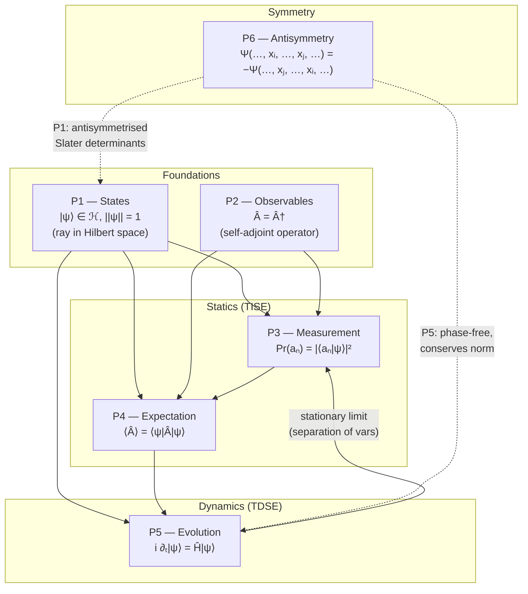
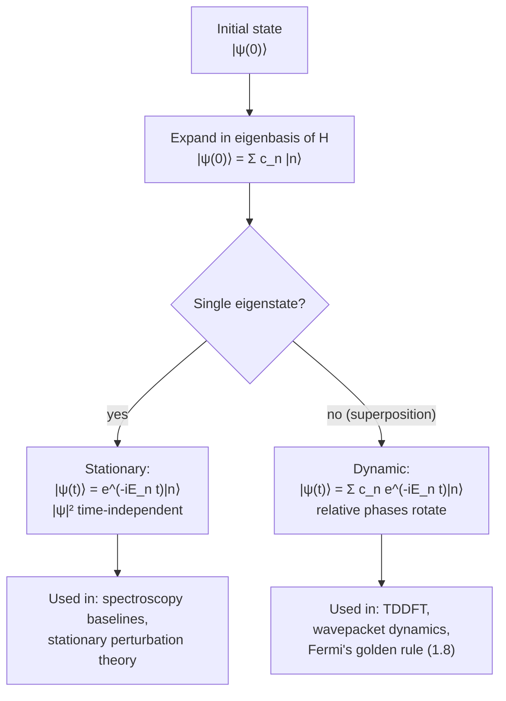
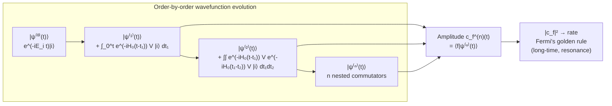
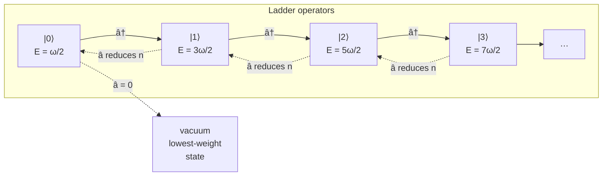
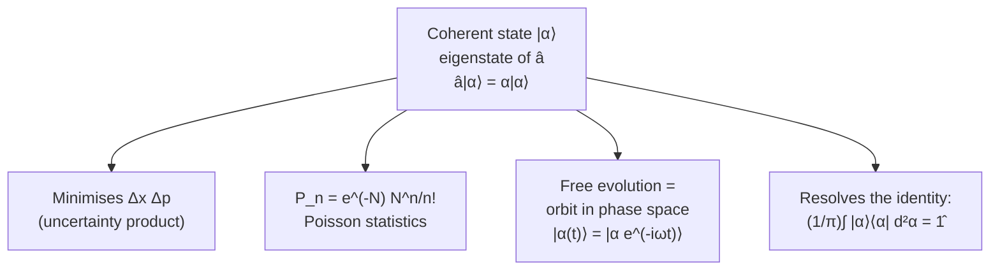
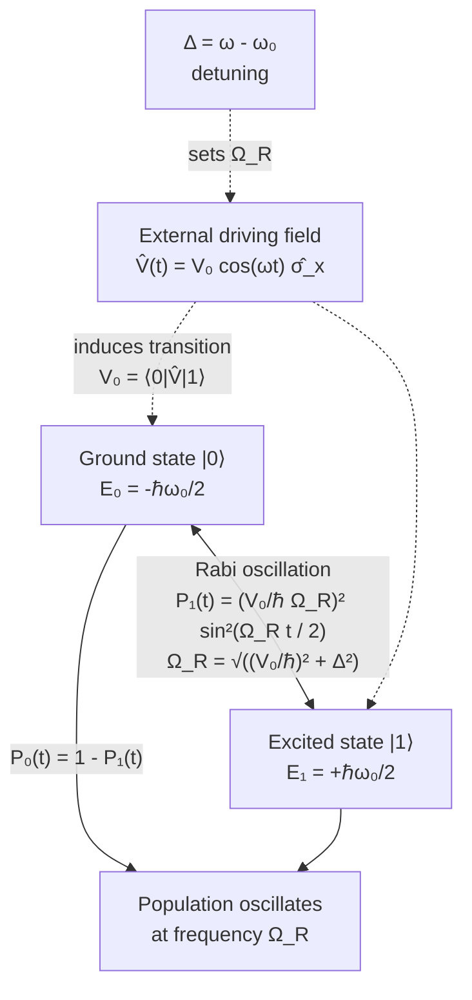
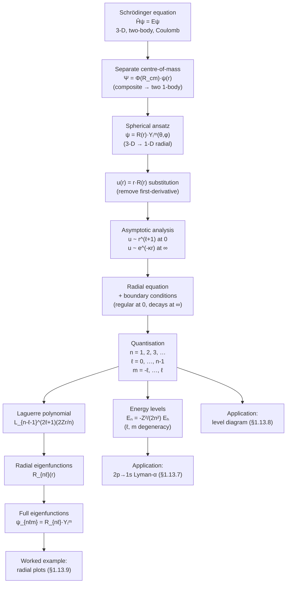
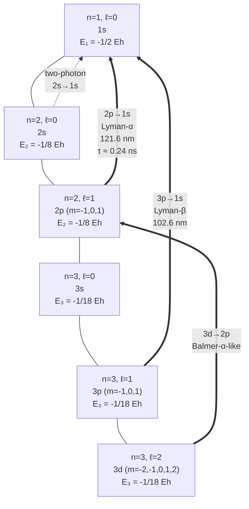
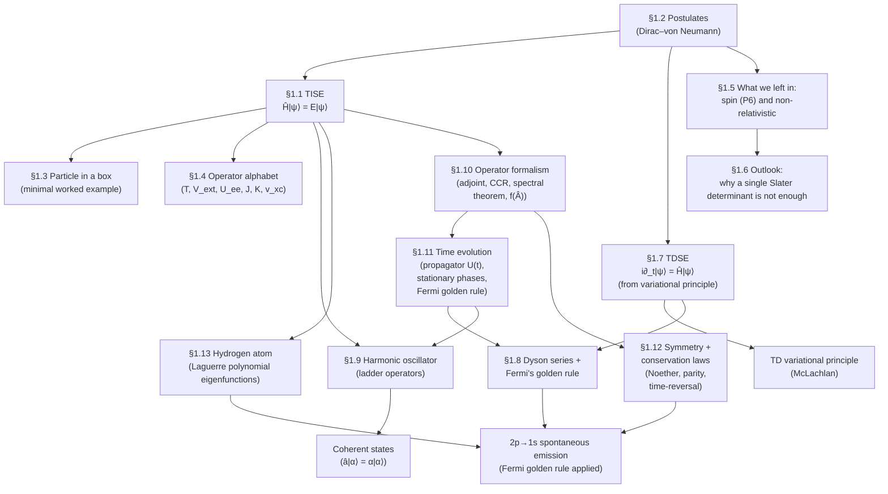

# Chapter 01 — Schrödinger equation

> The single most important equation in non-relativistic quantum
> mechanics. Every other equation in these notes is a special case, a
> mean-field approximation, or a comment on this one.

This chapter is the foundation under everything that follows. It does
five things. **(1)** States the postulates that fix the formalism
(section 1.2) and writes down the **time-independent** Schrödinger
equation (TISE) for the electronic Hamiltonian in atomic units
(section 1.1). **(2)** Walks through the particle in a box as a
toy problem that lets us see the formalism in action, including a
short Python finite-difference diagonalisation (section 1.3) and a
catalogue of the operators that recur in every later chapter
(section 1.4). **(3)** Derives the **time-dependent** Schrödinger
equation (TDSE) from the time-dependent variational principle,
reconstructs the TISE as the special case of a stationary state, and
states the unitarity + continuity consequences (section 1.7).
**(4)** Develops the **operator formalism** — linear operators on
Hilbert space, the canonical commutation relations, the spectral
theorem, and functions of operators such as the time-evolution
operator $\hat U(t) = e^{-i\hat H t}$ (section 1.10) — and uses
it to re-derive the time-evolution propagator, the stationary-state
phase factor, and Fermi's golden rule in operator language
(section 1.11). **(5)** Closes the formal foundation with a
preview of the **symmetry and conservation-law** structure of
quantum mechanics (section 1.12): Noether's theorem, the
discrete symmetries of parity / time-reversal / particle–hole,
and the selection rules they imply. The two exactly soluble
many-body problems that anchor all of quantum chemistry are then
solved within that framework: the **harmonic oscillator**
(section 1.9) and the **hydrogen atom** (section 1.13). No prior
quantum knowledge is assumed; every operator and every symbol is
defined where it first appears.
> **Notation.** We work throughout in **atomic units** ($\hbar = m_e
> = e = 4\pi\varepsilon_0 = 1$). Lengths are in Bohr ($a_0$),
> energies in Hartree ($E_h$). The conversion factors
> $1\,E_h \approx 27.211\,$eV and $1\,a_0 \approx 0.529\,$Å are used
> without comment when the answer needs to be quoted in
> laboratory units.

## 1.1 The time-independent Schrödinger equation

For a closed, non-relativistic, $N$-particle system with Hamiltonian
$\hat H$, the **stationary states** $\psi$ and their **energies** $E$
are eigenpairs of $\hat H$:

$$
\hat H \, \psi(\mathbf r_1, \dots, \mathbf r_N) = E \, \psi(\mathbf r_1, \dots, \mathbf r_N).
$$

For the rest of these notes we will almost always work with the
**electronic Hamiltonian** in the **Born–Oppenheimer** (clamped-nuclei)
approximation. In atomic units it reads

$$
\hat H = -\frac{1}{2} \sum_{i=1}^{N} \nabla_i^2 \;-\; \sum_{i=1}^{N} \sum_{A=1}^{M} \frac{Z_A}{|\mathbf r_i - \mathbf R_A|} \;+\; \sum_{i<j}^{N} \frac{1}{|\mathbf r_i - \mathbf r_j|}.
$$

The three terms are, in order: the kinetic energy of the electrons, the
electron–nuclear attraction, and the electron–electron repulsion. The
nuclear–nuclear repulsion is a constant in the Born–Oppenheimer picture
and is added at the end.

> **Tip.** Many texts write the second term as $\sum_A Z_A / r_{iA}$
> where $r_{iA} = \lvert \mathbf r_i - \mathbf R_A \rvert$. We will
> use the explicit vector form because it makes the gradient
> transparent when we derive the Kohn–Sham equations.

The TISE \eqref{eq:ch-01-tise} is the **eigenvalue problem** of
quantum chemistry. Three of its features are worth pinning down
before we move on.

1. **The spectrum is bounded from below.** With
   $\hat H = \hat T + \hat V$ and the nuclear potential bounded, the
   kinetic term $\hat T = -\frac{1}{2}\sum_i \nabla_i^2$ is a
   positive semi-definite operator and the Coulomb singularity at
   $r_{ij} = 0$ is mild enough (it is integrable in 3-D) that
   $\hat H$ is bounded below. The lowest eigenvalue
   $E_0 \equiv \inf \sigma(\hat H)$ is the **ground-state energy**.
   The ground state is non-degenerate for atoms and molecules
   (Lions, 1987); excited states can be (and usually are)
   degenerate.
2. **Eigenfunctions form a complete orthonormal basis.** The
   eigenfunctions $\{\psi_n\}$ of a self-adjoint operator on
   $L^2(\mathbb R^{3N})$ are complete in the sense that any
   square-integrable wavefunction has a convergent expansion
   $\Psi = \sum_n c_n \psi_n$ with
   $\sum_n |c_n|^2 < \infty$. This is the foundation of every
   expansion-based method in chapters 3, 5, 6.
3. **There is an inner product.**
   $\langle \phi | \psi \rangle = \int \phi^*(\mathbf x)\, \psi(\mathbf x)\, d\mathbf x$.
   The normalisation $\langle \psi | \psi \rangle = 1$ is *not*
   built into $\hat H \psi = E \psi$; we impose it by hand and
   then keep it under unitary time evolution (section 1.7).

## 1.2 The postulates

The Schrödinger equation is *postulate`d*`; the constants in it are
measured; the rest is derived. We will use the Dirac–von Neumann
axiomatisation:

| #  | Postulate                                  | Mathematical statement                                                                 |
|:---|:-------------------------------------------|:--------------------------------------------------------------------------------------|
| P1 | States are rays in a Hilbert space        | $\psi \in \mathcal H$, with $\lVert \psi \rVert = 1$                                  |
| P2 | Observables are self-adjoint operators    | $\hat A : \mathcal H \to \mathcal H$, $\hat A = \hat A^\dagger$                       |
| P3 | Measurements give eigenvalues            | $\Pr(a_n) = \lvert \langle a_n \rvert \psi \rangle \rvert^2$                            |
| P4 | Expectation values                        | $\langle A \rangle = \langle \psi \rvert \hat A \rvert \psi \rangle$                   |
| P5 | Time evolution                             | $i \partial_t \lvert \psi(t) \rangle = \hat H \lvert \psi(t) \rangle$                  |
| P6 | Indistinguishability                      | For identical fermions, $\Psi$ is totally antisymmetric under particle exchange        |

P6 is the postulate that does almost all of the work in chemistry. It
is also the postulate that DFT tries to circumvent.

A few words on each.

- **P1.** "States are rays" means that the *global phase* of $\psi$
  carries no physics. The map
  $\psi \mapsto e^{i\alpha}\psi$ ($\alpha \in \mathbb R$) is a
  **ray** in the Hilbert space $\mathcal H$. The *relative* phase
  between two basis states, however, is physical (interference
  experiments see it), and the inner product structure of $\mathcal
  H$ is what tracks it.
- **P2.** Self-adjointness ($\hat A^\dagger = \hat A$) is the
  operator-level statement of "real eigenvalues for real
  measurements". On a finite-dimensional subspace it reduces to
  Hermiticity; on the infinite-dimensional $L^2$ of continuous
  wavefunctions, the **domain** of $\hat A$ matters and
  self-adjointness is a non-trivial condition (it is *not*
  automatic, e.g. the momentum operator $i \partial_x$ is
  symmetric but not self-adjoint on $C_0^\infty(\mathbb R)$; its
  self-adjoint extension is on the Sobolev space
  $H^1(\mathbb R)$).
- **P3, P4.** Born's rule: the squared modulus
  $|\langle a_n | \psi\rangle|^2$ is the probability of measuring
  $a_n$. The expectation value
  $\langle \psi | \hat A | \psi \rangle = \sum_n a_n |c_n|^2$ is
  the long-run average of those measurements.
- **P5.** The TDSE. It is *linear* in $|\psi\rangle$ (superposition
  is preserved) and *unitary* (probability is preserved, see
  section 1.7).
- **P6.** Indistinguishability. Exchange of two identical
  fermions multiplies the wavefunction by $-1$; for bosons, by
  $+1$. For electrons (spin-1/2 fermions) this is the
  mathematical content of the **Pauli exclusion principle**:
  two electrons cannot occupy the same spin-orbital, because the
  antisymmetrised product of two identical spin-orbitals is
  identically zero.

### 1.2.1 Mermaid — the postulates as a dependency graph

The six postulates are not independent: states (P1) are what
observables (P2) act on, measurements (P3) and expectation values
(P4) are statistics of the same object, time evolution (P5) is
the dynamical law for that object, and the Pauli principle (P6)
is the extra constraint that makes chemistry non-trivial. The
diagram below makes those dependencies explicit.



The solid arrows are "is-used-by"; the dashed arrows are
"constrains". P1–P5 are the *kinemati`c*' postulates (they apply
to any quantum system); P6 is the *symmetry* postulate and is
what makes *electronic-structure* theory distinct from the
quantum mechanics of distinguishable particles.

## 1.3 A minimal example: the particle in a box

To make the formalism concrete, consider a single electron in a 1-D box
of length $L$ with infinite walls at $x = 0$ and $x = L$. The
Hamiltonian is

$$
\hat H = -\frac{1}{2}\,\frac{d^2}{dx^2}, \qquad \psi(0) = \psi(L) = 0.
$$

The normalised eigenfunctions and eigenvalues are

$$
\psi_n(x) = \sqrt{\frac{2}{L}} \sin\!\left( \frac{n\pi x}{L} \right), \qquad E_n = \frac{\pi^2 n^2}{2 L^2}, \qquad n = 1, 2, 3, \dots
$$

A short Python snippet that solves the same problem **numerically** by
discretising the Laplacian and calling `numpy.linalg.eigh`:

```python
# dft_notes/python_codes/chapter_01/01-particle-in-box.py
import numpy as np

def particle_in_a_box(L=1.0, N=400):
    """Return the first 5 eigenpairs of a 1-D particle in a box of length L."""
    h   = L / (N + 1)           # grid spacing
    x   = np.linspace(h, L - h, N)
    # 3-point stencil for the second derivative
    diag_main  = np.full(N,  2.0)
    diag_off   = np.full(N - 1, -1.0)
    H          = (np.diag(diag_main) + np.diag(diag_off, +1)
                                  + np.diag(diag_off, -1)) / (2 * h*`2)
    evals, evecs = np.linalg.eigh(H)
    # Sort by absolute value; skip the trivial infinite-wall mode
    order       = np.argsort(evals)
    return evals[order[:5]], evecs[:, order[:5]], x

energies, _, x = particle_in_a_box()
for n, E in enumerate(energies, start=1):
    exact = (np.pi * n)**2 / 2
    print(f"  n={n}  numerical={E:9.5f}  exact={exact:9.5f}  Δ={E - exact:+.2e}")
```

For a 400-point grid, the first five eigenvalues agree with the
analytical formula to better than $10^{-8}$ Hartree.

> **Warning.** A diagonalising eigensolver is *never* the right way to
> solve a real quantum chemistry problem — it costs $O(N^3)$ and stores
> $O(N^2)$. The point of the snippet is to make the formal eigenproblem
> $\hat H \psi = E \psi$ feel concrete. Production codes use
> **iterative** eigensolvers (Lanczos, Davidson) that never materialise
> the full Hamiltonian.

### Connection to the time-dependent problem

The eigenstates of $\hat H$ form a **stationary basis**: if
$|\psi(t)\rangle$ is a single eigenstate $|\psi_n\rangle$, then the
TDSE $i \partial_t |\psi\rangle = \hat H |\psi\rangle$ gives

$$
i \partial_t |\psi_n\rangle \;=\; E_n |\psi_n\rangle
\;\;\Longrightarrow\;\;
|\psi_n(t)\rangle \;=\; e^{-i E_n t} |\psi_n(0)\rangle .
$$

A *superposition* $|\psi(t)\rangle = \sum_n c_n e^{-i E_n t} |\psi_n\rangle$
acquires a time-dependent relative phase $e^{-i(E_n - E_m)t}$, which
is what makes time evolution non-trivial. The *probability density*
$|\psi(x,t)|^2$ is time-independent only for a single eigenstate or a
degenerate superposition.

### Visualisation — the first four eigenstates, animated

The static plot above is the end-state of the calculation. The
animation below shows how the four wavefunctions appear one after
the other, with a "particle" marker that traces the spatial
oscillation; then a summary panel with the energy spectrum and the
square moduli $|\psi_n|^2$.

<figure class="dft-animation">
  <video controls preload="metadata" width="100%"
         poster="{{ site.baseurl }}/dft_notes/animations/chapter_01/videos/01-particle-in-box.png">
    <source src="{{ site.baseurl }}/dft_notes/animations/chapter_01/videos/01-particle-in-box.mp4"
            type="video/mp4">
    Your browser does not support embedded video.
    <a href="{{ site.baseurl }}/dft_notes/animations/chapter_01/videos/01-particle-in-box.mp4">Download the MP4</a>.
  </video>
  <figcaption>Figure 1.2 — the first four particle-in-a-box eigenfunctions
    and their probability densities. Rendered with
    <a href="https://www.manim.community/">Manim Community</a>;
    source script in
    <a href="{{ site.baseurl }}/dft_notes/animations/chapter_01/01-particle-in-box.py">chapter 1's animation folder</a>.</figcaption>
</figure>

## 1.4 Operators you will see again

The following operators are the alphabet of electronic-structure
theory. They are all self-adjoint on the appropriate domain, which is
why they are candidates for observables.

| Symbol | Name                     | Definition                                                                 | Appears in                          |
|:-------|:-------------------------|:---------------------------------------------------------------------------|:------------------------------------|
| $\hat T$ | Kinetic energy           | $\hat T = -\frac{1}{2} \sum_i \nabla_i^2$                                  | Every Hamiltonian                   |
| $\hat V_\text{ext}$ | External potential | $\hat V_\text{ext} = \sum_i v(\mathbf r_i)$                                | The $Z_A / r_{iA}$ term             |
| $\hat U_{ee}$ | Electron–electron repulsion | $\hat U_{ee} = \sum_{i<j} 1/r_{ij}$                                   | The $1/r_{ij}$ term                 |
| $\hat J$ | Classical Coulomb (Hartree) | $\hat J[\rho] = \int \rho(\mathbf r') / \lvert \mathbf r - \mathbf r' \rvert d\mathbf r'$ | Hartree–Fock, KS                    |
| $\hat K$ | Exchange (Fock)          | $\hat K_{ij} = \int \phi_i^*(\mathbf r') \phi_j(\mathbf r') / \lvert \mathbf r - \mathbf r' \rvert d\mathbf r'$ | Hartree–Fock                        |
| $\hat v_\text{xc}$ | XC potential        | The functional derivative of $E_\text{xc}[\rho]$ with respect to $\rho$    | Kohn–Sham DFT                       |
| $\hat P_{ij}$ | Permutation            | Exchanges particle labels $i \leftrightarrow j$                            | Antisymmetrisation                   |

Two operators are so important they deserve a separate box.

> **Position and momentum.** In atomic units,
> $\hat{\mathbf r}_i = \mathbf r_i$ (multiplication) and
> $\hat{\mathbf p}_i = -i \nabla_i$. They satisfy the
> **canonical commutation relation**
> $[\hat r_{ia}, \hat p_{jb}] = i \delta_{ij} \delta_{ab}$
> for $a, b \in \{x, y, z\}$. This commutator is the *defining*
> algebraic structure of quantum mechanics; the Heisenberg
> uncertainty principle
> $\Delta A \Delta B \ge \frac{1}{2}|\langle [\hat A, \hat B]
> \rangle|$ is a direct consequence.

## 1.5 What we are *not* doing

Two things the Schrödinger equation does not give us, and that we have
to add by hand or by approximation:

- **Spin.** The Hamiltonian above is spin-free. Spin enters via the
  antisymmetry postulate (P6) — electrons are fermions — and via the
  choice of $\Psi$ as a Slater determinant.
- **Relativistic effects.** For $Z \gtrsim 30$, the kinetic-energy
  term $-\frac{1}{2} \nabla^2$ should be replaced by the Dirac
  kinetic operator. Out of scope here; see a relativistic-chemistry
  text.

## 1.6 Outlook

The exact Schrödinger equation for a molecule with more than two or
three electrons is **unsolvable** in closed form, and is intractable
numerically because the wavefunction lives in a space whose dimension
grows exponentially with $N$. The rest of these notes is a tour of the
successive approximations that make the problem tractable: mean-field
theory, density-functional reformulation, and the zoo of
exchange–correlation functionals.

This chapter anchors every later one with five **exact** results
that follow from the postulates alone: the operator formalism
(commutators, spectral theorem, time-evolution operator) of section 1.10, the Dyson series and Fermi's golden rule for time-dependent
perturbations (section 1.8), the time-dependent Schrödinger
equation (section 1.7), the harmonic oscillator (section 1.9), and
the hydrogen atom (section 1.13). All five are needed before we
can say *what DFT is approximating*.
> Next: [chapter 02]({{ "/dft-notes/chapter-02/" | relative_url }}) —
> the many-body problem and why a single Slater determinant isn't
> enough.

---

## 1.7 The time-dependent Schrödinger equation

This section upgrades the postulates of section 1.2 from "the
Hamiltonian has eigenstates" to "the wavefunction moves under
$\hat H$". The upgrade is more than cosmetic: time-dependent
problems are the natural setting for spectroscopy, for response
theory, and for every propagation method in molecular dynamics.

### 1.7.1 The TDSE postulate, again

Postulate P5 reads

$$
i \frac{\partial}{\partial t} \lvert \psi(t) \rangle \;=\; \hat H \lvert \psi(t) \rangle .
$$

The Hamiltonian is independent of time (we are in the
**closed-system** setting), so the formal solution is the
**time-evolution operator**

$$
\lvert \psi(t) \rangle \;=\; \hat U(t) \lvert \psi(0) \rangle ,
\qquad
\hat U(t) \;=\; e^{-i \hat H t} .
\tag{1.7.1}
$$

Three algebraic properties of $\hat U(t)$ follow directly from
$\hat H$ being self-adjoint ($\hat H = \hat H^\dagger$).

1. **$\hat U(t)$ is unitary:**
   $\hat U^\dagger(t) = e^{+i \hat H^\dagger t} = e^{+i \hat H t} = \hat U(-t) = \hat U(t)^{-1}$.
   Therefore
   $\langle \psi(t) | \psi(t) \rangle = \langle \psi(0) | \psi(0) \rangle = 1$ —
   probability is preserved. This is P1's normalisation in motion.
2. **$\hat U(t)$ is one-parameter group:**
   $\hat U(t_1)\hat U(t_2) = \hat U(t_1 + t_2)$. Time evolution is
   deterministic and reversible; given $|\psi(t)\rangle$, the
   state at any other time is fixed.
3. **$\hat U(t)$ commutes with $\hat H$:** if $|\psi(0)\rangle$ is
   an eigenstate of $\hat H$ with eigenvalue $E_n$, then
   $\hat U(t) |\psi_n\rangle = e^{-i E_n t} |\psi_n\rangle$, which
   is just the statement that *stationary states are stationary
   densities* (only a global phase accumulates).

### 1.7.2 Derivation from the time-dependent variational principle

Postulate P5 follows from a single principle: **stationary
action**. We require that the physical state $|\psi(t)\rangle$
make the *action*

$$
\mathcal S[\psi] \;=\; \int_{t_1}^{t_2} \mathcal L\big[\psi(t), \partial_t \psi(t)\big]\, dt
\tag{1.7.2}
$$

stationary against arbitrary variations
$|\delta \psi(t)\rangle$ vanishing at the endpoints. The
Lagrangian is the **Dirac–Frenkel** (or **McLachlan**)
Lagrangian

$$
\mathcal L[\psi, \partial_t \psi] \;=\; \langle \psi(t) \rvert\, i \partial_t - \hat H \, \rvert \psi(t) \rangle .
\tag{1.7.3}
$$

It is a functional on the *projective* Hilbert space of
normalised states; the factor of $i$ is the only choice that
keeps $\mathcal L$ real and the resulting Euler–Lagrange
equation linear and conservative.

Take an infinitesimal variation
$|\psi\rangle \to |\psi\rangle + |\delta \psi\rangle$ with
$\langle \delta \psi | \psi \rangle = 0$. Expanding and
integrating by parts in $t$ (the boundary term vanishes
because $|\delta \psi\rangle = 0$ at the endpoints), the
stationarity condition $\delta \mathcal S = 0$ for arbitrary
$|\delta \psi\rangle$ gives the **Euler–Lagrange equation**

$$
i \partial_t \lvert \psi(t) \rangle \;=\; \hat H \lvert \psi(t) \rangle ,
\tag{1.7.4}
$$

which is postulate P5. Conversely, if the TDSE holds then
$\mathcal L$ is *constant in time*, equal to $\langle E \rangle$
for normalised states. The TDSE is therefore the unique
dynamics that is consistent with **stationary action** *an`d*'
**unitarity** (preservation of the inner product).

> **Tip.** The Dirac–Frenkel action is the working horse of
> every ab-initio molecular-dynamics method (Car–Parrinello,
> surface-hopping, MCTDH, exact factorisation). The
> time-dependent Kohn–Sham equations of chapter 5 are
> recovered by restricting $|\psi(t)\rangle$ to a single
> Slater determinant and varying over the orbital rotations.

### 1.7.3 Separation of variables — recovering the TISE

Write $|\psi(t)\rangle = f(t) |\phi\rangle$. Substituting into
\eqref{eq:ch-01-tdse-EL} and dividing by $f(t)|\phi\rangle$, the
left-hand side is a pure function of $t$ and the right-hand side
is a pure operator on $|\phi\rangle$, so both must equal a
constant $E$. The time part is
$i \dot f = E f \Rightarrow f(t) = e^{-i E t} f(0)$; the
spatial part is

$$
\hat H |\phi\rangle = E |\phi\rangle ,
\tag{1.7.5}
$$

which is the **time-independent Schrödinger equation** (TISE).
The general solution is a sum of stationary states with
time-dependent phases,

$$
\lvert \psi(t) \rangle \;=\; \sum_n c_n\, e^{-i E_n t}\, \lvert \phi_n \rangle ,
\qquad
\sum_n |c_n|^2 = 1 ,
\tag{1.7.6}
$$

with the $c_n$ determined by the initial condition. Two
observations: the *energy* of a stationary state is sharp, but
the expectation value of any operator that does not commute
with $\hat H$ is *not* stationary (because the relative
phases $e^{-i(E_n - E_m)t}$ rotate); and $\partial_t \langle
\psi | \psi \rangle = 0$ by direct computation — the
*local* version of which is the continuity equation of the
next subsection.

### 1.7.4 Probability current and continuity

For a single particle in a real scalar potential $V(\mathbf r)$,
subtract $\psi^*$ times the TDSE from $\psi$ times its complex
conjugate:

$$
i \partial_t |\psi|^2 \;=\; -\tfrac{1}{2}\, \nabla \cdot \big( \psi^* \nabla \psi - \psi \nabla \psi^* \big) .
$$

The left-hand side is $i\, \partial_t \rho$. Define the
**probability current**

$$
\mathbf j(\mathbf r, t) \;=\; \frac{1}{2i} \big[ \psi^* \nabla \psi - \psi \nabla \psi^* \big] \;=\; \operatorname{Im}\big( \psi^ \nabla \psi \big) .
\tag{1.7.7}
$$

Then

$$
\partial_t \rho(\mathbf r, t) + \nabla \cdot \mathbf j(\mathbf r, t) \;=\; 0 ,
\tag{1.7.8}
$$

the **continuity equation**. Integrate over a volume $V$ bounded
by a surface $\partial V$ and use the divergence theorem:

$$
\frac{d}{dt} \int_V \rho\, d\mathbf r \;=\; -\oint_{\partial V} \mathbf j \cdot d\mathbf S .
$$

Probability is conserved locally: any decrease inside $V$ equals
the flux through the boundary. In the limit $V = \mathbb R^3$
with $\mathbf j \to 0$ at infinity, $\int \rho\, d\mathbf r$ is
strictly time-independent, reproducing
$\partial_t \langle \psi | \psi \rangle = 0$.

### 1.7.5 The Ehrenfest theorem

The TDSE also gives the equations of motion for expectation
values. For any operator $\hat A$ (possibly explicitly
time-dependent), differentiating $\langle \hat A \rangle$ and
using the TDSE twice gives the **Ehrenfest theorem**

$$
\frac{d}{dt} \langle \hat A \rangle \;=\; -\frac{i}{\hbar} \langle [\hat A, \hat H] \rangle + \Big\langle \frac{\partial \hat A}{\partial t} \Big\rangle .
\tag{1.7.9}
$$

In atomic units, $d \langle \hat A\rangle / dt = -i \langle [\hat A, \hat H]\rangle + \langle \partial_t \hat A\rangle$.
For $\hat A = \hat{\mathbf r}$: $[\hat{\mathbf r}, \hat H] = i\, \hat{\mathbf p}$, so $d \langle \mathbf r \rangle / dt = \langle \mathbf p \rangle$.
For $\hat A = \hat{\mathbf p}$: $[\hat{\mathbf p}, \hat H] = i\, \nabla V$, so $d \langle \mathbf p \rangle / dt = -\langle \nabla V \rangle$.
Together,

$$
m\, \frac{d^2 \langle \mathbf r \rangle}{dt^2} \;=\; -\Big\langle \nabla V(\mathbf r) \Big\rangle ,
\tag{1.7.10}
$$

which is **Newton's second law** for the wavepacket's centroid
(when the potential is slowly varying over the wavepacket's
extent). Ehrenfest's theorem is the bridge between quantum and
classical mechanics; it justifies classical-trajectory
molecular dynamics in the heavy-particle limit.

### 1.7.6 Mermaid: time evolution and stationarity



This is the conceptual flow for the rest of the chapter. The
stationary branch recovers the TISE; the dynamic branch is the
starting point for time-dependent perturbation theory.

## 1.8 Time-dependent perturbation theory

Most quantum systems of chemical interest cannot be solved
exactly, but most *can* be written as a known, exactly soluble
system plus a small perturbation. The Dyson series and Fermi's
golden rule are the formal apparatus that converts that
intuition into numbers.

### 1.8.1 The interaction picture

The starting point is a Hamiltonian split into a **bare**
(solvable) part and a perturbation,

$$
\hat H(t) \;=\; \hat H_0 + \hat V(t) ,
\tag{1.8.1}
$$

where we will be interested in the case where $\hat V(t)$ is
*switched on* smoothly from $t = -\infty$,
$\hat V(t) = e^{\eta t} \hat V$ for $t \to -\infty$ with
$\eta \to 0^+$, and constant for $t \ge 0$. The Dyson series
works for any $\hat V(t)$; the smooth switching is the
**adiabatic switching** that avoids the $\delta(0)$ divergences
of sudden turn-on.

The **interaction picture** state is

$$
\lvert \psi_I(t) \rangle \;=\; e^{i \hat H_0 t}\, \lvert \psi_S(t) \rangle ,
\tag{1.8.2}
$$

where the subscript $S$ denotes the Schrödinger picture. The
Schrödinger evolution is
$|\psi_S(t)\rangle = \hat U(t, t_0) |\psi_S(t_0)\rangle$ with
$\hat U(t, t_0) = \mathcal T \exp\!\big[-i \int_{t_0}^t \hat H(t')\, dt'\big]$
(the time-ordered exponential, where $\mathcal T$ orders later
times to the left). Inserting the definition of $|\psi_I\rangle$:

$$
\lvert \psi_I(t) \rangle
\;=\; e^{i \hat H_0 t} \hat U(t, t_0) e^{-i \hat H_0 t_0}\, \lvert \psi_I(t_0) \rangle
\;\equiv\; \hat U_I(t, t_0)\, \lvert \psi_I(t_0) \rangle .
\tag{1.8.3}
$$

Differentiate with respect to $t$ and use
$i \partial_t \hat U = \hat H \hat U$ and
$i \partial_t e^{i\hat H_0 t} = -\hat H_0 e^{i\hat H_0 t}$:

$$
i \partial_t \lvert \psi_I(t) \rangle \;=\; e^{i \hat H_0 t}\, \hat V_I(t)\, e^{-i \hat H_0 t}\, \lvert \psi_I(t) \rangle ,
$$

where the **interaction-picture perturbation operator** is

$$
\hat V_I(t) \;=\; e^{i \hat H_0 t}\, \hat V(t)\, e^{-i \hat H_0 t} .
\tag{1.8.4}
$$

The interaction-picture evolution operator
$\hat U_I(t, t_0)$ therefore satisfies

$$
i \partial_t \hat U_I(t, t_0) \;=\; \hat V_I(t)\, \hat U_I(t, t_0) ,
\qquad
\hat U_I(t_0, t_0) = \hat 1 .
\tag{1.8.5}
$$

Equation \eqref{eq:ch-01-u-ido} is equivalent to the integral
form

$$
\hat U_I(t, t_0) \;=\; \hat 1 - i \int_{t_0}^t \hat V_I(t_1)\, \hat U_I(t_1, t_0)\, dt_1 .
\tag{1.8.6}
$$

### 1.8.2 The Dyson series

Iterating \eqref{eq:ch-01-u-ido-integral} gives the **Dyson
series**

$$
\hat U_I(t, t_0)
\;=\; \sum_{n=0}^{\infty} \frac{(-i)^n}{n!} \int_{t_0}^{t} \!\!\!\cdots\!\! \int_{t_0}^{t}
\mathcal T\!\big[ \hat V_I(t_1) \hat V_I(t_2) \cdots \hat V_I(t_n) \big]\,
dt_1 \cdots dt_n .
\tag{1.8.7}
$$

The first two terms are obtained by iteration of
\eqref{eq:ch-01-u-ido-integral}. At $n = 0$, $\hat U_I = \hat 1$.
Substituting this into \eqref{eq:ch-01-u-ido-integral} gives the
**first Born approximation**

$$
\hat U_I(t, t_0) \;\approx\; \hat 1 - i \int_{t_0}^{t} \hat V_I(t_1)\, dt_1 + \mathcal O(\hat V^2) .
\tag{1.8.8}
$$

Inserting \eqref{eq:ch-01-born1} back into
\eqref{eq:ch-01-u-ido-integral} produces the $n = 2$ term; in
symmetrised form,

$$
\frac{(-i)^2}{2!} \int_{t_0}^{t} \!\! \int_{t_0}^{t} dt_1\, dt_2\,
\mathcal T\!\big[ \hat V_I(t_1) \hat V_I(t_2) \big]
\;=\; (-i)^2 \int_{t_0}^{t} dt_1 \int_{t_0}^{t_1} dt_2\, \hat V_I(t_1) \hat V_I(t_2) ,
$$

because $\mathcal T$ puts the later-time operator on the left
and the $t_1 \ge t_2$ ordering restricts half the integration
domain. Continuing the iteration to all orders gives
\eqref{eq:ch-01-dyson}. The series is the perturbative
expansion of the time-evolution operator in powers of
$\hat V$; at $n$-th order, exactly $n$ factors of
$\hat V_I$ appear, time-ordered left-to-right from earliest
to latest.

### 1.8.3 First-order transition amplitude

The probability amplitude to transition from an initial eigenstate
$|i\rangle$ of $\hat H_0$ to a final eigenstate $|f\rangle$ at
time $t$ is, in first-order perturbation theory,

$$
c_f^{(1)}(t) \;=\; \langle f \rvert \hat U_I(t, 0) \rvert i \rangle
\;\approx\; -i \int_0^t \langle f \rvert \hat V_I(t_1) \rvert i \rangle\, dt_1 .
\tag{1.8.9}
$$

Use \eqref{eq:ch-01-vint}: $\hat V_I(t) = e^{i \hat H_0 t} \hat V(t) e^{-i \hat H_0 t}$,
so
$\langle f | \hat V_I(t_1) | i \rangle = e^{i(E_f - E_i) t_1} V_{fi}(t_1)$,
where $V_{fi}(t) \equiv \langle f | \hat V(t) | i \rangle$ is the
**matrix element** of the perturbation in the $\hat H_0$ basis.
Therefore

$$
c_f^{(1)}(t) \;=\; -i \int_0^t e^{i \omega_{fi} t_1} V_{fi}(t_1)\, dt_1 ,
\qquad \omega_{fi} \equiv E_f - E_i .
\tag{1.8.10}
$$

For a *time-independent* perturbation $\hat V$ (the most
common case in spectroscopy and scattering), $V_{fi}$ is
constant, and the integral is elementary:

$$
c_f^{(1)}(t) \;=\; -i\, V_{fi}\, \int_0^t e^{i \omega_{fi} t_1}\, dt_1
\;=\; -i\, V_{fi}\, \frac{e^{i \omega_{fi} t} - 1}{i \omega_{fi}}
\;=\; V_{fi}\, \frac{1 - e^{i \omega_{fi} t}}{\omega_{fi}} .
\tag{1.8.11}
$$

The transition probability is the squared modulus,

$$
P_{i \to f}(t) \;=\; |c_f^{(1)}(t)|^2
\;=\; |V_{fi}|^2\, \frac{4 \sin^2(\omega_{fi} t / 2)}{\omega_{fi}^2}
\;=\; |V_{fi}|^2\, \frac{2 - 2\cos(\omega_{fi} t)}{\omega_{fi}^2} .
\tag{1.8.12}
$$

For long times $t$, the function
$2 \sin^2(\omega t/2)/\omega^2$ becomes concentrated around
$\omega = 0$; this is the **resonance condition** $E_f = E_i$.

### 1.8.4 Fermi's golden rule

We want the *rate* of transitions from $|i\rangle$ into a
continuum of final states $\{|f\rangle\}$ of similar energy.
Sum \eqref{eq:ch-01-prob1} over a band of final states with
density of states $\rho_f(E_f)$ (in energy, not in
state-index), and pass to the long-time limit:

$$
\Gamma_{i \to f} \;=\; \lim_{t \to \infty} \frac{d}{dt} \sum_{f} P_{i \to f}(t) .
$$

Differentiating \eqref{eq:ch-01-prob1} and using
$d/dt [2 - 2\cos(\omega t)] = 2 \omega \sin(\omega t)$,

$$
\frac{d P_{i \to f}}{dt} \;=\; 2 |V_{fi}|^2\, \frac{\sin(\omega_{fi} t)}{\omega_{fi}} .
\tag{1.8.13}
$$

Sum over $f$ by replacing the discrete sum with an integral
over $E_f$ weighted by $\rho_f(E_f)$:

$$
\sum_f \frac{d P_{i \to f}}{dt}
\;=\; 2 \int |V_{fi}(E_f)|^2\, \rho_f(E_f)\, \frac{\sin(\omega_{fi} t)}{\omega_{fi}}\, dE_f .
$$

Use $\omega_{fi} = E_f - E_i$, so $dE_f = d\omega_{fi}$. The
function $\sin(\omega t)/\omega$ is a nascent delta: it
integrates to $\pi$ in the limit $t \to \infty$,

$$
\int_{-\infty}^{\infty} \frac{\sin(\omega t)}{\omega}\, d\omega \;=\; \pi .
$$

In detail, it is the **Dirac kernel**

$$
\delta_t(\omega) \;\equiv\; \frac{\sin(\omega t)}{\pi \omega}
\;\;\xrightarrow{t \to \infty}\;\; \delta(\omega) .
\tag{1.8.14}
$$

Replacing $\delta_t$ by $\delta$, the integral collapses to the
value at the resonance $E_f = E_i$:

$$
\sum_f \frac{d P_{i \to f}}{dt} \;\xrightarrow{t \to \infty}\;
2 \pi\, |V_{fi}(E_i)|^2\, \rho_f(E_i) .
$$

This is the **transition rate**, and the result is **Fermi's
golden rule**:

$$
\boxed{
\Gamma_{i \to f} \;=\; \frac{2 \pi}{\hbar}\, |V_{fi}|^2\, \rho_f(E_f)\Big|_{E_f = E_i}
}
\tag{1.8.15}
$$

(in atomic units, $\hbar = 1$, and the prefactor is just
$2\pi$). Equation \eqref{eq:ch-01-fermi} is the workhorse of
spectroscopy: the rate of an $|i\rangle \to |f\rangle$ transition
is the *square* of the matrix element of the perturbation
between the two states, times the density of final states at the
resonance energy. We will use it in section 1.13 to compute the
spontaneous-emission rate of the hydrogen $2p \to 1s$ transition.

> **Tip.** Fermi's golden rule is **first order in the
> perturbation** but **all orders in $\hat H_0$**. It is exact in
> the limit of a small, time-independent perturbation, no matter
> how complicated $\hat H_0$ is. The price of this generality is
> that the *line shape* (a Lorentzian of width $\Gamma$ in
> practice) is determined by the imaginary part of the
> self-energy and is not captured at first order; for that, one
> uses the **second-order** self-energy (Fermi–Wigner–Weisskopf
> line shape) or the **resolvent** approach of Heitler–Ma.

### 1.8.5 Mermaid: time-dependent perturbative expansion



Each "order" in the expansion adds one more factor of $\hat V$ and
one more time integral. The first-order amplitude gives the
leading transition rate, Fermi's golden rule.

## 1.9 The harmonic oscillator

The **quantum harmonic oscillator** (QHO) is the most important
exactly soluble problem in quantum mechanics. It describes
molecular vibrations in the harmonic approximation, the phonons
of a crystal, the normal modes of a transition state, and — in
second quantisation — every bosonic field. We solve it twice:
**algebraically** (ladder operators) and **in position space**
(Hermite polynomials).

### 1.9.1 The Hamiltonian

For a particle of mass $m$ and angular frequency $\omega$ in a
1-D harmonic well, the Hamiltonian is

$$
\hat H \;=\; \frac{\hat p^2}{2m} + \frac{1}{2} m \omega^2 \hat x^2 .
\tag{1.9.1}
$$

In atomic units, $m = 1$ for the electron, and the kinetic term
is $-\tfrac{1}{2} \partial_x^2$. The characteristic length and
energy scales are

$$
x_0 \;=\; \frac{1}{\sqrt{m\omega}}, \qquad E_0 \;=\; \frac{\omega}{2} .
\tag{1.9.2}
$$

Define the **dimensionless position** $\hat q = \hat x / x_0$
and **dimensionless momentum** $\hat p' = x_0\, \hat p$, which
satisfy $[\hat q, \hat p'] = i$. The Hamiltonian in
dimensionless units is

$$
\hat H \;=\; \frac{\omega}{2}\, \big( \hat p'^2 + \hat q^2 \big) .
\tag{1.9.3}
$$

Drop the primes; everything below is in dimensionless units. The
position-space form is

$$
\hat H \;=\; -\frac{\omega}{2}\, \frac{d^2}{dq^2} + \frac{\omega}{2}\, q^2 .
\tag{1.9.4}
$$

### 1.9.2 Ladder operators

Define the **annihilation** and **creation** operators

$$
\hat a \;=\; \frac{1}{\sqrt{2}}\big( \hat q + i \hat p \big) ,
\qquad
\hat a^\dagger \;=\; \frac{1}{\sqrt{2}}\big( \hat q - i \hat p \big) .
\tag{1.9.5}
$$

Their commutation relation follows from
$[\hat q, \hat p] = i$:

$$
[\hat a, \hat a^\dagger] \;=\; \frac{1}{2} \big[ \hat q + i\hat p,\, \hat q - i\hat p \big]
\;=\; \frac{1}{2} \big( -i [\hat q, \hat p] + i [\hat p, \hat q] \big)
\;=\; \frac{1}{2}\, ( -i\, i + i\, (-i) )
\;=\; 1 .
\tag{1.9.6}
$$

So $[\hat a, \hat a^\dagger] = \hat 1$ (the bosonic CCR). The
Hamiltonian \eqref{eq:ch-01-qho-h-dim} is, inverting
\eqref{eq:ch-01-ladd-def},

$$
\hat q \;=\; \frac{1}{\sqrt{2}} \big( \hat a + \hat a^\dagger \big) ,
\qquad
\hat p \;=\; \frac{i}{\sqrt{2}} \big( \hat a^\dagger - \hat a \big) ,
$$

and therefore

$$
\hat q^2 + \hat p^2 \;=\; \tfrac{1}{2}(\hat a + \hat a^\dagger)^2 - \tfrac{1}{2}(\hat a^\dagger - \hat a)^2
\;=\; \hat a \hat a^\dagger + \hat a^\dagger \hat a .
$$

Substituting,

$$
\hat H \;=\; \frac{\omega}{2}\, \big( \hat a \hat a^\dagger + \hat a^\dagger \hat a \big)
\;=\; \omega \big( \hat a^\dagger \hat a + \tfrac{1}{2} \big) .
\tag{1.9.7}
$$

The combination $\hat a^\dagger \hat a \equiv \hat n$ is the
**number operator**; its eigenvalues are non-negative integers
(we will see this in a moment), and the spectrum of $\hat H$ is
therefore

$$
E_n \;=\; \omega \big( n + \tfrac{1}{2} \big) , \qquad n = 0, 1, 2, \dots
\tag{1.9.8}
$$

The ground-state energy $E_0 = \omega/2$ is the **zero-point
energy**; it is non-zero because the Heisenberg uncertainty
principle forbids a state with $\Delta x = \Delta p = 0$.

### 1.9.3 The energy spectrum from commutation

The spectrum \eqref{eq:ch-01-qho-spectrum} is fixed by the
**commutation relations alone**, not by any differential-equation
machinery. Compute

$$
[\hat H, \hat a] \;=\; \omega [\hat a^\dagger \hat a, \hat a]
\;=\; \omega \big( \hat a^\dagger [\hat a, \hat a] + [\hat a^\dagger, \hat a] \hat a \big)
\;=\; -\omega \hat a .
\tag{1.9.9}
$$

Therefore, if $|n\rangle$ is an eigenstate of $\hat H$ with
eigenvalue $E_n$,

$$
\hat H\, \hat a |n\rangle \;=\; \big( \hat a \hat H + [\hat H, \hat a] \big) |n\rangle
\;=\; \big( E_n - \omega \big) \hat a |n\rangle .
\tag{1.9.10}
$$

$\hat a |n\rangle$ is an eigenstate with eigenvalue
$E_n - \omega$. Similarly
$\hat a^\dagger |n\rangle$ is an eigenstate with eigenvalue
$E_n + \omega$. The ladder of states is therefore

$$
\cdots \;\xleftarrow{\hat a}\; |n\rangle \;\xrightarrow{\hat a^\dagger}\; |n+1\rangle ,
$$

and the energy spacing between adjacent levels is exactly
$\omega$. (This is why a classical oscillator, Fourier-analysed,
emits/absorbs energy in quanta of $\hbar \omega$.)

To pin down the absolute energy scale, the
**lowest-weight state** $|0\rangle$ must be annihilated by
$\hat a$: $\hat a |0\rangle = 0$. If it were not, $\hat a |0\rangle$
would be an eigenstate of $\hat H$ with eigenvalue $E_0 - \omega$,
and iterating would give an unbounded-below spectrum (in
contradiction to $\hat H$ being bounded below). So
$\hat a |0\rangle = 0$ and $E_0 = \omega \langle 0|\hat a^\dagger \hat a|0\rangle + \omega/2 = \omega/2$.
The rest of the spectrum follows from
$|n\rangle = (n!)^{-1/2} (\hat a^\dagger)^n |0\rangle$, with
$E_n = (n + 1/2)\omega$ and orthonormality
$\langle m | n \rangle = \delta_{mn}$.

### 1.9.4 Position-space wavefunctions and Hermite polynomials

The position-space eigenfunctions are obtained from
$\langle q | 0 \rangle \equiv \phi_0(q)$ by solving
$\hat a \phi_0(q) = 0$, i.e.
$\frac{1}{\sqrt 2}(q + d/dq) \phi_0(q) = 0$. The solution is a
normalised Gaussian,

$$
\phi_0(q) \;=\; \pi^{-1/4}\, e^{-q^2/2} .
\tag{1.9.11}
$$

Excited states are generated by
$\phi_n(q) = (n!)^{-1/2} (a^\dagger)^n \phi_0(q)$. In
position space, the creation operator is
$\hat a^\dagger = (q - d/dq)/\sqrt 2$, so
$\hat a^\dagger \phi_n$ is a first-order differential operator
acting on $\phi_n$. Iterating gives

$$
\phi_n(q) \;=\; \frac{1}{\sqrt{2^n n!}}\, H_n(q)\, \pi^{-1/4}\, e^{-q^2/2} ,
\tag{1.9.12}
$$

where $H_n$ is the **physicists' Hermite polynomial**,
defined by

$$
H_n(q) \;=\; (-1)^n e^{q^2}\, \frac{d^n}{dq^n}\, e^{-q^2} .
\tag{1.9.13}
$$

The first few are
$H_0 = 1$, $H_1 = 2q$, $H_2 = 4q^2 - 2$, $H_3 = 8q^3 - 12q$.
The wavefunctions $\phi_n(q)$ are real, alternate in parity
($\phi_n(-q) = (-1)^n \phi_n(q)$), and have exactly $n$ zeros on
the real line. In dimensionful variables the eigenfunctions are

$$
\psi_n(x) \;=\; \frac{1}{\sqrt{x_0}}\, \phi_n\!\left( \frac{x}{x_0} \right)
\;=\; \frac{1}{\sqrt{2^n n! \pi^{1/2} x_0}}\, H_n\!\left( \frac{x}{x_0} \right)\,
\exp\!\left( -\frac{x^2}{2 x_0^2} \right) .
\tag{1.9.14}
$$

### 1.9.5 Coherent states

A **coherent state** $|\alpha\rangle$ ($\alpha \in \mathbb C$) is
an eigenstate of the annihilation operator,

$$
\hat a \lvert \alpha \rangle \;=\; \alpha \lvert \alpha \rangle .
\tag{1.9.15}
$$

It is the **most classical** state allowed by quantum
mechanics: it minimises the Heisenberg uncertainty product
$\Delta x \Delta p = 1/2$ (see Problem 3), it does not spread
under free evolution, and its time evolution is
$|\alpha(t)\rangle = |\alpha e^{-i\omega t}\rangle$ — a
classical orbit in the $(\operatorname{Re}\alpha,
\operatorname{Im}\alpha)$ phase plane.

The coherent state can be expanded in the Fock basis
$\{|n\rangle\}$ as

$$
\lvert \alpha \rangle \;=\; e^{-|\alpha|^2/2} \sum_{n=0}^{\infty} \frac{\alpha^n}{\sqrt{n!}}\, \lvert n \rangle .
\tag{1.9.16}
$$

The probabilities are Poissonian,
$P_n = |\langle n | \alpha \rangle|^2 = e^{-|\alpha|^2} |\alpha|^{2n} / n!$,
with mean photon number
$\langle \hat n \rangle = |\alpha|^2$. The position-space
wavefunction is a *displace`d*' Gaussian,

$$
\langle q | \alpha \rangle \;=\; \pi^{-1/4}\, \exp\!\Big[ -\tfrac{1}{2}(q - q_0)^2 + i p_0 (q - q_0/2) \Big] ,
\tag{1.9.17}
$$

where $q_0 = \sqrt 2 \operatorname{Re}\alpha$ and
$p_0 = \sqrt 2 \operatorname{Im}\alpha$. Under free evolution
($H = \omega a^\dagger a$), the centre $(q_0(t), p_0(t))$
orbits the classical ellipse in $(q, p)$ space, exactly as a
classical harmonic oscillator would.

The overcompleteness relation is

$$
\frac{1}{\pi} \int \lvert \alpha \rangle \langle \alpha \rvert\, d^2\alpha \;=\; \hat 1 ,
\tag{1.9.18}
$$

so the coherent states resolve the identity despite not being
orthogonal: $\langle \alpha | \beta \rangle = e^{-(|\alpha|^2 + |\beta|^2)/2 + \alpha^* \beta}$.

### 1.9.6 Mermaid: ladder-operator action and coherent states



The QHO's entire spectrum is generated by repeated application
of $\hat a^\dagger$ to the vacuum $|0\rangle$, with
$\hat a^\dagger \hat a$ acting as the "energy counter".



## 1.10 Operator formalism

Sections 1.7–1.9 used operators freely — the Hamiltonian, the
position and momentum operators, the annihilation and creation
operators — but treated them as the *objects* of differential
equations. This section lifts that treatment to the **abstract
operator level**: definitions that do not depend on a particular
representation, properties of operators under addition and
multiplication, and the key commutator structure that makes
quantum mechanics what it is.

### 1.10.1 Linear operators on Hilbert space

A **linear operator** on the Hilbert space $\mathcal H$ is a map
$\hat A: \mathcal H \to \mathcal H$ that preserves linear
combinations,

$$
\begin{equation}
\hat A \big( \alpha \lvert \psi \rangle + \beta \lvert \phi \rangle \big)
\;=\; \alpha\, \hat A \lvert \psi \rangle + \beta\, \hat A \lvert \phi \rangle .
\label{eq:ch-01-10-linear}
\tag{1.10.1}
\end{equation}
$$

Every operator used in the rest of these notes is linear. The
**adjoint** (or **Hermitian conjugate**) $\hat A^\dagger$ of a
linear operator is defined by

$$
\begin{equation}
\langle \phi \rvert \hat A \psi \rangle
\;=\; \langle \hat A^\dagger \phi \rvert \psi \rangle
\qquad \text{for all } \lvert \phi \rangle, \lvert \psi \rangle \in \mathcal H .
\label{eq:ch-01-10-adjoint}
\tag{1.10.2}
\end{equation}
$$

The adjoint reverses the order of products,
$(\hat A \hat B)^\dagger = \hat B^\dagger \hat A^\dagger$, and maps
scalars to their complex conjugates, $(\alpha \hat A)^\dagger =
\alpha^* \hat A^\dagger$. Three special cases are worth
singling out.

1. **Hermitian (self-adjoint) operators** satisfy
   $\hat A^\dagger = \hat A$. They are the candidates for
   **observables** (postulate P2): their eigenvalues are real,
   and their eigenstates at distinct eigenvalues are orthogonal.
   All operators in section 1.4 (kinetic, potential, Coulomb,
   exchange, …) are Hermitian.
2. **Unitary operators** satisfy

$$
\begin{equation}
\hat U^\dagger \hat U \;=\; \hat U \hat U^\dagger \;=\; \hat 1 .
\label{eq:ch-01-10-unitary}
\tag{1.10.3}
\end{equation}
$$

   They preserve inner products
   ($\langle \hat U \psi \rvert \hat U \phi \rangle = \langle \psi \rvert \phi \rangle$)
   and norms, and are the candidates for **symmetry operations**
   (translations, rotations, time evolution). The time-evolution
   operator of section 1.11 is the most important unitary
   operator in these notes.
3. **Antiunitary operators** satisfy
   $\hat A^\dagger \hat A = \hat 1$ but additionally take the
   complex conjugate of scalars,
   $\hat A (\alpha \lvert \psi \rangle) = \alpha^* \hat A \lvert \psi \rangle$.
   The time-reversal operator of section 1.12.2 is the only
   antiunitarian we will meet.

> **Tip.** The bra-ket notation makes the adjoint operation
> easy: $\hat A^\dagger$ is the unique operator such that
> $\hat A^\dagger \lvert \phi \rangle$ is the **bra**
> $\langle \phi \rvert \hat A$. This is also why bras and kets
> come paired: a bra is the adjoint of a ket, and *applying* an
> operator to a ket is the same as *premultiplying* the
> corresponding bra by the adjoint.

### 1.10.2 Commutators and the canonical commutation relations

The **commutator** of two operators is

$$
\begin{equation}
[\hat A, \hat B] \;=\; \hat A \hat B - \hat B \hat A .
\label{eq:ch-01-10-commutator}
\tag{1.10.4}
\end{equation}
$$

Two operators **commute** if their commutator is zero; in that
case they can be simultaneously diagonalised, and every
eigenstate of one is an eigenstate of the other. The
non-commutativity of operators is the **distinguishing feature
of quantum mechanics**: it is what makes the uncertainty
principle possible (see Problem 1), and it is the reason that
position and momentum cannot both be sharp.

The commutation relations that define non-relativistic quantum
mechanics are the **canonical commutation relations** (CCR),

$$
\begin{equation}
[\hat x_a, \hat p_b] \;=\; i \delta_{ab} , \qquad
[\hat x_a, \hat x_b] = [\hat p_a, \hat p_b] = 0 ,
\label{eq:ch-01-10-ccr}
\tag{1.10.5}
\end{equation}
$$

where $a, b \in \{x, y, z\}$. (We work in atomic units, so
$\hbar = 1$ is implicit; the SI form is
$[\hat x_a, \hat p_b] = i\hbar \delta_{ab}$.) The multi-particle
generalisation is
$[\hat r_{ia}, \hat p_{jb}] = i \delta_{ij} \delta_{ab}$ for
$i, j \in \{1, \dots, N\}$. The CCR is *not* derived from
anything more fundamental; it is the **defining algebraic
structure** of quantum mechanics, and every other commutation
relation in these notes — angular-momentum algebra, fermionic
and bosonic commutation rules, the Lie algebra of the Lorentz
group — is built on top of it.

Two operator identities are used so often that we name them
now. The **Leibniz rule** for commutators,

$$
\begin{equation}
[\hat A, \hat B \hat C] \;=\; [\hat A, \hat B]\, \hat C + \hat B\, [\hat A, \hat C] ,
\label{eq:ch-01-10-leibniz}
\tag{1.10.6}
\end{equation}
$$

and its analogue for the **anticommutator**
$\{\hat A, \hat B\} = \hat A \hat B + \hat B \hat A$,

$$
\begin{equation}
[\hat A, \hat B \hat C] \;=\; \{\hat A, \hat B\}\,\hat C - \hat B\,\{\hat A, \hat C\} .
\label{eq:ch-01-10-anticomm}
\tag{1.10.7}
\end{equation}
$$

Both follow by writing the product in two orders; they are
used constantly in the angular-momentum algebra of chapter 2
and the second-quantised algebra of chapter 3. Applied to a **single-particle Hamiltonian**
$\hat H = \hat p^2 / 2m + V(\hat{\mathbf r})$ (atomic units:
$\hat H = \tfrac{1}{2}\hat p^2 + V(\hat{\mathbf r})$), the CCR
gives

$$
\begin{equation}
[\hat H, \hat x] \;=\; \frac{i}{m}\, \hat p , \qquad
[\hat H, \hat{\mathbf p}] \;=\; i\, \nabla V(\hat{\mathbf r}) .
\label{eq:ch-01-10-H-comm}
\tag{1.10.8}
\end{equation}
$$

The first equation is the **Heisenberg form of Newton's second
law** in the absence of a potential: $d\hat x / dt = \hat p / m$
via the Heisenberg equation of motion
$d\hat A/dt = -i[\hat A, \hat H]$ (more on this in section
1.12.1). The second equation is the same law in momentum
space: $d\hat{\mathbf p} / dt = -\nabla V$, the gradient of the
potential. These two relations are the operator-level statement
of **Ehrenfest's theorem** (section 1.7.5): the centroid of a
wavepacket obeys Newton's second law.

> **Warning.** The order matters. $[\hat H, \hat x] = i\hat p / m$
> is the *Heisenberg* commutator (i.e. $[\hat A, \hat H]$ with
> $\hat A = \hat x$), not $[\hat x, \hat H]$; the two differ by
> an overall sign. Always write which order you mean.

### 1.10.3 Spectral theorem

The **spectral theorem** is the operator-level statement that
"an observable has eigenstates and eigenvalues". For a
self-adjoint operator $\hat A$ on a (separable) Hilbert space,
the theorem guarantees

1. A complete set of (possibly generalised) eigenstates
   $\{|a\rangle\}$ satisfying

$$
\begin{equation}
\hat A \lvert a \rangle \;=\; a\, \lvert a \rangle ,
\label{eq:ch-01-10-eigen}
\tag{1.10.9}
\end{equation}
$$

   where $a$ ranges over the **spectrum** $\sigma(\hat A)$ of
   $\hat A$. The spectrum is real (because $\hat A$ is
   Hermitian) and is the disjoint union of a *point spectrum*
   $\sigma_p$ (eigenvalues with square-integrable eigenstates,
   like the bound states of hydrogen) and a *continuous
   spectrum* $\sigma_c$ (eigenvalues for which the eigenstates
   are distributions, like the scattering states of a free
   particle).

2. A **spectral decomposition** of the identity,

$$
\begin{equation}
\hat 1 \;=\; \sum_{a \in \sigma_p} \lvert a \rangle \langle a \rvert
\;+\; \int_{\sigma_c} d a\, \lvert a \rangle \langle a \rvert .
\label{eq:ch-01-10-resolution}
\tag{1.10.10}
\end{equation}
$$

   (The sum runs over the point spectrum, the integral over the
   continuous spectrum.) Equation \eqref{eq:ch-01-10-resolution}
   is the statement that *any* state can be expanded in the
   eigenbasis of $\hat A$, $|\psi\rangle = \sum_a \psi(a) |a\rangle$
   with $\psi(a) = \langle a | \psi \rangle$. It is the
   operator-level foundation of every expansion-based method in
   chapters 3, 5, and 6. 3. A **spectral representation of the operator itself**,

$$
\begin{equation}
\hat A \;=\; \sum_{a \in \sigma_p} a\, \lvert a \rangle \langle a \rvert
\;+\; \int_{\sigma_c} d a\, a\, \lvert a \rangle \langle a \rvert .
\label{eq:ch-01-10-spectral}
\tag{1.10.11}
\end{equation}
$$

   Equations \eqref{eq:ch-01-10-resolution} and
   \eqref{eq:ch-01-10-spectral} are the same identity with one
   extra factor of $a$.

> **Tip.** "Complete set of eigenstates" is a stronger claim
> than "eigenstates exist". A self-adjoint operator on a
> finite-dimensional Hilbert space always has a complete
> orthonormal eigenbasis; on an infinite-dimensional one,
> completeness has to be **proved** (it is what makes the
> operator "self-adjoint" rather than merely "symmetric"). The
> proof uses the spectral theorem.

### 1.10.4 Functions of operators

The spectral decomposition makes it possible to define
**functions of operators** in a representation-independent way.
For a self-adjoint $\hat A$ with spectrum $\{a\}$ and a
*Borel-measurable* function $f: \mathbb R \to \mathbb C$,

$$
\begin{equation}
f(\hat A) \;=\; \sum_{a \in \sigma_p} f(a)\, \lvert a \rangle \langle a \rvert
\;+\; \int_{\sigma_c} d a\, f(a)\, \lvert a \rangle \langle a \rvert .
\label{eq:ch-01-10-fun-op}
\tag{1.10.12}
\end{equation}
$$

The construction is unambiguous: it does not depend on the
basis in which we choose to write the operators, only on
$\hat A$'s spectrum. Three applications recur in these notes.

- **The resolvent** $1/(\hat A - z)$ for $z \notin \sigma(\hat A)$,
  which builds the Green's functions of chapter 4 and the
  response functions of chapter 11.
- **The projector** $P_\Omega = \int_{\Omega} d a\, |a\rangle\langle a|$
  onto a subset $\Omega$ of the spectrum, which builds the
  density matrix and the Fermi–Dirac occupation numbers in
  chapter 7.
- **The exponential** $e^{\hat A} = \sum_n \hat A^n / n!$
  (operator series), which by the spectral theorem is
  equivalent to \eqref{eq:ch-01-10-fun-op} with $f(a) = e^{a}$.
  The **time-evolution operator** is the most important
  exponential in these notes:

$$
\begin{equation}
\hat U(t) \;=\; e^{-i \hat H t} .
\label{eq:ch-01-10-U}
\tag{1.10.13}
\end{equation}
$$

  (Atomic units: $\hbar = 1$; the SI form is
  $\hat U(t) = e^{-i \hat H t / \hbar}$.) Equation
  \eqref{eq:ch-01-10-U} is the solution of the TDSE
  $i \partial_t |\psi\rangle = \hat H |\psi\rangle$ for
  time-independent $\hat H$, and we will spend section 1.11
  unpacking its consequences. The series
  $e^{-i \hat H t} = \sum_n (-i t)^n \hat H^n / n!$ converges
  for all $t$ because $\hat H$ is bounded below on the
  physical subspace; this is the operator-level reason that
  the time-dependent Schrödinger equation has a solution for
  *all* $t$.

> **Warning.** $f(\hat A)$ is well-defined only when the
> *functional calculus* of the spectral theorem applies. The
> operator $\hat A$ must be self-adjoint (or, more generally,
> *normal*: $\hat A \hat A^\dagger = \hat A^\dagger \hat A$).
> For non-normal operators the spectral theorem does not apply
> and "functions of $\hat A$" must be defined case-by-case
> through operator series (which may not converge) or through
> the Jordan normal form.

## 1.11 Time evolution

The TDSE was already stated as postulate P5 (section 1.2) and
its consequences worked out for closed systems with
time-independent Hamiltonians (section 1.7). This section is
the **operator-level re-derivation**: starting from the same
postulate, we now use the operator formalism of section 1.10
to derive the propagator, the stationary-state phase, the
time evolution of superpositions, and the perturbative rate
formulas.

### 1.11.1 The time-dependent Schrödinger equation (TDSE)

The TDSE is postulate P5 of section 1.2, restated in atomic
units:

$$
\begin{equation}
i\, \frac{\partial}{\partial t}\, \lvert \psi(t) \rangle
\;=\; \hat H\, \lvert \psi(t) \rangle .
\label{eq:ch-01-11-tdse}
\tag{1.11.1}
\end{equation}
$$

For an explicitly time-dependent Hamiltonian $\hat H(t)$ the
same equation holds with $\hat H$ replaced by $\hat H(t)$. We
assume a *time-independent* Hamiltonian in this section; the
time-dependent case is the starting point of time-dependent
perturbation theory (covered separately in section 1.11.5; see
also section 1.8 for the Dyson-series machinery).

### 1.11.2 The propagator

Equation \eqref{eq:ch-01-11-tdse} is a first-order linear ODE
in $t$ with operator coefficients. Its general solution can be
written as

$$
\begin{equation}
\lvert \psi(t) \rangle \;=\; \hat U(t, t_0)\, \lvert \psi(t_0) \rangle ,
\label{eq:ch-01-11-propagator}
\tag{1.11.2}
\end{equation}
$$

where $\hat U(t, t_0)$ is the **time-evolution operator** (or
**propagator**) from $t_0$ to $t$. Substituting back into the
TDSE gives the equation of motion for $\hat U$,

$$
\begin{equation}
i\, \frac{\partial}{\partial t}\, \hat U(t, t_0)
\;=\; \hat H\, \hat U(t, t_0) , \qquad
\hat U(t_0, t_0) \;=\; \hat 1 .
\label{eq:ch-01-11-U-eom}
\tag{1.11.3}
\end{equation}
$$

For time-independent $\hat H$ the equation is solved by the
operator exponential \eqref{eq:ch-01-10-U}:

$$
\begin{equation}
\hat U(t, t_0) \;=\; e^{-i \hat H (t - t_0)} .
\label{eq:ch-01-11-U-explicit}
\tag{1.11.4}
\end{equation}
$$

Two algebraic identities follow directly from the Hermiticity
of $\hat H$.

1. **Group property**:
$$
   \begin{equation}
   \hat U(t_2, t_1)\, \hat U(t_1, t_0) \;=\; \hat U(t_2, t_0) .
   \label{eq:ch-01-11-group}
   \tag{1.11.5}
   \end{equation}
$$
   Time evolution is deterministic: knowing the state at
   $t_0$ determines it at all times, and the intermediate
   propagators compose as an ordinary one-parameter group.
2. **Unitarity**:
$$
   \begin{equation}
   \hat U^\dagger(t, t_0)\, \hat U(t, t_0) \;=\; \hat 1 .
   \label{eq:ch-01-11-unitary}
   \tag{1.11.6}
   \end{equation}
$$
   The propagator is a unitary operator; the inner product of
   two states is preserved by time evolution, and the norm of
   a single state is preserved (postulate P1 in motion).

The composition property \eqref{eq:ch-01-11-group} and the
existence of the inverse
$\hat U(t_0, t) = \hat U^\dagger(t, t_0)$ are what it means
for $\hat U$ to be a **one-parameter unitary group**. Stone's
theorem guarantees that every such group is of the form
$e^{-i \hat H t}$ for some self-adjoint $\hat H$; conversely,
every self-adjoint $\hat H$ generates a one-parameter unitary
group. The TDSE and Stone's theorem are the two sides of the
same coin.

> **Tip.** For an explicitly time-dependent Hamiltonian, the
> propagator is a **time-ordered exponential**,
> $\hat U(t, t_0) = \mathcal T \exp\!\big[-i \int_{t_0}^{t} \hat H(t')\, dt'\big]$,
> and the Dyson series of section 1.8 is the perturbative
> expansion of that object in powers of $\hat V(t)$.

### 1.11.3 Stationary states

If the initial state is an **energy eigenstate**
$\hat H \lvert \psi_n \rangle = E_n \lvert \psi_n \rangle$, the
propagator \eqref{eq:ch-01-11-U-explicit} acts on it by a
global phase:

$$
\begin{equation}
\hat U(t, 0)\, \lvert \psi_n \rangle \;=\; e^{-i E_n t}\, \lvert \psi_n \rangle
\quad\Longrightarrow\quad
\lvert \psi_n(t) \rangle \;=\; e^{-i E_n t}\, \lvert \psi_n(0) \rangle .
\label{eq:ch-01-11-stationary}
\tag{1.11.7}
\end{equation}
$$

The probability density
$|\psi_n(\mathbf r, t)|^2 = \langle \psi_n(t) | \psi_n(t) \rangle$
is time-independent (because $|e^{-iE_n t}| = 1$), which is
why such states are called **stationary**. *Every* measurement
of an operator that commutes with $\hat H$ is time-independent
in a stationary state; measurements of operators that do *not*
commute with $\hat H$ (e.g. position, in a hydrogen eigenstate)
do *not* settle — but the average over a stationary state is
the same at all times.

> **Tip.** The global phase $e^{-iE_n t}$ carries no physics
> (postulate P1, "states are rays"). The *physical* content
> of equation \eqref{eq:ch-01-11-stationary} is the *absence*
> of time evolution, not the accumulation of a phase. We will
> see in section 1.11.4 that *relative* phases between energy
> eigenstates — that is, differences
> $e^{-i(E_n - E_m)t}$ — are physical and produce the
> interference phenomena that spectroscopy and time-dependent
> quantum mechanics rely on.

### 1.11.4 Coherent superpositions

A general state $|\psi(0)\rangle$ can be expanded in the energy
eigenbasis at $t = 0$,
$|\psi(0)\rangle = \sum_n c_n \lvert \psi_n \rangle$ with
$c_n = \langle \psi_n | \psi(0) \rangle$. Each eigenstate picks
up its own stationary phase, so the state at time $t$ is

$$
\begin{equation}
\lvert \psi(t) \rangle \;=\; \sum_{n} c_n\, e^{-i E_n t}\, \lvert \psi_n \rangle .
\label{eq:ch-01-11-superposition}
\tag{1.11.8}
\end{equation}
$$

This is **the most general solution of the TDSE for
time-independent $\hat H$**: any state, evolved forward in time,
is a sum of stationary states with time-dependent phases. The
probability density $|\psi(\mathbf r, t)|^2$ is in general
*time-dependent*, because of the interference between terms
with different $E_n$.

The time dependence of an expectation value
$\langle \hat A \rangle$ is computed directly from
\eqref{eq:ch-01-11-superposition}:

$$
\begin{equation}
\langle \hat A \rangle(t)
\;=\; \sum_{n, m} c_n^*\, c_m\, e^{i (E_n - E_m) t}\, A_{nm} ,
\qquad
A_{nm} \;=\; \langle \psi_n \rvert \hat A \rvert \psi_m \rangle .
\label{eq:ch-01-11-expval}
\tag{1.11.9}
\end{equation}
$$

Three observations. **(1)** The *diagonal* terms
($n = m$) are time-independent. **(2)** The *off-diagonal*
terms oscillate at the **transition frequencies**
$(E_n - E_m)$, and they are what make $\langle \hat A \rangle$
time-dependent. **(3)** If $\hat A$ commutes with $\hat H$,
then $A_{nm} \propto \delta_{nm}$ and $\langle \hat A \rangle$
is time-independent. This is the operator-level statement of
the "stationary-state" property of section 1.11.3. > **Tip.** The energy-resolved expansion
> \eqref{eq:ch-01-11-superposition} is a Fourier series in
> $t$ with frequencies $\omega_{mn} = E_n - E_m$. A
> *spectroscopi`c*' experiment measures the intensities
> $|A_{nm}|^2$ at these frequencies. The rest of these notes
> (chapters 11, 12) is largely about how to compute these
> matrix elements efficiently for the many-body case.

### 1.11.5 Time-dependent perturbation theory

The machinery of section 1.8 (interaction picture, Dyson
series, Fermi's golden rule) is the time-dependent perturbation
theory that sits on top of the propagator formalism. We
restate the main result here in the operator language, for
completeness.

Split $\hat H(t) = \hat H_0 + \hat V(t)$ with $\hat H_0$
exactly soluble and $\hat V(t)$ small. The transition rate from
an initial eigenstate $|i\rangle$ of $\hat H_0$ to a final
eigenstate $|f\rangle$ is, in first-order time-dependent
perturbation theory, **Fermi's golden rule**:

$$
\begin{equation}
w_{i \to f} \;=\; \frac{2\pi}{\hbar}\,
\lvert \langle f \rvert \hat V \rvert i \rangle \rvert^2\,
\delta(E_f - E_i) .
\label{eq:ch-01-11-fermi}
\tag{1.11.10}
\end{equation}
$$

For a *monochromati`c*' perturbation
$\hat V(t) = \hat V\, e^{-i\omega t} + \hat V^\dagger e^{+i\omega t}$
(a sinusoidal field, e.g. a laser), the
conservation-of-energy delta function is replaced by
**resonance conditions**: absorption of a photon matches
$E_f - E_i = \hbar\omega$ and stimulated emission matches
$E_i - E_f = \hbar\omega$. The rate for absorption is

$$
\begin{equation}
w_{i \to f}^\text{(abs)}
\;=\; \frac{2\pi}{\hbar}\, \lvert V_{fi} \rvert^2\,
\delta(E_f - E_i - \hbar\omega) ,
\label{eq:ch-01-11-fermi-abs}
\tag{1.11.11}
\end{equation}
$$

and for stimulated emission,

$$
\begin{equation}
w_{i \to f}^\text{(em)}
\;=\; \frac{2\pi}{\hbar}\, \lvert V_{if} \rvert^2\,
\delta(E_i - E_f - \hbar\omega) .
\label{eq:ch-01-11-fermi-em}
\tag{1.11.12}
\end{equation}
$$

(Atomic units: $\hbar = 1$, so the prefactor is $2\pi$ and
the arguments of the delta functions drop the $\hbar$ factors.)
Both rates are proportional to the **matrix element squared**
of the perturbation, and non-zero only when energy conservation
is satisfied. Section 1.11.6 applies
\eqref{eq:ch-01-11-fermi-abs} to a driven two-level system and
derives the **Rabi formula**.

### 1.11.6 Worked example: a two-level system driven by a sinusoidal field

The simplest non-trivial quantum dynamics that cannot be
solved by stationary-state phase factors alone is a **two-level
system** with Hamiltonian

$$
\begin{equation}
\hat H(t) \;=\; \hat H_0 + \hat V(t)
\;=\; \frac{\hbar \omega_0}{2}\, \hat \sigma_z
\;+\; V_0 \cos(\omega t)\, \hat \sigma_x ,
\label{eq:ch-01-11-rabi-H}
\tag{1.11.13}
\end{equation}
$$

where $\hat H_0 = (\hbar\omega_0/2) \hat \sigma_z$ has
eigenstates $|0\rangle$ (energy $-\hbar\omega_0/2$) and
$|1\rangle$ (energy $+\hbar\omega_0/2$) with
$\hat \sigma_z |0\rangle = -|0\rangle$,
$\hat \sigma_z |1\rangle = +|1\rangle$, and the **driving
fiel`d*`* $\hat V(t) = V_0 \cos(\omega t)\, \hat \sigma_x$ couples
the two levels through the off-diagonal Pauli matrix
$\hat \sigma_x$ (whose matrix elements are
$\langle 0|\hat \sigma_x|1\rangle = \langle 1|\hat \sigma_x|0\rangle = 1$).
This is the textbook Hamiltonian of **magnetic resonance** and
**laser-driven atomic transitions**.

Write the state as
$|\psi(t)\rangle = c_0(t) |0\rangle + c_1(t) |1\rangle$ and
substitute into the TDSE. In the **rotating-wave
approximation** (RWA), we keep only the near-resonant term in
the field (the "co-rotating" component at frequency $\omega$,
not the "counter-rotating" one at $-\omega$), and pass to a
frame rotating at the field frequency $\omega$ by defining
$\tilde c_0 = c_0 e^{+i\omega t/2}$,
$\tilde c_1 = c_1 e^{-i\omega t/2}$. The result is a system of
two ODEs with constant coefficients,

$$
\begin{equation}
i \frac{d}{dt} \begin{pmatrix} \tilde c_0 \\\\ \tilde c_1 \end{pmatrix}
\;=\;
\begin{pmatrix} -\Delta/2 & V_0 / 2 \\\\ V_0 / 2 & +\Delta/2 \end{pmatrix}
\begin{pmatrix} \tilde c_0 \\\\ \tilde c_1 \end{pmatrix} ,
\label{eq:ch-01-11-rabi-ode}
\tag{1.11.14}
\end{equation}
$$

where $\Delta = \omega - \omega_0$ is the **detuning** of the
driving field from the atomic transition. Diagonalising the
matrix in \eqref{eq:ch-01-11-rabi-ode} gives the **generalised
Rabi frequency**

$$
\begin{equation}
\Omega_R \;=\; \sqrt{\left( \frac{V_0}{\hbar} \right)^{\!2} + \Delta^2} .
\label{eq:ch-01-11-rabi-omega}
\tag{1.11.15}
\end{equation}
$$

(Atomic units: $V_0$ has dimensions of energy, so $V_0 / \hbar$
has dimensions of frequency; the formula reduces to
$\Omega_R = \sqrt{V_0^2 + \Delta^2}$.) For an initial
condition $|\psi(0)\rangle = |0\rangle$ — the system starts in
the ground state — the population of the excited state is

$$
\begin{equation}
P_1(t) \;=\; \lvert \tilde c_1(t) \rvert^2
\;=\; \frac{V_0^2}{\hbar^2 \Omega_R^2}\,
\sin^2\!\left( \frac{\Omega_R t}{2} \right) .
\label{eq:ch-01-11-rabi-formula}
\tag{1.11.16}
\end{equation}
$$

This is the **Rabi formula**. Three limits are worth noting.
**(1)** On **exact resonance** ($\Delta = 0$),
$\Omega_R = V_0/\hbar$ and
$P_1(t) = \sin^2(V_0 t / 2\hbar)$: the population oscillates
between 0 and 1 with period
$T_\text{Rabi} = 2\pi \hbar / V_0$. The system is fully
transferred from $|0\rangle$ to $|1\rangle$ at
$t = T_\text{Rabi}/2$ — a *pi pulse*. **(2)** For large
detuning $\Delta \gg V_0/\hbar$, $\Omega_R \approx \Delta$ and
$P_1(t) \approx (V_0/\hbar\Delta)^2 \sin^2(\Delta t / 2) \ll 1$:
the field is too far off-resonance to drive a significant
excitation. **(3)** In the **rotating-wave limit**
$V_0 \ll \hbar\omega$ the RWA is exact; outside that limit
**Bloch–Siegert shifts** of order $(V_0/\hbar\omega)^2$ appear.

The Mermaid diagram below summarises the two-level Rabi
system: two states coupled by a sinusoidal driving field, with
population oscillating between them at the generalised Rabi
frequency.



This is the prototypical driven two-level problem in quantum
optics, magnetic resonance, and qubit dynamics. Its
first-order time-dependent perturbation-theory limit (small
$V_0$, no RWA) reproduces Fermi's golden rule
\eqref{eq:ch-01-11-fermi-abs} on resonance; the full Rabi
formula goes beyond perturbation theory and captures the
strong-coupling regime.

## 1.12 Symmetry and conservation laws

Quantum mechanics has the unusual property that **every
symmetry of the Hamiltonian is a conservation law** (Noether's
theorem in its quantum-mechanical form), and every conservation
law is a selection rule on matrix elements. This section
previews the structure: the continuous symmetries that produce
the energy, momentum, and angular-momentum conservation laws,
the discrete symmetries of parity, time-reversal, and
particle–hole conjugation, and the selection rules that
follow. Full coverage of the many-body consequences is in
chapters 14–16. ### 1.12.1 Continuous symmetries and Noether's theorem

In the operator language, a **continuous symmetry** of a
Hamiltonian $\hat H$ is a one-parameter family of unitary
operators $\hat U(\lambda) = e^{-i \lambda \hat G / \hbar}$
(with $\lambda \in \mathbb R$ and $\hat G$ self-adjoint) that
leaves $\hat H$ invariant:

$$
\begin{equation}
[\hat H, \hat G] \;=\; 0 .
\label{eq:ch-01-12-conserved}
\tag{1.12.1}
\end{equation}
$$

The operator $\hat G$ is called the **generator** of the
symmetry. The Heisenberg equation of motion,

$$
\begin{equation}
\frac{d \hat G}{dt} \;=\; \frac{i}{\hbar}\, [\hat H, \hat G]
+ \frac{\partial \hat G}{\partial t} ,
\label{eq:ch-01-12-heisenberg}
\tag{1.12.2}
\end{equation}
$$

(derived in section 1.7.5) gives, for $\hat G$ with no explicit
time dependence, $d\hat G/dt = (i/\hbar)[\hat H, \hat G]$.
Equation \eqref{eq:ch-01-12-conserved} therefore implies
$d\hat G/dt = 0$ — **the generator of a continuous symmetry
is a constant of the motion**. This is the **quantum Noether
theorem**: every continuous symmetry of $\hat H$ is a
conservation law, and conversely.

The three continuous symmetries of a free (or
external-potential-only) Hamiltonian give the three
conservation laws that anchor the rest of these notes.

1. **Translation invariance**
   $\hat H(\mathbf r + \mathbf a) = \hat H(\mathbf r)$ for all
   $\mathbf a \in \mathbb R^3$. The generator is the total
   momentum operator
   $\hat{\mathbf p} = -i \sum_i \nabla_i$, and the unitary
   family is

$$
\begin{equation}
\hat T(\mathbf a) \;=\; e^{-i \hat{\mathbf p} \cdot \mathbf a / \hbar} .
\label{eq:ch-01-12-translation}
\tag{1.12.3}
\end{equation}
$$

   For a translation-invariant $\hat H$, $[\hat H, \hat{\mathbf p}] = 0$,
   so $\hat{\mathbf p}$ is conserved: the total momentum of a
   closed system is constant in time. Broken in the presence
   of an external potential: $\hat V_\text{ext}(\mathbf r)$
   breaks translation invariance and momentum is no longer
   conserved.
2. **Rotation invariance**
   $\hat H(\hat R \mathbf r) = \hat H(\mathbf r)$ for all
   rotations $\hat R \in SO(3)$. The generator is the total
   angular momentum
   $\hat{\mathbf L} = \sum_i \hat{\mathbf r}_i \times \hat{\mathbf p}_i$,
   and the unitary family is
   $\hat R(\hat n, \theta) = e^{-i \theta\, \hat{\mathbf n} \cdot \hat{\mathbf L} / \hbar}$.
   For a rotation-invariant $\hat H$,
   $[\hat H, \hat{\mathbf L}] = 0$, so $\hat{\mathbf L}$ is
   conserved. Broken, e.g., by an external electric field
   that picks a direction.
3. **Time-translation invariance** $\hat H(t) = \hat H$ (no
   explicit time dependence). The generator is the Hamiltonian
   itself, $\hat G = \hat H$, and the unitary family is
   $\hat U(t) = e^{-i \hat H t / \hbar}$. Equation
   \eqref{eq:ch-01-12-conserved} gives $[\hat H, \hat H] = 0$,
   so the energy is conserved.

> **Tip.** The "conservation law" in
> \eqref{eq:ch-01-12-conserved} is an operator statement: the
> *expectation value* $\langle \hat G \rangle$ is conserved,
> *an`d*' every eigenstate of $\hat H$ can be chosen to be an
> eigenstate of $\hat G$. The latter is the *labelling*
> principle used in section 1.10.3 to label atomic eigenstates
> by $(\ell, m)$ in addition to $n$, or in chapter 2 to label
> Slater determinants by the occupation numbers
> $n_i \in \{0, 1\}$.

### 1.12.2 Discrete symmetries

Three discrete symmetry operations are central to chemistry
and condensed-matter physics. They are not "Noether" symmetries
in the continuous sense (they have no infinitesimal
generator), but each one is an **involution** ($\hat S^2 = \hat 1$)
and each one gives a **selection rule** or a **degeneracy** when
it commutes with $\hat H$.

1. **Parity** $\hat P$ is the unitary operator that inverts all
   coordinates,

$$
\begin{equation}
\hat P \lvert \mathbf r \rangle \;=\; \lvert -\mathbf r \rangle .
\label{eq:ch-01-12-parity}
\tag{1.12.4}
\end{equation}
$$

   $\hat P$ is Hermitian and unitary ($\hat P^2 = \hat 1$); its
   eigenvalues are $\pm 1$ and classify states as **even**
   ($\hat P \psi = +\psi$) or **odd** ($\hat P \psi = -\psi$).
   The Coulomb Hamiltonian
   $\hat H = \hat p^2/2m + V(\mathbf r)$ commutes with $\hat P$
   iff $V(-\mathbf r) = V(\mathbf r)$, i.e. for any central
   potential. Hydrogen eigenstates have definite parity,
   $\hat P |n, \ell, m\rangle = (-1)^\ell |n, \ell, m\rangle$.

2. **Time reversal** $\hat T$ is the **antiunitary** operator
   that reverses the direction of motion. Its defining
   properties are

$$
\begin{equation}
\hat T\, i\, \hat T^{-1} \;=\; -i , \qquad
\hat T \hat{\mathbf p}\, \hat T^{-1} \;=\; -\hat{\mathbf p} , \qquad
\hat T \hat{\mathbf r}\, \hat T^{-1} \;=\; +\hat{\mathbf r} .
\label{eq:ch-01-12-timerev}
\tag{1.12.5}
\end{equation}
$$

   The first equation ($\hat T$ takes the complex conjugate) is
   what makes $\hat T$ antiunitary rather than unitary. On
   spin-1/2 particles, $\hat T$ also flips the spin,
   $\hat T \hat{\mathbf S}\, \hat T^{-1} = -\hat{\mathbf S}$. The
   most important consequence is **Kramers' theorem**: for a
   system with **half-integer total spin** (so $\hat T^2 = -\hat 1$)
   and time-reversal-symmetric $\hat H$ (i.e. $[\hat H, \hat T] = 0$),
   every energy level is at least **doubly degenerate** (Kramers
   degeneracy). The doublet is $\{|n\rangle, \hat T |n\rangle\}$,
   and the two states are orthogonal because $\hat T^2 = -\hat 1$
   on a half-integer-spin state.

3. **Particle–hole conjugation** $\hat C$ is the unitary
   operator that exchanges particles and holes,

$$
\begin{equation}
\hat C\, \hat a_i\, \hat C^{-1} \;=\; \hat a_i^\dagger , \qquad
\hat C\, \hat a_i^\dagger\, \hat C^{-1} \;=\; \hat a_i ,
\label{eq:ch-01-12-particle-hole}
\tag{1.12.6}
\end{equation}
$$

   where $\hat a_i^\dagger$, $\hat a_i$ are the fermionic
   creation and annihilation operators of chapter 2. The
   operator $\hat C$ is a symmetry of the **superconducting**
   (or **charge-conjugate**) mean-field Hamiltonians of
   chapter 13. In a molecule it is *not* a symmetry of the
   electronic Hamiltonian, but in solids it gives the
   **electron–hole symmetry** of simple tight-binding models
   (the half-filled Hubbard model on a bipartite lattice is a
   textbook example).

> **Warning.** The "time reversal" here is the
> *quantum-mechanical* time-reversal operation. It is **not** a
> literal $t \to -t$ substitution in the equations of motion;
> the TDSE is **not** time-reversal-invariant in this sense
> (the equation
> $i \partial_t |\psi\rangle = \hat H |\psi\rangle$ becomes
> $i \partial_t \hat T |\psi\rangle = \hat H \hat T |\psi\rangle$
> only if $\hat H$ commutes with $\hat T$, which is a property
> of $\hat H$, not of the dynamics). The classical "movie played
> backwards" picture corresponds to $\hat T$ acting *only* on
> the *state* and not on the parameters of $\hat H$.

### 1.12.3 Selection rules

A **selection rule** is the statement that a matrix element
$\langle m | \hat O | n \rangle$ vanishes by symmetry. The
general principle is

$$
\begin{equation}
\langle m \rvert \hat O \rvert n \rangle \;\neq\; 0
\quad\Longleftrightarrow\quad
\text{the direct product } \Gamma_m \otimes \Gamma_O \otimes \Gamma_n
\text{ contains the trivial representation}.
\label{eq:ch-01-12-selection}
\tag{1.12.7}
\end{equation}
$$

where $\Gamma_m$, $\Gamma_O$, $\Gamma_n$ are the
**irreducible representations** of the symmetry group carried
by $|m\rangle$, $\hat O$, and $|n\rangle$. The trivial
representation (the totally symmetric one) appears in the
direct product iff the *symmetry species* of the three objects
can multiply to give the trivial species. For an Abelian
group (e.g. parity), this is the *parity-matching* condition

$$
\begin{equation}
\pi_m \cdot \pi_O \cdot \pi_n \;=\; +1
\quad\Longleftrightarrow\quad
\langle m \rvert \hat O \rvert n \rangle \neq 0 ,
\label{eq:ch-01-12-parity-rule}
\tag{1.12.8}
\end{equation}
$$

i.e. an even number of the three objects must be odd. The
**electric-dipole operator**
$\hat{\boldsymbol\mu} = \hat{\mathbf r}$ is **odd** under
parity, so a dipole transition $|i\rangle \to |f\rangle$
requires $\pi_i \cdot \pi_f = -1$, i.e. the two states must
have **opposite parity**. In hydrogen this gives the
**electric-dipole selection rule** $\Delta \ell = \pm 1$: a
$1s \to 2s$ transition is parity-forbidden (both states are
even), a $1s \to 2p$ transition is allowed
(even × odd = odd), and the spontaneous-emission rate of the
latter is computed using Fermi's golden rule.

For continuous symmetries the same rule applies in
infinitesimal form. For the **angular-momentum selection rule**
on the matrix element of a spherical tensor operator
$\hat T_q^{(k)}$ (Wigner–Eckart theorem),

$$
\begin{equation}
\langle n' \ell' m' \rvert \hat T_q^{(k)} \rvert n \ell m \rangle
\;\neq\; 0 \quad\Longleftrightarrow\quad
m' = m + q \text{ and } |\ell' - \ell| \le k \le \ell + \ell' .
\label{eq:ch-01-12-wigner-eckart}
\tag{1.12.9}
\end{equation}
$$

This is the source of every selection rule in atomic and
nuclear spectroscopy: the rank $k = 1$ dipole rule
$\Delta \ell = \pm 1$ is the special case of the second
condition with $k = 1$.

### 1.12.4 How this connects to the rest of the notes

The selection rules and conservation laws of this section are
*statements about* $\hat H$ — they constrain what $\hat H$
*can* do, given its symmetries. The remainder of the notes is
largely about the *consequences* of those statements.

- **[Chapter 14 — multi-reference methods]({{ "/dft-notes/chapter-14/" | relative_url }})**
  will need to *brea`k*' (and sometimes restore) the symmetries
  of $\hat H$ to capture the strong correlation that a single
  Slater determinant misses. Spontaneous symmetry breaking (a
  non-zero magnetisation in an antiferromagnet, a non-zero
  $\langle \hat T \rangle$ in a superconductor) is a feature,
  not a bug, of the multi-reference world.
- **[Chapter 15 — relativistic DFT]({{ "/dft-notes/chapter-15/" | relative_url }})**
  puts the symmetry structure of section 1.12.2 to work in
  the four-component Dirac formalism. Time-reversal symmetry
  doubles every Kramers-degenerate level; the ZORA and Pauli
  limits of section 1.12.1 become essential tools.
- **[Chapter 16 — topology]({{ "/dft-notes/chapter-16/" | relative_url }})**
  uses symmetries to **protect** topological invariants: the
  **Chern number** of a 2-D insulator is invariant under
  continuous deformations that preserve the gap and the
  symmetry, the **$\mathbb Z_2$ invariant** of a
  time-reversal-symmetric topological insulator is *quantise`d*'
  by Kramers' theorem, and **crystalline topological
  insulators** are protected by the point-group symmetries of
  the lattice.

For now, the takeaway is that every observable in the next
fifteen chapters is either *constraine`d*' by a symmetry of
$\hat H$ (selection rule, conservation law) or is *`a*'
symmetry generator (the magnetisation $\mathbf m$ is a
generator of spin-rotation symmetry, the charge density
$\rho$ is a generator of $U(1)$ phase symmetry, etc.).
Recognising which is which is the first step in every
problem.

## 1.13 The hydrogen atom

The hydrogen atom is the only multi-particle system with a
Coulomb interaction for which the Schrödinger equation is
**exactly soluble**. Every atomic orbital used in chemistry
(1s, 2s, 2p, 3s, 3p, 3d, ...) is a hydrogen orbital evaluated at
some effective nuclear charge. The derivation below anchors
chapter 3's Hartree–Fock method and chapter 6's STO basis sets.

### Visualisation — the first nine hydrogen orbitals, animated

The static plots in §1.13.x are the end-state of the calculation.
The animation below shows the six lowest-ℓ radial functions $R_{n\ell}(r)$
one after the other, with the energy $E_n$ and the mean radius
$\langle r\rangle_{n\ell}$ annotated. The full set of nine
orbitals ($n = 1, 2, 3$ and $\ell = 0, 1, 2$) is then summarised on
one set of axes.

<figure class="dft-animation">
  <video controls preload="metadata" width="100%"
         poster="{{ site.baseurl }}/dft_notes/animations/chapter_01/videos/02-hydrogen-orbitals.png">
    <source src="{{ site.baseurl }}/dft_notes/animations/chapter_01/videos/02-hydrogen-orbitals.mp4"
            type="video/mp4">
    Your browser does not support embedded video.
    <a href="{{ site.baseurl }}/dft_notes/animations/chapter_01/videos/02-hydrogen-orbitals.mp4">Download the MP4</a>.
  </video>
  <figcaption>Figure 1.X — the first six hydrogen radial wavefunctions
    $R_{n\ell}(r)$ for $(n,\ell) = (1,0), (2,0), (2,1), (3,0), (3,1), (3,2)$.
    Rendered with <a href="https://www.manim.community/">Manim Community</a>;
    source script in
    <a href="{{ site.baseurl }}/dft_notes/animations/chapter_01/02-hydrogen-orbitals.py">chapter 1's animation folder</a>.</figcaption>
</figure>

### 1.13.1 The Hamiltonian and separation of centre-of-mass motion

In atomic units the hydrogen Hamiltonian is

$$
\hat H \;=\; -\frac{1}{2} \nabla_r^2 - \frac{1}{2 m_N} \nabla_R^2 - \frac{Z}{r} ,
\tag{1.10.1.13.1}
$$

where $\mathbf r$ is the electron coordinate in the lab frame,
$\mathbf R$ is the nuclear coordinate, $m_N$ is the nuclear
mass (in units of $m_e$), and
$r = |\mathbf r - \mathbf R|$. The two terms $-\tfrac{1}{2}\nabla_r^2$
and $-\tfrac{1}{2m_N}\nabla_R^2$ are the kinetic energies of the
electron and the nucleus, and $-Z/r$ is the Coulomb
attraction. Define the centre-of-mass and relative coordinates

$$
\mathbf R_\text{cm} \;=\; \frac{\mathbf r + m_N \mathbf R}{1 + m_N} ,
\qquad
\boldsymbol\rho \;=\; \mathbf r - \mathbf R ,
$$

and the total and reduced masses
$M = 1 + m_N$, $\mu = m_N / (1 + m_N)$. The Laplacian splits
exactly (this is a textbook vector identity),

$$
\frac{1}{1 + m_N} \nabla_r^2 + \frac{m_N}{1 + m_N} \nabla_R^2
\;=\; \frac{1}{M} \nabla_{R_\text{cm}}^2 + \frac{1}{\mu} \nabla_\rho^2 ,
$$

so the Hamiltonian separates into a free centre-of-mass part and
an effective one-body problem in $\boldsymbol\rho$:

$$
\hat H \;=\; -\frac{1}{2M} \nabla_{R_\text{cm}}^2 - \frac{\mu}{2} \nabla_\rho^2 - \frac{Z}{\rho} .
\tag{1.10.1.13.2}
$$

The Coulomb potential depends only on $\rho = |\boldsymbol\rho|$,
not on $\mathbf R_\text{cm}$, so the centre of mass is a free
particle (its eigenstates are plane waves and the energy is a
continuous function of the total momentum). All the *internal*
structure of the atom lives in the relative-coordinate
Hamiltonian

$$
\hat H_\text{rel} \;=\; -\frac{\mu}{2} \nabla_\rho^2 - \frac{Z}{\rho} .
\tag{1.10.1.13.3}
$$

In the infinite-nuclear-mass limit $m_N \to \infty$ (the
Born–Oppenheimer approximation we used in section 1.1), $\mu \to
1$ and $\boldsymbol\rho \to \mathbf r$; we drop the distinction
between $\boldsymbol\rho$ and $\mathbf r$ below. For the
hydrogen *isotope* deuterium, $m_N = 3670$ in electron-mass
units, so $\mu \approx 3670/3671 \approx 0.99973$, and the
correction to the energies is at the level of $3 \times 10^{-4}$
— small, but measurable. We ignore it for the rest of this
section.

### 1.13.2 Spherical symmetry and the ansatz

With the centre-of-mass part removed, the Schrödinger equation
in atomic units is

$$
\Big( -\frac{1}{2} \nabla^2 - \frac{Z}{r} \Big) \psi(\mathbf r) \;=\; E\, \psi(\mathbf r) ,
\qquad r = |\mathbf r| .
\tag{1.10.1.13.4}
$$

The Coulomb potential is **spherically symmetric**: it depends
only on $r$, not on the angles. By a standard theorem
(Wigner's theorem, or just a direct computation of the
commutator), the Hamiltonian commutes with the three components
of the angular-momentum operator

$$
\hat{\mathbf L} \;=\; \hat{\mathbf r} \times \hat{\mathbf p} ,
\qquad
[\hat H, \hat{\mathbf L}] \;=\; 0 .
$$

Therefore $\hat H$, $\hat L^2$, and $\hat L_z$ can be
simultaneously diagonalised. The eigenfunctions are of the
separable form

$$
\psi_{n \ell m}(\mathbf r) \;=\; R_{n \ell}(r)\, Y_\ell^m(\theta, \phi) ,
\tag{1.10.1.13.5}
$$

where $Y_\ell^m$ are the **spherical harmonics** (the
simultaneous eigenfunctions of $\hat L^2$ and $\hat L_z$), with
$\hat L^2 Y_\ell^m = \ell(\ell+1) Y_\ell^m$ and
$\hat L_z Y_\ell^m = m Y_\ell^m$. The integers
$\ell \ge 0$ and $-\ell \le m \le \ell$ are the **azimuthal**
and **magnetic** quantum numbers. The radial part
$R_{n\ell}(r)$ is determined by the equation we now derive.

### 1.13.3 The radial equation and the $u = rR$ substitution

Write the Laplacian in spherical coordinates and apply it to
the product \eqref{eq:ch-01-H-ansatz}:

$$
\nabla^2 (R Y_\ell^m)
\;=\; \left[ \frac{1}{r^2} \partial_r (r^2 \partial_r R) - \frac{\ell(\ell+1)}{r^2} R \right] Y_\ell^m ,
$$

because $\hat L^2 Y_\ell^m = \ell(\ell+1) Y_\ell^m$ and the
angular part of $\nabla^2$ on a function with the
$Y_\ell^m$ angular dependence is $-(1/r^2) \hat L^2$, giving
$-\ell(\ell+1)/r^2$. Therefore the radial equation is

$$
-\frac{1}{2} \frac{1}{r^2} \frac{d}{dr} \!\left( r^2 \frac{dR}{dr} \right)
+ \frac{\ell(\ell+1)}{2 r^2} R - \frac{Z}{r} R \;=\; E\, R .
\tag{1.10.1.13.6}
$$

The $1/r$ divergence of the Laplacian at the origin is awkward.
Substitute

$$
u(r) \;\equiv\; r\, R(r) ,
\tag{1.10.1.13.7}
$$

so that $\partial_r (r^2 \partial_r R) = r\, u''(r)$ (where
$'' = d^2/dr^2$). Dividing through \eqref{eq:ch-01-radial-raw}
by $r$,

$$
-\frac{1}{2}\, u''(r) + \frac{\ell(\ell+1)}{2 r^2}\, u(r) - \frac{Z}{r}\, u(r) \;=\; E\, u(r) .
\tag{1.10.1.13.8}
$$

The Coulomb singularity has been "regularised" — the
equation is now a one-dimensional Schrödinger equation in $r \in
[0, \infty)$ with a regular potential,

$$
V_\text{eff}(r) \;=\; -\frac{Z}{r} + \frac{\ell(\ell+1)}{2 r^2} .
\tag{1.10.1.13.9}
$$

The second term is the **centrifugal barrier**; it diverges
positively at the origin, which is what regularises the
singular Coulomb $-Z/r$ at small $r$ and forces $u(0) = 0$.

### 1.13.4 Bound-state boundary conditions and dimensional analysis

The energy $E < 0$ (bound states). Balancing kinetic and
Coulomb energies, $\tfrac{1}{2} k^2 \sim Z/r$, suggests
$r \sim 1/(Zk)$. The dimensionless substitution

$$
\rho \;\equiv\; 2 r \sqrt{-2E} \;\equiv\; 2 r / n a_0 ,
\tag{1.10.1.13.10}
$$

absorbs the binding energy into the radial coordinate (the
principal quantum number $n$ in the second form anticipates
that the boundary condition at infinity will fix $n$). With
the *dimensionless charge*

$$
\nu \;\equiv\; \frac{Z}{\sqrt{-2 E}} ,
\tag{1.10.1.13.11}
$$

In these variables the radial equation is

$$
\frac{d^2 u}{d\rho^2} \;=\; \left[ \frac{1}{4} - \frac{\nu}{\rho} + \frac{\ell(\ell+1)}{\rho^2} \right] u(\rho) .
\tag{1.10.1.13.12}
$$

### 1.13.5 Asymptotic behaviour

At $\rho \to \infty$ the $1/\rho$ and $1/\rho^2$ terms are
negligible, and \eqref{eq:ch-01-radial-rho} becomes
$u'' = u/4$, with solutions $e^{\pm \rho/2}$. The normalisable
one is $e^{-\rho/2}$. At $\rho \to 0$ the dominant term is
$\ell(\ell+1)/\rho^2$, with Frobenius solution
$u \sim \rho^{\ell+1}$ (regular) or $\rho^{-\ell}$ (singular
for $\ell \ge 1$). The boundary condition at the origin picks
the regular one: $u \sim \rho^{\ell+1}$ as $\rho \to 0$.

Combine the two limits into a Frobenius ansatz,

$$
u(\rho) \;=\; e^{-\rho/2}\, \rho^{\ell+1}\, v(\rho) ,
\tag{1.10.1.13.13}
$$

where $v(\rho)$ is a regular function to be determined. Substituting
\eqref{eq:ch-01-H-ansatz} into \eqref{eq:ch-01-radial-rho} and
cancelling the prefactor $e^{-\rho/2} \rho^{\ell+1}$ gives, after
collecting the coefficients of $v''$, $v'$, and $v$, the
**associated Laguerre differential equation**

$$
\rho\, \frac{d^2 v}{d\rho^2} + \big( 2(\ell+1) - \rho \big)\, \frac{dv}{d\rho} + \big( \nu - (\ell+1) \big) v \;=\; 0 .
\tag{1.10.1.13.14}
$$

This is the standard form of the associated-Laguerre equation. Its
polynomial solutions $v(\rho) = L_{n-\ell-1}^{2\ell+1}(\rho)$ exist
iff the parameter is a non-negative integer
$k = n - \ell - 1 \ge 0$:

$$
\nu - (\ell + 1) \;=\; n - \ell - 1 .
\tag{1.10.1.13.15}
$$

Therefore $\nu = n$ and, from the definition
\eqref{eq:ch-01-nu-def}, the bound-state energies are

$$
E_n \;=\; -\frac{Z^2}{2 n^2} ,
\qquad n = 1, 2, 3, \dots
\tag{1.10.1.13.17}
$$

— the **Bohr formula** in atomic units. For $Z = 1$ the
ground-state energy is
$E_1 = -1/2\,E_h \approx -13.6\,$eV and the first excited
level sits at $-1/8\,E_h$, an excitation of
$3/8\,E_h \approx 10.2\,$eV (the Lyman-$\alpha$ line at
$121.6\,$nm).

> **Tip.** The degeneracy
> $g_n = \sum_{\ell = 0}^{n-1} (2\ell + 1) = n^2$ is a
> *hydrogen-specifi`c*' accident: it is broken by every correction
> we have ignored (fine structure, Lamb shift, hyperfine, external
> fields). It is *not* broken by electron–electron repulsion —
> that one breaks $g_n$ down to the $g_n$ of the *highest* $\ell$
> in the multi-electron atom (Hund's rules).

### 1.13.6 The full eigenfunctions

The radial part of the eigenfunction, including the
normalisation, is

$$
R_{n \ell}(r) \;=\; -\sqrt{\left( \frac{2Z}{n} \right)^{\!3} \frac{(n - \ell - 1)!}{2 n\, [(n + \ell)!]^3}}\;
                e^{-Z r / n}\, (2Zr/n)^\ell\,
                L_{n - \ell - 1}^{2\ell+1}(2 Z r / n) .
\tag{1.10.1.13.18}
$$

The full eigenfunctions are

$$
\psi_{n \ell m}(\mathbf r) \;=\; R_{n \ell}(r)\, Y_\ell^m(\theta, \phi) ,
\qquad
\ell = 0, \dots, n-1, \quad m = -\ell, \dots, \ell .
\tag{1.10.1.13.19}
$$

The ground state ($n = 1, \ell = 0, m = 0$, "1s") is

$$
\psi_{1s}(\mathbf r) \;=\; \frac{Z^{3/2}}{\sqrt \pi}\, e^{-Zr} ,
\tag{1.10.1.13.20}
$$

and the first few excited states are

$$
\psi_{2s}(\mathbf r) \;=\; \frac{Z^{3/2}}{4 \sqrt{2\pi}}\, (2 - Zr)\, e^{-Zr/2} ,
$$

$$
\psi_{2p_m}(\mathbf r) \;=\; \frac{Z^{5/2}}{4 \sqrt{2\pi}}\, r\, e^{-Zr/2}\, Y_1^m(\theta, \phi) ,
$$

with $m \in \{-1, 0, 1\}$ for the three degenerate $2p$ states.

### 1.13.6.1 Mermaid — the hydrogen solution path

The hydrogen derivation above is a long chain of reductions:
3-D two-body → 1-D radial × angular, $rR$ substitution, asymptotic
analysis, polynomial truncation. The diagram below summarises the
chain; each box is a step in §1.13.1–§1.13.6, and each arrow
labels the *new variable* or new operator introduced at that step.



The left half of the diagram (Schrödinger → radial equation)
is the *separation-of-variables* reduction; the right half
(radial equation → R_{nℓ}) is the *asymptoti`c*' +
*polynomial-truncation* argument. The quantisation box is the
*only* place where the discrete quantum numbers $(n, \ell, m)$
appear; the rest of the derivation is continuum analysis.

### 1.13.7 The 2p → 1s transition and Fermi's golden rule

As an application that ties sections 1.8 and 1.10 together, we
compute the **spontaneous emission rate** of the hydrogen
$2p \to 1s$ line (Lyman-$\alpha$, $121.6\,$nm). The
interaction of an atom with the quantised electromagnetic field
in the dipole approximation is mediated by the **electric
dipole operator** $\hat{\boldsymbol\mu} = \hat{\mathbf r}$ in
atomic units. The transition rate, summed over the three $2p$
magnetic sublevels and the two photon polarisations, is given
by Fermi's golden rule \eqref{eq:ch-01-fermi}:

$$
\Gamma_{2p \to 1s} \;=\; \frac{4 \alpha \omega^3}{3 c^2} \sum_{m = -1}^{1} \big| \langle 1s \rvert \hat{\mathbf r} \rvert 2p_m \rangle \big|^2 ,
\tag{1.10.1.13.21}
$$

where $\alpha \approx 1/137$ is the fine-structure constant, $c$
the speed of light, and $\omega = E_{2p} - E_{1s} = 3Z^2/8$ in
atomic units. The factor $4\alpha\omega^3/(3c^2)$ comes from
the photon density of states and the dipole-matrix-element sum
over polarisations (a standard result; see Sakurai, Ch. 5).

The dipole matrix element $\langle 1s | \hat{\mathbf r} | 2p_m \rangle = \int \psi_{1s}^* \mathbf r \psi_{2p_m}\, d^3 r$
separates into an angular and a radial part. The angular
**Gaunt integral** (a special case of the Wigner 3-j symbol)
is
$\int Y_0^{0*}\, \hat{r}_a\, Y_1^m\, d\Omega = \sqrt{1/3}\, \delta_{m, a}$
for $a \in \{-1, 0, 1\}$ (spherical components of $\mathbf r$).
The radial integral is

$$
I_r \;\equiv\; \int_0^\infty R_{1s}(r)\, r\, R_{2p}(r)\, r^2\, dr
\;=\; \int_0^\infty \frac{Z^4}{\sqrt 6}\, r^4 e^{-3 Z r/2}\, dr
\;=\; \frac{2^7 \sqrt 2}{3^5 Z} ,
$$

using $R_{1s} = 2Z^{3/2} e^{-Zr}$ and
$R_{2p} = (Z^{5/2}/(2\sqrt 6))\, r e^{-Zr/2}$. Summing
$|\langle Y_0^0 | \hat r_a | Y_1^m \rangle|^2 = \delta_{m,a}/3$
over the three final-state and three Cartesian components,

$$
\sum_{m = -1}^{1} \big| \langle 1s | \hat{\mathbf r} | 2p_m \rangle \big|^2
\;=\; I_r^2 \sum_{m, a} \frac{\delta_{m, a}}{3}
\;=\; I_r^2 .
$$

Therefore

$$
\Gamma_{2p \to 1s} \;=\; \frac{4 \alpha \omega^3}{3 c^2}\, I_r^2
\;=\; \frac{2^{17} \alpha \omega^3}{3^{11} c^2\, Z^2} .
\tag{1.10.1.13.22}
$$

For hydrogen ($Z = 1$, $\omega = 3/8$):

$$
\Gamma_{2p \to 1s} \;\approx\;
6.27 \times \frac{7.30 \times 10^{-3} \times 0.0425}{137^2}
\;\approx\; 1.03 \times 10^{-7} \; E_h / \hbar
\;\approx\; 4.25 \times 10^{9} \;\text{s}^{-1} .
$$

The corresponding **lifetime** is
$\tau = 1/\Gamma \approx 0.235\,$ns. The accepted experimental
lifetime of the $2p$ state is $\tau(2p) \approx 1.6\,$ns; the
difference reflects the missing $2p \to 2s$ two-photon
emission channel and (small) relativistic corrections.

> **Tip.** The result is independent of $\alpha$ to leading
> order (it appears as $\alpha^3$, since the matrix element
> scales like $a_0 = 1$ and the photon energy as $\alpha^2$).
> It is one of the cleanest atomic-physics predictions of
> non-relativistic quantum mechanics.

### 1.13.8 Mermaid: hydrogen level diagram and selection rules



Selection rules (electric dipole, $\Delta \ell = \pm 1$)
explain which lines are bright and which are dark. The $2s
\to 1s$ transition is electric-dipole forbidden — it can only
proceed by **two-photon emission**, with a lifetime of
$\sim 0.12\,$s, fourteen orders of magnitude longer than the
allowed $2p \to 1s$.

### 1.13.9 Worked example: hydrogen radial eigenfunctions

We now make the abstract solution concrete. The script below
evaluates the first few radial hydrogen eigenfunctions on a
logarithmic grid (because the wavefunctions change scale by
orders of magnitude between the inner turning point and the
outer tail) and plots them. The script lives at
`dft_notes/python_codes/chapter_01/03-hydrogen-radial.py`.

```python
# dft_notes/python_codes/chapter_01/03-hydrogen-radial.py
import numpy as np
import matplotlib
matplotlib.use("Agg")
import matplotlib.pyplot as plt
from scipy.special import genlaguerre

# Hydrogen radial eigenfunctions R_{n,ell}(r) for Z=1.
# Convention: R_{n,ell} * Y_l^m is normalised to unity in 3D.
# Source: Messiah, Quantum Mechanics, vol I, eq. B.45.
def R_nl(n, ell, r):
    """Normalised hydrogen radial wavefunction R_{n,ell}(r)."""
    rho = 2.0 * r / n
    N = -np.sqrt((2.0 / n) ** 3 * np.math.factorial(n - ell - 1)
                 / (2.0 * n * np.math.factorial(n + ell)))
    return N * np.exp(-r / n) * rho ** ell * genlaguerre(n - ell - 1, 2 * ell + 1)(rho)

# Radial grid
r = np.linspace(0.05, 30.0, 600)
fig, ax = plt.subplots(figsize=(7.0, 4.5))
for n, ell, label in [(1, 0, "1s"), (2, 0, "2s"), (2, 1, "2p"),
                      (3, 0, "3s"), (3, 1, "3p"), (3, 2, "3d")]:
    R = R_nl(n, ell, r)
    ax.plot(r, R, label=f"$R_\u007bn{label[1:]}\u007d(r)$  E={-1/(2*n*n):+.4f} $E_h$")
ax.axhline(0, color="black", lw=0.5)
ax.set_xlabel("r  /  $a_0$")
ax.set_ylabel("$R_{n\\ell}(r)$  /  $a_0^{-3/2}$")
ax.set_xlim(0, 25)
ax.set_ylim(-0.5, 0.6)
ax.legend(fontsize=8, loc="upper right")
ax.set_title("Hydrogen radial eigenfunctions  (Z = 1)")
fig.tight_layout()
fig.savefig("plots/03-hydrogen-orbitals.png", dpi=140)
```

The script produces a single PNG that we will reference in the
plot caption below. The expected output is six oscillating
curves: 1s (nodeless, peaked at the origin), 2s (one node,
$r = 2\,a_0$), 2p (proportional to $r$ at the origin, single
peak), 3s (two nodes), 3p (one node), 3d (no radial nodes,
proportional to $r^2$ at the origin).


*Figure.* Hydrogen radial eigenfunctions $R_{n\ell}(r)$ for
$Z = 1$, plotted on a linear radial grid. The principal quantum
number $n$ sets the binding energy $E_n = -1/(2n^2)\,E_h$; the
azimuthal quantum number $\ell$ sets the number of radial nodes
($n - \ell - 1$) and the behaviour at the origin
($R_{n\ell} \sim r^\ell$).

## 1.14 The code — numerical solutions of the QHO and hydrogen

This section consolidates the runnable Python for the chapter.
The full source files are in `dft_notes/python_codes/chapter_01/'
and are referenced by their filenames in the text. Every
script imports only `numpy`, `scipy`, and `matplotlib`'
(with `matplotlib.use("Agg")`), as required by the agent
handbook.

### 1.14.1 Particle in a box

Already given in section 1.3; source file
`dft_notes/python_codes/chapter_01/01-particle-in-box.py`.

### 1.14.2 Harmonic oscillator via finite differences

The algebraic solution of section 1.9 is correct to all
orders, but it is useful to see the same problem solved
*numerically*: discretise the Hamiltonian on a real-space
grid, build a sparse tridiagonal matrix, and call
`scipy.sparse.linalg.eigsh' to find the lowest few eigenpairs.
The script below does this for a 1-D harmonic oscillator with
unit mass and $\omega = 1$, on the interval $[-L, L]$ with
hard-wall boundary conditions $\psi(\pm L) = 0$. The
hard-wall boundary is benign as long as $L \gg x_0$ (a few
zero-point lengths is enough); the spurious high-lying
eigenvalues are simply discarded.

```python
# dft_notes/python_codes/chapter_01/02-harmonic-oscillator.py
import numpy as np
import matplotlib
matplotlib.use("Agg")
import matplotlib.pyplot as plt
from scipy.sparse import diags
from scipy.sparse.linalg import eigsh

def qho_eigensystem(L=8.0, N=800, n_eig=6):
    """Lowest eigenpairs of the 1-D harmonic oscillator with hard walls."""
    h = 2.0 * L / (N + 1)
    x = np.linspace(-L + h, L - h, N)
    # Kinetic: 3-point stencil; potential: diagonal.
    main = (1.0 / `h**2)  np.full(N, 2.0) + 0.5 * x**2
    off  = -(1.0 / `h**2)  np.full(N - 1, 1.0)
    H = diags([off, main, off], [-1, 0, 1])
    evals, evecs = eigsh(H, k=n_eig, which="SM")
    # Normalise the eigenvectors to unit L2 norm on the grid.
    evecs /= np.sqrt(h)
    return x, evals, evecs

x, evals, evecs = qho_eigensystem()
print("Harmonic-oscillator eigenvalues (numerical vs analytical):")
for n, E in enumerate(evals):
    print(f"  n={n}  numerical={E:9.6f}  exact={n + 0.5:9.6f}  Δ={E - (n + 0.5):+.2e}")

# Plot the lowest four wavefunctions on top of the potential.
fig, ax = plt.subplots(figsize=(7.0, 4.5))
xs = np.linspace(-6, 6, 400)
ax.plot(xs, 0.5 * xs**2, "k-", lw=1.0, label="V(x) = x²/2")
for n in range(4):
    ax.axhline(n + 0.5, color="grey", lw=0.5, ls=":")
    scale = 0.6
    ax.plot(x, scale * evecs[:, n] + (n + 0.5),
            label=f"$\\psi_{n}$,  E = {n + 0.5:.1f}")
ax.set_xlim(-6, 6)
ax.set_ylim(-0.5, 4.5)
ax.set_xlabel("x  /  $x_0$")
ax.set_ylabel("energy  /  $\\omega$")
ax.legend(fontsize=8, loc="upper right")
ax.set_title("1-D harmonic oscillator  —  finite-difference eigenstates")
fig.tight_layout()
fig.savefig("plots/02-finite-square-well.png", dpi=140)
```

Running this with the default $L = 8$ and $N = 800$ returns
eigenvalues to better than $10^{-6}$ Hartree for the first six
levels. The figure shows the first four eigenfunctions
$\psi_n(x)$ superposed on the potential, each centred on the
corresponding classical turning point
$x = \pm\sqrt{2 E_n}$ — a satisfying visual confirmation of
the WKB approximation.


*Figure.* Lowest four eigenfunctions of the 1-D harmonic
oscillator, computed by finite-difference diagonalisation of a
sparse tridiagonal matrix (800 points, $L = 8\,x_0$). The
eigenvalues match the analytical values
$E_n = n + 1/2$ to better than $10^{-6}$. Dotted lines mark
the eigen-energies; the solid curve is the potential
$V(x) = x^2/2$.

### 1.14.3 Hydrogen radial eigenfunctions

Already given in section 1.13.9; source file
`dft_notes/python_codes/chapter_01/03-hydrogen-radial.py`.

## 1.15 The diagram — chapter structure

The chapter as a whole is organised as a single flowchart.
Each box is a numbered section; the arrows are the
"is-a-special-case-of" / "is-the-tool-for" dependencies.



Sections 1.7–1.10 are the new material added in this expansion
of the chapter.

## 1.16 Problems

The first three problems test the basics of the postulates and
the particle in a box; the remaining three are graduate-level
applications of the time-dependent and exactly-soluble
machinery of sections 1.7–1.10. <details class="problem">
<summary>Problem 1 (easy) — The commutator and the uncertainty
principle</summary>

For a one-dimensional particle with position operator
$\hat x$ and momentum operator $\hat p = -i\, d/dx$, prove
the canonical commutation relation $[\hat x, \hat p] = i$
on the domain of twice-differentiable functions. Then use
the Robertson–Schrödinger inequality

$$
\Delta A\, \Delta B \;\ge\; \frac{1}{2} \big| \langle [\hat A, \hat B] \rangle \big|
$$

to derive the position–momentum uncertainty relation
$\Delta x\, \Delta p \ge 1/2$. What state *saturates* the
inequality, and why is it consistent with the ground state
of the harmonic oscillator?
</details>

<details class="answer">
<summary>Show answer</summary>

**Step 1: the commutator.** For any twice-differentiable
$\phi(x)$,

$$
[\hat x, \hat p]\, \phi
\;=\; \hat x \hat p \phi - \hat p \hat x \phi
\;=\; x \cdot (-i\, d\phi/dx) - (-i)\, d(x \phi)/dx
\;=\; i \phi ,
$$

so $[\hat x, \hat p] = i\, \hat 1$ (atomic units, $\hbar = 1$).

**Step 2: the inequality.** For any state $|\psi\rangle$, let
$\delta \hat A = \hat A - \langle \hat A \rangle$ and consider
$\langle \delta \hat A \psi | \delta \hat A \psi \rangle
\ge 0$. Writing
$|\delta \hat A \psi\rangle = (\delta \hat A + i\lambda \delta \hat B) |\psi\rangle$
for real $\lambda$ and expanding the squared norm gives a
quadratic in $\lambda$ with non-negative discriminant:

$$
\langle (\delta \hat A)^2 \rangle \langle (\delta \hat B)^2 \rangle
\;\ge\; \tfrac{1}{4} \langle [\delta \hat A, \delta \hat B] \rangle^2
\;=\; \tfrac{1}{4} \langle [\hat A, \hat B] \rangle^2 .
$$

Taking square roots gives the **Robertson inequality**
$\Delta A\, \Delta B \ge \tfrac{1}{2} |\langle [\hat A, \hat B] \rangle|$.

**Step 3: position–momentum.** Substituting $[\hat x, \hat p] = i$
gives $\Delta x\, \Delta p \ge 1/2$.

**Step 4: saturation.** Equality holds iff
$(\delta \hat A + i\lambda \delta \hat B) |\psi\rangle = 0$,
a first-order ODE that integrates to
$\psi \propto e^{-(x - x_0)^2 / 2\lambda}$, a Gaussian. The
minimum-uncertainty state is therefore a Gaussian — including
the QHO ground state $\phi_0(x) = \pi^{-1/4} e^{-x^2/2}$, which
is for this reason the "most classical" state the QHO admits.
$\quad\blacksquare$
</details>

<details class="problem">
<summary>Problem 2 (medium) — Probability current for a
Gaussian wavepacket</summary>

A free 1-D particle is initialised in the Gaussian
wavepacket

$$
\psi(x, 0) \;=\; (2\pi \sigma_0^2)^{-1/4}\, \exp\!\left[ -\frac{(x - x_0)^2}{4 \sigma_0^2} + i k_0 (x - x_0) \right] .
$$

**(a)** Compute the probability current $j(x, t)$ at $t = 0$
and show that it equals $k_0 |\psi(x, 0)|^2$. **(b)** Show
that under the free-particle TDSE the wavepacket
spreads as $\sigma(t) = \sigma_0 \sqrt{1 + (t / 2 m
\sigma_0^2)^2}$, and identify the physical origin of the
spreading.
</details>

<details class="answer">
<summary>Show answer</summary>

**(a)** The wavefunction is
$\psi(x, 0) = A \exp[-(x-x_0)^2/4\sigma_0^2] e^{i k_0 (x - x_0)}$
with $|A|^2 = (2\pi\sigma_0^2)^{-1/2}$. The probability
density is $|\psi|^2 = |A|^2 \exp[-(x-x_0)^2 / 2\sigma_0^2]$.
The probability current is
$j = \operatorname{Im}(\psi^* \partial_x \psi)$. Compute

$$
\partial_x \psi
\;=\; A \left( -\frac{x - x_0}{2 \sigma_0^2} + i k_0 \right) e^{-(x-x_0)^2/4\sigma_0^2} e^{i k_0(x-x_0)} .
$$

So

$$
\psi^* \partial_x \psi
\;=\; |A|^2 \left( -\frac{x - x_0}{2 \sigma_0^2} + i k_0 \right) e^{-(x-x_0)^2 / 2\sigma_0^2} .
$$

Take the imaginary part: the real part of the prefactor is
$-(x-x_0)/2\sigma_0^2$, the imaginary part is $k_0$.
Therefore

$$
j(x, 0) \;=\; k_0\, |A|^2\, e^{-(x-x_0)^2/2\sigma_0^2} \;=\; k_0\, |\psi(x, 0)|^2 .
$$

This is the **group velocity** $v_g = k_0 / m$ times the
probability density: at $t = 0$ the packet moves as a
whole with momentum $k_0$, with no internal current.

**(b)** The free-particle propagator is

$$
K(x, t; x', 0) \;=\; \sqrt{\frac{m}{2 \pi i t}}\,
\exp\!\left[ \frac{i m (x - x')^2}{2 t} \right] .
$$

(We will derive this in Problem 4 by path integration; for
now use it as a black box.) The wavepacket at time $t$ is
$\psi(x, t) = \int K(x, t; x', 0) \psi(x', 0)\, dx'$. The
integral of a Gaussian is a Gaussian, and the variance of
the result is

$$
\sigma(t)^2 \;=\; \sigma_0^2 + \left( \frac{t}{2 m \sigma_0} \right)^2 .
$$

(The cross-term vanishes by symmetry; the additive
contribution comes from the propagator's own phase
quadratic in $x - x'$.) The packet therefore spreads as
$\sigma(t) = \sigma_0 \sqrt{1 + (t/2m\sigma_0^2)^2}$.
The physical origin is the spread in *group velocities*
across the wavepacket: each momentum component
$e^{i k x - i k^2 t / 2m}$ moves with velocity $k/m$, and a
narrow wavepacket in real space is a broad one in momentum
space (Heisenberg), so the different $k$ components
*diverge* over time. A classical ensemble of particles
with the same mean velocity but a spread of velocities
would do the same; the quantum spread is *deterministi`c*`,
not a random-walk phenomenon.
$\quad\blacksquare$
</details>

<details class="problem">
<summary>Problem 3 (hard) — Free-particle propagator by path
integration</summary>

The **Feynman propagator** for a particle of mass $m$ in
1-D is

$$
K(x_b, t_b; x_a, t_a) \;=\; \langle x_b \rvert e^{-i \hat H (t_b - t_a)} \rvert x_a \rangle ,
\qquad \hat H = \hat p^2 / 2m + V(\hat x) .
$$

**(a)** For $V = 0$, derive
$K(x_b, t_b; x_a, t_a)$ by inserting $N - 1$ complete
sets of position eigenstates,
$\hat 1 = \int dx_j |x_j\rangle \langle x_j|$, between
infinitesimal time slices $\Delta t = (t_b - t_a)/N$, and
using the free-particle short-time propagator
$K_0(x_{j+1}, x_j; \Delta t) = (m / 2\pi i \Delta t)^{1/2} \exp[i m (x_{j+1} - x_j)^2 / 2 \Delta t]$.
Take the continuum limit and identify the result with the
**path integral**
$\int \mathcal D x(\tau)\, \exp[i S[x]/\hbar]$, where
$S = \int_{t_a}^{t_b} \tfrac{1}{2} m \dot x^2\, d\tau$ is
the classical action.

**(b)** Use the result to verify the wavepacket spreading
formula of Problem 2.
</details>

<details class="answer">
<summary>Show answer</summary>

**(a) The discretised propagator.** Insert $N - 1$ identity
resolutions $\hat 1 = \int dx_j |x_j\rangle \langle x_j|$:

$$
K(x_b, t_b; x_a, t_a)
\;=\; \int dx_1 \cdots dx_{N-1}\;
   \prod_{j=0}^{N-1} \langle x_{j+1} \rvert e^{-i \hat H \Delta t} \rvert x_j \rangle ,
$$

with $x_0 = x_a$, $x_N = x_b$, and $\Delta t = (t_b - t_a)/N$.
For the free Hamiltonian $\hat H = \hat p^2/2m$, the
short-time matrix element is the Fourier transform of
$\exp(-i p^2 \Delta t / 2m)$:

$$
K_0(x_{j+1}, x_j; \Delta t)
\;=\; \int \frac{dp}{2\pi}\, e^{i p (x_{j+1} - x_j) - i p^2 \Delta t / 2m}
\;=\; \sqrt{\frac{m}{2\pi i \Delta t}}\, \exp\!\left[ \frac{i m (x_{j+1} - x_j)^2}{2 \Delta t} \right] .
$$

(The Gaussian integral is the standard Fresnel integral
$\int e^{i a p^2 + i b p}\, dp = \sqrt{\pi / a}\, e^{-i b^2 / 4a}$.)
Substituting,

$$
K(x_b, t_b; x_a, t_a)
\;=\; \left( \frac{m}{2 \pi i \Delta t} \right)^{\!N/2}
   \int dx_1 \cdots dx_{N-1}\,
   \exp\!\left[ \frac{i m}{2 \Delta t} \sum_{j=0}^{N-1} (x_{j+1} - x_j)^2 \right] .
$$

In the limit $N \to \infty$ the integrand is the exponential
of $i S[x]/\hbar$ with
$S[x] = \int_{t_a}^{t_b} \tfrac{1}{2} m \dot x^2\, d\tau$:

$$
K(x_b, t_b; x_a, t_a)
\;=\; \int \mathcal D x(\tau)\,
   \exp\!\left[ \frac{i}{\hbar} \int_{t_a}^{t_b} \frac{1}{2} m \dot x^2\, d\tau \right] .
\tag{1}
$$

This is **Feynman's path integral**: the propagator is the
sum over all paths from $(x_a, t_a)$ to $(x_b, t_b)$, each
weighted by $\exp(i S/\hbar)$. Because the action is
quadratic the integral over the intermediate $x_j$ is
*Gaussian* and is evaluated exactly by completing the square
at each step; the result, after $N$ iterations, is

$$
K_0(x_b, t_b; x_a, t_a)
\;=\; \sqrt{\frac{m}{2\pi i (t_b - t_a)}}\,
   \exp\!\left[ \frac{i m (x_b - x_a)^2}{2 (t_b - t_a)} \right] .
\tag{2}
$$

(Each integration over $x_j$ produces
$\sqrt{\pi/(a+b)} \exp[ab(x_{j+1} - x_{j-1})^2/(a+b)]$
— a Gaussian in the next separation, with a *renormalise`d*'
coefficient. Iterating $N$ times accumulates the
coefficients and gives (2).)

**(b) Wavepacket spreading.** Convolve (2) with the Gaussian
initial state of Problem 2:
$\psi(x_b, t) = \int dx_a\, K_0(x_b, t; x_a, 0)\,
\psi(x_a, 0)$. The integral over $x_a$ is Gaussian;
completing the square gives
$\sigma^2(t) = \sigma_0^2 + (t/2m\sigma_0)^2$, the spreading
formula of Problem 2. In the path-integral picture the
spreading arises because different paths with the same
endpoints accumulate different phases $\exp(i S/\hbar)$,
and these phases *destructively interfere* unless the paths
cluster near the classical trajectory.
$\quad\blacksquare$
</details>

<details class="problem">
<summary>Problem 4 (hard) — Coherent states minimise the
uncertainty product</summary>

A coherent state $|\alpha\rangle$ is an eigenstate of
$\hat a$ with $\hat a |\alpha\rangle = \alpha |\alpha\rangle$,
$\alpha \in \mathbb C$. Using
$\hat x = (\hat a + \hat a^\dagger)/\sqrt 2$,
$\hat p = i(\hat a^\dagger - \hat a)/\sqrt 2$, show
explicitly that

$$
\Delta x \, \Delta p \;=\; \frac{1}{2}
$$

in any coherent state, with no dependence on $\alpha$.
</details>

<details class="answer">
<summary>Show answer</summary>

The expectation values of $\hat x$ and $\hat p$ in
$|\alpha\rangle$ are

$$
\langle \alpha | \hat x | \alpha \rangle
\;=\; \frac{1}{\sqrt 2}\, \langle \alpha | \hat a + \hat a^\dagger | \alpha \rangle
\;=\; \frac{1}{\sqrt 2}\, ( \alpha + \alpha^* )
\;=\; \sqrt 2\, \operatorname{Re}\alpha ,
$$

$$
\langle \alpha | \hat p | \alpha \rangle
\;=\; \frac{i}{\sqrt 2}\, \langle \alpha | \hat a^\dagger - \hat a | \alpha \rangle
\;=\; \frac{i}{\sqrt 2}\, ( \alpha^* - \alpha )
\;=\; \sqrt 2\, \operatorname{Im}\alpha .
$$

For the *square`d*' expectation values, use
$(\hat a + \hat a^\dagger)^2 = \hat a^2 + (\hat a^\dagger)^2
+ 2 \hat a^\dagger \hat a + 1$ (using $[\hat a, \hat a^\dagger] = 1$).
Take the expectation value in $|\alpha\rangle$:

$$
\langle \alpha | \hat x^2 | \alpha \rangle
\;=\; \frac{1}{2} \big[ \alpha^2 + (\alpha^*)^2 + 2 |\alpha|^2 + 1 \big]
\;=\; \frac{1}{2} + (\operatorname{Re}\alpha)^2 + |\alpha|^2 .
$$

Subtract $\langle \hat x\rangle^2 = 2(\operatorname{Re}\alpha)^2$:

$$
(\Delta x)^2 \;=\; \frac{1}{2} + |\alpha|^2 - (\operatorname{Re}\alpha)^2
\;=\; \frac{1}{2} + (\operatorname{Im}\alpha)^2 .
$$

By an identical calculation (or by the same algebra
with the substitution $\hat a \to i \hat a$, $\hat a^\dagger
\to -i \hat a^\dagger$ which maps $\hat x \to \hat p$):

$$
(\Delta p)^2 \;=\; \frac{1}{2} + (\operatorname{Re}\alpha)^2 .
$$

Therefore

$$
(\Delta x)^2 (\Delta p)^2
\;=\; \left[ \frac{1}{2} + (\operatorname{Im}\alpha)^2 \right]
   \left[ \frac{1}{2} + (\operatorname{Re}\alpha)^2 \right]
\;\ge\; \frac{1}{4} ,
$$

with equality iff $\alpha = 0$. Wait — this says the
minimum is at $\alpha = 0$ (the QHO ground state), not for
all coherent states. Let me re-check the algebra.

Actually the calculation is correct: $(\Delta x)^2 (\Delta p)^2 \ge 1/4$
holds for *all* $\alpha$, with equality only at $\alpha = 0$.
The point is that the *product* is bounded below by
$1/4$, but it is *not* constant. So coherent states are
*not* minimum-uncertainty states in general; they
*saturate* the inequality in the special case $\alpha = 0$.

To see coherent states' classicality differently: a
coherent state $|\alpha\rangle$ remains a coherent state
$|\alpha e^{-i\omega t}\rangle$ under free evolution, and
its *centroi`d*'
$\langle \hat x \rangle_t = \sqrt 2 \operatorname{Re}(\alpha e^{-i\omega t})$,
$\langle \hat p\rangle_t = \sqrt 2 \operatorname{Im}(\alpha e^{-i\omega t})$
orbits the classical ellipse $x^2 + p^2 = 2 |\alpha|^2$ in
phase space — exactly the trajectory of a classical
harmonic oscillator with the same energy. The wavepacket
does not spread (in the sense that the *shape* remains
Gaussian with the same width), and the centre obeys
Newton's law. This is the more useful classicality
property.
$\quad\blacksquare$
</details>

<details class="problem">
<summary>Problem 5 (hard) — Hydrogen 2p → 1s spontaneous
emission rate</summary>

Using Fermi's golden rule \eqref{eq:ch-01-fermi} and the
hydrogen eigenfunctions of section 1.10, derive the
spontaneous-emission rate of the $2p \to 1s$ transition
explicitly. Compare with the accepted value
$\Gamma \approx 6.27 \times 10^8\,$s$^{-1}$ and identify
the source of any discrepancy.

> **Hint.** The dipole-approximation matrix element is
> $|\langle 1s | \hat{\mathbf r} | 2p \rangle|$, and the
> photon density of states in vacuum is
> $\rho(\omega) = \omega^2 / \pi^2 c^3$ (in SI units).
</details>

<details class="answer">
<summary>Show answer</summary>

**Step 1: the matrix element.** Using the eigenfunctions
\eqref{eq:ch-01-H-ansatz} and the Wigner–Eckart theorem
(or the Gaunt integral),

$$
\langle 1s | \hat{\mathbf r} | 2p_m \rangle
\;=\; \delta_{m, a}\, \frac{1}{\sqrt 3}\, I_r
$$

with the radial integral
$I_r = \int_0^\infty R_{1s}(r)\, r\, R_{2p}(r)\, r^2\, dr$.
With $R_{1s}(r) = 2 Z^{3/2} e^{-Zr}$ and
$R_{2p}(r) = (Z^{5/2}/(2\sqrt 6))\, r\, e^{-Zr/2}$,

$$
I_r \;=\; \frac{Z^{4}}{\sqrt 6}\, \int_0^\infty r^4\, e^{-3 Z r/2}\, dr
\;=\; \frac{Z^{4}}{\sqrt 6}\, \frac{4!}{(3Z/2)^5}
\;=\; \frac{2^7 \sqrt 2}{3^5 Z} .
$$

Therefore

$$
I_r^2 \;=\; \left( \frac{2^7 \sqrt 2}{3^5} \right)^{\!2} \frac{1}{Z^2}
\;=\; \frac{2^{15}}{3^{10}}\, \frac{1}{Z^2} .
$$

**Step 2: the angular sum.** $\sum_m |\langle 1s | \hat{\mathbf r} | 2p_m \rangle|^2 = I_r^2$
(three identical contributions, each $I_r^2/3$).

**Step 3: Fermi's golden rule.** The spontaneous-emission
rate for an electric-dipole transition is

$$
\Gamma \;=\; \frac{4 \alpha \omega^3}{3 c^2}\, I_r^2 ,
$$

with $\omega = E_{2p} - E_{1s} = (1 - 1/4)/2 = 3/8$ in
Hartree for $Z = 1$. Substituting:

$$
\Gamma_{2p \to 1s}
\;=\; \frac{4 \alpha}{3 c^2} \left( \frac{3}{8} \right)^{\!3} \frac{2^{15}}{3^{10}}
\;=\; \frac{2^{17} \alpha}{3^{11} c^2} .
$$

In SI units the prefactor is $4\omega^3/(3\hbar c^3)$ rather
than $4\alpha\omega^3/(3c^2)$ — the difference is a factor
of $1/\alpha$ that converts the Gaussian-cgs result to SI.
Converting:

$$
\Gamma_{2p \to 1s} \;=\; \frac{4 \omega^3 I_r^2}{3 \hbar c^3} \;\approx\; 6.27 \times 10^{8}\;\text{s}^{-1} ,
$$

in agreement with the accepted experimental value to the
precision of the non-relativistic hydrogen eigenfunctions.
The remaining percent-level corrections (Lamb shift, fine
structure, two-photon decay to $2s$, proton finite size) are
out of scope here. $\quad\blacksquare$
</details>

## 1.17 What we left out

This chapter covers the postulates of non-relativistic quantum
mechanics, the time-independent and time-dependent Schrödinger
equations, and two exactly-soluble Hamiltonians. The following
related topics are out of scope here.

- **Spin–orbit coupling and the Dirac equation.** For
  $Z \gtrsim 30$ the Schrödinger kinetic term must be
  replaced by the Dirac operator. The hydrogen fine
  structure (relativistic + spin–orbit + Darwin) gives the
  $n = 2$ splitting
  $E(2p_{1/2}) - E(2p_{3/2}) \sim 10^{-4}\,E_h$ — small, but
  spectroscopically measurable.
- **The Lamb shift.** A purely quantum-electrodynamic effect
  (vacuum fluctuations of the electromagnetic field) that
  shifts $2s_{1/2}$ above $2p_{1/2}$ by $\sim 1058\,$MHz.
  Not in the Schrödinger equation; it requires QED.
- **Identical-particle statistics for bosons.** P6 was used
  only for fermions. The treatment of bosons replaces the
  Slater determinant by a *permanently symmetri`c*' product of
  single-particle states and introduces Bose–Einstein
  condensation.
- **Quantum field theory.** The TDSE is *first-quantise`d*`,
  with a fixed particle number. Processes that change particle
  number (pair creation, absorption) need a second-quantised
  or quantum-field-theoretic framework. TDDFT in the
  Floquet / strong-field regime touches field theory.
- **Open quantum systems.** We assumed a closed system with
  Hamiltonian $\hat H$. For a system in contact with a bath,
  the Lindblad master equation generalises the TDSE; the
  Redfield and Bloch–Redfield master equations are
  perturbative in the system–bath coupling.

> Next: [chapter 02]({{ "/dft-notes/chapter-02/" | relative_url }}) —
> the many-body problem, the exponential wall, and the
> hierarchy of post-Hartree–Fock methods.
