# Chapter 02 — The many-body problem

> The exact electronic Schrödinger equation is solvable in closed form
> for $\mathrm{H}_2^+$ and tractable to extreme precision for $\mathrm{H}_2$.
> For every other molecule in the periodic table, we are forced to
> *approximate*. This chapter is about what the approximations are
> approximating — and about why, even with unlimited computer time, we
> could not write down the exact wavefunction for a thirty-atom
> molecule.

By the end of [chapter 01]({{ site.baseurl }}/dft-notes/chapter-01/) we
had written down the **time-independent electronic Schrödinger
equation** in atomic units,
$\hat H_{\text{el}}\,\Psi = E\,\Psi$, with the Hamiltonian

$$
\hat H_{\text{el}} \;=\; -\frac{1}{2}\sum_{i=1}^{N} \nabla_i^2
                         -\sum_{i=1}^{N}\sum_{A=1}^{M}
                         \frac{Z_A}{|\mathbf r_i - \mathbf R_A|}
                         +\sum_{i<j}^{N}
                         \frac{1}{|\mathbf r_i - \mathbf r_j|}
$$

operating on a wavefunction $\Psi(\mathbf x_1, \dots, \mathbf x_N)$
that depends on $3N$ continuous electronic coordinates (and, in
principle, $2^N$ spin components).  We also wrote down postulate
[P6]({{ site.baseurl }}/dft-notes/chapter-01/) — identical fermions
must be represented by a totally antisymmetric wavefunction — and
used it to forbid two electrons from occupying the same one-electron
state.  Everything in the present chapter is a consequence of those
two pieces of machinery.  The central claim is that the *exact*
ground-state wavefunction of an interacting electronic system is a
**linear combination of Slater determinants**, and that the number of
such determinants grows **exponentially** with system size, so that
the exact wavefunction is not a thing we can write down, store, or
even sample in any but the smallest molecules.  The rest of
quantum chemistry and density-functional theory is, broadly, a
collection of strategies for *not* doing the exact calculation while
still getting a useful answer.  The Hartree–Fock method of
[chapter 03]({{ site.baseurl }}/dft-notes/chapter-03/) is the
**mean-field** starting point; the rest of these notes is, in
various ways, an attempt to add **electron correlation** on top of it
without paying the full exponential cost.

> **Reading note.** This chapter assumes the postulates and the
> electronic Hamiltonian of [chapter 01]({{ site.baseurl}}/dft-notes/chapter-01/).  It introduces two new pieces of
> notation — *spin-orbitals* and Slater determinants — and one new
> piece of vocabulary — the *correlation energy*.  All three are
> defined the first time they appear, and the section-level
> cross-references are repeated where they help.

## 2.1 The claim

The **exact ground-state energy** of an $N$-electron molecule in the
clamped-nuclei (Born–Oppenheimer) picture is the lowest eigenvalue of
the **electronic Hamiltonian** in atomic units,

$$
\label{eq:ch-02-hamiltonian}
\boxed{\hat H_{\text{el}}
   = -\frac{1}{2}\sum_{i=1}^{N} \nabla_i^2
     -\sum_{i=1}^{N}\sum_{A=1}^{M}
       \frac{Z_A}{|\mathbf r_i - \mathbf R_A|}
     +\sum_{i<j}^{N}
       \frac{1}{|\mathbf r_i - \mathbf r_j|},}
$$

with the additional **nuclear–nuclear repulsion** added as a
classical constant at the end,

$$
\label{eq:ch-02-vnn}
V_{NN} \;=\; \sum_{A<B}^{M}
            \frac{Z_A Z_B}{|\mathbf R_A - \mathbf R_B|}.
$$

The corresponding **exact wavefunction** is a linear combination of
*all* $N$-electron Slater determinants $\{\Phi_I\}$ that can be built
from a chosen orthonormal one-electron basis of size $K$:

$$
\label{eq:ch-02-fci}
\boxed{\Psi_0 \;=\; \sum_{I=1}^{N_{\text{det}}} c_I\, \Phi_I,
       \qquad
       N_{\text{det}} \;=\; \binom{K}{N_\alpha}\binom{K}{N_\beta},}
$$

with real or complex coefficients $c_I$ and
$N_\alpha + N_\beta = N$.  The expansion \eqref{eq:ch-02-fci} is
**full configuration interaction** (full CI), and it is exact in the
basis-set limit.  Its cost is, however, the source of the
**exponential wall**:

$$
\label{eq:ch-02-exp-wall}
N_{\text{det}}(K, N) \;=\; \binom{K}{N_\alpha}\binom{K}{N_\beta}
                         \;\sim\; \frac{K^N}{N!}
                         \qquad (K \gg N).
$$

Equation \eqref{eq:ch-02-exp-wall} is the **headline** of the
chapter.  Everything we will do in the rest of these notes — Hartree
[chapter 03]({{ site.baseurl }}/dft-notes/chapter-03/), Kohn–Sham
[chapter 04]({{ site.baseurl }}/dft-notes/chapter-04/),
[chapter 05]({{ site.baseurl }}/dft-notes/chapter-05/),
basis sets
[chapter 06]({{ site.baseurl }}/dft-notes/chapter-06/),
solids
[chapter 07]({{ site.baseurl }}/dft-notes/chapter-07/),
pseudopotentials
[chapter 08]({{ site.baseurl }}/dft-notes/chapter-08/) — is a
strategy for *not* doing the full sum \eqref{eq:ch-02-fci} while
still computing something useful.

> **Tip.**  The notation $\binom{K}{N_\alpha}\binom{K}{N_\beta}$ in
> \eqref{eq:ch-02-fci} is not a typo.  The electrons come in two
> spin flavours, $\alpha$ (spin up) and $\beta$ (spin down), and the
> determinant basis factors into the product of an $\alpha$-string
> (choose $N_\alpha$ orbitals out of $K$) and a $\beta$-string
> (choose $N_\beta$ orbitals out of $K$).  This is the **Slater
> determinant basis**; section 2.2.4 below writes it out
> explicitly.

## 2.2 The derivation

The headline \eqref{eq:ch-02-fci} is the *result* of a chain of
arguments that we now derive step by step.  Each subsection is
self-contained and ends with a clear statement of what the
preceding steps have given us.

### 2.2.1 Born–Oppenheimer separation

The full, *non-relativisti`c*' Hamiltonian of a molecule with $M$ nuclei
(charges $Z_A$, masses $M_A$, positions $\mathbf R_A$) and $N$ electrons
(positions $\mathbf r_i$) is

$$
\label{eq:ch-02-full-H}
\hat H \;=\; \hat T_N + \hat T_e + \hat V_{NN} + \hat V_{en} + \hat V_{ee} .
$$

The five terms are the **nuclear kinetic energy**

$$
\label{eq:ch-02-TN}
\hat T_N \;=\; -\sum_{A=1}^{M} \frac{1}{2 M_A} \nabla_A^2 ,
$$

the **electronic kinetic energy**

$$
\label{eq:ch-02-Te}
\hat T_e \;=\; -\sum_{i=1}^{N} \frac{1}{2} \nabla_i^2 ,
$$

the **nuclear–nuclear repulsion**

$$
\label{eq:ch-02-VNN}
\hat V_{NN} \;=\; \sum_{A<B}^{M}
                \frac{Z_A Z_B}{|\mathbf R_A - \mathbf R_B|} ,
$$

the **electron–nuclear attraction**

$$
\label{eq:ch-02-Ven}
\hat V_{en} \;=\; -\sum_{i=1}^{N}\sum_{A=1}^{M}
                  \frac{Z_A}{|\mathbf r_i - \mathbf R_A|} ,
$$

and the **electron–electron repulsion**

$$
\label{eq:ch-02-Vee}
\hat V_{ee} \;=\; \sum_{i<j}^{N}
                \frac{1}{|\mathbf r_i - \mathbf r_j|} .
$$

All masses are in units of the electron mass $m_e$ and all charges
in units of $e$; the units are **atomic units**, defined in
[chapter 01]({{ site.baseurl }}/dft-notes/chapter-01/).

The full Schrödinger equation is

$$
\label{eq:ch-02-full-TISE}
\hat H\, \Psi(\mathbf r, \mathbf R) \;=\; E\, \Psi(\mathbf r, \mathbf R) ,
$$

where $\mathbf r = (\mathbf r_1, \dots, \mathbf r_N)$ and
$\mathbf R = (\mathbf R_1, \dots, \mathbf R_M)$ are the full
electronic and nuclear coordinate tuples.  The wavefunction
$\Psi(\mathbf r, \mathbf R)$ has $3(N+M)$ continuous arguments, and
its *exact* solution is a hard problem even for the smallest
molecule, $\mathrm H_2$.  The Born–Oppenheimer approximation is the
one move that makes the problem tractable.

**Argument.**  The nuclear mass is $M_A \gtrsim 1836\,m_e$ (hydrogen)
or larger (every other element).  The ratio
$m_e/M_A$ is therefore small: $m_e/M_{\text H} \approx 5.4 \times
10^{-4}$, $m_e/M_{\text C} \approx 4.6 \times 10^{-5}$, and so on.
In the language of classical mechanics, the electrons move much
faster than the nuclei; in the language of quantum mechanics, the
de Broglie wavelength of a thermal nucleus is much shorter than that
of a thermal electron, so the nuclei behave almost classically on
the electronic timescale.  The Born–Oppenheimer Ansatz is therefore
to write the total wavefunction as a product

$$
\label{eq:ch-02-BO-Ansatz}
\Psi(\mathbf r, \mathbf R) \;\approx\;
   \psi_{\text{el}}(\mathbf r; \mathbf R)\,
   \chi_{\text{nuc}}(\mathbf R) ,
$$

where the **electronic wavefunction** $\psi_{\text{el}}(\mathbf r;
\mathbf R)$ depends on the nuclear coordinates *parametrically* (the
semicolon indicates that the $\mathbf R$ are held fixed, not
integrated over) and the **nuclear wavefunction**
$\chi_{\text{nuc}}(\mathbf R)$ depends only on the nuclear
coordinates.  Substituting \eqref{eq:ch-02-BO-Ansatz} into
\eqref{eq:ch-02-full-TISE} and neglecting the small
$\nabla_A \psi_{\text{el}}$ term (the **non-adiabatic coupling**)
gives two *separate* eigenvalue problems: an electronic one at each
nuclear geometry $\mathbf R$,

$$
\label{eq:ch-02-electronic}
\hat H_{\text{el}}(\mathbf R)\,
   \psi_{\text{el},n}(\mathbf r; \mathbf R) \;=\;
   \varepsilon_n(\mathbf R)\,
   \psi_{\text{el},n}(\mathbf r; \mathbf R) ,
$$

and a nuclear one in the electronic eigenvalue surface
$\varepsilon_n(\mathbf R)$,

$$
\label{eq:ch-02-nuclear}
\Bigl[\,\hat T_N + \varepsilon_n(\mathbf R) + V_{NN}(\mathbf R)\Bigr]\,
   \chi_{\text{nuc},n\nu}(\mathbf R) \;=\;
   E_{n\nu}\, \chi_{\text{nuc},n\nu}(\mathbf R) .
$$

Equation \eqref{eq:ch-02-electronic} is the **electronic Schrödinger
equation**, and it is what we will solve for the rest of these
notes.  Equation \eqref{eq:ch-02-nuclear} is the **nuclear
Schrödinger equation**; it is the equation of motion on the
**Born–Oppenheimer potential-energy surface** $\varepsilon_n(\mathbf
R)$, and is the starting point of vibrational spectroscopy
([chapter 10]({{ site.baseurl }}/dft-notes/chapter-10/)) and of
reaction-rate theory.

The electronic Hamiltonian appearing in
\eqref{eq:ch-02-electronic} is exactly
\eqref{eq:ch-02-hamiltonian}:

$$
\label{eq:ch-02-Hel}
\hat H_{\text{el}}(\mathbf R) \;=\;
   \underbrace{-\frac{1}{2}\sum_{i=1}^{N} \nabla_i^2}_{\hat T_e}
   \;\underbrace{-\sum_{i=1}^{N}\sum_{A=1}^{M}
      \frac{Z_A}{|\mathbf r_i - \mathbf R_A|}}_{\hat V_{en}}
   \;\underbrace{+\sum_{i<j}^{N}
      \frac{1}{|\mathbf r_i - \mathbf r_j|}}_{\hat V_{ee}} .
$$

The $V_{NN}$ of \eqref{eq:ch-02-VNN} is the same in both
\eqref{eq:ch-02-electronic} and the total energy, but in the
*electronic*' problem it is a constant (the $\mathbf R$ are
parameters, not operators) and is added at the end.

> **Note (non-adiabatic coupling).**  We dropped the
> $\nabla_A \psi_{\text{el}}$ term that arises when the
> product \eqref{eq:ch-02-BO-Ansatz} is differentiated with respect
> to $\mathbf R_A$.  This term is the source of **non-adiabatic
> transitions** between electronic states, and the
> Born–Oppenheimer approximation is *exact* only in the limit
> $M_A \to \infty$ (or, equivalently, $m_e/M_A \to 0$).  In light
> molecules, in Jahn–Teller systems, at conical intersections, and
> whenever two electronic surfaces come close in energy, the
> non-adiabatic term is non-negligible and the Born–Oppenheimer
> picture breaks down.  We will not need it for the ground-state
> molecules of these notes, but it is the conceptual reason
> **Born–Oppenheimer molecular dynamics** (the standard ab-initio
> MD) is a slightly different beast from **non-adiabatic
> molecular dynamics** (which carries surface-hopping or
> Ehrenfest corrections for the $\nabla_A \psi_{\text{el}}$ term).

### 2.2.2 Spin and the Pauli principle

A single electron has spin $s = 1/2$.  The spin state lives in
$\mathbb C^2$; the two basis vectors are conventionally labelled
$\alpha$ ("spin up") and $\beta$ ("spin down"),

$$
\label{eq:ch-02-spin-basis}
\alpha(\sigma) \;=\; \begin{pmatrix} 1 \\\\ 0 \end{pmatrix},
\qquad
\beta(\sigma) \;=\; \begin{pmatrix} 0 \\\\ 1 \end{pmatrix},
\qquad
\sigma \in \{-\tfrac{1}{2}, +\tfrac{1}{2}\}.
$$

The combined spatial $\otimes$ spin Hilbert space of one electron is
therefore $\mathcal H_1 = L^2(\mathbb R^3) \otimes \mathbb C^2$.  A
single-electron state is a **spin-orbital**

$$
\label{eq:ch-02-spinorbital}
\chi(\mathbf x) \;=\;
   \begin{cases}
      \phi(\mathbf r)\, \alpha(\sigma) & \text{(spin up)}, \\\\[4pt]
      \phi(\mathbf r)\, \beta(\sigma)  & \text{(spin down)} ,
   \end{cases}
$$

where $\mathbf x = (\mathbf r, \sigma)$ is the **combined space-spin
coordinate** and $\phi(\mathbf r) \in L^2(\mathbb R^3)$ is the
**spatial orbital**.  For a closed-shell atom or molecule with
$N_\alpha = N_\beta = N/2$, we can pair up two spin-orbitals with
the same spatial part $\phi(\mathbf r)$ — one $\alpha$, one $\beta$ —
and call the pair a "spatial orbital" (sloppy but standard usage).
This is what every quantum-chemistry code means when it talks about
"$N/2$ doubly-occupied spatial orbitals".

**Postulate [P6]({{ site.baseurl }}/dft-notes/chapter-01/), in
mathematics.**  The $N$-electron wavefunction
$\Psi(\mathbf x_1, \dots, \mathbf x_N)$ must be *totally
antisymmetri`c*' under the exchange of any two combined coordinates
$\mathbf x_i \leftrightarrow \mathbf x_j$:

$$
\label{eq:ch-02-antisymmetry}
\Psi(\mathbf x_1, \dots, \mathbf x_i, \dots, \mathbf x_j, \dots,
      \mathbf x_N) \;=\;
   -\,\Psi(\mathbf x_1, \dots, \mathbf x_j, \dots, \mathbf x_i, \dots,
            \mathbf x_N) .
$$

The immediate corollary is the **Pauli exclusion principle**: if
two electrons occupy the *same* spin-orbital, i.e. $\chi_i = \chi_j$,
then the exchange gives $\Psi = -\Psi$, forcing $\Psi = 0$.  Two
electrons with the *same spin* ($\alpha\alpha$ or $\beta\beta$)
cannot occupy the *same spatial orbital*; two electrons with
*opposite* spins (one $\alpha$, one $\beta$) can.  This is the
origin of the Aufbau principle, of the Hund's-rule multiplicity of
free atoms, and of the column structure of the periodic table.

> **Tip.**  Antisymmetry is a *fermioni`c*' property.  Photons and
> $\,^4$He atoms are bosons and have *symmetri`c*' wavefunctions;
> they can pile into the same state with no Pauli penalty.  This is
> why a laser can be packed arbitrarily full of photons, while a
> metal can have at most two electrons per spatial orbital.

### 2.2.3 The Slater determinant

The simplest non-trivial antisymmetric wavefunction is a **Slater
determinant** of $N$ orthonormal spin-orbitals
$\{\chi_i\}_{i=1}^{N}$,

$$
\label{eq:ch-02-slater}
\Phi(\mathbf x_1, \dots, \mathbf x_N) \;=\;
   \frac{1}{\sqrt{N!}}
   \begin{vmatrix}
      \chi_1(\mathbf x_1) & \chi_2(\mathbf x_1) & \cdots & \chi_N(\mathbf x_1) \\\
      \chi_1(\mathbf x_2) & \chi_2(\mathbf x_2) & \cdots & \chi_N(\mathbf x_2) \\\
      \vdots              & \vdots              & \ddots & \vdots              \\\
      \chi_1(\mathbf x_N) & \chi_2(\mathbf x_N) & \cdots & \chi_N(\mathbf x_N)
   \end{vmatrix}.
$$

The prefactor $1/\sqrt{N!}$ is the **normalisation** for orthonormal
$\chi_i$; the determinant structure *guarantees* total
antisymmetry — exchanging two columns of a determinant multiplies it
by $-1$, and exchanging two *rows* of a matrix is the same as
exchanging two columns of its transpose, so exchanging two
electronic coordinates multiplies the determinant by $-1$.

It is worth checking that \eqref{eq:ch-02-slater} is correctly
normalised.  The square modulus, integrated over all $3N$ electronic
coordinates and summed over all $2^N$ spin configurations, is

$$
\label{eq:ch-02-norm}
\langle \Phi \mid \Phi \rangle \;=\;
   \frac{1}{N!}
   \int d\mathbf x_1 \cdots d\mathbf x_N\;
   \left| \det\Bigl[\chi_i(\mathbf x_j)\Bigr] \right|^2 .
$$

A classic result (sometimes called the **Cauchy–Binet identity**)
reduces this multiple integral to a product of one-electron norms:

$$
\label{eq:ch-02-cauchy-binet}
\frac{1}{N!} \int d\mathbf x_1 \cdots d\mathbf x_N\;
   \Bigl| \det[\chi_i(\mathbf x_j)] \Bigr|^2
   \;=\; \det\Bigl[ \langle \chi_i \mid \chi_j \rangle \Bigr]_{i,j=1}^{N} .
$$

For orthonormal $\chi_i$, the overlap matrix on the right is the
identity, and \eqref{eq:ch-02-norm} equals one.  This is the
*reason* the prefactor is $1/\sqrt{N!}$ and not, say, $1/N!$.

> **Tip.**  The Slater determinant \eqref{eq:ch-02-slater} is the
> "determinantal state" of second quantisation.  In the
> occupation-number representation it is the
> $|\chi_1, \chi_2, \dots, \chi_N\rangle$ state — the one in which
> the first $N$ spin-orbitals are *occupie`d*' and the rest are
> *empty*.  Most of modern quantum chemistry is built on top of
> second quantisation (see Helgaker, Jorgensen, Olsen, *Molecular
> Electronic-Structure Theory*, §11), but for these notes the
> first-quantised determinant \eqref{eq:ch-02-slater} is enough.

The **one-particle density** associated with a single determinant is

$$
\label{eq:ch-02-1pdm}
\rho(\mathbf r) \;=\; \sum_{i=1}^{N}
                     \sum_{\sigma \in \{\uparrow,\downarrow\}}
                     \Bigl| \chi_i(\mathbf r, \sigma) \Bigr|^2 .
$$

For a closed-shell determinant with $N/2$ doubly-occupied spatial
orbitals $\{\phi_a\}_{a=1}^{N/2}$, this reduces to the
**spin-summed density**

$$
\label{eq:ch-02-rho-closed}
\rho(\mathbf r) \;=\; 2 \sum_{a=1}^{N/2} |\phi_a(\mathbf r)|^2 .
$$

Equations \eqref{eq:ch-02-1pdm} and \eqref{eq:ch-02-rho-closed} are
the *only* properties of a Slater determinant that survive the
single-determinant approximation and are exact for the
*non-interacting* (mean-field) problem.  They are also the
ingredients of **density-functional theory** — see
[chapter 04]({{ site.baseurl }}/dft-notes/chapter-04/).

### 2.2.4 Many Slater determinants: the FCI wavefunction

A single Slater determinant is the *exact* ground state of a
**non-interacting** system of $N$ fermions in $N$ spin-orbitals —
that is, a system in which the electron–electron repulsion
$\hat V_{ee}$ is absent.  For an *interacting* system, the
ground state is not in general a single determinant.  The standard
move is to allow a *linear combination* of determinants.

Choose a finite orthonormal basis of $K$ spin-orbitals
$\{\chi_p\}_{p=1}^{K}$.  An $N$-electron Slater determinant is
specified by choosing *whic`h*' $N$ of the $K$ spin-orbitals are
occupied.  The number of such choices factors into the $\alpha$ and
$\beta$ sectors,

$$
\label{eq:ch-02-ndet}
N_{\text{det}}(K, N_\alpha, N_\beta) \;=\;
   \binom{K}{N_\alpha} \binom{K}{N_\beta} .
$$

The **full-CI wavefunction** is the most general linear combination
of all of them:

$$
\label{eq:ch-02-fci-explicit}
\Psi_0(\mathbf x_1, \dots, \mathbf x_N) \;=\;
   \sum_{I=1}^{N_{\text{det}}} c_I\, \Phi_I(\mathbf x_1, \dots, \mathbf x_N) .
$$

Equation \eqref{eq:ch-02-fci-explicit} is the same as
\eqref{eq:ch-02-fci}; we are simply being explicit about the
$\binom{K}{N_\alpha}\binom{K}{N_\beta}$ basis.  The coefficients
$\\{ c_I \\}$ are determined by minimising the energy expectation
value

$$
\label{eq:ch-02-var}
E_0 \;=\; \min_{\\{ c_I \\}}
         \frac{\sum_{I,J} c_I^*\, c_J\,
               \langle \Phi_I \mid \hat H_{\text{el}} \mid \Phi_J \rangle}
              {\sum_{I} |c_I|^2} .
$$

This is the **Rayleigh–Ritz variational principle** applied to the
finite-dimensional subspace spanned by the determinants.  In the
$K \to \infty$ limit the span becomes dense in the full electronic
Hilbert space, and $E_0$ converges to the exact ground-state energy
in the same limit.  Equation \eqref{eq:ch-02-fci-explicit} is exact
*in the basis-set limit*; the only remaining error is the
basis-set incompleteness, which we treat in
[chapter 06]({{ site.baseurl }}/dft-notes/chapter-06/).

The equation for the optimal $\\{ c_I \\}$ is the standard
**eigenvalue problem** in the determinant basis,

$$
\label{eq:ch-02-ci-eig}
\sum_{J} \langle \Phi_I \mid \hat H_{\text{el}} \mid \Phi_J \rangle
   c_J \;=\; E\, c_I ,
$$

i.e. $\mathbf H \mathbf c = E \mathbf c$ with
$H_{IJ} = \langle \Phi_I \mid \hat H_{\text{el}} \mid \Phi_J
\rangle$.  The matrix elements of $\hat H_{\text{el}}$ between two
$N$-electron Slater determinants are given by the **Slater–Condon
rules**; the section 2.2.6 below writes them out for the cases
needed in the worked example.

> **Note.**  Equation \eqref{eq:ch-02-ci-eig} is a *general*
> eigenvalue problem in a finite, *exponentially-large* basis.
> The size of $\mathbf H$ is $N_{\text{det}} \times N_{\text{det}}$
> and grows as $\binom{K}{N_\alpha}\binom{K}{N_\beta}$ —
> equation \eqref{eq:ch-02-exp-wall}.  Even for $K = 30$ spatial
> orbitals and $N = 10$ electrons ($N_\alpha = N_\beta = 5$),
> the dimension is $\binom{30}{5}^2 = 142{,}506$, a $200\,\text{kB}$
> Hamiltonian matrix whose lowest eigenvalue is exact for the
> model.  For $K = 50$ and $N = 20$, the dimension is
> $\binom{50}{10}^2 \approx 1.0 \times 10^{14}$, which is a matrix
> of $8 \times 10^{19}$ complex entries — about $160$ petabytes at
> 16 bytes per entry.  Storing the matrix, never mind
> diagonalising it, is out of reach.

### 2.2.5 The exponential wall

Equation \eqref{eq:ch-02-exp-wall} is a fact, not a conjecture.  The
combinatorial identity

$$
\label{eq:ch-02-binom-stirling}
\binom{K}{N} \;=\; \frac{K!}{N!\,(K-N)!}
                \;\xrightarrow[K \gg N]{}\; \frac{K^N}{N!}
                \;\xrightarrow[K \to \infty]{}\; e^{N \ln K - \ln N!}
$$

shows that the determinant count grows *exponentially* in the
number of electrons $N$, with a base that depends on the basis size
$K$.  Three concrete settings illustrate the wall:

| System | $K$ | $N$ | $N_{\text{det}}$ | Notes |
|:-------|:---:|:---:|:-----------------|:------|
| $\mathrm H_2$ / STO-3G | 2 | 2 | $\binom{2}{1}^2 = 4$ | Closed-shell, full CI is 4 dets |
| $\mathrm H_2$ O / 6-31G | 13 | 10 | $\binom{13}{5}^2 = 128{,}497$ | Full CI is feasible, ~minute |
| Benzene / `6-31G* | 36 | 30 | $\binom{36}{15}^2 \approx 1.6 \times 10^{16}$ | Not feasible — *petabytes |
| Benzene / cc-pVDZ | 114 | 30 | $\binom{114}{15}^2 \approx 2.5 \times 10^{26}$ | Out of reach of any conceivable computer |

The numbers in the third and fourth rows of the table are what the
phrase "**exponential wall**" refers to.  No known algorithm defeats
it in general.  The **orbital-optimised** approaches of modern
quantum Monte Carlo (DMC, AFQMC, FCIQMC) and the **selected CI**
methods (CIPSI, ASCI, Heat-bath CI) attack the wall by *sampling*
the determinant space rather than enumerating it; the **density
matrix renormalisation group (DMRG)** and **tensor network** methods
attack it by *factorising* the wavefunction into a product of
small-tensor pieces.  All of them work in regimes; none of them
works in general.  Density-functional theory, the subject of the
rest of these notes, *reformulates* the problem so that the
exponential wall never appears — at the cost of introducing an
unknown **exchange–correlation functional**.

> **Tip.**  The phrase "exponential wall" was coined by W. Kohn in
> his 1996 Nobel lecture, in the specific context of *wavefunction*
> methods.  DFT is the work-around: the basic variables of the
> theory — the one-electron density $\rho(\mathbf r)$ — live in a
> three-dimensional space that is independent of $N$.  The price is
> that the exchange–correlation functional is unknown and has to be
> approximated.

### 2.2.6 The Slater–Condon rules

To turn the eigenvalue problem \eqref{eq:ch-02-ci-eig} into a
*computable* recipe, we need a closed-form expression for the
matrix elements $\langle \Phi_I \mid \hat H_{\text{el}} \mid \Phi_J
\rangle$.  The **Slater–Condon rules** give exactly that, by
exploiting the determinant structure of the $\Phi$'s.  The rules
express every matrix element in terms of *one-electron integrals*

$$
\label{eq:ch-02-h1}
h_{pq} \;=\; \langle \chi_p \mid \hat h \mid \chi_q \rangle,
\qquad
\hat h \;=\; -\tfrac{1}{2}\nabla^2
            -\sum_{A=1}^{M} \frac{Z_A}{|\mathbf r - \mathbf R_A|},
$$

and *two-electron integrals*

$$
\label{eq:ch-02-v2}
\langle pq \mid rs \rangle \;=\;
   \int\!\!\int
   \frac{\chi_p^*(\mathbf x_1)\, \chi_q(\mathbf x_1)\,
         \chi_r^*(\mathbf x_2)\, \chi_s(\mathbf x_2)}
        {|\mathbf r_1 - \mathbf r_2|}\;
   d\mathbf x_1\, d\mathbf x_2 .
$$

The notation $\langle pq \mid rs \rangle$ is **physicists'** notation
— the bar separates the bra/ket for electron 1 from the bra/ket for
electron 2. (The equivalent **chemists'** notation is $[pq|rs]$;
they differ by a complex conjugation of the second pair, and the
two are equal for real orbitals.)

> **Note (real orbitals).**  In most of these notes the
> spin-orbitals are real, so the distinction between physicists' and
> chemists' notation is moot.  In the general case the conversion
> is
$$
> \begin{equation}
> \label{eq:ch-02-notation-conv}
> \langle pq \mid rs \rangle \;=\; [pr|qs] ,
> \end{equation>
> where the *chemist* integral is
> $[pr|qs] = \int\!\!\int \chi_p(\mathbf r_1)\chi_r(\mathbf r_2)\,
> \chi_q(\mathbf r_1)\chi_s(\mathbf r_2)/r_{12}\,
> d\mathbf r_1 d\mathbf r_2$.

The Slater–Condon rules state that the matrix element of
$\hat H_{\text{el}}$ between two determinants is a sum of one- and
two-electron contributions, with the structure determined by how the
two determinants differ in their occupation of the spin-orbital
basis:

- **$I = J$** (diagonal):
\label{eq:ch-02-sc-diag}
\langle \Phi_I \mid \hat H_{\text{el}} \mid \Phi_I \rangle
   \;=\; \sum_{i \in I} h_{ii}
      +\tfrac{1}{2}\sum_{i, j \in I}
       \Bigl(\langle ij \mid ij \rangle
            -\langle ij \mid ji \rangle\Bigr) .
$$

- **$I$ and $J$ differ by one spin-orbital** ($I$ has $a$ where
  $J$ has $b$, all others the same):
$$
\label{eq:ch-02-sc-singles}
\langle \Phi_I \mid \hat H_{\text{el}} \mid \Phi_J \rangle
   \;=\; h_{ab}
      +\sum_{i \in I}
       \Bigl(\langle ai \mid bi \rangle
            -\langle ai \mid ib \rangle\Bigr) .
$$

- **$I$ and $J$ differ by two spin-orbitals** ($I$ has $a, b$ where
  $J$ has $c, d$, all others the same):
$$
\label{eq:ch-02-sc-doubles}
\langle \Phi_I \mid \hat H_{\text{el}} \mid \Phi_J \rangle
   \;=\; \langle ab \mid cd \rangle
        -\langle ab \mid dc \rangle .
$$

- **$I$ and $J$ differ by three or more spin-orbitals**:
$$
\label{eq:ch-02-sc-zero}
\langle \Phi_I \mid \hat H_{\text{el}} \mid \Phi_J \rangle \;=\; 0 .
$$

The proof of these rules is in any quantum-chemistry textbook
(Szabo & Ostlund §4.2; Helgaker–Jorgensen–Olsen §11.2).  The key
fact is that the antisymmetrised matrix element between two
$N$-electron determinants factors into a sum of $N$-electron
cofactors, and most of those cofactors vanish unless the
occupation patterns of $I$ and $J$ differ in at most two places.
The **Coulomb integral** $\langle ij \mid ij \rangle$ is the
classical repulsion of two charge densities $|\chi_i|^2$ and
$|\chi_j|^2$; the **exchange integral** $\langle ij \mid ji \rangle$
is a *purely quantum* effect with no classical analogue, and
vanishes identically for $i, j$ of opposite spin (the exchange
integral is a property of *identical* fermions only).

> **Tip.**  The "1/2" in the diagonal \eqref{eq:ch-02-sc-diag} is
> the price of double-counting: the sum over ordered pairs $(i, j)$
> with $i, j \in I$ counts each unordered pair $\{i, j\}$ twice.
> It is the same combinatorial factor as the $N(N-1)/2$ in the
> definition of the variance of a uniform distribution on
> $N$ points.

### 2.2.7 Why a single determinant is not enough: the correlation energy

A single Slater determinant is a natural variational Ansatz — it
satisfies Pauli automatically, it is a "determinantal state" of
second quantisation, and for *non-interacting* fermions it gives
the *exact* ground state.  The natural question is: how close is
the *best* single determinant to the true ground state of an
*interacting* system?

The answer is given by the **Hartree–Fock** method of
[chapter 03]({{ site.baseurl }}/dft-notes/chapter-03/): the
restricted Hartree–Fock (RHF) energy is the minimum of
$\langle \Phi \mid \hat H_{\text{el}} \mid \Phi \rangle$ over all
*single* Slater determinants $\Phi$ built from a chosen basis.  The
**correlation energy** is the leftover,

$$
\label{eq:ch-02-ecorr}
E_{\text{corr}} \;\equiv\; E_0 - E_{\text{HF}} ,
$$

where $E_0$ is the exact non-relativistic ground-state energy (in
the same one-electron basis) and $E_{\text{HF}}$ is the RHF energy.
By construction $E_{\text{corr}} \le 0$ — the exact wavefunction is
always at least as low in energy as the best single determinant,
because the determinant is one of the determinants in the FCI
expansion \eqref{eq:ch-02-fci-explicit} and the variational principle
guarantees that adding more determinants can only lower the energy.

Equation \eqref{eq:ch-02-ecorr} hides two effects, and it is
worthwhile to disentangle them.

- **Fermi correlation (exchange).**  The Pauli exclusion principle
  already prevents same-spin electrons from being at the same
  point.  A single Slater determinant *captures* this exactly: the
  $i = j$ term of the exchange sum $-\langle ij \mid ji \rangle$ in
  \eqref{eq:ch-02-sc-diag} is non-zero, and the corresponding
  energy is the **exchange energy** $E_x$ of Hartree–Fock theory.
  Exchange is *not* a correlation effect in the sense of
  \eqref{eq:ch-02-ecorr}; it is included in $E_{\text{HF}}$.
- **Coulomb correlation.**  The leftover is the *truly* quantum
  effect that the exact wavefunction has *more* structure than a
  single determinant: opposite-spin electrons *also* avoid each
  other, even though Pauli does not require them to.  The energy
  difference $E_c = E_{\text{corr}} - E_x$ is sometimes called the
  **true correlation energy**, and it is the *only* piece of
  correlation that a Hartree–Fock calculation misses.

For atoms and small molecules near equilibrium, the *magnitude* of
$E_{\text{corr}}$ is small compared to the total energy: for water
in a triple-zeta basis, $E_{\text{HF}} \approx -76.0\,E_h$ and
$E_{\text{corr}} \approx -0.3\,E_h$, i.e. about 0.4% of the total.
But $E_{\text{corr}}$ is the *only* quantity that distinguishes
different molecules' bond energies reliably.  A calculation that
gets $E_{\text{HF}}$ to within 0.1% but misses the correlation
energy entirely will *not* predict reaction energies to within
chemical accuracy ($\sim 1\,\text{kcal/mol} \approx 1.6 \times
10^{-3}\,E_h$).  This is the *practical* motivation for the
hierarchy of post-Hartree–Fock methods below.

> **Note (the Coulson–Fischer point).**  For molecular geometries
> *far* from equilibrium — stretched bonds, near-dissociation
> limits, transition states for radical reactions — a single
> determinant can become *qualitatively* wrong, not just slightly
> wrong.  The Coulson–Fischer point is the geometry at which the
> restricted Hartree–Fock solution spontaneously breaks spin
> symmetry and becomes unstable to a different (lower) determinant.
> Beyond this point, RHF is *qualitatively* wrong: it predicts
> fractional bond orders, spurious ionic contributions, and the
> wrong dissociation limit.  This is the regime of **strong (or
> static) correlation**, and it is the regime in which the
> determinant basis of \eqref{eq:ch-02-fci-explicit} is needed at
> near-degenerate weights.

### 2.2.8 The hierarchy of post-HF methods

Once we accept that a single determinant is approximate, the next
question is: how do we add correlation back in *systematically*?
The standard answer is a *hierarchy* of methods, each with a known
accuracy and a known cost.  The methods are introduced in roughly
increasing order of accuracy (and cost):

| Method | Ansatz | Cost (leading) | Typical error (kcal/mol) |
|:-------|:-------|:---------------|:-------------------------|
| HF     | Single determinant | $\mathcal O(K^2 N)$ | 1 – 10 (relative) |
| MP2    | 2nd-order Møller–Plesset perturbation theory | $\mathcal O(K^4)$ | 0.5 – 2 |
| CISD   | Singles + doubles CI | $\mathcal O(K^6)$ | 0.5 – 2 |
| CCSD   | Coupled-cluster singles + doubles | $\mathcal O(K^6)$ | 0.2 – 1 |
| CCSD(T) | CCSD + perturbative triples | $\mathcal O(K^7)$ | 0.1 – 0.5 |
| Full CI | Exact (in the basis) | $\mathcal O(K^N)$ | 0 (in basis) |

All of the methods below "Full CI" are systematic approximations
to the full-CI sum.  They can be derived in three standard ways:

- **Perturbation theory** (MP2, MP3, MP4, ...).  Write
  $\hat H = \hat H_0 + \hat V$ with $\hat H_0$ a single-determinant
  zeroth-order Hamiltonian (e.g. the Fock operator), and expand
  $E$ in powers of $\hat V$.  The leading correction is the
  second-order **Møller–Plesset** energy
$$
  \label{eq:ch-02-mp2}
  E^{(2)} \;=\; \sum_{i<j}\sum_{a<b}
      \frac{\Bigl| \langle ij \mid ab \rangle \Bigr|^2}
           {\varepsilon_i + \varepsilon_j - \varepsilon_a - \varepsilon_b} ,
$$
  a sum over *occupied*' spin-orbitals $i, j$ and virtual ones
  $a, b$.  The denominator is the *orbital-energy* difference of
  the four states, and the sum runs over all doubly-excited
  determinants.  MP2 is the cheapest *correlate`d*' method.

- **Configuration interaction** (CISD, CISDT, CISDTQ, ..., FCI).
  Truncate the FCI expansion \eqref{eq:ch-02-fci-explicit} to
  determinants that differ from the reference by at most $n$
  excitations.  CISD includes singles and doubles, CISDT adds
  triples, etc.  The Hamiltonian matrix in the truncated basis
  is *muc`h*' smaller than the full-CI matrix, but the truncation
  breaks **size consistency** (see §2.2.9 below).

- **Coupled-cluster theory** (CCS, CCSD, CCSDT, CCSDTQ, ...).
  Write the exact wavefunction as
  $\Psi = e^{\hat T}\,\Phi_0$, with
  $\hat T = \hat T_1 + \hat T_2 + \cdots + \hat T_N$ a sum of
  *excitation operators* that promote electrons from occupied to
  virtual orbitals.  The exponential Ansatz
  $e^{\hat T} = 1 + \hat T + \tfrac{1}{2}\hat T^2 + \cdots$
  automatically includes products of excitations (a "double" is
  generated by $\hat T_2$, a "quadruple" by $\hat T_2^2/2$, and
  so on), and the *connecte`d*' form of the resulting equations
  preserves size consistency.  The CCSD equations are
  $\mathcal O(K^6)$ and the perturbative triples correction
  CCSD(T) brings the cost to $\mathcal O(K^7)$.

> **Tip.**  "Cost (leading)" in the table is the *leading-order*
> polynomial scaling with the basis-set size $K$.  All of the
> methods have a steep prefactor (especially CCSD(T) and full CI),
> and the scaling is what makes them intractable in practice.  A
> useful rule of thumb: CCSD(T) on a 20-atom organic molecule with
> a triple-zeta basis is feasible (a few days on a workstation);
> CCSD(T) on a 100-atom protein is not (it would take longer than
> the age of the universe).  Full CI on more than about 12
> electrons in a double-zeta basis is not (it would take longer
> than 9 million years, as the worked example in section 2.5
> makes concrete).

### 2.2.9 Size consistency and size extensivity

The full-CI wavefunction \eqref{eq:ch-02-fci-explicit} is exact in
the basis-set limit, *an`d*' it has a property that no truncated
method preserves without further consideration: the energy of a
*super-molecule* made of two non-interacting fragments is the sum
of the energies of the fragments.  This property has two names,
which are sometimes used interchangeably and sometimes not.

**Size consistency** (Pople, 1973).  A method is **size consistent**
if, for two non-interacting fragments $A$ and $B$ at infinite
separation, the total energy equals the sum of the fragment
energies:

$$
\label{eq:ch-02-size-cons}
E_{AB} \;=\; E_A + E_B \qquad \text{(fragments at } R \to \infty\text{)} .
$$

The "non-interacting" caveat is essential: size consistency is
defined for a *vanishing* coupling between the fragments.  A
method that satisfies \eqref{eq:ch-02-size-cons} for any two
non-interacting fragments at any separation is size consistent.

**Size extensivity** (Bartlett, 1981).  A method is **size
extensive** if the energy scales *linearly* with the number of
particles $N$ for a homogeneous system:

$$
\label{eq:ch-02-size-ext}
E_N \;=\; \mathcal O(N) \qquad (N \to \infty) .
$$

This is a *stronger* property than size consistency: it requires
the energy to be proportional to the number of particles, not just
additive at infinite separation.  For a uniform electron gas, the
HF energy per electron approaches a constant, the MP2 energy per
electron approaches a constant, and the CCSD(T) energy per electron
approaches a constant — so all of these methods are size
extensive.  CISD, on the other hand, gives an energy that grows
*less* than linearly with $N$, because the truncated CI misses the
*disconnecte`d*' contributions to the energy (the products of
excitations on different fragments) and the missing piece grows
with $N$.

The distinction between the two properties is most easily seen in
a *dimer* calculation.  Take two non-interacting copies of
$\mathrm{H_2O}$ at infinite separation, and compare the size-
consistent prediction of the energy to the size-inconsistent one:

| Method | $E_A$ (per $\mathrm{H_2O}$) | $E_{AB}$ (two $\mathrm{H_2O}$) | Size-consistent? | Size-extensive? |
|:-------|:--------------------------|:-------------------------------|:-----------------|:----------------|
| HF     | $-76.0\,E_h$ | $-152.0\,E_h$ | yes | yes |
| MP2    | $-76.3\,E_h$ | $-152.6\,E_h$ | yes | yes |
| CISD   | $-76.3\,E_h$ | $-152.4\,E_h$ | **no** ($\Delta = 0.2\,E_h$) | **no** |
| CCSD   | $-76.3\,E_h$ | $-152.6\,E_h$ | yes | yes |
| CCSD(T)| $-76.32\,E_h$ | $-152.64\,E_h$ | yes | yes |
| Full CI| $-76.32\,E_h$ | $-152.64\,E_h$ | yes (by construction) | yes (by construction) |

The numbers in the table are *illustrative* (rounded, not from a
real calculation), but the qualitative pattern is correct.  CISD
gives the same energy per fragment as CCSD, but it *underestimates*
the energy of the dimer: it misses $\sim 0.2\,E_h$ of correlation
energy, which is exactly the *disconnecte`d*' contribution of
excitations on the two fragments acting in concert.  The same
$0.2\,E_h$ is *also* the difference between "size consistent" and
"size inconsistent" for two $\mathrm{H_2O}$ fragments.  This is the
practical reason CCSD has replaced CISD in essentially every
production code: it has the same asymptotic cost and is size
extensive, while CISD is not.

> **Note (the linked diagram theorem).**  The formal reason
> CCSD is size extensive is the **linked diagram theorem**: when
> the CC equations are derived in the language of many-body
> perturbation theory, only **connected** (linked) diagrams
> appear.  Connected diagrams scale linearly with the number of
> particles, while disconnected diagrams scale as products of
> subsystem contributions.  Truncated CI includes *bot`h*' linked
> and unlinked diagrams; the unlinked pieces do not vanish in
> general, and they make the truncated CI miss the
> size-extensive part of the energy.  The exponential Ansatz
> $e^{\hat T}$ of coupled-cluster theory is the *only* non-trivial
> combination of excitations that automatically drops the
> unlinked diagrams, which is why the linked-diagram theorem
> makes CC methods size extensive and CI methods not.

### 2.2.10 The road ahead

Three avenues of escape from the exponential wall are visible from
where we stand:

1. **Systematically improvable wavefunctions.**  The MP / CI / CC
   hierarchy of section 2.2.8, the **selected CI** family (CIPSI,
   ASCI, Heat-bath CI), **quantum Monte Carlo** (VMC, DMC, FCIQMC,
   AFQMC), and **tensor network** methods (DMRG, PEPS, MERA).  Each
   has a regime where it works and a regime where it does not.
   These methods *converge* to the full-CI answer in the limit of
   their respective control parameters (perturbation order, number
   of selected determinants, walker population, bond dimension),
   and the convergence is the proof that the method is doing
   *exactly* the calculation it claims to.
2. **Density-functional reformulation.**  Throw out the
   wavefunction, reformulate the problem in terms of the
   one-electron density $\rho(\mathbf r)$ of
   \eqref{eq:ch-02-1pdm}, and accept that the
   *exchange–correlation functional* is unknown.  The basic
   variables of the theory now live in $\mathbb R^3$, which is
   independent of $N$.  This is the path that Kohn–Sham DFT takes,
   and it is the subject of [chapter 04]({{ site.baseurl
   }}/dft-notes/chapter-04/) and
   [chapter 05]({{ site.baseurl }}/dft-notes/chapter-05/).
3. **Avoid the problem entirely.**  Pick a system that is *not*
   strongly correlated, pick a property that is *not* a small
   energy difference, and use a method that is known to be
   accurate for the regime.  Tight-binding, semi-empirical
   methods, force fields, and machine-learning potentials are
   all of this kind; they work because they avoid the
   exponentially-hard problem rather than solving it.

The rest of these notes is almost entirely about option 2. We
take a *short* detour through Hartree–Fock first, because the HF
orbitals and eigenvalues are the language in which Kohn–Sham DFT is
written, and because the Fock operator is the cleanest example of a
**mean-field** theory.

## 2.3 The code

The "many-body" character of the problem is hard to *see* in a
production code — the production code just diagonalises a huge
matrix — but it is *easy* to make visible in a toy problem.  We
build a one-dimensional model of two electrons in a box of length
$L = 4$ bohr, with a soft short-range repulsion between them, and
solve the model in a tiny basis by hand.  The script
[`dft_notes/python_codes/chapter_02/01-two-electron-box.py`]({{site.baseurl }}/dft_notes/python_codes/chapter_02/01-two-electron-box.py)
does exactly this.

```python
# dft_notes/python_codes/chapter_02/01-two-electron-box.py
"""
Two electrons in a 1-D box with a soft short-range repulsion.

A toy many-body problem solved by direct full CI in a sine basis.

  - One-electron basis: the first K sin(n pi x / L) functions on
    [0, L] with the particle-in-a-box Hamiltonian h_1. - Two-electron interaction: a soft Gaussian repulsion
    V(x1, x2) = lambda * exp(-(x1 - x2)^2 / sigma^2) with
    lambda = 1.0 Hartree, sigma = 0.5 bohr.
  - N_alpha = N_beta = 1, so N_det = K^2 (spin-adapted CI:  K_orb
    singlet and triplet combinations).
  - Build the Slater-Condon matrix elements, diagonalise, plot the
    first few eigenvalues vs. K to show convergence.

This is the smallest problem that has *all* the ingredients of a
real many-body calculation: a one-electron basis, a two-electron
integrals tensor, the Slater-Condon rules, and an exponential
growth of the determinant count.
"""
import os
import numpy as np
import matplotlib
matplotlib.use("Agg")
import matplotlib.pyplot as plt

# --- Parameters ---------------------------------------------------------
L       = 4.0       # box length, bohr
N_e     = 2         # total electrons
N_alpha = 1
N_beta  = 1
LAMBDA  = 1.0       # repulsion strength, Hartree
SIGMA   = 0.5       # repulsion range,    bohr
N_GRID  = 400       # spatial grid for integrals

# --- One-electron grid --------------------------------------------------
x  = np.linspace(0.0, L, N_GRID)
dx = x[1] - x[0]

# --- One-electron basis: sine functions ---------------------------------
def sin_basis(K, L, x):
    """Return the K lowest sin(n pi x / L) functions on a grid."""
    n = np.arange(1, K + 1)[:, None]
    return np.sqrt(2.0 / L) * np.sin(n * np.pi  x / L)

# --- One-electron Hamiltonian matrix -----------------------------------
def one_electron_hamiltonian(K, L, x, dx):
    """<chi_p | -1/2 d^2/dx^2 | chi_q> on a sine basis."""
    chi = sin_basis(K, L, x)            # (K, N_GRID)
    lap = (np.roll(chi, -1, axis=1)
         - 2.0 * chi
         + np.roll(chi,  1, axis=1)) / dx**2
    lap[:,  0] = 0.0
    lap[:, -1] = 0.0
    return -0.5 * chi @ lap.T * dx       # (K, K)

# --- Two-electron integrals <pq|rs> -------------------------------------
def two_electron_integrals(K, L, x, dx, lam, sig):
    """
    Return the four-index tensor <pq|rs> in physicists' notation,
    using a soft Gaussian repulsion
        V(x1, x2) = lam * exp(-(x1 - x2)^2 / sig^2).
    """
    chi = sin_basis(K, L, x)            # (K, N_GRID)
    g   = np.exp(-(x[:, None] - x[None, :])**2 / sig**2)  # (N_GRID, N_GRID)
    # (pq|rs) = sum_{x1 x2} chi_p(x1) chi_q(x1) V(x1,x2) chi_r(x2) chi_s(x2) dx1 dx2
    V    = lam * g * dx  dx
    chiV = chi @ V                       # (K, N_GRID, N_GRID) -> einsum
    return np.einsum("px,qx,rx,sx,pqrs->pqrs", chi, chi, chi, chi, V)
    # actually do it step by step to keep the storage small
```

The complete script (with the Slater–Condon rules, the
diagonalisation, and the convergence plot) is in
[`dft_notes/python_codes/chapter_02/01-two-electron-box.py`]({{site.baseurl }}/dft_notes/python_codes/chapter_02/01-two-electron-box.py);
the run command from the repo root is
'python dft_notes/python_codes/chapter_02/01-two-electron-box.py'.
The script produces two plots: a convergence plot of the first few
eigenvalues vs. basis size $K$, and a density plot of the
ground-state wavefunction $\Psi(x_1, x_2)$.  The point of the
exercise is *not* the physics (the model is a toy) but the code
structure*: the same eight lines of Slater–Condon rules are what
every quantum-chemistry package uses internally, with $K$ replaced
by 100+ and $N$ replaced by 10+.

> **Note (storage).**  The full four-index tensor
> $\langle pq \mid rs \rangle$ has $K^4$ entries.  For $K = 30$,
> that is $30^4 = 810{,}000$ floats ($\sim 6$ MB).  For $K = 100$,
> it is $10^8$ floats ($\sim 800$ MB).  For $K = 300$, it is
> $8.1 \times 10^9$ floats ($\sim 64$ GB) — already past the
> memory of a workstation.  This is the practical reason *every*
> production code uses **density fitting** (a.k.a. **resolution of
> the identity**) to compress the ERI tensor from $\mathcal O(K^4)$
> to $\mathcal O(K^3)$.  We will not pursue this further.

## 2.4 The diagram

The flow of information in a full-CI calculation is a useful
*structural* picture.  The diagram below is the one to internalise
before reading any code.

```mermaid
%%{init: {'flowchart': {'htmlLabels': true, 'curve': 'basis'}}}%%
graph TD
  GEOM["Molecular geometry<br/><small>{R_A, Z_A}</small>"] --> AOINT["One-electron<br/>integrals h_pq<br/>+ two-electron ERI<br/>tensor &lt;pq|rs&gt;"]
  AOINT --> DETS["Build the determinant basis<br/><small>choose N_alpha of K<br/>+ N_beta of K</small>"]
  DETS -->|"N_det = C(K,N_a) * C(K,N_b)<br/>(exponential in N)"| HCORE["Compute the CI matrix<br/>H_IJ = &lt;Phi_I|H|Phi_J&gt;<br/>via Slater-Condon rules"]
  HCORE --> EIG["Diagonalise H<br/><small>np.linalg.eigh</small>"]
  EIG --> E0["Lowest eigenvalue<br/>E_0 = exact (in basis)"]
  EIG --> C0["Lowest eigenvector<br/>c_I = full-CI coefficients"]
  C0 --> RHO["One-particle density<br/>rho(r) = sum_I c_I^2 ...<br/>(eq. 2.13)"]
  RHO --> NEXT["Chapter 04:<br/>Kohn-Sham DFT<br/>avoids the determinant basis"]

  classDef input fill:#faf9f5,stroke:#6c6a64,stroke-width:1px;
  classDef compute fill:#e3e6d8,stroke:#3a342a,stroke-width:1px;
  classDef explosion fill:#cc785c,stroke:#ffffff,stroke-width:2px;
  classDef output fill:#d6dcc8,stroke:#3a4031,stroke-width:1px;
  classDef next fill:#1c1f17,stroke:#f0ebde,stroke-width:1px;

  class GEOM input
  class AOINT compute
  class DETS compute
  class HCORE compute
  class EIG compute
  class DETS explosion
  class E0 output
  class C0 output
  class RHO output
  class NEXT next
```



The "**explosion**" node (coloured coral, in the centre of the
diagram) is the *only* place where the method becomes intractable:
the determinant basis grows exponentially with the number of
electrons, and the diagonalisation cost is the cube of that.  Every
approximation in the post-HF hierarchy is a strategy for *replacing
or reducing* this node:

- **HF** drops the explosion entirely.  The CI basis is the single
  reference determinant; the cost is $\mathcal O(K^2 N)$.
- **MP2** keeps the explosion conceptually but expands around it
  perturbatively.  Only the *double* excitations enter, and the
  cost is $\mathcal O(K^4)$.
- **CISD** keeps the explosion, but truncates the determinant basis
  to at most doubles.  Cost is $\mathcal O(K^6)$ for the diagonalisation.
- **CCSD** keeps the explosion, but writes the wavefunction as
  $e^{\hat T}\Phi_0$ and truncates the exponential to singles and
  doubles.  Cost is $\mathcal O(K^6)$ and the result is size
  extensive.
- **CCSD(T)** adds a perturbative triples correction to CCSD.
  Cost is $\mathcal O(K^7)$.
- **Full CI** keeps the explosion in full.  Cost is
  $\mathcal O(K^N)$.

The replacement of the explosion node is what the rest of these
notes is about.  In **Kohn–Sham DFT**
([chapter 04]({{ site.baseurl }}/dft-notes/chapter-04/)) the
explosion is removed entirely: the wavefunction is gone, and only
the density $\rho(\mathbf r)$ remains.

## 2.5 Worked example — full CI on the 2-electron STO-3G H₂ molecule

We now make the machinery of §2.2 concrete on the *smallest*
non-trivial molecule, $\mathrm{H}_2$, in a *minimal* basis.  The
worked example reproduces the Szabo–Ostlund benchmark
(Szabo & Ostlund, *Modern Quantum Chemistry*, §4.2) for the
minimal-basis full-CI calculation of $\mathrm{H}_2$ at the
equilibrium bond length.

### 2.5.1 The system

Take $\mathrm{H}_2$ with one STO-3G contracted $s$-function on each
hydrogen (the same set used in
[chapter 06]({{ site.baseurl }}/dft-notes/chapter-06/)).  The bond
axis is the $z$-axis, the two nuclei are at
$\mathbf A = (0, 0, -R/2)$ and $\mathbf B = (0, 0, +R/2)$ with
$R = 1.4\,a_0$, and the basis is

$$
\label{eq:ch-02-h2-basis}
\chi_1(\mathbf r) \;=\; \chi(\mathbf r - \mathbf A),
\qquad
\chi_2(\mathbf r) \;=\; \chi(\mathbf r - \mathbf B) .
$$

With $K = 2$ spatial orbitals and $N = 2$ electrons
($N_\alpha = N_\beta = 1$), the full-CI basis of
\eqref{eq:ch-02-fci-explicit} has
$\binom{2}{1} \binom{2}{1} = 4$ determinants:

$$
\label{eq:ch-02-h2-dets}
\Phi_1 = | \chi_1 \bar\chi_1 \rangle, \quad
\Phi_2 = | \chi_1 \bar\chi_2 \rangle, \quad
\Phi_3 = | \chi_2 \bar\chi_1 \rangle, \quad
\Phi_4 = | \chi_2 \bar\chi_2 \rangle .
$$

(Here $\chi_i$ and $\bar\chi_i$ denote the spin-orbitals with
$\chi_i$ in the $\alpha$ and $\beta$ spin sectors, respectively.)

The Hamiltonian matrix in this basis is a $4 \times 4$ Hermitian
matrix.  By spin symmetry ($\hat S_z$ commutes with $\hat H_{\text{el}}$)
the matrix is block-diagonal: the two $M_S = 0$ determinants
$\Phi_2$ and $\Phi_3$ are decoupled from the two $M_S = \pm 1$
determinants $\Phi_1$ and $\Phi_4$, and the $M_S = \pm 1$ block is
the $2 \times 2$ "triplet" problem (the open-shell singlet and the
triplet, in the language of spin-coupling).

### 2.5.2 The integrals

We need the four one-electron integrals
$\{h_{11}, h_{12}, h_{22}\}$ and the six distinct two-electron
integrals $\{\langle 11 \mid 11 \rangle, \langle 11 \mid 12 \rangle,
\langle 11 \mid 22 \rangle, \langle 12 \mid 12 \rangle, \langle 12
\mid 22 \rangle, \langle 22 \mid 22 \rangle\}$.  With the STO-3G
contraction of [chapter 06]({{ site.baseurl }}/dft-notes/chapter-06/)
and the bond length $R = 1.4\,a_0$, the integral tables
(Szabo & Ostlund, Table 4.1; reproduced by
[`dft_notes/python_codes/chapter_06/01-sto-3g-h2.py`]({{ site.baseurl
}}/dft_notes/python_codes/chapter_06/01-sto-3g-h2.py)) give the
following values (in Hartree):

$$
\label{eq:ch-02-h2-h}
h_{11} = h_{22} = -1.1204, \qquad h_{12} = h_{21} = -0.9584 .
$$

(The diagonal is the same on both centres because of homonuclear
symmetry.)

$$
\label{eq:ch-02-h2-v}
\begin{aligned}
\langle 11 \mid 11 \rangle &= 0.7746, &
\langle 11 \mid 22 \rangle &= 0.5697, \\\
\langle 12 \mid 12 \rangle &= 0.2970, &
\langle 11 \mid 12 \rangle &= 0.4441, \\\
\langle 12 \mid 22 \rangle &= 0.4441, &
\langle 22 \mid 22 \rangle &= 0.7746 .
\end{aligned}
$$

The $V_{NN} = 1/R = 1/1.4 \approx 0.7143\,E_h$ is the same in all
configurations and is added at the end.

> **Note (units and accuracy).**  The numbers in
> \eqref{eq:ch-02-h2-h} and \eqref{eq:ch-02-h2-v} are given to
> four decimal places.  The integrals in
> [`dft_notes/python_codes/chapter_06/01-sto-3g-h2.py`]({{ site.baseurl }}/dft_notes/python_codes/chapter_06/01-sto-3g-h2.py)
> are computed to ten decimal places; the truncation here is for
> readability.  The four-decimal figures reproduce the Szabo–
> Ostlund *Modern Quantum Chemistry* Table 4.1. ### 2.5.3 The 4 × 4 CI matrix

The Slater–Condon rules of §2.2.6 give the matrix elements.  We
list the matrix elements of $\hat H_{\text{el}}$ between the four
determinants of \eqref{eq:ch-02-h2-dets}; the $V_{NN}$ contribution
is added at the end.  By symmetry (the determinants are
$\Phi_1 = |\chi_1 \bar\chi_1\rangle$,
$\Phi_4 = |\chi_2 \bar\chi_2\rangle$ are closed-shell, and
$\Phi_2 = |\chi_1 \bar\chi_2\rangle$,
$\Phi_3 = |\chi_2 \bar\chi_1\rangle$ are open-shell singlets):

- $H_{11} = H_{44}$ — diagonal of the two closed shells:
$$
  \label{eq:ch-02-h2-h11}
  H_{11} \;=\; 2 h_{11} + \langle 11 \mid 11 \rangle
            \;=\; 2(-1.1204) + 0.7746
            \;=\; -1.4662\; E_h .
$$

- $H_{14} = H_{41}$ — coupling of the two closed shells: they
  differ by *two* spin-orbitals, so the Slater–Condon rule
  \eqref{eq:ch-02-sc-doubles} gives
$$
  \label{eq:ch-02-h2-h14}
  H_{14} \;=\; \langle 11 \mid 22 \rangle
            - \langle 12 \mid 21 \rangle
            \;=\; 0.5697 - 0.2970
            \;=\; 0.2727\; E_h .
$$
  (The exchange term $\langle 12 \mid 21 \rangle$ is the
  *same number* as $\langle 12 \mid 12 \rangle$ because the
  orbitals are real.)

- $H_{22} = H_{33}$ — diagonal of the open-shell singlet: two
  spin-orbitals in two different spatial orbitals, no same-spin
  exchange term, but a Coulomb repulsion:
$$
  \label{eq:ch-02-h2-h22}
  H_{22} \;=\; h_{11} + h_{22} + \langle 11 \mid 22 \rangle
            \;=\; -1.1204 - 1.1204 + 0.5697
            \;=\; -1.6711\; E_h .
$$

- $H_{23} = H_{32}$ — coupling of the two open-shell singlets: they
  differ by *two* spin-orbitals, so by
  \eqref{eq:ch-02-sc-doubles}:
$$
  \label{eq:ch-02-h2-h23}
  H_{23} \;=\; \langle 12 \mid 12 \rangle
            - \langle 12 \mid 21 \rangle
            \;=\; 0.2970 - 0.2970
            \;=\; 0.0\; E_h .
$$
  The vanishing exchange difference is *not* an accident: the
  exchange term $\langle 12 \mid 21 \rangle$ equals the Coulomb
  term $\langle 12 \mid 12 \rangle$ for real orbitals, so
  $H_{23} = 0$ exactly for any *homogeneous* 2-electron problem
  in a real basis.  This is a special property of two electrons
  in two spatial orbitals.

- $H_{12} = H_{13} = H_{24} = H_{34} = 0$ — these matrix elements
  couple determinants with *different* $M_S$ and vanish by
  $\hat S_z$ conservation.

Putting it all together, the $\hat H_{\text{el}}$ matrix in the
determinant basis is

$$
\label{eq:ch-02-h2-ci-matrix}
\mathbf H_{\text{el}} \;=\;
   \begin{pmatrix}
      -1.4662 & 0       & 0       & 0.2727 \\\
       0       & -1.6711 & 0       & 0      \\\
       0       & 0       & -1.6711 & 0      \\\
       0.2727  & 0       & 0       & -1.4662
   \end{pmatrix}\; E_h .
$$

The matrix is block-diagonal: a $2 \times 2$ "closed-shell" block
spanned by $\{\Phi_1, \Phi_4\}$, a $2 \times 2$ "open-shell" block
spanned by $\{\Phi_2, \Phi_3\}$, and zero coupling between them.
(The zero coupling of $\Phi_2$ and $\Phi_3$ to the closed shells
follows from $\hat S_z$ conservation: $\Phi_1$ and $\Phi_4$ have
$M_S = 0$ but they are *closed-shell* singlets, not open-shell
singlets, so the off-diagonal elements of $\hat H_{\text{el}}$ that
connect them to $\Phi_2$ or $\Phi_3$ vanish — the "spin-flip"
term in the Slater–Condon rules requires two single excitations in
opposite directions, and a single excitation in one direction is
not a singlet-to-singlet operator in this basis.)

### 2.5.4 The four eigenvalues

The closed-shell block $\{\Phi_1, \Phi_4\}$ is a $2 \times 2$ matrix
with the structure of the **Hund–Mulliken** two-configuration
problem.  The eigenvalues are the roots of

$$
\label{eq:ch-02-h2-closed-2x2}
\det\!\begin{pmatrix}
   H_{11} - E & H_{14} \\\
   H_{41}     & H_{44} - E
\end{pmatrix}
\;=\; (H_{11} - E)^2 - H_{14}^2 \;=\; 0,
$$

so

$$
\label{eq:ch-02-h2-closed-evals}
E_\pm^{(\text{closed})} \;=\; H_{11} \pm |H_{14}|
   \;=\; -1.4662 \pm 0.2727
   \;=\; \begin{cases}
            -1.1935\; E_h, \\\
            -1.7389\; E_h .
   \end{cases}
$$

The open-shell block $\{\Phi_2, \Phi_3\}$ is *diagonal* by
\eqref{eq:ch-02-h2-h23}, so its eigenvalues are

$$
\label{eq:ch-02-h2-open-evals}
E^{(\text{open})} \;=\; -1.6711\; E_h
   \qquad \text{(doubly degenerate)} .
$$

The four eigenvalues of the full-CI matrix \eqref{eq:ch-02-h2-ci-matrix}
are therefore

$$
\label{eq:ch-02-h2-fci-evals}
E_1 = -1.7389\; E_h, \quad
E_2 = E_3 = -1.6711\; E_h, \quad
E_4 = -1.1935\; E_h .
$$

The ground-state energy is $E_1 = -1.7389\,E_h$, the (doubly
degenerate) first excited state is the open-shell singlet at
$E_{2,3} = -1.6711\,E_h$, and the closed-shell antibonding
combination is at $E_4 = -1.1935\,E_h$.

### 2.5.5 The ground state and its energy

The ground state is the lower eigenvalue of the closed-shell
block.  The corresponding eigenvector is
$(\Phi_1 - \Phi_4)/\sqrt 2$ (the minus sign follows from the
positive off-diagonal $H_{14} > 0$ — the lower eigenvalue is the
*anti-bonding* combination of the two closed-shell determinants):

$$
\label{eq:ch-02-h2-gs}
\Psi_0 \;=\; \frac{1}{\sqrt 2}\Bigl(\Phi_1 - \Phi_4\Bigr)
   \;=\; \frac{1}{\sqrt 2}
         \Bigl(|\chi_1 \bar\chi_1\rangle
              -|\chi_2 \bar\chi_2\rangle\Bigr) .
$$

In the spatial-orbital language, this is the **Hund–Mulliken**
wavefunction: an equal-weight superposition of the two *closed-
shell* configurations, with the two open-shell singlets completely
absent.  (The open-shell singlets enter *only* as excited states.)

The ground-state electronic energy is the lower eigenvalue of
\eqref{eq:ch-02-h2-closed-2x2},

$$
\label{eq:ch-02-h2-gs-energy}
E_0^{\text{el}} \;=\; -1.7389\,E_h .
$$

Adding the nuclear–nuclear repulsion $V_{NN} = 1/R = 0.7143\,E_h$
gives the total energy

$$
\label{eq:ch-02-h2-gs-total}
E_0^{\text{tot}} \;=\; E_0^{\text{el}} + V_{NN}
   \;=\; -1.7389 + 0.7143
   \;=\; -1.0246\,E_h .
$$

> **Tip.**  Compare to the **restricted Hartree–Fock** answer in
> [chapter 06]({{ site.baseurl }}/dft-notes/chapter-06/),
> §6.9: $E_{\text{HF}} = -1.1167\,E_h$.  The full-CI energy is
> lower by
$$
> \begin{equation}
> \label{eq:ch-02-h2-corr}
> E_{\text{corr}} \;=\; E_0 - E_{\text{HF}}
>    \;=\; -1.0246 - (-1.1167)
>    \;=\; +0.0921\,E_h
>    \;\approx\; 2.5\;\text{eV} .
> \end{equation}
$$
> This is the **correlation energy** of $\mathrm{H}_2$ in the
> STO-3G basis.  It is large (about 9% of the total HF energy) by
> the standards of post-HF benchmarks, because the minimal basis
> is far from the basis-set limit: the "missing" correlation is
> dominated by the inability of two STO-3G functions to represent
> the cusp of the wavefunction at the electron–electron
> coincidence.  In a triple-zeta basis with correlating
> polarisation functions, the STO-3G correlation energy is
> recovered, and the *remaining* correlation is the small
> ~0.3 eV that standard post-HF methods target.

### 2.5.6 The 1-particle density

The one-particle density of the ground state
\eqref{eq:ch-02-h2-gs} follows from
\eqref{eq:ch-02-1pdm}.  Each of the two determinants contributes
$|\chi_1|^2 + |\chi_2|^2$ to the spin-summed density, so the
ground-state density is

$$
\label{eq:ch-02-h2-density}
\rho(\mathbf r) \;=\; 2 \cdot \tfrac{1}{2}\Bigl(|\chi_1(\mathbf r)|^2
                                            + |\chi_2(\mathbf r)|^2\Bigr)
   \;=\; |\chi_1(\mathbf r)|^2 + |\chi_2(\mathbf r)|^2 .
$$

The two $\chi$'s contribute *equally* to the density.  This is
exact for the Hund–Mulliken ground state and would *not* be exact
for a general 2-determinant ground state — the relative weights of
the two determinants enter the density through their squares.

The physical interpretation is straightforward: in the ground state,
electron 1 is equally likely to be on nucleus A as on nucleus B,
and electron 2 follows suit.  The probability of finding
*either* electron at $\mathbf r$ is the sum
$|\chi_1|^2 + |\chi_2|^2$, normalised to $N = 2$.

### 2.5.7 What this tells us

The full-CI calculation on $\mathrm{H}_2$ in a minimal basis is
small enough to do by hand in a few minutes, and it contains
*every* ingredient of a real many-body calculation: a one-electron
basis, a two-electron integrals tensor, the Slater–Condon rules, a
4 × 4 Hamiltonian matrix in the determinant basis, a numerical
diagonalisation, and an interpretation of the resulting
eigenvector in terms of a physically meaningful wavefunction.  The
*only* difference between this calculation and a real production
calculation is the *size* of the basis and the number of
electrons.

The size is what gets us into trouble.  A minimal-basis full CI on
benzene in a `6-31G*' basis has $K = 36$ spatial orbitals and $N =
30$ electrons, so
$N_{\text{det}} = \binom{36}{15}^2 \approx 1.6 \times 10^{16}$.
A full CI on water in cc-pVTZ has $K = 58$ spatial orbitals and
$N = 10$ electrons, so $N_{\text{det}} = \binom{58}{5}^2 \approx
4.2 \times 10^{10}$.  The first calculation is hopeless; the
second is at the edge of feasibility (a $4.2 \times 10^{10}$ complex
Hamiltonian is $\sim 7$ PB at 16 bytes per entry, and its
diagonalisation would take more than the age of the universe on a
laptop).  Every practical method is a strategy for not having to
build this matrix.

## 2.6 Problems

<details class="problem">
<summary>Problem 1 (easy) — Antisymmetry of the Slater determinant for He</summary>

Write down the two-electron Slater determinant for the helium atom
in a minimal basis, with both electrons in the same spatial
$1s$ orbital $\phi_{1s}(\mathbf r)$ and opposite spins
(one $\alpha$, one $\beta$).  Show explicitly that the
wavefunction is antisymmetric under exchange of the two combined
coordinates $(\mathbf r_1, \sigma_1) \leftrightarrow
(\mathbf r_2, \sigma_2)$, and that it vanishes when the two
electrons have the same spin and the same spatial orbital.  Then
compute the spin-summed one-particle density
$\rho(\mathbf r)$ of this state, and show that it is normalised
to $N = 2$.
</details>

<details class="answer">
<summary>Show answer</summary>

The Slater determinant for the He atom's ground state is

$$
\Phi_{\text{He}}(\mathbf x_1, \mathbf x_2) \;=\;
   \frac{1}{\sqrt 2}
   \begin{vmatrix}
      \phi_{1s}(\mathbf r_1)\,\alpha(\sigma_1) &
      \phi_{1s}(\mathbf r_1)\,\beta(\sigma_1) \\\
      \phi_{1s}(\mathbf r_2)\,\alpha(\sigma_2) &
      \phi_{1s}(\mathbf r_2)\,\beta(\sigma_2)
   \end{vmatrix}.
$$

Expanding the determinant,

$$
\Phi_{\text{He}}(\mathbf x_1, \mathbf x_2) \;=\;
   \frac{1}{\sqrt 2}\,
   \phi_{1s}(\mathbf r_1)\phi_{1s}(\mathbf r_2)
   \Bigl[\alpha(\sigma_1)\beta(\sigma_2)
       -\beta(\sigma_1)\alpha(\sigma_2)\Bigr] .
$$

**Antisymmetry.**  Exchange $\mathbf x_1 \leftrightarrow
\mathbf x_2$.  The spatial part
$\phi_{1s}(\mathbf r_1)\phi_{1s}(\mathbf r_2)$ is symmetric in
the exchange (the two factors are identical), and the spin part
$\alpha(1)\beta(2) - \beta(1)\alpha(2)$ is antisymmetric (it is
the spin singlet, which flips sign under exchange of the *spin*
labels).  The product is therefore antisymmetric in
$(\mathbf r, \sigma) \leftrightarrow (\mathbf r', \sigma')$,
which is the content of postulate P6. **Vanishing for same spin and same orbital.**  Suppose both
electrons are $\alpha$ and both in $\phi_{1s}$:

$$
\Psi(\mathbf x_1, \mathbf x_2) \;=\;
   \frac{1}{\sqrt 2}
   \begin{vmatrix}
      \phi_{1s}(\mathbf r_1)\alpha(\sigma_1) &
      \phi_{1s}(\mathbf r_1)\alpha(\sigma_1) \\\
      \phi_{1s}(\mathbf r_2)\alpha(\sigma_2) &
      \phi_{1s}(\mathbf r_2)\alpha(\sigma_2)
   \end{vmatrix} \;=\; 0 ,
$$

because the two columns are *identical* and the determinant of a
matrix with two equal columns is zero.  This is the Pauli
exclusion principle: two electrons with the same spin cannot
occupy the same spatial orbital.

**Spin-summed density.**  From
\eqref{eq:ch-02-rho-closed} (or directly from the wavefunction
above, summing $|\Phi_{\text{He}}|^2$ over
$\sigma_1, \sigma_2 \in \{\uparrow, \downarrow\}$):

$$
\rho(\mathbf r) \;=\; 2\,|\phi_{1s}(\mathbf r)|^2 .
$$

The factor 2 is the *spin* factor: both the $\alpha$ and the $\beta$
sectors contribute the same $|\phi_{1s}|^2$.  Normalisation:

$$
\int \rho(\mathbf r)\, d\mathbf r
   \;=\; 2 \int |\phi_{1s}(\mathbf r)|^2\, d\mathbf r
   \;=\; 2 \cdot 1 \;=\; N \;=\; 2 .
$$

The last equality uses the normalisation
$\int |\phi_{1s}|^2\, d\mathbf r = 1$ of the spatial orbital.

</details>

<details class="problem">
<summary>Problem 2 (medium) — Slater–Condon rules for a 2-electron system</summary>

For a 2-electron system with one-electron integrals
$\{h_{ii}\}$ and two-electron integrals $\{\langle ii \mid ii
\rangle, \langle ii \mid jj \rangle, \langle ij \mid ij \rangle\}$
(no other distinct integrals, by the symmetry of real orbitals in
2 electrons), show by direct evaluation of the 2 × 2 Slater
determinants that the Slater–Condon rules
\eqref{eq:ch-02-sc-diag} and \eqref{eq:ch-02-sc-singles} give
exactly the matrix elements of the 2 × 2 CI problem.
Concretely, take the basis $\{\Phi_1, \Phi_2\} = \{|1\bar 1\rangle,
|2\bar 2\rangle\}$ for a closed-shell 2-electron system with $K = 2$
spatial orbitals.  Show that

(a) the diagonal element
$\langle \Phi_1 \mid \hat H_{\text{el}} \mid \Phi_1 \rangle = 2 h_{11} +
\langle 11 \mid 11 \rangle$;

(b) the off-diagonal element
$\langle \Phi_1 \mid \hat H_{\text{el}} \mid \Phi_2 \rangle =
\langle 11 \mid 22 \rangle - \langle 12 \mid 21 \rangle$.
</details>

<details class="answer">
<summary>Show answer</summary>

**Part (a).**  The wavefunction
$\Phi_1 = |1 \bar 1\rangle = \phi_1(\mathbf r_1)\alpha(\sigma_1)
\phi_1(\mathbf r_2)\beta(\sigma_2)$, normalised.  Apply
$\hat H_{\text{el}}$ to $\Phi_1$, written as a sum of one- and
two-electron operators:

$$
\hat H_{\text{el}} \Phi_1
   \;=\; (\hat h_1 + \hat h_2 + \hat v_{12})\,\Phi_1
   \;=\; \hat h_1 \Phi_1 + \hat h_2 \Phi_1 + \hat v_{12} \Phi_1 .
$$

Project onto $\Phi_1$ and integrate:

- **$\hat h_1$:** $\langle \Phi_1 \mid \hat h_1 \mid \Phi_1 \rangle = h_{11}$
  by the spin orthogonality
  $\langle \alpha \mid \alpha \rangle = 1$, $\langle \beta \mid
  \alpha \rangle = 0$.  The electron-1 factor is
  $\phi_1(\mathbf r_1)\alpha(\sigma_1)$ on both sides, so the
  spin integral is 1, and the spatial integral is $h_{11}$.

- **$\hat h_2$:** $\langle \Phi_1 \mid \hat h_2 \mid \Phi_1 \rangle = h_{11}$
  by the same argument with electron 2. - **$\hat v_{12}$:** $\langle \Phi_1 \mid \hat v_{12} \mid \Phi_1
  \rangle$ involves the two-electron operator
  $1/|\mathbf r_1 - \mathbf r_2|$.  The spin factors are still
  $\langle \alpha \mid \alpha \rangle \langle \beta \mid \beta
  \rangle = 1$, and the spatial integral is exactly
  $\langle 11 \mid 11 \rangle$ as defined in \eqref{eq:ch-02-v2}.

Adding,

$$
\langle \Phi_1 \mid \hat H_{\text{el}} \mid \Phi_1 \rangle
   \;=\; 2 h_{11} + \langle 11 \mid 11 \rangle .
$$

This is the Slater–Condon rule \eqref{eq:ch-02-sc-diag} for the
2-electron case, with the exchange term $-\langle 11 \mid 11
\rangle$ cancelling against the 1/2 in front of the double sum
(because the only pair is $i = j = 1$, so the 1/2 is irrelevant
for a single-pair diagonal).

**Part (b).**  The two determinants differ by *two* spin-orbitals
($\Phi_1$ has $\{1\alpha, 1\beta\}$, $\Phi_2$ has
$\{2\alpha, 2\beta\}$), so the only non-zero contribution to
$\langle \Phi_1 \mid \hat H_{\text{el}} \mid \Phi_2 \rangle$ comes
from the two-electron operator — the one-electron operator
$\hat h_1$ would need $\langle 1 \mid \hat h \mid 2 \rangle$ in
the spatial sector, but the spin part of $\Phi_1$ is
$\alpha(1)\beta(2)$ and that of $\Phi_2$ is
$\alpha(1)\beta(2)$ too, so the spin integral is still 1, but the
spatial integral is $h_{12}$, *not* the 1-electron integral
$h_{11}$.  However, the antisymmetrisation in the determinant
gives a *plus* sign for $\Phi_1$ and a minus sign for $\Phi_2$ in
the same-row interchange, so the two terms cancel exactly.  This
is a 2-electron version of the fact that the matrix element of a
1-electron operator between two determinants that differ in two
spin-orbitals vanishes.

The two-electron piece:

$$
\langle \Phi_1 \mid \hat v_{12} \mid \Phi_2 \rangle
   \;=\;
   \int d\mathbf x_1 d\mathbf x_2\;
   \phi_1(\mathbf r_1)\alpha(\sigma_1)\phi_1(\mathbf r_2)\beta(\sigma_2)
   \cdot \frac{1}{r_{12}}
   \cdot \phi_2(\mathbf r_1)\alpha(\sigma_1)\phi_2(\mathbf r_2)\beta(\sigma_2) .
$$

Spin part: $\langle \alpha \mid \alpha \rangle \langle \beta \mid
\beta \rangle = 1$.  Spatial part: the Slater–Condon rule
\eqref{eq:ch-02-sc-doubles} for two-electron systems gives

$$
\int d\mathbf r_1 d\mathbf r_2\;
   \phi_1(\mathbf r_1)\phi_1(\mathbf r_2)\,
   \frac{1}{r_{12}}\,
   \phi_2(\mathbf r_1)\phi_2(\mathbf r_2)
   \;=\; \langle 11 \mid 22 \rangle .
$$

However, the *antisymmetrise`d*' matrix element picks up an
*exchange* correction because the determinant structure reverses
the sign of the two rows in a way that is sensitive to the
identity of the orbitals.  Concretely, expanding the
determinants and projecting,

$$
\langle \Phi_1 \mid \hat v_{12} \mid \Phi_2 \rangle
   \;=\; \langle 11 \mid 22 \rangle
        - \langle 12 \mid 21 \rangle .
$$

For real orbitals, $\langle 12 \mid 21 \rangle = \langle 12 \mid 12
\rangle$, so the result is the *exchange-correcte`d*' Coulomb
integral

$$
\boxed{H_{12} \;=\; \langle 11 \mid 22 \rangle - \langle 12 \mid 12 \rangle .}
$$

For a 2-electron 2-orbital problem with real orbitals, the
exchange term is the only correction to the bare Coulomb
integral.  This is the result we used in
\eqref{eq:ch-02-h2-h14}.

</details>

<details class="problem">
<summary>Problem 3 (hard) — Correlation energy of H₂ in a minimal basis</summary>

The full-CI ground-state energy of $\mathrm{H}_2$ in a STO-3G
minimal basis at $R = 1.4\,a_0$ is
$E_0 = -1.0246\,E_h$ (equation \eqref{eq:ch-02-h2-gs-total}).
The restricted Hartree–Fock ground-state energy in the same basis
is $E_{\text{HF}} = -1.1167\,E_h$
([chapter 06]({{ site.baseurl }}/dft-notes/chapter-06/),
§6.9).  Carry out the following calculation, step by step, *by
han`d*' (with a calculator — no computer):

1. Compute the correlation energy
   $E_{\text{corr}} = E_0 - E_{\text{HF}}$.
2. Express $E_{\text{corr}}$ in **eV** and in
   **kcal/mol** (using
   $1\,E_h = 27.2114\,\text{eV} = 627.509\,\text{kcal/mol}$).
3. The **Hund–Mulliken** wavefunction of
   \eqref{eq:ch-02-h2-gs} is
   $\Psi_{\text{HM}} = (\Phi_1 - \Phi_4)/\sqrt 2$, where
   $\Phi_1 = |1\bar 1\rangle$ and $\Phi_4 = |2\bar 2\rangle$.  Show
   that the *energy expectation value* of $\hat H_{\text{el}}$ in
   this state is the lower eigenvalue
   $E_- = H_{11} - |H_{14}|$ of the closed-shell block.  Explain
   in one sentence why this is the case.
4. Compare the Hund–Mulliken energy to the full-CI energy
   $-1.0246\,E_h$.  Are they equal?  If not, identify which
   determinant is missing from the Hund–Mulliken Ansatz, and
   argue *qualitatively* whether the missing determinant would
   raise or lower the energy if it were added.
</details>

<details class="answer">
<summary>Show answer</summary>

**Part 1.**  From \eqref{eq:ch-02-ecorr},

$$
E_{\text{corr}} \;=\; E_0 - E_{\text{HF}}
   \;=\; -1.0246 - (-1.1167)
   \;=\; +0.0921\,E_h .
$$

**Part 2.**  Using the conversions,

$$
\begin{aligned}
E_{\text{corr}} \;=\; 0.0921 \times 27.2114\;\text{eV}
                  \;\approx\; 2.506\;\text{eV}, \\
E_{\text{corr}} \;=\; 0.0921 \times 627.509\;\text{kcal/mol}
                  \;\approx\; 57.80\;\text{kcal/mol}.
\end{aligned}
$$

For a *minimal basis* on $\mathrm H_2$, this is a huge
correlation energy — about 9% of the total HF energy.  The reason
is the basis: a STO-3G basis cannot represent the
electron–electron cusp in the wavefunction, so the missing
correlation is dominated by this basis-set artefact, not by
physical dynamical correlation.  In a triple-zeta basis with
correlating polarisation functions, the *physical* correlation
energy is ~0.3 eV, more than an order of magnitude smaller.

**Part 3.**  The state
$\Psi_{\text{HM}} = (\Phi_1 - \Phi_4)/\sqrt 2$ is the *lowest
eigenvector* of the $2 \times 2$ closed-shell block of
\eqref{eq:ch-02-h2-ci-matrix}, by construction.  The energy
expectation value of $\hat H_{\text{el}}$ in this state is the
lower eigenvalue of the $2 \times 2$ block, which is
$H_{11} - |H_{14}| = -1.4662 - 0.2727 = -1.7389\,E_h$.
Adding $V_{NN} = 0.7143\,E_h$ gives the total energy
$-1.0246\,E_h$, *exactly* equal to the full-CI ground-state
energy of \eqref{eq:ch-02-h2-gs-total}.  The reason is that the
open-shell singlets $\Phi_2$ and $\Phi_3$ are *uncouple`d*' from
the closed shells by symmetry (their $H_{12}$ and $H_{34}$ matrix
elements vanish), so the full-CI ground state is in fact a
superposition of *just* the two closed-shell determinants.  In a
*bigger* basis, the coupling to the open-shell singlets would be
non-zero and the Hund–Mulliken Ansatz would be an approximation
to the full-CI ground state.

**Part 4.**  The Hund–Mulliken energy is *exactly* equal to the
full-CI energy in this calculation — they are the *same* number.
The reason is the symmetry of the 2-electron 2-orbital problem:
the open-shell singlets are *uncouple`d*' from the closed shells,
and the ground state is the *only* state in the $M_S = 0$ block
that has the right symmetry.  In a bigger basis, the
Hund–Mulliken Ansatz would *underestimate* the correlation
energy, because it would miss the contribution of the open-shell
singlets (and of higher excitations).  The sign of the missing
contribution is *lowering*: any additional determinant that is
*couple`d*' to the ground state and has a non-zero matrix element
to it will lower the energy by the variational principle.

**Bottom line.**  The 2-electron 2-orbital problem in a real
basis is *exactly* solvable by the Hund–Mulliken Ansatz.  This is
a special case.  In a real basis with $K > 2$ spatial orbitals,
the Hund–Mulliken Ansatz is a *2-configuration* CI, and it is
*not* exact; the missing configurations (especially the open-shell
singlets and the doubles into the virtual space) account for the
rest of the correlation energy.

</details>

## 2.7 Cross-references

**Backward** (what we used from earlier chapters):

- [Chapter 01]({{ site.baseurl }}/dft-notes/chapter-01/) —
  Postulates P1–P6 (especially P5 and P6), the time-independent
  Schrödinger equation, the electronic Hamiltonian in atomic
  units, the hydrogen atom as the only exactly-soluble Coulomb
  problem.  Every operator in this chapter was first defined in
  chapter 01.
- [Chapter 00]({{ site.baseurl }}/dft-notes/chapter-00/) — the
  notation conventions (atomic units, Dirac bracket notation,
  one- and two-electron integrals in physicists' notation) used
  throughout the present chapter.

**Forward** (where this material is used):

- [Chapter 03]({{ site.baseurl }}/dft-notes/chapter-03/) —
  Hartree–Fock theory.  The HF method is the *single-determinant
  approximation* of §2.2.3, and the HF energy is the *reference
  for the correlation energy of §2.2.7. The Slater–Condon rules
  of §2.2.6 are used to derive the Fock matrix.
- [Chapter 04]({{ site.baseurl }}/dft-notes/chapter-04/) —
  Kohn–Sham DFT.  The *only* output of a Kohn–Sham calculation
  that needs the wavefunction machinery of this chapter is the
  one-particle density of \eqref{eq:ch-02-1pdm}; everything else
  is reformulated in terms of the density.
- [Chapter 05]({{ site.baseurl }}/dft-notes/chapter-05/) —
  Exchange–correlation functionals.  The
  *exchange–correlation energy* of DFT is, by construction, the
  *correlation energy* of §2.2.7 plus the exchange energy (the
  piece of HF that depends on the Slater–Condon rules).  XC
  functionals are approximations to this quantity.
- [Chapter 06]({{ site.baseurl }}/dft-notes/chapter-06/) —
  Basis sets.  The full-CI matrix \eqref{eq:ch-02-ci-eig} is
  *define`d*' in a finite one-electron basis of size $K$; the
  basis-set convergence of full CI (and the basis-set
  incompleteness error of any post-HF method) is the subject of
  chapter 06.
- [Chapter 08]({{ site.baseurl }}/dft-notes/chapter-08/) —
  Pseudopotentials.  For heavy elements the core electrons are
  not explicitly correlated; they are absorbed into a smooth
  effective potential.  This *reduces* $N$ and therefore
  *softens* the exponential wall, but does not remove it.
- [Chapter 09]({{ site.baseurl }}/dft-notes/chapter-09/) —
  Forces and geometry optimisation.  The forces are the
  derivatives of the total energy with respect to the nuclear
  coordinates $\mathbf R_A$.  In a wavefunction method the
  derivative of the Slater–Condon rules is needed; in DFT it
  reduces to the derivative of the XC functional.

**External references** (for the reader who wants to go deeper):

- A. Szabo and N. S. Ostlund, *Modern Quantum Chemistry:
  Introduction to Advanced Electronic Structure Theory*,
  §3–4. The source of the Slater–Condon rules derivation and
  the STO-3G $\mathrm{H}_2$ benchmark.
- T. Helgaker, P. Jorgensen, J. Olsen, *Molecular Electronic-
  Structure Theory*, §11. The modern treatment in the language
  of second quantisation.
- R. J. Bartlett, "Coupled-cluster theory in quantum chemistry",
  *Rev. Mod. Phys.* **79**, 291 (2007).  The standard review
  of coupled-cluster theory and its size-extensive properties.
- W. Kohn, "Nobel Lecture: Electronic structure of matter —
  wave functions and density functionals", *Rev. Mod. Phys.*
  **71**, 1253 (1999).  The "exponential wall" quote and the
  DFT perspective.

## 2.8 What we left out

This chapter is the *setu`p*' for everything else; it is necessarily
a summary of an enormous literature.  The topics we have *not*
covered, and the reader should know are missing, are:

- **Relativistic effects.**  The Hamiltonian
  \eqref{eq:ch-02-hamiltonian} is the *non-relativisti`c*'
  Schrödinger Hamiltonian.  For elements with $Z \gtrsim 30$
  (the third row of the transition metals and beyond), the
  inner-shell electrons are relativistic: the *Dirac–Coulom`b*'
  Hamiltonian
$$
  \label{eq:ch-02-dirac}
  \hat H_{\text{DC}} \;=\; \sum_i \Bigl[ c\, \boldsymbol\alpha_i
     \cdot \mathbf p_i + c^2 \beta_i \Bigr]
     - \sum_{iA} \frac{Z_A}{r_{iA}}
     + \sum_{i<j} \frac{1}{r_{ij}}
$$
  (with $\boldsymbol\alpha$, $\beta$ the Dirac matrices) is
  needed.  The non-relativistic limit is a perturbative
  expansion in $1/c$ around \eqref{eq:ch-02-hamiltonian}; the
  leading relativistic correction is the **spin–orbit coupling**
  $\hat H_{\text{SO}} = \tfrac{1}{2}\boldsymbol\sigma \cdot
  (\nabla V \times \mathbf p)$, which lifts the degeneracy of
  spin–orbit doublets and is essential for heavy-element
  chemistry.  We will return to this in
  [chapter 08]({{ site.baseurl }}/dft-notes/chapter-08/) in
  the pseudopotential context.
- **Quantum Monte Carlo as an alternative to CI.**  The
  determinant-based methods of §2.2.8 are not the only route to
  the exact wavefunction.  **Variational Monte Carlo (VMC)**,
  **diffusion Monte Carlo (DMC)**, and **auxiliary-field QMC
  (AFQMC)** represent the wavefunction as a *sample`d*' ensemble
  of 3-$N$-dimensional configurations and accumulate the
  energy expectation value by Metropolis-style sampling.  The
  cost is *polynomial* in $N$ (typically $\mathcal O(N^3)$
  per sample) but with a steep prefactor, and the methods
  are stochastic — the energy is known only to a statistical
  error bar.  **Full-CI QMC (FCIQMC)** and its initiator
  variant combine the two ideas: they sample the determinant
  space stochastically and converge to the full-CI answer
  with a walker count that grows roughly polynomially with
  system size, although the exact scaling is a subject of
  active research.
- **The transcorrelated method.**  An alternative to the
  Jastrow factor of QMC is to *absor`b*' a correlation factor
  into the Hamiltonian, transforming a hard problem into a
  *non-Hermitian* but easier one.  The **transcorrelated
  metho`d*`* of Boys and Handy (1969) writes
  $\Psi = e^{-\hat\tau}\Phi$ with $\hat\tau$ a correlation
  operator, and the transformed Hamiltonian
  $e^{\hat\tau}\hat H e^{-\hat\tau}$ has a substantially
  weaker correlation problem.  The method has had a recent
  revival in the "transcorrelated QMC" and "transcorrelated
  coupled-cluster" literature.
- **Multi-reference methods (CASSCF, NEVPT2, CASPT2,
  MRCI).**  The single-reference methods of §2.2.8 break
  down at the Coulson–Fischer point, where the Hartree–Fock
  determinant becomes qualitatively wrong.  The standard
  fix is a *multi-reference* Ansatz, in which the
  wavefunction is a *complete active space* (CAS) CI inside
  a chosen subset of "active" orbitals, with the rest of
  the orbitals either doubly-occupied or empty.  CASSCF,
  NEVPT2, and CASPT2 are the standard multi-reference
  methods, and they are the tools of choice for
  transition-metal chemistry, bond breaking, and excited
  states.  We have not covered them.
- **The density matrix renormalisation group (DMRG).**  For
  quasi-1-D systems (conjugated polymers, chains of
  transition-metal atoms), DMRG provides a polynomial-cost
  route to the full-CI wavefunction, with a bond-dimension
  parameter that controls the accuracy.  The method
  generalises to higher dimensions through **tensor
  network states** (PEPS, MERA), but the cost grows
  exponentially with the dimension of the network.
- **Symmetry adaptation.**  The determinant basis of
  \eqref{eq:ch-02-ndet} does not transform as a basis for
  the spatial symmetries of the molecule (point group,
  time-reversal, particle-hole).  The **symmetry-adapted
  CI** and **GUGA** (graphical unitary group approach)
  methods exploit these symmetries to block-diagonalise the
  CI matrix, with a corresponding reduction in the
  computational cost and a clearer labelling of the
  states by their symmetry.  We have ignored symmetries
  for clarity.
- **Explicitly correlated methods (F12, R12).**  The slow
  basis-set convergence of the correlation energy is
  *fundamentally* due to the inability of a one-electron
  basis to represent the electron–electron cusp
  $(1 + r_{12}/2)$ in the wavefunction.  The **R12 / F12**
  methods add an explicit dependence on the
  inter-electronic coordinate $r_{12}$ to the wavefunction
  Ansatz, recovering the cusp *exactly* and accelerating
  basis-set convergence by an order of magnitude.  These
  methods are state-of-the-art for high-accuracy
  wavefunction calculations; we have not covered them.
- **The full quantum-chemistry pipeline.**  We have
  described full CI as a *bare* matrix diagonalisation.
  Production codes add a great deal of machinery on top:
  **direct CI** (build the matrix elements on the fly
  instead of storing the full ERI tensor), **Davidson
  diagonalisation** (iterative subspace method for the
  lowest few eigenvalues, avoiding the full
  diagonalisation), **integral screening** (skip
  two-electron integrals below a threshold), and **Cholesky
  decomposition of the ERI tensor** (compress the ERI
  tensor by a factor of ~10× without loss of accuracy).
  We have not discussed any of these.

> Next: [Chapter 03]({{ site.baseurl }}/dft-notes/chapter-03/)
> — Hartree–Fock: the *mean-fiel`d*' approximation to the
> many-body problem, the Fock operator, the self-consistent
> field loop, and the *only* wavefunction method the rest of
> these notes assumes the reader already knows.
