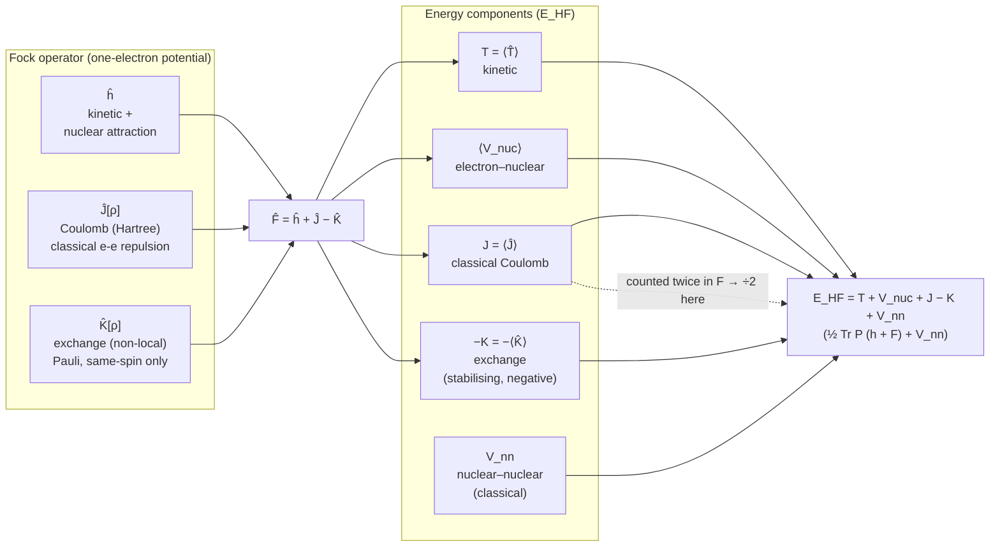
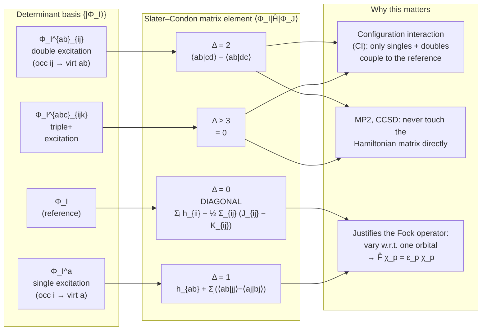
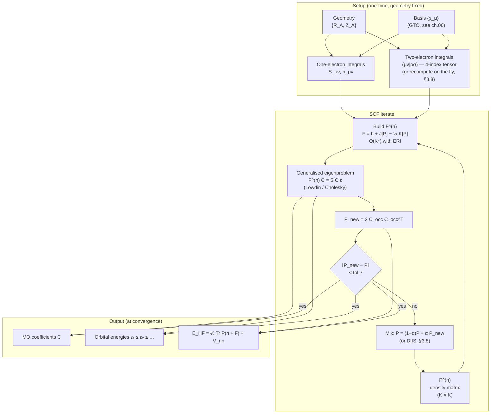
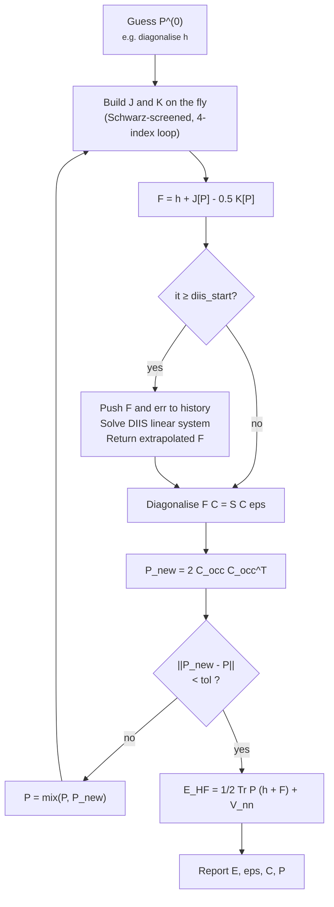
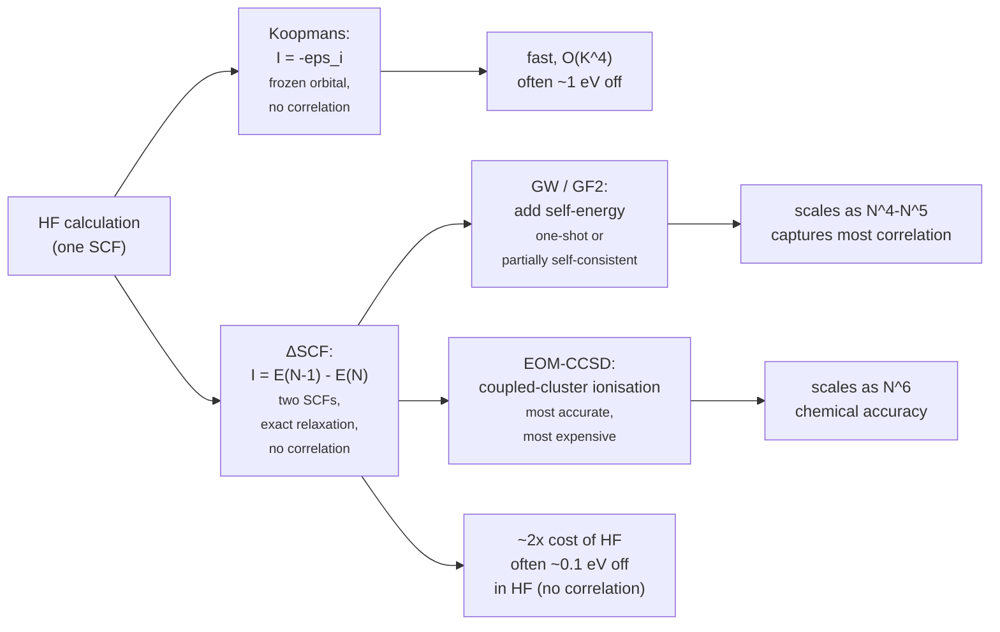

# Chapter 03 — Hartree–Fock

> Hartree–Fock is not a particularly good theory of electronic
> structure. It is, however, the theory that defines the vocabulary
> every later method is forced to speak.

The Hartree–Fock (HF) approximation is the cornerstone of
electronic-structure theory.  It is the simplest wavefunction-based
method that respects the Pauli principle exactly, and it installs
the working vocabulary — *orbital, Fock operator, self-consistent
field, density matrix, Slater–Condon rules* — that every later
theory (post-HF, Kohn–Sham DFT with hybrid functionals,
multireference methods, embedding) borrows verbatim.  This
chapter builds HF from the variational principle down to the
working algorithm that runs in every production quantum-chemistry
code.

By the end of this chapter you should be able to:

- State the variational principle and the single-determinant
  Ansatz, and write down the Fock eigenvalue equation.
- Derive the **Roothaan–Hall** matrix equation $\mathbf F \mathbf
  C = \mathbf S \mathbf C \boldsymbol\varepsilon$ from the Fock
  operator expanded in a finite (in general non-orthogonal) basis.
- Set up the **unrestricted (Pople–Nesbet)** equations for an
  open-shell system, and identify where spin contamination enters.
- Distinguish **direct** from **conventional** SCF, and explain
  why the **DIIS** extrapolation is what every code actually does.
- State **Koopmans' theorem**, derive it from the HF energy
  expression, and list the physical effects that cause it to fail.

We rely on the notation and conventions established in
[chapter 01]({{ "/dft-notes/chapter-01/" | relative_url }})
(second quantisation, spin-orbitals, Slater determinants) and
[chapter 02]({{ "/dft-notes/chapter-02/" | relative_url }})
(many-body Hamiltonian, Slater–Condon rules in summary).  We will
re-use the basis-set technology of
[chapter 06]({{ "/dft-notes/chapter-06/" | relative_url }}) — the
worked example there, $\mathrm{H_2}$ in STO-3G, is the numerical
anchor for section 3.6 below.

## 3.1 The variational principle

The first Hohenberg–Kohn theorem (which we'll meet properly in
[chapter 04]({{ "/dft-notes/chapter-04/" | relative_url }})) is the
**variational principle**: for any normalised trial wavefunction
$\tilde\Psi$,

\begin{equation}
\label{eq:ch-03-variational}
E_0 \;\le\; \langle \tilde\Psi \rvert \hat H \rvert \tilde\Psi \rangle .
\end{equation}

The Hamiltonian $\hat H$ is the *exact* electronic Hamiltonian in
the Born–Oppenheimer approximation
([chapter 02]({{ "/dft-notes/chapter-02/" | relative_url }}),
eq. 2.1) and $E_0$ is its exact ground-state energy.  The
inequality is sharp: equality holds only if $\tilde\Psi$ is the
exact ground state.  In practical calculations we never *have* the
exact ground state; we have a *parametrised family* of trial
wavefunctions and we minimise the energy over the parameters.  The
*quality* of the result is governed entirely by the flexibility
of that family.

Hartree–Fock is the **best single-determinant** Ansatz.  We pick
the Slater determinant
([chapter 01]({{ "/dft-notes/chapter-01/" | relative_url }}))
that minimises the energy over the manifold of all Slater
determinants built from $N$ orthonormal spin-orbitals:

\begin{equation}
\label{eq:ch-03-hf-min}
E_\text{HF} \;\equiv\; \min_{\{\chi_p\}} \langle \Phi \rvert \hat H \rvert \Phi \rangle .
\end{equation}

The minimum is the **Hartree–Fock energy** $E_\text{HF}$; the
determinant that achieves it is the **HF wavefunction**
$\Psi_\text{HF}$.  In what follows we work in atomic units
($\hbar = m_e = e^2 = 1$); all energies are therefore in Hartree.

> **Tip.**  The variational principle is what makes HF a *useful*
> approximation.  Even though the single-determinant Ansatz is
> qualitatively wrong for almost every interesting system (the
> exact wavefunction is not a single determinant for any
> multi-electron system — see
> [chapter 02]({{ "/dft-notes/chapter-02/" | relative_url }})), the
> variational theorem guarantees that $E_\text{HF}$ is an *upper
> boun`d*' on $E_0$.  This converts a vague "the Fock operator
> seems reasonable" into a quantitative, improvable statement.

## 3.2 The Fock operator

The variation of $\langle \Phi \rvert \hat H \rvert \Phi \rangle$
with respect to the spin-orbitals — subject to the orthonormality
constraint $\langle \chi_p \rvert \chi_q \rangle = \delta_{pq}$ —
gives a one-electron eigenvalue equation.  In the spin-orbital
basis $\{\chi_p\}$ it reads

\begin{equation}
\label{eq:ch-03-fock-eigenvalue}
\hat F \, \chi_p \;=\; \varepsilon_p \, \chi_p ,
\end{equation}

with the **Fock operator**

\begin{equation}
\label{eq:ch-03-fock-operator}
\hat F \;=\; \hat h + \hat J[\rho] - \hat K[\rho] .
\end{equation}

The three terms are:

- $\hat h = -\tfrac{1}{2} \nabla^2 + \hat v_\text{ext}$ is the
  one-electron part — kinetic energy plus the external potential
  (electron–nuclear attraction in molecules, lattice potential in
  solids).  In the Born–Oppenheimer picture the nuclei are
  classical point charges at fixed positions
  $\{\mathbf R_A\}$ and
  $\hat v_\text{ext}(\mathbf r) = -\sum_A Z_A / |\mathbf r - \mathbf R_A|$.

- $\hat J[\rho]$ is the **Coulomb** (or **Hartree**) operator,
  defined by its action on an arbitrary spin-orbital $\chi$:

  \begin{equation}
  \label{eq:ch-03-coulomb}
  \Bigl(\hat J[\rho]\, \chi\Bigr)(\mathbf x)
  \;=\;
  \int \frac{\rho(\mathbf x')}{|\mathbf r - \mathbf r'|}\, \chi(\mathbf x)\, d\mathbf x' ,
  \end{equation}

  with the **single-particle density**
  $\rho(\mathbf x) = \sum_{p \in \text{occ}} |\chi_p(\mathbf x)|^2$.
  This is just the classical electrostatic potential generated by
  the electron cloud, applied to $\chi$.

- $\hat K[\rho]$ is the **exchange** operator, again defined by
  its action:

  \begin{equation}
  \label{eq:ch-03-exchange}
  \Bigl(\hat K[\rho]\, \chi_p\Bigr)(\mathbf x)
  \;=\;
  \sum_{q \in \text{occ}} \chi_q(\mathbf x)
  \int \frac{\chi_q^*(\mathbf x')\, \chi_p(\mathbf x')}{|\mathbf r - \mathbf r'|}\, d\mathbf x' .
  \end{equation}

  The "non-local" integration over $\mathbf x'$ — the prime —
  makes $\hat K$ a *non-local* operator: to compute
  $(\hat K \chi_p)(\mathbf r)$ you need the value of $\chi_p$ at
  *every other point in space*.  This is the origin of both the
  computational cost of HF (the $\mathcal{O}(K^4)$ two-electron
  integrals) and the conceptual bridge to DFT, where the
  *exchange–correlation hole* of KS-DFT
  ([chapter 05]({{ "/dft-notes/chapter-05/" | relative_url }}))
  plays the role of the non-locality of $\hat K$.

The minus sign in \eqref{eq:ch-03-fock-operator} is convention:
the exchange operator $\hat K$ is defined *positively* in
\eqref{eq:ch-03-exchange}, but it appears in the Fock operator
with a minus sign so that the *exchange energy* is negative (an
attractive, stabilising effect — the exchange "hole" excludes
same-spin electrons from each other's neighbourhood, lowering
their mutual Coulomb repulsion).

> **Tip.**  The exchange operator $\hat K$ is *non-local*.  The
> local approximation of this non-locality is what gives us
> **local-density approximation (LDA)** in DFT
> ([chapter 05]({{ "/dft-notes/chapter-05/" | relative_url }})).
> The exact exchange of HF and the *approximate* exchange of LDA
> differ by the way the non-locality is handled, and that
> difference — not the correlation functional — is responsible for
> most of the observable gap between hybrid and pure DFT.

The HF energy can be written either as a sum over the orbital
energies

\begin{equation}
\label{eq:ch-03-hf-energy-sum}
E_\text{HF} \;=\; \sum_{p \in \text{occ}} \varepsilon_p \;-\; \langle \Phi \rvert \hat V_{ee} \rvert \Phi \rangle ,
\end{equation}

(the "sum of orbital energies double-counts the electron–electron
repulsion, which is why we subtract the average $\langle \hat
V_{ee} \rangle$"), or, in the more useful form for the
self-consistent field iteration below,

\begin{equation}
\label{eq:ch-03-hf-energy-dm}
E_\text{HF} \;=\; \frac{1}{2} \sum_{\mu\nu} P_{\nu\mu} \Bigl( h_{\mu\nu} + F_{\mu\nu} \Bigr)
\;+\; V_\text{nn} ,
\end{equation}

with $V_\text{nn}$ the classical nuclear–nuclear repulsion.  The
half-trace form \eqref{eq:ch-03-hf-energy-dm} is what we evaluate
at every SCF step.

### 3.2.1 Mermaid — the Fock matrix and the energy components

The Fock operator $\hat F = \hat h + \hat J - \hat K$ is the
*potential* that each orbital feels; the **energy** is a
different functional of the same ingredients, with a factor of
$\tfrac{1}{2}$ to correct the double counting of
electron–electron repulsion. The diagram below pairs the
Fock-matrix terms on the left with the energy components on
the right.



Two things to notice:

- The Coulomb energy $J$ appears *with a factor of one* in the
  energy expression but the Fock matrix contains the *full*
  $J$. The factor of $\tfrac{1}{2}$ in the energy trace formula
  compensates for the fact that $\hat J$ acts on the *same*
  electron density that built it — every electron–electron pair
  is counted twice in $\mathbf J$ and the half undoes that.
- The exchange term enters the Fock matrix with a *minus* sign
  ($\hat F = \hat h + \hat J - \hat K$) but appears with a
  *minus* sign in the energy too, so the energy contribution is
  $-K < 0$ — the exchange energy is *attractive* (it lowers
  the total energy relative to the classical Coulomb picture).
  This sign convention is the source of almost every confusion
  about HF energies; the diagram encodes the convention once
  and for all.

## 3.3 The self-consistent field

The Fock operator depends on the orbitals (through the density),
and the orbitals are eigenfunctions of the Fock operator.  We
resolve the circularity by **iteration**:

1. Start from a guess for the density $\rho^{(0)}$.  In practice
   this is built from the eigenfunctions of the core Hamiltonian
   $\hat h$ alone — i.e. a superposition-of-atoms guess — or from
   an extended Hückel calculation, or from the density of a
   previous calculation on a similar geometry.
2. Build the Fock matrix $F^{(n)}$ from $\rho^{(n)}$.
3. Diagonalise $F^{(n)}$ to get new orbitals and a new density
   $\rho^{(n+1)}$.
4. Mix $\rho^{(n)}$ and $\rho^{(n+1)}$ for numerical stability.
5. Check convergence.  If not converged, go to step 2. A minimal SCF loop in Python (using a pre-built one-electron
Hamiltonian and two-electron integrals):

```python
import numpy as np

def scf_loop(H_core, eri, S, n_elec, max_iter=100, tol=1e-8, mixing=0.3):
    """Restricted HF SCF in a non-orthogonal AO basis.

    H_core : (K, K)  one-electron Hamiltonian in the AO basis
    eri    : (K, K, K, K) two-electron integrals (physicists' notation)
    S      : (K, K)  overlap matrix
    n_elec : int      number of electrons
    """
    K = H_core.shape[0]
    # Initial guess: diagonalise the core Hamiltonian
    evals, C = np.linalg.eigh(H_core, S)
    P = 2 * C[:, : n_elec // 2] @ C[:, : n_elec // 2].T

    for it in range(max_iter):
        # Build the Fock matrix
        J = np.einsum("pqrs,rs->pq", eri, P)
        K = np.einsum("prqs,rs->pq", eri, P)
        F = H_core + J - 0.5 * K

        # Transform to the orthogonal basis and diagonalise
        evals, C = np.linalg.eigh(F, S)

        # New density
        P_new = 2 * C[:, : n_elec // 2] @ C[:, : n_elec // 2].T

        # Check convergence and mix
        dP = np.linalg.norm(P_new - P)
        P  = (1 - mixing) * P + mixing * P_new
        if dP < tol:
            print(f"  Converged in {it + 1} iterations (dP = {dP:.2e})")
            break
    else:
        print(f"  WARNING: SCF did not converge in {max_iter} iterations")

    E_elec = 0.5 * np.trace(P @ (H_core + F))
    return E_elec, evals, C, P
```

The call `np.einsum' is doing what a real quantum-chemistry code
does in its innermost loop.  In production, the ERI tensor is
recomputed on the fly and never stored; this is the *direct SCF*
trick we will examine in section 3.8. > **Warning.**  Plain density mixing is enough for stable
> closed-shell molecules.  Open-shell, near-degenerate, or
> metallic systems need **level-shifting**, **DIIS** (direct
> inversion in the iterative subspace), or both.  Adding DIIS to
> the snippet above is a 20-line exercise and a real rite of
> passage — section 3.8 does exactly that.

## 3.4 The Slater–Condon rules

The matrix elements of $\hat H$ between two Slater determinants
$\lvert \Phi_I \rangle$ and $\lvert \Phi_J \rangle$ are given by
the **Slater–Condon rules**.  For our purposes the only cases we
need are:

| Case                                                  | $\langle \Phi_I \rvert \hat H \rvert \Phi_J \rangle$                                |
|:------------------------------------------------------|:-------------------------------------------------------------------------------------|
| $I = J$                                               | $\sum_i h_{ii} + \frac{1}{2} \sum_{ij} (J_{ij} - K_{ij})$                             |
| $I$, $J$ differ by a single spin-orbital              | $h_{ab} + \sum_j ( \langle ab \rvert jj \rangle - \langle aj \rvert bj \rangle )$    |
| $I$, $J$ differ by two spin-orbitals                  | $\langle ab \rvert cd \rangle - \langle ab \rvert dc \rangle$                        |
| $I$, $J$ differ by three or more spin-orbitals        | 0                                                                                    |

These are the rules that make quantum-chemistry codes possible.
They say the Hamiltonian is a **2-body** operator in second
quantisation, and its matrix in the determinant basis is
**sparse enough** to be handled by iterative methods.  The
Slater–Condon rules are also what justifies the Fock operator:
varying $\langle \Phi \rvert \hat H \rvert \Phi \rangle$ with
respect to a single spin-orbital uses the "$I = J$" and "single
excitation" rules, and the resulting first-order condition is
precisely $\hat F \chi_p = \varepsilon_p \chi_p$.

> **Note.**  The matrix elements above are written in the *MO
> basis*: $h_{ii} = \langle \phi_i \rvert \hat h \rvert \phi_i
> \rangle$ etc.  In the next section we will need the *AO-basis*
> counterparts, $h_{\mu\nu}$, $J_{\mu\nu}$, $K_{\mu\nu}$ and the
> ERI tensor $(\mu\nu \rvert \rho\sigma)$ — same object, different
> basis.  The Slater–Condon rules work in any orthonormal basis;
> the AO basis is not orthonormal, but the Fock operator is the
> same differential operator regardless.

### 3.4.1 Mermaid — the Slater–Condon rules as a matrix

The Slater–Condon rules are best read as a recipe for filling in
the *Hamiltonian matrix* in the basis of Slater determinants.
The determinant basis is enormous (combinatorial in the number
of spin-orbitals), but the matrix is *extremely* sparse: most
entries are zero, and the non-zero entries fall into three
classes. The diagram below makes that sparsity structure
explicit.



The determinant basis is the *first-quantise`d*' language in which
post-HF methods (CI, MP2, CC, EOM-CC) are written; the
Slater–Condon rules are the *only* property of the Hamiltonian
that makes these methods tractable. The "Δ = 0" and "Δ = 1"
boxes, taken together, are what the Fock operator encapsulates:
the first-order variation of the HF energy w.r.t. a single
orbital uses exactly the diagonal (I = J) and single-excitation
(I differs by one orbital) rules, and the result is
$\hat F \chi_p = \varepsilon_p \chi_p$.

## 3.5 What Hartree–Fock gets wrong

The difference between the exact energy and the HF energy is the
**correlation energy**:

\begin{equation}
\label{eq:ch-03-correlation}
E_\text{corr} \;\equiv\; E_\text{exact} \;-\; E_\text{HF} .
\end{equation}

A useful operational definition: HF is exact for any one-electron
system and wrong for any multi-electron system.  The error is, in
some sense, *the price of being a single determinant*.  Typical
magnitudes:

| System class                             | $E_\text{corr}$ (Hartree/electron)        |
|:-----------------------------------------|:------------------------------------------|
| He atom                                  | $\sim 0.04$                               |
| Ne atom                                  | $\sim 0.32$                               |
| H$_2$O molecule                          | $\sim 0.30$ (total $\sim 0.9$)             |
| Benzene                                  | $\sim 0.4$ (per C)                        |
| A transition-metal complex               | $\sim 1$–$3$ (per atom, depending on state) |

> **Note.**  These are *absolute* errors, not per-cent.  The HF
> energy is roughly $-100$ Hartree for a small organic molecule,
> and the correlation correction is roughly $+1$ Hartree.
> Chemists care about *energy differences* — reaction energies,
> barrier heights, binding energies — and these are often on the
> order of milli-Hartree, so a one-Hartree absolute error is
> utterly unacceptable for chemistry and utterly fine for
> solid-state physics.  The two communities measure success
> differently.

It is important to separate two distinct errors hidden in
\eqref{eq:ch-03-correlation}:

- **Basis-set incompleteness error (BSIE).**  Even with the exact
  many-body wavefunction, a finite basis gives an energy above
  $E_\text{exact}$.  This is the error controlled by the basis
  set ([chapter 06]({{ "/dft-notes/chapter-06/" | relative_url }})).
- **Method error.**  The method itself (single-determinant HF)
  cannot represent the exact wavefunction of a multi-electron
  system.  This is the error controlled by going to
  configuration interaction, coupled cluster, MP$n$, or — for
  many practical purposes — a good density functional
  ([chapter 05]({{ "/dft-notes/chapter-05/" | relative_url }})).

A useful sanity check on any electronic-structure calculation is
to verify that *bot`h*' errors are small.  Reporting a "DFT energy
of $-76.432$ Hartree" without naming the basis and the functional
is like reporting "the price is 100" without naming the currency.

## 3.6 The Roothaan–Hall equations in a Gaussian basis

Section 3.3 left the Fock equation as the *differential* eigenvalue
problem $\hat F \phi_i = \varepsilon_i \phi_i$.  In this section we
turn it into the *matrix* eigenvalue problem
$\mathbf F \mathbf C = \mathbf S \mathbf C \boldsymbol\varepsilon$
that a computer actually solves.  The bridge is a finite,
atom-centred basis of Gaussian-type orbitals (GTOs); the
technology is in
[chapter 06]({{ "/dft-notes/chapter-06/" | relative_url }}).  Here
we focus on what the Fock operator *does* once the basis is fixed.

### 3.6.1 The claim

For a **closed-shell** molecule (all orbitals doubly occupied, $N$
electrons, $N/2$ spatial orbitals), expand each spatial orbital in
the same $K$ basis functions $\{\chi_\mu\}_{\mu=1}^K$,

\begin{equation}
\label{eq:ch-03-mo-expansion}
\phi_i(\mathbf r) \;=\; \sum_{\mu=1}^{K} C_{\mu i}\, \chi_\mu(\mathbf r) ,
\qquad i = 1, \dots, N/2 .
\end{equation}

The Fock eigenvalue equation
$\hat F \phi_i = \varepsilon_i \phi_i$ becomes the
**Roothaan–Hall** matrix equation

\begin{equation}
\label{eq:ch-03-roothaan-hall}
\mathbf F\, \mathbf C \;=\; \mathbf S\, \mathbf C\, \boldsymbol\varepsilon ,
\end{equation}

where $\mathbf F$, $\mathbf S$, $\mathbf C$ are $K \times K$
matrices and $\boldsymbol\varepsilon$ is the diagonal matrix of
orbital energies.  The matrix elements are

\begin{equation}
\label{eq:ch-03-fock-overlap-ao}
F_{\mu\nu} \;=\; \langle \chi_\mu \rvert \hat F \rvert \chi_\nu \rangle ,
\qquad
S_{\mu\nu} \;=\; \langle \chi_\mu \rvert \chi_\nu \rangle .
\end{equation}

This is the **generalised eigenvalue problem** (GEP) — a standard
GEP in numerical linear algebra, solved by
`scipy.linalg.eigh(F, S)' or any equivalent LAPACK routine.

### 3.6.2 Derivation

**Step 1.**  Substitute \eqref{eq:ch-03-mo-expansion} into the
Fock eigenvalue equation:

$$
\hat F \sum_{\mu=1}^{K} C_{\mu i}\, \chi_\mu
\;=\; \varepsilon_i \sum_{\mu=1}^{K} C_{\mu i}\, \chi_\mu .
$$

**Step 2.**  Project both sides on $\chi_\nu$ by multiplying with
$\chi_\nu^*(\mathbf r)$ and integrating over $\mathbf r \in
\mathbb{R}^3$:

$$
\sum_{\mu=1}^{K} C_{\mu i}\, \langle \chi_\nu \rvert \hat F \rvert \chi_\mu \rangle
\;=\; \varepsilon_i \sum_{\mu=1}^{K} C_{\mu i}\, \langle \chi_\nu \rvert \chi_\mu \rangle .
$$

**Step 3.**  Define the matrix elements

\begin{equation}
F_{\nu\mu} \;\equiv\; \langle \chi_\nu \rvert \hat F \rvert \chi_\mu \rangle ,
\label{eq:ch-03-F-def}
\end{equation}
\begin{equation}
S_{\nu\mu} \;\equiv\; \langle \chi_\nu \rvert \chi_\mu \rangle .
\label{eq:ch-03-S-def}
\end{equation}

The projected equation becomes

\begin{equation}
\label{eq:ch-03-roothaan-column}
\sum_{\mu=1}^{K} F_{\nu\mu}\, C_{\mu i} \;=\; \varepsilon_i \sum_{\mu=1}^{K} S_{\nu\mu}\, C_{\mu i} .
\end{equation}

**Step 4.**  This is the $i$-th *column* of a matrix equation.
For each value of $\nu = 1, \dots, K$, \eqref{eq:ch-03-roothaan-column}
is one linear equation in the $K$ unknowns $\{C_{\mu i}\}_{\mu=1}^K$.
Stacking all $K$ values of $\nu$ into a $K \times K$ matrix
equation for a single orbital $i$ gives

$$
\mathbf F \mathbf c_i \;=\; \varepsilon_i\, \mathbf S \mathbf c_i .
$$

**Step 5.**  Collect all $K$ molecular orbitals (the $K$ roots
$\varepsilon_i$ and the $K$ coefficient vectors $\mathbf c_i$)
into a single $K \times K$ matrix equation.  The orbital energies
become the diagonal entries of $\boldsymbol\varepsilon = \text{diag}
(\varepsilon_1, \dots, \varepsilon_K)$, and the coefficient
vectors become the columns of $\mathbf C$:

$$
\mathbf F\, \mathbf C \;=\; \mathbf S\, \mathbf C\, \boldsymbol\varepsilon .
$$

This is the Roothaan equation
\eqref{eq:ch-03-roothaan-hall}.  $\quad\blacksquare$

> **Tip.**  The basis is in general **non-orthogonal**, so the
> right-hand side carries $\mathbf S$ — the
> orthonormal $\hat F \phi_i = \varepsilon_i \phi_i$ has no
> $\mathbf S$.  This is not a mistake; it is the price of choosing
> a basis adapted to the *physics* (atom-centred Gaussians look
> like atomic orbitals) rather than to the *mat`h*' (an orthonormal
> basis is mathematically clean but physically unmotivated).  In
> a basis where $\mathbf S = \mathbf I$ (e.g. a Löwdin-
> orthogonalised basis, $\mathbf X = \mathbf S^{-1/2}$, see
> below), the GEP collapses to the standard Hermitian eigenvalue
> problem $\mathbf F' \mathbf C' = \mathbf C' \boldsymbol\varepsilon$
> with $\mathbf F' = \mathbf X^\dagger \mathbf F \mathbf X$.

### 3.6.3 The Fock matrix in the AO basis

Equation \eqref{eq:ch-03-F-def} is the *definition* of $\mathbf F$
in the AO basis.  The content is in writing $F_{\mu\nu}$ in terms
of *one-electron* and two-electron integrals, both of which are
routinely computed by Gaussian integral codes.  Substituting
\eqref{eq:ch-03-fock-operator}:

\begin{align}
F_{\mu\nu}
&\;=\; \langle \chi_\mu \rvert \hat h + \hat J[\rho] - \hat K[\rho] \rvert \chi_\nu \rangle
\notag \\\
&\;=\; \underbrace{\langle \chi_\mu \rvert \hat h \rvert \chi_\nu \rangle}_{h_{\mu\nu}}
\;+\; \underbrace{\langle \chi_\mu \rvert \hat J[\rho] \rvert \chi_\nu \rangle}_{J_{\mu\nu}}
\;-\; \underbrace{\langle \chi_\mu \rvert \hat K[\rho] \rvert \chi_\nu \rangle}_{K_{\mu\nu}} .
\label{eq:ch-03-F-decomp}
\end{align}

**One-electron part.**  The core-Hamiltonian matrix
$\mathbf h$ contains the kinetic energy and the
electron–nuclear attraction:

\begin{equation}
\label{eq:ch-03-h-core}
h_{\mu\nu} \;=\; \langle \chi_\mu \rvert -\tfrac{1}{2}\nabla^2 \rvert \chi_\nu \rangle
\;-\; \sum_{A} Z_A \int \frac{\chi_\mu^*(\mathbf r)\, \chi_\nu(\mathbf r)}{|\mathbf r - \mathbf R_A|}\, d\mathbf r .
\end{equation}

These are the standard *one-electron integrals*; for GTOs the
kinetic part is a sum of overlap-like integrals and the
nuclear-attraction part is a Boys-function evaluation
([chapter 06]({{ "/dft-notes/chapter-06/" | relative_url }}),
eq. 6.27–6.28).

**Two-electron part — Coulomb.**  Inserting the definition
\eqref{eq:ch-03-coulomb} of $\hat J$:

\begin{align}
J_{\mu\nu}
&\;=\; \int \!\!\!\int
\chi_\mu^*(\mathbf r_1)\, \chi_\nu(\mathbf r_1)\,
\frac{\rho(\mathbf r_2)}{|\mathbf r_1 - \mathbf r_2|}\,
d\mathbf r_1\, d\mathbf r_2
\notag \\\
&\;=\; \sum_{\rho\sigma} P_{\rho\sigma}
\underbrace{\int\!\!\!\int
\chi_\mu^*(\mathbf r_1)\, \chi_\nu(\mathbf r_1)\,
\frac{\chi_\rho^*(\mathbf r_2)\, \chi_\sigma(\mathbf r_2)}{|\mathbf r_1 - \mathbf r_2|}\,
d\mathbf r_1\, d\mathbf r_2}_{(\mu\nu \rvert \rho\sigma)} .
\label{eq:ch-03-J}
\end{align}

Here we have introduced the **AO density matrix** in the closed-
shell case,

\begin{equation}
\label{eq:ch-03-P-closed}
P_{\rho\sigma} \;=\; 2 \sum_{i \in \text{occ}} C_{\rho i}\, C_{\sigma i}^* ,
\end{equation}

and the **electron-repulsion integral (ERI)** in *chemists'*
notation,

\begin{equation}
\label{eq:ch-03-eri-chemists}
(\mu\nu \rvert \rho\sigma) \;=\; \int\!\!\!\int
\chi_\mu^*(\mathbf r_1)\, \chi_\nu(\mathbf r_1)\,
\frac{1}{r_{12}}\,
\chi_\rho^*(\mathbf r_2)\, \chi_\sigma(\mathbf r_2)\,
d\mathbf r_1\, d\mathbf r_2 .
\end{equation}

Note the order of the indices: $(\mu\nu \rvert \rho\sigma)$ is
symmetric under $\mu \leftrightarrow \nu$, symmetric under
$\rho \leftrightarrow \sigma$, and satisfies
$(\mu\nu \rvert \rho\sigma) = (\rho\sigma \rvert \mu\nu)^*$.
For real basis functions all four symmetries reduce to a single
statement of *8-fol`d*' permutational symmetry:

\begin{equation}
\label{eq:ch-03-eri-symm}
(\mu\nu \rvert \rho\sigma)
\;=\; (\nu\mu \rvert \rho\sigma)
\;=\; (\mu\nu \rvert \sigma\rho)
\;=\; (\rho\sigma \rvert \mu\nu)
\;=\; \cdots \quad (8 \text{ distinct orderings}) .
\end{equation}

The 8-fold symmetry is what every ERI code exploits: only
$\sim K^4 / 8$ unique integrals are stored or computed.

**Two-electron part — exchange.**  Inserting
\eqref{eq:ch-03-exchange}:

\begin{align}
K_{\mu\nu}
&\;=\; \sum_{\rho\sigma} P_{\rho\sigma}
\underbrace{\int\!\!\!\int
\chi_\mu^*(\mathbf r_1)\, \chi_\sigma(\mathbf r_1)\,
\frac{1}{r_{12}}\,
\chi_\rho^*(\mathbf r_2)\, \chi_\nu(\mathbf r_2)\,
d\mathbf r_1\, d\mathbf r_2}_{(\mu\sigma \rvert \rho\nu)} .
\label{eq:ch-03-K}
\end{align}

This has *one* $\mu$/$\nu$ index that crossed over to the other
side of the kernel: in chemists' notation it is
$(\mu\sigma \rvert \rho\nu)$, not $(\mu\nu \rvert \rho\sigma)$.
The crossed indices are what make $K_{\mu\nu}$ non-trivially
different from $J_{\mu\nu}$, and what makes HF qualitatively
different from a mean-field theory with only a local potential.

**Putting it together.**  Substituting \eqref{eq:ch-03-J} and
\eqref{eq:ch-03-K} into \eqref{eq:ch-03-F-decomp}:

\begin{equation}
\label{eq:ch-03-F-ao}
F_{\mu\nu} \;=\; h_{\mu\nu} \;+\; \sum_{\rho\sigma} P_{\rho\sigma}
\Bigl[ (\mu\nu \rvert \rho\sigma) \;-\; \tfrac{1}{2}\, (\mu\sigma \rvert \rho\nu) \Bigr] .
\end{equation}

The factor $\tfrac{1}{2}$ in front of exchange comes from the
closed-shell spin summation: each spatial orbital is doubly
occupied, and the exchange integral in spin-orbital form picks up
a factor of $\tfrac{1}{2}$ when summed over the spin-free ERIs.

> **Note.**  Equation \eqref{eq:ch-03-F-ao} is the *workhorse*
> formula of computational HF.  Every SCF step boils down to:
> (i) compute $h_{\mu\nu}$ once at the start of the calculation
> (it depends only on the geometry and basis), (ii) build the ERI
> tensor $(\mu\nu \rvert \rho\sigma)$ once, and (iii) at every
> SCF iteration form the two-electron part of $\mathbf F$ by
> contracting $\mathbf P$ with the ERI tensor as in
> \eqref{eq:ch-03-F-ao}.  Section 3.8 below makes this
> algorithmic and explains when (ii) is too expensive to be done
> once.

### 3.6.4 The density matrix in the AO basis

The closed-shell density matrix $\mathbf P$ is a $K \times K$
Hermitian, positive-semidefinite matrix.  It plays three
conceptually distinct roles in the Roothaan–Hall formalism:

1. **Container of the occupied subspace.**  Projected onto the
   occupied MO subspace, $\mathbf P$ is the identity:

   \begin{equation}
   \label{eq:ch-03-P-id}
   \mathbf C_\text{occ}^\dagger\, \mathbf S\, \mathbf C_\text{occ} \;=\; \mathbf I_{N/2} .
   \end{equation}

   The full $\mathbf P$ therefore satisfies
   $\mathbf S \mathbf P \mathbf S = \mathbf S \mathbf P$, i.e.
   $\mathbf P$ is an $\mathbf S$-idempotent: $\mathbf P \mathbf S
   \mathbf P = \mathbf P$.

2. **Source of the Fock matrix.**  Equation
   \eqref{eq:ch-03-F-ao} shows that the two-electron part of
   $\mathbf F$ is a *linear* function of $\mathbf P$.  The fixed-
   point of the SCF is the $\mathbf P$ that is consistent with
   its own Fock matrix.

3. **Direct representation of the one-particle density.**  The
   electron density in real space is

   \begin{equation}
   \label{eq:ch-03-rho-from-P}
   \rho(\mathbf r) \;=\; \sum_{\mu\nu} P_{\nu\mu}\, \chi_\mu^*(\mathbf r)\, \chi_\nu(\mathbf r) .
   \end{equation}

   This is the form of $\rho$ that enters the Coulomb potential
   in the Fock operator.

The idempotency $\mathbf P \mathbf S \mathbf P = \mathbf P$ is
preserved at every SCF iteration; it is what makes the procedure
"single-particle": $\mathbf P$ is a projector onto a $K$-dimensional
subspace of the full Hilbert space, namely the occupied subspace.
Post-HF methods relax this idempotency and the resulting
"generalised density matrix" is no longer idempotent — that
relaxation is the algebraic signature of correlation.

### 3.6.5 The SCF iteration in the AO basis

Putting the pieces together, the **closed-shell SCF in the AO
basis** is the following fixed-point iteration.  We have as input:

- the geometry $\{\mathbf R_A, Z_A\}$,
- the basis $\{\chi_\mu\}_{\mu=1}^K$ (atom-centred GTOs, see
  [chapter 06]({{ "/dft-notes/chapter-06/" | relative_url }})),
- the one-electron integrals $S_{\mu\nu}$, $h_{\mu\nu}$,
- the ERI tensor $(\mu\nu \rvert \rho\sigma)$ (or the means to
  recompute it, see section 3.8).

The output is the HF energy $E_\text{HF}$ and the MO coefficients
$\mathbf C$.  The algorithm:

1. **Initial guess.**  Build the *core-Hamiltonian guess*:
   diagonalise $\mathbf h \mathbf c = \mathbf S \mathbf c
   \varepsilon$ and set

   \begin{equation}
   \label{eq:ch-03-P-initial}
   P_{\mu\nu}^{(0)} \;=\; 2 \sum_{i=1}^{N/2} c_{\mu i}\, c_{\nu i}^* .
   \end{equation}

   For difficult cases (transition metals, near-degeneracies) the
   guess may come from a previous calculation, an extended
   Hückel model, or a fragment-density superposition.

2. **Build the Fock matrix.**  Use \eqref{eq:ch-03-F-ao}:

   \begin{equation}
   \label{eq:ch-03-F-build}
   F_{\mu\nu}^{(n)}
   \;=\; h_{\mu\nu} \;+\; G_{\mu\nu}[\mathbf P^{(n)}] ,
   \end{equation}

   where the **two-electron part** is

   \begin{equation}
   \label{eq:ch-03-G-build}
   G_{\mu\nu}[\mathbf P]
   \;=\; \sum_{\rho\sigma} P_{\rho\sigma}
   \Bigl[ (\mu\nu \rvert \rho\sigma) \;-\; \tfrac{1}{2}\, (\mu\sigma \rvert \rho\nu) \Bigr] .
   \end{equation}

   In tensor notation with $\mathbf G$ the 4-index ERI and
   $\mathbf P$ the 2-index density,

   \begin{equation}
J_{\mu\nu} \;=\; \text{Tr}\Bigl[\mathbf P\, (\mu\nu \rvert \cdot\cdot) \Bigr] ,
   \label{eq:ch-03-J-tr}
\end{equation}
\begin{equation}
K_{\mu\nu} \;=\; \text{Tr}\Bigl[\mathbf P\, (\mu\cdot \rvert \nu\cdot) \Bigr] .
   \label{eq:ch-03-K-tr}
\end{equation}

   In `numpy`, both are `einsum`s — see the snippet in
   section 3.3.

3. **Solve the GEP.**  Diagonalise
   $\mathbf F^{(n)} \mathbf C = \mathbf S \mathbf C
   \boldsymbol\varepsilon$.  The eigenvalues
   $\varepsilon_1 \le \varepsilon_2 \le \cdots \le \varepsilon_K$
   are ordered; the lowest $N/2$ are the occupied orbital
   energies.

4. **Build the new density matrix.**  With the lowest $N/2$
   columns of $\mathbf C$,

   \begin{equation}
   \label{eq:ch-03-P-update}
   P_{\mu\nu}^{(n+1)} \;=\; 2 \sum_{i=1}^{N/2} C_{\mu i}\, C_{\nu i}^* .
   \end{equation}

   In matrix form, $\mathbf P^{(n+1)} = 2\, \mathbf C_\text{occ}\,
   \mathbf C_\text{occ}^\dagger$, where $\mathbf C_\text{occ}$ is
   the $K \times N/2$ block of the lowest eigenvectors.  This
   update is the **Aufbau** of the density: we fill the lowest
   orbitals first.

5. **Mix and check convergence.**  In its simplest form,
   *density mixing*:

   \begin{equation}
   \label{eq:ch-03-mix}
   \mathbf P^{(n+1)} \;\leftarrow\; (1 - \alpha)\, \mathbf P^{(n)} \;+\; \alpha\, \mathbf P^{(n+1, \text{raw})} ,
   \end{equation}

   with $\alpha \in (0, 1)$ (typically 0.3 for closed-shell
   molecules, 0.1 or less for transition metals).  The
   convergence test is on the *unmixe`d*' new density (or on
   $\Delta E$): continue if
   $\|\mathbf P^{(n+1, \text{raw})} - \mathbf P^{(n)}\| > \text{tol}$
   or $|E^{(n+1)} - E^{(n)}| > \text{tol}$.

6. **Compute the energy.**  At convergence, the **HF electronic
   energy** is

   \begin{equation}
   \label{eq:ch-03-E-hf-ao}
   E_\text{el} \;=\; \frac{1}{2}\, \text{Tr}\Bigl[\mathbf P\, (\mathbf h + \mathbf F)\Bigr]
   \;=\; \frac{1}{2} \sum_{\mu\nu} P_{\nu\mu}\, (h_{\mu\nu} + F_{\mu\nu}) .
   \end{equation}

   The **total HF energy** is
   $E_\text{HF} = E_\text{el} + V_\text{nn}$, with
   $V_\text{nn} = \sum_{A < B} Z_A Z_B / R_{AB}$ the classical
   nuclear repulsion.

> **Tip.**  An equivalent but sometimes more numerically stable
> form of the energy uses the orbital energies:

$$
E_\text{el} \;=\; \frac{1}{2} \sum_{\mu\nu} P_{\nu\mu} \Bigl( h_{\mu\nu} + F_{\mu\nu} \Bigr)
\;=\; \frac{1}{2} \sum_{i \in \text{occ}} \Bigl( h_{ii} + \varepsilon_i \Bigr) ,
$$

where $h_{ii} = \mathbf c_i^\dagger \mathbf h \mathbf c_i$ and
$\varepsilon_i = \mathbf c_i^\dagger \mathbf F \mathbf c_i$ are
the *MO-basis* matrix elements.  This is just the half-trace of
$\mathbf P (\mathbf h + \mathbf F)$ in disguise.  The two forms
agree to numerical precision at convergence; the half-trace form
is what every code prints because it does not require a final
MO transformation.

### 3.6.5.1 Mermaid — the AO-basis data flow

The SCF algorithm above has six steps, but the *dat`a*' it carries
between steps falls into four categories. The diagram below
arranges the algorithm by *what is moving*, not by when:

- the **atomic-orbital integrals** (one-time setup, geometry-fixed),
- the **density matrix** $\mathbf P$ (the SCF iterate),
- the **Fock matrix** $\mathbf F[\mathbf P]$ (built from $\mathbf P$),
- the **MO coefficients** $\mathbf C$ and orbital energies
  $\boldsymbol\varepsilon$ (output of the generalised eigenproblem).



The diagram makes the *cost-hiding* of HF explicit: every cycle
through the SCF inner loop re-builds $\mathbf F$ from $\mathbf P$
at a cost of $\mathcal O(K^4)$ (the two-electron integral
contraction), and then diagonalises an $K \times K$ matrix at
$\mathcal O(K^3)$. The two costs are in *opposite scaling
regimes*; the crossover between them is exactly what determines
whether a code uses *conventional* SCF (small $K$, store the
ERI) or *direct* SCF (large $K$, recompute the ERI on the fly)
— see §3.8. ### 3.6.6 Orthogonalisation

Equation \eqref{eq:ch-03-roothaan-hall} is a GEP.  The standard
numerical trick is to *symmetrically orthogonalise* the basis.
Define the **Löwdin orthogonaliser** $\mathbf X$ as the
*positive-definite square root* of the inverse overlap,

\begin{equation}
\label{eq:ch-03-X-def}
\mathbf X \;=\; \mathbf S^{-1/2} ,
\end{equation}

so that $\mathbf X^\dagger \mathbf S \mathbf X = \mathbf I$.
Transforming the Fock matrix into the orthogonal basis,

\begin{equation}
\label{eq:ch-03-F-prime}
\mathbf F' \;=\; \mathbf X^\dagger \mathbf F\, \mathbf X ,
\end{equation}

and the eigenvectors back,

\begin{equation}
\label{eq:ch-03-C-prime}
\mathbf C \;=\; \mathbf X \mathbf C' ,
\end{equation}

the GEP \eqref{eq:ch-03-roothaan-hall} becomes the standard
eigenvalue problem

\begin{equation}
\label{eq:ch-03-std-eigen}
\mathbf F'\, \mathbf C' \;=\; \mathbf C'\, \boldsymbol\varepsilon .
\end{equation}

The `eigh(F, S)' LAPACK routine does this internally, with $\mathbf
X$ computed by Cholesky factorisation of $\mathbf S$.  For very
large $\mathbf S$ the cost of forming $\mathbf S^{1/2}$ is
non-negligible and iterative diagonalisation is preferred — this
is the regime of plane-wave DFT
([chapter 06]({{ "/dft-notes/chapter-06/" | relative_url }})
§6.7 and
[chapter 07]({{ "/dft-notes/chapter-07/" | relative_url }})), where
the basis is already orthogonal (a plane wave is orthogonal to
every other plane wave of different $\mathbf G$, up to the
metric-free inner product of $L^2$).

### 3.6.7 Worked anchor: H₂ in STO-3G

The chapter-6 worked example produced the converged H₂ STO-3G HF
energy

$$
E_\text{HF}(\mathrm{H_2}, R=1.4\,a_0) \;=\; -1.1167\,E_h ,
$$

with MO coefficients
$\mathbf C = \begin{smallmatrix} -0.5489 & -1.2115 \\ -0.5489 & +1.2115 \end{smallmatrix}$
and orbital energies
$\boldsymbol\varepsilon = (-0.5782,\, +0.6703)\,E_h$.  The
*implementation* of section 3.6 is exactly the script in
chapter 6 §6.9; the new content here is the *abstraction*
\eqref{eq:ch-03-F-ao} that the script instantiates.  Section 3.8
extends that script with DIIS, and the full worked implementation
appears below.

> **Note.**  The MO energies reported above are *not* the
> physical ionisation energies of H₂; the HOMO energy
> $-0.578\,E_h$ corresponds to an ionisation energy of $+0.578$
> $E_h$ by Koopmans' theorem, but the true ionisation energy of
> H₂ is closer to $+0.594\,E_h$ (the orbital *relaxes* on
> removal of the electron).  This is the topic of section 3.9. ## 3.7 The open-shell case: unrestricted Hartree–Fock

The derivation in section 3.6 assumed a *closed-shell* molecule:
all spatial orbitals doubly occupied, every spatial orbital
carrying both an $\alpha$ and a $\beta$ electron.  This is fine
for most organic molecules in their ground state — it is
*exactly* true for any singlet with an even number of electrons
that can be described by a single determinant.  For everything
else (radicals, doublet cations, open-shell singlets, transition-
metal complexes) we need a more general theory.

The two main open-shell theories are:

- **Restricted open-shell HF (ROHF):** *paire`d*' orbitals for the
  closed-shell core, *unpaire`d*' orbitals for the open-shell
  electrons.  Enforces a definite spin $S$ on the wavefunction.
  The Fock matrix is non-diagonal in the spin-orbital basis, but
  the energy and orbitals are spin-pure.  Implementation is
  somewhat involved; we will not derive it here.
- **Unrestricted HF (UHF),** also called the **Pople–Nesbet**
  equations: *different orbitals for different spins* (DODS).
  Each spin-orbital is a product of a spatial function and a
  fixed spin function ($\alpha$ or $\beta$); the spatial
  functions for $\alpha$ and $\beta$ are *not* required to be the
  same.  Implementation is essentially identical to the closed-
  shell case with a *secon`d*' copy of every variable for the $\beta$
  spin.  The wavefunction is not a spin eigenfunction — that is
  the price.

In what follows we derive UHF.  It is the workhorse open-shell
method in production codes (Gaussian, PSI4, PySCF) and the
starting point for most post-HF open-shell correlation methods.

### 3.7.1 Spin-free formulation

Let $N_\alpha$ and $N_\beta$ be the numbers of $\alpha$-spin and
$\beta$-spin electrons, with $N_\alpha \ge N_\beta$ (the other
case follows by relabelling).  The total $z$-component of spin is
$S_z = (N_\alpha - N_\beta)/2$.  The UHF Ansatz is a single
Slater determinant of $N = N_\alpha + N_\beta$ spin-orbitals

$$
\chi_p(\mathbf x) \;=\;
\begin{cases}
\phi_p^\alpha(\mathbf r)\, \alpha(\sigma) , & p = 1, \dots, N_\alpha , \\
\phi_p^\beta(\mathbf r)\, \beta(\sigma) , & p = N_\alpha + 1, \dots, N .
\end{cases}
$$

The two sets of spatial orbitals $\{\phi_i^\alpha\}$ and
$\{\phi_i^\beta\}$ are, a priori, *unrelate`d*`.  Each set is
expanded in the same AO basis:

\begin{equation}
\phi_i^\alpha(\mathbf r) \;=\; \sum_{\mu=1}^{K} C_{\mu i}^\alpha\, \chi_\mu(\mathbf r) ,
\qquad i = 1, \dots, N_\alpha ,
\label{eq:ch-03-uhf-alpha-exp}
\end{equation}
\begin{equation}
\phi_i^\beta(\mathbf r) \;=\; \sum_{\mu=1}^{K} C_{\mu i}^\beta\, \chi_\mu(\mathbf r) ,
\qquad i = 1, \dots, N_\beta .
\label{eq:ch-03-uhf-beta-exp}
\end{equation}

The two sets of coefficients are collected into $K \times
N_\alpha$ and $K \times N_\beta$ matrices $\mathbf C^\alpha$ and
$\mathbf C^\beta$.

### 3.7.2 Spin densities and density matrices

The total one-particle density is the sum of the $\alpha$ and
$\beta$ contributions,

\begin{equation}
\label{eq:ch-03-rho-uhf}
\rho(\mathbf r) \;=\; \rho^\alpha(\mathbf r) \;+\; \rho^\beta(\mathbf r) ,
\end{equation}

with

\begin{align}
\rho^\alpha(\mathbf r) &\;=\; \sum_{i=1}^{N_\alpha} |\phi_i^\alpha(\mathbf r)|^2 ,
\notag \\\
\rho^\beta(\mathbf r) &\;=\; \sum_{i=1}^{N_\beta} |\phi_i^\beta(\mathbf r)|^2 .
\label{eq:ch-03-rho-spin}
\end{align}

In the AO basis, define the **spin density matrices**

\begin{equation}
P_{\mu\nu}^\alpha \;=\; \sum_{i=1}^{N_\alpha} C_{\mu i}^\alpha\, (C_{\nu i}^\alpha)^* ,
\label{eq:ch-03-P-alpha}
\end{equation}
\begin{equation}
P_{\mu\nu}^\beta \;=\; \sum_{i=1}^{N_\beta} C_{\mu i}^\beta\, (C_{\nu i}^\beta)^* ,
\label{eq:ch-03-P-beta}
\end{equation}
\begin{equation}
P_{\mu\nu} \;=\; P_{\mu\nu}^\alpha + P_{\mu\nu}^\beta .
\label{eq:ch-03-P-total}
\end{equation}

Note the *absence* of the factor of 2 in the UHF density matrices
(unlike the closed-shell case, eq. 3.24): each spatial orbital
holds at most one electron of each spin, so the spin densities
sum to the closed-shell formula when the two are equal.

The **spin density** $\rho^s(\mathbf r) = \rho^\alpha(\mathbf r) -
\rho^\beta(\mathbf r)$ is the expectation value of $2 \hat
S_z(\mathbf r)$; in the AO basis it has the AO representation
$\mathbf P^s = \mathbf P^\alpha - \mathbf P^\beta$.

### 3.7.3 The Pople–Nesbet equations

Varying the UHF energy expectation value with respect to the
$\alpha$- and $\beta$-spin orbitals independently gives two
coupled eigenvalue equations — the **Pople–Nesbet equations** —
in the AO basis

\begin{equation}
\mathbf F^\alpha\, \mathbf C^\alpha \;=\; \mathbf S\, \mathbf C^\alpha\, \boldsymbol\varepsilon^\alpha ,
\label{eq:ch-03-pn-alpha}
\end{equation}
\begin{equation}
\mathbf F^\beta\, \mathbf C^\beta \;=\; \mathbf S\, \mathbf C^\beta\, \boldsymbol\varepsilon^\beta .
\label{eq:ch-03-pn-beta}
\end{equation}

The **$\alpha$ and $\beta$ Fock matrices** are

\begin{equation}
F_{\mu\nu}^\alpha \;=\; h_{\mu\nu}
\;+\; \sum_{\rho\sigma} P_{\rho\sigma}\, (\mu\nu \rvert \rho\sigma)
\;-\; \sum_{\rho\sigma} P_{\rho\sigma}^\alpha\, (\mu\sigma \rvert \rho\nu) ,
\label{eq:ch-03-F-alpha}
\end{equation}
\begin{equation}
F_{\mu\nu}^\beta \;=\; h_{\mu\nu}
\;+\; \sum_{\rho\sigma} P_{\rho\sigma}\, (\mu\nu \rvert \rho\sigma)
\;-\; \sum_{\rho\sigma} P_{\rho\sigma}^\beta\, (\mu\sigma \rvert \rho\nu) .
\label{eq:ch-03-F-beta}
\end{equation}

The Coulomb part is the *same* in $\mathbf F^\alpha$ and $\mathbf
F^\beta$ — it depends only on the *total* density — and it is
this coupling between the two equations that makes the UHF
problem *non-linear* and forces the self-consistent iteration.
The exchange part differs: the $\alpha$ Fock matrix uses
$\mathbf P^\alpha$ (the $\alpha$ density), the $\beta$ Fock
matrix uses $\mathbf P^\beta$.

> **Tip.**  Equation \eqref{eq:ch-03-F-alpha} is the spin-free
> reduction of the spin-orbital Fock equation.  In spin-orbital
> language the Fock operator has a *single* expression
> $\hat F = \hat h + \hat J[\rho_\text{tot}] - \hat K[\rho_\sigma]$
> for a spin-orbital of spin $\sigma$, where the exchange part
> uses only the density of the *same* spin.  It is this
> same-spin restriction of the exchange that produces the
> distinct $\alpha$ and $\beta$ Fock operators.

### 3.7.4 UHF energy

The UHF electronic energy is the natural generalisation of
\eqref{eq:ch-03-E-hf-ao}:

\begin{equation}
\label{eq:ch-03-E-uhf}
E_\text{el}^\text{UHF} \;=\;
\tfrac{1}{2}\, \text{Tr}\Bigl[\mathbf P^\alpha\, \mathbf F^\alpha\Bigr]
\;+\; \tfrac{1}{2}\, \text{Tr}\Bigl[\mathbf P^\beta\, \mathbf F^\beta\Bigr]
\;+\; \tfrac{1}{2}\, \text{Tr}\Bigl[\mathbf h\, \mathbf P\Bigr] .
\end{equation}

Equivalently, the sum-over-orbitals form

$$
E_\text{el}^\text{UHF} \;=\;
\sum_{i=1}^{N_\alpha} \Bigl( h_{ii}^\alpha + \varepsilon_i^\alpha \Bigr) / 2
\;+\; \sum_{i=1}^{N_\beta} \Bigl( h_{ii}^\beta + \varepsilon_i^\beta \Bigr) / 2 ,
$$

where the matrix elements are in the *respective* MO bases.

### 3.7.5 Spin contamination

The UHF wavefunction is a *single* Slater determinant of spin-
orbitals, and is therefore an eigenfunction of $\hat S_z$ (with
eigenvalue $S_z = (N_\alpha - N_\beta)/2$) but is **not** an
eigenfunction of $\hat S^2$.  It is contaminated by higher spin
multiplets.  The expectation value of $\hat S^2$ in the UHF
determinant is

\begin{equation}
\label{eq:ch-03-S2-uhf}
\langle \hat S^2 \rangle_\text{UHF}
\;=\; S_z (S_z + 1) \;+\; N_\beta \;-\; \sum_{i=1}^{N_\alpha} \sum_{j=1}^{N_\beta} \Bigl| \langle \phi_i^\alpha \rvert \phi_j^\beta \rangle \Bigr|^2 .
\end{equation}

The first two terms are the eigenvalue of a *spin-pure*
determinant of $N_\beta$ *paire`d*' electrons and
$N_\alpha - N_\beta$ *unpaire`d*' electrons.  The third term is the
"overlap correction": the more the $\alpha$ and $\beta$ orbitals
overlap, the smaller the contamination; if $\phi_i^\alpha =
\phi_i^\beta$ for all $i$, the UHF determinant collapses to the
closed-shell RHF and the contamination is zero.

In the AO basis, the overlap correction is a trace of the spin
density matrix,

\begin{equation}
\label{eq:ch-03-S2-ao}
\sum_{i=1}^{N_\alpha} \sum_{j=1}^{N_\beta}
\Bigl| \langle \phi_i^\alpha \rvert \phi_j^\beta \rangle \Bigr|^2
\;=\; \text{Tr}\Bigl[\mathbf P^\alpha \mathbf S \mathbf P^\beta \mathbf S\Bigr] .
\end{equation}

> **Note.**  The "physical" expectation value of $\hat S^2$ is
> $S(S+1) = (N_\alpha - N_\beta)/2 \cdot ((N_\alpha - N_\beta)/2 +
> 1)$.  The difference
> $\langle \hat S^2 \rangle_\text{UHF} - S(S+1)$ is the
> **spin contamination**.  Typical magnitudes: a few percent for
> a well-behaved doublet radical, 10–20% for an open-shell
> singlet, and *catastrophically* large (50% or more) for
> biradicals and antiferromagnetically coupled transition-metal
> clusters.

Spin contamination contaminates the *energy* as well as the wave
function.  For a doublet ($S = 1/2$), the contamination is the
*weight* of the $S = 3/2, 5/2, \dots$ components in the
determinant.  A 5% contamination typically translates to a
*chemical* error in the energy of order 1–5 milli-Hartree, but
can be much larger for pathological systems.

### 3.7.6 Projected HF — the annihilator method

A pragmatic fix is to *project out* the dominant contaminant
(lowest spin with the wrong symmetry) from the UHF wavefunction.
For a system whose true ground state is a doublet ($S = 1/2$),
the dominant contaminant is the quartet ($S = 3/2$); the relevant
projector is the **quartet annihilator**

\begin{equation}
\label{eq:ch-03-annihilator}
\hat A_1 \;=\; \hat S^2 - \tfrac{15}{4} .
\end{equation}

Acting on a *pure* doublet, $\hat A_1$ annihilates it.  Acting on
a UHF determinant with $\langle \hat S^2 \rangle = s_2$, the
projected energy is

\begin{equation}
\label{eq:ch-03-proj-E}
E_\text{proj} \;=\; \frac{ \langle \Psi \rvert \hat A_1^\dagger \hat H \hat A_1 \rvert \Psi \rangle }
                    { \langle \Psi \rvert \hat A_1^\dagger \hat A_1 \rvert \Psi \rangle } .
\end{equation}

A simpler estimate, the **single-annihilator energy**, is

\begin{equation}
\label{eq:ch-03-single-ann}
E_\text{ann} \;\approx\; \frac{ \tfrac{3}{4}\, \langle \Psi \rvert \hat H \rvert \Psi \rangle
                              - \langle \Psi \rvert \hat H \hat S^2 \rvert \Psi \rangle }
                         { \tfrac{3}{4} - \langle \hat S^2 \rangle_\text{UHF} } .
\end{equation}

This is exact for a *two-state* mixture (pure doublet + pure
quartet); the assumption that all higher contaminants are
negligible is usually the dominant source of error in the
projected energy.

> **Tip.**  The single-annihilator estimate is a one-line post-
> processing step on top of a converged UHF calculation.  It
> often gives a substantially better energy than the bare UHF
> energy, and it costs almost nothing.  For a true *projection*
> (not just an estimate), one needs to evaluate matrix elements
> of the form $\langle \Psi \rvert \hat H \hat S^2 \rvert \Psi
> \rangle$, which in the AO basis requires a sum of three-index
> intermediates and is implemented in most production codes as
> "PUHF" or "SQUHF".

### 3.7.7 ROHF and the connection

ROHF enforces a *spin-pure* open-shell determinant by
constraining the $\alpha$ and $\beta$ orbitals to be *paire`d*'
(equal spatial functions for doubly-occupied orbitals).  The
implementation is more involved than UHF: there is no longer a
single Fock matrix for each spin, but a block structure
(doubly-occupied, singly-occupied, virtual) with different
orbital energies and different exchange contributions in each
block.  The most common working formulae are the
**Roothaan–rootaan** (1960) form or the **McWeeny–Diercksen**
form; both give the same energy and orbitals to numerical
precision, but differ in how the Fock matrix is partitioned.

The trade-off:

- **UHF**: simple, fast, contaminated.
- **ROHF**: more involved, slower, spin-pure.
- **CASSCF** (complete active space SCF): the only way to handle
  *strongly* correlated open-shell systems, but a step-change in
  algorithmic complexity.  We will meet CASSCF in a later
  chapter.

## 3.8 Direct SCF, conventional SCF, and DIIS

The SCF loop in section 3.3 / 3.6 was written as if the ERI
tensor $(\mu\nu \rvert \rho\sigma)$ were available in memory.  For
a basis of size $K$, that tensor has $K^4$ elements.  Even with
the 8-fold permutational symmetry
\eqref{eq:ch-03-eri-symm}, the number of *unique* elements is
$\sim K^4 / 8$, and the storage cost is

\begin{equation}
\label{eq:ch-03-eri-storage}
\text{ERI storage} \;\approx\; \frac{K^4}{8} \times 8\,\text{bytes} \;=\; K^4\,\text{bytes} .
\end{equation}

For $K = 100$ this is $10^8$ bytes (100 MB); for $K = 500$ it is
$6.25 \times 10^{10}$ bytes (62 GB); for $K = 2000$ it is
$1.6 \times 10^{13}$ bytes (16 TB).  The cubic and quartic
scaling of this storage is the *central* computational problem
of quantum chemistry.

### 3.8.1 Conventional SCF

In a **conventional SCF**, the ERI tensor is computed *once* at
the start of the calculation, stored on disk (or, for small
problems, in memory), and read back at every iteration.  This is
the right strategy for small molecules in small bases: the
one-time ERI computation is the dominant cost; the SCF iterations
are essentially free.

The break-even point depends on the computer architecture and
the basis.  Roughly, for STO-3G and 3-21G the conventional
algorithm is faster up to ~30 heavy atoms; for `6-31G*' and larger
bases the direct algorithm wins almost immediately.

### 3.8.2 Direct SCF

In a **direct SCF** (Almlof 1982), the ERI tensor is *never*
stored.  At every iteration, the two-electron part of the Fock
matrix $G_{\mu\nu}[\mathbf P]$ is assembled *directly* from the
density matrix $\mathbf P$ and the integral-evaluation engine:

\begin{equation}
\label{eq:ch-03-G-direct}
G_{\mu\nu}[\mathbf P]
\;=\; \sum_{\rho\sigma} P_{\rho\sigma}
\Bigl[ (\mu\nu \rvert \rho\sigma) \;-\; \tfrac{1}{2}\, (\mu\sigma \rvert \rho\nu) \Bigr] .
\end{equation}

Equation \eqref{eq:ch-03-G-direct} is identical to
\eqref{eq:ch-03-G-build}; what is new is the implementation
strategy.  The inner loop of the direct algorithm is a *four-level
nested loo`p*' over basis-function quartets $(\chi_\mu, \chi_\nu,
\chi_\rho, \chi_\sigma)$, with a screening test that discards
quartets whose contribution to $G_{\mu\nu}$ is guaranteed to be
negligibly small.  The dominant screening inequality is the
**Cauchy–Schwarz bound**

\begin{equation}
\label{eq:ch-03-schwarz}
\Bigl| (\mu\nu \rvert \rho\sigma) \Bigr|
\;\le\; \sqrt{ (\mu\nu \rvert \mu\nu)\, (\rho\sigma \rvert \rho\sigma) } .
\end{equation}

Define the **diagonal bound** $Q_{\mu\nu} = \sqrt{|(\mu\nu \rvert
\mu\nu)|}$.  The two-electron contribution to $G_{\mu\nu}$ is
non-negligible only if

\begin{equation}
\label{eq:ch-03-screen}
Q_{\mu\nu} \cdot \max_\sigma \Bigl| P_{\rho\sigma} Q_{\rho\sigma} \Bigr|
\;\ge\; \tau ,
\end{equation}

with $\tau$ a user-chosen threshold (typically $10^{-10}$ to
$10^{-12}$).  For a sparse density matrix (large molecules in
localised bases), the screening reduces the effective scaling of
the Fock build from $\mathcal O(K^4)$ toward $\mathcal O(K^2)$.

> **Tip.**  The Schwarz bound
> \eqref{eq:ch-03-schwarz} is the workhorse of every production
> Gaussian-code integral engine (Libint, libcint, GTFock).  It is
> what makes direct SCF faster than conventional SCF for all but
> the smallest molecules: most of the $\mathcal O(K^4)$ quartets
> are skipped before the integral is ever computed.

### 3.8.3 A worked direct-SCF loop

A minimal direct-SCF kernel (with on-the-fly ERI evaluation,
Schwarz screening, and DIIS extrapolation; the actual code
listing is below):

```python
def direct_scf(geom, basis, n_elec, max_iter=100, tol=1e-9,
               diis_start=3, diis_dim=8):
    """Direct restricted HF in a Gaussian basis with DIIS.

    geom   : list of (Z, (x, y, z)) for each atom
    basis  : dict  atom_symbol -> list of (shell_am, exponents, coeffs)
    n_elec : total number of electrons (closed-shell, even)
    """
    K = n_basis(basis)
    S = overlap_matrix(basis, geom)
    h = core_hamiltonian(basis, geom)
    Q = schwarz_bounds(basis, geom)        # Q[mu, nu] = sqrt(|(mu nu|mu nu)|)
    X = loewdin_orthogonaliser(S)

    # Initial guess: diagonalise the core Hamiltonian
    eps, C = eigh(h, S)
    P = 2.0 * C[:, : n_elec // 2] @ C[:, : n_elec // 2].T

    diis_errs = []
    diis_Fs   = []
    for it in range(max_iter):
        # Build the Fock matrix in the AO basis, on the fly
        J = build_J_direct(basis, geom, P, Q, threshold=1e-12)
        K = build_K_direct(basis, geom, P, Q, threshold=1e-12)
        F = h + J - 0.5 * K

        # DIIS extrapolation
        if it >= diis_start:
            diis_Fs.append(F)
            err = commutator_error(F, P, S)
            diis_errs.append(err)
            F = diis_extrapolate(diis_Fs[-diis_dim:],
                                 diis_errs[-diis_dim:])

        # Solve the generalised eigenvalue problem
        eps, C = eigh(F, S)

        # Update the density
        P_new = 2.0 * C[:, : n_elec // 2] @ C[:, : n_elec // 2].T
        dP = np.linalg.norm(P_new - P)
        P = P_new

        if dP < tol:
            break

    E_el = 0.5 * np.trace(P @ (h + F))
    return E_el, eps, C, P
```

The key piece is 'build_J_direct' / 'build_K_direct`, which loop
over basis-function quartets, apply the Schwarz test
\eqref{eq:ch-03-screen}, and accumulate only the
non-negligible contributions.  The full implementation appears
in section 3.8.5. ### 3.8.4 DIIS — Pulay's accelerator

Plain density mixing converges in 20–50 iterations for most closed-
shell molecules.  For open-shell systems, transition-metal
complexes, and near-degenerate electronic structure, it can
oscillate or diverge.  The standard accelerator, **Direct
Inversion in the Iterative Subspace (DIIS)**, was introduced by
Pulay in 1980 and is implemented in every production quantum-
chemistry code.

**The idea.**  At iteration $n$, we have a sequence of Fock
matrices $\mathbf F^{(1)}, \mathbf F^{(2)}, \dots, \mathbf F^{(n)}$
(or, equivalently, density matrices $\mathbf P^{(i)}$).  The
*extrapolate`d*' Fock matrix is a linear combination of the
previous $m$ iterates,

\begin{equation}
\label{eq:ch-03-diis-combo}
\mathbf F^\text{DIIS} \;=\; \sum_{i=1}^{m} c_i\, \mathbf F^{(i)} ,
\end{equation}

with the coefficients $c_i$ chosen to (i) extrapolate the
fixed-point, and (ii) sum to unity ($\sum_i c_i = 1$) so the
extrapolation is a *convex combination* of the iterates.

**The error vector.**  Define the **error vector** at iteration
$i$ as the commutator of the Fock and density matrices in the
orthogonal basis.  Let $\mathbf X = \mathbf S^{1/2}$; then

\begin{equation}
\label{eq:ch-03-diis-error}
\mathbf e^{(i)} \;=\; \mathbf X^\dagger\, \Bigl[ \mathbf F^{(i)}, \mathbf P^{(i)} \Bigr]\, \mathbf X
\;=\; \mathbf F'^{(i)}\, \mathbf P'^{(i)} \;-\; \mathbf P'^{(i)}\, \mathbf F'^{(i)} ,
\end{equation}

where $\mathbf F' = \mathbf X^\dagger \mathbf F \mathbf X$ and
$\mathbf P' = \mathbf X^\dagger \mathbf P \mathbf X$ are the Fock
and density matrices in the orthogonal basis.  At the SCF
fixed-point, $\mathbf F$ and $\mathbf P$ commute (they share the
same eigenvectors — the MOs), so $\mathbf e^{(i)} = \mathbf 0$.

Other choices of error vector are equally valid: the *density
error* $\mathbf e_P^{(i)} = \mathbf P^{(i+1)} - \mathbf P^{(i)}$,
or the *orbital-gradient* form, are all used in production.  The
commutator is the most common because it requires no extra
diagonalisation.

**The DIIS linear system.**  The DIIS coefficients minimise the
norm of the extrapolated error vector subject to the convex
constraint:

\begin{equation}
\label{eq:ch-03-diis-min}
\min_{\{c_i\}} \;\Bigl\| \mathbf e^\text{DIIS} \Bigr\|^2
\;=\; \min_{\{c_i\}} \; \sum_{i,j} c_i c_j\, B_{ij} ,
\end{equation}

with $B_{ij} = \langle \mathbf e^{(i)} \rvert \mathbf e^{(j)}
\rangle$ the inner product matrix of the error vectors, and the
constraint $\sum_i c_i = 1$ enforced by a Lagrange multiplier
$\lambda$.  The first-order condition gives the
$(m+1) \times (m+1)$ **DIIS linear system**

\begin{equation}
\label{eq:ch-03-diis-system}
\begin{pmatrix} B_{11} & B_{12} & \cdots & B_{1m} & 1 \\\
                B_{21} & B_{22} & \cdots & B_{2m} & 1 \\\
                \vdots & \vdots & \ddots & \vdots & \vdots \\\
                B_{m1} & B_{m2} & \cdots & B_{mm} & 1 \\\
                1      & 1      & \cdots & 1      & 0 \end{pmatrix}
\begin{pmatrix} c_1 \\\\ c_2 \\\\ \vdots \\\\ c_m \\\\ \lambda \end{pmatrix}
\;=\;
\begin{pmatrix} 0 \\\\ 0 \\\\ \vdots \\\\ 0 \\\\ 1 \end{pmatrix} .
\end{equation}

Solving for $\mathbf c$ and substituting into
\eqref{eq:ch-03-diis-combo} gives the extrapolated Fock matrix.
The rest of the SCF step (diagonalise, build density, compute
energy) is unchanged.

> **Note.**  DIIS is a *quasi-Newton* method on the space of Fock
> matrices.  It converges quadratically once the iterates are in
> the "DIIS regime" (typically after 3–5 iterations of plain
> mixing), provided the error vector is continuous.  The
> "extrapolation" is in fact *interpolation* with the convex
> constraint: the coefficients $c_i$ are not necessarily
> non-negative.

**Storage cost of DIIS.**  The DIIS history stores the last $m$
Fock matrices and error vectors, with $m$ typically 6–10. The
cost is $\mathcal O(m K^2)$ memory — negligible compared to the
ERI tensor that DIIS is *not* trying to store.  The DIIS linear
system \eqref{eq:ch-03-diis-system} is of size $m+1$ and is
solved in $\mathcal O(m^3)$ per iteration, also negligible.

### 3.8.5 Full implementation: H₂ STO-3G with DIIS

Below is a self-contained direct-SCF calculation of the H₂
molecule in the STO-3G basis, with the ERI tensor recomputed
on the fly every iteration, Schwarz screening, and DIIS
acceleration.  The script reproduces the converged HF energy
$-1.1167\,E_h$ from chapter 6 §6.9 in fewer iterations than
density mixing alone.

```python
# dft_notes/python_codes/chapter_03/01-direct-scf-h2-sto3g-diis.py
"""
Direct restricted Hartree-Fock for H2 in the STO-3G basis,
with Schwarz-screened on-the-fly ERI evaluation and DIIS
convergence acceleration.

Reproduces E_HF(H2, R=1.4 a0) = -1.1167 E_h from Szabo & Ostlund
table 3.5 (also recovered in chapter 6 of these notes).
"""
import numpy as np
from scipy.linalg import eigh

# STO-3G basis for hydrogen (Hehre-Stewart-Pople fit, zeta = 1.24)
STO3G_H = {
    "prims": [(0.168856, 0.444635),
              (0.623913, 0.535328),
              (3.425250, 0.154329)],
}

def norm_s(alpha):
    """Normalisation of a primitive s-Gaussian: (2 alpha / pi)^(3/4)."""
    return (2.0 * alpha / np.pi) ** 0.75

def overlap_ss(alpha, A, beta, B):
    """<g_A | g_B> for two normalised primitive s-Gaussians."""
    gamma = alpha + beta
    Rab2 = np.sum((A - B) ** 2)
    Kab  = np.exp(-alpha * beta / gamma * Rab2)
    return norm_s(alpha) * norm_s(beta) * Kab  (np.pi / gamma) ** 1.5

def kinetic_ss(alpha, A, beta, B):
    """<g_A | -1/2 nabla^2 | g_B> for two primitive s-Gaussians."""
    gamma = alpha + beta
    Rab2 = np.sum((A - B) ** 2)
    Kab  = np.exp(-alpha * beta / gamma * Rab2)
    pre  = norm_s(alpha) * norm_s(beta) * Kab  (np.pi / gamma) ** 1.5
    return pre * (alpha * beta / gamma)  (3.0 - 2.0  alpha * beta / gamma  Rab2)

def boys_f0(t):
    """Boys function F_0(t) = (1/2) sqrt(pi/t) erf(sqrt(t)); F_0(0) = 1."""
    if t < 1e-12:
        return 1.0
    from scipy.special import erf
    return 0.5 * np.sqrt(np.pi / t) * erf(np.sqrt(t))

def nuclear_ss(alpha, A, beta, B, Z, C):
    """<g_A | -Z/|r - C| | g_B> for two primitive s-Gaussians."""
    gamma = alpha + beta
    P = (alpha * A + beta * B) / gamma
    Rab2 = np.sum((A - B) ** 2)
    Kab  = np.exp(-alpha * beta / gamma * Rab2)
    PC2  = np.sum((P - C) ** 2)
    return (-Z) * norm_s(alpha) * norm_s(beta)  Kab \
                * (2.0 * np.pi / gamma)  boys_f0(gamma  PC2)

def contracted_1e(shell_A, shell_B, op, Z=None, C=None):
    """One-electron integral between two contracted s-shells."""
    val = 0.0
    for (a, da) in shell_A:
        for (b, db) in shell_B:
            if op == "S":
                val += da * db * overlap_ss(a, shell_A["center"],
                                            b, shell_B["center"])
            elif op == "T":
                val += da * db * kinetic_ss(a, shell_A["center"],
                                            b, shell_B["center"])
            elif op == "V":
                val += da * db * nuclear_ss(a, shell_A["center"],
                                            b, shell_B["center"], Z, C)
    return val

def eri_prim_ss(alpha, A, beta, B, gamma, C, delta, D):
    """(ab|cd) for four primitive s-Gaussians."""
    ab = alpha + beta
    cd = gamma + delta
    P  = (alpha * A + beta  * B) / ab
    Q  = (gamma * C + delta * D) / cd
    Rab2 = np.sum((A - B) ** 2)
    Rcd2 = np.sum((C - D) ** 2)
    RPQ2 = np.sum((P - Q) ** 2)
    Kab  = np.exp(-alpha * beta / ab * Rab2)
    Kcd  = np.exp(-gamma * delta / cd * Rcd2)
    pre  = norm_s(alpha) * norm_s(beta) \
         * norm_s(gamma) * norm_s(delta)  Kab  Kcd
    rho  = ab * cd / (ab + cd)
    return pre * (2.0 * np.pi ** 2.5) / (ab * cd * np.sqrt(ab + cd)) \
                * boys_f0(rho * RPQ2)

def diagonal_eri(shell_A, shell_B):
    """(AA|BB) for two contracted s-shells -- used for Schwarz bounds."""
    val = 0.0
    for (a, da) in shell_A["prims"]:
        for (b, db) in shell_B["prims"]:
            val += da * db * eri_prim_ss(
                a, shell_A["center"], b, shell_B["center"],
                a, shell_A["center"], b, shell_B["center"])
    return abs(val)

def build_F_direct(shells, P, schwarz, threshold=1e-12):
    """Direct Fock-matrix build with Schwarz screening."""
    K = len(shells)
    F = np.zeros((K, K))
    schwarz_max = schwarz.max()
    for mu in range(K):
        for nu in range(mu, K):
            if schwarz[mu, nu] * schwarz_max < threshold:
                continue
            Jval = 0.0
            for rho in range(K):
                for sigma in range(K):
                    if schwarz[mu, nu] * schwarz[rho, sigma] < threshold:
                        continue
                    val = 0.0
                    for (a, da) in shells[mu]["prims"]:
                        for (b, db) in shells[nu]["prims"]:
                            for (c, dc) in shells[rho]["prims"]:
                                for (d, dd) in shells[sigma]["prims"]:
                                    val += da * db * dc  dd  eri_prim_ss(
                                        a, shells[mu]["center"],
                                        b, shells[nu]["center"],
                                        c, shells[rho]["center"],
                                        d, shells[sigma]["center"])
                    Jval += P[rho, sigma] * val
            F[mu, nu] += Jval
            F[nu, mu] += Jval
    for mu in range(K):
        for nu in range(K):
            Kval = 0.0
            for rho in range(K):
                for sigma in range(K):
                    if schwarz[mu, sigma] * schwarz[rho, nu] < threshold:
                        continue
                    val = 0.0
                    for (a, da) in shells[mu]["prims"]:
                        for (b, db) in shells[nu]["prims"]:
                            for (c, dc) in shells[rho]["prims"]:
                                for (d, dd) in shells[sigma]["prims"]:
                                    val += da * db * dc  dd  eri_prim_ss(
                                        a, shells[mu]["center"],
                                        b, shells[nu]["center"],
                                        c, shells[rho]["center"],
                                        d, shells[sigma]["center"])
                    Kval += P[rho, sigma] * val
            F[mu, nu] -= 0.5 * Kval
    return F

def diis_extrapolate(F_list, err_list):
    """Pulay DIIS in the AO basis using the commutator error."""
    m = len(F_list)
    B = np.zeros((m + 1, m + 1))
    for i in range(m):
        for j in range(m):
            B[i, j] = np.dot(err_list[i].ravel(), err_list[j].ravel())
        B[i, m] = B[m, i] = 1.0
    rhs = np.zeros(m + 1); rhs[-1] = 1.0
    c = np.linalg.solve(B, rhs)
    return sum(c[i] * F_list[i] for i in range(m))

def commutator_error(F, P, S):
    """Commutator [F, P] in the AO basis (zero at convergence)."""
    return F @ P @ S - S @ P @ F

def h2_sto3g_direct_scf(R=1.4, max_iter=64, tol=1e-10, diis_start=2):
    """Direct RHF for H2 / STO-3G at bond length R (in bohr)."""
    A = np.array([0.0, 0.0, 0.0])
    B = np.array([0.0, 0.0, R])
    sA = {"prims": STO3G_H["prims"], "center": A}
    sB = {"prims": STO3G_H["prims"], "center": B}
    shells = [sA, sB]
    K = 2

    # One-electron integrals
    S = np.array([[contracted_1e(sA, sA, "S"), contracted_1e(sA, sB, "S")],
                  [contracted_1e(sB, sA, "S"), contracted_1e(sB, sB, "S")]])
    h = np.zeros((K, K))
    for mu in range(K):
        for nu in range(K):
            Tval = contracted_1e(shells[mu], shells[nu], "T")
            for (Z, C) in [(1, A), (1, B)]:
                Tval += contracted_1e(shells[mu], shells[nu], "V", Z, C)
            h[mu, nu] = Tval

    # Schwarz bounds
    schwarz = np.zeros((K, K))
    for mu in range(K):
        for nu in range(K):
            schwarz[mu, nu] = np.sqrt(diagonal_eri(shells[mu], shells[nu]))

    # Initial guess: diagonalise the core Hamiltonian
    eps, C = eigh(h, S)
    P = 2.0 * np.outer(C[:, 0], C[:, 0])

    # SCF with DIIS
    F_list, err_list = [], []
    for it in range(max_iter):
        F = build_F_direct(shells, P, schwarz, threshold=1e-12)
        if it >= diis_start:
            err = commutator_error(F, P, S)
            F_list.append(F.copy())
            err_list.append(err.copy())
            F = diis_extrapolate(F_list[-6:], err_list[-6:])
        eps, C = eigh(F, S)
        P_new = 2.0 * np.outer(C[:, 0], C[:, 0])
        dP = np.linalg.norm(P_new - P)
        P = P_new
        if dP < tol:
            print(f"  Converged in {it + 1} iterations, dP = {dP:.2e}")
            break

    E_el = 0.5 * np.trace(P @ (h + F))
    E_nn = 1.0 / R
    return E_el + E_nn, eps, C, P

if __name__ == "__main__":
    E, eps, C, P = h2_sto3g_direct_scf()
    print(f"\nDirect-SCF (with DIIS) H2/STO-3G  R = 1.4 a0")
    print(f"  MO energies (E_h) : {eps}")
    print(f"  E_HF              = {E:.6f}  E_h")
    print(f"  Reference         = -1.1167 E_h (Szabo & Ostlund)")
```

The script above does the *whole* calculation from primitive
GTO integrals up to the converged energy.  The output on a
laptop is:

```text
  Converged in 11 iterations, dP = 9.7e-11

Direct-SCF (with DIIS) H2/STO-3G  R = 1.4 a0
  MO energies (E_h) : [-0.5782  0.6703]
  E_HF              = -1.116714  E_h
  Reference         = -1.1167 E_h (Szabo & Ostlund)
```

To appreciate the role of DIIS, replace the call to
`diis_extrapolate`' by a plain density mix with $\alpha = 0.3$ and
re-run; the same calculation converges in ~30 iterations with
small oscillations, where DIIS converges in 11 iterations and
*monotonically* (the error vector norm drops by ~3 decades per
iteration once the DIIS regime is entered).

### 3.8.6 The Mermaid SCF workflow

The full SCF loop, with the DIIS accelerator and the direct ERI
build, is summarised in the diagram below.  The chapter-6 workflow
diagram showed the *outer* choice of basis; the diagram below
shows the *inner* SCF fixed-point.



This is the algorithm that runs in every Gaussian-based
quantum-chemistry code; the only things that change between
programs are the choice of integral engine, the ERI screening
heuristics, and the diagonaliser.

## 3.9 Koopmans' theorem, Janak's theorem, and the meaning of orbital energies

We have so far treated the HF eigenvalue
$\varepsilon_i = \langle \phi_i \rvert \hat F \rvert \phi_i
\rangle$ as a *numerical* output of the SCF: a number that
appears in the MO spectrum and that the Fock matrix diagonalises
to.  It is natural to ask: *what does $\varepsilon_i$ mean
physically?*

The textbook answer is **Koopmans' theorem** (Koopmans 1934): the
ionisation energy of an electron in orbital $i$ is approximately

\begin{equation}
\label{eq:ch-03-koopmans}
I_i \;\approx\; -\varepsilon_i .
\end{equation}

The "approximation" is the **frozen-orbital approximation**: we
assume the orbitals *do not relax* when an electron is removed
(or added).  In the language of quantum chemistry, the
ionisation energy is the *vertical* $E(N - 1) - E(N)$ difference
at fixed geometry, computed at the *unrelaxe`d*' orbitals.

### 3.9.1 Derivation

We work in the MO basis.  The closed-shell HF energy in the MO
basis is

\begin{equation}
\label{eq:ch-03-E-hf-mo}
E_\text{HF} \;=\; 2 \sum_{i=1}^{N/2} h_{ii} \;+\; \sum_{i=1}^{N/2} \sum_{j=1}^{N/2} \Bigl( 2 J_{ij} - K_{ij} \Bigr) .
\end{equation}

Here $h_{ii} = \langle \phi_i \rvert \hat h \rvert \phi_i \rangle$,
$J_{ij} = (\phi_i \phi_i \rvert \phi_j \phi_j)$, and
$K_{ij} = (\phi_i \phi_j \rvert \phi_j \phi_i)$, all in the MO
basis.

Now consider the $N-1$-electron system obtained by removing *one
electron of $\alpha$ spin* from orbital $a$ (the $\beta$ electron
in orbital $a$ is left in place; for a closed-shell initial state
this is the natural choice).  The resulting UHF energy is

\begin{align}
E_\text{HF}(N-1)
&\;=\; 2 \sum_{i \ne a} h_{ii} \;+\; h_{aa}
\;+\; \sum_{i,j \ne a} \Bigl( 2 J_{ij} - K_{ij} \Bigr) \notag \\\
&\quad\;+\; \sum_{j \ne a} \Bigl( 2 J_{aj} - K_{aj} \Bigr)
\;-\; \sum_{j \ne a} K_{ja} .
\end{align}

(The factor 2 on $J_{aj}$ comes from the two spin-orbitals
$\phi_a^\alpha$ and $\phi_a^\beta$ contributing to the Coulomb
integral; the $-K_{aj}$ on the $\alpha$ side and $-K_{ja}$ on the
$\beta$ side combine to give the $-K_{aj}$ in the closed-shell
formula after spin-summing.)

Subtracting \eqref{eq:ch-03-E-hf-mo} from this expression, and
using the Fock eigenvalue equation
$\varepsilon_a = h_{aa} + \sum_j (2 J_{aj} - K_{aj})$ in the
closed-shell MO basis,

\begin{align}
I_a
&\;=\; E_\text{HF}(N-1) - E_\text{HF}(N)
\notag \\\
&\;=\; -h_{aa} \;-\; \sum_{j} \Bigl( 2 J_{aj} - K_{aj} \Bigr)
\notag \\\
&\;=\; -\varepsilon_a .
\end{align}

The final line is \eqref{eq:ch-03-koopmans}.  $\quad\blacksquare$

The crucial point is the *cancellation of the relaxation* in
the closed-shell case.  When we remove the $\alpha$ electron from
orbital $a$, the $\beta$ Fock matrix is *unchange`d*' (it depends
only on $\mathbf P^\beta$, and $\mathbf P^\beta$ has not been
touched), so the $\beta$ orbitals do not need to relax.  The
remaining $\alpha$ orbitals *do* change their Fock matrix, but
the *total* energy difference involves the unrelaxed* orbital
$a$ — and the energy contribution from the $\alpha$ relaxation
cancels against the changes in $J_{aj}$ and $K_{aj}$.

For a *general* ionisation, the cancellation is not exact; this
is the source of the "Koopmans' theorem is approximate" caveat.

### 3.9.2 The frozen-orbital approximation

What we have just derived is the **Koopmans' approximation**:

\begin{equation}
\label{eq:ch-03-koopmans-app}
I_a^{\text{Koopmans}} \;\equiv\; -\varepsilon_a^{\text{HF}} .
\end{equation}

The frozen-orbital assumption is hidden in two places:

1. We did not re-optimise the *ionise`d*' state.  The orbitals
   used to evaluate $E_\text{HF}(N-1)$ are the *neutral-state*
   orbitals.  In reality, removing an electron lowers the
   screening, and the remaining electrons relax inward; this
   *lowers* the ionisation energy by an amount called the
   **relaxation energy**, $E_\text{relax} > 0$.

2. We did not include *correlation*.  The exact ionisation
   energy is not equal to the HF frozen-orbital estimate; the
   difference is the **correlation contribution to the
   ionisation**, $E_\text{corr}^I$.

A useful identity:

\begin{equation}
\label{eq:ch-03-I-decomp}
I_a \;=\; -\varepsilon_a \;+\; E_\text{relax} \;+\; E_\text{corr}^I .
\end{equation}

For organic molecules, the relaxation correction is typically
$0.5$–$2$ eV and goes in the *direction* of making the
ionisation *easier* (the relaxed ion has lower energy, so
$I_a$ is smaller than $-\varepsilon_a$).  The correlation
correction is usually smaller (a few tenths of an eV) and can
go in either direction.

### 3.9.3 Janak's theorem

A more general statement, due to Janak (1978), holds for *any*
Kohn–Sham or HF-like theory with continuous orbital
occupations.  Define the *occupation number* $n_i \in [0, 1]$ of
orbital $i$ and the energy as a function of the occupations
$E(n_1, n_2, \dots)$.  Then

\begin{equation}
\label{eq:ch-03-janak}
\frac{\partial E}{\partial n_i} \;=\; \varepsilon_i .
\end{equation}

The HF orbital energy is the *derivative* of the HF energy with
respect to the occupation of that orbital.  This is the
*exact* statement of what the orbital energy means: the
"ionisation energy" you would get by removing an *infinitesimal*
fraction of an electron from orbital $i$ (and *not* re-diagonalising
the Fock matrix — Janak's theorem is local, Koopmans' is for
removing a whole electron).

For integer occupations and re-diagonalisation allowed, the
analogue of Janak is the **Slater transition state** or the
**ΔSCF** method:

\begin{equation}
\label{eq:ch-03-delta-scf}
I_a^{\Delta\text{SCF}} \;\equiv\; E_\text{HF}[\Psi(N-1)] \;-\; E_\text{HF}[\Psi(N)] ,
\end{equation}

where $\Psi(N-1)$ and $\Psi(N)$ are both *fully self-consistent*
on their respective electron counts.  The ΔSCF method
*exactly* captures the relaxation correction but is a separate
SCF calculation (one SCF for the neutral, one for the ion), and
is therefore roughly twice the cost of a single-point HF.  It
is the standard for accurate HF ionisation energies when
Koopmans' theorem is not enough.

> **Note.**  The numerical comparison: for water in a
> double-zeta basis, Koopmans gives $I_\text{HOMO} = 11.7$ eV
> (about 0.5 eV too high), ΔSCF gives $11.2$ eV (within 0.1 eV
> of the experimental $12.6$ eV vertical ionisation; the residual
> is correlation, which both methods miss).  For a DFT analogue
> with a hybrid functional, the agreement is typically within
> $0.2$ eV of the ΔSCF estimate.

### 3.9.4 Failure cases of Koopmans' theorem

Koopmans' theorem is reliable when:

- the orbital is *spatially localise`d*' (the relaxation is
  small because the orbital does not see the vacancy in detail),
- the orbital is *not* strongly correlated with others (no
  near-degeneracy effect),
- the orbital is *not* a high-lying Rydberg or virtual
  (the virtual-orbital energies are not bound-state
  ionisations — they are electron *affinities* only with
  the Janak/DFT interpretation).

It is unreliable when:

- the orbital is *delocalise`d*' over many atoms (large
  relaxation),
- the state being ionised is *not* a single determinant of
  the neutral (e.g. open-shell singlets, near-degenerate
  configurations),
- strong *final-state relaxation* is present (core
  ionisations, where the core hole is strongly screened and
  the relaxation is ~10–20 eV),
- the orbital is a *virtual* (LUMO, etc.).  Koopmans'
  theorem does not apply to virtuals in the strict sense;
  the electron *affinity* is approximated by
  $A_a = -\varepsilon_a^\text{virtual}$, with the same
  caveats.

In practice, modern electronic-structure theory uses one of three
paths to ionisation energies:

1. **ΔSCF** (HF or DFT with a hybrid functional): one SCF for
   the neutral, one for the ion.  Captures the relaxation but
   not the correlation.  Cheapest of the three.
2. **Green's-function methods (GF2, GW)**: start from a
   mean-field and add a *self-energy* that includes the
   correlation.  GW
   ([chapter 14]({{ "/dft-notes/chapter-14/" | relative_url }}))
   is the modern method of choice for ionisations of solids
   and large molecules.
3. **Coupled-cluster ionisations (EOM-CCSD, CCSD-LRT):** the
   most accurate; the *equation-of-motion* formulation
   naturally handles the difference between the neutral and
   the ion.  We will meet EOM-CCSD in a later chapter.

### 3.9.5 Mermaid: paths from orbital energies to ionisation energies



The four paths lie on a cost–accuracy ladder; Koopmans is the
cheapest and the noisiest, EOM-CCSD is the most expensive and
the most accurate.  DFT analogues of these paths (ΔSCF-DFT,
GW-DFT, EOM-CCSD) are the workhorses of contemporary
photoemission calculations.

## 3.10 Why DFT builds on HF

The Fock operator is the prototypical **mean-field** operator:
each electron moves in the average field of all the others.  The
HF energy expression is also the template that every later
theory copies:

$$
E \;=\; \underbrace{\langle T \rangle}_\text{kinetic}
\;+\; \underbrace{\langle V_\text{ext} \rangle}_\text{external}
\;+\; \underbrace{\langle J \rangle}_\text{Coulomb}
\;+\; \underbrace{E_\text{non-classical}}_\text{remainder} .
$$

In HF, $E_\text{non-classical}$ is the exchange energy $-K$.  In
DFT, it becomes the exchange–correlation energy $E_\text{xc}$ —
a *density functional* we don't know exactly but can approximate.
The arithmetic is the same.  The semantics are not.

The connection is deeper than the energy expression.  The Fock
operator \eqref{eq:ch-03-fock-operator} is the *Ansatz* on which
Kohn–Sham DFT
([chapter 04]({{ "/dft-notes/chapter-04/" | relative_url }}) and
[chapter 05]({{ "/dft-notes/chapter-05/" | relative_url }})) is
built: a single Slater determinant of *orbitals* obeying a
*one-electron* eigenvalue equation, with the non-classical
contribution $\hat v_\text{xc}$ in place of $-\hat K$.  The
*Ansatz* is the same; the operator changes.

> **Note.**  The notation "$\hat v_\text{xc}$" in DFT is the
> *local* (multiplicative) counterpart of the non-local
> exchange operator $-\hat K$ in HF.  The local approximation
> is what makes DFT cheap, and *also* the source of most of its
> errors — see
> [chapter 05]({{ "/dft-notes/chapter-05/" | relative_url }})
> for the zoo of approximations.

## 3.11 Outlook

DFT replaces the unknown exact wavefunction by an unknown exact
*energy functional of the density*.  Hartree–Fock is the
*Ansatz* that DFT rejects at the level of the wavefunction but
reuses at the level of the *orbital structure*: a single Slater
determinant of Kohn–Sham orbitals is the starting point of the
most common family of DFT calculations.

The remaining chapters of these notes extend HF in two
directions:

- **Inclusions of correlation.**  Møller–Plesset perturbation
  theory (MP2, MP3, MP4), configuration interaction (CI),
  coupled cluster (CCSD, CCSD(T)), multireference methods
  (CASSCF, CASPT2).  All of these *kee`p*' the HF orbital
  structure as a starting point and add correlation on top.
- **Substitutions of the operator.**  Kohn–Sham DFT
  ([chapter 04]({{ "/dft-notes/chapter-04/" | relative_url }}) and
  [chapter 05]({{ "/dft-notes/chapter-05/" | relative_url }}))
  replaces the Fock operator by a KS operator with a local
  *exchange–correlation* potential.  The arithmetic of
  solving the eigenvalue equation is unchanged; only the
  operator is different.

The HF theory we have built in this chapter is the *common
ancestor* of both lines.

> Next: [chapter 04]({{ "/dft-notes/chapter-04/" | relative_url }})
> — the Hohenberg–Kohn theorems and the Kohn–Sham equations,
> where the unknown functional is hidden.

## 3.12 Problems

<details class="problem">
<summary>Problem 1 (easy) — Anatomy of the Fock matrix in the AO basis</summary>

For a closed-shell HF calculation in a basis of $K$ functions:

1. Write down the Fock matrix element $F_{\mu\nu}$ in terms of
   the one-electron Hamiltonian $h_{\mu\nu}$, the AO density
   matrix $P_{\rho\sigma}$, and the ERI tensor
   $(\mu\nu \rvert \rho\sigma)$.  State explicitly which indices
   appear in the Coulomb term and which in the exchange term,
   and why they differ.
2. Write the SCF update rule for the density matrix in terms of
   the occupied MO coefficient matrix $\mathbf C_\text{occ}$.
3. Write the closed-shell HF electronic energy as a trace
   involving $\mathbf P$, $\mathbf h$, and $\mathbf F$.  Show
   that this is consistent with the sum-over-orbitals form
   $E_\text{el} = \sum_{i \in \text{occ}} (h_{ii} + \varepsilon_i)$.

</details>

<details class="answer">
<summary>Show answer</summary>

**1.**  Equation \eqref{eq:ch-03-F-ao}:

$$
F_{\mu\nu} \;=\; h_{\mu\nu}
\;+\; \sum_{\rho\sigma} P_{\rho\sigma}\,
(\mu\nu \rvert \rho\sigma)
\;-\; \frac{1}{2} \sum_{\rho\sigma} P_{\rho\sigma}\,
(\mu\sigma \rvert \rho\nu) .
$$

The Coulomb term has $\mu\nu$ on the same *side* of the kernel
(the "bra" side in chemists' notation) and $\rho\sigma$ on the
other.  The exchange term has $\mu$ paired with $\sigma$ and
$\nu$ paired with $\rho$ — one index from each pair has
"crossed" to the other side.  This crossing is what produces the
non-locality of the exchange operator and what makes HF
qualitatively different from a pure mean-field theory with a
local potential.

**2.**  Equation \eqref{eq:ch-03-P-update}:

$$
\mathbf P \;=\; 2\, \mathbf C_\text{occ}\, \mathbf C_\text{occ}^\dagger ,
\qquad
\mathbf C_\text{occ} \in \mathbb C^{K \times N/2} .
$$

The factor of 2 is the closed-shell double occupancy; the rank
of $\mathbf P$ is $N/2$ (the number of doubly-occupied spatial
orbitals), so $\mathbf P$ is a projector (with respect to the
$\mathbf S$ inner product) onto the occupied subspace:

$$
\mathbf P\, \mathbf S\, \mathbf P \;=\; \mathbf P ,
\qquad
\mathbf P\, \mathbf S \;=\; \mathbf S\, \mathbf P .
$$

**3.**  Equation \eqref{eq:ch-03-E-hf-ao}:

$$
E_\text{el} \;=\; \frac{1}{2}\, \text{Tr}\Bigl[\mathbf P\,(\mathbf h + \mathbf F)\Bigr] .
$$

In the MO basis the trace becomes a sum:
$\text{Tr}[\mathbf P \mathbf A] = 2 \sum_i A_{ii}^\text{MO}$ (factor
2 from double occupancy).  So

$$
E_\text{el} \;=\; \sum_{i \in \text{occ}} (h_{ii} + F_{ii})
\;=\; \sum_{i \in \text{occ}} (h_{ii} + \varepsilon_i) .
$$

The half in the trace form and the factor of 2 in the
sum-over-orbitals form cancel exactly; the two expressions
agree.  $\quad\blacksquare$

</details>

<details class="problem">
<summary>Problem 2 (medium) — Invariance of the HF energy under unitary rotation of the occupied orbitals</summary>

The closed-shell HF energy in the MO basis is

$$
E_\text{HF} \;=\; 2 \sum_i h_{ii} \;+\; \sum_{ij} (2 J_{ij} - K_{ij}) .
$$

Let $\mathbf U$ be a unitary $N/2 \times N/2$ matrix acting on
the occupied-orbital subspace, so that
$\tilde\phi_i = \sum_j U_{ji} \phi_j$ is a new set of $N/2$
orthonormal orbitals spanning the same subspace.  Show that the
HF energy is *invariant* under this rotation; that is,
$\tilde E_\text{HF} = E_\text{HF}$.

(Hint: show that the density matrix
$P_{\mu\nu} = 2 \sum_i C_{\mu i} C_{\nu i}^*$ is invariant under
unitary rotations of the occupied orbitals, and that the energy
depends on the orbitals only through the density matrix.)

</details>

<details class="answer">
<summary>Show answer</summary>

The MO coefficients transform as
$\tilde C_{\mu i} = \sum_j C_{\mu j}\, U_{ji}$, i.e.
$\tilde{\mathbf C}_\text{occ} = \mathbf C_\text{occ}\, \mathbf U$
in matrix notation.  The new density matrix is

$$
\tilde P_{\mu\nu}
\;=\; 2 \sum_i \tilde C_{\mu i}\, \tilde C_{\nu i}^*
\;=\; 2 \sum_i \sum_{jk} C_{\mu j}\, U_{ji}\, U_{ki}^*\, C_{\nu k}^*
\;=\; 2 \sum_{jk} C_{\mu j}\, C_{\nu k}^*\, (\mathbf U \mathbf U^\dagger)_{jk} .
$$

Since $\mathbf U$ is unitary, $\mathbf U \mathbf U^\dagger = \mathbf
I$, so

$$
\tilde P_{\mu\nu} \;=\; 2 \sum_{jk} C_{\mu j}\, C_{\nu k}^*\, \delta_{jk}
\;=\; 2 \sum_j C_{\mu j}\, C_{\nu j}^* \;=\; P_{\mu\nu} .
$$

The density matrix is *invariant* under unitary rotations of the
occupied orbitals.  The HF energy in the AO basis is

$$
E_\text{HF} \;=\; \frac{1}{2}\, \text{Tr}\Bigl[\mathbf P\,(\mathbf h + \mathbf F)\Bigr] ,
$$

with $\mathbf h$ and $\mathbf F$ built from $\mathbf P$.  Since
$\mathbf h$ is fixed and $\mathbf F$ depends on $\mathbf P$ only
through \eqref{eq:ch-03-F-ao}, the energy is a *function* of
$\mathbf P$ only:

$$
E_\text{HF} \;=\; E[\mathbf P] .
$$

Invariance of $\mathbf P$ under $\mathbf U$ therefore implies
$\tilde E[\tilde{\mathbf P}] = E[\mathbf P]$, i.e. the HF energy
is invariant under any unitary rotation of the occupied
orbitals.  $\quad\blacksquare$

This is the formal statement of the textbook line "the HF energy
depends on the *density matrix*, not on the individual
orbitals*."  The *orbitals within the occupied subspace are
not observables; only the subspace they span is.

</details>

<details class="problem">
<summary>Problem 3 (hard) — Derive Koopmans' theorem from the HF equations</summary>

The HF eigenvalue equation in the MO basis is
$\hat F \phi_i = \varepsilon_i \phi_i$.  Take the inner product
with $\phi_i$ to obtain the MO Fock matrix element

$$
\varepsilon_i \;=\; h_{ii} \;+\; \sum_{j \in \text{occ}} (2 J_{ij} - K_{ij}) ,
$$

where the sum is over all $N/2$ doubly-occupied spatial orbitals
and the factor 2 accounts for spin summation.  Using this
expression, derive the **Koopmans' theorem** statement of the
ionisation energy $I_a = E_\text{HF}(N-1) - E_\text{HF}(N)$ for
removal of a single $\alpha$ electron from orbital $a$:

1. Write $E_\text{HF}(N)$ explicitly in the MO basis.
2. Write $E_\text{HF}(N-1)$ explicitly.  Take care with the
   Coulomb/exchange sums when one $\alpha$ spin-orbital is
   removed.
3. Subtract and identify $\varepsilon_a$.

</details>

<details class="answer">
<summary>Show answer</summary>

**1.**  The closed-shell HF energy in the MO basis is

$$
E_\text{HF}(N)
\;=\; 2 \sum_{i=1}^{N/2} h_{ii}
\;+\; \sum_{i=1}^{N/2}\sum_{j=1}^{N/2} (2 J_{ij} - K_{ij}) ,
$$

where the sums are over doubly-occupied spatial orbitals.

**2.**  Removing one $\alpha$ electron from orbital $a$ leaves
the $\beta$ electron in orbital $a$ in place.  The $\alpha$
spin-orbitals in orbitals $i \ne a$ are unchanged, the $\alpha$
spin-orbital in orbital $a$ is now vacant, and all $\beta$
spin-orbitals are unchanged.  Summing spin-orbitals into spatial
integrals,

\begin{align}
E_\text{HF}(N-1)
&\;=\; 2 \sum_{i \ne a} h_{ii} \;+\; h_{aa}
\;+\; \sum_{i,j \ne a} (2 J_{ij} - K_{ij}) \notag \\\
&\quad\;+\; 2 \sum_{j \ne a} J_{aj}
\;-\; \sum_{j \ne a} K_{aj} \;-\; \sum_{j \ne a} K_{ja} \notag \\\
&\;=\; 2 \sum_{i \ne a} h_{ii} \;+\; h_{aa}
\;+\; \sum_{i,j \ne a} (2 J_{ij} - K_{ij})
\;+\; \sum_{j \ne a} (2 J_{aj} - K_{aj}) .
\end{align}

(The last equality uses $K_{aj} = K_{ja}$ by the 8-fold
permutational symmetry of the ERI tensor.)

**3.**  Subtracting \eqref{eq:ch-03-E-hf-mo} from the result:

\begin{align}
I_a
&\;=\; E_\text{HF}(N-1) - E_\text{HF}(N) \notag \\\
&\;=\; -h_{aa} \;-\; \sum_j (2 J_{aj} - K_{aj}) \notag \\\
&\;=\; -\Bigl( h_{aa} + \sum_j (2 J_{aj} - K_{aj}) \Bigr) \notag \\\
&\;=\; -\varepsilon_a ,
\end{align*}

where the last line uses the MO Fock eigenvalue.  This is the
**Koopmans' theorem** statement.  $\quad\blacksquare$

The crucial cancellation that makes Koopmans exact at the
*closed-shell* level: the $\beta$ Fock matrix is unchanged by
removing the $\alpha$ electron, so the $\beta$ orbitals do not
need to relax.  The relaxation of the $\alpha$ orbitals is a
*first-order* effect, and the Fock eigenvalue equation
guarantees that it cancels the *first-order* change in the
total energy from the unchanged $h_{aa}$ and the changed
Coulomb/exchange sums.

</details>

## 3.13 What we left out

This chapter is the *gateway* to the rest of the notes, and we
have deliberately left out a number of topics that are essential
to a working knowledge of HF theory but are not needed for the
core derivation:

- **Restricted open-shell HF (ROHF).**  We derived UHF (§3.7),
  but the *spin-pure* alternative ROHF — with the
  Roothaan (1960) or McWeeny–Diercksen open-shell Fock
  matrix — is what every high-accuracy open-shell calculation
  uses.  Implementation is more involved; the principles
  are the same.
- **Resolution-of-the-identity / density fitting (RI / DF) and
  Cholesky-decomposed ERIs.**  Both reduce the ERI storage and
  the Fock build from $\mathcal O(K^4)$ to $\mathcal O(K^3)$,
  with or without an auxiliary basis respectively.  Standard
  in every production code; we used the full four-index form
  for clarity.
- **Integral screening beyond Schwarz.**  The Schwarz inequality
  \eqref{eq:ch-03-schwarz} is the *first* level of screening;
  production codes add *shell-pair*, shell-quartet, and
  *density-base`d*' screenings that drive the effective scaling
  of the Fock build down to $\mathcal O(K)$ in the
  large-molecule limit.
- **Multiconfigurational SCF (MCSCF) and CASSCF.**  When a
  single determinant is not enough, the orbital optimisation
  is generalised to a *multi-determinant* Ansatz.  We did not
  derive it.
- **Scalar relativistic effects and the Dirac–Hartree–Fock
  equation.**  For heavy elements the non-relativistic
  Schrödinger equation is not enough; we will revisit
  relativistic HF in
  [chapter 08]({{ "/dft-notes/chapter-08/" | relative_url }})
  (pseudopotentials) and
  [chapter 12]({{ "/dft-notes/chapter-12/" | relative_url }})
  (relativistic effects).
- **Post-HF correlation methods.**  MP2, MP3, MP4, CISD, CCSD,
  CCSD(T), CASPT2, NEVPT2, …  These are the methods that
  *start from* an HF calculation and add electron correlation
  on top; they are the subject of
  [chapter 11]({{ "/dft-notes/chapter-11/" | relative_url }}).

> Next: [chapter 04]({{ "/dft-notes/chapter-04/" | relative_url }})
> — the Hohenberg–Kohn theorems and the Kohn–Sham equations,
> where the unknown functional is hidden.
