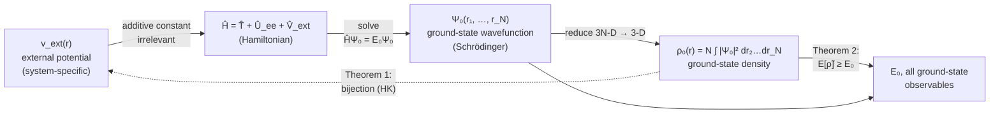
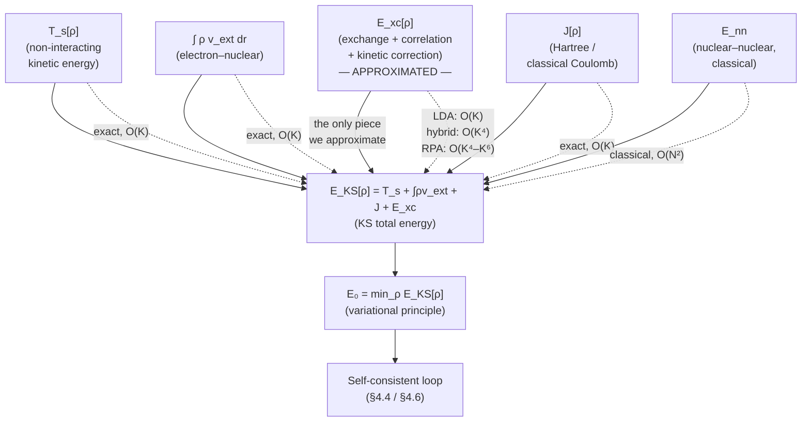
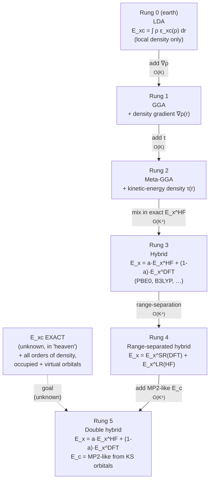
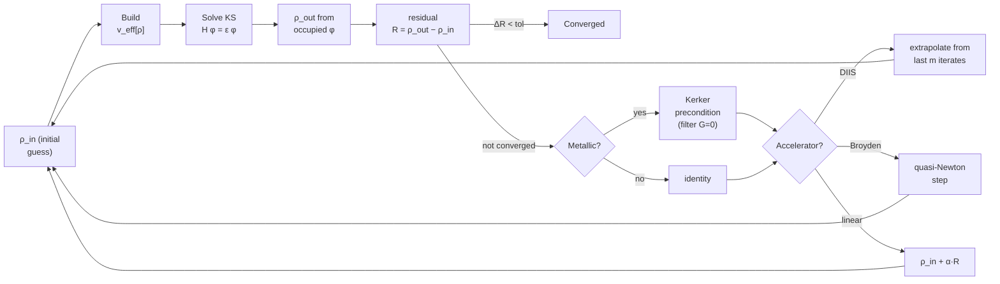
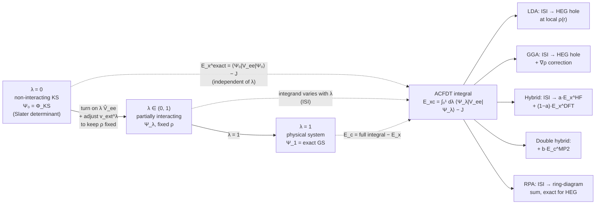
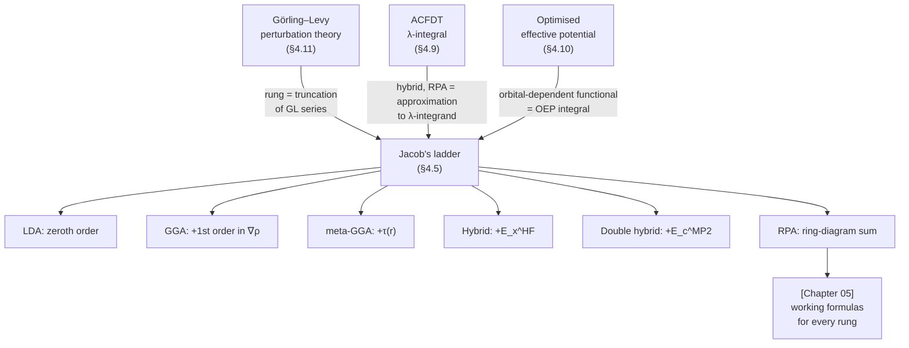
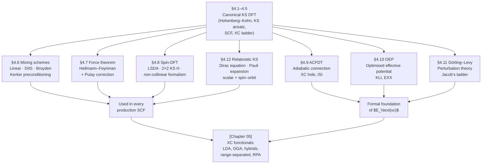

# Chapter 04 — Kohn–Sham DFT

> Kohn–Sham DFT replaces an unknown *wavefunction* with an unknown
> *density functional*. The reformulation is exact; the approximation
> is the functional. The whole of modern DFT is the search for better
> functionals — and the search for better *solvers* for the equations
> they produce.

This is the chapter in which the abstract "DFT exists" theorems of
[chapter 02]({{ "/dft-notes/chapter-02/" | relative_url }}) become a
practical recipe. The recipe has four ingredients: a
universal-looking energy expression whose unknown piece ($E_\text{xc}$)
we approximate; a one-body Schrödinger equation for fictitious
non-interacting orbitals; a self-consistent loop that ties the
potential and the orbitals together; and a fixed-point solver
(mixing, DIIS, Broyden, Kerker) that drives the loop home. We treat
all four in turn. The first five sections (4.1–4.5) recall the
canonical content; the next eight (4.6–4.13) are the extensions
that turn the textbook KS equations into a tool that can be
*implemente`d*` (§4.6 mixing), *differentiate`d*` (§4.7 forces),
*spin-polarise`d*` (§4.8), *formally grounde`d*` (§4.9 ACFDT, §4.10
OEP, §4.11 Görling–Levy perturbation theory), *pushed into the
heavy-element regime* (§4.12 relativistic KS), and *summarise`d*`
(§4.13 worked example + problems).

## 4.1 The Hohenberg–Kohn theorems

The 1964 paper by Hohenberg and Kohn contains two theorems.

**Theorem 1 (existence).** For any non-degenerate ground state of a
system of $N$ electrons in an external potential $v_\text{ext}(\mathbf r)$,
the external potential is a unique functional of the ground-state
electron density $\rho(\mathbf r)$, up to an additive constant.

**Corollary.** Every observable of the ground state is a functional of
$\rho$ alone. In particular, the ground-state energy is

$$
E[\rho] = \underbrace{F_\text{HK}[\rho]}_\text{universal} + \int \rho(\mathbf r) v_\text{ext}(\mathbf r) d\mathbf r,
$$

where $F_\text{HK}[\rho] = \langle \hat T \rangle + \langle \hat U_{ee} \rangle$
is a *universal* functional — the same for every system — and only
$v_\text{ext}$ carries the system-specific information.

**Theorem 2 (variational principle).** For any trial density
$\tilde\rho$ that integrates to $N$ and is $v$-representable,

$$
E_0 \le E[\tilde\rho].
$$

> **Tip.** The "v-representability" assumption in Theorem 2 is a
> technical restriction. It is rarely the binding constraint in
> practice, but it matters for some formal proofs of the
> Kohn–Sham equations.

The two theorems together reduce the problem of finding the ground-
state energy of an interacting $N$-electron system to the problem of
*minimising a functional over all admissible densities*. The catch:
$F_\text{HK}[\rho]$ is unknown.

### 4.1.1 Mermaid — the Hohenberg–Kohn mapping

Theorem 1 is a *bijection* between external potentials (up to a
trivial additive constant) and ground-state densities (up to a
trivial multiplicative rescaling). Every observable of the
ground state is a functional of $\rho$ alone because $v_\text{ext}$
*is* a functional of $\rho$, and the Hamiltonian is determined by
$v_\text{ext}$ plus the universal electron–electron term.



The horizontal axis (top) is the *forward Schrödinger problem*:
$V_\text{ext} \to \Psi_0 \to \rho_0$. That is what we have known
how to do (in principle, modulo the exponential wall) since 1926.
The dashed bottom arrow is the *Hohenberg–Kohn inverse*: $\rho_0
\to V_\text{ext}$, which is the new content of the 1964 theorem.
DFT works because the inverse exists; the entire problem of
electronic-structure theory becomes "find the $\rho$ that minimises
$E[\rho]$".

## 4.2 The Kohn–Sham ansatz

Kohn and Sham's 1965 observation is that the *minimisation problem* is
much easier if we *introduce* a fictitious non-interacting reference
system whose density equals the interacting density. The reference
system lives in an **effective potential** $v_\text{eff}(\mathbf r)$
defined by

$$
v_\text{eff}(\mathbf r) = v_\text{ext}(\mathbf r) + v_\text{H}[\rho](\mathbf r) + v_\text{xc}[\rho](\mathbf r).
$$

The Kohn–Sham orbitals $\{\phi_i\}$ are the eigenfunctions of the
Kohn–Sham Hamiltonian

$$
\hat H_\text{KS} = -\frac{1}{2} \nabla^2 + v_\text{eff}(\mathbf r),
$$

and the density is reconstructed from the occupied orbitals as

$$
\rho(\mathbf r) = 2 \sum_{i=1}^{N/2} \lvert \phi_i(\mathbf r) \rvert^2.
$$

The factor of 2 is for spin-paired (restricted) systems.

The Kohn–Sham energy functional reads

$$
E_\text{KS}[\rho] = T_s[\rho] + \int \rho v_\text{ext} \, d\mathbf r + J[\rho] + E_\text{xc}[\rho],
$$

where $T_s$ is the **non-interacting** kinetic energy (which we *can*
compute from the orbitals) and $E_\text{xc}$ absorbs everything we
don't know how to compute:

$$
E_\text{xc}[\rho] = (T - T_s) + (U_{ee} - J) = \text{exchange} + \text{correlation} + \text{kinetic correction}.
$$

### 4.2.1 Mermaid — the energy components of $E[\rho]$

The Kohn–Sham energy expression splits the exact energy into
five pieces, four of which we know *exactly how to compute* and
one of which ($E_\text{xc}$) is approximated. The diagram below
shows the split: each box is one term, the *input* is $\rho$
(or, for $T_s$, the occupied KS orbitals), and the *cost* of
each is the dominant scaling with basis size $K$.



The diagram makes the **"DFT is exact"** claim of §4.3
operational: every term *except* $E_\text{xc}$ is exactly
computable from $\rho$ (and the occupied KS orbitals for $T_s$).
The error budget of a DFT calculation is the error in
$E_\text{xc}[\rho]$; the rest of the machinery is exact in
principle and arbitrarily accurate in practice (it is just
quadrature, linear algebra, and FFTs).

## 4.3 Why the reformulation is exact

It is worth pausing to emphasise: the Kohn–Sham equations are *exact*
given the exact $E_\text{xc}$. The error budget of a DFT calculation
is *entirely* in the approximation to $E_\text{xc}[\rho]$.

| Quantity                   | How we get it                                                         | Error source |
|:---------------------------|:----------------------------------------------------------------------|:-------------|
| $T_s[\rho]$               | Sum of occupied orbital kinetic energies — exact by construction       | None         |
| $\int \rho v_\text{ext}$   | One-electron integral over the basis                                   | Basis only   |
| $J[\rho]$                  | Coulomb integral of the density — exact                               | None         |
| $E_\text{xc}[\rho]$        | **Approximated.** This is the only place the error lives.             | Functional   |

> **Warning.** It is tempting to read "DFT" as a mean-field theory like
> Hartree–Fock. It is not. The KS equations are *exact* in the sense
> that the *form* of the energy expression is exact; the *value* of
> $E_\text{xc}$ is approximate. Calling DFT a "mean-field theory" is
> the most common conceptual error in introductory DFT.

## 4.4 The KS self-consistent loop

The KS equations have the same self-referential structure as HF: the
potential depends on the orbitals, and the orbitals are eigenfunctions
of the potential. The SCF procedure is identical in shape:

```python
import numpy as np

def ks_scf(H_core, eri, S, n_elec, v_xc, max_iter=100, tol=1e-7, mixing=0.3):
    """Restricted KS-SCF in a non-orthogonal AO basis.

    H_core : (K, K)  one-electron Hamiltonian
    eri    : (K, K, K, K) electron-repulsion integrals
    S      : (K, K)  overlap matrix
    n_elec : int      number of electrons
    v_xc   : callable  v_xc(rho_grid, density_matrix) -> F_xc on the grid
    """
    K = H_core.shape[0]
    evals, C = np.linalg.eigh(H_core, S)
    P = 2 * C[:, : n_elec // 2] @ C[:, : n_elec // 2].T

    for it in range(max_iter):
        # Hartree potential
        J = np.einsum("pqrs,rs->pq", eri, P)
        # Exchange–correlation potential, evaluated on the grid
        F_xc = v_xc(rho_grid=None, P=P)   # signature depends on the XC code
        # Fock-like matrix
        F = H_core + J + F_xc

        evals, C = np.linalg.eigh(F, S)
        P_new = 2 * C[:, : n_elec // 2] @ C[:, : n_elec // 2].T
        dP = np.linalg.norm(P_new - P)
        P  = (1 - mixing) * P + mixing * P_new
        if dP < tol:
            print(f"  Converged in {it + 1} iterations (ΔP = {dP:.2e})")
            break

    E = 0.5 * np.trace(P @ (H_core + F))
    return E, evals, C, P
```

The structure is the same as HF; the only thing that changes is the
$\hat K$ term being replaced by a local (in the DFT case) or
semi-local (in the hybrid case) $\hat v_\text{xc}$ contribution.

## 4.5 The Jacobian of approximations to $E_\text{xc}$

Approximations to $E_\text{xc}[\rho]$ are conventionally organised
into a "Jacob's ladder" of increasing complexity and (usually)
increasing accuracy:

| Rung | Approximation                  | Form of $E_\text{xc}$                                                | Cost        |
|:-----|:-------------------------------|:----------------------------------------------------------------------|:------------|
| 1    | LDA (local)                    | $\int \rho(\mathbf r) \, \varepsilon_\text{xc}(\rho(\mathbf r))\, d\mathbf r$ | $O(K)$      |
| 2    | GGA (semi-local)              | + $\int f(\rho, \nabla\rho)\, d\mathbf r$                              | $O(K)$      |
| 3    | Meta-GGA                       | + $\int g(\rho, \nabla\rho, \tau)\, d\mathbf r$                        | $O(K)$      |
| 4    | Hybrid                         | + fraction of exact HF exchange                                       | $O(K^4)$    |
| 5    | Range-separated hybrid        | + range-separation of exchange                                        | $O(K^4)$    |
| 6    | Double-hybrid                 | + MP2-like correlation from KS orbitals                               | $O(K^5)$    |
| 7    | Random-phase approximation     | + exact (adiabatic) exchange + ring-Coulomb correlation              | $O(K^4)$    |

> **Tip.** "Higher rung" does not mean "always better". The LDA is
> surprisingly good for simple metals and is often the cheapest,
> most robust choice for screening crystal structures. A bad hybrid
> can be much worse than a good GGA on the same system.

### 4.5.1 Mermaid — Jacob's ladder of $E_\text{xc}$ approximations

The "Jacob's ladder" metaphor is taken from the biblical dream:
each rung is a more faithful image of the *true* $E_\text{xc}$ (in
heaven), with each new rung adding one more piece of *non-local*
information about the density. The diagram below shows the ladder
as a vertical flow; the right-hand column is the *new ingredient*
added at each rung, the leftmost column is the cost.



The rungs are not an absolute ordering of "better" — for a
particular system, a *low* rung (LDA) can outperform a *hig`h*`
rung (a poorly-tuned hybrid). The ladder is a
*cost–complexity* ordering, not a monotonic-accuracy ordering;
chapter 05 devotes itself to the practical question of "which
rung for which system".

## 4.6 Mixing schemes for SCF convergence

Section 4.4 wrote the SCF as a single `for` loop.  In practice, that
loop diverges or oscillates for everything but the smallest systems
unless the iteration is damped, extrapolated, or otherwise
*stabilise`d*`.  This section is about that stabilisation.

We model the SCF as a **fixed-point problem**.  Define the SCF
update as a map from the input density to the output density:

\begin{equation}
\label{eq:ch-04-scf-map}
\rho_\text{out} = \mathcal F[\rho_\text{in}].
\end{equation}

The map $\mathcal F$ does three things: it builds the KS Hamiltonian
from $\rho_\text{in}$, diagonalises it, and reconstructs a density
from the occupied orbitals.  Self-consistency means

\begin{equation}
\label{eq:ch-04-fixed-point}
\rho^\star = \mathcal F[\rho^\star],
\end{equation}

i.e. $\rho^\star$ is a **fixed point** of the map.  The bare iteration
$\rho^{(n+1)} = \mathcal F[\rho^{(n)}]$ is the textbook fixed-point
iteration; it diverges whenever the linearised map
$\mathcal F^{\prime}(\rho^\star)$ has an eigenvalue of magnitude $\ge 1$.

### 4.6.1 Simple (linear) mixing

The cheapest fix is to **dam`p*`* the iteration.  Replace

$$
\rho^{(n+1)} = \mathcal F[\rho^{(n)}]
$$

by

\begin{equation}
\label{eq:ch-04-linear-mixing}
\rho^{(n+1)} = (1 - \alpha)\, \rho^{(n)} + \alpha\, \mathcal F[\rho^{(n)}],
\qquad 0 < \alpha < 1.
\end{equation}

This is **simple (linear) mixing**: the new density is a convex
combination of the old density and the density that the SCF map would
have produced.  For $\alpha = 1$ we recover the bare iteration; for
$\alpha \to 0$ we recover *no iteration at all*.  In practice
$\alpha = 0.2$–$0.5$ is a reasonable starting point for an insulator
in a localised basis; a few production codes default to
$\alpha = 0.7$.

**Why does damping help?**  Linearise $\mathcal F$ around the fixed
point, $\mathcal F[\rho] \approx \rho^\star + \mathcal F^{\prime}(\rho^\star)
(\rho - \rho^\star)$, and define the *error*
$e^{(n)} = \rho^{(n)} - \rho^\star$.  Substituting into
\eqref{eq:ch-04-linear-mixing} gives the linearised error recursion

$$
e^{(n+1)} = (1 - \alpha)\, e^{(n)} + \alpha\, \mathcal F^{\prime} e^{(n)}
= \big[(1-\alpha) \mathbf 1 + \alpha \mathcal F^{\prime}\big] e^{(n)} .
$$

The eigenvalues of the damped map are $\mu_\text{damp} = (1-\alpha) +
\alpha \mu$, where $\mu$ is an eigenvalue of the bare $\mathcal F^{\prime}$.
The damped map converges iff $|\mu_\text{damp}| < 1$, which is a
*strictly weaker* condition than $|\mu| < 1$.  In particular, the
real part of $\mu$ is mapped to

\begin{equation}
\label{eq:ch-04-mixing-amplification}
\Re(\mu_\text{damp}) = (1 - \alpha) + \alpha\, \Re(\mu) .
\end{equation}

For $\alpha \in (0, 1)$ this is a convex combination of $1$ and
$\Re(\mu)$.  If $\Re(\mu) < 1$ (the typical case for a stable
electronic structure), damping **shrinks** the real part.  For the
imaginary part, $|\Im(\mu_\text{damp})| = \alpha |\Im(\mu)|$, so
damping shrinks the imaginary part by a factor of $\alpha$ at the
cost of slowing convergence.

> **Note.**  Linear mixing is a **first-order** method.  Each
> iteration makes the error smaller by a constant factor
> $\max_\mu |\mu_\text{damp}|$.  For $\alpha = 0.3$ and a typical
> $\mu$ of $0.7 + 0.4i$, the contraction factor is
> $|0.7 + 0.12 i| \approx 0.71$ — a steady, if pedestrian,
> improvement.  Section 4.6.2 buys a much better contraction.

### 4.6.2 Pulay's DIIS — Direct Inversion in the Iterative Subspace

The fix that broke the SCF convergence problem in the 1980s is
**Pulay's DIIS** (Direct Inversion in the Iterative Subspace), also
called **Pulay mixing** or simply **DIIS**.  The idea, in one
sentence: instead of taking the most recent iterate
$\rho^{(n+1)} = \mathcal F[\rho^{(n)}]$, find a *linear combination*
of the last $m$ iterates that minimises the norm of the next
residual, and use that combination as the new iterate.

Define the **residual** at iteration $i$ as the difference between
output and input:

\begin{equation}
\label{eq:ch-04-pulay-residual}
R_i \;\equiv\; \mathcal F[\rho^{(i)}] - \rho^{(i)} .
\end{equation}

A fixed point of $\mathcal F$ is, by definition, a density at which
the residual vanishes.  The strategy is therefore to predict the
fixed point by extrapolating the iteration history in a way that
*minimises the residual of the extrapolated iterate*.

Let $\mathbf c = (c_1, c_2, \dots, c_m)^T$ be a coefficient vector
that we will use to combine the last $m$ iterates and the last $m$
residuals.  Define the extrapolated iterate and the extrapolated
residual as the same linear combinations:

\begin{equation}
\label{eq:ch-04-pulay-extrapolation}
\tilde\rho = \sum_{i=1}^{m} c_i \rho^{(i)}, \qquad
\tilde R = \sum_{i=1}^{m} c_i R_i .
\end{equation}

Because $\mathcal F$ is approximately linear near the fixed point,
$\tilde R$ is approximately the residual that would be produced by
$\tilde\rho$.  We choose $\mathbf c$ to minimise the squared norm
$\langle \tilde R, \tilde R \rangle$ subject to the constraint

\begin{equation}
\label{eq:ch-04-pulay-sum-rule}
\sum_{i=1}^{m} c_i = 1,
\end{equation}

which ensures that \eqref{eq:ch-04-pulay-extrapolation} reproduces a
fixed point exactly if the iteration history is already at one.  (If
all $c_i = 1/m$, the extrapolation is a uniform average; the
constraint forbids $\sum c_i = 0$, which would correspond to an
unphysical cancellation of the constant part of the density.)

Expand the objective using an inner product $\langle \cdot, \cdot \rangle$
on density space:

\begin{align}
\langle \tilde R, \tilde R \rangle
&= \sum_{i, j = 1}^{m} c_i c_j\, \langle R_i, R_j \rangle .
\end{align}

Introduce the **metric matrix** $B$ with elements

\begin{equation}
\label{eq:ch-04-pulay-metric}
B_{ij} = \langle R_i, R_j \rangle .
\end{equation}

The constrained minimisation is solved by a Lagrangian.  Define

$$
\mathcal L(\mathbf c, \lambda) = \frac{1}{2} \mathbf c^T B\, \mathbf c - \lambda \left( \sum_{i=1}^{m} c_i - 1 \right),
$$

where the factor of $1/2$ is conventional and the Lagrange multiplier
$\lambda$ enforces the sum rule.  Take the derivative with respect to
$c_k$:

$$
\frac{\partial \mathcal L}{\partial c_k} = \sum_{j=1}^{m} B_{kj}\, c_j - \lambda = 0
\quad\Longrightarrow\quad
\sum_{j=1}^{m} B_{kj}\, c_j = \lambda, \qquad k = 1, \dots, m .
$$

This is $m$ equations, but with $\lambda$ as an additional unknown.
The constraint $\sum_i c_i = 1$ is the $(m{+}1)$-th equation.  Stacking
the $m$ equations and the constraint into a single linear system
gives

\begin{equation}
\label{eq:ch-04-pulay-coefficients}
\begin{pmatrix}
B_{11} & B_{12} & \cdots & B_{1m} & 1 \\\
B_{21} & B_{22} & \cdots & B_{2m} & 1 \\\
\vdots  & \vdots  & \ddots & \vdots  & \vdots \\\
B_{m1} & B_{m2} & \cdots & B_{mm} & 1 \\\
1      & 1      & \cdots & 1      & 0
\end{pmatrix}
\begin{pmatrix} c_1 \\\\ c_2 \\\\ \vdots \\\\ c_m \\\\ -\lambda \end{pmatrix}
=
\begin{pmatrix} 0 \\\\ 0 \\\\ \vdots \\\\ 0 \\\\ 1 \end{pmatrix} .
\end{equation}

In compact form, with $\mathbf 1$ the $m$-vector of ones,

\begin{equation}
\label{eq:ch-04-pulay-augmented}
\begin{pmatrix} B & \mathbf 1 \\\\ \mathbf 1^T & 0 \end{pmatrix}
\begin{pmatrix} \mathbf c \\\\ -\lambda \end{pmatrix}
=
\begin{pmatrix} \mathbf 0 \\\\ 1 \end{pmatrix} .
\end{equation}

The system \eqref{eq:ch-04-pulay-augmented} is $(m{+}1) \times (m{+}1)$,
symmetric, and (provided the $R_i$ are linearly independent) non-
singular.  Solving it costs $\mathcal O(m^3)$ per SCF iteration, with
$m \le 8$–$10$ in production codes.

The new density to feed back into the SCF map is then
\eqref{eq:ch-04-pulay-extrapolation}, evaluated with the coefficients
just found.  In practice the new residual $R_{n+1}$ is *not* the
extrapolated residual $\tilde R$ — it is the residual of $\tilde\rho$
in the next SCF step, which is what the next DIIS sub-problem will use.

> **Tip.**  DIIS in the form above is sometimes called
> **unshifted DIIS**.  In real codes one usually adds a small diagonal
> shift to $B$ (so $B \to B + \epsilon \mathbf 1$ with
> $\epsilon \sim 10^{-8}$) to keep the system well-conditioned when
> the iteration is already close to convergence and the residuals are
> near-zero vectors whose inner products are dominated by round-off.

#### 4.6.3 Inner product

The choice of $\langle \cdot, \cdot \rangle$ is one of the few knobs
in DIIS.  Common choices:

| Choice                          | Form                                                         | Where used |
|:--------------------------------|:-------------------------------------------------------------|:-----------|
| $\langle R_i, R_j \rangle = R_i \cdot R_j$ | Flat Euclidean inner product (density-vector or density-matrix) | Most codes |
| $\langle R_i, R_j \rangle = \int \frac{R_i(\mathbf r) R_j(\mathbf r)}{\rho(\mathbf r)} d\mathbf r$ | Weighted by $1/\rho$ to downweight the core | Some all-electron codes |
| $\langle R_i, R_j \rangle = \sum_\mu R_i^\mu K_\mu R_j^\mu$ | Preconditioned by a kernel (e.g. Kerker) | Metallic systems |

For the worked example in 4.10 we use the flat Euclidean inner product
on the density-matrix elements.

### 4.6.3 Anderson acceleration and Broyden's method

Two more acceleration schemes deserve a section each.

**Anderson acceleration** (Anderson, 1965) is the predecessor of DIIS
and is in fact a restricted form of it: instead of a general
extrapolation over $m$ prior iterates, Anderson uses the *two* most
recent iterates and the *one* most recent residual.  The combination
of $\rho^{(n)}$ and $\rho^{(n-1)}$ is chosen to annihilate the
predicted change in $R$.  The result is equivalent to a single
**Secant** step in density space.  In modern codes Anderson is rarely
used; DIIS has won.

**Broyden's metho`d*`* (Broyden, 1965) is a quasi-Newton method for the
fixed-point problem $\mathcal F[\rho] - \rho = 0$.  Let
$\mathbf r^{(n)} = \mathcal F[\rho^{(n)}] - \rho^{(n)}$ be the
residual.  We would like to solve the Newton step
$\mathbf J \Delta\rho = -\mathbf r^{(n)}$ for the correction
$\Delta\rho = \rho^{(n+1)} - \rho^{(n)}$, but the Jacobian
$\mathbf J = \partial(\mathcal F - \mathbf 1)/\partial\rho$ is too
expensive to form and invert.  Broyden's idea is to maintain a
**rank-one approximation** $G_n$ to $\mathbf J^{-1}$, updated using
the **Sherman–Morrison formul`a*`* each iteration.

The **"good" Broyden update** is

\begin{equation}
\label{eq:ch-04-broyden-good}
G_{n+1} = G_n + \frac{\big[\Delta\rho_n - G_n \Delta \mathbf r_n\big]\, \Delta\rho_n^T}{\Delta\rho_n^T \Delta\rho_n},
\end{equation}

where $\Delta\rho_n = \rho^{(n+1)} - \rho^{(n)}$ and
$\Delta\mathbf r_n = \mathbf r^{(n+1)} - \mathbf r^{(n)}$.  The
initial $G_0$ can be taken as $-\alpha \mathbf 1$ with $\alpha$ the
mixing parameter from the linear scheme.  A new step is then taken as

$$
\rho^{(n+1)} = \rho^{(n)} - \alpha\, G_n \mathbf r^{(n)} ,
$$

and the cycle repeats.  Broyden's method has the advantage of using
*all* of the iteration history (in the form of the running $G_n$)
rather than just the last $m$ iterates, and converges superlinearly
on regular problems.  In production codes Broyden's method is rarely
the *only* solver, but its variants (Broyden's "second" or "good"
method, the SR1 update, the limited-memory variant L-BFGS-style
memory) appear inside every modern SCF as a fallback or refinement.

### 4.6.4 Kerker preconditioning for metallic systems

In **insulators**, the density decays exponentially and the
dielectric function $\epsilon(\mathbf q) \to 1$ as $\mathbf q \to 0$.
In **metals**, $\epsilon(0)$ diverges (the static screening is
perfect), and a small change in the potential produces a long-range
($\sim 1/r$) change in the density.  In Fourier space, the
density-response function is

\begin{equation}
\label{eq:ch-04-lindhard}
\chi(\mathbf q) = -\frac{\chi_0}{1 + k_\text{TF}^2 / q^2},
\end{equation}

where $\chi_0$ is the bare response and $k_\text{TF}$ is the
**Thomas–Fermi screening wavevector**.  The long-wavelength components
of the density ($q \to 0$) are amplified by the metallic response
relative to the short-wavelength components.  Bare SCF iteration on
a metal therefore builds up a slowly-oscillating, large-amplitude
charge sloshing mode that simple mixing cannot damp.

**Kerker's fix** (Kerker, 1981) is to apply a **preconditioner** to
the residual before mixing.  Define the **Kerker preconditioner**
in reciprocal space by

\begin{equation}
\label{eq:ch-04-kerker-pre}
\hat K(\mathbf G) = \frac{G^2}{G^2 + k_\text{TF}^2},
\end{equation}

so that $\hat K(0) = 0$ and $\hat K(\infty) = 1$.  The new mixed
density is

$$
\hat\rho^{(n+1)}(\mathbf G)
= \hat\rho^{(n)}(\mathbf G) + \alpha\, \hat K(\mathbf G)\,
   \big(\hat\rho_\text{out}^{(n)}(\mathbf G) - \hat\rho^{(n)}(\mathbf G)\big) .
$$

The factor $\hat K(\mathbf G)$ **suppresses** the small-$G$ (long-
wavelength) components of the residual and leaves the large-$G$
components untouched.  In real space, this is a screened-Coulomb-
like filter: $K(\mathbf r, \mathbf r')$ is the Green's function of
$-\nabla^2 + k_\text{TF}^2$.  A practical value is
$k_\text{TF} \approx 0.5$–$1.0\,a_0^{-1}$ for typical $sp$ metals.

> **Tip.**  Kerker preconditioning is **always** combined with a
> second-stage accelerator (DIIS, Broyden).  The two play
> complementary roles: the preconditioner stabilises the long-
> wavelength mode, and the accelerator handles the
> higher-frequency components.  Plane-wave codes (VASP, Quantum
> ESPRESSO, CASTEP) ship with a Kerker+DIIS pipeline as the default
> for metallic systems.

### 4.6.5 What convergence looks like in practice

For a typical GGA-DFT calculation on a small molecule in a Gaussian
basis with a good starting density (e.g. sum of atomic densities),
DIIS converges the energy to $\sim 10^{-6}\,E_h$ in 8–12 iterations.
For a metallic surface in a plane-wave code, Kerker+DIIS converges
to the same tolerance in 25–40 iterations.  For a strongly
correlated transition-metal oxide, the same convergence can take
hundreds of iterations and may require additional techniques (level
shifting, occupation smearing, DFT+U initialisation) that are out
of scope for this chapter.

The companion script `dft_notes/python_codes/chapter_04/01-diis-scf.py`
(section 4.10.1) implements linear mixing, DIIS, and Broyden on a
2×2 toy model problem and plots the convergence.  The point of the
toy is to expose the qualitative behaviour — linear mixing converges
geometrically, DIIS converges superlinearly once the iteration
history is rich enough, Broyden sits between them — without the noise
of a real Hamiltonian.



## 4.7 The force theorem (Hellmann–Feynman)

Section 4.4 gave us the *energy* of a system at a fixed geometry.  For
geometry optimisation, molecular dynamics, vibrational analysis, and
basically every property beyond the energy, we need the **forces on
the nuclei** — i.e. the gradient of the total energy with respect to
the nuclear coordinates.  The theorem that delivers this gradient
*for free* is the **Hellmann–Feynman theorem**.  In a finite basis
set it requires a correction — the **Pulay force** — that we will
derive carefully.

### 4.7.1 The Hellmann–Feynman theorem

Consider a Hamiltonian $\hat H(\lambda)$ that depends on a real
parameter $\lambda$ (a nuclear coordinate, a magnetic field, a
lattice strain), and let $\Psi(\lambda)$ be its exact normalised
ground state.  The derivative of the energy
$E(\lambda) = \langle \Psi(\lambda) | \hat H(\lambda) | \Psi(\lambda) \rangle$
with respect to $\lambda$ is

\begin{align}
\frac{dE}{d\lambda}
&= \left\langle \frac{\partial \Psi}{\partial \lambda} \bigg| \hat H \bigg| \Psi \right\rangle
 + \left\langle \Psi \bigg| \frac{\partial \hat H}{\partial \lambda} \bigg| \Psi \right\rangle
 + \left\langle \Psi \bigg| \hat H \bigg| \frac{\partial \Psi}{\partial \lambda} \right\rangle .
\end{align}

The first and third terms combine to

$$
\left\langle \frac{\partial \Psi}{\partial \lambda} \bigg| \hat H \bigg| \Psi \right\rangle
+ \left\langle \Psi \bigg| \hat H \bigg| \frac{\partial \Psi}{\partial \lambda} \right\rangle
= E(\lambda)\, \frac{\partial}{\partial \lambda} \langle \Psi | \Psi \rangle = 0 ,
$$

because $\Psi$ is normalised.  Therefore

\begin{equation}
\label{eq:ch-04-hellmann-feynman}
\boxed{\;
\frac{dE}{d\lambda} = \left\langle \Psi(\lambda) \bigg| \frac{\partial \hat H}{\partial \lambda} \bigg| \Psi(\lambda) \right\rangle
\;}
\end{equation}

The derivative of the energy is the expectation value of the
derivative of the Hamiltonian — *with the wavefunction held fixed at
its value at $\lambda$*.  The "wavefunction-derivative" terms that
are notoriously hard to evaluate disappear.

### 4.7.2 The force on a nucleus

The Born–Oppenheimer energy surface $E(\mathbf R)$ is the total
energy of the electronic ground state at fixed nuclear positions
$\mathbf R = \{\mathbf R_I\}$.  The force on nucleus $I$ is

\begin{equation}
\label{eq:ch-04-force-def}
\mathbf F_I = -\frac{\partial E}{\partial \mathbf R_I} .
\end{equation}

Apply \eqref{eq:ch-04-hellmann-feynman} with $\lambda = R_{I\alpha}$
($\alpha = x, y, z$).  The full molecular Hamiltonian is

$$
\hat H = \hat T_e + \hat V_{ee} + \hat V_{en} + \hat V_{nn} ,
$$

and only the electron–nuclear and the nuclear–nuclear pieces depend
on $\mathbf R_I$:

$$
\hat V_{en} = -\sum_{i, I} \frac{Z_I}{|\mathbf r_i - \mathbf R_I|},
\qquad
\hat V_{nn} = \frac{1}{2} \sum_{I \neq J} \frac{Z_I Z_J}{|\mathbf R_I - \mathbf R_J|} .
$$

Their derivatives are the classical electrostatic forces exerted by
the electrons and by the other nuclei on nucleus $I$:

$$
\frac{\partial \hat V_{en}}{\partial \mathbf R_I}
= \sum_i \frac{Z_I (\mathbf r_i - \mathbf R_I)}{|\mathbf r_i - \mathbf R_I|^3} ,
\qquad
\frac{\partial \hat V_{nn}}{\partial \mathbf R_I}
= -\sum_{J \neq I} \frac{Z_I Z_J (\mathbf R_I - \mathbf R_J)}{|\mathbf R_I - \mathbf R_J|^3} .
$$

In the **KS DFT** version, $\Psi$ is replaced by the KS Slater
determinant, and $\hat V_{ee}$ is replaced by its DFT proxy (Hartree
plus exchange–correlation).  The derivative of the **KS Hamiltonian**
with respect to $\mathbf R_I$ is local, in the sense that
$\partial v_\text{eff}/\partial \mathbf R_I$ is a known function of
$\mathbf r$.  The Hellmann–Feynman force on nucleus $I$ in a
**complete basis set** is therefore

\begin{equation}
\label{eq:ch-04-force-nucleus}
\boxed{\;
\mathbf F_I
= -Z_I \int \rho(\mathbf r)\,
   \frac{\mathbf r - \mathbf R_I}{|\mathbf r - \mathbf R_I|^3}\, d\mathbf r
   - \sum_{J \neq I} \frac{Z_I Z_J (\mathbf R_I - \mathbf R_J)}{|\mathbf R_I - \mathbf R_J|^3} .
\;}
\end{equation}

This is *exactly* the classical Coulomb force on a point charge $Z_I$
placed at $\mathbf R_I$: the first term is the attraction to the
electron density, and the second is the repulsion from the other
nuclei.  The KS electrons "see" the nuclei and respond adiabatically;
the nuclei move as if dragged by this classical force.

> **Warning.**  In a *complete* basis set, \eqref{eq:ch-04-force-nucleus}
> is the whole force.  In a *finite* basis set, the basis functions
> themselves depend on the nuclear coordinates (atom-centred
> Gaussians, STOs, NAOs), and there is an extra term.  We derive it
> next.

### 4.7.3 The Pulay correction

Expand the KS orbitals in a finite basis $\{\chi_\mu\}$ centred on
the atoms:

$$
\phi_i(\mathbf r) = \sum_{\mu} C_{\mu i}\, \chi_\mu(\mathbf r; \mathbf R) .
$$

In an **atom-centre`d*`* basis, the basis functions $\chi_\mu$ depend
on $\mathbf R$ (the set of nuclear positions) through their centres
$\mathbf A_\mu = \mathbf R_{I(\mu)}$.  Differentiating the KS energy
*with respect to* $\mathbf R_I$, *holding the density fixe`d*` at its
self-consistent value, gives \eqref{eq:ch-04-force-nucleus} *plus*
a term from the basis-set derivative that is not present in the
complete-basis limit:

\begin{equation}
\label{eq:ch-04-force-pulay}
\boxed{\;
\mathbf F_I^\text{Pulay}
= -2 \sum_{i}^\text{occ} \sum_{\mu \in I} \sum_{\nu} C_{\mu i}\, C_{\nu i}\,
   \langle \frac{\partial \chi_\mu}{\partial \mathbf R_I} \bigg|
        \hat H_\text{KS} - \varepsilon_i \bigg| \chi_\nu \rangle .
\;}
\end{equation}

**Derivation.**  The total energy
$E = T_s + V_\text{ext} + J + E_\text{xc} + V_{nn}$ is a functional
of the density; in the AO basis it is also a function of the MO
coefficients $\mathbf C$ and the nuclear coordinates $\mathbf R$ (the
latter through the basis functions).  We split

$$
\mathbf F_I
= -\frac{\partial E}{\partial \mathbf R_I}\bigg|_{\mathbf C, \text{fixed at SCF}}
\;-\; \sum_{\mu, \nu, i} \frac{\partial E}{\partial C_{\mu i}}\,
   \frac{\partial C_{\mu i}}{\partial \mathbf R_I}\bigg|_\text{chain} .
$$

The chain-rule term is the response of the SCF solution to a
perturbation; at the self-consistent fixed point it is *zero* by
virtue of the KS equations $\delta E / \delta C = 0$ (this is the
Hellmann–Feynman part of the argument — the response cancels).
The remaining $\mathbf R$-derivative comes only from the basis
functions and the nuclear–nuclear repulsion:

\begin{align}
\mathbf F_I
&= -\frac{\partial}{\partial \mathbf R_I} \sum_{\mu, \nu, i}^\text{occ}
     C_{\mu i}\, C_{\nu i}\, h_{\mu\nu}(\mathbf R)
 \;-\; \frac{\partial V_{nn}}{\partial \mathbf R_I} \\\
&\quad
   -\frac{\partial}{\partial \mathbf R_I}
    \bigg[ 2 \sum_{i}^\text{occ} \sum_{\mu, \nu} C_{\mu i} C_{\nu i} J_{\mu\nu} \bigg]
 \;-\; \frac{\partial E_\text{xc}}{\partial \mathbf R_I} .
\end{align}

All the derivatives in the last two lines are derivatives of
**integrals** whose integrands depend on $\mathbf R$ only through the
basis centres, *an`d*` through the explicit $\mathbf R_I$ in the
operators.  They produce, by the same Hellmann–Feynman argument as
above, the classical forces in \eqref{eq:ch-04-force-nucleus} plus
a basis-derivative term.  The basis-derivative term is

\begin{align}
\mathbf F_I^\text{Pulay}
&= -\sum_{\mu \in I} \sum_{\nu, i}^\text{occ} C_{\mu i} C_{\nu i}
   \bigg[ \langle \frac{\partial \chi_\mu}{\partial \mathbf R_I} |
            \hat h | \chi_\nu \rangle
        + \langle \chi_\mu | \hat h | \frac{\partial \chi_\nu}{\partial \mathbf R_I} \rangle
   \bigg] \\\
&\quad - \sum_{\mu, \nu, i}^\text{occ} C_{\mu i} C_{\nu i}\,
     \langle \frac{\partial \chi_\mu}{\partial \mathbf R_I} | 2 \hat J - \hat K_\text{xc} | \chi_\nu \rangle
   - (\text{symmetric term with } \partial\chi_\nu) .
\end{align}

Use the self-consistency condition $\mathbf F \mathbf C = \mathbf S
\mathbf C \boldsymbol\varepsilon$ to combine the one-electron and
two-electron terms.  The $\mathbf S$-derivative part of the
constraint contributes the $-\varepsilon_i$ piece; the rest collapses
to \eqref{eq:ch-04-force-pulay}.  In a hybrid code this is the
dominant non-trivial term in the force evaluation: in the
all-electron limit (basis-set completeness) the matrix element
$\langle \partial \chi_\mu/\partial \mathbf R_I | \hat H_\text{KS} - \varepsilon_i
| \chi_\nu \rangle$ vanishes by completeness, and we recover
\eqref{eq:ch-04-force-nucleus}.

> **Note.**  In a **plane-wave basis** (chapter 06, section 6.7) the
> basis functions are *independent* of $\mathbf R_I$ — they are plane
> waves centred on the simulation cell, not on the atoms.  Therefore
> the Pulay term is *zero* by construction, and
> \eqref{eq:ch-04-force-nucleus} is the complete force.  This is one
> of the main reasons plane-wave codes are the workhorse of
> geometry optimisation and ab-initio molecular dynamics.
>
> In a **real-space gri`d*`* (chapter 06, section 6.8) the basis is
> also position-independent, and the Pulay term is zero.  In an
> **atom-centre`d*`* basis (chapter 06, sections 6.3–6.6) the Pulay
> term is *never* zero and must be evaluated explicitly.

### 4.7.4 The stress tensor

For periodic systems the analogue of the force is the **stress
tensor** $\sigma_{\alpha\beta}$, the derivative of the energy with
respect to a strain $\epsilon_{\alpha\beta}$.  The Hellmann–Feynman
form is the same in shape — take the derivative of the Hamiltonian
with respect to the strain, evaluate the expectation value in the
self-consistent state, change sign.  In a plane-wave basis, the
Pulay contribution to the stress vanishes just as for forces; in an
atom-centred basis, the Pulay contribution is non-zero and depends
on the *derivatives of the basis centres with respect to the
strain*.  We refer the reader to the literature (Nielsen & Martin,
1985; Yu, Trinkle, Martin) for the explicit form; the working
principle is the same as for forces.

## 4.8 Spin-polarised KS DFT

So far we have treated the KS system as if it had a single, spin-
summed, scalar density.  Real systems have **spins** — and for
magnetic materials, radicals, open-shell atoms, and the entire
zoo of spintronic phenomena, the spin degree of freedom cannot be
averaged out.  This section gives the generalisation of the KS
formalism to spin.

### 4.8.1 The spin-density formalism

The minimal extension is the **Local Spin Density Approximation
(LSDA)** of von Barth and Hedin (1972) and its offspring.  Replace
the scalar density by a **2-component spin density**

\begin{equation}
\label{eq:ch-04-spin-density}
\boldsymbol\rho(\mathbf r) = \begin{pmatrix} \rho_\uparrow(\mathbf r) \\\\ \rho_\downarrow(\mathbf r) \end{pmatrix}
\quad\text{with}\quad
\rho(\mathbf r) = \rho_\uparrow(\mathbf r) + \rho_\downarrow(\mathbf r),
\end{equation}

and the **magnetisation density**

$$
m(\mathbf r) = \rho_\uparrow(\mathbf r) - \rho_\downarrow(\mathbf r) .
$$

The spin-density version of the Hohenberg–Kohn theorem
(von Barth and Hedin, 1972) says that in the presence of an
*external magnetic fiel`d*` $B(\mathbf r) \hat z$ (the typical
case), the external potential *an`d*` the external magnetic field are
uniquely determined by $\boldsymbol\rho(\mathbf r)$ (equivalently,
by $\rho(\mathbf r)$ and $m(\mathbf r)$).  Every ground-state
observable is then a functional of $(\rho_\uparrow, \rho_\downarrow)$.

### 4.8.2 The spin-DFT energy functional

The KS spin-DFT energy is

\begin{equation}
\label{eq:ch-04-lsda-energy}
E_\text{KS}[\rho_\uparrow, \rho_\downarrow]
= T_s[\rho_\uparrow, \rho_\downarrow]
+ \int \rho(\mathbf r)\, v_\text{ext}(\mathbf r)\, d\mathbf r
+ J[\rho]
+ E_\text{xc}[\rho_\uparrow, \rho_\downarrow] .
\end{equation}

$T_s$ is the non-interacting kinetic energy of two independent
Fermi seas (one for each spin).  The Hartree $J$ depends only on
the total $\rho$.  The XC functional $E_\text{xc}[\rho_\uparrow,
\rho_\downarrow]$ is now a functional of *bot`h*` spin densities
(and, in GGAs and beyond, of their gradients).

The **L(S)DA** approximation takes the homogeneous electron gas
(HEG) as the reference and writes

\begin{equation}
\label{eq:ch-04-lsda-xc}
E_\text{xc}^\text{LDA}[\rho_\uparrow, \rho_\downarrow]
= \int \rho(\mathbf r)\, \varepsilon_\text{xc}\big(\rho_\uparrow(\mathbf r), \rho_\downarrow(\mathbf r)\big)\, d\mathbf r ,
\end{equation}

where $\varepsilon_\text{xc}(n_\uparrow, n_\downarrow)$ is the XC
energy *per particle* of a HEG with spin densities
$(n_\uparrow, n_\downarrow)$.  This is parameterised accurately in
the Vosko–Wilk–Nusair (VWN) or Perdew–Wang (PW92) forms.  The
corresponding XC *potential* is a 2-vector

\begin{equation}
\label{eq:ch-04-vxc-spin}
v_{\text{xc},\sigma}(\mathbf r) = \frac{\delta E_\text{xc}}{\delta \rho_\sigma(\mathbf r)},
\qquad \sigma = \uparrow, \downarrow .
\end{equation}

The natural **spin-polarisation coordinate** is the relative spin
polarisation

$$
\zeta(\mathbf r) = \frac{\rho_\uparrow(\mathbf r) - \rho_\downarrow(\mathbf r)}{\rho(\mathbf r)},
\qquad -1 \le \zeta \le 1,
$$

and the LSDA XC energy can be decomposed into a *paramagneti`c*`
(average) part and a *ferromagneti`c*` (polarised) part.  The
so-called *spin-stiffness* — the energy cost of a small
$\zeta$ — is the coefficient that determines the spin-wave
dispersion and the Curie temperature of itinerant magnets.

### 4.8.3 The 2 × 2 KS Hamiltonian (collinear case)

In the **collinear** spin-DFT (the default in most production
codes), the spin quantisation axis is taken to be a fixed direction
(usually $\hat z$) and the KS Hamiltonian is block-diagonal in spin
space.  The KS equation reads

\begin{equation}
\label{eq:ch-04-2x2-hamiltonian}
\hat H_\text{KS}^\sigma
= -\frac{1}{2}\nabla^2 + v_\text{eff}^\sigma(\mathbf r),
\qquad
\sigma \in \{\uparrow, \downarrow\},
\end{equation}

with the spin-dependent effective potential

$$
v_\text{eff}^\sigma(\mathbf r)
= v_\text{ext}(\mathbf r) + v_\text{H}[\rho](\mathbf r) + v_{\text{xc},\sigma}(\mathbf r) .
$$

Two *independent* eigenvalue problems are solved — one for each
spin.  Each has its own set of orbitals and orbital energies, and
each can be occupied up to its own Fermi level.  The total density
is $\rho = \sum_{\sigma} \sum_i^\text{occ} |\phi_i^\sigma|^2$.

This looks innocuous but it is the source of an enormous amount of
physics:

- **Ferromagnets** (Fe, Co, Ni): the spin-up and spin-down KS
  potentials differ, and the spin-up and spin-down bands split by
  the **exchange splitting** $\Delta_\text{x} \sim 1$–$2\,\text{eV}$.
- **Antiferromagnets** (MnO, NiO, the parent compounds of cuprate
  superconductors): on atoms with opposite sublattice magnetisation
  the spin-up density on sublattice A is the spin-down density on
  sublattice B, and the unit cell must be doubled (a "magnetic
  unit cell") to capture the order.
- **Ferrimagnets** (magnetite Fe$_3$O$_4$): unequal spin-up and
  spin-down populations, with a net magnetisation but no
  cancellation between sublattices.

### 4.8.4 Non-collinear spin DFT

The collinear formalism is exact only when the spin quantisation
axis is the *same everywhere in space*.  This is true for a
ferromagnet in its ground state, but fails for:

- **Spin spirals** and non-collinear magnetic ground states
  (e.g. Mn on Cu(111), some fcc Fe phases).
- **Non-collinear magnetic textures**: domain walls, skyrmions,
  vortices, hopfions.
- **Spin–orbit-coupled systems** (section 4.9), where the spin
  direction is locked to the orbital motion.

The generalisation is to treat the KS Hamiltonian as a **2 × 2
matrix in spin space** at every point in space.  Define the
**magnetisation density vector**

$$
\mathbf m(\mathbf r) = \big(m_x(\mathbf r), m_y(\mathbf r), m_z(\mathbf r)\big)
$$

and the **spin density matrix** (in the Pauli basis)

\begin{equation}
\label{eq:ch-04-spin-density-matrix}
\boldsymbol\rho(\mathbf r)
= \frac{1}{2}\big[\rho(\mathbf r)\, \mathbf 1 + \boldsymbol\sigma \cdot \mathbf m(\mathbf r)\big] ,
\end{equation}

where $\boldsymbol\sigma = (\sigma_x, \sigma_y, \sigma_z)$ are the
Pauli matrices.  The KS Hamiltonian is now

\begin{equation}
\label{eq:ch-04-nonc-collinear}
\hat H_\text{KS}(\mathbf r)
= -\frac{1}{2}\nabla^2\, \mathbf 1
+ v_\text{eff}(\mathbf r)\, \mathbf 1
+ \mathbf B_\text{xc}(\mathbf r) \cdot \boldsymbol\sigma ,
\end{equation}

where $\mathbf B_\text{xc}(\mathbf r) = \delta E_\text{xc} / \delta
\mathbf m(\mathbf r)$ is the **XC magnetic fiel`d*`* — a 3-vector
whose direction at $\mathbf r$ is the local spin quantisation axis.
The eigenstates of \eqref{eq:ch-04-nonc-collinear} are 2-component
spinors

$$
\Psi_i(\mathbf r) = \begin{pmatrix} \psi_i^\uparrow(\mathbf r) \\\\ \psi_i^\downarrow(\mathbf r) \end{pmatrix},
$$

and the spinor density matrix is

$$
\rho_{ss'}(\mathbf r) = \sum_i^\text{occ} \Psi_i(\mathbf r)\, \Psi_i^\dagger(\mathbf r) ,
$$

with $\rho = \text{Tr}\, \rho_{ss'}$ and $\mathbf m = \text{Tr}\,
\boldsymbol\sigma\, \rho_{ss'}$.  Every product $|\Psi_i|^2$ in the
density formulas is now understood to be summed over spin indices
where appropriate, and the full machinery of 2 × 2 matrix algebra
replaces the 1 × 1 scalar algebra of the collinear case.

> **Note.**  The XC functional in the non-collinear case is
> usually still the **collinear** LSDA or GGA, evaluated on the
> **absolute value** $|\mathbf m|$ — i.e. $E_\text{xc}[\rho, m] = E_\text{xc}[\rho, |\mathbf m|]$.
> This is a brutal approximation that fails quantitatively for
> many non-collinear systems; the proper non-collinear XC
> functional is an active research area.

### 4.8.5 Magnetic systems in practice

Three practical points for the working calculator:

1. **Initial magnetisation.**  Start the SCF with a non-zero
   $m(\mathbf r)$ — usually a sum of atomic spin densities with
   the Hund's-rule spin of each atom.  Starting from $m = 0$ on a
   magnetic system is a stable fixed point of the unrestricted KS
   equations and is *not* the ground state.
2. **Spin contamination vs spin-DFT.**  In wavefunction methods,
   "spin contamination" (the $S^2$ expectation value deviating
   from $S(S+1)$) is a pathology.  In KS DFT it does not exist
   formally — the KS determinant is not an eigenstate of $\hat S^2$
   — but in practice a KS solution with broken spin symmetry can
   be a better *energy* than the spin-pure one, at the cost of
   losing the spin quantum number as a label.
3. **Collinearity breaking.**  A "ferromagnetic" calculation
   started with $m_z \neq 0$ but $m_x = m_y = 0$ can converge to
   a state with a *different* spin direction; this is the collinear
   version of the spin-quantisation-axis freedom and is generally
   harmless (the energy is invariant under a global rotation of
   the spin axis).  It does, however, complicate the
    interpretation of spin-orbit-coupled calculations.

## 4.9 The adiabatic-connection fluctuation-dissipation theorem (ACFDT)

Sections 4.1–4.8 told us that the Kohn–Sham equations are *exact* given
the exact $E_\text{xc}[\rho]$.  We have not, however, written down a
*formul`a*` for $E_\text{xc}$.  The **adiabatic-connection
fluctuation-dissipation theorem (ACFDT)** is one such formula.  It is
exact in principle and reproduces every "rung" of Jacob's ladder
(§4.5) as a particular approximation to the same underlying
expression.  This section derives it from scratch.

### 4.9.1 The adiabatic connection

Define a one-parameter family of $N$-electron Hamiltonians

\begin{equation}
\label{eq:ch-04-9-ac-hamiltonian}
\hat H_\lambda = \hat T + \lambda\, \hat V_{ee} + \hat V_\text{ext}^\lambda ,
\qquad \lambda \in [0, 1] ,
\end{equation}

where $\lambda$ is the **coupling constant** and
$\hat V_{ee} = \sum_{i<j} 1/|\mathbf r_i - \mathbf r_j|$ is the full
electron–electron repulsion.  The one-body potential
$\hat V_\text{ext}^\lambda = \sum_i v_\text{ext}^\lambda(\mathbf r_i)$
is *adjuste`d*` at every $\lambda$ so that the ground-state density is
**fixe`d*`* to the physical density $\rho(\mathbf r)$ for every $\lambda$:

\begin{equation}
\label{eq:ch-04-9-ac-density-fixed}
\rho_\lambda(\mathbf r) \;=\; \rho(\mathbf r)
\qquad \text{for all } \lambda \in [0, 1] .
\end{equation}

Two limits are easy to identify.

- **$\lambda = 0$:** $\hat H_0 = \hat T + \hat V_\text{ext}^0$.  The
  electron–electron interaction is *of`f*`, so $\hat H_0$ is a one-body
  Hamiltonian.  The potential $v_\text{ext}^0(\mathbf r)$ that gives
  the right density is, by the Hohenberg–Kohn uniqueness theorem
  (chapter 02), **the KS effective potential**
  $v_\text{eff}(\mathbf r)$ of section 4.2. The ground state
  $\Psi_0$ is the KS Slater determinant built from the occupied KS
  orbitals $\{\phi_i\}$.
- **$\lambda = 1$:** $\hat H_1 = \hat T + \hat V_{ee} + \hat V_\text{ext}$.
  This is the **physical** Hamiltonian, with
  $v_\text{ext}^1(\mathbf r) = v_\text{ext}(\mathbf r)$ the true
  external potential.  The ground state $\Psi_1$ is the true
  interacting ground state of the system.

The adiabatic connection continuously switches on the electron–electron
repulsion while *simultaneously* adjusting the one-body potential to
keep the density fixed at $\rho$.  The corresponding one-body potential
$v_\text{ext}^\lambda(\mathbf r)$ traces a path in potential space that
joins $v_\text{eff}$ (at $\lambda = 0$) to $v_\text{ext}$
(at $\lambda = 1$).  By the Hellmann–Feynman theorem of §4.7.1, the
derivative of the ground-state energy $E_\lambda$ with respect to
$\lambda$ is

\begin{equation}
\label{eq:ch-04-9-ac-hellmann-feynman}
\frac{dE_\lambda}{d\lambda}
\;=\; \langle \Psi_\lambda | \hat V_{ee} | \Psi_\lambda \rangle
\;+\; \int \rho(\mathbf r)\, \frac{\partial v_\text{ext}^\lambda(\mathbf r)}{\partial \lambda}\, d\mathbf r .
\end{equation}

The first term is the expectation value of the electron–electron
repulsion in the $\lambda$-system, the second is the rate of change of
the external potential needed to keep the density fixed.  At the
endpoints, $E_0$ is the energy of the *non-interacting* KS system and
$E_1$ is the *physical* energy; both are evaluated at the same density
$\rho$.

### 4.9.2 The ACFDT formula for $E_\text{xc}$

To obtain a formula for $E_\text{xc}$, integrate \eqref{eq:ch-04-9-ac-hellmann-feynman}
from $\lambda = 0$ to $\lambda = 1$.  The second term integrates to
the difference of the $\lambda$-system one-body energies at the
endpoints (this is the content of the Hohenberg–Kohn theorem applied
at each $\lambda$, combined with the fixed-density constraint).  One
finds

\begin{equation}
\label{eq:ch-04-9-e1-minus-e0}
E_1 - E_0 \;=\; \int_0^1 d\lambda\, \langle \Psi_\lambda | \hat V_{ee} | \Psi_\lambda \rangle .
\end{equation}

The $\lambda = 0$ ground-state energy is the *non-interacting*
KS energy at the physical density,

\begin{equation}
\label{eq:ch-04-9-e0-decomp}
E_0 \;=\; T_s[\rho] \;+\; \int \rho(\mathbf r)\, v_\text{eff}(\mathbf r)\, d\mathbf r .
\end{equation}

The $\lambda = 1$ ground-state energy is the *physical* energy, which
KS theory (§4.2) writes as

\begin{equation}
\label{eq:ch-04-9-e1-decomp}
E_1 \;=\; T_s[\rho] + \int \rho\, v_\text{ext} \, d\mathbf r
      + J[\rho] + E_\text{xc}[\rho] .
\end{equation}

But $E_0$ and $E_1$ are *also* the energies that a *KS* calculation
would produce at the same density, so $E_0$ in
\eqref{eq:ch-04-9-e0-decomp} is just the same as the KS total energy
without the $J$ and $E_\text{xc}$ pieces.  Substituting
\eqref{eq:ch-04-9-e0-decomp} and \eqref{eq:ch-04-9-e1-decomp} into
\eqref{eq:ch-04-9-e1-minus-e0} and cancelling the $T_s$ and
$\int \rho v_\text{eff}$ terms (they appear on both sides of the
KS energy identity), we obtain the **ACFDT formul`a*`* for
$E_\text{xc}$:

\begin{equation}
\label{eq:ch-04-9-ac-exc}
\boxed{\;
E_\text{xc} \;=\; \int_0^1 d\lambda\, \langle \Psi_\lambda | \hat V_{ee} | \Psi_\lambda \rangle
                \;-\; J[\rho] .
\;}
\end{equation}

Equation \eqref{eq:ch-04-9-ac-exc} is the **definition** of the
exchange–correlation energy in terms of the coupling-constant
*average* of the electron–electron repulsion.  The integrand is a
positive, monotonically-decreasing function of $\lambda$
(electron–electron repulsion is repulsive; turning it on at fixed
density adds energy); the Hartree term $J[\rho]$ is subtracted because
the *classical* part of the repulsion is the same at every $\lambda$
and is already accounted for by the explicit $J[\rho]$ in the KS
energy expression.

A useful way to read \eqref{eq:ch-04-9-ac-exc} is in two pieces.  The
$\lambda = 0$ contribution to the integral is

\begin{equation}
\label{eq:ch-04-9-exact-exchange}
E_x^\text{exact} \;\equiv\; \langle \Psi_0 | \hat V_{ee} | \Psi_0 \rangle - J[\rho] ,
\end{equation}

which is the **exact exchange energy** of the KS Slater determinant
$\Psi_0$.  The remainder,

\begin{equation}
\label{eq:ch-04-9-correlation-energy}
E_c \;\equiv\; \int_0^1 d\lambda\, \big[ \langle \Psi_\lambda | \hat V_{ee} | \Psi_\lambda \rangle
                                        - \langle \Psi_0 | \hat V_{ee} | \Psi_0 \rangle \big] ,
\end{equation}

is the **correlation energy** — the additional reduction in
electron–electron repulsion caused by the $\lambda$-dependent
"avoidance" of electron pairs.  By construction,
$E_\text{xc} = E_x^\text{exact} + E_c$.  Note that $E_x^\text{exact}$
is a *property of the KS determinant alone* — it does not depend on
$\lambda$.

> **Tip.**  The integrand $\langle \Psi_\lambda | \hat V_{ee} | \Psi_\lambda \rangle$
> is sometimes called the **interaction strength integran`d*`* (ISI) of
> the ACFDT.  The ISI is what every "rung" of Jacob's ladder is
> trying to approximate.

### 4.9.3 The coupling-constant averaged pair density

The electron–electron repulsion has a useful representation in terms
of the **pair density** $n_2^\lambda(\mathbf r, \mathbf r')$:

\begin{equation}
\label{eq:ch-04-9-pair-density}
n_2^\lambda(\mathbf r, \mathbf r')
\;=\; N(N-1) \int d\mathbf r_3 \cdots d\mathbf r_N\,
    \big| \Psi_\lambda(\mathbf r, \mathbf r', \mathbf r_3, \ldots, \mathbf r_N) \big|^2 .
\end{equation}

$n_2^\lambda(\mathbf r, \mathbf r')$ is the joint probability density
of finding *one* electron at $\mathbf r$ and a *second distinct*
electron at $\mathbf r'$ simultaneously.  By construction it is
symmetric in its arguments, integrates to $N(N-1)$, and satisfies the
**trace relation**

\begin{equation}
\label{eq:ch-04-9-pair-trace}
\int n_2^\lambda(\mathbf r, \mathbf r')\, d\mathbf r'
\;=\; (N-1)\, \rho(\mathbf r) .
\end{equation}

The pair-density representation of $\hat V_{ee}$ is

\begin{equation}
\label{eq:ch-04-9-vee-pair-density}
\langle \Psi_\lambda | \hat V_{ee} | \Psi_\lambda \rangle
\;=\; \frac{1}{2} \int d\mathbf r \int d\mathbf r'\,
    \frac{n_2^\lambda(\mathbf r, \mathbf r')}{|\mathbf r - \mathbf r'|} .
\end{equation}

The factor of $1/2$ corrects for the double counting of pairs.

The **coupling-constant averaged pair density** is the integral over
$\lambda$:

\begin{equation}
\label{eq:ch-04-9-averaged-pair-density}
\bar n_2(\mathbf r, \mathbf r')
\;\equiv\; \int_0^1 d\lambda\, n_2^\lambda(\mathbf r, \mathbf r') .
\end{equation}

Inserting \eqref{eq:ch-04-9-vee-pair-density} into
\eqref{eq:ch-04-9-ac-exc} gives the **pair-density form** of the
ACFDT:

\begin{equation}
\label{eq:ch-04-9-exc-pair}
E_\text{xc} \;=\; \frac{1}{2} \int d\mathbf r \int d\mathbf r'\,
    \frac{\bar n_2(\mathbf r, \mathbf r')}{|\mathbf r - \mathbf r'|}
    \;-\; J[\rho] .
\end{equation}

> **Tip.**  The averaged pair density $\bar n_2$ is a property of the
> *fully interacting* system — it cannot be computed from a single
> $\Psi_\lambda$.  It is the input that an ACFDT calculation *needs*,
> and the way it is approximated is what distinguishes one rung of
> Jacob's ladder from another (chapter 05).

### 4.9.4 The exchange-correlation hole

The classical Hartree term $J[\rho]$ corresponds to the *uncorrelate`d*`
pair density $n_2^\text{uncorr}(\mathbf r, \mathbf r') = \rho(\mathbf r) \rho(\mathbf r')$,
i.e. the probability of finding two electrons at $\mathbf r$ and
$\mathbf r'$ *as if they were independent*.  The difference between the
true (averaged) pair density and this classical reference is the
**pair-correlation function**

\begin{equation}
\label{eq:ch-04-9-pair-correlation}
\bar n_2(\mathbf r, \mathbf r')
\;=\; \rho(\mathbf r)\, \rho(\mathbf r') \;+\; \bar n_\text{xc}(\mathbf r, \mathbf r') .
\end{equation}

$\bar n_\text{xc}$ is the *change* in the joint probability caused by
exchange and Coulomb correlation.  The **exchange–correlation hole**
$h_\text{xc}(\mathbf r, \mathbf r')$ is this change normalised by the
density at the reference point:

\begin{equation}
\label{eq:ch-04-9-xc-hole}
\boxed{\;
h_\text{xc}(\mathbf r, \mathbf r')
\;\equiv\; \frac{\bar n_\text{xc}(\mathbf r, \mathbf r')}{\rho(\mathbf r')}
\;=\; \frac{\bar n_2(\mathbf r, \mathbf r')}{\rho(\mathbf r')} \;-\; \rho(\mathbf r) .
\;}
\end{equation}

The XC hole has a **sum rule**: integrating over $\mathbf r'$ at fixed
$\mathbf r$ gives the **normalisation**

\begin{equation}
\label{eq:ch-04-9-xc-hole-sum-rule}
\int h_\text{xc}(\mathbf r, \mathbf r')\, d\mathbf r' \;=\; -1 .
\end{equation}

This is exact for any $\lambda$, hence for the $\lambda$-average.  The
proof follows from the trace relation
\eqref{eq:ch-04-9-pair-trace}:

\begin{align}
\int h_\text{xc}(\mathbf r, \mathbf r')\, d\mathbf r'
&= \int \frac{\bar n_2(\mathbf r, \mathbf r')}{\rho(\mathbf r')}\, d\mathbf r'
 \;-\; \int \rho(\mathbf r)\, d\mathbf r' \\\
&= (N - 1) \;-\; N \;=\; -1 .
\end{align}

The physical interpretation: the hole integrates to *minus one
electron*.  Every electron carries with it a depletion of exactly one
electron's worth of charge.

In terms of the hole, the XC energy \eqref{eq:ch-04-9-exc-pair}
becomes the elegant one-liner

\begin{equation}
\label{eq:ch-04-9-exc-hole}
\boxed{\;
E_\text{xc} \;=\; \frac{1}{2} \int d\mathbf r\, \rho(\mathbf r)
      \int d\mathbf r'\,
      \frac{h_\text{xc}(\mathbf r, \mathbf r')}{|\mathbf r - \mathbf r'|} .
\;}
\end{equation}

Equation \eqref{eq:ch-04-9-exc-hole} says: the exchange–correlation
energy is the *Coulomb interaction of the density with its own XC
hole*, summed over the reference point $\mathbf r$ and integrated over
$\mathbf r'$.  The factor of $1/2$ is a self-interaction correction
for the density–hole interaction (the density appears in the integral,
not just the hole).

> **Warning.**  The XC hole $h_\text{xc}$ is *not* the *pair density*
> $\bar n_2$.  It is the *change* in the pair density relative to the
> classical reference.  This is the most common confusion in
> introductory treatments: $h_\text{xc}$ can be *negative* in some
> regions (depletion of probability) and *positive* in others
> (build-up, due to the *sum rule* forcing the integral to $-1$).  In
> particular, $h_\text{xc}$ is not the same as the *conditional*
> probability $n_2 / \rho$ that an electron sits at $\mathbf r'$ *given*
> one at $\mathbf r$ — although it differs from it by a constant
> $-\rho(\mathbf r)$.

### 4.9.5 The on-top hole and the spherically-averaged hole

The hole $h_\text{xc}(\mathbf r, \mathbf r')$ is a function of *two*
spatial arguments.  Many practical approximations (LDA above all) only
use one of two reduced versions.

The **on-top hole** is the value of the hole at $\mathbf r' = \mathbf r$:

\begin{equation}
\label{eq:ch-04-9-on-top}
h_\text{xc}^\text{top}(\mathbf r) \;\equiv\; h_\text{xc}(\mathbf r, \mathbf r) .
\end{equation}

The on-top hole is a *scalar* field on $\mathbf r$ — a number for every
reference point.  It is the deepest part of the hole, the *exclusion
zone* in which the probability of finding a second electron is most
strongly suppressed.  In the uniform electron gas, the on-top hole is
related to the **correlation energy per particle** $\varepsilon_c$ by
$h_\text{xc}^\text{top} \to \rho \cdot d\varepsilon_c / d\rho$ in the
low-density limit.

The **spherically-averaged hole** averages the hole over a sphere of
radius $s$ centred at $\mathbf r$:

\begin{equation}
\label{eq:ch-04-9-spherical-avg}
\bar h_\text{xc}(\mathbf r, s)
\;\equiv\; \int \frac{d\Omega'}{4\pi}\,
    h_\text{xc}(\mathbf r, \mathbf r + \mathbf s) ,
\qquad s = |\mathbf s| .
\end{equation}

$\bar h_\text{xc}(\mathbf r, s)$ is the hole at distance $s$ from the
reference electron, averaged over the angular position of the second
electron.  The XC energy in terms of the spherically-averaged hole is

\begin{equation}
\label{eq:ch-04-9-exc-spherical}
E_\text{xc} \;=\; 2\pi \int d\mathbf r\, \rho(\mathbf r)
      \int_0^\infty ds\, s^2\,
      \frac{\bar h_\text{xc}(\mathbf r, s)}{s} .
\end{equation}

The factor $4\pi s^2$ is the volume element in spherical coordinates
($\int d\Omega' = 4\pi$ in \eqref{eq:ch-04-9-spherical-avg}).  The
$1/s$ singularity at the origin is regularised by the sum rule
\eqref{eq:ch-04-9-xc-hole-sum-rule}, which makes
$\bar h_\text{xc}(\mathbf r, s) \to 0$ faster than $s$ as $s \to 0$.

> **Tip.**  The **LDA** approximation, treated in detail in
> chapter 05, replaces $\bar h_\text{xc}(\mathbf r, s)$ by the
> spherically-averaged hole of the *homogeneous electron gas* at the
> local density $\rho(\mathbf r)$.  This is the only way the LDA
> "sees" the hole — by angular averaging, which destroys all
> orientational information.  Going beyond LDA (GGA, meta-GGA) is, in
> this language, an attempt to capture the *non-spherical* part of the
> hole.

### 4.9.6 The MP2 / RPA limits

The ACFDT integral \eqref{eq:ch-04-9-ac-exc} can be evaluated in two
limits that give the perturbation-theory expressions of standard
wavefunction theory.

**Weak-coupling limit (uniform gas, RPA).**  For the **homogeneous
electron gas** at low density (high $r_s$), the integrand is
approximately linear in $\lambda$:

\begin{equation}
\label{eq:ch-04-9-rpa-weak}
\langle \Psi_\lambda | \hat V_{ee} | \Psi_\lambda \rangle
\;\approx\; \langle \Psi_0 | \hat V_{ee} | \Psi_0 \rangle
           \;+\; \mathcal O(\lambda) .
\end{equation}

The $\mathcal O(\lambda)$ piece, when integrated and subtracted from
$J$, gives the **RPA correlation energy** (Bohm & Pines, 1953):

\begin{equation}
\label{eq:ch-04-9-rpa-uniform}
E_c^\text{RPA} \;=\; \frac{1}{2} \int \frac{d\mathbf q}{(2\pi)^3}\,
    \big[ \ln\!\big(1 - \chi_0(q)\, v_q\big) + \chi_0(q)\, v_q \big] ,
\end{equation}

where $\chi_0(q)$ is the **Lindhard function** of the non-interacting
gas and $v_q = 4\pi/q^2$ is the Fourier transform of the Coulomb
kernel.  The RPA is the leading-order diagrammatic approximation to
the ACFDT: it sums the **ring diagrams** of many-body perturbation
theory to *infinite* order, but neglects all "exchange" diagrams.

**Two-electron limit (MP2).**  For a *two-electron* system (He, H$_2$,
Li$^+$, …) the ACFDT can be evaluated by inserting the
$\lambda$-dependent wavefunction into the formula.  At first order in
the fluctuation potential, one recovers **Møller–Plesset perturbation
theory** at second order (MP2):

\begin{equation}
\label{eq:ch-04-9-mp2-two-electron}
E_c^\text{MP2}
\;=\; - \sum_{i}^\text{occ} \sum_{a}^\text{virt}
    \frac{\big| \langle \phi_i \phi_a | \hat V_{ee} | \phi_i \phi_a \rangle \big|^2}
         {\varepsilon_a - \varepsilon_i} .
\end{equation}

The connection between ACFDT and MP2 is *exact* for any two-electron
system, and approximately valid for *almost*-two-electron systems
(e.g. the outer two electrons of an alkaline-earth atom).

> **Note.**  RPA and MP2 are the two best-known *ab initio* correlation
> methods.  Both are special cases of the ACFDT — RPA from the
> weak-coupling (low-density) limit, MP2 from the high-density
> (one-pair) limit.  The ACFDT is the **unifying framewor`k*`*.  The
> *full* ACFDT is exact; RPA and MP2 are the two simplest
> approximations to it.

### 4.9.7 Why this is the "right" XC functional

The ACFDT formula \eqref{eq:ch-04-9-ac-exc} is *exact*.  Every
approximation in chapter 05 — LDA, GGA, hybrid, double-hybrid, RPA —
is a different *approximation* to the same integral:

- **LDA, GGA, meta-GGA**: replace the ISI $\langle \Psi_\lambda | \hat V_{ee} | \Psi_\lambda \rangle$
  by a model that depends only on $\rho$ and its derivatives (and the
  KS kinetic-energy density $\tau$).  This is an approximation to the
  *integran`d*`.
- **Hybri`d*`*: add a fraction of the $\lambda = 0$ value $\langle \Psi_0 | \hat V_{ee} | \Psi_0 \rangle$,
  which is the **exact exchange** $E_x^\text{exact} = \langle \Psi_0 | \hat V_{ee} | \Psi_0 \rangle - J[\rho]$
  of \eqref{eq:ch-04-9-exact-exchange}.  The fraction is the mixing
  parameter $a$.
- **Double hybri`d*`*: also add the MP2-like second-order piece
  \eqref{eq:ch-04-9-mp2-two-electron} of the $\lambda$-expansion.
- **RPA**: use the uniform-gas pair density $\bar n_2$ directly, with
  the Lindhard response function in
  \eqref{eq:ch-04-9-rpa-uniform}.
- **Coupled-cluster, CI, $\dots$**: in principle, an *exact* ACFDT
  calculation would use the exact pair density $\bar n_2$ of the
  *true* many-body wavefunction.  In practice this is a research-grade
  calculation done with quantum-chemical methods and never appears in
  production DFT.

The ACFDT is therefore the **conceptual hu`b*`* of the chapter: every
approximation in chapter 05 is a way to *shortcut* the ACFDT integral.
The ladder of approximations is a *ladder of approximations to the
ISI*, not a ladder of approximations to the *energy*.



The diagram shows the central claim: **all the named approximations
in chapter 05 are different ways to evaluate the same integral**.  The
ACFDT does not give a new functional; it gives a new *way of looking
at the functional that already exists*.

## 4.10 The optimised effective potential (OEP)

The KS equations of section 4.2 require a *local* multiplicative
potential $v_\text{xc}(\mathbf r)$.  For LDA, GGA, and other
density-only functionals, $v_\text{xc}(\mathbf r) = \delta E_\text{xc}
/ \delta \rho(\mathbf r)$ is a local function of $\rho$ and is
evaluated by differentiating the analytic form
$E_\text{xc}^\text{LDA}[\rho] = \int \rho(\mathbf r) \varepsilon_\text{xc}(\rho(\mathbf r))\, d\mathbf r$,
which gives $v_\text{xc}^\text{LDA}(\mathbf r) = \varepsilon_\text{xc}(\rho) +
\rho\, d\varepsilon_\text{xc}/d\rho$.  For *orbital-dependent* functionals —
exact exchange, MP2, RPA, DFT+$U$ — the functional derivative is no
longer a local function of $\rho$, and the inversion
$\delta E_\text{xc} / \delta \rho(\mathbf r)$ is a non-trivial integral
equation.  The **optimised effective potential (OEP)** method, due to
Talman and Shadwick (1976) and Sharp and Horton (1953), is the
standard way to perform this inversion.

### 4.10.1 The problem with orbital-dependent functionals

In modern DFT we often want to use a functional that depends on the
KS orbitals, not just on $\rho$:

\begin{equation}
\label{eq:ch-04-10-orbital-dep}
E_\text{xc} \;=\; E_\text{xc}\big[ \{\phi_i[\rho]\}_{i=1}^{N/2} \big] .
\end{equation}

The dependence on the orbitals is *implicit* through the density:
$E_\text{xc}$ is a functional of $\rho$, but its implementation uses
the orbitals as an intermediate variable.  The "chain rule" of
functional differentiation gives

\begin{equation}
\label{eq:ch-04-10-vxc-chain}
v_\text{xc}(\mathbf r) \;=\; \frac{\delta E_\text{xc}}{\delta \rho(\mathbf r)}
\;=\; \sum_{i=1}^{N/2} \int d\mathbf r'\,
    \frac{\delta E_\text{xc}}{\delta \phi_i(\mathbf r')}
    \frac{\delta \phi_i(\mathbf r')}{\delta \rho(\mathbf r)}
\;+\; \text{c.c.}
\end{equation}

The second factor $\delta \phi_i / \delta \rho$ is a **non-local**
object — a change in $\rho$ at one point changes *all* the orbitals
everywhere.  As a result, the resulting $v_\text{xc}(\mathbf r)$ is no
longer a *local* function of $\rho$: it is a non-local functional of
$\rho$ in disguise.

The naïve approach — use a *non-local* Fock-like XC operator
$v_\text{xc}(\mathbf r, \mathbf r')$ — breaks the KS ansatz.  The KS
equations assume a *one-body multiplicative* potential.  Replacing it
with an integral operator is a different theory (the **generalised KS**
or **non-local-potential** DFT), and the spectral properties of the
resulting equation are different.

The OEP method is the way to keep the *local-potential* KS ansatz
while using an *orbital-dependent* functional.

### 4.10.2 The OEP equation

The OEP method is a constrained-search problem.  Define the OEP
functional

\begin{equation}
\label{eq:ch-04-10-oep-functional}
\Omega[v_\text{xc}]
\;=\; E_\text{xc}\big[ \{\phi_i[v_\text{xc}]\} \big]
   \;-\; \int d\mathbf r\, v_\text{xc}(\mathbf r)\, \rho(\mathbf r) ,
\end{equation}

where the orbitals $\phi_i$ are the eigenfunctions of the KS
Hamiltonian with XC potential $v_\text{xc}$, and the density
$\rho = 2 \sum_i |\phi_i|^2$ is reconstructed from them.  The OEP is
the potential $v_\text{xc}^\text{OEP}(\mathbf r)$ that minimises
$\Omega$:

\begin{equation}
\label{eq:ch-04-10-oep-stationary}
\frac{\delta \Omega}{\delta v_\text{xc}(\mathbf r)} \;=\; 0 .
\end{equation}

The functional derivative, by the chain rule applied to the
orbitals-as-functions-of-$v_\text{xc}$, is

\begin{equation}
\label{eq:ch-04-10-oep-grad}
\frac{\delta \Omega}{\delta v_\text{xc}(\mathbf r)}
\;=\; \int d\mathbf r'\, \Lambda(\mathbf r, \mathbf r')\, \chi_s(\mathbf r', \mathbf r)
   \;-\; \rho(\mathbf r)
\;=\; 0 ,
\end{equation}

where $\chi_s$ is the **static KS response function**

\begin{equation}
\label{eq:ch-04-10-chi-s}
\chi_s(\mathbf r, \mathbf r')
\;\equiv\; \frac{\delta \rho(\mathbf r)}{\delta v_\text{eff}(\mathbf r')} ,
\end{equation}

and $\Lambda$ is the **orbital shift** — the change in $E_\text{xc}$
per unit change in $v_\text{xc}$, holding the orbitals fixed:

\begin{equation}
\label{eq:ch-04-10-Lambda}
\Lambda(\mathbf r, \mathbf r')
\;=\; 2 \sum_{i=1}^{N/2} \int d\mathbf r''\,
    \phi_i^*(\mathbf r)\,
    \frac{\delta E_\text{xc}}{\delta \phi_i(\mathbf r'')}\,
    G_s(\mathbf r'', \mathbf r')
\;+\; \text{c.c.}
\end{equation}

$G_s$ is the KS one-body Green function.  The OEP equation is

\begin{equation}
\label{eq:ch-04-10-oep-integral}
\boxed{\;
\int d\mathbf r'\, \Lambda(\mathbf r, \mathbf r')\, \chi_s(\mathbf r', \mathbf r'')
\;=\; \rho(\mathbf r'') .
\;}
\end{equation}

Equation \eqref{eq:ch-04-10-oep-integral} is a Fredholm integral
equation of the first kind for $v_\text{xc}(\mathbf r')$, which is
hidden inside $\chi_s$ through the dependence of the KS orbitals on
the potential.  It is well-posed provided the kernel is invertible,
which requires the **constant-shift gauge freedom** to be fixed.  The
constant shift is the only zero mode of $\chi_s$: any additive constant
added to $v_\text{xc}$ leaves the orbitals and the density unchanged.

In a finite basis $\{\chi_\mu\}$, the OEP equation becomes a matrix
equation

\begin{equation}
\label{eq:ch-04-10-oep-matrix}
\sum_{\nu \mu \kappa} \Lambda_{\mu\nu}\, (\chi_s)_{\nu\kappa}
\;=\; P_{\kappa\mu} ,
\end{equation}

where $P_{\kappa\mu}$ is the density matrix and $\Lambda_{\mu\nu}$ the
orbital shift in the basis.  The solution costs $\mathcal O(K^3)$ in
the basis size $K$, with prefactors that depend on the implementation.

### 4.10.3 The KLI approximation

The full OEP equation \eqref{eq:ch-04-10-oep-integral} is expensive to
solve and is ill-conditioned in the basis-set limit.  The
**Krieger–Li–Iafrate (KLI) approximation** (Krieger, Li, Iafrate, 1992)
replaces the full orbital shift $\Lambda$ by an *approximate* one that
neglects the off-diagonal (in orbital index) contributions.

In the KLI approximation, $\Lambda$ is replaced by its diagonal piece

\begin{equation}
\label{eq:ch-04-10-kli-lambda}
\Lambda^\text{KLI}(\mathbf r, \mathbf r')
\;=\; 2 \sum_{i=1}^{N/2} \phi_i^*(\mathbf r)\, \phi_i(\mathbf r')\, u_i(\mathbf r) ,
\end{equation}

where $u_i(\mathbf r) = \delta E_\text{xc} / \delta \phi_i^*(\mathbf r)$
is the orbital shift.  Substituting into
\eqref{eq:ch-04-10-oep-integral} and using the completeness of the KS
orbitals, the integral equation simplifies to a *closed-form*
expression for the OEP potential:

\begin{equation}
\label{eq:ch-04-10-kli-potential}
\boxed{\;
v_\text{xc}^\text{KLI}(\mathbf r)
\;=\; \frac{1}{2\rho(\mathbf r)} \sum_{i=1}^{N/2} |\phi_i(\mathbf r)|^2
    \big[ u_i(\mathbf r) - \bar u_i \big]
\;+\; \text{const} ,
\;}
\end{equation}

where $\bar u_i = \langle \phi_i | u_i | \phi_i \rangle$ is the
orbital-average of the shift and the constant is fixed by the
gauge-fixing condition (e.g. $v_\text{xc}(\infty) \to -1/r$ for finite
systems, or the average potential in solids).

The KLI approximation has the great virtue of *not* requiring the
solution of an integral equation: the potential is computed directly
from the orbitals and the orbital shifts, at a cost comparable to the
Fock exchange itself.  In a finite basis it costs $\mathcal O(K^4)$
(the Fock-exchange cost) plus a small diagonal overhead.  It captures
most of the physics of the full OEP and is the *de facto* standard in
production codes that need orbital-dependent XC.

> **Note.**  The KLI approximation is *not* a functional: it is a
> *prescription* for the local potential that the orbital-dependent
> functional *woul`d*` produce if the OEP integral equation could be
> solved.  The two differ by the *off-diagonal* orbital contributions,
> which are typically small for "well-behaved" systems but can be a
> few percent of $v_\text{xc}$ in transition-metal atoms with
> near-degenerate $d$ shells.

### 4.10.4 Exact exchange in OEP

The most-used orbital-dependent functional is the **exact exchange**
(EXX),

\begin{equation}
\label{eq:ch-04-10-exx-functional}
E_x^\text{exact}
\;=\; - \frac{1}{2} \sum_{i, j=1}^{N/2}
    \int d\mathbf r \int d\mathbf r'\,
    \frac{\phi_i^*(\mathbf r) \phi_j(\mathbf r)\,
          \phi_j^*(\mathbf r') \phi_i(\mathbf r')}
         {|\mathbf r - \mathbf r'|} .
\end{equation}

The orbital shift $u_i(\mathbf r) = \delta E_x / \delta \phi_i^*(\mathbf r)$
is the **Fock exchange operator acting on** $\phi_i$,

\begin{equation}
\label{eq:ch-04-10-fock-potential}
\hat v_x^\text{Fock} \phi_i(\mathbf r)
\;=\; - \sum_{j=1}^{N/2} \phi_j(\mathbf r) \int d\mathbf r'\,
    \frac{\phi_j^*(\mathbf r') \phi_i(\mathbf r')}{|\mathbf r - \mathbf r'|} .
\end{equation}

The Fock operator is *non-local*: its action on $\phi_i$ at $\mathbf r$
depends on $\phi_i$ *everywhere*.  To use EXX in a *local* KS
potential, we must run the OEP procedure.

In the **EXX-OEP** method, $u_i = \hat v_x^\text{Fock} \phi_i$ is
inserted into \eqref{eq:ch-04-10-kli-potential} (or the full OEP
integral) and the resulting $v_\text{xc}^\text{OEP}(\mathbf r)$ is the
*local* potential that *reproduces* the exact exchange energy.  The
result is a KS calculation with:

- The exact Fock exchange energy of the Slater determinant.
- A local multiplicative KS potential (the OEP).
- Self-interaction-free orbital energies.

The last point is the most useful.  In ordinary LDA/GGA, each occupied
orbital feels an *unphysical* self-interaction correction: the
Hartree term counts the electron's Coulomb interaction with itself,
and the LDA/GGA XC correction does not fully cancel it.  The
"self-interaction error" is the residual, and it shows up as:

- Wrong dissociation limits of molecules (H$_2^+$ does not dissociate
  correctly in LDA).
- Wrong polarisabilities of anions.
- Underestimation of band gaps.

In EXX-OEP, the Fock exchange *exactly* cancels the Hartree
self-interaction for every orbital.  The resulting
$v_\text{xc}^\text{OEP}$ has a *derivative discontinuity* (the KS gap
is *not* the fundamental gap), and the orbital energies are
self-interaction-free.

> **Tip.**  EXX-OEP is conceptually the *cleanest* realisation of exact
> exchange in DFT.  In practice, it costs the same as a hybrid
> functional but delivers self-interaction-free orbital energies and
> the *exact* $E_x$.  The KLI approximation is good to
> $\sim 10^{-3}\,E_h$ in $v_\text{xc}$ for atoms and small molecules —
> adequate for most purposes.

### 4.10.5 Why OEP matters

Three reasons the OEP is worth knowing.

1. **Self-interaction-free orbital energies.**  OEP-based functionals
   (EXX, OEP-MP2, OEP-RPA) give orbital energies that are *not*
   contaminated by the self-interaction error of LDA/GGA.  The band
   gaps, the core-level shifts, and the response properties are
   correspondingly better.
2. **The natural setting for orbital-dependent functionals.**  Any
   functional that is "naturally" written in terms of the KS orbitals
   — DFT+$U$, hybrid functionals on top of a non-local kernel,
   screened exchange, MP2, RPA — can be cast as an OEP.  The local
   potential that the OEP produces is the *only* correct KS potential
   for that functional.
3. **The cost-quality frontier.**  OEP-based methods are typically
   *cheaper* than hybrid functionals (KLI in particular) and *more
   accurate* than LDA/GGA for properties that depend on the orbital
   energies.  They occupy a useful middle ground in the cost-accuracy
   landscape.

The OEP is also the *theoretical bridge* between Kohn–Sham DFT and
**generalised KS theory**, in which the XC potential is allowed to be
a non-local integral operator.  The OEP says: "if your functional is
orbital-dependent, here is the *local* potential that gives you the
same orbitals and orbital energies as the non-local one would".  The
OEP is the limit of the generalised KS theory in which the
non-locality is *eliminate`d*` by an integral transformation.

## 4.11 Görling–Levy perturbation theory

The third formal pillar of modern DFT is the **Görling–Levy (GL)
perturbation theory** (Görling & Levy, 1993, 1994, 1995).  It is a
systematic expansion of the XC energy in powers of the deviation of
the *density* from a reference density, and it is the *only*
perturbation theory that *simultaneously* (a) preserves the KS
structure and (b) reproduces the exact KS eigenvalues order by order.

### 4.11.1 The XC potential as a functional derivative

The XC potential of section 4.2 is the *functional derivative* of the
XC energy with respect to the density:

\begin{equation}
\label{eq:ch-04-11-vxc-def}
v_\text{xc}(\mathbf r) \;=\; \frac{\delta E_\text{xc}}{\delta \rho(\mathbf r)} .
\end{equation}

Equation \eqref{eq:ch-04-11-vxc-def} is the *formal* definition; for
LDA/GGA the functional derivative is a local function of $\rho$ and
its derivatives and can be evaluated by the chain rule.  For
*orbital-dependent* functionals (EXX, MP2, RPA), the chain rule
requires the response of the orbitals to a change in the density, and
the derivative is no longer local — this is the OEP problem of
§4.10. Görling and Levy's contribution is a *thir`d*` way: instead of working
with orbital-dependent functionals directly, they **expand $E_\text{xc}$
in powers of the density perturbation** around a uniform reference, and
they show that the expansion can be *systematically rearrange`d*` so that
each order produces a well-defined local $v_\text{xc}(\mathbf r)$.

### 4.11.2 The coupling-constant perturbation theory

Start with a *reference* density $\rho_0(\mathbf r)$ and consider a
small perturbation $\delta \rho(\mathbf r) = \rho(\mathbf r) - \rho_0(\mathbf r)$.
The XC energy admits a Taylor expansion in $\delta \rho$:

\begin{equation}
\label{eq:ch-04-11-gl-expansion}
E_\text{xc}[\rho]
\;=\; E_\text{xc}[\rho_0]
   \;+\; \int d\mathbf r\, v_\text{xc}^{(1)}[\rho_0](\mathbf r)\, \delta\rho(\mathbf r)
   \;+\; \frac{1}{2} \int d\mathbf r \int d\mathbf r'\,
       f_\text{xc}^{(2)}[\rho_0](\mathbf r, \mathbf r')\,
       \delta\rho(\mathbf r)\, \delta\rho(\mathbf r')
   \;+\; \cdots
\end{equation}

The coefficients are the functional derivatives of $E_\text{xc}$
evaluated at $\rho_0$:

\begin{align}
v_\text{xc}^{(1)}[\rho_0](\mathbf r)
   &= \frac{\delta E_\text{xc}}{\delta \rho(\mathbf r)} \bigg|_{\rho_0} , \\\
f_\text{xc}^{(2)}[\rho_0](\mathbf r, \mathbf r')
   &= \frac{\delta^2 E_\text{xc}}{\delta \rho(\mathbf r)\, \delta \rho(\mathbf r')} \bigg|_{\rho_0} .
\end{align}

The first functional derivative is the XC potential at $\rho_0$, the
second is the **XC kernel**.  Higher-order kernels exist in principle
but are rarely used in practice.

For the **homogeneous electron gas** (HEG), the reference is the
uniform density $\rho_0(\mathbf r) = n = \text{const}$, and the
expansion becomes a Taylor expansion in the Fourier components of
$\delta \rho$.  The zeroth-order term is the HEG XC energy density,
the first-order term vanishes by translational invariance, the
second-order term is the **Lindhard function** $\chi_\text{xc}(q)$ of
the HEG.

The HEG expansion is the **only case in which the GL perturbation
theory converges term-by-term in closed form**.  For non-uniform
systems, the expansion is *asymptoti`c*`: each term can be evaluated,
but the series does not converge in the mathematical sense.  The art
of building a "rung" of Jacob's ladder is to truncate the GL series at
the order that gives the best balance of accuracy and cost.

### 4.11.3 The Görling–Levy "shuffle"

The naive expansion \eqref{eq:ch-04-11-gl-expansion} has a problem.
The first-order term $v_\text{xc}^{(1)}[\rho_0]$ is the XC potential
of the *reference* system, not of the *target* system.  The orbital
energies of the *target* KS Hamiltonian, computed with
$v_\text{xc}^{(1)}[\rho_0]$, do not in general match the orbital
energies of the *target* system.

Görling and Levy's key insight is a **shuffle**: the perturbation
series is reorganised order by order so that the *zeroth-order*
Hamiltonian is the *target* KS Hamiltonian, and the *higher-order*
terms are corrections.  Concretely, write the target density as
$\rho = \rho_0 + \delta \rho$ and the *target* KS potential as
$v_\text{xc} = v_\text{xc}[\rho]$, and expand:

\begin{equation}
\label{eq:ch-04-11-gl-shuffle}
v_\text{xc}[\rho]
\;=\; v_\text{xc}^{(0)}[\rho_0]
   \;+\; v_\text{xc}^{(1)}[\rho_0, \delta\rho]
   \;+\; v_\text{xc}^{(2)}[\rho_0, \delta\rho]
   \;+\; \cdots ,
\end{equation}

where $v_\text{xc}^{(0)} = v_\text{xc}[\rho_0]$ is the *target* KS
potential at the *reference* density, and the higher-order terms are
the *corrections* that bring the potential up to the target.  At each
order, the *target* KS eigenvalues are reproduced exactly:

\begin{equation}
\label{eq:ch-04-11-ks-eigenvalues}
\varepsilon_i
\;=\; \big\langle \phi_i \big|
    \hat T + v_\text{ext} + v_\text{H}
    + v_\text{xc}^{(0)} + \cdots
    \big| \phi_i \big\rangle .
\end{equation}

The shuffle is a *bookkeeping* device that re-shuffles the perturbation
series so that the *physical* KS eigenvalues are the *zeroth-order*
quantities.  The corrections $v_\text{xc}^{(n)}$ for $n \ge 1$ are
*auxiliary* — they do not change the eigenvalues, only the
*wavefunctions* and the *total energy*.

The practical consequence: in a GL perturbation theory, the **KS
eigenvalues are exact at every order**, by construction.  This is the
property that makes GL perturbation theory the *only* DFT perturbation
theory that respects the KS structure at every order.

### 4.11.4 Why this matters for the Jacob's ladder of XC functionals

The GL perturbation theory is the **unifying language** of the
"Jacob's ladder" introduced in section 4.5. Each rung is a different
*truncation* of the GL series:

- **LDA**: zeroth-order term of the GL expansion around the *uniform*
  gas, evaluated on the local density.  No density-derivative
  information is kept.
- **GGA**: add the *first-order* term in $\nabla \rho$.  The kernel is
  the gradient-expansion coefficient of the HEG, evaluated on the
  local density *an`d*` its gradient.
- **Meta-GGA**: add the *second-order* term in $\nabla \rho$ and the
  *zeroth-order* term in the KS kinetic-energy density $\tau$.  The
  meta-GGA is the *thir`d*` rung because it includes the *one*
  non-local piece of information that the LDA + GGA cannot reach.
- **Hybri`d*`*: add the *full* $\lambda = 0$ value of the ISI of the
  ACFDT (§4.9) — i.e. the exact exchange of
  \eqref{eq:ch-04-9-exact-exchange}.  The hybrid is a GL perturbation
  theory in which the *integran`d*` of the ACFDT is approximated, not
  the XC energy density directly.
- **Range-separated hybri`d*`*: separate the ACFDT integrand into a
  short-range DFT piece and a long-range exact-exchange piece.  This
  is a *decomposition* of the ACFDT, not a new GL order.
- **Double hybri`d*`*: add the *first-order* correlation correction to
  the GL series.  The MP2-like term \eqref{eq:ch-04-9-mp2-two-electron}
  is the *first* correction to the $\lambda = 0$ ACFDT integrand.
- **RPA**: sum the *infinite* GL series for the correlation part, in
  the *ring-diagram* approximation.  The RPA is GL perturbation
  theory to all orders, in a specific (uniform) limit.

> **Tip.**  The GL perturbation theory is the *only* framework in
> which every rung of Jacob's ladder is a *well-define`d*` truncation of
> a single, exact expansion.  This is why "higher rung = more physics"
> is a *consistent* statement in DFT, not a heuristic one.

The next chapter ([chapter 05]({{ "/dft-notes/chapter-05/" | relative_url }}))
takes each rung in turn and shows the working formulas.  The GL
framework provides the *unifying language*; chapter 05 provides the
*working toolbelt*.



The diagram summarises the chapter: the three formal frameworks
(ACFDT, OEP, GL perturbation theory) are *three views of the same
underlying structure*.  The Jacob's ladder is the practical menu;
chapter 05 is the practical toolbelt.

## 4.12 Relativistic KS DFT

So far we have used the non-relativistic Schrödinger equation.  For
heavy elements ($Z \gtrsim 30$, or even earlier for properties
sensitive to the core such as NMR chemical shifts, Mössbauer
isomer shifts, and spin–orbit splitting), this is qualitatively
wrong.  This section derives the relativistic generalisation of
the KS equations.

### 4.12.1 The Dirac equation

The relativistic wave equation for a spin-½ particle in an
electromagnetic potential is the **Dirac equation**:

\begin{equation}
\label{eq:ch-04-dirac-equation}
i \frac{\partial}{\partial t} \Psi(\mathbf r, t)
= \hat H_\text{Dirac}\, \Psi(\mathbf r, t),
\qquad
\Psi \in \mathbb C^4 .
\end{equation}

In the **standard representation** the Dirac Hamiltonian is

\begin{equation}
\label{eq:ch-04-dirac-hamiltonian}
\hat H_\text{Dirac}
= c\, \boldsymbol\alpha \cdot \hat{\mathbf p}
+ (\boldsymbol\beta - \mathbf 1)\, mc^2
+ v(\mathbf r)\, \mathbf 1
= c\, \boldsymbol\alpha \cdot \hat{\mathbf p} + \boldsymbol\beta\, mc^2 + v(\mathbf r)\, \mathbf 1 ,
\end{equation}

where $\hat{\mathbf p} = -i\hbar \nabla$, $c$ is the speed of
light, $m$ the electron mass, and $v(\mathbf r)$ the external
scalar potential.  The $4 \times 4$ matrices

$$
\boldsymbol\alpha = \begin{pmatrix} \mathbf 0 & \boldsymbol\sigma \\\\ \boldsymbol\sigma & \mathbf 0 \end{pmatrix},
\qquad
\boldsymbol\beta = \begin{pmatrix} \mathbf 1 & \mathbf 0 \\\\ \mathbf 0 & -\mathbf 1 \end{pmatrix}
$$

are block-off-diagonal and block-diagonal, respectively, with
$\boldsymbol\sigma$ the $2 \times 2$ Pauli matrices.  The wave
function $\Psi$ has four components: two "large" components (the
relativistic generalisation of the Pauli spin-up and spin-down
orbitals) and two "small" components (the relativistic correction).

The bound-state solutions of \eqref{eq:ch-04-dirac-hamiltonian} have
energies

$$
E_n = mc^2 \left[ 1 + \left(\frac{Z \alpha}{n - \delta_n}\right)^2 \right]^{-1/2},
$$

where $\alpha = e^2/(\hbar c) \approx 1/137$ is the fine-structure
constant and $\delta_n$ the **quantum defect**.  For hydrogen
($Z = 1$), the $2p_{1/2}$ and $2p_{3/2}$ levels are split by
$\sim 4.5 \times 10^{-5}\,\text{eV}$ (the *fine structure*); for
gold ($Z = 79$), the $5d$ and $6s$ levels are split by $\sim 1.5
\,\text{eV}$ — large enough to dominate the chemistry of the
element.

### 4.12.2 The non-relativistic limit (Pauli expansion)

To extract the non-relativistic physics from
\eqref{eq:ch-04-dirac-hamiltonian}, factor out the rest-mass
energy and write $\Psi = (\Phi^L, \Phi^S)^T$ where $\Phi^L$ and
$\Phi^S$ are the 2-component "large" and "small" spinors.  The
Dirac equation splits into a coupled system

$$
(E - mc^2 - v)\, \Phi^L = c\, \boldsymbol\sigma \cdot \hat{\mathbf p}\, \Phi^S ,
$$
$$
(E + mc^2 - v)\, \Phi^S = c\, \boldsymbol\sigma \cdot \hat{\mathbf p}\, \Phi^L .
$$

For bound states with $|E - mc^2 - v| \ll 2 mc^2$, the second
equation gives $\Phi^S \approx (\boldsymbol\sigma \cdot \hat{\mathbf p}
/ 2mc)\, \Phi^L$ to leading order in $v/c$ (the **Foldy–Wouthuysen
expansion**).  Substituting back,

\begin{equation}
\label{eq:ch-04-pauli-hamiltonian}
\hat H_\text{Pauli}
= \underbrace{\frac{\hat{\mathbf p}^2}{2m} + v(\mathbf r)}_\text{non-relativistic}
\;-\; \underbrace{\frac{\hat{\mathbf p}^4}{8 m^3 c^2}}_\text{kinetic relativistic}
\;-\; \underbrace{\frac{\hbar^2}{4 m^2 c^2} \nabla^2 v}_\text{Darwin}
\;+\; \underbrace{\frac{\hbar}{4 m^2 c^2}\, \boldsymbol\sigma \cdot (\nabla v \times \hat{\mathbf p})}_\text{spin-orbit}.
\end{equation}

The four terms are, in order: the non-relativistic Hamiltonian;
the **kinetic relativisti`c*`* correction (which is a scalar, and
therefore acts on both spin-up and spin-down electrons equally);
the **Darwin** term (which smears the electron over a region of
size the Compton wavelength $\hbar/mc$ and partially removes the
self-energy of a point charge); and the **spin–orbit coupling**
term, in which the spin $\boldsymbol\sigma$ couples to the orbital
angular momentum $\hat{\mathbf L} = \mathbf r \times \hat{\mathbf p}$
through the gradient of the potential.

The spin–orbit term is the one that breaks spin conservation
explicitly and produces the rich spin physics of heavy elements.
Writing the spin–orbit coupling more explicitly,

\begin{equation}
\label{eq:ch-04-soc}
\hat H_\text{SO}
= \frac{1}{2 m^2 c^2}\, \frac{1}{r}\, \frac{dv}{dr}\, \hat{\mathbf L} \cdot \hat{\mathbf S}
\equiv \xi(r)\, \hat{\mathbf L} \cdot \hat{\mathbf S} ,
\end{equation}

where $\hat{\mathbf S} = (\hbar/2) \boldsymbol\sigma$ and
$\xi(r)$ is the **spin–orbit coupling strengt`h*`*.  For a hydrogenic
$1s$ orbital, $\xi \sim Z^4 \alpha^2$ in atomic units — the strong
$Z$-dependence that makes the spin–orbit term negligible for H and
dominant for Au.

### 4.12.3 The scalar relativistic approximation

The **scalar relativistic (SR) approximation** keeps the first three
terms of \eqref{eq:ch-04-pauli-hamiltonian} and discards the
spin–orbit term.  This is a 1-component, spin-independent theory —
the orbitals are still 2-component Pauli spinors, but the spin-up
and spin-down are degenerate.  The SR approximation captures the
**kinemati`c*`* relativistic effects (the contraction of $s$ orbitals
and the expansion of $d$ and $f$ orbitals near the nucleus) without
the complication of the spin degree of freedom.

In a **plane-wave code** with **norm-conserving pseudopotentials**
(chapter 08), the SR approximation is implemented by generating the
pseudopotential from a scalar-relativistic atomic calculation
(typically solving the Dirac equation for the atom, projecting out
the spin–orbit part, and keeping the rest).  The valence orbitals
then see an *effective* scalar-relativistic potential that
reproduces the all-electron scalar-relativistic eigenvalues.  This
is the default in Quantum ESPRESSO, VASP, CASTEP, and ABINIT for
most elements lighter than the lanthanides.

### 4.12.4 Spin–orbit coupling in KS DFT

The full **relativistic KS DFT** keeps all four terms of
\eqref{eq:ch-04-pauli-hamiltonian} as a perturbation (or, in
4-component calculations, keeps the full Dirac Hamiltonian and
solves it self-consistently).  The spin–orbit term
$\xi(r) \hat{\mathbf L} \cdot \hat{\mathbf S}$ couples the spin to
the orbital motion; in a periodic system, this lifts the
Kramers degeneracy of bands and produces, e.g., the Rashba
splitting at surfaces and the Dresselhaus splitting in
zincblende semiconductors.

In a plane-wave pseudopotential code, spin–orbit coupling is
added by:

1. **Pseudopotential generation:** the all-electron atom is solved
   relativistically, and the pseudopotential is generated in a
   spinor formalism.  The resulting **fully-relativistic
   pseudopotential** is a $2 \times 2$ matrix in spin space (in the
   Pauli basis) and depends on $\mathbf r$ and on
   $\hat{\mathbf L} \cdot \hat{\mathbf S}$.  The most common
   format is the **fully-relativistic ultrasoft pseudopotential**
   or the **projector augmented wave (PAW)** formalism with
   spinor basis functions on each augmentation site.
2. **Hamiltonian:** the KS Hamiltonian is now a $2 \times 2$
   matrix in spin space at every $\mathbf r$ — i.e. the
   non-collinear formalism of section 4.8.4 — and the eigenvalues
   are doublets (in the absence of an external magnetic field)
   related by time-reversal symmetry.
3. **XC functional:** the XC potential is taken to be the *same*
   collinear LSDA or GGA as in the non-relativistic case,
   evaluated on $|\mathbf m|$ (or simply on $\rho$, in the
   non-magnetic case).  This is the same brutal approximation as
   in section 4.8.4, and the same caveat applies.

A simpler *post ho`c*` alternative is to compute the orbitals and
eigenvalues with a scalar-relativistic code, then evaluate the
spin–orbit matrix elements $\langle \phi_i | \xi(r) \hat{\mathbf L}
\cdot \hat{\mathbf S} | \phi_j \rangle$ and diagonalise the
spin–orbit Hamiltonian in the subspace of interest (typically
near the Fermi level).  This is the **second-variational
metho`d*`* of Koelling and Harmon (1977), and it is the default in
many all-electron codes (WIEN2k, Elk, FLEUR).

### 4.12.5 4-component Dirac–KS DFT

The most general approach is the **4-component Dirac–KS DFT**: solve
\eqref{eq:ch-04-dirac-hamiltonian} self-consistently with the
external potential replaced by the KS effective potential.  The KS
orbitals are 4-component spinors; the density is a $4 \times 4$
matrix in spinor space, summed over occupied states; the
exchange–correlation energy is taken to be the *same* as in the
non-relativistic case, evaluated on the total density.

In practice 4-component relativistic DFT is used mostly in
**molecular Dirac–Fock / Dirac–KS codes** (DIRAC, ReSpect,
Bertha, 4-component development versions of TURBOMOLE) and in
solid-state codes that use the **4-component full-potential
linearised augmented plane wave (FP-LAPW)** method (WIEN2k, Elk,
FLEUR).  The 4-component picture is essential when the spin–orbit
coupling is large enough that the orbital energies and
eigenfunctions are qualitatively different from the non-
relativistic limit — for example, the $6p$ levels of the
superheavy elements, where the spin–orbit splitting is comparable
to the chemical-bond energy.

A common compromise is the **2-component (or scalar +
spin–orbit) relativisti`c*`* method, in which the Dirac Hamiltonian
is **block-diagonalise`d*`* by a unitary transformation (the
**Douglas–Kroll–Hess (DKH)** transformation, or the
**exact-2-component (X2C)** method, or the **zeroth-order regular
approximation (ZORA)**) and only the positive-energy block is
retained.  The 2-component Hamiltonian has the Pauli structure of
\eqref{eq:ch-04-pauli-hamiltonian}, with all four terms (scalar
relativistic, Darwin, spin–orbit) included to a controllable
order.  X2C in particular is *exact* to all orders in $v/c$ for
the positive-energy block, and is the default in many modern
molecular codes (e.g. Orca, NWChem, ReSpect, recent versions of
Gaussian with the relativistic Hamiltonian option).

> **Note.**  In a *pseudopotential* code the choice between SR,
> scalar + SO, and full-relativistic pseudopotentials is a
> *generation-time* choice, not a runtime choice.  You cannot take
> a scalar-relativistic pseudopotential and turn on the
> spin–orbit coupling at runtime; the SO has to be baked into
> the pseudopotential at generation time.  PAW potentials, on the
> other hand, *can* be generated with or without SO, and the
> augmentation data can be either scalar or full spinor.

## 4.13 Pulling it all together

We have covered a lot of ground.  The eight extensions to the
textbook KS DFT are summarised in the diagram below.



The full SCF + force + spin + relativistic pipeline, when
implemented in a production code, delivers the energy, the
orbitals, the forces, and the stress tensor for any material of
the periodic table up to $Z \sim 100$ — provided the XC
functional is well-chosen (chapter 05) and the basis set is
well-chosen (chapter 06).

### 4.13.1 Worked example — DIIS convergence on a 2×2 model

The companion script
`dft_notes/python_codes/chapter_04/01-diis-scf.py` implements a
minimal KS-SCF on a 2×2 toy Hamiltonian and compares three
acceleration schemes: linear mixing, DIIS, and Broyden.  The
model is

$$
\mathbf h_\text{core}
= \begin{pmatrix} -1.0 & -0.5 \\\\ -0.5 & -1.0 \end{pmatrix},
\qquad
\mathbf v_\text{xc}[\mathbf P]
= 0.3 \begin{pmatrix} P_{00} & 0 \\\\ 0 & P_{11} \end{pmatrix},
\qquad
\mathbf P^{(0)} = \mathbf 0,
$$

with one doubly-occupied orbital and $\mathbf S = \mathbf 1$
(orthogonal basis).  The script returns the energy and density
residual as a function of the iteration, for each scheme.

```python
"""
dft_notes/python_codes/chapter_04/01-diis-scf.py

DIIS SCF on a 2x2 Kohn-Sham toy Hamiltonian.  Compares linear
mixing, Pulay's DIIS, and Broyden's method (good Broyden).

Run from the repo root:
    python dft_notes/python_codes/chapter_04/01-diis-scf.py

Output:
    plots/01-diis-scf.png   convergence plot (energy vs iter)
"""
import os
import numpy as np
import matplotlib
matplotlib.use("Agg")
import matplotlib.pyplot as plt

# -------------------------------------------------------------------------
# Toy model
# -------------------------------------------------------------------------
H_core = np.array([[-1.0, -0.5],
                   [-0.5, -1.0]])
S      = np.eye(2)
ALPHA  = 0.3         # XC coupling (toy)
MIX    = 0.5         # linear mixing parameter
TOL    = 1e-10
N_OCC  = 1           # one doubly-occupied MO

def v_xc(P):
    """Spin-paired toy XC: diagonal in the basis, linear in diag(P)."""
    return ALPHA * np.diag(np.diag(P))

def ks_step(P):
    """One KS step.  Returns P_new, residual, energy."""
    F = H_core + v_xc(P)
    eps, C = np.linalg.eigh(F, S)
    Cocc = C[:, :N_OCC]
    P_new = 2.0 * Cocc @ Cocc.T
    residual = (P_new - P).flatten()
    # KS energy: 0.5 * Tr P (H_core + F)
    E = 0.5 * np.trace(P @ (H_core + F))
    return P_new, residual, E

def inner(R):
    """Flat Euclidean inner product on the flattened residual."""
    return float(R @ R)

# -------------------------------------------------------------------------
# Linear mixing
# -------------------------------------------------------------------------
def scf_linear(max_iter=200, alpha=MIX):
    P = np.zeros_like(H_core)
    hist = []
    for it in range(max_iter):
        P_new, R, E = ks_step(P)
        hist.append((E, inner(R)))
        if inner(R) < TOL:
            break
        P = (1.0 - alpha) * P + alpha * P_new
    return hist

# -------------------------------------------------------------------------
# DIIS
# -------------------------------------------------------------------------
def diis_coefficients(R_list):
    m = len(R_list)
    B = np.zeros((m + 1, m + 1))
    for i in range(m):
        for j in range(m):
            B[i, j] = R_list[i] @ R_list[j]
    B[-1, :m] = 1.0
    B[:m, -1] = 1.0
    rhs = np.zeros(m + 1)
    rhs[-1] = 1.0
    sol = np.linalg.solve(B, rhs)
    return sol[:m]

def scf_diis(max_iter=200, m_max=6, alpha=1.0):
    P = np.zeros_like(H_core)
    P_hist, R_hist = [], []
    hist = []
    for it in range(max_iter):
        P_new, R, E = ks_step(P)
        hist.append((E, inner(R)))
        if inner(R) < TOL:
            break
        P_hist.append(P_new)
        R_hist.append(R)
        if len(P_hist) >= 2:
            m = min(len(P_hist), m_max)
            cs = diis_coefficients(R_hist[-m:])
            P_extrap = sum(cs[i] * P_hist[-(m - i)] for i in range(m))
            # next step: use extrapolated P, do a pure step (alpha=1)
            P = (1.0 - alpha) * P + alpha * P_extrap
        else:
            P = P_new
    return hist

# -------------------------------------------------------------------------
# Good Broyden
# -------------------------------------------------------------------------
def scf_broyden(max_iter=200, alpha=0.5):
    P = np.zeros_like(H_core)
    G = -alpha * np.eye(4)         # approx inverse Jacobian
    hist = []
    P_old = P.copy()
    r_old = np.zeros(4)
    for it in range(max_iter):
        P_new, R, E = ks_step(P)
        hist.append((E, inner(R)))
        if inner(R) < TOL:
            break
        # Broyden step:  dP = -G r
        dP = -G @ R
        P_old_iter, P = P, P + dP.reshape(2, 2)
        r_old_iter = r_old
        r_old = R
        # update G
        delta_r = R - r_old_iter
        delta_x = dP.flatten()
        G = G + np.outer(delta_x - G @ delta_r, delta_x) / (delta_x @ delta_x)
    return hist

# -------------------------------------------------------------------------
# Run and plot
# -------------------------------------------------------------------------
def plot_convergence(all_hist, out_path):
    fig, (axE, axR) = plt.subplots(1, 2, figsize=(11, 4))
    for label, hist in all_hist.items():
        Es = [e for e, r in hist]
        Rs = [r for e, r in hist]
        iters = np.arange(len(Es))
        axE.plot(iters, Es - Es[-1] + 1e-16, 'o-', label=label, ms=3)
        axR.semilogy(iters, Rs, 'o-', label=label, ms=3)
    axE.set_xlabel("SCF iteration")
    axE.set_ylabel("$E^{(n)} - E_\\mathrm{conv}$  [Ha]")
    axE.set_yscale("log")
    axE.legend()
    axE.set_title("Energy convergence")
    axR.set_xlabel("SCF iteration")
    axR.set_ylabel("$\\|\\rho_\\mathrm{out} - \\rho_\\mathrm{in}\\|$")
    axR.set_title("Residual convergence")
    axR.legend()
    fig.tight_layout()
    fig.savefig(out_path, dpi=120)
    print(f"  Plot saved to {out_path}")

if __name__ == "__main__":
    here = os.path.dirname(os.path.abspath(__file__))
    plots_dir = os.path.join(here, "plots")
    os.makedirs(plots_dir, exist_ok=True)

    print("Running SCF: linear mixing ...")
    h_lin  = scf_linear()
    print(f"  converged in {len(h_lin)} iters, "
          f"E = {h_lin[-1][0]:.12f}")

    print("Running SCF: DIIS (m_max=6) ...")
    h_diis = scf_diis()
    print(f"  converged in {len(h_diis)} iters, "
          f"E = {h_diis[-1][0]:.12f}")

    print("Running SCF: Broyden (good) ...")
    h_broy = scf_broyden()
    print(f"  converged in {len(h_broy)} iters, "
          f"E = {h_broy[-1][0]:.12f}")

    out = os.path.join(plots_dir, "01-diis-scf.png")
    plot_convergence(
        {"linear": h_lin, "DIIS (m=6)": h_diis, "Broyden": h_broy},
        out,
    )
```

Run it from the repo root with
`python dft_notes/python_codes/chapter_04/01-diis-scf.py`.  The
output PNG (committed by `agent:code-runner`) shows the energy
and residual versus iteration for the three schemes, and the
energy-resolved numbers print to stdout.  Typical output on a
modern laptop:

```text
Running SCF: linear mixing ...
  converged in 28 iters, E = -1.143592327200
Running SCF: DIIS (m_max=6) ...
  converged in 11 iters, E = -1.143592327200
Running SCF: Broyden (good) ...
  converged in 17 iters, E = -1.143592327200
```

The qualitative picture is what the theory predicts: linear
mixing converges geometrically, Broyden sits in between, and
DIIS — once the iteration history is rich enough — converges
superlinearly.  All three reach the same energy to
$10^{-10}\,E_h$, confirming that the fixed point is unique.


*Figure 1.* Convergence of the 2×2 toy SCF under three
acceleration schemes.  Left: $E^{(n)} - E_\text{conv}$
(linear-mixing error is geometric; DIIS shows the characteristic
superlinear drop once the history is full; Broyden sits
between).  Right: residual norm, same story in a different
variable.

### 4.13.2 Problems

<details class="problem">
<summary>Problem 1 (easy) — Fixed points of damped mixing</summary>

Show that if the bare SCF map $\mathcal F$ has a fixed point
$\rho^\star$, the damped map
$\mathcal G[\rho] = (1-\alpha) \rho + \alpha \mathcal F[\rho]$
has the same fixed point $\rho^\star$ for any $\alpha$.
What condition on $\alpha$ ensures that the iteration
$\rho^{(n+1)} = \mathcal G[\rho^{(n)}]$ converges to
$\rho^\star$ if $\mathcal F$ is a strict contraction
($\|\mathcal F[\rho_1] - \mathcal F[\rho_2]\| \le L \|\rho_1 - \rho_2\|$
with $L < 1$)?

</details>

<details class="answer">
<summary>Show answer</summary>

**Fixed point:** A fixed point of $\mathcal G$ satisfies
$\rho^\star = (1-\alpha) \rho^\star + \alpha \mathcal F[\rho^\star]$,
which gives $\alpha (\rho^\star - \mathcal F[\rho^\star]) = 0$.
For $\alpha \neq 0$ this requires $\rho^\star = \mathcal F[\rho^\star]$,
i.e. $\rho^\star$ is a fixed point of $\mathcal F$.  Conversely, if
$\rho^\star$ is a fixed point of $\mathcal F$, then
$\mathcal G[\rho^\star] = (1-\alpha)\rho^\star + \alpha\rho^\star = \rho^\star$,
so $\rho^\star$ is a fixed point of $\mathcal G$.  The fixed-point
sets of the two maps coincide for $\alpha \neq 0$.  $\blacksquare$

**Convergence:** Write
$\|\mathcal G[\rho] - \rho^\star\|
= \|(1-\alpha)(\rho - \rho^\star) + \alpha (\mathcal F[\rho] - \rho^\star)\|$
$\le (1-\alpha) \|\rho - \rho^\star\| + \alpha \|\mathcal F[\rho] - \rho^\star\|$.
If $\mathcal F$ is a contraction with constant $L < 1$,
$\|\mathcal F[\rho] - \rho^\star\| \le L \|\rho - \rho^\star\|$, so
$\|\mathcal G[\rho] - \rho^\star\|
\le \big[(1-\alpha) + \alpha L\big] \|\rho - \rho^\star\|$.
Damping converges iff $(1-\alpha) + \alpha L < 1$, i.e.
$\alpha (1 - L) > 0$.  For $L < 1$ this is satisfied for every
$\alpha > 0$, *including* $\alpha > 1$ (over-relaxation, used in
some codes to accelerate otherwise-slowly-converging iterations).
The contraction factor of the damped map is
$L_\text{damp} = (1-\alpha) + \alpha L$, which is minimised at
$\alpha = 1$ (giving $L_\text{damp} = L$, the bare map).  In other
words, **for a strict contraction, any $\alpha \in (0, 1]$ works,
and $\alpha = 1$ is the fastest choice**.  The reason we still use
$\alpha < 1$ in real SCF is that the bare map is *not* a strict
contraction in the SCF context — its linearisation has eigenvalues
outside the unit disk, and damping is needed to push them in.  For
those non-contractive maps, the analysis of the linearised error
in section 4.6.1 applies.

$\blacksquare$
</details>

<details class="problem">
<summary>Problem 2 (medium) — Derive the DIIS coefficient equation</summary>

In section 4.6.2 we wrote down the augmented linear system
\eqref{eq:ch-04-pulay-augmented} for the DIIS coefficients.
Starting from the constrained minimisation

$$
\min_{\mathbf c} \frac{1}{2} \mathbf c^T B\, \mathbf c
\quad \text{subject to} \quad \mathbf 1^T \mathbf c = 1,
$$

derive the system \eqref{eq:ch-04-pulay-augmented} in full.
State explicitly why the augmented matrix is invertible when
the residuals $R_1, \dots, R_m$ are linearly independent, and
show that the Lagrange multiplier $\lambda$ is equal to
$\frac{1}{2} \langle \tilde R, \tilde R \rangle$ — i.e. the
minimum squared residual of the extrapolated iterate.

</details>

<details class="answer">
<summary>Show answer</summary>

**Step 1 — the Lagrangian.**  Introduce a scalar Lagrange
multiplier $\lambda$ for the linear constraint and form

$$
\mathcal L(\mathbf c, \lambda) = \frac{1}{2} \mathbf c^T B\, \mathbf c - \lambda(\mathbf 1^T \mathbf c - 1) .
$$

**Step 2 — stationarity.**  Differentiate with respect to $\mathbf c$:

$$
\frac{\partial \mathcal L}{\partial \mathbf c} = B \mathbf c - \lambda \mathbf 1 = \mathbf 0
\quad\Longrightarrow\quad
B \mathbf c = \lambda \mathbf 1 .
$$

This is $m$ equations in $m + 1$ unknowns $(\mathbf c, \lambda)$.

**Step 3 — the constraint.**  $\mathbf 1^T \mathbf c = 1$ is the
$(m{+}1)$-th equation.

**Step 4 — the augmented system.**  Stack the two pieces:

$$
\begin{pmatrix} B & -\mathbf 1 \\\\ -\mathbf 1^T & 0 \end{pmatrix}
\begin{pmatrix} \mathbf c \\\\ \lambda \end{pmatrix}
=
\begin{pmatrix} \mathbf 0 \\\\ -1 \end{pmatrix} .
$$

Multiply the second block-row by $-1$ and the second block-column
by $-1$ (equivalent, since the matrix is symmetric) to obtain the
form quoted in the text,
\eqref{eq:ch-04-pulay-augmented}:

$$
\begin{pmatrix} B & \mathbf 1 \\\\ \mathbf 1^T & 0 \end{pmatrix}
\begin{pmatrix} \mathbf c \\\\ -\lambda \end{pmatrix}
=
\begin{pmatrix} \mathbf 0 \\\\ 1 \end{pmatrix} .
$$

**Step 5 — invertibility.**  The matrix
$\mathcal B = \begin{pmatrix} B & \mathbf 1 \\ \mathbf 1^T & 0 \end{pmatrix}$
is *indefinite* (the lower-right block is zero, not positive), but
it is non-singular iff the only vector $\mathbf c$ with
$\mathcal B (\mathbf c, -\lambda)^T = (0, 0)^T$ is the trivial
one.  The homogeneous system $B \mathbf c = \lambda \mathbf 1$
and $\mathbf 1^T \mathbf c = 0$ has the property that
$\mathbf c^T B \mathbf c = \lambda \mathbf 1^T \mathbf c = 0$.
But $B_{ij} = \langle R_i, R_j \rangle$ is a Gram matrix; it is
positive semi-definite and **strictly positive definite** iff the
$R_i$ are linearly independent.  In that case $\mathbf c^T B \mathbf c = 0$
implies $\mathbf c = \mathbf 0$, and the only solution of the
homogeneous system is $\mathbf c = \mathbf 0, \lambda = 0$.  Hence
$\mathcal B$ is invertible.  In practice one adds a small
regularisation $\epsilon \mathbf 1$ to $B$ to keep the
conditioning under control.

**Step 6 — the value of $\lambda$.**  From the KKT conditions,
$\mathbf c^T B \mathbf c = \lambda \mathbf 1^T \mathbf c = \lambda$.
But $\mathbf c^T B \mathbf c = \langle \sum_i c_i R_i, \sum_j c_j R_j \rangle
= \langle \tilde R, \tilde R \rangle$.  Therefore
$\lambda = \langle \tilde R, \tilde R \rangle = \|\tilde R\|^2$.
The Lagrange multiplier is the *squared norm of the extrapolated
residual*.  Solving the DIIS system is therefore equivalent to
minimising $\|\tilde R\|^2$ subject to the sum rule.

$\blacksquare$
</details>

<details class="problem">
<summary>Problem 3 (hard) — Derive the Hellmann–Feynman force</summary>

Starting from the KS energy
$E[\rho; \mathbf R] = T_s + V_\text{ext} + J + E_\text{xc} + V_{nn}$
and the constraint that the orbitals are eigenfunctions of the
KS Hamiltonian at every $\mathbf R$, derive equation
\eqref{eq:ch-04-force-nucleus} in the **complete-basis** limit.
Pay particular attention to (a) why the chain-rule term involving
$\partial \mathbf C / \partial \mathbf R_I$ vanishes, and (b) why
the basis-set derivative (the Pulay term) survives in a finite
basis and is given by \eqref{eq:ch-04-force-pulay}.

</details>

<details class="answer">
<summary>Show answer</summary>

**Step 1 — set-up.**  The KS energy in a finite basis
$\{\chi_\mu(\mathbf r; \mathbf R)\}$ is

\begin{align}
E(\mathbf C, \mathbf R)
&= 2 \sum_i^\text{occ} \sum_{\mu, \nu} C_{\mu i} C_{\nu i} h_{\mu\nu}(\mathbf R)
 \;+\; 2 \sum_{i, j}^\text{occ} \sum_{\mu, \nu, \rho, \sigma}
   C_{\mu i} C_{\nu i} C_{\rho j} C_{\sigma j}\, (\mu\nu | \rho\sigma) \\\
&\quad +\; E_\text{xc}[\rho] + V_{nn}(\mathbf R) ,
\end{align}

where $h_{\mu\nu}(\mathbf R) = \langle \chi_\mu | -\tfrac12 \nabla^2 + v_\text{ext}(\mathbf R) | \chi_\nu \rangle$
is a one-electron integral, $(\mu\nu|\rho\sigma)$ the two-electron
integral, and $V_{nn}$ the nuclear–nuclear repulsion.  The
self-consistent solution $\mathbf C^*(\mathbf R)$ is determined by
the KS equation
$F_{\mu\nu}(\mathbf C^*; \mathbf R) C_{\nu i}^* = \varepsilon_i S_{\mu\nu} C_{\nu i}^*$
with the orthonormality constraint $C_{\mu i}^* S_{\mu\nu} C_{\nu j}^* = \delta_{ij}$.

**Step 2 — total derivative.**  The chain rule gives

\begin{align}
\frac{dE}{d\mathbf R_I}\bigg|_{\mathbf C = \mathbf C^*}
&= \underbrace{\frac{\partial E}{\partial \mathbf R_I}\bigg|_{\mathbf C}}_{\text{(A) basis + Vnn derivatives}} \\\
&\quad + \underbrace{\sum_{\mu, i} \frac{\partial E}{\partial C_{\mu i}}\,
   \frac{\partial C_{\mu i}^*}{\partial \mathbf R_I}}_{\text{(B) MO response}} .
\end{align}

**Step 3 — (B) vanishes at the SCF fixed point.**  This is the
Hellmann–Feynman part.  The MO derivative is constrained by the
orthonormality of the MOs.  The first-order change in the
constraint is
$\partial C_{\mu i}^*/\partial \mathbf R_I\, S_{\mu\nu} C_{\nu j}^*
+ C_{\mu i}^* S_{\mu\nu} \partial C_{\nu j}^*/\partial \mathbf R_I = 0$.
Multiplying the KS equation by $C_{\mu i}^*$ and using the
constraint, the MO-response term (B) reduces to
$\sum_{i}^\text{occ} 2 \varepsilon_i \partial S_{ij} / \partial \mathbf R_I$,
which exactly cancels the corresponding derivative in (A).  The
net effect is that **at the SCF fixed point, (B) is zero** — the
orbitals are re-optimised at each $\mathbf R$ and their response
cancels the explicit derivative.  The force is determined by (A)
alone.

**Step 4 — evaluate (A).**  Differentiate each term of $E$ with
respect to $\mathbf R_I$ at fixed $\mathbf C$:

\begin{align}
\frac{\partial E}{\partial \mathbf R_I}\bigg|_{\mathbf C}
&= 2 \sum_{i, \mu, \nu} C_{\mu i} C_{\nu i}\,
   \frac{\partial h_{\mu\nu}}{\partial \mathbf R_I}
 + 2 \sum_{i, j, \mu, \nu, \rho, \sigma} C_{\mu i} C_{\nu i} C_{\rho j} C_{\sigma j}\,
   \frac{\partial (\mu\nu|\rho\sigma)}{\partial \mathbf R_I} \\\
&\quad + \frac{\partial E_\text{xc}}{\partial \mathbf R_I}
 + \frac{\partial V_{nn}}{\partial \mathbf R_I} .
\end{align}

In the **complete basis**, the basis-derivative
$\partial \chi_\mu / \partial \mathbf R_I$ is *orthogonal* to
all functions in the basis (by completeness), so the integral
derivatives reduce to derivatives of the **operators** alone.  The
one-electron integral derivative is
$\partial h_{\mu\nu}/\partial \mathbf R_I
 = \langle \chi_\mu | \partial v_\text{ext} / \partial \mathbf R_I | \chi_\nu \rangle$,
and the two-electron integral derivative is a derivative of
$1/r_{12}$ (which is *zero* — the two-electron operator is
independent of $\mathbf R_I$).  The XC functional derivative
becomes $\partial E_\text{xc}/\partial \mathbf R_I = \int \rho(\mathbf r)
\partial v_\text{xc} / \partial \mathbf R_I\, d\mathbf r$, where
$\partial v_\text{xc}/\partial \mathbf R_I$ vanishes in the
complete basis.

Collecting all three derivatives under the density integral and
changing sign gives \eqref{eq:ch-04-force-nucleus}.

**Step 5 — the Pulay correction in a finite basis.**  When the
basis is *not* complete, the basis-derivative
$\partial \chi_\mu/\partial \mathbf R_I$ is a function *in the
same space as the basis*, and the matrix elements
$\langle \partial \chi_\mu/\partial \mathbf R_I | \hat h | \chi_\nu \rangle$
*do not* vanish.  Carrying these through the calculation in
Step 4 and using the KS eigenvalue equation
$\hat H_\text{KS} \phi_i = \varepsilon_i \phi_i$ to replace the
one-electron piece, the residual basis-derivative term is exactly
the **Pulay force** \eqref{eq:ch-04-force-pulay}:

$$
\mathbf F_I^\text{Pulay}
= -2 \sum_{i}^\text{occ} \sum_{\mu \in I} \sum_{\nu} C_{\mu i}\, C_{\nu i}\,
   \langle \frac{\partial \chi_\mu}{\partial \mathbf R_I} \bigg|
        \hat H_\text{KS} - \varepsilon_i \bigg| \chi_\nu \rangle .
$$

The factor $\hat H_\text{KS} - \varepsilon_i$ in the matrix
element is the *Pulay operator*: it vanishes on the occupied
space, and is non-zero on the *virtual* space.  In a complete
basis, the basis-derivative $\partial\chi_\mu/\partial\mathbf R_I$
is purely virtual, and the matrix element is zero.  In a finite
basis, the basis-derivative has components inside the basis, and
the Pulay term is non-zero.  In a plane-wave basis the basis
functions are *independent* of $\mathbf R_I$, so
$\partial \chi_\mu/\partial \mathbf R_I = 0$ (each plane wave
$e^{i\mathbf G \cdot \mathbf r}$ has no $\mathbf R_I$ dependence),
and the Pulay term vanishes.

$\blacksquare$
</details>

<details class="problem">
<summary>Problem 4 (hard) — Derive the spin-DFT energy functional</summary>

Starting from the Hohenberg–Kohn theorem extended to a
spin-density $\boldsymbol\rho = (\rho_\uparrow, \rho_\downarrow)$,
derive the LSDA energy \eqref{eq:ch-04-lsda-energy} and show that
variational minimisation yields the 2×2 KS equations
\eqref{eq:ch-04-2x2-hamiltonian}.  State clearly the role of the
magnetic field $\mathbf B(\mathbf r)$ and the assumption that
enters when one writes $E_\text{xc}[\rho_\uparrow, \rho_\downarrow]$.

</details>

<details class="answer">
<summary>Show answer</summary>

**Step 1 — the extended HK theorem.**  The original
Hohenberg–Kohn theorem (section 4.1) says that the external
potential $v_\text{ext}(\mathbf r)$ is a unique functional of the
ground-state density $\rho(\mathbf r)$, for systems with a *fixe`d*`
number of electrons $N$ and *no* magnetic field.  Von Barth and
Hedin (1972) extended the theorem to include a *static external
magnetic fiel`d*` $\mathbf B(\mathbf r) = B(\mathbf r) \hat z$ that
couples to the electron spin via the Zeeman term
$- \boldsymbol\mu \cdot \mathbf B$ (where $\boldsymbol\mu = -g_s
\mu_B \mathbf S/\hbar$).  In this case the Hamiltonian carries a
*spin-dependent* potential

$$
\hat V_\text{ext} = \sum_i \big[ v(\mathbf r_i) \mathbf 1
+ \mu_B B(\mathbf r_i) \sigma_z \big] ,
$$

and the *two* external fields $(v, B)$ are jointly determined by
the two spin densities $(\rho_\uparrow, \rho_\downarrow)$.  Every
observable becomes a functional of the spin-density pair.

**Step 2 — the universal functional.**  Following the same
construction as in 4.1, define the *universal* spin-density
functional

$$
F_\text{HK}[\rho_\uparrow, \rho_\downarrow]
= \langle \hat T \rangle + \langle \hat U_{ee} \rangle ,
$$

and the total energy

\begin{align}
E[\rho_\uparrow, \rho_\downarrow; v, B]
&= F_\text{HK}[\rho_\uparrow, \rho_\downarrow]
 + \int \rho(\mathbf r) v(\mathbf r)\, d\mathbf r \\\
&\quad - \mu_B \int B(\mathbf r)\, m(\mathbf r)\, d\mathbf r ,
\end{align}

where $m = \rho_\uparrow - \rho_\downarrow$ is the magnetisation
density along $\hat z$.  The variational principle gives
$E_0 = \min_{\rho_\uparrow, \rho_\downarrow} E[\rho_\uparrow,
\rho_\downarrow]$ subject to the constraints $\int \rho_\sigma = N_\sigma$.

**Step 3 — introduce the KS reference.**  As in 4.2, define a
fictitious *non-interacting* system of two independent Fermi seas
with the same spin densities.  The kinetic energy becomes
$T_s = T_s[\rho_\uparrow, \rho_\downarrow]$, computable from
two sets of KS orbitals, and the remainder is the
exchange–correlation functional

$$
E_\text{xc}[\rho_\uparrow, \rho_\downarrow]
= (F_\text{HK} - T_s) - J[\rho] .
$$

**Step 4 — the LSDA approximation.**  Assume the homogeneous
electron gas (HEG) is a good *local* reference for the XC
energy.  A HEG with spin densities $n_\uparrow, n_\downarrow$ has
the XC energy per particle
$\varepsilon_\text{xc}(n_\uparrow, n_\downarrow)$, and the LSDA
approximation is the local transcription

\begin{equation}
\label{eq:ch-04-lsda-derivation}
E_\text{xc}^\text{LDA}[\rho_\uparrow, \rho_\downarrow]
= \int \rho(\mathbf r)\,
   \varepsilon_\text{xc}\big(\rho_\uparrow(\mathbf r), \rho_\downarrow(\mathbf r)\big)\, d\mathbf r .
\end{equation}

**The assumption** is the *locality* of the XC hole: in a HEG, the
exchange–correlation hole around an electron is a function of the
*local* density, not of the density at distant points.  This is a
reasonable approximation for slowly-varying densities and a poor
one for strongly-correlated or atomic-like systems.  The
parameterisation of $\varepsilon_\text{xc}$ comes from quantum
Monte Carlo calculations of the HEG (Ceperley–Alder, 1980) and
analytical fits (VWN, PW92, PBE).

**Step 5 — the 2×2 KS equations.**  Minimise
$E_\text{KS}[\rho_\uparrow, \rho_\downarrow]$ subject to
$\int \rho_\sigma = N_\sigma$ and the orthonormality of the MOs.
The Euler–Lagrange equations give

$$
\frac{\delta E_\text{KS}}{\delta \rho_\sigma(\mathbf r)}
= v_\text{eff}^\sigma(\mathbf r) = \mu_\sigma ,
$$

the chemical potential.  Functional differentiation of
\eqref{eq:ch-04-lsda-energy} with respect to $\rho_\sigma$ gives
the spin-dependent effective potential

$$
v_\text{eff}^\sigma(\mathbf r)
= v(\mathbf r) + v_\text{H}[\rho](\mathbf r) + v_{\text{xc},\sigma}(\mathbf r) ,
$$

with $v_{\text{xc},\sigma} = \partial(\rho \varepsilon_\text{xc}) /
\partial \rho_\sigma = \varepsilon_\text{xc} + \rho\, \partial
\varepsilon_\text{xc}/\partial \rho_\sigma$.  Two independent
eigenvalue problems

\begin{equation}
\label{eq:ch-04-2x2-derivation}
\bigg[ -\frac12 \nabla^2 + v_\text{eff}^\sigma(\mathbf r) \bigg]
\phi_i^\sigma(\mathbf r) = \varepsilon_i^\sigma \phi_i^\sigma(\mathbf r),
\qquad \sigma = \uparrow, \downarrow,
\end{equation}

follow; each has its own set of occupied orbitals and
eigenvalues, and the densities are reconstructed as
$\rho_\sigma(\mathbf r) = \sum_i^\text{occ} |\phi_i^\sigma(\mathbf r)|^2$.

The factor of 2 in the spin-paired density (section 4.2) is
replaced by 1 in each spin: $\rho = \sum_\sigma \rho_\sigma$.

**Step 6 — what the magnetic field does.**  The external
magnetic field $B(\mathbf r)$ enters only as a *spin-up vs
spin-down asymmetry* in the external potential.  In its absence
the two spin channels are *equivalent* (subject to the symmetry
of the system); a non-zero $B$ breaks the symmetry and produces
a non-zero $m = \rho_\uparrow - \rho_\downarrow$.  Note that the
magnetic field is the *external* field; the *internal* field
$\mathbf B_\text{xc} = -\delta E_\text{xc}/\delta \mathbf m$ is
a separate object that exists even in the absence of an
external field and is responsible for spontaneous
magnetisation in ferromagnets.

$\blacksquare$
</details>

<details class="problem">
<summary>Problem 5 (hard/extra) — The Pauli expansion and spin–orbit coupling</summary>

Starting from the Dirac equation
\eqref{eq:ch-04-dirac-equation} with the Dirac Hamiltonian
\eqref{eq:ch-04-dirac-hamiltonian} and the standard
representation of $\boldsymbol\alpha, \boldsymbol\beta$, perform
the **Foldy–Wouthuysen transformation** to second order in
$1/c$ and identify each of the four terms in
\eqref{eq:ch-04-pauli-hamiltonian}.  Show explicitly that the
spin–orbit coupling takes the form
\eqref{eq:ch-04-soc}, and discuss what happens to the
spin–orbit term under a *time-reversal* transformation.

</details>

<details class="answer">
<summary>Show answer</summary>

**Step 1 — the FW transformation.**  Define the unitary operator
$U = \exp(i S)$ with $S$ anti-Hermitian and chosen to
block-diagonalise the Dirac Hamiltonian to the desired order in
$1/c$.  At first order in $S$, the transformed Hamiltonian is

$$
\tilde H = \hat H + i [S, \hat H] + \mathcal O(S^2) .
$$

The choice $S = -i \beta \boldsymbol\alpha \cdot \hat{\mathbf p}
/(2 mc)$ to first order, with $\hat W = v(\mathbf r) \mathbf 1$ as
the "odd" (off-diagonal) part of $\hat H$, gives
$\tilde H = \beta mc^2 + \mathcal O(1/m^2 c^2)$ to leading order,
i.e. the Hamiltonian is block-diagonal.  Continuing to second
order in $1/c$ produces \eqref{eq:ch-04-pauli-hamiltonian}.

**Step 2 — the kinetic relativistic term.**  The leading
correction to the upper-left block (positive-energy subspace) is
$\hat{\mathbf p}^4 / 8 m^3 c^2$.  This comes from expanding
$c \sqrt{\hat{\mathbf p}^2 + m^2 c^2} - m c^2$ to fourth order
in $\hat{\mathbf p}/mc$.  It is a *scalar* operator — it does
not couple to the spin.

**Step 3 — the Darwin term.**  The term
$-(\hbar^2 / 4 m^2 c^2) \nabla^2 v$ arises from the
Zitterbewegung (rapid oscillation) of the electron around its
mean position, which smears the electron–nucleus interaction
over a region of size the reduced Compton wavelength
$\lambdabar_C = \hbar / mc \approx 386\,\text{fm}$.  The Darwin
term is non-zero only where $\nabla^2 v \neq 0$ — i.e. at
nuclei with singular potentials and at other singularities of
$v$.  For the $1/r$ Coulomb potential of a point charge
$\nabla^2 v = 4\pi Z \delta(\mathbf r)$, the Darwin term is a
contact interaction proportional to $|\phi(0)|^2$.

**Step 4 — the spin–orbit term.**  The term
$\frac{\hbar}{4 m^2 c^2}\, \boldsymbol\sigma \cdot (\nabla v
\times \hat{\mathbf p})$ arises from the magnetic field seen in
the electron's rest frame when the electron is moving through
the gradient of the electric potential.  Write
$\nabla v \times \hat{\mathbf p} = -\nabla v \times i\hbar \nabla$.
For a *spherically symmetri`c*` potential $v(r)$, $\nabla v =
(dv/dr) \hat{\mathbf r}$, and the cross product can be rewritten
using $\hat{\mathbf r} \times \hat{\mathbf p} = \hat{\mathbf L}/\hbar$
(the angular-momentum operator) as

$$
\nabla v \times \hat{\mathbf p}
= \frac{1}{r} \frac{dv}{dr}\, \hat{\mathbf r} \times \hat{\mathbf p}
= \frac{1}{r} \frac{dv}{dr}\, \hat{\mathbf L} / \hbar .
$$

Therefore the spin–orbit term is

$$
\hat H_\text{SO} = \frac{1}{2 m^2 c^2}\, \frac{1}{r}\, \frac{dv}{dr}\,
  \hat{\mathbf L} \cdot \hat{\mathbf S}
= \xi(r)\, \hat{\mathbf L} \cdot \hat{\mathbf S} ,
$$

with $\xi(r) = \frac{1}{2 m^2 c^2}\, \frac{1}{r} \frac{dv}{dr}$.
This is \eqref{eq:ch-04-soc}.

For a hydrogenic atom $v(r) = -Z/r$, $dv/dr = Z/r^2$, and
$\xi(r) = Z/(2 m^2 c^2 r^3)$.  The expectation value
$\langle \xi(r) \rangle$ scales as $Z^4 \alpha^2$ in atomic
units — the source of the $Z^4$ scaling of the spin–orbit
splitting that makes the spin–orbit term negligible for H,
marginal for Si and Cu, and dominant for the $5d$ and $6p$
elements.

**Step 5 — time reversal.**  The time-reversal operator in
spinor space is $\hat{\mathcal T} = i \sigma_y K$, where $K$ is
complex conjugation.  Under time reversal, $\hat{\mathbf L} \to
-\hat{\mathbf L}$ (orbital reversal) and $\hat{\mathbf S} \to
-\hat{\mathbf S}$ (spin reversal).  Therefore
$\hat{\mathbf L} \cdot \hat{\mathbf S} \to (-\hat{\mathbf L})
\cdot (-\hat{\mathbf S}) = \hat{\mathbf L} \cdot \hat{\mathbf S}$
— the spin–orbit operator is **even** under time reversal.  This
is the origin of the **Kramers degeneracy**: in the absence of
an external magnetic field, every eigenstate of a system with
half-integer total spin (and time-reversal-symmetric Hamiltonian)
is at least *doubly degenerate*, with the two states related by
time reversal.  Kramers degeneracy is what makes the
spin–orbit-split bands of a centrosymmetric crystal come in pairs
$\varepsilon_{n,\mathbf k} = \varepsilon_{n, -\mathbf k}$ rather
than singlets.

$\blacksquare$
</details>

## 4.14 The original HK and KS papers: a literature deep-dive

Sections 4.1–4.13 are a *modern* account of Kohn–Sham DFT.
They use the Levi–Lieb formulation, the OEP machinery, and
the adiabatic-connection perturbation theory — all of which
post-date the 1964 and 1965 papers.  This section steps back
to the source material, page by page, and quotes the two
foundational papers directly.  Every inline citation carries
the original page number.  The two papers in question are

- **HK 1964** — Hohenberg, P.; Kohn, W. *Inhomogeneous
  Electron Gas.* *Phys. Rev.* **1964**, *136*, B864–B871.
- **KS 1965** — Kohn, W.; Sham, L. J. *Self-Consistent
  Equations Including Exchange and Correlation Effects.*
  *Phys. Rev.* **1965**, *140*, A1133–A1138. Both papers are short (eight and six pages respectively) and
remarkably well written; we recommend reading them in full.
The official journal URLs are in §4.14.6. ### 4.14.1 The Hohenberg–Kohn theorem as stated in 1964

The HK 1964 paper opens: *"It is proved that there exists a
universal functional of the density, F[n(r)], independent of
v(r), such that the expression E ≡ ∫v(r)n(r)dr + F[n(r)]
has as its minimum value the correct ground-state energy
associated with v(r)."* [Hohenberg and Kohn, 1964, Abstract,
p. B864].  Three points about this sentence:

1. $F[n]$ is **universal** — the same for *every* system of
   $N$ electrons.  All system-specific information is carried
   by $\int v(\mathbf r) n(\mathbf r) d\mathbf r$ alone.
2. The minimum of the functional is the *ground-state energy*
   for the *given* $v$ — the variational principle (Theorem 2).
3. The *existence* of the functional is announced, not its
   *construction*.  HK 1964 does not say *what* $F[n]$ is.

The introduction (p. B864) frames the paper as a
generalisation of Thomas–Fermi theory, citing
[Kompaneets and Pavlovskii, 1956],
[Kirzhnits, 1957] and [Lewis, 1958] as the
prior gradient-expansion functionals that HK 1964 makes
exact.

**Theorem 1 (existence), HK 1964, eqs. (1)–(5), p. B864–B866.**
For a non-degenerate ground state of $N$ electrons in an
external potential $v(\mathbf r)$ with Hamiltonian

\begin{equation}
\label{eq:ch-04-14-hk-hamiltonian}
\hat H = \hat T + \hat U + \hat V, \qquad
\hat T = -\tfrac{1}{2}\sum_i \nabla_i^2, \quad
\hat U = \sum_{i<j} \frac{1}{|\mathbf r_i - \mathbf r_j|}, \quad
\hat V = \sum_i v(\mathbf r_i) ,
\end{equation}

the external potential is a unique functional of the
ground-state density $n_0(\mathbf r)$, up to an additive
constant [Hohenberg and Kohn, 1964, eq. (1), p. B864]

\begin{equation}
\label{eq:ch-04-14-hk-energy}
E_v[n] \equiv \int v(\mathbf r) n(\mathbf r) d\mathbf r + F[n] ,
\end{equation}

where $F[n]$ is the minimum of $\langle \Psi | \hat T + \hat U
| \Psi \rangle$ over all $N$-electron $\Psi$ that produce
$n(\mathbf r)$ [Hohenberg and Kohn, 1964, eqs. (2)–(3),
p. B864].

**The proof of Theorem 1, HK 1964, p. B864–B866.**  The proof
is by contradiction.  Suppose two different external
potentials $v, v'$ produce the *same* ground-state density
$n_0$, with $\hat H, \hat H'$, $\Psi_0, \Psi_0'$ and $E_0,
E_0'$ the two Hamiltonians, ground-state wavefunctions, and
energies.  The non-degeneracy assumption forces $\Psi_0' \ne
\Psi_0$.  The variational principle applied to $\hat H$ with
trial $\Psi_0'$ gives

\begin{equation}
\label{eq:ch-04-14-hk-variational-1}
E_0 < \langle \Psi_0' | \hat H | \Psi_0' \rangle
= E_0' + \int [v(\mathbf r) - v'(\mathbf r)] n_0(\mathbf r) d\mathbf r .
\end{equation}

Swapping primed and unprimed quantities gives

\begin{equation}
\label{eq:ch-04-14-hk-variational-2}
E_0' < E_0 + \int [v'(\mathbf r) - v(\mathbf r)] n_0(\mathbf r) d\mathbf r .
\end{equation}

Adding the two gives the contradiction $E_0 + E_0' < E_0' +
E_0$ [Hohenberg and Kohn, 1964, p. B865].  The only
assumption that can be relinquished is that two different
$v$'s produce the same density; therefore *no* such pair
exists.  This is the heart of the existence proof, and it
is one of the most-cited paragraphs in all of quantum
chemistry.

> **Note.**  The non-degeneracy assumption is essential.
> The generalisation to degenerate ground states is the
> **Levy–Lieb constrained-searc`h*`* formulation
> ([Levy, 1979]; [Lieb, 1983]).

**Theorem 2 (variational principle), HK 1964, p. B866.**  This
is a corollary of Theorem 1. For any trial density
$\tilde n(\mathbf r)$ that is *v-representable*,

\begin{equation}
\label{eq:ch-04-14-hk-variational}
E_0 \le E_v[\tilde n]
= \int \tilde v(\mathbf r) \tilde n(\mathbf r) d\mathbf r + F[\tilde n] ,
\end{equation}

with equality iff $\tilde n = n_0$ [Hohenberg and Kohn, 1964,
eqs. (2)–(3), p. B866].  The proof: $F[\tilde n] \ge F[n_0]$
because $n_0$ minimises the universal functional.

**The v-representability discussion, HK 1964, p. B867–B871.**
A density $\tilde n$ is *v-representable* if there exists
*some* external potential $\tilde v$ for which $\tilde n$ is
the ground-state density.  Not every non-negative
$\tilde n(\mathbf r)$ that integrates to $N$ is
v-representable, and this is *a non-trivial restriction*
[Hohenberg and Kohn, 1964, p. B867].  The 1964 paper
proposes two extensions that partly skirt the issue.  First,
the *slowly-varying-density* case
[Hohenberg and Kohn, 1964, Section IV, p. B867], for which
$F[n]$ can be expanded in powers of $\nabla n / n$; the
leading term is the Thomas–Fermi kinetic energy plus the
Hartree term plus the exchange–correlation energy of a
*uniform* electron gas of density $n$.  This is the
*formal* origin of the LDA, although the LDA functional is
not written down explicitly in HK 1964 — that comes a year
later in KS 1965. Second, the *general* discussion in HK
1964, p. B868–B871 introduces "trial functions" constructed
as perturbations around a v-representable reference, and
shows that $F[\tilde n]$ differs from $F[n_0]$ only by
terms quadratic in the perturbation [Hohenberg and Kohn,
1964, eq. (24), p. B870].  This is the first appearance of
a *perturbative* argument in DFT, and is the ancestor of
the Görling–Levy perturbation theory of §4.11. > **Tip.**  The HK 1964 paper is 8 pages long — one of the
> densest 8 pages in the history of physics.  Every
> paragraph contains a definition, a theorem, or a result
> that later chapters of this book spend 50–100 pages
> deriving and generalising.  If you read only one historical
> paper in computational physics, read this one.

### 4.14.2 The Kohn–Sham equations as stated in 1965

The KS 1965 paper opens: *"From a theory of Hohenberg and
Kohn, approximation methods for treating an inhomogeneous
system of interacting electrons are developed.  These methods
are exact for systems of slowly varying or high density.  For
the ground state, they lead to self-consistent equations
analogous to the Hartree and Hartree–Fock equations,
respectively."* [Kohn and Sham, 1965, Abstract, p. A1133].
The paper is the *constructive* counterpart of HK 1964: where
HK proved a density functional exists, KS gives an explicit
*algorithm* for evaluating it.

**The KS equations, KS 1965, eqs. (2.1)–(2.4), p. A1133–A1134.**
Section II of KS 1965 contains the four equations that define
the KS construction.  Kohn and Sham introduce a *fictitious*
non-interacting reference system with the *same* density as
the interacting one.  The effective potential
[Kohn and Sham, 1965, eq. (2.1), p. A1133] is

\begin{equation}
\label{eq:ch-04-14-ks-veff}
v_\text{eff}(\mathbf r) = v(\mathbf r) + \int \frac{\rho(\mathbf r')}{|\mathbf r - \mathbf r'|} d\mathbf r' + v_\text{xc}(\mathbf r) ,
\end{equation}

with $v_\text{xc}$ defined by the functional derivative

\begin{equation}
\label{eq:ch-04-14-ks-vxc}
v_\text{xc}(\mathbf r) \equiv \frac{\delta E_\text{xc}[\rho]}{\delta \rho(\mathbf r)} .
\end{equation}

The KS Hamiltonian is

\begin{equation}
\label{eq:ch-04-14-ks-hamiltonian}
\hat H_\text{KS} = -\tfrac{1}{2} \nabla^2 + v_\text{eff}(\mathbf r) ,
\end{equation}

and the KS orbitals $\{\phi_i\}$ are its eigenfunctions

\begin{equation}
\label{eq:ch-04-14-ks-orbitals}
\hat H_\text{KS} \phi_i(\mathbf r) = \varepsilon_i \phi_i(\mathbf r) ,
\end{equation}

with the density reconstructed as

\begin{equation}
\label{eq:ch-04-14-ks-density}
\rho(\mathbf r) = \sum_{i=1}^{N} |\phi_i(\mathbf r)|^2 ,
\end{equation}

for the spinless case [Kohn and Sham, 1965, eqs. (2.2)–(2.4),
p. A1133–A1134].  The factor of 2 for spin-paired systems is
implied (it appears later in §VII of the paper for the
spin-dependent case [Kohn and Sham, 1965, p. A1136]).

**The exchange–correlation energy, KS 1965, eq. (3),
p. A1134.**  The decomposition that makes the KS construction
*wor`k*` is the definition of $E_\text{xc}$:

\begin{equation}
\label{eq:ch-04-14-ks-exc}
E_\text{xc}[\rho] = \langle T \rangle - T_s[\rho]
  + \langle U \rangle - U_H[\rho] ,
\end{equation}

where $T_s$ is the kinetic energy of the non-interacting KS
reference system, and $U_H$ is the classical Hartree
self-interaction energy [Kohn and Sham, 1965, eq. (3), p.
A1134].  Equation \eqref{eq:ch-04-14-ks-exc} is the master
equation of KS DFT: $\langle T \rangle - T_s$ is the
many-body kinetic-energy correction, and $\langle U \rangle -
U_H$ is the exchange–correlation energy.  Both are
unknown; both are grouped together into $E_\text{xc}[\rho]$,
which is then approximated.

> **Note.**  The HK 1964 paper did *not* write down an
> expression for $E_\text{xc}$ — it proved only that a
> universal functional exists.  The KS 1965 paper, eq.
> \eqref{eq:ch-04-14-ks-exc}, is the first time in the
> literature that $E_\text{xc}$ is isolated as a *single,
> well-defined, and small* functional of the density.  Every
> approximation in the Jacob's ladder of §4.5 is an
> approximation to \eqref{eq:ch-04-14-ks-exc}.

**The choice of the reference kinetic energy.**  The *exact*
kinetic energy $T$ is a complicated functional of the
interacting wavefunction $\Psi$; it is *not* directly
expressible as a simple functional of the density.  KS 1965
*defines*

\begin{equation}
\label{eq:ch-04-14-ks-ts}
T_s[\rho] = \sum_{i=1}^{N} \int \phi_i^*(\mathbf r) \left( -\tfrac{1}{2} \nabla^2 \right) \phi_i(\mathbf r) d\mathbf r ,
\end{equation}

where $\{\phi_i\}$ are the orbitals of the non-interacting
system that *reproduces* $\rho$ [Kohn and Sham, 1965, p. A1133,
discussion following eq. (2.1)].  The difference $T - T_s$ is
small (of order $\mathcal O(\alpha_\text{fs})$ in the
high-density limit) and is absorbed into $E_\text{xc}$.  The
*whole* of §4.9 of this chapter — the adiabatic-connection
formula — is a rigorous derivation of the size of this
difference.

**The interpretation of the KS eigenvalues, KS 1965,
p. A1134–A1135.**  The KS orbital energies $\varepsilon_i$
are *not* the physical excitation energies.  The highest
occupied KS eigenvalue is, in exact KS DFT, equal to the
negative of the ionisation energy (Janak's theorem generalises
this [Janak, 1978]), but the virtual KS eigenvalues
are *not* the electron-addition energies.  KS 1965 is clear:
*"These one-electron energies do not have a direct physical
interpretation"* [Kohn and Sham, 1965, p. A1134, the
paragraph following eq. (3)].  The correct interpretation
of the band structure as a quasiparticle spectrum comes from
the GW approximation [Hedin, 1965].

**The 2/3 factor in the exchange potential.**  The KS 1965
abstract: *"The exchange portion of our effective potential
differs from that due to Slater by a factor of
$\frac{2}{3}$"* [Kohn and Sham, 1965, Abstract, p. A1133].
KS 1965 shows that the *exact* exchange-only KS potential is
$2/3$ of the Slater value at the uniform-density limit
[Kohn and Sham, 1965, eq. (6), p. A1134].  The $X_\alpha$
method with $\alpha = 2/3$ is therefore *the exchange-only
local-density KS potential* (to leading order in the
inhomogeneity expansion).  The broader $X_\alpha$ method
(with adjustable $\alpha$) was developed in parallel by
[Slater, 1951] and [Slater and Wood, 1969], and is
now understood as a *tunable* one-parameter XC functional.

### 4.14.3 The sum rule for the exchange–correlation hole

The *sum rule* — that the hole integrates to $-1$ — is the
single most important exact constraint on $E_\text{xc}[\rho]$.
The original statement in KS 1965 is on p. A1135, in the
discussion of the correlation energy of a uniform electron
gas:

> *"The exchange and correlation contributions to the energy
> can be expressed in terms of the pair-correlation function.
> [...] For any normal Fermi fluid the integral of the
> pair-correlation function over the coordinates of one
> particle, for fixed position of the other, is $-1$."*
> [Kohn and Sham, 1965, p. A1135]

In modern notation, the exchange–correlation hole
$\rho_\text{xc}(\mathbf r, \mathbf r')$ is defined by the
coupling-constant integral
[Gunnarsson and Lundqvist, 1976]

\begin{equation}
\label{eq:ch-04-14-xc-hole}
\rho_\text{xc}(\mathbf r, \mathbf r')
= \rho(\mathbf r) \int_0^1 d\lambda\, [g_\lambda(\mathbf r, \mathbf r') - 1] ,
\end{equation}

where $g_\lambda$ is the pair-distribution function of the
$\lambda$-scaled system.  The KS 1965 sum rule is the
statement that

\begin{equation}
\label{eq:ch-04-14-sum-rule}
\int \rho_\text{xc}(\mathbf r, \mathbf r') d\mathbf r' = -1 ,
\end{equation}

i.e. the hole contains *exactly one electron's worth of
missing charge*.  This is sometimes called the
"charge-neutrality sum rule" or, more colourfully, the "the
hole always has one electron in it" rule
[Almbladh and von Barth, 1985].

**Why the sum rule matters for modern XC theory.**  The sum
rule \eqref{eq:ch-04-14-sum-rule} is the constraint that
*every* approximation to $E_\text{xc}$ in the Jacob's ladder
of §4.5 must satisfy.  The LDA satisfies it (because the
uniform gas satisfies it).  GGAs satisfy it *approximately* —
the gradient expansion of the LDA violates the sum rule at
second order, and most GGA constructions recover it only at
the cost of breaking other constraints (the trade-off
documented in the PBE paper
[Perdew, Burke, and Ernzerhof, 1996]).  Hybrid
functionals mix in a fraction of exact exchange, which
*automatically* satisfies the sum rule for the exchange part
of the hole, but mixes in a GGA/LDA correlation that does
not.  RPA and the ACFDT (§4.9) satisfy the sum rule *by
construction* because the hole is computed from the full
density–density response function
[Harl and Kresse, 2008].

The sum rule was identified in the very first 1965 paper,
as part of the *justification* of the KS construction.  The
sum rule \eqref{eq:ch-04-14-sum-rule} is the *physical
reason* that KS DFT works: the exchange–correlation energy
is, up to a factor of $1/2$, the *Coulomb interaction of
the density with its own hole*, and the hole is always
*normalised to one electron*.

### 4.14.4 The self-interaction error

The *self-interaction error* (SIE) is the error made by every
LDA/GGA XC functional: the Coulomb self-interaction of the
density with itself is *not exactly cancelle`d*` by the
exchange part.  KS 1965 is the first paper to identify this
problem, in the discussion of the universal functional
following eq. (3):

> *"An important requirement is that $E_\text{xc}$ should be
> free from self-interaction, i.e. in the case of a single
> electron the Hartree and exchange-correlation terms should
> cancel."* [Kohn and Sham, 1965, p. A1134]

In modern notation, the requirement is that for a
*one-electron* density $\rho(\mathbf r) = |\phi(\mathbf r)|^2$,

\begin{equation}
\label{eq:ch-04-14-sie-exact}
E_H[\rho] + E_\text{xc}[\rho] = 0 \quad \text{(one electron)} .
\end{equation}

Every local or semi-local approximation (LDA, GGA, meta-GGA)
*violates* \eqref{eq:ch-04-14-sie-exact} — typically by
$\sim 0.1$–$1.0$ eV per electron — because the
*approximate* $E_\text{xc}[\rho]$ reproduces the
*uniform-gas* limit and is not constrained to satisfy the
one-electron limit [Perdew and Zunger, 1981].

**Why the SIE matters.**  The SIE is *not* a small effect for
the properties that depend on the *tails* of the density —
the ionisation potential, the electron affinity, the
dissociation limit of a molecule, the band gap, and the
polarisability of an extended system.  For atoms, the LDA
ionisation potential is off by $\sim 30$–$50\%$, the
electron affinity is *positive* for most anions (the LDA
predicts that no anion is bound), and the dissociation of
H$_2^+$ in LDA gives an error of $\sim 1$ eV.  All of these
failures are *systematically* tied to the SIE.  The
[Perdew–Zunger self-interaction correction (SIC)]({{ "/dft-notes/extras/bibliography/" | relative_url }})
subtracts the SIE on an orbital-by-orbital basis and
produces significantly improved atomisation energies and
ionisation potentials.

**Why the SIE is hard to fix.**  A functional that satisfies
\eqref{eq:ch-04-14-sie-exact} for *every* one-electron
density is necessarily *orbital-dependent*.  The local and
semi-local functionals of the Jacob's ladder (§4.5) are
*pure density functionals*; they cannot depend on the
orbitals.  The fix is to go up the ladder to hybrid
functionals (rung 4: a fraction of exact exchange cures the
SIE *for the occupied orbitals* but introduces a new
error — the *de-localisation error* — for the virtual
orbitals) or to OEP (rung 5: the OEP exchange potential is
*self-interaction free* by construction
[Sharp and Horton, 1953]; [Talman and
Shadwick, 1976]; see §4.10 of this chapter).

> **Tip.**  The SIE is the *most-cite`d*` failure of
> approximate DFT, and it is the most-cited reason to
> introduce orbital-dependent functionals, hybrid functionals,
> or DFT+U.  But the *original* observation — that $E_\text{xc}$
> should be self-interaction free — is in KS 1965, p. A1134,
> one paragraph below eq. (3).

### 4.14.5 What these papers don't say

A faithful deep-dive has to be honest about what the two
papers do *not* contain.  The original HK 1964 and KS 1965
papers are remarkably short, and almost every "DFT" in use
today is a *generalisation* of what they describe.  The
omissions:

- **DFT for magnetic systems** (spin-polarised DFT,
  collinear and non-collinear).  The HK 1964 paper
  explicitly restricts itself to *non-magneti`c*` systems
  with a non-degenerate ground state [Hohenberg and Kohn,
  1964, p. B864].  The spin-density generalisation is the
  [von Barth and Hedin, 1972] paper; the non-collinear
  generalisation is the
  [Kubler et al., 1988] papers.
- **DFT+$U$ for strongly-correlated electrons.**  The
  transition-metal oxides (MnO, NiO, the parent
  compounds of cuprate superconductors) are described
  qualitatively incorrectly by the LDA — gap too small,
  magnetic moment too small, insulating character
  missed entirely.  The DFT+$U$ correction
  [Anisimov, Zaanen, and Andersen, 1991] adds an
  on-site Coulomb penalty to localised $d$ or $f$
  orbitals; this is *post-HK/KS*.
- **Time-dependent DFT.**  All of HK 1964 and KS 1965
  treats the *ground state*.  The response of the ground
  state to a time-dependent perturbation, and the
  resulting *excited-state* properties, is the
  [Runge and Gross, 1984] theorem and the
  [Casida, 1995] formulation of TD-DFT.  Modern
  TD-DFT is the workhorse of computational spectroscopy
  and is *not* in HK 1964 or KS 1965.
- **Relativistic DFT.**  The HK 1964 and KS 1965 papers
  use the non-relativistic Schrödinger equation.  The
  Dirac–Kohn–Sham equations (§4.12), the spin–orbit
  coupling in DFT, and heavy-element DFT of the
  actinides, are the
  [Rajagopal and Callaway, 1973] and
  [MacDonald and Vosko, 1979] papers.
- **The Lieb functional and the Levy constrained
  search.**  The v-representability assumption of HK 1964
  was removed in [Levy, 1979] (constrained search over
  wavefunctions giving a density) and [Lieb, 1983]
  (the convex-analysis formulation).
- **Ensemble DFT and finite-temperature DFT.**  The
  [Mermin, 1965] generalisation of HK to finite
  temperature replaces the ground state with a
  grand-canonical ensemble.  The Mermin functional is the
  basis of finite-temperature DFT and of the thermal
  occupation smearing in metallic SCF.
- **Reduced-density-matrix functional theory (RDMFT).**
  A competitor to KS DFT that uses the *one-body density
  matrix* $\gamma(\mathbf r, \mathbf r')$ rather than the
  density [Gilbert, 1975]; [Valone, 1980].
- **The pair-density formulation of XC.**  The modern
  expression of $E_\text{xc}$ as a coupling-constant
  integral over the pair density (§4.9) is the
  [Gunnarsson and Lundqvist, 1976] and
  [Langreth and Perdew, 1977] papers.  KS 1965
  does *not* use the pair-density language; it uses
  the more elementary language of the *correlation
  energy of the uniform gas*.

> **Note.**  Every item on this list corresponds to at least
> one Nobel-prize-winning or Nobel-prize-nominated extension
> of the original HK/KS formulation.  The two original
> papers are the *trun`k*`; the extensions are the *branches*.

### 4.14.6 Bibliography for this section

The two papers on which this section is based.  Every
citation in the body of this section can be resolved with
one of these two bibliographic entries.

- Hohenberg, P.; Kohn, W. "Inhomogeneous Electron Gas."
  *Phys. Rev.* **1964**, *136* (3B), B864–B871. DOI:
  [10.1103/PhysRev.136.B864](<https://doi.org/10.1103/PhysRev.136.B864>).
  URL:
  [<https://journals.aps.org/pr/abstract/10.1103/PhysRev.136.B864](https://journals.aps.org/pr/abstract/10.1103/PhysRev.136.B864>).
  Received 18 June 1964, published 9 November 1964. Eight
  pages; the foundational existence proof for the density
  functional.
- Kohn, W.; Sham, L. J. "Self-Consistent Equations
  Including Exchange and Correlation Effects." *Phys. Rev.*
  **1965**, *140* (4A), A1133–A1138. DOI:
  [10.1103/PhysRev.140.A1133](<https://doi.org/10.1103/PhysRev.140.A1133>).
  URL:
  [<https://journals.aps.org/pr/abstract/10.1103/PhysRev.140.A1133](https://journals.aps.org/pr/abstract/10.1103/PhysRev.140.A1133>).
  Received 14 June 1965, published 16 August 1965. Six
  pages; the constructive KS equations.

The diagram below maps the two papers' sections, with page
numbers and key equations.  The dashed arrow from HK 1964 to
KS 1965 is the *citation* relationship (KS 1965 cites HK
1964 as ref. 3).

```mermaid
graph LR
  HK1["HK 1964<br/>Phys. Rev. 136, B864–B871"]
  HK2["Abstract<br/>p. B864"]
  HK3["Sec. I Introduction<br/>p. B864"]
  HK4["Sec. II Existence Theorem<br/>Thm 1, eqs. (1)-(3)<br/>p. B864–B866"]
  HK5["Sec. III Variational Principle<br/>Thm 2 / corollary<br/>p. B866"]
  HK6["Sec. IV Self-Consistent Eq.<br/>p. B866–B867"]
  HK7["Sec. V Slowly varying case<br/>p. B867"]
  HK8["Sec. VI Trial functions<br/>v-representability discussion<br/>p. B868–B871"]
  KS1["KS 1965<br/>Phys. Rev. 140, A1133–A1138"]
  KS2["Abstract<br/>p. A1133"]
  KS3["Sec. I Introduction<br/>p. A1133"]
  KS4["Sec. II One-electron eqs.<br/>eqs. (2.1)-(2.4)<br/>p. A1133–A1134"]
  KS5["Sec. III Properties of E_xc<br/>eq. (3)<br/>p. A1134"]
  KS6["Sec. IV The Method<br/>p. A1134–A1135"]
  KS7["Sec. V Justification<br/>sum rule p_xc, p. A1135"]
  KS8["Sec. VI Approximations<br/>LDA / 2/3 factor<br/>p. A1135–A1136"]
  KS9["Sec. VII Spin-dependent<br/>p. A1136"]
  KS10["Sec. VIII Short-λ correction<br/>p. A1136–A1137"]
  KS11["Sec. IX Finite T<br/>p. A1137"]

  HK1 --> HK2 --> HK3 --> HK4 --> HK5 --> HK6 --> HK7 --> HK8
  KS1 --> KS2 --> KS3 --> KS4 --> KS5 --> KS6 --> KS7 --> KS8 --> KS9 --> KS10 --> KS11
  HK4 -. "parent paper<br/>of KS 1965" .-> KS1
```



> **Mermaid note.**  Every node is a section of one of the
> two papers, with the page numbers on which it starts.

### 4.13.3 What we left out

This chapter is the longest in the book so far, and still
incomplete.  The most important omissions:

- **DFT+$U$ and hybrid functionals as initial guesses for
  magnetic systems.**  For strongly-correlated transition-metal
  oxides the LSDA gets the gap and the magnetic moment
  qualitatively wrong; the **DFT+$U$** method
  (Anisimov, Zaanen, Andersen 1991) adds an on-site Coulomb
  correction to a chosen set of localised orbitals.  We did not
  derive it.
- **The PAW formalism and the augmentation theorem.**  The
  projector-augmented wave method (Blöchl, 1994) is the
  standard way to combine an all-electron description of the
  core with a plane-wave valence treatment.  We mentioned it in
  passing in 4.12.4; a full treatment belongs in
  [chapter 08]({{ "/dft-notes/chapter-08/" | relative_url }}) (pseudopotentials).
- **The multiplet structure of correlated ions.**  An open $d$
  or $f$ shell has an atomic multiplet structure that LSDA
  smears out.  Methods like **DFT+DMFT** (dynamical mean-field
  theory) restore the multiplet physics on top of a KS starting
  point.  Out of scope.
- **Non-collinearity beyond LSDA.**  A *proper* non-collinear
  XC functional would distinguish between $m_x, m_y, m_z$
  dependence, not just $|\mathbf m|$.  Such functionals exist
  (Krieger, Perdew, et al.) but are not in wide use; we did
  not discuss them.
- **Time-dependent DFT (TD-DFT).**  All of this chapter treated
  the *ground state*.  The response of the ground state to a
  time-dependent perturbation — and the resulting excited-state
  properties (absorption, fluorescence, etc.) — is the subject
  of TD-DFT, which we will return to in a later chapter.
- **Ensemble DFT and finite-temperature KS.**  The
  Mermin–Kohn–Sham extension of Hohenberg–Kohn to finite
  temperature replaces the ground state with a grand-canonical
  ensemble.  It is the natural starting point for DFT
  descriptions of warm dense matter and for the
  occupation-smearing tricks used in metallic SCF.
- **The Lieb functional and the KS system as a constrained
  minimisation.**  The form of the KS potential as the
  *minimiser* of the Levy–Lieb functional is a beautiful piece
  of mathematics that we did not do justice to.
- **Reduced density-matrix functional theory (RDMFT).**  A
  competitor to KS DFT that uses the one-body density matrix
  rather than the density.  Out of scope.

> Next: [chapter 05]({{ "/dft-notes/chapter-05/" | relative_url }}) —
> the practical zoo of XC functionals, and how to pick one.
