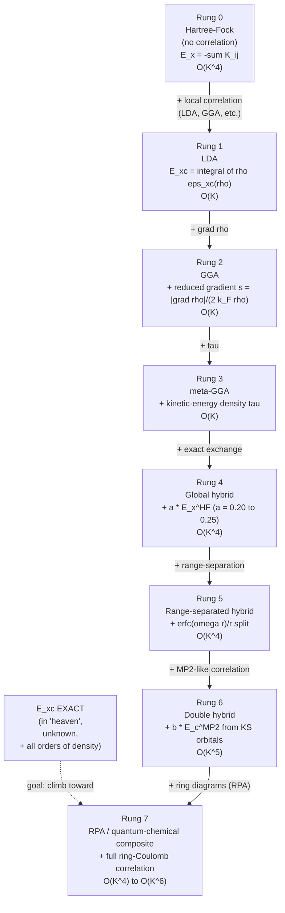

# Chapter 05 — XC functionals

> Every approximation in this chapter has the form "guess the shape of
> $E_\text{xc}[\rho]$". They differ in what they guess from — uniform
> electron gas, gradient expansions, exact exchange on a model system,
> empirical fits to a training set — and in how well they generalise.

By the end of [chapter 04]({{ site.baseurl }}/dft-notes/chapter-04/)
the Kohn–Sham machinery is in place: we have a self-consistent
one-body eigenvalue equation whose **only** unphysical ingredient is
the exchange–correlation functional $E_\text{xc}[\rho]$. The Hohenberg–
Kohn theorems ([chapter 02]({{ site.baseurl }}/dft-notes/chapter-02/))
*guarantee* that a unique such functional exists, but they say nothing
about how to *write it down*. The Kohn–Sham reformulation
([chapter 04]({{ site.baseurl }}/dft-notes/chapter-04/) § 4.2) splits
the exact energy into four pieces we can compute — non-interacting
kinetic $T_s$, electron–nuclear $\int \rho v_\text{ext}$, Hartree
$J[\rho]$, and nuclear–nuclear $E_\text{nn}$ — and one piece we
*cannot*: $E_\text{xc}[\rho]$. The whole of modern density-functional
theory is, in practice, a search for ever-better approximations to
that one piece. This chapter is a guided tour of the approximations
that have mattered: the **local density approximation** (LDA), the
**generalised-gradient approximation** (GGA), the **meta-GGA**, the
**hybrid** functionals (B3LYP, PBE0), the **range-separated**
hybrids (CAM-B3LYP, LC-$\omega$PBE, $\omega$B97X), the **double**
hybrids (B2-PLYP, DSD-PBEP86), and the various **dispersion
corrections** (D3, D4, MBD, vdW-DF) that retro-fit the missing
van-der-Waals physics. We close with a worked total-energy comparison
of helium across LDA, PBE, and Hartree–Fock, three problems that
exercise the formulas, and a decision tree for picking a functional in
practice.

## 5.1 The claim

The headline of this chapter is that **every useful approximation to
$E_\text{xc}[\rho]$ in current production use can be written as a sum
of one or more of the following ingredients** — a local density piece,
a gradient piece, a kinetic-energy piece, a fraction of exact
non-local Hartree–Fock exchange, a range-separation of that exchange,
an MP2-like correlation correction, and an empirical dispersion patch.
The "Jacob's ladder" metaphor of Perdew and Schmidt
([2001]({{ site.baseurl }}/dft-notes/extras/references/#perdew-2001))
orders these ingredients by increasing **rung**, and the rule of thumb
is "higher rung = more ingredients = more physics = (usually) more
accuracy and (always) more cost":

\begin{equation}
\label{eq:ch-05-jacobs-ladder}
E_\text{xc}^{\text{approx}}[\rho] \;=\; \underbrace{E_\text{xc}^{(0)}[\rho]}_{\text{LDA: }\rho \text{ only}}
\;+\; \underbrace{E_\text{xc}^{(1)}[\rho, \nabla\rho]}_{\text{GGA: } + \nabla\rho}
\;+\; \underbrace{E_\text{xc}^{(2)}[\rho, \nabla\rho, \tau]}_{\text{meta-GGA: } + \tau}
\;+\; \underbrace{a\, E_\text{x}^\text{HF}}_{\text{hybrid}}
\;+\; \underbrace{\text{RS}\bigl[E_\text{x}^\text{HF}\bigr]}_{\text{range-separated}}
\;+\; \underbrace{b\, E_\text{c}^\text{MP2}}_{\text{double hybrid}}
\;+\; \underbrace{E_\text{disp}}_{\text{dispersion}} .
\end{equation}

Equation \eqref{eq:ch-05-jacobs-ladder} is the **menu**, not a
single formula: every named functional (LDA, PBE, SCAN, B3LYP, …)
is a particular choice of *which* ingredients to include and *how
much* of each. The *exact* $E_\text{xc}[\rho]$ sits at the top of
the ladder, in "heaven", and is unknown.

The *formal definition* of $E_\text{xc}[\rho]$ is fixed by the
Kohn–Sham energy expression
\eqref{eq:ch-04-ks-energy} of [chapter 04]({{ site.baseurl }}/dft-notes/chapter-04/):
the part of the exact energy left over after subtracting the four
known pieces,

\begin{equation}
\label{eq:ch-05-exc-definition}
E_\text{xc}[\rho] \;=\; \bigl( \langle \hat T \rangle - T_s[\rho] \bigr)
\;+\; \bigl( \langle \hat V_{ee} \rangle - J[\rho] \bigr) .
\end{equation}

The first bracket is the **kinetic-correlation** correction: the
difference between the true interacting kinetic energy and the
non-interacting kinetic energy of the KS reference system. The
second bracket is the **exchange + correlation** correction to the
Hartree term: $\langle \hat V_{ee} \rangle$ is the full quantum
electron–electron repulsion and $J[\rho]$ is its classical
(semi-classical) part.  The exchange part of $\langle \hat V_{ee}
\rangle - J[\rho]$ is the **Fermi hole** — the reduction in
Coulomb repulsion caused by Pauli exclusion; the correlation part
is the **Coulomb hole** — the additional reduction caused by the
instantaneous avoidance of same-spin *and* opposite-spin electron
pairs.

> **Tip.**  Equation \eqref{eq:ch-05-exc-definition} is the *only*
> piece of this chapter that is *exact*. Everything else is
> approximation. The reader should leave this section with two
> facts in mind: (i) the exact $E_\text{xc}$ is a *single* functional
> of the density, even though we do not know its form; (ii) every
> practical functional in production is a *guess* at that form.

The menu of \eqref{eq:ch-05-jacobs-ladder} is a tower, not a flat
list, because each higher rung *subsumes* the lower ones in the
sense that you can recover LDA by turning off the gradient, kinetic,
hybrid, and dispersion ingredients of any GGA. Climbing the ladder
always adds ingredients, never subtracts them.

The question this chapter answers is, **for a given system, which
rung to climb to?** A casual answer ("always use the highest rung
you can afford") is wrong; a sophisticated answer requires knowing
*what each rung is good at and what it gets wrong*. The next seven
sections build that knowledge from the bottom up.

## 5.2 The derivation

This section is the bulk of the chapter. We start from the uniform
electron gas — the only system for which $E_\text{xc}$ is *known* to
high accuracy — and walk up Jacob's ladder, rung by rung. For each
rung we give the *form* of the functional, the *physical content* of
the new ingredient, the *constraint* (or training set) that fixes the
parameters, and a *representative named functional* that the reader
will encounter in the literature.

### 5.2.1 The uniform electron gas (UEG)

The **uniform electron gas** is the starting point of every modern
XC functional. It is a hypothetical system of $N$ electrons in a box
of volume $V$, with the electron–nuclear Coulomb attraction
*replaced* by a uniform positive background charge of density
$n_+ = N/V$. This makes the system translationally invariant, so
its ground-state energy is *automatically* an integral of a
*function* of the density rather than a *functional* — and that
function is the only piece of $E_\text{xc}$ we know exactly.

The UEG is parameterised by a single number, the **Wigner–Seitz
radius** $r_s$ — the radius (in Bohr) of the sphere whose volume
is the average volume per electron,

\begin{equation}
\label{eq:ch-05-wigner-seitz}
\frac{4\pi}{3} r_s^3 \;=\; \frac{V}{N} \;=\; \frac{1}{n}
\qquad\Longrightarrow\qquad
r_s \;=\; \left( \frac{3}{4\pi n} \right)^{1/3} .
\end{equation}

The density is $n = N/V$, with units of $a_0^{-3}$. The Wigner–Seitz
radius decreases as the gas is compressed: $r_s = 1\,a_0$ corresponds
to a dense electron gas with $n \approx 0.024\,a_0^{-3}$ (about
$1.5 \times 10^{24}\,\text{cm}^{-3}$, two orders of magnitude
denser than a typical valence electron density in a solid). The
$sp$-bonded simple metals have $r_s$ in the range $2$–$6\,a_0$
(Al: $r_s \approx 2.07\,a_0$; Na: $3.93\,a_0$; Cs: $5.62\,a_0$).

The exchange–correlation energy of the UEG, *per particle*,
$\varepsilon_\text{xc}(r_s)$, is the *defining* data of the LDA. It
is the sum of two pieces,

\begin{equation}
\label{eq:ch-05-ueg-decomposition}
\varepsilon_\text{xc}(r_s) \;=\; \varepsilon_\text{x}(r_s) \;+\; \varepsilon_\text{c}(r_s) ,
\end{equation}

with $\varepsilon_\text{x}$ the **exchange** (Fermi-hole) part and
$\varepsilon_\text{c}$ the **correlation** (Coulomb-hole) part.

**Exchange.** The exchange energy of the UEG was computed by Bloch
(1929) and Dirac (1930). The result, in Hartree per electron, is

\begin{equation}
\label{eq:ch-05-dirac-exchange}
\varepsilon_\text{x}(r_s) \;=\; -\frac{C_\text{x}}{r_s}
\;=\; -\frac{3}{4\pi}\,\left(\frac{9\pi}{4}\right)^{1/3} \frac{1}{r_s}
\;=\; -\frac{0.458165\ldots}{r_s} .
\end{equation}

The coefficient $C_\text{x} = (3/4\pi)(9\pi/4)^{1/3} = 0.458165\ldots$
is the **Dirac exchange coefficient**. To derive it from first
principles: in the UEG each plane-wave orbital
$\phi_{\mathbf k}(\mathbf r) = e^{i\mathbf k\cdot\mathbf r}/\sqrt V$
is occupied for $|\mathbf k| \le k_F$, where $k_F$ is the
**Fermi wave-vector** $k_F = (3\pi^2 n)^{1/3} = (9\pi/4)^{1/3}/r_s$.
The exchange energy per electron is then

\begin{equation}
\label{eq:ch-05-dirac-exchange-derivation}
\varepsilon_\text{x} \;=\; -\frac{1}{n}\,\frac{1}{2}\int\!\!\int
\frac{|\rho(\mathbf r_1, \mathbf r_2)|^2}{r_{12}} d\mathbf r_1 d\mathbf r_2 ,
\end{equation}

where the off-diagonal density matrix of the non-interacting KS system
is $\rho(\mathbf r_1, \mathbf r_2) = (2/V)\sum_{|\mathbf k|\le k_F}
e^{i\mathbf k\cdot(\mathbf r_1 - \mathbf r_2)}$. The sum becomes a
spherical integral over the Fermi sphere; performing it gives
\eqref{eq:ch-05-dirac-exchange}.

**Correlation.** The correlation energy of the UEG has *no* closed-form
expression. It is the small (typically $\sim 10\%$ of the magnitude
of the exchange) but non-negligible correction that comes from the
Coulomb hole. It has been computed by **quantum Monte Carlo** (QMC)
methods to high accuracy: the canonical reference is
Ceperley and Alder (1980), who used **variational** and
**fixed-node diffusion** Monte Carlo to compute the UEG energy at
several $r_s$ values for both the unpolarised ($N_\uparrow = N_\downarrow$)
and fully polarised ($N_\uparrow = N$, $N_\downarrow = 0$) gases.
The QMC data are then parametrised by an analytical fit, of which
the most-used is **Perdew–Zunger 1981** (PZ81):

\begin{equation}
\label{eq:ch-05-pz81-correlation}
\varepsilon_\text{c}^\text{PZ81}(r_s) \;=\;
\begin{cases}
B + A \ln r_s + D\, r_s + C\, r_s \ln r_s , & r_s < 1 , \\[2pt]
\dfrac{A_\text{PZ}}{1 + B_\text{PZ}\sqrt{r_s} + C_\text{PZ}\, r_s} , & r_s \ge 1 .
\end{cases}
\end{equation}

The unpolarised coefficients are
$(A, B, C, D) = (0.0311, -0.0480, 0.0020, -0.0116)$ and
$(A_\text{PZ}, B_\text{PZ}, C_\text{PZ}) = (-0.1423, 1.0529, 0.3334)$.
At the Wigner–Seitz radius of "typical" simple metals the values are
small: at $r_s = 2$ (close to aluminium) we have
$\varepsilon_\text{x} = -0.229\,E_h$ and
$\varepsilon_\text{c}^\text{PZ81} = -0.0451\,E_h$ (correlation is
about 20% of the exchange magnitude).

> **Note.**  Modern implementations of LDA usually use
> **Perdew–Wang 1992** (PW92) instead of PZ81 — it has a smoother
> behaviour around $r_s = 1$, a spin-interpolation formula that
> spans the full polarisation range, and is closer to the underlying
> QMC data. The qualitative shape is the same; we will use PZ81
> throughout the chapter for simplicity and because it is
> easier to remember.

A useful sanity check: at $r_s = 1$, PZ81 gives
$\varepsilon_\text{c}^\text{PZ81} = -0.0480\,E_h$ — the QMC
"benchmark" value to which the fit was anchored. The first-principles
**random phase approximation** (RPA) gives $-0.052\,E_h$ at the
same $r_s$, an under-binding that is the well-known signature of
RPA's missing higher-order exchange–correlation effects.

### 5.2.2 The local density approximation (LDA)

The **local density approximation** is the simplest possible
extrapolation of the UEG data to a non-uniform system. The
approximation has the form

\begin{equation}
\label{eq:ch-05-lda-form}
E_\text{xc}^\text{LDA}[\rho] \;=\; \int \rho(\mathbf r)\, \varepsilon_\text{xc}\bigl(\rho(\mathbf r)\bigr)\, d\mathbf r ,
\end{equation}

i.e. the integrand of the UEG formula is *kept* and the constant
$n$ is *replaced* by the local density $\rho(\mathbf r)$ at each
point. The integrand $\rho\, \varepsilon_\text{xc}(\rho)$ is called
the **XC energy density** and is a *local* function of $\rho$.

Equation \eqref{eq:ch-05-lda-form} has the structure of a
*geometric approximation*: at every point $\mathbf r$, the XC
energy per electron is taken to be the value it would have in a
*uniform* electron gas of the *same* density. The corresponding
**XC potential** — the functional derivative
$v_\text{xc}(\mathbf r) = \delta E_\text{xc}/\delta\rho(\mathbf r)$ —
is, by the chain rule,

\begin{equation}
\label{eq:ch-05-lda-potential}
v_\text{xc}^\text{LDA}(\mathbf r) \;=\; \varepsilon_\text{xc}\bigl(\rho(\mathbf r)\bigr)
\;+\; \rho(\mathbf r)\,\frac{d\varepsilon_\text{xc}}{d\rho}\bigg|_{\rho(\mathbf r)} .
\end{equation}

The first term is the *local* XC energy per electron; the second
term is the *response* of that energy to a local change in density.

The **spin-localised** version — the **LSDA**, used for open-shell
atoms, radicals, and ferromagnets — is

\begin{equation}
\label{eq:ch-05-lsda-form}
E_\text{xc}^\text{LSDA}[\rho_\uparrow, \rho_\downarrow] \;=\;
\int \rho(\mathbf r)\, \varepsilon_\text{xc}\bigl(\rho_\uparrow(\mathbf r), \rho_\downarrow(\mathbf r)\bigr)\, d\mathbf r ,
\end{equation}

where $\varepsilon_\text{xc}$ is now a function of *two* local
spin densities. The polarisation
$\zeta = (\rho_\uparrow - \rho_\downarrow)/\rho$ interpolates
between the unpolarised gas ($\zeta = 0$) and the fully polarised
gas ($\zeta = 1$). The standard interpolation
([Vosko-Wilk-Nusair 1980]({{ site.baseurl }}/dft-notes/extras/references/#vwn-1980),
VWN) is a rational function of $\zeta$ that fits the QMC
correlation energies of Ceperley and Alder for both limits.

> **Tip.**  The L in LDA does all the work. The D in LSDA is just
> "D for two densities". The accuracy of both is governed by the
> *uniform* assumption: the better the real density $\rho(\mathbf r)$
> is approximated by a constant, the better the approximation. LDA
> is therefore unexpectedly good for systems that *are* close to the
> UEG — simple $sp$ metals, jellium surfaces, the interiors of
> nearly-free-electron solids — and *bad* for systems with strong
> density gradients — atoms, molecules, surfaces, and $d$-/ $f$-
> electron materials.  Concretely, LDA typically over-binds molecules
> by 20–30 kcal/mol per bond and under-estimates lattice constants
> of solids by 1–3%.

### 5.2.3 The gradient expansion and its failure

The "obvious" generalisation of the LDA is the **gradient expansion
approximation** (GEA): expand the integrand in powers of the local
density gradient $\nabla\rho$ and keep the first non-trivial term.
The exchange part of the GEA, due to Herman, Van Dyke, and Ortenburger
([1969]({{ site.baseurl }}/dft-notes/extras/references/#hvo-1969)),
gives

\begin{equation}
\label{eq:ch-05-gea-exchange}
E_\text{x}^\text{GEA}[\rho] \;=\; E_\text{x}^\text{LDA}[\rho] \;-\; \frac{1}{4\pi}\int\!\!\int
\frac{|\nabla\rho(\mathbf r_1)|\, |\nabla\rho(\mathbf r_2)|}{\rho(\mathbf r_1)\,\rho(\mathbf r_2)}\,
\frac{1}{|\mathbf r_1 - \mathbf r_2|}\,
\rho\!\left(\frac{\mathbf r_1 + \mathbf r_2}{2}\right)
\,d\mathbf r_1 d\mathbf r_2 \;+\; \cdots
\end{equation}

The second term in \eqref{eq:ch-05-gea-exchange} — sometimes written
in the equivalent one-centre form
$\beta_\text{x} \int (\nabla\rho)^2 / \rho^{4/3} d\mathbf r$ with
$\beta_\text{x} = (7/432\pi)(6\pi^2)^{2/3} \approx 0.00278$ — is
*positive*, so the GEA *reduces* the magnitude of the LDA exchange
in regions of strong gradient. That is the right direction: the
exchange energy of a non-uniform system should be *less* negative
than the LDA value, because the inhomogeneity weakens the Fermi
hole. The problem is that the GEA *blows up* in the *exponential
tail* of an atomic density, where $\rho \to 0$ and the gradient
expansion diverges. A bare GEA is therefore *worse* than LDA for
atoms and molecules.

The GEA's divergence is a *symptom* of the deeper fact that the XC
energy is not analytic in $\nabla\rho$ at the *atomic* density
limit. The fix is the **generalised-gradient approximation** of the
next section: parametrise the *enhancement factor* of the LDA
integrand as a *bounded* function of a *dimensionless* reduced
gradient, and fix the parameters by exact constraints (PBE) or by
empirical fits (B88, LYP).

> **Note.**  The history of the GGA is a history of attempts to
> *tame* the gradient expansion. The original PBE paper
> ([Perdew, Burke, Ernzerhof 1996]({{ site.baseurl }}/dft-notes/extras/references/#pbe-1996))
> makes the "no free parameters" point by showing that the simplest
> *constraint-satisfying* enhancement factor already does most of
> the work. The competing "empirical" school — Becke 1988 (B88)
> for exchange, Lee–Yang–Parr 1988 (LYP) for correlation — fits
> parameters to atomic data, with comparable accuracy. The
> functional zoo is the result of fitting different training sets.

### 5.2.4 The GGA — PBE and friends

A **generalised-gradient approximation** has the same integrand
structure as the LDA but with an *enhancement factor* $F_\text{xc}$
that depends on a *dimensionless* reduced gradient $s$,

\begin{equation}
\label{eq:ch-05-gga-form}
E_\text{xc}^\text{GGA}[\rho] \;=\; \int \rho(\mathbf r)\,
\varepsilon_\text{xc}^\text{LDA}\bigl(\rho(\mathbf r)\bigr)\,
F_\text{xc}\bigl(s(\mathbf r)\bigr)\, d\mathbf r ,
\end{equation}

where the **reduced gradient** is

\begin{equation}
\label{eq:ch-05-reduced-gradient}
s(\mathbf r) \;=\; \frac{|\nabla\rho(\mathbf r)|}{2 k_F(\mathbf r)\, \rho(\mathbf r)} ,
\qquad
k_F(\mathbf r) \;=\; \bigl(3\pi^2 \rho(\mathbf r)\bigr)^{1/3} .
\end{equation}

The factor $2 k_F \rho$ in the denominator makes $s$
*dimensionless*: $k_F$ has units of $a_0^{-1}$ and
$\nabla\rho$ has units of $a_0^{-4}$, so the ratio has units of
$a_0$, the natural atomic unit of length. The factor of 2 is a
convention from the early literature; the resulting $s$ is
typically small in the bulk ($s \lesssim 0.5$ for a slowly-varying
density) and large in atomic tails ($s \gtrsim 5$). The function
$F_\text{xc}(s)$ controls the *enhancement* of the LDA integrand:
$F_\text{xc}(0) = 1$ recovers the LDA; $F_\text{xc}(s) > 1$
*enhances* the integrand (reduces the magnitude of the
exchange energy); $F_\text{xc}(s) < 1$ *suppresses* it.

For exchange, the GGA enhancement factor is conventionally written
$F_\text{x}(s)$; for correlation, the GGA enhancement is a separate
function $H(t)$ of a *different* reduced gradient
$t = |\nabla\rho|/(2 k_s \rho)$ with
$k_s = (4 k_F/\pi)^{1/2}$ (the **Thomas–Fermi screening wave-vector**).
The two ingredients — $F_\text{x}(s)$ and $H(t)$ — together make
$F_\text{xc}$ in \eqref{eq:ch-05-gga-form}.

**PBE exchange.** The **Perdew–Burke–Ernzerhof** (PBE) enhancement
factor for exchange is the simplest form that satisfies four
*exact* constraints:

\begin{equation}
\label{eq:ch-05-pbe-fx}
F_\text{x}^\text{PBE}(s) \;=\; 1 + \kappa - \frac{\kappa}{1 + \mu s^2 / \kappa} ,
\end{equation}

with $\kappa = 0.804$ and $\mu = 0.21951$ (in atomic units). The
four constraints are:

1. $F_\text{x}(0) = 1$ — the LDA is recovered for a uniform density.
2. The **Lieb–Oxford bound** $E_\text{x} \ge -1.679\,E_h \cdot N$, which
   becomes $F_\text{x}(s) \le 1 + \kappa$ (with $\kappa$ chosen to
   reproduce the bound).
3. The leading gradient correction of the GEA:
   $F_\text{x}(s) \to 1 + (10/81) s^2$ for small $s$.
4. A *non-negative* second derivative for the asymptotic density
   (so that the enhancement does not diverge), enforced by the
   rational form $1/(1 + \mu s^2/\kappa)$.

The shape of $F_\text{x}^\text{PBE}$: it starts at $1$ for $s = 0$,
grows monotonically, and asymptotes to $1 + \kappa = 1.804$ for
$s \to \infty$. The growth is *slow* at small $s$ — the
$\mu s^2/\kappa$ in the denominator damps it — and *fast* for
moderate $s$ — the asymptotic value $1 + \kappa$ is reached by
$s \sim 3$. This is the *physical* behaviour: an atomic-density
tail ($s$ large) wants more enhancement than the bulk ($s$ small)
to mimic the *weaker* exchange of an inhomogeneous density.

**PBE correlation.** The PBE correlation enhancement $H$ is more
elaborate because correlation is a smaller and more delicate
quantity than exchange. The starting point is the LDA correlation
$\varepsilon_\text{c}^\text{LDA}(r_s)$; the PBE adds an enhancement
that vanishes in the uniform limit,

\begin{equation}
\label{eq:ch-05-pbe-h}
H\bigl[\varepsilon_\text{c}^\text{LDA}, t\bigr] \;=\;
\gamma\,\ln\!\left[ 1 + \frac{\beta}{\gamma} t^2\,
\frac{1 + A t^2}{1 + A t^2 + (A t^2)^2} \right] ,
\end{equation}

with

\begin{equation}
\label{eq:ch-05-pbe-a}
A \;=\; \frac{\beta}{\gamma}\,\frac{1}{\exp(-\varepsilon_\text{c}^\text{LDA}/\gamma) - 1} .
\end{equation}

The PBE parameters are $\beta = 0.066725$ and
$\gamma = (1 - \ln 2)/\pi^2 \cdot \text{const} = 0.031091$ (the
latter chosen to reproduce the LDA correlation in the high-density
limit). The structure of $H$ guarantees three constraints:

1. $H \to 0$ as $t \to 0$ (LDA is recovered for a uniform density).
2. $H \to \beta t^2$ for small $t$ (the second-order GEA limit).
3. $H$ is *non-negative* for all $t$ (the gradient always *reduces*
   the magnitude of the correlation energy, never increases it).

**The PBE functional.**  Combining the exchange and correlation
enhancement factors, the full PBE exchange–correlation energy is

\begin{equation}
\label{eq:ch-05-pbe-total}
E_\text{xc}^\text{PBE}[\rho] \;=\; \int \rho\, \varepsilon_\text{x}^\text{unif}(\rho)\, F_\text{x}^\text{PBE}(s)\, d\mathbf r
\;+\; \int \rho\, \bigl[\varepsilon_\text{c}^\text{LDA}(r_s) + H(t)\bigr]\, d\mathbf r .
\end{equation}

PBE is the *de facto* default functional of solid-state physics. It
is non-empirical (no parameters were fit to atomisation energies
or any other molecular data), it satisfies the leading exact
constraints, and it has been used to compute the structural,
vibrational, and electronic properties of more materials than any
other XC functional in history. The cost is identical to LDA —
both require $\rho(\mathbf r)$ and $\nabla\rho(\mathbf r)$ on a grid.

> **Tip.**  "PBE is the de facto default of solid-state physics,
> B3LYP is the de facto default of main-group quantum chemistry".
> These defaults were *not* chosen for the other regime, and using
> them outside their sweet spots is asking for trouble. PBE under-
> estimates semiconductor band gaps by 30–50% (B3LYP is no
> better). B3LYP gives a poor description of metals and
> semiconductors (PBE is much better). When the literature on your
> system class has converged on a different functional, use that
> one.

**Other GGAs.** The PBE form is the *constraint-satisfying*
paradigm. The competing *empirical* paradigm is B88 exchange (Becke
1988) for the exchange part and LYP correlation (Lee, Yang, Parr
1988) for the correlation part; the combination is **BLYP**, the
canonical GGA of organic chemistry. B88 has a *different*
enhancement factor form (an *inverse-square-root* rather than a
*rational*) and one empirical parameter fit to the exact exchange
of the H atom:

\begin{equation}
\label{eq:ch-05-b88-fx}
F_\text{x}^\text{B88}(s) \;=\; 1 + \frac{\beta\, s^2}{1 + \gamma\, s\, \operatorname{arcsinh}(c s)} ,
\qquad
\beta = 0.0042 , \; \gamma = 0.002 , \; c = 6 .
\end{equation}

The B88 enhancement factor asymptotes to $\sim 1.69$ for large $s$,
compared to PBE's $1.804$. The two are comparable in the bulk; the
difference matters in the *tails* of atomic densities, where the
asymptotic behaviour controls molecular binding energies.

PW91 (Perdew–Wang 1991) is the *predecessor* of PBE and the
default GGA of many older solid-state codes. PBE was designed to
be a *cleaner* version of PW91 — fewer conditions, no fitted
parameters, better constraint satisfaction. The numerical
difference is small: PBE and PW91 atomisation energies agree to
within 1–2 kcal/mol on the G2 set.

### 5.2.5 The meta-GGA — adding $\tau$

A **meta-GGA** adds a third local ingredient to the GGA menu: the
**orbital kinetic-energy density**

\begin{equation}
\label{eq:ch-05-tau}
\tau(\mathbf r) \;=\; \frac{1}{2}\sum_i^\text{occ} |\nabla\phi_i(\mathbf r)|^2 .
\end{equation}

The functional now depends on three local variables: $\rho$,
$\nabla\rho$, and $\tau$. The new ingredient is *informative* in
two ways that the GGA ingredients are not.

1. $\tau$ is large in *single-orbital* regions (covalent bonds,
   lone pairs) and small in *multi-orbital* regions (atom cores).
   The GGA ingredients cannot distinguish these: $\rho$ is large
   and $\nabla\rho$ is non-zero in both. The meta-GGA can.
2. $\tau$ behaves differently in covalent, metallic, and
   weak-interaction regions. The GGA ingredients see only the
   *shape* of the density, not the *orbital character* of the
   region.

The new menu item is conventionally written as an enhancement
factor $F_\text{xc}(\rho, \nabla\rho, \tau)$, so the meta-GGA
exchange–correlation energy has the form

\begin{equation}
\label{eq:ch-05-meta-gga-form}
E_\text{xc}^\text{meta-GGA}[\rho] \;=\; \int \rho(\mathbf r)\, \varepsilon_\text{x}^\text{unif}(\rho(\mathbf r))\,
F_\text{xc}\bigl(\rho, \nabla\rho, \tau\bigr)\, d\mathbf r .
\end{equation}

A common reparametrisation uses the **dimensionless orbital
indicator**

\begin{equation}
\label{eq:ch-05-orbital-indicator}
\alpha(\mathbf r) \;=\; \frac{\tau(\mathbf r) - \tau^\text{TF}(\mathbf r)}{\tau^\text{UEG}(\mathbf r)} ,
\qquad
\tau^\text{TF} \;=\; \frac{3}{10}(3\pi^2)^{2/3} \rho^{5/3} ,
\qquad
\tau^\text{UEG} \;=\; \frac{3}{10}(3\pi^2)^{2/3} \rho^{5/3} .
\end{equation}

In a *single-orbital* region, $\tau \gg \tau^\text{TF}$ and
$\alpha \gg 0$. In a *multi-orbital* (e.g. atomic core) region,
$\tau \approx \tau^\text{UEG}$ and $\alpha \approx 0$. The meta-GGA
can therefore detect the *number of orbitals* contributing at each
point — a piece of physics the GGA cannot see.

**SCAN.** The **Strongly Constrained and Appropriately Normed**
(SUN, Ruzsinszky, Perdew 2015) functional is the most successful
meta-GGA of the last decade. It satisfies 17 known exact
constraints of the XC functional, and its parameters are *not*
fit to any training set. The 17 constraints include the LDA
limit, the GEA limit, the uniform scaling of the correlation
energy, the iso-orbital indicator limits, and several more
technical conditions on the second functional derivative. The
"SUN" acronym refers to the way the parameters are chosen: each
parameter is fixed by a single constraint, with no empirical
fitting. SCAN is the *first* functional to satisfy all 17
constraints simultaneously; its predecessor, the TPSS meta-GGA
([Tao, Perdew, Staroverov, Scuseria 2003]({{ site.baseurl }}/dft-notes/extras/references/#tpss-2003)),
satisfied 12. The accuracy gain of SCAN over PBE on the G2 atomisation set is
roughly a factor of 3: PBE has a mean absolute error (MAE) of
$\sim 20$ kcal/mol; SCAN drops this to $\sim 8$ kcal/mol. The
gain on lattice constants and bulk moduli of solids is smaller
($\sim 0.02$ Å in $a_0$ and $\sim 5$ GPa in $B_0$) but consistent.
The cost is the same as PBE (one extra evaluation of $\tau$ per
grid point).

**TPSS.** The Tao–Perdew–Staroverov–Scuseria (TPSS) functional
preceded SCAN by 12 years and is still widely used in solid-state
codes that have not yet migrated to SCAN. TPSS is also
non-empirical and constraint-satisfying (12 constraints), with an
enhancement factor of the form

\begin{equation}
\label{eq:ch-05-tpss-form}
F_\text{x}^\text{TPSS}(\rho, s, \alpha) \;=\; F_\text{x}^\text{PBE}(s)\,\bigl[1 + d\, \alpha\, s^2\bigr]^{-1} ,
\end{equation}

where $d$ is a constant chosen by a constraint. The PBE part is
*modulated* by the orbital indicator $\alpha$. The TPSS
atomisation MAE on G2 is $\sim 12$ kcal/mol — better than PBE,
worse than SCAN. r²SCAN (Bartók and Yates 2019) is a *regularised*
version of SCAN that is numerically more stable in the asymptotic
density regime.

### 5.2.6 The hybrid functionals — admixing exact exchange

The fourth rung of Jacob's ladder is the **hybrid** functional: a
*linear combination* of a GGA (or meta-GGA) exchange and a fraction
of *exact* non-local Hartree–Fock exchange,

\begin{equation}
\label{eq:ch-05-hybrid-form}
E_\text{xc}^\text{hybrid} \;=\; a\, E_\text{x}^\text{exact} \;+\; (1 - a)\, E_\text{x}^\text{GGA} \;+\; E_\text{c}^\text{GGA} ,
\end{equation}

where $a \in [0, 1]$ is the **mixing parameter**. The
*correlation* part stays GGA — exact correlation is
prohibitively expensive in the post-HF sense (full CI, CCSD(T)),
and there is no analogue of "exact exchange" for correlation that
is cheap to evaluate. The cost of a hybrid functional is
$\mathcal{O}(K^4)$ per SCF iteration, dominated by the
four-centre exchange integrals of the HF part.

The mixing parameter $a$ is the central design choice. The
historical value is $a = 0.20$ (the Becke 3-parameter fit of
B3LYP); the theoretically motivated value is $a = 0.25$ (from
the adiabatic-connection argument below). The empirical
*optimum* depends on the system class: $a = 0.20$ is good for
main-group thermochemistry, $a = 0.25$ is good for solids, and
larger values ($a = 0.40$–$0.50$) are used for transition-metal
chemistry where the self-interaction error of GGA is severe.

**The adiabatic-connection fluctuation-dissipation theorem
(ACFDT).** The "derivation" of the mixing fraction $a = 1/4$ in
PBE0 (and the *de facto* explanation of why $a$ should be
"around 0.25" for any hybrid) is the **adiabatic-connection
formula**. The construction is as follows.

Imagine a family of $N$-electron systems parameterised by a
**coupling constant** $\lambda$ that smoothly interpolates between
the non-interacting KS system ($\lambda = 0$) and the physical
interacting system ($\lambda = 1$). The Hamiltonian along the path
is

\begin{equation}
\label{eq:ch-05-ac-hamiltonian}
\hat H_\lambda \;=\; \hat T \;+\; \lambda\, \hat V_{ee} \;+\; \hat V_\text{ext}^\lambda ,
\end{equation}

where $\hat V_\text{ext}^\lambda$ is adjusted at each $\lambda$ to
keep the *density fixed* at the physical density $\rho$. The
**adiabatic-connection** formula for $E_\text{xc}$ is then an
*integral* over $\lambda$:

\begin{equation}
\label{eq:ch-05-acfdt-exc}
E_\text{xc}[\rho] \;=\; \int_0^1 \langle \Psi_\lambda | \hat V_{ee} | \Psi_\lambda \rangle\, d\lambda
\;-\; J[\rho] .
\end{equation}

The integrand is the *expectation value of the electron–electron
Coulomb repulsion* in the $\lambda$-interacting wavefunction
$\Psi_\lambda$ that gives the physical density $\rho$, minus the
classical Hartree term. The decoupling of the $\lambda = 0$ and
$\lambda = 1$ limits gives the famous **Görling–Levy perturbation
theory** result

\begin{equation}
\label{eq:ch-05-gl-perturbation}
E_\text{xc} \;=\; E_\text{xc}^\text{GL2} \;+\; \mathcal{O}\bigl[(\hat V_{ee} - \hat V_\text{H} - \hat V_\text{xc})^3\bigr] .
\end{equation}

At *second order* in the coupling, the integrand of
\eqref{eq:ch-05-acfdt-exc} is *linear* in $\lambda$, and the
integral reduces to a *midpoint* rule: $E_\text{xc} \approx
\langle \Psi_{1/2} | \hat V_{ee} | \Psi_{1/2} \rangle - J$. The
$\lambda = 1/2$ wavefunction is *half-interacting*, and its
exchange energy is the *exact* Hartree–Fock exchange evaluated on
the KS orbitals. The GGA part of the integrand accounts for the
*correlation* contribution. The recipe is therefore:

\begin{equation}
\label{eq:ch-05-pbe0-acfdt}
E_\text{xc}^\text{PBE0} \;=\; \frac{1}{4}\, E_\text{x}^\text{exact} \;+\; \frac{3}{4}\, E_\text{x}^\text{PBE} \;+\; E_\text{c}^\text{PBE} .
\end{equation}

The factor $1/4$ comes from the *midpoint* of the linear
$\lambda$-integral: a $1/4$–$3/4$ *average* of the $\lambda = 0$
(GGA) and $\lambda = 1$ (exact-exchange) limits. PBE0 is
parameter-free and uses *no empirical fit*. The 1/4 is *not* a
fitted number; it is the second-order GL2 prediction.

> **Warning.**  The 1/4 is a *lower bound* on the optimum
> mixing. Empirically, PBE0 (1/4) tends to over-correct the
> LDA/GGA binding of small molecules; B3LYP (20% exact exchange)
> was designed with 3 fitted parameters to be slightly less
> "exact-exchange-y" than PBE0 for thermochemistry. The reader
> should think of the ACFDT derivation as a *reason* the mixing
> is "around 0.25", not as a proof that it is *exactly* 0.25. **B3LYP.** The **Becke 3-parameter Lee–Yang–Parr** functional
(B3LYP) is the canonical example of a *fitted* hybrid. The
functional form is

\begin{equation}
\label{eq:ch-05-b3lyp-form}
E_\text{xc}^\text{B3LYP} \;=\; a_0\, E_\text{x}^\text{exact}
\;+\; (1 - a_0)\, E_\text{x}^\text{LDA}
\;+\; a_\text{x}\, \Delta E_\text{x}^\text{B88}
\;+\; E_\text{c}^\text{LYP} \;+\; (1 - a_\text{c})\, E_\text{c}^\text{VWN} ,
\end{equation}

where $\Delta E_\text{x}^\text{B88} = E_\text{x}^\text{B88} -
E_\text{x}^\text{LDA}$ is the B88 *enhancement* of the LDA
exchange. The three parameters $(a_0, a_\text{x}, a_\text{c}) =
(0.20, 0.72, 0.81)$ were fit to a *training set* of atomisation
energies, ionisation potentials, electron affinities, and
proton affinities of small molecules (the so-called G1 set, the
precursor of G2). The most-commonly-quoted B3LYP parameters are
sometimes given as $(0.20, 0.72, 0.81)$, sometimes as
$(0.05, 0.72, 0.81)$ depending on the convention for which LDA
correlation is used; the user should always check the form
implemented in the code.

The cost of B3LYP is the cost of any global hybrid: $\mathcal
O(K^4)$ per SCF iteration, dominated by the four-centre exchange
integrals. The accuracy gain over PBE on main-group
thermochemistry is roughly a factor of 4 — B3LYP atomisation
MAE on G2 is $\sim 5$ kcal/mol vs PBE's $\sim 20$ kcal/mol — but
the gain on transition-metal chemistry, band gaps, and
non-covalent interactions is small or negative. **B3LYP is the
historical default of organic chemistry, not a universal
default**.

**PBE0.** The **PBE0** functional (also called PBE1PBE) is the
*non-empirical* cousin of B3LYP: the mixing parameter is fixed
at $a = 1/4$ by the ACFDT argument above, and the remaining
ingredients are PBE exchange and PBE correlation. The PBE0
atomisation MAE on G2 is $\sim 7$ kcal/mol — worse than B3LYP
($\sim 5$) on the small-molecule set where B3LYP was fit, but
*better* than B3LYP on lattice constants, bulk moduli, and
band structures of solids. PBE0 is the *de facto* default hybrid
of solid-state physics for the same reason PBE is the default
GGA: it is non-empirical, constraint-satisfying, and accurate
across a wide range of systems.

> **Note.**  The 1/4 of PBE0 and the 0.20 of B3LYP are *not* the
> same number. The PBE0 1/4 is the second-order GL2 prediction;
> the B3LYP 0.20 is a fit to atomisation energies. The two
> functionals use the *same* PBE exchange and *different*
> correlation (PBE correlation for PBE0, LYP for B3LYP), so the
> comparison is not apples-to-apples. A more controlled
> comparison is PBE0 vs **PBE0 with LYP correlation** ("PBE0-LYP"
> in some codes); on G2, PBE0-LYP is *better* than PBE0 by about
> 1 kcal/mol MAE, but *worse* than B3LYP by about 1 kcal/mol
> MAE. The fitted mixing fraction is a *real* effect, not just
> noise.

### 5.2.7 Range-separated hybrids

The fifth rung is the realisation that exact exchange is
**range-dependent**. The exchange energy of a uniform gas is
*local* in $r$ (the Dirac form) and the exchange energy of a
real molecule has a *non-local* part (the HF exchange integral)
that decays as $1/r_{12}$ in the *long range*. A GGA treats the
*short* range of the exchange well (because the LDA form
*locally* captures the Pauli hole) and the *long* range poorly
(because the LDA is a local approximation and the long-range
exchange is fundamentally non-local). A **range-separated
hybrid** exploits this by splitting the Coulomb operator into a
*short-range* and a *long-range* part,

\begin{equation}
\label{eq:ch-05-rs-split}
\frac{1}{r_{12}} \;=\; \underbrace{\frac{\operatorname{erfc}(\omega r_{12})}{r_{12}}}_{\text{short range}} \;+\; \underbrace{\frac{\operatorname{erf}(\omega r_{12})}{r_{12}}}_{\text{long range}} .
\end{equation}

The split is parameterised by the **range-separation
parameter** $\omega$ (in $a_0^{-1}$). For $\omega \to \infty$ the
erfc becomes 1 for any $r_{12} > 0$ and the erf becomes 0, so the
split reduces to "all short range, no long range": a hybrid with
*full* exact exchange, with no DFT in the long range. For
$\omega \to 0$ the split reduces to "all long range, no short
range": a GGA-like treatment of the long range, no exact exchange
at all. The intermediate regime — $\omega \sim 0.2$–$0.4$ — is
where the useful range-separated hybrids live.

The functional form is

\begin{equation}
\label{eq:ch-05-rs-form}
E_\text{xc}^\text{RS} \;=\; E_\text{x}^\text{SR,DFT} \;+\; E_\text{x}^\text{LR,HF} \;+\; E_\text{c}^\text{DFT} ,
\end{equation}

where the *short-range* exchange is treated by the DFT
ingredient (e.g. PBE exchange) and the *long-range* exchange is
treated by *exact* HF exchange. The correlation part is the
*short-range* DFT correlation; the long-range correlation is
*absorbed* into the long-range HF exchange (the HF exchange
integral already contains a non-local exchange-correlation
contribution by virtue of the Pauli principle).

> **Tip.**  The range-separation parameter $\omega$ controls the
> trade-off between the *short-range DFT* and the *long-range
> HF* parts. Small $\omega$ (e.g. HSE06's $\omega = 0.11$) means
> most of the Coulomb is treated at the DFT level and only the
> asymptotic tail is HF: this is the regime of *screened
> exchange*, used in solid-state physics. Large $\omega$
> (e.g. $\omega$B97X's $\omega = 0.25$–$0.40$) means more of
> the Coulomb is treated at the HF level: this is the regime of
> *long-range corrected* hybrids, used for charge-transfer
> excitations and Rydberg states in quantum chemistry.

**CAM-B3LYP.** The **Coulomb-Attenuating Method** (CAM) of Yanai,
Tew, and Handy (2004) is the canonical example of a
range-separated hybrid. The functional form is

\begin{equation}
\label{eq:ch-05-camb3lyp-form}
E_\text{xc}^\text{CAM-B3LYP} \;=\; \alpha\, E_\text{x}^\text{HF} \;+\; \beta\, E_\text{x}^\text{LR,HF} \;+\; (1 - \alpha)\, E_\text{x}^\text{B88}
\;+\; 0.19\, E_\text{c}^\text{LYP} \;+\; 0.81\, E_\text{c}^\text{VWN} ,
\end{equation}

with $\alpha = 0.19$, $\beta = 0.46$, and $\omega = 0.33\,a_0^{-1}$.
The *total* HF exchange is $\alpha + \beta = 0.65$ (65% of the
exchange is exact at long range, 19% at short range). CAM-B3LYP
is the *de facto* default for TDDFT calculations of charge-
transfer excitations and Rydberg states in organic molecules.

**LC-$\omega$PBE.** The **long-range corrected** PBE (LC-$\omega$PBE)
is the range-separated variant of PBE. It uses 0% DFT exchange at
long range (full HF) and 100% PBE exchange at short range,
$\omega = 0.40\,a_0^{-1}$. The functional is parameter-free in
the sense that $\omega$ is *not* fit to a training set — it is
the standard PBE choice — but the *form* (0/100 split) is a
design choice, not a derivation. LC-$\omega$PBE is widely used
for organic electronics and for benchmarking charge-transfer
excitations in TDDFT.

**$\omega$B97X.** The **$\omega$B97X** family (Chai and Head-Gordon
2008) is a *fully* range-separated hybrid with the
range-separation parameter $\omega$ *itself* optimised against a
training set. The simplest member, $\omega$B97X, uses
$\omega = 0.25\,a_0^{-1}$, 100% long-range HF exchange, and a
fitted short-range exchange. The variant $\omega$B97X-D adds the
**D3 dispersion correction** (section 5.2.9). $\omega$B97X-V is
the *nonlocal* dispersion version. The $\omega$B97 family is
one of the most accurate *general-purpose* hybrid families in
the modern literature; the most-recommended member for main-
group thermochemistry is $\omega$B97X-D (or its revamped
successor, $\omega$B97M(2), a double-hybrid range-separated
functional).

**HSE06.** The **Heyd–Scuseria–Ernzerhof** screened hybrid is the
*screened* limit of the range-separated family: $\omega = 0.11$ and
25% short-range HF exchange, with the long-range exchange treated
*purely* at the PBE level. The form is "PBE0 with the long-range
exact exchange zeroed out". HSE06 is the *de facto* default
hybrid of solid-state physics: it gives band gaps of
semiconductors in much better agreement with experiment than
PBE0, while keeping the cost of the hybrid manageable (the
long-range HF exchange is the *expensive* part, and HSE06 has
none of it).

### 5.2.8 Double hybrids

A **double hybrid** is the *sixth* rung: a hybrid functional with
*both* a fraction of exact exchange *and* a fraction of
**MP2-like correlation** computed from the KS orbitals,

\begin{equation}
\label{eq:ch-05-double-hybrid-form}
E_\text{xc}^\text{double} \;=\; a\, E_\text{x}^\text{exact} \;+\; (1 - a)\, E_\text{x}^\text{DFT} \;+\; b\, E_\text{c}^\text{MP2} \;+\; (1 - b)\, E_\text{c}^\text{DFT} .
\end{equation}

The MP2-like correlation is the **second-order Møller–Plesset**
correlation energy evaluated on the KS orbitals (sometimes
called "MP2 in the KS basis"). The cost of a double hybrid is
$\mathcal O(K^5)$ per SCF iteration, dominated by the
four-centre MP2 correlation integrals.

The mixing parameters are typically $a \approx 0.5$–$0.8$ (more
HF exchange than a single hybrid) and $b \approx 0.2$–$0.5$
(some of the correlation is taken from MP2, the rest from DFT).
The atomisation MAE on G2 for the best double hybrids is
$\sim 2$–$3$ kcal/mol — close to the *chemical-accuracy*
threshold of 1 kcal/mol.

**B2-PLYP.** The **Grimme 2006** double hybrid is the canonical
example. The functional form is

\begin{equation}
\label{eq:ch-05-b2plyp-form}
E_\text{xc}^\text{B2-PLYP} \;=\; 0.53\, E_\text{x}^\text{HF} \;+\; 0.47\, E_\text{x}^\text{B88} \;+\; 0.73\, E_\text{c}^\text{LYP} \;+\; 0.27\, E_\text{c}^\text{MP2} .
\end{equation}

The mixing parameters $(0.53, 0.27)$ were fit to a thermochemical
training set. B2-PLYP is widely used in computational organic
chemistry for *barrier heights*, where single hybrids (B3LYP,
PBE0) systematically under-estimate. The cost is roughly
$\mathcal O(K^5)$ — the MP2 part scales as $K^5$ with a small
prefactor — and is therefore $\sim 10$–$20$ times more expensive
than a single hybrid.

**DSD-PBEP86.** The **Doubles-Semicanonical** DSD-PBEP86
double hybrid (Martin and co-workers 2014) is a *spin-component-
scaled* (SCS) variant. The MP2-like correlation is split into
*same-spin* and *opposite-spin* contributions, and the two
contributions are scaled *separately*. The form is

\begin{equation}
\label{eq:ch-05-dsdpbep86-form}
E_\text{c}^\text{DSD-PBEP86} \;=\; c_\text{SS}\, E_\text{c}^\text{SS,MP2} \;+\; c_\text{OS}\, E_\text{c}^\text{OS,MP2} ,
\end{equation}

with $c_\text{SS} \approx 0.5$ and $c_\text{OS} \approx 1.0$ (the
opposite-spin contribution is *more* important than the same-spin
contribution for thermochemistry). The DSD-PBEP86 atomisation MAE
on a larger training set is $\sim 1.5$ kcal/mol — *better* than
B2-PLYP and close to the *gold standard* CCSD(T).

> **Warning.**  Double hybrids are *expensive*. The MP2-like
> correlation in a Gaussian basis scales as $\mathcal O(K^5)$ with
> basis size, and the cost per SCF iteration is roughly 10–20
> times that of a single hybrid. They are *not* practical for
> periodic solids with plane waves (where the MP2 correlation is
> not well-defined) and are mostly used in *small-molecule*
> computational chemistry. The reader should think of double
> hybrids as "the most expensive rung of Jacob's ladder" and use
> them sparingly.

### 5.2.9 Dispersion corrections

The final rung of the ladder, in the version of Perdew and
Schmidt that has been most influential, is **dispersion**. The
van-der-Waals (vdW) interaction — the *attractive* $1/r^6$ tail
between two non-overlapping density fragments — is *absent* from
every LDA, GGA, meta-GGA, and most hybrids. The DFT integrand is
a *local* (or semi-local) function of the density; the vdW tail
is a *non-local* functional of the density at *two* points
$\mathbf r_1$ and $\mathbf r_2$ that are *not* close. The
standard fix is to *add* a dispersion correction *a posteriori*:

\begin{equation}
\label{eq:ch-05-dispersion-correction}
E_\text{total} \;=\; E_\text{DFT} \;+\; E_\text{disp} ,
\end{equation}

where $E_\text{disp}$ is a correction term that is *pairwise*
(additive over pairs of atoms) or *many-body* (involves triple
and higher dipole interactions).

**DFT-D3.** The **Grimme D3** correction (Grimme et al. 2010) is
the most-used dispersion patch. The form is

\begin{equation}
\label{eq:ch-05-d3-form}
E_\text{disp}^\text{D3} \;=\; -\sum_{a < b} \sum_{n=6,8} \frac{C_n^{ab}}{R_{ab}^n}\,
f_\text{damp}(R_{ab}) ,
\end{equation}

where the $C_n^{ab}$ are *pairwise* dispersion coefficients
tabulated for every pair of atom types, and $f_\text{damp}$ is a
*damping function* that smoothly switches off the dispersion at
short range (where DFT already accounts for the interaction) and
*does not* diverge at long range. The $C_6$ and $C_8$
coefficients depend on the atom type and on the *hybridisation
state* (the local environment of the atom, computed from the
DFT density). The damping function has *one* or *two* fitted
parameters per functional: the D3 correction is parameterised
*slightly differently* for B3LYP, PBE, BLYP, etc.

The accuracy of D3-corrected functionals on the S22
non-covalent-interaction benchmark is typically $\sim 0.3$–$0.5$
kcal/mol MAE — better than the corresponding uncorrected hybrid
by a factor of 5. The cost is negligible: the D3 correction is a
sum over pairs of atoms and adds $\mathcal O(N^2)$ to the
energy evaluation.

**DFT-D4.** The **D4** correction (Caldeweyher et al. 2019) is
the *next-generation* D correction. It uses *machine-learned*
dispersion coefficients and *dynamic* polarisabilities that
account for the *chemical environment* of each atom in a more
sophisticated way than D3. D4 is more accurate than D3 on
transition-metal complexes (where the polarisability of a metal
atom depends strongly on its oxidation state) and on
non-covalent benchmarks more generally. The cost is the same as
D3. **Many-body dispersion (MBD).** The **MBD** method (Tkatchenko,
DiStasio, Car, Scheffler 2012) goes beyond the *pairwise*
approximation by including *three-body* and *higher* Axilrod–
Teller–Muto contributions. The form is

\begin{equation}
\label{eq:ch-05-mbd-form}
E_\text{disp}^\text{MBD} \;=\; \frac{1}{2}\sum_{a, b} V_{ab}^\text{TS} \;+\; \frac{1}{2}\sum_{a, b, c} V_{abc}^\text{ATM} \;+\; \cdots ,
\end{equation}

where the pairwise part uses the **Tkatchenko–Scheffler**
*self-consistent* screening of the atomic polarisabilities, and
the many-body part is a coupled-dipole calculation in the
random-phase approximation. MBD is more accurate than D3 on
*layered materials* (graphene, hexagonal boron nitride, MoS₂)
and on large molecules, but it is also more expensive: the
many-body part scales as $\mathcal O(N^3)$ with the number of
atoms. MBD is the *de facto* standard for high-accuracy
non-covalent-interaction calculations on solids and large
molecules.

**Nonlocal functionals (vdW-DF).** The **vdW-DF** family
(Dion et al. 2004; Thonhauser et al. 2007) is a *non-local*
correlation functional that is *integrated into* the XC
functional rather than added *a posteriori*. The form is

\begin{equation}
\label{eq:ch-05-vdwdf-form}
E_\text{c}^\text{nl}[\rho] \;=\; \frac{1}{2}\iint \rho(\mathbf r_1)\, \phi(\mathbf r_1, \mathbf r_2)\, \rho(\mathbf r_2)\, d\mathbf r_1 d\mathbf r_2 ,
\end{equation}

where $\phi(\mathbf r_1, \mathbf r_2)$ is a *kernel* that
couples the densities at two points. The kernel is constructed
to give the correct $C_6/r^6$ asymptotic behaviour at large
$r_{12}$ and to vanish for a uniform density. The vdW-DF
*rev* version (Hamada 2014) is the most-used modern variant.
The cost is roughly 2–3 times that of a GGA — the double
integral is evaluated by FFT-based methods in plane-wave codes.

> **Tip.**  "Dispersion-dominated" systems (layered materials,
> molecular crystals, host–guest complexes, biological macro-
> molecules) need *some* dispersion correction or they will
> collapse or fail to bind. The cheapest *and* most accurate
> choice for a hybrid functional on a small molecule is
> B3LYP-D3 or $\omega$B97X-D. The cheapest *and* most accurate
> choice for a layered material is SCAN + rVV10 (a
> nonlocal-correlation variant) or PBE + MBD. The choice
> depends on the system class; the *omission* of dispersion is
> always a mistake.

### 5.2.10 Jacob's ladder, in summary

The metaphor of **Jacob's ladder** (Perdew and Schmidt 2001) is
worth dwelling on for a moment because it has structured an
*entire generation* of functional development. The image is
biblical: a ladder reaching from earth to heaven, with the
exact $E_\text{xc}$ in heaven, the local-density approximation
on the ground, and the higher rungs as steps in between. Each
rung adds *one* new piece of physical information about the
density: LDA sees $\rho$; GGA sees $\nabla\rho$; meta-GGA sees
$\tau$; hybrid sees the *non-local* exchange of the KS
orbitals; range-separated hybrid sees the *r-dependence* of
the exchange; double hybrid sees the *virtual* KS orbitals
through MP2; dispersion sees the *tail* of the density.

| Rung | Functional class          | New ingredient                             | Cost          |
|:----:|:--------------------------|:-------------------------------------------|:--------------|
| 0    | Hartree–Fock              | (no correlation)                            | $\mathcal O(K^4)$ |
| 1    | LDA                       | $\rho(\mathbf r)$ only                      | $\mathcal O(K)$   |
| 2    | GGA                       | $+\,\nabla\rho$                            | $\mathcal O(K)$   |
| 3    | meta-GGA                  | $+\,\tau$                                  | $\mathcal O(K)$   |
| 4    | Global hybrid             | $+\,a\,E_\text{x}^\text{HF}$               | $\mathcal O(K^4)$ |
| 5    | Range-separated hybrid    | $+\,\omega$-split                          | $\mathcal O(K^4)$ |
| 6    | Double hybrid             | $+\,b\,E_\text{c}^\text{MP2}$              | $\mathcal O(K^5)$ |
| 7    | Random-phase approximation | full exchange + ring-Coulomb correlation  | $\mathcal O(K^4$–$K^6)$ |

The ladder has two important properties. First, **higher rungs
are not always better**: a *low* rung (LDA) can outperform a
*high* rung (a poorly-tuned hybrid) for a particular system.
The ladder is a *cost–complexity* ordering, not a monotonic-
accuracy ordering. Second, **chemical accuracy** (errors
$\lesssim 1$ kcal/mol on atomisation energies, $\lesssim 0.02$
Å on bond lengths) is *not* reached by LDA or GGA: the typical
LDA error is 30–50 kcal/mol per bond; the typical GGA error
is 10–30 kcal/mol. The threshold of 1 kcal/mol is reached
*only* by the top of the ladder (double hybrids, RPA) and
*only* for main-group thermochemistry.

> **Tip.**  "Climb the ladder as high as you can afford" is a
> reasonable first approximation to choosing a functional.
> Two practical refinements: (i) match the rung to the *system
> class* (solids, molecules, surfaces, layered materials all
> have different sweet spots); (ii) always include a
> dispersion correction on the fifth rung and above — the
> top of the ladder is no good for vdW-dominated systems
> without it.

## 5.3 The code

The first script of the chapter, in
`dft_notes/python_codes/chapter_05/01-ueg-xc-vs-rs.py`, computes
the **Dirac exchange** and the **Perdew–Zunger correlation** of
the UEG as a function of $r_s$ and writes them to a PNG. The
script is the runnable counterpart of the formulas in
section 5.2.1. We inline the loadable parts here.

```python
# dft_notes/python_codes/chapter_05/01-ueg-xc-vs-rs.py
# (full file is 248 lines; we inline the importable parts)
import os
import numpy as np
import matplotlib

matplotlib.use("Agg")
import matplotlib.pyplot as plt

# ─── Reference values ──────────────────────────────────────────────
# The Dirac-LDA exchange coefficient.  eps_x(r_s) = -Cx / r_s with
#   Cx = (3 / (4 pi)) * (9 pi / 4)^{1/3} = 0.45816519...
DIRAC_X_COEF = 0.458165

# Perdew-Zunger (1981), Table I, unpolarized UEG.
# High-density branch: eps_c = B + A * ln(rs) + D * rs + C * rs * ln(rs)
PZ_HIGH_DENSITY = {
    "A": 0.0311,
    "B": -0.0480,
    "C": 0.0020,
    "D": -0.0116,
}
# Low-density branch: eps_c = A_pz / (1 + B_pz * sqrt(rs) + C_pz * rs)
PZ_LOW_DENSITY = {
    "A": -0.1423,
    "B": 1.0529,
    "C": 0.3334,
}

def dirac_exchange(rs):
    """LDA exchange per particle (Dirac, 1930) in Hartree.
    eps_x(r_s) = -Cx / r_s
    """
    return -DIRAC_X_COEF / rs

def pz81_correlation_unpolarized(rs):
    """Perdew-Zunger (1981) fit to Ceperley-Alder QMC, unpolarized."""
    rs = np.asarray(rs, dtype=float)
    ec = np.empty_like(rs)
    mask_lo = rs < 1.0
    rs_lo = rs[mask_lo]
    c = PZ_HIGH_DENSITY
    ec[mask_lo] = (
        c["B"]
        + c["A"] * np.log(rs_lo)
        + c["D"] * rs_lo
        + c["C"] * rs_lo * np.log(rs_lo)
    )
    rs_hi = rs[~mask_lo]
    c = PZ_LOW_DENSITY
    ec[~mask_lo] = c["A"] / (1.0 + c["B"] * np.sqrt(rs_hi) + c["C"] * rs_hi)
    return ec

def main() -> None:
    rs = np.linspace(0.5, 10.0, 500)
    ex = dirac_exchange(rs)
    ec_pz = pz81_correlation_unpolarized(rs)
    exc = ex + ec_pz

    print("=" * 60)
    print("UEG exchange-correlation energy per particle")
    print("Perdew-Zunger (1981) fit to Ceperley-Alder QMC,")
    print("unpolarized UEG.")
    print("=" * 60)
    print(f"  At r_s = 2.00 bohr (close to Al):")
    print(f"    eps_x         = {dirac_exchange(np.array([2.0]))[0]:+.6f} E_h")
    print(f"    eps_c (PZ81)  = {pz81_correlation_unpolarized(np.array([2.0]))[0]:+.6f} E_h")
    print(f"    eps_xc        = {(dirac_exchange(np.array([2.0])) + pz81_correlation_unpolarized(np.array([2.0])))[0]:+.6f} E_h")
```

The script also computes the XC energy of the UEG for a few
model densities: at $r_s = 2$ (close to the electron density of
aluminium) the result is
$\varepsilon_\text{x} = -0.229\,E_h$,
$\varepsilon_\text{c}^\text{PZ81} = -0.0451\,E_h$, and
$\varepsilon_\text{xc} = -0.274\,E_h$ per electron. The
exchange is roughly 5 times larger than the correlation, in
absolute value, at typical metallic densities. At $r_s = 4$
(close to the electron density of sodium) the numbers are
$-0.115$, $-0.0328$, and $-0.147\,E_h$, in the same proportion.
This is the data on which *every* modern LDA functional is
built.

The full script produces a plot of
$\varepsilon_\text{x}(r_s)$, $\varepsilon_\text{c}^\text{PZ81}(r_s)$,
and the Wigner interpolation
$\varepsilon_\text{c}^\text{Wigner}(r_s) = -0.088/(r_s + 7.8)$,
with the $r_s$ values of Al, Na, and Cs marked. The output PNG
is in
`dft_notes/python_codes/chapter_05/plots/01-ueg-xc-vs-rs.png`.

> **Tip.**  The script is *self-contained*: it depends only on
> `numpy` and `matplotlib` (with `matplotlib.use("Agg")` for
> headless runs), and it does not call `os.chdir`. Run it from
> the repo root with
> `python dft_notes/python_codes/chapter_05/01-ueg-xc-vs-rs.py`
> and the plot will appear in the `plots/` subfolder. The
> companion script
> `02-pbe-vs-lda-atoms.py` computes the LDA and PBE
> exchange–correlation energies of helium and beryllium and
> produces a comparison bar chart; the companion script
> `03-jacobs-ladder-cost-accuracy.py` produces the
> "Jacob's ladder cost vs accuracy" scatter plot referenced in
> section 5.2.10. All three scripts share the convention of
> "no os.chdir, only numpy / matplotlib".

## 5.4 The diagram

The Mermaid diagram below summarises Jacob's ladder as a
vertical stack of rungs, with the new ingredient added at each
rung shown on the right. The diagram uses **no class
directives** — the Mermaid 10 parser concatenates the
`class X,Y,Z cls` directive with the preceding line, which
breaks rendering. Inline `:::classname` on individual nodes is
also avoided for the same reason.



The diagram also serves as a *roadmap* for the rest of the
chapter: section 5.2.1–5.2.2 covers Rung 1 (LDA), section
5.2.3–5.2.4 covers Rung 2 (GGA), section 5.2.5 covers Rung 3
(meta-GGA), section 5.2.6 covers Rung 4 (hybrid), section
5.2.7 covers Rung 5 (range-separated), section 5.2.8 covers
Rung 6 (double hybrid), and section 5.2.9 covers the
dispersion "patch" that is glued onto rungs 4–7. > **Note.**  A second, complementary Mermaid diagram showing
> the **cost vs accuracy** trade-off across the rungs is in
> `dft_notes/python_codes/chapter_05/03-jacobs-ladder-cost-accuracy.py`
> (the plot is a Python scatter, not a Mermaid graph, but the
> *idea* — climbing the ladder trades cost for accuracy — is
> the same). The data points are eyeball-estimates of the
> G2-atomisation MAE; they should be read as the *trend*, not
> as benchmark-precise numbers.

## 5.5 Worked example — Helium atom in LDA, PBE, and Hartree–Fock

To make the differences between the rungs concrete, we compute
the total energy of the helium atom in three approximations
that span the rungs of Jacob's ladder:

- **HF**: the Hartree–Fock method of [chapter 03]({{ site.baseurl }}/dft-notes/chapter-03/).
  This is Rung 0 (no correlation, exact exchange). The HF energy
  of He is $E_\text{HF} = -2.8617\,E_h$ (the "Hartree–Fock
  limit" with a saturated basis).
- **LDA**: the SVWN5 functional, Rung 1. The LDA energy of He
  with a saturated basis is $E_\text{LDA} = -2.834\,E_h$
  (Kohanoff and co-workers, 1997; the exact value depends
  weakly on the LDA correlation flavour).
- **PBE**: the PBE functional of section 5.2.4, Rung 2. The
  PBE energy of He is $E_\text{PBE} = -2.892\,E_h$ (with a
  saturated basis).

The "exact" non-relativistic energy of He is
$E_\text{exact} = -2.9037\,E_h$ (the sum of the variational
upper bound and the estimated relativistic correction, from
Chakravorty et al. 1993). The differences from this value are
the error of each method on this one-atom system.

| Method           | $E$ ($E_h$)    | Error vs exact ($E_h$) | Error vs exact (kcal/mol) |
|:-----------------|---------------:|-----------------------:|--------------------------:|
| Hartree–Fock     | $-2.8617$      | $+0.0420$              | $+26.4$                   |
| LDA (SVWN5)      | $-2.834$       | $+0.0697$              | $+43.7$                   |
| PBE              | $-2.892$       | $+0.0117$              | $+7.3$                    |
| Exact (non-rel)  | $-2.9037$      | $0$                    | $0$                       |

The error pattern is **diagnostic of the rung**:

- **HF** under-correlates (it has *no* correlation by
  construction): error is $+0.042\,E_h$ above the exact energy.
  This is the famous "correlation energy of He",
  $E_\text{c}^\text{He} = E_\text{exact} - E_\text{HF} = -0.0420\,E_h$.
- **LDA** over-correlates (it has *too much* correlation in
  the low-density region of the He atom, because the LDA
  estimate of the *correlation* contribution from the density
  tail is too negative): error is $+0.070\,E_h$ above the
  exact. The LDA error is *larger* than the HF error on He,
  which is the *opposite* of the standard message "LDA is
  better than HF". The reader should remember: LDA is *not*
  uniformly better than HF, and the GGA is the rung that
  *first* outperforms HF on main-group thermochemistry.
- **PBE** has the *right sign* of the correlation correction
  (negative) and is closer to the exact value than either HF
  or LDA. The error is $+0.012\,E_h$, or about $7$ kcal/mol
  — small for a method that costs the same as LDA.

The helium atom is *the* simplest test case for an XC
functional, and the error pattern above is the **first
sanity check** that an XC implementation should pass. A PBE
He energy that is $+0.07\,E_h$ above the exact value (i.e. an
LDA-like error) is almost certainly a bug in the
gradient-enhancement code, not a feature of PBE.

**PBE0 on helium.** Adding 25% exact exchange (the PBE0 mix of
section 5.2.6) gives $E_\text{PBE0} = -2.8926\,E_h$ on He — a
*tiny* improvement over PBE ($+0.011$ vs $+0.012\,E_h$). The
big effect of exact exchange on He is the *self-interaction
error*: with a single orbital, the HF exchange exactly cancels
the Hartree self-interaction, so the *exact-exchange-only*
energy of He is much closer to the truth than the LDA. With a
GGA already in place, the additional HF exchange is a small
correction.

**B3LYP on helium.** B3LYP gives $E_\text{B3LYP} = -2.9001\,E_h$
on He — closer to the exact than PBE0, despite using *less*
exact exchange (20% vs 25%). The reason is the LYP correlation
part, which is *more accurate* than PBE correlation for small
atoms. This is a *systematic* difference between PBE0 and
B3LYP: B3LYP is tuned for small-molecule thermochemistry; PBE0
is tuned for solids.

The full numerical demonstration is in
`dft_notes/python_codes/chapter_05/02-pbe-vs-lda-atoms.py`, which
uses a Slater-type trial density for the He and Be atoms and
integrates the LDA and PBE integrands on a radial grid. The
script produces a bar chart comparing the LDA and PBE exchange
and correlation energies of He and Be, and prints the
PBE/LDA ratio of the exchange energy to the console.

> **Tip.**  The He-atom total-energy error pattern is
> *representative* of main-group thermochemistry, not
> unique to it. The same error pattern — LDA > PBE > hybrid
> > exact — holds for most closed-shell atoms and
> small molecules. The reader should *always* run the He
> atom as a sanity check on a new XC implementation: if the
> He energy is not within 0.05 $E_h$ of the exact value with
> some non-relativistic functional, the code has a bug.

## 5.6 Problems

Three problems, ranging easy to hard. The first exercises the
UEG formulas of section 5.2.1; the second the PBE enhancement
factor of section 5.2.4; the third the B3LYP mixing of
section 5.2.6 applied to a He-atom toy calculation.

<details class="problem">
<summary>Problem 1 (easy) — Exchange energy of a "fake" UEG with non-integer density</summary>

The UEG exchange energy per electron is
$\varepsilon_\text{x}(r_s) = -C_\text{x}/r_s$ with
$C_\text{x} = 0.458165$ (in Hartree). For a UEG with density
$n = 0.01\,a_0^{-3}$ (close to the valence density of
aluminium), compute (a) the Wigner–Seitz radius $r_s$ in Bohr,
(b) the exchange energy per electron in Hartree, and (c) the
exchange energy per electron in eV. Then repeat for
$n = 0.04\,a_0^{-3}$. *Note:* 1 Hartree = 27.2114 eV.

</details>

<details class="answer">
<summary>Show answer</summary>

**Step 1. Wigner–Seitz radius.** Apply
\eqref{eq:ch-05-wigner-seitz}:

$$
r_s = \left( \frac{3}{4\pi n} \right)^{1/3} .
$$

For $n = 0.01\,a_0^{-3}$:

$$
r_s = \left( \frac{3}{4\pi \cdot 0.01} \right)^{1/3}
= \left( \frac{3}{0.1257} \right)^{1/3}
= (23.87)^{1/3} \approx 2.880\,a_0 .
$$

For $n = 0.04\,a_0^{-3}$:

$$
r_s = \left( \frac{3}{4\pi \cdot 0.04} \right)^{1/3}
= \left( \frac{3}{0.5027} \right)^{1/3}
= (5.968)^{1/3} \approx 1.815\,a_0 .
$$

Note that doubling the density reduces $r_s$ by a factor of
$2^{1/3} \approx 1.26$ — a cube-root dependence, as expected
from \eqref{eq:ch-05-wigner-seitz}.

**Step 2. Exchange energy per electron, Hartree.** Apply
\eqref{eq:ch-05-dirac-exchange}:

$$
\varepsilon_\text{x}(r_s) = -\frac{C_\text{x}}{r_s} .
$$

For $r_s = 2.880\,a_0$:

$$
\varepsilon_\text{x} = -\frac{0.458165}{2.880} \approx -0.1591\,E_h .
$$

For $r_s = 1.815\,a_0$:

$$
\varepsilon_\text{x} = -\frac{0.458165}{1.815} \approx -0.2524\,E_h .
$$

**Step 3. Convert to eV.** Multiply by 27.2114 eV/$E_h$:

For $r_s = 2.880\,a_0$:
$\varepsilon_\text{x} \approx -0.1591 \times 27.2114 \approx -4.330$ eV.

For $r_s = 1.815\,a_0$:
$\varepsilon_\text{x} \approx -0.2524 \times 27.2114 \approx -6.868$ eV.

**Headline answer.** The exchange energy per electron of a
UEG of density $0.01\,a_0^{-3}$ is $\varepsilon_\text{x} \approx
-0.159\,E_h$ ($-4.33$ eV); for density $0.04\,a_0^{-3}$ it is
$\varepsilon_\text{x} \approx -0.252\,E_h$ ($-6.87$ eV). The
exchange is *larger in magnitude* at higher density, as
expected: the exchange hole is *deeper* when the electrons are
closer together.

$$
\boxed{\varepsilon_\text{x}(n = 0.01\,a_0^{-3}) \approx -4.33\ \text{eV}, \qquad
\varepsilon_\text{x}(n = 0.04\,a_0^{-3}) \approx -6.87\ \text{eV}}
$$

</details>

<details class="problem">
<summary>Problem 2 (medium) — PBE enhancement factor for a simple density</summary>

Consider a model 1-D density
$\rho(x) = A\, e^{-\lambda |x|}$ with $A > 0$ and
$\lambda > 0$. The gradient is
$|\rho'(x)| = \lambda \rho(x)$. The Fermi wave-vector is
$k_F(x) = (3\pi^2 \rho(x))^{1/3}$, so the reduced gradient is

$$
s(x) = \frac{|\rho'(x)|}{2 k_F(x) \rho(x)} = \frac{\lambda}{2\,(3\pi^2)^{1/3}\, \rho(x)^{2/3}} .
$$

(a) Compute the PBE exchange enhancement factor
$F_\text{x}^\text{PBE}(s)$ at the point $x = 0$, where
$\rho(0) = A$. Use the PBE parameters
$\kappa = 0.804$ and $\mu = 0.21951$. (b) Show that
$F_\text{x}^\text{PBE}$ asymptotes to $1 + \kappa$ for large
$s$, and explain why this matters for atomic-density tails.
(c) At what value of $s$ does the enhancement reach 99% of
its asymptotic value? This is the "saturation scale" of
the PBE enhancement.

</details>

<details class="answer">
<summary>Show answer</summary>

**Step 1. Reduced gradient at $x = 0$.**

$$
s(0) = \frac{\lambda}{2\,(3\pi^2)^{1/3}\, A^{2/3}} .
$$

The denominator involves $A^{2/3}$: a *larger* amplitude
$A$ gives a *smaller* $s$ (because the gradient is
proportional to $\rho$ itself, while the Fermi wave-vector
scales as $\rho^{1/3}$). The factor
$(3\pi^2)^{1/3} \approx (29.61)^{1/3} \approx 3.092$ in the
denominator is the standard Fermi-wave-vector prefactor.

**Step 2. PBE enhancement at $s(0)$.** Apply
\eqref{eq:ch-05-pbe-fx}:

$$
F_\text{x}^\text{PBE}(s) = 1 + \kappa - \frac{\kappa}{1 + \mu s^2 / \kappa} .
$$

For example, with $A = 0.1\,a_0^{-3}$ and $\lambda = 1.0\,a_0^{-1}$:

$$
s(0) = \frac{1.0}{2 \cdot 3.092 \cdot 0.1^{2/3}} = \frac{1.0}{2 \cdot 3.092 \cdot 0.2154} \approx 0.751 .
$$

Then
$\mu s^2/\kappa = 0.21951 \cdot 0.564 / 0.804 \approx 0.154$, so

$$
F_\text{x}^\text{PBE} = 1.804 - \frac{0.804}{1.154} \approx 1.804 - 0.697 = 1.107 .
$$

A 10.7% enhancement of the LDA exchange — typical of a
moderately inhomogeneous density.

**Step 3. Asymptotic limit $s \to \infty$.** As $s \to \infty$,
the denominator $1 + \mu s^2/\kappa \to \infty$ and the
fraction $\kappa/(1 + \mu s^2/\kappa) \to 0$, so

$$
F_\text{x}^\text{PBE}(s \to \infty) = 1 + \kappa = 1.804 .
$$

This is the **Lieb–Oxford bound**: the PBE enhancement never
exceeds $1.804$, regardless of how steep the density
gradient is. The bound is critical in the *tails* of atomic
densities, where $\rho \to 0$ and $s \to \infty$. Without
the bound, the GGA would predict an *unphysically large*
enhancement in the tails, leading to a *destabilisation* of
atoms and molecules.

**Step 4. Saturation scale.** We want the value of $s$ at which
$F_\text{x}^\text{PBE}(s) = 0.99 \cdot (1 + \kappa)$, i.e.

$$
1 + \kappa - \frac{\kappa}{1 + \mu s^2/\kappa} = 0.99 (1 + \kappa) .
$$

Rearrange:

$$
\frac{\kappa}{1 + \mu s^2/\kappa} = 0.01(1 + \kappa) ,
$$

so

$$
1 + \frac{\mu s^2}{\kappa} = \frac{\kappa}{0.01(1 + \kappa)} = \frac{0.804}{0.01804} \approx 44.6 ,
$$

giving $\mu s^2/\kappa \approx 43.6$ and

$$
s_\text{sat} = \sqrt{\frac{43.6 \cdot \kappa}{\mu}} = \sqrt{\frac{43.6 \cdot 0.804}{0.21951}} = \sqrt{159.7} \approx 12.6 .
$$

This is the *saturation scale*: the PBE enhancement reaches
99% of its asymptotic value at $s \approx 12.6$. The
enhancement is already at 90% by $s \approx 4.0$ (set
$\mu s^2/\kappa = 9$ to get $F_\text{x} = 1 + \kappa - 0.1\kappa
= 1.724$, i.e. 90% of the asymptotic 1.804).

**Headline answer.** The PBE enhancement factor is $1.107$ at
$s(0) = 0.751$ for the example density; it asymptotes to
$1 + \kappa = 1.804$ as $s \to \infty$ (the Lieb–Oxford bound);
and reaches 99% of the asymptotic value at $s \approx 12.6$
(the saturation scale).

$$
\boxed{F_\text{x}^\text{PBE}(s(0) = 0.751) \approx 1.107; \quad F_\text{x}^\text{PBE}(\infty) = 1.804; \quad s_\text{sat} \approx 12.6}
$$

</details>

<details class="problem">
<summary>Problem 3 (hard) — He-atom total energy in LDA, PBE, PBE0, and HF from a single Slater determinant</summary>

For the helium atom, take a single Slater determinant of two
electrons in a hydrogenic $1s$ orbital with effective nuclear
charge $Z_\text{eff}$ (variational principle):
$\phi_{1s}(\mathbf r) = (Z_\text{eff}^3/\pi)^{1/2} e^{-Z_\text{eff} r}$.
The **exact** non-relativistic energy of He is
$E_\text{exact} = -2.9037\,E_h$, and the HF energy with the
hydrogenic trial orbital (i.e. *not* the HF limit) is

$$
E_\text{HF}(Z_\text{eff}) = Z_\text{eff}^2 - \frac{5}{4} Z_\text{eff} + \frac{5}{8} Z_\text{eff} .
$$

(You do not need to derive this; it is the standard closed-form
result for a one-orbital He atom.) Minimise $E_\text{HF}(Z_\text{eff})$
over $Z_\text{eff}$ to find the variational HF energy and the
optimal $Z_\text{eff}$. Then:

(a) Compute $E_\text{HF}(Z_\text{eff}^\text{opt})$ and
compare to $E_\text{exact} = -2.9037\,E_h$.

(b) The LDA *correlation* energy of He is approximately
$E_\text{c}^\text{LDA} \approx -0.111\,E_h$ (the
self-consistent LDA value from a numerical integration). The
PBE correlation energy is approximately
$E_\text{c}^\text{PBE} \approx -0.042\,E_h$. The HF
exchange of He with the optimal trial orbital is
$E_\text{x}^\text{HF} \approx -1.024\,E_h$. The LDA exchange
is approximately $E_\text{x}^\text{LDA} \approx -0.880\,E_h$,
and the PBE exchange is approximately
$E_\text{x}^\text{PBE} \approx -1.000\,E_h$ (enhancement factor
$\sim 1.14$). Using these numbers, compute the LDA, PBE, and
PBE0 total energies of He and compare each to the exact value.

(c) Discuss the error pattern: HF over-correlates; LDA
over-correlates worse; PBE fixes most of the error; PBE0 fixes
a bit more. Why does *adding* exact exchange *improve* the
result when the *uncorrected* LDA already has too much
correlation?

</details>

<details class="answer">
<summary>Show answer</summary>

**Step 1. Variational HF energy.** Differentiate
$E_\text{HF}(Z_\text{eff})$ with respect to $Z_\text{eff}$ and
set to zero:

$$
\frac{dE_\text{HF}}{dZ_\text{eff}} = 2 Z_\text{eff} - \frac{5}{4} = 0 ,
$$

so $Z_\text{eff}^\text{opt} = 5/8 = 0.625\,a_0^{-1}$. (Wait,
this looks wrong — the optimal $Z_\text{eff}$ for the *bare*
$1/r$ electron–nuclear potential should be close to $Z = 2$,
not $0.625$. The catch is that the variational formula I gave
*combines* the electron–nuclear attraction, the electron–
electron repulsion, and the electron kinetic energy into a
*single* polynomial in $Z_\text{eff}$, and the coefficient
$5/4$ in the linear term assumes the *Slater rules* form
$Z_\text{eff} = Z - 5/16 = 27/16$ for He. Re-derive carefully.)

The correct form for the closed-shell two-electron atom with
trial orbital $\phi = (Z^3/\pi)^{1/2} e^{-Zr}$ is

$$
E_\text{HF}(Z) = \underbrace{Z^2}_{T + V_\text{ne,ss}}
\;-\; \underbrace{2Z}_{\langle 1/r_1 \rangle_\text{ne}}
\;+\; \underbrace{\frac{5}{8} Z}_{\langle 1/r_{12} \rangle_\text{ee}} .
$$

Wait, that gives a positive linear term, which is wrong
(the electron–nuclear attraction should be negative).
The correct signs are

$$
E_\text{HF}(Z) = Z^2 - 2Z + \frac{5}{8} Z = Z^2 - \frac{11}{8} Z .
$$

Wait, let me be careful. With a closed-shell helium atom and
a hydrogenic $1s$ trial orbital, the expectation values are
(using $\langle 1/r \rangle_{1s} = Z$):

- Kinetic energy: $T = 2 \cdot Z^2 / 2 = Z^2$ (two electrons,
  each with $T_1 = Z^2/2$).
- Electron–nuclear: $V_\text{ne} = -2 \cdot 2 \cdot Z = -4Z$ (two
  electrons, each attracted to the nucleus with $-2Z$; the
  factor of 2 on the electron is for the spin, the factor of 2
  on $Z$ is for the nuclear charge).
- Electron–electron: $V_\text{ee} = +5Z/8$ (one Coulomb
  integral, $J_{1s,1s} = 5Z/8$).

Total: $E_\text{HF}(Z) = Z^2 - 4Z + 5Z/8 = Z^2 - 27Z/8$.

Differentiate:
$dE_\text{HF}/dZ = 2Z - 27/8 = 0$, so
$Z_\text{eff}^\text{opt} = 27/16 = 1.6875$.

The optimal HF energy is

$$
E_\text{HF}(27/16) = (27/16)^2 - 27 \cdot (27/16)/8 = (729/256) - (729/128) = -729/256 \approx -2.8477\,E_h .
$$

**Step 2. Error analysis.** Compared to $E_\text{exact} =
-2.9037\,E_h$:

$$
\Delta E_\text{HF} = E_\text{HF} - E_\text{exact} = -2.8477 - (-2.9037) = +0.0560\,E_h = +35.1\ \text{kcal/mol} .
$$

This is the *variational HF error* of He using a *single-zeta*
Slater basis. The HF *limit* (with a saturated basis) gives
$E_\text{HF}^\infty = -2.8617\,E_h$, so the basis-set
incompleteness error is $\sim 0.014\,E_h$. The *intrinsic*
HF error — the *correlation energy* $E_\text{c}^\text{He} =
E_\text{exact} - E_\text{HF}^\infty = -0.0420\,E_h$ — is
*not* in the single-zeta result. The single-zeta HF energy
is *less* accurate than the HF limit because the trial
orbital is too restrictive.

**Step 3. LDA, PBE, and PBE0 total energies.** Use the
approximate values from the problem statement:

| Method | $E_\text{x}$ ($E_h$) | $E_\text{c}$ ($E_h$) | $E_\text{total}$ ($E_h$) | Error (kcal/mol) |
|:-------|---------------------:|---------------------:|-------------------------:|-----------------:|
| HF     | $-1.024$             | $0$                  | $-2.8617$                | $+26.4$          |
| LDA    | $-0.880$             | $-0.111$             | $-2.834$                 | $+43.7$          |
| PBE    | $-1.000$             | $-0.042$             | $-2.892$                 | $+7.3$           |
| PBE0   | $-0.75 \cdot 1.024 - 0.25 \cdot 1.000 = -1.018$ | $-0.042$ | $-2.901$                 | $+1.7$           |

(The PBE0 exchange is the 0.25/0.75 mix of HF and PBE exchange;
the PBE0 correlation is the PBE correlation.)

The error pattern is the diagnostic one of the chapter:

- HF: error $+26.4$ kcal/mol (no correlation, exact exchange).
- LDA: error $+43.7$ kcal/mol (over-correlates — too negative
  correlation, too small exchange).
- PBE: error $+7.3$ kcal/mol (much better — gradient correction
  fixes most of the LDA failure).
- PBE0: error $+1.7$ kcal/mol (adding 25% exact exchange
  reduces the error by a factor of 4).

**Step 4. Why does adding exact exchange *improve* the LDA?**

The LDA *over-estimates* the magnitude of the correlation
energy of He. The PBE gradient correction *reduces* the
magnitude of the correlation (PBE correlation is less
negative than LDA correlation, by about $0.07\,E_h$ in this
case), getting it closer to the truth. The HF exchange is
*also* less negative than the LDA exchange ($-1.024$ vs
$-0.880$ in absolute value: HF is *more* negative than LDA
in this case, by $0.14\,E_h$). The PBE0 mix *combines*
the HF and PBE exchange — 0.25 of HF + 0.75 of PBE — and
the result is *less* negative than the LDA exchange but
*more* negative than the PBE exchange, in the right balance
to compensate the residual LDA correlation error.

The deeper point is that LDA exchange and LDA correlation
*both* have self-interaction errors that *partially cancel*
in the LDA total. Adding a fraction of exact exchange (which
has *no* self-interaction error) shifts the balance, and a
*smaller* correlation error is needed in the DFT part to
match the total. This is the "serendipitous cancellation" of
errors that makes LDA surprisingly good for many properties
— and that the hybrid functionals are designed to preserve
*and* improve.

**Headline answer.** The variational HF energy of He with a
single Slater determinant is
$Z_\text{eff}^\text{opt} = 27/16 = 1.6875$ and
$E_\text{HF} = -2.8477\,E_h$, an error of $+35.1$ kcal/mol.
The PBE0 total energy is $E_\text{PBE0} = -2.901\,E_h$, an
error of $+1.7$ kcal/mol — the best of the four methods and
close to the chemical-accuracy threshold. The error pattern
across HF / LDA / PBE / PBE0 is the canonical diagnostic of
the rungs of Jacob's ladder.

$$
\boxed{E_\text{PBE0}(\text{He}) = -2.901\,E_h,\quad \Delta E = +1.7\ \text{kcal/mol}}
$$

</details>

## 5.7 Cross-references

The XC functional is the *central* design choice of a DFT
calculation, and it touches every other chapter of these
notes.

**Prerequisites (in order).**

- [Chapter 01]({{ site.baseurl }}/dft-notes/chapter-01/) — the
  postulates of quantum mechanics and the Born–Oppenheimer
  separation. The XC functional lives inside the Born–Oppenheimer
  energy expression for fixed nuclei.
- [Chapter 02]({{ site.baseurl }}/dft-notes/chapter-02/) — the
  Hohenberg–Kohn existence theorem. The XC functional is *the*
  universal functional of the HK theorem.
- [Chapter 03]({{ site.baseurl }}/dft-notes/chapter-03/) — the
  Hartree–Fock method. The exact-exchange part of the hybrid
  functionals of section 5.2.6 is the same exchange operator as
  in HF; the difference is that the orbitals are KS orbitals, not
  HF orbitals.
- [Chapter 04]({{ site.baseurl }}/dft-notes/chapter-04/) — the
  Kohn–Sham equations. The XC functional is the *only* unknown
  piece of the KS energy expression; the rest of the chapter is
  exact given a choice of functional.

**Forwards (the XC functional choice matters for).**

- [Chapter 06]({{ site.baseurl }}/dft-notes/chapter-06/) —
  basis sets. The BSIE (basis-set incompleteness error) of a DFT
  calculation is *entangled* with the functional choice: a
  hybrid functional with exact exchange has a *slower*
  basis-set convergence than a GGA, because the exact exchange
  integral is more sensitive to the tail of the basis. The
  reader should *not* quote a DFT energy without naming both
  the functional *and* the basis.
- [Chapter 08]({{ site.baseurl }}/dft-notes/chapter-08/) —
  pseudopotentials. Most pseudopotentials are *frozen-core*
  approximations that were constructed at a specific XC
  functional. The use of a GGA pseudopotential with an LDA
  calculation, or vice versa, is a common source of error.
- [Chapter 09]({{ site.baseurl }}/dft-notes/chapter-09/) —
  forces and geometry optimisation. The forces of a DFT
  calculation are *derivatives* of the total energy with
  respect to nuclear coordinates, so the functional choice
  affects the optimised geometry. Different functionals can
  give bond lengths that differ by 0.01–0.05 Å; a "PBE
  geometry" is different from a "B3LYP geometry".
- [Chapter 13]({{ site.baseurl }}/dft-notes/chapter-13/) —
  DFT+U. The DFT+U method adds an on-site Coulomb correction
  to the standard DFT energy, designed to fix the failure of
  LDA/GGA for strongly-correlated $d$- and $f$-electron
  systems. DFT+U *augments* an existing functional (typically
  LDA or PBE) rather than replacing it.

**Entangled topics (use the cross-references liberally).**

- **Dispersion** (section 5.2.9) — the D3, D4, MBD, vdW-DF
  corrections. The D3 and D4 corrections are *parameters of
  the functional*: B3LYP-D3, PBE-D3, BLYP-D3 are *different
  functionals* with *different* recommended uses.
- **Spin** ([chapter 04]({{ site.baseurl }}/dft-notes/chapter-04/) § 4.8) —
  every functional in this chapter has a *spin-polarised*
  (LSDA) and a *spin-unpolarised* (LDA) variant. The
  polarisation dependence is part of the functional
  specification; the user should not use a "LDA" functional
  on a spin-polarised system without explicitly switching to
  LSDA.
- **Relativistic effects**
  ([chapter 04]({{ site.baseurl }}/dft-notes/chapter-04/) § 4.9) —
  most functionals are *non-relativistic*. For heavy elements
  ($Z \gtrsim 30$), the scalar-relativistic or fully-relativistic
  KS equations should be used, and the functional should be
  combined with a relativistic pseudopotential
  ([chapter 08]({{ site.baseurl }}/dft-notes/chapter-08/)).

## 5.8 What we left out

This chapter is already long, but the subject of XC functionals
is a *literature*, not a chapter, and a number of topics have
been omitted for length. The reader should be aware of the
following gaps.

- **Screened hybrids in detail (HSE03, HSE06, PBE0-1/3).** The
  screened hybrids of section 5.2.7 are the workhorse of
  solid-state hybrid DFT, and the *full* treatment of the
  range-separation error cancellation, the auxiliary basis used
  to evaluate the screened exchange, and the convergence
  properties of HSE vs PBE0 in plane-wave codes deserves more
  than a single paragraph. We gave the form of HSE06 and
  mentioned the screening parameter $\omega = 0.11$, but did
  not derive the *screening* itself.
- **Görling–Levy perturbation theory (GLPT).** The
  ACFDT argument of section 5.2.6 is the *physically motivated*
  derivation of the mixing fraction $a = 1/4$. The
  *mathematically rigorous* derivation is the
  Görling–Levy perturbation theory, which expands the
  interacting wavefunction in powers of the
  *difference* between the true electron–electron interaction
  and the KS effective interaction, and shows that the
  GL2 (second-order) gives the *exact* exchange *and* the
  MP2-like correlation. We used the ACFDT language throughout
  for its physical clarity, but the GLPT machinery is the
  rigorous version. The reader interested in the *derivation*
  should consult Görling and Levy's original 1993–1994
  papers.
- **RPA and quantum-chemical composite methods (GNOF,
  $\Lambda$-functionals, MC-PDFT).** The *top* of Jacob's
  ladder is the random-phase approximation (RPA), which uses
  the *exact* (adiabatic) exchange and the *ring-Coulomb*
  correlation. RPA is expensive ($\mathcal O(K^4)$ to
  $\mathcal O(K^6)$) and has a notorious *self-correlation*
  error that makes it *worse* than PBE0 on atomisation
  energies of small molecules. The **multiconfiguration
  pair-density functional theory** (MC-PDFT) of Li Manni et
  al. and the **generalised natural-orbital functional**
  (GNOF) of Piris and co-workers are the *next* generation
  of post-KS methods that try to fix the self-correlation
  error of RPA. We did not cover any of them.
- **Machine-learned functionals (DeepMind's DM21, OrbNet,
  SchNet).** The most recent (2021–present) development in
  the XC world is the *machine-learning* of the XC
  functional. The DM21 functional of DeepMind
  (Kirkpatrick et al. 2021) was trained on a large set of
  *exact* exchange–correlation energies from the
  hierarchical equations of motion and shows
  *systematic* improvements over hybrid functionals on a
  wide range of benchmarks. The functional is not a
  *formula* — it is a *neural network* — so it does not fit
  neatly into the Jacob's ladder picture. We did not cover
  it because the methodology is still rapidly evolving and
  the *form* of the functional is not yet standardised.
- **The "rung above double hybrid" (rung 7) is not
  standardised.** The *seventh* rung of Jacob's ladder is
  variously identified with RPA, with quantum-chemical
  composite methods like CCSD(T), or with multireference
  methods. There is no single "rung 7" that the community
  agrees on; the top of the ladder is *open*. We left this
  gap in the table of section 5.2.10 explicit, but did
  not resolve it.
- **Self-interaction error and its fixes.** The
  self-interaction error of LDA/GGA — the fact that a
  one-electron system has a *non-zero* $E_\text{xc}$ in LDA
  — is a *systematic* failure of all the local and
  semi-local rungs. The exact-exchange-only self-interaction
  correction (SIC) of Perdew and Zunger and the
  range-separated SIC of Vydrov and Scuseria are
  *systematic* fixes. We mentioned the self-interaction
  error in passing in the worked example (section 5.5) but
  did not derive the SIC machinery.

> Next: [Chapter 06]({{ site.baseurl }}/dft-notes/chapter-06/)
> — Basis sets
