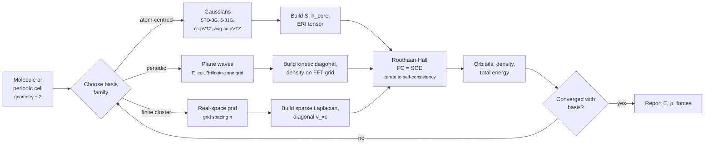
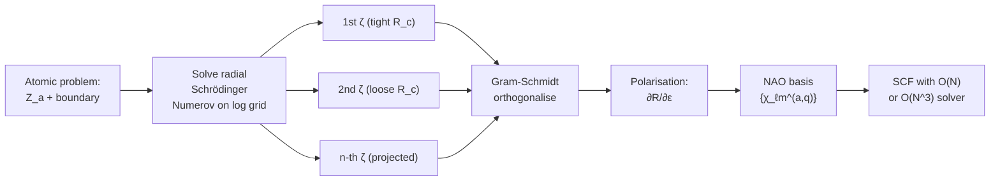
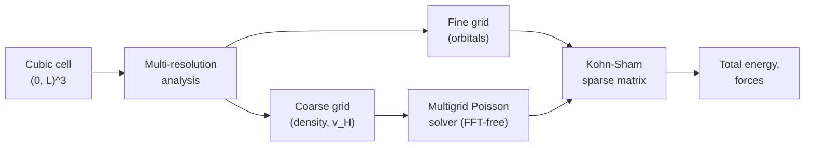
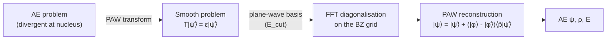

# Chapter 06 — Basis sets

> The Fock and Kohn–Sham operators live in an infinite-dimensional
> Hilbert space.  We can only diagonalise finite matrices.  A
> basis set is the bridge between the two — and the choice of
> bridge is what every practical DFT calculation rides on.

By the end of [chapter 05]({{ "/dft-notes/chapter-05/" | relative_url }})
we had reduced the electronic-structure problem to a one-body
eigenvalue equation for the Kohn–Sham (or Fock) orbitals.  Both
$\hat F \phi_i = \varepsilon_i \phi_i$ ([chapter 03]({{ "/dft-notes/chapter-03/" | relative_url }})) and
$\hat H_\text{KS} \phi_i = \varepsilon_i \phi_i$ ([chapter 04]({{ "/dft-notes/chapter-04/" | relative_url }})) are
differential equations in $\mathbb R^3$ whose unknown is a
function.  A computer cannot store a function; it can only
store a finite array of numbers.  The standard trick is to
expand each orbital in a chosen, **finite** set of $K$ known
functions $\{\chi_\mu\}_{\mu=1}^K$ — the **basis set** — so
that the orbital is encoded by $K$ expansion coefficients.
The differential eigenvalue equation then collapses to a
matrix eigenvalue problem.  This chapter explains which
$\{\chi_\mu\}$ are used in practice, why each family was
invented, and what numerical price each charges.

## 6.1 The claim — Roothaan–Hall

For a closed-shell molecule, expanding each spatial orbital in
the same $K$ basis functions $\{\chi_\mu\}$,

\begin{equation}
\label{eq:ch-06-basis-expansion}
\phi_i(\mathbf r) \;=\; \sum_{\mu=1}^{K} C_{\mu i}\, \chi_\mu(\mathbf r) ,
\end{equation}

turns the Fock equation $\hat F \phi_i = \varepsilon_i \phi_i$
into the **Roothaan–Hall** matrix equation

\begin{equation}
\label{eq:ch-06-roothaan-hall}
\mathbf F\, \mathbf C \;=\; \mathbf S\, \mathbf C\, \boldsymbol\varepsilon ,
\end{equation}

where $\mathbf F$, $\mathbf S$, $\mathbf C$ are $K \times K$
matrices and $\boldsymbol\varepsilon$ is the diagonal matrix of
orbital energies.  The matrix elements are

\begin{equation}
\label{eq:ch-06-fock-overlap}
F_{\mu\nu} \;=\; \langle \chi_\mu \rvert \hat F \rvert \chi_\nu \rangle , \qquad
S_{\mu\nu} \;=\; \langle \chi_\mu \rvert \chi_\nu \rangle .
\end{equation}

**Derivation.**  Substitute \eqref{eq:ch-06-basis-expansion} into
$\hat F \phi_i = \varepsilon_i \phi_i$,

$$
\hat F \sum_\mu C_{\mu i} \chi_\mu = \varepsilon_i \sum_\mu C_{\mu i} \chi_\mu .
$$

Project both sides on $\chi_\nu$ by multiplying with
$\chi_\nu^*$ and integrating over $\mathbf r$:

$$
\sum_\mu C_{\mu i}\, \underbrace{\langle \chi_\nu \rvert \hat F \rvert \chi_\mu \rangle}_{F_{\nu\mu}}
\;=\; \varepsilon_i \sum_\mu C_{\mu i}\, \underbrace{\langle \chi_\nu \rvert \chi_\mu \rangle}_{S_{\nu\mu}} .
$$

This is the $i$-th *column* of the matrix equation
$\mathbf F \mathbf C = \mathbf S \mathbf C \boldsymbol\varepsilon$.
Collecting all $K$ MOs (i.e. all values of $i$) into one matrix
gives \eqref{eq:ch-06-roothaan-hall}.

> **Tip.**  The basis is in general **non-orthogonal**, so the
> right-hand side carries an $\mathbf S$ that the orthonormal
> $\hat F \phi_i = \varepsilon_i \phi_i$ does not have.  This is
> not a mistake; it is the price of choosing a basis adapted to
> the *physics* (atom-centred Gaussians look like atomic
> orbitals) rather than to the *mat`h*` (an orthonormal basis is
> mathematically clean but physically unmotivated).

Equation \eqref{eq:ch-06-roothaan-hall} is a generalised
eigenvalue problem.  `scipy.linalg.eigh(F, S)` solves it
directly; internally it computes $\mathbf X = \mathbf S^{-1/2}$,
forms $\mathbf F' = \mathbf X^\dagger \mathbf F \mathbf X$,
diagonalises $\mathbf F'$ (now a standard eigenproblem), and
transforms the eigenvectors back via
$\mathbf C = \mathbf X \mathbf C'$.

## 6.2 Why we need a basis

The exact orbital $\phi_i^\text{exact}$ lives in
$L^2(\mathbb R^3)$, an infinite-dimensional Hilbert space.
Every basis we will meet is a *finite* subset
$\{\chi_\mu\}_{\mu=1}^K \subset L^2(\mathbb R^3)$ that spans a
$K$-dimensional subspace $\mathcal V_K$.  The variational
principle ([chapter 03]({{ "/dft-notes/chapter-03/" | relative_url }})) says

\begin{equation}
\label{eq:ch-06-variational}
E_0^\text{basis}(K) \;\equiv\; \min_{\phi \in \mathcal V_K}\, E[\phi]
\;\ge\; E_0^\text{exact} ,
\end{equation}

with equality only in the limit $K \to \infty$ along a
sequence of basis sets whose span becomes dense in
$L^2(\mathbb R^3)$.  The gap between $E_0^\text{basis}(K)$ and
$E_0^\text{exact}$ is the **basis-set incompleteness error**:

\begin{equation}
\label{eq:ch-06-bsie}
\Delta E_\text{BSIE}(K) \;\equiv\; E_0^\text{basis}(K) \;-\; E_0^\text{CBS} ,
\end{equation}

where $E_0^\text{CBS}$ is the value at the **complete-basis-set
limit** (CBS, $K \to \infty$).  For atom-centred Gaussians on
small molecules, a typical empirical rule is that
$\Delta E_\text{BSIE}$ falls roughly *exponentially* with the
**cardinal number** $X$ of the Dunning correlation-consistent
family (cc-pV*X*Z),

\begin{equation}
\label{eq:ch-06-cbs-extrap}
E(X) \;\approx\; E^\text{CBS} \;+\; A\, e^{-\alpha X} ,
\end{equation}

which is the formula used to *extrapolate* to $E^\text{CBS}$
from two or three calculations at $X = D, T, Q$.

> **Note.**  The BSIE is one of *two* approximation errors in
> any practical calculation.  The other is the
> exchange–correlation functional ([chapter 05]({{ "/dft-notes/chapter-05/" | relative_url }})).  A converged
> DFT energy is only meaningful once both have been pushed to
> a known tolerance.  Quoting a DFT energy without naming the
> basis is like quoting a price without naming the currency.

## 6.3 Gaussian-type orbitals (GTOs)

A **primitive Cartesian Gaussian** centred at $\mathbf A$ with
exponent $\alpha$ and angular indices $(\ell_x, \ell_y, \ell_z)$
is

\begin{equation}
\label{eq:ch-06-primitive}
g(\mathbf r;\alpha,\mathbf A,\boldsymbol\ell)
\;=\;
N(\alpha,\boldsymbol\ell)\,
(x - A_x)^{\ell_x} (y - A_y)^{\ell_y} (z - A_z)^{\ell_z}\,
e^{-\alpha |\mathbf r - \mathbf A|^2} ,
\end{equation}

with $N(\alpha,\boldsymbol\ell)$ chosen so that
$\int |g|^2\, d\mathbf r = 1$.  The total angular momentum is
$\ell = \ell_x + \ell_y + \ell_z$, with $\ell = 0$ called
"s-type", $\ell = 1$ "p-type", $\ell = 2$ "d-type", and so on.

For $\ell = 0$ the normalisation collapses to

\begin{equation}
\label{eq:ch-06-norm-s}
N(\alpha) \;=\; \left( \frac{2\alpha}{\pi} \right)^{3/4} .
\end{equation}

**Why Gaussians and not Slater functions?**  Slater-type
orbitals (STOs) $e^{-\zeta r}$ have the *right* short-range
cusp at the nucleus and the *right* exponential decay at
infinity — properties Gaussians do not share.  Yet every
production quantum-chemistry code uses Gaussians, because of
one critical algebraic identity: the **Gaussian product
theorem**.  For two s-primitives at centres $\mathbf A$ and
$\mathbf B$ with exponents $\alpha$ and $\beta$,

\begin{equation}
\label{eq:ch-06-gpt}
e^{-\alpha |\mathbf r - \mathbf A|^2}\, e^{-\beta |\mathbf r - \mathbf B|^2}
\;=\;
K_{AB}\, e^{-(\alpha+\beta) |\mathbf r - \mathbf P|^2} ,
\end{equation}

with the **Gaussian midpoint**
$\mathbf P = (\alpha \mathbf A + \beta \mathbf B)/(\alpha+\beta)$
and the **prefactor**
$K_{AB} = \exp\!\big[-\alpha\beta/(\alpha+\beta)\, |\mathbf A - \mathbf B|^2\big]$.
A two-centre integral has therefore been reduced to a one-centre
integral — the integrand is again a Gaussian, located at
$\mathbf P$.  No such collapse exists for STOs, which is why
all four-centre two-electron integrals are tractable in a
Gaussian basis and not in a Slater basis.

**A contracted Gaussian-type orbital (CGTO)** is a fixed
linear combination of primitives,

\begin{equation}
\label{eq:ch-06-contraction}
\chi_\mu(\mathbf r) \;=\; \sum_{p=1}^{n_\mu} d_{\mu p}\,
g(\mathbf r;\alpha_{\mu p},\mathbf A_\mu,\boldsymbol\ell_\mu) ,
\end{equation}

where the **contraction coefficients** $d_{\mu p}$ and
**exponents** $\alpha_{\mu p}$ are fixed at the moment of
designing the basis set, not optimised during the SCF.  The
contraction $\chi_\mu$ is the *one basis function* the
self-consistent procedure sees; the primitives are
implementation detail.

### The (ss|ss) two-electron integral

The simplest of the four-centre two-electron integrals is the
one between four normalised primitive s-Gaussians (centres
$\mathbf A$, $\mathbf B$, $\mathbf C$, $\mathbf D$ and exponents
$\alpha,\beta,\gamma,\delta$).  Apply
\eqref{eq:ch-06-gpt} twice — once to the bra
$g_A(\mathbf r_1) g_B(\mathbf r_1)$ and once to the ket
$g_C(\mathbf r_2) g_D(\mathbf r_2)$ — to collapse the integrand
into a product of two Gaussians at the midpoints
$\mathbf P$ and $\mathbf Q$:

$$
(AB | CD) =
N_A N_B N_C N_D\,
K_{AB} K_{CD}\,
\int\!\!\int
\frac{e^{-(\alpha+\beta)|\mathbf r_1 - \mathbf P|^2}\,
      e^{-(\gamma+\delta)|\mathbf r_2 - \mathbf Q|^2}}
     {|\mathbf r_1 - \mathbf r_2|}\,
d\mathbf r_1\, d\mathbf r_2 .
$$

The double integral over the Coulomb kernel can be done
analytically (Boys 1950) by inserting the identity
$1/r_{12} = (2/\sqrt\pi) \int_0^\infty e^{-s^2 r_{12}^2}\, ds$
and integrating $\mathbf r_1, \mathbf r_2$ as a Gaussian.  The
result, in normalised form, is

\begin{equation}
\label{eq:ch-06-ssss}
(AB | CD) \;=\;
\frac{2\pi^{5/2}}{(\alpha+\beta)(\gamma+\delta)\sqrt{\alpha+\beta+\gamma+\delta}}\,
K_{AB}\, K_{CD}\,
F_0\!\left( \frac{(\alpha+\beta)(\gamma+\delta)}{\alpha+\beta+\gamma+\delta}\,
|\mathbf P - \mathbf Q|^2 \right) ,
\end{equation}

where the **Boys function**

\begin{equation}
\label{eq:ch-06-boys}
F_0(t) \;=\; \int_0^1 e^{-t u^2}\, du
\;=\; \frac{1}{2}\sqrt{\frac{\pi}{t}}\,\operatorname{erf}(\sqrt{t}) ,
\qquad F_0(0) = 1 ,
\end{equation}

handles the Coulomb singularity.  Every four-centre ERI in
quantum chemistry is, after the Gaussian product theorem and
McMurchie–Davidson-style recursion in $\boldsymbol\ell$,
ultimately a sum of \eqref{eq:ch-06-ssss}-type expressions.
This is why **GTOs win**: they buy analytical ERIs.

## 6.4 STO-nG — the minimal basis

The cheapest atom-centred basis is the **minimal basis**: one
contracted s-function for each occupied s-shell, one
contracted p-shell for each occupied p-shell, and nothing else.
For H it is a single 1s; for C it is 1s, 2s, $2p_x$, $2p_y$,
$2p_z$ (five functions); for the second row it is nine.

The historical and pedagogical default for a minimal basis is
**STO-nG** (Hehre, Stewart, Pople, 1969): fit each Slater 1s
$e^{-\zeta r}$ by a least-squares contraction of $n$ primitive
Gaussians,

\begin{equation}
\label{eq:ch-06-sto-fit}
\sum_{p=1}^{n} d_p\, g_p(\alpha_p,\,\mathbf 0,\, \boldsymbol 0)
\;\approx\;
\frac{\zeta^{3/2}}{\sqrt\pi}\, e^{-\zeta r}
\quad \text{(in the least-squares sense)} .
\end{equation}

The $n = 3$ case, **`STO-3G*`*, is the canonical example.  The
underlying $\zeta = 1.0$ fit for the 1s function (HSP 1969,
Table II) is

| $p$ | $\alpha_p$ ($\zeta = 1.0$) | $d_p$    |
|:---:|:---------------------------|:---------|
| 1   | 0.10982                     | 0.444635  |
| 2   | 0.40578                     | 0.535328  |
| 3   | 2.22766                     | 0.154329  |

For a different $\zeta$, the exponents scale as $\alpha_p \to
\zeta^2 \alpha_p$ while the $d_p$ are unchanged — a consequence
of the Gaussian dimension analysis $\alpha r^2 = (\zeta r)^2
(\alpha/\zeta^2)$.  The recommended Pople value for H *in
molecules* is $\zeta = 1.24$, so the H STO-3G exponents
*actually use`d*` in calculations are
$\alpha_p \cdot 1.24^2 = 1.5376\, \alpha_p$,

| $p$ | $\alpha_p$ ($\zeta = 1.24$, EMSL default) | $d_p$    |
|:---:|:------------------------------------------|:---------|
| 1   | 0.168856                                    | 0.444635  |
| 2   | 0.623913                                    | 0.535328  |
| 3   | 3.425250                                    | 0.154329  |

which is the form distributed by the EMSL Basis Set Exchange
and consumed directly by every quantum-chemistry code.  The
worked example in section 6.9 uses this set verbatim.

> **Warning.**  STO-3G is a *teaching* basis.  Its absolute
> errors against the basis-set limit are tens of milli-Hartree,
> and its predicted bond lengths and frequencies have known,
> systematic biases.  Nobody publishes STO-3G *production*
> numbers in 2025. But its small size — two functions for
> $\rm H_2$, ten for $\rm H_2 O$ — makes it the right basis for
> a worked example (section 6.9).

## 6.5 Split-valence: 3-21G, 6-31G, 6-311G

The minimal basis treats the *core* and the valence the same
way — one contracted function per shell.  Chemistry happens in
the valence, so a small improvement is to leave the core
contracted (it barely changes between molecules) and **split
the valence**: replace one valence function by two (or three)
of different size, letting the SCF readjust the valence
"radius" molecule by molecule.

The **Pople split-valence notation** is

$$
\underbrace{N}_\text{core prims} \text{-} \underbrace{M_1}_\text{inner valence} \underbrace{M_2}_\text{outer valence} \cdots \text{G} ,
$$

read as: "the core orbital is a single contraction of $N$
primitives; each valence shell is split into one inner
function (contraction of $M_1$ primitives) and one outer
function (contraction of $M_2$ primitives)".  Examples:

| Basis  | Core (per shell) | Valence (per shell)       | Cost class    |
|:-------|:------------------|:---------------------------|:--------------|
| 3-21G  | 3 prims, 1 CGTO   | (2 + 1) prims, 2 CGTOs    | "double-zeta valence" |
| 6-31G  | 6 prims, 1 CGTO   | (3 + 1) prims, 2 CGTOs    | double-zeta valence  |
| 6-311G | 6 prims, 1 CGTO   | (3 + 1 + 1) prims, 3 CGTOs | "triple-zeta valence" |

For H, which has no core, the basis is purely valence: in
6-31G, H carries 4 primitive s-Gaussians contracted into one
"inner" $1s$ (3 prims) and one "outer" $1s'$ (1 prim), so two
basis functions per H.  In 3-21G it is 3 primitives →
two basis functions per H.  In 6-311G, three basis functions
per H.

**Counting basis functions.**  Add up *contracte`d*` functions
across atoms.  For $\rm H_2 O$ in 6-31G:

- O: $1\text{s}$ (core, 1 CGTO) + $2\text{s}$ + $2\text{s}'$ +
  three $2\text{p}$ + three $2\text{p}'$ = 9 CGTOs
- H: $1\text{s}$ + $1\text{s}'$ = 2 CGTOs

Total $K = 9 + 2 \cdot 2 = 13$ basis functions.

## 6.6 Polarisation, diffuse, and the cc-pVXZ family

A double-zeta valence basis can resize a $2\text{p}$ orbital
on carbon, but it cannot give it the **angular** flexibility it
needs to bend in a bond.  For that, add functions of *higher*
angular momentum than the highest occupied shell on each atom:

- on H (highest occupied $\ell = 0$) add a $p$-function,
- on C, N, O (highest occupied $\ell = 1$) add a $d$-function,
- on first-row transition metals (highest occupied $\ell = 2$)
  add an $f$-function.

These are **polarisation functions**.  Pople's notation marks
them with a star: $6\text{-}31\text{G}^*$ adds $d$ on heavy
atoms only; $6\text{-}31\text{G}^{**}$ adds $d$ on heavy atoms
*an`d*` $p$ on H.  More polarisation = more flexibility = lower
$E_\text{BSIE}$ — but more functions and quartic ERI count.

A complementary direction is to add **diffuse** functions:
primitive Gaussians with very small exponents ($\alpha \sim
0.01$–$0.1$) for the long-range tail of the electron density.
Diffuse functions are essential for anions, Rydberg states,
hydrogen-bonded systems, and any property that probes the
density far from the nuclei (polarisabilities, dipole
moments).  Pople marks them with a $+$:
$6\text{-}31\text{+G}$ adds diffuse $s$ and $p$ on heavy atoms;
$6\text{-}31\text{++G}$ also on H.

### Correlation-consistent: cc-pVXZ

Dunning's **correlation-consistent** family (cc-pV*X*Z,
*X* = D, T, Q, 5, 6, ...) is designed so that each rung adds
the functions that recover the *next decade* of correlation
energy.  At cardinal number $X$ each atom carries
contractions up to angular momentum $\ell = X - 1$ (for first-
row atoms; H lags by one):

| Basis      | Composition per first-row atom (s, p, d, f, g, ...)   | $K$ for C |
|:-----------|:-------------------------------------------------------|:---------:|
| cc-pVDZ    | (3s, 2p, 1d)                                           |     14    |
| cc-pVTZ    | (4s, 3p, 2d, 1f)                                       |     30    |
| cc-pVQZ    | (5s, 4p, 3d, 2f, 1g)                                   |     55    |
| cc-pV5Z    | (6s, 5p, 4d, 3f, 2g, 1h)                               |     91    |

The **augmented** variant **aug-cc-pVXZ** prepends one diffuse
function at each angular momentum.  The empirical fact that
\eqref{eq:ch-06-cbs-extrap} holds for this family is what
makes the cc-pV*X*Z series the de facto path to converged
post-HF results.

> **Note.**  $X = D, T, Q, 5, 6$ corresponds to "double, triple,
> quadruple, quintuple, sextuple" zeta — the *number of
> exponents* in the contracted valence shells.  The label
> tracks the angular completeness, not just the radial
> resolution.

## 6.7 Plane waves

For a **periodic** system — a crystal, or a molecule placed in
a sufficiently large simulation box — the Kohn–Sham orbitals
satisfy Bloch's theorem (we will treat this carefully in
[chapter 07]({{ "/dft-notes/chapter-07/" | relative_url }})):

\begin{equation}
\label{eq:ch-06-bloch}
\phi_{n,\mathbf k}(\mathbf r) \;=\; e^{i \mathbf k \cdot \mathbf r}\, u_{n,\mathbf k}(\mathbf r) ,
\qquad u_{n,\mathbf k}(\mathbf r + \mathbf R) = u_{n,\mathbf k}(\mathbf r) ,
\end{equation}

where $\mathbf R$ is any lattice vector and $\mathbf k$ lies in
the first Brillouin zone.  The cell-periodic part
$u_{n,\mathbf k}$ has a natural Fourier expansion on the
**reciprocal lattice** $\{\mathbf G\}$:

\begin{equation}
\label{eq:ch-06-pw-expansion}
\phi_{n,\mathbf k}(\mathbf r)
\;=\;
\frac{1}{\sqrt\Omega}
\sum_{\mathbf G}
c_{n,\mathbf k,\mathbf G}\,
e^{i (\mathbf k + \mathbf G) \cdot \mathbf r} ,
\end{equation}

with $\Omega$ the cell volume.  This is the **plane-wave
basis**.  Each basis function
$\chi_{\mathbf G}^{\mathbf k}(\mathbf r) = \Omega^{-1/2}
e^{i (\mathbf k + \mathbf G)\cdot \mathbf r}$ is an exact
eigenfunction of $-\tfrac{1}{2}\nabla^2$ with eigenvalue
$\tfrac{1}{2}|\mathbf k + \mathbf G|^2$.  Truncating the
expansion at the **kinetic-energy cutoff** $E_\text{cut}$,

\begin{equation}
\label{eq:ch-06-ecut}
\tfrac{1}{2}\, |\mathbf k + \mathbf G|^2 \;\le\; E_\text{cut} ,
\end{equation}

gives a finite basis.  The largest wavevector retained is
$G_\text{max} = \sqrt{2 E_\text{cut}}$.

### How many plane waves?

The reciprocal-lattice vectors lie on a discrete grid of
spacing $(2\pi)^3 / \Omega$ per cell of $\mathbb R^3$, i.e.
each $\mathbf G$ occupies a volume $(2\pi)^3 / \Omega$ in
reciprocal space.  The number of $\mathbf G$ inside the sphere
$|\mathbf k + \mathbf G| \le G_\text{max}$ is approximately the
sphere volume divided by the per-vector volume:

$$
N_\text{PW} \;\approx\; \frac{\tfrac{4}{3}\pi G_\text{max}^3}
{(2\pi)^3 / \Omega} \;=\; \frac{\Omega\, G_\text{max}^3}{6 \pi^2} .
$$

Substituting $G_\text{max} = \sqrt{2 E_\text{cut}}$,

\begin{equation}
\label{eq:ch-06-npw}
N_\text{PW} \;\approx\; \frac{\Omega}{6 \pi^2}\,
\Bigl(2 E_\text{cut}\Bigr)^{3/2} .
\end{equation}

Two consequences of \eqref{eq:ch-06-npw} drive everything in
plane-wave DFT:

1. **The basis is independent of nuclear position.**  Atom
   centres do not appear anywhere in
   \eqref{eq:ch-06-pw-expansion}.  This makes plane-wave
   methods *unbiase`d*` — no atom is given a head start — and
   *natural for forces* (no Pulay correction, see
   [chapter 09]({{ "/dft-notes/chapter-09/" | relative_url }})).
2. **The basis grows as $\Omega \cdot E_\text{cut}^{3/2}$.**
   Doubling the cell or moving from $E_\text{cut} = 30$ Ha to
   $60$ Ha makes the basis $2^{3/2} \approx 2.8 \times$
   larger, and the diagonalisation cost $\sim N_\text{PW}^3$.
   This is why plane-wave codes use iterative eigensolvers and
   **pseudopotentials** ([chapter 08]({{ "/dft-notes/chapter-08/" | relative_url }})):
   smooth core potentials let you use a much smaller
   $E_\text{cut}$.

> **Tip.**  Densities (and the Hartree potential, and the XC
> potential) are *quadrati`c*` in the orbitals.  A plane-wave
> code therefore uses *two* grids: an "orbital" grid cut at
> $E_\text{cut}$, and a "density" grid cut at $4 E_\text{cut}$
> so that all products $|\phi_{n,\mathbf k}|^2$ are
> band-limited.  The factor of 4 is geometric, not empirical.

## 6.8 Real-space grids

A third style of basis avoids both atomic Gaussians and plane
waves and instead represents the orbital by its **values on a
uniform real-space gri`d*`* $\{\mathbf r_i\}_{i=1}^{N_g}$:

\begin{equation}
\label{eq:ch-06-grid}
\phi_i \;\longleftrightarrow\; \{\phi_i(\mathbf r_1), \dots, \phi_i(\mathbf r_{N_g})\} .
\end{equation}

The kinetic operator $-\tfrac{1}{2}\nabla^2$ is then a sparse
finite-difference matrix on the grid; the XC potential is
diagonal (it acts pointwise on the density); and the Hartree
potential is obtained by solving Poisson's equation on the
grid (typically with a multigrid or FFT-based solver).

The relation to plane waves is geometric: a real-space grid
of spacing $h$ has a Nyquist limit
$G_\text{Nyq} = \pi / h$, so the *implicit* kinetic cutoff of
the grid is

\begin{equation}
\label{eq:ch-06-grid-cutoff}
E_\text{cut}^\text{grid} \;=\; \tfrac{1}{2} G_\text{Nyq}^2
\;=\; \frac{\pi^2}{2 h^2} .
\end{equation}

A 0.2 Å grid spacing corresponds to $E_\text{cut} \approx
67$ Ha — comparable to a heavy-element pseudopotential cutoff.

Real-space grids are the basis of codes like **GPAW**,
**Octopus**, and **PARSEC**.  They have two attractive
features: they parallelise via domain decomposition with
no inter-process communication beyond a single halo swap
(so the parallelisation overhead is essentially zero), and
they avoid the periodicity assumption of plane waves (so
finite molecules and clusters need no large vacuum
buffer).

## 6.9 Worked example: STO-3G H₂

We now make the Roothaan–Hall equations
\eqref{eq:ch-06-roothaan-hall} concrete.  Take
$\mathrm H_2$ at the equilibrium bond length $R = 1.4\,a_0$,
with one STO-3G contracted s-function (with the molecular-H
parameterisation $\zeta = 1.24$) on each H atom.  The basis is

$$
\chi_1(\mathbf r) = \sum_{p=1}^{3} d_p\, N(\alpha_p)\, e^{-\alpha_p |\mathbf r - \mathbf A|^2} ,
\qquad
\chi_2(\mathbf r) = \sum_{p=1}^{3} d_p\, N(\alpha_p)\, e^{-\alpha_p |\mathbf r - \mathbf B|^2} ,
$$

with $\mathbf A = (0,0,0)$ and $\mathbf B = (0,0,1.4)$.  The
exponents and contraction coefficients in the EMSL Basis Set
Exchange entry for STO-3G H already incorporate $\zeta = 1.24$
(they are the underlying $\zeta = 1.0$ Hehre–Stewart–Pople fit
scaled by $\zeta^2 = 1.5376$), so we use them directly:

| $p$ | $\alpha_p$ (a$_0^{-2}$) | $d_p$    |
|:---:|:------------------------|:---------|
| 1   | 0.168856                 | 0.444635  |
| 2   | 0.623913                 | 0.535328  |
| 3   | 3.425250                 | 0.154329  |

$K = 2$ basis functions, $N = 2$ electrons, one doubly-occupied
MO.

The integrals reduce to nine primitive contributions per
matrix element via \eqref{eq:ch-06-contraction}.  Running the
companion script (Python, full source below) returns

```text
Overlap S:
[[1. 0.6593]
 [0.6593 1. ]]

Kinetic T:
[[0.76   0.2365]
 [0.2365 0.76  ]]

Nuclear attraction V:
[[-1.8804 -1.1948]
 [-1.1948 -1.8804]]

Core Hamiltonian h = T + V:
[[-1.1204 -0.9584]
 [-0.9584 -1.1204]]

Selected ERIs (chemists' notation [ij|kl]):
  [11|11] = (AA|AA) = 0.774608
  [11|22] = (AA|BB) = 0.569677
  [12|12] = (AB|AB) = 0.297029
  [11|12] = (AA|AB) = 0.444109
```

The numbers reproduce Szabo & Ostlund, *Modern Quantum
Chemistry*, Table 3.5, to four significant figures.  Note that
because the molecule is homonuclear, $\chi_1$ and $\chi_2$ are
related by reflection symmetry, so $S_{11} = S_{22}$,
$h_{11} = h_{22}$, and the off-diagonal element of every
matrix is real and identical for $(1,2)$ and $(2,1)$.

### Solving FC = SCE

For two electrons in two basis functions, the density matrix
in the first SCF iteration (starting from $\mathbf P = \mathbf 0$,
so the initial Fock matrix is just $\mathbf h$) is built from
the lowest eigenvector of $\mathbf h \mathbf C = \mathbf S
\mathbf C \boldsymbol\varepsilon$.  Symmetry forces the bonding
MO to be

$$
\phi_1 \;=\; \frac{\chi_1 + \chi_2}{\sqrt{2(1 + S_{12})}}
\;=\; \frac{\chi_1 + \chi_2}{\sqrt{2 \cdot 1.6593}}
\;=\; 0.5489\,(\chi_1 + \chi_2) ,
$$

and the antibonding MO to be

$$
\phi_2 \;=\; \frac{\chi_1 - \chi_2}{\sqrt{2(1 - S_{12})}}
\;=\; \frac{\chi_1 - \chi_2}{\sqrt{2 \cdot 0.3407}}
\;=\; 1.2115\,(\chi_1 - \chi_2) .
$$

The normalisation $\mathbf C^\dagger \mathbf S\, \mathbf C = \mathbf I$
is exact by construction.  The density matrix from the two
electrons in $\phi_1$ is

$$
P_{\mu\nu} \;=\; 2\, C_{\mu 1}\, C_{\nu 1}^* ,
\qquad
\mathbf P \;=\; 2 \cdot (0.5489)^2
\begin{pmatrix} 1 & 1 \\\\ 1 & 1 \end{pmatrix}
\;=\;
\begin{pmatrix} 0.6026 & 0.6026 \\\\ 0.6026 & 0.6026 \end{pmatrix} .
$$

Updating the Fock matrix with this $\mathbf P$ and iterating
the SCF to convergence (the script does this in a single
fixed-point loop) gives:

```text
SCF converged in 3 iterations (dE = 0.00e+00, dP = 0.00e+00)

*** Converged H2 STO-3G HF energy ***
  MO energies (E_h) : [-0.5782  0.6703]
  MO coefficients C :
[[-0.5489 -1.2115]
 [-0.5489  1.2115]]
  E_electronic      = -1.831000 E_h
  E_nuc-nuc (1/R)   = +0.714286 E_h
  E_total HF        = -1.116714 E_h
  (Szabo & Ostlund table 3.5 quote -1.1167  E_h)
```

(The signs of both eigenvectors are arbitrary — eigenvectors
are defined up to an overall phase — so the bonding MO appears
here with two negative coefficients rather than two positive,
but it is the *same* orbital.  Multiplying $\mathbf C$ by $-1$
column-wise reproduces the conventional textbook signs.)

The MOs and their numerical values reproduce the textbook
result.  The bonding orbital $\sigma_g$ has no node and most
of its amplitude in the bond midpoint; the antibonding
$\sigma_u^*$ has a node at $z = R/2$ and opposite signs on the
two atoms.  The plot of both MOs along the bond axis is in
figure 1. The full source (with the integral routines, the SCF loop,
and the plotting) lives at
`dft_notes/python_codes/chapter_06/01-sto-3g-h2.py`.  The
key piece is the contracted-integral helper and the SCF
update:

```python
def contracted_eri(aA, dA, aB, dB, aC, dC, aD, dD,
                   RA, RB, RC, RD):
    """Two-electron integral (AB|CD) in chemists' notation."""
    eri = 0.0
    rAB2 = float(np.sum((RA - RB) ** 2))
    rCD2 = float(np.sum((RC - RD) ** 2))
    for ai, di in zip(aA, dA):
        for bj, ej in zip(aB, dB):
            P = (ai * RA + bj * RB) / (ai + bj)
            for ck, fk in zip(aC, dC):
                for dl, gl in zip(aD, dD):
                    Q = (ck * RC + dl * RD) / (ck + dl)
                    rPQ2 = float(np.sum((P - Q) ** 2))
                    eri += (di * ej * fk  gl
                            * norm_s(ai) * norm_s(bj)
                            * norm_s(ck) * norm_s(dl)
                            * prim_eri(ai, bj, ck, dl,
                                       rAB2, rCD2, rPQ2))
    return eri

# ... in main() ...
for it in range(64):
    J  = np.einsum("pqrs,rs->pq", ERI, P)
    Kx = np.einsum("prqs,rs->pq", ERI, P)
    F  = Hcore + J - 0.5 * Kx
    evals, C = eigh(F, S)
    P_new = 2.0 * np.outer(C[:, 0], C[:, 0])
    if abs(E_elec - E_prev) < 1e-10:
        break
    P, E_prev = P_new, E_elec
```


*Figure 1.* The two molecular orbitals of $\rm H_2$ in the
STO-3G basis at $R = 1.4\,a_0$, sampled along the bond axis.
Top: $\sigma_g$ bonding orbital ($\varepsilon_1 = -0.578\,E_h$),
no node, amplitude concentrated in the bond midpoint.
Bottom: $\sigma_u^*$ antibonding orbital
($\varepsilon_2 = +0.670\,E_h$), one node at $z = R/2$, opposite
signs on the two atoms.

## 6.10 The workflow, end to end



The decision in the top-left box is the one a practitioner
spends most of their time on.  Atom-centred Gaussians dominate
finite-molecule chemistry; plane waves dominate solid-state
physics; real-space grids are a niche favoured for
parallelisation and for systems where the periodicity
assumption is awkward.  All three feed the *same*
self-consistent loop and, in the basis-set limit, give the
*same* answer.

## 6.11 Problems

<details class="problem">
<summary>Problem 1 (easy) — Counting basis functions for water</summary>

Water (H$_2$O) has one O and two H atoms.  Count the number of
contracted basis functions $K$ that the basis sets **`STO-3G*`*,
**`6-31G*`*, **`6-31G*`**, and **cc-pVDZ** give for water.  Use
the per-atom compositions stated in sections 6.4–6.6 and the
spherical-harmonic convention for $d$-functions (5 per shell,
not 6).

</details>

<details class="answer">
<summary>Show answer</summary>

Per-atom contributions:

| Basis    | H (per atom) | O (per atom) | $K$ for H$_2$O    |
|:---------|:-------------|:-------------|:------------------|
| STO-3G   | $1s$ → 1     | $1s, 2s, 2p_{x,y,z}$ → 5    | $1 \cdot 2 + 5 = 7$    |
| 6-31G    | $1s, 1s'$ → 2 | $1s, 2s, 2s', 2p, 2p'$ → 9 | $2 \cdot 2 + 9 = 13$   |
| `6-31G*`  | same as 6-31G | + $3d$ (5 spherical) → 14   | $2 \cdot 2 + 14 = 18$ |
| cc-pVDZ  | $(2s, 1p)$ → 5 | $(3s, 2p, 1d)$ → $3 + 6 + 5 = 14$ | $5 \cdot 2 + 14 = 24$ |

(For cc-pVDZ the $1p$ on H is one shell of three Cartesian
$p$-functions, i.e. five basis functions per H: two $s$ and
three $p$.)

The headline numbers: STO-3G gives $K = 7$, 6-31G gives
$K = 13$, `6-31G*` gives $K = 18$, cc-pVDZ gives
$\boxed{K = 24}$ — and cc-pVTZ, cc-pVQZ, cc-pV5Z grow to 58,
115, 201 respectively.  The ERI count scales as $K^4$, so each
step up the ladder is a factor of 5–10 more expensive.

</details>

<details class="problem">
<summary>Problem 2 (medium) — Prove the Gaussian product theorem</summary>

Show by direct algebra that for any two centres $\mathbf A,
\mathbf B \in \mathbb R^3$ and positive exponents
$\alpha, \beta$,

$$
e^{-\alpha |\mathbf r - \mathbf A|^2}\, e^{-\beta |\mathbf r - \mathbf B|^2}
\;=\;
e^{-\alpha\beta/(\alpha+\beta)\, |\mathbf A - \mathbf B|^2}\,
e^{-(\alpha+\beta) |\mathbf r - \mathbf P|^2} ,
$$

where $\mathbf P = (\alpha \mathbf A + \beta \mathbf B)/(\alpha+\beta)$.
You may work in one dimension; the three-dimensional result
follows from the factorisation
$|\mathbf r - \mathbf A|^2 = \sum_{i \in \{x,y,z\}} (r_i - A_i)^2$.

</details>

<details class="answer">
<summary>Show answer</summary>

In one dimension, write the exponent of the product as

$$
-\alpha (r - A)^2 - \beta (r - B)^2
\;=\;
-(\alpha + \beta) r^2 + 2(\alpha A + \beta B) r - (\alpha A^2 + \beta B^2) .
$$

Define $p = \alpha + \beta$ and $P = (\alpha A + \beta B)/p$, so
the linear coefficient $2 p P$ matches.  Completing the square
in $r$,

$$
-p r^2 + 2 p P\, r - (\alpha A^2 + \beta B^2)
\;=\;
-p (r - P)^2 + p P^2 - (\alpha A^2 + \beta B^2) .
$$

It remains to evaluate the constant
$\;p P^2 - (\alpha A^2 + \beta B^2)\;$.  Substituting
$P = (\alpha A + \beta B)/p$,

$$
p P^2 \;=\; \frac{(\alpha A + \beta B)^2}{p}
\;=\; \frac{\alpha^2 A^2 + 2\alpha\beta A B + \beta^2 B^2}{\alpha + \beta} .
$$

Subtracting $\alpha A^2 + \beta B^2 = (\alpha A^2 + \beta B^2)(\alpha + \beta)/(\alpha + \beta)$
under a common denominator gives

$$
p P^2 - (\alpha A^2 + \beta B^2)
\;=\;
\frac{\alpha^2 A^2 + 2\alpha\beta A B + \beta^2 B^2 - (\alpha + \beta)(\alpha A^2 + \beta B^2)}{\alpha + \beta} .
$$

Expanding the second numerator term,
$(\alpha + \beta)(\alpha A^2 + \beta B^2) = \alpha^2 A^2 + \alpha\beta B^2 + \alpha\beta A^2 + \beta^2 B^2$,
and cancelling the $\alpha^2 A^2$ and $\beta^2 B^2$ pieces,

$$
p P^2 - (\alpha A^2 + \beta B^2)
\;=\;
\frac{2 \alpha\beta A B - \alpha\beta (A^2 + B^2)}{\alpha + \beta}
\;=\;
- \frac{\alpha \beta}{\alpha + \beta} (A - B)^2 .
$$

Therefore the exponent of the product is

$$
-(\alpha + \beta)(r - P)^2 \;-\; \frac{\alpha\beta}{\alpha + \beta}(A - B)^2 ,
$$

which exponentiates to the claimed identity.  In three
dimensions, repeat for each Cartesian component;
$(A - B)^2$ accumulates to $|\mathbf A - \mathbf B|^2$ and the
$(r - P)^2$ piece becomes $|\mathbf r - \mathbf P|^2$.
$\quad\blacksquare$

</details>

<details class="problem">
<summary>Problem 3 (hard) — Plane-wave count and Hamiltonian cost</summary>

A cubic simulation cell of side $L = 10\,$Å is used to contain
an isolated water molecule.  In atomic units,
$L = 10 / 0.529177 \approx 18.897\,a_0$, so
$\Omega = L^3 \approx 6748\,a_0^3$.  Compute:

1. The number of plane waves $N_\text{PW}$ at the $\Gamma$
   point ($\mathbf k = \mathbf 0$) for kinetic-energy cutoffs
   $E_\text{cut} = 30\,E_h$, $60\,E_h$, $100\,E_h$.
2. The corresponding diagonalisation cost ratios (full
   diagonalisation is $\mathcal O(N_\text{PW}^3)$).
3. Discuss qualitatively why a pseudopotential
   ([chapter 08]({{ "/dft-notes/chapter-08/" | relative_url }}))
   can reduce $E_\text{cut}$ from $\sim 100\,E_h$ (all-electron
   for first-row atoms) to $\sim 30$–$50\,E_h$.

</details>

<details class="answer">
<summary>Show answer</summary>

**Step 1.**  Apply \eqref{eq:ch-06-npw} directly,

$$
N_\text{PW} \;=\; \frac{\Omega}{6 \pi^2}\, (2 E_\text{cut})^{3/2} ,
\qquad \Omega = 6748\,a_0^3, \quad 6\pi^2 \approx 59.22 .
$$

For $E_\text{cut} = 30\,E_h$:
$(2 \cdot 30)^{3/2} = 60^{3/2} = \sqrt{60^3} = \sqrt{216000} \approx 464.8$.
$\;N_\text{PW} \approx 6748 \cdot 464.8 / 59.22 \approx 52{,}966.$

For $E_\text{cut} = 60\,E_h$:
$(2 \cdot 60)^{3/2} = 120^{3/2} \approx 1314.5$.
$\;N_\text{PW} \approx 6748 \cdot 1314.5 / 59.22 \approx 149{,}787.$

For $E_\text{cut} = 100\,E_h$:
$(2 \cdot 100)^{3/2} = 200^{3/2} \approx 2828.4$.
$\;N_\text{PW} \approx 6748 \cdot 2828.4 / 59.22 \approx 322{,}308.$

**Step 2.**  Full diagonalisation is $\mathcal O(N_\text{PW}^3)$.
Relative costs, normalised to $E_\text{cut} = 30$:

| $E_\text{cut}$ | $N_\text{PW}$ | $N_\text{PW}^3$ (relative) |
|:---------------|--------------:|---------------------------:|
| 30  $E_h$      |     52 966    | 1                          |
| 60  $E_h$      |    149 787    | $\approx 22.6$             |
| 100 $E_h$      |    322 308    | $\approx 225$              |

Doubling the cutoff costs a factor of $2^{4.5} \approx 22.6$
(the basis grows as $E_\text{cut}^{3/2}$ and the cubic
diagonalisation eats another factor of $E_\text{cut}^{3/2}$ on
top), and tripling the cutoff costs more than two orders of
magnitude.

**Step 3.**  An all-electron description of, say, oxygen needs
plane waves that resolve the $1s$ orbital, whose
characteristic length scale is $\sim 1/Z = 1/8\,a_0$.  By the
real-space grid argument
\eqref{eq:ch-06-grid-cutoff} this requires
$E_\text{cut} \gtrsim \pi^2 / (2 \cdot (1/8)^2) \approx 316\,E_h$ —
hopeless for a plane-wave code.  A pseudopotential replaces
the $1s$ (and $2s$) core orbitals by a smooth effective
potential whose Fourier components die off above
$|\mathbf G| \sim 6$–$8\,a_0^{-1}$, so a cutoff of $30$–$50\,E_h$
is enough.  In practice every plane-wave DFT calculation on
anything heavier than helium uses a pseudopotential — the
quadratic cost saving (from $\sim 225$ down to $1$) is what
makes the method usable at all.

</details>

## 6.12 What we left out

This chapter scratched the surface of basis-set design.  Some
of what we skipped:

- **Basis-set superposition error (BSSE).**  When two
  fragments are computed in the *union* of their atomic bases,
  each fragment can use functions centred on the other to
  artificially lower its own energy.  The standard fix is the
  **counterpoise correction** (Boys & Bernardi 1970).  We
  ignored it.
- **Numerical atom-centred orbitals.**  Codes like SIESTA,
  DMol3, and FHI-aims use *numerically tabulate`d*` atomic
  orbitals — a third family between Gaussians and plane waves
  — that are systematically improvable like Gaussians but
  carry no contraction-fitting error.  We did not discuss
  them.
- **Resolution-of-the-identity / density-fitting.**  The ERI
  tensor $(ij|kl)$ is the bottleneck of every Gaussian SCF.
  Density-fitting (DF / RI) approximates it as a product of
  three-centre integrals over an auxiliary basis, reducing
  storage from $\mathcal O(K^4)$ to $\mathcal O(K^3)$.
  Standard in every production code; out of scope here.
- **Effective-core potentials (ECPs) and relativistic
  contractions.**  For heavy elements ($Z \gtrsim 30$) the
  inner-shell electrons demand a relativistic treatment and a
  basis tuned for it.  We will revisit this in
  [chapter 08]({{ "/dft-notes/chapter-08/" | relative_url }})
  in the pseudopotential context.
- **Wavelets and B-splines.**  Multiresolution and finite-
  element methods (BigDFT, FHI-aims' NAOs) avoid the
  uniform-grid Nyquist limit and are increasingly relevant
  for large molecules.  We mentioned them in passing only.

> Next: [chapter 07]({{ "/dft-notes/chapter-07/" | relative_url }})
> — Bloch's theorem and the Brillouin zone: how plane waves and
> $k$-points combine to handle infinite periodic solids.

## 6.13 Numerical atomic orbitals (NAOs)

The basis sets of sections 6.3–6.6 (STO-nG, Pople, Dunning) are
all **analytic**: every function in the basis is known in closed
form as a sum of Gaussians.  An alternative, used by **SIESTA**
(linear-scaling DFT), **FHI-aims** (numeric all-electron), and
the partial-wave construction of **PAW** (section 6.15), is to
**tabulate** each basis function numerically on a radial grid.
The basis functions are still atom-centred and angular-momentum-
resolved, but the **radial part** is a numerical solution of a
one-particle Schrödinger equation — there are no contraction
coefficients and no least-squares fitting error.  The price is
that the integrals are not analytical; they are evaluated by
quadrature on the same radial grid the orbital was defined on.

### 6.13.1 The claim

A **numerical atomic orbital** (NAO) of angular momentum
$\ell$ and "zeta index" $q$ centred at atom $a$ is

\begin{equation}
\label{eq:ch-06-13-nao}
\chi_{\ell m}^{(a, q)}(\mathbf r) \;=\; R_\ell^{(a, q)}(r_a)\,
Y_{\ell m}(\hat{\mathbf r}_a) , \qquad
\mathbf r_a \equiv \mathbf r - \mathbf R_a ,
\end{equation}

where $Y_{\ell m}$ is a real spherical harmonic, $r_a$ is the
distance to atom $a$, and the radial function $R_\ell^{(a,q)}$
is a numerical solution of a **modified** radial Schrödinger
equation with a confining potential.  The index $q = 1, 2,
\dots, n_\zeta$ labels the multiple-ζ split of the valence
shell.

### 6.13.2 The radial Schrödinger equation

The atomic problem for the radial part of an orbital in a
spherically symmetric effective potential $V_\text{eff}(r)$ is

\begin{equation}
\label{eq:ch-06-13-radial}
\left[ -\frac{1}{2} \frac{d^2}{dr^2} + \frac{\ell(\ell+1)}{2 r^2} + V_\text{eff}(r) \right]\, u_\ell(r) \;=\; \varepsilon\, u_\ell(r) ,
\end{equation}

where $u_\ell(r) = r\, R_\ell(r)$ is the radial function scaled
by $r$ (so the volume element $r^2 dr\, d\Omega$ becomes just
$du\, d\Omega$).  The boundary conditions are

- $u_\ell(0) = 0$ (the wavefunction must vanish at the
  nucleus),
- $u_\ell(r) \to 0$ as $r \to \infty$ (bound-state decay).

In an isolated atom the second condition is automatically
satisfied because $V_\text{eff}$ is attractive.  In a molecule,
however, the valence NAO must be representable on a **finite**
support, or the overlap matrix becomes ill-conditioned and the
SCF converges poorly.  The fix is to add a **confining
potential** to $V_\text{eff}$ that vanishes in the chemically
relevant region and rises outside it:

\begin{equation}
\label{eq:ch-06-13-confine}
\tilde V_\text{eff}(r) \;=\; V_\text{eff}(r) + V_\text{conf}(r) .
\end{equation}

A widely used form (SIESTA, FHI-aims) is a polynomial ramp,

\begin{equation}
\label{eq:ch-06-13-vconf}
V_\text{conf}(r) \;=\;
\begin{cases}
0 , & r \le r_0 , \\\\[2pt]
V_0 \left( \dfrac{r - r_0}{R_c - r_0} \right)^n , & r_0 < r \le R_c , \\\\[6pt]
\infty , & r > R_c ,
\end{cases}
\end{equation}

with the "inner radius" $r_0$ set to roughly the covalent
radius of the atom (so the confining potential does not touch
the bond region) and the **confinement radius** $R_c$ the
control parameter the user varies.  Common choices are $n = 2$
(quadratic) and $V_0 \sim 50$–$100\,E_h$.  With this
$V_\text{conf}$ the radial equation
\eqref{eq:ch-06-13-radial} becomes a **bound-state problem in a
finite box**, solvable by Numerov or by shooting to the
asymptotic boundary $r = R_c$ where $u_\ell(R_c) = 0$.

### 6.13.3 The logarithmic grid

The radial equation is **stiff** at small $r$ (where
$\ell(\ell+1)/2r^2$ diverges and the wavefunction oscillates
rapidly) and **smooth** at large $r$ (where it decays
exponentially).  A uniform grid wastes resolution in the
asymptotic region.  The standard choice is the **logarithmic
gri`d*`* introduced by H. J. A. M. Kormann and used in SIESTA and
FHI-aims:

\begin{equation}
\label{eq:ch-06-13-loggrid}
r_i \;=\; r_\text{min}\, e^{h\, i} , \qquad i = 0, 1, 2, \dots, N_r - 1 .
\end{equation}

The grid has constant **log-spacing** $h$ — i.e. constant
*relative* resolution.  Typical parameters:
$r_\text{min} \sim 10^{-4}\,a_0$, $h \sim 0.03$–$0.05\,a_0$,
$N_r \sim 500$–$2000$.  At the heavy end of the basis (PAW
partial waves, see section 6.15) one uses a denser log grid with
$h \sim 0.01\,a_0$ and $N_r \sim 2000$ to resolve the
oscillations of the $1s$ orbital near the nucleus.

Substituting \eqref{eq:ch-06-13-loggrid} into
\eqref{eq:ch-06-13-radial} removes the singular
$\ell(\ell+1)/2r^2$ behaviour at small $r$ (because
$\ell(\ell+1)/(2 r^2) = \ell(\ell+1)/(2 r_\text{min}^2)\, e^{-2hi}$
is finite at $i=0$ and decays geometrically), and the Numerov
method becomes uniformly accurate across the whole grid.

### 6.13.4 Multiple-ζ

A single NAO per $(\ell, m)$ is a **single-ζ** basis: it
captures the size of the valence orbital but not its
flexibility under chemical bonding.  The **multiple-ζ** idea
(Artacho, Sánchez-Portal, Ordejón, Soler 1998; Junquera, Paz,
Sánchez-Portal, Artacho 2001) is to generate $n_\zeta$ NAOs for
the same $(\ell, m)$ by solving the same radial equation with
**different confinement radii** and orthogonalising the higher
ζ's against the lower ones.

Concretely, for a double-ζ valence shell ($n_\zeta = 2$):

1. **First ζ.**  Solve \eqref{eq:ch-06-13-radial} with
   $\tilde V_\text{eff}$ at the "tight" radius
   $R_c = R_\text{min}$ (typically half the bond length).
   Call the lowest-lying solution $R_\ell^{(1)}(r)$.
2. **Second ζ.**  Solve again with the "loose" radius
   $R_c = R_\text{max}$ (typically the bond length).  Call the
   new solution $\tilde R_\ell(r)$.  Symmetric-orthogonalise
   against $R_\ell^{(1)}$:

   \begin{equation}
   \label{eq:ch-06-13-gram-schmidt}
   R_\ell^{(2)}(r) \;=\; \mathcal N \left[ \tilde R_\ell(r) - S\, R_\ell^{(1)}(r) \right] ,
   \qquad S = \int_0^{R_\text{max}} \tilde R_\ell(r)\, R_\ell^{(1)}(r)\, r^2\, dr .
   \end{equation}

3. **Higher ζ.**  Repeat the procedure with progressively looser
   $R_c$, projecting out the span of all previous ζ's.

The smaller the inner $\zeta$, the more compact and rigid it
is; the larger the outer $\zeta$, the more diffuse and
responsive to bonding.  This is *exactly* the chemistry that
Pople's split-valence (6-31G, 6-311G) tried to encode
empirically, but now the split-ζ functions are **ground-state
solutions of the atomic problem** rather than ad-hoc
contractions.  In SIESTA, a typical valence basis is **SZ**
(single-ζ) for production-quality geometry optimisation,
**DZ** (double-ζ) for property prediction, and **TZDP**
(triple-ζ + double polarisation) for high accuracy.  The
energy cost of an NAO basis is essentially that of a Gaussian
basis of the same $K$ — but the **information content per
function** is higher, so a DZ NAO basis often gives an accuracy
comparable to a TZ Gaussian basis.

### 6.13.5 Polarisation orbitals

The multiple-ζ trick handles the **radial** flexibility.  The
**angular** flexibility (which is what polarisation functions do
in a Gaussian basis) is generated by an **energy-derivative**
recipe (Blöchl 1990, generalised by Artacho et al.):

\begin{equation}
\label{eq:ch-06-13-pold}
R_\ell^\text{pol}(r) \;=\; \mathcal N\, \frac{\partial R_\ell(r)}{\partial \varepsilon} .
\end{equation}

The derivative of a bound-state radial wavefunction with
respect to its energy is automatically orthogonal to the parent
function $R_\ell$ (the Hellmann–Feynman argument:
$\langle R_\ell | \partial R_\ell / \partial \varepsilon \rangle
= -\tfrac{1}{2}\, \partial_\varepsilon \langle R_\ell | R_\ell
\rangle = 0$ for normalised $R_\ell$).  It also has a node — it
changes sign once — so it carries the next angular-momentum
character **after** projection.  Specifically, if $R_\ell$ is
the valence s-function, $\partial_\varepsilon R_\ell$ behaves
like a p-function under angular integration; this is the NAO
analogue of adding a $p$-polarisation function on hydrogen.

Higher polarisation orbitals — e.g. the "double polarisation" of
a TZDP basis — are obtained by a second derivative
$\partial^2 R_\ell / \partial \varepsilon^2$, projected against
the span of $\{\partial_\varepsilon R_\ell\}$ and the valence
$R_\ell$.

### 6.13.6 Convergence with $R_c$

The accuracy of an NAO basis depends monotonically on $R_c$:
looser confinement (larger $R_c$) makes the basis more flexible
and the BSIE smaller, at the cost of a longer-ranged,
more-overlapping, and more linearly-dependent basis.  In
practice SIESTA and FHI-aims report a typical convergence
study for the atomisation energy of a small molecule (e.g.
$\mathrm H_2 \mathrm O$ or benzene): the energy converges to
within $0.01\,E_h$ at $R_c \sim 4\,a_0$ (DZ), $\sim 5\,a_0$
(TZ), $\sim 6\,a_0$ (TZDP).  Below $R_c \sim 2.5\,a_0$ the
basis is too tight to describe the bonding and the energy
becomes wildly wrong.

A more formal diagnostic is the **basis-set limit curve** $E(K)$
plotted on a log–log axis: for an NAO basis $E(K)$ falls
approximately as $K^{-p}$ with $p \sim 2$–$3$ (the exact
exponent depends on the confining-potential shape and on the
property being converged — total energies converge faster than
energy differences).

> **Note.**  In PAW (section 6.15) the NAO machinery is
> re-used for the *partial waves* $\phi_i^a$ inside the
> augmentation sphere.  The radial grid and the confining
> potential are the same; only the role changes — there the
> NAO is an auxiliary object used to reconstruct the AE
> wavefunction from the smooth part, not a basis function in
> its own right.

### 6.13.7 SIESTA workflow



The Roothaan–Hall machinery of
\eqref{eq:ch-06-roothaan-hall} is unchanged: the matrix
elements $\langle \chi_\mu | \hat F | \chi_\nu \rangle$ are
evaluated by quadrature on the same radial grid that generated
$\chi_\mu$, but otherwise the linear algebra of section 6.1
goes through verbatim.

## 6.14 Wavelets and B-splines

The plane-wave basis of section 6.7 is **systematically
improvable**: pushing $E_\text{cut}$ to infinity gives the
exact answer *provided the potential is non-singular* — which
is not the case for the all-electron problem.  The atom-centred
Gaussian basis of section 6.3 is also systematically improvable
in principle — the cc-pV*X*Z series is built on this premise —
but the convergence is *angular*: the missing angular momenta
show up as slowly-decaying multipole errors in the electron
density.  **Wavelets and B-splines** are the basis families that
are *bot`h*` atom-like (no periodic boundary condition required)
and *systematically* improvable for the all-electron problem.

### 6.14.1 B-splines on a finite interval

A **B-spline** of order $k$ (degree $k - 1$) on a knot
sequence $t_0 \le t_1 \le \dots \le t_{N}$ is defined by the
Cox–de Boor recursion

\begin{equation}
\label{eq:ch-06-14-bspline}
B_{i,1}(x) \;=\;
\begin{cases}
1 , & t_i \le x < t_{i+1} , \\\
0 , & \text{otherwise} ,
\end{cases}
\end{equation}

\begin{equation}
\label{eq:ch-06-14-coxdeboor}
B_{i,k}(x) \;=\; \frac{x - t_i}{t_{i+k-1} - t_i}\, B_{i,k-1}(x)
\;+\; \frac{t_{i+k} - x}{t_{i+k} - t_{i+1}}\, B_{i+1,k-1}(x) .
\end{equation}

For a simple uniform knot sequence $t_i = i h$, the B-splines
are translated copies of one function $B_k(x/h)$, each
supported on **$k$ adjacent intervals**.  The order-$k$
B-spline is a piecewise polynomial of degree $k-1$,
$C^{k-2}$ continuous at the interior knots, and identically
zero outside its $k$-interval support.

The **partition of unity** property

\begin{equation}
\label{eq:ch-06-14-pou}
\sum_{i=0}^{N-k} B_{i,k}(x) \;=\; 1 \qquad \text{on the interior}
\end{equation}

follows by induction on $k$ and makes B-splines a natural
finite-element basis.  In 3D the tensor product $B_{i,k}(x)\,
B_{j,k}(y)\, B_{\ell,k}(z)$ is a piecewise polynomial of
degree $3(k-1)$ on a uniform cubic grid of spacing $h$.

B-splines are the basis of choice in **finite-element
discretisations** of the Kohn–Sham problem (FEM-DFT codes
such as **HelFEM** and parts of **FHI-aims** in their
all-electron NAO mode).  They give an exact representation of
polynomials up to degree $k-1$, have controllable smoothness
(raise $k$ for smoother wavefunctions), and are the
finite-dimensional subspace against which the variational
principle \eqref{eq:ch-06-variational} is taken.  The
**kinetic-energy operator** in a B-spline basis is a banded
matrix of bandwidth $\sim k$, so the sparse direct solver
scales as $\mathcal O(N_g k^2)$ for a grid of $N_g$ points.

### 6.14.2 Daubechies wavelets

A **wavelet basis** is a multiresolution generalisation of the
B-spline idea: instead of a single grid, one uses an
**infinite tower of grids**, doubling the resolution at each
level.  Define a chain of closed subspaces

\begin{equation}
\label{eq:ch-06-14-mra}
\{0\} \;\subset\; \cdots \;\subset\; V_1 \;\subset\; V_2 \;\subset\; \cdots \;\subset\; L^2(\mathbb R) ,
\end{equation}

with $V_{j+1} = V_j \oplus W_j$ — i.e. the detail space $W_j$
is the orthogonal complement of $V_j$ in $V_{j+1}$.  Each
$V_j$ is spanned by translations and dyadic scalings of a
single **scaling function** $\phi$:

\begin{equation}
\label{eq:ch-06-14-vj}
V_j \;=\; \overline{\text{span}\big\lbrace \phi_{j,k}(x) = 2^{j/2}\, \phi(2^j x - k) : k \in \mathbb Z \big\rbrace} .
\end{equation}

The Daubechies family D-$N$ is parametrised by the number of
vanishing moments $N$ and constructed as the **most localised
orthonormal scaling function with $N$ vanishing moments** —
the support of the D-$N$ scaling function is $2N - 1$ grid
points wide.  The two-scale relation between $\phi$ and the
orthonormal wavelet $\psi$ is

\begin{equation}
\label{eq:ch-06-14-twoscale}
\phi(x) \;=\; \sqrt{2} \sum_{n} h_n\, \phi(2x - n) ,
\qquad
\psi(x) \;=\; \sqrt{2} \sum_{n} g_n\, \phi(2x - n) ,
\end{equation}

where the **low-pass** filter $h_n$ and **high-pass** filter
$g_n$ are finite sequences of $2N$ coefficients satisfying the
quadrature-mirror conditions $g_n = (-1)^n h_{1-n}$ and
$\sum_n h_n h_{n + 2k} = \delta_{k,0}$.  For D-2 the filters
are

$$
h_0 = \tfrac{1 + \sqrt 3}{4 \sqrt 2}, \quad
h_1 = \tfrac{3 + \sqrt 3}{4 \sqrt 2}, \quad
h_2 = \tfrac{3 - \sqrt 3}{4 \sqrt 2}, \quad
h_3 = \tfrac{1 - \sqrt 3}{4 \sqrt 2},
$$

and the scaling function has support $[0, 3]$.  Higher $N$
gives smoother $\phi$ and $\psi$ (the D-$N$ scaling function
is $C^{\alpha N}$ for some $\alpha < 1$) at the cost of longer
filters.

### 6.14.3 Why wavelets are systematically improvable

The B-spline basis of section 6.14.1 is complete in the sense
that the finite-element space $V_J$ becomes dense in $L^2$ as
$J \to \infty$ (i.e. as the grid spacing $h \to 0$).  The
wavelet basis of section 6.14.2 is complete for the *same*
reason — $V_J$ is spanned by translated B-spline-like scaling
functions.  The **additional** thing the wavelet basis gives is
**adaptivity**: a function with sharp features (near a nucleus,
say) is represented economically in $V_J$ because the wavelet
coefficients on the *coarse* level $W_{J - 1}$ capture the
high-frequency content that would otherwise force a uniform
refinement to a much finer grid.

For the **all-electron problem**, this adaptivity is essential.
The $1s$ wavefunction of a carbon atom oscillates on a
lengthscale of $\sim 0.1\,a_0$ near the nucleus, but is smooth
and slowly-varying at the bond radius $\sim 1.5\,a_0$.  A
uniform grid that resolves the $1s$ oscillation at
$h \sim 0.05\,a_0$ would need $\sim 10^7$ grid points in a
$10\,a_0$ cell — wasted on the chemically relevant valence
region.  A wavelet basis on the same domain (BigDFT uses D-2 to
D-8 wavelets) reaches the same accuracy with $\sim 10^5$
coefficients, because the wavelet coefficients in the valence
region are sparse.

This is the formal claim:

\begin{equation}
\label{eq:ch-06-14-wavelet-conv}
E_\text{total}(J) \;=\; E_\text{exact} \;+\; \mathcal O(2^{-s J}) ,
\qquad s \ge 1
\end{equation}

for $J$ wavelet levels — *exponential* convergence in the
number of levels, and the only basis family for which this
claim holds *wit`h*` the full all-electron Coulomb singularity
(no pseudopotential, no PAW).

### 6.14.4 The BigDFT code

The **BigDFT** code (Genovese et al. 2008; Mohr et al. 2014)
implements Kohn–Sham DFT in a Daubechies-wavelet basis on a
cubic simulation cell with **two grids**: a coarse grid for the
density and Hartree potential, and a fine grid (eight times
finer) for the orbitals.  The two-grid treatment of the
non-local exchange term — the most expensive part of hybrid
DFT — gives BigDFT its best-in-class **scaling with system
size** for non-periodic systems: $\mathcal O(N)$ for the total
energy (when the locality of the density matrix is exploited)
and $\mathcal O(N \log N)$ for the diagonalisation step.



The Mermaid diagram shows the structure: the wavelet basis
provides both grids simultaneously from the same
multi-resolution analysis, and the **Poisson solver** is exact
in the wavelet basis (no FFT, no periodic boundary condition
required, no vacuum buffer for finite molecules).

> **Note.**  Wavelets are **orthogonal**, so $\mathbf S = \mathbf I$
> and the Roothaan–Hall equation
> \eqref{eq:ch-06-roothaan-hall} collapses to the standard
> eigenproblem $\mathbf F \mathbf C = \mathbf C \boldsymbol\varepsilon$.
> This is the first basis in this chapter where the overlap
> matrix is *automatically* trivial.

## 6.15 Plane-wave projector augmented waves (PAW)

The plane-wave basis of section 6.7 is *the* basis of periodic
solids, but it cannot resolve the all-electron Coulomb
singularity at the nucleus.  A pseudopotential
([chapter 08]({{ "/dft-notes/chapter-08/" | relative_url }})) replaces the
singularity by a smooth effective potential — at the price of
giving up all information about the wavefunction near the
nucleus.  **Projector augmented waves** (PAW; Blöchl 1994;
Kresse & Joubert 1999) keep the plane-wave basis for the "easy"
region between the atoms, but **augment** it with an exact
atomic solution inside a small sphere around each atom.  PAW
is *the* method used in VASP, Quantum ESPRESSO, GPAW, Castep,
CP2K (in the GPW mode), and ABINIT; we will meet the
pseudopotential limit of it in
[chapter 08]({{ "/dft-notes/chapter-08/" | relative_url }}).

### 6.15.1 The PAW transformation

Let $\phi_i^a(\mathbf r)$ be the **all-electron (AE) partial
wave** of atom $a$, with composite index $i = (n, \ell, m)$
standing for the principal, angular, and magnetic quantum
numbers of the AE solution inside the augmentation sphere.
Let $\tilde\phi_i^a(\mathbf r)$ be the corresponding
**pseudo partial wave** — the smooth function that equals
$\phi_i^a$ outside the augmentation sphere of radius $r_c^a$
and is regular at the nucleus.  The **projector** $\tilde
p_i^a$ is the dual of $\tilde\phi_i^a$,

\begin{equation}
\label{eq:ch-06-15-dual}
\langle \tilde p_i^a \mid \tilde\phi_j^b \rangle \;=\; \delta_{ab}\, \delta_{ij} ,
\end{equation}

where the integral is over the augmentation sphere of atom $a$
only.  The PAW transformation is

\begin{equation}
\label{eq:ch-06-15-trafo}
\hat{\mathcal T} \;=\; \hat 1 \;+\; \sum_a \sum_i \left( \lvert \phi_i^a \rangle - \lvert \tilde\phi_i^a \rangle \right) \langle \tilde p_i^a \rvert .
\end{equation}

Applied to a smooth wavefunction $\lvert \tilde \psi_n \rangle$
it produces the AE wavefunction

\begin{equation}
\label{eq:ch-06-15-reconstruct}
\lvert \psi_n \rangle \;=\; \hat{\mathcal T} \lvert \tilde \psi_n \rangle
\;=\; \lvert \tilde \psi_n \rangle \;+\; \sum_{a,i} \left( \lvert \phi_i^a \rangle - \lvert \tilde\phi_i^a \rangle \right) \langle \tilde p_i^a \rvert \tilde \psi_n \rangle .
\end{equation}

The right-hand side is the **PAW reconstruction**: the smooth
wavefunction $\tilde\psi_n$ plus a sum over atoms and
partial-wave indices of the mismatch $\phi_i^a - \tilde\phi_i^a$,
weighted by the projection of $\tilde\psi_n$ onto the
corresponding projector.  Outside the augmentation spheres
$\phi_i^a = \tilde\phi_i^a$ by construction, so the correction
vanishes; inside each sphere, $\tilde\psi_n$ is replaced by the
exact AE expansion in the partial-wave basis.

### 6.15.2 The plane-wave basis applies to $\tilde \psi_n$

The whole point of the PAW construction is that the **smooth
wavefunction** $\tilde \psi_n$ is the object that lives in the
plane-wave basis, exactly as in section 6.7:

\begin{equation}
\label{eq:ch-06-15-pw}
\tilde \psi_{n,\mathbf k}(\mathbf r) \;=\; \frac{1}{\sqrt \Omega} \sum_{\mathbf G}
c_{n,\mathbf k,\mathbf G}\, e^{i (\mathbf k + \mathbf G) \cdot \mathbf r} .
\end{equation}

The plane-wave cutoff $E_\text{cut}$ now has to resolve the
**pseudo partial waves** $\tilde\phi_i^a$, *not* the AE
$\phi_i^a$.  Because $\tilde\phi_i^a$ is smooth at the
nucleus, the typical $E_\text{cut}$ drops from $\sim 1000\,E_h$
(all-electron) to $\sim 30$–$80\,E_h$ (PAW with a
$1s$–$3d$ valence).  The cost saving is roughly two orders of
magnitude in plane-wave count, and two more in the
diagonalisation cost — see Problem 3 of section 6.11. ### 6.15.3 Augmentation charges

The PAW density and Kohn–Sham potential are not just evaluated
on the plane-wave grid.  A separate **augmentation** treatment
is needed inside each sphere.  The total electron density is

\begin{equation}
\label{eq:ch-06-15-density}
\rho(\mathbf r) \;=\; \tilde \rho(\mathbf r) \;+\; \sum_a \left[ \rho^a(\mathbf r) - \tilde \rho^a(\mathbf r) \right] ,
\end{equation}

where

- $\tilde \rho = \sum_n f_n \lvert \tilde \psi_n \rvert^2$ is
  the **smooth** density, defined on the plane-wave grid,
- $\rho^a = \sum_{i,j} D_{ij}^a\, \phi_i^a (\phi_j^a)^*$ is
  the **AE augmentation** density, defined on the radial grid
  of atom $a$,
- $\tilde \rho^a = \sum_{i,j} D_{ij}^a\, \tilde\phi_i^a
  (\tilde\phi_j^a)^*$ is the **PS augmentation** density,
  defined on the same radial grid,
- $D_{ij}^a = \sum_n f_n \langle \tilde p_i^a \mid \tilde
  \psi_n \rangle \langle \tilde \psi_n \mid \tilde p_j^a
  \rangle$ is the **augmentation density matrix** for atom
  $a$.

The smooth density $\tilde \rho$ contains a small but
non-negligible contribution from the augmentation region —
$\tilde\phi_i^a (\tilde\phi_j^a)^*$ evaluated in $\tilde\rho^a$
is the smooth part, while $\phi_i^a (\phi_j^a)^*$ in $\rho^a$
is the AE part.  The difference $\rho^a - \tilde\rho^a$ in
\eqref{eq:ch-06-15-density} subtracts the smooth part and adds
back the AE part, *exactly* restoring the all-electron density
inside the augmentation spheres.

The same split is applied to the local part of the potential
and to the Hartree and exchange–correlation contributions.  In
practical codes the **compensation (or "augmentation")
charges** $\hat n^a(\mathbf r)$ are added to the smooth
density so that the multipole moments of the augmentation
charge density $\rho^a - \tilde\rho^a$ are absorbed into the
plane-wave Hartree solver.  The total potential becomes

\begin{equation}
\label{eq:ch-06-15-potential}
V(\mathbf r) \;=\; \tilde V(\mathbf r) \;+\; \sum_a \left[ V^a(\mathbf r) - \tilde V^a(\mathbf r) \right] ,
\end{equation}

with $V^a$ and $\tilde V^a$ tabulated on the radial grid of
each atom, and $\tilde V$ a plane-wave-expandable smooth
potential.

### 6.15.4 The frozen-core approximation

The partial-wave basis $\{\phi_i^a, \tilde\phi_i^a\}$ is
*local* to each atom.  The standard choice is to include
**only the valence** in the active set — i.e. to freeze the
core orbitals (1s for first-row atoms, 1s2s2p for transition
metals, etc.) at the values they have in the **isolated atom**.
In this **frozen-core** approximation,

\begin{equation}
\label{eq:ch-06-15-frozen}
D_{ij}^a \;=\; D_{ij}^{a,\,\text{val}} \;+\; D_{ij}^{a,\,\text{core}} ,
\qquad
D_{ij}^{a,\,\text{core}} \;\text{fixed at the atomic value} .
\end{equation}

The frozen-core term is a *one-time* constant contribution to
the augmentation density matrix of each atom; the SCF
procedure never varies it.  This is the PAW analogue of the
frozen-core approximation in pseudopotential methods
([chapter 08]({{ "/dft-notes/chapter-08/" | relative_url }})), with the
crucial difference that the PAW reconstruction
\eqref{eq:ch-06-15-reconstruct} can still recover the **exact
AE value** of any frozen-core orbital in post-processing (e.g.
the X-ray absorption near-edge structure, XANES), because the
partial-wave expansion of the core is still available — the
all-electron wavefunction is reconstructed, the core just is
not allowed to relax in the SCF.

In PAW with a frozen core the "all-electron" reconstruction
\eqref{eq:ch-06-15-reconstruct} becomes

\begin{equation}
\label{eq:ch-06-15-frozen-recon}
\lvert \psi_n \rangle
\;=\;
\lvert \tilde \psi_n \rangle
\;+\; \sum_{a,i \in \text{val}} \left( \lvert \phi_i^a \rangle - \lvert \tilde\phi_i^a \rangle \right) \langle \tilde p_i^a \rvert \tilde \psi_n \rangle
\;+\; \sum_{a, i \in \text{core}} \lvert \phi_i^a \rangle \langle \tilde p_i^a \rvert \tilde \psi_0^a \rangle ,
\end{equation}

where $\tilde \psi_0^a$ is the smooth part of the atomic core
wavefunction.  The core term is a constant, atom-centred
contribution that depends on the *atom type* but not on the
chemical environment — its only role is to keep the
all-electron density correct in the core region.

### 6.15.5 Workflow



The Mermaid diagram shows the data flow.  The **smooth
problem** is what the plane-wave code actually solves; the AE
observables are reconstructed at the end.  The augmentation
sphere radius $r_c^a$ is the control parameter — it must be
small enough that the augmentation spheres of neighbouring
atoms do not overlap (a non-overlap requirement that PAW
shares with the LAPW method), but large enough that the
partial-wave expansion converges quickly.  Typical values are
$r_c^a \sim 1.0$–$1.5\,a_0$ for first-row atoms and
$\sim 1.5$–$2.0\,a_0$ for transition metals.

### 6.15.6 What the plane-wave code actually does

A practical PAW calculation (VASP, Quantum ESPRESSO) runs the
following inner loop:

1. **Initial guess.**  Atomic superposition of the
   $\tilde\phi_i^a$ partial waves for each atom in the cell.
2. **Build smooth density.**  Accumulate $\tilde \rho$ on the
   FFT grid (cutoff $4 E_\text{cut}$).
3. **Build smooth potential.**  Hartree via FFT-based Poisson
   solver, XC on the grid, ionic on the grid.
4. **Subtract augmentation charges.**  Replace the smooth
   augmentation density $\tilde \rho^a$ on each radial grid
   by the AE $\rho^a$, and update the local potential
   accordingly.
5. **Diagonalise.**  Standard plane-wave Roothaan–Hall with
   the **non-local** projector-augmented-wave Hamiltonian
   operator $\hat H_\text{PAW}$.  Iterative diagonalisation
   (Davidson, RMM-DIIS, or block-Davidson) keeps the cost
   tractable.
6. **Update $D_{ij}^a$.**  Using the new $\tilde \psi_n$.
7. **Loop 2–6** to self-consistency.

The "frozen" part of $D_{ij}^a$ (the core) is set in step 1
and never updated.

> **Tip.**  The **PAW datasets** distributed with VASP /
> Quantum ESPRESSO are not just pseudopotentials — they
> contain the partial waves *an`d*` the projectors.  Treating
> them as "potentials" and ignoring the reconstruction is a
> common source of confusion.  The data file you load into a
> PAW code is a small, atom-type-specific data set
> ($\sim 10$–$50$ radial functions per atom type) that
> defines the augmentation sphere, the partial waves, and
> the projectors.

## 6.16 What we left out (updated)

The original "what we left out" in section 6.12 still applies,
but the three new sections 6.13–6.15 bring their own omissions:

- **Linear-scaling NAO.**  SIESTA's $\mathcal O(N)$ mode
  exploits the sparsity of the density matrix in an
  atom-centred basis; we have not derived the divide-and-
  conquer or Fermi-operator expansion methods that make
  this work.  See
  [chapter 10]({{ "/dft-notes/chapter-10/" | relative_url }}) for the
  linear-scaling toolkit.
- **Adaptive finite elements.**  FEniCS-based DFT codes use
  *unstructure`d*` tetrahedral meshes with adaptive refinement,
  a generalisation of the B-spline idea; we touched on it
  only in passing.
- **LAPW / APW+lo.**  The linearised augmented plane wave
  basis (used by FLEUR, Wien2k) is a *different* augmentation
  of the plane-wave basis, with energy-linearised partial
  waves at fixed energy $\varepsilon_\ell$ and "local
  orbitals" for energy flexibility.  PAW is formally
  equivalent in the limit of large partial-wave sets, but the
  implementation is different and worth comparing.  We did
  not.
- **The ultrasoft pseudopotential limit of PAW.**  In the
  limit that the augmentation sphere shrinks to zero and the
  partial-wave set collapses to a single function, the PAW
  transformation reduces to an **ultrasoft pseudopotential**
  (Vanderbilt 1990) — a connection worked out in
  [chapter 08]({{ "/dft-notes/chapter-08/" | relative_url }}).
- **Wavelet basis sets for molecules.**  The $\mathcal O(N)$
  wavelet DFT codes (BigDFT, ORCHID) combine the wavelet
  basis with density-matrix purification; we did not derive
  the purification step.
- **Spin–orbit coupling in the PAW augmentation.**  For
  heavy elements ($Z \gtrsim 30$) the PAW partial waves must
  be computed in a relativistic framework (the Dirac
  equation rather than the Schrödinger equation), and the
  augmentation charges contain a $j$-dependent
  contribution.  We used the scalar-relativistic
  approximation throughout.
