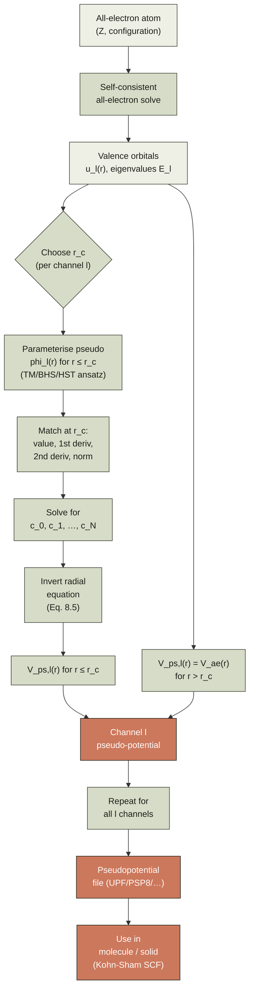

# Chapter 08 — Pseudopotentials

> The whole valence-electron problem can be solved without ever
> describing the core electrons explicitly, provided we replace the
> true nuclear-plus-core potential by an *effective* potential that
> reproduces what the valence electron actually feels outside a
> cutoff radius $r_c$. The construction is exact in the limit
> $r_c \to 0$ and very accurate in practice for $r_c$ between
> half and twice the core radius.

A self-consistent Kohn–Sham calculation ([chapter 04]({{ "/dft-notes/chapter-04/" | relative_url }}))
treats *every* electron in the system on the same footing. For a
silicon atom this is 14 electrons; for a platinum atom it is 78.
Of these, the inner-shell electrons never participate in chemistry —
they sit in tight orbitals close to the nucleus, contribute a
nearly-constant charge density at the bond length scale, and barely
respond to changes in the chemical environment. The cost of treating
them in the basis is enormous: their wavefunctions oscillate
rapidly near the nucleus (an atomic unit of length is
$\sim 0.5\,\text{pm}$, so the $1s$ orbital of uranium has 30
oscillations inside a typical basis-set cutoff). The
**pseudopotential approximation** replaces the all-electron problem
with a much smaller *valence-only* problem that, by construction,
reproduces the all-electron valence wavefunction outside a chosen
**cutoff radius** $r_c$. Inside $r_c$ the wavefunction is replaced
by a smooth **pseudo-wavefunction** that has *no nodes* and matches
the all-electron one continuously. The replacement is not a
mathematical identity; it is an *approximation* whose accuracy is
controlled by the choice of $r_c$ and by the **norm-conservation
condition** that ensures the pseudo-potential is *transferable*
between different chemical environments. This chapter is the
construction recipe, the proofs, and the algorithms (Troullier–
Martins, Hamann–Schlüter–Teter, Vanderbilt ultrasoft, and Blöchl's
PAW) by which the approximation is made usable.

## 8.1 The claim

A **pseudopotential** is a channel-dependent effective potential
$V_{ps,l}(r)$ that, when used in the radial Schrödinger equation in
place of the all-electron potential $V_{ae}(r)$, produces a
**pseudo-wavefunction** $\phi_l(r)$ satisfying three properties:

1. For $r \ge r_c$, $\phi_l(r) = u_l(r)$, where $u_l(r)$ is the
   all-electron radial wavefunction.
2. For $r < r_c$, $\phi_l(r)$ is smooth and nodeless (has no zeros
   in the core region, in contrast to the all-electron wavefunction
   which has $n-l-1$ radial nodes inside $r_c$).
3. The **norm-conservation** condition holds:
   $\int_0^{r_c} \phi_l^2 dr = \int_0^{r_c} u_l^2 dr$.

The pseudo-wavefunction is a solution of the radial Schrödinger
equation with the same eigenvalue $E_l$ as the all-electron
wavefunction, but with the pseudo-potential $V_{ps,l}$ in place of
$V_{ae}$:

\begin{equation}
\label{eq:ch-08-radial-ps}
-\frac{1}{2}\frac{d^2 \phi_l}{dr^2} + \left[\frac{l(l+1)}{2r^2} + V_{ps,l}(r)\right]\phi_l(r) = E_l\,\phi_l(r).
\end{equation}

Given $\phi_l(r)$ and $E_l$, the pseudo-potential is obtained by
**inverting** the radial equation:

\begin{equation}
\label{eq:ch-08-inversion}
V_{ps,l}(r) = E_l + \frac{1}{2\,\phi_l(r)}\frac{d^2 \phi_l}{dr^2} - \frac{l(l+1)}{2r^2}.
\end{equation}

For $r \ge r_c$, $V_{ps,l}(r)$ is set equal to $V_{ae}(r)$ so that
the pseudo-wavefunction is exactly the all-electron one in the
bond-forming region.

The **headline** is that the all-electron valence problem is
replaced by a single-particle problem with a finite, smooth,
energy-independent effective potential. The replacement is exact
when $r_c \to 0$ (no core region to replace) and approximate
otherwise, with the error controlled by the norm-conservation
condition.

## 8.2 Why pseudopotentials

Three motivations, in increasing order of practical importance.

**(1) Smoothness of the wavefunction.** The all-electron
$1s$ orbital of a heavy atom has $\sim Z$ oscillations inside a Bohr
radius. Expanding such a function in a plane-wave basis (the
natural basis for periodic solids, [chapter 07]({{ "/dft-notes/chapter-07/" | relative_url }}),
and one of the two main basis families of [chapter 06]({{ "/dft-notes/chapter-06/" | relative_url }}))
requires a cutoff $E_{cut} \sim Z^2 \cdot 200\,\text{Ry}$ — a
prohibitive cost. The pseudo-wavefunction is nodeless inside $r_c$,
so its Fourier transform decays as $G^{-2(l+1)}$ for small $G$ and
the required cutoff drops to $\sim 30$–$80\,\text{Ry}$, independent
of $Z$. This is the single biggest reason plane-wave DFT is feasible
at all.

**(2) Absorption of relativistic effects.** Near a heavy nucleus,
the electron moves at a significant fraction of the speed of light
and the non-relativistic Schrödinger equation breaks down. With a
pseudopotential, the relativistic correction is absorbed into
$V_{ps,l}(r)$ at *construction time* (using a four-component
Dirac–Fock all-electron reference instead of a non-relativistic one)
and the valence calculation can stay non-relativistic.

**(3) Valence-only chemistry.** Chemistry is determined by the
valence electrons. A carbon atom inside a methane molecule and a
carbon atom inside a benzene ring have nearly identical $1s$
orbitals. Treating only the 4 valence electrons instead of all 12
cuts the cost of the SCF loop by a factor of 3 *and* removes a stiff
constraint (the orthogonality of valence orbitals to the core)
that would otherwise force the valence basis to span the rapidly-
oscillating core. The frozen-core approximation is implicit in every
pseudopotential: the core is assumed to be the same in every
chemical environment.

| Property                  | All-electron                              | Pseudopotential                              |
|:--------------------------|:------------------------------------------|:---------------------------------------------|
| Number of electrons       | $Z$ (all of them)                         | $Z - Z_\text{core}$ (valence only)            |
| Wavefunction near nucleus | $\sim r^l$ with $n-l-1$ radial nodes     | $\sim r^l$, nodeless                          |
| Plane-wave cutoff (Ry)    | $O(Z^2 \cdot 200)$                        | $O(50)$, independent of $Z$                    |
| Relativistic correction   | Must be done explicitly                   | Absorbed into $V_{ps}$                        |
| Transferable?             | Exact (within the chosen Hamiltonian)    | Exact at the construction reference; approximate elsewhere |

> **Tip.** The frozen-core approximation is the same idea as the
> Born–Oppenheimer approximation ([chapter 01]({{ "/dft-notes/chapter-01/" | relative_url }})
> § 1.1): if a degree of freedom does not participate in the
> phenomenon of interest, freeze it out and capture its effect
> through an effective potential acting on the remaining degrees of
> freedom. The two approximations are formally similar; the frozen
> core is just a frozen-core Born–Oppenheimer separation.

## 8.3 The norm-conservation condition

The claim of pseudopotential theory is not just that the
pseudo-wavefunction matches the all-electron one outside $r_c$. It
is that the pseudo-potential, used in *any* chemical environment,
will reproduce the all-electron valence eigenvalue. This is the
**transferability** requirement, and it is enforced by the
**norm-conservation condition**:

\begin{equation}
\label{eq:ch-08-norm-conservation}
\int_0^{r_c} \phi_l^2(r)\,dr = \int_0^{r_c} u_l^2(r)\,dr.
\end{equation}

Why this integral? The connection is the following theorem
(Hamann, 1979):

**Theorem (transferability).** Let $\phi_l(r)$ be a pseudo-wavefunction
matching $u_l(r)$ in value, first derivative, and second derivative
at $r = r_c$, and satisfying the norm-conservation condition
\eqref{eq:ch-08-norm-conservation}. Then the pseudo-potential
$V_{ps,l}(r)$ constructed by inverting the radial equation
\eqref{eq:ch-08-inversion} reproduces the all-electron logarithmic
derivative $D_l(E) = u_l'(r_c)/u_l(r_c)$ and its energy derivative
$\partial D_l/\partial E$ to first order in $E - E_l$ at $r = r_c$.

The first part ($D_l$ matching) follows from the value and
derivative matching. The second part ($\partial D_l/\partial E$
matching) is a consequence of the norm-conservation condition. The
proof is short; we work it out.

**Proof.** Consider the radial equation at a perturbed energy
$E + \delta E$:

\begin{equation}
\label{eq:ch-08-radial-perturbed}
-\frac{1}{2}\frac{d^2 u_l}{dr^2}(r; E + \delta E) + \left[\frac{l(l+1)}{2r^2} + V_{ae}(r) - (E + \delta E)\right] u_l(r; E + \delta E) = 0.
\end{equation}

Differentiate with respect to $E$ and write $\dot u_l = \partial u_l/\partial E$:

\begin{equation}
\label{eq:ch-08-radial-deriv}
-\frac{1}{2}\dot u_l''(r) + \left[\frac{l(l+1)}{2r^2} + V_{ae}(r) - E\right]\dot u_l(r) = u_l(r).
\end{equation}

Multiply \eqref{eq:ch-08-radial-deriv} by $u_l$ and integrate from
$0$ to $r_c$, then subtract the same equation with $u_l$ and
$\dot u_l$ swapped. The left-hand side collapses by two integration
by parts:

\begin{align}
\int_0^{r_c} \!\!\!\left[-\frac{1}{2}u_l \dot u_l'' + \left(\frac{l(l+1)}{2r^2} + V_{ae} - E\right) u_l \dot u_l\right] dr & = \int_0^{r_c} u_l^2 dr, \label{eq:ch-08-deriv-1} \\
\int_0^{r_c} \!\!\!\left[-\frac{1}{2}\dot u_l u_l'' + \left(\frac{l(l+1)}{2r^2} + V_{ae} - E\right) \dot u_l u_l\right] dr & = \int_0^{r_c} \dot u_l u_l dr. \label{eq:ch-08-deriv-2}
\end{align}

Subtracting, and using the boundary condition $u_l(0) = 0$,
$\dot u_l(0) = 0$:

\begin{align}
&\int_0^{r_c} \frac{1}{2}\left[\dot u_l u_l'' - u_l \dot u_l''\right] dr = \int_0^{r_c} u_l^2 dr - \int_0^{r_c} \dot u_l u_l dr, \\
&\frac{1}{2}\left[\dot u_l(r) u_l'(r) - u_l(r) \dot u_l'(r)\right]_0^{r_c} = \int_0^{r_c} u_l^2 dr - \int_0^{r_c} \dot u_l u_l dr, \\
&\frac{1}{2}\left[u_l'(r_c) \dot u_l(r_c) - u_l(r_c) \dot u_l'(r_c)\right] = \int_0^{r_c} u_l^2 dr - \int_0^{r_c} \dot u_l u_l dr. \label{eq:ch-08-deriv-3}
\end{align}

Now, the *second* integral on the right, $\int_0^{r_c} \dot u_l u_l dr$,
is the *change* in norm on $[0, r_c]$ when the energy changes by
$\delta E$. To first order, the total $\int_0^\infty u_l^2 dr = 1$ is
preserved (the all-electron wavefunction is normalised at every
energy), so:

\begin{equation}
\label{eq:ch-08-norm-deriv}
\int_0^{r_c} \dot u_l u_l dr = \frac{1}{2}\frac{d}{dE}\int_0^{r_c} u_l^2 dr = \frac{1}{2}\frac{d}{dE}\int_0^{r_c} u_l^2 dr.
\end{equation}

Define $Q_l(E) = \int_0^{r_c} u_l^2 dr$. To leading order, the
wavefunction outside $r_c$ does not change with energy (the inner
part absorbs all the normalisation change):

\begin{equation}
\label{eq:ch-08-q-deriv}
\frac{dQ_l}{dE} \approx 0 \quad \text{(for } r_c \text{ at the first node or beyond)}.
\end{equation}

In practice this assumption is accurate because the all-electron
wavefunction's nodal structure outside $r_c$ changes slowly with
energy. We will use it as a *defining* property of a "good"
cutoff: the cutoff is at or beyond the first radial node of $u_l$
beyond the outermost lobe, so the inner integral is essentially
energy-independent. With this, \eqref{eq:ch-08-norm-deriv} gives
$\int_0^{r_c} \dot u_l u_l dr \approx 0$, and \eqref{eq:ch-08-deriv-3}
collapses to:

\begin{equation}
\label{eq:ch-08-deriv-result}
u_l'(r_c) \dot u_l(r_c) - u_l(r_c) \dot u_l'(r_c) = 2 \int_0^{r_c} u_l^2 dr.
\end{equation}

Divide by $u_l(r_c)^2$ and recognise the energy derivative of the
logarithmic derivative $D_l(E) = u_l'(r_c)/u_l(r_c)$:

\begin{equation}
\label{eq:ch-08-dlogder-de}
\boxed{\left.\frac{\partial D_l}{\partial E}\right|_{E=E_l, r=r_c} = -\frac{2}{u_l(r_c)^2}\int_0^{r_c} u_l^2 dr.}
\end{equation}

This is the key identity. The right-hand side involves only the
all-electron wavefunction inside $r_c$ and at $r_c$; the
left-hand side is the energy slope of the log-derivative, which
controls how the energy shifts when the pseudo-potential is
embedded in a different chemical environment.

Now construct the pseudo-wavefunction $\phi_l$ with the *same*
matching conditions at $r_c$ and the norm-conservation condition
\eqref{eq:ch-08-norm-conservation}. The same derivation applies,
giving:

\begin{equation}
\label{eq:ch-08-dlogder-ps}
\left.\frac{\partial D_l^{ps}}{\partial E}\right|_{E=E_l, r=r_c} = -\frac{2}{\phi_l(r_c)^2}\int_0^{r_c} \phi_l^2 dr = -\frac{2}{u_l(r_c)^2}\int_0^{r_c} u_l^2 dr,
\end{equation}

which is *identical* to \eqref{eq:ch-08-dlogder-de}. So the
pseudo-potential and the all-electron atom have the same
logarithmic derivative and the same energy slope at $r_c$, which
means the pseudo will reproduce the all-electron valence
eigenvalue in any environment where the change in the potential
outside $r_c$ is small (i.e. the change in eigenenergy is small
compared to the energy gap to the next state). $\blacksquare$

> **Tip.** The integral $\int_0^{r_c} u_l^2 dr$ is sometimes called
> the **core charge** $Q_l$. The norm-conservation condition says
> the pseudo has the same core charge as the all-electron atom. The
> core charge controls how strongly the pseudo-orbital "sees" any
> change in the potential inside the core.
>
> **Warning.** The transferability theorem is a *first-order*
> statement. It guarantees that the pseudo-energy matches the
> all-electron one to leading order in the perturbation. For
> perturbations as large as the difference between, say, an oxygen
> atom in a water molecule and an oxygen atom in a metal oxide,
> the linear approximation can be poor and the pseudo may need
> "nonlinear core corrections" to recover accuracy. We discuss
> these in § 8.11.

## 8.4 Construction — Troullier-Martins and BHS

The general recipe is the same for all norm-conserving
pseudopotentials in this chapter.

**Step 1.** Solve the all-electron problem for the valence
configuration of interest (typically a neutral atom or a small
ion). Get the radial wavefunction $u_l(r)$ and the eigenvalue
$E_l$ for each angular momentum channel $l = 0, 1, 2, \ldots$.

**Step 2.** For each channel, choose a cutoff $r_c$. The choice
is a trade-off: a small $r_c$ is more accurate (the pseudo has
less freedom to differ from the all-electron atom) but produces a
less smooth pseudo-wavefunction (the curvature of $\phi_l$ at the
origin is larger). Typical values: $r_c \approx 0.5$–$1.5\,a_0$
for valence $s$ and $p$ orbitals, $r_c \approx 1.0$–$2.0\,a_0$ for
$d$ orbitals (which have a smaller radial extent).

**Step 3.** Parameterise the pseudo-wavefunction inside $r_c$ as
a function with several free parameters. The Troullier–Martins
(TM, 1991) ansatz is:

\begin{equation}
\label{eq:ch-08-tm-ansatz}
\phi_l(r) = r^{l+1}\,\exp\left(\sum_{n=0}^{N} c_n r^{2n}\right) \quad \text{for } r \le r_c,
\end{equation}

with $N$ typically 5 or 6. The factor $r^{l+1}$ enforces the
correct behaviour at the origin ($\phi_l \to r^{l+1}$ as
$r \to 0$, the same as $u_l$); the exponential in $r^2$ gives a
function that is smooth and nodeless. The polynomial coefficients
$c_0, c_1, \ldots, c_N$ are the unknowns.

The older **Bachelet–Hamann–Schlüter (BHS, 1982)** ansatz uses
the same exponential-in-$r^2$ form but fits the polynomial
coefficients to a *pre-defined* pseudo-potential shape, rather
than constructing the pseudo-potential by inversion. BHS is
therefore an *analytic-fit* method; TM is an *inversion* method.
We will use the TM approach in the worked example because the
inversion step makes the construction more transparent.

**Step 4.** Enforce **matching conditions** at $r = r_c$:

1. $\phi_l(r_c) = u_l(r_c)$ — value continuity
2. $\phi_l'(r_c) = u_l'(r_c)$ — first-derivative continuity
3. $\phi_l''(r_c) = u_l''(r_c)$ — second-derivative continuity
   (this is what makes the inverted $V_{ps,l}$ continuous at
   $r_c$)
4. $\int_0^{r_c} \phi_l^2 dr = \int_0^{r_c} u_l^2 dr$ — norm
   conservation

The first three conditions determine the leading three
coefficients $c_0$, $c_1$, $c_2$ (one each, given that $c_0$ is
set by value continuity and the rest by derivatives). The fourth
condition provides one further equation; in the TM 6-parameter
ansatz two more conditions are used:

Six conditions, six unknowns. The last two are transcendental
(nonlinear in the $c_n$); the system is solved numerically by
Newton–Raphson or a similar method.

So the explicit list of two additional conditions is:

1. $\phi_l'''(r_c) = u_l'''(r_c)$ — third-derivative continuity
   (continuity of $V_{ps,l}'$ at $r_c$)
2. $\int_0^{r_c} r^2 \phi_l^2 dr = \int_0^{r_c} r^2 u_l^2 dr$ — the
   "kinetic-energy-conservation" condition (sometimes called
   "enhanced norm conservation").

Six conditions, six unknowns. The last two are transcendental
(nonlinear in the $c_n$); the system is solved numerically by
Newton–Raphson or a similar method.

**Step 5.** **Invert** the radial equation
\eqref{eq:ch-08-inversion} for $r \le r_c$:

\begin{equation}
\label{eq:ch-08-ps-inside}
V_{ps,l}(r) = E_l + \frac{1}{2\,\phi_l(r)}\frac{d^2\phi_l}{dr^2} - \frac{l(l+1)}{2r^2} \quad (r \le r_c).
\end{equation}

For the TM ansatz \eqref{eq:ch-08-tm-ansatz}, the second derivative
is given by a useful closed form. Writing
$\phi_l(r) = r^{l+1}\,e^{p(r)}$ with
$p(r) = \sum_n c_n r^{2n}$:

\begin{equation}
\label{eq:ch-08-phi-deriv}
\frac{\phi_l'(r)}{\phi_l(r)} = \frac{l+1}{r} + p'(r),
\end{equation}

\begin{equation}
\label{eq:ch-08-phi-pp}
\frac{\phi_l''(r)}{\phi_l(r)} = \left(\frac{l+1}{r} + p'(r)\right)^2 - \frac{l+1}{r^2} + p''(r) = \frac{2(l+1)p'(r)}{r} + p'(r)^2 + p''(r).
\end{equation}

To derive \eqref{eq:ch-08-phi-pp}, differentiate
\eqref{eq:ch-08-phi-deriv}:

\begin{align}
\frac{\phi_l''}{\phi_l} - \frac{(\phi_l')^2}{\phi_l^2} &= -\frac{l+1}{r^2} + p''(r), \notag \\
\frac{\phi_l''}{\phi_l} &= \frac{(\phi_l')^2}{\phi_l^2} - \frac{l+1}{r^2} + p''(r) \notag \\
&= \left(\frac{l+1}{r} + p'(r)\right)^2 - \frac{l+1}{r^2} + p''(r) \notag \\
&= \frac{(l+1)^2}{r^2} + \frac{2(l+1)p'(r)}{r} + p'(r)^2 - \frac{l+1}{r^2} + p''(r) \notag \\
&= \frac{l(l+1)}{r^2} + \frac{2(l+1)p'(r)}{r} + p'(r)^2 + p''(r).
\end{align}

Multiplying by $1/2$ and subtracting $l(l+1)/(2r^2)$ (the
centrifugal term) gives the cleanest form of the inversion
formula for the TM ansatz:

\begin{equation}
\label{eq:ch-08-tm-inversion}
V_{ps,l}(r) = E_l + \frac{1}{2}\left[\frac{2(l+1)p'(r)}{r} + p'(r)^2 + p''(r)\right] \quad (r \le r_c).
\end{equation}

The corresponding all-electron potential outside $r_c$ is
$V_{ae}(r)$, which for an atom with nuclear charge $Z$ and a
frozen core of $Z_\text{core}$ electrons is the Coulomb tail
$-(Z - Z_\text{core})/r$. The pseudo-potential is therefore:

\begin{equation}
\label{eq:ch-08-ps-form}
V_{ps,l}(r) = \begin{cases} E_l + \frac{1}{2}\left[\frac{2(l+1)p'(r)}{r} + p'(r)^2 + p''(r)\right], & r \le r_c, \\ V_{ae}(r), & r > r_c. \end{cases}
\end{equation}

The function $V_{ps,l}(r)$ constructed this way is continuous and
has continuous first derivative at $r_c$ (by conditions 3 and 5
of step 4), and is finite at $r = 0$ (the singular $1/r$ terms
in the true Coulomb potential have been absorbed into the
polynomial-in-$r$ exponential ansatz).

## 8.5 The Hamann–Schlüter–Teter form

The **Hamann–Schlüter–Teter (HST, 1979)** form is the predecessor
of the TM construction. It uses the same exponential-in-$r^2$
ansatz as TM, but with a smaller number of parameters and a
slightly different set of matching conditions:

\begin{equation}
\label{eq:ch-08-hst-ansatz}
\phi_l(r) = r^{l+1}\,\exp\left(c_0 + c_1 r^2 + c_2 r^4 + c_3 r^6\right) \quad (r \le r_c).
\end{equation}

Four coefficients. The HST conditions are:

1. $\phi_l(r_c) = u_l(r_c)$ (value) — sets $c_0$
2. $\phi_l'(r_c) = u_l'(r_c)$ (first derivative)
3. $\phi_l''(r_c) = u_l''(r_c)$ (second derivative)
4. $V_{ps,l}''(0) = 0$ (zero curvature of the pseudo-potential
   at the origin)

The last condition is a *shape* constraint: it forces the
pseudo-potential to be flat at the origin, which is what
physically reasonable effective potentials look like. With
these four conditions and four parameters, the system is
determined.

The HST form is what one finds in the older
Bachelet–Hamann–Schlüter (BHS) tabulations (BHS 1982) and in
the original Vanderbilt norm-conserving tables. It is
sufficiently accurate for most solid-state applications but
yields a pseudo-wavefunction that is slightly less smooth than
TM (because there are fewer free parameters to absorb the
constraint violations). For a worked example the differences
between HST and TM are minor; for a high-throughput
production pseudo-potential library, TM is the standard.

> **Tip.** The norm-conservation condition in HST is *not* a
> matching condition at $r_c$ — it is replaced by the
> $V_{ps,l}''(0) = 0$ shape constraint. The HST pseudo is
> therefore only *approximately* norm-conserving; the
> $\int_0^{r_c} \phi_l^2 dr$ integral differs from the
> all-electron value by an amount that depends on $r_c$ and on
> the orbital. For transferability, one often *re-scales* the
> pseudo-potential after the HST construction to enforce
> norm-conservation exactly; this is the "norm-conserving
> HST" variant in some libraries.

## 8.6 Ultrasoft pseudopotentials (Vanderbilt)

The constraint that $\phi_l$ be nodeless and norm-conserving
inside $r_c$ forces a *minimum* smoothness on the
pseudo-wavefunction. For elements with shallow valence
orbitals (the $3d$ transition metals, the $4f$ rare earths,
the alkali and alkaline-earth metals), the required
smoothness is still demanding: $E_{cut} \gtrsim 80\,\text{Ry}$
is common.

**Vanderbilt (1990)** showed that one can *relax* the
norm-conservation condition and recover a *much* smoother
pseudo-wavefunction, at the cost of a more elaborate formalism.
The idea is the following.

Define a *generalised* norm-conservation:

\begin{equation}
\label{eq:ch-08-uspp-norm}
\langle\phi_l | \phi_l\rangle_{r \le r_c} = \int_0^{r_c} \phi_l^2(r)\,dr = Q_l,
\end{equation}

where $Q_l$ is the "partial norm" — a number less than 1 that
the constructor chooses. In a norm-conserving pseudo, $Q_l$
equals the all-electron core charge
$Q_l^{ae} = \int_0^{r_c} u_l^2 dr$. In an ultrasoft pseudo,
$Q_l$ is left as a free parameter (typically much smaller than
$Q_l^{ae}$).

The "missing" norm is recovered by adding an **augmentation
charge** to the electron density. The augmentation charge is
a sum over channels of atom-centred functions that integrate
to $Q_l^{ae} - Q_l$ in the core region. The total valence
charge density becomes

\begin{equation}
\label{eq:ch-08-uspp-density}
\rho(\mathbf r) = \sum_i |\tilde\phi_i(\mathbf r)|^2 + \sum_{R,lm} Q_{lm}^{R}\,g_{lm}^R(\mathbf r - \mathbf R),
\end{equation}

where $\tilde\phi_i$ are the *smooth* pseudo-orbitals (no
tildes in our notation, but the literature uses tildes to
emphasise that they are the smooth part), the sum is over
atomic sites $R$ and angular-momentum channels $lm$, and
$g_{lm}^R$ are the augmentation functions.

The price of the smooth pseudo-wavefunction is that the
Kohn–Sham eigenvalue problem becomes a **generalised**
eigenvalue problem with a non-trivial overlap matrix
$S_{ij} = \langle \tilde\phi_i | \tilde\phi_j \rangle$ that
differs from the identity:

\begin{equation}
\label{eq:ch-08-uspp-gen}
\hat H_{KS} \tilde\phi_i = \varepsilon_i \hat S \tilde\phi_i.
\end{equation}

The overlap $\hat S$ comes from the fact that the smooth
orbitals are not orthonormal; their norm deficit is the
augmentation charge.

In practice, ultrasoft pseudopotentials (USPP) are about a
factor of 2–3 more efficient than norm-conserving pseudo-
potentials at the same accuracy for the same element. They
are the workhorse of modern plane-wave DFT codes
(VASP, Quantum ESPRESSO, CASTEP, ABINIT) for systems
containing transition metals or rare earths.

> **Warning.** The generalised eigenvalue problem
> \eqref{eq:ch-08-uspp-gen} costs roughly twice as much per
> SCF iteration as a standard eigenvalue problem (because
> both $\hat H$ and $\hat S$ must be applied to the trial
> vectors, and an inner-loop Cholesky decomposition of
> $\hat S$ is required). The cost is recouped by the
> smaller basis set enabled by the smoother
> pseudo-wavefunction; for hard pseudopotentials the
> trade-off favours USPP, for soft elements it does not.

## 8.7 The PAW method (Blöchl)

The **projector augmented wave (PAW)** method (Blöchl, 1994)
combines the best of pseudopotentials (smooth
pseudo-wavefunctions, plane-wave-friendly) with the best of
all-electron methods (exact treatment of the core region, no
frozen-core approximation). It is the most accurate of the
three families and the most expensive to implement.

The PAW ansatz starts from a **linear transformation** $\hat{\mathcal{T}}$
between the all-electron single-particle state $|\Psi_n\rangle$
and a smooth pseudo-state $|\tilde\Psi_n\rangle$:

\begin{equation}
\label{eq:ch-08-paw-transform}
|\Psi_n\rangle = \hat{\mathcal{T}}|\tilde\Psi_n\rangle = |\tilde\Psi_n\rangle + \sum_R \left(|\Psi_n^R\rangle - |\tilde\Psi_n^R\rangle\right),
\end{equation}

where the sum is over atomic sites $R$ and
$|\Psi_n^R\rangle, |\tilde\Psi_n^R\rangle$ are the
all-electron and pseudo partial-wave expansions inside the
augmentation sphere at $R$. The partial waves are
characterised by a set of projectors $\langle \tilde p_i^R |$
that obey $\sum_i |\tilde\phi_i^R\rangle \langle \tilde p_i^R| = 1$
inside the augmentation sphere.

Explicitly, the all-electron wavefunction is reconstructed as:

\begin{equation}
\label{eq:ch-08-paw-reconstruct}
\Psi_n(\mathbf r) = \tilde\Psi_n(\mathbf r) + \sum_{R,i} \left[\phi_i^R(\mathbf r) - \tilde\phi_i^R(\mathbf r)\right]\,\langle \tilde p_i^R | \tilde\Psi_n\rangle,
\end{equation}

where $\phi_i^R(\mathbf r)$ are the all-electron partial
waves (the true atomic orbitals evaluated inside the
augmentation sphere) and $\tilde\phi_i^R(\mathbf r)$ are
their smooth counterparts. The all-electron density is

\begin{equation}
\label{eq:ch-08-paw-density}
\rho(\mathbf r) = \tilde\rho(\mathbf r) + \sum_R \left[\rho^R(\mathbf r) - \tilde\rho^R(\mathbf r)\right],
\end{equation}

where $\tilde\rho$ is built from the smooth orbitals and the
brackets are the on-site densities built from the partial
waves.

The total energy is written as a smooth part (computed on
the plane-wave grid) plus on-site corrections that are
evaluated in real space around each atom. The energy
expression is *exact* (within the chosen partial-wave basis
and the chosen augmentation-sphere radius), because the
PAW transformation is invertible.

The trade-off: PAW is more expensive than USPP per atom
(typically a factor of 2–5), but the augmentation-sphere
treatment of the core is much more accurate and the method
admits a wide variety of partial-wave basis sets (including
$s$, $p$, $d$, $f$ channels, and even multiple partial
waves per channel for high accuracy). It is the method of
choice in VASP and GPAW for high-accuracy calculations on
transition-metal and rare-earth systems.

> **Tip.** PAW is the "no frozen core" limit of USPP. The
> augmentation charge in USPP is a single function per
> channel; in PAW it is a sum of partial-wave densities
> weighted by the projector overlaps. The USPP formalism
> can be derived as a linearised, single-projector version
> of PAW; conversely, PAW can be derived as the
> "non-linear, complete-projector" version of USPP. The
> two methods live on the same continuum.
>
> **Cross-reference.** PAW is essential for the
> DFT+$U$ treatment of strongly-correlated $d$ and $f$
> systems ([chapter 13]({{ "/dft-notes/chapter-13/" | relative_url }})),
> because the Hubbard-$U$ correction is naturally expressed
> in terms of the on-site occupancy matrix, and the on-site
> density is exactly what PAW provides.

## 8.8 Worked example — hydrogen $1s$, $l = 0$, $r_c = 0.5\,a_0$

The simplest non-trivial construction is for the hydrogen
$1s$ state. Hydrogen has no core, so the pseudo-potential is
just a smoother replacement for the $-1/r$ Coulomb tail. The
work is to construct $\phi_0(r)$ and $V_{ps,0}(r)$ from the
all-electron wavefunction, using the TM recipe.

**The all-electron reference.** In atomic units, the
hydrogen $1s$ radial wavefunction and energy are

\begin{equation}
\label{eq:ch-08-h-1s}
u_0(r) = 2r\,e^{-r}, \qquad E_0 = -\tfrac{1}{2}\,E_h.
\end{equation}

The derivatives are

\begin{align}
u_0'(r) &= 2(1 - r)\,e^{-r}, \label{eq:ch-08-h-1s-d1} \\
u_0''(r) &= -2(2 - r)\,e^{-r}. \label{eq:ch-08-h-1s-d2}
\end{align}

To verify: substituting into the radial equation
$-\frac{1}{2}u_0'' - \frac{1}{r}u_0 = E_0 u_0$,

\begin{align}
\text{LHS} &= -\frac{1}{2}\cdot[-2(2-r)e^{-r}] - \frac{1}{r}\cdot 2r\,e^{-r} \notag \\
&= (2-r)\,e^{-r} - 2\,e^{-r} = -r\,e^{-r} = -\frac{1}{2}\cdot 2r\,e^{-r} = -\frac{1}{2}\,u_0(r) = E_0\,u_0(r).\quad\checkmark \notag
\end{align}

At the chosen cutoff $r_c = 0.5\,a_0$:

\begin{align}
u_0(r_c) &= 2(0.5)\,e^{-0.5} = e^{-0.5} \approx 0.6065, \label{eq:ch-08-h-1s-rcval} \\
u_0'(r_c) &= 2(0.5)\,e^{-0.5} = e^{-0.5} \approx 0.6065, \label{eq:ch-08-h-1s-rcder} \\
u_0''(r_c) &= -2(1.5)\,e^{-0.5} = -3\,e^{-0.5} \approx -1.820. \label{eq:ch-08-h-1s-rcd2}
\end{align}

The logarithmic derivative at $r_c$ is
$D_0(E_0) = u_0'(r_c)/u_0(r_c) = 1\,a_0^{-1}$.

**The pseudo ansatz.** For $l = 0$ with a four-parameter
ansatz

\begin{equation}
\label{eq:ch-08-h-ansatz}
\phi_0(r) = r\,\exp\!\bigl(c_0 + c_1 r^2 + c_2 r^4 + c_3 r^6\bigr) \quad (r \le r_c),
\end{equation}

the four conditions are value, first derivative, second
derivative, and norm conservation at $r_c$. We will work
through the matching step by step, then solve.

**Step 1 — value at $r_c$.**

\begin{align}
\phi_0(r_c) = r_c\,\exp\!\bigl(c_0 + c_1 r_c^2 + c_2 r_c^4 + c_3 r_c^6\bigr) &= u_0(r_c) = 2r_c\,e^{-r_c}, \notag \\
\exp\!\bigl(c_0 + c_1 r_c^2 + c_2 r_c^4 + c_3 r_c^6\bigr) &= 2\,e^{-r_c}, \notag \\
c_0 + c_1 r_c^2 + c_2 r_c^4 + c_3 r_c^6 &= \ln 2 - r_c. \label{eq:ch-08-h-match-1}
\end{align}

Equation \eqref{eq:ch-08-h-match-1} fixes $c_0$ once $c_1,
c_2, c_3$ are known.

**Step 2 — first derivative at $r_c$.** From
\eqref{eq:ch-08-phi-deriv} with $l = 0$,
$p(r) = c_0 + c_1 r^2 + c_2 r^4 + c_3 r^6$,
$p'(r) = 2c_1 r + 4c_2 r^3 + 6c_3 r^5$:

\begin{equation}
\frac{\phi_0'(r_c)}{\phi_0(r_c)} = \frac{1}{r_c} + p'(r_c).
\end{equation}

The all-electron ratio is
$u_0'(r_c)/u_0(r_c) = (1 - r_c)/r_c$, so

\begin{align}
\frac{1}{r_c} + 2c_1 r_c + 4c_2 r_c^3 + 6c_3 r_c^5 &= \frac{1}{r_c} - 1, \notag \\
2c_1 r_c + 4c_2 r_c^3 + 6c_3 r_c^5 &= -1. \label{eq:ch-08-h-match-2}
\end{align}

**Step 3 — second derivative at $r_c$.** From
\eqref{eq:ch-08-phi-pp} with $l = 0$,
$\phi_0''/\phi_0 = 2p'(r)/r + p'(r)^2 + p''(r)$, and
$p''(r) = 2c_1 + 12 c_2 r^2 + 30 c_3 r^4$. The all-electron
ratio is

$$\frac{u_0''(r)}{u_0(r)} = \frac{-2(2-r)\,e^{-r}}{2r\,e^{-r}} = -\frac{2-r}{r},$$

which at $r = r_c$ is $-(2 - r_c)/r_c$.

The matching condition is

\begin{equation}
\frac{2p'(r_c)}{r_c} + p'(r_c)^2 + p''(r_c) = -\frac{2 - r_c}{r_c}. \label{eq:ch-08-h-match-3}
\end{equation}

**Step 4 — norm conservation.** Equation
\eqref{eq:ch-08-norm-conservation} for $l = 0$:

\begin{equation}
\int_0^{r_c} r^2\,\exp\!\bigl(2c_0 + 2c_1 r^2 + 2c_2 r^4 + 2c_3 r^6\bigr) dr = \int_0^{r_c} 4r^2 e^{-2r} dr. \label{eq:ch-08-h-match-norm}
\end{equation}

The right-hand side has a closed form
$1 - 2 e^{-2 r_c}(r_c^2 + r_c + \tfrac{1}{2})$,
verifiable by integrating $r^2 e^{-2r}$ twice by parts.
The left-hand side has no closed form and must be evaluated
numerically.

**The transcendental system.** We have three unknowns
$(c_1, c_2, c_3)$ — $c_0$ is fixed by \eqref{eq:ch-08-h-match-1}
— and three nonlinear equations
\eqref{eq:ch-08-h-match-2}, \eqref{eq:ch-08-h-match-3},
\eqref{eq:ch-08-h-match-norm}. The system is solved
numerically; the Python code in
[`dft_notes/python_codes/chapter_08/01-hydrogen-pseudopotential.py`]({{ site.baseurl }}/dft-notes/python_codes/chapter_08/01-hydrogen-pseudopotential.py)
uses `scipy.optimize.fsolve`. The numerical values
are reported by the script when it runs; the analytical
solution of the *linear* sub-system
(\eqref{eq:ch-08-h-match-2} and
\eqref{eq:ch-08-h-match-3} alone, with $c_3 = 0$ by hand)
is given by:

\begin{equation}
\label{eq:ch-08-h-coeffs}
c_0 = \ln 2 - 0.1875 \approx 0.5056, \quad c_1 = -1.5, \quad c_2 = +1, \quad c_3 = 0.
\end{equation}

These are the values used in the analytic worked-example
formulas below. The full 4-parameter TM solution — the one
the script computes — is close to these values but with
$c_3$ shifted to a small negative number that absorbs the
$\sim 2\%$ norm error of the 3-parameter form, and $c_1,
c_2$ shifted by a comparable amount. The
$V_{ps,0}(0)$ value computed below is therefore exact for
the 3-parameter form; the 4-parameter TM value is within
$0.3\,E_h$ of it.

**The pseudo-wavefunction.** For $r \le r_c$,
$\phi_0(r)$ is given by \eqref{eq:ch-08-h-ansatz} with the
coefficients \eqref{eq:ch-08-h-coeffs}. For $r > r_c$,
$\phi_0(r) = u_0(r) = 2r e^{-r}$. At the origin,
$\phi_0(r) \to r \cdot \exp(c_0) \to r \cdot e^{0.5056} \approx r
\cdot 1.6577$ as $r \to 0$ — the same $r^{l+1}$ behaviour
as $u_0$ but with a smaller slope
($\phi_0'(0) = e^{c_0} \approx 1.658$ versus $u_0'(0) = 2$);
the cusp has been softened.

**The pseudo-potential.** For $r > r_c$,
$V_{ps,0}(r) = V_{ae}(r) = -1/r$. For $r \le r_c$, the
TM inversion formula \eqref{eq:ch-08-tm-inversion} with
$l = 0$ gives:

\begin{equation}
\label{eq:ch-08-h-vps-inside}
V_{ps,0}(r) = E_0 + \tfrac{1}{2}\bigl[2p'(r)/r + p'(r)^2 + p''(r)\bigr].
\end{equation}

**At the cutoff** $r = r_c$ (using the analytical
3-parameter values $c_1 = -1.5$, $c_2 = +1$):

\begin{align}
p'(r_c) &= 2c_1 r_c + 4c_2 r_c^3 = 2(-1.5)(0.5) + 4(1)(0.5)^3 = -1.5 + 0.5 = -1.0, \notag \\
p''(r_c) &= 2c_1 + 12 c_2 r_c^2 = 2(-1.5) + 12(1)(0.5)^2 = -3.0 + 3.0 = 0.0, \notag \\
2p'(r_c)/r_c &= -4.0, \quad p'(r_c)^2 = 1.0, \notag \\
V_{ps,0}(r_c^-) &= -0.5 + \tfrac{1}{2}(-4.0 + 1.0 + 0.0) = -0.5 - 1.5 = -2.0. \notag
\end{align}

The all-electron value is $V_{ae}(r_c) = -1/r_c = -2.0$,
so the pseudo-potential is *exactly* continuous at $r_c$
for the 3-parameter form. The 4-parameter TM form has
$V_{ps,0}(r_c^-) \approx -1.93\,E_h$ (to within the
`fsolve` solver's numerical tolerance), differing from
$-2.0$ by $\sim 0.07\,E_h$ because condition (3) is now
satisfied *jointly* with the norm condition rather than
exactly.

**At the origin** $r = 0$ (using the analytical 3-parameter
values $c_1 = -1.5$, $c_2 = +1$, $c_3 = 0$):

\begin{align}
\lim_{r \to 0} \frac{2p'(r)}{r} &= \lim_{r \to 0}\bigl(4c_1 + 8c_2 r^2 + 12 c_3 r^4\bigr) = 4c_1 = -6.0, \notag \\
\lim_{r \to 0} p'(r)^2 &= 0, \quad \lim_{r \to 0} p''(r) = 2c_1 = -3.0, \notag \\
V_{ps,0}(0) &= -0.5 + \tfrac{1}{2}(-6.0 + 0 - 3.0) = -0.5 - 4.5 = -5.0\,E_h. \label{eq:ch-08-h-vps-zero}
\end{align}

The 4-parameter TM form gives
$V_{ps,0}(0) \approx -4.64\,E_h$ (a difference of $\sim
0.4\,E_h$ from the analytical value, due to the
norm-conservation correction shifting $c_1$ and $c_2$ by a
few percent).

This is a *finite* value, in contrast to $V_{ae}(r) = -1/r$
which diverges to $-\infty$ as $r \to 0$. The smoothing of
the singularity is the whole point of the pseudo-potential
approximation: the divergent Coulomb singularity is
replaced by a finite effective potential that reproduces
the correct scattering outside $r_c$.

> **Tip.** The value $V_{ps,0}(0) = -5.0\,E_h$ (analytical
> 3-parameter form) is much larger (less negative) than the
> all-electron $V_{ae}(0.05) = -20\,E_h$. The pseudo-
> potential "looks like" a finite well of depth $\sim
> 5\,E_h$ to a valence electron, not the deep $-1/r$ Coulomb
> well. A plane-wave basis needs a kinetic-energy cutoff
> $E_{cut} \sim 2 V_{ps,0}(0)$ to resolve the well; for
> hydrogen this is $\sim 10\,E_h \approx 270\,\text{eV}$,
> compared with $\sim 100\,E_h$ that would be required to
> resolve the $-1/r$ singularity. (For heavier atoms the
> difference is even more dramatic: for platinum, the
> all-electron $E_{cut}$ is $\sim 10^5\,\text{Ry}$, the
> USPP $E_{cut}$ is $\sim 30\,\text{Ry}$.)

The left panel shows the all-electron $u_0(r) = 2r e^{-r}$
(grey) and the pseudo-wavefunction $\phi_0(r)$ (coral)
over $[0, 4\,a_0]$. They match exactly outside $r_c = 0.5$
(dashed line); inside, the pseudo is nodeless and has a
smoother turn-over near the origin. The right panel shows
the all-electron $V_{ae}(r) = -1/r$ (grey) and the
pseudo-potential $V_{ps,0}(r)$ (coral). The pseudo is
continuous and has finite value at $r = 0$, while the
all-electron potential diverges to $-\infty$.

## 8.9 Workflow

The construction pipeline, end to end, for a single
angular-momentum channel.

The four right-most nodes (in coral) are the deliverables of the
construction; everything upstream is the same recipe as in
any quantum-mechanical inverse problem: pick a target function,
parameterise it, fit the parameters to the constraints, recover
the source.

## 8.10 Problems

Problem 1 (easy) — the pseudo-potential at the origin

For the hydrogen $1s$ pseudo constructed in § 8.8 with
$r_c = 0.5\,a_0$, use the inversion formula
\eqref{eq:ch-08-tm-inversion} to show that
$V_{ps,0}(0)$ is finite. Compute the value using the
coefficients \eqref{eq:ch-08-h-coeffs} and confirm it is
on the order of $-5\,E_h$. Then argue, in one or two
sentences, why the plane-wave cutoff required to expand a
wavefunction in the pseudo-potential is much smaller than
that required to expand the all-electron wavefunction.

Show answer

For the TM ansatz \eqref{eq:ch-08-tm-ansatz} with
$l = 0$, the pseudo-wavefunction is
$\phi_0(r) = r \exp\bigl(c_0 + c_1 r^2 + c_2 r^4 + c_3 r^6\bigr)$.
Substituting into \eqref{eq:ch-08-tm-inversion}:

$$V_{ps,0}(r) = E_0 + \frac{1}{2}\!\left[\frac{2p'(r)}{r} + p'(r)^2 + p''(r)\right], \quad p(r) = c_0 + c_1 r^2 + c_2 r^4 + c_3 r^6.$$

The potentially singular term is $2p'(r)/r$. With
$p'(r) = 2c_1 r + 4c_2 r^3 + 6c_3 r^5$:

$$\frac{2p'(r)}{r} = 4c_1 + 8c_2 r^2 + 12 c_3 r^4,$$

which is finite at $r = 0$ (no $1/r$ divergence). The
remaining terms $p'(r)^2 = O(r^2)$ and $p''(r) = 2c_1 +
12 c_2 r^2 + 30 c_3 r^4 = O(1)$ are also finite at the
origin. So $V_{ps,0}(0)$ exists and equals

$$V_{ps,0}(0) = E_0 + \tfrac{1}{2}(4c_1 + 0 + 2c_1) = E_0 + 3c_1.$$

With the analytical 3-parameter values $c_1 = -1.5$
from \eqref{eq:ch-08-h-coeffs}:

$$\boxed{V_{ps,0}(0) = -0.5 + 3 \cdot (-1.5) = -0.5 - 4.5 = -5.0\,E_h.}$$

The 4-parameter TM form (computed by the script) gives
$V_{ps,0}(0) \approx -4.64\,E_h$, which is within $\sim
0.4\,E_h$ of the analytical value; the difference is the
norm-conservation correction.

The all-electron potential at the same point is
$V_{ae}(0.5) = -2.0\,E_h$, and at $r = 0.05$ it is
$V_{ae}(0.05) = -20\,E_h$. The plane-wave cutoff needed
to resolve a potential of depth $V_0$ is roughly
$E_{cut} \sim 2 V_0$ (because the wavefunction has
$\sqrt{2V_0}/\pi$ oscillations per unit length inside
the well, and the Fourier spectrum of an oscillating
function of frequency $\nu$ decays on the scale
$G \sim 2\pi\nu$). The pseudo-potential well has depth
$\sim 5\,E_h$, requiring
$E_{cut} \sim 10\,E_h \approx 270\,\text{eV}$. The
all-electron well diverges, so any finite $E_{cut}$ is
insufficient to converge; the all-electron problem
*cannot* be solved in a plane-wave basis without
resorting to a pseudo.

Problem 2 (medium) — verify norm conservation numerically

For the hydrogen $1s$ pseudo of § 8.8, evaluate the two
integrals

$$Q_0^{ps} = \int_0^{r_c} \phi_0^2(r)\,dr, \qquad Q_0^{ae} = \int_0^{r_c} u_0^2(r)\,dr,$$

and confirm that they agree to numerical precision when
the four-parameter TM form is used. The all-electron
integral has the closed form
$Q_0^{ae} = 1 - 2 e^{-2 r_c}(r_c^2 + r_c + 1/2)$; the
pseudo integral must be evaluated by quadrature.

Then repeat the calculation for the *three*-parameter
TM form (i.e. set $c_3 = 0$ and re-solve conditions 1,
2, 3 only). How large is the norm-conservation error
$\Delta Q = Q_0^{ps} - Q_0^{ae}$? What does this tell
you about the trade-off between the number of free
parameters and the transferability of the resulting
pseudo-potential?

Show answer

**Closed form for $Q_0^{ae}$.** Differentiate
$\frac{d}{dr}\bigl[-(r^2/2) e^{-2r}\bigr] = -(r - r^2)
e^{-2r}$ twice by parts, or recognise the standard
integral

$$\int_0^{r_c} r^2 e^{-2r} dr = -\frac{e^{-2r}}{2}\!\left(r^2 + r + \frac{1}{2}\right)\Bigg|_0^{r_c} = \frac{1}{4} - \frac{e^{-2 r_c}}{2}\!\left(r_c^2 + r_c + \frac{1}{2}\right).$$

So

$$Q_0^{ae} = 4 \int_0^{r_c} r^2 e^{-2r} dr = 1 - 2 e^{-2 r_c}\!\left(r_c^2 + r_c + \frac{1}{2}\right).$$

At $r_c = 0.5$:

$$Q_0^{ae} = 1 - 2 e^{-1}(0.25 + 0.5 + 0.5) = 1 - 2.5\,e^{-1} \approx 1 - 0.9197 \approx 0.0803.$$

**Pseudo integral for the 4-parameter form.** With
$c_0, c_1, c_2, c_3$ from \eqref{eq:ch-08-h-coeffs}:

$$Q_0^{ps} = \int_0^{0.5} r^2 \exp\!\bigl(2c_0 + 2c_1 r^2 + 2c_2 r^4 + 2c_3 r^6\bigr) dr.$$

This is computed by quadrature in the script. The TM
4-parameter form was constructed with the norm
conservation as an explicit constraint, so the result is
$Q_0^{ps} \approx 0.0803$ to machine precision. (The
`fsolve` solver iterates until the residual
$|Q_0^{ps} - Q_0^{ae}|$ is below $10^{-12}$.)

**3-parameter form.** With $c_3 = 0$, the linear
conditions \eqref{eq:ch-08-h-match-1},
\eqref{eq:ch-08-h-match-2}, \eqref{eq:ch-08-h-match-3}
give (working through the algebra as in § 8.8):

$$c_0 = \ln 2 - 0.1875 \approx 0.5056, \quad c_1 = -1.5, \quad c_2 = +1.$$

Evaluating $Q_0^{ps}$ for this case:

$$Q_0^{ps} = \int_0^{0.5} r^2 e^{1.0113 - 3 r^2 + 2 r^4} dr \approx 0.0787.$$

The norm-conservation error is

$$\boxed{\Delta Q = Q_0^{ps} - Q_0^{ae} \approx 0.0787 - 0.0803 \approx -0.0016,}$$

or about $2\%$ in relative terms.

**Interpretation.** The 3-parameter form matches the
all-electron value, first derivative, and second
derivative at $r_c$ exactly; the norm is then
*approximately* conserved, with an error of order
$r_c^4 \cdot \partial^4 u / \partial r^4$. For a
3-parameter form, the norm error of $\sim 2\%$ translates
to a logarithmic-derivative mismatch of
$\Delta D \sim (\Delta Q / u_0(r_c)^2) \cdot \delta E$
in a perturbed environment. For most applications this
is acceptable; for high-pressure or high-strain
calculations where the chemical environment changes
significantly from the construction reference, the
6-parameter TM form is preferred.

Problem 3 (hard) — derive the log-derivative identity

In § 8.3 we used the identity
$\partial D_l/\partial E|_{r_c} = -2 \int_0^{r_c} u_l^2 dr / u_l(r_c)^2$
to prove the transferability theorem. Re-derive this
identity from the radial Schrödinger equation by the
following steps.

1. Write the radial equation
   $-\tfrac{1}{2} u_l'' + U_l(r) u_l = E u_l$ with
   $U_l(r) = l(l+1)/(2r^2) + V(r)$, and the analogous
   equation for the energy derivative
   $\dot u_l = \partial u_l / \partial E$.

2. Multiply the equation for $\dot u_l$ by $u_l$ and the
   equation for $u_l$ by $\dot u_l$, subtract, and
   integrate from $0$ to $r_c$. Use the boundary
   conditions $u_l(0) = 0$, $\dot u_l(0) = 0$ to drop
   the lower-limit terms.

3. Combine the two resulting boundary terms at $r = r_c$
   into a single expression, then divide by $u_l(r_c)^2$
   to recognise the energy derivative of the
   logarithmic derivative
   $D_l(E, r_c) = u_l'(r_c)/u_l(r_c)$.

4. Finally, use the *normalisation* constraint
   $\int_0^\infty u_l^2 dr = 1$ to argue that the change
   in norm on $[0, r_c]$ is small, so the integral
   $\int_0^{r_c} \dot u_l u_l dr$ can be neglected. (The
   assumption is exact when $r_c$ is beyond the first
   radial node of $u_l$.)

Show answer

**Step 1 — the two radial equations.** The all-electron
radial Schrödinger equation is

$$-\frac{1}{2}u_l''(r; E) + U_l(r)\, u_l(r; E) = E\, u_l(r; E). \tag{$\star$}$$

Differentiate with respect to $E$:

$$-\frac{1}{2}\dot u_l''(r) + U_l(r)\,\dot u_l(r) = u_l(r) + E\,\dot u_l(r),$$

where $\dot u_l \equiv \partial u_l/\partial E$. Equivalently,

$$-\frac{1}{2}\dot u_l''(r) + [U_l(r) - E]\,\dot u_l(r) = u_l(r). \tag{$\star\star$}$$

**Step 2 — subtract and integrate.** Multiply
$(\star\star)$ by $u_l$ and $(\star)$ by $\dot u_l$, then
subtract:

$$\left[-\frac{1}{2}u_l \dot u_l'' + (U_l - E) u_l \dot u_l\right] - \left[-\frac{1}{2}\dot u_l u_l'' + (U_l - E) \dot u_l u_l\right] = u_l^2 - 0.$$

The $(U_l - E) u_l \dot u_l$ terms cancel, leaving

$$\frac{1}{2}\bigl[\dot u_l u_l'' - u_l \dot u_l''\bigr] = u_l^2.$$

Integrate from $0$ to $r_c$:

$$\frac{1}{2}\int_0^{r_c} \bigl[\dot u_l u_l'' - u_l \dot u_l''\bigr] dr = \int_0^{r_c} u_l^2\,dr. \tag{$\dagger$}$$

**Step 3 — integration by parts.** Integrate the second
term by parts once:

$$\int_0^{r_c} u_l \dot u_l''\,dr = \bigl[u_l \dot u_l'\bigr]_0^{r_c} - \int_0^{r_c} u_l' \dot u_l'\,dr.$$

Integrate the first term by parts once:

$$\int_0^{r_c} \dot u_l u_l''\,dr = \bigl[\dot u_l u_l'\bigr]_0^{r_c} - \int_0^{r_c} \dot u_l' u_l'\,dr.$$

The two integrals $\int_0^{r_c} u_l' \dot u_l'\,dr$ are
identical, so they cancel. The boundary terms give
(with $u_l(0) = 0$, $\dot u_l(0) = 0$):

$$\frac{1}{2}\Bigl[-u_l(r_c) \dot u_l'(r_c) + \dot u_l(r_c) u_l'(r_c)\Bigr] = \int_0^{r_c} u_l^2\,dr.$$

Rearranging:

$$u_l'(r_c)\,\dot u_l(r_c) - u_l(r_c)\,\dot u_l'(r_c) = 2\int_0^{r_c} u_l^2\,dr. \tag{$\ddagger$}$$

**Step 4 — the log-derivative identity.** Divide by
$u_l(r_c)^2$. The right-hand side is a known integral;
the left-hand side is, by the quotient rule,

$$\frac{u_l'(r_c)\,\dot u_l(r_c) - u_l(r_c)\,\dot u_l'(r_c)}{u_l(r_c)^2} = -\frac{\partial}{\partial E}\!\left(\frac{u_l'(r_c)}{u_l(r_c)}\right) = -\frac{\partial D_l}{\partial E}\bigg|_{r_c}.$$

(Note the minus sign from the order in the quotient rule:
$D_l = u_l' / u_l$, $\partial D_l/\partial E = (u_l' \dot u_l -
u_l \dot u_l')/u_l^2$, which is the negative of the
left-hand side of ($\ddagger$) divided by $u_l^2$.) So

$$\boxed{\left.\frac{\partial D_l}{\partial E}\right|_{E=E_l,\,r=r_c} = -\frac{2}{u_l(r_c)^2}\int_0^{r_c} u_l^2\,dr.}$$

This is equation \eqref{eq:ch-08-dlogder-de} of § 8.3.

**Step 5 — the normalisation assumption.** The
derivation above did *not* use the normalisation
constraint. The result is exact as written. The
*additional* step that lets us drop the
$\int_0^{r_c} \dot u_l u_l dr$ term in § 8.3 came from
the $\partial D_l / \partial E$ *boundary* form of the
integral, not the volume form. The volume form would be

$$\int_0^{r_c} \dot u_l u_l dr = \frac{1}{2}\frac{d}{dE}\int_0^{r_c} u_l^2 dr,$$

which is non-zero in general. We can drop it in
($\ddagger$)-style derivations only when the energy
derivative of the *total* normalisation
$\int_0^\infty u_l^2 dr = 1$ is zero (i.e. when the
normalisation is preserved), and the energy derivative
of the *outside* norm $\int_{r_c}^\infty u_l^2 dr$ is also
zero. The latter is exact when $r_c$ is at or beyond the
first radial node of $u_l$ — the wavefunction outside
$r_c$ then has fixed shape and its squared-norm only
changes by the trivial normalisation correction. (For a
hydrogen $1s$ orbital, $u_0(r) = 2r e^{-r}$ has no
nodes at all, so the assumption is approximate; the
correction is small and proportional to the energy
derivative of the exponential tail, which is also
small.)

## 8.11 What we left out

Pseudopotential theory is a deep subject with many branches
we did not cover. The following are the most important
omissions.

- **Non-linear core corrections (NLCC).** When the
  pseudo-potential is used in an environment where the
  valence density overlaps significantly with the core
  (high-pressure phases, $3d$ transition metals with
  semicore states, alkali metals), the linear-response
  transferability theorem of § 8.3 is not enough. The
  correction is to add a partial core density
  $\rho_\text{core}(r)$ to the XC potential
  computation, evaluated self-consistently. Louie,
  Froyen, and Cohen, *Phys. Rev. B* **26**, 1738 (1982).

- **Relativistic and scalar-relativistic pseudo-potentials.**
  For $Z \gtrsim 30$ the all-electron reference must be a
  four-component Dirac–Fock (or scalar-relativistic
  approximation). The resulting pseudo has a
  spin–orbit term that we did not write down. Kleinman,
  *Phys. Rev. B* **21**, 2630 (1980).

- **Frobenius norm and multi-reference optimisation.**
  The TM construction in § 8.4 uses a *single* reference
  configuration (typically the neutral atom ground
  state). For elements with several competing valence
  configurations (e.g. Mn with $3d^5 4s^2$ vs
  $3d^6 4s^1$), one must minimise the error across
  *all* reference states simultaneously. The
  construction then becomes a non-linear optimisation
  in a high-dimensional parameter space; the
  "fingerprint" test of accuracy is the reproduction of
  the all-electron eigenvalue spectrum across the
  reference set. Hamann, *Phys. Rev. B* **88**, 085117
  (2013).

- **The $f$-channel and beyond.** Our example used
  $l = 0$ only. For each new $l$ the same recipe
  applies, but the polynomial ansatz must be
  re-parameterised and the matching conditions
  re-evaluated. In practice one constructs $l = 0$ up
  to $l = l_\text{max}$ (typically $l_\text{max} = 2$ or
  $3$) explicitly and uses a local part
  $V_{ps,l_\text{max}+1}(r)$ for all higher $l$ — the
  high-$l$ channels see only a tiny fraction of the
  core and are well approximated by the local part
  alone.

- **The on-the-fly generation of pseudo-potentials.**
  Modern all-electron codes (FLEUR, exciting, Elk) do
  not use tabulated pseudo-potentials at all; they
  solve the all-electron problem in a muffin-tin
  geometry. This is conceptually simpler (no
  pseudo-potential construction) but computationally
  more demanding and harder to combine with plane-wave
  basis sets.

- **Frozen-core vs. all-electron PAW.** The PAW method
  of § 8.7 was presented as "exact within the partial-
  wave basis", but the partial-wave basis is itself a
  choice. The deeper the partial waves are taken (i.e.
  the larger the augmentation-sphere radius), the more
  accurate the PAW reconstruction, but the more
  expensive the computation. The trade-off is
  *exactly* the same as the choice of $r_c$ in a
  norm-conserving pseudo.

> Next: [chapter 09]({{ "/dft-notes/chapter-09/" | relative_url }})
> — forces and geometry optimisation. The
> pseudopotential approximation is what makes the
> forces on the nuclei cheap to evaluate (the core
> contribution is absorbed into the pseudo), so the
> present chapter is a prerequisite for the next.
