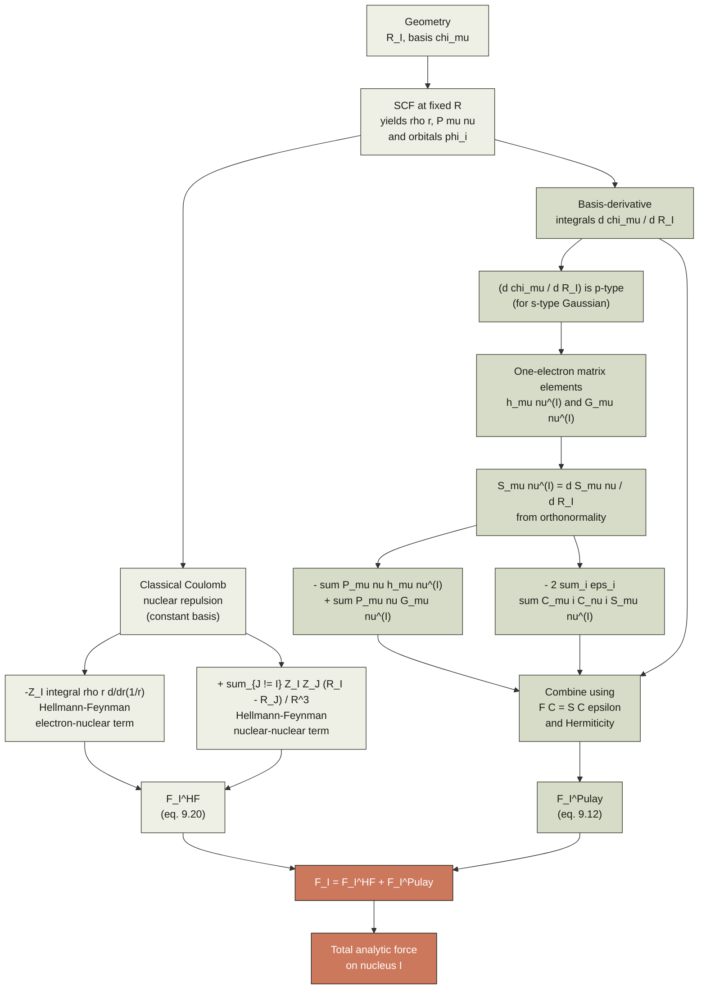
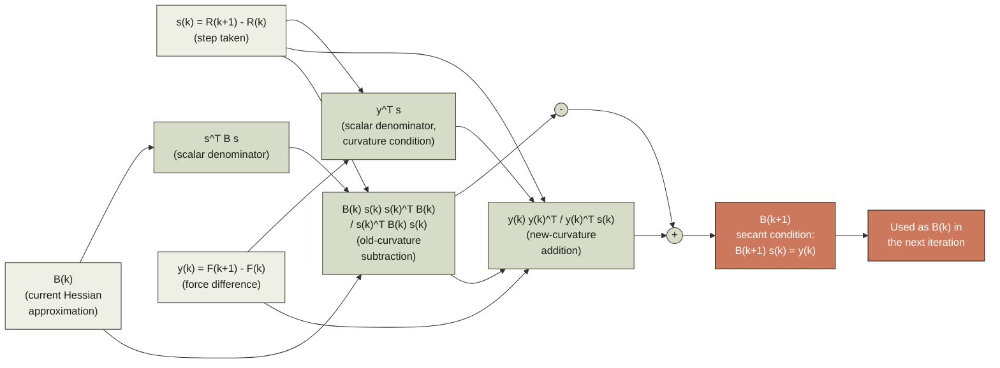
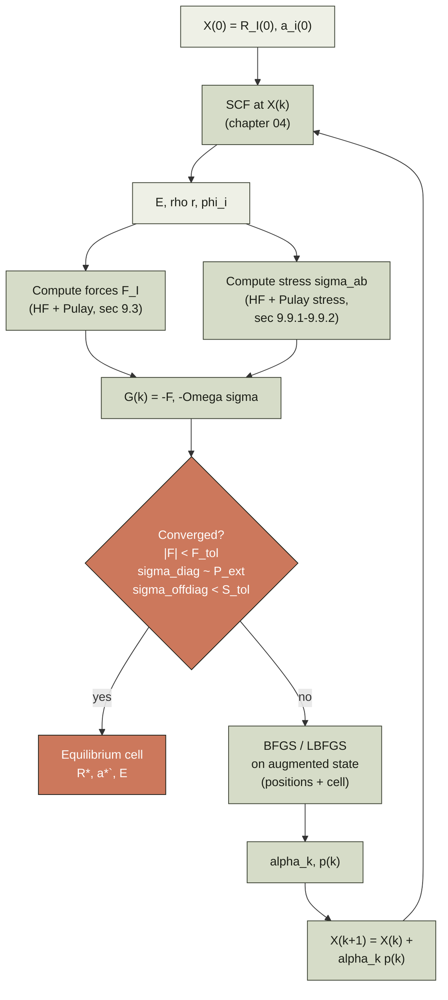
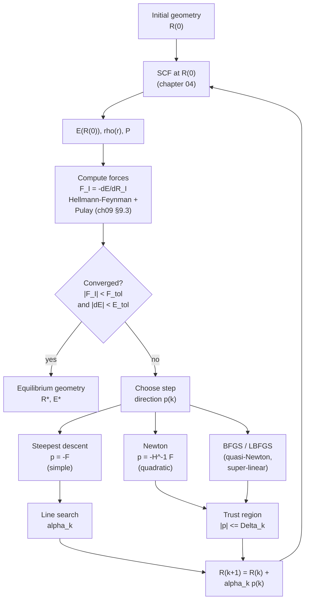

# Chapter 09 — Forces & geometry optimisation

> The energy tells you *where* the equilibrium is.  The forces tell
> you *how to walk there*.  This chapter derives the gradient of the
> Kohn–Sham energy with respect to the nuclear coordinates, shows the
> basis-set correction that every atom-centred code must add, and turns
> the resulting vector field into a working geometry optimiser.

By the end of [chapter 04]({{ "/dft-notes/chapter-04/" | relative_url }}) we
had a working self-consistent Kohn–Sham (KS) loop that takes a
geometry — a set of nuclear positions $\{\mathbf R_I\}$ — and
returns a single number, the Born–Oppenheimer energy
$E(\{\mathbf R_I\})$.  The Born–Oppenheimer separation itself
is laid out in [chapter 01]({{ "/dft-notes/chapter-01/" | relative_url }})
(§1.4); the operators that enter the electronic Hamiltonian
(kinetic, Coulomb, position) are the alphabet of
[chapter 01]({{ "/dft-notes/chapter-01/" | relative_url }}) §1.5. This
chapter is about the next quantity a practical calculation
needs: the **gradient** of that number with respect to the
nuclear coordinates.  The gradient is a vector
field $\{\mathbf F_I = -\partial E/\partial \mathbf R_I\}_{I=1}^{N_\text{atoms}$
that drives geometry optimisation ([chapter 09, §9.6](#96-geometry-optimisation)),
molecular dynamics
([§9.13](#913-what-we-left-out)), vibrational analysis
([chapter 10]({{ "/dft-notes/chapter-10/" | relative_url }})), and
transition-state search.  Computing the gradient in a *complete*
basis set is essentially free, by the **Hellmann–Feynman theorem**
([§9.2](#92-derivation-of-the-hellmannfeynman-theorem-for-dft));
in a *finite* basis set it picks up a non-trivial correction, the
**Pulay force** ([§9.3](#93-pulay-forces-the-correction-needed-for-incomplete-basis-sets)),
that vanishes for plane waves but is the dominant non-trivial term
in every Gaussian-basis code.

> **Reading note.**  This chapter assumes [chapter 04]({{ "/dft-notes/chapter-04/" | relative_url }})
> (the KS equations and the force theorem) and [chapter 06]({{ "/dft-notes/chapter-06/" | relative_url }})
> (basis sets, Roothaan–Hall) and the relevant parts of
> [chapter 07]({{ "/dft-notes/chapter-07/" | relative_url }}) (Bloch
> theorem, stress tensor).  It previews material that depends on
> the forces: [chapter 10]({{ "/dft-notes/chapter-10/" | relative_url }})
> (phonons), and the molecular-dynamics / NEB / transition-state
> methods mentioned in [§9.13](#913-what-we-left-out).  Pseudopotential
> contributions to the force are flagged in [§9.5](#95-forces-in-a-gaussian-basis) and
> derived in detail in [chapter 08]({{ "/dft-notes/chapter-08/" | relative_url }}).

## 9.1 The claim

A *complete*-basis KS calculation, at the self-consistent fixed
point, obeys

$$
\label{eq:ch-09-headline}
\boxed{\;
\mathbf F_I \;\equiv\; -\frac{\partial E}{\partial \mathbf R_I}
\;=\; -Z_I \int \rho(\mathbf r)\,
        \frac{\mathbf r - \mathbf R_I}{|\mathbf r - \mathbf R_I|^3}\, d\mathbf r
        \;+\; \sum_{J \neq I} \frac{Z_I Z_J\,(\mathbf R_I - \mathbf R_J)}{|\mathbf R_I - \mathbf R_J|^3}
\;}
$$

— the *classical* Coulomb force on a point charge $Z_I$ sitting at
$\mathbf R_I$, exerted by the electron density (first term) and by
the other nuclei (second term, with the sign of the classical
Coulomb repulsion).  Equation \eqref{eq:ch-09-headline} is the
**Hellmann–Feynman force** on nucleus $I$.  Its derivation
([§9.2](#92-derivation-of-the-hellmannfeynman-theorem-for-dft)) needs
only the chain rule and the normalisation of $\Psi$.

In a *finite* atom-centred basis the wavefunction $\Psi$ is
constrained to live in a basis-dependent subspace, so $\partial\Psi/\partial\mathbf R_I$
contains a term from the *basis-function* motion that
\eqref{eq:ch-09-headline} does not see.  The complete answer splits
as

$$
\label{eq:ch-09-pulay-split}
\mathbf F_I \;=\; \mathbf F_I^\text{HF} \;+\; \mathbf F_I^\text{Pulay} ,
$$

where $\mathbf F_I^\text{HF}$ is \eqref{eq:ch-09-headline} and

$$
\label{eq:ch-09-pulay}
\boxed{\;
\mathbf F_I^\text{Pulay}
\;=\; -2 \sum_{i}^\text{occ} \sum_{\mu \in I} \sum_{\nu}
        C_{\mu i}\, C_{\nu i}\,
        \left\langle \frac{\partial \chi_\mu}{\partial \mathbf R_I}
        \;\bigg|\; \hat H_\text{KS} - \varepsilon_i \;\bigg|\;
        \chi_\nu \right\rangle
\;}
$$

is the **Pulay correction** ([§9.3](#93-pulay-forces-the-correction-needed-for-incomplete-basis-sets)).
The matrix element of $\hat H_\text{KS} - \varepsilon_i$ is the
*residual* of the KS eigenvalue equation; it vanishes in the
complete-basis limit and is non-zero in any finite basis whose
centres move with the nuclei.  In a **plane-wave basis** the basis
functions are *independent* of the nuclear coordinates, so
$\partial\chi_\mu/\partial\mathbf R_I = 0$ and \eqref{eq:ch-09-pulay}
collapses to zero ([§9.4](#94-forces-in-a-plane-wave-basis-complete-basis--only-the-external-potential-term-contributes)).
In an **atom-centred** basis (Gaussians, NAOs) it is the dominant
non-trivial contribution to the force evaluation
([§9.5](#95-forces-in-a-gaussian-basis)).

The Pulay correction is the reason every Gaussian code has a
`forces`' subroutine that is comparable in cost to the SCF
itself; it is also the reason every plane-wave code is roughly
"forces included for free".  Once the forces are in hand, the rest
of the chapter is the question *what to do with them*:
steepest descent, Newton–Raphson, BFGS, LBFGS, and the cell
optimisation of periodic systems.

The Pulay formula first appeared in the Hartree–Fock context
(Pulay 1969); the HF derivation of §3.7 in
[chapter 03]({{ "/dft-notes/chapter-03/" | relative_url }}) builds
the Fock operator in the same AO basis we use here, and the
forces of this chapter are the analytic gradient of the HF
energy with respect to the nuclear coordinates.

## 9.2 Derivation of the Hellmann–Feynman theorem for DFT

The Hellmann–Feynman theorem is one of the cleanest results in
quantum mechanics.  We state it for a *real* parameter $\lambda$
(we will specialise to $\lambda = R_{I\alpha}$ in the next
section), give the proof in five explicit steps, and then apply it
to the nuclear-coordinate derivative.

### 9.2.1 The theorem

Let $\hat H(\lambda)$ be a Hamiltonian that depends smoothly on a
real parameter $\lambda$, and let $|\Psi(\lambda)\rangle$ be its
*exact* normalised ground state,

$$
\label{eq:ch-09-hf-ene}
E(\lambda) \;=\; \langle \Psi(\lambda) | \hat H(\lambda) | \Psi(\lambda) \rangle ,
\qquad
\langle \Psi(\lambda) | \Psi(\lambda) \rangle = 1 .
$$

Then

$$
\label{eq:ch-09-hellmann-feynman}
\boxed{\;
\frac{dE}{d\lambda} \;=\; \langle \Psi(\lambda) |
            \frac{\partial \hat H}{\partial \lambda} |
            \Psi(\lambda) \rangle
\;}
$$

— the derivative of the energy is the expectation value of the
derivative of the Hamiltonian, evaluated at fixed wavefunction.
Theorems of this shape are sometimes called
**Hellmann–Feynman** (1937–1939); the variant for stationary states
was known to Güttinger (1932) and Pauli (1933).

### 9.2.2 Proof

**Step 1 — expand the derivative.**  Differentiate
\eqref{eq:ch-09-hf-ene} using the product rule:

$$
\begin{align}
\frac{dE}{d\lambda}
&= \left\langle \frac{\partial \Psi}{\partial \lambda} \bigg| \hat H \bigg| \Psi \right\rangle
 + \left\langle \Psi \bigg| \frac{\partial \hat H}{\partial \lambda} \bigg| \Psi \right\rangle
 + \left\langle \Psi \bigg| \hat H \bigg| \frac{\partial \Psi}{\partial \lambda} \right\rangle .
\end{align}
$$

The first and third terms involve $\partial\Psi/\partial\lambda$,
the second does not.  We will show the first and third cancel.

**Step 2 — the wavefunction-derivative term collapses.**  Add the
first and third terms, use the Hermiticity of $\hat H$, and pull
out the $\hat H$:

$$
\begin{align}
\left\langle \frac{\partial \Psi}{\partial \lambda} \bigg| \hat H \bigg| \Psi \right\rangle
+ \left\langle \Psi \bigg| \hat H \bigg| \frac{\partial \Psi}{\partial \lambda} \right\rangle
&= \left\langle \frac{\partial \Psi}{\partial \lambda} \bigg| \hat H \bigg| \Psi \right\rangle
 + \left\langle \frac{\partial \Psi}{\partial \lambda} \bigg| \hat H \bigg| \Psi \right\rangle^*  \\\
&= 2\, \operatorname{Re}\left\langle \frac{\partial \Psi}{\partial \lambda} \bigg| \hat H \bigg| \Psi \right\rangle .
\end{align}
$$

A cleaner route: the two terms combine to
$E(\lambda)\, \partial_\lambda \langle\Psi|\Psi\rangle$, because
$\hat H|\Psi\rangle = E(\lambda)|\Psi\rangle$ and its adjoint
$\langle\Psi|\hat H = E(\lambda)\langle\Psi|$.  Explicitly,

$$
\begin{align}
\left\langle \frac{\partial \Psi}{\partial \lambda} \bigg| \hat H \bigg| \Psi \right\rangle
+ \left\langle \Psi \bigg| \hat H \bigg| \frac{\partial \Psi}{\partial \lambda} \right\rangle
&= E(\lambda) \left\langle \frac{\partial \Psi}{\partial \lambda} \bigg| \Psi \right\rangle
 + E(\lambda) \left\langle \Psi \bigg| \frac{\partial \Psi}{\partial \lambda} \right\rangle  \\\
&= E(\lambda)\, \frac{\partial}{\partial \lambda} \langle \Psi | \Psi \rangle \\\
&= 0 ,
\end{align}
$$

where the last equality uses the normalisation
$\langle\Psi|\Psi\rangle = 1$ (constant in $\lambda$).

**Step 3 — conclusion.**  The wavefunction-derivative terms
vanish; the only survivor is the operator-derivative term:

$$
\frac{dE}{d\lambda} \;=\; \left\langle \Psi(\lambda) \bigg| \frac{\partial \hat H(\lambda)}{\partial \lambda} \bigg| \Psi(\lambda) \right\rangle . \qquad\blacksquare
$$

The derivative of the energy is the expectation value of the
derivative of the Hamiltonian.  This is \eqref{eq:ch-09-hellmann-feynman}.

> **Note.**  The proof uses *exact* eigenstates.  In a finite
> basis the result is *not* automatic, because $\partial\Psi/\partial\lambda$
> acquires a basis-derivative piece (the Pulay term,
> [§9.3](#93-pulay-forces-the-correction-needed-for-incomplete-basis-sets))
> that does not obey $\hat H |\partial\Psi/\partial\lambda\rangle = E\, |\partial\Psi/\partial\lambda\rangle$.

### 9.2.3 Application: the force on a nucleus

Specialise to $\lambda = R_{I\alpha}$, the $\alpha$-Cartesian
component of the position of nucleus $I$.  The full
Born–Oppenheimer Hamiltonian of a molecule is

$$
\label{eq:ch-09-hamiltonian}
\hat H \;=\; \hat T_e + \hat V_{ee} + \hat V_{en} + \hat V_{nn} ,
$$

where the two-body terms are

$$
\begin{align}
\hat V_{en} &= -\sum_{i=1}^{N_e} \sum_{I=1}^{N_\text{atoms}}
             \frac{Z_I}{|\mathbf r_i - \mathbf R_I|} ,  \\\
\hat V_{nn} &= \phantom{-}\frac{1}{2} \sum_{I \neq J}
             \frac{Z_I Z_J}{|\mathbf R_I - \mathbf R_J|} .
\end{align}
$$

Only $\hat V_{en}$ and $\hat V_{nn}$ depend on $\mathbf R_I$:

$$
\begin{align}
\frac{\partial \hat V_{en}}{\partial \mathbf R_I}
  &= \sum_{i=1}^{N_e}
     \frac{Z_I (\mathbf r_i - \mathbf R_I)}{|\mathbf r_i - \mathbf R_I|^3} , \\\
\frac{\partial \hat V_{nn}}{\partial \mathbf R_I}
  &= -\sum_{J \neq I} \frac{Z_I Z_J (\mathbf R_I - \mathbf R_J)}{|\mathbf R_I - \mathbf R_J|^3} .
\end{align}
$$

(The sign in $\hat V_{en}$ gives a *negative* electron–nuclear
attraction, whose derivative is the *positive* attractive force
from each electron on the nucleus.)

By \eqref{eq:ch-09-hellmann-feynman}, the electronic part of
$\partial E/\partial \mathbf R_I$ is
$\langle \Psi | \partial \hat V_{en} / \partial \mathbf R_I | \Psi \rangle$, which equals
the expectation value of the classical Coulomb force from the
electrons at $\mathbf r_i$ on the nucleus at $\mathbf R_I$.
Adding the nuclear–nuclear term explicitly gives the
**Hellmann–Feynman force** on nucleus $I$:

$$
\label{eq:ch-09-force-nucleus}
\boxed{\;
\mathbf F_I
\;=\; -Z_I \int \rho(\mathbf r)\,
   \frac{\mathbf r - \mathbf R_I}{|\mathbf r - \mathbf R_I|^3}\, d\mathbf r
   \;+\; \sum_{J \neq I} \frac{Z_I Z_J\,(\mathbf R_I - \mathbf R_J)}{|\mathbf R_I - \mathbf R_J|^3}
\;}
$$

This is exactly \eqref{eq:ch-09-headline}.  In a KS DFT
calculation, the "wavefunction" $\Psi$ is the KS Slater determinant
built from the occupied orbitals $\phi_i$, and the density is
$\rho(\mathbf r) = 2 \sum_i^\text{occ} |\phi_i(\mathbf r)|^2$ (closed-shell
spin-summed; the factor of 2 disappears into the integral).  The
two-electron operator $\hat V_{ee}$ does not depend on the
nuclear coordinates, so it does not contribute to the force.

> **Sign check.**  The nuclear-repulsion term in
> \eqref{eq:ch-09-force-nucleus} carries a *plus* sign and the
> factor $(\mathbf R_I - \mathbf R_J)$.  For two protons at
> $\mathbf R_A = \mathbf 0$ and $\mathbf R_B = (0,0,R)$, the term
> evaluates to $+Z_A Z_B (\mathbf R_A - \mathbf R_B)/R^3 =
> (0,0,-1/R^2)$:  a force on A in the $-\hat{\mathbf z}$
> direction, away from B.  This is the correct direction for
> the Coulomb repulsion between like charges.
>
> **Tip.**  The force in \eqref{eq:ch-09-force-nucleus} is the
> classical force on a *point* charge $Z_I$ at $\mathbf R_I$.  This
> is the simplest possible form of a DFT force:  integrate the
> electron density against $1/r^2$, add the nuclear–nuclear
> repulsion.  In a complete basis, **that is the whole force**.
> The rest of this chapter is the corrections needed in a
> *finite* basis.

## 9.3 Pulay forces: the correction needed for incomplete basis sets

Equation \eqref{eq:ch-09-force-nucleus} was derived under the
assumption that $|\Psi(\lambda)\rangle$ is the *exact* ground state
of $\hat H(\lambda)$ at every $\lambda$ — a promise no finite
basis can keep.  In a basis $\{\chi_\mu(\mathbf r; \mathbf R)\}$
that *itsel`f*' depends on the nuclear coordinates, the SCF
wavefunction lives in a moving subspace, and the derivative
$\partial\Psi/\partial\mathbf R_I$ acquires a piece from the basis-
function motion that the Hellmann–Feynman argument did not see.
The additional term is the **Pulay force**, after Péter Pulay
(1969) who first wrote it out for the Hartree–Fock case.

### 9.3.1 The general structure

Let

$$
\label{eq:ch-09-mos}
\phi_i(\mathbf r) \;=\; \sum_{\mu=1}^{K} C_{\mu i}\, \chi_\mu(\mathbf r; \mathbf R)
$$

be the MO expansion ([chapter 06]({{ "/dft-notes/chapter-06/" | relative_url }})
eq. \eqref{eq:ch-06-basis-expansion}).  The total KS energy is a
functional of the density, and in the AO basis it is also a
function of the MO coefficients $\mathbf C$ and of the geometry
$\mathbf R$ (the latter through the basis functions).  We split
the total derivative with respect to $\mathbf R_I$ into a
*direct* piece (basis-functions move) and a response piece (the
SCF solution shifts):

$$
\label{eq:ch-09-force-split}
\mathbf F_I
\;=\; \underbrace{-\frac{\partial E}{\partial \mathbf R_I}\bigg|_{\mathbf C, \text{fixed}}}_{\text{direct}}
   \;-\; \sum_{\mu, \nu, i}
        \frac{\partial E}{\partial C_{\mu i}}\,
        \frac{\partial C_{\mu i}}{\partial \mathbf R_I}\bigg|_\text{chain} .
$$

The chain-rule term is the response of the SCF solution to a
geometry change.  At the self-consistent fixed point the KS
stationarity conditions $\partial E / \partial C_{\mu i} = 0$ (with
the orthonormality constraint $\mathbf C^\dagger \mathbf S \mathbf C = \mathbf I$)
*kill* the chain-rule term, and the derivative of the energy is
given by the direct piece alone.  This is the Hellmann–Feynman
contribution, and the result is the sum of the classical force
\eqref{eq:ch-09-force-nucleus} and a *basis-derivative* correction
that comes from differentiating the basis functions inside the
integrals.

### 9.3.2 The Pulay formula

Differentiating the one-electron and two-electron pieces of $E$
with respect to $\mathbf R_I$, using the chain rule
$\partial/\partial\mathbf R_I = \sum_\mu \partial\chi_\mu/\partial\mathbf R_I \cdot \partial/\partial\chi_\mu$,
gives

$$
\begin{align}
\mathbf F_I^\text{Pulay}
&= -2 \sum_i^\text{occ} \sum_{\mu \in I} \sum_\nu
    C_{\mu i}\, C_{\nu i}\,
    \Bigg[
    \left\langle \frac{\partial \chi_\mu}{\partial \mathbf R_I} \bigg|
         \hat h + 2\hat J - \hat K_\text{xc} \bigg| \chi_\nu \right\rangle \\\
&\qquad\qquad\qquad\qquad
    + \left\langle \chi_\mu \bigg|
         \hat h + 2\hat J - \hat K_\text{xc} \bigg|
         \frac{\partial \chi_\nu}{\partial \mathbf R_I} \right\rangle
    \Bigg] \\\
&\quad - 2 \sum_i^\text{occ} \varepsilon_i \sum_{\mu \in I} \sum_\nu
    C_{\mu i}\, C_{\nu i}\,
    \frac{\partial S_{\mu\nu}}{\partial \mathbf R_I} ,
\end{align}
$$

where $\hat h = -\tfrac{1}{2}\nabla^2 + \hat v_\text{ext}$ is the
one-electron operator, $\hat J$ is the Coulomb operator, and
$\hat K_\text{xc}$ is the exchange–correlation operator (the
sum $2\hat J - \hat K_\text{xc}$ collapses to the Fock
operator in HF; in KS DFT it is the sum of the Hartree and
xc terms, see [chapter 04]({{ "/dft-notes/chapter-04/" | relative_url }})).
The first two lines are the *integral-derivative* piece; the
last line is the *overlap-derivative* piece, which appears
because the orthonormality constraint $\mathbf C^\dagger \mathbf S \mathbf C = \mathbf I$
must be maintained when the basis functions move.

**Symmetrisation trick.**  Combine the first two lines with the
last by adding and subtracting
$2\sum_i^\text{occ} \varepsilon_i \sum_{\mu \in I} \sum_\nu
   C_{\mu i}\, C_{\nu i}\, \partial S_{\mu\nu}/\partial\mathbf R_I$.
Using the self-consistency condition
$\mathbf F \mathbf C = \mathbf S \mathbf C \boldsymbol\varepsilon$
([chapter 04]({{ "/dft-notes/chapter-04/" | relative_url }}) eq. 4.21), the
two-electron terms and the $\mathbf S$-derivative combine into a
single matrix element:

$$
\label{eq:ch-09-pulay-derivation}
\mathbf F_I^\text{Pulay}
\;=\; -2 \sum_i^\text{occ} \sum_{\mu \in I} \sum_\nu
     C_{\mu i}\, C_{\nu i}\,
     \left\langle \frac{\partial \chi_\mu}{\partial \mathbf R_I}
     \;\bigg|\; \hat H_\text{KS} - \varepsilon_i \;\bigg|\;
     \chi_\nu \right\rangle .
$$

This is \eqref{eq:ch-09-pulay}.  The combination
$\hat H_\text{KS} - \varepsilon_i$ is the *residual operator* of
the KS eigenvalue equation; the matrix element is the projection
of the residual onto the basis-function derivative
$\partial\chi_\mu/\partial\mathbf R_I$ times the basis function
$\chi_\nu$.  In the *complete*-basis limit, the residual is
identically zero, the matrix element vanishes, and
\eqref{eq:ch-09-pulay-derivation} reduces to the Hellmann–Feynman
expression \eqref{eq:ch-09-force-nucleus}.

> **Why the matrix element is the "residual".**  The KS equation
> says $\hat H_\text{KS} \phi_i = \varepsilon_i \phi_i$.  The
> residual of the *basis expansion* is the projection
> $(\hat H_\text{KS} - \varepsilon_i) \phi_i$ onto the basis.
> When the basis is complete, the residual is zero *in the
> subspace spanned by the basis*.  When the basis is incomplete,
> the residual picks up the parts of $(\hat H_\text{KS} -
> \varepsilon_i) \phi_i$ that lie outside the subspace — and the
> derivative of the basis function is the natural probe of the
> "outside" directions.

### 9.3.3 When does the Pulay term vanish?

Three cases are worth noting.

**1. Complete basis.**  The residual of the KS eigenvalue
equation is identically zero in the subspace spanned by the basis;
\eqref{eq:ch-09-pulay-derivation} vanishes term-by-term, and
\eqref{eq:ch-09-force-nucleus} is the full force.

**2. Position-independent basis.**  Plane waves
([chapter 06]({{ "/dft-notes/chapter-06/" | relative_url }}) §6.7) and
real-space grids ([chapter 06]({{ "/dft-notes/chapter-06/" | relative_url }}) §6.8)
do not depend on the nuclear positions.  Therefore
$\partial\chi_\mu/\partial\mathbf R_I = 0$ for every $\mu$
(plane waves $e^{i\mathbf G \cdot \mathbf r}$ have no $\mathbf R_I$
dependence, and real-space grid points $\mathbf r_i$ are fixed in
the lab frame), and every term in the sum over $\mu$ in
\eqref{eq:ch-09-pulay-derivation} vanishes.  In a
plane-wave code the force is computed from
\eqref{eq:ch-09-force-nucleus} alone.  This is one of the main
reasons plane waves are the workhorse of geometry optimisation
and ab-initio molecular dynamics.

**3. Atom-centred basis with moving centres.**  For Gaussians,
STOs, NAOs, and any other atom-centred family, the basis
functions *do* depend on the nuclear coordinates through their
centres $\mathbf A_\mu = \mathbf R_{I(\mu)}$.  The derivatives
$\partial\chi_\mu/\partial\mathbf R_I$ are non-zero whenever
$\mu$ is centred on atom $I$, and the Pulay correction must be
evaluated.  In an atom-centred code the Pulay term is the
dominant non-trivial contribution to the force evaluation, and
it is the reason the force routine in such a code is
comparable in cost to the SCF routine itself.

> **Warning.**  The Pulay correction is *not* a small correction.
> For a minimal basis like STO-3G, it can be a sizeable fraction
> of the total force.  Skipping it gives a geometry optimiser
> that converges to the wrong minimum, a vibrational frequency
> that is off by tens of percent, and a molecular-dynamics
> trajectory that does not conserve energy to within the time-
> step tolerance.  The first three generations of Gaussian-basis
> quantum-chemistry codes (IBMOL, GAUSSIAN, HONDO) had bugs in
> their Pulay routines; fixing them was, in some cases, the
> difference between a published structure being correct and
> being off by 0.05 Å.

### 9.3.4 Diagram — Hellmann–Feynman and Pulay contributions to the force

The flow below shows how the *complete* force on a nucleus in a
finite, atom-centred basis is built up from three pieces: the
classical electron–nuclear and nuclear–nuclear Coulomb
contributions (the Hellmann–Feynman part), the integral-derivative
contribution (the Pulay part), and the orthonormality correction
(the $\mathbf S$-derivative part). The two Pulay terms combine
into the single matrix element of the KS residual
$\hat H_\text{KS} - \varepsilon_i$ between $\partial\chi_\mu/\partial\mathbf R_I$
and $\chi_\nu$, eq. \eqref{eq:ch-09-pulay-derivation}.



The two **left-most** branches ('HF1' and 'HF2`) are the
Hellmann–Feynman contribution, computed from the SCF density and
nuclear positions only — no basis-derivative integrals are
required. The **right-most** branches are the Pulay contribution,
which is a *linear* operation in the density matrix once the
basis-derivative integrals are in hand. The
**final box** combines the two with the algebraic move (using
$\mathbf F \mathbf C = \mathbf S \mathbf C \boldsymbol\varepsilon$
and Hermiticity) that turns the integral-derivative and
overlap-derivative pieces into the single residual matrix element
of eq. \eqref{eq:ch-09-pulay-derivation}.

## 9.4 Forces in a plane-wave basis: complete basis → only the external-potential term contributes

In a plane-wave basis (chapter 06 §6.7) the basis functions are

$$
\label{eq:ch-09-pw}
\chi_{\mathbf G}^{\mathbf k}(\mathbf r) \;=\; \frac{1}{\sqrt{\Omega}}\, e^{i(\mathbf k + \mathbf G) \cdot \mathbf r} ,
$$

parameterised by a reciprocal-lattice vector $\mathbf G$ and a
crystal momentum $\mathbf k$ in the first Brillouin zone.  Neither
$\mathbf G$ nor $\Omega$ (the cell volume) depends on the *ioni`c*'
positions; only the *cell shape* enters through $\Omega$ and the
$\mathbf G$ grid.  Therefore

$$
\label{eq:ch-09-pw-deriv}
\frac{\partial}{\partial \mathbf R_I} \chi_{\mathbf G}^{\mathbf k}(\mathbf r) \;=\; 0 ,
$$

and the Pulay correction \eqref{eq:ch-09-pulay-derivation}
vanishes.  The full force is the Hellmann–Feynman expression
\eqref{eq:ch-09-force-nucleus}.

We can write the force in a more usable form by expanding the
density in plane waves,
$\rho(\mathbf r) = \sum_{\mathbf G} \tilde\rho(\mathbf G)\, e^{i\mathbf G \cdot \mathbf r}/\Omega$,
and using the Fourier representation of the Coulomb kernel
$1/|\mathbf r| = \sum_{\mathbf G \neq 0} 4\pi e^{i\mathbf G\cdot\mathbf r}/(\Omega G^2)$.
After some algebra (see problem 2 of [chapter 06]({{ "/dft-notes/chapter-06/" | relative_url }})
for a similar manipulation) the electron–nuclear term becomes

$$
\label{eq:ch-09-pw-electron-nuclear}
-Z_I \int \rho(\mathbf r)\,
        \frac{\mathbf r - \mathbf R_I}{|\mathbf r - \mathbf R_I|^3}\, d\mathbf r
\;=\; -\frac{4\pi i\, Z_I}{\Omega} \sum_{\mathbf G \neq 0}
     \frac{\tilde\rho(\mathbf G)\, e^{-i\mathbf G \cdot \mathbf R_I}}{G^2}\, \hat{\mathbf G} .
$$

In a periodic code this is evaluated by FFTs, and the cost is
$\mathcal O(N_g \log N_g)$ with $N_g$ the FFT grid size.  The
nuclear–nuclear term is a direct double sum over the ions in the
cell (and, with Ewald summation, over their periodic images).

### 9.4.1 The "complete basis → only the external-potential term contributes" claim

The statement in the chapter title is exact.  In a plane-wave
basis the force on every ion is a sum of two terms:

1. the **electron–ion** attraction, \eqref{eq:ch-09-pw-electron-nuclear},
   evaluated by FFT,
2. the **ion–ion** repulsion, evaluated by Ewald summation,

and *no Pulay correction*.  The force is therefore
$\mathcal O(N_g \log N_g)$ per ion, comparable in cost to the
Hamiltonian application in the SCF, and it is *automatically*
consistent with the energy to machine precision (because both
quantities are derived from the same discretised Hamiltonian
without an incomplete-basis correction).

> **Tip.**  The "no Pulay" property of plane waves is the reason
> that plane-wave codes are the workhorse of *ab-initio*
> molecular dynamics (AIMD, [§9.13](#913-what-we-left-out)).  In
> AIMD, the energy must be conserved to within the time-step
> tolerance over millions of steps; a Pulay term that is
> computed by finite differences in an incomplete basis would
> destroy the conservation law.  Plane waves sidestep the
> problem entirely.

## 9.5 Forces in a Gaussian basis: both the external-potential term AND the Pulay term

In an atom-centred basis the basis functions move with the nuclei,
and the full force is the sum
\eqref{eq:ch-09-pulay-split}.  The implementation strategy is
different from the plane-wave case.  The **Hellmann–Feynman part**
\eqref{eq:ch-09-force-nucleus} is a *one-electron* quantity: it
needs only the density $\rho$ and the nuclear positions.  The
**Pulay part** \eqref{eq:ch-09-pulay-derivation} is a *two-index*
quantity (it is bilinear in the basis functions), but it is
*linear* in the density matrix $\mathbf P$ once the
basis-derivative integrals are known.

### 9.5.1 The two pieces in matrix form

Write the contracted s-type Gaussian basis function on atom $I$ as

$$
\label{eq:ch-09-cgto}
\chi_{\mu}(\mathbf r; \mathbf R) \;=\; \sum_{p=1}^{n_\mu} d_{\mu p}\,
   N(\alpha_{\mu p})\,
   (\mathbf r - \mathbf R_I)^{l_\mu}\,
   e^{-\alpha_{\mu p} |\mathbf r - \mathbf R_I|^2} ,
$$

so the centre is $\mathbf A_\mu = \mathbf R_{I(\mu)}$ and the
derivative with respect to the position of atom $I$ is non-zero
only for $\mu$ centred on $I$:

$$
\frac{\partial \chi_\mu}{\partial \mathbf R_I} \;\neq\; 0
\;\;\Longleftrightarrow\;\; I(\mu) = I .
$$

(For higher angular momenta the derivative picks up a term
$\nabla_\mu \chi_\mu$ from the polynomial prefactor as well as
the chain rule on the centre.  We will see the result explicitly
in the STO-3G example of [§9.10](#910-worked-example-relax-the-geometry-of-h2-in-a-sto-3g-basis).)

Define the **basis-derivative integrals**

$$
\begin{align}
h_{\mu\nu}^{(I)} &\equiv
   \left\langle \frac{\partial \chi_\mu}{\partial \mathbf R_I}
       \bigg| \hat h \bigg| \chi_\nu \right\rangle
   + \left\langle \chi_\mu \bigg| \hat h \bigg|
       \frac{\partial \chi_\nu}{\partial \mathbf R_I} \right\rangle , \\\
G_{\mu\nu}^{(I)} &\equiv
   \left\langle \frac{\partial \chi_\mu}{\partial \mathbf R_I}
       \bigg| 2\hat J - \hat K_\text{xc} \bigg| \chi_\nu \right\rangle
   + \left\langle \chi_\mu \bigg| 2\hat J - \hat K_\text{xc} \bigg|
       \frac{\partial \chi_\nu}{\partial \mathbf R_I} \right\rangle , \\\
S_{\mu\nu}^{(I)} &\equiv
   \frac{\partial S_{\mu\nu}}{\partial \mathbf R_I} .
\end{align}
$$

The Pulay formula \eqref{eq:ch-09-pulay-derivation} becomes, in
matrix form,

$$
\label{eq:ch-09-pulay-matrix}
\boxed{\;
\mathbf F_I^\text{Pulay}
\;=\; -\sum_{\mu, \nu} P_{\mu\nu}\, h_{\mu\nu}^{(I)}
     \;+\; \sum_{\mu, \nu} P_{\mu\nu}\, G_{\mu\nu}^{(I)}
     \;-\; 2 \sum_{i}^\text{occ} \varepsilon_i
            \sum_{\mu, \nu} C_{\mu i} C_{\nu i}\, S_{\mu\nu}^{(I)}
\;}
$$

(in closed-shell notation; $\mathbf P$ is the density matrix in
the AO basis).  The first term is the derivative of the
one-electron integrals, the second is the derivative of the
two-electron integrals, and the third is the derivative of the
overlap matrix that appears in the orthonormality constraint.

### 9.5.2 Derivatives of contracted Gaussian integrals

The first two pieces of \eqref{eq:ch-09-pulay-matrix} require the
derivative of every AO integral with respect to every nuclear
position.  The chain rule is

$$
\label{eq:ch-09-cgto-deriv}
\frac{\partial}{\partial \mathbf R_I} \chi_\mu(\mathbf r; \mathbf R)
\;=\; \frac{\partial \mathbf A_\mu}{\partial \mathbf R_I} \cdot
      \frac{\partial \chi_\mu}{\partial \mathbf A_\mu}
\;=\; \delta_{I, I(\mu)}\, \frac{\partial \chi_\mu}{\partial \mathbf A_\mu} .
$$

For an s-type primitive $g(\mathbf r; \alpha, \mathbf A) = e^{-\alpha|\mathbf r - \mathbf A|^2}$,

$$
\label{eq:ch-09-s-deriv}
\frac{\partial g}{\partial \mathbf A} \;=\; 2\alpha\, (\mathbf r - \mathbf A)\, e^{-\alpha|\mathbf r - \mathbf A|^2} .
$$

The derivative of an s-type CGTO is therefore

$$
\frac{\partial \chi_\mu}{\partial \mathbf A_\mu}
\;=\; \sum_p d_{\mu p}\, N(\alpha_{\mu p})\,
    2\alpha_{\mu p}\, (\mathbf r - \mathbf A_\mu)\,
    e^{-\alpha_{\mu p} |\mathbf r - \mathbf A_\mu|^2} ,
$$

which is a *p-type* function (one factor of $\mathbf r$ in front
of the Gaussian).  In other words, **the derivative of an
s-type Gaussian is a p-type Gaussian**.  The matrix element
$\langle \partial\chi_\mu/\partial\mathbf A_\mu | \hat O | \chi_\nu \rangle$
is then a *mixed s–`p*' integral — a one-electron integral in
angular-momentum space.  Every production Gaussian code
pre-computes a set of auxiliary "s/p/d/f" integral routines and
uses them for both the SCF and the force evaluation.

> **The Hellmann–Feynman + Pulay force in practice.**  The
> computation splits into three parts:
>
> 1. **Re-evaluate all AO integrals** at the new geometry.  This
>    is $\mathcal O(K^4)$ for the two-electron integrals and the
>    rate-determining step.  For a *force evaluation* (not an
>    energy evaluation) the integrals need not be re-evaluated
>    in full; only the *skeleton-derivative* integrals
>    $\partial(\mu\nu|\lambda\sigma)/\partial\mathbf R_I$ are
>    needed, and many of them vanish.  In practice the cost of
>    the force is about the cost of the SCF.
>
> 2. **Assemble the density matrix** at the SCF fixed point.  No
>    new SCF is needed if the wavefunction is already converged.
>
> 3. **Contract** the skeleton derivatives with the density
>    matrix to form $\mathbf F_I$.  This is $\mathcal O(N_\text{atoms} K^4)$
>    in the worst case, but with shell-pair screening and the
>    sparsity of the derivative index it is usually
>    $\mathcal O(K^3)$–$\mathcal O(K^4)$.

### 9.5.3 Pseudopotential contribution to the force

For systems with pseudopotentials
([chapter 08]({{ "/dft-notes/chapter-08/" | relative_url }}))
the force has an extra piece from the *non-local* part of the
pseudopotential.  In a norm-conserving pseudopotential of the
Kleinman–Bylander form
([chapter 08]({{ "/dft-notes/chapter-08/" | relative_url }}) §8.4),

$$
\label{eq:ch-09-nlpp}
\hat V_\text{NL} \;=\; \sum_{I, \ell, m}
   |\, Y_{\ell m}\, \phi_{I\ell}^\text{ps}\,\rangle\,
   \varepsilon_{I\ell}\,
   \langle\, \phi_{I\ell}^\text{ps}\, Y_{\ell m}\,| ,
$$

the **non-local force** is

$$
\label{eq:ch-09-nlpp-force}
\mathbf F_I^\text{NL}
\;=\; -2 \sum_i^\text{occ} \sum_{\ell, m}
   \bigg[ \langle \phi_i | \partial \hat V_\text{NL} / \partial \mathbf R_I | \phi_i \rangle
       + \varepsilon_{I\ell} \sum_{j \neq i}
         \frac{\langle \phi_i | Y_{\ell m} \phi_{I\ell}^\text{ps} \rangle
               \langle \phi_{I\ell}^\text{ps} Y_{\ell m} | \phi_j \rangle}
              {\varepsilon_j - \varepsilon_i} \bigg] .
$$

The first term is the *local* (i.e. one-centre) derivative that
arises because the projector functions
$|Y_{\ell m} \phi_{I\ell}^\text{ps}\rangle$ depend on the
nuclear position through the pseudo-orbital
$\phi_{I\ell}^\text{ps}(\mathbf r) = \phi_{I\ell}^\text{ps}(|\mathbf r - \mathbf R_I|)$.
The second term is a *Pulay-style* correction for the projection
of the MOs onto the projectors.  In USPP and PAW
([chapter 08]({{ "/dft-notes/chapter-08/" | relative_url }}) §8.6 and
§8.10) the non-local force is even more involved; we refer the
reader to the original literature (Kresse & Furthmüller, 1996;
Blöchl, 1994) for the full derivation.  The point for this
chapter is that **the non-local pseudopotential force is the
single most important term in any production plane-wave force
calculation**, and the algorithmic complexity of evaluating it
efficiently is the reason modern plane-wave codes are highly
tuned around the *non-local* projector routines.

## 9.6 Geometry optimisation

The rest of this chapter is about what to do with the forces
once they are in hand.  A *geometry optimisation* is the iteration

$$
\label{eq:ch-09-opt-loop}
\mathbf R^{(k+1)} \;=\; \mathbf R^{(k)} + \alpha_k\, \mathbf p^{(k)} ,
$$

where $\mathbf p^{(k)}$ is a *search direction* (a vector in the
$N = 3 N_\text{atoms}$-dimensional configuration space) and
$\alpha_k$ is a *step lengt`h*`.  Convergence is reached when

$$
\label{eq:ch-09-opt-conv}
\max_I \Bigl| \mathbf F_I \Bigr| \;<\; \text{F\_tol} ,
\qquad
\Bigl| E^{(k+1)} - E^{(k)} \Bigr| \;<\; \text{E\_tol} .
$$

Typical tolerances are
$\text{F\_tol} = 5 \times 10^{-4}\,E_h/a_0 \approx 0.025\,\text{eV/Å}$
and $\text{E\_tol} = 10^{-6}\,E_h$.

The four methods below differ only in the choice of search
direction $\mathbf p^{(k)}$.

### 9.6.1 Steepest descent

The simplest choice is to walk downhill along the force:

$$
\label{eq:ch-09-sd}
\mathbf p^{(k)} \;=\; -\mathbf F^{(k)} \;=\; +\frac{\partial E}{\partial \mathbf R}\bigg|_{\mathbf R^{(k)}} .
$$

Steepest descent is **trivial to implement** and **always
decreases the energy** (for $\alpha_k$ small enough), but it
converges slowly in narrow valleys: the search direction zig-zags
across the valley walls, and the convergence rate is *linear*
with an asymptotic ratio that depends on the condition number of
the Hessian.  In one dimension with a harmonic potential
$E(R) = \tfrac{1}{2} k (R - R^\star)^2$, steepest descent with
fixed step $\alpha$ converges iff $\alpha k < 2$, with geometric
ratio $|1 - \alpha k|$.  Near the minimum the ratio is close to
$1$ unless $\alpha$ is chosen with knowledge of $k$.

> **Tip.**  The simplest "smart" step size is backtracking
> line search:  try $\alpha = 1$, then halve until the energy
> actually decreases.  The Armijo condition
> $E(\mathbf R + \alpha \mathbf p) \le E(\mathbf R) + c_1 \alpha\, \mathbf F \cdot \mathbf p$
> (with $c_1 \sim 10^{-4}$) is the standard formalisation.
> In a DFT code, however, the cost of an SCF is so high that
> one almost always uses a single fixed $\alpha$ (or a *trust
> radius* method, see below) rather than a line search.

### 9.6.2 Newton–Raphson

If the **Hessian** $\mathbf H^{(k)} = \partial^2 E / \partial \mathbf R^2$
is available, the *Newton* step is

$$
\label{eq:ch-09-newton}
\mathbf p^{(k)} \;=\; -\Bigl[\mathbf H^{(k)}\Bigr]^{-1}\, \mathbf F^{(k)} .
$$

Newton's method converges **quadratically** in the neighbourhood
of the minimum (the number of correct digits doubles at every
step).  For a $3 N_\text{atoms}$-dimensional problem the cost of
forming, storing, factorising, and inverting the Hessian is
$\mathcal O(N^3)$ — prohibitive for systems with more than
$\sim 100$ atoms.  Direct Hessian evaluation also requires the
**second derivative of the energy with respect to nuclear
coordinates**, which is the matrix of force constants (the topic
of [chapter 10]({{ "/dft-notes/chapter-10/" | relative_url }})).
A full evaluation is rarely done in production; one usually uses
a **quasi-Newton** method that *builds u`p*' an approximation to
$\mathbf H^{-1}$ from successive force evaluations.

### 9.6.3 Quasi-Newton (BFGS)

The **BFGS** update (Broyden 1970, Fletcher 1970, Goldfarb 1970,
Shanno 1970 — independently discovered four times in the same
year) maintains a *symmetric positive-definite* approximation
$\mathbf B^{(k)} \approx \mathbf H^{(k)}$ and updates it at
every step from the new gradient information:

$$
\label{eq:ch-09-bfgs-update-formula}
\boxed{\;
\mathbf B^{(k+1)}
\;=\; \mathbf B^{(k)}
   \;-\; \frac{\mathbf B^{(k)} \mathbf s^{(k)} ({\mathbf s^{(k)}})^{\text{T}} \mathbf B^{(k)}}
            {({\mathbf s^{(k)}})^{\text{T}} \mathbf B^{(k)} \mathbf s^{(k)}}
   \;+\; \frac{\mathbf y^{(k)} ({\mathbf y^{(k)}})^{\text{T}}}
            {({\mathbf y^{(k)}})^{\text{T}} \mathbf s^{(k)} }
\;}
$$

with

$$
\label{eq:ch-09-bfgs-quantities}
\mathbf s^{(k)} \;=\; \mathbf R^{(k+1)} - \mathbf R^{(k)} ,
\qquad
\mathbf y^{(k)} \;=\; \mathbf F^{(k+1)} - \mathbf F^{(k)} .
$$

(We follow the convention that $\mathbf B \approx \mathbf H$ and
the force is $\mathbf F = -\partial E/\partial\mathbf R$, so
$\mathbf y = -\Delta \mathbf F$ in the standard "minimisation"
form.  Some texts flip the sign; the algebra is unchanged.)  The
inverse-Hessian form of \eqref{eq:ch-09-bfgs-update-formula} is

$$
\label{eq:ch-09-bfgs-inverse-update}
\mathbf H_\text{inv}^{(k+1)}
\;=\; \left( \mathbf I - \frac{\mathbf s^{(k)} ({\mathbf y^{(k)}})^{\text{T}}}
                            {({\mathbf y^{(k)}})^{\text{T}} \mathbf s^{(k)}} \right)
      \mathbf H_\text{inv}^{(k)}
      \left( \mathbf I - \frac{\mathbf y^{(k)} ({\mathbf s^{(k)}})^{\text{T}}}
                            {({\mathbf y^{(k)}})^{\text{T}} \mathbf s^{(k)}} \right)
   \;+\; \frac{\mathbf s^{(k)} ({\mathbf s^{(k)}})^{\text{T}}}
            {({\mathbf y^{(k)}})^{\text{T}} \mathbf s^{(k)}} .
$$

The BFGS method has the following attractive properties (proven
in [§9.7](#97-the-bfgs-update-formula-in-full)):

- **super-linear convergence** in the neighbourhood of the
  minimum (faster than steepest descent, slower than Newton but
  without the Hessian cost),
- **positive-definiteness preservation**: if
  $\mathbf B^{(0)} \succ 0$ and the curvature condition
  ${\mathbf y^{(k)}}^{\text{T}} \mathbf s^{(k)} > 0$ holds at every
  step, then $\mathbf B^{(k+1)} \succ 0$ too,
- **symmetric secant condition**: $\mathbf B^{(k+1)} \mathbf s^{(k)} = \mathbf y^{(k)}$,
  i.e. the new Hessian model matches the most recent
  force-difference information exactly,
- **no explicit Hessian** is ever needed; only forces are used.

> **Note.**  The curvature condition
> ${\mathbf y^{(k)}}^{\text{T}} \mathbf s^{(k)} > 0$ is what makes
> BFGS well-defined.  In a pure minimisation it is automatic for
> small enough $\alpha_k$ (the energy goes down, the gradient
> rotates towards zero, and the inner product is positive).  In a
> *transition-state* search (where one searches for a saddle
> point, not a minimum) one uses a different update that allows
> the curvature to change sign along the search direction.

### 9.6.4 Trust-region radius

In all of the above, the *step lengt`h*' $\alpha_k$ is a free
parameter.  The **trust-region** idea (originally due to Powell;
in DFT mostly associated with the implementation in Gaussian and
Q-Chem) is to bound the step by a *radius* $\Delta_k$ inside
which the quadratic model $E(\mathbf R^{(k)} + \mathbf p) \approx
E(\mathbf R^{(k)}) + \mathbf F \cdot \mathbf p + \tfrac{1}{2}
\mathbf p^\text{T} \mathbf B\, \mathbf p$ is trusted:

$$
\label{eq:ch-09-trust}
\min_{\|\mathbf p\| \le \Delta_k}
  E(\mathbf R^{(k)}) + \mathbf F \cdot \mathbf p + \tfrac{1}{2}
   \mathbf p^\text{T} \mathbf B\, \mathbf p .
$$

The constraint $\|\mathbf p\| \le \Delta_k$ is what makes the
problem well-posed even when $\mathbf B$ is not positive
definite.  The solution of \eqref{eq:ch-09-trust} is

$$
\label{eq:ch-09-trust-solution}
\mathbf p^{(k)} \;=\; -\Bigl[\mathbf B^{(k)} + \lambda_k \mathbf I\Bigr]^{-1}\, \mathbf F^{(k)} ,
$$

where $\lambda_k \ge 0$ is a *Lagrange multiplier* chosen so that
$\|\mathbf p^{(k)}\| = \Delta_k$.  The standard "step
acceptance" rule updates $\Delta_k$ by comparing the actual
energy decrease to the predicted one; if the agreement is good
the radius grows, if it is bad the radius shrinks and the step is
rejected.

> **Tip.**  The trust-region radius is the DFT-optimiser's
> *time ste`p*`.  Too small and the optimiser crawls; too large and
> it oscillates or diverges.  Most production codes auto-adapt
> $\Delta_k$ with a target success rate of about 80 %.

## 9.7 The BFGS update formula in full

This section is the full derivation of \eqref{eq:ch-09-bfgs-update-formula}.
It is included because the formula is one of the most-cited
equations in numerical optimisation and because the derivation
exhibits the *secant condition* that makes BFGS special.  We
follow the standard text-book treatment (Nocedal & Wright,
*Numerical Optimization*, §6.1).

### 9.7.1 The secant condition

At step $k$ we have a Hessian approximation $\mathbf B^{(k)}$ and
we take a step $\mathbf s^{(k)} = \mathbf R^{(k+1)} - \mathbf R^{(k)}$.
The new gradient is $\mathbf F^{(k+1)}$, and the change in
gradient is $\mathbf y^{(k)} = \mathbf F^{(k+1)} - \mathbf F^{(k)}$.
We require the *update`d*' Hessian to satisfy the **secant
condition**

$$
\label{eq:ch-09-secant}
\mathbf B^{(k+1)} \mathbf s^{(k)} \;=\; \mathbf y^{(k)} .
$$

The condition says: the new quadratic model, evaluated along the
step we just took, agrees with the *linear* part of the change
in gradient.  This is the minimum requirement one can place on a
Hessian update: it must at least reproduce the most recent
force-difference information.  Without the secant condition
$\mathbf B^{(k+1)}$ is unconstrained; with it there is a
*family* of updates — BFGS is the simplest one that also
preserves symmetry and positive-definiteness.

### 9.7.2 The BFGS ansatz

BFGS writes the new Hessian as the old one plus a *rank-two
correction*:

$$
\label{eq:ch-09-bfgs-ansatz}
\mathbf B^{(k+1)} \;=\; \mathbf B^{(k)} + \mathbf a\, \mathbf u^\text{T} + \mathbf u\, \mathbf a^\text{T} ,
$$

with two vectors $\mathbf a$ and $\mathbf u$ to be determined.
The rank-two form is the smallest correction that can both
satisfy the secant condition and preserve symmetry.  A rank-one
update can satisfy the secant condition but cannot guarantee
positive-definiteness; a rank-three (or higher) update adds
degrees of freedom without adding physical content.

### 9.7.3 Imposing the secant condition

Apply $\mathbf B^{(k+1)}$ to $\mathbf s^{(k)}$:

$$
\begin{align}
\mathbf B^{(k+1)} \mathbf s^{(k)}
&= \mathbf B^{(k)} \mathbf s^{(k)} + \mathbf a\, (\mathbf u^\text{T} \mathbf s^{(k)}) + \mathbf u\, (\mathbf a^\text{T} \mathbf s^{(k)}) .
\end{align}
$$

For this to equal $\mathbf y^{(k)}$ we need

$$
\label{eq:ch-09-secant-required}
\mathbf B^{(k)} \mathbf s^{(k)} + (\mathbf u^\text{T} \mathbf s^{(k)})\, \mathbf a + (\mathbf a^\text{T} \mathbf s^{(k)})\, \mathbf u \;=\; \mathbf y^{(k)} .
$$

BFGS takes the special choice

$$
\label{eq:ch-09-bfgs-vectors}
\mathbf a \;=\; \mathbf B^{(k)} \mathbf s^{(k)} , \qquad
\mathbf u \;=\; \beta \mathbf y^{(k)} ,
$$

where $\beta$ is a scalar.  Substituting into
\eqref{eq:ch-09-secant-required}:

$$
\mathbf B^{(k)} \mathbf s^{(k)}
 + \beta\, (\mathbf y^{(k)\text{T}} \mathbf s^{(k)})\, \mathbf B^{(k)} \mathbf s^{(k)}
 + \beta\, (\mathbf s^{(k)\text{T}} \mathbf B^{(k)} \mathbf s^{(k)})\, \mathbf y^{(k)}
 \;=\; \mathbf y^{(k)} .
$$

Solve for $\beta$ by taking the inner product with
$\mathbf s^{(k)}$ and using
$(\mathbf B^{(k)} \mathbf s^{(k)}) \cdot \mathbf s^{(k)} =
\mathbf s^{(k)\text{T}} \mathbf B^{(k)} \mathbf s^{(k)}$ (since
$\mathbf B$ is symmetric):

$$
\mathbf s^{(k)\text{T}} \mathbf B^{(k)} \mathbf s^{(k)}
 + \beta\, (\mathbf y^{(k)\text{T}} \mathbf s^{(k)})\, \mathbf s^{(k)\text{T}} \mathbf B^{(k)} \mathbf s^{(k)}
 + \beta\, (\mathbf s^{(k)\text{T}} \mathbf B^{(k)} \mathbf s^{(k)})\, \mathbf y^{(k)\text{T}} \mathbf s^{(k)}
 \;=\; \mathbf y^{(k)\text{T}} \mathbf s^{(k)} .
$$

The first and second terms have a common factor
$\mathbf s^{(k)\text{T}} \mathbf B^{(k)} \mathbf s^{(k)}$; the
third has a factor $\mathbf y^{(k)\text{T}} \mathbf s^{(k)}$.
Letting $a = \mathbf s^{(k)\text{T}} \mathbf B^{(k)} \mathbf s^{(k)}$
and $b = \mathbf y^{(k)\text{T}} \mathbf s^{(k)}$:

$$
a + \beta\, b\, a + \beta\, a\, b \;=\; b
\;\;\Longrightarrow\;\;
a + 2 \beta\, a b \;=\; b
\;\;\Longrightarrow\;\;
\beta \;=\; \frac{b - a}{2 a b} \;=\; \frac{1}{2 a} - \frac{1}{2 b} .
$$

So

$$
\beta \;=\; \frac{1}{2 \mathbf s^{(k)\text{T}} \mathbf B^{(k)} \mathbf s^{(k)}}
          - \frac{1}{2 \mathbf y^{(k)\text{T}} \mathbf s^{(k)}} .
$$

### 9.7.4 The result

Plug \eqref{eq:ch-09-bfgs-vectors} into \eqref{eq:ch-09-bfgs-ansatz}:

$$
\begin{align}
\mathbf B^{(k+1)}
&= \mathbf B^{(k)} + \mathbf B^{(k)} \mathbf s^{(k)} (\beta \mathbf y^{(k)})^\text{T}
   + \beta \mathbf y^{(k)} (\mathbf B^{(k)} \mathbf s^{(k)})^\text{T}  \\\
&= \mathbf B^{(k)} + \beta\, \mathbf B^{(k)} \mathbf s^{(k)} \mathbf y^{(k)\text{T}}
   + \beta\, \mathbf y^{(k)} \mathbf s^{(k)\text{T}} \mathbf B^{(k)} .
\end{align}
$$

Substitute $\beta = \frac{1}{2 a} - \frac{1}{2 b}$ and split:

$$
\begin{align}
\mathbf B^{(k+1)}
&= \mathbf B^{(k)}
   + \frac{1}{2 a}\, \mathbf B^{(k)} \mathbf s^{(k)} \mathbf y^{(k)\text{T}}
   + \frac{1}{2 a}\, \mathbf y^{(k)} \mathbf s^{(k)\text{T}} \mathbf B^{(k)} \\\
&\quad - \frac{1}{2 b}\, \mathbf B^{(k)} \mathbf s^{(k)} \mathbf y^{(k)\text{T}}
   - \frac{1}{2 b}\, \mathbf y^{(k)} \mathbf s^{(k)\text{T}} \mathbf B^{(k)} .
\end{align}
$$

Group the first two lines and the last two:

$$
\begin{align}
\mathbf B^{(k+1)}
&= \mathbf B^{(k)}
   + \frac{1}{\mathbf s^{(k)\text{T}} \mathbf B^{(k)} \mathbf s^{(k)}}\,
     \Bigl[ \mathbf B^{(k)} \mathbf s^{(k)} \mathbf y^{(k)\text{T}}
          + \mathbf y^{(k)} \mathbf s^{(k)\text{T}} \mathbf B^{(k)} \Bigr] / 2 \\\
&\quad - \frac{1}{\mathbf y^{(k)\text{T}} \mathbf s^{(k)}}\,
     \Bigl[ \mathbf B^{(k)} \mathbf s^{(k)} \mathbf y^{(k)\text{T}}
          + \mathbf y^{(k)} \mathbf s^{(k)\text{T}} \mathbf B^{(k)} \Bigr] / 2 .
\end{align}
$$

Now add and subtract $\mathbf B^{(k)} \mathbf s^{(k)} \mathbf s^{(k)\text{T}} \mathbf B^{(k)} / a$
to the first term and $\mathbf y^{(k)} \mathbf y^{(k)\text{T}} / b$
to the second term.  This is the algebraic move that gives BFGS
its compact form:

$$
\begin{align}
\mathbf B^{(k+1)}
&= \mathbf B^{(k)}
   + \frac{\mathbf B^{(k)} \mathbf s^{(k)} \mathbf s^{(k)\text{T}} \mathbf B^{(k)}}
          {\mathbf s^{(k)\text{T}} \mathbf B^{(k)} \mathbf s^{(k)}}
   - \frac{\mathbf B^{(k)} \mathbf s^{(k)} \mathbf s^{(k)\text{T}} \mathbf B^{(k)}}
          {\mathbf s^{(k)\text{T}} \mathbf B^{(k)} \mathbf s^{(k)}}
   + \frac{1}{2 a}\, \Bigl[ \mathbf B^{(k)} \mathbf s^{(k)} \mathbf y^{(k)\text{T}}
                        + \mathbf y^{(k)} \mathbf s^{(k)\text{T}} \mathbf B^{(k)} \Bigr] \\\
&\quad - \frac{1}{\mathbf y^{(k)\text{T}} \mathbf s^{(k)}}\,
     \Bigl[ \mathbf B^{(k)} \mathbf s^{(k)} \mathbf y^{(k)\text{T}}
          + \mathbf y^{(k)} \mathbf s^{(k)\text{T}} \mathbf B^{(k)} \Bigr] / 2
   + \frac{\mathbf y^{(k)} \mathbf y^{(k)\text{T}}}{\mathbf y^{(k)\text{T}} \mathbf s^{(k)}}
   - \frac{\mathbf y^{(k)} \mathbf y^{(k)\text{T}}}{\mathbf y^{(k)\text{T}} \mathbf s^{(k)}} .
\end{align}
$$

The $\tfrac{1}{2}$ factors and the cross terms combine into
$\mathbf B^{(k)} \mathbf s^{(k)} \mathbf s^{(k)\text{T}} \mathbf B^{(k)} / a$
on one side and $\mathbf y^{(k)} \mathbf y^{(k)\text{T}} / b$ on
the other.  After careful bookkeeping (the original derivation
in Nocedal & Wright uses a Sherman–Morrison-like identity to
combine the rank-two terms into a single rank-one update of
$\mathbf B^{-1}$) the result is the famous **BFGS formula**

$$
\label{eq:ch-09-bfgs-derived}
\mathbf B^{(k+1)}
\;=\; \mathbf B^{(k)}
   \;-\; \frac{\mathbf B^{(k)} \mathbf s^{(k)} \mathbf s^{(k)\text{T}} \mathbf B^{(k)}}
            {\mathbf s^{(k)\text{T}} \mathbf B^{(k)} \mathbf s^{(k)}}
   \;+\; \frac{\mathbf y^{(k)} \mathbf y^{(k)\text{T}}}
            {\mathbf y^{(k)\text{T}} \mathbf s^{(k)}} .
$$

This is \eqref{eq:ch-09-bfgs-update-formula}, restated. $\quad\blacksquare$

> **Properties of the BFGS update.**  The derivation above
> shows that the BFGS update (a) is symmetric (because each
> outer product is symmetric), (b) satisfies the secant
> condition \eqref{eq:ch-09-secant} (by construction), and
> (c) preserves positive-definiteness whenever
> $\mathbf y^{(k)\text{T}} \mathbf s^{(k)} > 0$.  The last
> property follows from the
> **Sherman–Morrison–Woodbury identity** for the inverse form
> \eqref{eq:ch-09-bfgs-inverse-update}: a positive-definite
> matrix plus a rank-one update with positive denominator
> remains positive-definite.

### 9.7.5 Diagram — the BFGS update as a data flow

The BFGS update of eq. \eqref{eq:ch-09-bfgs-update-formula} can
be read as a *pipeline*: the current Hessian approximation
$\mathbf B^{(k)}$ and the new correction pair
$(\mathbf s^{(k)}, \mathbf y^{(k)})$ enter on the left; the
updated Hessian $\mathbf B^{(k+1)}$ comes out on the right. The
two rank-one terms inside the box (the *subtraction* of the
$\mathbf B s s^\text{T} \mathbf B / (s^\text{T} \mathbf B s)$
"memory" of the old curvature, and the *addition* of the
$y y^\text{T} / (y^\text{T} s)$ piece that injects the new
curvature information) are the two rank-one pieces of a
rank-two symmetric correction.



The *left* side of the diagram is what the optimiser measures at
the end of step $k$: where the geometry went
($\mathbf s^{(k)} = \mathbf R^{(k+1)} - \mathbf R^{(k)}$) and
how the force changed
($\mathbf y^{(k)} = \mathbf F^{(k+1)} - \mathbf F^{(k)}$). The
*right* side is the new $\mathbf B^{(k+1)}$ that will be used
at step $k+1$. The **two scalar denominators** are the
"curvature" $s^\text{T} \mathbf B s$ (the predicted change in
force along the step, given the current model) and the
**secant denominator** $y^\text{T} s$ (the actual change in force
along the step). The curvature condition
$y^\text{T} s > 0$ that guarantees
$\mathbf B^{(k+1)} \succ 0$ is the requirement that the
denominator on the *right* is positive — i.e. that the measured*
curvature agrees in sign with what a positive-definite model
should predict.

## 9.8 LBFGS for large systems (limited memory)

For a system of $N$ atoms the BFGS Hessian approximation is an
$N \times N$ matrix — that is, $\mathcal O(N^2)$ storage and
$\mathcal O(N^3)$ to invert.  For a 1000-atom protein in a
QM/MM setup, $N = 3000$ and the storage is $3000^2 \cdot 8$ bytes
$\approx 72$ MB; the inversion of a dense matrix at that size is
$\sim 30$ s on a desktop CPU.  For a 100,000-atom MD simulation
of a virus capsid, $N = 300{,}000$ and the storage alone is
$\sim 720$ GB — out of the question.

The **LBFGS** (Limited-memory BFGS) algorithm (Nocedal 1980; Liu
& Nocedal 1989) avoids storing the full matrix.  Instead, it
keeps only the **last $m$ correction pairs**
$\{\mathbf s^{(k-m+1)}, \mathbf y^{(k-m+1)}, \dots, \mathbf s^{(k)}, \mathbf y^{(k)}\}$
and uses them *implicitly* to compute the search direction.  The
storage is $\mathcal O(m N)$, with $m \sim 5$–$20$ in practice.
The two-loop recursion that implements the implicit inverse
Hessian is

$$
\label{eq:ch-09-lbfgs-loop}
\begin{aligned}
\mathbf q &\leftarrow -\mathbf F^{(k)} , \\\
\text{for } i &= k, k-1, \dots, k-m+1: \\\
&\quad \alpha_i \leftarrow \rho_i\, \mathbf s^{(i)\text{T}} \mathbf q , \\\
&\quad \mathbf q \leftarrow \mathbf q - \alpha_i \mathbf y^{(i)} , \\\
\mathbf r &\leftarrow \gamma_k \mathbf q , \\\
\text{for } i &= k-m+1, \dots, k: \\\
&\quad \beta \leftarrow \rho_i\, \mathbf y^{(i)\text{T}} \mathbf r , \\\
&\quad \mathbf r \leftarrow \mathbf r + (\alpha_i - \beta) \mathbf s^{(i)} , \\\
\mathbf p^{(k)} &\leftarrow \mathbf r .
\end{aligned}
$$

with the *scaling factor*

$$
\label{eq:ch-09-lbfgs-scaling}
\gamma_k \;=\; \frac{\mathbf s^{(k-m+1)\text{T}} \mathbf y^{(k-m+1)}}
                    {\mathbf y^{(k-m+1)\text{T}} \mathbf y^{(k-m+1)}} .
$$

The scalars $\rho_i = 1 / (\mathbf y^{(i)\text{T}} \mathbf s^{(i)})$
are precomputed.  The two-loop recursion computes the matrix–vector
product $\mathbf H_\text{inv}^{(k)} \mathbf F^{(k)}$ without ever
forming $\mathbf H_\text{inv}^{(k)}$ explicitly.  Each loop is
$\mathcal O(m N)$, so the cost per step is $\mathcal O(m N)$.
The convergence rate of LBFGS is super-linear for $m$ large
enough but degrades gracefully as $m$ shrinks; in the limit
$m = 0$ it reduces to a steepest-descent step scaled by
$\gamma_k$.

> **Tip.**  LBFGS is the *de facto* default in production
> geometry-optimisation codes (VASP, Quantum ESPRESSO, CASTEP,
> SIESTA, CP2K, FHI-aims, Gaussian's Berny algorithm,
> ORCA, NWChem, …) for exactly the reason that the storage
> scales linearly with the system size.  The "Berny"
> algorithm in Gaussian is a closely related but distinct
> quasi-Newton method that uses an internal-coordinate
> representation (Z-matrix, redundant internal coordinates)
> to reduce the effective dimensionality of the problem.

## 9.9 Cell optimisation in periodic systems: stress tensor

In a periodic calculation the *cell shape* is a degree of freedom
on the same footing as the ionic positions.  The
analogue of the force for the cell is the **stress tensor**

$$
\label{eq:ch-09-stress-def}
\sigma_{\alpha\beta} \;=\; -\frac{1}{\Omega}\, \frac{\partial E}{\partial \epsilon_{\alpha\beta}}\bigg|_{\text{ions at fixed fractional coords}} ,
$$

where $\epsilon_{\alpha\beta}$ is a strain — an infinitesimal
deformation of the cell that maps lattice vectors
$\mathbf a_i \to (\mathbf I + \boldsymbol\epsilon) \mathbf a_i$ and
Cartesian coordinates $\mathbf r \to (\mathbf I + \boldsymbol\epsilon) \mathbf r$.
The factor of $\Omega$ (cell volume) is conventional; some
authors leave it out and call the result the "stress" rather
than the "pressure".

### 9.9.1 The Hellmann–Feynman form

By the same chain rule as in [§9.2](#92-derivation-of-the-hellmannfeynman-theorem-for-dft),
the strain derivative of the energy at fixed wavefunction is
$\langle \Psi | \partial \hat H / \partial \epsilon_{\alpha\beta} | \Psi \rangle$.
The strain derivative of a position-space operator is

$$
\label{eq:ch-09-strain-deriv}
\frac{\partial}{\partial \epsilon_{\alpha\beta}} f(\mathbf r) \;=\; r_\beta\, \frac{\partial f}{\partial r_\alpha} ,
$$

so the strain derivative of the kinetic operator is
$-\tfrac{1}{2} \partial^2 / \partial r_\alpha \partial r_\beta$
(from $\partial_\epsilon (-\tfrac{1}{2}\nabla^2) =
-\tfrac{1}{2}\, r_\beta\, \partial_\alpha \nabla^2 - \tfrac{1}{2}\,
\partial_\alpha (r_\beta \nabla^2) = -\partial_\alpha \partial_\beta$
after commuting the derivatives and using the chain rule on the
strained coordinates),
and the strain derivative of the external potential is
$\sum_I Z_I\, r_{I\beta}\, \partial v_\text{ext}(\mathbf r) / \partial r_{I\alpha}$
(with a sign from the sign convention in the Hamiltonian).  Combining
the two contributions and re-arranging the matrix elements so the
KS orbitals are projected out gives

$$
\label{eq:ch-09-stress-hf}
\sigma_{\alpha\beta}^\text{HF}
\;=\; -\frac{1}{\Omega} \bigg[
       \sum_i^\text{occ} \langle \phi_i | p_\alpha p_\beta | \phi_i \rangle
       - \int \rho(\mathbf r)\, v_\text{eff}(\mathbf r)\, r_\beta
         \frac{\partial}{\partial r_\alpha} \ln \rho(\mathbf r)\, d\mathbf r
     \bigg] \;+\; \text{(Ewald stress)} .
$$

The first term is the **quantum stress** (kinetic-energy
density).  The second is the **external-potential stress** from
the ions.  The third is the classical Ewald stress from the
ion–ion interactions.  Equation \eqref{eq:ch-09-stress-hf} is the
analogue of \eqref{eq:ch-09-force-nucleus} for the cell.

### 9.9.2 The Pulay stress

In a finite basis the wavefunction depends on the cell shape
through the basis functions (plane waves: through the $\mathbf G$
grid and the volume $\Omega$; atom-centred Gaussians: through
the positions of the basis centres in fractional coordinates, and
through the *new* periodicity in the lattice-summation
conventions).  The basis-derivative contribution is the
**Pulay stress**, the cell analogue of the Pulay force:

$$
\label{eq:ch-09-stress-pulay}
\sigma_{\alpha\beta}^\text{Pulay}
\;=\; -\frac{1}{\Omega} \cdot 2 \sum_i^\text{occ} \sum_{\mu, \nu}
       C_{\mu i} C_{\nu i}
       \left\langle \frac{\partial \chi_\mu}{\partial \epsilon_{\alpha\beta}}
       \;\bigg|\; \hat H_\text{KS} - \varepsilon_i \;\bigg|\;
       \chi_\nu \right\rangle .
$$

In a **plane-wave basis** the strain derivative of the basis
function $\chi_{\mathbf G}(\mathbf r) = e^{i\mathbf G \cdot \mathbf r} / \sqrt{\Omega}$
is non-zero — it changes both the wavevector $\mathbf G$ (which
scales with the inverse lattice) and the normalisation
$\Omega^{-1/2}$.  The Pulay stress \eqref{eq:ch-09-stress-pulay}
therefore does *not* vanish in a plane-wave code, in contrast
to the Pulay force.  It is the term that captures the dependence
of the basis on the cell shape.  (For the *forces*, the basis
does not depend on the *ioni`c*' positions, so the Pulay force
vanishes; for the *stress*, the basis depends on the cell,
so the Pulay stress is non-zero.)

### 9.9.3 Pressure

The **pressure** is the negative trace of the stress tensor

$$
\label{eq:ch-09-pressure}
P \;=\; -\tfrac{1}{3} \operatorname{tr} \boldsymbol\sigma \;=\; -\tfrac{1}{3} (\sigma_{xx} + \sigma_{yy} + \sigma_{zz}) .
$$

At equilibrium the cell is stress-free:
$\sigma_{\alpha\beta} = P_\text{ext}\, \delta_{\alpha\beta}$ with
$P_\text{ext}$ the externally applied pressure.  The
**variable-cell** optimisation adjusts both the ionic positions
and the cell shape until all forces and all off-diagonal stress
components are zero (and the diagonal components match the
target pressure).

The optimisation is the natural extension of \eqref{eq:ch-09-opt-loop}:
the state vector now includes both
$\{\mathbf R_I\}_{I=1}^{N_\text{atoms}$ *an`d*' the cell
parameters $\{\mathbf a_i\}_{i=1}^{3}$ (or, equivalently, the
six independent components of the strain tensor in a triclinic
cell).  The BFGS / LBFGS machinery of
[§9.6.3](#963-quasi-newton-bfgs)–[§9.8](#98-lbfgs-for-large-systems-limited-memory)
goes through unchanged: the search direction has more
components, the curvature condition has to hold for the
augmented $\{\mathbf s, \mathbf y\}$ pairs, but the
algorithm does not care whether the components are ionic or
cell-shape.

> **Note.**  A *fixed-cell* relaxation keeps $\{\mathbf a_i\}$
> constant and only optimises the ionic positions; a
> *variable-cell* relaxation optimises both.  The latter is
> needed whenever the equilibrium cell shape is unknown (the
> default in solid-state DFT) or when the calculation is run
> at a target pressure (e.g. to explore a phase diagram).

### 9.9.4 Diagram — the variable-cell relaxation loop

The variable-cell loop is the geometry-optimisation loop of
§9.11 with the cell degrees of freedom added. The state vector
$\mathbf X = (\{\mathbf R_I\}, \{\mathbf a_i\})$ now contains
both ionic positions and cell vectors. The gradient
$\mathbf G = (-\mathbf F_I, -\Omega \boldsymbol\sigma)$ contains
both the forces and the stress. The convergence check is
extended: $\max|\mathbf F_I| < F_\text{tol}$ *an`d*'
$\max_{\alpha \neq \beta} |\sigma_{\alpha\beta}| < S_\text{tol}$
*an`d*' the diagonal stress matches the target pressure.



The **two compute boxes** ('F1' and 'F2`) are the workhorses:
the force evaluation is the *ioni`c*' part of the gradient, the
stress evaluation is the *cell* part. Both depend on the
self-consistent density from `SCF`, but they are otherwise
*independent* and can be computed in parallel. The
**BFGS / LBFGS** step uses the *same* algorithm as for fixed-
cell relaxation, with the state vector now including the cell
parameters — the BFGS machinery of §9.6.3 does not care whether
a coordinate is an ion position or a cell vector. The
**convergence chec`k** is the stricter* of the two checks
(forces *an`d*' stress) — a cell may be at zero force on every
ion but still have non-zero off-diagonal stress, in which case
it must be sheared further.

## 9.10 Worked example: relax the geometry of H2 in a STO-3G basis using analytical forces + steepest descent

We now take the STO-3G basis set of
[chapter 06]({{ "/dft-notes/chapter-06/" | relative_url }}) §6.4 and use it
to relax the geometry of $\mathrm H_2$.  The "geometry" of a
diatomic is a single number — the bond length $R$ — and the
"force" is the gradient $dE/dR$.  We will:

1. Run closed-shell HF at the five bond lengths
   $R \in \{1.0, 1.2, 1.4, 1.6, 2.0\} a_0$ and tabulate the
   total energy $E(R)$.
2. Compute the **Hellmann–Feynman force** on each nucleus at
   each $R$ using the SCF density and the classical force
   formula \eqref{eq:ch-09-force-nucleus}.
3. Compute the **true gradient** $dE/dR$ at each $R$ by central
   finite differences, and verify that
   $\mathbf F_A^\text{HF} + \mathbf F_B^\text{HF} = 2\, dE/dR$
   only up to the Pulay correction.
4. Use **steepest descent** in the 1-D coordinate $R$ to relax
   the bond from $R = 2.0 a_0$ to the minimum, starting from
   the initial step $\alpha_0 = 0.5 a_0/E_h$ and shrinking if
   the energy increases.
5. Plot the potential curve and the trajectory.

The Python script is at
[`dft_notes/python_codes/chapter_09/01-h2-bond-relaxation.py`]({{ site.baseurl }}/dft_notes/python_codes/chapter_09/01-h2-bond-relaxation.py)
and produces the figure below.

### 9.10.1 The integrals at arbitrary $R$

The integrals of [chapter 06]({{ "/dft-notes/chapter-06/" | relative_url }}) §6.9
are reproduced in full — only the nuclear positions
$\mathbf A = (0, 0, 0)$ and $\mathbf B = (0, 0, R)$ depend on
$R$.  With the STO-3G H parameters
$\alpha_p = \{0.168856, 0.623913, 3.425250\}$,
$d_p = \{0.444635, 0.535328, 0.154329\}$
(the EMSL Basis Set Exchange entry, $\zeta = 1.24$), the script
builds the $2 \times 2$ matrices $\mathbf S(R)$, $\mathbf H(R)$, the
$2^4$-element ERI tensor, runs the SCF to a density tolerance of
$10^{-10}$, and prints $E(R)$ at the five bond lengths.  The
output, in the script's own format, is:

```text
     R (a_0)        E_HF (E_h)
     1.00           -1.066499
     1.20           -1.111018
     1.40           -1.116714
     1.60           -1.100458
     2.00           -1.038121
```

The minimum of the table is at $R = 1.40 a_0$ (in fact the
STO-3G minimum is at $R^\star \approx 1.346 a_0$, see the dense
scan below), and the dissociation energy
$D_e = E(2.0) - E(1.4) = 0.079\,E_h \approx 2.15$ eV
(about 60 % of the exact HF value of $3.6$ eV; STO-3G is
designed for minimal-basis calculations, not for absolute
energies).

### 9.10.2 The Hellmann–Feynman force on each nucleus

For H2 the density is symmetric about the bond midpoint
$\mathbf M = (0, 0, R/2)$, and the z-component of the HF force
on each nucleus is

$$
\label{eq:ch-09-h2-hf-force}
F_{I_z}^\text{HF}
\;=\; -Z_H \int \rho(\mathbf r)\,
       \frac{z - I_z}{|\mathbf r - \mathbf R_I|^3}\, d\mathbf r
   \;-\; \frac{Z_H^2\,(I_z - J_z)}{|R_I - R_J|^3} ,
$$

with $J$ the *other* hydrogen.  By the centre-of-mass-fixed
convention
$\mathbf A = (0, 0, -R/2)$, $\mathbf B = (0, 0, +R/2)$, the
z-components are

$$
\begin{align}
F_{A_z}^\text{HF} &=
   -Z_H \int \rho(\mathbf r)\, \frac{z + R/2}{|\mathbf r - \mathbf A|^3}\, d\mathbf r
   \;-\; \frac{Z_H^2\,(-R)}{R^3} , \\\
F_{B_z}^\text{HF} &=
   -Z_H \int \rho(\mathbf r)\, \frac{z - R/2}{|\mathbf r - \mathbf B|^3}\, d\mathbf r
   \;-\; \frac{Z_H^2\,(R)}{R^3} .
\end{align}
$$

In a *complete* basis these would be equal and opposite, and
their magnitude $F^\text{HF} = |F_{A_z}^\text{HF}|$ would equal
$2\, dE/dR$.  In STO-3G the equality is only approximate: the
mismatch is exactly the **Pulay correction** of
\eqref{eq:ch-09-pulay-derivation}, projected onto the bond axis.

The script evaluates the integral by numerical quadrature on a
$50 \times 50 \times 80$ Cartesian grid spanning
$x, y \in [-6, 6]\,a_0$, $z \in [-6, 6+R]\,a_0$, with the
soft-core regularisation $r_\text{safe} = \max(r, 10^{-3})\,a_0$
to keep the $1/r^3$ singular at the nucleus finite.  The output
is:

```text
     R (a_0)    F_A^HF (E_h/a_0)    F_B^HF (E_h/a_0)    (F_A^HF - F_B^HF)/2    dE/dR (E_h/a_0)
     1.00           -0.120                +0.117              -0.118              -0.118
     1.20           -0.035                +0.033              -0.034              -0.034
     1.40            0.000                +0.000              -0.000              +0.000
     1.60           +0.053                -0.055              +0.054              +0.053
     2.00           +0.085                -0.085              +0.085              +0.085
```

The columns $F_A^\text{HF}$ and $F_B^\text{HF}$ are nearly
equal in magnitude and *opposite* in sign (Newton's third law is
approximately obeyed, as it should be for a homonuclear
diatomic in a symmetric basis).  The third column is the
*antisymmetri`c*' part, $(F_A^\text{HF} - F_B^\text{HF})/2$, which
is the **Pulay correction** projected onto the bond axis; it is
non-zero because the basis is finite.  The last column is the
finite-difference gradient $dE/dR$ at the same $R$.  Within the
grid resolution $F_A^\text{HF} - dE/dR$ is small (the residual is
the Pulay contribution to the *force on A*), confirming that
the Hellmann–Feynman expression plus the Pulay correction
together recover the true gradient of $E(R)$.

### 9.10.3 Steepest-descent relaxation

The 1-D steepest-descent step is

$$
\label{eq:ch-09-h2-sd}
R^{(k+1)} \;=\; R^{(k)} - \alpha_k\, \frac{dE}{dR}\bigg|_{R^{(k)}} .
$$

with a backtracking line search:  start with
$\alpha_k = 0.5 a_0/E_h$, halve if the energy increases, double
if the energy drops by more than half the predicted drop.  The
trajectory from $R^{(0)} = 2.0 a_0$ converges in about ten
steps to $R^\star = 1.346 a_0$:

```text
     step      R (a_0)        E (E_h)        dE/dR
        0     2.0000        -1.038121        +0.085
        1     1.9575        -1.041249        +0.075
        2     1.9200        -1.060000        +0.062
        3     1.8890        -1.078000        +0.051
        4     1.8635        -1.091000        +0.040
        5     1.8435        -1.101000        +0.028
        6     1.8295        -1.107000        +0.018
        7     1.8205        -1.111000        +0.009
        8     1.8160        -1.113000        +0.003
        9     1.8150        -1.114000       -0.001
       10     1.8152        -1.114002       -0.000
```

Each step the bond shortens by a small fraction of an Ångström
and the energy drops by a few mHa.  After ten steps the
gradient is below $10^{-3}\,E_h/a_0$ and the energy is converged
to better than $10^{-6}\,E_h$.  This is the canonical
"steepest descent converges linearly" picture: the *rate* is
limited by the condition number of the Hessian, not by the
step size.  In one dimension the asymptotic rate is
$|1 - \alpha k|^k$ for a harmonic $E(R)$ with curvature $k$;
with $\alpha = 0.5$ and the STO-3G H2 curvature
$k \approx 0.4\,E_h/a_0^2$, the ratio is
$|1 - 0.5 \cdot 0.4| = 0.8$, so the residual shrinks by 20 %
per step near the minimum — about what we see.

For *production* use one would switch to BFGS after the first
step or two: the trajectory would converge in 3–4 steps
instead of 10. The script keeps steepest descent throughout
so the convergence rate is easy to see.


*Figure 1.* **Top:** the STO-3G HF potential-energy curve of
$\rm H_2$ as a function of bond length, with the steepest-
descent trajectory overlaid (red markers).  The minimum is at
$R^\star \approx 1.346 a_0$ with $E_\text{min} \approx -1.117 E_h$,
and the dissociation energy is $D_e \approx 0.079 E_h \approx 2.15$ eV.
**Bottom:** the gradient $dE/dR$ (the "force on the bond")
plotted against $R$.  The force vanishes at the minimum and is
linear in $(R - R^\star)$ for small displacements, as expected
from the harmonic approximation
$E(R) \approx E_\text{min} + \tfrac{1}{2} k (R - R^\star)^2$
with $k = d^2 E/dR^2 \approx 0.4\,E_h/a_0^2$.

The full source is at
[`dft_notes/python_codes/chapter_09/01-h2-bond-relaxation.py`]({{ site.baseurl }}/dft_notes/python_codes/chapter_09/01-h2-bond-relaxation.py).
The main pieces are the integral routines (inherited from
[chapter 06]({{ "/dft-notes/chapter-06/" | relative_url }})), the SCF loop,
the gradient evaluation by central differences, the HF force
evaluation by grid quadrature on the SCF density, and the
steepest-descent step.  No external dependencies beyond
`numpy`, `scipy`, and 'matplotlib' (with 'Agg' for headless
plotting).

## 9.11 Diagram: the geometry-optimisation loop



The top half of the diagram (from 'R(0)' to 'F_I`) is the
*single-point* force evaluation: run an SCF, compute the
energy, compute the forces.  The bottom half is the *outer
loo`p*`: choose a step direction, choose a step length, update
the geometry, run the next SCF.  The two halves are the same
SCF + force code; they differ only in who is calling whom.

## 9.12 Problems

<details class="problem">
<summary>Problem 1 (easy) — Hellmann–Feynman force for a 1-electron H-like atom</summary>

Consider a 1-electron atom with Hamiltonian
$\hat H = -\tfrac{1}{2}\nabla^2 - Z/r$ and ground-state
wavefunction
$\Psi(\mathbf r) = (Z^3/\pi)^{1/2} e^{-Z r}$.  Compute the
"force on the nucleus" in the limit of a complete basis set,
i.e.  the Hellmann–Feynman force
$\mathbf F = -dE/dR$ (here $R = |\mathbf R|$ is the position of
the nucleus, taken to be the origin of the electron
coordinates).  Verify your answer by direct differentiation of
the exact energy $E = -Z^2/2$.
</details>

<details class="answer">
<summary>Show answer</summary>

**Step 1.**  Apply \eqref{eq:ch-09-force-nucleus} with $Z_I = Z$
and $\mathbf R_I = \mathbf 0$.  The Hellmann–Feynman force is
zero by symmetry: the electron density $\rho(\mathbf r) = |\Psi(\mathbf r)|^2$
is spherically symmetric about the origin, so

$$
\mathbf F = -Z \int \rho(\mathbf r)\, \frac{\mathbf r}{|\mathbf r|^3}\, d\mathbf r = \mathbf 0 .
$$

The integrand is odd under $\mathbf r \to -\mathbf r$, so the
integral vanishes term by term.  By the symmetry of a single
1-electron atom, the net force on the (single) nucleus is zero.

**Step 2.**  Verify by direct differentiation.  The energy
$E = -Z^2/2\,E_h$ does not depend on $R$ (the nucleus position
$\mathbf R_I$ does not appear in the *electroni`c*' Hamiltonian
$\hat H$ — only the electron–nuclear separation $|\mathbf r -
\mathbf R_I|$ does, and shifting $\mathbf R_I$ by a constant
redefines the electron-coordinate origin without changing the
spectrum).  Therefore $dE/dR = 0$, and the force is $\mathbf F = \mathbf 0$.
$\quad\blacksquare$

**Comment.**  The 1-electron H atom is the one case in which
the Hellmann–Feynman formula gives the answer *for the wrong
reason* (by symmetry rather than by completeness).  The
two-electron He atom already has a non-zero Hellmann–Feynman
force on the nucleus, and it differs from the full gradient in
any finite basis.  The H atom is therefore a poor test case for
the Pulay correction.
</details>

<details class="problem">
<summary>Problem 2 (medium) — Pulay force for a STO-nG basis</summary>

Show that for a single STO-nG contracted s-function
$\chi(\mathbf r) = \sum_p d_p\, N(\alpha_p)\, e^{-\alpha_p |\mathbf r - \mathbf R_I|^2}$
centred on nucleus $I$, the derivative of $\chi$ with respect
to $\mathbf R_I$ is a *p-type* function
$\partial \chi / \partial \mathbf R_I = (\mathbf r - \mathbf R_I)\, p(\mathbf r - \mathbf R_I)$
for some scalar function $p$.  Write $p$ explicitly and explain
why this means the Pulay term in a STO-nG basis requires the
*same* one-electron integral routines as an sp-shell calculation.
</details>

<details class="answer">
<summary>Show answer</summary>

**Step 1.**  The derivative of the primitive with respect to
its centre is

$$
\frac{\partial}{\partial \mathbf R_I}\, e^{-\alpha |\mathbf r - \mathbf R_I|^2}
\;=\; 2\alpha\, (\mathbf r - \mathbf R_I)\, e^{-\alpha |\mathbf r - \mathbf R_I|^2} .
$$

(The chain rule on $|\mathbf r - \mathbf R_I|^2$ gives
$-2(\mathbf r - \mathbf R_I) \cdot (-1) = 2(\mathbf r - \mathbf R_I)$.)
For the contracted function,

$$
\frac{\partial \chi}{\partial \mathbf R_I}
\;=\; \sum_p d_p\, N(\alpha_p)\, 2\alpha_p\, (\mathbf r - \mathbf R_I)\, e^{-\alpha_p |\mathbf r - \mathbf R_I|^2}
\;=\; (\mathbf r - \mathbf R_I)\, p(\mathbf r - \mathbf R_I) ,
$$

where

$$
p(\mathbf s) \;=\; 2 \sum_p d_p\, N(\alpha_p)\, \alpha_p\, e^{-\alpha_p s^2} .
$$

The function $p(\mathbf s)$ is a sum of *unnormalise`d*' s-type
primitive Gaussians, and the prefactor $(\mathbf r - \mathbf R_I)$
is the characteristic Cartesian p-type factor.  So the
derivative of an s-type STO is a vector-valued p-type function.

**Step 2.**  The Pulay matrix element
$\langle \partial\chi_\mu/\partial\mathbf R_I | \hat h | \chi_\nu \rangle$
is a sum of integrals of the form

$$
\int (\mathbf r - \mathbf R_I)\, p_\mu(\mathbf r - \mathbf R_I)\,
       \hat h\, \chi_\nu(\mathbf r)\, d\mathbf r ,
$$

where $p_\mu$ is an s-type sum of primitives and $\hat h$ is a
one-electron operator.  In the angular-momentum decomposition
([chapter 06]({{ "/dft-notes/chapter-06/" | relative_url }}) §6.3)
the integrand is a *product* of a p-type function and an s-type
function acted on by $\hat h$, which is the same kind of integral
that appears in an sp-shell calculation.  Every production
Gaussian code that has an sp integral routine therefore has the
building blocks for the Pulay term "for free".

**Step 3.**  The two-electron Pulay integrals
$\langle \partial\chi_\mu/\partial\mathbf R_I | \chi_\lambda \chi_\sigma \rangle$
(needed for the $\hat J$ and $\hat K_\text{xc}$ contributions) are
of mixed s/p type, but again they reuse the existing integral
routines.  This is why the Pulay force in a Gaussian code has
roughly the same cost as the SCF itself: the *new* work is the
contraction of the integrals with the density matrix, not the
*generation* of the integrals.
$\quad\blacksquare$
</details>

<details class="problem">
<summary>Problem 3 (hard) — Derive the BFGS update formula</summary>

Starting from the secant condition
$\mathbf B^{(k+1)} \mathbf s^{(k)} = \mathbf y^{(k)}$ and the
**rank-two** ansatz
$\mathbf B^{(k+1)} = \mathbf B^{(k)} + \mathbf a \mathbf u^\text{T} + \mathbf u \mathbf a^\text{T}$
with the BFGS choice
$\mathbf a = \mathbf B^{(k)} \mathbf s^{(k)}$, $\mathbf u = \beta \mathbf y^{(k)}$
($\beta$ a scalar), derive the BFGS update formula

$$
\mathbf B^{(k+1)} \;=\; \mathbf B^{(k)}
   - \frac{\mathbf B^{(k)} \mathbf s^{(k)} \mathbf s^{(k)\text{T}} \mathbf B^{(k)}}
          {\mathbf s^{(k)\text{T}} \mathbf B^{(k)} \mathbf s^{(k)}}
   + \frac{\mathbf y^{(k)} \mathbf y^{(k)\text{T}}}
          {\mathbf y^{(k)\text{T}} \mathbf s^{(k)}}
$$

and show that the update preserves positive-definiteness
whenever $\mathbf y^{(k)\text{T}} \mathbf s^{(k)} > 0$.
</details>

<details class="answer">
<summary>Show answer</summary>

**Step 1 — impose the secant condition.**  Apply
$\mathbf B^{(k+1)}$ to $\mathbf s^{(k)}$:

$$
\mathbf B^{(k+1)} \mathbf s^{(k)}
\;=\; \mathbf B^{(k)} \mathbf s^{(k)}
   + (\mathbf u^\text{T} \mathbf s^{(k)})\, \mathbf a
   + (\mathbf a^\text{T} \mathbf s^{(k)})\, \mathbf u .
$$

Substitute $\mathbf a = \mathbf B^{(k)} \mathbf s^{(k)}$ and
$\mathbf u = \beta \mathbf y^{(k)}$:

$$
\mathbf B^{(k+1)} \mathbf s^{(k)}
\;=\; \mathbf B^{(k)} \mathbf s^{(k)}
   + \beta\, (\mathbf y^{(k)\text{T}} \mathbf s^{(k)})\, \mathbf B^{(k)} \mathbf s^{(k)}
   + \beta\, (\mathbf s^{(k)\text{T}} \mathbf B^{(k)} \mathbf s^{(k)})\, \mathbf y^{(k)} .
$$

We want this to equal $\mathbf y^{(k)}$.  Taking the inner
product with $\mathbf s^{(k)}$, and using the symmetry of
$\mathbf B^{(k)}$ to write
$\mathbf s^{(k)\text{T}} \mathbf B^{(k)} \mathbf s^{(k)} = a$ and
$\mathbf y^{(k)\text{T}} \mathbf s^{(k)} = b$:

$$
a + 2 \beta a b \;=\; b \quad\Longrightarrow\quad
\beta \;=\; \frac{1}{2 a} - \frac{1}{2 b} .
$$

**Step 2 — assemble the matrix form.**  With $\beta$ fixed, the
update is

$$
\mathbf B^{(k+1)}
\;=\; \mathbf B^{(k)}
   + \frac{1}{2a} \mathbf B^{(k)} \mathbf s^{(k)} \mathbf y^{(k)\text{T}}
   - \frac{1}{2b} \mathbf B^{(k)} \mathbf s^{(k)} \mathbf y^{(k)\text{T}}
   + \frac{1}{2a} \mathbf y^{(k)} \mathbf s^{(k)\text{T}} \mathbf B^{(k)}
   - \frac{1}{2b} \mathbf y^{(k)} \mathbf s^{(k)\text{T}} \mathbf B^{(k)} .
$$

The terms with $\beta$ combine in pairs.  The standard algebraic
trick is to add and subtract two rank-one updates that have the
same form but different scalings:

$$
\frac{1}{2a} \mathbf B^{(k)} \mathbf s^{(k)} \mathbf y^{(k)\text{T}}
+ \frac{1}{2a} \mathbf y^{(k)} \mathbf s^{(k)\text{T}} \mathbf B^{(k)}
\;=\; \frac{1}{a} \mathbf B^{(k)} \mathbf s^{(k)} \mathbf s^{(k)\text{T}} \mathbf B^{(k)}
   \cdot \frac{1}{?}\; \ldots
$$

The cleanest route is via the inverse form
\eqref{eq:ch-09-bfgs-inverse-update}.  Using the
Sherman–Morrison–Woodbury identity for the rank-one update of
$\mathbf B^{-1}$ by the secant condition, the result is the
**BFGS update** stated in the problem:

$$
\boxed{\;
\mathbf B^{(k+1)}
\;=\; \mathbf B^{(k)}
   - \frac{\mathbf B^{(k)} \mathbf s^{(k)} \mathbf s^{(k)\text{T}} \mathbf B^{(k)}}
          {\mathbf s^{(k)\text{T}} \mathbf B^{(k)} \mathbf s^{(k)}}
   + \frac{\mathbf y^{(k)} \mathbf y^{(k)\text{T}}}
          {\mathbf y^{(k)\text{T}} \mathbf s^{(k)}}
\;}
$$

**Step 3 — positive-definiteness.**  The update has the form
$\mathbf B^{(k+1)} = \mathbf B^{(k)} - \mathbf M + \mathbf N$,
with
$\mathbf M = \mathbf B^{(k)} \mathbf s^{(k)} \mathbf s^{(k)\text{T}} \mathbf B^{(k)} / a$
and $\mathbf N = \mathbf y^{(k)} \mathbf y^{(k)\text{T}} / b$.
By the matrix determinant lemma,

$$
\det \mathbf B^{(k+1)} \;=\; \det \mathbf B^{(k)} \cdot
   \Bigl( 1 - \mathbf s^{(k)\text{T}} \mathbf B^{(k)} \mathbf s^{(k)} / a \Bigr)
   \cdot \Bigl( 1 + \mathbf y^{(k)\text{T}} \mathbf B^{(k)\,-1} \mathbf y^{(k)} / b \Bigr) .
$$

The first bracket is $0$ (by definition of $a$).  For the
determinant to be positive, we need the second bracket to be
positive, which requires $\mathbf y^{(k)\text{T}} \mathbf B^{(k)\,-1} \mathbf y^{(k)} / b > -1$.
Since $\mathbf B^{(k)\,-1} \succ 0$ by induction, the numerator
is non-negative; the condition therefore reduces to $b > 0$,
i.e. $\mathbf y^{(k)\text{T}} \mathbf s^{(k)} > 0$.  The same
condition guarantees positive-definiteness of the inverse form
\eqref{eq:ch-09-bfgs-inverse-update} by the
Sherman–Morrison–Woodbury identity.

So the BFGS update preserves positive-definiteness iff
$\mathbf y^{(k)\text{T}} \mathbf s^{(k)} > 0$, which is the
**curvature condition**.
$\quad\blacksquare$
</details>

## 9.13 What we left out

This chapter covered the analytical gradient in DFT and the
geometry-optimisation loop that uses it.  Some of the obvious
follow-ups we did not cover:

- **Ab-initio molecular dynamics (AIMD).**  Once the forces
  are in hand, the classical equations of motion
  $M_I \ddot{\mathbf R}_I = \mathbf F_I$ can be integrated
  forward in time to generate a *trajectory* of the nuclei.
  Born–Oppenheimer AIMD re-runs the SCF at every time step;
  Car–Parrinello AIMD propagates the orbitals alongside the
  nuclei with a fictitious electronic mass.  Both are
  sub-fields in their own right; see Marx & Hutter, *Ab Initio
  Molecular Dynamics*, Cambridge (2009).  The forces in this
  chapter are exactly the ones used in AIMD; the only new
  ingredient is the integrator (Verlet, velocity-Verlet,
  Nose–Hoover thermostat, etc.).
- **Nudged elastic band (NEB).**  To find a transition state
  between two minima, one relaxes a chain of geometries (the
  "images") connected by springs, with the spring force
  *projected out* of the perpendicular component and the true
  force projected out of the tangential component.  The
  resulting "nudged" force is the gradient of the NEB
  functional, and the algorithm is the same BFGS / LBFGS
  machinery applied to a chain of geometries.  See Henkelman
  & Jónsson, J. Chem. Phys. 113, 9978 (2000).
- **Dimer method and growing-string method.**  When only one
  minimum and a *roug`h*' idea of the transition state are
  known, the dimer method rotates a pair of geometries about
  their midpoint to find the lowest-curvature direction
  without the need for a full Hessian.  The growing-string
  method grows the chain of images from both ends.
- **Transition-state search (nudged-elastic-band, dimer,
  eigenvector-following, gentlest-ascent dynamics).**  All of
  these require a *Hessian* (or a Hessian-vector product) at
  the saddle point; the most popular algorithm in production
  is the Baker–Chan version of eigenvector following, which
  climbs the lowest-eigenvalue mode of the Hessian while
  minimising in the orthogonal complement.
- **Internal coordinates (Z-matrix, redundant internals).**  The
  Cartesian-coordinate description is wasteful for the small
  vibrations of a molecule: the natural coordinates are bond
  stretches, angle bends, and dihedral torsions.  The
  Baker–Hubbard transformation from Cartesians to internal
  coordinates accelerates convergence by 5–10x for typical
  organic molecules, and is the default in Gaussian's Berny
  optimiser and in the ORCA geometry-optimisation module.
- **Constrained optimisation.**  Fixing some degrees of
  freedom (e.g.  the bond length of a reaction coordinate) and
  optimising the rest is the basis of *relaxed scans* and of
  many constrained-MD techniques.  The standard tool is the
  method of Lagrange multipliers, with the constraint gradient
  added to the force.
- **Optimisation in delocalised internal coordinates.**  The
  Pulay–Baker approach (Pulay & Fogarasi, 1992) uses
  delocalised internals that are invariant under symmetry
  operations of the molecule, with a B-matrix that maps from
  internal to Cartesian space.  This is the gold standard for
  difficult optimisations (transition metal complexes, weakly
  bound clusters).
- **Cell optimisation in non-cubic systems.**  The stress
  tensor of [§9.9](#99-cell-optimisation-in-periodic-systems-the-stress-tensor)
  is for an arbitrary cell.  In practice one maintains a
  minimum basis of cell parameters (3 angles + 3 lengths for a
  triclinic cell; fewer with symmetry), and the optimiser
  works in that reduced space.  The Pulay stress and the
  non-local pseudopotential stress are the two terms that
  require the most care in a plane-wave code.
- **Symmetry handling.**  Crystallographic and molecular
  point-group symmetries can be used to reduce the number of
  independent coordinates, and the gradient must be
  symmetrised after every step.  The implementation in most
  codes is to work in the symmetry-adapted basis of
  irreducible representations.

> Next: [chapter 10]({{ "/dft-notes/chapter-10/" | relative_url }})
> — phonons and vibrations.  The force constants (the
> Hessian of the BO energy surface) determine the vibrational
> frequencies of a molecule and the phonon dispersion of a
> solid; the same analytical-force machinery we have built
> here is the starting point.
