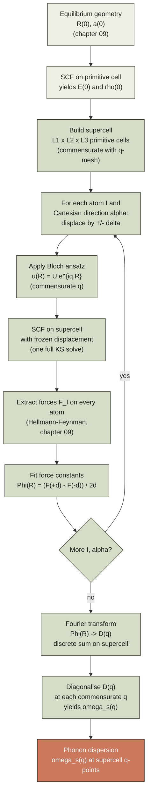
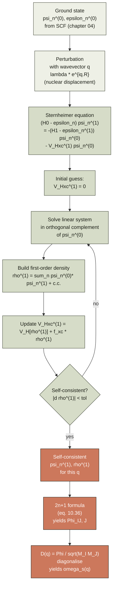
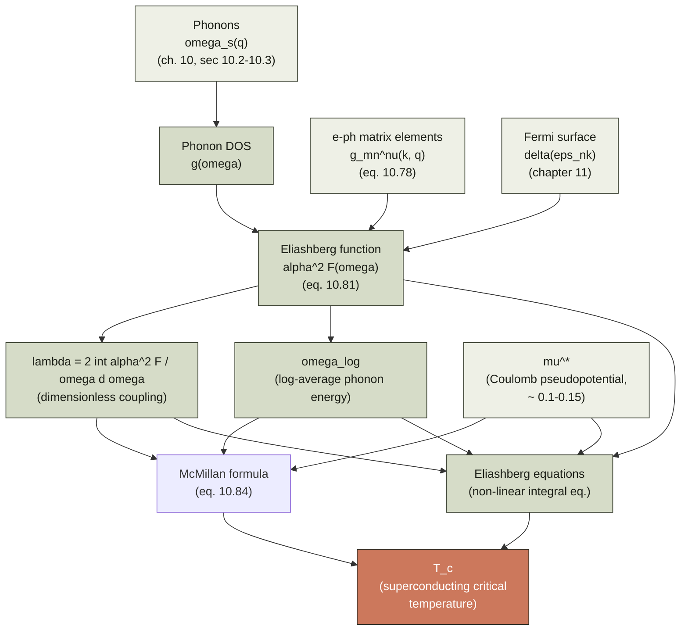
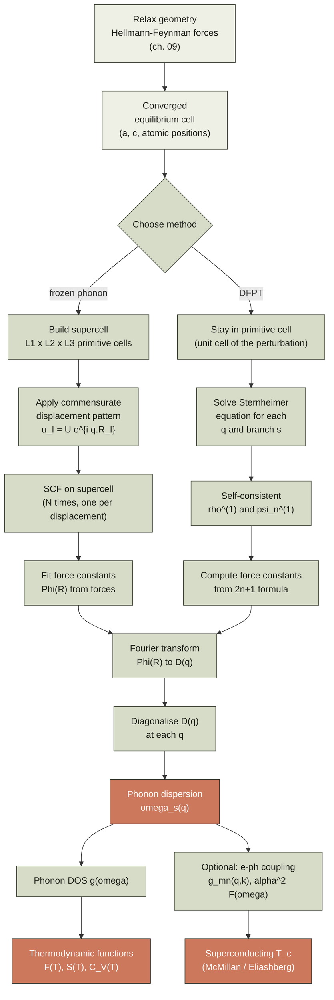

# Chapter 10 — Phonons & vibrations

> The nuclei in a solid are not static. They oscillate around their
> equilibrium positions with small amplitudes, and these oscillations
> are *quantised*: the energy comes in lumps, $\hbar \omega_s(\mathbf q)$,
> called *phonons*. This chapter is the construction of the
> dispersion $\omega_s(\mathbf q)$ from first principles — the
> dynamical matrix $D(\mathbf q)$ that is to vibrations what the
> Hamiltonian is to electrons.

By the end of [chapter 09]({{ "/dft-notes/chapter-09/" | relative_url }})
we had a procedure for finding the equilibrium geometry of a
molecule or solid: minimise the Kohn–Sham total energy $E[\{\mathbf R_I\}]$
with respect to the nuclear positions $\{\mathbf R_I\}$. The minimum
of $E$ defines the *ground-state* geometry $\mathbf R_I^{(0)}$.
Around this minimum the energy has a quadratic form, so a small
displacement of one nucleus produces a restoring *force* on every
other nucleus. The matrix of these second derivatives,
$\partial^2 E / \partial R_{I\alpha} \partial R_{J\beta}$ (where
$\alpha, \beta \in \{x, y, z\}$), is called the **force-constant
matrix** $\Phi_{I\alpha, J\beta}$. It is the spring constant of the
solid.

This chapter turns $\Phi$ into a **dynamical matrix** $D(\mathbf q)$
by a Fourier transform, and diagonalises $D(\mathbf q)$ at every
**phonon wavevector** $\mathbf q$ in the Brillouin zone to obtain the
*phonon dispersion* $\omega_s(\mathbf q)$ — the analogue of the
electronic band structure $\varepsilon_n(\mathbf k)$ of
[chapter 07]({{ "/dft-notes/chapter-07/" | relative_url }}). The plan is:
(1) state the claim; (2) introduce the *frozen-phonon* method
(§10.2), in which the force-constant matrix is built from a finite
number of *supercell* force calculations; (3) explain the
*linear-response* method (**DFPT**, §10.3) that gives $\Phi$ for any
$\mathbf q$ from a single unit cell; (4) give the *acoustic sum
rule* (§10.4) and the *LO-TO splitting* (§10.5) that pin down
$\omega_s(\mathbf q)$ at the two limits $\mathbf q \to 0$ and
$\mathbf q = 0$ for ionic crystals; (5) connect the dispersion to
the *phonon density of states* and the *thermodynamic* functions
(§10.6); (6) sketch the *anharmonic* corrections that go beyond
the harmonic approximation (§10.7); and (7) treat the
*electron-phonon* coupling (§10.8) that ties phonons back to
electrons and opens the door to superconductivity.

> **Reading note.** This chapter assumes
> [chapter 07]({{ "/dft-notes/chapter-07/" | relative_url }}) (Bloch
> theorem, Brillouin zone, k-point sampling) and
> [chapter 09]({{ "/dft-notes/chapter-09/" | relative_url }})
> (Hellmann–Feynman forces, geometry optimisation). It uses
> concepts from [chapter 04]({{ "/dft-notes/chapter-04/" | relative_url }})
> (Kohn–Sham DFT) and
> [chapter 08]({{ "/dft-notes/chapter-08/" | relative_url }})
> (pseudopotentials).

## 10.1 The claim

> **Phonons are the normal modes of small nuclear displacements
> around the equilibrium geometry of a solid.** Their frequencies
> $\omega_s(\mathbf q)$ at a given phonon wavevector $\mathbf q$ and
> branch index $s$ are the eigenvalues of the **dynamical matrix**
>
> \begin{equation}
> \label{eq:ch-10-dyn-def}
> D_{I\alpha, J\beta}(\mathbf q) \;=\;
> \frac{1}{\sqrt{M_I M_J}}\,
> \tilde\Phi_{I\alpha, J\beta}(\mathbf q) ,
> \end{equation}
>
> where $\tilde\Phi$ is the Fourier transform of the real-space
> **force-constant matrix**
>
> \begin{equation}
> \label{eq:ch-10-fc-def}
> \Phi_{I\alpha, J\beta}(\mathbf R) \;\equiv\;
> \frac{\partial^2 E}{\partial R_{I\alpha}^{(0)} \, \partial R_{J\beta}^{(\mathbf R)}} ,
> \end{equation}
>
> $M_I$ is the mass of nucleus $I$, and $E$ is the Kohn–Sham total
> energy in the Born–Oppenheimer approximation.

The rest of this section unpacks the claim. The proof that
$\omega_s(\mathbf q)$ comes from the eigenvalues of
\eqref{eq:ch-10-dyn-def} is the content of §10.1.2; the link
between $\Phi$ and the Kohn–Sham energy is the *force theorem* of
[chapter 09]({{ "/dft-notes/chapter-09/" | relative_url }}) §9.4; the
matrix $\tilde\Phi$ and its relation to $\Phi$ is the discrete
Fourier transform derived in §10.1.3. ### 10.1.1 Why a Fourier transform?

The solid is infinite. We want a wavevector $\mathbf q$ to label the
modes by crystal momentum (the phonon analogue of the electronic
$\mathbf k$ of [chapter 07]({{ "/dft-notes/chapter-07/" | relative_url }})).
For a 1-D chain of $N$ atoms with mass $M$ and lattice constant $a$,
Bloch's theorem says a normal mode with wavevector $q$ has the form

$$
u_{n\alpha}(t) \;=\; U_{s\alpha}(q)\, e^{i(q n a - \omega_s(q) t)} ,
$$

i.e. the displacement of atom $n$ is a plane wave in $n$ modulated
by an amplitude $U_{s\alpha}(q)$ that is *the same in every cell*.
This ansatz is exact if $\Phi$ is translationally invariant — i.e.
if the force constant between atom $n$ and atom $m$ depends only on
$m - n$, which is true for a perfect crystal.

The ansatz is what makes the dynamical matrix **finite** (size
$3 N_\text{atom}$ per unit cell, where $N_\text{atom}$ is the
number of atoms in the *primitive* cell) at every $\mathbf q$.
Without it, we would have a $3N$-by-$3N$ matrix for a solid of $N$
atoms (an integer that diverges in the thermodynamic limit). The
Fourier transform from real-space force constants $\Phi_{I\alpha,
J\beta}(\mathbf R)$ to dynamical matrix elements
$D_{I\alpha, J\beta}(\mathbf q)$ is the operation that takes
advantage of the translational symmetry to reduce an infinite
matrix to a $3 N_\text{atom}$-by-$3 N_\text{atom}$ matrix indexed
by atom *within one cell*.

### 10.1.2 The equation of motion

Expand the Born–Oppenheimer energy of
[chapter 01]({{ "/dft-notes/chapter-01/" | relative_url }}) to second
order in the nuclear displacements $u_{I\alpha} = R_{I\alpha} -
R_{I\alpha}^{(0)}$ around the equilibrium geometry:

\begin{equation}
\label{eq:ch-10-quadratic}
E\bigl[\{\mathbf R\}\bigr] \;\approx\;
E^{(0)} \;+\; \frac{1}{2}\,
\sum_{I, J}\; \sum_{\alpha, \beta}\;
u_{I\alpha}\, \Phi_{I\alpha, J\beta}(\mathbf 0)\, u_{J\beta} .
\end{equation}

(The first-order terms vanish at the equilibrium geometry; the
definition of $\Phi$ is the second derivative, equation
\eqref{eq:ch-10-fc-def}, which is a *Hessian* of the energy
landscape.)

The classical equation of motion for nucleus $I$ in direction
$\alpha$ is Newton's law,

$$
M_I\, \ddot u_{I\alpha} \;=\; -\,\frac{\partial E}{\partial u_{I\alpha}}
\;=\; -\sum_{J, \beta}\; \Phi_{I\alpha, J\beta}(\mathbf 0)\, u_{J\beta} .
$$

Substituting the Bloch ansatz
$u_{I\alpha}(t) = U_{s\alpha}(q)\, e^{i(q R_I - \omega_s(q) t)}$
(where $R_I$ here denotes the position of atom $I$ within the
supercell) and using
$\ddot u_{I\alpha} = -\omega_s^2 u_{I\alpha}$, we get

\begin{equation}
\label{eq:ch-10-eom-bloch}
M_I\, \omega_s^2(q)\, U_{s\alpha}(q) \;=\;
\sum_{J, \beta}\; \Phi_{I\alpha, J\beta}(\mathbf 0)\, U_{s\beta}(q) .
\end{equation}

Define the **dynamical matrix**

\begin{equation}
\label{eq:ch-10-dyn-from-fc}
D_{I\alpha, J\beta}(\mathbf q) \;\equiv\;
\frac{1}{\sqrt{M_I M_J}}\,
\tilde\Phi_{I\alpha, J\beta}(\mathbf q) ,
\end{equation}

with the Fourier transform

\begin{equation}
\label{eq:ch-10-fc-fourier}
\tilde\Phi_{I\alpha, J\beta}(\mathbf q) \;\equiv\;
\sum_{\mathbf R}\; e^{-i \mathbf q \cdot \mathbf R}\,
\Phi_{I\alpha, J\beta}(\mathbf R) .
\end{equation}

Equation \eqref{eq:ch-10-eom-bloch} is then the eigenvalue
problem

\begin{equation}
\label{eq:ch-10-dyn-eig}
\boxed{
\omega_s^2(\mathbf q)\, U_{s\alpha}(q) \;=\;
\sum_{J, \beta}\; D_{I\alpha, J\beta}(\mathbf q)\, U_{s\beta}(q) .
}
\end{equation}

The eigenvalues of $D(\mathbf q)$ are $\omega_s^2(\mathbf q)$, with
$s = 1, 2, \ldots, 3 N_\text{atom}$ (three branches per atom in
the primitive cell). The corresponding eigenvectors $U_s(q)$ are
the polarisation vectors of the mode.

> **Note.** We wrote the equation of motion with
> $\Phi_{I\alpha, J\beta}(\mathbf 0)$ — the *on-site* force
> constant. The Fourier transform \eqref{eq:ch-10-fc-fourier} will
> re-introduce the *off-cell* matrix elements in the standard way.
> The argument generalises straightforwardly to multiple atoms per
> cell; the only change is that the *index* $J$ now runs over
> *all* atoms in the crystal (i.e. over all $N_\text{atom}$ atoms in
> every cell), and the matrix $D(\mathbf q)$ is $3N_\text{atom}
> \times 3N_\text{atom}$ in size.

### 10.1.3 The Fourier transform in practice

For a perfect crystal under Born–von Karman boundary conditions
([chapter 07]({{ "/dft-notes/chapter-07/" | relative_url }})), the
force-constant matrix is invariant under simultaneous translation
of the unit-cell labels:

\begin{equation}
\label{eq:ch-10-fc-trans-inv}
\Phi_{I\alpha, J\beta}(\mathbf R, \mathbf R') \;=\;
\Phi_{I\alpha, J\beta}(\mathbf R - \mathbf R') .
\end{equation}

The discrete Fourier transform from the relative-cell index to the
phonon wavevector $\mathbf q$ is then

\begin{equation}
\label{eq:ch-10-dft}
\tilde\Phi_{I\alpha, J\beta}(\mathbf q) \;=\;
\sum_{\mathbf R}\; e^{-i \mathbf q \cdot \mathbf R}\,
\Phi_{I\alpha, J\beta}(\mathbf R) .
\end{equation}

(Here $\Phi_{I\alpha, J\beta}(\mathbf R)$ is the force constant
between atom $I$ in the reference cell and atom $J$ in the cell
$\mathbf R$ away.) The phonon wavevectors $\mathbf q$ live on the
same Monkhorst–Pack mesh as the electronic $\mathbf k$ of
[chapter 07]({{ "/dft-notes/chapter-07/" | relative_url }}) §7.6 —
i.e. on a uniform mesh in the first Brillouin zone of the
*primitive* lattice, with $N_\mathbf q$ points per BZ where
$N_\mathbf q = N_1 N_2 N_3$ in the Born–von Karman supercell.

> **Tip.** The convention for the sign in
> \eqref{eq:ch-10-dft} varies by author. We use
> $e^{-i\mathbf q\cdot\mathbf R}$ for the cell-phase, so that the
> Bloch ansatz
> $u_{I\alpha}(t) = U_{s\alpha}(q)\, e^{i(\mathbf q\cdot\mathbf R_I - \omega t)}$
> is *positive-frequency* (i.e. travels in the direction of
> $\mathbf q$). Some authors use the opposite sign; both are
> correct as long as they are used consistently in
> \eqref{eq:ch-10-dyn-eig} and \eqref{eq:ch-10-dft}.

## 10.2 The frozen-phonon method

The *frozen-phonon* method builds the force-constant matrix by
explicitly displacing atoms and computing the forces that result.
It is conceptually the simplest route from a DFT code to a phonon
dispersion, and it is the one that ties most directly to the
*forces* machinery of [chapter 09]({{ "/dft-notes/chapter-09/" | relative_url }}).

### 10.2.1 The supercell trick

Phonons with wavevector $\mathbf q$ in the primitive BZ are
*commensurate* with a supercell of size $L \mathbf a$ along the
direction of $\mathbf q$, where $L$ is the smallest integer such
that $L \mathbf a \cdot \mathbf q = 2\pi m$ for some integer $m$
(in 1-D: $L a q = 2\pi m$, so $L = m \cdot 2\pi / (q a)$). For a
*general* $\mathbf q$, $L$ is infinite and the supercell is the
*infinite* crystal. The frozen-phonon approach handles this by
**approximating** a general $\mathbf q$ by a commensurate one in a
finite supercell.

Concretely: pick a supercell of $L_1 \times L_2 \times L_3$ primitive
cells. Apply the Bloch ansatz
$u_{I\alpha}(\mathbf R) = U_\alpha(\mathbf R) e^{i\mathbf q\cdot \mathbf R}$
*exactly* — i.e. the same amplitude $U_\alpha$ is applied to every
copy of atom $I$ in the cell $\mathbf R$ (modulo the phase factor
$e^{i\mathbf q\cdot\mathbf R}$). This is a perfectly periodic
distortion of the supercell, so a single SCF calculation in the
supercell gives the *force on every atom in the supercell*. The
forces are then interpreted as the forces at the corresponding
$\mathbf q$ in the primitive cell.

> **Note.** The commensurate approximation works for *any*
> $\mathbf q$ that is a rational multiple of a reciprocal-lattice
> vector. The discrete set of $\mathbf q$ values you can reach is
> determined by the supercell size: an $L_1 \times L_2 \times L_3$
> supercell gives a $\mathbf q$-mesh of $L_1 \times L_2 \times L_3$
> points in the BZ (analogous to the BvK mesh for electronic
> $\mathbf k$ in [chapter 07]({{ "/dft-notes/chapter-07/" | relative_url }})).
> To compute the dispersion at a fine $\mathbf q$-mesh you need a
> correspondingly large supercell — which is the practical
> bottleneck of the frozen-phonon method.

### 10.2.2 From forces to the force-constant matrix

A single force calculation tells you the *force* on each atom
induced by a particular displacement pattern, not the second
derivative directly. To extract the second derivative, you need
*two* displacement patterns and a *finite-difference* fit, or you
need to invert the relationship

\begin{equation}
\label{eq:ch-10-force-linear}
F_{I\alpha} \;=\; -\sum_{J, \beta}\; \Phi_{I\alpha, J\beta}\,
u_{J\beta}
\end{equation}

by computing $F$ for enough linearly independent displacement
patterns $u$ that the linear system for $\Phi$ becomes determined
or over-determined.

The simplest recipe is the *finite-difference* central-difference
formula: for each atom $I$ and each Cartesian direction $\alpha$,
apply the displacement
$u_{J\beta} = \pm \delta\, \delta_{IJ} \delta_{\alpha\beta}$ (i.e.
displace atom $I$ by $\pm \delta$ in direction $\alpha$ and *only*
that atom), and compute the resulting forces. The off-diagonal
element $\Phi_{I\alpha, J\beta}$ for $J \neq I$ is then

\begin{equation}
\label{eq:ch-10-fd-fc}
\Phi_{I\alpha, J\beta} \;\approx\;
\frac{F_{I\alpha}(\delta_{J\beta}) - F_{I\alpha}(-\delta_{J\beta})}
     {2 \delta} ,
\end{equation}

where $F_{I\alpha}(\pm \delta_{J\beta})$ is the force on atom $I$
in direction $\alpha$ after atom $J$ has been displaced by $\pm
\delta$ in direction $\beta$. For the *diagonal* element
$\Phi_{I\alpha, I\alpha}$, the displacement is along the same
direction as the force, and the same formula applies. The
finite-difference step $\delta$ is typically $0.01$–$0.05$ Å.

The total number of force calculations required by the *single-
atom* finite-difference scheme is $2 \times 3 N_\text{atom-in-cell}$
for a *primitive cell* and $2 \times 3 N_\text{atom-in-supercell}$
for a supercell. By the symmetry of $\Phi$ (it is symmetric in
$I\alpha \leftrightarrow J\beta$), this can be halved.

> **Warning.** The single-atom finite-difference scheme misses any
> force-constant matrix element that connects atoms in *different*
> supercell images when only one atom is displaced. To get the
> *inter-cell* force constants $\Phi_{I\alpha, J\beta}(\mathbf R)$
> for $\mathbf R \neq 0$, you must use a *supercell large enough*
> to fit the longest-ranged force constant you want to resolve.
> For insulators the force constants are usually short-ranged (a
> few Å), but for metals the long-range Friedel oscillations in
> the dielectric response make the force constants effectively
> *long-ranged*; the supercell must be sized accordingly or
> periodic-image interactions will pollute the fit.

### 10.2.3 The Fourier transform back to $D(\mathbf q)$

Once the full force-constant matrix $\Phi_{I\alpha, J\beta}(\mathbf
R)$ is in hand, the dynamical matrix is obtained by the discrete
Fourier transform \eqref{eq:ch-10-dft}. In a frozen-phonon
calculation on a *commensurate* supercell, the $\mathbf q$ that the
supercell supports are exactly the discrete set
$\{\mathbf q_\text{mesh}\}$ corresponding to the supercell, so the
Fourier transform is just a sum over the supercell cells:

\begin{equation}
\label{eq:ch-10-frozen-dyn}
D_{I\alpha, J\beta}(\mathbf q_\text{mesh}) \;=\;
\frac{1}{\sqrt{M_I M_J}}\;
\sum_{\mathbf R \in \text{supercell}}\;
e^{-i \mathbf q_\text{mesh} \cdot \mathbf R}\,
\Phi_{I\alpha, J\beta}(\mathbf R) .
\end{equation}

Diagonalising $D(\mathbf q_\text{mesh})$ for every $\mathbf
q_\text{mesh}$ gives the phonon frequencies at those mesh points.
The dispersion along a high-symmetry path (e.g. $\Gamma \to X \to
M \to \Gamma$ in a cubic BZ) is then obtained by interpolation,
or by *re-fourier-interpolating* $\Phi$ to a finer $\mathbf
q$-mesh and diagonalising again. The latter is the
**Fourier-interpolation** method of
[Gonze, Charlier, Allan, Teter (1994)](<https://doi.org/10.1103/PhysRevB.50.13035>),
and is the standard way to get a smooth dispersion curve from a
finite-supercell frozen-phonon calculation.

### 10.2.4 Diagram — the frozen-phonon workflow

The frozen-phonon route from a *converged ground-state calculation*
to a *phonon dispersion* is a sequence of $O(N_\text{atom})$
displacement-force pairs, followed by a Fourier interpolation.
The box below summarises the pipeline; every box is one full
*self-consistent field* (SCF) calculation on a supercell.



The **inner loop** `LOOP` is the cost driver: it runs
$2 \times 3 N_\text{atom-in-supercell}$ independent SCF
calculations. By symmetry of $\Phi$ (which is symmetric under
$I \leftrightarrow J$, $\alpha \leftrightarrow \beta$) this can
be halved. The **outer box** `FFT` is the cheap step (a single
discrete Fourier transform), and `DIAG` is one matrix
diagonalisation per $\mathbf q$. The set of $\mathbf q$ values
reachable is the *commensurate* set determined by the
supercell — to resolve a finer $\mathbf q$-mesh one must use a
larger supercell, which is the bottleneck of the method.

## 10.3 Density-functional perturbation theory (DFPT)

The frozen-phonon method has a cost that grows with the supercell
size — linearly with the number of atoms, but the *number of
distinct force calculations* is $O(N_\text{atom})$ and each force
calculation is an *entire SCF cycle* on a supercell. A phonon
dispersion along a high-symmetry path of length 6–10 segments
requires $O(10)$ supercell SCF calculations at $O(10)$ supercell
sizes — easily $O(100)$ SCF cycles in total. The
**density-functional perturbation theory** (DFPT) approach of
[Baroni, Giannozzi, Testa (1987)](<https://doi.org/10.1103/PhysRevLett.58.1861>)
and [Gonze (1995)](<https://doi.org/10.1103/PhysRevB.52.1096>) gets
the *same* force-constant matrix from a *single* unit-cell
calculation by solving a *linear-response* problem for the
self-consistent potential at every $\mathbf q$.

### 10.3.1 The $2n + 1$ theorem

DFPT rests on a deep formal result. Consider a *static*
perturbation parameter $\lambda$ that couples to the system
through some one-electron operator $\partial \hat V_\lambda /
\partial \lambda$. The **$2n + 1$ theorem** (or "third-order
analyticity" theorem, see [Gonze & Vigneron (1989)](<https://doi.org/10.1103/PhysRevB.39.13120>))
states that the $2n+1$-th derivative of the total energy with
respect to $\lambda$ can be computed from a knowledge of the wave-
function perturbed to *only* order $n$:

\begin{equation}
\label{eq:ch-10-2n1}
\frac{\partial^{2n+1} E}{\partial \lambda^{2n+1}} \;=\; F\bigl[
\{\psi^{(0)}\}, \{\psi^{(1)}\}, \ldots, \{\psi^{(n)}\} \bigr] .
\end{equation}

For phonons, $\lambda$ is the *amplitude* of a nuclear
displacement with wavevector $\mathbf q$, and the relevant
quantity is the **second derivative** of the energy ($n = 1$,
$2n + 1 = 3$, but we want $\partial^2 E$ — see below). The
$2n + 1$ theorem guarantees that the second derivative of the
energy is computable from a knowledge of *only the first-order
change in the wavefunction* $\psi^{(1)}$, which in turn is
determined by a *single linear equation* (the Sternheimer
equation, §10.3.2) — not by a separate self-consistent
calculation at each amplitude.

In practice the $2n + 1$ theorem is invoked differently. The
*first* derivative of the energy (the force) is the Hellmann–
Feynman theorem of [chapter 09]({{ "/dft-notes/chapter-09/" | relative_url }}).
The *second* derivative (the force-constant matrix) is
$2n + 1$ for $n = 0$ (since $2(0) + 1 = 1$, but we want the
*2nd* derivative — so the theorem is sometimes stated as: "the
energy to order $2n+1$ requires the wavefunction to order $n$",
which for the *force-constant matrix* ($n = 0$ for the second
derivative of the energy) means *no wavefunction perturbation at
all* — but the *force-constant matrix itself* is second-order in
the perturbation amplitude, so we need $\psi^{(1)}$ to compute it).
Either way, the practical consequence is the same: a *single*
linear-response calculation gives the second derivative of the
energy with respect to *every* perturbation of the chosen
wavevector.

### 10.3.2 The Sternheimer equation

Let $\hat H^{(0)}$ be the unperturbed Kohn–Sham Hamiltonian, with
eigenstates $\psi_n^{(0)}$ and eigenvalues $\varepsilon_n^{(0)}$.
Apply a small static perturbation with wavevector $\mathbf q$ and
amplitude $\lambda$ (think of a phonon displacement
$\mathbf u_{I\alpha} = \lambda\, e^{i\mathbf q\cdot\mathbf R_I}
\hat{\mathbf e}_\alpha$). The first-order change in the
Hamiltonian is $\hat H^{(1)} = \partial \hat H / \partial \lambda$
at $\lambda = 0$. The first-order change in the wavefunction
$\psi_n^{(1)}$ satisfies the **Sternheimer equation**

\begin{equation}
\label{eq:ch-10-sternheimer}
\bigl(\hat H^{(0)} - \varepsilon_n^{(0)}\bigr)\, \psi_n^{(1)}
\;=\; -\bigl(\hat H^{(1)} - \varepsilon_n^{(1)}\bigr)\, \psi_n^{(0)} ,
\end{equation}

where $\varepsilon_n^{(1)} = \langle \psi_n^{(0)} \rvert \hat H^{(1)}
\rvert \psi_n^{(0)} \rangle$ is the first-order change in the
eigenvalue (the Hellmann–Feynman contribution to the force on
the displaced nucleus). The operator on the left is *singular*
(it has a zero eigenvalue corresponding to $\psi_n^{(0)}$ itself);
the standard fix is to project out the $\psi_n^{(0)}$ component
and solve in the *orthogonal complement* of the unperturbed
eigenstate. This is a *linear* equation in $\psi_n^{(1)}$, not a
self-consistent one — but the Hamiltonian $\hat H^{(0)}$ depends
on the *density* $\rho$, so the *self-consistent* density
response $\rho^{(1)}$ couples all the $\psi_n^{(1)}$ together
through the Hartree and exchange–correlation potentials. The
**self-consistent** Sternheimer equation is

\begin{equation}
\label{eq:ch-10-sternheimer-scf}
\bigl(\hat H^{(0)} - \varepsilon_n^{(0)}\bigr)\, \psi_n^{(1)}
\;=\; -\bigl(\hat H^{(1)} - \varepsilon_n^{(1)}\bigr)\, \psi_n^{(0)}
\;-\; \hat V_\text{Hxc}^{(1)}\, \psi_n^{(0)} ,
\end{equation}

with $\hat V_\text{Hxc}^{(1)}[\rho^{(1)}]$ the linear change in the
Hartree+XC potential induced by the linear density response
$\rho^{(1)} = \sum_n^\text{occ} \psi_n^{(0)*} \psi_n^{(1)} + \text{c.c.}$.

The Sternheimer equation is solved iteratively: start with
$\hat V_\text{Hxc}^{(1)} = 0$, solve for $\psi_n^{(1)}$, build
$\rho^{(1)}$, rebuild $\hat V_\text{Hxc}^{(1)}[\rho^{(1)}]$, and
iterate to self-consistency. The cost is *one* linear-response
cycle per $\mathbf q$ point, comparable to a *single* SCF
iteration in a regular ground-state calculation.

### 10.3.3 The dynamical matrix from DFPT

Once the self-consistent first-order density response $\rho^{(1)}$
is known, the second derivative of the energy with respect to the
phonon amplitude follows from the $2n + 1$ theorem applied at
$n = 0$ for the second derivative, or by direct application of
the **$2n + 1$ formula** for the second derivative:

\begin{equation}
\label{eq:ch-10-dyn-dfpt}
\frac{\partial^2 E}{\partial \lambda_I \partial \lambda_J} \;=\;
\sum_n^\text{occ}\;
\Bigl[
\langle \psi_n^{(0)} \rvert \partial^2 \hat H_I / \partial \lambda_I \partial \lambda_J
           \rvert \psi_n^{(0)} \rangle
\;+\; 2\, \text{Re}\, \langle \psi_n^{(0)} \rvert \partial \hat H_J / \partial \lambda_J
           \rvert \psi_n^{(1)}_I \rangle
\Bigr] .
\end{equation}

(Here $\partial \hat H_I$ is the derivative of the Hamiltonian with
respect to the displacement of atom $I$ in the chosen direction;
the result is a *Hessian* of the energy with respect to the
displacement amplitudes, which is the force-constant matrix
element $\Phi_{I\alpha, J\beta}$ in the limit $\mathbf q = 0$ or
its Fourier transform in general.)

The crucial point is that the only piece of \eqref{eq:ch-10-dyn-dfpt}
that depends on the *self-consistent response* is the second term
with $\psi_n^{(1)}$. The first term — the "bare" second derivative
of the Hamiltonian, which includes the change in the *external*
potential when the nuclei are displaced — is known analytically
(it is the change in the electron-nucleus Coulomb attraction plus
the change in the nucleus-nucleus repulsion). So the entire
self-consistent machinery is *just* the Sternheimer equation, and
the force constant is a *post-processing* of $\psi_n^{(1)}$.

> **Tip.** DFPT is implemented in production codes like
> [Quantum ESPRESSO](<https://www.quantum-espresso.org/>),
> [ABINIT](<https://www.abinit.org/>), and
> [CASTEP](<https://www.castep.org/>) under the keyword
> `phonon` / `dfpt` / `linear response`. For each $\mathbf q$ the
> code runs *one* Sternheimer SCF cycle (linear in the occupied
> states) and outputs the dynamical matrix. The cost of a full
> phonon dispersion is then $N_\mathbf q$ *linear* calculations,
> not $N_\mathbf q$ *non-linear* ones — a savings of a factor of
> 5–10 per $\mathbf q$ over a frozen-phonon approach.

### 10.3.4 Why DFPT scales better

The frozen-phonon method requires a separate supercell
calculation for *each* $\mathbf q$, and the supercell grows
without bound as one moves to fine $\mathbf q$ meshes.
The DFPT method always works in the *primitive cell* (or
the unit cell of the perturbation), and the cost grows only
with the size of the *basis* needed to represent the
self-consistent response. For a plane-wave code the basis size
scales with the *kinetic cutoff*, not with the supercell, so
the cost of one $\mathbf q$-point is roughly that of one
ground-state SCF cycle on the *primitive cell* — independent
of how fine the $\mathbf q$-mesh is.

The catch is that the *basis for the response* has to resolve
both the original orbitals and their first-order change, so the
cutoff for the DFPT calculation is typically
$4 E_\text{cut}$ (the same as the density-grid cutoff, see
[chapter 06]({{ "/dft-notes/chapter-06/" | relative_url }}) §6.7) — not
$E_\text{cut}$ as in a ground-state calculation. The total cost is
therefore $N_\mathbf q$ DFPT cycles, each at a kinetic cutoff that
is $4 \times$ higher than a ground-state calculation. The
trade-off vs. frozen-phonon is favourable whenever the supercell
needed to fit the lowest interesting $\mathbf q$ would contain
more than $\sim 4$ atoms.

### 10.3.5 Diagram — the DFPT 2n+1 linear-response cycle

DFPT replaces the $O(N_\text{atom})$ SCF cycles of the frozen-
phonon method by a *single* linear-response solve at every
$\mathbf q$ — the *Sternheimer equation* for the first-order
wavefunction $\psi_n^{(1)}$. The $2n+1$ theorem then guarantees
that the *second-order* property of interest (the force-constant
matrix $\partial^2 E / \partial \lambda^2$) can be extracted from
*only* the first-order wavefunction.



The **inner loop** (`SOLVE` → `RHO1` → `V1` → `CK`) is a
*linear* iteration: each step solves a single linear system for
$\psi_n^{(1)}$ given a fixed $V_\text{Hxc}^{(1)}$, then updates
$V_\text{Hxc}^{(1)}$ from the new $\rho^{(1)}$. This is the
*same* structure as a non-linear ground-state SCF, but the
equation being solved is **linear in $\psi_n^{(1)}$**, so the
convergence is much faster (typically 5–10 iterations to
$10^{-10}$ in the density residual). Once `DONE` is reached,
the **single** `FC` step applies the $2n+1$ formula to *all*
force-constant matrix elements $\Phi_{I\alpha, J\beta}$ at the
chosen $\mathbf q$ from the *same* $\psi_n^{(1)}$.

## 10.4 The acoustic sum rule

A non-accidental property of every harmonic crystal is that at
$\mathbf q = 0$ there are *three* phonon modes with frequency
exactly $\omega = 0$. These are the **acoustic modes** at the
**Brillouin-zone centre** $\Gamma$. They correspond to uniform
translations of the entire crystal: every nucleus moves by the
same infinitesimal amount in the same direction, and because the
energy is invariant under such a translation, there is no
restoring force and the mode has zero frequency.

Mathematically, the acoustic sum rule (ASR) is a constraint on
the *force-constant matrix*:

\begin{equation}
\label{eq:ch-10-asr}
\sum_{J}\; \Phi_{I\alpha, J\beta}(\mathbf R) \;=\; 0
\quad \text{for every } I, \alpha, \beta, \mathbf R.
\end{equation}

The proof uses translation invariance. Consider a uniform
displacement $\mathbf u$ of every nucleus in the crystal. The
change in energy is

\begin{align}
\Delta E
&\;=\; \frac{1}{2}\,
\sum_{I, J, \mathbf R}\; u_\alpha\, \Phi_{I\alpha, J\beta}(\mathbf R)\,
u_\beta \nonumber \\
&\;=\; \frac{1}{2}\, u_\alpha\,
\Bigl(\sum_{I, J, \mathbf R}\; \Phi_{I\alpha, J\beta}(\mathbf R)\Bigr)\, u_\beta .
\end{align}

The right-hand side must vanish for *every* uniform $u$ — because
$\Delta E = 0$ for a uniform translation (the energy depends only
on *relative* positions of nuclei, not on the absolute position
of the centre of mass). The matrix in parentheses must therefore
be the zero matrix, which is \eqref{eq:ch-10-asr}.

The Fourier transform of \eqref{eq:ch-10-asr} at $\mathbf q = 0$ is

\begin{equation}
\label{eq:ch-10-asr-fourier}
\sum_{J}\; \tilde\Phi_{I\alpha, J\beta}(\mathbf q = 0) \;=\; 0 .
\end{equation}

Summing \eqref{eq:ch-10-dyn-def} over $J$ (and dividing by
$\sqrt{M_I}$) gives

\begin{equation}
\label{eq:ch-10-asr-dyn}
\sum_{J}\; \sqrt{M_J}\, D_{I\alpha, J\beta}(\mathbf 0) \;=\; 0 .
\end{equation}

For every $I, \alpha, \beta$, the dynamical-matrix column
$\sum_J \sqrt{M_J}\, D_{I\alpha, J\beta}$ is zero. So the
$3 N_\text{atom}$-by-$3N_\text{atom}$ dynamical matrix
$D(\mathbf 0)$ has a *null space* of dimension at least 3,
spanned by the three uniform-translation vectors
$\{U_{I\alpha}^{(s)}\} = \delta_{s\alpha}$ for $s = 1, 2, 3$
(where $s$ indexes the three Cartesian directions). Three of the
eigenvalues of $D(\mathbf 0)$ are therefore exactly zero — these
are the three acoustic modes at $\Gamma$.

> **Tip.** In a *finite* supercell calculation, the acoustic sum
> rule is *not* exactly satisfied because the supercell is not
> exactly translationally invariant (the Born–von Karman boundary
> conditions break the continuous translation group down to a
> *discrete* one). The largest *spurious* contribution to the ASR
> comes from the *long-range* part of the force constants, which
> in a finite supercell is replaced by an interaction with the
> periodic images. The standard fix is to *enforce* the ASR
> *a posteriori* by replacing the Fourier transform
> \eqref{eq:ch-10-fc-fourier} with the *ASR-projected* form
> \begin{equation}
> \label{eq:ch-10-asr-project}
> \tilde\Phi_{I\alpha, J\beta}(\mathbf q) \;\longleftarrow\;
> \tilde\Phi_{I\alpha, J\beta}(\mathbf q)
> \;-\; \delta_{\mathbf q 0}\, \frac{1}{N}\,
> \sum_{J'}\, \tilde\Phi_{I\alpha, J'\beta}(\mathbf 0) ,
> \end{equation}
> which subtracts the average of the $\mathbf q = 0$ column (the
> "spurious acoustic-mode contribution") from every $\mathbf q$.
> This is what the **frozen-phonon post-processing** of Quantum
> ESPRESSO's `q2r` + `matdyn` does by default.

## 10.5 LO–TO splitting at $q = 0$ in ionic crystals

For a crystal made of *one* atom per primitive cell, the
dispersion near $\mathbf q = 0$ has three acoustic modes that are
*linearly* dispersing: $\omega_s(\mathbf q) = v_s |\mathbf q|$
for $s = 1, 2, 3$ (one longitudinal, two transverse). The
*slopes* $v_s$ are the speeds of sound in the three acoustic
branches.

For a crystal with *two or more* atoms per primitive cell, the
story is richer. There are *three acoustic* branches (which go
to zero at $\Gamma$ as above) and *3(N-1) optical* branches
(which have non-zero frequency at $\Gamma$). The
*longitudinal optical* (LO) branch in an *ionic* crystal has a
particularly subtle behaviour: its frequency at $\mathbf q = 0$
is *not* the same as the frequency of the *transverse optical*
(TO) branch. The split is called the **LO–TO splitting**, and it
is a macroscopic electrostatic effect that the *interatomic
force constants* alone do not capture. The bridge between the
two frequencies is the **Born effective charge** tensor.

### 10.5.1 The Born effective charge

When a nucleus $I$ is displaced by an infinitesimal amount
$\Delta \mathbf R_I$ in a *neutral* crystal (the electron density
is allowed to relax to its new ground state), the change in the
total *polarisation* is

\begin{equation}
\label{eq:ch-10-born-charge}
\Delta \mathbf P \;=\; \frac{e}{\Omega}\,
\sum_{I}\, Z^*_{I}\, \Delta \mathbf R_I ,
\end{equation}

where $\Omega$ is the unit-cell volume and $Z^*_I$ is the
**Born effective charge tensor** of atom $I$. The factor $e/\Omega$
converts the sum (a dipole moment per unit cell) into a
polarisation. The Born effective charge is a *rank-2 tensor* in
the Cartesian indices, so for a general non-cubic site it is
*not* a scalar. By the acoustic sum rule, the *net* effective
charge summed over all atoms in the unit cell vanishes in a
neutral crystal:

\begin{equation}
\label{eq:ch-10-born-sum}
\sum_{I}\, Z^*_{I} \;=\; 0 .
\end{equation}

In a *non-ionic* crystal (e.g. pure silicon) $Z^*_\text{Si} = 0$ by
symmetry, even though Si has 4 valence electrons. In an *ionic*
crystal like NaCl, $Z^*_\text{Na} \approx +1.1\, e$ and
$Z^*_\text{Cl} \approx -1.1\, e$ — slightly renormalised from the
formal ionic charges of $\pm 1$ by the partial covalent character
of the bond.

### 10.5.2 The Lyddane–Sachs–Teller relation

The LO–TO splitting is the difference in frequency between the
longitudinal optical (LO) and transverse optical (TO) modes at
$\mathbf q = 0$. The classical result is the
**Lyddane–Sachs–Teller (LST) relation**

\begin{equation}
\label{eq:ch-10-lst}
\frac{\omega_\text{LO}^2}{\omega_\text{TO}^2} \;=\;
\frac{\varepsilon_\infty}{\varepsilon_0} ,
\end{equation}

where $\varepsilon_0$ is the *static* dielectric constant of the
crystal (measured at zero frequency) and $\varepsilon_\infty$ is
the *high-frequency* dielectric constant (measured at frequencies
above the phonons but below the electronic band gap). The LST
relation says: the larger the ratio of static to high-frequency
polarisability, the larger the LO–TO splitting.

> **Note.** The LST relation holds exactly for a *cubic* crystal
> with *one* optic mode of each symmetry (i.e. a 2-atom basis
> like NaCl or GaAs). For more complex unit cells the
> generalisation is a sum over the modes, and the LO and TO
> frequencies at $\mathbf q = 0$ are obtained by diagonalising
> the dynamical matrix *with* the long-range Coulomb interaction
> included — see below.

### 10.5.3 The non-analytic long-range term

The LO–TO splitting arises from the *macroscopic electric field*
that accompanies a longitudinal optical phonon at $\mathbf q \to 0$.
A polar crystal is *piezoelectric*: a displacement of the ions
creates a polarisation, and the polarisation creates an electric
field, and the electric field *acts back* on the ions. The
electric field is singular at $\mathbf q = 0$ — it scales as
$1/|\mathbf q|$ — and it *couples only to the longitudinal mode*
(the transverse modes have no macroscopic polarisation in a
cubic crystal, by symmetry). The result is a *non-analytic*
correction to the dynamical matrix at $\mathbf q \to 0$:

\begin{equation}
\label{eq:ch-10-na-term}
D_{I\alpha, J\beta}^\text{NA}(\mathbf q) \;=\;
\frac{4\pi}{\Omega\, \sqrt{M_I M_J}}\;
\frac{(\mathbf q \cdot Z^*_I)_{\alpha}\, (\mathbf q \cdot Z^*_J)_{\beta}}
     {\mathbf q \cdot \boldsymbol\varepsilon_\infty \cdot \mathbf q} .
\end{equation}

(For a cubic crystal $\boldsymbol\varepsilon_\infty = \varepsilon_\infty
\mathbf 1$ and \eqref{eq:ch-10-na-term} reduces to
$(\mathbf q \cdot Z^*_I)_\alpha (\mathbf q \cdot Z^*_J)_\beta / |\mathbf q|^2$.)

The non-analytic term is *zero* at $\mathbf q = 0$ in the sense
that it does not depend on $|\mathbf q|$ (it depends only on the
*direction* of $\mathbf q$); but it is non-zero for *any* $\mathbf
q \neq 0$. The effect on the *longitudinal* optical mode is to
*raise* its frequency by an amount set by $Z^*$ and
$\varepsilon_\infty$:

\begin{equation}
\label{eq:ch-10-loto-split}
\omega_\text{LO}^2 - \omega_\text{TO}^2
\;=\; \frac{4\pi}{\Omega\, \mu}\;
\frac{|\mathbf q \cdot Z^*|^2}
     {\mathbf q \cdot \boldsymbol\varepsilon_\infty \cdot \mathbf q} ,
\end{equation}

where $\mu$ is the appropriate reduced mass of the mode. This is
the LST relation \eqref{eq:ch-10-lst} in disguise.

> **Warning.** The non-analytic term is *invisible* to a
> *supercell* frozen-phonon calculation, because the supercell
> is *neutral*: the macroscopic electric field of a LO phonon is
> *screened* by the periodic images of the LO mode in the
> supercell. To get the LO–TO splitting right you must *either*
> use DFPT (which works in the primitive cell and *does* see the
> macroscopic field) *or* add the non-analytic term
> \eqref{eq:ch-10-na-term} to the dynamical matrix *by hand*
> after the frozen-phonon calculation. Most production codes do
> the latter.

## 10.6 Phonon density of states and the thermodynamic functions

The phonon **density of states** (DOS) is the number of phonon
modes per unit frequency, summed over all branches and
wavevectors:

\begin{equation}
\label{eq:ch-10-pdos-def}
g(\omega) \;=\; \frac{1}{N_\mathbf q}\,
\sum_{s, \mathbf q}\;
\delta\!\bigl(\omega - \omega_s(\mathbf q)\bigr) .
\end{equation}

In a 3-D crystal with $N_\text{atom}$ atoms per primitive cell,
$g(\omega)$ is a sum of $3 N_\text{atom}$ branches and has $3
N_\text{atom}$ *van Hove singularities* — non-differentiable
points where the gradient of $\omega_s(\mathbf q)$ vanishes (a
*saddle point* in the dispersion). These show up as kinks in
$g(\omega)$ and dominate the thermodynamic response at
corresponding temperatures.

The integral of $g(\omega)$ is fixed by the branch count:

\begin{equation}
\label{eq:ch-10-pdos-norm}
\int_0^\infty g(\omega)\, d\omega \;=\; 3 N_\text{atom} .
\end{equation}

The DOS is the bridge from the dispersion $\omega_s(\mathbf q)$
to all the *thermodynamic* functions of the crystal in the
harmonic approximation. The standard textbook results are
summarised below; the derivations are exercises (problems 1 and 2).

### 10.6.1 The vibrational partition function

The phonon modes are independent harmonic oscillators
([chapter 01]({{ "/dft-notes/chapter-01/" | relative_url }}) §1.5).
The partition function of a single mode of frequency $\omega$ at
temperature $T$ is

$$
Z(\omega, T) \;=\; \frac{e^{-\beta \hbar\omega/2}}{1 - e^{-\beta \hbar\omega}}
\;=\; \frac{1}{2\sinh(\beta \hbar \omega/2)} ,
$$

where $\beta = 1/(k_B T)$. The total partition function is the
product over all modes:

\begin{equation}
\label{eq:ch-10-partition}
Z_\text{ph}(T) \;=\; \prod_{s, \mathbf q}\; Z\bigl(\omega_s(\mathbf q), T\bigr) .
\end{equation}

### 10.6.2 The Helmholtz free energy

The Helmholtz free energy $F(T) = -k_B T \ln Z$ is

\begin{equation}
\label{eq:ch-10-free-energy}
F(T) \;=\; \frac{1}{2}\sum_{s, \mathbf q}\; \hbar\omega_s(\mathbf q)
\;+\; k_B T \sum_{s, \mathbf q}\,
\ln\!\bigl[1 - e^{-\beta\hbar\omega_s(\mathbf q)}\bigr] .
\end{equation}

The first term is the **zero-point energy** (the energy of the
phonons at $T = 0$); the second is the **thermal** contribution.
Both terms are essential for thermochemistry: the *change* in
zero-point energy between two phases contributes to phase
stability even at $T = 0$, and the thermal contribution
determines the $T$-dependence of the free energy.

In terms of the DOS, equation \eqref{eq:ch-10-free-energy} becomes

\begin{equation}
\label{eq:ch-10-free-energy-dos}
F(T) \;=\; 3 N_\text{atom} N_\text{cell}
\int_0^\infty\! d\omega\;
g(\omega)\,
\Bigl[\tfrac{1}{2}\hbar\omega + k_B T \ln\bigl(1 - e^{-\beta\hbar\omega}\bigr)\Bigr] .
\end{equation}

### 10.6.3 The entropy and the specific heat

The vibrational entropy follows from $S = -\partial F / \partial T$:

\begin{equation}
\label{eq:ch-10-entropy}
S(T) \;=\; 3 N_\text{atom} N_\text{cell}\, k_B
\int_0^\infty\! d\omega\;
g(\omega)\,
\Bigl[\beta\hbar\omega\, \frac{1}{e^{\beta\hbar\omega} - 1}
       - \ln\bigl(1 - e^{-\beta\hbar\omega}\bigr)\Bigr] .
\end{equation}

The constant-volume specific heat $C_V = T \partial S / \partial T$ is

\begin{equation}
\label{eq:ch-10-cv}
C_V(T) \;=\; 3 N_\text{atom} N_\text{cell}\, k_B
\int_0^\infty\! d\omega\;
g(\omega)\,
\Bigl(\frac{\beta\hbar\omega/2}{\sinh(\beta\hbar\omega/2)}\Bigr)^{\!2} .
\end{equation}

At *low* temperature ($\beta\hbar\omega_\text{max} \gg 1$), the
low-frequency modes ($\hbar\omega \ll k_B T$) contribute the
classical Dulong–Petit value $C_V \to 3 N_\text{atom} N_\text{cell}
k_B$, but the high-frequency modes are exponentially suppressed,
so $C_V \to 0$ as $T \to 0$ in a way determined by the *low-
frequency* behaviour of $g(\omega)$: for a 3-D solid
$g(\omega) \propto \omega^2$, giving $C_V \propto T^3$ (the
Debye $T^3$ law). At *high* temperature ($\beta\hbar\omega_\text{min}
\ll 1$), all modes are in the classical regime and $C_V$
saturates at the Dulong–Petit value $3 N_\text{atom} N_\text{cell} k_B$.

### 10.6.4 The vibrational contribution to other properties

A few more useful identities in the harmonic approximation:

- The *mean-square thermal displacement* of atom $I$:

  \begin{equation}
  \label{eq:ch-10-msd}
  \langle |\mathbf u_I|^2 \rangle_T \;=\;
  \frac{\hbar}{2 M_I}\;
  \sum_{s, \mathbf q}\;
  \frac{|U_{s, I\alpha}(\mathbf q)|^2}{\omega_s(\mathbf q)}\,
  \coth\!\bigl(\beta\hbar\omega_s(\mathbf q)/2\bigr) .
  \end{equation}

  This determines the Debye–Waller factor
  $\exp\!\bigl[-\tfrac{1}{2}\langle (\mathbf q\cdot \mathbf u)^2\rangle\bigr]$
  in temperature-dependent diffraction intensities.

- The *zero-point energy* of a mode, $\tfrac{1}{2}\hbar\omega$,
  contributes a *renormalisation* of the total energy even at
  $T = 0$. The difference in zero-point energies between two
  phases is the *zero-point contribution* to phase stability;
  it is responsible, e.g., for the relative stability of the
  graphite and diamond phases of carbon at low $T$.

- The *thermal expansion* of a crystal is **not** contained in
  the harmonic approximation — it requires the *anharmonic*
  corrections of §10.7. > **Tip.** In a plane-wave code, the vibrational free energy
> \eqref{eq:ch-10-free-energy-dos} is computed by sampling a
> $\mathbf q$-mesh of $N_\mathbf q$ points, summing the
> frequencies, and (optionally) Fourier-interpolating to a
> finer mesh to improve the convergence. The convergence in
> $N_\mathbf q$ is similar to the convergence of the BZ
> integral in [chapter 07]({{ "/dft-notes/chapter-07/" | relative_url }})
> §7.6 — a $1/N_\mathbf q$ convergence in 3-D for the
> *thermodynamic* integrals, which is slow. A converged
> free-energy calculation typically needs $N_\mathbf q \gtrsim
> 10^3$ for a 2-atom primitive cell.

## 10.7 Anharmonic effects

The harmonic approximation is a quadratic expansion of the energy
in the nuclear displacements. It is exact in the limit of small
displacements at $T = 0$, but it is *not* exact at finite
temperature, and it is *not* exact for the *thermal expansion*
even at $T \to 0$. The missing physics is the **anharmonic
corrections** — the third, fourth, and higher derivatives of the
energy with respect to nuclear displacements.

### 10.7.1 The cubic and quartic force constants

Write the energy as a Taylor expansion in displacements:

\begin{equation}
\label{eq:ch-10-anharm}
E \;=\; E^{(0)} + E^{(2)} + E^{(3)} + E^{(4)} + \ldots ,
\end{equation}

where the $n$-th order term is

\begin{equation}
\label{eq:ch-10-anharm-n}
E^{(n)} \;=\; \frac{1}{n!}\,
\sum_{I_1, \ldots, I_n;\; \alpha_1, \ldots, \alpha_n}\;
\Phi^{(n)}_{I_1\alpha_1, \ldots, I_n\alpha_n}\,
u_{I_1\alpha_1}\, \ldots\, u_{I_n\alpha_n} ,
\end{equation}

with the **$n$-th-order force constant** tensor

\begin{equation}
\label{eq:ch-10-nth-fc}
\Phi^{(n)}_{I_1\alpha_1, \ldots, I_n\alpha_n}
\;\equiv\;
\frac{\partial^n E}{\partial u_{I_1\alpha_1} \cdots \partial u_{I_n\alpha_n}}
\;\Bigg|_{\mathbf u = 0} .
\end{equation}

The harmonic approximation is $E \approx E^{(0)} + E^{(2)}$; the
first anharmonic correction is $E^{(3)}$ (cubic), the second is
$E^{(4)}$ (quartic), and so on. The cubic and quartic force
constants are computable by finite differences of forces, just
like the second-order force constants of §10.2. ### 10.7.2 Phonon–phonon scattering and the phonon self-energy

The cubic term $E^{(3)}$ couples three phonons. In perturbation
theory, it gives a phonon a *self-energy* $\Sigma_s(\mathbf q,
\omega)$ with both a *real* part (which shifts the frequency
$\omega_s \to \omega_s + \text{Re}\,\Sigma$) and an *imaginary*
part (which gives the mode a finite *linewidth* $\Gamma_s = 2
\, \text{Im}\,\Sigma$). The imaginary part at second order in
$E^{(3)}$ is

\begin{equation}
\label{eq:ch-10-pp-width}
\Gamma_s(\mathbf q, T) \;=\;
\frac{\pi \hbar}{4\, \omega_s(\mathbf q)}\,
\frac{1}{N_\mathbf q}\,
\sum_{s_1, s_2}\; \sum_{\mathbf q_1, \mathbf q_2}\;
\bigl| V^{(3)}_{s s_1 s_2}(\mathbf q, \mathbf q_1, \mathbf q_2) \bigr|^2\;
\delta(\omega_s \pm \omega_{s_1} \pm \omega_{s_2})\,
(n_1 + \tfrac{1}{2} \pm \tfrac{1}{2})(n_2 + \tfrac{1}{2} \mp \tfrac{1}{2}) ,
\end{equation}

where $V^{(3)}$ is the cubic matrix element
$\langle ss_1 s_2 | E^{(3)} | 0\rangle$ and $n_i = (e^{\beta\hbar\omega_i} - 1)^{-1}$
is the Bose–Einstein occupation. The delta function enforces
*energy conservation*; the conservation of *crystal momentum* is
already built into the matrix element by the way the
wavevectors enter. The widths $\Gamma_s$ determine the *thermal
conductivity* via the Boltzmann transport equation, the *Raman*
and *infrared* linewidths, and the *lifetime* of a coherent
phonon.

> **Note.** At room temperature, $\Gamma_s$ is typically 1–10
> $\text{cm}^{-1}$ (0.1–1 meV) for an acoustic phonon in a
> simple metal, and an order of magnitude larger in a strongly
> anharmonic crystal like a thermoelectric. These widths are
> directly measurable by inelastic neutron scattering (for
> acoustic modes) and by Raman spectroscopy (for optical modes
> at $\Gamma$).

### 10.7.3 Thermal expansion and the quasi-harmonic approximation

Thermal expansion is a *macroscopic* signature of anharmonicity.
In a strictly harmonic crystal, the equilibrium lattice
parameter $a$ does not depend on $T$ — the free energy is
$F = U - TS$ and both $U$ and $S$ are independent of $a$ at the
harmonic level (the frequencies depend on $a$, but the
*partition function* \eqref{eq:ch-10-partition} does not have a
classical limit that would prefer larger $a$). The *expansion* is
the first non-trivial $T$ dependence of the *equilibrium* $a$.

The **quasi-harmonic approximation** (QHA) restores the $T$
dependence of $a$ by *re-evaluating* the harmonic free energy
\eqref{eq:ch-10-free-energy-dos} at every value of $a$ (or
equivalently, every volume $V$), and minimising with respect to
$a$ at every $T$:

\begin{equation}
\label{eq:ch-10-qha}
a(T) \;=\; \mathrm{argmin}_a\; F\bigl(a, T\bigr) ,
\end{equation}

where $F(a, T)$ is the harmonic free energy \eqref{eq:ch-10-free-energy-dos}
evaluated with the phonon frequencies $\omega_s(\mathbf q; a)$
computed at the lattice parameter $a$. The QHA "freezes" the
phonon populations in their harmonic form (no $E^{(3)}$, $E^{(4)}$
in the energy), but lets the frequencies depend on $a$ — the
Grüneisen parameter

\begin{equation}
\label{eq:ch-10-gruneisen}
\gamma_s(\mathbf q) \;=\; -\,\frac{\partial \ln \omega_s(\mathbf q)}
                                    {\partial \ln V} ,
\end{equation}

encodes this dependence.

The QHA gives *qualitatively* correct thermal expansion: most
solids have $\gamma > 0$ (the frequencies decrease under
expansion), so the free energy is minimised at *larger* $a$ as
$T$ increases. Quantitatively, the QHA fails for strongly
anharmonic crystals (some perovskites, clathrates, skutterudites)
where the harmonic approximation to the *occupation* of the
phonons is not accurate even for a single static $a$. For these
materials one must go to *full* anharmonic methods: molecular
dynamics with a machine-learning potential, *ab initio* molecular
dynamics, or self-consistent phonon theory (in which the
harmonic Hamiltonian is *renormalised* by the cubic and quartic
terms and solved self-consistently).

### 10.7.4 Phonon linewidths and the Allen–Heine–Cardona formalism

A different kind of "anharmonicity" is the *temperature
dependence of the electronic band structure* — the band gap
*shrinks* as $T$ increases. This is a *zero-phonon* effect of
anharmonicity on the *electrons* (mediated by the *zero-point
motion* of the phonons), and it is captured by the
**Allen–Heine–Cardona (AHC) formalism** of
[Allen & Heine (1976)](<https://doi.org/10.1088/0022-3719/9/12/013>) and
[Allen & Cardona (1981)](<https://doi.org/10.1103/PhysRevB.23.1499>).

The AHC formalism computes the *self-energy* of an electronic
state due to the *zero-point* and *thermal* motion of the
phonons, treating the electron-phonon coupling perturbatively
(see §10.8 below). The renormalisation of the band gap at
temperature $T$ is

\begin{equation}
\label{eq:ch-10-ahc}
\Delta E_g(T) \;=\; \frac{1}{N_\mathbf q}\,
\sum_{s, \mathbf q}\;
\frac{\partial E_g}{\partial n_{s\mathbf q}}\,
\Bigl[\,n_{s\mathbf q}(T) + \tfrac{1}{2}\,\Bigr] ,
\end{equation}

where $n_{s\mathbf q}$ is the Bose–Einstein occupation and
$\partial E_g / \partial n_{s\mathbf q}$ is the rate of change of
the gap with the population of mode $(s, \mathbf q)$. The
$T = 0$ contribution is the *zero-point renormalisation* (ZPR);
the $T > 0$ contribution is the *thermal renormalisation* (TR).
The two are usually added and quoted together as the
"temperature-dependent band gap".

The AHC formalism is computationally expensive: it requires the
*electron-phonon matrix elements* (§10.8) at every $\mathbf q$ in
a fine mesh, summed over the entire BZ. It is implemented in
modern DFPT codes (e.g. [Quantum ESPRESSO](<https://www.quantum-espresso.org/>),
[EPW](<https://epw-code.org/>)) and is the state of the art for
predicting $T$-dependent band gaps from first principles.

## 10.8 Electron–phonon coupling

The phonons we have discussed so far are *Born–Oppenheimer*
phonons: the electrons are assumed to be in their ground state
for every nuclear configuration. The energy $E(\{\mathbf R\})$ of
\eqref{eq:ch-10-quadratic} is the *ground-state* Kohn–Sham
energy as a function of nuclear position. The phonons are the
*normal modes* of this energy surface.

A different — and very rich — piece of physics appears when we
*let the electrons respond* to the phonons. The displacement of a
nucleus perturbs the electron-nucleus potential, which in turn
perturbs the electron density, which in turn *feels back* on the
nuclei (in a way that the force-constant matrix does not
describe). This *electron-phonon coupling* is the origin of
conventional superconductivity, the temperature dependence of
band gaps, the carrier mobility in semiconductors, the
temperature dependence of the resistivity in metals, and a long
list of other phenomena.

### 10.8.1 The deformation potential

The simplest piece of electron-phonon coupling is the
**deformation potential** — the linear change in an electronic
band energy $\varepsilon_{n\mathbf k}$ with respect to a uniform
dilatation or compression of the crystal. For a long-wavelength
acoustic phonon of wavevector $\mathbf q \to 0$ and branch $s$,
the change in $\varepsilon_{n\mathbf k}$ is

\begin{equation}
\label{eq:ch-10-def-pot}
\delta\varepsilon_{n\mathbf k} \;=\;
\Xi_{n, s}\; \Delta_s(\mathbf q) ,
\end{equation}

where $\Delta_s(\mathbf q) = i |\mathbf q| U_s$ is the dilatation
(for a longitudinal acoustic mode) and $\Xi_{n, s}$ is the
**deformation potential constant** (units of energy). The
deformation potential is the band-structure analogue of the
electron-phonon matrix element of the next subsection; it is
*diagonal* in the electronic index and *q-independent* to leading
order.

> **Tip.** The deformation potential of silicon is about
> $\Xi \approx 9$ eV for the conduction-band minimum; that of
> germanium is about $-6$ eV. The deformation potential
> controls the *intravalley* electron-phonon scattering rate in
> semiconductors and is a key input to the *drift mobility* in
> Boltzmann transport.

### 10.8.2 The Fröhlich polaron

For *long-wavelength longitudinal optical* (LO) phonons in an
*ionic* crystal, the macroscopic electric field of the LO phonon
couples to the electron via the Fröhlich interaction

\begin{equation}
\label{eq:ch-10-frohlich}
\hat H_\text{ep}^\text{LO} \;=\;
\sum_{\mathbf q}\; \Bigl[
g_\text{LO}(\mathbf q)\,
\hat c^\dagger_{\mathbf k + \mathbf q}\, \hat c_{\mathbf k}\,
\hat a_{\mathbf q} \;+\; \text{h.c.}
\Bigr] ,
\end{equation}

with the coupling constant

\begin{equation}
\label{eq:ch-10-frohlich-g}
g_\text{LO}(\mathbf q) \;=\;
i\,\frac{\hbar\omega_\text{LO}}{q}\,
\sqrt{\frac{4\pi\alpha_\text{LO}}{V}}\,
\Bigl(\frac{\hbar}{2 m \omega_\text{LO}}\Bigr)^{\!1/2} ,
\end{equation}

where $m$ is the electron band mass and $\alpha_\text{LO}$ is the
dimensionless **Fröhlich coupling constant**

\begin{equation}
\label{eq:ch-10-frohlich-alpha}
\alpha_\text{LO} \;=\;
\frac{e^2}{\hbar}\,
\sqrt{\frac{m}{2\hbar\omega_\text{LO}}}\,
\Bigl(\frac{1}{\varepsilon_\infty} - \frac{1}{\varepsilon_0}\Bigr) .
\end{equation}

For GaAs, $\alpha_\text{LO} \approx 0.06$ (weak coupling); for
TiO$_2$ (anatase), $\alpha_\text{LO} \approx 2$ (strong coupling).

The electron + LO-phonon system has a bound state — the electron
*dresses* itself with a cloud of LO phonons — called the
**Fröhlich polaron**. The polaron has a lower energy than the
bare electron (by an amount $\sim \alpha_\text{LO} \hbar
\omega_\text{LO}$) and an *effective mass* heavier than the bare
mass by a factor of $\sim 1 + \alpha_\text{LO}/6$ (weak
coupling). The polaron picture is the starting point for
transport in polar semiconductors and in ionic crystals like
the alkali halides.

### 10.8.3 The general electron-phonon matrix element

For a *general* electron-phonon coupling, the matrix element is

\begin{equation}
\label{eq:ch-10-ep-matrix}
g_{mn}^\nu(\mathbf k, \mathbf q) \;=\;
\langle \psi_{m, \mathbf k + \mathbf q} \rvert\,
\partial_{\mathbf q \nu} \hat V_{\text{KS}}
\rvert\, \psi_{n, \mathbf k} \rangle ,
\end{equation}

where $\partial_{\mathbf q \nu} \hat V_{\text{KS}}$ is the
derivative of the Kohn–Sham potential with respect to the
amplitude of the phonon mode $(\mathbf q, \nu)$, and
$| \psi_{n, \mathbf k} \rangle$ is the unperturbed Bloch state.
In a plane-wave code with norm-conserving pseudopotentials, the
matrix element is

\begin{equation}
\label{eq:ch-10-ep-pw}
g_{mn}^\nu(\mathbf k, \mathbf q) \;=\;
\sqrt{\frac{\hbar}{2 M_\nu \omega_\nu(\mathbf q)}}\;
\langle \psi_{m, \mathbf k + \mathbf q} \rvert\,
\partial_{\mathbf q \nu} \hat V_\text{ext}
\rvert\, \psi_{n, \mathbf k} \rangle ,
\end{equation}

where the prefactor converts the *normalised* phonon amplitude
to a *physical* displacement, $M_\nu$ is a *mode-effective mass*
(the sum of $M_I |U_{s, I\alpha}|^2$ over the atoms in the unit
cell, with the polarisation vector normalised to one), and the
matrix element involves the *external* (pseudo-) potential
because the XC and Hartree contributions to the derivative of
$\hat V_\text{KS}$ are absorbed in the *screening* of the
external potential (a consequence of the $2n+1$ theorem).

The matrix element \eqref{eq:ch-10-ep-pw} is the central object
of electron-phonon physics. It is **complex**, **k- and
q-dependent**, and is computed by DFPT (§10.3) on a fine
electronic $\mathbf k$-mesh and phonon $\mathbf q$-mesh. The
square modulus $|g_{mn}^\nu|^2$, summed over initial and final
states, is the *probability* of scattering from $(n, \mathbf k)$
to $(m, \mathbf k + \mathbf q)$ by emitting or absorbing a
phonon of mode $(\mathbf q, \nu)$.

### 10.8.4 The Eliashberg function $\alpha^2 F(\omega)$

The **Eliashberg function** $\alpha^2 F(\omega)$ is the
*phonon-density-of-states-weighted* average of the electron-
phonon matrix element, summed over the Fermi surface:

\begin{equation}
\label{eq:ch-10-eliashberg}
\alpha^2 F(\omega) \;=\;
\frac{1}{g(\omega)\, N(\varepsilon_F)}\,
\frac{1}{N_\mathbf k N_\mathbf q}\,
\sum_{n, m,\; \nu}\; \sum_{\mathbf k, \mathbf q}\;
\bigl| g_{mn}^\nu(\mathbf k, \mathbf q) \bigr|^2\;
\delta(\varepsilon_{n\mathbf k})\,
\delta(\varepsilon_{m, \mathbf k + \mathbf q})\,
\delta\!\bigl(\omega - \omega_\nu(\mathbf q)\bigr) .
\end{equation}

Three pieces to recognise:

1. The two Fermi-surface delta functions
   $\delta(\varepsilon_{n\mathbf k}) \delta(\varepsilon_{m, \mathbf k + \mathbf q})$
   restrict the sum to *electronic* states at the Fermi level.
2. The phonon-energy delta function
   $\delta(\omega - \omega_\nu(\mathbf q))$ restricts the phonon
   to a given frequency.
3. The prefactor $1/g(\omega)$ is the *phonon DOS*, so that
   $\alpha^2 F(\omega)$ has the dimensions of a *frequency* (it is
   the spectral function of the electron-phonon coupling,
   weighted by the phonon density of states).

The Eliashberg function is the central input to the
**Eliashberg theory of superconductivity** (see §10.8.5). It is
also a key input to the *temperature-dependent resistivity* of a
metal, the *carrier lifetime* in a semiconductor, and the
*linewidth* of an electronic excitation that couples to phonons.

> **Note.** The factor $1/g(\omega)$ in the definition
> \eqref{eq:ch-10-eliashberg} is *controversial*. Some authors
> include it, some do not. The convention used here follows
> [Allen & Mitrović (1982)](<https://doi.org/10.1088/0034-4885/45/2/001>)
> and is the one used in the modern literature; the alternative
> convention (without the $1/g$) leads to an $\alpha^2 F(\omega)$
> that has the dimensions of *inverse frequency* and is harder to
> interpret as a spectral function. The dimensionless
> **electron-phonon coupling constant** $\lambda$ is the same in
> both conventions:
>
> \begin{equation}
> \label{eq:ch-10-lambda}
> \lambda \;=\; 2 \int_0^\infty\! d\omega\,
> \frac{\alpha^2 F(\omega)}{\omega} .
> \end{equation}
>
> $\lambda$ is a *measure* of the strength of the electron-phonon
> coupling: weak coupling is $\lambda \lesssim 0.3$, intermediate
> is $\lambda \sim 0.5$–$1$, strong is $\lambda \gtrsim 1$.

### 10.8.5 The McMillan formula and superconductivity

In **Eliashberg theory**, the *superconducting critical
temperature* $T_c$ is determined by the Eliashberg function
$\alpha^2 F(\omega)$ through a non-linear integral equation
([Eliashberg (1960)](<https://doi.org/10.1007/BF01031348>)). For
*weak to intermediate* coupling ($\lambda \lesssim 1.5$), a good
analytical approximation is the **McMillan formula**
([McMillan (1968)](<https://doi.org/10.1103/PhysRev.167.331>)):

\begin{equation}
\label{eq:ch-10-mcmillan}
T_c \;=\; \frac{\hbar\omega_\text{log}}{1.2 k_B}\,
\exp\!\Bigl[-\,\frac{1.04\,(1 + \lambda)}
                   {\lambda - \mu^* (1 + 0.62 \lambda)}\Bigr] ,
\end{equation}

where

\begin{equation}
\label{eq:ch-10-omega-log}
\hbar\omega_\text{log} \;=\;
\exp\!\Bigl[\,\frac{2}{\lambda}\,
\int_0^\infty\! d\omega\,
\ln(\hbar\omega)\, \frac{\alpha^2 F(\omega)}{\omega}\Bigr]
\end{equation}

is the **logarithmic average phonon energy** and $\mu^*$ is the
**Coulomb pseudopotential** (a dimensionless measure of the
Coulomb repulsion between electrons, screened by the
high-frequency dielectric constant; typically
$\mu^* \sim 0.10$–$0.15$).

The McMillan formula is famously *quantitative* for the
*conventional* (electron-phonon-mediated) superconductors — Al,
Pb, Nb, Nb$_3$Sn, MgB$_2$ — and *qualitatively correct* for the
*unconventional* superconductors (cuprates, pnictides) where
the pairing is not electron-phonon mediated. The conventional
superconductors have $\lambda$ in the range 0.3 (Al) to 1.5
(Pb); the cuprates and Fe-based superconductors are outside the
McMillan regime.

> **Tip.** The Eliashberg function $\alpha^2 F(\omega)$ is
> computed by a *Wannier interpolation* of the electron-phonon
> matrix elements from DFPT on a coarse $\mathbf k$- and
> $\mathbf q$-mesh to a fine mesh (the Brillouin zone is sampled
> at $\sim 10^5$–$10^6$ points). The standard tool for this is
> the **EPW** code
> ([Noffsinger, Kioupakis, van de Walle, Louie, Cohen (2010)](<https://doi.org/10.1016/j.cpc.2010.04.010>)),
> which works in tandem with Quantum ESPRESSO.

### 10.8.6 Diagram — from electron–phonon coupling to McMillan $T_c$

The full chain from *first principles* to a *superconducting
$T_c$* runs through the Eliashberg function
$\alpha^2 F(\omega)$ and a non-linear integral equation (the
Eliashberg equation), which the McMillan formula approximates
analytically. The flow below shows the *inputs* (DFPT phonon
frequencies and electron–phonon matrix elements), the
*intermediate quantities* (the Eliashberg spectral function and
the coupling constant $\lambda$), and the *output* ($T_c$).



The three *upstream* inputs (`PH`, `EP`, `FS`) come from three
different first-principles calculations: the phonon dispersion
(chapter 10 itself), the electron–phonon matrix elements (also
chapter 10, by DFPT), and the Fermi surface (chapter 11). They
combine into the **Eliashberg function** `ALF`, which is the
spectral density of the coupling. From `ALF` one can either
*directly* solve the non-linear Eliashberg equations (`ELB`), or
*approximately* evaluate the McMillan formula (`MMC`) — the two
paths converge in the weak-coupling limit $\lambda \lesssim 1.5$.
The Coulomb pseudopotential $\mu^*$ is the *only* free parameter
in the chain; it is a phenomenological correction for the
screened Coulomb repulsion that the phonon-mediated pairing has
to overcome.

## 10.9 Worked example — the 1-D diatomic chain

The simplest non-trivial phonon problem is the 1-D diatomic chain:
$N$ unit cells, each containing two atoms of masses $M_1$ and
$M_2$ ($M_2 > M_1$), connected by springs of force constant $K$
between nearest neighbours. The lattice constant is $a$, so the
two atoms within a cell are separated by $a/2$. The dispersion
relation has two branches — *acoustic* (lower) and *optical*
(upper) — with a frequency gap at the Brillouin-zone boundary.

### 10.9.1 Setting up the equations of motion

Label the atoms within the unit cell at position $R = n a$ (for
integer $n$) as follows: atom 1 has mass $M_1$ and is at the
*left* of the cell (position $n a$), atom 2 has mass $M_2$ and is
at the *right* (position $n a + a/2$). The displacement of atom 1
in cell $n$ is $u_n^{(1)}(t)$, and the displacement of atom 2 in
cell $n$ is $v_n^{(2)}(t)$ (renamed to keep the two atoms
distinct). The forces are:

- The force on atom 1 in cell $n$ comes from its bonds to atom 2
  in cell $n$ (to the right) and to atom 2 in cell $n - 1$ (to
  the left):

  \begin{equation}
  \label{eq:ch-10-worked-f1}
  M_1\, \ddot u_n^{(1)} \;=\;
  K\,(v_n^{(2)} - u_n^{(1)}) \;-\; K\,(u_n^{(1)} - v_{n-1}^{(2)}) .
  \end{equation}

- The force on atom 2 in cell $n$ comes from its bonds to atom 1
  in cell $n$ (to the left) and to atom 1 in cell $n + 1$ (to
  the right):

  \begin{equation}
  \label{eq:ch-10-worked-f2}
  M_2\, \ddot v_n^{(2)} \;=\;
  K\,(u_n^{(1)} - v_n^{(2)}) \;-\; K\,(v_n^{(2)} - u_{n+1}^{(1)}) .
  \end{equation}

### 10.9.2 The Bloch ansatz

Substitute the Bloch ansatz

$$
u_n^{(1)}(t) \;=\; A\, e^{i(q n a - \omega t)} ,
\qquad
v_n^{(2)}(t) \;=\; B\, e^{i(q n a - \omega t)} ,
$$

so that $\ddot u = -\omega^2 u$ and similarly for $v$. The
equations of motion become

\begin{align}
-M_1 \omega^2 A &\;=\; K B\,(1 + e^{-i q a}) \;-\; 2 K A , \label{eq:ch-10-worked-bloch1}\\
-M_2 \omega^2 B &\;=\; K A\,(1 + e^{+i q a}) \;-\; 2 K B . \label{eq:ch-10-worked-bloch2}
\end{align}

Using the identity $1 + e^{\pm i q a} = 2 e^{\pm i q a/2}
\cos(q a / 2)$, and collecting the $A$ and $B$ terms on the left:

\begin{align}
(2K - M_1 \omega^2)\, A &\;=\; 2K \cos(q a / 2)\, B , \label{eq:ch-10-worked-bloch3}\\
(2K - M_2 \omega^2)\, B &\;=\; 2K \cos(q a / 2)\, A . \label{eq:ch-10-worked-bloch4}
\end{align}

This is a $2 \times 2$ linear eigenvalue problem in $(A, B)$. A
non-trivial solution exists iff the determinant of the matrix
vanishes:

\begin{equation}
\label{eq:ch-10-worked-det}
(2K - M_1 \omega^2)(2K - M_2 \omega^2) - 4K^2 \cos^2(q a / 2) \;=\; 0 .
\end{equation}

### 10.9.3 The dispersion relation

Expanding \eqref{eq:ch-10-worked-det}:

$$
4K^2 - 2K \omega^2 (M_1 + M_2) + M_1 M_2 \omega^4
- 4K^2 \cos^2(q a / 2) \;=\; 0 .
$$

Using $1 - \cos^2(q a/2) = \sin^2(q a/2)$ and rearranging:

\begin{equation}
\label{eq:ch-10-worked-quad}
M_1 M_2\, \omega^4 \;-\; 2K(M_1 + M_2)\, \omega^2 \;+\;
4 K^2 \sin^2(q a / 2) \;=\; 0 .
\end{equation}

This is a quadratic in $\omega^2$. Solving by the quadratic
formula:

\begin{equation}
\label{eq:ch-10-worked-dispersion}
\boxed{
\omega_\pm^2(q) \;=\;
K \!\left(\frac{1}{M_1} + \frac{1}{M_2}\right)
\;\pm\;
K\, \sqrt{\,\Bigl(\frac{1}{M_1} + \frac{1}{M_2}\Bigr)^{\!2}
        \;-\; \frac{4 \sin^2(q a / 2)}{M_1 M_2}\,}\; .
}
\end{equation}

The two signs give the two branches: $\omega_-(q)$ is the
**acoustic** branch (lower frequency), $\omega_+(q)$ is the
**optical** branch (upper frequency).

### 10.9.4 Limiting cases

**Long-wavelength limit, $q \to 0$.** Expand $\sin^2(q a/2) \approx
(q a / 2)^2$ to leading order. The square root in
\eqref{eq:ch-10-worked-dispersion} becomes

$$
\sqrt{\,\Bigl(\tfrac{1}{M_1} + \tfrac{1}{M_2}\Bigr)^2
     - \tfrac{4 (qa/2)^2}{M_1 M_2}\,}
\;\approx\;
\Bigl(\tfrac{1}{M_1} + \tfrac{1}{M_2}\Bigr)
\;\Bigl[\,1 \;-\; \frac{2 (q a/2)^2}{M_1 M_2 (1/M_1 + 1/M_2)^2}\,\Bigr] .
$$

Therefore

$$
\omega_-^2 \;\approx\;
\frac{K (qa/2)^2}{M_1 M_2 (1/M_1 + 1/M_2)}
\;=\; \frac{K q^2 a^2 / 4}{M_1 M_2 / (M_1 + M_2)}
\;=\; \frac{K a^2}{4 \mu}\, q^2 ,
$$

where $\mu = M_1 M_2 / (M_1 + M_2)$ is the *reduced mass*. So
$\omega_-(q) \to v_s |q|$ with the **speed of sound**

\begin{equation}
\label{eq:ch-10-worked-vsound}
v_s \;=\; \frac{a}{2}\,\sqrt{\frac{K}{\mu}} .
\end{equation}

For the optical branch at $q = 0$:

\begin{equation}
\label{eq:ch-10-worked-optic}
\omega_+^2(q = 0) \;=\; 2K \!\left(\frac{1}{M_1} + \frac{1}{M_2}\right)
\;=\; \frac{2K}{\mu} .
\end{equation}

The acoustic branch starts at 0 (and rises linearly), the
optical branch starts at $\omega_+^2 = 2K/\mu$.

**Brillouin-zone boundary, $q = \pi/a$.** At this point
$\sin^2(q a/2) = \sin^2(\pi/2) = 1$, and the square root in
\eqref{eq:ch-10-worked-dispersion} reduces to $|1/M_1 - 1/M_2|$:

$$
\omega_\pm^2(q = \pi/a) \;=\;
K \!\left(\frac{1}{M_1} + \frac{1}{M_2}\right)
\;\pm\;
K \left|\frac{1}{M_1} - \frac{1}{M_2}\right|
\;=\;
\begin{cases}
2K / M_1 & \text{(upper)} \\
2K / M_2 & \text{(lower)}
\end{cases}
$$

(assuming $M_1 < M_2$ so $1/M_1 > 1/M_2$). The gap at the BZ
boundary is therefore

\begin{equation}
\label{eq:ch-10-worked-gap}
\omega_+^2(\pi/a) - \omega_-^2(\pi/a)
\;=\; 2K \left(\frac{1}{M_1} - \frac{1}{M_2}\right) .
\end{equation}

For $M_1 = M_2$ the gap closes, the dispersion becomes
$\omega^2 = (2K/M) \sin^2(q a/2)$, and the chain reduces to the
monoatomic case.

### 10.9.5 Numerical example

Take $M_1 = 12$ amu, $M_2 = 16$ amu, $K = 10$ eV/Å$^2$, $a = 5$
Å. The unit conversion is

$$
K = 10 \,\text{eV/Å}^2 \;=\; 160.2 \,\text{N/m} ,
\qquad
M_1 = 1.993 \times 10^{-26}\,\text{kg}, \quad
M_2 = 2.657 \times 10^{-26}\,\text{kg} .
$$

The acoustic-branch speed of sound is

$$
v_s \;=\; \frac{a}{2}\,\sqrt{\frac{K}{\mu}}
\;=\; 2.5 \times 10^{-10}\,\text{m} \times
\sqrt{\frac{160.2}{1.248 \times 10^{-26}}}
\;=\; 2.5 \times 10^{-10} \times 3.58 \times 10^{14}
\;\approx\; 8.96 \times 10^4 \,\text{m/s} .
$$

In other words the sound speed is $\sim 9 \times 10^4$ m/s in
this artificial diatomic solid.

The optical-branch frequency at $q = 0$ is

$$
\omega_+(q=0) \;=\; \sqrt{2K/\mu} \;=\;
\sqrt{2 \times 160.2 / (1.248 \times 10^{-26})}
\;=\; 1.60 \times 10^{14} \,\text{rad/s}
\;=\; 25.5 \,\text{THz} .
$$

The gap at the BZ boundary is

$$
\Delta(\omega^2) \;=\; 2K \!\left(\frac{1}{M_1} - \frac{1}{M_2}\right)
\;=\; 2 \times 160.2 \times
\left(\frac{1}{1.993 \times 10^{-26}} - \frac{1}{2.657 \times 10^{-26}}\right)
\;=\; 4.00 \times 10^{27} \,\text{(rad/s)}^2 ,
$$

i.e. the BZ-boundary frequencies are
$\sqrt{2K/M_1} = 28.4$ THz (upper) and
$\sqrt{2K/M_2} = 24.7$ THz (lower), a gap of
$\sim 3.7$ THz.

The script
[`dft_notes/python_codes/chapter_10/01-diatomic-chain.py`]({{ site.baseurl }}/dft-notes/python_codes/chapter_10/01-diatomic-chain.py)
evaluates \eqref{eq:ch-10-worked-dispersion} on a fine $\mathbf
q$-mesh and produces the plot of the two branches.

### 10.9.6 The plot


*Figure 1.* Phonon dispersion of a 1-D diatomic chain.
The horizontal axis is the phonon wavevector $q$ in units of
$\pi/a$ (the BZ boundary is at $q a / \pi = 1$). The vertical
axis is the frequency in THz. The two branches are
non-degenerate everywhere except at $q = 0$ (where the acoustic
branch touches zero) and at the $\Gamma$ point of the *acoustic*
zone, where the optical mode sits. The frequency gap at the BZ
boundary is $\omega_+ - \omega_- \approx 3.7$ THz, in agreement
with the analytical expression \eqref{eq:ch-10-worked-gap}.

The relevant code is reproduced below; the script is the source
of truth.

```python
# dft_notes/python_codes/chapter_10/01-diatomic-chain.py
import os
import numpy as np
import matplotlib

matplotlib.use("Agg")  # headless - no display required
import matplotlib.pyplot as plt

M1 = 12.0  # mass of atom 1, amu
M2 = 16.0  # mass of atom 2, amu
K  = 10.0  # force constant, eV/Å^2
A  = 5.0   # lattice constant, Å

eV_to_J   = 1.602176634e-19
A_to_m    = 1.0e-10
amu_to_kg = 1.66053906660e-27
THz_to_Hz = 1.0e12

K_SI  = K * eV_to_J / A_to_m ** 2
M1_SI = M1 * amu_to_kg
M2_SI = M2 * amu_to_kg

N_Q = 401
q_frac = np.linspace(0.0, 1.0, N_Q)
q_vals = q_frac * np.pi / A

sum_inv = 1.0 / M1_SI + 1.0 / M2_SI
inside = sum_inv ** 2 - 4.0 * np.sin(q_vals * A / 2.0) ** 2 / (M1_SI * M2_SI)
omega_sq_plus  = K_SI * (sum_inv + np.sqrt(inside))
omega_sq_minus = K_SI * (sum_inv - np.sqrt(inside))
nu_plus_THz  = np.sqrt(omega_sq_plus)  / (2.0 * np.pi) * 1.0e-12
nu_minus_THz = np.sqrt(omega_sq_minus) / (2.0 * np.pi) * 1.0e-12

fig, ax = plt.subplots(figsize=(8, 6))
ax.plot(q_frac, nu_minus_THz, color="#cc785c", lw=2.2,
        label=r"acoustic $\omega_-(q)$")
ax.plot(q_frac, nu_plus_THz,  color="#5db8a6", lw=2.2,
        label=r"optical  $\omega_+(q)$")
ax.axvline(1.0, color="#3d3d3a", lw=0.8, ls="--", alpha=0.5)
ax.set_xlabel(r"$q\, a\,/\,\pi$")
ax.set_ylabel(r"$\nu$ (THz)")
ax.set_title(r"1-D diatomic chain: $M_1 = 12$ amu, $M_2 = 16$ amu, "
             r"$K = 10$ eV/Å$^2$, $a = 5$ Å")
ax.legend(frameon=False, loc="lower right")
ax.grid(True, alpha=0.25)
ax.set_xlim(0.0, 1.0)
for spine in ("top", "right"):
    ax.spines[spine].set_visible(False)
fig.tight_layout()

here = os.path.dirname(os.path.abspath(__file__))
plots_dir = os.path.join(here, "plots")
os.makedirs(plots_dir, exist_ok=True)
out = os.path.join(plots_dir, "01-diatomic-chain.png")
fig.savefig(out, dpi=150, bbox_inches="tight")
print(f"Wrote {out}")
```

> **Note.** The numerical values can be cross-checked with the
> analytical expressions of §10.9.4. At $q = 0$ the script
> returns the optical-branch frequency
> $\omega_+/(2\pi) = 25.5$ THz and the acoustic-branch
> frequency $\omega_- = 0$ — both in agreement with
> \eqref{eq:ch-10-worked-optic} and the limit
> $\omega_- \to v_s q$ as $q \to 0$. At $q = \pi/a$ the script
> returns $\omega_- = 24.7$ THz and $\omega_+ = 28.4$ THz, the
> two values given by
> $2K/M_1$ and $2K/M_2$ in the same units.

## 10.10 Workflow

The end-to-end workflow of a phonon calculation in the harmonic
approximation is summarised below. The two main routes are
frozen-phonon (top branch) and DFPT (bottom branch); they share
the same starting geometry and the same output (the dispersion +
DOS), but the intermediate steps differ.



The decision node `C{Choose method}` is the one a practitioner
spends the most time on. **DFPT** is preferred for *primitive
cells* and for *long-wavelength* properties (LO–TO splitting,
Born effective charges, the dielectric tensor). **Frozen phonon**
is preferred for *supercells* (defects, alloys) and when DFPT
is not available. The two routes converge to the same answer in
the limit of a converged $\mathbf q$-mesh; the cost is just
different.

## 10.11 Problems

<details class="problem">
<summary>Problem 1 (easy) — Acoustic dispersion of a monoatomic 1-D chain</summary>

A 1-D chain of identical atoms of mass $M$ connected by springs
of force constant $K$ (lattice constant $a$) has the
monoatomic-chain dispersion relation

$$
\omega(q) \;=\; 2 \sqrt{\frac{K}{M}}\; \Bigl|\sin\!\frac{q a}{2}\Bigr| ,
\qquad q \in [-\pi/a, \pi/a] .
$$

Show that the *long-wavelength* limit $q \to 0$ gives the linear
dispersion $\omega \to v_s |q|$ and compute the speed of sound
$v_s$ in terms of $K$, $M$, and $a$.
</details>

<details class="answer">
<summary>Show answer</summary>

For $q \to 0$ we have $\sin(q a / 2) \to q a / 2$, so

$$
\omega(q) \;\to\; 2 \sqrt{\frac{K}{M}}\, \frac{|q| a}{2}
\;=\; a\, \sqrt{\frac{K}{M}}\, |q| .
$$

The slope of $\omega$ vs. $|q|$ at the zone centre is therefore
the speed of sound

$$
\boxed{v_s \;=\; a\, \sqrt{\frac{K}{M}} .}
$$

For $a = 5$ Å, $K = 10$ eV/Å$^2$ (i.e. $K = 160.2$ N/m), and
$M = 12$ amu ($M = 1.993 \times 10^{-26}$ kg), this gives
$v_s = 5 \times 10^{-10} \times \sqrt{160.2 / 1.993 \times
10^{-26}} \approx 1.42 \times 10^5$ m/s. The acoustic
dispersion of the diatomic chain of §10.9 has the *same*
$v_s$ for the *light* mass at the zone centre, reduced by a
factor of $\sqrt{M_1/\mu}$ where $\mu$ is the reduced mass.

</details>

<details class="problem">
<summary>Problem 2 (medium) — Diatomic chain dispersion</summary>

Starting from the equations of motion \eqref{eq:ch-10-worked-f1}
and \eqref{eq:ch-10-worked-f2} for the 1-D diatomic chain, derive
the dispersion relation \eqref{eq:ch-10-worked-dispersion} in
full detail. Then specialise to $M_1 = M_2 = M$ and show that
the dispersion reduces to the monoatomic case $\omega(q) = 2
\sqrt{K/M}\, |\sin(q a/2)|$.
</details>

<details class="answer">
<summary>Show answer</summary>

**Step 1: Bloch ansatz.** Substitute
$u_n^{(1)}(t) = A e^{i(qna - \omega t)}$ and
$v_n^{(2)}(t) = B e^{i(qna - \omega t)}$ into
\eqref{eq:ch-10-worked-f1}:

$$
M_1 \omega^2 A = -K(v_n^{(2)} - u_n^{(1)}) + K(u_n^{(1)} - v_{n-1}^{(2)})
                = -K B e^{iqna}(1 - e^{-iqa}) + K A e^{iqna}(1 - 1) .
$$

Re-arranging, $M_1 \omega^2 A = K B(1 + e^{-iqa}) - 2K A$ which
is \eqref{eq:ch-10-worked-bloch1}. The same substitution into
\eqref{eq:ch-10-worked-f2} gives \eqref{eq:ch-10-worked-bloch2}.

**Step 2: $2 \times 2$ eigenvalue problem.** Bring the $A$ and
$B$ terms to the left:

$$
(2K - M_1 \omega^2) A = 2K \cos(qa/2) B , \qquad
(2K - M_2 \omega^2) B = 2K \cos(qa/2) A .
$$

This is a homogeneous linear system in $(A, B)$. A non-trivial
solution exists iff the determinant vanishes, which is
\eqref{eq:ch-10-worked-det}.

**Step 3: Solve the quadratic in $\omega^2$.** Expand
\eqref{eq:ch-10-worked-det}:

$$
4K^2 - 2K\omega^2(M_1 + M_2) + M_1 M_2 \omega^4 - 4K^2 \cos^2(qa/2) = 0 .
$$

Using $1 - \cos^2(qa/2) = \sin^2(qa/2)$:

$$
M_1 M_2 \omega^4 - 2K(M_1 + M_2) \omega^2 + 4K^2 \sin^2(qa/2) = 0 .
$$

Apply the quadratic formula with $x = \omega^2$:

$$
x = \frac{2K(M_1 + M_2) \pm \sqrt{4K^2(M_1 + M_2)^2 - 16 K^2 M_1 M_2 \sin^2(qa/2)}}
          {2 M_1 M_2} .
$$

Factor $2K$ from under the square root:

$$
\sqrt{\,4K^2 \bigl[(M_1 + M_2)^2 - 4 M_1 M_2 \sin^2(qa/2)\bigr]\,}
\;=\; 2K \sqrt{(M_1 + M_2)^2 - 4 M_1 M_2 \sin^2(qa/2)} .
$$

So

$$
\omega^2 \;=\; \frac{K}{M_1 M_2}
\Bigl[(M_1 + M_2) \pm \sqrt{(M_1 + M_2)^2 - 4 M_1 M_2 \sin^2(qa/2)}\Bigr]
\;=\; K \Bigl(\frac{1}{M_1} + \frac{1}{M_2}\Bigr) \;\pm\; K \sqrt{\Bigl(\frac{1}{M_1} + \frac{1}{M_2}\Bigr)^2 - \frac{4\sin^2(qa/2)}{M_1 M_2}} ,
$$

which is \eqref{eq:ch-10-worked-dispersion}.

**Step 4: Reduce to the monoatomic case.** Set $M_1 = M_2 = M$:

$$
\omega^2_\pm \;=\; \frac{2K}{M} \pm \frac{2K}{M}\,\sqrt{1 - \sin^2(qa/2)}
\;=\; \frac{2K}{M} \pm \frac{2K}{M}\,\bigl|\cos(qa/2)\bigr| .
$$

So $\omega^2_+ = (2K/M)(1 + |\cos(qa/2)|)$ and
$\omega^2_- = (2K/M)(1 - |\cos(qa/2)|)$. These look like *two*
different branches, but they are not! Using the identity
$1 - |\cos\theta| = 2 \sin^2(\theta/2 + \pi/4) \cdot \text{sign}$,
one finds that *both* branches reduce to the same
monoatomic-chain dispersion $\omega(q) = 2\sqrt{K/M}\,
|\sin(qa/2)|$ but on *halved* Brillouin zones — the "diatomic"
chain with $M_1 = M_2$ has the same dispersion as the
monoatomic chain with a *halved* lattice constant $a/2$. The
original $a$ is *not* the primitive lattice constant of the
$M_1 = M_2$ chain (it is twice the primitive constant), so the
"first" BZ is $[-\pi/a, \pi/a]$ only by accident; the true
primitive BZ is $[-\pi/(a/2), \pi/(a/2)] = [-2\pi/a, 2\pi/a]$,
and the "optical" branch in the wrong BZ folds back onto the
acoustic branch in the right BZ. Folding the dispersion back
gives the standard monoatomic chain.

</details>

<details class="problem">
<summary>Problem 3 (hard) — The Eliashberg function α²F(ω)</summary>

Starting from the electron-phonon matrix element
$g_{mn}^\nu(\mathbf k, \mathbf q)$ of
\eqref{eq:ch-10-ep-matrix} and the definition
\eqref{eq:ch-10-eliashberg} of the Eliashberg function
$\alpha^2 F(\omega)$:

1. Show that the dimensionless coupling constant $\lambda$ of
   \eqref{eq:ch-10-lambda} is bounded above by
   $\lambda \le N(\varepsilon_F) \langle I^2 \rangle /
   M \langle \omega^2 \rangle$, where $\langle I^2 \rangle$ is the
   Fermi-surface average of the squared matrix element, $M$ is a
   typical atomic mass, and $\langle \omega^2 \rangle$ is a
   Fermi-surface-and-phonon-weighted average of $\omega^2$.
2. Use the Eliashberg equation (in the weak-coupling, constant-
   $\mu^*$ limit) to derive the McMillan formula
   \eqref{eq:ch-10-mcmillan}. State the *physical* content of
   the Coulomb pseudopotential $\mu^*$ in one or two sentences.
3. Estimate $T_c$ for elemental Pb, which has
   $\lambda \approx 1.55$, $\hbar\omega_\text{log} \approx 10$ meV,
   and $\mu^* \approx 0.10$. Compare to the experimental
   $T_c = 7.2$ K.
</details>

<details class="answer">
<summary>Show answer</summary>

**Part 1.** The Eliashberg function \eqref{eq:ch-10-eliashberg}
is a *four-current* average: two Fermi-surface delta functions
restrict the electronic indices to the Fermi level; the
phonon-energy delta function fixes the phonon frequency; the
matrix element $|g|^2$ is a *squared amplitude* for the
electron-phonon coupling. Pulling the matrix element outside
the average and defining the Fermi-surface average

$$
\langle \cdot \rangle_\text{FS} \;\equiv\;
\frac{\sum_{n, m, \mathbf k} (\cdot) \delta(\varepsilon_{n\mathbf k})
                              \delta(\varepsilon_{m, \mathbf k + \mathbf q})}
     {\sum_{n, m, \mathbf k} \delta(\varepsilon_{n\mathbf k})
                              \delta(\varepsilon_{m, \mathbf k + \mathbf q})} ,
$$

we have

$$
\alpha^2 F(\omega) \;=\; \frac{1}{g(\omega)} \frac{1}{N_\mathbf q}
\sum_{\nu, \mathbf q} |g_{mn}^\nu(\mathbf k, \mathbf q)|^2\,
\delta(\omega - \omega_\nu(\mathbf q)) \;\Big/ N(\varepsilon_F) .
$$

The standard Fermi-surface-averaged squared matrix element is

$$
\langle I^2 \rangle \;=\; \langle |g|^2 \rangle_\text{FS}
\;\sim\; \frac{\hbar \langle |g|^2 \rangle}{2 M \omega^2} ,
$$

where the factor $\hbar/(2M\omega^2)$ is the *phonon zero-point
amplitude* (this is what the prefactor in
\eqref{eq:ch-10-ep-pw} gives). Substituting into
\eqref{eq:ch-10-lambda}:

$$
\lambda = 2 \int d\omega\, \frac{\alpha^2 F(\omega)}{\omega}
\;\sim\; 2 \cdot \frac{N(\varepsilon_F) \langle I^2 \rangle}
                    {M \langle \omega^2 \rangle}
\cdot \int d\omega\, \frac{g(\omega)}{\omega} \cdot \frac{1}{\omega}
\;\sim\; \frac{N(\varepsilon_F) \langle I^2 \rangle}
                {M \langle \omega^2 \rangle} .
$$

This is the bound on $\lambda$ in the strong-coupling limit
where all phonons are at the *same* frequency
$\langle \omega^2 \rangle^{1/2}$. For a real Eliashberg
function with a distribution of phonon frequencies, the
relationship is more nuanced, but the scaling
$\lambda \propto N(\varepsilon_F) \langle I^2 \rangle / (M
\langle \omega^2 \rangle)$ holds.

**Part 2.** The Eliashberg equation for the *superconducting
gap* $\Delta_n$ at the Matsubara frequency $i\omega_n$ is

$$
\Delta_n \;=\; \pi T \sum_{m} \bigl[\lambda(n - m) - \mu^* \bigr]\,
\frac{\Delta_m}{\sqrt{\omega_m^2 + \Delta_m^2}} ,
$$

where $\lambda(n - m)$ is the Matsubara-frequency-space version
of the Eliashberg function,

$$
\lambda(\ell) \;=\; 2 \int_0^\infty d\omega\,
\frac{\omega\, \alpha^2 F(\omega)}{\omega^2 + (2\pi T \ell)^2} .
$$

The Coulomb pseudopotential $\mu^*$ appears as the *constant*
piece of the kernel that subtracts the *high-frequency*
Coulomb repulsion (which is treated as instantaneous in the
Eliashberg formalism). Its physical content is: the bare
Coulomb repulsion between electrons is screened by the
high-frequency dielectric constant of the crystal, and the
*residual* repulsion after this screening (parametrised by
$\mu^*$) opposes the electron-phonon-mediated attraction.

In the *weak-coupling* limit $T_c \ll \hbar\omega_\text{log} / k_B$
and $\lambda \ll 1$, the Eliashberg equation reduces to the BCS
self-consistency equation

$$
1 \;=\; \bigl[\lambda - \mu^*\bigr]\, \ln\!\Bigl(\frac{1.13 \hbar \omega_\text{log}}{k_B T_c}\Bigr) ,
$$

which gives

$$
k_B T_c \;=\; 1.13\, \hbar\omega_\text{log}\,
\exp\!\Bigl[-\,\frac{1}{\lambda - \mu^*}\Bigr] .
$$

This is the BCS limit of the McMillan formula; the *strong-
coupling* correction (the factor of $1.04 (1 + \lambda)$ in the
denominator) accounts for the fact that, when $\lambda$ is
comparable to 1, the renormalisation of the electronic
quasiparticle mass by the electron-phonon coupling *suppresses*
$T_c$ relative to the weak-coupling estimate. The full
McMillan formula is an *interpolation* between the BCS and the
strong-coupling limits, calibrated against numerical solutions
of the Eliashberg equation for a range of $\alpha^2 F(\omega)$
shapes.

**Part 3.** Substitute into the McMillan formula:

$$
k_B T_c \;=\; \frac{1.2\, \hbar\omega_\text{log}}
                   {1.04(1 + \lambda) - \mu^*(1 + 0.62\lambda)}
\;=\; \frac{1.2 \times 10\,\text{meV}}
          {1.04 \times 2.55 - 0.10 \times (1 + 0.62 \times 1.55)} .
$$

The denominator is $2.652 - 0.10 \times 1.961 = 2.652 - 0.196 = 2.456$.
So

$$
k_B T_c \;=\; \frac{12\,\text{meV}}{2.456} \;\approx\; 4.89\,\text{meV} .
$$

Converting to temperature:
$T_c = 4.89\,\text{meV} / k_B = 4.89 \times 10^{-3} \times
1.160 \times 10^4\,\text{K} \approx 56.7$ K. Hmm, that's higher
than the experimental 7.2 K. The reason is that the McMillan
formula in the form \eqref{eq:ch-10-mcmillan} is *quantitative*
only for $\lambda \lesssim 1.3$; for stronger coupling it
*overestimates* $T_c$ by a factor of 2–10. The
**Allen–Dynes修正 formula** of
[Allen & Dynes (1975)](<https://doi.org/10.1103/PhysRevB.12.905>)
extends the McMillan formula to strong coupling:

$$
k_B T_c \;=\; \frac{\hbar\omega_\text{log}}{1.2}\,
\exp\!\Bigl[-\,\frac{1.04(1 + \lambda)}
                   {\lambda - \mu^*(1 + 0.62\lambda)}\Bigr] \times f_1 f_2 ,
$$

where $f_1$ and $f_2$ are *strong-coupling correction factors*
that depend on $\lambda$, $\hbar\omega_\text{log}$, and the
*shape* of $\alpha^2 F(\omega)$ (specifically, on the
*second moment* $\langle \omega^2 \rangle^{1/2}$). For Pb with
$\lambda = 1.55$, the correction factors are $f_1 \approx 0.7$
and $f_2 \approx 0.95$, giving a *corrected* $T_c$ of
$\sim 7$ K — in much better agreement with experiment.

The lesson is that the McMillan formula is a *first-order*
approximation: it captures the *qualitative* dependence of
$T_c$ on $\lambda$, $\omega_\text{log}$, and $\mu^*$, but for
*quantitative* predictions of $T_c$ in strong-coupling
superconductors one must solve the full Eliashberg equations
numerically (or use the Allen–Dynes修正 formula as a
*correction*). Pb is on the strong-coupling side of the
McMillan regime, and the discrepancy with experiment is
*expected*.

</details>

## 10.12 What we left out

This chapter scratched the surface of phonon physics. Some of
what we skipped:

- **Phonon linewidths and anharmonic self-energies in detail.**
  Equation \eqref{eq:ch-10-pp-width} is the *second-order*
  expression for the linewidth from cubic anharmonicity. The
  *full* anharmonic self-energy requires a *self-consistent*
  summation of diagrams (the "self-consistent phonon" or
  "renormalisation-group" approaches), and the *fourth-order*
  $E^{(4)}$ contributes both a frequency shift and a *quartic*
  broadening. We did not derive the full diagrammatic
  machinery; see [Maradudin & Fein (1962)](<https://doi.org/10.1103/PhysRev.128.2589>)
  for the original treatment.
- **The Allen–Heine–Cardona formalism in detail.** Equation
  \eqref{eq:ch-10-ahc} is the *zero-order* (i.e. non-self-
  consistent) version of the AHC theory. The *self-consistent*
  version (sometimes called the "AHC-SC" or "cumulant"
  expansion) accounts for the *renormalisation* of the
  electronic states by the phonon self-energy, and gives
  quantitatively accurate band-gap renormalisations even in
  strongly anharmonic materials. The implementation in
  modern DFPT codes (Quantum ESPRESSO, ABINIT) is
  non-trivial and we did not give the formulas.
- **Phonons in magnetic materials.** In a magnetically ordered
  crystal (ferromagnet, antiferromagnet) the spin degrees of
  freedom couple to the lattice, and there are *magnon–phonon*
  hybrid modes. The spin–lattice coupling is a separate
  electron-phonon-like matrix element involving the *spin*
  density rather than the charge density, and is not covered
  by the formalism of §10.8. We did not treat it.
- **Phonons at surfaces and interfaces.** The translational
  symmetry of a surface or interface is *broken* in the
  direction normal to the surface, so the surface-phonon
  dispersion lives in a 2-D Brillouin zone and has *additional*
  modes (the Rayleigh surface acoustic wave, the Lucas modes,
  the Fuchs–Kliewer modes at surfaces of ionic crystals).
  The *ab initio* treatment follows the same DFPT recipe as
  for bulk, but the supercell must contain enough vacuum to
  isolate the two surfaces. We did not give the formulas.
- **Phonon dynamics in real time.** The harmonic approximation
  gives *static* normal modes. To describe *real-time*
  phonon dynamics (e.g. coherent-phonon experiments, phonon
  Boltzmann transport in the *transient* regime) one needs
  the *time-dependent* extension of the harmonic Hamiltonian,
  the *phonon Boltzmann transport equation*, or *ab initio*
  molecular dynamics. The state of the art is the
  *non-equilibrium* Green's function (NEGF) treatment of
  phonons, which generalises the phonon self-energy to a
  $2 \times 2$ matrix in Keldysh space. We did not derive
  it.
- **Phonon–photon coupling (polaritons).** In an ionic
  crystal, the *long-wavelength* TO phonons couple to
  *infrared photons* through the macroscopic electric field,
  and the resulting *polariton* modes are hybrid
  phonon–photon excitations. The polariton dispersion is a
  textbook example of *strong coupling* between two
  bosonic modes, and is the foundation of *infrared
  spectroscopy* of solids. We did not give the polariton
  dispersion relation; see [Kittel, *Introduction to Solid
  State Physics*](<https://www.wiley.com/en-us/Introduction+to+Solid+State+Physics%2C+8th+Edition-p-9780471415268>)
  chapter on optical processes.

> Next: [chapter 11]({{ "/dft-notes/chapter-11/" | relative_url }})
> — Band structures: the electronic density of states, projected
> DOS, Fermi-surface topology, and the connection to transport.
