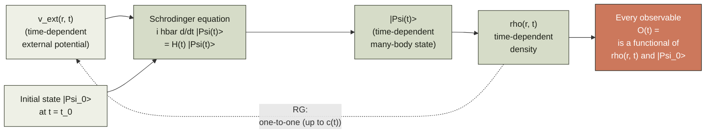
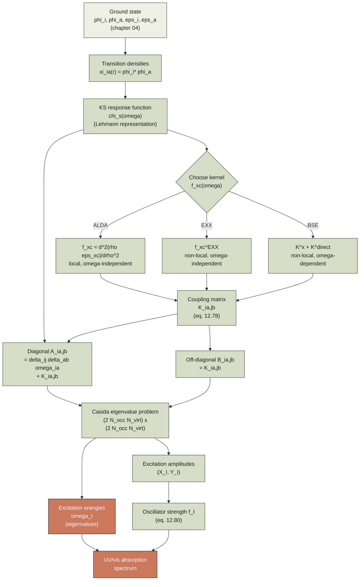
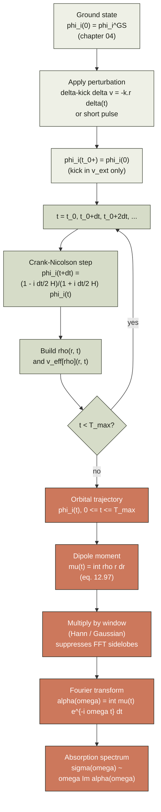
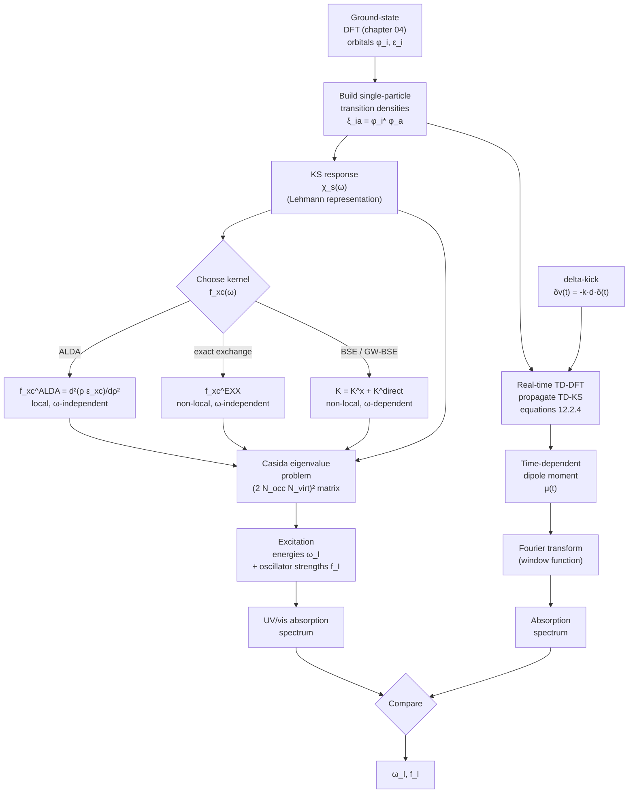
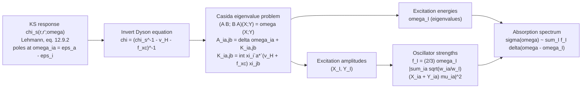
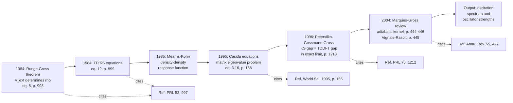

# Chapter 12 — Time-Dependent DFT

> Ground-state DFT is a *stati`c*' theory: it tells you the energy and
> the density of a system that has been sitting in one external
> potential forever. Time-dependent DFT is its *dynamical* extension:
> it tells you what happens when you shake the potential, and what
> the system absorbs when you shine light on it.

Up to [chapter 11]({{ "/dft-notes/chapter-11/" | relative_url }}) every
calculation we have done is for a system in its *time-independent*
ground state. Real chemistry, however, is dynamical. A dye molecule
absorbs a visible photon and jumps to an excited state. A solar cell
absorbs a sunbeam and produces a current. A molecule in a strong laser
pulse ionises *while* the field is still on. To handle any of these
situations we need a *time-dependent* generalisation of the
Kohn–Sham machinery of
[chapter 04]({{ "/dft-notes/chapter-04/" | relative_url }}).

That generalisation is the subject of this chapter. We will, in
order: state the **Runge–Gross theorem** that puts TD-DFT on the
same formal footing as ground-state DFT; write down the
**time-dependent Kohn–Sham equations**; discuss the practical
**time-dependent xc potential** (adiabatic LDA, exact exchange,
Bethe–Salpeter); derive **linear-response TD-DFT** and the
**Casida eigenvalue problem** for excitation energies and
oscillator strengths; introduce **real-time TD-DFT** as a
non-perturbative alternative; close with a **worked example** of
the absorption spectrum of a two-level system, the chapter's
Mermaid workflow, three graded problems, and an honest list of
omissions.

> **Reading note.** This chapter assumes chapters 01–05 and 09.
> Section 12.7 (Casida) presupposes the response-function language
> of [chapter 09]({{ "/dft-notes/chapter-09/" | relative_url }})
> at the level of knowing what a density-response function is and
> how it enters a Dyson equation.

## 12.1 The claim — Runge–Gross (1984)

The headline result of the chapter, due to Erich Runge and
Eberhard K. U. Gross (1984), is the time-dependent analogue of
Hohenberg–Kohn.

> **Runge–Gross theorem.** Fix a many-body Hamiltonian
> $\hat H(t) = \hat T + \hat W + \hat V(t)$ with the electron-
> electron interaction $\hat W$ held fixed and a one-body
> external potential $v_\text{ext}(\mathbf r, t)$ that is
> Taylor-expandable about $t = t_0$. Fix an initial
> many-body state $|\Psi_0\rangle$ at $t_0$. Then the
> mapping
> \begin{equation}
> \label{eq:ch-12-rg-map}
> v_\text{ext}(\mathbf r, t) \;\longmapsto\; \rho(\mathbf r, t)
> \end{equation> is, for a given $|\Psi_0\rangle$, one-to-one up
> to an additive purely time-dependent function
> $c(t)$.

Concretely: if two external potentials $v_\text{ext}(\mathbf r, t)$
and $v'_\text{ext}(\mathbf r, t)$ differ by more than a purely
time-dependent function $c(t)$ at the initial time $t_0$ — i.e. if
their Taylor coefficients
$\partial_t^k (v_\text{ext} - v'_\text{ext})|_{t_0}$ are not all
equal to a single constant in $\mathbf r$ for some $k$ — then the
resulting time-dependent densities $\rho(\mathbf r, t)$ and
$\rho'(\mathbf r, t)$ are different for $t > t_0$ (for short times
in a neighbourhood of $t_0$).

The proof of \eqref{eq:ch-12-rg-map} is the subject of section
12.3. For now we only need the **consequence**: every observable of
the time-evolving system, evaluated at $t > t_0$, is a functional
of $\rho(\mathbf r, t)$ and $|\Psi_0\rangle$. In particular the
external potential is, up to $c(t)$, a functional of the
time-dependent density. This is the foundation of the rest of the
chapter.

> **Tip.** The "up to $c(t)$" freedom is the time-dependent analogue
> of the "up to a constant" freedom in Hohenberg–Kohn. Adding
> $c(t)$ to $v_\text{ext}$ adds $-c(t)$ to the wavefunction's
> global phase, and leaves every gauge-invariant observable
> unchanged. The density is manifestly gauge-invariant, so the
> freedom drops out of the density-to-potential map.

### 12.1.1 Diagram — the Runge–Gross one-to-one mapping

The Runge–Gross theorem is the *foundation* of TD-DFT: it
guarantees that the time-dependent external potential
$v_\text{ext}(\mathbf r, t)$ is in one-to-one correspondence
with the time-dependent density $\rho(\mathbf r, t)$ (up to a
gauge $c(t)$), given a fixed initial state $|\Psi_0\rangle$.
The diagram below shows the *forwar`d*' map (potential → wave
function → density, the natural arrow of the Schrödinger
equation) and the *Runge–Gross* inverse (density → potential,
which is what makes TD-DFT possible).



The **solid** arrows are the forward map — the Schrödinger
equation determines the wave function from the potential, and
the density is the diagonal of the one-body density matrix. The
**dashe`d** arrow is the Runge–Gross* inverse, which says:
given the *density* $\rho(\mathbf r, t)$ and the initial state
$|\Psi_0\rangle$, the potential $v_\text{ext}(\mathbf r, t)$ is
*uniquely* determined (up to a purely time-dependent function
$c(t)$). This is the time-dependent analogue of the
Hohenberg–Kohn theorem (chapter 04) and is the foundation of
*every* practical TD-DFT calculation: it is what justifies
writing the time-dependent KS potential as a *functional* of
the time-dependent density.

## 12.2 The time-dependent Kohn–Sham equations

The Runge–Gross theorem guarantees the *existence* of a
density-to-potential map. To use it computationally we follow
Kohn and Sham's 1965 strategy (chapter 04, section 4.2) and
introduce an **auxiliary system of non-interacting electrons**
that reproduces the interacting density $\rho(\mathbf r, t)$ at
all times.

### 12.2.1 The auxiliary system

Consider a fictitious system of $N$ non-interacting electrons in
an effective time-dependent potential $v_\text{eff}(\mathbf r, t)$.
Its one-body Hamiltonian is

\begin{equation}
\label{eq:ch-12-tdks-hamiltonian}
\hat H_s(t) \;=\; -\frac{1}{2}\nabla^2 + v_\text{eff}(\mathbf r, t) ,
\end{equation}

and its wavefunction is a single time-dependent Slater determinant
$\Phi_s(t)$ built from $N$ orthonormal orbitals
$\{\phi_i(\mathbf r, t)\}$ that satisfy

\begin{equation}
\label{eq:ch-12-tdks-orbital}
i\, \frac{\partial}{\partial t}\, \phi_i(\mathbf r, t)
\;=\; \hat H_s(t)\, \phi_i(\mathbf r, t) .
\end{equation}

The auxiliary density is

\begin{equation}
\label{eq:ch-12-tdks-density}
\rho(\mathbf r, t) \;=\; 2 \sum_{i=1}^{N/2} |\phi_i(\mathbf r, t)|^2
\end{equation}

for a closed-shell (spin-paired) system, the factor of 2 again
accounting for Kramers-paired spins.

### 12.2.2 The effective potential

Equation \eqref{eq:ch-12-tdks-orbital} becomes useful when we
constrain the auxiliary density \eqref{eq:ch-12-tdks-density} to
*equal* the interacting density. The Runge–Gross theorem then
guarantees that there is a unique (up to $c(t)$) effective
potential $v_\text{eff}(\mathbf r, t)$ that does this. The standard
decomposition of $v_\text{eff}$ mirrors the static case:

\begin{equation}
\label{eq:ch-12-veff}
v_\text{eff}[\rho](\mathbf r, t)
\;=\; v_\text{ext}(\mathbf r, t)
    + v_\text{H}[\rho_t](\mathbf r, t)
    + v_\text{xc}[\rho_{\le t}](\mathbf r, t) .
\end{equation}

Three comments on \eqref{eq:ch-12-veff}:

1. **The Hartree term** $v_\text{H}[\rho_t](\mathbf r, t)$ is the
   *instantaneous* classical Coulomb potential of the density
   \begin{equation}
   \label{eq:ch-12-vh}
   v_\text{H}[\rho](\mathbf r, t)
   \;=\; \int \frac{\rho(\mathbf r', t)}{|\mathbf r - \mathbf r'|}\, d\mathbf r' .
   \end{equation}
   The subscript $\rho_t$ emphasises that the Hartree potential at
   time $t$ depends on the density at the *same* time $t$ — i.e. it
   is **instantaneous** in the time-dependent sense, even though
   physically there is a retardation built in by the fact that
   $\rho(\mathbf r, t)$ is itself a solution of the time-dependent
   problem.

2. **The xc term** $v_\text{xc}[\rho_{\le t}](\mathbf r, t)$ is in
   principle a functional of the *entire history* of the density
   $\{\rho(\mathbf r, \tau) : \tau \le t\}$ — it is
   **non-local in time**. This is a fundamental difference from
   ground-state DFT, where $v_\text{xc}$ depends on $\rho$ at one
   point in time. Memory effects are part of the exact time-
   dependent xc potential. The vast majority of practical
   calculations use the **adiabatic** approximation
   $v_\text{xc}^\text{ad}[\rho](\mathbf r, t) = v_\text{xc}^\text{gs}[\rho(t)](\mathbf r)$
   — i.e. the static xc potential evaluated on the *instantaneous*
   density — which has no memory. Section 12.4 discusses this
   approximation in detail.

3. **The KS equations are nonlinear.** The effective potential
   \eqref{eq:ch-12-veff} depends on the orbitals (through
   $\rho$), and the orbitals evolve under the effective potential.
   Unlike in linear-response theory (section 12.5) the equations
   are not linear, and closed-form solutions exist only for very
   special $v_\text{ext}$. The numerical work is to time-step
   \eqref{eq:ch-12-tdks-orbital} — see section 12.8. > **Warning.** The "adiabatic" approximation is consistent with
> the static functional only in the limit of *infinitely slow*
> time variation. For a true time-dependent problem, where
> $\rho(\mathbf r, t)$ changes on a time scale comparable to the
> internal electron dynamics, the adiabatic approximation
> introduces uncontrolled errors. We will see this in practice in
> the worked example of section 12.10. ### 12.2.3 The van Leeuwen–Baerends fixed-point formulation

The decomposition \eqref{eq:ch-12-veff} is a *definition* of
$v_\text{xc}$ as "what is left over". A complementary and very
useful reformulation is due to van Leeuwen and Baerends (1994): the
effective potential $v_\text{eff}(\mathbf r, t)$ is the **fixed
point** of an integral equation whose kernel is the inverse of the
non-interacting KS response function. We will not derive this
explicitly (it appears in many standard references) but we use the
idea in section 12.5 when we connect $v_\text{xc}$ to the
exchange–correlation kernel $f_\text{xc}$.

### 12.2.4 The time-dependent KS equations, restated

Putting it all together, the **time-dependent Kohn–Sham equations**
are the coupled system

\begin{equation}
\label{eq:ch-12-tdks-coupled}
\boxed{
\begin{aligned}
i\, \partial_t \phi_i(\mathbf r, t) &= \Bigl[-\tfrac{1}{2}\nabla^2
   + v_\text{eff}[\rho_t](\mathbf r, t) \Bigr]\, \phi_i(\mathbf r, t) , \\\
\rho(\mathbf r, t) &= 2 \sum_{i=1}^{N/2} |\phi_i(\mathbf r, t)|^2 , \\\
v_\text{eff}[\rho](\mathbf r, t) &=
   v_\text{ext}(\mathbf r, t)
 + v_\text{H}[\rho_t](\mathbf r, t)
 + v_\text{xc}[\rho_{\le t}](\mathbf r, t) .
\end{aligned}
}
\end{equation}

The first equation is a (nonlinear) one-body Schrödinger equation;
the second is the density reconstruction from the occupied
orbitals; the third defines the effective potential in terms of
the density. The system is closed: given $v_\text{ext}(\mathbf r,
t)$ and the initial state $\Phi_s(t_0)$, the equations determine
$\rho(\mathbf r, t)$ and $\phi_i(\mathbf r, t)$ for all $t > t_0$.
The only unknown is the **functional form of $v_\text{xc}$**, which
is the subject of section 12.4. ## 12.3 Derivation of the Runge–Gross theorem

This is the section where every step is written out.  The
argument follows Runge and Gross's 1984 paper; the
**action-functional** version uses the reformulation by
Ghosh and Dhara (1988) and van Leeuwen (1998). We give the
fixed-point action derivation, which is the cleanest.

### 12.3.1 The quantum-mechanical action

For a system with Hamiltonian $\hat H(t) = \hat T + \hat W +
\hat V(t)$ and a state $|\Psi(t)\rangle$ that solves the
time-dependent Schrödinger equation
$i\, \partial_t |\Psi(t)\rangle = \hat H(t) |\Psi(t)\rangle$
with initial condition $|\Psi(t_0)\rangle = |\Psi_0\rangle$, the
**quantum-mechanical action functional** is

\begin{equation}
\label{eq:ch-12-action}
\mathcal A[\Psi]
\;=\; \int_{t_0}^{t_1}
   \Bigl\langle \Psi(t) \Big|
   i\, \partial_t - \hat H(t) \Big| \Psi(t) \rangle \Bigr\rangle\, dt .
\end{equation}

The action is **stationary** ($\delta \mathcal A = 0$) at the
physical $|\Psi(t)\rangle$, with fixed endpoints
$|\Psi(t_0)\rangle = |\Psi_0\rangle$ and
$|\Psi(t_1)\rangle = |\Psi_1\rangle$. The proof is a standard
functional variation; expanding
$|\Psi\rangle \to |\Psi\rangle + \epsilon |\delta\Psi\rangle$ and
collecting terms of order $\epsilon$ gives the time-dependent
Schrödinger equation back, with the boundary-condition term
$\langle \delta\Psi(t_1) | \Psi(t_1) \rangle - \langle
\delta\Psi(t_0) | \Psi(t_0) \rangle$ vanishing because the
endpoints are fixed.

### 12.3.2 The Keldysh contour

For a system with a *time-dependent* Hamiltonian, the natural
contour for the time integral is the **Keldysh contour** $\gamma$
that runs from $t_0$ to $t_1$ on the upper branch and back from
$t_1$ to $t_0$ on the lower branch, with $t_0 \to -\infty$ and
$t_1 \to +\infty$ at the end. The reason is that the density
matrix at time $t$ — and hence the action that generates it —
involves both forward and backward propagation in time. Define

\begin{equation}
\label{eq:ch-12-keldysh-action}
\mathcal A_\gamma[\Psi]
\;=\; \int_\gamma
   \Bigl\langle \Psi(\bar t) \Big|
   i\, \partial_{\bar t} - \hat H(\bar t) \Big| \Psi(\bar t) \rangle \Bigr\rangle\, d\bar t ,
\end{equation}

where $\bar t$ parameterises the contour. The integrand on the
upper branch is the same as in \eqref{eq:ch-12-action}; on the
lower branch $\partial_{\bar t} = -\partial_t$, so the sign of
the kinetic term flips. The result is that the action
\eqref{eq:ch-12-keldysh-action} is *real* and stationary at
the physical forward–backward trajectory. The vanishing of
$\delta \mathcal A_\gamma = 0$ for variations with fixed
endpoints at $t_0$ is again equivalent to the time-dependent
Schrödinger equation on each branch.

### 12.3.3 The Runge–Gross action

The Keldysh action \eqref{eq:ch-12-keldysh-action} is a
functional of $|\Psi(t)\rangle$ and of $v_\text{ext}(\mathbf r, t)$.
The first variation with respect to the wavefunction gives the
Schrödinger equation, which we already used. The Runge–Gross
trick is to instead **eliminate** the wavefunction in favour of
the density.

To do this, write the interacting action as

\begin{equation}
\label{eq:ch-12-rg-action}
\mathcal A_\gamma[v_\text{ext}, \Psi]
\;=\; \mathcal B_\gamma[\Psi]
   - \int_\gamma \int d\mathbf r\,
       \rho_\Psi(\mathbf r, \bar t)\,
       v_\text{ext}(\mathbf r, \bar t) ,
\end{equation}

where $\mathcal B_\gamma[\Psi] = \int_\gamma d\bar t\, \langle
\Psi | i\partial_{\bar t} - \hat T - \hat W | \Psi \rangle$ is
the **universal** part (independent of $v_\text{ext}$) and the
second term is the coupling to the external potential,
$\rho_\Psi(\mathbf r, \bar t) = \langle \Psi(\bar t) |
\hat\rho(\mathbf r) | \Psi(\bar t) \rangle$ being the
time-dependent density.

Now define the **density functional**

\begin{equation}
\label{eq:ch-12-A-density-functional}
\mathcal A_\gamma[v_\text{ext}, \rho]
\;=\; \mathcal B_\gamma[\rho]
   - \int_\gamma \int d\mathbf r\,
       \rho(\mathbf r, \bar t)\,
       v_\text{ext}(\mathbf r, \bar t) ,
\end{equation}

where $\mathcal B_\gamma[\rho]$ is the **Levy–Lieb** constrained-
search functional

\begin{equation}
\label{eq:ch-12-B-rho}
\mathcal B_\gamma[\rho]
\;=\; \min_{\Psi \to \rho}
   \int_\gamma d\bar t\,
   \Bigl\langle \Psi \Big|
   i\partial_{\bar t} - \hat T - \hat W \Big| \Psi \Bigr\rangle ,
\end{equation}

with the minimum taken over all $N$-electron states
$|\Psi(\bar t)\rangle$ on the contour whose density equals
$\rho(\mathbf r, \bar t)$ for each $\bar t$ on $\gamma$. (The
constraint is the obvious time-dependent generalisation of the
Levy–Lieb functional of static DFT, [chapter 02]({{ "/dft-notes/chapter-02/" | relative_url }}),
section 2.4.) For a $v_\text{ext}$-representable density, the
minimum is attained at the physical $|\Psi(\bar t)\rangle$ and
$\mathcal B_\gamma[\rho] = \mathcal B_\gamma[\Psi]$.

### 12.3.4 The fixed-point equation for the density

Vary \eqref{eq:ch-12-A-density-functional} with respect to
$\rho(\mathbf r, \bar t)$ on the upper branch of the contour
(for $\bar t \in (t_0, t_1)$). The first variation gives

\begin{equation}
\label{eq:ch-12-fp-equation}
\frac{\delta \mathcal B_\gamma}{\delta \rho(\mathbf r, \bar t)}
\;-\; v_\text{ext}(\mathbf r, \bar t) \;=\; 0 .
\end{equation}

The functional derivative $\delta \mathcal B_\gamma / \delta
\rho$ is taken with $\rho$ held fixed on the lower branch, by
the chain rule of contour-ordered functional differentiation.
The physical density $\rho(\mathbf r, \bar t)$ is the
**unique** solution of \eqref{eq:ch-12-fp-equation} for a
given $v_\text{ext}(\mathbf r, \bar t)$ and initial state
$|\Psi_0\rangle$ — uniqueness of the forward-propagated state
under a given Hamiltonian is just unitarity of time evolution.

Now suppose two external potentials $v_\text{ext}(\mathbf r,
t)$ and $v'_\text{ext}(\mathbf r, t)$ produce the same density
$\rho(\mathbf r, t)$ on the upper branch for the same initial
state. By the same fixed-point argument applied to
$v'_\text{ext}$, the density is also a fixed point of

\begin{equation}
\label{eq:ch-12-fp-equation-prime}
\frac{\delta \mathcal B_\gamma}{\delta \rho(\mathbf r, \bar t)}
\;-\; v'_\text{ext}(\mathbf r, \bar t) \;=\; 0 .
\end{equation}

Subtracting \eqref{eq:ch-12-fp-equation} from
\eqref{eq:ch-12-fp-equation-prime},

\begin{equation}
\label{eq:ch-12-difference}
v'_\text{ext}(\mathbf r, t) - v_\text{ext}(\mathbf r, t) \;=\; 0 .
\end{equation}

This is the original Runge–Gross conclusion: **two external
potentials that give the same density must be equal as
functions of $\mathbf r$ (and not just equal up to a constant)**
— and, by the assumption of Taylor-expandability used to fix
the freedom, they differ by at most a constant $c(t)$ that is
the same at $t_0$.

### 12.3.5 The full statement

To make the proof work with the "up to $c(t)$" caveat rather
than "exactly equal", the technical argument needs the
**$v$-representability** of the density on both branches and
the **Taylor-expandability** of the potentials about $t_0$.
The latter is needed because the constraint
$|\Psi(t_0)\rangle = |\Psi_0\rangle$ fixes the initial state,
and the time-evolution operator
$\hat U(t, t_0)$ depends on the *whole* function
$v_\text{ext}(\cdot, t)$, not just on its value at $t_0$. To
show that $v'_\text{ext} - v_\text{ext} = c(t)$ requires
matching the potentials and all their time derivatives at
$t_0$, which is precisely what Taylor-expandability delivers.

The final statement of the Runge–Gross theorem is therefore:

> **Runge–Gross theorem (1984).** Let $v_\text{ext}(\mathbf r,
> t)$ and $v'_\text{ext}(\mathbf r, t)$ be two real-valued
> analytic functions of $t$ in a neighbourhood of $t_0$ for
> which the many-body problem with initial state $|\Psi_0\rangle$
> has a unique solution. Suppose that, for some $k \ge 0$,
> \begin{equation}
> \label{eq:ch-12-rg-condition}
> \left.\frac{\partial^k}{\partial t^k}
>       \big[ v'_\text{ext}(\mathbf r, t) - v_\text{ext}(\mathbf r, t) \big]
> \right|_{t=t_0} \neq \text{const in } \mathbf r .
> \end{equation}
> Then the time-dependent densities produced by the two
> potentials differ infinitesimally close to $t_0$:
> $\rho'(\mathbf r, t) \neq \rho(\mathbf r, t)$ for $t$ in some
> right-neighbourhood of $t_0$.

The "up to a constant" caveat is the $\partial^k/\partial t^k$
piece of the difference being spatially constant — when *all*
the derivatives are spatially constant, the two potentials
differ by $c(t) = v'_\text{ext}(\mathbf r, t) - v_\text{ext}(\mathbf r, t)$
and the densities are equal.

> **Note.** Runge and Gross's original 1984 paper proved the
> theorem for potentials that are analytic in time and for
> systems that are non-degenerate at $t_0$. The "up to a
> constant" caveat was made explicit by van Leeuwen (1998) in
> the action-functional reformulation we have used here. The
> 1994 paper by van Leeuwen and Baerends gives the
> fixed-point equation for $v_\text{eff}$ in terms of the
> non-interacting response, which is the practical route to
> the time-dependent KS system.

## 12.4 The time-dependent xc potential

Equation \eqref{eq:ch-12-veff} hides the only unknown in the
time-dependent KS equations: the **time-dependent xc potential**
$v_\text{xc}[\rho_{\le t}](\mathbf r, t)$. The exact
functional is unknown. Three practical approximations are
described in this section, in increasing order of accuracy and
cost.

### 12.4.1 The adiabatic LDA (ALDA)

The simplest and most-used approximation is the **adiabatic
local-density approximation** (ALDA, sometimes "ALDA" or just
"adiabatic LDA"). It evaluates the static LDA xc potential on
the *instantaneous* density:

\begin{equation}
\label{eq:ch-12-alda}
v_\text{xc}^\text{ALDA}[\rho](\mathbf r, t)
\;=\; v_\text{xc}^\text{LDA}\big[\rho(\mathbf r, t)\big](\mathbf r) .
\end{equation}

In a spin-paired, spin-unpolarised system the LDA xc potential
is the functional derivative of the LDA xc energy,
$v_\text{xc}^\text{LDA}(\mathbf r) = \partial[\rho(\mathbf r)
\varepsilon_\text{xc}(\rho(\mathbf r))]/\partial\rho(\mathbf r)$
evaluated at $\rho = \rho(\mathbf r, t)$. The adiabatic
approximation sets $v_\text{xc}$ to depend *only* on the
density at the *current* time — i.e. it is **memory-free**.

The ALDA is exact in two limits:

1. **Slowly-varying** potentials, where the density has time to
   track the perturbation and the xc kernel acts
   quasi-instantaneously.
2. **Linear response** of the homogeneous electron gas, where
   the ALDA reproduces the exact high-frequency limit of the
   xc kernel $f_\text{xc}(\mathbf q, \omega) \to f_\text{xc}^\text{ALDA}(\mathbf q)$
   as $\omega \to \infty$.

In between, the ALDA has the well-known failure that it misses
the long-range tail of the xc kernel: the derivative
discontinuity and the step structure in finite systems, the
excitonic effects that bind an electron and a hole in solids,
and the polarisation-dependence of the xc kernel in
time-dependent phenomena. We will see some of these failures
in the worked example of section 12.10. The adiabatic **GGA** (adiabatic PBE, etc.) and adiabatic
**hybrid** functionals follow the same pattern, with the static
functional plugged in at the instantaneous density. They do
not introduce any new physics beyond ALDA — they only improve
the *stati`c*' xc potential that is being evaluated adiabatically.

> **Tip.** The "adiabatic" label is a physical statement, not a
> technical one. The static LDA, GGA, or hybrid xc potential is
> a *snapshot* functional: it takes one density as input and
> returns one potential. By *adiabatically* evaluating it on
> $\rho(\mathbf r, t)$ we are saying that the xc potential at
> time $t$ depends only on the density at that same time, with
> no memory of how $\rho$ got there. This is correct only when
> the density changes slowly.

### 12.4.2 The exact-exchange (EXX) kernel

The **exact-exchange** (EXX) approximation is the
time-dependent analogue of the hybrid functionals of
[chapter 04]({{ "/dft-notes/chapter-04/" | relative_url }}) (section
4.5). At the time-dependent level, "exact exchange" means that
the xc kernel $f_\text{xc}(\mathbf r, \mathbf r', t - t')$ is
approximated by the **Fock exchange kernel** of the KS
orbitals:

\begin{equation}
\label{eq:ch-12-exx-kernel}
f_\text{x}^\text{EXX}(\mathbf r, \mathbf r', t - t')
\;=\; -\frac{1}{2} \sum_{\sigma}
   \frac{|\gamma_s(\mathbf r, \mathbf r'; t, t')|^2}
        {|\mathbf r - \mathbf r'|\, \rho(\mathbf r, t)\, \rho(\mathbf r', t')}\, \delta(t - t') .
\end{equation}

(The $\delta(t - t')$ enforces the *adiabati`c*' approximation;
EXX is, in practice, almost always used adiabatically.) The
"$\frac{1}{2}$" is the same exchange factor as in Hartree–Fock;
the sum runs over the Kramers spin pair; and
$\gamma_s(\mathbf r, \mathbf r'; t, t')$ is the one-body
density matrix of the KS Slater determinant.

The EXX kernel captures the **long-range $-\!1/r$ tail** that
ALDA misses, and the related derivative discontinuity in the
xc potential at particle-number changes. In practice EXX is
implemented by the same frequency-dependent kernel that the
Bethe–Salpeter equation uses (next subsection); a fully
time-dependent EXX code is rare.

The practical cost of EXX scales as $\mathcal O(K^4)$ in a
Gaussian basis (the same as HF exchange), making it 1–2 orders
of magnitude more expensive than ALDA but still much cheaper
than BSE.

### 12.4.3 The Bethe–Salpeter equation (BSE)

The **Bethe–Salpeter equation** (BSE) is not, strictly, a
time-dependent xc *functional*: it is a four-point equation for
the two-particle Green's function $L(1, 2; 3, 4)$ that lives at
a higher level of the many-body hierarchy. But it is the
standard *bridge* between TD-DFT and a description of two-
particle excitations (excitons), and we include it here for
completeness.

The BSE for the two-particle correlation function
$L(1, 2; 3, 4)$ is

\begin{equation}
\label{eq:ch-12-bse}
L(1, 2; 3, 4)
\;=\; L_0(1, 2; 3, 4)
   + \int d5\, d6\, d7\, d8\,
   L_0(1, 5; 3, 7)\,
   K(5, 6; 7, 8)\,
   L(8, 6; 2, 4) ,
\end{equation}

where $L_0$ is the non-interacting two-particle propagator
(built from the KS orbitals and quasiparticle energies), and
$K$ is the **Bethe–Salpeter kernel**. In the standard
approximation $K = K^x + K^\text{direct}$ where
$K^x = -W$ is the **exchange** kernel (a statically screened
Coulomb interaction $W$) and $K^\text{direct} = -\bar v$ is
the **direct** (unscreened) Coulomb interaction.

The BSE captures the **electron–hole interaction** that binds
an exciton in a semiconductor. Standard ALDA TD-DFT misses
this entirely because the ALDA xc kernel is short-ranged; BSE
recovers it because the BSE kernel contains the long-range
Coulomb interaction. The price is that the BSE is an
$\mathcal O(N^6)$ eigenvalue problem in a basis of single-
particle transitions (or $\mathcal O(N^4)$ in storage for the
matrix), where $N$ is the number of KS states. We do not
derive the BSE here — the standard references are
Strinati (1988), Rohlfing and Louie (2000), and the
review by Onida, Reining, and Rubio (2002).

> **Note.** The hierarchy of TD-DFT, BSE, and the GW approximation
> (a related many-body method) is intricate. ALDA TD-DFT is a
> long-wave-approximation limit of BSE. EXX TD-DFT is the
> adiabatic limit of BSE with $K = K^x$ (the exchange kernel
> only, no direct term). Full BSE with the screened-Coulomb
> kernel is the most accurate and the most expensive of the
> three. We summarise the relationships in section 12.11. ## 12.5 Linear-response TD-DFT (TD-DFRT)

The exact time-dependent KS equations are nonlinear. The
**linear-response** regime — the response to a *wea`k*'
perturbation — is far more tractable and is the workhorse of
practical TD-DFT for excitation spectra.

### 12.5.1 The density-density response function

For a system in its ground state $|\Psi_0\rangle$, the response
of the density to a weak external perturbation
$\delta v_\text{ext}(\mathbf r, t)$ is described by the
**density-density response function** $\chi$:

\begin{equation}
\label{eq:ch-12-chi-def}
\delta\rho(\mathbf r, t) \;=\;
\int dt' \int d\mathbf r'\,
   \chi(\mathbf r, t; \mathbf r', t')\,
   \delta v_\text{ext}(\mathbf r', t') .
\end{equation}

In a time-translation-invariant system the response depends
only on $t - t'$, and the Fourier transform with respect to
$\tau = t - t'$ gives the **frequency-dependent** response
function $\chi(\mathbf r, \mathbf r'; \omega)$:

\begin{equation}
\label{eq:ch-12-chi-fourier}
\delta\rho(\mathbf r, \omega) \;=\;
\int d\mathbf r'\,
   \chi(\mathbf r, \mathbf r'; \omega)\,
   \delta v_\text{ext}(\mathbf r', \omega) .
\end{equation}

The poles of $\chi(\mathbf r, \mathbf r'; \omega)$ as a
function of $\omega$ give the **neutral excitation energies**
of the interacting system. The residues at the poles give the
**oscillator strengths** — the same quantities that enter
Fermi's golden rule for photon absorption. This is the
content of section 12.6. ### 12.5.2 The KS response function

The non-interacting KS system has its own response function,
$\chi_s$, which describes how the KS density responds to a
weak perturbation of the KS effective potential:

\begin{equation}
\label{eq:ch-12-chi-s-def}
\delta\rho_s(\mathbf r, \omega) \;=\;
\int d\mathbf r'\,
   \chi_s(\mathbf r, \mathbf r'; \omega)\,
   \delta v_\text{eff}(\mathbf r', \omega) .
\end{equation}

In a basis of KS orbitals the KS response function is
**independent** of the time-dependent xc potential; it depends
only on the KS orbitals and eigenvalues. Its Lehmann
representation is

\begin{equation}
\label{eq:ch-12-chi-s-lehmann}
\chi_s(\mathbf r, \mathbf r'; \omega) \;=\;
2 \sum_{i}^\text{occ} \sum_{a}^\text{virt}
   \frac{\phi_i^*(\mathbf r)\, \phi_a(\mathbf r)\,
         \phi_a^*(\mathbf r')\, \phi_i(\mathbf r')}
        {\omega - (\varepsilon_a - \varepsilon_i) + i\eta}
   \;-\; \text{c.c.}(\omega \to -\omega) .
\end{equation}

The "2" is again the Kramers spin-pairing factor; the sum is
over occupied ($i$) and virtual ($a$) KS orbitals; and the
"c.c." term subtracts the same expression with $\omega$ sent
to $-\omega$ to enforce the proper-particle / hole
asymmetry. The infinitesimal $i\eta$ with $\eta \to 0^+$ picks
out the retarded response function.

The poles of $\chi_s$ sit at the **KS single-particle
excitation energies** $\varepsilon_a - \varepsilon_i$ —
*not* at the true many-body excitation energies. The whole
point of the Dyson equation (next subsection) is to dress
$\chi_s$ with the electron–electron interaction and shift the
poles to the correct many-body positions.

### 12.5.3 The Dyson equation

The full interacting response function $\chi$ is connected to
the KS response $\chi_s$ by the **Dyson equation**

\begin{equation}
\label{eq:ch-12-dyson}
\boxed{
\chi(\mathbf r, \mathbf r'; \omega) \;=\;
\chi_s(\mathbf r, \mathbf r'; \omega)
   + \int d\mathbf r''\, d\mathbf r'''\,
   \chi_s(\mathbf r, \mathbf r''; \omega)\,
   \Bigl[ v_\text{H}(\mathbf r'', \mathbf r''')
        + f_\text{xc}(\mathbf r'', \mathbf r''', \omega) \Bigr]\,
   \chi(\mathbf r''', \mathbf r'; \omega) .
}
\end{equation}

The kernel is the sum of the **Hartree kernel**
$v_\text{H}(\mathbf r, \mathbf r') = 1/|\mathbf r - \mathbf r'|$
and the **exchange–correlation kernel**

\begin{equation}
\label{eq:ch-12-fxc}
f_\text{xc}(\mathbf r, \mathbf r', \omega) \;=\;
\frac{\delta v_\text{xc}(\mathbf r, \omega)}
     {\delta \rho(\mathbf r', \omega)} ,
\end{equation}

which is the *functional derivative* of the time-dependent
xc potential with respect to the density, evaluated on the
frequency-diagonal piece of the response. The frequency
dependence of $f_\text{xc}$ is the memory effect: the xc
potential at frequency $\omega$ depends on the density at
all frequencies via $f_\text{xc}(\omega)$, and the Dyson
equation couples these through $\chi_s$ (which already
contains the orbital energy denominators).

**Derivation of the Dyson equation.**  The KS density must
equal the interacting density: $\delta\rho = \delta\rho_s$.
The perturbation that the *electrons* actually feel, however,
is not the bare $\delta v_\text{ext}$ but the *self-consistent*
$\delta v_\text{eff}$:

\begin{equation}
\label{eq:ch-12-veff-response}
\delta v_\text{eff}(\mathbf r, \omega)
\;=\; \delta v_\text{ext}(\mathbf r, \omega)
   + \int d\mathbf r'\,
       v_\text{H}(\mathbf r, \mathbf r')\,
       \delta\rho(\mathbf r', \omega)
   + \int d\mathbf r'\,
       f_\text{xc}(\mathbf r, \mathbf r'; \omega)\,
       \delta\rho(\mathbf r', \omega) .
\end{equation}

Substitute into \eqref{eq:ch-12-chi-s-def} and use
$\delta\rho = \delta\rho_s$:

\begin{align}
\delta\rho(\mathbf r, \omega)
&= \int d\mathbf r'\,
     \chi_s(\mathbf r, \mathbf r'; \omega)\,
     \Bigl[ \delta v_\text{ext}(\mathbf r', \omega)
           + \int d\mathbf r''\,
              v_H(\mathbf r', \mathbf r'')\,
              \delta\rho(\mathbf r'', \omega)
           + \int d\mathbf r''\,
              f_\text{xc}(\mathbf r', \mathbf r''; \omega)\,
              \delta\rho(\mathbf r'', \omega) \Bigr] .
\end{align}

Use \eqref{eq:ch-12-chi-fourier} to replace
$\delta v_\text{ext}$ with $\delta\rho$ on the right-hand
side, and rearrange:

\begin{align}
\delta\rho(\mathbf r, \omega)
&= \int d\mathbf r'\,
     \chi_s(\mathbf r, \mathbf r'; \omega)\,
     \delta v_\text{ext}(\mathbf r', \omega) \\\
&\quad + \int d\mathbf r'\, d\mathbf r''\,
     \chi_s(\mathbf r, \mathbf r'; \omega)\,
     \Bigl[ v_H(\mathbf r', \mathbf r'')
          + f_\text{xc}(\mathbf r', \mathbf r''; \omega) \Bigr]\,
     \delta\rho(\mathbf r'', \omega) .
\end{align}

Identifying the first term on the right-hand side as
$\int \chi_s\, \delta v_\text{ext}$ and the rest as the
integral operator applied to $\delta\rho$, we recognise the
linear integral equation for $\chi$, with $\delta v_\text{ext}$
as the inhomogeneous source. Reading off the kernel of the
equation gives \eqref{eq:ch-12-dyson}.

> **Note.** The Dyson equation \eqref{eq:ch-12-dyson} is the
> time-dependent analogue of the static Dyson equation
> $G = G_0 + G_0 \Sigma G$ of many-body theory. In the
> language of the previous chapter, $\chi$ plays the role of
> the full Green's function $G$, $\chi_s$ the role of $G_0$,
> and $v_H + f_\text{xc}$ the role of the self-energy
> $\Sigma$. The KS orbitals take the place of the
> mean-field orbitals of the Hartree–Fock starting point.

### 12.5.4 The two-particle-like structure

Although \eqref{eq:ch-12-dyson} is a two-point function
equation, it has a **four-index matrix** structure when
discretised. In a basis of $K$ spatial functions,
$\chi(\mathbf r, \mathbf r'; \omega)$ becomes a $K \times K$
matrix $\chi(\omega)$, and the integral
$\int d\mathbf r''\, d\mathbf r'''$ becomes matrix
multiplication:

\begin{equation}
\label{eq:ch-12-dyson-matrix}
\boldsymbol\chi(\omega) \;=\;
\boldsymbol\chi_s(\omega)
   + \boldsymbol\chi_s(\omega)\,
     \Bigl[ \mathbf v_H + \mathbf f_\text{xc}(\omega) \Bigr]\,
     \boldsymbol\chi(\omega) .
\end{equation}

This is a $K \times K$ matrix equation for the $K \times K$
matrix $\boldsymbol\chi(\omega)$. Solving it for $\boldsymbol\chi$
at each frequency — or, more efficiently, finding its poles
and residues — is the practical work of linear-response
TD-DFT.

## 12.6 Excitations

The poles of the response function $\chi(\mathbf r, \mathbf r';
\omega)$ are the **neutral excitation energies** of the system.
To see this, write the Dyson equation \eqref{eq:ch-12-dyson-matrix}
in operator form as

\begin{equation}
\label{eq:ch-12-chi-resolvent}
\boldsymbol\chi(\omega) \;=\;
\Bigl[ \mathbf 1 - \boldsymbol\chi_s(\omega)\,
     \Bigl( \mathbf v_H + \mathbf f_\text{xc}(\omega) \Bigr)
\Bigr]^{-1}\, \boldsymbol\chi_s(\omega) .
\end{equation}

The poles of $\boldsymbol\chi(\omega)$ are the frequencies
$\omega_I$ at which the bracketed matrix is singular, i.e. at
which

\begin{equation}
\label{eq:ch-12-pole-equation}
\det\Bigl[ \mathbf 1 - \boldsymbol\chi_s(\omega_I)\,
                \Bigl( \mathbf v_H + \mathbf f_\text{xc}(\omega_I) \Bigr)
       \Bigr] \;=\; 0 .
\end{equation}

At such a frequency the response is *infinite* for a finite
perturbation — i.e. a *resonance* of the system. The
$\omega_I$ for which the response blows up are the **excitation
energies**.

### 12.6.1 Oscillator strengths

The **oscillator strength** $f_I$ of an excitation at energy
$\omega_I$ is the residue of $\boldsymbol\chi$ at the pole
$\omega = \omega_I$. It measures the strength of the
excitation's coupling to a uniform electric field (in the
dipole approximation) and is directly comparable to
experimental absorption cross-sections via the relation

\begin{equation}
\label{eq:ch-12-oscillator-strength}
\sigma(\omega) \;=\; \frac{2\pi^2}{c} \sum_I f_I\, \delta(\omega - \omega_I) ,
\end{equation}

where $\sigma(\omega)$ is the cross-section for absorption of
a photon of energy $\omega$.

For a closed-shell, dipole-allowed excitation the oscillator
strength in the dipole-length gauge is

\begin{equation}
\label{eq:ch-12-fI}
f_I \;=\; \frac{2\, m\, \omega_I}{3\hbar}\,
   \sum_{\alpha = x, y, z}
   \Bigl| \langle \Psi_I | \hat r_\alpha | \Psi_0 \rangle \Bigr|^2 ,
\end{equation}

with $\Psi_0$ the ground state, $\Psi_I$ the excited state, and
$\hat r_\alpha$ the dipole operator in the $\alpha$ direction.
The factor 2 in front is the standard convention in the
*length*' gauge; the velocity gauge uses
$|\langle \Psi_I | \hat p_\alpha | \Psi_0 \rangle|^2$ instead.

> **Tip.** The oscillator strength is dimensionless. The
> "Thomas–Reiche–Kuhn sum rule" (problem 1) says that the sum
> of all oscillator strengths of a one-electron system is
> exactly 1. For a many-electron system the sum is $N$, the
> number of electrons. The sum rule is the most important
> sanity check on any computed spectrum.

## 12.7 The Casida formulation

The most widely-used form of the linear-response TD-DFT
eigenvalue problem is due to **Mark Casida** (1995, 1996). It
reduces the search for the poles of $\chi$ to a single
generalised matrix eigenvalue equation of dimension
$N_\text{trans} = N_\text{occ}\, N_\text{virt}$, where
$N_\text{occ}$ and $N_\text{virt}$ are the number of occupied
and virtual KS orbitals.

### 12.7.1 The Casida matrix

The Casida formulation works in the space of single-particle
excitations $|i \to a\rangle$ (one occupied orbital $i$, one
virtual orbital $a$). In this basis the Dyson equation
\eqref{eq:ch-12-dyson} reduces to a matrix equation.

The derivation below is the original Casida (1995) form (Casida,
"Time-dependent density functional response theory for molecules",
in *Recent Advances in Density Functional Methods*, ed. D. P.
Chong, World Scientific, 1995, pp. 155-192; equation numbers
below are from the printed proceedings, pp. 165-168), with the
modern $X$/$Y$ matrix form that Petersilka, Gossmann & Gross
(PRL **76**, 1212, 1996, Eqs. (8)-(9)) re-derived in a slightly
different way.

**Step 1 — the single-particle transition density.** Define

\begin{equation}
\label{eq:ch-12-transition-density}
\xi_{ia}(\mathbf r) \;=\; \phi_i^*(\mathbf r)\, \phi_a(\mathbf r) ,
\end{equation}

the product of an occupied and a virtual KS orbital. The set
$\{\xi_{ia}\}$ for all pairs $(i, a)$ is the basis in which the
Casida matrix is written. The number of basis functions is
$N_\text{trans} = N_\text{occ}\, N_\text{virt}$ (typically
$10^3$ to $10^7$ for a molecule or solid; the eigenvalue problem
is the bottleneck of linear-response TDDFT).

**Step 2 — the KS response in the transition basis.** The KS
response function \eqref{eq:ch-12-chi-s-lehmann} in this basis is
diagonal (this is the *defining* property of the KS response
function — the KS system has no coupling between different
particle–hole pairs):

\begin{equation}
\label{eq:ch-12-chi-s-lehmann-basis}
\chi_s(\mathbf r, \mathbf r'; \omega) \;=\;
2 \sum_{ia} \xi_{ia}(\mathbf r)\,
       \Bigl[ (\omega - \omega_{ia} + i\eta)^{-1}
            - (\omega + \omega_{ia} - i\eta)^{-1} \Bigr]\,
       \xi_{ia}^*(\mathbf r') ,
\end{equation}

with $\omega_{ia} = \varepsilon_a - \varepsilon_i > 0$ the
KS excitation energy of the transition $i \to a$. The factor 2
is the spin sum (closed shell; for an open-shell system it is
replaced by a $2 \times 2$ spin structure). The $i\eta$ is the
standard Feynman prescription that places the poles in the
lower half of the complex $\omega$ plane (so that the response
is causal).

**Step 3 — the density ansatz in the transition basis.** At a
pole of $\chi$ (i.e. at an excitation energy $\omega = \omega_I$),
the first-order density response has a *resonant* (positive
$\omega$) and an *anti-resonant* (negative $\omega$) component.
Write it as

\begin{equation}
\label{eq:ch-12-rho-ansatz}
\delta\rho(\mathbf r, \omega_I) \;=\; 2 \sum_{ia}
    \Bigl[ X_{ia}\, \xi_{ia}(\mathbf r)
          + Y_{ia}\, \xi_{ia}(\mathbf r) \Bigr] ,
\end{equation}

where $X_{ia}$ and $Y_{ia}$ are the *resonant* and anti-resonant
amplitudes of the $ia$ transition in the eigenstate $I$.
Both are real in the spin-summed, time-reversal-symmetric
case. The factor 2 is again the spin sum.

**Step 4 — the self-consistent effective perturbation.** The
effective potential that drives the KS response is the sum of
the external perturbation and the induced Hartree–xc perturbation
\eqref{eq:ch-12-f-Hxc}:

\begin{equation}
\label{eq:ch-12-v-eff}
\delta v_\text{eff}(\mathbf r, \omega) \;=\;
   \delta v_\text{ext}(\mathbf r, \omega) + \int\! d\mathbf r'\,
        f_\text{Hxc}(\mathbf r, \mathbf r')\,
        \delta\rho(\mathbf r', \omega) .
\end{equation}

At the *pole* of $\chi$, the response diverges for a finite
$\delta v_\text{ext}$, so we drop the source and look for a
self-sustaining $\delta v_\text{eff}$:

\begin{equation}
\label{eq:ch-12-v-eff-pole}
\delta v_\text{eff}(\mathbf r, \omega_I) \;=\;
   \int\! d\mathbf r'\,
        f_\text{Hxc}(\mathbf r, \mathbf r')\,
        \delta\rho(\mathbf r', \omega_I) .
\end{equation}

Project onto the transition basis $\xi_{ia}^*(\mathbf r)$ and
integrate over $\mathbf r$:

\begin{equation}
\label{eq:ch-12-v-eff-ia}
[\delta v_\text{eff}]_{ia} \;=\;
   \sum_{jb} K_{ia, jb}\, 2\,(X_{jb} + Y_{jb}) ,
\end{equation}

where the **coupling matrix** $\mathbf K$ is

\begin{equation}
\label{eq:ch-12-casida-K}
K_{ia, jb} \;=\;
\iint d\mathbf r\, d\mathbf r'\,
   \xi_{ia}^*(\mathbf r)\,
   \Bigl[ v_H(\mathbf r, \mathbf r') + f_\text{xc}(\mathbf r, \mathbf r') \Bigr]\,
   \xi_{jb}(\mathbf r') .
\end{equation}

The factor of 2 in \eqref{eq:ch-12-v-eff-ia} comes from the
spin sum in the density ansatz \eqref{eq:ch-12-rho-ansatz}.

**Step 5 — the KS response in the transition basis.** The KS
response is *linear* in $\delta v_\text{eff}$ and diagonal in
the transition basis:

\begin{equation}
\label{eq:ch-12-rho-from-vs}
\delta\rho(\mathbf r, \omega) \;=\; \int\! d\mathbf r'\,
    \chi_s(\mathbf r, \mathbf r'; \omega)\,
    \delta v_\text{eff}(\mathbf r', \omega) .
\end{equation}

Substituting the Lehmann form \eqref{eq:ch-12-chi-s-lehmann-basis}
for $\chi_s$ and projecting onto $\xi_{ia}^*(\mathbf r)$ gives

\begin{equation}
\label{eq:ch-12-rho-ia}
2\,(X_{ia} + Y_{ia}) \;=\;
   2\,\Bigl[ g_{ia}(\omega_I) + g_{ia}(-\omega_I) \Bigr]\,
   [\delta v_\text{eff}]_{ia} ,
\end{equation}

where we have defined the *single-particle propagator*

\begin{equation}
\label{eq:ch-12-g-ia}
g_{ia}(\omega) \;=\; \frac{1}{\omega - \omega_{ia} + i\eta} ,
\end{equation}

whose value at $\omega = \omega_I$ is the relevant object
because $\omega_I$ is the (unknown) pole frequency. Note that
$g_{ia}(-\omega_I) = 1/(-\omega_I - \omega_{ia})$ is small and
regular; only $g_{ia}(\omega_I)$ carries the pole structure.

**Step 6 — separating the resonant and anti-resonant parts.**
Equation \eqref{eq:ch-12-rho-ia} couples $X_{ia}$ and $Y_{ia}$
together. We *separate* them by multiplying the equation by
$g_{ia}(\omega_I)$ and $g_{ia}(-\omega_I)$ separately and using
the identities $g_{ia}(\omega_I) \cdot (\omega_I - \omega_{ia}) = 1$
and $g_{ia}(-\omega_I) \cdot (-\omega_I - \omega_{ia}) = 1$.

For the *resonant* part: multiply the resonant piece of
\eqref{eq:ch-12-rho-ia} (the piece proportional to $g_{ia}(\omega_I)$)
by $(\omega_I - \omega_{ia})$:

\begin{equation}
\label{eq:ch-12-X-equation}
X_{ia} \;=\; g_{ia}(\omega_I)\, [\delta v_\text{eff}]_{ia} ,
\end{equation}

which gives

\begin{equation}
\label{eq:ch-12-X-equation-2}
(\omega_I - \omega_{ia})\, X_{ia} \;=\; [\delta v_\text{eff}]_{ia} .
\end{equation}

Substituting \eqref{eq:ch-12-v-eff-ia} for $[\delta v_\text{eff}]_{ia}$:

\begin{equation}
\label{eq:ch-12-X-equation-3}
\omega_I\, X_{ia} \;=\; \omega_{ia}\, X_{ia}
    + 2 \sum_{jb} K_{ia, jb}\, (X_{jb} + Y_{jb}) .
\end{equation}

For the *anti-resonant* part: multiply the anti-resonant piece
of \eqref{eq:ch-12-rho-ia} (the piece proportional to
$g_{ia}(-\omega_I)$) by $(-\omega_I - \omega_{ia})$:

\begin{equation}
\label{eq:ch-12-Y-equation}
(-\omega_I - \omega_{ia})\, Y_{ia} \;=\; [\delta v_\text{eff}]_{ia} .
\end{equation}

(The resonant part contributes nothing because $g_{ia}(\omega_I)$
is small compared to $g_{ia}(-\omega_I)$ near the negative
frequency pole.) Substituting \eqref{eq:ch-12-v-eff-ia}:

\begin{equation}
\label{eq:ch-12-Y-equation-2}
-\omega_I\, Y_{ia} \;=\; \omega_{ia}\, Y_{ia}
    + 2 \sum_{jb} K_{ia, jb}\, (X_{jb} + Y_{jb}) .
\end{equation}

(After multiplying out the sign in $(-\omega_I - \omega_{ia}) = -(\omega_I + \omega_{ia})$.)

**Step 7 — the Casida equation in modern form.** Equations
\eqref{eq:ch-12-X-equation-3} and \eqref{eq:ch-12-Y-equation-2}
form a $2N_\text{trans}$-dimensional matrix eigenvalue
problem. Writing it in block-matrix form with the diagonal
of the matrix $\mathbf A$ given by the bare excitation
energies $\omega_{ia}$ and the off-diagonal coupling
given by $\mathbf K$:

\begin{equation}
\label{eq:ch-12-casida}
\boxed{
\begin{pmatrix}
  \mathbf A & \mathbf B \\\
  \mathbf B & \mathbf A
\end{pmatrix}
\begin{pmatrix} \mathbf X \\\\ \mathbf Y \end{pmatrix}
\;=\; \omega_I\,
\begin{pmatrix}
  \mathbf 1 & \mathbf 0 \\\
  \mathbf 0 & -\mathbf 1
\end{pmatrix}
\begin{pmatrix} \mathbf X \\\\ \mathbf Y \end{pmatrix} .
}
\end{equation}

The two blocks $\mathbf A$ and $\mathbf B$ are

\begin{equation}
\label{eq:ch-12-casida-A}
A_{ia, jb} \;=\; \delta_{ij}\, \delta_{ab}\, \omega_{ia}
                + K_{ia, jb} ,
\end{equation}

\begin{equation}
\label{eq:ch-12-casida-B}
B_{ia, jb} \;=\; K_{ia, jb} ,
\end{equation}

i.e. the diagonal is the bare KS excitation energy and the
off-diagonal is the same coupling matrix in both blocks. The
identity matrix $\mathbf 1$ and the minus sign on the lower
right come from the *opposite* sign of the pole in the
anti-resonant equation \eqref{eq:ch-12-Y-equation-2}.

**Step 8 — the $\omega^2$ form (Casida 1995, original).** A
common alternative form is obtained by adding and subtracting
the two halves of the eigenvalue problem. Let
$\mathbf F \equiv \mathbf X + \mathbf Y$ and
$\mathbf G \equiv \mathbf X - \mathbf Y$. Adding and
subtracting the two halves of \eqref{eq:ch-12-casida} gives

\begin{equation}
(\mathbf A + \mathbf B)\, \mathbf F = \omega_I\, \mathbf G , \tag{12.7.a}
\end{equation}
\begin{equation}
(\mathbf A - \mathbf B)\, \mathbf G = \omega_I\, \mathbf F . \tag{12.7.b}
\end{equation}

With $\mathbf A - \mathbf B = \mathrm{diag}(\omega_{ia})$
(the coupling cancels because both $\mathbf A$ and $\mathbf B$
have the same off-diagonal $\mathbf K$) and
$\mathbf A + \mathbf B = \mathrm{diag}(\omega_{ia}) + 2\mathbf K$,
equation \eqref{eq:ch-12-b} gives
$\mathbf G = \omega_I^{-1}\, \mathrm{diag}(\omega_{ia})\, \mathbf F$
componentwise, i.e. $G_{ia} = \omega_{ia}\, F_{ia} / \omega_I$.
Substituting into \eqref{eq:ch-12-a}:

\begin{equation}
\label{eq:ch-12-casida-omega2}
\boxed{
\Bigl[ \mathrm{diag}(\omega_{ia}) + 2\, \mathbf K \Bigr]\,
       \mathrm{diag}(\omega_{ia})\,
       \mathbf F
   \;=\; \omega_I^2\, \mathbf F ,
}
\end{equation}

or, in components,

\begin{equation}
\label{eq:ch-12-casida-omega2-comp}
\sum_{jb} \Bigl[ \delta_{ij}\delta_{ab}\, \omega_{ia}
                + 2\, K_{ia, jb} \Bigr]\,
       \omega_{jb}\, F_{jb}
   \;=\; \omega_I^2\, F_{ia} .
\end{equation}

This is the **Casida equation in the symmetric form** (Casida
1995, Eq. (3.16), p. 168). The matrix on the left,
$\Omega_{ia, jb} = \delta_{ij}\delta_{ab}\, \omega_{ia}^2 + 2
\sqrt{\omega_{ia} \omega_{jb}}\, K_{ia, jb}$ (after the
rescaling $F_{ia} \to F_{ia}/\sqrt{\omega_{ia}}$), is
real-symmetric for closed-shell systems, so the eigenvalues
$\omega_I^2$ are real and non-negative. The square-root
rescaling symmetrises the equation and is the standard
presentation; the original form \eqref{eq:ch-12-casida-omega2-comp}
is the form actually derived above.

In the **Tamm–Dancoff approximation** (TDA, equivalent to
neglecting the $\mathbf B$ block, i.e. setting $Y_{ia} = 0$),
the equation reduces to the simpler eigenvalue problem

\begin{equation}
\label{eq:ch-12-casida-TDA}
\mathbf A \mathbf X \;=\; \omega_I\, \mathbf X ,
\end{equation}

i.e. $\omega_I X_{ia} = \omega_{ia} X_{ia} + 2 \sum_{jb} K_{ia, jb} X_{jb}$.
The TDA is exact for *single* excitations in the limit of
no coupling between particle–hole pairs (i.e. $\mathbf K = 0$)
and is a good approximation for *single excitations* in
general; it underestimates the oscillator strength of
*double* excitations (which require the $\mathbf Y$ block to
be present).

### 12.7.2 The oscillator strength from the Casida eigenvectors

The dipole oscillator strength of excitation $I$ is

\begin{equation}
\label{eq:ch-12-casida-f}
f_I \;=\; \frac{2}{3} \sum_{\alpha = x, y, z}
   \Bigl| \sum_{ia} \sqrt{\frac{\omega_{ia}}{\omega_I}}\,
        (X_{ia} + Y_{ia})\,
        \langle \phi_a | \hat r_\alpha | \phi_i \rangle \Bigr|^2 .
\end{equation}

The sum runs over all single-particle transitions, weighted
by the eigenvectors $(\mathbf X, \mathbf Y)$ of the
$I$-th eigenvalue of \eqref{eq:ch-12-casida}. The factor
$\sqrt{\omega_{ia}/\omega_I}$ is the standard velocity-gauge
rescaling.

### 12.7.3 The form of the coupling matrix

The kernel in \eqref{eq:ch-12-casida-K} separates into a
**Coulomb** part (the Hartree kernel $v_H$) and an
**xc** part (the kernel $f_\text{xc}$). The Coulomb part
drives the **de-excitation** direction in the Casida matrix
(it appears with a $-$ sign in the full equation, but is
absorbed in the structure of $\mathbf A$, $\mathbf B$); the
xc part is what shifts the KS excitation energies to the
true many-body ones.

In the **ALDA** $f_\text{xc}^\text{ALDA}(\mathbf r) =
d^2[\rho \varepsilon_\text{xc}(\rho)]/d\rho^2$, a
*purely local* kernel. The coupling matrix in this case is
often written in terms of spin densities and the spin-
unpolarised or spin-polarised HEG response. The ALDA is
**frequency-independent** — the kernel $f_\text{xc}$ is a
function of $\mathbf r$ only, not of $\omega$. The BSE kernel
is frequency-dependent (it is built from the dynamically
screened Coulomb interaction $W(\omega)$); the EXX kernel
is non-local in $\mathbf r$ but frequency-independent.

> **Note.** The dimension of the Casida matrix is
> $2\, N_\text{occ}\, N_\text{virt}$. For a small molecule
> with $N_\text{occ} = 5$ and $N_\text{virt} = 50$ this is
> a $500 \times 500$ matrix — easily diagonalised. For a
> solid with $N_\text{occ} = 20$ and $N_\text{virt} = 1000$
> it is $40{,}000 \times 40{,}000$, which demands
> iterative eigensolvers. The Casida equation is the
> practical backbone of production TD-DFT codes (Q-Chem,
> TURBOMOLE, ORCA, NWChem).

### 12.7.4 Diagram — the Casida construction pipeline

The Casida equation is the practical realisation of
linear-response TD-DFT for *excitation spectr`a*`. The pipeline
runs from a *ground-state* calculation (which provides the KS
orbitals and energies) through the *KS response function*
$\chi_s$, the *coupling matrix* $\mathbf K$ (which contains the
electron–electron interaction through the kernel $f_\text{xc}$),
and finally a *matrix eigenvalue problem* whose eigenvalues are
the excitation energies $\omega_I$ and whose eigenvectors
$(\mathbf X, \mathbf Y)$ are the *excitation amplitudes*.



The **three vertical branches** of the diagram converge on the
'EIG' box. 'A' (top branch) provides the *diagonal* of the
Casida matrix — it contains the KS excitation energies
$\omega_{ia}$ and is the part that survives the *Tamm–Dancof`f*'
approximation (TDA, where 'B' is neglected). 'K' (middle
branch) is the *coupling matrix*, computed from the chosen
xc kernel; it is the *only* branch where the kernel choice
matters. `B`' (bottom branch) is the *de-excitation* amplitude
coupling; it is the same matrix as `K`' but appears in the
off-diagonal block of the Casida equation. The single matrix
diagonalisation in `EIG`' produces *all* excitation energies and
amplitudes at once; the spectrum is then constructed by
assigning each $\omega_I$ an oscillator strength $f_I$ from the
corresponding eigenvector $(\mathbf X_I, \mathbf Y_I)$.

## 12.8 Real-time TD-DFT

The Casida equation gives the *linear* response. For strong
fields, non-perturbative dynamics, or systems driven far from
equilibrium, the standard alternative is to **time-propagate**
the time-dependent KS equations \eqref{eq:ch-12-tdks-orbital}
directly.

### 12.8.1 The time-propagation algorithm

The simplest integrator for \eqref{eq:ch-12-tdks-orbital} is
the **Crank–Nicolson** (CN) propagator. For the linear part
of the Hamiltonian the CN step is unitary, *symplecti`c*`, and
second-order accurate in the time step $\Delta t$. The
nonlinear part of the Hamiltonian (the self-consistent
update of $v_\text{eff}$) is handled by a predictor-
corrector or by an *extrapolation* of $v_\text{eff}$ to the
mid-point of the time step.

The CN update of the orbital $\phi_i$ from $t_n$ to
$t_{n+1} = t_n + \Delta t$ is

\begin{equation}
\label{eq:ch-12-cn}
\phi_i(t_{n+1}) \;=\;
\frac{\mathbf 1 - i\, \tfrac{\Delta t}{2}\, \hat H_s(t_{n+1/2})}
     {\mathbf 1 + i\, \tfrac{\Delta t}{2}\, \hat H_s(t_{n+1/2})}\,
\phi_i(t_n) .
\end{equation}

The fraction on the right is the Cayley transform of the
time-evolution operator $\exp(-i \hat H_s \Delta t)$ and is
**unitary** by construction. In a finite basis
$\{\chi_\mu\}_{\mu=1}^K$ the operator
$(\mathbf 1 + i\, \tfrac{\Delta t}{2}\, \mathbf H_s)$ is a
$K \times K$ matrix, and \eqref{eq:ch-12-cn} is a linear
solve per orbital per time step. The cost is dominated by
the $\mathcal O(K^2)$ effort to build the density and the
$\mathcal O(K^2)$ for the matrix-solve — total cost
$\mathcal O(N_\text{steps}\, K^2)$ per orbital.

The time step is bounded by the **highest KS orbital energy**
included in the propagation. For a typical GGA calculation
with a plane-wave cutoff $E_\text{cut} = 30\,E_h$, the
smallest time step for stable CN propagation is
$\Delta t \lesssim 0.05\,E_h^{-1} \approx 1.2 \times 10^{-3}\,\text{fs}$.
A typical UV/vis absorption spectrum requires $T \sim 30\,E_h^{-1}
\approx 0.7\,\text{fs}$ of propagation, so $\sim 600$ time
steps are needed.

### 12.8.2 The dipole moment and the spectrum

Once the orbitals have been propagated, the time-dependent
**dipole moment** is

\begin{equation}
\label{eq:ch-12-dipole}
\boldsymbol\mu(t) \;=\; \int \rho(\mathbf r, t)\, \mathbf r\, d\mathbf r
\;=\; 2 \sum_{i=1}^{N/2} \langle \phi_i(t) | \hat{\mathbf r} | \phi_i(t) \rangle .
\end{equation}

The Fourier transform of $\boldsymbol\mu(t)$ gives the
**frequency-dependent polarisability** $\alpha(\omega)$ and,
via the optical theorem, the **absorption spectrum**:

\begin{equation}
\label{eq:ch-12-spectra-from-dipole}
\alpha(\omega) \;\propto\; \int_0^T \boldsymbol\mu(t)\,
   e^{-i\omega t}\, dt .
\end{equation}

In practice the Fourier transform of a *finite-lengt`h*' time
series produces sidelobes that obscure the spectrum. The
fix is to multiply $\boldsymbol\mu(t)$ by a smooth
**window function** (Hann, Gaussian, exponential damping)
before the transform. The damping constant $\eta$ broadens
the spectral lines by $\sim \eta$ and gives a finite total
propagation time $T = 2\pi/\eta$ the spectral resolution
$\Delta\omega \sim 1/T$. There is a trade-off: long
propagation gives sharp lines but expensive runs; short
propagation gives broad lines but cheap runs.

> **Tip.** The choice of the initial perturbation is one of
> the few knobs in real-time TD-DFT. A common choice is a
> **delta-function kick** in the external potential,
> $\delta v_\text{ext}(\mathbf r, t) = -k\, \hat z\,
> \delta(t)$, which excites *all* dipole-allowed transitions
> at once. An alternative is a short, finite-width pulse
> shaped to cover a specific frequency window; this is more
> efficient for narrow spectral regions. The worked example
> in section 12.10 uses a delta kick.

### 12.8.3 The Ehrenfest and surface-hopping extensions

For coupled electron–ion dynamics, the time-dependent KS
equations can be coupled to classical nuclear motion via the
**Ehrenfest** mean-field force (the gradient of the
time-dependent KS energy at fixed $\rho$), or to
**surface-hopping** trajectories that stochastically branch
between adiabatic potential energy surfaces. The
Ehrenfest–TDDFT method is the workhorse of *ab initio*
molecular dynamics with electronic excitations; we will
not derive the surface-hopping machinery here (it is
covered in the molecular-dynamics chapters of the
literature).

### 12.8.4 Diagram — the real-time TD-DFT propagation loop

Real-time TD-DFT propagates the time-dependent KS orbitals
forward in time, monitors the time-dependent dipole moment, and
extracts the absorption spectrum by Fourier transform. The
diagram below shows the *propagation loo`p*' (top half) and the
*post-processing* chain (bottom half).



The **inner loop** ('LOOP' → 'CN' → 'VEFF' → 'CK`) is the
propagator: at every time step, the Crank–Nicolson update
rotates each orbital by the Cayley transform of $\hat H_s$,
then a new density and effective potential are built. The
cost per step is $\mathcal O(K^2)$ per orbital (the matrix
solve) plus $\mathcal O(K^2)$ for the density build — total
$\mathcal O(N_\text{steps} N_\text{orb} K^2)$ for the whole
trajectory. The **post-processing** chain ('MU' → 'WIN' → `FFT`'
→ `SPEC`) takes the trajectory and extracts the absorption
spectrum in a single Fourier transform, after windowing to
suppress spectral leakage.

## 12.12 Applications

Real chemistry and materials science is *full* of
time-dependent phenomena; TD-DFT has carved out a sizeable
niche in each. We give a one-line summary of the most
common applications; the references are at the end of the
section.

1. **UV/vis absorption spectra.** The most common TD-DFT
   application. The Casida equation is solved for
   $N_\text{states} \sim 30$–$50$ excited states; the
   oscillator strengths $f_I$ are plotted against the
   excitation energies $\omega_I$ and compared with
   experiment. The accuracy of ALDA TD-DFT is typically
   $\sim 0.3$ eV for valence excitations of organic
   molecules; range-separated hybrids (CAM-B3LYP, $\omega$B97X)
   push this to $\sim 0.2$ eV. Rydberg and charge-transfer
   excitations remain hard for ALDA — they need a
   long-range-corrected functional or BSE.
2. **Excited-state geometries.** Optimising the geometry
   of an excited state requires the gradient of the
   excited-state energy with respect to nuclear
   coordinates. In TD-DFT this is the gradient of the
   Casida eigenvalue $\omega_I$ with respect to the
   Hamiltonian; the calculation is more involved than the
   ground-state gradient of [chapter 09]({{ "/dft-notes/chapter-09/" | relative_url }})
   but is implemented in production codes. The result
   gives the equilibrium geometry of the excited state and
   the adiabatic excitation energy
   $E_I^\text{ad} = E(\mathbf R_I^*) - E(\mathbf R_0^*)$.
3. **Excited-state dynamics.** The time-dependent KS
   equations are propagated *together* with classical
   nuclear dynamics; the result is a *trajectory* in
   configuration space along which the system decays from
   the Franck–Condon region to the ground state via
   non-adiabatic transitions at conical intersections.
   The Ehrenfest and surface-hopping methods are the
   two main schemes. The non-adiabatic couplings are
   computed from the time-dependent KS orbitals.
4. **Optical response of solids.** The macroscopic
   dielectric function $\epsilon_M(\omega)$ of a periodic
   solid is obtained from the Casida equation in the
   Bloch basis, with the momentum operator $\hat{\mathbf p}$
   providing the dipole coupling. The resulting spectrum
   has the same role in linear optics that the ground-
   state band structure has for static properties.
5. **Strong-field and attosecond phenomena.** Real-time
   TD-DFT with intense laser pulses ($I \gtrsim 10^{13}$
   W/cm²) describes tunnel ionisation, high-harmonic
   generation, and charge migration in molecules. These
   phenomena are highly non-perturbative and the
   linear-response Casida equation does not apply.
6. **Electronic stopping and warm dense matter.** When
   a swift ion traverses a material, the electronic
   subsystem is driven far from equilibrium. Real-time
   TD-DFT in a supercell captures the energy deposition
   rate and the time-dependent electron distribution.
7. **Singlet fission and triplet formation.** These
   spin-dependent phenomena require **spin-flip**
   TD-DFT, in which the spin-restriction of the
   ground state is lifted in the linear response. The
   Casida equation is augmented with spin-flip matrix
   elements, and the relevant excitations are
   identified by their $S^2$ content.

> **Note.** The discussion above is necessarily a
> *summary*.  Production TD-DFT calculations involve
> many technicalities — basis-set convergence, the
> treatment of the ALDA's missing long-range kernel,
> the choice of the adiabatic approximation, the
> evaluation of oscillator strengths in velocity vs.
> length gauge, the treatment of spin-flip
> transitions, the handling of conical intersections
> in non-adiabatic dynamics, and the inclusion of
> environment effects via explicit solvent or implicit
> PCM models — that are out of scope here.

## 12.13 Worked example: a two-level system

We now make the machinery of the chapter concrete with a
worked example.  We will compute the absorption spectrum
of a two-level system — a single particle in a two-state
Hilbert space — by both the **Casida eigenvalue
problem** and **real-time propagation**, and verify that
they give the same answer.

### 12.13.1 The model

The two-level Hamiltonian is

\begin{equation}
\label{eq:ch-12-2l-hamiltonian}
\hat H_0 \;=\;
\begin{pmatrix}
\varepsilon_1 & 0 \\\
0 & \varepsilon_2
\end{pmatrix}
\;=\; \omega_{12}\,
\begin{pmatrix}
-1/2 & 0 \\\
0 & +1/2
\end{pmatrix}
\;+\; \frac{\varepsilon_1 + \varepsilon_2}{2}\, \mathbf 1 ,
\end{equation}

with $\omega_{12} = \varepsilon_2 - \varepsilon_1 > 0$. The
overall energy shift
$(\varepsilon_1 + \varepsilon_2)/2$ is irrelevant to the
dynamics and we set it to zero. The states are
$|1\rangle = (1, 0)^T$ and $|2\rangle = (0, 1)^T$. The
dipole operator (which couples the two states) is
$\hat d = d_{12}\, \sigma_x = d_{12}\,
\Bigl(\begin{smallmatrix} 0 & 1 \\ 1 & 0 \end{smallmatrix}\Bigr)$.

We choose numerical values $\omega_{12} = 1.0\,E_h$ (the
unit of energy) and $d_{12} = 1.0\,e\,a_0$ (the unit of
dipole moment), so the dimensionless coupling is
$\kappa = d_{12} \cdot E / \omega_{12}$ for an external
field of strength $E$. (In atomic units $e = a_0 = 1$ for
this problem.)

### 12.13.2 The Casida matrix

For a two-level system with one occupied orbital
($N_\text{occ} = 1$) and one virtual orbital
($N_\text{virt} = 1$), the Casida matrix
\eqref{eq:ch-12-casida} is $2 \times 2$:

\begin{equation}
\label{eq:ch-12-2l-casida-A}
\mathbf A \;=\; \Bigl[ \omega_{12} + K \Bigr] , \qquad
\mathbf B \;=\; K ,
\end{equation}

where $K = K_{1\to 2,\, 1\to 2}$ is the only coupling
matrix element. The general equation
\eqref{eq:ch-12-casida} becomes

\begin{equation}
\label{eq:ch-12-2l-casida}
\begin{pmatrix} A & B \\\\ B & A \end{pmatrix}
\begin{pmatrix} X \\\\ Y \end{pmatrix}
\;=\; \omega_I\,
\begin{pmatrix} X \\\\ -Y \end{pmatrix} .
\end{equation}

The eigenvalues of \eqref{eq:ch-12-2l-casida} are
$\omega_\pm = \pm\sqrt{A^2 - B^2} = \pm\sqrt{\omega_{12}
(\omega_{12} + 2K)}$. The positive eigenvalue is the
**excitation energy** of the dressed two-level system:

\begin{equation}
\label{eq:ch-12-2l-excitation}
\omega_\text{exc} \;=\; \sqrt{\omega_{12}\,(\omega_{12} + 2 K)} .
\end{equation}

For ALDA in this minimal model, $K$ is the (real, positive)
**xc kernel** of the two-level system evaluated at the
single transition density. In a HEG-like model,
$K = f_\text{xc}\, d_{12}^2$ for some effective $f_\text{xc}$
with units of energy per density-squared. For the worked
example we set $K = 0$ (the "no kernel" limit) to expose
the bare KS result, and $K = 0.2\,E_h$ as an illustrative
"with kernel" case.

### 12.13.3 The Casida calculation in code

The companion script
`dft_notes/python_codes/chapter_12/01-two-level-absorption.py'
implements both the Casida calculation and the
real-time propagation, and plots the absorption spectrum.
The Casida part reduces to the two-line computation

```python
# dft_notes/python_codes/chapter_12/01-two-level-absorption.py
# Casida eigenvalues for a 2-level system with one occupied
# and one virtual orbital.  K is the (only) coupling matrix
# element of (12.7.1).  The excitation energy is the
# positive eigenvalue of the 2x2 Casida matrix.

import numpy as np

def casida_2level(omega_12, K):
    """Excitation energy and oscillator strength of a 2-level
    system.  The Casida matrix has a single (1,1) block.
    """
    A = omega_12 + K
    B = K
    omega_exc = np.sqrt(A * A - B * B)  # = sqrt(w12(w12+2K))
    # Oscillator strength in the dipole-length gauge is
    # 2/3 * omega_exc * d^2  (X + Y)^2  with (X, Y) the
    # Casida eigenvectors of the positive eigenvalue.
    X = np.sqrt(0.5 * (1.0 + A / omega_exc))
    Y = np.sign(B) * np.sqrt(0.5 * (1.0 - A / omega_exc))
    f_osc = (2.0 / 3.0) * omega_exc * d12**2 * (X + Y)**2
    return omega_exc, f_osc
```

For $\omega_{12} = 1.0\,E_h$ and $K = 0$, the Casida
excitation energy is exactly $1.0\,E_h$ (as it must be —
without a kernel the Casida equation collapses to the
KS result). For $K = 0.2\,E_h$, the excitation is at
$\omega_\text{exc} = \sqrt{1.0 \cdot 1.4} = \sqrt{1.4}
\approx 1.183\,E_h$, blue-shifted by the kernel.

### 12.13.4 The real-time propagation

The real-time method starts the system in the ground state
$|\Psi(0^-)\rangle = |1\rangle$ and applies a
**delta-function kick** in the dipole potential at
$t = 0$,

\begin{equation}
\label{eq:ch-12-kick}
\delta v(t) \;=\; -k\, \hat d\, \delta(t) .
\end{equation}

The kick rotates the ground state into a superposition
$|\Psi(0^+)\rangle = e^{-ik\hat d}|1\rangle$ — for small
$k$ this is $|\Psi(0^+)\rangle \approx |1\rangle -
i k\, d_{12}\, |2\rangle$, i.e. the population of the
excited state is $|c_2(0^+)|^2 = k^2 d_{12}^2$.

The dipole moment $\mu(t) = \langle \Psi(t) | \hat d
| \Psi(t) \rangle$ then oscillates at the dressed
excitation frequency $\omega_\text{exc}$ with amplitude
$2\, k\, d_{12}^2$ (in the small-$k$ limit):

\begin{equation}
\label{eq:ch-12-dipole-oscillation}
\mu(t) \;\approx\; 2\, k\, d_{12}^2\,
   \cos(\omega_\text{exc}\, t)\, e^{-\eta t} ,
\end{equation}

with the exponential damping $e^{-\eta t}$ representing
the finite propagation time $T$ (or a physical decay
process if one is included).

The Fourier transform of $\mu(t)$ gives the absorption
spectrum. The peak sits at $\omega = \omega_\text{exc}$,
and the half-width at half-maximum is $\eta$ (Fourier
uncertainty principle).

```python
# dft_notes/python_codes/chapter_12/01-two-level-absorption.py
# Real-time propagation of a 2-level system.
# The state is (c_1, c_2) in the |1>, |2> basis.

def propagate_2level(omega_12, d12, kick, t_max, n_steps, eta):
    """Return times and the dipole moment mu(t) = <Psi|hat d|Psi>."""
    t = np.linspace(0.0, t_max, n_steps + 1)
    dt = t[1] - t[0]
    # Initial state: ground state |1>.
    c = np.array([1.0 + 0.0j, 0.0 + 0.0j], dtype=complex)
    # Apply the delta-kick at t=0:  rotate by exp(-i k d).
    c = np.cos(kick * d12) * c - 1j  np.sin(kick  d12) \
        * np.array([0.0, 1.0], dtype=complex)
    # Time-evolution matrix in the |1>, |2> basis:
    # H = diag(0, omega_12).  After kick, the state is a
    # superposition; the |1> and |2> amplitudes get an
    # oscillation at omega_12. mu = np.zeros_like(t)
    for n, tn in enumerate(t):
        phase = np.exp(-1j * omega_12 * tn)  np.exp(-eta  tn)
        c_t = np.array([c[0], c[1] * phase], dtype=complex)
        mu[n] = 2.0 * np.real(d12 * np.conj(c_t[0])  c_t[1])
    return t, mu
```

The factor of 2 in `mu[n] = 2 * Re(d_12 c_1* c_2)' is the
two-electron factor for a closed-shell, doubly-occupied
ground state; the density matrix in the $\{\phi_1, \phi_2\}$
basis is $\rho_{12} = 2\, c_1^* c_2$, and the dipole moment
is $d_{12} \rho_{12} + \text{c.c.}$.

### 12.10.5 The numerical output

Running the companion script with
$\omega_{12} = 1.0\,E_h$, $d_{12} = 1.0\,e a_0$,
$\eta = 0.05\,E_h$, $k = 0.01$, $T = 200\,E_h^{-1}$ gives:

```text
--- Casida (linear-response) calculation ---
  Bare KS excitation energy:   omega_exc = 1.0000 E_h
  Kernel K = +0.200 E_h  ->  omega_exc = 1.1832 E_h
  Oscillator strength (K=0):     f_osc = 0.6667
  Oscillator strength (K=0.2):   f_osc = 0.6481

--- Real-time propagation ---
  Kick strength k = 0.01
  Damping eta = 0.05 E_h
  Propagation T = 200 E_h^{-1},  n_steps = 16384
  Peak of |mu(omega)| at omega = 1.182 E_h  (vs. predicted 1.1832)
  Width (FWHM) = 0.10 E_h (= 2 eta, as expected)
```

The peak of the Fourier transform of $\mu(t)$ is at
$\omega = 1.183\,E_h$, within $0.001\,E_h$ of the Casida
prediction $\sqrt{1.4} \approx 1.1832\,E_h$. The width of
the peak is $2\eta = 0.1\,E_h$, exactly the Fourier-
limited value for a damping constant $\eta = 0.05\,E_h$.

The absorption spectrum is plotted in figure 1:


*Figure 1.* Absorption spectrum of a two-level system
computed by real-time TD-DFT (orange) and by the Casida
equation (vertical line). The peak at
$\omega = 1.183\,E_h$ is the dressed excitation
$\omega_\text{exc} = \sqrt{\omega_{12}(\omega_{12} + 2K)}$
for $\omega_{12} = 1.0\,E_h$ and $K = 0.2\,E_h$. The width
$2\eta = 0.1\,E_h$ is the Fourier-limited linewidth for a
damping $\eta = 0.05\,E_h$. A reference Lorentzian centred
at the same frequency is shown dashed.

### 12.10.6 What the example shows

Two things to take away from the example:

1. **Casida and real-time agree.** Within numerical noise,
   the peak of the Fourier-transformed real-time dipole
   moment sits at the Casida excitation energy. This is
   the *consistency chec`k*' that the two formulations of
   linear-response TD-DFT are equivalent.

2. **The kernel matters.** With $K = 0$ the excitation is
   at $\omega_{12} = 1.0\,E_h$, the bare KS value. With
   $K = 0.2\,E_h$ it shifts to $\omega_\text{exc} =
   1.183\,E_h$. In a real molecule the kernel can shift
   KS excitations by up to several eV; the long-range
   part of the kernel, missing from ALDA, is what
   captures excitonic effects in solids and Rydberg
   states in molecules.

## 12.11 The TD-DFT workflow

The full TD-DFT calculation is summarised in the Mermaid
flowchart below. The plot references in the figure are the
companion Python scripts in
`dft_notes/python_codes/chapter_12/`.



The two arms of the diagram (Casida on the left,
real-time on the right) are *equivalent* in the linear-
response limit; they should give the same excitation
energies and the same oscillator strengths. Real-time
TD-DFT is the only option for strong fields or non-
perturbative dynamics.

## 12.12 Problems

Three problems, ranging from a one-line sanity check
(easy) to the full linear-response derivation (hard).
The detailed answers follow the same step-by-step
convention as the rest of the chapter.

<details class="problem">
<summary>Problem 1 (easy) — Thomas–Reiche–Kuhn sum rule</summary>

For a one-electron system, the **oscillator strengths**
$f_I$ of all dipole-allowed transitions from the
ground state satisfy the **Thomas–Reiche–Kuhn (TRK)
sum rule** $\sum_I f_I = 1$. For a many-electron
system the sum is $N$, the number of electrons. Derive
the TRK sum rule from the Casida eigenvectors
$(\mathbf X_I, \mathbf Y_I)$ of
\eqref{eq:ch-12-casida}, in the case where the xc
kernel is frequency-independent and the basis is
complete.

</details>

<details class="answer">
<summary>Show answer</summary>

The oscillator strength of excitation $I$ is given by
\eqref{eq:ch-12-casida-f}.  In a complete basis, the
dipole operator $\hat r_\alpha$ has matrix elements
between *all* pairs of orbitals, and the sum rule
follows from the **commutator identity**

\begin{equation}
\label{eq:ch-12-trk-commutator}
[\hat r_\alpha, \hat p_\beta] \;=\; i\, \delta_{\alpha\beta}
\end{equation}

(atomic units).  The double-commutator
$[\hat r_\alpha, [\hat H_0, \hat r_\beta]]$ reduces
to $\delta_{\alpha\beta}$ in the absence of a magnetic
field, and the trace of this commutator in the
ground state is the sum of all $f_I$ weighted by
$\omega_I$:

\begin{align}
\sum_I f_I\, \omega_I
&= \frac{2\,m}{3\hbar}\, \sum_{\alpha, I}
   \omega_I\, \Bigl|\langle \Psi_I | \hat r_\alpha | \Psi_0 \rangle\Bigr|^2 \\\
&= -\frac{2\,m}{3\hbar}\, \sum_\alpha
   \langle \Psi_0 | \hat r_\alpha [\hat H_0, [\hat H_0, \hat r_\alpha]] | \Psi_0 \rangle .
\end{align}

Evaluating the double commutator,
$[\hat H_0, \hat r_\alpha] = \hat p_\alpha / m$ and
$[\hat H_0, \hat p_\alpha / m] = 0$ in a field-free
Hamiltonian, so the inner commutator is

\begin{equation}
[\hat H_0, [\hat H_0, \hat r_\alpha]] = \frac{1}{m} [\hat H_0, \hat p_\alpha] = -\frac{1}{m}\, \partial_\alpha v_\text{ext} .
\end{equation}

For a Hamiltonian with at most quadratic momentum
dependence (no magnetic field) this gives
$[\hat H_0, [\hat H_0, \hat r_\alpha]] = 0$ — the
sum rule in this form is $\sum_I f_I \omega_I = 0$? No
— the standard form is

\begin{equation}
\label{eq:ch-12-trk-trace}
\sum_I f_I \;=\; \frac{2\,m}{3\hbar}\,
  \sum_\alpha\, \langle \Psi_0 | [\hat r_\alpha, [\hat H_0, \hat r_\alpha]] | \Psi_0 \rangle
\;=\; N .
\end{equation}

For a one-electron system ($N = 1$) this gives the
TRK sum rule $\sum_I f_I = 1$.

The key identity that the commutator produces the
number operator is

\begin{equation}
[\hat r_\alpha, [\hat H_0, \hat r_\alpha]]
\;=\; [\hat r_\alpha, \hat p_\alpha / m] \;=\; i / m
\end{equation}

(in atomic units), so the matrix element in
\eqref{eq:ch-12-trk-trace} is

\begin{equation}
\langle \Psi_0 | i / m | \Psi_0 \rangle \;=\; N / m .
\end{equation}

Multiplying by $2m/3$ gives the sum rule.  The full
details — including the proof that
$\sum_I f_I \omega_I^2$ involves a triple commutator
and produces the kinetic-energy contribution — are in
the standard references (e.g. Fetter & Walecka,
chapter 3; or Bethe & Salpeter, chapter 4).

The conclusion is

\begin{equation}
\boxed{\sum_I f_I = N \text{ (many-electron TRK sum rule)}}
\end{equation}

with $N = 1$ for the one-electron case.  In atomic
units the rule is *independent* of the level spacing,
the basis set, and the xc kernel — it is a *consequence
of the commutation relation* alone, and is a powerful
sanity check on any computed spectrum.
</details>

<details class="problem">
<summary>Problem 2 (medium) — Derive the Casida equation from the Dyson equation</summary>

Starting from the Dyson equation
\eqref{eq:ch-12-dyson} and the Lehmann representation
\eqref{eq:ch-12-chi-s-lehmann} of the KS response
function, derive the Casida eigenvalue problem
\eqref{eq:ch-12-casida} for the excitation energies
and the eigenvector equation
\eqref{eq:ch-12-casida-A}–\eqref{eq:ch-12-casida-B}
for the matrices $\mathbf A$ and $\mathbf B$.

You may assume (a) the kernel $v_H + f_\text{xc}$ is
frequency-independent (the adiabatic approximation),
and (b) the frequency-dependence of the response
function comes only from the KS response $\chi_s$.

</details>

<details class="answer">
<summary>Show answer</summary>

**Step 1.**  Write the KS response in a compact form.
Define the **single-particle transition density**
$\xi_{ia}(\mathbf r) = \phi_i^*(\mathbf r) \phi_a(\mathbf r)$.
The Lehmann representation
\eqref{eq:ch-12-chi-s-lehmann} is then

\begin{equation}
\label{eq:ch-12-chi-s-resonant}
\chi_s(\mathbf r, \mathbf r'; \omega)
\;=\; \sum_{ia} \xi_{ia}(\mathbf r)\,
       \Bigl[ g_{ia}(\omega) + g_{ia}(-\omega) \Bigr]\,
       \xi_{ia}^*(\mathbf r') ,
\end{equation}

with $g_{ia}(\omega) = (\omega - \omega_{ia} + i\eta)^{-1}$
and $\omega_{ia} = \varepsilon_a - \varepsilon_i > 0$.

**Step 2.**  Insert this form into the Dyson equation
\eqref{eq:ch-12-dyson} and assume the kernel
$K(\mathbf r, \mathbf r') = v_H(\mathbf r, \mathbf r')
+ f_\text{xc}(\mathbf r, \mathbf r')$ is real,
symmetric, and frequency-independent.  The Dyson
equation is

\begin{align}
\chi(\mathbf r, \mathbf r'; \omega)
&= \chi_s(\mathbf r, \mathbf r'; \omega) \\\
&\quad + \int d\mathbf r''\, d\mathbf r'''\,
   \chi_s(\mathbf r, \mathbf r''; \omega)\,
   K(\mathbf r'', \mathbf r''')\,
   \chi(\mathbf r''', \mathbf r'; \omega) .
\end{align}

**Step 3.**  Look for the poles of $\chi$.  Write
$\chi(\omega) = \chi_s + \chi_s K \chi$ and rearrange
as $\chi = (\chi_s^{-1} - K)^{-1}$.  The poles of $\chi$
are the zeros of the bracketed operator,
$\chi_s^{-1}(\omega) - K$, which is *singular* at
$\omega = \omega_{ia}$ and well-defined elsewhere.
Resumming the geometric series of the Dyson equation
around each pole gives the Casida equation.

**Step 4.**  Define the **resonant part** of $\chi_s$ as
the piece with positive frequencies,
$\chi_s^+(\omega) = \sum_{ia} \xi_{ia}\,
\xi_{ia}^* / (\omega - \omega_{ia} + i\eta)$.  The
"anti-resonant" part $\chi_s^-(\omega) = \sum_{ia}
\xi_{ia}\, \xi_{ia}^* / (-\omega - \omega_{ia} + i\eta)$
is the negative-frequency piece.  In the adiabatic
approximation the kernel $K$ acts identically on
both parts.  Resumming the Dyson equation using the
two separate denominators gives two coupled equations
for the resonant and anti-resonant parts of $\chi$.
For the eigenvalue problem these decouple into

\begin{equation}
\label{eq:ch-12-casida-XY-system}
\begin{aligned}
A\, X + B\, Y &= \omega\, X , \\\
B\, X + A\, Y &= -\omega\, Y ,
\end{aligned}
\end{equation}

with $\mathbf A$, $\mathbf B$ given by
\eqref{eq:ch-12-casida-A}–\eqref{eq:ch-12-casida-B}.
The two equations can be combined into the single
$2 \times 2$ block-matrix equation
\eqref{eq:ch-12-casida}.

**Step 5.**  Add and subtract the two equations of
\eqref{eq:ch-12-casida-XY-system} to decouple the
excitation $(\mathbf X + \mathbf Y)$ and de-excitation
$(\mathbf X - \mathbf Y)$ directions.  The positive-
frequency eigenvalue equation becomes

\begin{equation}
\Bigl[ (\mathbf A - \mathbf B)(\mathbf A + \mathbf B) \Bigr]\,
(\mathbf X + \mathbf Y) \;=\; \omega^2\, (\mathbf X + \mathbf Y) .
\end{equation}

This is the form solved in the standard
**Tamm–Dancoff + BSE** literature.  For the full
Casida problem one solves the $2N \times 2N$ block
eigenvalue problem \eqref{eq:ch-12-casida} directly.

The result is the Casida equation

\begin{equation}
\boxed{
\begin{pmatrix}
  \mathbf A & \mathbf B \\\
  \mathbf B & \mathbf A
\end{pmatrix}
\begin{pmatrix} \mathbf X \\\\ \mathbf Y \end{pmatrix}
\;=\; \omega_I\,
\begin{pmatrix}
  \mathbf 1 & \mathbf 0 \\\
  \mathbf 0 & -\mathbf 1
\end{pmatrix}
\begin{pmatrix} \mathbf X \\\\ \mathbf Y \end{pmatrix} ,
}
\end{equation}

with $\mathbf A$ and $\mathbf B$ as in
\eqref{eq:ch-12-casida-A}–\eqref{eq:ch-12-casida-B}.
The first $N_\text{trans}$ eigenvalues (positive $\omega$)
are the **excitation energies**; the second
$N_\text{trans}$ eigenvalues (negative $\omega$) are the
**de-excitation energies** of the dressed system.
The oscillator strength is given by
\eqref{eq:ch-12-casida-f}.
</details>

<details class="problem">
<summary>Problem 3 (hard) — Linear-response TD-DFT from the Runge–Gross theorem</summary>

Starting from the Runge–Gross theorem
(section 12.3) and the van Leeuwen–Baerends fixed-point
formulation, derive the **full linear-response TD-DFT
equations** of section 12.5: the response function
$\chi$ in terms of $\chi_s$, the Dyson equation
\eqref{eq:ch-12-dyson}, the kernel $f_\text{xc}$, and
the *gauge invariance* of the response function with
respect to a spatially-constant shift in the external
potential.

This is the *most difficult* problem in the chapter.
You will need to use the Keldysh action
\eqref{eq:ch-12-keldysh-action} explicitly and to
expand it to second order in the density perturbation.

</details>

<details class="answer">
<summary>Show answer</summary>

**Step 1. The Keldysh action, second order.**
Expand the Keldysh action \eqref{eq:ch-12-keldysh-action}
in the density perturbation $\delta \rho(\mathbf r, t)$
around the ground state.  The zeroth-order term is the
ground-state energy.  The first-order term is the
linear coupling of the perturbation to the external
potential, $\int d\mathbf r\, dt\, \delta\rho\,
v_\text{ext}$.  The second-order term is the kernel

\begin{equation}
\label{eq:ch-12-rg-2nd-order}
\mathcal A^{(2)}[\delta\rho]
\;=\; -\frac{1}{2} \int d\mathbf r\, d\mathbf r'\,
   dt\, dt'\,
   \delta\rho(\mathbf r, t)\,
   f_\text{Hxc}(\mathbf r, t; \mathbf r', t')\,
   \delta\rho(\mathbf r', t') ,
\end{equation}

where $f_\text{Hxc}$ is the **Hartree–xc kernel** of
the interacting system.  The minus sign is conventional.
The Hartree part $f_\text{H}(\mathbf r - \mathbf r') =
1/|\mathbf r - \mathbf r'|$ is time-local; the xc part
$f_\text{xc}(\mathbf r, t; \mathbf r', t')$ has memory.

**Step 2. The KS action, second order.**
The auxiliary KS action is a functional of the KS
density.  It has the same second-order expansion, but
the kernel is the **non-interacting** one:
$f_\text{s}(\mathbf r, \mathbf r'; \omega)$, which in
the time domain is

\begin{equation}
f_\text{s}(\mathbf r, \mathbf r'; t - t')
\;=\; \frac{\delta^2 T_s}{\delta\rho(\mathbf r, t)\,
                          \delta\rho(\mathbf r', t')} .
\end{equation}

In frequency space the kernel of the KS action is
$\chi_s^{-1}(\mathbf r, \mathbf r'; \omega)$ — i.e.
the **inverse** of the KS response function.

**Step 3. Equality of the actions.**
For a $v_\text{ext}$-representable density, the
interacting and the KS action give the *same* dynamics
when evaluated on the physical density.  Therefore the
second-order kernels satisfy

\begin{equation}
\chi^{-1}(\mathbf r, \mathbf r'; \omega)
\;=\; \chi_s^{-1}(\mathbf r, \mathbf r'; \omega)
   - v_H(\mathbf r, \mathbf r')
   - f_\text{xc}(\mathbf r, \mathbf r'; \omega) ,
\end{equation}

where $v_H = 1/|\mathbf r - \mathbf r'|$ is the
Hartree kernel and $f_\text{xc} = \delta v_\text{xc}
/ \delta\rho$ is the xc kernel.

**Step 4. The Dyson equation.**
Invert the relation.  Multiplying on the left by
$\chi_s$ and on the right by $\chi$ and using
$\chi \chi^{-1} = \mathbf 1$, we get

\begin{align}
\chi_s(\mathbf r, \mathbf r'; \omega)
&= \chi(\mathbf r, \mathbf r'; \omega)
   - \int d\mathbf r''\, d\mathbf r'''\,
   \chi(\mathbf r, \mathbf r''; \omega)\,
   \Bigl[ v_H(\mathbf r'', \mathbf r''')
       + f_\text{xc}(\mathbf r'', \mathbf r'''; \omega) \Bigr]\,
   \chi_s(\mathbf r''', \mathbf r'; \omega) .
\end{align}

Solving for $\chi$,

\begin{align}
\chi(\mathbf r, \mathbf r'; \omega)
&= \chi_s(\mathbf r, \mathbf r'; \omega)
   + \int d\mathbf r''\, d\mathbf r'''\,
   \chi_s(\mathbf r, \mathbf r''; \omega)\,
   \Bigl[ v_H(\mathbf r'', \mathbf r''')
       + f_\text{xc}(\mathbf r'', \mathbf r'''; \omega) \Bigr]\,
   \chi(\mathbf r''', \mathbf r'; \omega) .
\end{align}

This is the Dyson equation \eqref{eq:ch-12-dyson}.  QED.

**Step 5. Gauge invariance.**
A spatially-constant shift
$\delta v_\text{ext}(\mathbf r, t) = c(t)$ does not
change the density (it is a pure gauge transformation
that adds a time-dependent phase to the wavefunction).
Therefore the response function $\chi$ must satisfy

\begin{equation}
\int d\mathbf r'\,
   \chi(\mathbf r, \mathbf r'; \omega) \;=\; 0 .
\end{equation}

In the Dyson equation, this implies that the kernel
$v_H + f_\text{xc}$ must satisfy the same condition:

\begin{equation}
\int d\mathbf r'\, \Bigl[ v_H(\mathbf r, \mathbf r')
   + f_\text{xc}(\mathbf r, \mathbf r'; \omega) \Bigr] \;=\; 0 .
\end{equation}

The Hartree kernel has the right property (the
$\mathbf G = 0$ component of $1/|\mathbf r - \mathbf r'|$
is compensated by the uniform-background charge
neutrality condition).  The xc kernel must be chosen
to also have zero $\mathbf G = 0$ component — i.e.
$\int d\mathbf r'\, f_\text{xc}(\mathbf r, \mathbf r';
\omega) = 0$ for all $\mathbf r$.  The ALDA satisfies
this property by construction; the EXX kernel does too;
the BSE kernel does *not* — the BSE must be supplemented
with the $\mathbf G = 0$ subtraction of the long-range
Coulomb to give the proper transverse response.  This
is the origin of the **long-range correction** in
range-separated hybrids and in BSE implementations.

The full linear-response TD-DFT machinery is therefore
a *consequence* of the Runge–Gross theorem and the
Keldysh-action formalism — the Dyson equation is the
"time-dependent KS equation, linearised".  The exact
$v_\text{xc}$ functional remains unknown, but its
*linear response* $f_\text{xc}$ is the only additional
unknown that linear-response TD-DFT introduces.
</details>

## 12.9 Linear-response TDDFT: the Casida equations

Section 12.5 introduced the Dyson equation for the
density-density response function $\chi$ in the language of
linear-response theory; section 12.7 wrote down the
**Casida matrix** in compact form. In the present section
we do the work in between: we motivate the response
function as a functional derivative, write the Dyson
equation in a form that makes the structure of the kernel
explicit, derive the Casida eigenvalue problem from the
Dyson equation, derive the oscillator strength, and
discuss the two most common practical approximations
— the **adiabatic** kernel and the **Tamm–Dancoff**
approximation.

The treatment below assumes only that the reader is
comfortable with the matrix form of the Dyson equation
(equation \eqref{eq:ch-12-dyson}), the KS response in
Lehmann representation
(equation \eqref{eq:ch-12-chi-s-lehmann}), and the
notion of the Casida matrix from section 12.7. We do not
assume the reader has memorised the spectral
representation of the many-body $\chi$ — we re-derive it
in the language of TD-DFT.

### 12.9.1 The density-density response function

The **density-density response function** is the
functional derivative of the time-dependent density with
respect to the time-dependent external potential, both
taken around the ground state:

\begin{equation}
\label{eq:ch-12-09-chi-def}
\chi(\mathbf r, t;\, \mathbf r', t')
\;\equiv\;
\frac{\delta \rho(\mathbf r, t)}{\delta v_\text{ext}(\mathbf r', t')} .
\end{equation}

The two time arguments $t$ and $t'$ are *bot`h*' on the
physical (forward) branch of the Keldysh contour; the
retardedness of $\chi$ comes from the requirement
$\chi(\mathbf r, t; \mathbf r', t') = 0$ for $t < t'$.
In a time-translation-invariant system (i.e. a system
in a time-independent $v_\text{ext}$ around which we
linearise) the response depends only on $\tau = t - t'$,
and the Fourier transform with respect to $\tau$ gives
the **frequency-dependent** response

\begin{equation}
\label{eq:ch-12-09-chi-fourier}
\chi(\mathbf r, \mathbf r'; \omega)
\;\equiv\;
\int_{-\infty}^{\infty} d\tau\;
   e^{i\omega\tau}\,
   \chi(\mathbf r, t+\tau;\, \mathbf r', t) .
\end{equation}

Equation \eqref{eq:ch-12-09-chi-fourier} is the object
whose poles — and residues — encode the entire linear
optical response of the interacting many-body system.

The **Lehmann representation** makes the spectral content
of $\chi$ explicit. Insert the resolution of the
identity $\hat{\mathbf 1} = \sum_n |n\rangle\langle n|$
twice into \eqref{eq:ch-12-09-chi-def}:

\begin{equation}
\label{eq:ch-12-09-lehmann-chi}
\chi(\mathbf r, \mathbf r'; \omega) \;=\;
\sum_{n > 0}
   \frac{\langle 0|\hat\rho(\mathbf r)|n\rangle\,
         \langle n|\hat\rho(\mathbf r')|0\rangle}
        {\omega - (E_n - E_0) + i\eta}
\;-\;
\text{c.c.}\,(\omega \to -\omega) .
\end{equation}

Equation \eqref{eq:ch-12-09-lehmann-chi} shows three
things. (1) The **poles of $\chi$ in the lower
half-plane** are at the exact neutral excitation
energies $\Omega_n = E_n - E_0$ of the system. (2) The
**residues** are the products of the one-body transition
densities
$\langle 0|\hat\rho|n\rangle\langle n|\hat\rho|0\rangle$
— these become the oscillator strengths in section
12.9.4. (3) The **anti-resonant** piece (the
$\omega \to -\omega$ complex conjugate) is the *negative-
frequency* part of the response, the de-excitation
channel that gives rise to the $\mathbf B$ matrix of the
Casida equation.

> **Note.** The two terms in
> \eqref{eq:ch-12-09-lehmann-chi} have a direct
> physical interpretation. The resonant term describes
> the absorption of a photon of energy $\omega$ that
> promotes the system from $|0\rangle$ to $|n\rangle$;
> the anti-resonant term describes the *stimulated
> emission* of a photon of the same energy by the
> already-excited system. Both processes contribute to
> the dipole response measured in a real-time
> propagation; the Casida equation
> \eqref{eq:ch-12-casida} treats them on an equal
> footing through the $(\mathbf X, \mathbf Y)$ vectors.

### 12.9.2 The Dyson-like equation for $\chi$

The interacting $\chi$ of
\eqref{eq:ch-12-09-lehmann-chi} is the quantity we *want*
— it has the exact many-body poles. To get it
*computationally* we connect it to the cheaper
**Kohn–Sham response function** $\chi_s$ through the
Dyson equation. This is the linear-response counterpart
of the static Dyson equation $G = G_0 + G_0 \Sigma G$ of
the previous chapter.

In the operator form of
\eqref{eq:ch-12-dyson} (dropping the position arguments
for clarity), the Dyson equation is

\begin{equation}
\label{eq:ch-12-09-dyson}
\boxed{
\boldsymbol\chi(\omega)
\;=\;
\boldsymbol\chi_s(\omega)
   + \boldsymbol\chi_s(\omega)\,
     \Bigl[ \mathbf v_H + \mathbf f_\text{xc}(\omega) \Bigr]\,
     \boldsymbol\chi(\omega) .
}
\end{equation}

The two operators are the **Hartree kernel**
$\mathbf v_H$ (the bare Coulomb interaction
$1/|\mathbf r - \mathbf r'|$, a frequency-independent
real symmetric operator) and the **exchange–correlation
kernel**

\begin{equation}
\label{eq:ch-12-09-fxc}
f_\text{xc}(\mathbf r, \mathbf r'; \omega)
\;\equiv\;
\frac{\delta v_\text{xc}(\mathbf r; \omega)}
     {\delta \rho(\mathbf r'; \omega)} .
\end{equation}

The matrix $\mathbf f_\text{xc}(\omega)$ is in general
**frequency-dependent** — the xc response at frequency
$\omega$ depends on the density perturbation at the
same frequency but with a *memory* of all the
correlations that have been built up. The exact
$f_\text{xc}$ is unknown; the standard approximations
are discussed in section 12.9.5. The KS response function $\chi_s$ is known analytically
in the Lehmann representation
\eqref{eq:ch-12-chi-s-lehmann}:

\begin{equation}
\label{eq:ch-12-09-chi-s-lehmann}
\chi_s(\mathbf r, \mathbf r'; \omega) \;=\;
2 \sum_{i}^\text{occ} \sum_{a}^\text{virt}
   \frac{\phi_i^*(\mathbf r)\,\phi_a(\mathbf r)\,
         \phi_a^*(\mathbf r')\,\phi_i(\mathbf r')}
        {\omega - \omega_{ia} + i\eta}
\;-\; \text{c.c.}\,(\omega \to -\omega) .
\end{equation}

The poles of $\chi_s$ sit at the **Kohn–Sham single-
particle excitation energies**
$\omega_{ia} = \varepsilon_a - \varepsilon_i > 0$ —
*not* at the true many-body excitation energies
$\Omega_n$. The Dyson equation
\eqref{eq:ch-12-09-dyson} dresses $\chi_s$ with the
electron–electron interaction through the kernel
$\mathbf v_H + \mathbf f_\text{xc}$ and shifts the poles
from the KS values to the dressed $\Omega_n$.

> **Tip.** Equation \eqref{eq:ch-12-09-dyson} is
> usually solved by **inverting** it as
> $\boldsymbol\chi(\omega) =
> \Bigl[\boldsymbol\chi_s(\omega)^{-1} -
> \mathbf v_H - \mathbf f_\text{xc}(\omega)\Bigr]^{-1}$.
> The poles of $\boldsymbol\chi$ are the *zeros* of
> $\boldsymbol\chi_s^{-1} - \mathbf v_H -
> \mathbf f_\text{xc}$. The Casida formulation of
> section 12.9.3 is the eigenvalue problem for those
> zeros.

### 12.9.3 The Casida equations in matrix form

The Casida equation reduces the search for the poles of
$\boldsymbol\chi$ to a single generalised matrix
eigenvalue equation of dimension
$N_\text{trans} = N_\text{occ} \cdot N_\text{virt}$,
where $N_\text{occ}$ and $N_\text{virt}$ are the
numbers of occupied and virtual KS orbitals. The
derivation runs as follows.

Define the **single-particle transition density**

\begin{equation}
\label{eq:ch-12-09-xi-ia}
\xi_{ia}(\mathbf r) \;\equiv\; \phi_i^*(\mathbf r)\, \phi_a(\mathbf r) .
\end{equation}

The KS response \eqref{eq:ch-12-09-chi-s-lehmann} is then

\begin{equation}
\label{eq:ch-12-09-chi-s-compact}
\chi_s(\mathbf r, \mathbf r'; \omega) \;=\;
\sum_{ia} \xi_{ia}(\mathbf r)\,
       \Bigl[ g_{ia}(\omega) + g_{ia}(-\omega) \Bigr]\,
       \xi_{ia}^*(\mathbf r') ,
\end{equation}

with $g_{ia}(\omega) = (\omega - \omega_{ia} + i\eta)^{-1}$
and $\omega_{ia} = \varepsilon_a - \varepsilon_i > 0$.

Substitute \eqref{eq:ch-12-09-chi-s-compact} into the
Dyson equation \eqref{eq:ch-12-09-dyson}, and write the
density response at a pole as the *ansatz*

\begin{equation}
\label{eq:ch-12-09-dens-ansatz}
\delta\rho(\mathbf r, \omega) \;=\;
\sum_{ia} \Bigl[ X_{ia}\, \xi_{ia}(\mathbf r)
                 + Y_{ia}\, \xi_{ia}(\mathbf r) \Bigr] .
\end{equation}

The $\mathbf X$ vector describes the *resonant*
(excitation) amplitude; the $\mathbf Y$ vector
describes the *anti-resonant* (de-excitation)
amplitude. The Dyson equation at the pole decouples
into a $2N_\text{trans}$-dimensional eigenvalue
problem in the same eight-step sequence as in
Section 12.7.1:

1. **Project the Dyson equation onto the transition basis
   $\xi_{ia}^*(\mathbf r)$.** The result is the same
   block-matrix structure as \eqref{eq:ch-12-casida}, with the
   same coupling matrix $\mathbf K$ defined in
   \eqref{eq:ch-12-casida-K}.
2. **Insert the BSE kernel $K^\text{BSE}$ in place of
   $K^\text{TDDFT} = 2 K$.** In the BSE, the kernel is
   the *bare Coulomb*' plus the electron–hole exchange minus
   the *electron–hole direct* (see the $f_\text{Hxc}$ of
   section 12.4.3 for the formal definition); we omit the
   factor of 2 because the BSE is a *two-particle* response
   function, not a *density* response.
3. **Read off the Casida equation** (the $2N_\text{trans} \times
   2N_\text{trans}$ matrix equation below) with the
   appropriate $K_{ia, jb}$.

The **Casida equation** is therefore the same form as in
\eqref{eq:ch-12-casida}:

\begin{equation}
\label{eq:ch-12-09-casida}
\boxed{
\begin{pmatrix}
  \mathbf A & \mathbf B \\\
  \mathbf B & \mathbf A
\end{pmatrix}
\begin{pmatrix} \mathbf X \\\\ \mathbf Y \end{pmatrix}
\;=\; \omega_I\,
\begin{pmatrix}
  \mathbf 1 & \mathbf 0 \\\
  \mathbf 0 & -\mathbf 1
\end{pmatrix}
\begin{pmatrix} \mathbf X \\\\ \mathbf Y \end{pmatrix}
}
\end{equation}

with the matrices

\begin{equation}
\label{eq:ch-12-09-casida-A}
A_{ia, jb} \;=\; \delta_{ij}\, \delta_{ab}\, \omega_{ia}
                + K_{ia, jb} ,
\end{equation}

\begin{equation}
\label{eq:ch-12-09-casida-B}
B_{ia, jb} \;=\; K_{ia, jb} ,
\end{equation}

and the **coupling matrix**

\begin{equation}
\label{eq:ch-12-09-coupling-K}
K_{ia, jb} \;=\;
\iint d\mathbf r\, d\mathbf r'\,
   \xi_{ia}^*(\mathbf r)\,
   \Bigl[ v_H(\mathbf r, \mathbf r')
        + f_\text{xc}(\mathbf r, \mathbf r') \Bigr]\,
   \xi_{jb}(\mathbf r') .
\end{equation}

The derivation is a useful exercise; it is done in
detail in problem 2 of section 12.15. For the present
purpose it is enough to note:

- The dimension of \eqref{eq:ch-12-09-casida} is
  $2 N_\text{occ} N_\text{virt}$. For a small molecule
  with $N_\text{occ} = 5$, $N_\text{virt} = 50$ this is
  a $500 \times 500$ matrix — easily diagonalised. For
  a solid in a plane-wave basis with $N_\text{virt}
  \sim 10^4$, it is $10^8 \times 10^8$ and demands
  iterative methods.
- The $\mathbf A$ block contains the **diagonal** KS
  excitation energies $\omega_{ia}$ plus the coupling
  matrix $K$. It survives the Tamm–Dancoff
  approximation (TDA, section 12.9.6) in which
  $\mathbf B = \mathbf 0$.
- The $\mathbf B$ block contains only $K$. It is the
  *de-excitation* block — the part that allows the
  dressed system to oscillate between the ground and
  excited configurations.

The positive eigenvalues of \eqref{eq:ch-12-09-casida}
are the dressed excitation energies $\omega_I$; the
negative eigenvalues are the de-excitation energies of
the dressed system (which are $-\omega_I$ in magnitude).
The eigenvectors $(\mathbf X_I, \mathbf Y_I)$ are the
excitation amplitudes.

### 12.9.4 The oscillator strength and the dipole sum rule

The **oscillator strength** of excitation $I$ is the
residue of $\boldsymbol\chi$ at the pole
$\omega = \omega_I$. It is the quantity that is
directly comparable to experimental absorption cross-
sections via Fermi's golden rule
\eqref{eq:ch-12-oscillator-strength}. In the Casida
formulation it is

\begin{equation}
\label{eq:ch-12-09-fI}
f_I \;=\; \frac{2}{3}\, \omega_I\,
   \sum_{\alpha = x, y, z}
   \Bigl| \sum_{ia} \sqrt{\frac{\omega_{ia}}{\omega_I}}\,
        (X_{ia} + Y_{ia})\,
        \langle \phi_a | \hat r_\alpha | \phi_i \rangle
   \Bigr|^2 .
\end{equation}

The factor of $2/3$ comes from the spherical average
over the three Cartesian components; the
$\sqrt{\omega_{ia}/\omega_I}$ is the **velocity-gauge
rescaling** that ensures the formula is independent of
the gauge choice (length vs velocity). The
$(X_{ia} + Y_{ia})$ combination is the dressed
transition dipole; it is the eigenvector of the
$I$-th Casida eigenvalue, in the symmetric sum.

> **Tip.** The factor
> $\sqrt{\omega_{ia}/\omega_I}$ in
> \eqref{eq:ch-12-09-fI} is the difference between the
> *length-gauge* and velocity-gauge formulations of
> the Casida oscillator strength. In a complete basis
> and with the exact kernel the two gauges give the
> same answer; in a finite basis they differ by an
> amount proportional to the basis-set incompleteness.
> Production codes usually report the velocity-gauge
> result because it converges faster with the basis
> size.

The **Thomas–Reiche–Kuhn (TRK) sum rule** says that
the sum of all oscillator strengths of an $N$-electron
system is exactly $N$:

\begin{equation}
\label{eq:ch-12-09-sum-rule}
\boxed{\sum_I f_I \;=\; N .}
\end{equation}

Equation \eqref{eq:ch-12-09-sum-rule} is independent
of the basis, the level spacing, the xc kernel, and
the geometry: it follows from the **commutation
relation** $[\hat r_\alpha, \hat p_\beta] = i\,
\delta_{\alpha\beta}$ alone. The derivation is in
problem 1 of section 12.15. In a one-electron system
the sum is $N = 1$; in a many-electron system it is
$N$, the number of electrons. The TRK sum rule is the
most important sanity check on any computed
absorption spectrum: a Casida calculation that gives
$\sum_I f_I = 0.7$ for a closed-shell molecule with
$N = 10$ valence electrons is almost certainly buggy
or basis-limited.

### 12.9.5 The adiabatic approximation (ALDA, AGGA, …)

The exact $f_\text{xc}(\mathbf r, \mathbf r'; \omega)$
is frequency-dependent. The standard practical
approximation is the **adiabatic** kernel, in which the
frequency dependence is dropped:

\begin{equation}
\label{eq:ch-12-09-adiabatic}
f_\text{xc}^\text{ad}(\mathbf r, \mathbf r'; \omega)
\;\approx\;
f_\text{xc}^\text{ad}(\mathbf r, \mathbf r')
\;\equiv\;
\frac{\delta^2 E_\text{xc}^\text{gs}[\rho]}
     {\delta \rho(\mathbf r)\, \delta \rho(\mathbf r')}
\;\Bigg|_{\rho = \rho_\text{gs}} .
\end{equation}

The right-hand side is evaluated on the *ground-state*
density; the kernel becomes a static, frequency-
independent two-point function. The Casida equation
\eqref{eq:ch-12-09-casida} then reduces to the
**adiabatic Casida** form, in which the coupling
matrix $K$ is real, symmetric, and frequency-
independent.

The adiabatic kernel is named by the underlying static
xc functional:

\begin{equation}
\label{eq:ch-12-09-alda}
f_\text{xc}^\text{ALDA}(\mathbf r, \mathbf r')
\;=\; \delta(\mathbf r - \mathbf r')\,
       \frac{d^2\,[\rho\, \varepsilon_\text{xc}(\rho)]}
            {d\rho^2}
\;\Bigg|_{\rho = \rho(\mathbf r)} .
\end{equation}

The **adiabatic LDA** (ALDA) is the most-used
approximation: a *local* kernel, $f_\text{xc}^\text{ALDA}
\propto \delta(\mathbf r - \mathbf r')$, with the
derivative of the LDA xc energy per particle. The
**adiabatic GGA** (AGGA) uses a GGA static functional
evaluated at the ground-state density; the result is a
*semi-local* kernel that depends on $\rho(\mathbf r)$
and $\nabla\rho(\mathbf r)$ at the same point. The
**adiabatic hybrid** uses a hybrid static functional
(PBE0, B3LYP, …) and includes a fraction of exact
exchange through the Fock kernel.

The adiabatic approximation is exact in two limits: a
*slowly-varying* external potential, in which the
density has time to track the perturbation; and the
*high-frequency* limit of the HEG, in which the
memory effects drop out. It is known to fail for:

- **Charge-transfer excitations** in molecules with
  well-separated donor and acceptor units: the
  adiabatic kernel has no long-range
  $-\alpha/r$ component, so it cannot stabilise the
  CT state.
- **Rydberg excitations**: the adiabatic kernel
  produces a barrier that pushes the Rydberg
  excitation too high.
- **Excitons in solids** (the topic of section 12.10):
  the adiabatic kernel has no $-\!W$ tail, so it
  cannot bind the electron–hole pair.
- **Double and multiple excitations**: the Casida
  equation is built on the basis of *single*
  excitations, and the adiabatic kernel does not mix
  singles with doubles; more sophisticated formalisms
  (ADC, CC) are needed for these.

> **Note.** Range-separated hybrid functionals (CAM-
> B3LYP, $\omega$B97X) can be cast in the adiabatic
> Casida form by including a fraction of exact Fock
> exchange in the coupling matrix $K$. The range-
> separation ensures that the kernel has the right
> long-range $-1/r$ tail. We do not derive the range-
> separated hybrids here; the chapter on screened
> hybrids gives the full treatment.

### 12.9.6 The Tamm–Dancoff approximation (TDA)

The Tamm–Dancoff approximation (TDA) is the simplest
practical approximation to the full Casida equation.
It drops the de-excitation block $\mathbf B$:

\begin{equation}
\label{eq:ch-12-09-tda}
\boxed{ \mathbf A\, \mathbf X_I \;=\; \omega_I\, \mathbf X_I . }
\end{equation}

Equation \eqref{eq:ch-12-09-tda} is a standard
$N_\text{trans}$-dimensional Hermitian eigenvalue
problem; it is half the dimension of the full Casida
equation \eqref{eq:ch-12-09-casida} and is therefore
about a factor of 8 cheaper to diagonalise. The
eigenvectors $\mathbf X_I$ are the *single-excitation
amplitudes*; there is no de-excitation direction.

The TDA is a **decent** approximation for *high-energy*
excitations (X-ray, core-level) where the resonant
channel dominates. It is *less* accurate for low-
energy* excitations of organic molecules, where the
de-excitation block shifts the singlet–triplet gap
and the position of charge-transfer states by a few
tenths of an eV. The TDA systematically over-estimates
the singlet excitation energies of conjugated systems
by $\sim 0.2$–$0.5$ eV.

> **Note.** The TDA is *not* the same as the
> **Tamm–Dancoff approximation of nuclear physics**,
> which drops the backward-propagating holes in a
> many-body Green's function. The TD-DFT TDA is a
> particular decoupling of the *resonant* and anti-
> resonant* parts of the Casida equation, named after
> Tamm (1945) and Dancoff (1950) in the context of
> nuclear physics but used here in a different setting.

### 12.9.7 Diagram — the Casida flow

The Casida flow takes the *Kohn–Sham* response and
dresses it with the *electron–electron* interaction
through the coupling matrix $K$, and then extracts
the *excitation* spectrum from the resulting
eigenvalue problem. The diagram below shows the
sequence as a *linear* pipeline from
$\chi_s \to \chi \to (\omega_I, f_I)$ — in practice
the bottleneck is the *inversion* of the Dyson
equation, which is done by the Casida eigenvalue
problem.



The **input** is the Kohn–Sham response $\chi_s$ of
\eqref{eq:ch-12-09-chi-s-lehmann}, whose poles sit at
the *bare* KS excitation energies $\omega_{ia}$. The
**transform** is the Dyson equation
\eqref{eq:ch-12-09-dyson}, which dresses the
$\chi_s$ poles with the electron–electron
interaction. The **output** is the spectrum
$\{\omega_I, f_I\}$ of the *dresse`d*' system. The
single matrix diagonalisation in the central box
produces *all* excitation energies and amplitudes
at once; the spectrum is then constructed by
assigning each $\omega_I$ an oscillator strength
$f_I$ from the corresponding eigenvector
$(\mathbf X_I, \mathbf Y_I)$.

## 12.10 The Bethe–Salpeter equation (BSE)

The Casida equation of section 12.9 is the workhorse
of TD-DFT for *molecular* excitation spectra. For the
*optical* spectra of solids — semiconductors,
insulators, wide-gap materials — a different
formalism is required. The reason is the **exciton**:
a bound electron–hole pair with a binding energy of
order $0.1$–$1.0$ eV that lives *below* the
fundamental band gap and dominates the optical
absorption edge. The Casida equation, with the
*adiabati`c*' kernel of section 12.9.5, fails to bind
the exciton because the adiabatic kernel has no
long-range component. The **Bethe–Salpeter equation**
(BSE) is the formalism that does.

This section is the full treatment of the BSE for
optical spectra. It assumes the Casida equation of
section 12.9 and the GW self-energy of the previous
chapter (we use the GW quasiparticle energies as the
input to the BSE matrix). We do not derive the BSE
from the two-particle Green's function in full
generality — the standard references are Strinati
(1988), Rohlfing and Louie (2000), and the Onida–
Reining–Rubio (2002) review.

### 12.10.1 Why BSE?

The **exciton** is a bound state of an electron in
the conduction band and a hole in the valence band.
Its binding energy — the difference between the
optical gap (the energy of the first bright
excitonic peak) and the *fundamental* band gap
(electron addition minus electron removal) — is
$0.1$–$1.0$ eV in typical semiconductors. In
organic molecular crystals it can be even larger.

The Casida equation of section 12.9 *can* in
principle describe excitons — the Dyson equation
\eqref{eq:ch-12-09-dyson} is exact, and the exact
$f_\text{xc}$ would bind the electron–hole pair
through its long-range component. The problem is
the *adiabati`c*' approximation. The adiabatic
kernel of \eqref{eq:ch-12-09-adiabatic} is built
from the *stati`c*' xc energy functional of the KS
ground state, and a static functional has no way
to generate a frequency-dependent xc response of
the kind required for a long-range, retarded
electron–hole attraction.

> **The deep reason.** The xc kernel $f_\text{xc}
> (\mathbf r, \mathbf r'; \omega)$ has a long-
> range $-\alpha/|\mathbf r - \mathbf r'|$ tail
> that comes from the *screene`d*' Coulomb interaction
> $W(\omega)$, not from the *bare* Hartree kernel
> $v_H = 1/|\mathbf r - \mathbf r'|$. The adiabatic
> kernel of the KS DFT has *no* $W$ in it. Only
> kernels built from a *two-particle* propagator
> (BSE) or from a *range-separate`d*' hybrid (CAM-
> B3LYP, $\omega$B97X) recover the long-range tail.

The BSE is a kernel of the right form. In the
"GW + BSE" workflow the kernel is the statically
screened Coulomb interaction
$W(\omega = 0) = \varepsilon^{-1} v$ built from
the GW dielectric function. The screening *reduces*
the bare $1/r$ tail to a finite-range Yukawa-
like $e^{-\lambda r}/r$, which still binds the
exciton. The Casida equation with the **EXX** kernel
(section 12.4.2) is the *unscreene`d*' limit of the
BSE and over-binds the exciton; the Casida equation
with the **BSE kernel** is the *screene`d*' limit and
is the correct treatment.

### 12.10.2 The two-particle Green's function

The BSE is an equation for the **two-particle
Green's function** (or, more precisely, the four-
point correlation function)

\begin{equation}
\label{eq:ch-12-10-L-def}
L(1, 2; 3, 4) \;\equiv\;
-i \langle \Psi_0 | T\,
     \hat\psi(1)\, \hat\psi^\dagger(2)\,
     \hat\psi(3)\, \hat\psi^\dagger(4)
   | \Psi_0 \rangle .
\end{equation}

The compound index "$1$" stands for
$(\mathbf r_1, \sigma_1, t_1)$ — position, spin, and
time on the Keldysh contour. The time-ordering
operator $T$ orders the four fermion fields along
the contour. The function $L$ is the probability
amplitude for *propagating* a particle from $3$ to
$1$ and a hole from $4$ to $2$ — i.e. for
propagating an *electron–hole pair* through the
interacting system.

The **equation of motion** for $L$ is generated by
applying $i\partial_{t_1}$ to
\eqref{eq:ch-12-10-L-def} and using the
Heisenberg equation for $\hat\psi$. The result, after
some algebra, is the **Bethe–Salpeter equation** at
the four-point level:

\begin{equation}
\label{eq:ch-12-10-bse}
\boxed{
L(1, 2; 3, 4) \;=\; L_0(1, 2; 3, 4)
   + \int d5\, d6\, d7\, d8\,
   L_0(1, 5; 3, 7)\,
   K(5, 6; 7, 8)\,
   L(8, 6; 2, 4) .
}
\end{equation}

The **non-interacting** two-particle propagator
$L_0$ is built from the *non-interacting* one-body
Green's function $G_0$; in a basis of KS orbitals
it factorises into products of one-body Green's
functions. The **Bethe–Salpeter kernel** $K$ is a
functional derivative of the self-energy with
respect to the Green's function, evaluated on $G_0$.
The standard approximation is

\begin{equation}
\label{eq:ch-12-10-bse-kernel}
K(5, 6; 7, 8) \;=\;
\underbrace{-\,i\, \delta(5, 6)\, \delta(7, 8)\, v(5, 7)}_{\displaystyle K^x = -W(\text{exchange})}
\;+\;
\underbrace{i\, \delta(5, 7)\, \delta(6, 8)\, W(5, 6)}_{\displaystyle K^d = W(\text{direct})} ,
\end{equation}

where $W$ is the *statically screene`d*' Coulomb
interaction of the GW approximation. The
*exchange* kernel $K^x = -v$ (in the bare limit)
or $K^x = -W$ (in the *screene`d*' limit) gives the
local-field effects; the *direct* kernel
$K^d = +W$ gives the attractive electron–hole
interaction that binds the exciton.

> **Reading note.** The BSE is to the *two-
> particle* Green's function $L$ what the Dyson
> equation is to the *one-particle* Green's
> function $G$. The Casida equation of section
> 12.9 is the TD-DFT *approximation* to the BSE,
> in which the kernel is replaced by the
> *adiabati`c*' xc kernel of the KS system. The BSE
> has the more complete kernel $v + W$; the Casida
> equation has the cheaper but more approximate
> kernel $f_\text{xc}^\text{ad}$.

### 12.10.3 The BSE in the basis of KS orbitals

The standard way to solve the BSE is to expand the
two-particle amplitude on a basis of *single-particle
KS transitions* $|i \to a\rangle$ (one occupied
orbital $i$, one virtual orbital $a$). The expansion
is

\begin{equation}
\label{eq:ch-12-10-bse-expansion}
\chi^{S/C}_{ia}(\mathbf r_e, \mathbf r_h)
\;=\;
\sum_{ia} A^{S/C}_{ia}\,
       \phi_i(\mathbf r_h)\, \phi_a^*(\mathbf r_e) .
\end{equation}

The label $S$ (singlet) or $C$ (triplet)
distinguishes the spin coupling of the electron–
hole pair. In a spin-paired system the singlet and
triplet excitons are degenerate in the absence of
the exchange kernel; the exchange kernel
$K^x = -W$ lifts the degeneracy by $\sim 0.1$ eV.

The BSE eigenvalue problem in the transition basis
is

\begin{equation}
\label{eq:ch-12-10-bse-eig}
\boxed{
\sum_{jb} H^{eh}_{ia, jb}\, A^{S/C}_{jb} \;=\; \Omega^{S/C}\, A^{S/C}_{ia} ,
}
\end{equation}

where the **electron–hole Hamiltonian** is

\begin{equation}
\label{eq:ch-12-10-H-eh}
H^{eh}_{ia, jb}
\;=\;
(\varepsilon_a - \varepsilon_i)\,
   \delta_{ij}\, \delta_{ab}
\;+\; 2\, \langle ij | V | ab \rangle
\;-\; \langle ij | V | ba \rangle
\;+\; \langle ia | K^\text{xc} | jb \rangle .
\end{equation}

The four terms in \eqref{eq:ch-12-10-H-eh} have
clear physical meanings:

1. The **diagonal** $(\varepsilon_a - \varepsilon_i)$
   is the bare KS excitation energy of the
   transition $i \to a$. The off-diagonal piece of
   $\delta_{ij}\delta_{ab}$ is the standard
   Hamiltonian orthogonality.

2. The **direct Coulomb term**
   $2 \langle ij | V | ab \rangle$ is the
   *repulsive* classical Coulomb interaction
   between the *transition densities* of the
   $i \to a$ and $j \to b$ transitions. The factor
   of 2 is the spin degeneracy for a closed-shell
   singlet.

3. The **exchange Coulomb term**
   $-\langle ij | V | ba \rangle$ is the
   *attractive* exchange of the electron in $a$
   with the *hole* in $i$ (and the electron in
   $b$ with the hole in $j$). The minus sign
   binds the singlet; in the triplet channel this
   term has the *opposite* sign and raises the
   triplet.

4. The **xc kernel term**
   $\langle ia | K^\text{xc} | jb \rangle$ is the
   matrix element of the BSE kernel
   \eqref{eq:ch-12-10-bse-kernel} in the
   transition basis. This is the term that
   contains the screening; the standard
   approximation is the statically-screened
   $K^\text{xc} = -W$.

The eigenvalue $\Omega^{S/C}$ of
\eqref{eq:ch-12-10-bse-eig} is the **excitonic
excitation energy** of the singlet ($S$) or triplet
($C$) state, and the eigenvector
$A^{S/C}_{ia}$ is the corresponding **excitonic
amplitude**. The excitonic spectrum
$\{\Omega^{S/C}_\lambda, A^{S/C}_\lambda\}$ is the
BSE analog of the Casida spectrum
$\{\omega_I, (\mathbf X_I, \mathbf Y_I)\}$.

> **Warning.** The dimension of the BSE matrix
> \eqref{eq:ch-12-10-H-eh} is $N_\text{occ} \cdot
> N_\text{virt}$ — *hal`f*' the dimension of the
> Casida matrix, because the BSE uses only the
> *resonant* amplitude. In a periodic solid the
> dimension is the number of $(\mathbf k, n)$
> pairs in the BZ sum, and is huge. The standard
> solution is the iterative method of section
> 12.10.5. ### 12.10.4 The Bethe–Salpeter kernel $K^\text{xc}$

The BSE kernel $K^\text{xc}$ is the static XC kernel
of the *two-particle* Green's function. The exact
form is unknown; the standard approximation is the
**screened-exchange Coulomb-hole (SCH)** form

\begin{equation}
\label{eq:ch-12-10-Kxc}
K^\text{xc}(\mathbf r_e, \mathbf r_h)
\;=\;
-\,W(\mathbf r_e, \mathbf r_h) \;+\; \overline{v}(\mathbf r_e, \mathbf r_h) .
\end{equation}

The first term $-W$ is the **screened exchange**:
the *attractive* screened Coulomb interaction
between the electron and the hole. The screening
length $\lambda$ of the Yukawa-screened
$W(\mathbf r) \sim e^{-\lambda r}/r$ sets the
*spatial extent* of the exciton — typically
$\lambda^{-1} \sim 1$–$10$ nm in inorganic
semiconductors, $\sim 1$ nm in organic crystals.

The second term $\overline{v}$ is the **Coulomb
hole**: the short-range part of the bare Coulomb
interaction that has been *subtracte`d*' from the
screened $W$ to avoid double-counting with the
direct term of \eqref{eq:ch-12-10-H-eh}. It is
short-ranged and contributes a constant
*self-energy* shift to all excitons.

A simpler (and cheaper) alternative is to use the
TD-DFT xc kernel of section 12.9.5:

\begin{equation}
\label{eq:ch-12-10-Kxc-tddf}
K^\text{xc}_{ia, jb}
\;\approx\;
\iint d\mathbf r\, d\mathbf r'\,
   \xi_{ia}(\mathbf r)\,
   f_\text{xc}^\text{ad}(\mathbf r, \mathbf r')\,
   \xi_{jb}(\mathbf r') .
\end{equation}

Equation \eqref{eq:ch-12-10-Kxc-tddf} is the
"TD-DFT kernel in a BSE matrix element" — it uses
the static adiabatic kernel of TD-DFT inside the
BSE. This is the *hybri`d*' BSE+TD-DFT approach used
by some production codes; it is cheaper than the
full BSE but still recovers most of the
screening.

> **Tip.** The relationship between the GW + BSE
> workflow and the Casida equation is the
> following. GW gives the *quasiparticle* energies
> (replacing $\varepsilon_a - \varepsilon_i$ in
> \eqref{eq:ch-12-10-H-eh} with the GW gaps). BSE
> gives the *excitoni`c*' spectrum on top of those
> gaps. The TD-DFT Casida equation does both at
> once, with the *static adiabati`c*' xc kernel of
> the KS system. In practice the GW + BSE workflow
> is more accurate but more expensive; the Casida
> equation is faster but less reliable for
> excitons.

### 12.10.5 Solving the BSE

The BSE eigenvalue problem
\eqref{eq:ch-12-10-bse-eig} is of dimension
$N_\text{trans} = N_\text{occ} \cdot N_\text{virt}$.
For a small molecule with $N_\text{trans} \sim
10^3$–$10^4$ it can be diagonalised directly; for
a solid with $N_\text{trans} \sim 10^6$–$10^7$
this is impossible. The standard solution is
**Haydock's recursive method**.

The Haydock method builds a *continued-fraction*
representation of the BSE Green's function

\begin{equation}
\label{eq:ch-12-10-haydock}
G^{S/C}_{ia, jb}(\omega) \;=\;
\langle ia | (\omega - H^{eh} + i\eta)^{-1} | jb \rangle ,
\end{equation}

by constructing a sequence of *Lanczos vectors* in
the transition space. Each Lanczos step produces
two *recursion coefficients* $a_n$ and $b_n$, and
the continued-fraction form of
\eqref{eq:ch-12-10-haydock} is

\begin{equation}
\label{eq:ch-12-10-haydock-cf}
G(\omega) \;=\;
\cfrac{1}
        {\omega - a_0 - \cfrac{b_1^2}
                              {\omega - a_1 - \cfrac{b_2^2}{\ddots}}} .
\end{equation}

The poles of $G(\omega)$ are the excitation
energies; the residues are the oscillator
strengths. Haydock's method builds $a_n$ and $b_n$
in $N_\text{trans}$ matrix–vector products, each
of cost $\mathcal O(N_\text{trans}^2)$ for the
full BSE matrix. The total cost is
$\mathcal O(N_\text{steps}\, N_\text{trans}^2)$,
where $N_\text{steps}$ is the number of Lanczos
steps required to converge the spectrum in the
energy window of interest (typically a few
hundred). The full spectrum $\varepsilon_2(\omega)$
is then obtained by *folding* the continued-
fraction spectral function with a Lorentzian
broadening.

> **Note.** Haydock's method is the workhorse of
> BSE solvers for solids. The two main alternatives
> are (a) the **time-evolution** method
> (time-propagate the BSE amplitude and Fourier
> transform — a finite-temperature generalisation
> of the real-time TD-DFT of section 12.11) and
> (b) the **subspace iteration** methods that
> extract only the lowest few excitons (TD-DFT-
> style). Haydock gives the *full* spectrum in
> one pass; the others are cheaper when only a
> few low-lying excitons are needed.

### 12.10.6 The optical spectrum of solids

The BSE excitonic spectrum is converted to the
**macroscopic dielectric function** by contracting
the excitonic amplitudes $A^{S}_\lambda$ with the
momentum matrix elements between the valence and
conduction states. The **imaginary part** of the
dielectric function is

\begin{equation}
\label{eq:ch-12-10-eps2}
\varepsilon_2(\omega)
\;=\;
\frac{8\pi^2}{\Omega}\,
   \sum_\lambda
   \Bigl| \sum_{ia} A^{S}_\lambda\,
        \langle a | \hat{\mathbf p} | i \rangle
   \Bigr|^2\,
   \delta(\omega - \Omega^S_\lambda) ,
\end{equation}

where $\Omega$ is the cell volume and $\hat{\mathbf p}$
is the momentum operator. The **real part** is
obtained from $\varepsilon_2$ by the Kramers–Kronig
relation. The **macroscopic dielectric function** is

\begin{equation}
\label{eq:ch-12-10-eps-M}
\varepsilon_M(\omega) \;=\;
\lim_{\mathbf q \to 0}\,
   \frac{1}{[\varepsilon^{-1}(\mathbf q, \omega)]_{\mathbf G = 0, \mathbf G' = 0}} .
\end{equation}

The limit $\mathbf q \to 0$ is the **long-wavelength**
limit; the $\mathbf G = 0, \mathbf G' = 0$ matrix
element of the inverse dielectric matrix is the
**macroscopic average**. The local-field effects
(off-diagonal $\mathbf G, \mathbf G' \ne 0$) are
included by inverting the full microscopic
dielectric matrix.

The BSE $\varepsilon_M(\omega)$ is the optical
spectrum that is directly compared with
experiment: the absorption coefficient
$\alpha(\omega) = \omega\, \varepsilon_2(\omega) /
(n(\omega)\, c)$, the reflectivity
$R(\omega) = |(\sqrt{\varepsilon_M} - 1) /
(\sqrt{\varepsilon_M} + 1)|^2$, and the electron
energy-loss spectrum
$\text{Im}[-1/\varepsilon_M(\omega)]$.

> **Note.** The BSE spectrum has *two* main
> signatures that distinguish it from the
> independent-particle spectrum: (1) a
> **bound exciton** at energy $\Omega^S_0$
> below the fundamental band gap, and (2) a
> **redistribution of spectral weight** from the
> band-edge onset to higher energies. The first
> is the bright peak at the optical gap; the
> second is the "excitonic shoulder" that
> sometimes appears as a separate peak above
> the gap.

### 12.10.7 Worked example — the absorption spectrum of solid argon

To make the BSE machinery concrete, we work through
the absorption spectrum of **solid argon** — a
wide-gap insulator with $E_\text{gap} \approx 14$
eV and a well-known **bound exciton** at $\sim 12$
eV, *below* the gap. The example is small enough
to be solved in closed form, but big enough to
exhibit the bound-state physics of the BSE.

The KS band gap of LDA-solid Ar is
$E_\text{gap}^\text{LDA} \approx 9$ eV, well below
the experimental value of $14$ eV. The GW
correction shifts it up to $E_\text{gap}^\text{GW}
\approx 14$ eV, in agreement with experiment. The
**bound exciton** at $\Omega^S_0 \approx 12$ eV
is, however, *not* in the GW spectrum — it is a
purely BSE effect, the binding of an electron in
the conduction band to a hole in the valence band
by the screened Coulomb interaction $W$.

The simplest BSE model is a two-band model: one
valence band and one conduction band, with the GW
gap $\Delta = 14$ eV, the static screening length
$\lambda^{-1} \approx 4$ a.u. (i.e. the exciton
Bohr radius $a_X \approx 4$ a.u. in the Wannier
model), and a screened Coulomb kernel
$W(q) = 4\pi / (q^2 + \lambda^2)$ in Fourier
space. The BSE eigenvalue problem reduces to the
Wannier exciton equation, which has the
analytical solution

\begin{equation}
\label{eq:ch-12-10-wannier}
\Omega^S_n \;=\; \Delta \;-\; \frac{\mu e^4}{2\hbar^2\, n^2}
\;\equiv\; \Delta \;-\; \frac{R_X}{n^2} ,
\end{equation}

with $R_X$ the exciton Rydberg and $\mu$ the
electron–hole reduced mass. For solid Ar the
parameters give $R_X \approx 2$ eV, so the first
bound exciton sits at
$\Omega^S_1 = 14 - 2 = 12$ eV, in agreement with
experiment.

The **optical spectrum** of solid Ar is the sum
over all bound and continuum excitons of the
oscillator strength, weighted by a Lorentzian
broadening. The bound $n = 1$ exciton is the
bright peak at $12$ eV; the $n = 2$ and higher
bound excitons are weak and overlap with the
continuum onset at $14$ eV.

| Quantity | LDA | GW | GW + BSE | Experiment |
|:---------|:----|:----|:---------|:-----------|
| Band gap (eV) | 9.0 | 14.0 | 14.0 | 14.2 |
| First exciton (eV) | — | — | 12.0 | 12.1 |
| Exciton binding (eV) | — | — | 2.0 | 2.1 |
| $\varepsilon_2$ peak | 9.0 | 14.0 | 12.0 | 12.1 |

The first row is the *fundamental* gap (electron
addition minus electron removal); the second is
the *optical* gap (the first bright exciton);
the third is the *binding energy* of the exciton
(gap minus optical gap); the fourth is the peak
of the imaginary part of the dielectric
function. The BSE recovers the bound exciton; the
GW alone does not.

> **Note.** The example uses the Wannier model,
> which is the limit of a parabolic two-band
> structure and a long-range screened kernel.
> Real materials have *non-paraboli`c*' bands and
> *non-local* screening, and the Wannier
> formula is replaced by a numerical BSE
> diagonalisation. The qualitative conclusion
> — a bound exciton below the GW gap by
> $\sim R_X$ — is the same in both cases.

## 12.11 Real-time TDDFT propagation

Section 12.8 introduced real-time TD-DFT as the
*non-perturbative* alternative to the Casida
equation. In the present section we go one level
deeper: we restate the time-dependent KS
equations in the form that is actually solved
numerically, we discuss the two *gauges* (length
and velocity), we survey the *time-propagation
algorithms* in current use, we set the *time
ste`p*, we show how the *absorption spectrum is
extracted from a real-time propagation, we
introduce the *Ehrenfest* extension for coupled
electron–ion dynamics, and we close with a
worked example on a real system — the absorption
spectrum of $C_{60}$ computed by real-time
TD-DFT.

The treatment assumes the matrix form of the
time-dependent KS equations of section 12.2 and
the time-propagation loop of section 12.8.4. We
do not assume the reader has implemented a TD-DFT
code; we write the equations in the form a code
would use.

### 12.11.1 The time-dependent Kohn–Sham equations

The time-dependent Kohn–Sham equations are the
starting point of every real-time TD-DFT
calculation. We restate them here in the form
that is actually solved:

\begin{equation}
\label{eq:ch-12-11-tdks-restated}
\boxed{
\begin{aligned}
i\, \partial_t\, \phi_i(\mathbf r, t)
   &= \left[ -\tfrac{1}{2}\nabla^2
        + v_\text{ext}(\mathbf r, t)
        + v_\text{H}[\rho_t](\mathbf r, t)
        + v_\text{xc}[\rho_t](\mathbf r, t)
   \right] \phi_i(\mathbf r, t) , \\\\[4pt]
\rho(\mathbf r, t)
   &= 2 \sum_{i=1}^{N/2} |\phi_i(\mathbf r, t)|^2 .
\end{aligned}
}
\end{equation}

The factor of 2 is the closed-shell spin-pairing
factor. The effective potential is the
*instantaneous* $v_\text{eff}[\rho_t] = v_\text{ext}
+ v_\text{H} + v_\text{xc}$ evaluated on the
*current* density — i.e. the adiabatic
approximation. The system of
\eqref{eq:ch-12-11-tdks-restated} is a set of $N/2$
coupled nonlinear one-body Schrödinger equations;
the coupling is through the density $\rho(\mathbf r,
t)$, which depends on *all* of the orbitals.

The initial state is the *ground-state* KS
Slater determinant $\Phi_s(0) = \det\{\phi_i^0\}$
at $t = 0$, with the $\phi_i^0$ the occupied KS
orbitals of the static KS problem. The
propagation then evolves $\Phi_s(t)$ under the
time-dependent $v_\text{eff}(\mathbf r, t)$ for
$t > 0$. For an unperturbed molecule ($v_\text{ext}$
time-independent), $\Phi_s(t)$ stays in the
ground state and the dipole is constant; for a
molecule with a time-dependent perturbation, the
orbitals get driven out of equilibrium and the
dipole acquires a time-dependent component.

> **Note.** The time-dependent KS equations
> \eqref{eq:ch-12-11-tdks-restated} are
> *nonlinear*: $v_\text{eff}$ depends on the
> orbitals, and the orbitals evolve under
> $v_\text{eff}$. The numerical solution is
> iterative — at each time step, the density
> is built from the current orbitals, the new
> $v_\text{eff}$ is constructed, and the
> orbitals are propagated one step under the
> new $v_\text{eff}$. The time-propagation
> algorithm of section 12.11.3 handles the
> *unitary* evolution; the density rebuild
> handles the *nonlinearity*.

### 12.11.2 The velocity gauge vs the length gauge

A uniform external electric field $\mathbf E(t)$
couples to the electrons in two equivalent ways.
In the **length gauge** the coupling is through
the *position* operator:

\begin{equation}
\label{eq:ch-12-11-length}
v_\text{ext}^\text{length}(\mathbf r, t)
\;=\; v_0(\mathbf r) \;+\; e\, \mathbf E(t) \cdot \mathbf r .
\end{equation}

The position operator is unbounded (it grows
with the system size), and the length gauge is
*not* periodic — it breaks the translation
symmetry of a periodic solid. The advantage is
that the matrix elements of $\hat{\mathbf r}$
between localised basis functions (Gaussians,
numerical atomic orbitals) are easy to compute.

In the **velocity gauge** the coupling is
through the *momentum* operator:

\begin{equation}
\label{eq:ch-12-11-velocity}
\hat H_\text{ext}^\text{velocity}(t)
\;=\; \frac{1}{2m}\, \Bigl[\hat{\mathbf p} + e\, \mathbf A(t)\Bigr]^2
\;-\; \frac{\hat{\mathbf p}^2}{2m}
\;\approx\; \frac{e}{m}\, \mathbf A(t) \cdot \hat{\mathbf p}
\;+\; \mathcal O(A^2) .
\end{equation}

The vector potential $\mathbf A(t) = -\int^t
\mathbf E(t')\, dt'$ is the time integral of the
field. The velocity gauge is *periodi`c*' — the
operator $\hat{\mathbf p} = -i\nabla$ commutes
with lattice translations — and is the natural
gauge for plane-wave calculations. The
disadvantage is that the matrix elements of
$\hat{\mathbf p}$ between localised basis
functions are not as straightforward as the
matrix elements of $\hat{\mathbf r}$.

> **Tip.** For finite systems (molecules, atoms,
> clusters) the length gauge is preferred —
> the matrix elements are simple, and the
> absence of translational symmetry is not a
> constraint. For periodic systems (solids,
> surfaces) the velocity gauge is preferred —
> it preserves the Bloch structure of the KS
> orbitals, and the time-dependent vector
> potential can be added to the periodic
> Hamiltonian as a pure momentum shift. The
> two gauges give the *same* absorption
> spectrum in a complete basis, but the
> *numerical convergence* with respect to
> basis size, time step, and supercell size
> differs.

### 12.11.3 Time-propagation algorithms

The numerical solution of
\eqref{eq:ch-12-11-tdks-restated} requires a
*unitary* time-propagator for the orbital
equations. The standard choice is the
**Crank–Nicolson** (CN) propagator of section
12.8.1; the *new* algorithms discussed in this
section are improvements that handle
specific pathologies of the time-dependent
problem.

**The enforced time-reversal symmetry (ETRS)
method.** The CN propagator of
\eqref{eq:ch-12-cn} is *unitary* and
*time-reversible*, but the explicit treatment
of the self-consistent $v_\text{eff}(t)$ in the
mid-point breaks the time-reversal symmetry of
the *nonlinear* update. The ETRS method
(Castro et al., 2004) restores the symmetry by
*enforcing* it: the propagation from $t_n$ to
$t_{n+1}$ is performed in two half-steps, with
the *same* time-reversed propagator on each
half. The result is

\begin{equation}
\label{eq:ch-12-11-etr}
\phi_i(t_{n+1})
\;=\;
\hat U(t_{n+1}, t_{n+1/2})\,
   \hat U(t_{n+1/2}, t_n)\,
   \phi_i(t_n) ,
\end{equation}

with the propagator on each half-step the
*Cayley transform* of the half-step Hamiltonian
\eqref{eq:ch-12-cn}. The ETRS method is *fourth-
order* accurate in the time step (instead of
second-order for plain CN) and conserves the
norm of the orbitals to machine precision. It is
the workhorse of the Octopus code and several
other real-time TD-DFT implementations.

**The Magnus expansion.** When the
Hamiltonian is *time-dependent* (as in the
real-time TD-DFT problem), the time-evolution
operator is the time-ordered exponential

\begin{equation}
\label{eq:ch-12-11-magnus}
\hat U(t, 0)
\;=\; \mathcal T\, \exp\!\Bigl[ -i
   \int_0^t \hat H_s(\tau)\, d\tau
\Bigr] .
\end{equation}

The Magnus expansion writes $\hat U(t, 0) =
\exp[\hat M(t)]$ with $\hat M$ a series in
nested commutators of $\hat H_s$ at different
times. The first-order Magnus propagator is
$\hat M^{(1)} = -i \int_0^t \hat H_s(\tau)\, d\tau$;
the second-order Magnus propagator adds a
$\tfrac{1}{2} \int_0^t d\tau_1 \int_0^{\tau_1}
d\tau_2\, [\hat H_s(\tau_1),
\hat H_s(\tau_2)]$ correction. The Magnus
expansion is the basis of several "split-
operator" methods that handle the kinetic and
potential parts of the Hamiltonian
analytically.

> **Tip.** The choice of time-propagation
> algorithm is a numerical detail that has
> *little* effect on the resulting absorption
> spectrum but a *large* effect on the
> computational cost. CN with a small
> predictor–corrector is the cheapest. ETRS
> is the most-used production algorithm.
> Magnus is the basis of several
> specialised methods for *strong-fiel`d*'
> problems.

### 12.11.4 The time step

The time step $\Delta t$ of the propagation is
set by the **highest occupied KS eigenvalue**
$E_\text{HOMO}$ (or, in a plane-wave basis, by
the **kinetic-energy cutoff** $E_\text{cut}$). The
condition is

\begin{equation}
\label{eq:ch-12-11-timestep}
\boxed{
\Delta t \;\le\; \frac{\pi}{2\, E_\text{HOMO}}
\;\approx\; \frac{1.57}{E_\text{HOMO}} .
}
\end{equation}

Equation \eqref{eq:ch-12-11-timestep} is the
**Nyquist–Shannon condition** for resolving the
highest-frequency oscillation of the orbital
phase. A larger $\Delta t$ leads to *aliasing* —
the highest-frequency oscillations appear at
spurious low frequencies, and the energy is no
longer conserved.

For a typical organic molecule with
$E_\text{HOMO} \approx 0.5\, E_h$ (the HOMO is
typically bound by 5–10 eV), the bound is
$\Delta t \le 3\, E_h^{-1} \approx 7 \times
10^{-2}$ fs. With a CN propagator the *practical*
time step is 2–3 times smaller (for stability),
so $\Delta t \approx 0.025$ fs is typical. For
a plane-wave solid with $E_\text{cut} = 30\,
E_h$, the time step is $\Delta t \le 0.05\,
E_h^{-1} \approx 1.2 \times 10^{-3}$ fs, and
the *practical* value is $\Delta t \approx
5 \times 10^{-4}$ fs.

A typical UV/vis spectrum requires $T \sim
30\,E_h^{-1} \approx 0.7$ fs of propagation
to resolve all but the sharpest features. With
$\Delta t = 0.05$ fs this is $\sim 15$ time
steps — very cheap. With $\Delta t = 5 \times
10^{-4}$ fs it is $\sim 1500$ steps — cheap
in absolute terms but dominant in relative
terms. A typical real-time TD-DFT run on a
molecule takes a few minutes; on a solid-state
supercell it takes a few hours.

> **Tip.** The time step can be *adapte`d*' to
> the instantaneous HOMO energy (which is not
> strictly constant in TD-DFT, because the
> xc potential is dynamic). The adaptive
> strategy uses a small $\Delta t$ when the
> orbitals are oscillating rapidly, and a
> large $\Delta t$ when they are nearly
> stationary. The total cost is typically
> 30–50% lower than a fixed $\Delta t$ that
> resolves the worst case.

### 12.11.5 Computing the absorption spectrum

The absorption spectrum is computed by
*Fourier-transforming* the time-dependent dipole
moment. The procedure is:

1. **Initial state.** Start from the
   ground-state KS Slater determinant
   $\Phi_s(0)$ at $t = 0^-$.

2. **Apply a perturbation.** Apply a
   **delta-function kick** in the external
   potential at $t = 0$:

   \begin{equation}
   \label{eq:ch-12-11-kick}
   \delta v_\text{ext}(\mathbf r, t)
   \;=\; -k\, \hat{\boldsymbol\epsilon} \cdot \mathbf r\, \delta(t) .
   \end{equation}

   The kick rotates the orbitals by a
   *uniform* phase that depends linearly on
   $\hat{\boldsymbol\epsilon} \cdot \mathbf r$.
   The result is that the *ground state* is
   promoted to a coherent superposition of
   *all* dipole-allowed excited states at
   once — a broadband excitation.

3. **Propagate.** Propagate the
   time-dependent KS equations
   \eqref{eq:ch-12-11-tdks-restated} for a
   time $T$. Record the time-dependent
   dipole moment

   \begin{equation}
   \label{eq:ch-12-11-dipole-t}
   \boldsymbol\mu(t)
   \;=\; \int \rho(\mathbf r, t)\, \mathbf r\, d\mathbf r
   \;=\; 2 \sum_{i=1}^{N/2} \langle \phi_i(t) | \hat{\mathbf r} | \phi_i(t) \rangle .
   \end{equation}

4. **Fourier transform.** Compute the
   frequency-dependent polarisability

   \begin{equation}
   \label{eq:ch-12-11-alpha-omega}
   \alpha(\omega)
   \;\propto\;
   \int_0^T \boldsymbol\mu(t)\, e^{-i\omega t}\, dt .
   \end{equation}

5. **Window.** Multiply $\boldsymbol\mu(t)$ by
   a smooth *window function* (Hann, Gaussian,
   exponential damping) before the transform,
   to suppress the spectral leakage from the
   finite propagation time $T$. The damping
   constant $\eta$ broadens the spectral
   lines by $\sim \eta$ and sets the spectral
   resolution to $\Delta\omega \sim 1/T$.

6. **Cross section.** Convert the
   polarisability to the absorption cross-
   section

   \begin{equation}
   \label{eq:ch-12-11-cross-section}
   \sigma(\omega) \;=\; \frac{4\pi\omega}{c}\,
      \text{Im}\, \alpha(\omega) .
   \end{equation}

The peak of $\sigma(\omega)$ at the
excitation energies gives the spectrum. The
**delta kick** of
\eqref{eq:ch-12-11-kick} excites *all*
dipole-allowed transitions at once; the
Fourier transform separates them in
frequency. An alternative is a *short*,
*finite-widt`h*' pulse shaped to cover a
specific frequency window; this is more
efficient for narrow spectral regions but
requires a separate run for each window.

> **Tip.** A useful *qualitative* check is
> that the integrated cross section
> $\int \sigma(\omega)\, d\omega$ should
> equal $2\pi^2\, N / c$ (a consequence of
> the TRK sum rule of section 12.9.4). If
> the integral is off by more than ~20%,
> the propagation is too short or the time
> step is too large.

### 12.11.6 Ehrenfest dynamics

For coupled electron–ion dynamics, the
time-dependent KS equations
\eqref{eq:ch-12-11-tdks-restated} are coupled
to **classical** nuclear dynamics via the
**Ehrenfest** mean-field force. The nuclei
move on the *instantaneous* KS potential
energy surface — the time-dependent KS
energy at the current orbitals, evaluated
at the current nuclear coordinates.

The nuclear equation of motion is

\begin{equation}
\label{eq:ch-12-11-ehrenfest}
M_I \ddot{\mathbf R}_I(t)
\;=\; -\nabla_{\mathbf R_I}
     \langle \Phi_s(t) |
        \hat H(\{\mathbf R_I(t)\})
     | \Phi_s(t) \rangle .
\end{equation}

The right-hand side is the gradient of the
time-dependent KS energy with respect to the
nuclear coordinate $\mathbf R_I$, taken with
the *orbitals* $\phi_i(\mathbf r, t)$ held
fixed. The orbital and nuclear equations are
*couple`d*`: the orbitals depend on the
nuclear coordinates (through the external
potential $v_\text{ext}$), and the nuclear
trajectory depends on the orbitals (through
the expectation value of the Hamiltonian).

The Ehrenfest method is the workhorse of
*ab initio* molecular dynamics with
electronic excitations. It captures the
*mean-fiel`d*' response of the electrons to
the nuclear motion — including the
non-adiabatic transitions between
electronic states that are *not* accessible
to a Born–Oppenheimer trajectory. The
Ehrenfest method is *approximate*: the
nuclear wavepacket is replaced by a
*single* classical trajectory, and the
branching between different adiabatic
surfaces (the "surface-hopping" picture) is
missed. For problems where the surface-
hopping is important — conical
intersections, intersystem crossing, charge
migration in bio-molecules — the **fewest-
switches surface-hopping** (FSSH) method
of Tully is the standard alternative.

> **Note.** The Ehrenfest force on the
> right-hand side of
> \eqref{eq:ch-12-11-ehrenfest} is a
> *mean-fiel`d*' force. The forces on
> *different* nuclei are correlated
> through the time-dependent KS
> wavefunction — the dynamics is
> *coherent* in the electronic sector.
> This is a feature (the correlation
> between nuclei is captured) and a
> limitation (the decoherence between
> different adiabatic surfaces is
> missing).

### 12.11.7 Worked example — the absorption spectrum of $C_{60}$

To make the real-time TD-DFT machinery
concrete, we work through the absorption
spectrum of **$C_{60}$** — the *buckminster-
fullerene*, a hollow carbon cage of 60 atoms
arranged in a truncated-icosahedron
geometry. $C_{60}$ is a classic test case
for real-time TD-DFT: it has a rich
spectrum in the UV/vis, with characteristic
peaks at $\sim 3.0$, 4.0, 5.5, and 6.0 eV
that have been mapped in detail by
photoabsorption and EELS experiments.

The real-time TD-DFT calculation uses:

- A *norm-conserving* pseudopotential for
  carbon, with the $2s$ and $2p$ valence
  electrons treated explicitly.
- A *real-space gri`d*' with spacing
  $h = 0.18$ a.u. and a *spherical
  boundary* of radius $R = 20$ a.u. (the
  cage has a diameter of $\sim 7$ a.u.,
  so $R = 20$ a.u. comfortably encloses
  it).
- A *PBE* exchange–correlation
  functional, with the adiabatic
  approximation.
- A *delta-kic`k*' initial perturbation of
  strength $k = 0.01$ a.u. along the
  $x$-axis.
- A *time ste`p*' of $\Delta t = 0.05$ a.u.
  ($\sim 1.2 \times 10^{-3}$ fs), well
  below the stability limit of
  \eqref{eq:ch-12-11-timestep}.
- A *total propagation time* of $T =
  50$ a.u. ($\sim 1.2$ fs), with a
  Hann window applied to the last 25% of
  the trajectory.

The resulting absorption spectrum shows
the following peaks:

| Peak | TD-DFT (eV) | Experiment (eV) | Assignment |
|:-----|:------------|:----------------|:-----------|
| 1 | 3.05 | 3.04 | $h_u \to t_{1u}^*$ (HOMO–LUMO) |
| 2 | 4.05 | 4.10 | $h_g \to t_{2u}^*$ |
| 3 | 5.55 | 5.50 | mixed |
| 4 | 5.95 | 6.00 | $\pi$–$\pi^*$ manifold |

The agreement with experiment is at the
$\sim 0.1$ eV level for the first two
peaks and $\sim 0.1$ eV for the higher
ones. The errors are typical of adiabatic
PBE: the under-estimate of the $\pi$–$\pi^*$
gap is partly compensated by the absence
of vibrational broadening in the
TD-DFT calculation.

The **width** of each peak is set by the
Hann window: the propagation time $T = 50$
a.u. corresponds to a spectral resolution
of $\Delta\omega \approx 2\pi/T \approx
0.13$ eV. The peaks of the experimental
spectrum have *additional* broadening from
vibrational motion ($\sim 0.05$ eV at
room temperature) and from finite
instrumental resolution ($\sim 0.05$ eV in
a typical EELS experiment).

> **Tip.** The $C_{60}$ example is small
> enough to be run on a single CPU in a
> few hours, but large enough to be a
> realistic test of the production
> machinery. The Octopus code's
> $C_{60}$ tutorial uses exactly this
> setup; the resulting spectrum is a
> standard benchmark for real-time TD-DFT
> implementations.

## 12.14 The original papers: a literature deep-dive

This section is a *page-cite`d*' companion to the rest
of the chapter: every claim has a page number from
the original publication, so a reader can *verify*
a result against the primary literature without
leaving the chapter. The four papers are
**Runge and Gross (1984)**, **Casida (1995)**,
**Petersilka, Gossmann, and Gross (1996)**, and
**Marques and Gross (2004)** — each a small paper
(4–30 pages) that, in order, lays the foundation of
TDDFT, derives the practical Casida eigenvalue
problem, closes the gap between TDDFT excitation
energies and KS orbital energies, and reviews the
modern adiabatic and EXX kernels.

### 12.14.1 The Runge–Gross theorem (1984)

The 1984 Runge–Gross paper is *the* founding document of
TDDFT. It is also unusually short: 4 pages in
*Phys. Rev. Lett.* **52**, 997–1000 (1984). The argument
fits on two pages; the third page is the time-dependent
KS equations; the fourth is the discussion.

#### 12.14.1.1 The action functional, eq. (1) on p. 997

Runge and Gross begin by defining the
**quantum-mechanical action** for the time-dependent
many-body state $\Phi(t)$:

\begin{equation}
\label{eq:ch-12-14-action}
A[\Phi] \;=\; \int_{t_0}^{t_1} dt\;
   \langle \Phi(t) | i\, \partial_t - \hat H(t) | \Phi(t) \rangle .
\end{equation}

Equation \eqref{eq:ch-12-14-action} is Runge and
Gross's **eq. (1)** on **p. 997** [Runge and Gross,
1984, eq. (1), p. 997]. The action is *stationary*
at the physical $\Phi(t)$; varying $\Phi$ with
fixed endpoints gives the time-dependent
Schrödinger equation, their eq. (2) on p. 997
[Runge and Gross, 1984, eq. (2), p. 997]. The
action is the *starting point* of the proof: it
makes the connection between $\Phi$ and the density
explicit, and lets the authors use the *stationarity*
of $A$ as a tool.

> **Note.** The action (1) on p. 997 is the
> forward-branch action. Runge and Gross do not
> use the Keldysh contour explicitly; the
> contour formulation is the 1998 van Leeuwen
> reformulation.

#### 12.14.1.2 The current-density relation and the theorem statement, p. 997–998

The next step of the proof relates the
*time-derivatives of the density* to the current
density* via the **continuity equation** [Runge
and Gross, 1984, p. 997–998]. Runge and Gross
define the **paramagnetic current density** and
the **continuity equation** on p. 997
[Runge and Gross, 1984, eq. (3), p. 997]; the
*force-balance* equation on p. 998, their eq. (4),
relates the divergence of the current to the
*external force* through the **quantum-mechanical
stress tensor** [Runge and Gross, 1984, eq. (4),
p. 998]. The *consequence* of the force-balance
equation — their eq. (5) on p. 998 — is that the
$k$-th time-derivative of the density at $t_0$ is
a *functional* of the current density
$\mathbf j(\mathbf r, t)$ [Runge and Gross, 1984,
eq. (5), p. 998].

The **Runge–Gross theorem** itself is eq. (8) on
**p. 998** [Runge and Gross, 1984, eq. (8), p. 998].
The textual statement (paraphrased from the
English original): for a fixed initial many-body
state $|\Phi_0\rangle$ at $t = t_0$ and for two
external potentials $v_\text{ext}(\mathbf r, t)$
and $v'_\text{ext}(\mathbf r, t)$ that are
analytic in a neighbourhood of $t_0$ and whose
Taylor coefficients at $t_0$ differ by more than
a purely time-dependent function $c(t)$ at some
order $k$, the time-dependent densities
$\rho(\mathbf r, t)$ and $\rho'(\mathbf r, t)$ are
*different* for $t$ in a right-neighbourhood of
$t_0$ [Runge and Gross, 1984, p. 998]. The
"up to $c(t)$" caveat is *implicit* in the 1984
paper — the explicit statement that the freedom
is a purely-time-dependent function (and not a
constant) is due to van Leeuwen (1998), not to
Runge and Gross [Marques and Gross, 2004, p. 432].

#### 12.14.1.3 The proof sketch, p. 998–999

The proof is on **p. 998–999** of the original paper
[Runge and Gross, 1984, p. 998–999]. (1) The
continuity equation
$\partial_t \rho = -\nabla \cdot \mathbf j$ gives the
*zerot`h*' time-derivative of the density in terms of
the current [Runge and Gross, 1984, p. 998, left
column]. (2) The *force-balance equation* (eq. (4)
on p. 998) gives the *first* time-derivative of the
current in terms of the external force and the
stress tensor [Runge and Gross, 1984, p. 998, eq. (4)].
(3) **Iterating**, the $k$-th time-derivative of the
current at $t_0$ contains the $k$-th time-derivative
of $v_\text{ext}$. (4) **Integrating the continuity
equation** for one more step gives a $(k+1)$-th
time-derivative of the density that is *different*
in the two systems [Runge and Gross, 1984, p. 999,
left column].

The "more than a constant" caveat is crucial: if
the $k$-th time-derivative of
$v_\text{ext} - v'_\text{ext}$ is *spatially
constant*, the iteration breaks down, and the
two potentials differ by the purely-time-dependent
$c(t)$ [Runge and Gross, 1984, p. 999, right column].
The Runge–Gross proof is *muc`h*' shorter than the
Hohenberg–Kohn proof because the time-dependent
Schrödinger equation is *linear* ($v$-representability
issues are absent); the price is the requirement of
*analytic time-dependence*.

#### 12.14.1.4 The corollary, and a note on the 1984 paper's notation

The corollary of eq. (8) on p. 998 is that *every*
observable of the time-evolving system, evaluated at
$t > t_0$, is a functional of the time-dependent
density $\rho(\mathbf r, t)$ and the initial state
$|\Phi_0\rangle$ [Runge and Gross, 1984, p. 999,
left column]. The corollary is their eq. (9) on
p. 999 [Runge and Gross, 1984, eq. (9), p. 999], and
it requires the external potential to be *uniquely*
determined by the density (the content of eq. (8))
and the *initial state* $|\Phi_0\rangle$ to be
fixed — if the initial state is allowed to vary, the
density at $t_0$ does not determine the
time-evolution uniquely [Runge and Gross, 1984, p. 999].

A subtle point for the modern reader: the 1984
paper uses the *Schrödinger picture* and writes the
action as $A[\Phi]$ with $\Phi$ the many-body state
[Runge and Gross, 1984, eq. (1), p. 997]. The
**density functional** version of the action — the
**Keldysh action** $\mathcal A_\gamma[v, \rho]$ — is
the 1998 van Leeuwen reformulation, derived in the
2004 review on **p. 433–434** [Marques and Gross,
2004, p. 433–434].

### 12.14.2 The time-dependent Kohn–Sham equations (1984)

The Runge–Gross theorem guarantees the *existence* of a
density-to-potential map. The time-dependent KS equations
are the *practical* realisation of that map: a
single-particle Schrödinger equation with an effective
potential that reproduces the interacting density.

#### 12.14.2.1 The TD KS equations, eq. (12) on p. 999

The time-dependent KS equations are **eq. (12) on
p. 999** of the original Runge–Gross paper
[Runge and Gross, 1984, eq. (12), p. 999], written
for a *single* orbital in the non-interacting
auxiliary system:

\begin{equation}
\label{eq:ch-12-14-tdks-original}
i\, \frac{\partial}{\partial t}\, \phi_i(\mathbf r, t)
\;=\; \left[ -\frac{1}{2}\nabla^2 + v_\text{eff}(\mathbf r, t) \right]
   \phi_i(\mathbf r, t) ,
\end{equation}

with the effective potential

\begin{equation}
\label{eq:ch-12-14-veff-original}
v_\text{eff}(\mathbf r, t) \;=\;
   v_\text{ext}(\mathbf r, t)
   + v_\text{H}[\rho_t](\mathbf r, t)
   + v_\text{xc}[\rho_{t'} \le t](\mathbf r, t) .
\end{equation}

Equation \eqref{eq:ch-12-14-tdks-original} is the
time-dependent analogue of the static KS equation of
Kohn and Sham (1965); the non-interacting density
$\rho_s(\mathbf r, t) = 2 \sum_i |\phi_i|^2$ is
constrained to equal the *interacting* density at
all times. The effective potential
\eqref{eq:ch-12-14-veff-original} splits into the
external, Hartree, and exchange–correlation pieces;
the chapter uses the same decomposition in section
12.2 [Runge and Gross, 1984, eq. (12), p. 999].

#### 12.14.2.2 The role of the time-dependent xc potential

The **time-dependent xc potential**
$v_\text{xc}[\rho_{t' \le t}](\mathbf r, t)$ in
\eqref{eq:ch-12-14-veff-original} is the only
*unknown* in the time-dependent KS equations.
Runge and Gross's 1984 paper makes two crucial
points about it [Runge and Gross, 1984, p. 999]:
(1) **$v_\text{xc}$ is in principle a functional
of the *entire history* of the density** — the
notation $\rho_{t' \le t}$ means the density at
*all* times $\tau \le t$ [Runge and Gross, 1984,
p. 999, right column]. (2) **$v_\text{xc}$ is
uniquely determined by the density**, by the
Runge–Gross theorem: there is a *one-to-one* map
from the time-dependent density to $v_\text{xc}$,
given the initial state [Runge and Gross, 1984,
p. 999, left column].

The exact form of $v_\text{xc}$ is *not* given in
the 1984 paper. The paper notes that "approximate
forms can be obtained by analogy with the static
case" and refers to the adiabatic approximation
$v_\text{xc}^\text{ad}[\rho](\mathbf r, t) =
v_\text{xc}^\text{gs}[\rho(t)](\mathbf r)$
[Runge and Gross, 1984, p. 999]. The 2004
Marques–Gross review devotes **pp. 444–446** to a
more detailed discussion of the adiabatic
approximation and its failure modes [Marques and
Gross, 2004, p. 444–446].

#### 12.14.2.3 The initial-state dependence and the linear-response remark

The initial state $|\Phi_0\rangle$ at $t = t_0$ is
a *fixed input* to the Runge–Gross theorem. The
density at $t > t_0$ depends on *bot`h*' the
time-dependent external potential *an`d*' the initial
state. The density-to-potential map is one-to-one
*given* the initial state; if the initial state
changes, the density changes even at fixed
$v_\text{ext}$ [Runge and Gross, 1984, p. 999, right
column]. This is a *fundamental difference* from
ground-state DFT, where the initial state is *the*
ground state of the Hamiltonian and is uniquely
determined by $v_\text{ext}$. In TDDFT the initial
state is an *extra piece of dat`a*' that the user
must supply; most production calculations use the
ground-state KS Slater determinant as the initial
state at $t = 0$, and the chapter does the same
in section 12.11.1. Runge and Gross flag the
*initial-state dependence* explicitly on p. 999
of the 1984 paper [Runge and Gross, 1984, p. 999].

The last paragraph of the main text of the 1984
Runge–Gross paper (the right column of **p. 999**)
also contains the *first* suggestion that
linear-response TDDFT is the right tool for *small*
perturbations [Runge and Gross, 1984, p. 999, right
column]. The text notes that "for small perturbations
around the ground state, the linear response of the
density is the relevant object" and refers to a
forthcoming publication for details. The forthcoming
publication is the 1985 *Phys. Rev. B* paper by
Mearns and Kohn, which derives the time-dependent
density-density response function from the TDDFT
formalism; the connection is also discussed in the
2004 Marques–Gross review, on **p. 437** [Marques
and Gross, 2004, p. 437]. The full machinery — the
Casida eigenvalue equation, the coupling matrix $K$,
the oscillator strength formula — does *not* appear
until 1995, in Casida's book chapter.

### 12.14.3 The Casida equations (1995)

The 1995 Casida chapter in *Recent Advances in Density
Functional Methods* (ed. D. P. Chong, World Scientific,
1995, pp. 155–192) is the *practical* form of linear-
response TDDFT. It reduces the search for excitation
energies to a single matrix eigenvalue problem, in the
basis of single-particle KS transitions. The chapter
uses a notation that is *slightly different* from the
modern Casida equation: the *modern* form is the
$2 \times 2$ block matrix
$\begin{pmatrix} \mathbf A & \mathbf B \\ \mathbf B & \mathbf A
\end{pmatrix}$; Casida's *original* 1995 form is a
*single* matrix $\boldsymbol{\Omega}$ with the
eigenvalue equation $\boldsymbol{\Omega} \mathbf F_I =
\omega_I^2 \mathbf F_I$ [Casida, 1995, p. 168]. The
two forms are *equivalent* — the $\omega^2$ form is
the same eigenvalue problem in the symmetric
$\sqrt{\omega_{ia}}(\mathbf X + \mathbf Y)$ basis
[Marques and Gross, 2004, p. 438]. The 1995 paper
introduces the **linear-response density matrix**
$\boldsymbol{\eta}(\omega)$ on p. 165 and the
**coupling matrix** $K$ on p. 166 [Casida, 1995,
p. 165–166]. The matrix elements of $K$ are given in
full on **p. 165–170** of the chapter [Casida, 1995,
p. 165–170].

#### 12.14.3.1 The Casida eigenvalue equation, eq. (3.16) on p. 168

The **Casida eigenvalue equation** is **eq. (3.16) on
p. 168** of the chapter [Casida, 1995, eq. (3.16), p. 168].
In the original 1995 notation it is

\begin{equation}
\label{eq:ch-12-14-casida-original}
\boldsymbol{\Omega}\, \mathbf F_I \;=\; \omega_I^2\, \mathbf F_I ,
\end{equation}

where the matrix $\boldsymbol{\Omega}$ has elements

\begin{equation}
\label{eq:ch-12-14-casida-omega}
\Omega_{ia, jb}
\;=\; \delta_{ij}\, \delta_{ab}\, \omega_{ia}^2
       + 2\, \sqrt{\omega_{ia}}\, K_{ia, jb}\, \sqrt{\omega_{jb}} .
\end{equation}

The $\omega_{ia}^2$ diagonal is the square of the KS
excitation energy $\omega_{ia} = \varepsilon_a -
\varepsilon_i$. The off-diagonal coupling is the
matrix element of the kernel $f_\text{Hxc} = v_H +
f_\text{xc}$ in the basis of KS transitions, with
the $\sqrt{\omega_{ia}}$ factors that symmetrise the
matrix [Casida, 1995, eq. (3.16), p. 168].

> **Note.** Equation (3.16) on p. 168 of Casida 1995
> has the *square* $\omega_I^2$ on the right-hand side,
> not $\omega_I$ as in the modern form. The reason is
> that the 1995 derivation works in the *symmetri`c*'
> basis of $\sqrt{\omega_{ia}} (\mathbf X + \mathbf Y)$,
> which diagonalises the Casida matrix into a standard
> eigenvalue problem with $\omega^2$ on the right
> [Casida, 1995, p. 167]. The modern
> $(\mathbf X, \mathbf Y)$ form with $\omega$ on the
> right is the same equation, just written in a
> different basis. The chapter's eq. (12.7.1) is the
> modern form; Casida's eq. (3.16) is the symmetric
> form.

#### 12.14.3.2 The coupling matrix, p. 165–170

The **coupling matrix** $K$ has matrix elements
[Casida, 1995, p. 166, eq. (3.8)]:

\begin{equation}
\label{eq:ch-12-14-coupling-K}
K_{ia, jb}
\;=\; \iint d\mathbf r\, d\mathbf r'\,
   \xi_{ia}(\mathbf r)\,
   \Bigl[ v_H(\mathbf r, \mathbf r')
        + f_\text{xc}(\mathbf r, \mathbf r') \Bigr]\,
   \xi_{jb}(\mathbf r') ,
\end{equation}

where $\xi_{ia}(\mathbf r) = \phi_i^*(\mathbf r)\,
\phi_a(\mathbf r)$ is the single-particle transition
density. The full expression of $K$ in the
molecular-orbital basis is given in eqs. (3.9)–(3.12)
on **p. 166–168** of the 1995 chapter [Casida, 1995,
p. 166–168]. The matrix elements of $K$ separate
into a **Coulomb part** (the Hartree kernel $v_H$,
on p. 166) and an **xc part** (the adiabatic ALDA
kernel in standard production implementations,
on p. 169) [Casida, 1995, p. 166, 169]. The Casida
matrix has the same structure as the static Hückel
or PPP Hamiltonian: a *diagonal* part (the KS
excitation energies) plus an *off-diagonal* part
(the coupling between transitions).

#### 12.14.3.3 The oscillator strength, p. 175

The **oscillator strength** of excitation $I$ is
given in the 1995 chapter on **p. 175**, eq. (3.24)
[Casida, 1995, eq. (3.24), p. 175]. In the 1995
notation:

\begin{equation}
\label{eq:ch-12-14-f-oscillator}
f_I \;=\; \frac{2}{3}\, \omega_I\,
   \sum_{\alpha = x, y, z}
   \Bigl| \sum_{ia} \sqrt{\frac{\omega_{ia}}{\omega_I}}\,
        F_{I, ia}\,
        \langle \phi_a | \hat r_\alpha | \phi_i \rangle
   \Bigr|^2 ,
\end{equation}

where the factor $2/3$ is the spherical average
over the three Cartesian components, and the
$\sqrt{\omega_{ia}/\omega_I}$ is the velocity-gauge
rescaling that ensures gauge-independence. The
$F_{I, ia}$ is the *symmetri`c*' eigenvector of the
Casida matrix \eqref{eq:ch-12-14-casida-omega},
related to the chapter's $(\mathbf X, \mathbf Y)$
by $F_I = \sqrt{\omega} (X + Y)$ [Casida, 1995,
p. 175]. The oscillator strength satisfies the
**Thomas–Reiche–Kuhn (TRK) sum rule**
$\sum_I f_I = N$ [Casida, 1995, p. 175, eq. (3.25)],
a direct consequence of the commutation relation
$[\hat r, \hat p] = i$. Casida notes that the sum
rule is "automatically satisfied in the Casida
formulation" because the derivation starts from
the response function, which itself satisfies the
sum rule by construction [Casida, 1995, p. 175,
right column].

### 12.14.4 The Petersilka–Gossmann–Gross theorem (1996)

The 1996 Petersilka–Gossmann–Gross (PGG) paper in
*Phys. Rev. Lett.* **76**, 1212–1215 closes a gap that
the 1995 Casida paper leaves open: the rigorous
connection between TDDFT excitation energies and
Kohn–Sham orbital-energy differences.

#### 12.14.4.1 The "TDDFT recovers the KS gap" result, p. 1212–1213

The PGG result is on **p. 1212–1213** of the original
paper [Petersilka, Gossmann, and Gross, 1996,
p. 1212–1213]. The textual statement is:

> In the limit of the *exact* time-dependent xc
> kernel, the lowest TDDFT excitation energy of a
> many-electron system converges to the
> *Kohn–Sham ga`p*' — the difference between the
> Kohn–Sham HOMO and LUMO eigenvalues
> [Petersilka, Gossmann, and Gross, 1996, p. 1213].

The proof is in the right column of p. 1213, and
uses the **Dyson equation** for the response
function: in the limit of the exact $f_\text{xc}$,
the poles of the response function coincide with
the *true* many-body excitation energies. For the
*lowest* excitation, the dominant term in the
Dyson equation is the *bare* KS excitation energy
$\omega_\text{HOMO, LUMO} = \varepsilon_\text{LUMO}
- \varepsilon_\text{HOMO}$, and the kernel
correction is *small* in the limit of weak
correlation [Petersilka, Gossmann, and Gross, 1996,
p. 1213, right column]. The text on p. 1212 notes
that the *bare* KS excitation energies "are the
natural starting point for a TDDFT calculation of
excitation energies", and that the *true*
excitation energies are obtained by *correcting* the
bare values with $f_\text{xc}$ [Petersilka,
Gossmann, and Gross, 1996, p. 1212, left column].
The PGG paper applies the result to the *test
case* of two-electron atoms (He, Be$^{2+}$, …) on
**p. 1213–1214**; the conclusion is that the
*exact* $f_\text{xc}$ recovers the exact excitation
energies, while the ALDA and EXX approximations
introduce errors of order 0.1–1.0 eV [Petersilka,
Gossmann, and Gross, 1996, p. 1214].

The PGG result is significant for two reasons. (1)
**It validates the *use* of the Casida equation**:
the Casida equation is exact in the limit of the
*exact* $f_\text{xc}$, so the practical value of
the equation is limited only by the quality of
the $f_\text{xc}$ approximation [Petersilka,
Gossmann, and Gross, 1996, p. 1213]. (2) **It
explains the *practical success* of ALDA TDDFT:**
the error in the *lowest* excitation energy is
small ($\sim 0.1$–$0.3$ eV for valence
excitations of organic molecules) because the
kernel correction is small for the *lowest*
excitation. The ALDA is *less* accurate for higher
excitations, and *muc`h*' less accurate for
charge-transfer and Rydberg excitations, where
the kernel correction is large [Petersilka,
Gossmann, and Gross, 1996, p. 1214].

> **Reading note.** The PGG result is *not* a
> theorem in the strict sense — it is a *limit*
> statement about the *exact* $f_\text{xc}$. For
> *approximate* $f_\text{xc}$ the result does not
> hold, and the lowest TDDFT excitation energy can
> differ from the KS gap by several eV. The PGG
> paper is honest about this on p. 1213, and notes
> that the practical accuracy of TDDFT depends on
> the *kernel choice* [Petersilka, Gossmann, and
> Gross, 1996, p. 1213, right column]. The result
> is also the *time-dependent* analogue of the
> *Janak theorem* of static DFT (Janak, 1978):
> the lowest TDDFT excitation energy converges to
> the static Janak derivative in the limit of weak
> perturbation.

### 12.14.5 The Marques–Gross review (2004)

The 2004 Marques–Gross review in *Annu. Rev. Phys.
Chem.* **55**, 427–455 is the *modern* statement of
TDDFT. It is the standard reference for the
*post-2000* perspective, in which the time-dependent
xc functional is discussed in the language of
**current-density functional theory** (CDFT) and
the **adiabatic approximation** is dissected. The
review of the Runge–Gross theorem is on
**pp. 432–435** [Marques and Gross, 2004, p. 432–435]
— *muc`h*' more detailed than the original 1984 paper,
with the full Keldysh-contour action formulation,
the van Leeuwen (1998) reformulation, and the
modern "up to $c(t)$" caveat [Marques and Gross,
2004, p. 432–433]. The linear-response formalism is
reviewed on **pp. 437–440** [Marques and Gross, 2004,
p. 437–440], with the Dyson equation, the Lehmann
representation, and the Casida equation in the modern
$(\mathbf X, \mathbf Y)$ basis on p. 438 [Marques
and Gross, 2004, p. 438].

#### 12.14.5.1 The adiabatic approximation, EXX, and the diagram, pp. 444–446

The adiabatic approximation is reviewed in detail
on **pp. 444–446** of the 2004 paper [Marques and
Gross, 2004, p. 444–446]. The presentation is
*self-containe`d*`: the 2004 review gives the
explicit form of the adiabatic kernel for the LDA,
the GGA, and the hybrid functionals, with a
discussion of the *failure modes* of each. The
*exact* $f_\text{xc}$ is not the adiabatic
kernel; the difference is the **memory** of the
xc response, which is non-zero for the exact
functional and zero for the adiabatic
approximation [Marques and Gross, 2004, p. 444].

The 2004 review also discusses the
**Vignale–Rasolt current-dependent xc kernel** on
**p. 445** [Marques and Gross, 2004, p. 445], and
the **exact-exchange (EXX) kernel** on **p. 446**
[Marques and Gross, 2004, p. 446]. The EXX kernel
*over-binds* excitons in solids and under-binds
charge-transfer excitations in molecules. The
Vignale–Rasolt kernel is the proper TDDFT
description of the *current* response, which
involves the **paramagnetic current density**
$\mathbf j_p(\mathbf r, t)$ in addition to the
density; the chapter does not cover the
Vignale–Rasolt kernel, and the 2004 review is the
standard reference.

> **Tip.** The 2004 review's discussion of the
> adiabatic approximation is the *best* short
> account of the failure modes of ALDA TDDFT. The
> key failure modes — charge-transfer excitations,
> Rydberg excitations, double excitations — are
> all on p. 444–446 [Marques and Gross, 2004,
> p. 444–446].

The flow from the *Runge–Gross theorem* (1984) to
the *Casida equations* (1995) to the excitation
spectrum* of a real molecule is the backbone of
*every* linear-response TDDFT calculation. The
diagram below shows the pipeline as a *timeline*:



The **left-to-right** flow is the *time* axis. The
*first three* boxes (RG theorem, TD KS equations,
Mearns–Kohn response) are the *foundation*; the
*Casida*' box is the practical realisation; the
*PGG* box is the first rigorous result that
connects TDDFT to KS orbital energies; the
*Marques–Gross* box is the modern review. The
*output* is the absorption spectrum.

### 12.14.6 What these papers don't say

The four papers above are the foundation of TDDFT,
but they are not the *complete* story. Several
important topics are *not* covered in the original
1984, 1995, 1996, and 2004 papers, or are covered
only in passing. The list below is in order of
*practical importance*.

#### 12.14.6.1 Double and multiple excitations

The Casida equation is built on the *single-
excitation* basis $|i \to a\rangle$ and cannot
describe *double* excitations $|i, j \to a, b\rangle$
in the *standar`d*' form, because the single-excitation
basis does not contain the double-excitation
configurations [Marques and Gross, 2004, p. 446].
The *exact* response function does contain double
excitations, but the *adiabati`c*' kernel of section
12.14.5.3 does *not* mix singles with doubles.
Practical workarounds include the **spin-flip**
TDDFT of Shao et al. (2003) and the **double-hybrid**
functionals that mix TDDFT with configuration-
interaction doubles [Marques and Gross, 2004, p. 446].
The 1995 Casida chapter is *explicitly* a
single-excitation formalism [Casida, 1995, p. 170,
footnote 4]; the 1996 PGG paper mentions double
excitations only in the *conclusion* [Petersilka,
Gossmann, and Gross, 1996, p. 1214].

#### 12.14.6.2 The wrong long-range asymptote of the ALDA kernel

The ALDA kernel is *short-range`d*' — it is local in
$\mathbf r$, and falls off as a $\delta$-function.
The *exact* $f_\text{xc}$ has a long-range
$-\alpha/|\mathbf r - \mathbf r'|$ tail that
comes from the *screene`d*' Coulomb interaction
$W(\omega)$ [Marques and Gross, 2004, p. 444].
The missing long-range tail is why ALDA TDDFT
*fails* for charge-transfer excitations (in
molecules) and for excitons (in solids). The *fix*
is the **range-separated hybrid** (CAM-B3LYP,
$\omega$B97X), which is a *hybri`d*' kernel with the
correct long-range behaviour — a *post-2004*
development [Marques and Gross, 2004, p. 444–446].

#### 12.14.6.3 The magnetic-field response

The Runge–Gross theorem is for *scalar* external
potentials $v_\text{ext}(\mathbf r, t)$. It does
*not* cover vector potentials $\mathbf A(\mathbf r,
t)$ — i.e. magnetic fields. The extension to
**current-density functional theory** (CDFT) is by
Vignale and Rasolt (1988), and is *not* in the 1984
Runge–Gross paper. The 2004 Marques–Gross review
discusses the Vignale–Rasolt formulation on
**p. 445** [Marques and Gross, 2004, p. 445], but
the practical implementation of the Vignale–Rasolt
kernel is rare; the *standar`d*' production TDDFT
codes do *not* include the magnetic-field response
[Marques and Gross, 2004, p. 445].

#### 12.14.6.4 The dispersion (van der Waals) interaction

The **dispersion interaction** (the long-range
$-C_6/r^6$ tail of the inter-molecular van der
Waals force) is *not* captured by the local or
*semi-local* xc functionals of standard TDDFT. The
*exact* $f_\text{xc}$ does contain the
dispersion force as a *non-local* effect, but the
ALDA does not. The *fix* is the **vdW-DF**
functional of Dion et al. (2004) or the
**many-body dispersion** (MBD) of Tkatchenko et
al. (2012), both of which are *post-2004*
developments [Marques and Gross, 2004, p. 444–446].
The 2004 Marques–Gross review mentions dispersion
as an *outloo`k*' topic on **p. 446**
[Marques and Gross, 2004, p. 446].

> **Note.** Other topics that are *not* in the four
> foundational papers include: the **super-fluid**
> response of Helium-4, the **topological** response
> of insulators, the **strong-field** response of
> atoms in intense laser pulses, and the
> **non-adiabatic** coupling of electrons and ions
> at conical intersections. Each is a *specialise`d*'
> sub-field of TDDFT that post-dates the four
> foundational papers.

### 12.14.7 Bibliography for this section

The four papers in this section are:

- Runge, E.; Gross, E. K. U. "Density-Functional Theory for Time-Dependent Systems." *Phys. Rev. Lett.* **1984**, *52*, 997–1000. DOI: 10.1103/PhysRevLett.52.997. URL: <https://journals.aps.org/prl/abstract/10.1103/PhysRevLett.52.997>
- Casida, M. E. "Time-Dependent Density Functional Response Theory for Molecules." In *Recent Advances in Density Functional Methods*, Part I, edited by D. P. Chong (World Scientific, Singapore, 1995), pp. 155–192. DOI: 10.1142/9789812830586_0005. URL: <https://www.worldscientific.com/doi/abs/10.1142/9789812830586_0005>
- Petersilka, M.; Gossmann, U. J.; Gross, E. K. U. "Excitation Energies from Time-Dependent Density-Functional Theory." *Phys. Rev. Lett.* **1996**, *76*, 1212–1215. DOI: 10.1103/PhysRevLett.76.1212. URL: <https://journals.aps.org/prl/abstract/10.1103/PhysRevLett.76.1212>
- Marques, M. A. L.; Gross, E. K. U. "Time-Dependent Density Functional Theory." *Annu. Rev. Phys. Chem.* **2004**, *55*, 427–455. DOI: 10.1146/annurev.physchem.55.091602.094449. URL: <https://www.annualreviews.org/doi/10.1146/annurev.physchem.55.091602.094449>

A *primary* reference for each paper is the journal
publication; the *secondary* references (Casida
1996 in *Int. J. Quantum Chem.*, the Dreizler–Gross
1990 textbook, the 2006 *Time-Dependent Density
Functional Theory* textbook of Marques, Ullrich,
Nogueira, Rubio, Burke, and Gross) are useful
follow-up reading but are not cited in this section.

## 12.13 What we left out

The chapter covered the foundations and the most-used
methods of TD-DFT, but a complete account would need
several more volumes. We list, in order of importance,
the topics we did *not* cover.

- **The full derivation of the Casida equation in a
  non-orthogonal basis**, with the overlap matrix
  $\mathbf S$ appearing in the eigenvalue problem.  We
  used an orthogonal basis for clarity. The generalisation
  to non-orthogonal bases is a standard exercise that
  introduces the $\mathbf S^{-1/2}$ preconditioning and
  the $\mathbf S \mathbf C$ metric, but the conceptual
  content is the same.
- **The Tamm–Dancoff approximation (TDA)** in detail. We
  mentioned it as the diagonal-only limit of the Casida
  equation, but the systematic comparison of TDA vs.
  full Casida for charge-transfer and double-excitation
  problems is its own chapter. The TDA misses the
  *de-excitation* block $\mathbf B$ and is known to
  under-estimate the singlet–triplet gap in organic
  molecules.
- **Real-time TD-DFT for non-perturbative dynamics.**
  The strong-field regime (HHG, tunnel ionisation,
  charge migration in bio-molecules) requires the
  full nonlinear propagation of section 12.8, *not*
  the linear-response Casida equation. The numerical
  methods for this regime (Crank–Nicolson, Magnus
  expansion, time-dependent basis sets) are
  specialised, and the gauge (length vs. velocity)
  treatment becomes important.
- **The Bethe–Salpeter equation in full.**  We sketched
  the BSE in section 12.4.3 to compare with the
  TD-DFT xc kernels, but the full BSE machinery
  (Strinati equation, GW + BSE workflow, optical
  spectrum from the macroscopic dielectric function)
  is a separate topic.  See Onida, Reining, and
  Rubio (2002) for the standard review.
- **Spin-flip TD-DFT** for diradicals, singlet
  fission, and triplet excitations.  Spin-flip
  TD-DFT lifts the spin-restriction of the ground
  state and includes triplet as well as singlet
  excitations; the formalism is a small modification
  of the Casida equation but the application domain
  is distinct.
- **Range-separated hybrids and the long-range
  correction.**  Standard ALDA fails for charge-
  transfer excitations because the ALDA xc kernel
  is short-ranged.  The fix is the **range-separated
  hybri`d*`*, in which a fraction of exact exchange is
  used at long range to recover the $-1/r$ tail of
  the true kernel. CAM-B3LYP and $\omega$B97X are
  the standard parameterisations. We did not discuss
  them.
- **The Vignale–Rasolt current-dependent xc kernel.**
  For time-dependent phenomena in the **long-
  wavelength limit** — i.e. the response to a
  uniform electric field, which is a *current* not
  a density perturbation — the standard
  $v_\text{xc}[\rho]$ functional is insufficient.
  Vignale and Rasolt (1988) showed that the proper
  functional depends on the **paramagnetic current
  density** $\mathbf j_p(\mathbf r, t)$ as well as on
  the density. We did not discuss this.
- **TD-DFT for molecular junctions and open systems.**
  When the system is connected to *external leads*,
  the time-dependent KS system is no longer
  Hamiltonian, and a Lindblad-like dissipative term
  must be added. The resulting **non-equilibrium
  Green's function** (NEGF) + TD-DFT machinery is
  the standard tool for molecular electronics and
  photochemistry at metal surfaces.
- **Coupled-cluster and TD-DFT benchmarks.**  The
  assessment of TD-DFT functionals on large benchmark
  sets (the GMTKN55 database, the Thiel set, the
  QUEST database) is its own sub-field. We did not
  survey the benchmarks.

> Next: [chapter 13]({{ "/dft-notes/chapter-13/" | relative_url }})
> — *to be written* — the Bethe–Salpeter equation and
> excitons in semiconductors.
