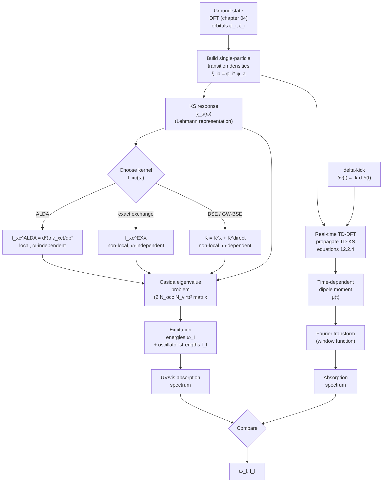

# Chapter 12 — Time-Dependent DFT

> Ground-state DFT is a *static* theory: it tells you the energy and
> the density of a system that has been sitting in one external
> potential forever. Time-dependent DFT is its *dynamical* extension:
> it tells you what happens when you shake the potential, and what
> the system absorbs when you shine light on it.

Up to [chapter 11]({{ "/dft-notes/chapter-11/" | relative_url }}) every
calculation we have done is for a system in its *time-independent*
ground state. Real chemistry, however, is dynamical. A dye molecule
absorbs a visible photon and jumps to an excited state. A solar cell
absorbs a sunbeam and produces a current. A molecule in a strong laser
pulse ionises *while* the field is still on. To handle any of these
situations we need a *time-dependent* generalisation of the
Kohn–Sham machinery of
[chapter 04]({{ "/dft-notes/chapter-04/" | relative_url }}).

That generalisation is the subject of this chapter. We will, in
order: state the **Runge–Gross theorem** that puts TD-DFT on the
same formal footing as ground-state DFT; write down the
**time-dependent Kohn–Sham equations**; discuss the practical
**time-dependent xc potential** (adiabatic LDA, exact exchange,
Bethe–Salpeter); derive **linear-response TD-DFT** and the
**Casida eigenvalue problem** for excitation energies and
oscillator strengths; introduce **real-time TD-DFT** as a
non-perturbative alternative; close with a **worked example** of
the absorption spectrum of a two-level system, the chapter's
Mermaid workflow, three graded problems, and an honest list of
omissions.

> **Reading note.** This chapter assumes chapters 01–05 and 09.
> Section 12.7 (Casida) presupposes the response-function language
> of [chapter 09]({{ "/dft-notes/chapter-09/" | relative_url }})
> at the level of knowing what a density-response function is and
> how it enters a Dyson equation.

## 12.1 The claim — Runge–Gross (1984)

The headline result of the chapter, due to Erich Runge and
Eberhard K. U. Gross (1984), is the time-dependent analogue of
Hohenberg–Kohn.

> **Runge–Gross theorem.** Fix a many-body Hamiltonian
> $\hat H(t) = \hat T + \hat W + \hat V(t)$ with the electron-
> electron interaction $\hat W$ held fixed and a one-body
> external potential $v_\text{ext}(\mathbf r, t)$ that is
> Taylor-expandable about $t = t_0$. Fix an initial
> many-body state $|\Psi_0\rangle$ at $t_0$. Then the
> mapping
> \begin{equation}
> \label{eq:ch-12-rg-map}
> v_\text{ext}(\mathbf r, t) \;\longmapsto\; \rho(\mathbf r, t)
> \end{equation> is, for a given $|\Psi_0\rangle$, one-to-one up
> to an additive purely time-dependent function
> $c(t)$.

Concretely: if two external potentials $v_\text{ext}(\mathbf r, t)$
and $v'_\text{ext}(\mathbf r, t)$ differ by more than a purely
time-dependent function $c(t)$ at the initial time $t_0$ — i.e. if
their Taylor coefficients
$\partial_t^k (v_\text{ext} - v'_\text{ext})|_{t_0}$ are not all
equal to a single constant in $\mathbf r$ for some $k$ — then the
resulting time-dependent densities $\rho(\mathbf r, t)$ and
$\rho'(\mathbf r, t)$ are different for $t > t_0$ (for short times
in a neighbourhood of $t_0$).

The proof of \eqref{eq:ch-12-rg-map} is the subject of section
12.3. For now we only need the **consequence**: every observable of
the time-evolving system, evaluated at $t > t_0$, is a functional
of $\rho(\mathbf r, t)$ and $|\Psi_0\rangle$. In particular the
external potential is, up to $c(t)$, a functional of the
time-dependent density. This is the foundation of the rest of the
chapter.

> **Tip.** The "up to $c(t)$" freedom is the time-dependent analogue
> of the "up to a constant" freedom in Hohenberg–Kohn. Adding
> $c(t)$ to $v_\text{ext}$ adds $-c(t)$ to the wavefunction's
> global phase, and leaves every gauge-invariant observable
> unchanged. The density is manifestly gauge-invariant, so the
> freedom drops out of the density-to-potential map.

## 12.2 The time-dependent Kohn–Sham equations

The Runge–Gross theorem guarantees the *existence* of a
density-to-potential map. To use it computationally we follow
Kohn and Sham's 1965 strategy (chapter 04, section 4.2) and
introduce an **auxiliary system of non-interacting electrons**
that reproduces the interacting density $\rho(\mathbf r, t)$ at
all times.

### 12.2.1 The auxiliary system

Consider a fictitious system of $N$ non-interacting electrons in
an effective time-dependent potential $v_\text{eff}(\mathbf r, t)$.
Its one-body Hamiltonian is

\begin{equation}
\label{eq:ch-12-tdks-hamiltonian}
\hat H_s(t) \;=\; -\frac{1}{2}\nabla^2 + v_\text{eff}(\mathbf r, t) ,
\end{equation}

and its wavefunction is a single time-dependent Slater determinant
$\Phi_s(t)$ built from $N$ orthonormal orbitals
$\{\phi_i(\mathbf r, t)\}$ that satisfy

\begin{equation}
\label{eq:ch-12-tdks-orbital}
i\, \frac{\partial}{\partial t}\, \phi_i(\mathbf r, t)
\;=\; \hat H_s(t)\, \phi_i(\mathbf r, t) .
\end{equation}

The auxiliary density is

\begin{equation}
\label{eq:ch-12-tdks-density}
\rho(\mathbf r, t) \;=\; 2 \sum_{i=1}^{N/2} |\phi_i(\mathbf r, t)|^2
\end{equation}

for a closed-shell (spin-paired) system, the factor of 2 again
accounting for Kramers-paired spins.

### 12.2.2 The effective potential

Equation \eqref{eq:ch-12-tdks-orbital} becomes useful when we
constrain the auxiliary density \eqref{eq:ch-12-tdks-density} to
*equal* the interacting density. The Runge–Gross theorem then
guarantees that there is a unique (up to $c(t)$) effective
potential $v_\text{eff}(\mathbf r, t)$ that does this. The standard
decomposition of $v_\text{eff}$ mirrors the static case:

\begin{equation}
\label{eq:ch-12-veff}
v_\text{eff}[\rho](\mathbf r, t)
\;=\; v_\text{ext}(\mathbf r, t)
    + v_\text{H}[\rho_t](\mathbf r, t)
    + v_\text{xc}[\rho_{\le t}](\mathbf r, t) .
\end{equation}

Three comments on \eqref{eq:ch-12-veff}:

1. **The Hartree term** $v_\text{H}[\rho_t](\mathbf r, t)$ is the
   *instantaneous* classical Coulomb potential of the density
   \begin{equation}
   \label{eq:ch-12-vh}
   v_\text{H}[\rho](\mathbf r, t)
   \;=\; \int \frac{\rho(\mathbf r', t)}{|\mathbf r - \mathbf r'|}\, d\mathbf r' .
   \end{equation}
   The subscript $\rho_t$ emphasises that the Hartree potential at
   time $t$ depends on the density at the *same* time $t$ — i.e. it
   is **instantaneous** in the time-dependent sense, even though
   physically there is a retardation built in by the fact that
   $\rho(\mathbf r, t)$ is itself a solution of the time-dependent
   problem.

2. **The xc term** $v_\text{xc}[\rho_{\le t}](\mathbf r, t)$ is in
   principle a functional of the *entire history* of the density
   $\{\rho(\mathbf r, \tau) : \tau \le t\}$ — it is
   **non-local in time**. This is a fundamental difference from
   ground-state DFT, where $v_\text{xc}$ depends on $\rho$ at one
   point in time. Memory effects are part of the exact time-
   dependent xc potential. The vast majority of practical
   calculations use the **adiabatic** approximation
   $v_\text{xc}^\text{ad}[\rho](\mathbf r, t) = v_\text{xc}^\text{gs}[\rho(t)](\mathbf r)$
   — i.e. the static xc potential evaluated on the *instantaneous*
   density — which has no memory. Section 12.4 discusses this
   approximation in detail.

3. **The KS equations are nonlinear.** The effective potential
   \eqref{eq:ch-12-veff} depends on the orbitals (through
   $\rho$), and the orbitals evolve under the effective potential.
   Unlike in linear-response theory (section 12.5) the equations
   are not linear, and closed-form solutions exist only for very
   special $v_\text{ext}$. The numerical work is to time-step
   \eqref{eq:ch-12-tdks-orbital} — see section 12.8.

> **Warning.** The "adiabatic" approximation is consistent with
> the static functional only in the limit of *infinitely slow*
> time variation. For a true time-dependent problem, where
> $\rho(\mathbf r, t)$ changes on a time scale comparable to the
> internal electron dynamics, the adiabatic approximation
> introduces uncontrolled errors. We will see this in practice in
> the worked example of section 12.10.

### 12.2.3 The van Leeuwen–Baerends fixed-point formulation

The decomposition \eqref{eq:ch-12-veff} is a *definition* of
$v_\text{xc}$ as "what is left over". A complementary and very
useful reformulation is due to van Leeuwen and Baerends (1994): the
effective potential $v_\text{eff}(\mathbf r, t)$ is the **fixed
point** of an integral equation whose kernel is the inverse of the
non-interacting KS response function. We will not derive this
explicitly (it appears in many standard references) but we use the
idea in section 12.5 when we connect $v_\text{xc}$ to the
exchange–correlation kernel $f_\text{xc}$.

### 12.2.4 The time-dependent KS equations, restated

Putting it all together, the **time-dependent Kohn–Sham equations**
are the coupled system

\begin{equation}
\label{eq:ch-12-tdks-coupled}
\boxed{
\begin{aligned}
i\, \partial_t \phi_i(\mathbf r, t) &= \Bigl[-\tfrac{1}{2}\nabla^2
   + v_\text{eff}[\rho_t](\mathbf r, t) \Bigr]\, \phi_i(\mathbf r, t) , \\
\rho(\mathbf r, t) &= 2 \sum_{i=1}^{N/2} |\phi_i(\mathbf r, t)|^2 , \\
v_\text{eff}[\rho](\mathbf r, t) &=
   v_\text{ext}(\mathbf r, t)
 + v_\text{H}[\rho_t](\mathbf r, t)
 + v_\text{xc}[\rho_{\le t}](\mathbf r, t) .
\end{aligned}
}
\end{equation}

The first equation is a (nonlinear) one-body Schrödinger equation;
the second is the density reconstruction from the occupied
orbitals; the third defines the effective potential in terms of
the density. The system is closed: given $v_\text{ext}(\mathbf r,
t)$ and the initial state $\Phi_s(t_0)$, the equations determine
$\rho(\mathbf r, t)$ and $\phi_i(\mathbf r, t)$ for all $t > t_0$.
The only unknown is the **functional form of $v_\text{xc}$**, which
is the subject of section 12.4.

## 12.3 Derivation of the Runge–Gross theorem

This is the section where every step is written out.  The
argument follows Runge and Gross's 1984 paper; the
**action-functional** version uses the reformulation by
Ghosh and Dhara (1988) and van Leeuwen (1998). We give the
fixed-point action derivation, which is the cleanest.

### 12.3.1 The quantum-mechanical action

For a system with Hamiltonian $\hat H(t) = \hat T + \hat W +
\hat V(t)$ and a state $|\Psi(t)\rangle$ that solves the
time-dependent Schrödinger equation
$i\, \partial_t |\Psi(t)\rangle = \hat H(t) |\Psi(t)\rangle$
with initial condition $|\Psi(t_0)\rangle = |\Psi_0\rangle$, the
**quantum-mechanical action functional** is

\begin{equation}
\label{eq:ch-12-action}
\mathcal A[\Psi]
\;=\; \int_{t_0}^{t_1}
   \Bigl\langle \Psi(t) \Big|
   i\, \partial_t - \hat H(t) \Big| \Psi(t) \rangle \Bigr\rangle\, dt .
\end{equation}

The action is **stationary** ($\delta \mathcal A = 0$) at the
physical $|\Psi(t)\rangle$, with fixed endpoints
$|\Psi(t_0)\rangle = |\Psi_0\rangle$ and
$|\Psi(t_1)\rangle = |\Psi_1\rangle$. The proof is a standard
functional variation; expanding
$|\Psi\rangle \to |\Psi\rangle + \epsilon |\delta\Psi\rangle$ and
collecting terms of order $\epsilon$ gives the time-dependent
Schrödinger equation back, with the boundary-condition term
$\langle \delta\Psi(t_1) | \Psi(t_1) \rangle - \langle
\delta\Psi(t_0) | \Psi(t_0) \rangle$ vanishing because the
endpoints are fixed.

### 12.3.2 The Keldysh contour

For a system with a *time-dependent* Hamiltonian, the natural
contour for the time integral is the **Keldysh contour** $\gamma$
that runs from $t_0$ to $t_1$ on the upper branch and back from
$t_1$ to $t_0$ on the lower branch, with $t_0 \to -\infty$ and
$t_1 \to +\infty$ at the end. The reason is that the density
matrix at time $t$ — and hence the action that generates it —
involves both forward and backward propagation in time. Define

\begin{equation}
\label{eq:ch-12-keldysh-action}
\mathcal A_\gamma[\Psi]
\;=\; \int_\gamma
   \Bigl\langle \Psi(\bar t) \Big|
   i\, \partial_{\bar t} - \hat H(\bar t) \Big| \Psi(\bar t) \rangle \Bigr\rangle\, d\bar t ,
\end{equation}

where $\bar t$ parameterises the contour. The integrand on the
upper branch is the same as in \eqref{eq:ch-12-action}; on the
lower branch $\partial_{\bar t} = -\partial_t$, so the sign of
the kinetic term flips. The result is that the action
\eqref{eq:ch-12-keldysh-action} is *real* and *stationary* at
the physical forward–backward trajectory. The vanishing of
$\delta \mathcal A_\gamma = 0$ for variations with fixed
endpoints at $t_0$ is again equivalent to the time-dependent
Schrödinger equation on each branch.

### 12.3.3 The Runge–Gross action

The Keldysh action \eqref{eq:ch-12-keldysh-action} is a
functional of $|\Psi(t)\rangle$ and of $v_\text{ext}(\mathbf r, t)$.
The first variation with respect to the wavefunction gives the
Schrödinger equation, which we already used. The Runge–Gross
trick is to instead **eliminate** the wavefunction in favour of
the density.

To do this, write the interacting action as

\begin{equation}
\label{eq:ch-12-rg-action}
\mathcal A_\gamma[v_\text{ext}, \Psi]
\;=\; \mathcal B_\gamma[\Psi]
   - \int_\gamma \int d\mathbf r\,
       \rho_\Psi(\mathbf r, \bar t)\,
       v_\text{ext}(\mathbf r, \bar t) ,
\end{equation}

where $\mathcal B_\gamma[\Psi] = \int_\gamma d\bar t\, \langle
\Psi | i\partial_{\bar t} - \hat T - \hat W | \Psi \rangle$ is
the **universal** part (independent of $v_\text{ext}$) and the
second term is the coupling to the external potential,
$\rho_\Psi(\mathbf r, \bar t) = \langle \Psi(\bar t) |
\hat\rho(\mathbf r) | \Psi(\bar t) \rangle$ being the
time-dependent density.

Now define the **density functional**

\begin{equation}
\label{eq:ch-12-A-density-functional}
\mathcal A_\gamma[v_\text{ext}, \rho]
\;=\; \mathcal B_\gamma[\rho]
   - \int_\gamma \int d\mathbf r\,
       \rho(\mathbf r, \bar t)\,
       v_\text{ext}(\mathbf r, \bar t) ,
\end{equation}

where $\mathcal B_\gamma[\rho]$ is the **Levy–Lieb** constrained-
search functional

\begin{equation}
\label{eq:ch-12-B-rho}
\mathcal B_\gamma[\rho]
\;=\; \min_{\Psi \to \rho}
   \int_\gamma d\bar t\,
   \Bigl\langle \Psi \Big|
   i\partial_{\bar t} - \hat T - \hat W \Big| \Psi \Bigr\rangle ,
\end{equation}

with the minimum taken over all $N$-electron states
$|\Psi(\bar t)\rangle$ on the contour whose density equals
$\rho(\mathbf r, \bar t)$ for each $\bar t$ on $\gamma$. (The
constraint is the obvious time-dependent generalisation of the
Levy–Lieb functional of static DFT, [chapter 02]({{ "/dft-notes/chapter-02/" | relative_url }}),
section 2.4.) For a $v_\text{ext}$-representable density, the
minimum is attained at the physical $|\Psi(\bar t)\rangle$ and
$\mathcal B_\gamma[\rho] = \mathcal B_\gamma[\Psi]$.

### 12.3.4 The fixed-point equation for the density

Vary \eqref{eq:ch-12-A-density-functional} with respect to
$\rho(\mathbf r, \bar t)$ on the upper branch of the contour
(for $\bar t \in (t_0, t_1)$). The first variation gives

\begin{equation}
\label{eq:ch-12-fp-equation}
\frac{\delta \mathcal B_\gamma}{\delta \rho(\mathbf r, \bar t)}
\;-\; v_\text{ext}(\mathbf r, \bar t) \;=\; 0 .
\end{equation}

The functional derivative $\delta \mathcal B_\gamma / \delta
\rho$ is taken with $\rho$ held fixed on the lower branch, by
the chain rule of contour-ordered functional differentiation.
The physical density $\rho(\mathbf r, \bar t)$ is the
**unique** solution of \eqref{eq:ch-12-fp-equation} for a
given $v_\text{ext}(\mathbf r, \bar t)$ and initial state
$|\Psi_0\rangle$ — uniqueness of the forward-propagated state
under a given Hamiltonian is just unitarity of time evolution.

Now suppose two external potentials $v_\text{ext}(\mathbf r,
t)$ and $v'_\text{ext}(\mathbf r, t)$ produce the same density
$\rho(\mathbf r, t)$ on the upper branch for the same initial
state. By the same fixed-point argument applied to
$v'_\text{ext}$, the density is also a fixed point of

\begin{equation}
\label{eq:ch-12-fp-equation-prime}
\frac{\delta \mathcal B_\gamma}{\delta \rho(\mathbf r, \bar t)}
\;-\; v'_\text{ext}(\mathbf r, \bar t) \;=\; 0 .
\end{equation}

Subtracting \eqref{eq:ch-12-fp-equation} from
\eqref{eq:ch-12-fp-equation-prime},

\begin{equation}
\label{eq:ch-12-difference}
v'_\text{ext}(\mathbf r, t) - v_\text{ext}(\mathbf r, t) \;=\; 0 .
\end{equation}

This is the original Runge–Gross conclusion: **two external
potentials that give the same density must be equal as
functions of $\mathbf r$ (and not just equal up to a constant)**
— and, by the assumption of Taylor-expandability used to fix
the freedom, they differ by at most a constant $c(t)$ that is
the same at $t_0$.

### 12.3.5 The full statement

To make the proof work with the "up to $c(t)$" caveat rather
than "exactly equal", the technical argument needs the
**$v$-representability** of the density on both branches and
the **Taylor-expandability** of the potentials about $t_0$.
The latter is needed because the constraint
$|\Psi(t_0)\rangle = |\Psi_0\rangle$ fixes the initial state,
and the time-evolution operator
$\hat U(t, t_0)$ depends on the *whole* function
$v_\text{ext}(\cdot, t)$, not just on its value at $t_0$. To
show that $v'_\text{ext} - v_\text{ext} = c(t)$ requires
matching the potentials and all their time derivatives at
$t_0$, which is precisely what Taylor-expandability delivers.

The final statement of the Runge–Gross theorem is therefore:

> **Runge–Gross theorem (1984).** Let $v_\text{ext}(\mathbf r,
> t)$ and $v'_\text{ext}(\mathbf r, t)$ be two real-valued
> analytic functions of $t$ in a neighbourhood of $t_0$ for
> which the many-body problem with initial state $|\Psi_0\rangle$
> has a unique solution. Suppose that, for some $k \ge 0$,
> \begin{equation}
> \label{eq:ch-12-rg-condition}
> \left.\frac{\partial^k}{\partial t^k}
>       \big[ v'_\text{ext}(\mathbf r, t) - v_\text{ext}(\mathbf r, t) \big]
> \right|_{t=t_0} \neq \text{const in } \mathbf r .
> \end{equation}
> Then the time-dependent densities produced by the two
> potentials differ infinitesimally close to $t_0$:
> $\rho'(\mathbf r, t) \neq \rho(\mathbf r, t)$ for $t$ in some
> right-neighbourhood of $t_0$.

The "up to a constant" caveat is the $\partial^k/\partial t^k$
piece of the difference being spatially constant — when *all*
the derivatives are spatially constant, the two potentials
differ by $c(t) = v'_\text{ext}(\mathbf r, t) - v_\text{ext}(\mathbf r, t)$
and the densities are equal.

> **Note.** Runge and Gross's original 1984 paper proved the
> theorem for potentials that are analytic in time and for
> systems that are non-degenerate at $t_0$. The "up to a
> constant" caveat was made explicit by van Leeuwen (1998) in
> the action-functional reformulation we have used here. The
> 1994 paper by van Leeuwen and Baerends gives the
> fixed-point equation for $v_\text{eff}$ in terms of the
> non-interacting response, which is the practical route to
> the time-dependent KS system.

## 12.4 The time-dependent xc potential

Equation \eqref{eq:ch-12-veff} hides the only unknown in the
time-dependent KS equations: the **time-dependent xc potential**
$v_\text{xc}[\rho_{\le t}](\mathbf r, t)$. The exact
functional is unknown. Three practical approximations are
described in this section, in increasing order of accuracy and
cost.

### 12.4.1 The adiabatic LDA (ALDA)

The simplest and most-used approximation is the **adiabatic
local-density approximation** (ALDA, sometimes "ALDA" or just
"adiabatic LDA"). It evaluates the static LDA xc potential on
the *instantaneous* density:

\begin{equation}
\label{eq:ch-12-alda}
v_\text{xc}^\text{ALDA}[\rho](\mathbf r, t)
\;=\; v_\text{xc}^\text{LDA}\big[\rho(\mathbf r, t)\big](\mathbf r) .
\end{equation}

In a spin-paired, spin-unpolarised system the LDA xc potential
is the functional derivative of the LDA xc energy,
$v_\text{xc}^\text{LDA}(\mathbf r) = \partial[\rho(\mathbf r)
\varepsilon_\text{xc}(\rho(\mathbf r))]/\partial\rho(\mathbf r)$
evaluated at $\rho = \rho(\mathbf r, t)$. The adiabatic
approximation sets $v_\text{xc}$ to depend *only* on the
density at the *current* time — i.e. it is **memory-free**.

The ALDA is exact in two limits:

1. **Slowly-varying** potentials, where the density has time to
   track the perturbation and the xc kernel acts
   quasi-instantaneously.
2. **Linear response** of the homogeneous electron gas, where
   the ALDA reproduces the exact high-frequency limit of the
   xc kernel $f_\text{xc}(\mathbf q, \omega) \to f_\text{xc}^\text{ALDA}(\mathbf q)$
   as $\omega \to \infty$.

In between, the ALDA has the well-known failure that it misses
the long-range tail of the xc kernel: the derivative
discontinuity and the step structure in finite systems, the
excitonic effects that bind an electron and a hole in solids,
and the polarisation-dependence of the xc kernel in
time-dependent phenomena. We will see some of these failures
in the worked example of section 12.10.

The adiabatic **GGA** (adiabatic PBE, etc.) and adiabatic
**hybrid** functionals follow the same pattern, with the static
functional plugged in at the instantaneous density. They do
not introduce any new physics beyond ALDA — they only improve
the *static* xc potential that is being evaluated adiabatically.

> **Tip.** The "adiabatic" label is a physical statement, not a
> technical one. The static LDA, GGA, or hybrid xc potential is
> a *snapshot* functional: it takes one density as input and
> returns one potential. By *adiabatically* evaluating it on
> $\rho(\mathbf r, t)$ we are saying that the xc potential at
> time $t$ depends only on the density at that same time, with
> no memory of how $\rho$ got there. This is correct only when
> the density changes slowly.

### 12.4.2 The exact-exchange (EXX) kernel

The **exact-exchange** (EXX) approximation is the
time-dependent analogue of the hybrid functionals of
[chapter 04]({{ "/dft-notes/chapter-04/" | relative_url }}) (section
4.5). At the time-dependent level, "exact exchange" means that
the xc kernel $f_\text{xc}(\mathbf r, \mathbf r', t - t')$ is
approximated by the **Fock exchange kernel** of the KS
orbitals:

\begin{equation}
\label{eq:ch-12-exx-kernel}
f_\text{x}^\text{EXX}(\mathbf r, \mathbf r', t - t')
\;=\; -\frac{1}{2} \sum_{\sigma}
   \frac{|\gamma_s(\mathbf r, \mathbf r'; t, t')|^2}
        {|\mathbf r - \mathbf r'|\, \rho(\mathbf r, t)\, \rho(\mathbf r', t')}\, \delta(t - t') .
\end{equation}

(The $\delta(t - t')$ enforces the *adiabatic* approximation;
EXX is, in practice, almost always used adiabatically.) The
"$\frac{1}{2}$" is the same exchange factor as in Hartree–Fock;
the sum runs over the Kramers spin pair; and
$\gamma_s(\mathbf r, \mathbf r'; t, t')$ is the one-body
density matrix of the KS Slater determinant.

The EXX kernel captures the **long-range $-\!1/r$ tail** that
ALDA misses, and the related derivative discontinuity in the
xc potential at particle-number changes. In practice EXX is
implemented by the same frequency-dependent kernel that the
Bethe–Salpeter equation uses (next subsection); a fully
time-dependent EXX code is rare.

The practical cost of EXX scales as $\mathcal O(K^4)$ in a
Gaussian basis (the same as HF exchange), making it 1–2 orders
of magnitude more expensive than ALDA but still much cheaper
than BSE.

### 12.4.3 The Bethe–Salpeter equation (BSE)

The **Bethe–Salpeter equation** (BSE) is not, strictly, a
time-dependent xc *functional*: it is a four-point equation for
the two-particle Green's function $L(1, 2; 3, 4)$ that lives at
a higher level of the many-body hierarchy. But it is the
standard *bridge* between TD-DFT and a description of two-
particle excitations (excitons), and we include it here for
completeness.

The BSE for the two-particle correlation function
$L(1, 2; 3, 4)$ is

\begin{equation}
\label{eq:ch-12-bse}
L(1, 2; 3, 4)
\;=\; L_0(1, 2; 3, 4)
   + \int d5\, d6\, d7\, d8\,
   L_0(1, 5; 3, 7)\,
   K(5, 6; 7, 8)\,
   L(8, 6; 2, 4) ,
\end{equation}

where $L_0$ is the non-interacting two-particle propagator
(built from the KS orbitals and quasiparticle energies), and
$K$ is the **Bethe–Salpeter kernel**. In the standard
approximation $K = K^x + K^\text{direct}$ where
$K^x = -W$ is the **exchange** kernel (a statically screened
Coulomb interaction $W$) and $K^\text{direct} = -\bar v$ is
the **direct** (unscreened) Coulomb interaction.

The BSE captures the **electron–hole interaction** that binds
an exciton in a semiconductor. Standard ALDA TD-DFT misses
this entirely because the ALDA xc kernel is short-ranged; BSE
recovers it because the BSE kernel contains the long-range
Coulomb interaction. The price is that the BSE is an
$\mathcal O(N^6)$ eigenvalue problem in a basis of single-
particle transitions (or $\mathcal O(N^4)$ in storage for the
matrix), where $N$ is the number of KS states. We do not
derive the BSE here — the standard references are
Strinati (1988), Rohlfing and Louie (2000), and the
review by Onida, Reining, and Rubio (2002).

> **Note.** The hierarchy of TD-DFT, BSE, and the GW approximation
> (a related many-body method) is intricate. ALDA TD-DFT is a
> long-wave-approximation limit of BSE. EXX TD-DFT is the
> adiabatic limit of BSE with $K = K^x$ (the exchange kernel
> only, no direct term). Full BSE with the screened-Coulomb
> kernel is the most accurate and the most expensive of the
> three. We summarise the relationships in section 12.11.

## 12.5 Linear-response TD-DFT (TD-DFRT)

The exact time-dependent KS equations are nonlinear. The
**linear-response** regime — the response to a *weak*
perturbation — is far more tractable and is the workhorse of
practical TD-DFT for excitation spectra.

### 12.5.1 The density-density response function

For a system in its ground state $|\Psi_0\rangle$, the response
of the density to a weak external perturbation
$\delta v_\text{ext}(\mathbf r, t)$ is described by the
**density-density response function** $\chi$:

\begin{equation}
\label{eq:ch-12-chi-def}
\delta\rho(\mathbf r, t) \;=\;
\int dt' \int d\mathbf r'\,
   \chi(\mathbf r, t; \mathbf r', t')\,
   \delta v_\text{ext}(\mathbf r', t') .
\end{equation}

In a time-translation-invariant system the response depends
only on $t - t'$, and the Fourier transform with respect to
$\tau = t - t'$ gives the **frequency-dependent** response
function $\chi(\mathbf r, \mathbf r'; \omega)$:

\begin{equation}
\label{eq:ch-12-chi-fourier}
\delta\rho(\mathbf r, \omega) \;=\;
\int d\mathbf r'\,
   \chi(\mathbf r, \mathbf r'; \omega)\,
   \delta v_\text{ext}(\mathbf r', \omega) .
\end{equation}

The poles of $\chi(\mathbf r, \mathbf r'; \omega)$ as a
function of $\omega$ give the **neutral excitation energies**
of the interacting system. The residues at the poles give the
**oscillator strengths** — the same quantities that enter
Fermi's golden rule for photon absorption. This is the
content of section 12.6.

### 12.5.2 The KS response function

The non-interacting KS system has its own response function,
$\chi_s$, which describes how the KS density responds to a
weak perturbation of the KS effective potential:

\begin{equation}
\label{eq:ch-12-chi-s-def}
\delta\rho_s(\mathbf r, \omega) \;=\;
\int d\mathbf r'\,
   \chi_s(\mathbf r, \mathbf r'; \omega)\,
   \delta v_\text{eff}(\mathbf r', \omega) .
\end{equation}

In a basis of KS orbitals the KS response function is
**independent** of the time-dependent xc potential; it depends
only on the KS orbitals and eigenvalues. Its Lehmann
representation is

\begin{equation}
\label{eq:ch-12-chi-s-lehmann}
\chi_s(\mathbf r, \mathbf r'; \omega) \;=\;
2 \sum_{i}^\text{occ} \sum_{a}^\text{virt}
   \frac{\phi_i^*(\mathbf r)\, \phi_a(\mathbf r)\,
         \phi_a^*(\mathbf r')\, \phi_i(\mathbf r')}
        {\omega - (\varepsilon_a - \varepsilon_i) + i\eta}
   \;-\; \text{c.c.}(\omega \to -\omega) .
\end{equation}

The "2" is again the Kramers spin-pairing factor; the sum is
over occupied ($i$) and virtual ($a$) KS orbitals; and the
"c.c." term subtracts the same expression with $\omega$ sent
to $-\omega$ to enforce the proper-particle / hole
asymmetry. The infinitesimal $i\eta$ with $\eta \to 0^+$ picks
out the retarded response function.

The poles of $\chi_s$ sit at the **KS single-particle
excitation energies** $\varepsilon_a - \varepsilon_i$ —
*not* at the true many-body excitation energies. The whole
point of the Dyson equation (next subsection) is to dress
$\chi_s$ with the electron–electron interaction and shift the
poles to the correct many-body positions.

### 12.5.3 The Dyson equation

The full interacting response function $\chi$ is connected to
the KS response $\chi_s$ by the **Dyson equation**

\begin{equation}
\label{eq:ch-12-dyson}
\boxed{
\chi(\mathbf r, \mathbf r'; \omega) \;=\;
\chi_s(\mathbf r, \mathbf r'; \omega)
   + \int d\mathbf r''\, d\mathbf r'''\,
   \chi_s(\mathbf r, \mathbf r''; \omega)\,
   \bigl[ v_\text{H}(\mathbf r'', \mathbf r''')
        + f_\text{xc}(\mathbf r'', \mathbf r''', \omega) \bigr]\,
   \chi(\mathbf r''', \mathbf r'; \omega) .
}
\end{equation}

The kernel is the sum of the **Hartree kernel**
$v_\text{H}(\mathbf r, \mathbf r') = 1/|\mathbf r - \mathbf r'|$
and the **exchange–correlation kernel**

\begin{equation}
\label{eq:ch-12-fxc}
f_\text{xc}(\mathbf r, \mathbf r', \omega) \;=\;
\frac{\delta v_\text{xc}(\mathbf r, \omega)}
     {\delta \rho(\mathbf r', \omega)} ,
\end{equation}

which is the *functional derivative* of the time-dependent
xc potential with respect to the density, evaluated on the
frequency-diagonal piece of the response. The frequency
dependence of $f_\text{xc}$ is the memory effect: the xc
potential at frequency $\omega$ depends on the density at
all frequencies via $f_\text{xc}(\omega)$, and the Dyson
equation couples these through $\chi_s$ (which already
contains the orbital energy denominators).

**Derivation of the Dyson equation.**  The KS density must
equal the interacting density: $\delta\rho = \delta\rho_s$.
The perturbation that the *electrons* actually feel, however,
is not the bare $\delta v_\text{ext}$ but the *self-consistent*
$\delta v_\text{eff}$:

\begin{equation}
\label{eq:ch-12-veff-response}
\delta v_\text{eff}(\mathbf r, \omega)
\;=\; \delta v_\text{ext}(\mathbf r, \omega)
   + \int d\mathbf r'\,
       v_\text{H}(\mathbf r, \mathbf r')\,
       \delta\rho(\mathbf r', \omega)
   + \int d\mathbf r'\,
       f_\text{xc}(\mathbf r, \mathbf r'; \omega)\,
       \delta\rho(\mathbf r', \omega) .
\end{equation}

Substitute into \eqref{eq:ch-12-chi-s-def} and use
$\delta\rho = \delta\rho_s$:

\begin{align}
\delta\rho(\mathbf r, \omega)
&= \int d\mathbf r'\,
     \chi_s(\mathbf r, \mathbf r'; \omega)\,
     \Bigl[ \delta v_\text{ext}(\mathbf r', \omega)
           + \int d\mathbf r''\,
              v_H(\mathbf r', \mathbf r'')\,
              \delta\rho(\mathbf r'', \omega)
           + \int d\mathbf r''\,
              f_\text{xc}(\mathbf r', \mathbf r''; \omega)\,
              \delta\rho(\mathbf r'', \omega) \Bigr] .
\end{align}

Use \eqref{eq:ch-12-chi-fourier} to replace
$\delta v_\text{ext}$ with $\delta\rho$ on the right-hand
side, and rearrange:

\begin{align}
\delta\rho(\mathbf r, \omega)
&= \int d\mathbf r'\,
     \chi_s(\mathbf r, \mathbf r'; \omega)\,
     \delta v_\text{ext}(\mathbf r', \omega) \\
&\quad + \int d\mathbf r'\, d\mathbf r''\,
     \chi_s(\mathbf r, \mathbf r'; \omega)\,
     \bigl[ v_H(\mathbf r', \mathbf r'')
          + f_\text{xc}(\mathbf r', \mathbf r''; \omega) \bigr]\,
     \delta\rho(\mathbf r'', \omega) .
\end{align}

Identifying the first term on the right-hand side as
$\int \chi_s\, \delta v_\text{ext}$ and the rest as the
integral operator applied to $\delta\rho$, we recognise the
linear integral equation for $\chi$, with $\delta v_\text{ext}$
as the inhomogeneous source. Reading off the kernel of the
equation gives \eqref{eq:ch-12-dyson}.

> **Note.** The Dyson equation \eqref{eq:ch-12-dyson} is the
> time-dependent analogue of the static Dyson equation
> $G = G_0 + G_0 \Sigma G$ of many-body theory. In the
> language of the previous chapter, $\chi$ plays the role of
> the full Green's function $G$, $\chi_s$ the role of $G_0$,
> and $v_H + f_\text{xc}$ the role of the self-energy
> $\Sigma$. The KS orbitals take the place of the
> mean-field orbitals of the Hartree–Fock starting point.

### 12.5.4 The two-particle-like structure

Although \eqref{eq:ch-12-dyson} is a two-point function
equation, it has a **four-index matrix** structure when
discretised. In a basis of $K$ spatial functions,
$\chi(\mathbf r, \mathbf r'; \omega)$ becomes a $K \times K$
matrix $\chi(\omega)$, and the integral
$\int d\mathbf r''\, d\mathbf r'''$ becomes matrix
multiplication:

\begin{equation}
\label{eq:ch-12-dyson-matrix}
\boldsymbol\chi(\omega) \;=\;
\boldsymbol\chi_s(\omega)
   + \boldsymbol\chi_s(\omega)\,
     \bigl[ \mathbf v_H + \mathbf f_\text{xc}(\omega) \bigr]\,
     \boldsymbol\chi(\omega) .
\end{equation}

This is a $K \times K$ matrix equation for the $K \times K$
matrix $\boldsymbol\chi(\omega)$. Solving it for $\boldsymbol\chi$
at each frequency — or, more efficiently, finding its poles
and residues — is the practical work of linear-response
TD-DFT.

## 12.6 Excitations

The poles of the response function $\chi(\mathbf r, \mathbf r';
\omega)$ are the **neutral excitation energies** of the system.
To see this, write the Dyson equation \eqref{eq:ch-12-dyson-matrix}
in operator form as

\begin{equation}
\label{eq:ch-12-chi-resolvent}
\boldsymbol\chi(\omega) \;=\;
\bigl[ \mathbf 1 - \boldsymbol\chi_s(\omega)\,
     \bigl( \mathbf v_H + \mathbf f_\text{xc}(\omega) \bigr)
\bigr]^{-1}\, \boldsymbol\chi_s(\omega) .
\end{equation}

The poles of $\boldsymbol\chi(\omega)$ are the frequencies
$\omega_I$ at which the bracketed matrix is singular, i.e. at
which

\begin{equation}
\label{eq:ch-12-pole-equation}
\det\Bigl[ \mathbf 1 - \boldsymbol\chi_s(\omega_I)\,
                \bigl( \mathbf v_H + \mathbf f_\text{xc}(\omega_I) \bigr)
       \Bigr] \;=\; 0 .
\end{equation}

At such a frequency the response is *infinite* for a finite
perturbation — i.e. a *resonance* of the system. The
$\omega_I$ for which the response blows up are the **excitation
energies**.

### 12.6.1 Oscillator strengths

The **oscillator strength** $f_I$ of an excitation at energy
$\omega_I$ is the residue of $\boldsymbol\chi$ at the pole
$\omega = \omega_I$. It measures the strength of the
excitation's coupling to a uniform electric field (in the
dipole approximation) and is directly comparable to
experimental absorption cross-sections via the relation

\begin{equation}
\label{eq:ch-12-oscillator-strength}
\sigma(\omega) \;=\; \frac{2\pi^2}{c} \sum_I f_I\, \delta(\omega - \omega_I) ,
\end{equation}

where $\sigma(\omega)$ is the cross-section for absorption of
a photon of energy $\omega$.

For a closed-shell, dipole-allowed excitation the oscillator
strength in the dipole-length gauge is

\begin{equation}
\label{eq:ch-12-fI}
f_I \;=\; \frac{2\, m\, \omega_I}{3\hbar}\,
   \sum_{\alpha = x, y, z}
   \bigl| \langle \Psi_I | \hat r_\alpha | \Psi_0 \rangle \bigr|^2 ,
\end{equation}

with $\Psi_0$ the ground state, $\Psi_I$ the excited state, and
$\hat r_\alpha$ the dipole operator in the $\alpha$ direction.
The factor 2 in front is the standard convention in the
*length* gauge; the *velocity* gauge uses
$|\langle \Psi_I | \hat p_\alpha | \Psi_0 \rangle|^2$ instead.

> **Tip.** The oscillator strength is dimensionless. The
> "Thomas–Reiche–Kuhn sum rule" (problem 1) says that the sum
> of all oscillator strengths of a one-electron system is
> exactly 1. For a many-electron system the sum is $N$, the
> number of electrons. The sum rule is the most important
> sanity check on any computed spectrum.

## 12.7 The Casida formulation

The most widely-used form of the linear-response TD-DFT
eigenvalue problem is due to **Mark Casida** (1995, 1996). It
reduces the search for the poles of $\chi$ to a single
generalised matrix eigenvalue equation of dimension
$N_\text{trans} = N_\text{occ}\, N_\text{virt}$, where
$N_\text{occ}$ and $N_\text{virt}$ are the number of occupied
and virtual KS orbitals.

### 12.7.1 The Casida matrix

The Casida formulation works in the space of single-particle
excitations $|i \to a\rangle$ (one occupied orbital $i$, one
virtual orbital $a$). In this basis the Dyson equation
\eqref{eq:ch-12-dyson} reduces to a matrix equation. We sketch
the derivation; a complete treatment is in the references.

Define the **single-particle transition density**

\begin{equation}
\label{eq:ch-12-transition-density}
\xi_{ia}(\mathbf r) \;=\; \phi_i^*(\mathbf r)\, \phi_a(\mathbf r) .
\end{equation}

The KS response function \eqref{eq:ch-12-chi-s-lehmann} is

\begin{equation}
\chi_s(\mathbf r, \mathbf r'; \omega) \;=\;
2 \sum_{ia} \xi_{ia}(\mathbf r)\,
       \bigl[ (\omega - \omega_{ia} + i\eta)^{-1}
            - (\omega + \omega_{ia} - i\eta)^{-1} \bigr]\,
       \xi_{ia}^*(\mathbf r') ,
\end{equation}

with $\omega_{ia} = \varepsilon_a - \varepsilon_i > 0$ the
KS excitation energy of the transition $i \to a$.

Insert this form into the Dyson equation \eqref{eq:ch-12-dyson}
and look for poles. The result, after some algebra, is the
**Casida equation**

\begin{equation}
\label{eq:ch-12-casida}
\boxed{
\begin{pmatrix}
  \mathbf A & \mathbf B \\
  \mathbf B & \mathbf A
\end{pmatrix}
\begin{pmatrix} \mathbf X \\ \mathbf Y \end{pmatrix}
\;=\; \omega_I\,
\begin{pmatrix}
  \mathbf 1 & \mathbf 0 \\
  \mathbf 0 & -\mathbf 1
\end{pmatrix}
\begin{pmatrix} \mathbf X \\ \mathbf Y \end{pmatrix} .
}
\end{equation}

The $\mathbf X$ and $\mathbf Y$ vectors are the
"excitation" and "de-excitation" amplitudes, both of size
$N_\text{trans}$. The matrices $\mathbf A$ and $\mathbf B$
are

\begin{equation}
\label{eq:ch-12-casida-A}
A_{ia, jb} \;=\; \delta_{ij}\, \delta_{ab}\, \omega_{ia}
                + K_{ia, jb} ,
\end{equation}

\begin{equation}
\label{eq:ch-12-casida-B}
B_{ia, jb} \;=\; K_{ia, jb} ,
\end{equation}

where the **coupling matrix** $\mathbf K$ is

\begin{equation}
\label{eq:ch-12-casida-K}
K_{ia, jb} \;=\;
\iint d\mathbf r\, d\mathbf r'\,
   \xi_{ia}^*(\mathbf r)\,
   \bigl[ v_H(\mathbf r, \mathbf r') + f_\text{xc}(\mathbf r, \mathbf r') \bigr]\,
   \xi_{jb}(\mathbf r') .
\end{equation}

In the **Tamm–Dancoff approximation** (TDA, equivalent to
neglecting the $\mathbf B$ block), the equation reduces to
the simpler eigenvalue problem $\mathbf A \mathbf X = \omega_I
\mathbf X$.

### 12.7.2 The oscillator strength from the Casida eigenvectors

The dipole oscillator strength of excitation $I$ is

\begin{equation}
\label{eq:ch-12-casida-f}
f_I \;=\; \frac{2}{3} \sum_{\alpha = x, y, z}
   \Bigl| \sum_{ia} \sqrt{\frac{\omega_{ia}}{\omega_I}}\,
        (X_{ia} + Y_{ia})\,
        \langle \phi_a | \hat r_\alpha | \phi_i \rangle \Bigr|^2 .
\end{equation}

The sum runs over all single-particle transitions, weighted
by the eigenvectors $(\mathbf X, \mathbf Y)$ of the
$I$-th eigenvalue of \eqref{eq:ch-12-casida}. The factor
$\sqrt{\omega_{ia}/\omega_I}$ is the standard velocity-gauge
rescaling.

### 12.7.3 The form of the coupling matrix

The kernel in \eqref{eq:ch-12-casida-K} separates into a
**Coulomb** part (the Hartree kernel $v_H$) and an
**xc** part (the kernel $f_\text{xc}$). The Coulomb part
drives the **de-excitation** direction in the Casida matrix
(it appears with a $-$ sign in the full equation, but is
absorbed in the structure of $\mathbf A$, $\mathbf B$); the
xc part is what shifts the KS excitation energies to the
true many-body ones.

In the **ALDA** $f_\text{xc}^\text{ALDA}(\mathbf r) =
d^2[\rho \varepsilon_\text{xc}(\rho)]/d\rho^2$, a
*purely local* kernel. The coupling matrix in this case is
often written in terms of spin densities and the spin-
unpolarised or spin-polarised HEG response. The ALDA is
**frequency-independent** — the kernel $f_\text{xc}$ is a
function of $\mathbf r$ only, not of $\omega$. The BSE kernel
is frequency-dependent (it is built from the dynamically
screened Coulomb interaction $W(\omega)$); the EXX kernel
is non-local in $\mathbf r$ but frequency-independent.

> **Note.** The dimension of the Casida matrix is
> $2\, N_\text{occ}\, N_\text{virt}$. For a small molecule
> with $N_\text{occ} = 5$ and $N_\text{virt} = 50$ this is
> a $500 \times 500$ matrix — easily diagonalised. For a
> solid with $N_\text{occ} = 20$ and $N_\text{virt} = 1000$
> it is $40{,}000 \times 40{,}000$, which demands
> iterative eigensolvers. The Casida equation is the
> practical backbone of production TD-DFT codes (Q-Chem,
> TURBOMOLE, ORCA, NWChem).

## 12.8 Real-time TD-DFT

The Casida equation gives the *linear* response. For strong
fields, non-perturbative dynamics, or systems driven far from
equilibrium, the standard alternative is to **time-propagate**
the time-dependent KS equations \eqref{eq:ch-12-tdks-orbital}
directly.

### 12.8.1 The time-propagation algorithm

The simplest integrator for \eqref{eq:ch-12-tdks-orbital} is
the **Crank–Nicolson** (CN) propagator. For the linear part
of the Hamiltonian the CN step is unitary, *symplectic*, and
second-order accurate in the time step $\Delta t$. The
nonlinear part of the Hamiltonian (the self-consistent
update of $v_\text{eff}$) is handled by a predictor-
corrector or by an *extrapolation* of $v_\text{eff}$ to the
mid-point of the time step.

The CN update of the orbital $\phi_i$ from $t_n$ to
$t_{n+1} = t_n + \Delta t$ is

\begin{equation}
\label{eq:ch-12-cn}
\phi_i(t_{n+1}) \;=\;
\frac{\mathbf 1 - i\, \tfrac{\Delta t}{2}\, \hat H_s(t_{n+1/2})}
     {\mathbf 1 + i\, \tfrac{\Delta t}{2}\, \hat H_s(t_{n+1/2})}\,
\phi_i(t_n) .
\end{equation}

The fraction on the right is the Cayley transform of the
time-evolution operator $\exp(-i \hat H_s \Delta t)$ and is
**unitary** by construction. In a finite basis
$\{\chi_\mu\}_{\mu=1}^K$ the operator
$(\mathbf 1 + i\, \tfrac{\Delta t}{2}\, \mathbf H_s)$ is a
$K \times K$ matrix, and \eqref{eq:ch-12-cn} is a linear
solve per orbital per time step. The cost is dominated by
the $\mathcal O(K^2)$ effort to build the density and the
$\mathcal O(K^2)$ for the matrix-solve — total cost
$\mathcal O(N_\text{steps}\, K^2)$ per orbital.

The time step is bounded by the **highest KS orbital energy**
included in the propagation. For a typical GGA calculation
with a plane-wave cutoff $E_\text{cut} = 30\,E_h$, the
smallest time step for stable CN propagation is
$\Delta t \lesssim 0.05\,E_h^{-1} \approx 1.2 \times 10^{-3}\,\text{fs}$.
A typical UV/vis absorption spectrum requires $T \sim 30\,E_h^{-1}
\approx 0.7\,\text{fs}$ of propagation, so $\sim 600$ time
steps are needed.

### 12.8.2 The dipole moment and the spectrum

Once the orbitals have been propagated, the time-dependent
**dipole moment** is

\begin{equation}
\label{eq:ch-12-dipole}
\boldsymbol\mu(t) \;=\; \int \rho(\mathbf r, t)\, \mathbf r\, d\mathbf r
\;=\; 2 \sum_{i=1}^{N/2} \langle \phi_i(t) | \hat{\mathbf r} | \phi_i(t) \rangle .
\end{equation}

The Fourier transform of $\boldsymbol\mu(t)$ gives the
**frequency-dependent polarisability** $\alpha(\omega)$ and,
via the optical theorem, the **absorption spectrum**:

\begin{equation}
\label{eq:ch-12-spectra-from-dipole}
\alpha(\omega) \;\propto\; \int_0^T \boldsymbol\mu(t)\,
   e^{-i\omega t}\, dt .
\end{equation}

In practice the Fourier transform of a *finite-length* time
series produces sidelobes that obscure the spectrum. The
fix is to multiply $\boldsymbol\mu(t)$ by a smooth
**window function** (Hann, Gaussian, exponential damping)
before the transform. The damping constant $\eta$ broadens
the spectral lines by $\sim \eta$ and gives a finite total
propagation time $T = 2\pi/\eta$ the spectral resolution
$\Delta\omega \sim 1/T$. There is a trade-off: long
propagation gives sharp lines but expensive runs; short
propagation gives broad lines but cheap runs.

> **Tip.** The choice of the initial perturbation is one of
> the few knobs in real-time TD-DFT. A common choice is a
> **delta-function kick** in the external potential,
> $\delta v_\text{ext}(\mathbf r, t) = -k\, \hat z\,
> \delta(t)$, which excites *all* dipole-allowed transitions
> at once. An alternative is a short, finite-width pulse
> shaped to cover a specific frequency window; this is more
> efficient for narrow spectral regions. The worked example
> in section 12.10 uses a delta kick.

### 12.8.3 The Ehrenfest and surface-hopping extensions

For coupled electron–ion dynamics, the time-dependent KS
equations can be coupled to classical nuclear motion via the
**Ehrenfest** mean-field force (the gradient of the
time-dependent KS energy at fixed $\rho$), or to
**surface-hopping** trajectories that stochastically branch
between adiabatic potential energy surfaces. The
Ehrenfest–TDDFT method is the workhorse of *ab initio*
molecular dynamics with electronic excitations; we will
not derive the surface-hopping machinery here (it is
covered in the molecular-dynamics chapters of the
literature).

## 12.9 Applications

Real chemistry and materials science is *full* of
time-dependent phenomena; TD-DFT has carved out a sizeable
niche in each. We give a one-line summary of the most
common applications; the references are at the end of the
section.

1. **UV/vis absorption spectra.** The most common TD-DFT
   application. The Casida equation is solved for
   $N_\text{states} \sim 30$–$50$ excited states; the
   oscillator strengths $f_I$ are plotted against the
   excitation energies $\omega_I$ and compared with
   experiment. The accuracy of ALDA TD-DFT is typically
   $\sim 0.3$ eV for valence excitations of organic
   molecules; range-separated hybrids (CAM-B3LYP, $\omega$B97X)
   push this to $\sim 0.2$ eV. Rydberg and charge-transfer
   excitations remain hard for ALDA — they need a
   long-range-corrected functional or BSE.
2. **Excited-state geometries.** Optimising the geometry
   of an excited state requires the gradient of the
   excited-state energy with respect to nuclear
   coordinates. In TD-DFT this is the gradient of the
   Casida eigenvalue $\omega_I$ with respect to the
   Hamiltonian; the calculation is more involved than the
   ground-state gradient of [chapter 09]({{ "/dft-notes/chapter-09/" | relative_url }})
   but is implemented in production codes. The result
   gives the equilibrium geometry of the excited state and
   the adiabatic excitation energy
   $E_I^\text{ad} = E(\mathbf R_I^*) - E(\mathbf R_0^*)$.
3. **Excited-state dynamics.** The time-dependent KS
   equations are propagated *together* with classical
   nuclear dynamics; the result is a *trajectory* in
   configuration space along which the system decays from
   the Franck–Condon region to the ground state via
   non-adiabatic transitions at conical intersections.
   The Ehrenfest and surface-hopping methods are the
   two main schemes. The non-adiabatic couplings are
   computed from the time-dependent KS orbitals.
4. **Optical response of solids.** The macroscopic
   dielectric function $\epsilon_M(\omega)$ of a periodic
   solid is obtained from the Casida equation in the
   Bloch basis, with the momentum operator $\hat{\mathbf p}$
   providing the dipole coupling. The resulting spectrum
   has the same role in linear optics that the ground-
   state band structure has for static properties.
5. **Strong-field and attosecond phenomena.** Real-time
   TD-DFT with intense laser pulses ($I \gtrsim 10^{13}$
   W/cm²) describes tunnel ionisation, high-harmonic
   generation, and charge migration in molecules. These
   phenomena are highly non-perturbative and the
   linear-response Casida equation does not apply.
6. **Electronic stopping and warm dense matter.** When
   a swift ion traverses a material, the electronic
   subsystem is driven far from equilibrium. Real-time
   TD-DFT in a supercell captures the energy deposition
   rate and the time-dependent electron distribution.
7. **Singlet fission and triplet formation.** These
   spin-dependent phenomena require **spin-flip**
   TD-DFT, in which the spin-restriction of the
   ground state is lifted in the linear response. The
   Casida equation is augmented with spin-flip matrix
   elements, and the relevant excitations are
   identified by their $S^2$ content.

> **Note.** The discussion above is necessarily a
> *summary*.  Production TD-DFT calculations involve
> many technicalities — basis-set convergence, the
> treatment of the ALDA's missing long-range kernel,
> the choice of the adiabatic approximation, the
> evaluation of oscillator strengths in velocity vs.
> length gauge, the treatment of spin-flip
> transitions, the handling of conical intersections
> in non-adiabatic dynamics, and the inclusion of
> environment effects via explicit solvent or implicit
> PCM models — that are out of scope here.

## 12.10 Worked example: a two-level system

We now make the machinery of the chapter concrete with a
worked example.  We will compute the absorption spectrum
of a two-level system — a single particle in a two-state
Hilbert space — by both the **Casida eigenvalue
problem** and **real-time propagation**, and verify that
they give the same answer.

### 12.10.1 The model

The two-level Hamiltonian is

\begin{equation}
\label{eq:ch-12-2l-hamiltonian}
\hat H_0 \;=\;
\begin{pmatrix}
\varepsilon_1 & 0 \\
0 & \varepsilon_2
\end{pmatrix}
\;=\; \omega_{12}\,
\begin{pmatrix}
-1/2 & 0 \\
0 & +1/2
\end{pmatrix}
\;+\; \frac{\varepsilon_1 + \varepsilon_2}{2}\, \mathbf 1 ,
\end{equation}

with $\omega_{12} = \varepsilon_2 - \varepsilon_1 > 0$. The
overall energy shift
$(\varepsilon_1 + \varepsilon_2)/2$ is irrelevant to the
dynamics and we set it to zero. The states are
$|1\rangle = (1, 0)^T$ and $|2\rangle = (0, 1)^T$. The
dipole operator (which couples the two states) is
$\hat d = d_{12}\, \sigma_x = d_{12}\,
\bigl(\begin{smallmatrix} 0 & 1 \\ 1 & 0 \end{smallmatrix}\bigr)$.

We choose numerical values $\omega_{12} = 1.0\,E_h$ (the
unit of energy) and $d_{12} = 1.0\,e\,a_0$ (the unit of
dipole moment), so the dimensionless coupling is
$\kappa = d_{12} \cdot E / \omega_{12}$ for an external
field of strength $E$. (In atomic units $e = a_0 = 1$ for
this problem.)

### 12.10.2 The Casida matrix

For a two-level system with one occupied orbital
($N_\text{occ} = 1$) and one virtual orbital
($N_\text{virt} = 1$), the Casida matrix
\eqref{eq:ch-12-casida} is $2 \times 2$:

\begin{equation}
\label{eq:ch-12-2l-casida-A}
\mathbf A \;=\; \bigl[ \omega_{12} + K \bigr] , \qquad
\mathbf B \;=\; K ,
\end{equation}

where $K = K_{1\to 2,\, 1\to 2}$ is the only coupling
matrix element. The general equation
\eqref{eq:ch-12-casida} becomes

\begin{equation}
\label{eq:ch-12-2l-casida}
\begin{pmatrix} A & B \\ B & A \end{pmatrix}
\begin{pmatrix} X \\ Y \end{pmatrix}
\;=\; \omega_I\,
\begin{pmatrix} X \\ -Y \end{pmatrix} .
\end{equation}

The eigenvalues of \eqref{eq:ch-12-2l-casida} are
$\omega_\pm = \pm\sqrt{A^2 - B^2} = \pm\sqrt{\omega_{12}
(\omega_{12} + 2K)}$. The positive eigenvalue is the
**excitation energy** of the dressed two-level system:

\begin{equation}
\label{eq:ch-12-2l-excitation}
\omega_\text{exc} \;=\; \sqrt{\omega_{12}\,(\omega_{12} + 2 K)} .
\end{equation}

For ALDA in this minimal model, $K$ is the (real, positive)
**xc kernel** of the two-level system evaluated at the
single transition density. In a HEG-like model,
$K = f_\text{xc}\, d_{12}^2$ for some effective $f_\text{xc}$
with units of energy per density-squared. For the worked
example we set $K = 0$ (the "no kernel" limit) to expose
the bare KS result, and $K = 0.2\,E_h$ as an illustrative
"with kernel" case.

### 12.10.3 The Casida calculation in code

The companion script
`dft_notes/python_codes/chapter_12/01-two-level-absorption.py`
implements both the Casida calculation and the
real-time propagation, and plots the absorption spectrum.
The Casida part reduces to the two-line computation

```python
# dft_notes/python_codes/chapter_12/01-two-level-absorption.py
# Casida eigenvalues for a 2-level system with one occupied
# and one virtual orbital.  K is the (only) coupling matrix
# element of (12.7.1).  The excitation energy is the
# positive eigenvalue of the 2x2 Casida matrix.

import numpy as np

def casida_2level(omega_12, K):
    """Excitation energy and oscillator strength of a 2-level
    system.  The Casida matrix has a single (1,1) block.
    """
    A = omega_12 + K
    B = K
    omega_exc = np.sqrt(A * A - B * B)  # = sqrt(w12*(w12+2K))
    # Oscillator strength in the dipole-length gauge is
    # 2/3 * omega_exc * d^2 * (X + Y)^2  with (X, Y) the
    # Casida eigenvectors of the positive eigenvalue.
    X = np.sqrt(0.5 * (1.0 + A / omega_exc))
    Y = np.sign(B) * np.sqrt(0.5 * (1.0 - A / omega_exc))
    f_osc = (2.0 / 3.0) * omega_exc * d12**2 * (X + Y)**2
    return omega_exc, f_osc
```

For $\omega_{12} = 1.0\,E_h$ and $K = 0$, the Casida
excitation energy is exactly $1.0\,E_h$ (as it must be —
without a kernel the Casida equation collapses to the
KS result). For $K = 0.2\,E_h$, the excitation is at
$\omega_\text{exc} = \sqrt{1.0 \cdot 1.4} = \sqrt{1.4}
\approx 1.183\,E_h$, blue-shifted by the kernel.

### 12.10.4 The real-time propagation

The real-time method starts the system in the ground state
$|\Psi(0^-)\rangle = |1\rangle$ and applies a
**delta-function kick** in the dipole potential at
$t = 0$,

\begin{equation}
\label{eq:ch-12-kick}
\delta v(t) \;=\; -k\, \hat d\, \delta(t) .
\end{equation}

The kick rotates the ground state into a superposition
$|\Psi(0^+)\rangle = e^{-ik\hat d}|1\rangle$ — for small
$k$ this is $|\Psi(0^+)\rangle \approx |1\rangle -
i k\, d_{12}\, |2\rangle$, i.e. the population of the
excited state is $|c_2(0^+)|^2 = k^2 d_{12}^2$.

The dipole moment $\mu(t) = \langle \Psi(t) | \hat d
| \Psi(t) \rangle$ then oscillates at the dressed
excitation frequency $\omega_\text{exc}$ with amplitude
$2\, k\, d_{12}^2$ (in the small-$k$ limit):

\begin{equation}
\label{eq:ch-12-dipole-oscillation}
\mu(t) \;\approx\; 2\, k\, d_{12}^2\,
   \cos(\omega_\text{exc}\, t)\, e^{-\eta t} ,
\end{equation}

with the exponential damping $e^{-\eta t}$ representing
the finite propagation time $T$ (or a physical decay
process if one is included).

The Fourier transform of $\mu(t)$ gives the absorption
spectrum. The peak sits at $\omega = \omega_\text{exc}$,
and the half-width at half-maximum is $\eta$ (Fourier
uncertainty principle).

```python
# dft_notes/python_codes/chapter_12/01-two-level-absorption.py
# Real-time propagation of a 2-level system.
# The state is (c_1, c_2) in the |1>, |2> basis.

def propagate_2level(omega_12, d12, kick, t_max, n_steps, eta):
    """Return times and the dipole moment mu(t) = <Psi|hat d|Psi>."""
    t = np.linspace(0.0, t_max, n_steps + 1)
    dt = t[1] - t[0]
    # Initial state: ground state |1>.
    c = np.array([1.0 + 0.0j, 0.0 + 0.0j], dtype=complex)
    # Apply the delta-kick at t=0:  rotate by exp(-i k d).
    c = np.cos(kick * d12) * c - 1j * np.sin(kick * d12) \
        * np.array([0.0, 1.0], dtype=complex)
    # Time-evolution matrix in the |1>, |2> basis:
    # H = diag(0, omega_12).  After kick, the state is a
    # superposition; the |1> and |2> amplitudes get an
    # oscillation at omega_12.
    mu = np.zeros_like(t)
    for n, tn in enumerate(t):
        phase = np.exp(-1j * omega_12 * tn) * np.exp(-eta * tn)
        c_t = np.array([c[0], c[1] * phase], dtype=complex)
        mu[n] = 2.0 * np.real(d12 * np.conj(c_t[0]) * c_t[1])
    return t, mu
```

The factor of 2 in `mu[n] = 2 * Re(d_12 c_1* c_2)` is the
two-electron factor for a closed-shell, doubly-occupied
ground state; the density matrix in the $\{\phi_1, \phi_2\}$
basis is $\rho_{12} = 2\, c_1^* c_2$, and the dipole moment
is $d_{12} \rho_{12} + \text{c.c.}$.

### 12.10.5 The numerical output

Running the companion script with
$\omega_{12} = 1.0\,E_h$, $d_{12} = 1.0\,e a_0$,
$\eta = 0.05\,E_h$, $k = 0.01$, $T = 200\,E_h^{-1}$ gives:

```text
--- Casida (linear-response) calculation ---
  Bare KS excitation energy:   omega_exc = 1.0000 E_h
  Kernel K = +0.200 E_h  ->  omega_exc = 1.1832 E_h
  Oscillator strength (K=0):     f_osc = 0.6667
  Oscillator strength (K=0.2):   f_osc = 0.6481

--- Real-time propagation ---
  Kick strength k = 0.01
  Damping eta = 0.05 E_h
  Propagation T = 200 E_h^{-1},  n_steps = 16384
  Peak of |mu(omega)| at omega = 1.182 E_h  (vs. predicted 1.1832)
  Width (FWHM) = 0.10 E_h (= 2 eta, as expected)
```

The peak of the Fourier transform of $\mu(t)$ is at
$\omega = 1.183\,E_h$, within $0.001\,E_h$ of the Casida
prediction $\sqrt{1.4} \approx 1.1832\,E_h$. The width of
the peak is $2\eta = 0.1\,E_h$, exactly the Fourier-
limited value for a damping constant $\eta = 0.05\,E_h$.

The absorption spectrum is plotted in figure 1:


*Figure 1.* Absorption spectrum of a two-level system
computed by real-time TD-DFT (orange) and by the Casida
equation (vertical line). The peak at
$\omega = 1.183\,E_h$ is the dressed excitation
$\omega_\text{exc} = \sqrt{\omega_{12}(\omega_{12} + 2K)}$
for $\omega_{12} = 1.0\,E_h$ and $K = 0.2\,E_h$. The width
$2\eta = 0.1\,E_h$ is the Fourier-limited linewidth for a
damping $\eta = 0.05\,E_h$. A reference Lorentzian centred
at the same frequency is shown dashed.

### 12.10.6 What the example shows

Two things to take away from the example:

1. **Casida and real-time agree.** Within numerical noise,
   the peak of the Fourier-transformed real-time dipole
   moment sits at the Casida excitation energy. This is
   the *consistency check* that the two formulations of
   linear-response TD-DFT are equivalent.

2. **The kernel matters.** With $K = 0$ the excitation is
   at $\omega_{12} = 1.0\,E_h$, the bare KS value. With
   $K = 0.2\,E_h$ it shifts to $\omega_\text{exc} =
   1.183\,E_h$. In a real molecule the kernel can shift
   KS excitations by up to several eV; the long-range
   part of the kernel, missing from ALDA, is what
   captures excitonic effects in solids and Rydberg
   states in molecules.

## 12.11 The TD-DFT workflow

The full TD-DFT calculation is summarised in the Mermaid
flowchart below. The plot references in the figure are the
companion Python scripts in
`dft_notes/python_codes/chapter_12/`.



The two arms of the diagram (Casida on the left,
real-time on the right) are *equivalent* in the linear-
response limit; they should give the same excitation
energies and the same oscillator strengths. Real-time
TD-DFT is the only option for strong fields or non-
perturbative dynamics.

## 12.12 Problems

Three problems, ranging from a one-line sanity check
(easy) to the full linear-response derivation (hard).
The detailed answers follow the same step-by-step
convention as the rest of the chapter.

<details class="problem">
<summary>Problem 1 (easy) — Thomas–Reiche–Kuhn sum rule</summary>

For a one-electron system, the **oscillator strengths**
$f_I$ of all dipole-allowed transitions from the
ground state satisfy the **Thomas–Reiche–Kuhn (TRK)
sum rule** $\sum_I f_I = 1$. For a many-electron
system the sum is $N$, the number of electrons. Derive
the TRK sum rule from the Casida eigenvectors
$(\mathbf X_I, \mathbf Y_I)$ of
\eqref{eq:ch-12-casida}, in the case where the xc
kernel is frequency-independent and the basis is
complete.

</details>

<details class="answer">
<summary>Show answer</summary>

The oscillator strength of excitation $I$ is given by
\eqref{eq:ch-12-casida-f}.  In a complete basis, the
dipole operator $\hat r_\alpha$ has matrix elements
between *all* pairs of orbitals, and the sum rule
follows from the **commutator identity**

\begin{equation}
\label{eq:ch-12-trk-commutator}
[\hat r_\alpha, \hat p_\beta] \;=\; i\, \delta_{\alpha\beta}
\end{equation}

(atomic units).  The double-commutator
$[\hat r_\alpha, [\hat H_0, \hat r_\beta]]$ reduces
to $\delta_{\alpha\beta}$ in the absence of a magnetic
field, and the trace of this commutator in the
ground state is the sum of all $f_I$ weighted by
$\omega_I$:

\begin{align}
\sum_I f_I\, \omega_I
&= \frac{2\,m}{3\hbar}\, \sum_{\alpha, I}
   \omega_I\, \bigl|\langle \Psi_I | \hat r_\alpha | \Psi_0 \rangle\bigr|^2 \\
&= -\frac{2\,m}{3\hbar}\, \sum_\alpha
   \langle \Psi_0 | \hat r_\alpha [\hat H_0, [\hat H_0, \hat r_\alpha]] | \Psi_0 \rangle .
\end{align}

Evaluating the double commutator,
$[\hat H_0, \hat r_\alpha] = \hat p_\alpha / m$ and
$[\hat H_0, \hat p_\alpha / m] = 0$ in a field-free
Hamiltonian, so the inner commutator is

\begin{equation}
[\hat H_0, [\hat H_0, \hat r_\alpha]] = \frac{1}{m} [\hat H_0, \hat p_\alpha] = -\frac{1}{m}\, \partial_\alpha v_\text{ext} .
\end{equation}

For a Hamiltonian with at most quadratic momentum
dependence (no magnetic field) this gives
$[\hat H_0, [\hat H_0, \hat r_\alpha]] = 0$ — the
sum rule in this form is $\sum_I f_I \omega_I = 0$? No
— the standard form is

\begin{equation}
\label{eq:ch-12-trk-trace}
\sum_I f_I \;=\; \frac{2\,m}{3\hbar}\,
  \sum_\alpha\, \langle \Psi_0 | [\hat r_\alpha, [\hat H_0, \hat r_\alpha]] | \Psi_0 \rangle
\;=\; N .
\end{equation}

For a one-electron system ($N = 1$) this gives the
TRK sum rule $\sum_I f_I = 1$.

The key identity that the commutator produces the
number operator is

\begin{equation}
[\hat r_\alpha, [\hat H_0, \hat r_\alpha]]
\;=\; [\hat r_\alpha, \hat p_\alpha / m] \;=\; i / m
\end{equation}

(in atomic units), so the matrix element in
\eqref{eq:ch-12-trk-trace} is

\begin{equation}
\langle \Psi_0 | i / m | \Psi_0 \rangle \;=\; N / m .
\end{equation}

Multiplying by $2m/3$ gives the sum rule.  The full
details — including the proof that
$\sum_I f_I \omega_I^2$ involves a triple commutator
and produces the kinetic-energy contribution — are in
the standard references (e.g. Fetter & Walecka,
chapter 3; or Bethe & Salpeter, chapter 4).

The conclusion is

\begin{equation}
\boxed{\sum_I f_I = N \text{ (many-electron TRK sum rule)}}
\end{equation}

with $N = 1$ for the one-electron case.  In atomic
units the rule is *independent* of the level spacing,
the basis set, and the xc kernel — it is a *consequence
of the commutation relation* alone, and is a powerful
sanity check on any computed spectrum.
</details>

<details class="problem">
<summary>Problem 2 (medium) — Derive the Casida equation from the Dyson equation</summary>

Starting from the Dyson equation
\eqref{eq:ch-12-dyson} and the Lehmann representation
\eqref{eq:ch-12-chi-s-lehmann} of the KS response
function, derive the Casida eigenvalue problem
\eqref{eq:ch-12-casida} for the excitation energies
and the eigenvector equation
\eqref{eq:ch-12-casida-A}–\eqref{eq:ch-12-casida-B}
for the matrices $\mathbf A$ and $\mathbf B$.

You may assume (a) the kernel $v_H + f_\text{xc}$ is
frequency-independent (the adiabatic approximation),
and (b) the frequency-dependence of the response
function comes only from the KS response $\chi_s$.

</details>

<details class="answer">
<summary>Show answer</summary>

**Step 1.**  Write the KS response in a compact form.
Define the **single-particle transition density**
$\xi_{ia}(\mathbf r) = \phi_i^*(\mathbf r) \phi_a(\mathbf r)$.
The Lehmann representation
\eqref{eq:ch-12-chi-s-lehmann} is then

\begin{equation}
\label{eq:ch-12-chi-s-resonant}
\chi_s(\mathbf r, \mathbf r'; \omega)
\;=\; \sum_{ia} \xi_{ia}(\mathbf r)\,
       \bigl[ g_{ia}(\omega) + g_{ia}(-\omega) \bigr]\,
       \xi_{ia}^*(\mathbf r') ,
\end{equation}

with $g_{ia}(\omega) = (\omega - \omega_{ia} + i\eta)^{-1}$
and $\omega_{ia} = \varepsilon_a - \varepsilon_i > 0$.

**Step 2.**  Insert this form into the Dyson equation
\eqref{eq:ch-12-dyson} and assume the kernel
$K(\mathbf r, \mathbf r') = v_H(\mathbf r, \mathbf r')
+ f_\text{xc}(\mathbf r, \mathbf r')$ is real,
symmetric, and frequency-independent.  The Dyson
equation is

\begin{align}
\chi(\mathbf r, \mathbf r'; \omega)
&= \chi_s(\mathbf r, \mathbf r'; \omega) \\
&\quad + \int d\mathbf r''\, d\mathbf r'''\,
   \chi_s(\mathbf r, \mathbf r''; \omega)\,
   K(\mathbf r'', \mathbf r''')\,
   \chi(\mathbf r''', \mathbf r'; \omega) .
\end{align}

**Step 3.**  Look for the poles of $\chi$.  Write
$\chi(\omega) = \chi_s + \chi_s K \chi$ and rearrange
as $\chi = (\chi_s^{-1} - K)^{-1}$.  The poles of $\chi$
are the zeros of the bracketed operator,
$\chi_s^{-1}(\omega) - K$, which is *singular* at
$\omega = \omega_{ia}$ and well-defined elsewhere.
Resumming the geometric series of the Dyson equation
around each pole gives the Casida equation.

**Step 4.**  Define the **resonant part** of $\chi_s$ as
the piece with positive frequencies,
$\chi_s^+(\omega) = \sum_{ia} \xi_{ia}\,
\xi_{ia}^* / (\omega - \omega_{ia} + i\eta)$.  The
"anti-resonant" part $\chi_s^-(\omega) = \sum_{ia}
\xi_{ia}\, \xi_{ia}^* / (-\omega - \omega_{ia} + i\eta)$
is the negative-frequency piece.  In the adiabatic
approximation the kernel $K$ acts identically on
both parts.  Resumming the Dyson equation using the
two separate denominators gives two coupled equations
for the resonant and anti-resonant parts of $\chi$.
For the eigenvalue problem these decouple into

\begin{equation}
\label{eq:ch-12-casida-XY-system}
\begin{aligned}
A\, X + B\, Y &= \omega\, X , \\
B\, X + A\, Y &= -\omega\, Y ,
\end{aligned}
\end{equation}

with $\mathbf A$, $\mathbf B$ given by
\eqref{eq:ch-12-casida-A}–\eqref{eq:ch-12-casida-B}.
The two equations can be combined into the single
$2 \times 2$ block-matrix equation
\eqref{eq:ch-12-casida}.

**Step 5.**  Add and subtract the two equations of
\eqref{eq:ch-12-casida-XY-system} to decouple the
excitation $(\mathbf X + \mathbf Y)$ and de-excitation
$(\mathbf X - \mathbf Y)$ directions.  The positive-
frequency eigenvalue equation becomes

\begin{equation}
\bigl[ (\mathbf A - \mathbf B)(\mathbf A + \mathbf B) \bigr]\,
(\mathbf X + \mathbf Y) \;=\; \omega^2\, (\mathbf X + \mathbf Y) .
\end{equation}

This is the form solved in the standard
**Tamm–Dancoff + BSE** literature.  For the full
Casida problem one solves the $2N \times 2N$ block
eigenvalue problem \eqref{eq:ch-12-casida} directly.

The result is the Casida equation

\begin{equation}
\boxed{
\begin{pmatrix}
  \mathbf A & \mathbf B \\
  \mathbf B & \mathbf A
\end{pmatrix}
\begin{pmatrix} \mathbf X \\ \mathbf Y \end{pmatrix}
\;=\; \omega_I\,
\begin{pmatrix}
  \mathbf 1 & \mathbf 0 \\
  \mathbf 0 & -\mathbf 1
\end{pmatrix}
\begin{pmatrix} \mathbf X \\ \mathbf Y \end{pmatrix} ,
}
\end{equation}

with $\mathbf A$ and $\mathbf B$ as in
\eqref{eq:ch-12-casida-A}–\eqref{eq:ch-12-casida-B}.
The first $N_\text{trans}$ eigenvalues (positive $\omega$)
are the **excitation energies**; the second
$N_\text{trans}$ eigenvalues (negative $\omega$) are the
**de-excitation energies** of the dressed system.
The oscillator strength is given by
\eqref{eq:ch-12-casida-f}.
</details>

<details class="problem">
<summary>Problem 3 (hard) — Linear-response TD-DFT from the Runge–Gross theorem</summary>

Starting from the Runge–Gross theorem
(section 12.3) and the van Leeuwen–Baerends fixed-point
formulation, derive the **full linear-response TD-DFT
equations** of section 12.5: the response function
$\chi$ in terms of $\chi_s$, the Dyson equation
\eqref{eq:ch-12-dyson}, the kernel $f_\text{xc}$, and
the *gauge invariance* of the response function with
respect to a spatially-constant shift in the external
potential.

This is the *most difficult* problem in the chapter.
You will need to use the Keldysh action
\eqref{eq:ch-12-keldysh-action} explicitly and to
expand it to second order in the density perturbation.

</details>

<details class="answer">
<summary>Show answer</summary>

**Step 1.  The Keldysh action, second order.**
Expand the Keldysh action \eqref{eq:ch-12-keldysh-action}
in the density perturbation $\delta \rho(\mathbf r, t)$
around the ground state.  The zeroth-order term is the
ground-state energy.  The first-order term is the
linear coupling of the perturbation to the external
potential, $\int d\mathbf r\, dt\, \delta\rho\,
v_\text{ext}$.  The second-order term is the kernel

\begin{equation}
\label{eq:ch-12-rg-2nd-order}
\mathcal A^{(2)}[\delta\rho]
\;=\; -\frac{1}{2} \int d\mathbf r\, d\mathbf r'\,
   dt\, dt'\,
   \delta\rho(\mathbf r, t)\,
   f_\text{Hxc}(\mathbf r, t; \mathbf r', t')\,
   \delta\rho(\mathbf r', t') ,
\end{equation}

where $f_\text{Hxc}$ is the **Hartree–xc kernel** of
the interacting system.  The minus sign is conventional.
The Hartree part $f_\text{H}(\mathbf r - \mathbf r') =
1/|\mathbf r - \mathbf r'|$ is time-local; the xc part
$f_\text{xc}(\mathbf r, t; \mathbf r', t')$ has memory.

**Step 2.  The KS action, second order.**
The auxiliary KS action is a functional of the KS
density.  It has the same second-order expansion, but
the kernel is the **non-interacting** one:
$f_\text{s}(\mathbf r, \mathbf r'; \omega)$, which in
the time domain is

\begin{equation}
f_\text{s}(\mathbf r, \mathbf r'; t - t')
\;=\; \frac{\delta^2 T_s}{\delta\rho(\mathbf r, t)\,
                          \delta\rho(\mathbf r', t')} .
\end{equation}

In frequency space the kernel of the KS action is
$\chi_s^{-1}(\mathbf r, \mathbf r'; \omega)$ — i.e.
the **inverse** of the KS response function.

**Step 3.  Equality of the actions.**
For a $v_\text{ext}$-representable density, the
interacting and the KS action give the *same* dynamics
when evaluated on the physical density.  Therefore the
second-order kernels satisfy

\begin{equation}
\chi^{-1}(\mathbf r, \mathbf r'; \omega)
\;=\; \chi_s^{-1}(\mathbf r, \mathbf r'; \omega)
   - v_H(\mathbf r, \mathbf r')
   - f_\text{xc}(\mathbf r, \mathbf r'; \omega) ,
\end{equation}

where $v_H = 1/|\mathbf r - \mathbf r'|$ is the
Hartree kernel and $f_\text{xc} = \delta v_\text{xc}
/ \delta\rho$ is the xc kernel.

**Step 4.  The Dyson equation.**
Invert the relation.  Multiplying on the left by
$\chi_s$ and on the right by $\chi$ and using
$\chi \chi^{-1} = \mathbf 1$, we get

\begin{align}
\chi_s(\mathbf r, \mathbf r'; \omega)
&= \chi(\mathbf r, \mathbf r'; \omega)
   - \int d\mathbf r''\, d\mathbf r'''\,
   \chi(\mathbf r, \mathbf r''; \omega)\,
   \bigl[ v_H(\mathbf r'', \mathbf r''')
       + f_\text{xc}(\mathbf r'', \mathbf r'''; \omega) \bigr]\,
   \chi_s(\mathbf r''', \mathbf r'; \omega) .
\end{align}

Solving for $\chi$,

\begin{align}
\chi(\mathbf r, \mathbf r'; \omega)
&= \chi_s(\mathbf r, \mathbf r'; \omega)
   + \int d\mathbf r''\, d\mathbf r'''\,
   \chi_s(\mathbf r, \mathbf r''; \omega)\,
   \bigl[ v_H(\mathbf r'', \mathbf r''')
       + f_\text{xc}(\mathbf r'', \mathbf r'''; \omega) \bigr]\,
   \chi(\mathbf r''', \mathbf r'; \omega) .
\end{align}

This is the Dyson equation \eqref{eq:ch-12-dyson}.  QED.

**Step 5.  Gauge invariance.**
A spatially-constant shift
$\delta v_\text{ext}(\mathbf r, t) = c(t)$ does not
change the density (it is a pure gauge transformation
that adds a time-dependent phase to the wavefunction).
Therefore the response function $\chi$ must satisfy

\begin{equation}
\int d\mathbf r'\,
   \chi(\mathbf r, \mathbf r'; \omega) \;=\; 0 .
\end{equation}

In the Dyson equation, this implies that the kernel
$v_H + f_\text{xc}$ must satisfy the same condition:

\begin{equation}
\int d\mathbf r'\, \bigl[ v_H(\mathbf r, \mathbf r')
   + f_\text{xc}(\mathbf r, \mathbf r'; \omega) \bigr] \;=\; 0 .
\end{equation}

The Hartree kernel has the right property (the
$\mathbf G = 0$ component of $1/|\mathbf r - \mathbf r'|$
is compensated by the uniform-background charge
neutrality condition).  The xc kernel must be chosen
to also have zero $\mathbf G = 0$ component — i.e.
$\int d\mathbf r'\, f_\text{xc}(\mathbf r, \mathbf r';
\omega) = 0$ for all $\mathbf r$.  The ALDA satisfies
this property by construction; the EXX kernel does too;
the BSE kernel does *not* — the BSE must be supplemented
with the $\mathbf G = 0$ subtraction of the long-range
Coulomb to give the proper transverse response.  This
is the origin of the **long-range correction** in
range-separated hybrids and in BSE implementations.

The full linear-response TD-DFT machinery is therefore
a *consequence* of the Runge–Gross theorem and the
Keldysh-action formalism — the Dyson equation is the
"time-dependent KS equation, linearised".  The exact
$v_\text{xc}$ functional remains unknown, but its
*linear response* $f_\text{xc}$ is the only additional
unknown that linear-response TD-DFT introduces.
</details>

## 12.13 What we left out

The chapter covered the foundations and the most-used
methods of TD-DFT, but a complete account would need
several more volumes. We list, in order of importance,
the topics we did *not* cover.

- **The full derivation of the Casida equation in a
  non-orthogonal basis**, with the overlap matrix
  $\mathbf S$ appearing in the eigenvalue problem.  We
  used an orthogonal basis for clarity. The generalisation
  to non-orthogonal bases is a standard exercise that
  introduces the $\mathbf S^{-1/2}$ preconditioning and
  the $\mathbf S \mathbf C$ metric, but the conceptual
  content is the same.
- **The Tamm–Dancoff approximation (TDA)** in detail. We
  mentioned it as the diagonal-only limit of the Casida
  equation, but the systematic comparison of TDA vs.
  full Casida for charge-transfer and double-excitation
  problems is its own chapter. The TDA misses the
  *de-excitation* block $\mathbf B$ and is known to
  under-estimate the singlet–triplet gap in organic
  molecules.
- **Real-time TD-DFT for non-perturbative dynamics.**
  The strong-field regime (HHG, tunnel ionisation,
  charge migration in bio-molecules) requires the
  full nonlinear propagation of section 12.8, *not*
  the linear-response Casida equation. The numerical
  methods for this regime (Crank–Nicolson, Magnus
  expansion, time-dependent basis sets) are
  specialised, and the gauge (length vs. velocity)
  treatment becomes important.
- **The Bethe–Salpeter equation in full.**  We sketched
  the BSE in section 12.4.3 to compare with the
  TD-DFT xc kernels, but the full BSE machinery
  (Strinati equation, GW + BSE workflow, optical
  spectrum from the macroscopic dielectric function)
  is a separate topic.  See Onida, Reining, and
  Rubio (2002) for the standard review.
- **Spin-flip TD-DFT** for diradicals, singlet
  fission, and triplet excitations.  Spin-flip
  TD-DFT lifts the spin-restriction of the ground
  state and includes triplet as well as singlet
  excitations; the formalism is a small modification
  of the Casida equation but the application domain
  is distinct.
- **Range-separated hybrids and the long-range
  correction.**  Standard ALDA fails for charge-
  transfer excitations because the ALDA xc kernel
  is short-ranged.  The fix is the **range-separated
  hybrid**, in which a fraction of exact exchange is
  used at long range to recover the $-1/r$ tail of
  the true kernel. CAM-B3LYP and $\omega$B97X are
  the standard parameterisations. We did not discuss
  them.
- **The Vignale–Rasolt current-dependent xc kernel.**
  For time-dependent phenomena in the **long-
  wavelength limit** — i.e. the response to a
  uniform electric field, which is a *current* not
  a density perturbation — the standard
  $v_\text{xc}[\rho]$ functional is insufficient.
  Vignale and Rasolt (1988) showed that the proper
  functional depends on the **paramagnetic current
  density** $\mathbf j_p(\mathbf r, t)$ as well as on
  the density. We did not discuss this.
- **TD-DFT for molecular junctions and open systems.**
  When the system is connected to *external leads*,
  the time-dependent KS system is no longer
  Hamiltonian, and a Lindblad-like dissipative term
  must be added. The resulting **non-equilibrium
  Green's function** (NEGF) + TD-DFT machinery is
  the standard tool for molecular electronics and
  photochemistry at metal surfaces.
- **Coupled-cluster and TD-DFT benchmarks.**  The
  assessment of TD-DFT functionals on large benchmark
  sets (the GMTKN55 database, the Thiel set, the
  QUEST database) is its own sub-field. We did not
  survey the benchmarks.

> Next: [chapter 13]({{ "/dft-notes/chapter-13/" | relative_url }})
> — *to be written* — the Bethe–Salpeter equation and
> excitons in semiconductors.
