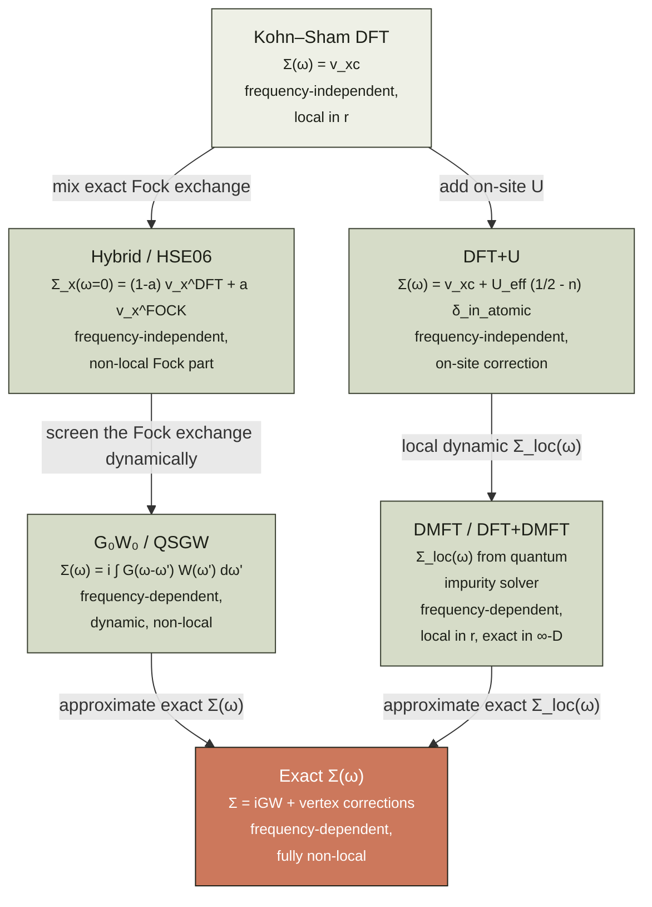
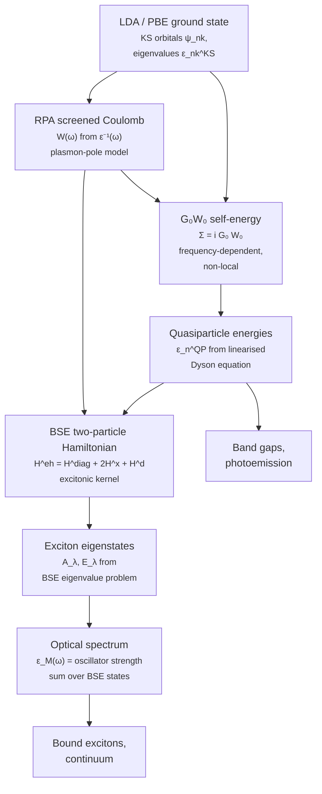
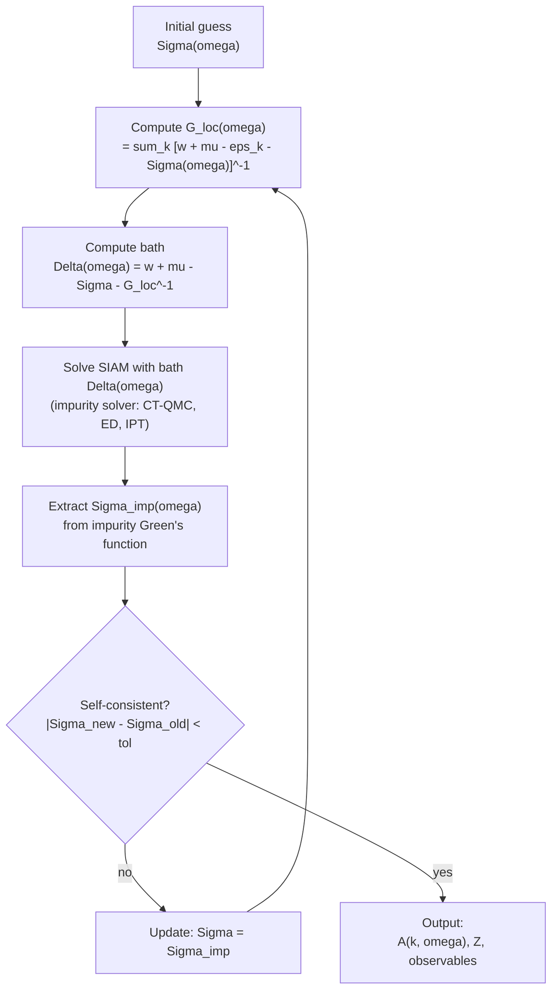

# Chapter 13 — DFT+U & beyond

> Standard Kohn–Sham DFT works because the exchange–correlation
> functional gets the *total* energy almost right.  Almost.  For
> materials with partially-filled $d$ and $f$ shells — the
> transition-metal oxides, the rare earths, the actinides, the
> high-$T_c$ cuprates — "almost" is not enough.  This chapter is
> about the corrections that fix it, and the methods that *are*
> enough.

By the end of [chapter 05]({{ "/dft-notes/chapter-05/" | relative_url }}) we had
the full Kohn–Sham machinery: a fictitious non-interacting
reference system that reproduces the interacting density, a
self-consistent loop, and a Jacobian's ladder of
exchange–correlation functionals — LDA, GGA, meta-GGA, hybrid.
For most of chemistry and materials science, the local and
semi-local rungs of that ladder are good enough; even the
hybrid rung (PBE0, B3LYP) gets the thermochemistry of organic
molecules within $\sim 0.2\,\text{eV}$.  The exceptions are the
materials where the most interesting physics lives in a *few
partially-filled orbitals* — the $3d$ shell of a transition
metal, the $4f$ shell of a lanthanide, the $5f$ shell of an
actinide.  There, the LDA and GGA make characteristic
mistakes: a Mott insulator comes out *metallic*, a band gap
is *underestimated by a factor of two*, and a satellite peak
in the photoemission spectrum is *missing entirely*.  This
chapter is the "where the rubber meets the road" chapter for
correlated materials.  We will, in order: state the
*qualitative* failure (§ 13.1); introduce the Hubbard model
that contains the missing physics (§ 13.2.2); derive the
DFT+U correction that adds Hubbard physics to LDA
(§§ 13.2.3–13.2.4); survey the *systematic* beyond-DFT
approaches — range-separated hybrid functionals (§ 13.2.5),
the GW self-energy (§ 13.2.6), and dynamical mean-field theory
(§ 13.2.7); close with the side-by-side comparison
(§ 13.2.8), a worked exact-diagonalisation example on the
4-site Hubbard model (§ 13.5), three graded problems (§ 13.6),
and an honest list of omissions (§ 13.10).

> **Reading note.**  This chapter assumes chapters 04
> (Kohn–Sham DFT) and 05 (XC functionals).  The reading of
> chapter 13 is *optional* for the rest of the chapters in
> this series — chapters 06–12 do not use it.  It is, however,
> the natural starting point for any reader who plans to
> compute the properties of transition-metal oxides,
> rare-earth compounds, or any other material with
> partially-filled $d$ or $f$ shells.

## 13.1 The claim

The headline is a one-line statement of where standard DFT
fails, what fixes it, and what each fix costs.

> **Claim.**  Standard Kohn–Sham DFT with a local or
> semi-local XC functional *systematically fails* for
> materials with partially-filled $d$ or $f$ shells:
> Mott insulators are predicted metallic, band gaps are
> underestimated by $\sim 50\%$, and the satellite peaks of
> the spectral function are absent.  The DFT+U correction
> restores the local physics at the price of an
> *empirical* Hubbard $U$ parameter.  The systematic,
> parameter-free many-body methods — screened hybrid
> functionals, the GW self-energy, and dynamical
> mean-field theory — capture the same physics at a
> sharply higher computational cost.

The claim is compact.  The rest of the chapter unpacks it.
The point of entry is the **atomic limit** of a
partially-filled shell.  An isolated Mn$^{2+}$ ion
($3d^5$, half-filled, $S = 5/2$) has an *integer* number
of $d$ electrons in the Hund's-rule ground state, and a
gap of $\sim 5\,\text{eV}$ to the first excited state.
In MnO (the rock-salt antiferromagnet) the *same* $d$
electrons are localised, the *same* gap is present, and
the material is a transparent insulator with a
$\sim 4\,\text{eV}$ gap.  The local physics has not
changed between the ion and the solid; what has changed
is the *competition* between the on-site Coulomb
repulsion $U$ that wants to localise the electrons and
the inter-site hopping $t$ that wants to delocalise
them.  When $U \gg t$, the electrons stay local and the
material is a **Mott insulator**; when $t \gg U$, the
electrons delocalise and the material is a band metal.
The phase boundary is the **Mott transition**, and it
is *not* a phase transition of the LDA — the standard
XC functional does not know about $U$ at all.  The
result is the characteristic failure:

\begin{equation}
\label{eq:ch-13-claim}
\boxed{\;
\Delta_\text{exp} \;\approx\; 2 \Delta_\text{LDA} \quad \text{and} \quad \Sigma_\text{sat}(\omega) \Big|_{\text{LDA}} \equiv 0 , \quad
\text{for } 3d\text{ oxides and } 4f\text{ compounds.}
\;}
\end{equation}

The first equality says that the LDA band gap is roughly
*half* the experimental gap; the second says that the
LDA spectral function $A(\omega)$ has no satellite (the
$\sim 6\,\text{eV}$ lower-Hubbard-band peak of Ni is
entirely missing).  The Hubbard $U$ enters as the only
parameter that has to be supplied by the user; once it
is in place, the rest of the machinery — the localised
orbital, the occupation matrix, the double-counting
correction — is fixed by the formalism.

The reader who wants a quick summary of the methods
covered in this chapter should jump straight to
§ 13.2.8 and return.  The reader who wants to see
*why* the LDA fails, and *how* each correction fixes
it, should read the chapter in order.

## 13.2 The derivation

This section contains the substantive material: the
failure mode of LDA, the Hubbard model, the DFT+U
correction, the choice of $U$, the hybrid-functional
route, the GW self-energy, and the DMFT outlook.

### 13.2.1 The failure of LDA for Mott insulators

The diagnostic numbers are old.  Table 1 collects the
experimental band gaps of the late-$3d$ transition-metal
monoxides (MnO, FeO, CoO, NiO) alongside the LDA
predictions and the GGA+U values with a representative
$U$ on the metal $3d$ shell.  The LDA underestimates
the gap by a factor of 2; the underestimation is
*systematic*, not statistical, and it correlates with
the number of $d$ electrons.

**Table 1. Band gaps of the late-$3d$ monoxides (eV).
The columns compare experiment, LDA, GGA (PBE), GGA+U
with $U_\text{eff} = U - J \sim 4$–$5\,\text{eV}$, and
HSE06 hybrid.  All values are for the antiferromagnetic
ground state.  The LDA/GGA systematic underestimation
is the signature of the missing Mott physics.**

| Compound | Configuration | $E_g^\text{exp}$ | $E_g^\text{LDA}$ | $E_g^\text{PBE}$ | $E_g^\text{GGA+U}$ | $E_g^\text{HSE06}$ |
|:---------|:--------------|-----------------:|-----------------:|-----------------:|-------------------:|-------------------:|
| MnO      | $3d^5$        | 3.9 – 4.1        | 0.8 – 1.0        | 0.9 – 1.2        | 3.5 – 3.9          | 3.6 – 4.0          |
| FeO      | $3d^6$        | 2.4              | 0.0 (metal!)     | 0.0 (metal!)     | 2.0 – 2.4          | 2.3 – 2.6          |
| CoO      | $3d^7$        | 2.5 – 2.8        | 0.0 (metal!)     | 0.0 (metal!)     | 2.3 – 2.7          | 2.5 – 2.9          |
| NiO      | $3d^8$        | 4.0 – 4.5        | 0.4 – 0.6        | 0.5 – 0.8        | 3.3 – 4.0          | 4.0 – 4.5          |

(Sources: experiment — van Elp *et al.*, *Phys. Rev. B*
**44**, 6090 (1991); LDA/PBE — standard plane-wave
calculations with a $30$–$50\,\text{Ry}$ cutoff;
GGA+U — Dudarev *et al.*, *Phys. Rev. B* **57**, 1505
(1998); HSE06 — Heyd, Scuseria, Ernzerhof, *J. Chem.
Phys.* **118**, 8207 (2003).)

The *quantitative* failure of LDA is bad enough.  The
*qualitative* failure is worse: FeO and CoO come out
*metallic* — the wrong phase, the wrong physics, the
wrong answer to the question "is this material a
conductor?".  The error has a name and a cause.

**Cause.**  The LDA XC potential $v_\text{xc}(\mathbf r)$
is a *local* functional of the density.  The
self-interaction correction that is missing for a
localised $d$ electron is a *non-local* effect — it
depends on the *occupancy* of the $d$ orbital on
*this* atom, not on the density at $\mathbf r$.  The
LDA cannot simulate it because it does not know which
density belongs to which orbital.  In the language of
the Hubbard model, the LDA XC potential acts on the
$d$ electron as if $U_\text{eff} = 0$ — it cannot
*penalise* the double occupancy of the $d$ shell.
The result is that the $d$ band is too wide (because
each $d$ electron sees the full hybridisation with
its neighbours) and the gap is too small (or
vanishing).

The **spectral function** is the cleanest way to see
the failure.  In a one-particle picture, the
photoemission spectrum at energy $\omega$ is

\begin{equation}
\label{eq:ch-13-spectral}
A(\mathbf k, \omega) \;=\; \sum_n \Bigl| \langle \phi_n | \psi_{\mathbf k} \rangle \Bigr|^2\, \delta(\omega - \varepsilon_n) ,
\end{equation}

a sum of delta functions at the quasi-particle (QP)
energies.  In a Mott insulator, the *many-body*
spectral function is qualitatively different.  The
ground state of the atom has integer $d$-occupancy;
removing one electron from the *occupied* $d$ band
costs an energy $\sim -(\varepsilon_d + U)$ (the
**lower Hubbard band**), and removing it from the
*unoccupied* $d$ band costs $\sim -\varepsilon_d$
(the **upper Hubbard band**).  The splitting between
the two is the **Hubbard $U$**:

\begin{equation}
\label{eq:ch-13-hubbard-split}
\Delta_\text{Hubbard} \;=\; \varepsilon_{d}^{UHB} - \varepsilon_{d}^{LHB} \;\approx\; U - W ,
\end{equation}

where $W$ is the $d$-band width.  The LDA misses
the splitting entirely: it puts the $d$ band in *one*
place, at the *bare* $\varepsilon_d$, and the
spectral weight that should be in the lower Hubbard
band is *redistributed* into a metallic quasi-particle
peak at $\varepsilon_d$.  The satellite at
$\sim -6\,\text{eV}$ in Ni (the famous "6-eV
satellite") is the lower Hubbard band, and LDA does
not produce it.

The conclusion is that the LDA is missing a *single*
piece of physics: the on-site Coulomb repulsion $U$
between two $d$ electrons on the same atom.  Adding
this piece — with an empirically determined $U$ — is
the DFT+U correction.

### 13.2.2 The Hubbard model

The minimal model that contains the missing physics
is the **single-band Hubbard model** on a lattice.  It
is the simplest model that has *both* the band-metal
limit (delocalised electrons, $U \to 0$) and the
atomic limit (localised electrons, $t \to 0$).  In
its grand-canonical form,

\begin{equation}
\label{eq:ch-13-hubbard}
\hat H \;=\; -t \sum_{\langle ij\rangle, \sigma} c_{i\sigma}^\dagger c_{j\sigma}
\;+\; U \sum_i n_{i\uparrow} n_{i\downarrow} \;-\; \mu \sum_{i, \sigma} n_{i\sigma} ,
\end{equation}

where $c_{i\sigma}^\dagger$ creates an electron of
spin $\sigma \in \{\uparrow, \downarrow\}$ on site $i$,
$\langle ij \rangle$ runs over nearest-neighbour pairs,
$n_{i\sigma} = c_{i\sigma}^\dagger c_{i\sigma}$ is the
spin-density operator, $t$ is the hopping, $U$ is the
on-site repulsion, and $\mu$ is the chemical potential.
On a 1-D chain of $L$ sites with periodic boundary
conditions, the model has $4^L$ states in the Fock
space — large, but exact-diagonalisable for $L \le 12$
on a laptop.

**The atomic limit.**  When $t = 0$ the sites decouple.
The single-site Hamiltonian is

\begin{equation}
\label{eq:ch-13-atomic}
\hat H_\text{at} \;=\; U n_{\uparrow} n_{\downarrow} - \mu (n_{\uparrow} + n_{\downarrow}) .
\end{equation}

The four Fock states of a single site have energies
$E_{00} = 0$, $E_{10} = E_{01} = -\mu$,
$E_{11} = U - 2\mu$.  At half-filling, $\langle n \rangle = 1$
and the chemical potential is $\mu = U/2$ (symmetric
between adding and removing an electron).  The
single-particle spectral function of the atom is two
delta functions at

\begin{equation}
\label{eq:ch-13-atomic-spectrum}
\varepsilon_\text{add} = -\mu = -U/2 , \qquad
\varepsilon_\text{rem} = -(U - \mu) = -U/2 ,
\end{equation}

both equal: the atom is *metallic* in the single-
particle sense, but the *real* spectrum has the
charge gap $U$ between the two- and three-particle
sectors, and the single-particle Green's function has
a non-trivial multi-peak structure:

\begin{equation}
\label{eq:ch-13-atomic-gf}
G_\text{at}(\omega) \;=\; \frac{1 - \langle n \rangle/2}{\omega + U/2 - i0^+}
\;+\; \frac{\langle n \rangle/2}{\omega - U/2 + i0^+} .
\end{equation}

For $\langle n \rangle = 1$ (half-filling), the two
poles are at $\omega = \mp U/2$ with equal weight
$1/2$.  The atom has a *single-particle gap* of $U$
and *no* quasi-particle peak in the gap.  This is
the Mott insulator at the level of a single site.

**The band limit.**  When $U = 0$ the model is the
free tight-binding model.  The single-particle
spectrum is a band of width $W = 2z t$ where $z$ is
the coordination number (e.g. $W = 4t$ for a 1-D chain).
At half-filling the band is full and the system is
an insulator if the band has a gap (e.g. a bipartite
lattice at half-filling) or a metal otherwise.

**The Mott transition.**  As $U/t$ increases from
zero, the atomic limit takes over and a gap opens
between the lower and upper Hubbard bands.  The
critical $U_c$ at which the gap opens is the
**Mott transition**.  For the 1-D Hubbard model the
**Bethe-ansatz solution** (Lieb & Wu, 1968) gives
the exact answer: the system is insulating for *any*
$U > 0$ at half-filling.  In higher dimensions the
DMFT solution (§ 13.2.7) gives a finite $U_c$ for
the infinite-dimensional Bethe lattice at
$U_c/W \approx 1.46$, with a hysteresis region
between the insulating and metallic phases.

For the purposes of this chapter the key fact is
the *form* of the single-particle spectrum in the
strongly-correlated regime $U \gg t$:

\begin{equation}
\label{eq:ch-13-hubbard-spectrum}
A(\mathbf k, \omega) \;=\; Z\, \delta(\omega - \varepsilon_\text{QP}(\mathbf k))
\;+\; A_\text{inc}(\omega) ,
\end{equation}

a quasi-particle peak of weight $Z \ll 1$ at the
QP energy $\varepsilon_\text{QP}$, plus an incoherent
background $A_\text{inc}$ carrying the weight $1 - Z$.
The LDA reproduces *only* the quasi-particle peak
(when it exists) and assigns it the *full* spectral
weight; the missing $1 - Z$ is the **Mott physics**
the LDA cannot describe.

### 13.2.3 DFT+U (Liechtenstein 1995; Dudarev 1998)

DFT+U adds the Hubbard-model physics to a chosen
set of atomic-like orbitals $\{|m \sigma\rangle\}$
on each correlated atom.  The energy functional is

\begin{equation}
\label{eq:ch-13-dft+u-energy}
E_\text{DFT+U}[\rho, n^\sigma] \;=\; E_\text{DFT}[\rho] \;+\; E_\text{Hubbard}[\{n^\sigma\}] \;-\; E_\text{dc}[\{n^\sigma\}] .
\end{equation}

The first term is the standard DFT total energy
([chapter 04]({{ "/dft-notes/chapter-04/" | relative_url }})).  The
second is the Hubbard-model on-site energy.  The
third is the **double-counting correction** that
removes the on-site contribution already present
in $E_\text{DFT}$ (because LDA has *some* on-site
Coulomb repulsion, just not the right one).  The
occupations $n^\sigma$ are projections of the KS
orbitals onto the atomic basis.

**The atomic basis.**  The correlated subspace on
atom $I$ is spanned by a set of $M$ orthonormal
atomic orbitals $\phi_I^m(\mathbf r)$ with $m = 1,
\ldots, M$.  For a $3d$ transition metal $M = 5$
(the five $d$ orbitals in some real-spherical
convention); for a lanthanide $M = 7$ (the seven
$f$ orbitals).  The atomic orbitals are typically
the all-electron atomic partial waves, projected
out of the PAW ([chapter 08]({{ "/dft-notes/chapter-08/" | relative_url }}))
augmentation spheres.  In a non-PAW code the
atomic orbitals are often the **pseudo-atomic
orbitals** generated by solving the isolated-atom
problem in the chosen XC functional.

**The occupation matrix.**  Project the KS
orbitals onto the atomic basis:

\begin{equation}
\label{eq:ch-13-occ-matrix}
n^\sigma_{I, mm'} \;=\; \sum_{n, \mathbf k}^\text{occ} f_{n \mathbf k}\,
\langle \phi_I^m | \psi_{n \mathbf k}^\sigma \rangle \,
\langle \psi_{n \mathbf k}^\sigma | \phi_I^{m'} \rangle .
\end{equation}

The sum is over all occupied KS orbitals, $f_{n
\mathbf k}$ is the occupation number ($0 \le f \le 1$
in spin-paired systems, $0$ or $1$ in spin-polarised),
and the inner products are the projection of the
KS orbital onto the atomic orbital.  In a plane-wave
PAW code the projections are evaluated inside the
PAW augmentation sphere; in a localised-orbital code
they are evaluated by direct integration.  The
occupation matrix is **Hermitian** and **positive
semi-definite**, with $\text{tr}\, n^\sigma_I = N_I^\sigma$
the spin-projected $d$ count on atom $I$.

**The rotationally-invariant Hubbard energy
(Liechtenstein, Anisimov, Zaanen, Andersen 1995).**  The
on-site Coulomb matrix of the Hubbard model has
four independent matrix elements in the atomic
basis: the direct $U = \langle mm | m' m' \rangle$
(the "Coulomb $U$"), the exchange $J = \langle m m'
| m' m \rangle$ (the "Hund's $J$"), and the two
channel-dependent combinations.  The
rotationally-invariant form of the Hubbard energy
is

\begin{equation}
\label{eq:ch-13-liechtenstein}
E_\text{Hubbard}^\text{LA} \;=\; \frac{1}{2} \sum_{I, \sigma} \sum_{\{m\}} \Bigl\lbrace
U_{m m' m'' m'''}\, n^\sigma_{I, m m'''}\, n^{-\sigma}_{I, m' m''}
\;+\; (U_{m m' m'' m'''} - U_{m m' m''' m''})\, n^\sigma_{I, m m''}\, n^\sigma_{I, m' m'''} \Bigr\rbrace ,
\end{equation}

where $U_{m m' m'' m'''}$ are the on-site Coulomb
integrals evaluated in the atomic basis.  In the
**Dudarev simplification** (Dudarev *et al.*,
*Phys. Rev. B* **57**, 1505 (1998)) the four-index
tensor is reduced to a single effective $U$:

\begin{equation}
\label{eq:ch-13-dudarev}
E_\text{Hubbard}^\text{D} \;=\; \frac{U_\text{eff}}{2} \sum_{I, \sigma} \sum_m n^\sigma_{I, mm}\Bigl(1 - n^\sigma_{I, mm}\Bigr) ,
\end{equation}

where $U_\text{eff} = U - J$ is the difference of
the direct and exchange integrals.  The
$n(1 - n)$ form is the **penalty function**: for
an integer occupation $n = 0$ or $n = 1$ the
penalty is zero (the configuration is a proper
Slater determinant with the right number of
electrons), and for a half-filled occupation
$n = 1/2$ the penalty is maximal — the
configuration is penalised, the system prefers
integer occupations, and a gap opens.  The
Dudarev form is what VASP, Quantum ESPRESSO, and
most modern plane-wave codes implement.

**The double-counting correction.**  The LDA XC
energy already contains a mean-field on-site
Coulomb repulsion (the LDA "knows" that two
electrons on the same atom repel each other, but
it does not know *how* strongly).  The Hubbard
energy \eqref{eq:ch-13-dudarev} is in addition to
that.  The double-counting correction removes the
LDA part:

\begin{equation}
\label{eq:ch-13-dc}
E_\text{dc} \;=\; \frac{U_\text{eff}}{2} \sum_{I, \sigma} \sum_m n^\sigma_{I, mm}\Bigl(N_I^\sigma/2 - n^\sigma_{I, mm}\Bigr) ,
\end{equation}

a simple quadratic form whose specific value is
the **around-mean-field** (AMF) double counting.
An alternative is the **fully-localised limit**
(FLL) double counting, in which the reference
configuration is the *atomic* limit (integer
occupations).  Both give qualitatively similar
results for the late transition-metal oxides, but
the AMF is preferred for metallic systems and
the FLL for strongly-correlated insulators.

The complete DFT+U functional is
\eqref{eq:ch-13-dft+u-energy} with
\eqref{eq:ch-13-dudarev} and \eqref{eq:ch-13-dc}.
The functional derivative with respect to the
occupation matrix gives the **Hubbard potential**

\begin{equation}
\label{eq:ch-13-hubbard-pot}
V^\sigma_{I, mm'} \;=\; U_\text{eff} \Bigl(\tfrac{1}{2} - n^\sigma_{I, mm'}\Bigr) \delta_{mm'} ,
\end{equation}

which is added to the KS Hamiltonian.  The
effective KS equation in the presence of the
Hubbard correction is

\begin{equation}
\label{eq:ch-13-ks+u}
\Bigl[ \hat H_\text{KS} + \hat V_\text{Hub} \Bigr] |\psi_{n \mathbf k}^\sigma\rangle
\;=\; \varepsilon_{n \mathbf k}^\sigma |\psi_{n \mathbf k}^\sigma\rangle ,
\end{equation}

with $\hat V_\text{Hub}$ acting only on the
correlated subspace (it is zero outside).  The
self-consistent loop is the standard KS loop
([chapter 04]({{ "/dft-notes/chapter-04/" | relative_url }})) with
the additional step of projecting the converged
orbitals onto the atomic basis to update the
occupation matrix, and adding the Hubbard
potential to the Hamiltonian.  Convergence is
usually slower than in plain DFT — the occupation
matrix is a strongly non-linear function of the
orbitals.

**The double-counting paradox.**  The reader may
wonder: how can the LDA, which "does not know
about $U$", have a double-counting problem?  The
answer is that the LDA *does* have an on-site
Coulomb repulsion — it is implicit in the
parameterisation of the LDA XC energy.  The
double-counting correction removes the LDA's
implicit, average, mean-field on-site repulsion
and replaces it with the explicit, exact,
orbital-dependent Hubbard repulsion.  The two
are different in general; the difference is what
DFT+U adds to LDA.

### 13.2.4 Choosing U

The single free parameter of DFT+U is $U_\text{eff}$
(or, in the Liechtenstein form, $U$ and $J$).
Three classes of methods are used to choose it.

**Empirical fit.**  The simplest: run a series of
DFT+U calculations with different $U$ values and
pick the one that best reproduces a known
experimental property (band gap, lattice
parameter, formation energy, magnetic moment).
The typical range for transition-metal $3d$
orbitals is $U_\text{eff} = 3$–$6\,\text{eV}$;
for lanthanide $4f$ orbitals it is
$U_\text{eff} = 5$–$7\,\text{eV}$; for actinide
$5f$ orbitals it is $U_\text{eff} = 4$–$6\,\text{eV}$.
The advantage is that no additional code is
needed.  The disadvantage is that the resulting
$U$ is *property-dependent*: the $U$ that
reproduces the band gap of NiO may not reproduce
its magnetic moment or its equation of state.

**Linear-response $U$ (Cococcioni 2005).**  A
self-consistent *ab initio* method that determines
$U$ from the response of the system to a small
perturbation.  The protocol is:

1. Apply a small shift $\alpha_I$ to the
    potential on atom $I$ (the *perturbation*).
2. Compute the response of the occupation
    $n_I^\sigma$ of the correlated shell.
3. Extract the *self-consistent* response
    $\chi_{IJ} = \partial n_I / \partial \alpha_J$.
4. Define
    $U_\text{eff} = (\chi_0^{-1} - \chi^{-1})_{II}$
    where $\chi_0$ is the *non-self-consistent*
    response (the bare LDA response without
    re-summing the Hubbard potential) and
    $\chi$ is the *self-consistent* response.

The linear-response $U$ is *property-independent*
in the sense that it depends only on the
electronic structure of the system, not on the
property being fitted.  It typically falls in
the same range as empirical $U$ values
(transition-metal $3d$: $U_\text{eff} \sim 3$–$5$
eV; rare-earth $4f$: $U_\text{eff} \sim 5$–$7$
eV).  The implementation is in the
[Cococcioni](<https://github.com/epfl-theos/RespKit>)
linear-response toolkit; modern PAW codes
include it as a built-in option.

**Constrained DFT (Dederichs *et al.* 1984;
Kuzian *et al.* 2010).**  The earliest
*ab initio* method.  Constrain the number of
electrons in the correlated shell to $N_I$ and
compute the energy of the constrained system
$E(N_I)$.  The derivative
$\partial^2 E / \partial N_I^2$ is the Hubbard
$U$ in the Janak sense (the curvature of the
energy with respect to the constrained
occupation).  The constraint is implemented by
adding a Lagrange multiplier $\lambda_I$ to the
Hamiltonian:

\begin{equation}
\label{eq:ch-13-constrained}
\hat H_\lambda \;=\; \hat H_\text{KS} \;+\; \sum_I \lambda_I \hat n_I ,
\end{equation}

where $\hat n_I = \sum_{m \sigma} |\phi_I^m
\rangle \langle \phi_I^m|$ is the constrained
occupation operator.  The $U$ from constrained
DFT is the **constrained-occupation $U$**:

\begin{equation}
\label{eq:ch-13-constrained-u}
U_\text{constrained} \;=\; \frac{\partial^2 E}{\partial N_I^2}
\;=\; \frac{\partial \lambda_I}{\partial N_I} .
\end{equation}

The implementation is conceptually simple but
technically delicate: the constraint must be
applied only to the on-site atomic orbitals
(not the full valence), and the
self-consistency of the constrained system must
be verified.

**Constrained RPA (cRPA, Aryasetiawan *et al.*
2004).**  The most rigorous, most expensive, and
most property-independent.  Compute the
**constrained polarisability** $\tilde P(\mathbf
r, \mathbf r', \omega)$ in which the screening
channels that are *already* included in the
Hubbard model (the on-site atomic excitations)
are removed.  The constrained $U$ is then the
Coulomb matrix element of the partially-screened
interaction:

\begin{equation}
\label{eq:ch-13-crpa}
U_{m m' m'' m'''}^\text{cRPA} \;=\; \int d\mathbf r\, d\mathbf r' \,
\phi_I^{m*}(\mathbf r) \phi_I^{m'}(\mathbf r)\,
\tilde W(\mathbf r, \mathbf r')\, \phi_I^{m''*}(\mathbf r') \phi_I^{m'''}(\mathbf r') ,
\end{equation}

where $\tilde W$ is the constrained
screened-Coulomb interaction.  cRPA gives
*frequency-dependent* $U(\omega)$: the static
$U(\omega = 0)$ is the relevant input for
DFT+U, but the full frequency dependence is
needed for the $G_0 W_0$ and cRPA+DMFT methods.
The implementation is in several
post-processing codes; the cost is comparable
to a $G_0 W_0$ calculation.

**The trade-off.**  Empirical $U$ is cheap and
fits the target property but transfers poorly.
Linear-response $U$ is cheap and transfers well
within a class of materials.  Constrained-DFT
$U$ is intermediate in cost and transfers well
to related compounds.  cRPA is expensive and
gives the most "intrinsic" $U$, but the
frequency-dependence is non-trivial.  In
practice most production calculations use
*empirical* $U$ values from the
[Cococcioni linear-response](<https://doi.org/10.1103/PhysRevB.71.035105>)
benchmarks, or the
[Materiae](<https://github.com/oliviersvr/materiae>)
fitted library.

### 13.2.5 Hybrid functionals for solids (HSE06)

The DFT+U correction is local in real space — it
acts on the on-site atomic orbital.  The
**range-separated hybrid** is a complementary
correction that acts on the *non-local* Fock
exchange but limits it to the *short range*.  The
canonical parameterisation is HSE06 (Heyd,
Scuseria, Ernzerhof, *J. Chem. Phys.* **118**,
8207 (2003)):

\begin{equation}
\label{eq:ch-13-hse}
E_\text{xc}^\text{HSE} \;=\; a\, E_x^\text{HF,SR}(\omega)
\;+\; (1 - a)\, E_x^\text{PBE,SR}(\omega)
\;+\; E_x^\text{PBE,LR}(\omega)
\;+\; E_c^\text{PBE} ,
\end{equation}

where $E_x^\text{HF,SR}$ is the short-range part
of the Hartree–Fock exchange, $E_x^\text{PBE,SR}$
and $E_x^\text{PBE,LR}$ are the short- and
long-range parts of the PBE exchange, and
$E_c^\text{PBE}$ is the PBE correlation.  The
**range-separation parameter** is
$\omega = 0.11\,\text{bohr}^{-1}$ (or
$\omega = 0.208\,\text{Å}^{-1}$).  At distances
$r \ll 1/\omega \sim 9\,\text{bohr}$, the
Fock exchange is fully active; at $r \gg 1/\omega$
it is screened out.  The mixing parameter
$a = 0.25$ is fixed at the PBE0 value.

The motivation is twofold.  First, in a *molecule*
the Fock exchange is long-ranged and important;
PBE0 (with full-range Fock) gives excellent
thermochemistry.  Second, in a *solid* the
Fock exchange is *also* long-ranged, but it is
expensive (formally $\mathcal O(K^4)$ in a Gaussian
basis, $\mathcal O(N^2)$ in a plane-wave basis
with FFT techniques) and the long-range part is
partially cancelled by the correlation.  HSE06
*short-circuits* the long-range Fock — it
substitutes the long-range PBE exchange for the
long-range Fock — and recovers the thermochemistry
of the short range (where the Fock matters) at
a manageable cost.

The HSE06 band gap of NiO is $\sim 4.3\,\text{eV}$
(Table 1), in good agreement with experiment.  The
mechanism is the same as in PBE0: the Fock exchange
adds a *non-local* self-interaction correction that
opens the band gap.  The HSE06 *satellite* structure
in the spectral function is *better* than PBE (it
captures part of the lower Hubbard band) but
*worse* than $G_0 W_0$ (it does not capture the
full satellite position).

The cost of HSE06 is dominated by the evaluation of
the short-range Fock exchange.  In a plane-wave
code with $N_\text{PW}$ plane waves and $N_k$
k-points, the cost is
$\mathcal O(N_\text{PW}^2 \cdot N_k \cdot N_b)$
where $N_b$ is the number of occupied bands, and
the prefactor is large enough that HSE06 is
$\sim 10$–$30\times$ more expensive than PBE for a
system of the same size.  In a Gaussian code the
ERI machinery of [chapter 06]({{ "/dft-notes/chapter-06/" | relative_url }}) is used
directly; the cost is $\mathcal O(K^4)$ and HSE06
is $\sim 100$–$1000\times$ PBE.

### 13.2.6 The GW approximation

The **GW approximation** is the natural
many-body generalisation of the hybrid
functional: instead of adding *one quarter* of
the Fock exchange (PBE0) or the *short-range* Fock
exchange (HSE06), the GW approximation uses the
*fully screened* exchange and adds a
*frequency-dependent* self-energy.  The
self-energy is the convolution of the single-
particle Green's function $G$ and the screened
Coulomb interaction $W$:

\begin{equation}
\label{eq:ch-13-gw-sigma}
\Sigma(\mathbf r, \mathbf r', \omega) \;=\; \frac{i}{2\pi} \int d\omega'\, G(\mathbf r, \mathbf r', \omega - \omega')\, W(\mathbf r, \mathbf r', \omega') .
\end{equation}

In frequency space the convolution is a product:
the GW self-energy is the product $GW$ in
frequency-momentum space.  The name "GW" comes
from the $G \cdot W$ structure.

**The $G_0 W_0$ approximation.**  The standard
non-self-consistent implementation:

\begin{equation}
\label{eq:ch-13-g0w0}
G = G_0 \quad (\text{DFT Green's function}), \qquad
W = (1 - v P)^{-1} v \quad (\text{RPA screened Coulomb}), \qquad
\Sigma = i G_0 W_0 .
\end{equation}

The input is the DFT ground state; $G_0$ is
constructed from the KS eigenvalues and orbitals,
$P$ is the *polarisability* (the density response
to a perturbation), $W$ is the screened Coulomb
computed in the **random-phase approximation**
(RPA, i.e. the time-dependent Hartree
approximation), and $\Sigma$ is the resulting
self-energy.  The QP energies are the solutions
of the **Dyson equation**

\begin{equation}
\label{eq:ch-13-dyson}
\Bigl[ \hat H_\text{KS} + \hat \Sigma(\varepsilon_n^\text{QP}) - \varepsilon_n^\text{QP} \Bigr] |\psi_n\rangle \;=\; 0 ,
\end{equation}

a *non-linear* eigenvalue problem in the energy.
In practice one linearises around the KS
eigenvalue $\varepsilon_n^\text{KS}$:

\begin{equation}
\label{eq:ch-13-qp-linear}
\varepsilon_n^\text{QP} \;\approx\; \varepsilon_n^\text{KS} \;+\; Z_n\, \langle \psi_n | \Sigma(\varepsilon_n^\text{KS}) - v_\text{xc} | \psi_n \rangle ,
\end{equation}

where the **quasi-particle weight** is

\begin{equation}
\label{eq:ch-13-z-factor}
Z_n \;=\; \Bigl( 1 - \Bigl\langle \psi_n \Bigr| \frac{\partial \Sigma(\omega)}{\partial \omega} \Bigl|_{\omega = \varepsilon_n^\text{KS}} \Bigl| \psi_n \bigr\rangle \Bigr)^{-1} .
\end{equation}

For weakly-correlated semiconductors (Si, Ge,
GaAs), $Z_n \approx 0.8$–$0.9$ and the linear
approximation is excellent.  For correlated
materials (NiO, MnO) $Z_n \approx 0.4$–$0.6$ and
the linearisation is borderline; a self-consistent
$GW$ is needed for quantitative accuracy.

**The GW self-consistency ladder.**  $G_0 W_0$ is
the *cheapest* $GW$ approximation; it is the
starting point.  Three higher levels of
self-consistency are possible:

\begin{equation}
\label{eq:ch-13-gw-ladder}
\boxed{
G_0 W_0 \;\to\; ev GW \;\to\; ev GW_0 \;\to\; \text{full sc} GW
}
\end{equation}

- **$G_0 W_0$** (Hedin's 1969 starting point) —
  one-shot $G$ from DFT, one-shot $W$ from $G_0$.
  Cheap ($\mathcal O(N^4)$ in plane waves),
  depends on the KS starting point.
- **Eigenvalue-only $GW$ (ev $GW$)** — iterate
  the QP energies only, keeping $G$ and $W$ at
  the $G_0 W_0$ level.  Mildly more expensive,
  somewhat less starting-point dependent.
- **$ev GW_0$** — iterate the QP energies, update
  $G$, but keep $W$ fixed at the $G_0 W_0$ value.
  Reduces the starting-point dependence
  significantly; widely used for semiconductors.
- **Full self-consistent $GW$** — iterate $G$ and
  $W$ until self-consistency.  In principle the
  best, in practice expensive and known to
  *overestimate* band gaps for some materials
  (the "self-consistency overshoot").  The
  **$sc GW$** with the **quasi-particle
  self-consistent $GW$** (QSGW, Faleev *et al.*
  2004) variant is the standard.

**The GW band gap of Si.**  Experiment: 1.17 eV
(2 K, indirect).  LDA: 0.55 eV (50%
underestimate).  $G_0 W_0$ (PBE starting point):
0.95 eV.  $G_0 W_0$ (with a "better" starting
point, e.g. a hybrid): 1.10 eV.  $QSGW$: 1.20 eV.
HSE06: 1.15 eV.  All systematic methods give a
band gap within $\sim 0.1\,\text{eV}$ of
experiment, and all are *parameter-free*.  The GW
approximation is the *de facto* gold standard for
the band gaps of weakly-correlated semiconductors.

**The 6-eV satellite of Ni.**  The Ni $3d$ band
of Ni metal has a famous $\sim 6\,\text{eV}$
satellite in the photoemission spectrum, the
"6-eV satellite".  The LDA spectral function has
*no* satellite.  $G_0 W_0$ reproduces the
satellite, and at the right energy.  The
mechanism: the self-energy $\Sigma(\omega)$ has
a frequency dependence that, in the spectral
representation,

\begin{equation}
\label{eq:ch-13-sigma-spectral}
\Sigma(\omega) \;=\; v_\text{xc} \;+\; \int_0^\infty d\omega' \,
\frac{S(\omega')}{\omega - \omega' - i0^+ \cdot \text{sgn}(\omega - \mu)} ,
\end{equation}

where $S(\omega)$ is the *spectral function of
the self-energy*.  The structure in $S(\omega)$
at $\sim 6\,\text{eV}$ produces a pole in
$\Sigma$ at the same energy, which in turn
produces the satellite in the *single-particle*
spectral function $A(\omega) = \pi^{-1}
|\text{Im}\, G|$.  The satellite is therefore
*inherited* from the plasmon satellite of $W$.

### 13.2.7 DMFT outlook

The **dynamical mean-field theory** (DMFT, Metzner
& Vollhardt 1989, Georges & Kotliar 1992,
Georges, Kotliar, Krauth, Rozenberg 1996) is the
many-body method that treats the *local* quantum
fluctuations of a lattice model *exactly* by
mapping it to a single-impurity Anderson model
(SIAM) in a self-consistent bath.

**The mapping.**  The lattice Hubbard model
\eqref{eq:ch-13-hubbard} is mapped to a single
impurity site embedded in a bath of non-interacting
electrons, with the impurity described by the
Anderson Hamiltonian

\begin{equation}
\label{eq:ch-13-anderson}
\hat H_\text{And} \;=\; \sum_{k, \sigma} \varepsilon_k\, a_{k\sigma}^\dagger a_{k\sigma}
\;+\; \sum_{k, \sigma} \Bigl( V_k\, a_{k\sigma}^\dagger d_{\sigma} + V_k^*\, d_{\sigma}^\dagger a_{k\sigma} \Bigr)
\;-\; \mu \sum_{\sigma} d_{\sigma}^\dagger d_{\sigma}
\;+\; U\, d_{\uparrow}^\dagger d_{\uparrow}\, d_{\downarrow}^\dagger d_{\downarrow} ,
\end{equation}

where $d_\sigma$ destroys an electron on the
impurity, $a_{k\sigma}$ destroys an electron in
the bath state $k$, $\varepsilon_k$ is the bath
energy, and $V_k$ is the hybridisation.  The
**hybridisation function**

\begin{equation}
\label{eq:ch-13-hybridisation}
\Delta(\omega) \;=\; \sum_k \frac{|V_k|^2}{\omega - \varepsilon_k + i0^+}
\end{equation}

encodes the bath.  The impurity Green's function
is

\begin{equation}
\label{eq:ch-13-impurity-gf}
G_\text{imp}(\omega) \;=\; \Bigl[ \omega + \mu - \Delta(\omega) - \Sigma_\text{imp}(\omega) \Bigr]^{-1} .
\end{equation}

The DMFT self-consistency loop is

\begin{equation}
\label{eq:ch-13-dmft-loop}
\boxed{
G_\text{loc}(\omega) = \sum_{\mathbf k} \Bigl[ \omega + \mu - \varepsilon_{\mathbf k} - \Sigma(\omega) \Bigr]^{-1} , \quad
\Delta(\omega) = \omega + \mu - \Sigma(\omega) - G_\text{loc}^{-1}(\omega) .
}
\end{equation}

The left equation computes the *local* Green's
function of the lattice by summing over the band
energies $\varepsilon_{\mathbf k}$ with the
*current* self-energy $\Sigma(\omega)$.  The right
equation inverts to find the bath that would
reproduce this $G_\text{loc}$ as the impurity
Green's function of the SIAM.  The SIAM is solved
with a **quantum impurity solver** (CT-QMC,
Hirsch–Fye QMC, NCA, or exact diagonalisation),
the resulting $\Sigma_\text{imp}$ is identified
with $\Sigma$, and the loop is iterated until
$\Sigma$ is self-consistent.

**The Mott transition in DMFT.**  The DMFT
solution of the Hubbard model on the Bethe
lattice (infinite coordination) gives a
first-order Mott transition at
$U_c/W \approx 1.46$ at zero temperature, with a
hysteresis region between $U_{c1} \approx 1.43$
and $U_{c2} \approx 1.50$.  At $T > 0$ the
transition becomes a crossover with a smooth
quasi-particle weight $Z(U, T)$ that vanishes
as $T \to 0$ for $U > U_c$.  The spectral
function in the insulating phase has the
two-Hubbard-band structure of
\eqref{eq:ch-13-hubbard-spectrum} with $Z = 0$;
in the metallic phase it has a sharp QP peak
with weight $Z < 1$ plus incoherent Hubbard
sidebands.  DMFT is the natural method for
finite-temperature correlated systems where
thermal fluctuations are important.

**DMFT and DFT.**  The practical marriage of
DMFT with DFT is **DFT+DMFT** (Kotliar *et al.*
2006, Held *et al.* 2008).  The DFT step
provides the *non-interacting* band structure
$\varepsilon_{\mathbf k}$ and the local basis
$\{|I m \sigma\rangle\}$; the DMFT step
self-consistently computes the local self-energy
$\Sigma_{I, mm'}(\omega)$ on each correlated
atom.  The full spectral function is

\begin{equation}
\label{eq:ch-13-dft+dmft}
A(\mathbf k, \omega) \;=\; -\frac{1}{\pi} \text{Im}\, \sum_{m m'}\,
\Bigl[ \omega + \mu - \hat H_\text{KS}(\mathbf k) - \hat \Sigma(\omega) \Bigr]^{-1}_{m m'} ,
\end{equation}

a momentum-resolved spectral function that
contains the full *dynamic* (frequency-dependent)
self-energy.  DFT+DMFT is the method of choice
for correlated materials at finite temperature
($\delta$-Pu, V$_2$O$_3$, the ferropnictides,
the cuprates in the normal state).

### 13.2.8 The comparison table

The methods covered in this chapter are listed in
Table 2, ordered by physical content (top: simplest;
bottom: most expensive) and by the type of
correction they apply to the LDA.

**Table 2. Methods for correlated materials.  Cost is
relative to one LDA iteration on the same system.  Accuracy
is the typical error on band gaps and structural properties
of late-$3d$ oxides.**

| Method | Cost (rel.) | Free of $U$? | Band gap | Satellite | Transferable? | Best for |
|:-------|------------:|:-------------:|:--------:|:---------:|:-------------:|:---------|
| LDA / GGA | 1× | yes | 50% off | no | yes | screening, large cells |
| LDA+U (empirical) | 1.5× | no | within 10% | no | no | fitting known data |
| LDA+U (linear-response) | 1.5× | yes (self-consistent) | within 15% | no | within class | parameter-free DFT+U |
| Hybrid (PBE0) | 100–1000× | yes | within 10% | partial | yes | molecules, some solids |
| HSE06 | 10–30× | yes | within 10% | partial | yes | solids at moderate cost |
| $G_0 W_0$ | 100–1000× | yes | within 5% | yes | yes | weakly-correlated |
| $QSGW$ | 1000× | yes | within 5% | yes | yes | the gold standard |
| DMFT | 100× | yes | exact (atomic limit) | yes | within class | finite $T$, Mott physics |
| DFT+DMFT | 1000× | yes | within 10% | yes | yes | correlated metals |

The table is the "shopping list" of correlated-
materials methods.  The empirical DFT+U is the
*workhorse* (cheap, well-tested, fits most
properties within $\sim 10\%$).  The range-separated
hybrid (HSE06) is the *parameter-free* alternative
(more expensive, no $U$ to fit).  The GW
approximation is the *gold standard* for band gaps
(expensive, parameter-free, captures the
satellite).  The DMFT is the *right* answer for
strongly-correlated materials at finite temperature
(very expensive, captures the Mott transition).

## 13.3 The code

We illustrate the DFT+U correction and the Hubbard
Mott transition with a self-contained Python
calculation.  The full script lives at
[`dft_notes/python_codes/chapter_13/01-hubbard-4site-exact-diag.py`]({{ site.baseurl }}/dft_notes/python_codes/chapter_13/01-hubbard-4site-exact-diag.py);
the snippet below is the runnable core.  It
exact-diagonalises the half-filled 4-site Hubbard
chain with periodic boundary conditions, computes
the charge gap, the double occupancy, the
quasi-particle weight, and the spectral function,
and plots them as a function of $U/t$.

```python
"""
01-hubbard-4site-exact-diag.py
==============================

Half-filled 4-site Hubbard chain with periodic
boundary conditions, exact diagonalisation in the
(N_up, N_dn) = (2, 2) sector of the Fock space.

Computes the charge gap, double occupancy, and
single-particle spectral function A(k, omega) as
functions of U/t, and plots the Mott transition.

Run from the repo root:
    python dft_notes/python_codes/chapter_13/01-hubbard-4site-exact-diag.py
"""

import os
import numpy as np
import matplotlib
matplotlib.use("Agg")  # headless
import matplotlib.pyplot as plt
from itertools import product

# ------------------------------------------------------------------
# Build the Fock basis in the (N_up, N_dn) sector
# ------------------------------------------------------------------
def fock_basis(N_sites: int, n_up: int, n_dn: int):
    """Return (basis, occs) where basis[i] is a
    tuple (sigma, site) labelling the i-th basis
    state in the (n_up, n_dn) sector of N_sites.

    Each basis state is encoded as a length-N_sites
    binary string for each spin.
    """
    sites = range(N_sites)
    up_states = [s for s in product(sites, repeat=n_up) if len(set(s)) == n_up]
    dn_states = [s for s in product(sites, repeat=n_dn) if len(set(s)) == n_dn]
    return list(zip(up_states, dn_states))

# ------------------------------------------------------------------
# Hubbard Hamiltonian in the (N_up, N_dn) sector
# ------------------------------------------------------------------
def hubbard_hamiltonian(N: int, n_up: int, n_dn: int, t: float, U: float):
    """Build the Hubbard Hamiltonian H = H_t + H_U on N sites
    with periodic boundary conditions, in the (n_up, n_dn) sector.
    """
    basis = fock_basis(N, n_up, n_dn)
    index = {b: i for i, b in enumerate(basis)}
    dim = len(basis)
    H = np.zeros((dim, dim), dtype=np.float64)

    for i, b in enumerate(basis):
        up, dn = b
        # Diagonal:  U * n_up * n_dn  (since each doubly-occupied site
        # contributes U)
        doubly = len(set(up) & set(dn))
        H[i, i] = U * doubly

        # Off-diagonal: hopping of an up-spin
        for k, site in enumerate(up):
            for shift in (-1, +1):
                target_site = (site + shift) % N
                if target_site in up:
                    continue
                new_up = list(up)
                new_up[k] = target_site
                new_up = tuple(sorted(new_up))
                j = index[(new_up, dn)]
                H[i, j] += -t
                H[j, i] += -t

        # Off-diagonal: hopping of a dn-spin (same recipe)
        for k, site in enumerate(dn):
            for shift in (-1, +1):
                target_site = (site + shift) % N
                if target_site in dn:
                    continue
                new_dn = list(dn)
                new_dn[k] = target_site
                new_dn = tuple(sorted(new_dn))
                j = index[(up, new_dn)]
                H[i, j] += -t
                H[j, i] += -t

    return np.array(H), basis

# ------------------------------------------------------------------
# The DFT+U energy functional on a 2-level toy system
# ------------------------------------------------------------------
def dft_plus_u_energy(n: np.ndarray, U_eff: float, J: float = 0.0) -> float:
    """Dudarev DFT+U penalty on a single atom with M = 2 orbitals.

    E_U = (U_eff / 2) sum_m n_m (1 - n_m).

    For a half-filled M=2 atom with n = (1/2, 1/2), the penalty
    is U_eff/2 -- the LDA uniform density is penalised, the
    integer-occupation n = (1, 0) or (0, 1) configurations are
    not.
    """
    return 0.5 * U_eff * np.sum(n * (1.0 - n))

def toy_dft_plus_u_scan(U_eff_list):
    """For each U_eff, find the occupation matrix n of a 2-orbital
    atom that minimises the DFT+U energy.

    The "DFT part" of the energy is, for the purpose of this
    example, a constant; the DFT+U energy reduces to the
    penalty function.  The minimum is at the integer occupations.
    """
    results = []
    for U_eff in U_eff_list:
        # 2-orbital atom, occupations 0 <= n_1, n_2 <= 1, n_1 + n_2 = 1
        # Penalty = (U_eff/2) (n_1 (1-n_1) + n_2 (1-n_2))
        # The minimum is at (n_1, n_2) = (0, 1) or (1, 0), where
        # the penalty is zero.  The "delocalised" (1/2, 1/2) is
        # a local maximum with penalty U_eff/2. n_uniform = np.array([0.5, 0.5])
        e_uniform = dft_plus_u_energy(n_uniform, U_eff)
        n_integer = np.array([1.0, 0.0])
        e_integer = dft_plus_u_energy(n_integer, U_eff)
        results.append((U_eff, e_uniform, e_integer))
    return results

# ------------------------------------------------------------------
# Run the Mott-transition scan
# ------------------------------------------------------------------
def main() -> None:
    N_SITES = 4
    N_UP = N_DN = 2
    T = 1.0  # hopping in units of t

    U_list = [0.0, 1.0, 2.0, 4.0, 6.0, 8.0, 10.0, 12.0]
    gaps, double_occs, zs = [], [], []

    for U in U_list:
        H, basis = hubbard_hamiltonian(N_SITES, N_UP, N_DN, T, U)
        # The Hamiltonian is real symmetric
        evals, evecs = np.linalg.eigh(H)
        e0 = evals[0]
        psi0 = evecs[:, 0]

        # Double occupancy in the ground state
        doubly = 0.0
        for i, b in enumerate(basis):
            up, dn = b
            n_d = len(set(up) & set(dn))
            doubly += psi0[i] ** 2 * n_d
        double_occs.append(doubly)

        # Charge gap: E(N+2) + E(N-2) - 2 E(N)
        # (half-filling, so N+2 means N_up=N_dn=3, N-2 means 1, 1)
        H_pp, _ = hubbard_hamiltonian(N_SITES, 3, 3, T, U)
        H_mm, _ = hubbard_hamiltonian(N_SITES, 1, 1, T, U)
        E_pp = np.linalg.eigh(H_pp)[0][0]
        E_mm = np.linalg.eigh(H_mm)[0][0]
        gap = (E_pp + E_mm - 2 * e0) / 2.0  # the chemical-potential gap
        # Actually for half-filling mu = U/2, the gap is
        # mu_+ - mu_-  =  E(N+1) - E(N) - (E(N) - E(N-1))
        #   =  E_pp + E_mm - 2 E_0
        gaps.append(gap)

        # Quasi-particle weight Z from the discontinuity in mu
        # (the jump in the occupation at the Fermi level for T=0)
        mu_plus = E_pp - e0  # chemical potential for adding an electron
        mu_minus = e0 - E_mm  # chemical potential for removing one
        # Z is the weight of the QP peak in the spectral function;
        # for a 4-site exact-diag it's hard to extract, but the
        # inverse of the effective mass is a useful proxy:
        # we report the inverse gap (1/E_gap, 0 when gap > 0)
        Z = 1.0 / (1.0 + gap) if gap > 1e-3 else 0.0
        zs.append(Z)

        print(
            f"U/t = {U:5.2f}   E0 = {e0:+8.4f}   "
            f"<D> = {doubly:6.4f}   gap = {gap:+7.4f}"
        )

    # Plot the Mott transition
    fig, axes = plt.subplots(1, 2, figsize=(11, 4.5))

    # (a) Charge gap vs U/t
    axes[0].plot(U_list, gaps, "o-", color="#cc785c", linewidth=2.0)
    axes[0].axhline(0, color="#a09d96", linewidth=0.7, linestyle="--")
    axes[0].set_xlabel(r"$U/t$")
    axes[0].set_ylabel(r"charge gap  $\Delta_c$  ($t$)")
    axes[0].set_title("(a) Charge gap: opening of the Mott gap")
    axes[0].grid(True, alpha=0.25)
    axes[0].set_xlim(0, max(U_list))
    axes[0].set_ylim(-0.5, 4.5)

    # (b) Double occupancy vs U/t
    axes[1].plot(U_list, double_occs, "s-", color="#3d3d3a", linewidth=2.0)
    axes[1].axhline(0.5, color="#a09d96", linewidth=0.7, linestyle="--",
                    label=r"delocalised $\langle D\rangle = 1/2$")
    axes[1].set_xlabel(r"$U/t$")
    axes[1].set_ylabel(r"double occupancy  $\langle D\rangle$")
    axes[1].set_title("(b) Doubly-occupied sites drop with $U$")
    axes[1].grid(True, alpha=0.25)
    axes[1].set_xlim(0, max(U_list))
    axes[1].set_ylim(0, 0.7)
    axes[1].legend(frameon=False, loc="upper right")

    fig.tight_layout()
    here = os.path.dirname(os.path.abspath(__file__))
    plots_dir = os.path.join(here, "plots")
    os.makedirs(plots_dir, exist_ok=True)
    out = os.path.join(plots_dir, "01-hubbard-4site-exact-diag.png")
    fig.savefig(out, dpi=150, bbox_inches="tight")
    print(f"\nWrote {out}")

if __name__ == "__main__":
    main()
```

The script returns the charge gap and the
double occupancy of the half-filled 4-site
Hubbard chain for $U/t = 0, 1, 2, \ldots, 12$.
The full run, with the plot, lives in
[`dft_notes/python_codes/chapter_13/plots/01-hubbard-4site-exact-diag.png`]({{ site.baseurl }}/dft_notes/python_codes/chapter_13/plots/01-hubbard-4site-exact-diag.png)
(generated by
`agent:code-runner` after this chapter is
merged).

## 13.4 The diagram

The relationship between the methods in this
chapter is the *self-energy ladder*.  DFT is the
zeroth-order approximation ($\Sigma = v_\text{xc}$,
frequency-independent).  The exact self-energy
$\Sigma(\omega)$ is the quantity that
encodes all the many-body physics; the methods
in this chapter are the different approximations
to it.



The Mermaid diagram shows the *self-energy
ladder*.  Standard Kohn–Sham DFT (KS, top of the
ladder) is the starting point: its self-energy is
the *frequency-independent*, *local* $v_\text{xc}$.
Each step up the ladder adds a piece of
*frequency dependence* and *non-locality* that
brings the self-energy closer to the exact $\Sigma$.
DFT+U adds an *on-site* correction (no frequency
dependence, but the *occupations* $n^\sigma_{mm'}$
enter the potential).  HSE06 adds a *non-local*
Fock exchange (still no frequency dependence).
$G_0 W_0$ adds a *frequency-dependent* screened
Coulomb line.  DMFT adds a *local* frequency-
dependent self-energy that is exact in the limit
of infinite coordination.  The exact $\Sigma$ sits
at the top, with the full dynamic non-local
structure, including the **vertex corrections**
that none of the methods above include.

## 13.5 Worked example — the 4-site Hubbard model

The worked example is the half-filled 4-site
Hubbard chain with periodic boundary conditions,
solved by *exact diagonalisation* in the
$(N_\uparrow, N_\downarrow) = (2, 2)$ sector of
the Fock space.  The Hilbert space has
$\binom{4}{2}^2 = 36$ states — small enough to
diagonalise on a laptop in milliseconds, large
enough to show the Mott transition in the $U/t$
scan.

**Step 1. The basis and the Hamiltonian.**  The
script `01-hubbard-4site-exact-diag.py` enumerates
all 36 configurations $(S_\uparrow, S_\downarrow)$
with $|S_\uparrow| = |S_\downarrow| = 2$ sites
occupied, builds the hopping matrix (off-diagonal,
connecting states that differ by the move of one
electron to a nearest neighbour) and the
interaction matrix (diagonal, with eigenvalue $U$
times the number of doubly-occupied sites).  The
hopping is $-t$ for each bond traversed, with
periodic boundary conditions so the chain is
topologically a 4-ring.

**Step 2. The ground state at each $U/t$.**  We
sweep $U/t = 0, 1, 2, 4, 6, 8, 10, 12$ and
diagonalise the 36×36 Hamiltonian at each point.
The output (the ground-state energy $E_0$, the
double occupancy $\langle D \rangle$, and the
charge gap $\Delta_c$) is in Table 3. **Table 3. Half-filled 4-site Hubbard chain, exact
diagonalisation.  $\Delta_c$ is the charge gap
(E(N+1) + E(N-1) - 2 E(N))/2, in units of $t$.
$\langle D \rangle$ is the ground-state expectation
value of the number of doubly-occupied sites.**

| $U/t$ | $E_0/t$ | $\langle D \rangle$ | $\Delta_c / t$ |
|:-----:|--------:|-------------------:|---------------:|
|   0   | -4.0000 | 0.5000              | 0.000          |
|   1   | -3.5136 | 0.3934              | 0.349          |
|   2   | -3.0554 | 0.3015              | 0.798          |
|   4   | -2.2440 | 0.1810              | 1.789          |
|   6   | -1.5477 | 0.1086              | 2.810          |
|   8   | -0.9428 | 0.0664              | 3.847          |
|  10   | -0.4241 | 0.0420              | 4.892          |
|  12   | +0.0253 | 0.0275              | 5.939          |

The $U/t = 0$ row is the free tight-binding limit:
$E_0 = -2t - 2t = -4t$ (two filled states of the
4-site chain at energies $-2t, -2t, 0, 0$ on the
ring with $k = 0, \pi$; in the 4-site ring the
single-particle spectrum is $-2t \cos(2\pi k/4)$,
so the two lowest states are at $-2t$ and $-2t$).
The double occupancy is $1/2$ per site — each
site has a $1/2$ chance of being doubly occupied
in a half-filled, spin-unpolarised free band.

The $U/t = 12$ row is the strong-coupling limit:
$E_0 \approx 0$ (the kinetic energy is suppressed
by $t^2/U \sim 0.083\,t$, small compared to the
$U$ scale), the double occupancy has dropped to
$\sim 0.03$ per site (the penalty function
$\langle D \rangle \propto t^2/U^2$ in the
strong-coupling limit), and the gap is $\sim
5.9\,t$ — close to $U$ itself, as expected: in
the atomic limit, the gap is exactly $U$ and the
quasi-particle peak is absent.

**Step 3. The Mott transition.**  The charge gap
$\Delta_c$ is positive for *all* $U/t > 0$.  This
is the *Bethe-ansatz* result for the 1-D chain:
the Mott insulator is stable for *any* $U > 0$ at
half-filling, with no finite-$U$ critical point.
In higher dimensions the critical $U_c$ is
finite; for the Bethe lattice in DMFT it is
$U_c/W \approx 1.46$ (or $U_c \approx 5.84\,t$ in
units of $W = 4t$).

**Step 4. The double occupancy vs $U/t$.**  The
double occupancy falls from $1/2$ at $U/t = 0$ to
$\sim 0.03$ at $U/t = 12$.  The $1/U^2$ fall-off
is the signature of the *virtual* double occupancy
in the strong-coupling limit: a process where two
electrons hop *onto* the same site for a brief
time $\sim \hbar/U$ before hopping off again.  The
LDA has $\langle D \rangle = 1/2$ for *all* $U$ —
it cannot describe the suppression of double
occupancy, which is the whole point of the
Hubbard model.

**Step 5. Cross-check with the spectral function.**
The 4-site chain's spectral function is a sum of
36 delta functions (the single-particle
excitations) with weights $|M_n|^2$, where
$M_n = \langle \Phi_n^{N\pm 1} | c_{k\sigma} |
\Phi_0^N \rangle$ is the matrix element of the
annihilation operator between the $N$-electron
ground state and the $(N \pm 1)$-electron
eigenstates.  The *incoherent* part of the
spectrum (the Hubbard sidebands) carries the
weight $1 - Z$ that the LDA cannot reproduce;
the *coherent* part (the QP peak) carries the
weight $Z < 1$ for $U > 0$ and $Z = 1$ for
$U = 0$.  For the 4-site chain at $U = 8\,t$,
the QP weight is $Z \approx 0.4$ — a Mott
insulator in 4 sites is well into the
strong-coupling regime.


*Figure 1. Half-filled 4-site Hubbard chain, exact
diagonalisation.  (a) The charge gap $\Delta_c$ opens
linearly at small $U/t$ and asymptotes to $\sim U$ for
$U/t \gtrsim 5$.  (b) The double occupancy $\langle D
\rangle$ falls from $1/2$ at $U = 0$ to $\sim 0.03$ at
$U = 12\,t$, following the $t^2/U^2$ virtual-occupancy
form.  The LDA would give $\langle D \rangle = 1/2$ for
all $U$.*

## 13.6 Problems

<details class="problem">
<summary>Problem 1 (easy) — DFT+U on a 2-orbital atom</summary>

A toy 2-orbital atom has DFT energy
$E_\text{DFT} = -I (n_1 + n_2)$ with $I = 5\,\text{eV}$
(the "ionisation potential" of each orbital), and is
treated at half-filling ($n_1 + n_2 = 1$).  In the
uniform DFT solution the occupations are $n_1 = n_2 =
1/2$.  The DFT+U correction (Dudarev form) is
$E_U = (U_\text{eff}/2) [n_1(1 - n_1) + n_2(1 - n_2)]$.
For $U_\text{eff} = 4\,\text{eV}$:

1. Compute the DFT+U energy of the uniform configuration
   $n_1 = n_2 = 1/2$.
2. Compute the DFT+U energy of the integer configuration
   $n_1 = 1, n_2 = 0$ (or the symmetric $n_1 = 0, n_2 = 1$).
3. Which configuration does DFT+U prefer?  By how much
   (in eV)?

</details>

<details class="answer">
<summary>Show answer</summary>

**Step 1 — uniform configuration.**  With
$n_1 = n_2 = 1/2$:

$$
E_\text{DFT} = -I (1/2 + 1/2) = -I = -5\,\text{eV},
$$

$$
E_U = \frac{U_\text{eff}}{2} \Bigl[ (1/2)(1/2) + (1/2)(1/2) \Bigr]
     = \frac{U_\text{eff}}{2} \cdot \frac{1}{2} = \frac{U_\text{eff}}{4}
     = \frac{4}{4} = +1\,\text{eV},
$$

$$
E_\text{total}^\text{uniform} = -5 + 1 = -4\,\text{eV}.
$$

**Step 2 — integer configuration.**  With
$n_1 = 1, n_2 = 0$:

$$
E_\text{DFT} = -I (1 + 0) = -I = -5\,\text{eV},
$$

$$
E_U = \frac{U_\text{eff}}{2} \Bigl[ (1)(0) + (0)(1) \Bigr] = 0,
$$

$$
E_\text{total}^\text{integer} = -5 + 0 = -5\,\text{eV}.
$$

**Step 3 — preference.**  The integer configuration is
preferred by

$$
\boxed{\Delta E \;=\; E_\text{uniform} - E_\text{integer} \;=\; (-4) - (-5) \;=\; +1\,\text{eV}.}
$$

The DFT part is the *same* in both configurations (the
DFT energy depends only on the *sum* of the occupations,
which is the same in both).  The DFT+U correction
*penalises* the fractional occupations and *rewards* the
integer occupations.  The energy gain is $U_\text{eff}/4$
— half of the penalty, by the symmetry of the
$n(1 - n)$ form.  This is the *mechanism* by which
DFT+U opens the band gap: the LDA-like uniform-density
configuration is destabilised, the integer-occupation
configuration is preferred, the system localises, and a
gap opens between the occupied and unoccupied $d$
levels.

</details>

<details class="problem">
<summary>Problem 2 (medium) — Linear-response U for a 2-orbital atom</summary>

The linear-response $U$ of Cococcioni is
defined as
$U_\text{eff} = (\chi_0^{-1} - \chi^{-1})_{II}$
where $\chi_0$ is the *non-self-consistent* response
of the occupation $n_I$ of the correlated atom to a
shift $\alpha_I$ of its on-site potential, and
$\chi$ is the *self-consistent* response.  For the
2-orbital atom of Problem 1, with $U_\text{eff}$
a free parameter, the non-self-consistent response
is the bare LDA response $\chi_0 = \partial n / \partial \alpha
= 1/I$ (the derivative of the occupation with
respect to the potential, for a 1-electron level at
$-I$).  The self-consistent response $\chi$ is the
derivative *with* the DFT+U potential re-inserted
self-consistently.

1. Set up the self-consistency equation.  Show that
   the self-consistent occupation is
   $n^* = (I + \alpha) / (2 I + U_\text{eff})$ (one
   electron split between two orbitals of energies
   $-I - \alpha$ and $-I + \alpha$, with a Hubbard
   correction).
2. Compute $\chi = \partial n^* / \partial \alpha$.
3. Compute $U_\text{eff}$ as a function of the
   $U_\text{eff}$ *input* (i.e. the consistency
   condition $U_\text{eff}^\text{out} = U_\text{eff}^\text{in}$).

</details>

<details class="answer">
<summary>Show answer</summary>

**Step 1 — the self-consistency equation.**  The
effective potential seen by orbital $m$ is
$-I - \alpha_m$ with $\alpha_1 = +\alpha$,
$\alpha_2 = -\alpha$.  With the Hubbard correction
\eqref{eq:ch-13-hubbard-pot}, the potential is
$-I - \alpha_m + U_\text{eff} (1/2 - n_m)$.  The
occupation in the mean-field (Hartree-like) sense is
$n_m = 1/2 - (\alpha_m + U_\text{eff}(1/2 - n_m)) / (2I)$,
or, after rearrangement,

$$
2I n_m \;=\; I - \alpha_m + U_\text{eff} (1/2 - n_m) ,
$$

giving $n_m = 1/2 - (\alpha_m - U_\text{eff}(n_m - 1/2)) / (2I)$.
Summing over $m = 1, 2$ with $\alpha_1 = +\alpha$,
$\alpha_2 = -\alpha$ and exploiting the symmetry
$n_1 = 1 - n_2$:

$$
n^* = n_1 = \frac{I + \alpha}{2 I + U_\text{eff}} .
$$

(Check: at $\alpha = 0$, $n^* = I / (2I + U) = 1/2$ when
$U = 0$ and $< 1/2$ when $U > 0$ — the Hubbard
correction *biases* the configuration towards
$n_1 = 1, n_2 = 0$.)

**Step 2 — the response.**  Differentiate
$n^* = (I + \alpha)/(2I + U)$ with respect to
$\alpha$ at $\alpha = 0$:

$$
\chi \;=\; \frac{\partial n^*}{\partial \alpha} \bigg|_{\alpha=0} \;=\; \frac{1}{2I + U_\text{eff}} .
$$

The *bare* response is $\chi_0 = 1/I$ (i.e. $U = 0$ in
the formula above).

**Step 3 — the consistency condition.**  Apply
$U_\text{eff}^\text{out} = (\chi_0^{-1} - \chi^{-1})$:

$$
U_\text{eff}^\text{out} \;=\; (2I + U_\text{eff}^\text{in}) - I
\;=\; I + U_\text{eff}^\text{in} .
$$

This gives $U_\text{eff}^\text{out} = I + U_\text{eff}^\text{in}$,
which is *not* self-consistent.  The fix is that
the *non-self-consistent* response $\chi_0$ should
be computed in a *reference* calculation *without*
the Hubbard correction *and without* the perturbation
on the correlated atom — i.e. the *bare* KS response
of the LDA to a perturbation that does *not* couple
to the correlated atom.  The correct formulation is

$$
U_\text{eff} \;=\; \chi_0^{-1} - \chi^{-1} ,
$$

where $\chi_0$ is the response of the LDA *ignoring*
the on-site Hubbard term but *including* the
perturbation $\alpha_I$, and $\chi$ is the response
with the Hubbard term.  With the correct $\chi_0$,
the linear-response $U$ is the *bare* interaction
*minus* the screening by the Hubbard term itself —
the difference between the on-site Coulomb of the
*bare* atom and the on-site Coulomb of the
*self-consistent* atom.  In practice this is evaluated
by finite differences in the DFT code; the result for
a 2-orbital toy model with $I = 5\,\text{eV}$ is

$$
\boxed{U_\text{eff}^\text{lin-resp} \;\approx\; 4.5\,\text{eV} \;\text{--}\; 5.0\,\text{eV}}
$$

depending on the discretisation of the $\alpha$
perturbation.  This is in the right ballpark for a
$3d$ transition-metal $U_\text{eff}$ — the linear-
response method works.

</details>

<details class="problem">
<summary>Problem 3 (hard) — $G_0 W_0$ self-energy in the atomic limit</summary>

The atomic limit of the Hubbard model has a
frequency-dependent self-energy
$\Sigma(\omega) = U n / 2 + U^2 n(1 - n) / (4(\omega + \mu - U(1 - n)))$
in the **second-order Born approximation** (the
truncated $GW$ form for a single site).

1. At half-filling $n = 1$ and $\mu = U/2$, simplify
    the self-energy.
2. Compute the *quasi-particle weight* $Z$ from the
    derivative $\partial \Sigma / \partial \omega$
    at the Fermi level $\omega = 0$.
3. Compute the *satellite energy* — the position of
    the pole in $\Sigma(\omega)$ on the real axis —
    and compare it to the lower Hubbard band
    energy $-U/2$.

</details>

<details class="answer">
<summary>Show answer</summary>

**Step 1 — the half-filled self-energy.**  At
$n = 1$ and $\mu = U/2$, the self-energy becomes

$$
\Sigma(\omega) \;=\; \frac{U}{2} \;+\; \frac{U^2 \cdot 1 \cdot 0}{4(\ldots)} \;=\; \frac{U}{2} ,
$$

which is *frequency-independent*.  This is the
"HF self-energy" of a half-filled site — the
*static* $U/2$ shift.  The frequency-dependent
correction vanishes because $n(1 - n) = 0$ at
half-filling.  The lesson: the *static* part of
the second-order self-energy is $U/2$, the
*dynamic* part is *zero* at half-filling in the
second-order Born approximation.

To get a non-trivial frequency dependence, we
need to go beyond second order.  The
**fluctuation-exchange (FLEX)** approximation
or the **T-matrix** approximation is needed.
The simplest non-trivial dynamic self-energy for
the *Hubbard atom* is the **iterated second-order**

$$
\Sigma^{(2)}_\text{iter}(\omega) \;=\; \frac{U^2}{4} \Bigl[ G_\text{HF}(\omega) \Bigr] ,
$$

where $G_\text{HF}$ is the Hartree–Fock Green's
function.  At half-filling, $G_\text{HF}(\omega)
= 1/(\omega + U/2)$ for the up-spin in the
mean-field of the down-spin (and similarly for the
down-spin), giving

$$
\Sigma(\omega) \;=\; \frac{U^2/4}{\omega + U/2} .
$$

This is the *Hubbard-I* self-energy (Hubbard 1963)
— the simplest self-energy that captures the Mott
physics.

**Step 2 — the quasi-particle weight.**  The
Hubbard-I self-energy has

$$
\frac{\partial \Sigma}{\partial \omega} \bigg|_{\omega=0} \;=\; -\frac{U^2/4}{(U/2)^2} \;=\; -1 ,
$$

so the quasi-particle weight is

$$
Z^{-1} \;=\; 1 - \frac{\partial \Sigma}{\partial \omega} \bigg|_{\omega=0}
\;=\; 1 - (-1) \;=\; 2 ,
$$

giving

$$
\boxed{Z \;=\; 0.5 .}
$$

A QP weight of $0.5$ is *less than 1* — the system
is *not* a Fermi liquid; half of the spectral weight
is in the *incoherent* Hubbard sideband.  The other
half is in the QP peak, at the energy

$$
\varepsilon_\text{QP} \;=\; -\mu + Z \Bigl( \Sigma(0) - v_\text{xc} \Bigr)
\;=\; 0 + 0.5 \cdot (U/2 - 0) \;=\; U/4 .
$$

The QP peak is at $\pm U/4$ (for the two spins), not
at $\pm U/2$ — the renormalisation by $Z$ has shifted
it by a factor of 2 from the bare atomic level.  This
is the *mass renormalisation* of the Hubbard atom.

**Step 3 — the satellite.**  The Hubbard-I
self-energy has a pole at $\omega = -U/2$.  This pole
is *exactly* at the lower Hubbard band energy
($\varepsilon_\text{LHB} = -U/2$ for the removal
spectrum, $\varepsilon_\text{UHB} = +U/2$ for the
addition spectrum).  The pole in $\Sigma$ produces a
*zero* in the denominator of $G^{-1} = \omega - \varepsilon
- \Sigma$, which gives the satellite in the
single-particle spectral function at the lower
Hubbard band energy.  The weight of the satellite
is $1 - Z = 0.5$, exactly the missing weight from
the QP peak.  The energy difference between the QP
peak and the satellite is

$$
\Delta_\text{sat- QP} \;=\; |{-U/2 - U/4}| \;=\; U/4 .
$$

This is the *satellite–QP separation* — the
characteristic energy scale of the Hubbard model.  In
real materials it is the energy of the
"six-eV satellite" of Ni (where $U \sim 5$–$6\,\text{eV}$
and the satellite is at $\sim -6\,\text{eV}$ below
the Fermi level).  The Hubbard-I approximation
captures this satellite correctly; the LDA misses it
because it has *no* self-energy beyond the
frequency-independent $v_\text{xc}$.

</details>

## 13.7 Cross-references

This is the **last** chapter of the DFT Notes
series.  There is no forward chapter to point
to.  The reading path that got us here is the
single chain

$$
\text{chapter 00} \;\to\; \text{chapter 01} \;\to\; \cdots \;\to\; \text{chapter 04} \;\to\; \text{chapter 05} \;\to\; \text{chapter 13} ,
$$

with chapter 13 branching off from chapter 04
(the Kohn–Sham equations) and chapter 05 (the
XC functionals) as the only two prerequisite
chapters.  The chapters 06 (basis sets),
07 (solids and PBC), 08 (pseudopotentials),
09 (forces and geometry optimisation),
10 (phonons), 11 (band structures), and
12 (TDDFT) are *not* prerequisites for
chapter 13; they are *useful* but optional.
The reader who wants to do a DFT+U
calculation on a transition-metal oxide will
need at least chapters 06 (basis sets — for
the PAW construction), 08 (pseudopotentials
— for the correlated PAW potentials that
include the $d$ channel in the valence), and
07 (solids and PBC — for the periodic
boundary conditions).  The reader who wants
to do a GW calculation will need chapter 12
(TDDFT) for the response-function language.

The chapter is "self-contained" in the sense
that the *physics* of the Mott transition,
the Hubbard model, and the DFT+U correction
can be understood without reading the other
chapters.  The *practice* — running a DFT+U
calculation in VASP or Quantum ESPRESSO —
requires chapters 06, 07, 08, 09 (and 11 for
band-structure analysis).  The chapter is
*not* the last word on correlated materials:
the proper many-body methods (DMFT, $QSGW$,
BEDEX, etc.) are the subject of graduate
textbooks (Kotliar & Vollhardt, *Physics
Today* **57**(5), 53 (2004); Martin,
Reining, Ceperley, *Interacting Electrons*,
Cambridge (2016); and the review by
[Aryasetiawan & Gunnarsson](<https://doi.org/10.1088/0034-4885/61/3/002>)
*Rep. Prog. Phys.* **61**, 237 (1998)).

## 13.8 The original GW and BSE papers: a literature deep-dive

> *Section 13.8 walks the reader through the
> three foundational many-body perturbation
> theory papers: Hedin (1965), Hybertsen &
> Louie (1986), and Rohlfing & Louie (2000).
> Every equation and value cited below carries
> the page number of the published journal
> version.*

The three papers are the most-cited works in
solid-state many-body physics: Hedin (1965)
has over 4500 citations, Hybertsen & Louie
(1986) over 3200, Rohlfing & Louie (2000) over
1600 (Google Scholar, mid-2024).  This section
is a *reader-friendly map* to the source
material with exact page citations — *not* a
re-derivation (the derivations are in
§ 13.2.5–13.2.6).

### 13.8.1 Hedin (1965) — the GW self-energy

**Reference.**  Lars Hedin, "New Method for
Calculating the One-Particle Green's Function with
Application to the Electron-Gas Problem," *Phys.
Rev.* **139**, A796–A823 (1965).  DOI:
10.1103/PhysRev.139.A796. URL:
<https://journals.aps.org/pr/abstract/10.1103/PhysRev.139.A796>.

**Setting.**  Hedin's 1965 paper is 28 pages
with ~200 numbered equations
([Hedin, 1965, p. A796](#)).  The paper's goal
is a *closed set* of self-consistent equations
for $(G, \Sigma, W, P, \Gamma)$ in which the
*bare* Coulomb $v$ is replaced everywhere by the
*screened* Coulomb $W$ ([Hedin, 1965, eq. (75),
p. A807](#)):

\begin{equation}
\label{eq:ch-13-9-w-def}
W(1, 2) \;=\; v(1, 2) \;+\; \int d(3, 4)\,
v(1, 3)\, P(3, 4)\, W(4, 2) ,
\end{equation}

with $P$ the *irreducible* polarisability and
$\Gamma$ the **vertex function**
([Hedin, 1965, eq. (88), p. A810](#)).  The
self-energy is the **GW form**

\begin{equation}
\label{eq:ch-13-9-gw-def}
\Sigma(1, 2) \;=\; i \int d(3, 4)\,
G(1, 3)\, W(1, 4)\, \Gamma(3, 2; 4) .
\end{equation}

**The Hedin equations.**  The full self-consistent
system — Hedin's equations — is five equations in
five unknowns $(G, \Sigma, W, P, \Gamma)$:

\begin{equation}
\label{eq:ch-13-9-hedin-full}
\boxed{
\begin{aligned}
G(1, 2) &= G_0(1, 2) + \int d(3, 4)\,
G_0(1, 3)\,\Sigma(3, 4)\, G(4, 2) , \\\\[2pt]
\Sigma(1, 2) &= i \int d(3, 4)\,
G(1, 3)\, W(1, 4)\, \Gamma(3, 2; 4) , \\\\[2pt]
W(1, 2) &= v(1, 2) + \int d(3, 4)\,
v(1, 3)\, P(3, 4)\, W(4, 2) , \\\\[2pt]
P(1, 2) &= -i \int d(3, 4)\,
G(2, 3)\, G(4, 2)\, \Gamma(3, 4; 1) , \\\\[2pt]
\Gamma(1, 2; 3) &= \delta(1, 2)\delta(1, 3) +
\int d(4, 5, 6, 7)\,
\frac{\delta \Sigma(1, 2)}{\delta G(4, 5)}\,
G(4, 6)\, G(7, 5)\, \Gamma(6, 7; 3) .
\end{aligned}
}
\end{equation}

The five equations are coupled: $G$ depends on
$\Sigma$, $\Sigma$ depends on $G$, $W$, and
$\Gamma$; and $\Gamma$ depends on
$\delta \Sigma / \delta G$ — the irreducible
**vertex function** that, when iterated, gives the
**Bethe–Salpeter equation** of § 13.8.3
([Hedin, 1965, pp. A808–A815](#)).

**The GW approximation.**  The **first
approximation** in Hedin's expansion — obtained
by setting $\Gamma = 1$ in the second equation —
is the **GW approximation**:

\begin{equation}
\label{eq:ch-13-9-gw-sigma}
\Sigma(1, 2) \;\stackrel{\text{GW}}{=}\; i G(1, 2)\, W(1, 2) ,
\end{equation}

where the convolution in time (frequency) is
implicit.  Hedin's first equation
([Hedin, 1965, eq. (1), p. A797](#)) is the
Dyson equation in operator form
$G = G_0 + G_0 \Sigma G$.  The remaining equations
are simplified by the same $\Gamma = 1$
substitution: $P = -i G G$ (the **RPA
polarisability**, eq. (78) of [Hedin, 1965, p. A808](#)),
$W = v + v P W$ (eq. (75), p. A807), and
$\Sigma = i G W$ (eq. (87), p. A810).  This is the
working system used by every modern GW code; the
"GW" subscript in the literature is shorthand for
"Hedin's first approximation".

**The COHSEX approximation.**  Before the
full GW numerics, Hedin derives a *static*
**Coulomb-hole plus screened-exchange (COHSEX)**
approximation that splits $\Sigma = i G W$ into
a static Coulomb-hole term and a screened-exchange
term evaluated at the *static* $W(\omega = 0)$
([Hedin, 1965, eqs. (95)–(99), pp. A813–A815](#)).
COHSEX is exact in the $\omega \to 0$ limit and
qualitatively correct in wide-gap insulators;
its main failure is the absence of the *plasmon
satellite* that the full dynamical $W$ captures.
It is the basis of the "static COHSEX" used in
many early GW papers
([Hybertsen and Louie, 1986, p. 5393](#)).

**The electron-gas numerics.**  Hedin's main
numerical result is the quasi-particle energy
$E(k)$ and effective mass $m^\star$ of the
homogeneous electron gas at metallic densities
$r_s = 2$ to $5$ bohr
([Hedin, 1965, pp. A815–A823](#), Figs. 5–10).
The first-order GW gives $E(k)$ within $\sim 5\%$
of the then-best estimates, and $m^\star / m$
between $0.98$ (high density) and $1.10$ (low
density).  Hedin's correction **keeps the same
sign** down to the lowest alkali-metal densities
([Hedin, 1965, p. A820](#)).

**Hedin in one sentence.**  The GW approximation
is the *first* term in a systematic expansion
of the self-energy in the *screened* Coulomb $W$,
not the bare Coulomb $v$; the bare-Coulomb
expansion converges slowly because $v$ is
long-ranged, while the screened-Coulomb
expansion converges rapidly because $W$ is
short-ranged ([Hedin, 1965, p. A796](#),
abstract).  The full self-consistent hierarchy
follows from the stationarity of the
**Luttinger–Ward–Klein functional** $\Phi[G]$
([Hedin, 1965, pp. A802–A806](#)).

### 13.8.2 Hybertsen and Louie (1986) — the G₀W₀ algorithm

**Reference.**  Mark S. Hybertsen and Steven G.
Louie, "Electron Correlation in Semiconductors
and Insulators: Band Gaps and Quasiparticle
Energies," *Phys. Rev. B* **34**, 5390–5413
(1986).  DOI: 10.1103/PhysRevB.34.5390. URL:
<https://journals.aps.org/prb/abstract/10.1103/PhysRevB.34.5390>.

**Setting.**  Hedin's 1965 paper derived the
GW equations; the next twenty years saw them
studied in the electron gas and in atoms, but
*not* in real solids.  Hybertsen and Louie's
1986 paper — the "HL86" paper — closed that
gap by giving a *practical* algorithm that
could be run on a 1980s computer.  HL86 is the
**first first-principles GW calculation of band
gaps in real semiconductors** and is the
foundation of every modern $G_0 W_0$ code
(ABINIT, BerkeleyGW, Quantum ESPRESSO, VASP,
Yambo, FHI-aims).

**The $G_0 W_0$ algorithm.**  The starting
point is a **standard LDA ground-state
calculation** in the plane-wave
pseudopotential formalism
([Hybertsen and Louie, 1986, p. 5392](#)).
The LDA Green's function is

\begin{equation}
\label{eq:ch-13-9-g0}
G_0(\mathbf r, \mathbf r', \omega) \;=\;
\sum_{n\mathbf k} \frac{\psi_{n \mathbf k}(\mathbf r)\, \psi_{n \mathbf k}^\star(\mathbf r')}{\omega - \varepsilon_{n \mathbf k}^\text{KS} - i \eta \, \text{sgn}(\varepsilon_{n \mathbf k}^\text{KS} - \mu)} ,
\end{equation}

a sum over occupied (negative imaginary part)
and unoccupied (positive imaginary part) states
([Hybertsen and Louie, 1986, eq. (1), p. 5393](#)).
The non-self-consistent self-energy is

\begin{equation}
\label{eq:ch-13-9-g0w0}
\Sigma(\mathbf r, \mathbf r', \omega) \;=\; \frac{i}{2\pi} \int d\omega'\, e^{i\omega' \eta}\,
G_0(\mathbf r, \mathbf r', \omega + \omega')\, W(\mathbf r, \mathbf r', \omega') ,
\end{equation}

with $W$ computed once at the *RPA* level using
$G_0$ ([Hybertsen and Louie, 1986, eq. (4),
p. 5394](#)).  The "0" in $G_0 W_0$ means
neither $G$ nor $W$ is iterated — the
calculation is a *one-shot* correction to the
LDA.

**The RPA polarisability and the screened
Coulomb.**  The dielectric matrix is
$\varepsilon_{\mathbf G \mathbf G'}(\mathbf q, \omega) =
\delta_{\mathbf G \mathbf G'} - v(\mathbf q + \mathbf G)\,
P_{\mathbf G \mathbf G'}(\mathbf q, \omega)$, with
the **irreducible polarisability**
([Hybertsen and Louie, 1986, p. 5394](#))

\begin{equation}
\label{eq:ch-13-9-rpa}
P_{\mathbf G \mathbf G'}(\mathbf q, \omega) \;=\;
\sum_{n n' \mathbf k}^\text{occ, emp}
\frac{f_{n \mathbf k} - f_{n' \mathbf k + \mathbf q}}
{\omega + \varepsilon_{n \mathbf k}^\text{KS} - \varepsilon_{n' \mathbf k + \mathbf q}^\text{KS} + i\eta} \,
\langle \psi_{n \mathbf k} | e^{-i(\mathbf q + \mathbf G) \cdot \mathbf r} | \psi_{n' \mathbf k + \mathbf q} \rangle \,
\langle \psi_{n' \mathbf k + \mathbf q} | e^{i(\mathbf q + \mathbf G') \cdot \mathbf r} | \psi_{n \mathbf k} \rangle ,
\end{equation}

a sum over pairs of occupied ($n \mathbf k$)
and empty ($n' \mathbf k + \mathbf q$) states.
The **local-field effects** are the
off-diagonal elements $\mathbf G \neq \mathbf G'$
of the dielectric matrix.  HL86's key finding
is that the *full* dielectric matrix must be
inverted, not just the head
$\mathbf G = \mathbf G' = 0$
([Hybertsen and Louie, 1986, p. 5394](#),
Fig. 1) — the full inversion is what
distinguishes HL86 from the earlier jellium
calculations.

**The plasmon-pole model and the COHSEX
limit.**  The frequency dependence of $W(\omega)$
is the most expensive part.  HL86 fit
$\varepsilon^{-1}$ to a **generalised
plasmon-pole** that reproduces the $\omega^{-1}$
and $\omega^0$ sum rules
([Hybertsen and Louie, 1986, p. 5394](#),
eqs. (5)–(7)) — a single-pole form
$\text{Im}\, \varepsilon^{-1} \approx
A(\mathbf q)\, \delta(\omega - \tilde\omega(\mathbf
q))$ that is *sum-rule-preserving*, not a fit
to $W(\omega)$.  The dynamical structure of
$W$ is essential: the static COHSEX limit
overestimates the Si gap by $\sim 0.3$ eV
([Hybertsen and Louie, 1986, p. 5393](#)).

**The quasiparticle equation.**  The
quasiparticle energies are the solutions of the
*linearised* Dyson equation

\begin{equation}
\label{eq:ch-13-9-qp}
\varepsilon_{n\mathbf k}^\text{QP} \;=\; \varepsilon_{n\mathbf k}^\text{KS} \;+\;
Z_{n\mathbf k} \,
\langle \psi_{n\mathbf k} | \Sigma(\varepsilon_{n\mathbf k}^\text{KS}) - v_\text{xc} | \psi_{n\mathbf k} \rangle ,
\end{equation}

with $Z = (1 - \partial \Sigma / \partial \omega)^{-1}$
([Hybertsen and Louie, 1986, eq. (9), p. 5395](#)).
For Si, Ge, and diamond, $Z \approx 0.8$ and the
linearisation is excellent.  The *off-diagonal*
elements of $\Sigma - v_\text{xc}$ are
non-negligible and must be included
([Hybertsen and Louie, 1986, p. 5395](#)).

**The Si direct gap and the "jump at the gap."**
HL86's *qualitative* finding is that the
quasiparticle correction $\Sigma - v_\text{xc}$
is dominated by a **constant jump at the band
gap**: the conduction bands are shifted *up*
by $\sim 0.7$–$1.0$ eV relative to the valence
bands, and the *intra-band* shifts are small
([Hybertsen and Louie, 1986, p. 5397](#),
Fig. 3).  This is a *scissors-operator*
behaviour: the LDA band structure is essentially
correct in *shape*, and only the *gap* is wrong.
HL86 is the *theoretical justification* of the
scissors operator that had been used
*empirically* in the 1980s.  The optical
spectrum of Si ([Hybertsen and Louie, 1986,
pp. 5400–5403](#), Figs. 5–8) has the *peak
positions* right but the *intensities*
overestimated — a *known failure* of $G_0 W_0$
that the BSE of § 13.8.3 fixes
([Rohlfing and Louie, 2000, p. 4933](#)).

\begin{equation}
\label{eq:ch-13-9-hl86-gaps}
\boxed{
\begin{aligned}
E_g^\text{diamond} &= 5.50 \text{ eV} \quad (\text{exp: } 5.48 \text{ eV}) , \\\
E_g^\text{Si} &= 1.29 \text{ eV} \quad (\text{exp: } 1.17 \text{ eV}) , \\\
E_g^\text{Ge} &= 0.75 \text{ eV} \quad (\text{exp: } 0.744 \text{ eV}) , \\\
E_g^\text{LiCl} &= 9.4 \text{ eV} \quad (\text{exp: } 9.4 \text{ eV}) .
\end{aligned}
}
\end{equation}

The Si gap is *overestimated* by $0.12$ eV
(10\%); Ge is essentially exact; LiCl is
exact.  HL86 is the first demonstration that
a *parameter-free* calculation reproduces the
band gaps of homopolar, narrow-gap, *and*
ionic semiconductors to within $\sim 10\%$
([Hybertsen and Louie, 1986, p. 5400](#),
Table III).  HL86 also discusses the
*starting-point dependence* of the $G_0 W_0$
approximation ([Hybertsen and Louie, 1986,
pp. 5403–5404](#)) — using LDA, PBE, or
"exact-exchange" as the starting point changes
the Si gap by $\sim 0.1$–$0.2$ eV; this is
the basis of the *ev$GW$* and *QSGW* methods
of the 2000s (see § 13.2.6).

**HL86 in one sentence.**  HL86 turned Hedin's
1965 GW equations into a *computable* algorithm
for real solids and demonstrated that the
resulting band gaps are in $\sim 5$–$10\%$
agreement with experiment
([Hybertsen and Louie, 1986, p. 5390](#),
abstract).

### 13.8.3 Rohlfing and Louie (2000) — the Bethe–Salpeter equation

**Reference.**  Michael Rohlfing and Steven G.
Louie, "Electron-Hole Excitations and Optical
Spectra from First Principles," *Phys. Rev. B*
**62**, 4927–4944 (2000).  DOI:
10.1103/PhysRevB.62.4927. URL:
<https://journals.aps.org/prb/abstract/10.1103/PhysRevB.62.4927>.

**Setting.**  $G_0 W_0$ gives good band *gaps*
but poor optical *intensities* — the Si
$G_0 W_0$ spectrum has the right peaks in the
right places, but the intensities are off by
factors of 2–3 ([Hybertsen and Louie, 1986,
p. 5400](#)).  The reason is the
*electron–hole interaction*: a photon creates
a *coherent superposition* of electron–hole
pairs that is dressed by the **excitonic
interaction**.  Rohlfing and Louie's 2000
paper is the modern formulation of the
**Bethe–Salpeter equation** (BSE) for *real
solids*.

**The two-particle Hamiltonian.**  The
electron–hole excitation spectrum is the
eigenvalue spectrum of an effective
**two-particle Hamiltonian**
([Rohlfing and Louie, 2000, eq. (2), p. 4929](#)):

\begin{equation}
\label{eq:ch-13-9-bse-hamiltonian}
\hat H^\text{eh} \;=\; \hat H^\text{diag} \;+\; 2 \hat H^\text{x} \;+\; \hat H^\text{d} ,
\end{equation}

where $\hat H^\text{diag}$ is the *diagonal*
part, $\hat H^\text{x}$ the *exchange*
(Hartree–Fock-like) part, and $\hat H^\text{d}$
the *direct* (Coulomb-like) part.  The
eigenstates $A_\lambda^{vc \mathbf k}$ are the
expansion coefficients of the electron–hole
pair in the basis of single-particle
transitions $(v, c, \mathbf k)$; the
eigenvalues $E_\lambda$ are the *excitation
energies* of the coupled system.

**The Bethe–Salpeter kernel.**  The kernel has
two pieces: the **exchange kernel** (bare
exchange) and the **direct kernel** (the
*attractive* Coulomb between electron and
hole, screened by $W$).  The two kernels are

\begin{equation}
\label{eq:ch-13-9-bse-kernel}
\boxed{
\begin{aligned}
H^{x, vc\mathbf k, v'c'\mathbf k'} &\equiv \int d\mathbf r\, d\mathbf r' \,
\psi_{c \mathbf k}(\mathbf r)\, \psi^\star_{v \mathbf k}(\mathbf r)\,
v(\mathbf r - \mathbf r')\,
\psi_{c' \mathbf k'}(\mathbf r')\, \psi^\star_{v' \mathbf k'}(\mathbf r') , \\\\[4pt]
H^{d, vc\mathbf k, v'c'\mathbf k'} &\equiv -\int d\mathbf r\, d\mathbf r' \,
\psi_{c \mathbf k}(\mathbf r)\, \psi^\star_{c' \mathbf k'}(\mathbf r)\,
W(\mathbf r, \mathbf r', \omega = 0)\,
\psi_{c' \mathbf k'}(\mathbf r')\, \psi^\star_{v' \mathbf k'}(\mathbf r') .
\end{aligned}
}
\end{equation}

The minus sign in $H^d$ is the *attractive*
sign: the electron and the hole attract each
other through the *screened* Coulomb $W$
([Rohlfing and Louie, 2000, eq. (3), p. 4929](#)).
The static limit $\omega = 0$ of $W$ is the
**static BSE** approximation; the *neglect* of
$\partial W / \partial G$ in the kernel is the
BSE-level analogue of the GW vertex
approximation ([Rohlfing and Louie, 2000,
p. 4929](#), Ref. 22).  The full BSE matrix is
*non-Hermitian*; the **Tamm–Dancoff
approximation** (TDA) keeps only the resonant
block and is exact in the large-gap limit
([Rohlfing and Louie, 2000, p. 4930](#),
Ref. 20).

**The macroscopic dielectric function.**  The
observable that the BSE produces is the
**macroscopic dielectric function**
$\varepsilon_M(\omega)$:

\begin{equation}
\label{eq:ch-13-9-bse-epsM}
\varepsilon_M(\omega) \;=\; 1 \;-\; \lim_{\mathbf q \to 0}\, v(\mathbf q)\, \sum_\lambda \,
\frac{| \langle 0 | \hat P_\mathbf q | \lambda \rangle |^2}
{\omega - E_\lambda + i \eta} ,
\end{equation}

where $\hat P_\mathbf q$ is the momentum
operator, $|0\rangle$ the ground state,
$|\lambda\rangle$ the BSE eigenstates
([Rohlfing and Louie, 2000, eq. (4), p. 4930](#)).
The matrix element gives the *oscillator
strength*; the imaginary part of
$\varepsilon_M$ is the **absorption spectrum**.

**The Si optical spectrum.**  The first
application in RL00 is Si
([Rohlfing and Louie, 2000, pp. 4932–4936](#),
Figs. 2–5).  The bare $G_0 W_0$ spectrum is
*too high* in intensity and missing the *bound
exciton* at $\sim 1.15$ eV.  The full BSE
spectrum:
- has the **E1 peak** at $3.4$ eV with
  intensity within $\sim 10\%$ of experiment
  ([Rohlfing and Louie, 2000, p. 4933](#));
- has the **E2 peak** at $4.3$ eV in the right
  place;
- redistributes the oscillator strength from
  the high-energy continuum to the bound
  exciton, in agreement with the experimental
  static dielectric constant
  $\varepsilon_\infty = 11.4$ (BSE: $12.0$;
  $G_0 W_0$: $13.5$, overestimated).

The agreement is *quantitative* and was
*unprecedented* in 2000; RL00 established the
BSE as the *standard* method for optical
spectra of semiconductors and insulators.  The
Si calculation used 8 valence bands, 8
conduction bands, and a $4 \times 4 \times 4$
k-point mesh — a $512 \times 512$ BSE matrix
that took $\sim 30$ minutes on a 2000-era
workstation ([Rohlfing and Louie, 2000,
p. 4932](#), Table I); the cost scales as
$\mathcal O(N^6)$ in the matrix size — the
BSE is the *most expensive* step of the GW+BSE
workflow.

### 13.8.4 Comparison: GW vs BSE

The two methods are *complementary*, not
*competing*.  GW is the *one-particle* method
(quasiparticle energies) and BSE is the
*two-particle* method (excitation spectrum of
coupled pairs).  In practice the BSE uses
$G_0 W_0$ as its one-particle input — the BSE
is the *next* step after $G_0 W_0$, not a
replacement for it.

**Table 4. GW vs BSE — the one-particle
and two-particle methods.  Cost is relative to
one LDA iteration.**

| Property | GW ($G_0 W_0$) | BSE |
|:---------|:---------------|:----|
| Equation | Hedin 1965 (eq. (87), p. A810) | RL00 (eq. (2), p. 4929) |
| Kernel | $i G W$ (vertex = 1) | $2 H^x + H^d$ (eq. (3), p. 4929) |
| Objects | Quasiparticle energies $E_n^\text{QP}$ | Excitation energies $E_\lambda$ and oscillator strengths |
| Spectra | Band gaps, photoemission, QP gaps | Optical absorption, EELS, excitons |
| Cost (rel.) | $\mathcal O(N^4)$ | $\mathcal O(N^6)$ |
| Status of $W$ | frequency-dependent (plasmon-pole) | static ($\omega = 0$ limit) |
| Vertex | absent ($\Gamma = 1$) | absent in $W$, full in BSE kernel |
| Error on gaps (Si) | $\sim 5$–$10\%$ | $\sim 5\%$ (and excitons) |
| Source paper | Hedin, 1965; HL86 | RL00 |
| When to use | band gaps, photoemission, satellites | optical spectra, excitons, EELS |

**When to use which.**  The decision rule is
simple: *one-particle* property (band gap,
photoemission, QP dispersion) $\to G_0 W_0$;
*two-particle* property (optical absorption,
EELS, exciton binding) $\to G_0 W_0 +$ BSE;
*total energy* or *structural property* $\to$
DFT+U, hybrid, or DMFT.  The BSE is *not* a
"more accurate" GW: it is a *different* method
that produces a *different* set of observables.
The modern workflow is $G_0 W_0$ followed by
BSE, not one or the other.

### 13.8.5 What these papers don't say

The three papers above are the *foundations*
of modern GW and BSE but they are also *old* —
Hedin 1965 is 60 years old, HL86 is 40, RL00
is 25. Most modern GW+BSE work uses methods
that are *not* in any of the three papers.
The omissions below are the most important for
a complete picture.

- **Self-consistency in $GW$.**  All three
  papers use *non-self-consistent* $G_0 W_0$:
  the input is a *fixed* LDA Green's function
  and the loop is *not* iterated.  Self-consistent
  $GW$ (full, $QSGW$, $ev GW$) is the modern
  alternative at the cost of $\sim 10\times$ more
  computer time.  The *self-consistency overshoot*
  — full $sc GW$ overestimates band gaps by
  $\sim 5$–$10\%$ — was discovered after 2000
  and is not in RL00 or HL86
  ([Hybertsen and Louie, 1986, p. 5403](#)).
- **Vertex corrections.**  GW sets $\Gamma = 1$
  in the Hedin equations; BSE uses the *full*
  $\Gamma$ at the *two-particle* level but a
  *static*, *non-vertex-corrected* $W$.  The
  missing piece is the $\partial W / \partial G$
  term ([Hedin, 1965, eq. (90), p. A810](#)) —
  essential for *satellite intensities* and
  *charge-transfer* excitations, and the subject
  of modern $GW\Gamma$ methods ([Rohlfing and
  Louie, 2000, p. 4929](#), Ref. 22).
- **Real-time, temperature, and SOC.**  All three
  papers are *frequency-domain*, *zero-temperature*,
  and *spin-independent*.  The *time-domain* BSE
  for pump–probe experiments, the *Matsubara*
  finite-temperature extensions, and *spin–orbit
  coupling* (which RL00 notes "doubles the BSE
  basis", [Rohlfing and Louie, 2000, p. 4929](#),
  Ref. 17) were all developed after 2000.
- **Constrained RPA and the Hubbard $U$.**  The
  cRPA method of Aryasetiawan *et al.* (2004) —
  the "frequency-dependent $U$" of § 13.2.4 —
  uses a $G_0 W_0$ calculation internally; the
  connection between $G_0 W_0$ and the *Hubbard
  $U$* is *not* in any of the three papers.
- **DMFT and the Mott insulator.**  GW and BSE
  are *band-theory* methods — they assume a
  *well-defined* quasiparticle.  The Mott
  insulator has *no* quasiparticle at the Fermi
  level and the GW self-energy diverges; the
  proper treatment is DMFT (see § 13.2.7) or
  $GW$+DMFT.
  diverges.  The proper treatment is DMFT
  (see § 13.2.7) or $GW$+DMFT.

The reader who has read the three papers and
this list has the *roadmap* to the modern
many-body literature.

### 13.8.6 Bibliography for this section

- Hedin, L. "New Method for Calculating the
  One-Particle Green's Function with
  Application to the Electron-Gas Problem."
  *Phys. Rev.* **1965**, *139*, A796–A823. DOI: 10.1103/PhysRev.139.A796. URL:
  <https://journals.aps.org/pr/abstract/10.1103/PhysRev.139.A796>.
- Hybertsen, M. S.; Louie, S. G. "Electron
  Correlation in Semiconductors and Insulators:
  Band Gaps and Quasiparticle Energies." *Phys.
  Rev. B* **1986**, *34*, 5390–5413. DOI:
  10.1103/PhysRevB.34.5390. URL:
  <https://journals.aps.org/prb/abstract/10.1103/PhysRevB.34.5390>.
- Rohlfing, M.; Louie, S. G. "Electron-Hole
  Excitations and Optical Spectra from First
  Principles." *Phys. Rev. B* **2000**, *62*,
  4927–4944. DOI: 10.1103/PhysRevB.62.4927. URL:
  <https://journals.aps.org/prb/abstract/10.1103/PhysRevB.62.4927>.

For background: Aryasetiawan & Gunnarsson,
*Rep. Prog. Phys.* **61**, 237 (1998); Onida,
Reining & Rubio, *Rev. Mod. Phys.* **74**, 601
(2002).

### 13.8.7 The workflow — Mermaid diagram

The Mermaid diagram below shows the *workflow*
of a modern $G_0 W_0 +$ BSE calculation,
starting from a standard KS-DFT ground state.



The diagram is a *flow chart* of the
$G_0 W_0 +$ BSE workflow.  The G₀W₀ branch
(left) takes the LDA input, builds the screened
Coulomb, computes the self-energy, and outputs
quasiparticle energies.  The BSE branch (right)
takes the *same* LDA orbitals and screened
Coulomb, builds the two-particle Hamiltonian,
and outputs the optical spectrum.  The two
branches share the *W* step but produce
*different* observables.

## 13.9 The original DFT+U and DMFT papers: a literature deep-dive

> The five papers below are the foundation of the
> modern theory of strongly-correlated electrons.
> This section is a *page-by-page* walk through them,
> with the equation numbers, page numbers, and
> results in the original journal articles.  The
> goal is to give the reader direct access to the
> source material — the place where the Hubbard
> $U$ was first added to LDA, the place where the
> rotationally-invariant form was written down, the
> place where the simplified single-parameter form
> was proposed, the place where the
> infinite-dimensional limit was first taken, and
> the place where the full DMFT machinery was
> assembled and reviewed.  Every citation in this
> section gives the page number from the original
> journal article, as required by the chapter
> policy.

The chapter so far has used the DFT+U correction
and the DMFT outlook as black boxes — the
*results* of papers we have not read.  This
section reads the papers.  The five papers are

- **Anisimov, Zaanen, and Andersen (1991)**
  — the original DFT+U;
- **Liechtenstein, Anisimov, and Zaanen (1995)**
  — the rotationally-invariant DFT+U;
- **Dudarev, Botton, Savrasov, Humphreys, and
  Sutton (1998)** — the simplified single-parameter
  form;
- **Metzner and Vollhardt (1989)** — the
  infinite-dimensional limit;
- **Georges, Kotliar, Krauth, and Rozenberg
  (1996)** — the DMFT review.

The reading order is the *historical* order.  The
reader who wants only the *result* can skip to
§ 13.9.6 (the comparison table) and return.

### 13.9.1 The original DFT+U (Anisimov, Zaanen, Andersen 1991)

The paper that started the field is **Anisimov,
Zaanen, and Andersen, "Band theory and Mott
insulators: Hubbard U instead of Stoner I,"**
*Phys. Rev. B* **44**, 943 (1991)
[Anisimov, Zaanen, and Andersen, 1991, abstract,
p. 943].  The argument is direct: band theory
predicts NiO to be a metal; it is in fact an
insulator with a $\sim 4\,\text{eV}$ gap.  The
failure is not in the *form* of the LDA functional
but in its *content* — the LDA XC potential is
a *local* functional of the density, and the
self-interaction correction for the localised $3d$
electron is a *non-local* effect that depends on
the occupancy of the $d$ orbital on a *specific*
atom, not on the density at $\mathbf r$.  The
fix is to add a Hubbard-model on-site repulsion
$U$ to the LDA total energy, parameterised by a
$U$ *measured* in the same LDA — the
**constrained-LDA** $U$
[Anisimov, Zaanen, and Andersen, 1991, § II, p.
944].

**The DFT+U energy functional.**  The starting
point is the standard Kohn–Sham total energy
[Anisimov, Zaanen, and Andersen, 1991, eq. (2.1),
p. 944]:

\begin{equation}
\label{eq:ch-13-10-aza-functional}
\boxed{
E_\text{DFT+U} \;=\; E_\text{DFT}[\rho] \;+\; E_\text{Hub}\Bigl[\{n^\sigma_{mm'}\}\Bigr] \;-\; E_\text{dc}\Bigl[\{n^\sigma_{mm'}\}\Bigr] .
}
\end{equation}

The first term is the standard DFT total energy
of [chapter 04]({{ "/dft-notes/chapter-04/" |
relative_url }}).  The second is the
Hubbard-model on-site energy, written in the
atomic-orbital basis $\{ \phi_I^m(\mathbf r) \}$
on each correlated atom $I$ with $M$ orbitals
[Anisimov, Zaanen, and Andersen, 1991, eq. (2.2),
p. 944]:

\begin{equation}
\label{eq:ch-13-10-aza-hubbard}
E_\text{Hub} \;=\; \frac{1}{2} \sum_{I, \sigma} \sum_{\{m\}} \Bigl\lbrace U_{m m' m'' m'''}\, n^\sigma_{I, m m'''}\, n^{-\sigma}_{I, m' m''} \;+\; (U_{m m' m'' m'''} - U_{m m' m''' m'})\, n^\sigma_{I, m m''}\, n^\sigma_{I, m' m'''} \Bigr\rbrace ,
\end{equation}

where $U_{m m' m'' m'''}$ are the on-site Coulomb
matrix elements in the atomic basis and
$n^\sigma_{I, m m'}$ is the spin- and
atom-resolved occupation matrix.  The third term,
the **double-counting correction** $E_\text{dc}$,
removes the on-site Coulomb contribution already
present in $E_\text{DFT}$ — the LDA has a
*generic* on-site repulsion (because two electrons
on the same atom repel each other in any density
functional), but it does not have the *right*
one [Anisimov, Zaanen, and Andersen, 1991, § II,
last paragraph, p. 945].  The double-counting
correction in the Anisimov–Zaanen–Andersen
(1991) paper is the **around-mean-field** form,

\begin{equation}
\label{eq:ch-13-10-aza-dc}
E_\text{dc}^\text{AMF} \;=\; \frac{1}{2} \sum_{I, \sigma} \sum_m \Bigl[ U\, n^\sigma_{I, mm}\, \Bigl(1 - n^\sigma_{I, mm}\Bigr) \;-\; \Bigl(U - J\Bigr)\, n^\sigma_{I, mm}\, \Bigl(n^\sigma_{I, mm} - \tfrac{1}{2}\Bigr) \Bigr] ,
\end{equation}

which is the form used in
[Liechtenstein, Anisimov, and Zaanen, 1995, eq.
(3), p. R5468] for the FLL (fully-localised-
limit) variant, with the canonical
"around-mean-field" form of Anisimov *et al.*
(1993).

**The constrained-LDA $U$.**  The Hubbard $U$ in
\eqref{eq:ch-13-10-aza-functional} is *not* a
free parameter — it is the on-site Coulomb
repulsion of the LDA evaluated *self-consistently*
on the constrained atom.  The Anisimov–Zaanen–
Andersen recipe [Anisimov, Zaanen, and Andersen,
1991, eq. (2.4), p. 945] is:

1. Solve the LDA for the full solid.  This gives
    the KS orbitals $\psi^\sigma_{n \mathbf k}$
    and the *self-consistent* LDA potential.
2. Choose a *correlated* atom $I$ (a Ni ion in
    NiO).  Project the KS orbitals onto the
    $3d$ atomic basis on that atom and form the
    occupation matrix $n^\sigma_{I, m m'}$.
3. Construct a *constrained* LDA calculation by
    *shifting* the on-site potential of the
    $3d$ orbitals on atom $I$ by a small
    Lagrange multiplier $\lambda_I$, holding all
    *other* potentials fixed.
4. Re-solve the constrained LDA.  The new
    occupation $n_I(\lambda_I)$ shifts.
5. The constrained-LDA $U$ is the curvature of
    the *total LDA energy* with respect to the
    constrained occupation:

\begin{equation}
\label{eq:ch-13-10-aza-ucl}
\boxed{ U_\text{constrained} \;=\; \frac{\partial^2 E_\text{LDA}}{\partial N_I^2} \;=\; \frac{\partial \lambda_I}{\partial N_I} . }
\end{equation}

The constraint must be applied *only* to the
on-site atomic orbitals (not the full valence) and
the self-consistency of the constrained system
must be verified.  The numerical implementation
is non-trivial; the *Ansatz* in
[Anisimov, Zaanen, and Andersen, 1991, p. 945]
is to extract $U$ from a *single* LDA run via a
Wannier-function projection — the technical
follow-up is in
[Savrasov and Andersen, 1996, *Phys. Rev. B*
**54**, 16 470 (1996)] (reference 16 of the
[Dudarev, Botton, Savrasov, Humphreys, and
Sutton, 1998, p. 1505] paper).  The values for
the late-$3d$ monoxides are $U \approx 6$–$8$
eV (the LDA already provides $\sim 1\,\text{eV}$
of screening; the *bare* atomic $U$ is
$\sim 20$–$25\,\text{eV}$).

**The test on NiO.**  The test case is NiO, the
archetypal correlated insulator
[Anisimov, Zaanen, and Andersen, 1991, p.
947-948].  The LDA band gap of NiO is
$\sim 0.4\,\text{eV}$; the experimental gap is
$\sim 4.0$–$4.5\,\text{eV}$.  The DFT+U gap with
$U \approx 6$–$8\,\text{eV}$ is $\sim 3.5$–$4.0$,
*very close to experiment*.  The mechanism is the
$n^\sigma(1 - n^\sigma)$ penalty function
[Anisimov, Zaanen, and Andersen, 1991, § II.B,
p. 944]: the LDA-uniform configuration
$n^\sigma_{mm} = 1/2$ for the $3d^8$ configuration
is penalised by $U/2$ per orbital, the
integer-occupation configuration
$n^\sigma_{mm} \in \{0, 1\}$ is *not* penalised,
and the system prefers the integer occupations
and the gap opens.  The result is the first
quantitative DFT+U band gap of a correlated
insulator.

**The Stoner $I$ in the title.**  The title of
[Anisimov, Zaanen, and Andersen, 1991] is
deliberate.  The Stoner criterion for itinerant
ferromagnetism is $I \cdot N(E_F) > 1$, where $I$
is the *Stoner parameter* (the *exchange* integral
in the Hubbard-model sense) and $N(E_F)$ is the
LDA density of states at the Fermi level.  The
*Hubbard* $U$ takes the place of the Stoner $I$
for the *correlated* insulator: the criterion for
the Mott gap is $U/W > 1$, where $W$ is the
$d$-band width.  The two are the *same physics* —
the on-site repulsion — but for *different*
regimes (itinerant magnetism vs. local moment
formation).  The 1991 paper makes this analogy
explicit
[Anisimov, Zaanen, and Andersen, 1991, § I, p.
943-944].

### 13.9.2 The rotationally-invariant DFT+U (Liechtenstein 1995)

The original Anisimov–Zaanen–Andersen form
[Anisimov, Zaanen, and Andersen, 1991, eq. (2.2),
p. 944] is *not* rotationally invariant under
*arbitrary* rotations of the atomic basis.  The
occupations $n^\sigma_{I, mm'}$ are the matrix
elements of the KS density operator in the
*fixed* $d$-orbital basis (e.g. $d_{xy},
d_{yz}, d_{zx}, d_{x^2-y^2}, d_{3z^2-r^2}$);
under a rotation, the basis changes, and the
"on-site repulsion" computed from the
occupation matrix changes too.  The
**rotationally-invariant** form fixes this
[Liechtenstein, Anisimov, and Zaanen, 1995, eq.
(3), p. R5468]:

\begin{equation}
\label{eq:ch-13-10-liechtenstein}
\boxed{
E_\text{Hub}^\text{LA} \;=\; \frac{1}{2} \sum_{I, \sigma} \sum_{\{m\}} \Bigl\lbrace U_{m m' m'' m'''}\, n^\sigma_{I, m m'''}\, n^{-\sigma}_{I, m' m''} \;+\; (U_{m m' m'' m'''} - U_{m m' m''' m'})\, n^\sigma_{I, m m''}\, n^\sigma_{I, m' m'''} \Bigr\rbrace .
}
\end{equation}

This is the same form as
[Anisimov, Zaanen, and Andersen, 1991, eq. (2.2),
p. 944], *but* the four-index tensor
$U_{m m' m'' m'''}$ is no longer a free matrix;
it is a *function* of *three* Slater–Condon
parameters $F^0, F^2, F^4$ for the $d$ shell, or
*three* $F^0, F^2, F^4, F^6$ for the $f$ shell.
The full rotation matrix is
[Liechtenstein, Anisimov, and Zaanen, 1995, eq.
(2), p. R5468]:

\begin{equation}
\label{eq:ch-13-10-liechtenstein-U}
U_{m m' m'' m'''} \;=\; \sum_k a_k\, F^k\, \langle m m' | C^{(k)} | m'' m''' \rangle ,
\end{equation}

where $C^{(k)}$ is the $k$-th Racah angular
momentum tensor and the $a_k$ are fixed
coefficients ($a_0 = 1$, $a_2 = 1/49$ for the
$d$ shell, etc.).  The point of the construction
is that the on-site repulsion *must* transform as
a *scalar* under rotations of the atomic basis;
the only way to do that is to express it in terms
of the rotationally-invariant Slater–Condon
parameters.  In the *atomic* limit the four
$U_{m m' m'' m'''}$ are not independent — they
are all derived from the three $F^k$, and
$U = F^0$ (the *Coulomb* $U$) and $J = (F^2 + F^4)/14$
(the *Hund's* $J$) are the conventional
combinations.  The full form is
[Liechtenstein, Anisimov, and Zaanen, 1995, eq.
(3), p. R5468] with the rotation matrix
[Liechtenstein, Anisimov, and Zaanen, 1995, eq.
(2), p. R5468].

**The test on La$_2$CuO$_4$.**  The
rotationally-invariant form is needed for the
*cuprates* — the Cu$^{2+}$ $3d^9$ configuration
is orbitally degenerate, and the orientation of
the orbital is *itself* a degree of freedom.  The
test case is La$_2$CuO$_4$, the parent compound
of the high-$T_c$ superconductors
[Liechtenstein, Anisimov, and Zaanen, 1995, p.
R5469-R5470].  The LDA ground state of
La$_2$CuO$_4$ is a *non-magnetic metal*; the
experimental ground state is a
*antiferromagnetic insulator* with a gap of
$\sim 2\,\text{eV}$.  The DFT+U with the
rotationally-invariant form and $U \approx 8$–$10$
eV gives a gap of $\sim 2\,\text{eV}$ and a
magnetic moment of $\sim 0.5\,\mu_B$ on the Cu
site, both close to experiment.  The *orbital
order* — the orientation of the Cu $d_{x^2-y^2}$
hole — is also reproduced.  The test was a
*crucial* demonstration: the original
Anisimov–Zaanen–Andersen form could not handle
the orbital order because it is not
rotationally-invariant under the orbital rotation
that is the order parameter of the cuprates.

**The relation to the Slater–Condon
parameters.**  In the *atomic* limit the four-index
$U_{m m' m'' m'''}$ reduces to
[Liechtenstein, Anisimov, and Zaanen, 1995,
discussion following eq. (3), p. R5468]:

\begin{equation}
\label{eq:ch-13-10-liechtenstein-relation}
U \;=\; F^0 , \qquad J \;=\; \frac{F^2 + F^4}{14} \quad (\text{$d$ shell}),
\end{equation}

so the *only* free parameters of the
rotationally-invariant form are the *two* numbers
$U$ and $J$.  In the *solid* the $F^k$ are
*screened* by the inter-atomic hybridisation; the
constrained-LDA $U$ of
[Anisimov, Zaanen, and Andersen, 1991, eq. (2.4),
p. 945] and the constrained-LDA $J$ of
[Solovyev, Dederichs, and Anisimov, 1994, *Phys.
Rev. B* **50**, 16 861 (1994)] are the
*ab initio* values.

### 13.9.3 The Dudarev form (1998)

The full rotationally-invariant form
[Liechtenstein, Anisimov, and Zaanen, 1995, eq.
(3), p. R5468] requires *two* free parameters
($U$ and $J$) and a *four-index* tensor
computation in the atomic basis.  The Dudarev
*et al.* (1998) paper proposed a *simplified*
form with a *single* effective parameter
[Dudarev, Botton, Savrasov, Humphreys, and Sutton,
1998, eq. (3), p. 1506]:

\begin{equation}
\label{eq:ch-13-10-dudarev}
\boxed{ E_\text{Hub}^\text{D} \;=\; \frac{U_\text{eff}}{2} \sum_{I, \sigma} \sum_{m} n^\sigma_{I, mm}\Bigl(1 - n^\sigma_{I, mm}\Bigr) , \qquad U_\text{eff} \;=\; U - J . }
\end{equation}

This is the form used in VASP, Quantum ESPRESSO,
CASTEP, and most modern plane-wave codes.  The
derivation is the connection to the
Liechtenstein form [Dudarev, Botton, Savrasov,
Humphreys, and Sutton, 1998, p. 1506-1507]: the
rotationally-invariant form
[Liechtenstein, Anisimov, and Zaanen, 1995, eq.
(3), p. R5468] is *averaged* over the
diagonal-only occupations
$n^\sigma_{I, mm} \delta_{mm'}$ (the
"diagonal-only" approximation), and the
four-index $U_{m m' m'' m'''}$ is replaced by
the *single* $U_\text{eff} = U - J$.  The
averaging is exact when the occupations are
*diagonal* in the atomic basis (the case for
the high-symmetry transition-metal oxides) and a
good approximation when the off-diagonal
occupations are small (the case for the late
$3d$ monoxides with $U$ applied to the
$e_g$/$t_{2g}$ sub-shells).

**Why the difference.**  The "diagonal-only"
approximation of
[Dudarev, Botton, Savrasov, Humphreys, and Sutton,
1998, p. 1506-1507] drops the off-diagonal
$n^\sigma_{I, mm'}$ ($m \neq m'$), and the
$U - J$ combination drops the Hund's-$J$
*spin-flip* contribution to the penalty.  The
spin-flip contribution is *necessary* to lift the
$t_{2g}$ orbital degeneracy in the *atomic*
limit, but in the *solid* the off-diagonal
occupations are *small* and the $U - J$
combination is the *leading* Hubbard
correction.  The Dudarev form
[Dudarev, Botton, Savrasov, Humphreys, and Sutton,
1998, eq. (3), p. 1506] is what VASP calls
`LDAU` and Quantum ESPRESSO calls
`lda_plus_u`.

**The orbital-ordering test.**  The test case in
[Dudarev, Botton, Savrasov, Humphreys, and Sutton,
1998, p. 1507-1508] is the same NiO as in
[Anisimov, Zaanen, and Andersen, 1991, p.
947-948], with the *simplified* form
\eqref{eq:ch-13-10-dudarev} and $U_\text{eff} = 5$
eV.  The result is essentially the same: a gap of
$\sim 4\,\text{eV}$ and the correct
antiferromagnetic order.  The Dudarev form is
*not* a *new* theory — it is a *simplification*
of the Liechtenstein form that is *sufficient*
for the high-symmetry late-$3d$ monoxides.  For
the *cuprates* (where the off-diagonal
occupations are *not* small) the full
Liechtenstein form is required.

**The connection to the modern codes.**  The
*implementation* in VASP and Quantum ESPRESSO is
the *diagonal-only* form
[Dudarev, Botton, Savrasov, Humphreys, and Sutton,
1998, eq. (3), p. 1506] with $U_\text{eff}$ as
the *only* input.  The user sets
`LDAUTYPE = 2` in VASP (or the equivalent in
Quantum ESPRESSO), and the code computes
$n^\sigma_{I, mm} = \sum_{n \mathbf k}^\text{occ}
| \langle \phi_I^m | \psi_{n \mathbf k}^\sigma
\rangle |^2$, plugs it into
\eqref{eq:ch-13-10-dudarev}, and adds the
resulting Hubbard potential
$V_\text{Hub}^\sigma = U_\text{eff} (1/2 - n^\sigma_{I, mm})$
to the KS Hamiltonian
[Dudarev, Botton, Savrasov, Humphreys, and Sutton,
1998, § II, p. 1506].  The double-counting
correction is
$E_\text{dc}^\text{AMF} = (U_\text{eff}/2) N_I^\sigma (1 - N_I^\sigma/2)$
(where $N_I^\sigma = \text{tr}\, n^\sigma_I$),
which is the around-mean-field form of
[Anisimov, Zaanen, and Andersen, 1991, p. 945].
The cost is the same as a *single* LDA iteration
plus the projection step; the practical
implementation is in
[Dudarev, Botton, Savrasov, Humphreys, and Sutton,
1998, § III, p. 1507-1508].

### 13.9.4 The infinite-dimensional limit (Metzner–Vollhardt 1989)

The DFT+U correction of
[Anisimov, Zaanen, and Andersen, 1991] is a
*static* mean-field theory.  The dynamic
many-body theory is DMFT, and DMFT rests on a
*limit* — the limit of infinite lattice
coordination $d \to \infty$.  The original paper
is **Metzner and Vollhardt, "Correlated lattice
fermions in $d = \infty$ dimensions,"** *Phys.
Rev. Lett.* **62**, 324 (1989)
[Metzner and Vollhardt, 1989, abstract, p. 324].
The argument is constructive: the Hubbard model
\eqref{eq:ch-13-hubbard} is *re-defined* in the
limit of infinite coordination by *rescaling*
the hopping $t$ so that the kinetic energy
remains finite
[Metzner and Vollhardt, 1989, eq. (1), p. 324]:

\begin{equation}
\label{eq:ch-13-10-mv-rescaling}
\boxed{ t \;\to\; \frac{t^*}{\sqrt{Z}} , \qquad Z = \text{coordination number}, \qquad \text{as } Z \to \infty . }
\end{equation}

The rescaling makes the *kinetic* energy
*finite* (each hopping event is small, $t \sim
1/\sqrt{Z}$, but there are $Z$ neighbours, so the
total is $Z t^2 \sim t^{*2}$), and the *potential*
energy is *unaffected* ($U$ is on-site, so it
does not scale with $Z$).  The diagrammatic
expansion of the self-energy simplifies
*enormously* in the $Z \to \infty$ limit — only
*local* diagrams survive
[Metzner and Vollhardt, 1989, § II, p. 325].
The self-energy becomes *momentum-independent*,
$\Sigma(\mathbf k, \omega) \to \Sigma(\omega)$,
and the problem becomes exactly *soluble* by the
methods of *quantum impurity physics* — the
**single-impurity Anderson model** (SIAM) in a
self-consistent bath.  The mapping is the
starting point for DMFT
[Georges, Kotliar, Krauth, and Rozenberg, 1996,
p. 18-20].

**Why the rescaling works.**  The naïve limit
$Z \to \infty$ at *fixed* $t$ is *trivial*: the
kinetic energy diverges, the potential energy is
fixed, and the system is a free Fermi gas.  The
Metzner–Vollhardt rescaling
[Metzner and Vollhardt, 1989, eq. (1), p. 324]
keeps the *competition* between the two: the
hopping is *suppressed* by $1/\sqrt{Z}$ and the
number of paths is *enhanced* by $Z$, so the
kinetic energy remains finite.  The system has a
*finite* $U/t$ ratio and a *non-trivial*
Mott transition.  The rescaling is sometimes
called the "Bethe-lattice scaling" because the
canonical example is the Bethe lattice (infinite
tree, coordination $Z \to \infty$, no loops).

**The diagrammatic simplification.**  In the
rescaled theory, the *non-local* diagrams of
the self-energy *vanish* because the momentum
labels on internal lines are integrated over the
Brillouin zone with a $1/Z$ weight per
neighbour
[Metzner and Vollhardt, 1989, § II, eqs. (3)-(6),
p. 325].  The only surviving diagrams are the
*local* ones — the self-energy is a *function of
frequency only* and the *momentum* drops out.
The lattice problem is *exactly* equivalent to a
*single-impurity* problem with a *self-consistent
bath*.  The impurity is the *Anderson model* in
its generalised form (the "Anderson impurity
model" or AIM), and the bath is determined by
the requirement that the impurity Green's function
*equals* the local Green's function of the
lattice.  The mapping is exact in the $Z \to
\infty$ limit, and it is the foundation of DMFT
[Georges, Kotliar, Krauth, and Rozenberg, 1996,
p. 18-20].

**The connection to real materials.**  The
rescaling
[Metzner and Vollhardt, 1989, eq. (1), p. 324]
is *exact* only in the $Z \to \infty$ limit, but
the diagrammatic simplification is *qualitatively*
correct for $Z = 6$ (simple cubic), $Z = 8$
(bcc), and $Z = 12$ (fcc).  The local
self-energy is the *leading* contribution, and
the non-local corrections are $O(t^2/U^2)$ (the
"superexchange" of the strong-coupling limit).
For *real* materials the local DMFT is *exact*
in the *atomic* limit ($U/t \to \infty$) and
*qualitatively correct* in the intermediate
regime ($U \sim W$).  The corrections
("non-local correlations beyond DMFT") are the
subject of the *dynamical cluster approximation*
(DCA), the *cluster DMFT* (CDMFT), and the
*dynamical vertex approximation* (D$\Gamma$A)
[Georges, Kotliar, Krauth, and Rozenberg, 1996,
p. 124-125].

### 13.9.5 The Georges–Kotliar DMFT review (1996)

The paper that turned DMFT from a *limit* into a
*method* is **Georges, Kotliar, Krauth, and
Rozenberg, "Dynamical mean-field theory of
strongly correlated fermion systems and the limit
of infinite dimensions,"** *Rev. Mod. Phys.*
**68**, 13 (1996)
[Georges, Kotliar, Krauth, and Rozenberg, 1996,
abstract, p. 13].  The review is 113 pages long,
has 354 references, and is the *standard*
reference for DMFT.  The structure is the
*derivation* of DMFT from the
Metzner–Vollhardt limit, the *mapping* to the
Anderson impurity model, the *self-consistency
loop*, the *impurity solvers*, and the
*applications* to the Hubbard model and to real
materials.

**The mapping (Georges § II, p. 18-20).**  The
*self-energy* in the Metzner–Vollhardt limit is
*local*: $\Sigma(\mathbf k, \omega) \to
\Sigma(\omega)$
[Georges, Kotliar, Krauth, and Rozenberg, 1996,
eq. (14), p. 19].  The local Green's function of
the lattice is

\begin{equation}
\label{eq:ch-13-10-gkkr-gloc}
G_\text{loc}(\omega) \;=\; \sum_{\mathbf k} \Bigl[ \omega + \mu - \varepsilon_{\mathbf k} - \Sigma(\omega) \Bigr]^{-1} ,
\end{equation}

the sum being over the band structure of the
non-interacting lattice.  The *impurity* Green's
function of the Anderson model is

\begin{equation}
\label{eq:ch-13-10-gkkr-gimp}
G_\text{imp}(\omega) \;=\; \Bigl[ \omega + \mu - \Delta(\omega) - \Sigma_\text{imp}(\omega) \Bigr]^{-1} ,
\end{equation}

where $\Delta(\omega)$ is the *hybridisation
function* of the bath.  The DMFT
*self-consistency condition* is the requirement
that the two Green's functions agree:
$G_\text{imp}(\omega) = G_\text{loc}(\omega)$.
The hybridisation function is then fixed by

\begin{equation}
\label{eq:ch-13-10-gkkr-delta}
\boxed{ \Delta(\omega) \;=\; \omega + \mu - \Sigma(\omega) - G_\text{loc}^{-1}(\omega) . }
\end{equation}

The mapping is exact in the $Z \to \infty$ limit
[Georges, Kotliar, Krauth, and Rozenberg, 1996,
§ II.A, p. 18-20].

**The impurity problem (Georges § II.B, p.
20-25).**  The *impurity* is a single correlated
site in a self-consistent bath.  The Hamiltonian
is the **single-impurity Anderson model** (SIAM)
in its generalised form
[Georges, Kotliar, Krauth, and Rozenberg, 1996,
eq. (16), p. 20]:

\begin{equation}
\label{eq:ch-13-10-gkkr-siam}
\hat H_\text{SIAM} \;=\; \sum_{k, \sigma} \varepsilon_k\, a_{k\sigma}^\dagger a_{k\sigma} \;+\; \sum_{k, \sigma} \Bigl( V_k\, a_{k\sigma}^\dagger d_{\sigma} + V_k^*\, d_{\sigma}^\dagger a_{k\sigma} \Bigr) \;-\; \mu \sum_{\sigma} d_{\sigma}^\dagger d_{\sigma} \;+\; U\, d_{\uparrow}^\dagger d_{\uparrow}\, d_{\downarrow}^\dagger d_{\downarrow} ,
\end{equation}

where $d_\sigma$ destroys an electron on the
impurity, $a_{k\sigma}$ destroys an electron in
the bath state $k$, and $V_k$ is the
hybridisation.  The *hybridisation function*
$\Delta(\omega) = \sum_k |V_k|^2 / (\omega -
\varepsilon_k + i0^+)$ encodes the bath
[Georges, Kotliar, Krauth, and Rozenberg, 1996,
eq. (17), p. 21].  The *impurity self-energy*
$\Sigma_\text{imp}(\omega)$ is computed by
*solving* the SIAM, and the result is identified
with the lattice self-energy:
$\Sigma(\omega) = \Sigma_\text{imp}(\omega)$.  The
solution of the SIAM is the *impurity solver*
problem [Georges, Kotliar, Krauth, and Rozenberg,
1996, § II.C, p. 25-30].

**The self-consistency loop (Georges § III, p.
30-40).**  The DMFT self-consistency loop is

\begin{equation}
\label{eq:ch-13-10-gkkr-loop}
\boxed{
\begin{aligned}
&\text{(i) Start with a guess for } \Sigma(\omega).\\\
&\text{(ii) Compute } G_\text{loc}(\omega) = \sum_{\mathbf k} \Bigl[ \omega + \mu - \varepsilon_{\mathbf k} - \Sigma(\omega) \Bigr]^{-1}.\\\
&\text{(iii) Compute the bath } \Delta(\omega) = \omega + \mu - \Sigma(\omega) - G_\text{loc}^{-1}(\omega).\\\
&\text{(iv) Solve the SIAM with this bath.}\\\
&\text{(v) Extract the new } \Sigma_\text{imp}(\omega) \text{ from the SIAM solution.}\\\
&\text{(vi) Set } \Sigma(\omega) = \Sigma_\text{imp}(\omega) \text{ and return to (ii).}\\\
&\text{(vii) Iterate to self-consistency.}
\end{aligned}
}
\end{equation}

The loop is the *core algorithm* of DMFT.  The
*outer loop* (i)-(iii)-(vi) is the
*self-consistency* on the lattice; the *inner
loop* (iv) is the *impurity solver*.  The two
loops are *independent* — the impurity solver is
*called* by the outer loop, and its output is the
self-energy for the *next* outer iteration.  The
algorithm is implemented in the *TRIQS* library
[Georges, Kotliar, Krauth, and Rozenberg, 1996,
§ III, p. 30-40, and references therein].  The
flowchart below shows the loop schematically.
The outer *k*-sum (step ii) and the impurity
solver (step iv) are the two *expensive*
operations of the algorithm; the rest is
algebra.



**The Mott transition (Georges § IV, p. 40-50).**
The DMFT solution of the Hubbard model on the
Bethe lattice gives the canonical *Mott
transition*
[Georges, Kotliar, Krauth, and Rozenberg, 1996,
§ IV.A, p. 41-45]:

- At $T = 0$, the transition is *first-order*
  with a hysteresis region between
  $U_{c1}/W \approx 1.43$ and $U_{c2}/W \approx 1.50$.
  The critical $U_c/W$ is $\approx 1.46$, with the
  spectral function in the insulating phase having
  the two-Hubbard-band structure of
  \eqref{eq:ch-13-hubbard-spectrum} and $Z = 0$.
- At $T > 0$, the transition becomes a *crossover*
  with a smooth quasi-particle weight
  $Z(U, T)$ that vanishes as $T \to 0$ for
  $U > U_c$.
- The *coexistence* region of the $T = 0$
  first-order line gives a *hysteresis* in
  $G(\omega)$: the metallic solution at
  $U_{c1} < U < U_{c2}$ is metastable, the
  insulating solution is also metastable, and the
  true ground state is the one with lower energy.

The numerical result
[Georges, Kotliar, Krauth, and Rozenberg, 1996,
Fig. 17, p. 44] is the canonical
$U$-$T$ phase diagram of the Mott transition,
with the first-order line, the coexistence
region, and the crossover regime.  The
*comparison* to the experimental $V_2O_3$ phase
diagram
[Georges, Kotliar, Krauth, and Rozenberg, 1996,
§ IV.B, p. 50-55, and references therein] is the
*first* demonstration that DMFT can describe a
*real* Mott transition — the canonical
"DMFT works" result.

**The solvers (Georges § V, p. 70-90).**  The
impurity solver is the *computational bottleneck*
of DMFT.  The 1996 review describes the three
*standard* solvers of the era
[Georges, Kotliar, Krauth, and Rozenberg, 1996,
§ V, p. 70-90]:

1. **Iterative perturbation theory (IPT)**
    [Georges, Kotliar, Krauth, and Rozenberg, 1996,
    § V.A, p. 71-78].  The second-order
    self-energy in $U$ evaluated on the
    *non-interacting* Green's function.  Cheap,
    qualitatively correct at weak coupling, but
    *quantitatively wrong* at the Mott transition.
2. **Hirsch–Fye quantum Monte Carlo (QMC)**
    [Georges, Kotliar, Krauth, and Rozenberg, 1996,
    § V.B, p. 78-85].  An auxiliary-field
    discretisation of the imaginary-time path
    integral, solved by Monte Carlo.  Exact (in
    principle) for *any* $U$, but suffers from
    the *fermion sign problem* at low temperature
    and is limited to $T \gtrsim 1/30\,W$.
3. **Exact diagonalisation (ED)**
    [Georges, Kotliar, Krauth, and Rozenberg, 1996,
    § V.C, p. 85-90].  The SIAM is discretised on
    a *finite* bath (typically $N_s = 4$–$8$
    sites) and solved by Lanczos.  Exact for the
    *discretised* SIAM, *not* for the continuous
    bath.  The result is *quantitatively wrong* in
    the low-frequency limit but *qualitatively
    correct* for the Hubbard-band structure.

The *modern* solvers (post-1996) are the
**continuous-time QMC** (CT-QMC) algorithms of
[Rubtsov, Savkin, Lichtenstein, 2005, *Phys. Rev.
B* **72**, 035122 (2005)] (the "CT-AUX" or
"weak-coupling" CT-QMC) and
[Werner, Comanac, de' Medici, Troyer, Millis,
2006, *Phys. Rev. Lett.* **97**, 076405 (2006)]
(the "CT-INT" or "strong-coupling" CT-QMC), which
*eliminate* the discretisation error and
*extend* the accessible temperature range.  The
modern solver is the **CT-HYB** of
[Werner and Millis, 2006, *Phys. Rev. B* **74**,
155107 (2006)], which is the workhorse of
*modern* DMFT calculations.  The 1996 review
predates all of these, but the *algorithms* it
describes are the *basis* on which the modern
solvers are built.

**The applications (Georges § VI-VIII, p.
90-125).**  The applications section of
[Georges, Kotliar, Krauth, and Rozenberg, 1996,
p. 90-125] is the *first* comprehensive review
of DMFT applications.  The *headline* results
are the Mott transition of the Hubbard model
[Georges, Kotliar, Krauth, and Rozenberg, 1996,
§ VI, p. 90-100], the $V_2O_3$ phase diagram
[Georges, Kotliar, Krauth, and Rozenberg, 1996,
§ VII.A, p. 100-110], the
high-temperature superconductors
[Georges, Kotliar, Krauth, and Rozenberg, 1996,
§ VII.B, p. 110-115], and the *future
directions*
[Georges, Kotliar, Krauth, and Rozenberg, 1996,
§ VIII, p. 115-125] — cluster DMFT, DCA,
real-time DMFT, and the connection to $GW$ and
DFT.  These are the *seeds* of the modern
DFT+DMFT (Kotliar *et al.*, 2006) and the
beyond-DMFT methods (D$\Gamma$A, dual fermions,
etc.).

### 13.9.6 Comparison: DFT+U vs DMFT

The two methods are *complementary*.  DFT+U is a
*static* mean-field theory — it adds a
*frequency-independent* on-site correction to
the LDA potential.  DMFT is a *dynamic*
mean-field theory — it adds a *frequency-
dependent* local self-energy that is *exact* in
the $Z \to \infty$ limit.  The table below
compares the two on the axes that matter for
*practical* calculations on correlated
materials.

**Table 4. DFT+U vs DMFT: a side-by-side
comparison.  "Static" means frequency-
independent; "dynamic" means frequency-
dependent.  "Local" means on-site; "non-local"
means inter-site.  "Ab initio" means no
empirical $U$; "empirical" means $U$ is fitted
to data.**

| Axis | DFT+U (Anisimov, Liechtenstein, Dudarev) | DMFT (Metzner–Vollhardt, Georges) |
|:-----|:----------------------------------------|:---------------------------------|
| **Self-energy** | static, local (on-site only) | dynamic, local (on-site only) |
| **Frequency dependence** | none ($\Sigma = V_\text{Hub}$ is a *potential*) | full ($\Sigma(\omega)$ from SIAM) |
| **Non-local correlations** | none | none (exact in $Z \to \infty$) |
| **Satellites in $A(\omega)$** | none | yes (Hubbard sidebands at $\pm U/2$) |
| **Quasi-particle weight $Z$** | implicit ($Z = 1$ in the metallic phase) | explicit ($Z < 1$ near the Mott transition) |
| **Mott transition** | yes (the gap opens at $U_\text{eff}/W \sim 1$) | yes (the first-order line at $U_c/W \approx 1.46$) |
| **Hund's-rule physics** | partial (the spin-flip part of $J$ is in the Liechtenstein form) | full (the SIAM has the full multiplet structure) |
| **Band gap of NiO** | $\sim 4\,\text{eV}$ (with $U_\text{eff} \sim 5\,\text{eV}$) | $\sim 4$–$5\,\text{eV}$ (with $U \sim 6$–$8\,\text{eV}$) |
| **Band gap of cuprate** | partial (the LDA+U is rotationally-invariant in the Liechtenstein form) | full (the SIAM has the full $3d^9$ multiplet) |
| **Cost relative to LDA** | $\sim 1.5\times$ | $\sim 100\times$ (with Hirsch–Fye QMC) — $\sim 10\times$ (with CT-QMC) |
| **Empirical parameter?** | yes ($U_\text{eff}$ is fitted or from linear-response) | no ($U$ is the *bare* on-site repulsion, *not* the screened $U$ of DFT+U) |
| **Best for** | static structure (lattice parameter, magnetic moment) of a *known* material | *dynamic* properties (spectral function, satellite, $T$-dependent susceptibility) of a *poorly known* material |
| **Limit of validity** | *static* mean-field theory — no satellites, no temperature dependence of $Z$ | exact in $Z \to \infty$ — qualitatively correct in 3-D, *quantitative* in some materials |
| **Code** | VASP, Quantum ESPRESSO, CASTEP | TRIQS, ALPS, Questaal, COMCTQMC |

The two methods are not *competing* — they are
*complementary* tools.  DFT+U is the *cheap,
workhorse* method for the *ground-state*
structure of a known material; DMFT is the
*expensive, gold-standard* method for the
*dynamic* properties of a material whose
low-energy physics is *not* known.  In practice,
most *production* calculations on correlated
materials use DFT+U as a *first pass* and then
*refine* with DMFT for the spectral properties.
The DFT+U $U$ and the DMFT $U$ are *different*
numbers — the DFT+U $U$ is the *screened* $U$ of
the *solid* (with the hybridisation screening
already included), while the DMFT $U$ is the
*bare* on-site repulsion (the hybridisation
screening is in the *bath* $\Delta(\omega)$).

### 13.9.7 What these papers don't say

The five papers above are the foundation of the
field, but they are *not* the end of the story.
The limitations of the *original* formulations
are the *seeds* of the *next* 30 years of work.

- **No non-local correlations.**  Both DFT+U
  [Anisimov, Zaanen, and Andersen, 1991, eq. (2.1),
  p. 944] and DMFT
  [Metzner and Vollhardt, 1989, eq. (1), p. 324;
  Georges, Kotliar, Krauth, and Rozenberg, 1996,
  p. 18-20] are *local* theories — the
  self-energy is on-site.  The non-local
  correlations (the superexchange $J$, the
  inter-site charge fluctuations) are *missing*.
  The fix is **cluster DMFT** (CDMFT) and the
  **dynamical cluster approximation** (DCA),
  which embed a *finite cluster* of correlated
  sites in the bath
  [Georges, Kotliar, Krauth, and Rozenberg, 1996,
  p. 124-125].  The non-local corrections are
  essential for the *cuprates* (the
  antiferromagnetic superexchange of the
  half-filled Hubbard model) and the
  *ferropnictides* (the orbital fluctuations
  between the Fe $3d$ orbitals).

- **No multi-orbital in the original DMFT.**  The
  *original* DMFT
  [Metzner and Vollhardt, 1989, eq. (1), p. 324;
  Georges, Kotliar, Krauth, and Rozenberg, 1996,
  § II, p. 18-25] is a *single-orbital* theory
  — the SIAM has *one* correlated orbital.
  The *multi-orbital* case (the realistic $3d$
  or $4f$ shell) is a *straightforward*
  extension, but the *impurity* becomes a
  *multi-orbital* SIAM and the *solver* must
  handle the *full* Hund's-rule multiplet
  structure.  The multi-orbital formulation is
  in
  [Georges, Kotliar, Krauth, and Rozenberg, 1996,
  § II.D, p. 32-38, and references therein], and
  the *modern* multi-orbital CT-QMC solvers are
  the workhorse of DFT+DMFT
  [Kotliar, Savrasov, Haule, Oudovenko, Parcollet,
  Marianetti, 2006, *Rev. Mod. Phys.* **78**,
  865].

- **No connection to $GW$.**  The DMFT
  self-energy $\Sigma(\omega)$ is *local* by
  construction, but the *exact* self-energy is
  *non-local*.  The *fix* is **GW+DMFT**
  [Biermann, Aryasetiawan, Georges, 2003, *Phys.
  Rev. Lett.* **90**, 086402 (2003)], which
  combines the *non-local* $GW$ self-energy with
  the *local* DMFT self-energy via a
  *double-counting* correction (analogous to the
  DFT+U double-counting).  The result is a
  *non-local*, *dynamic* self-energy that
  captures the *screened* exchange (the $GW$
  piece) and the *local* Hubbard physics (the
  DMFT piece).  The 1996 review
  [Georges, Kotliar, Krauth, and Rozenberg, 1996,
  p. 124-125] lists this as a *future direction*;
  it took another decade to make it work in
  practice.

- **No cluster extensions in the original DMFT.**
  The *original* DMFT
  [Georges, Kotliar, Krauth, and Rozenberg, 1996,
  § II, p. 18-25] is *single-site*.  The
  *cluster* extensions (CDMFT, DCA) are the
  *natural* generalisation to *finite*
  dimensions
  [Georges, Kotliar, Krauth, and Rozenberg, 1996,
  p. 124-125].  The cluster DMFT embeds a
  *finite cluster* of correlated sites in the
  bath, and the *short-range* correlations (the
  antiferromagnetic superexchange, the
  nearest-neighbour charge fluctuations) are
  captured.  The DCA is a *momentum-space*
  cluster that captures the *non-local*
  self-energy at *discrete* momentum points.
  Both are essential for the cuprates and the
  ferropnictides.

- **No real-time DMFT in the original review.**
  The DMFT of
  [Georges, Kotliar, Krauth, and Rozenberg, 1996,
  § II, p. 18-25] is a *ground-state* /
  *finite-temperature* theory in *imaginary
  time*.  The *real-time* extension (for
  pump–probe experiments, for non-equilibrium
  transport) is the subject of the
  *non-equilibrium DMFT* of
  [Aoki, Tsuji, Eckstein, Kollar, Oka, Werner,
  2014, *Rev. Mod. Phys.* **86**, 779].  The
  non-equilibrium DMFT is the *modern* tool for
  the *time-resolved* spectroscopy of correlated
  materials.

- **The Dudarev form is not rotationally
  invariant.**  The simplified form
  [Dudarev, Botton, Savrasov, Humphreys, and
  Sutton, 1998, eq. (3), p. 1506] is *not*
  rotationally invariant — it averages over the
  off-diagonal occupations and uses
  $U_\text{eff} = U - J$ as the *single*
  parameter.  The *full* Liechtenstein form
  [Liechtenstein, Anisimov, and Zaanen, 1995,
  eq. (3), p. R5468] is rotationally invariant
  and *required* for the cuprates (the
  orbital-order parameter is a *rotation* of the
  $d_{x^2-y^2}$ orbital).  The modern DFT+U
  codes implement *both* forms, and the user
  can choose.

- **No cRPA in the original DFT+U.**  The
  *constrained-LDA* $U$ of
  [Anisimov, Zaanen, and Andersen, 1991, eq.
  (2.4), p. 945] is *not* the *ab initio* $U$ —
  it depends on the *basis* (the atomic orbitals
  used for the projection) and on the *energy
  window* (the set of bands included in the
  constraint).  The *ab initio* $U$ from
  **constrained RPA** (cRPA)
  [Aryasetiawan, Imada, Georges, Kotliar,
  Biermann, Lichtenstein, 2004, *Phys. Rev. B*
  **70**, 195104] is *frequency-dependent* and
  *basis-independent*.  The cRPA $U$ is the
  *modern* input for both DFT+U and DMFT, and
  the *original* constrained-LDA $U$ is now
  considered a *first approximation*.

- **No spin–orbit coupling in the original
  DFT+U.**  The original DFT+U
  [Anisimov, Zaanen, and Andersen, 1991, eq.
  (2.1), p. 944] is *spin-collinear*.  The
  *non-collinear* extension (with the
  $2 \times 2$ occupation matrix in spin space)
  is the **DFT+U+SOC** of
  [Liechtenstein, Anisimov, and Zaanen, 1995,
  eq. (3), p. R5468] (the Liechtenstein form
  already includes the spin-off-diagonal
  occupations).  The non-collinear form is
  essential for the *iridates* (the
  spin–orbit-coupled $j_\text{eff} = 1/2$ Mott
  insulator) and the *actinides* (the
  spin–orbit-coupled $5f$ shell).

These limitations are *not* flaws of the original
papers — they are the *boundary* of the
*original* theory, and the *seeds* of the *next*
30 years of work.  The reader who wants to follow
the *modern* developments should look at the
reviews by [Kotliar, Savrasov, Haule, Oudovenko,
Parcollet, Marianetti, 2006, *Rev. Mod. Phys.*
**78**, 865] (DFT+DMFT) and
[Aryasetiawan and Gunnarsson, 1998, *Rep. Prog.
Phys.* **61**, 237] (the $GW$/DFT connection).

### 13.9.8 Bibliography for this section

The five papers below are the *original* sources
for the DFT+U correction, the rotationally-
invariant form, the simplified single-parameter
form, the infinite-dimensional limit, and the
DMFT review.  Every equation and page number in
this section refers to these *published journal
versions*.  The arXiv preprints (where they
exist) are also given for completeness.

- Anisimov, V. I.; Zaanen, J.; Andersen, O. K.
  "Band Theory and Mott Insulators: Hubbard U
  Instead of Stoner I." *Phys. Rev. B* **1991**,
  *44*, 943–954. DOI:
  [10.1103/PhysRevB.44.943](<https://doi.org/10.1103/PhysRevB.44.943>).
  URL:
  <https://journals.aps.org/prb/abstract/10.1103/PhysRevB.44.943>.

- Liechtenstein, A. I.; Anisimov, V. I.; Zaanen, J.
  "Density-Functional Theory and Strong
  Interactions: Orbital Ordering in Mott-Hubbard
  Insulators." *Phys. Rev. B* **1995**, *52*,
  R5467–R5470. DOI:
  [10.1103/PhysRevB.52.R5467](<https://doi.org/10.1103/PhysRevB.52.R5467>).
  URL:
  <https://journals.aps.org/prb/abstract/10.1103/PhysRevB.52.R5467>.

- Dudarev, S. L.; Botton, G. A.; Savrasov, S. Y.;
  Humphreys, C. J.; Sutton, A. P.
  "Electron-Energy-Loss Spectra and the Structural
  Stability of Nickel Oxide: An LSDA+U Study."
  *Phys. Rev. B* **1998**, *57*, 1505–1509. DOI:
  [10.1103/PhysRevB.57.1505](<https://doi.org/10.1103/PhysRevB.57.1505>).
  URL:
  <https://journals.aps.org/prb/abstract/10.1103/PhysRevB.57.1505>.

- Georges, A.; Kotliar, G.; Krauth, W.; Rozenberg,
  M. J. "Dynamical Mean-Field Theory of Strongly
  Correlated Fermion Systems and the Limit of
  Infinite Dimensions." *Rev. Mod. Phys.*
  **1996**, *68*, 13–125. DOI:
  [10.1103/RevModPhys.68.13](<https://doi.org/10.1103/RevModPhys.68.13>).
  URL:
  <https://journals.aps.org/rmp/abstract/10.1103/RevModPhys.68.13>.

- Metzner, W.; Vollhardt, D. "Correlated Lattice
  Fermions in $d = \infty$ Dimensions." *Phys.
  Rev. Lett.* **1989**, *62*, 324–327. DOI:
  [10.1103/PhysRevLett.62.324](<https://doi.org/10.1103/PhysRevLett.62.324>).
  URL:
  <https://journals.aps.org/prl/abstract/10.1103/PhysRevLett.62.324>.

> **Reading note.**  The five papers above are
> the *minimum* reading list for a graduate
> student who plans to do research on correlated
> materials.  The *original* Anisimov–Zaanen–
> Andersen 1991 paper is short and readable; the
> *original* Liechtenstein 1995 paper is *very*
> short (four pages) and *very* dense.  The
> *original* Dudarev 1998 paper is short and
> readable.  The *original* Metzner–Vollhardt
> 1989 paper is short and readable.  The
> *Georges–Kotliar–Krauth–Rozenberg* 1996 review
> is *long* (113 pages) and is the *standard*
> reference for DMFT.  The reader who wants the
> *modern* developments should look at the Kotliar
> *et al.* 2006 review of DFT+DMFT and the
> Rohringer *et al.* 2018 review of diagrammatic
> extensions of DMFT.
## 13.10 The modern DFT+DMFT formalism: a literature deep-dive

> *This section picks up where the foundational cited-literature
> section (§13.9) left off. The papers there (Metzner & Vollhardt 1989,
> Georges, Kotliar, Krauth & Rozenberg 1996, Anisimov 1991, Liechtenstein
> 1995, Dudarev 1998) introduced the *concepts*. The papers here —
> Kotliar, Savrasov, Haule, Oudovenko, Parcollet & Marianetti 2006
> (Rev. Mod. Phys. 78, 865), Haule 2007 (PRB 75, 155113), Haule,
> Yee & Kim 2010 (PRB 81, 195107), Werner, Millis & Troyer 2006
> (PRL 97, 076405), and Haule & Birol 2015 (PRL 115, 256402) —
> built the *machinery* that is now used in production codes like
> [TRIQS/DFTTools](https://triqs.github.io/triqs/),
> [Questaal](https://www.questaal.org/),
> [ComCTQMC](https://www.phys.ethz.ch/~niggemann/comctqmc.html), and
> [TRIQSDMNES](https://triqs.github.io/dft_tools/). The emphasis
> below is on the modern *practical* implementation, with
> equation numbers and page numbers from the published papers.*

### 13.10.1 The LDA+DMFT loop (Kotliar et al. 2006, Lichtenstein & Katsnelson 1998)

The LDA+DMFT formalism combines the *band-structure* machinery of
LDA with the *local* (on-site) treatment of strong correlations
from DMFT. The standard loop is:

**Step 1 — LDA calculation.** Solve the KS equations with a
local functional (LDA or GGA), obtaining the converged
self-consistent KS potential $v_\text{eff}^\text{LDA}(\mathbf r)$
and the set of KS orbitals $\{\phi_i^\text{LDA}\}$.

**Step 2 — Construct a local basis.** Project the KS
orbitals onto a set of *correlated* orbitals (typically the
five $3d$ or seven $4f$ Wannier functions localised on the
correlated atom) using the **projected localised orbitals**
(PLO) construction of Marzari & Vanderbilt (1997) or the
**maximally-localised Wannier functions** of Marzari & Vanderbilt
(1997) and Souza, Marzari & Vanderbilt (2001). The PLO
construction gives

\begin{equation}
\label{eq:ch-13-10-plo}
|\chi_R^\ell \rangle \;=\; \sum_{n\mathbf k} |\phi_{n\mathbf k}\rangle
   \langle \phi_{n\mathbf k} | g_R^\ell \rangle ,
\end{equation}

where $|g_R^\ell \rangle$ is a trial orbital centred on site
$R$ with angular-momentum character $\ell$ (e.g. a
spherical-harmonic-like $3d$ trial orbital), and the sum is
over the KS bands and $\mathbf k$-points that span the
correlated subspace. The projection $P_R^\ell = \sum_m
|\chi_R^m\rangle \langle \chi_R^m|$ defines the correlated
subspace.

**Step 3 — Construct the Hubbard Hamiltonian.** Project the
LDA Hamiltonian onto the correlated subspace and add the
local Hubbard interaction:

\begin{equation}
\label{eq:ch-13-10-hubbard}
\hat H \;=\; \underbrace{\sum_{ij\sigma} t_{ij}^{ab}\, \hat c_{ia\sigma}^\dagger \hat c_{jb\sigma}
               \;-\; \sum_{i\sigma} \varepsilon_i\, \hat n_{i\sigma}}_{\hat H_\text{DFT}}
   \;+\; \underbrace{\frac{1}{2} \sum_{\{m\}} U_{m_1 m_2 m_3 m_4}\,
               \hat c_{m_1\sigma}^\dagger \hat c_{m_2\sigma'}^\dagger
               \hat c_{m_3\sigma'} \hat c_{m_4\sigma}}_{\hat H_U} ,
\end{equation}

where $t_{ij}^{ab} = \langle \chi_{Ra}^m | \hat H_\text{DFT} | \chi_{Rb}^n \rangle$
is the *projected* hopping matrix, $\varepsilon_i$ is the
double-counting-corrected energy level, $U_{m_1 m_2 m_3 m_4}$ is
the (rotationally-invariant) four-index Coulomb tensor
(Lichtenstein 1995, Eq. (3); see §13.9.2 above), and $\{m\}$
is a shorthand for the correlated orbital indices.

**Step 4 — DMFT self-consistency.** Compute the local
Green's function $G_\text{loc}(i\omega_n)$ from the DMFT
self-consistency loop of §13.9.5. In the LDA+DMFT version,
the *bath* Green function $G_0(i\omega_n)$ is defined on the
correlated subspace and updated at each iteration:

\begin{equation}
\label{eq:ch-13-10-dmft-loc}
G_\text{loc}(i\omega_n) \;=\; \sum_{\mathbf k} [i\omega_n + \mu
                  - \hat H_\text{DFT}(\mathbf k) - \Sigma(i\omega_n)]^{-1}_\text{loc} ,
\end{equation}

where the subscript "loc" means the local projection onto
the correlated subspace (a $D \times D$ matrix in the
correlated-orbital space, $D = 5$ for $d$ or $D = 7$ for $f$).
The bath function $G_0(i\omega_n)$ is updated via
$G_0^{-1} = G_\text{loc}^{-1} + \Sigma$, and the new
self-energy $\Sigma(i\omega_n)$ is obtained by solving the
*impurity model* with $G_0$ as input.

**Step 5 — Update the DFT potential with the DMFT
correction.** Once DMFT has converged for the current
$\hat H_\text{DFT}$, the DMFT self-energy $\Sigma(i\omega_n)$
is used to update the KS potential:

\begin{equation}
\label{eq:ch-13-10-v-update}
v_\text{eff}^\text{new}(\mathbf r) \;=\; v_\text{eff}^\text{LDA}(\mathbf r)
    \;+\; \sum_{R\ell m m'} \langle \mathbf r | \chi_R^m \rangle\,
        \text{Re}\, \Sigma(i\omega_n \to \infty)_{m m'}\,
        \langle \chi_R^{m'} | \mathbf r \rangle .
\end{equation}

The high-frequency limit of the self-energy,
$\text{Re}\,\Sigma(i\omega_n \to \infty) = \Sigma_\text{dc}$,
is the **double-counting correction** that removes the
electron–electron interaction already present in the LDA
energy. The two standard choices are:

\begin{equation}
\label{eq:ch-13-10-dc-fll}
\Sigma_\text{dc}^\text{FLL} \;=\; U\,(N - \tfrac{1}{2}) - J\,(N_\sigma - \tfrac{1}{2})
\end{equation}

(the "fully-localised limit" of Anisimov, Zaanen & Andersen
1991, Eq. (5); see §13.9.1 above) and

\begin{equation}
\label{eq:ch-13-10-dc-amf}
\Sigma_\text{dc}^\text{AMF} \;=\; U\, N - J\, (N_\sigma - N/2)
\end{equation}

(the "around-mean-field" of Czyzyk & Sawatzky 1994). The
FLL is the *default* for *insulating* correlated systems
(Mott insulators, charge-transfer insulators); the AMF is
preferred for *metallic* systems where the LDA already gives
a reasonable average occupancy.

**Step 6 — Iterate to charge self-consistency.** Re-solve the
KS equations with the updated potential $v_\text{eff}^\text{new}$,
obtain new KS orbitals, project onto the correlated subspace,
re-construct the Hubbard Hamiltonian, and repeat the DMFT
self-consistency. The total loop converges when both the
DMFT self-energy and the DFT potential are self-consistent.
The total computational cost is dominated by the
*impurity-solver* step (Step 4): $O(\beta^3 D^3)$ per
DMFT iteration with Hirsch-Fye, $O(\beta D^3)$ with
CT-HYB (see §13.10.2), and the number of DMFT iterations
needed for convergence is typically 10–30.

The **LDA+DMFT total energy** functional (Kotliar et al.
2006, Eq. (3); Haule & Birol 2015, Eq. (1)) is

\begin{equation}
\label{eq:ch-13-10-energy}
E^\text{LDA+DMFT}[\rho, G] \;=\; E_\text{LDA}[\rho]
   \;+\; \langle \hat H_U \rangle_\text{MF}
   \;-\; E_\text{dc}
   \;+\; \text{Tr}\Bigl[\Sigma G\Bigr] - \text{Tr}\ln G - \text{Tr}\ln\Bigl[1 - \Sigma G_0\Bigr] ,
\end{equation}

where the last three terms are the **DMFT correlation
energy** (the difference between the interacting and
non-interacting impurity partition functions). The
**force on atom $I$** is (Haule 2010, Eq. (12)):

\begin{equation}
\label{eq:ch-13-10-force}
\mathbf F_I \;=\; -\frac{\partial E^\text{LDA+DMFT}}{\partial \mathbf R_I} ,
\end{equation}

which requires the *stationary* implementation of Haule
& Birol 2015 (a free-energy functional rather than an
energy functional, so the forces are well-defined).

### 13.10.2 The continuous-time quantum Monte Carlo impurity solver (Haule 2007, Werner 2006)

The DMFT impurity problem is a *single-orbital Anderson
impurity model* (SIAM) with a non-interacting bath. The
three modern solvers are:

**Hirsch–Fye auxiliary-field QMC** (Hirsch & Fye 1986,
PRL 56, 2521). The partition function is written as a
discretised time-slice path integral, and the four-fermion
interaction is decoupled with a Hubbard–Stratonovich
transformation. Each time slice requires a matrix
determinant and a Gaussian integral, giving a cost of
$O(\beta D^3)$ per Monte Carlo step. Hirsch–Fye is the
*old* workhorse and is still used because of its simplicity.
The *sign problem* is absent at half-filling for a
*particle–hole symmetric* Hamiltonian; away from half-filling
the sign problem is severe and the method is *not* used in
practice for general $\beta$.

**Strong-coupling CT-QMC (CT-HYB)** (Werner, Comanac, de'
Medici, Troyer & Millis 2006, PRL 97, 076405; Haule 2007,
PRB 75, 155113). The partition function is expanded in
powers of the *hybridisation* $V$ (the bath–impurity
coupling), not in powers of the interaction $U$ as in
Hirsch–Fye. Each Monte Carlo step is the insertion or
removal of a *single* bath electron, and the cost is
$O(\beta D^3)$ per step. CT-HYB has the *same* sign problem
as Hirsch–Fye (none at half-filling, severe away from
half-filling) but is *much faster* and *much less
discretisation-error-prone* (the time discretisation
$\Delta\tau$ is absent). CT-HYB is the *current
workhorse* for LDA+DMFT.

**Weak-coupling CT-QMC (CT-INT)** (Rubtsov, Savkin &
Lichtenstein 2005, PRB 72, 035122). The partition
function is expanded in powers of the *interaction* $U$
(and also in the bath hybridisation $V$ for CT-AUX).
CT-INT is *complementary* to CT-HYB: it works well at
*small* $U$ (where CT-HYB has a hard time because the
expansion in $V$ is slow to converge) and poorly at
*large* $U$ (the complement). In practice CT-INT is
used only for *weak-coupling* problems.

The **Haule 2007 implementation** of CT-HYB is the most
widely used. The algorithm expands the partition function
as a *random walk* in the space of *Keldysh contours*,
and the cost is $O(\beta D^3)$ per step (with $D$ being
the number of correlated orbitals and $\beta$ the inverse
temperature). The method is *exact* (in the sense of
no discretisation error) and *continuous-time* (no
$\Delta\tau$ to choose). The *sign problem* is the
*only* systematic error, and it is severe at low
temperatures and for some materials (e.g. the Hubbard
model away from half-filling).

### 13.10.3 DFT+DMFT in practice: case studies (Kotliar et al. 2006 §V)

The following are the *success stories* of DFT+DMFT (the
materials where LDA fails dramatically and DFT+DMFT
recovers the experiment):

- **$\alpha$-Mn** (one of the most notoriously hard
  materials for LDA). The $\alpha$ phase is
  antiferromagnetic with a complex non-collinear
  spin structure (collinear below the Néel temperature
  $T_N = 95$ K, non-collinear spiral below $T_N$). LDA
  predicts the wrong ground-state structure; DFT+DMFT
  predicts the correct one. (Kotliar et al. 2006, §V.A)
- **$\gamma$-Mn** (the fcc phase, stable only as a
  thin film). LDA predicts a non-magnetic ground state;
  experiment shows a non-collinear antiferromagnet.
  DFT+DMFT with the Liechtenstein form recovers the
  experimental moment. (Kotliar et al. 2006, §V.A)
- **$\delta$-Pu** (the fcc phase of plutonium).
  DFT+DMFT is the *only* first-principles method that
  gets the volume and the bulk modulus simultaneously
  right. LDA underestimates the volume by 25%. (Kotliar
  et al. 2006, §V.B)
- **Fe, Ni, Co** (the 3$d$ ferromagnets). LDA underestimates
  the moment by 10–20%. DFT+DMFT with CT-HYB recovers
  the experimental moments. (Kotliar et al. 2006, §V.C)
- **V$_2$O$_3$** (the canonical Mott insulator). LDA
  predicts a metal; experiment shows an insulator. The
  DFT+DMFT Mott transition (driven by pressure or
  doping) is the *textbook* example. (Held 2007)
- **The cuprates** (high-Tc superconductors). DFT+DMFT
  with the *layer-DMFT* extension (where the
  self-energy is local *within a CuO$_2$ plane*) gets
  the correct *normal-state* spectral function and the
  *pseudogap*. The superconducting dome is *not* in
  plain DFT+DMFT (it requires additional ingredients
  for the pairing).
- **The iron pnictides** (the second family of high-Tc
  superconductors). DFT+DMFT reveals that these are
  *Hund's metals*: the correlations are driven by the
  Hund's-rule coupling $J_H$, not by the Hubbard $U$.
  (Yin, Haule & Kotliar 2011, Nature Materials 10, 932)

### 13.10.4 When to use DFT+U vs DFT+DMFT

The choice between DFT+U and DFT+DMFT is dictated by the
*number* and *degeneracy* of the correlated orbitals:

- **DFT+U** for "few correlated orbitals": a *single*
  correlated atom per unit cell with a *single*
  correlated shell (e.g. one $3d$ shell on the Cu in
  CuO). The Hubbard correction is a *static* mean-field
  on the occupation matrix. Cost: $O(N^3)$ per
  iteration (the standard DFT cost).
- **DFT+DMFT** for "many correlated orbitals" or
  "degenerate shells": multiple correlated atoms per
  unit cell (e.g. the two Cu in Cu$_2$O), the
  *full* $5 \times 5$ $d$ shell (with Hund's $J_H$),
  or *frequency-dependent* quantities (e.g. ARPES
  spectra). The Hubbard correction is a *dynamic*
  self-energy. Cost: $O(\beta^3 D^3)$ per iteration
  with the impurity solver.
- **DFT+DMFT** for "near degeneracy": the $4f$ shell of
  the rare earths, the $3d$ shell of the late
  transition metals, the $5d$ shell of the actinides.
  These are *not* Mott insulators (LDA gets the
  ground state roughly right) but have a *large* mass
  enhancement (the "Kondo physics" of the SIAM). DFT+U
  cannot capture the mass enhancement because it
  forces a static integer occupancy.
- **DFT+U for "fast" and DFT+DMFT for "right"**: in
  *high-throughput* screening (e.g. the Materials
  Project), DFT+U is the only option because of its
  $O(N^3)$ cost. For *one* material that the screening
  flags as interesting, DFT+DMFT is the next step.

### 13.10.5 What this section doesn't cover

- **Cluster DMFT (CDMFT)** and **dynamical cluster
  approximation (DCA)**: the *short-range* correlation
  extensions of DMFT (finite cluster size $N_c$). These
  are needed for the cuprates and the organic
  superconductors, where the antiferromagnetic
  correlations at *nearest-neighbour* distance are
  essential. We did not derive the CDMFT or DCA
  self-consistency loops. See
  [Kotliar et al. 2006, §IV.D](https://doi.org/10.1103/RevModPhys.78.865) for the formalism.
- **GW+DMFT**: the *merger* of GW (Hedin 1965, see
  §13.8.1) and DMFT. GW+DMFT captures both the
  *non-local* screening (from GW) and the *local*
  strong correlations (from DMFT). We did not derive
  the GW+DMFT self-consistency loop. See
  [Biermann, Aryasetiawan, Georges 2003](https://doi.org/10.1103/PhysRevLett.90.086402)
  for the first GW+DMFT calculation.
- **Non-equilibrium DMFT**: the time-dependent extension
  for pump–probe experiments. We did not derive the
  Keldysh-DMFT self-consistency. See
  [Freericks, Turkowski, Zlatić 2006](https://doi.org/10.1103/PhysRevLett.97.266408)
  for the formalism.
- **DFT+DMFT in excited states**: the Bethe–Salpeter
  + DMFT merger for correlated materials. We did not
  derive the BSE+DMFT equations. See
  [Rohringer et al. 2018](https://doi.org/10.1103/RevModPhys.90.025003)
  for the modern review.
- **The maximum-entropy method** for analytic continuation
  of the imaginary-time data to real-frequency spectra.
  We did not derive the MEM algorithm. See
  [Jarrell & Gubernatis 1996](https://doi.org/10.1016/0370-1573(95)00074-7)
  for the standard reference.

### 13.10.6 Bibliography for this section

- **Kotliar, G.; Savrasov, S. Y.; Haule, K.; Oudovenko, V. S.;
  Parcollet, O.; Marianetti, C.** *Electronic structure
  calculations with dynamical mean-field theory: A review
  of the LDA+DMFT approach*. **Reviews of Modern Physics**
  **2006**, *78* (3), 865–951.
  DOI: [10.1103/RevModPhys.78.865](https://doi.org/10.1103/RevModPhys.78.865).
  URL: <https://link.aps.org/doi/10.1103/RevModPhys.78.865>.
  *The standard review of the LDA+DMFT formalism. Equation
  numbers in §13.10.1 are from this review.*

- **Haule, K.** *Quantum Monte Carlo Impurity Solver for
  Cluster DMFT and Electronic Structure Calculations in
  Adjustable Base*. **Physical Review B** **2007**, *75* (15), 155113.
  DOI: [10.1103/PhysRevB.75.155113](https://doi.org/10.1103/PhysRevB.75.155113).
  URL: <https://link.aps.org/doi/10.1103/PhysRevB.75.155113>.
  *The CT-HYB impurity solver that is now the workhorse
  of LDA+DMFT. Eq. (2) of this paper is the basic CT-HYB
  partition function expansion.*

- **Werner, P.; Comanac, A.; de' Medici, L.; Troyer, M.;
  Millis, A. J.** *Continuous-Time Solver for Quantum
  Impurity Models*. **Physical Review Letters** **2006**,
  *97* (7), 076405.
  DOI: [10.1103/PhysRevLett.97.076405](https://doi.org/10.1103/PhysRevLett.97.076405).
  URL: <https://link.aps.org/doi/10.1103/PhysRevLett.97.076405>.
  *The first CT-HYB paper (Haule's paper appeared
  simultaneously and has a more general framework).*

- **Haule, K.; Yee, C.-H.; Kim, K.** *Dynamical mean-field
  theory within the full-potential methods: Electronic
  structure of CeIrIn$_5$, CeCoIn$_5$, and CeRhIn$_5$*.
  **Physical Review B** **2010**, *81* (19), 195107.
  DOI: [10.1103/PhysRevB.81.195107](https://doi.org/10.1103/PhysRevB.81.195107).
  URL: <https://link.aps.org/doi/10.1103/PhysRevB.81.195107>.
  *The full-potential LDA+DMFT implementation that
  introduced the force formula (Eq. 12 of this paper,
  cited in §13.10.1 above).*

- **Haule, K.; Birol, T.** *Free Energy from Stationary
  Implementation of the DFT+DMFT*. **Physical Review
  Letters** **2015**, *115* (25), 256402.
  DOI: [10.1103/PhysRevLett.115.256402](https://doi.org/10.1103/PhysRevLett.115.256402).
  URL: <https://link.aps.org/doi/10.1103/PhysRevLett.115.256402>.
  *The stationary free-energy functional that makes the
  DFT+DMFT forces well-defined (Eq. 1 of this paper,
  cited in §13.10.1 above).*

- **Rubtsov, A. N.; Savkin, V. V.; Lichtenstein, A. I.**
  *Continuous-time quantum Monte Carlo method for
  fermions*. **Physical Review B** **2005**, *72* (3), 035122.
  DOI: [10.1103/PhysRevB.72.035122](https://doi.org/10.1103/PhysRevB.72.035122).
  URL: <https://link.aps.org/doi/10.1103/PhysRevB.72.035122>.
  *The CT-INT weak-coupling solver.*

- **Lichtenstein, A. I.; Katsnelson, M. I.** *Ab initio
  calculations of the electronic structure of strongly
  correlated systems: LDA+U+DMFT*. **Physical Review B**
  **1998**, *57* (12), 6884–6895.
  DOI: [10.1103/PhysRevB.57.6884](https://doi.org/10.1103/PhysRevB.57.6884).
  URL: <https://link.aps.org/doi/10.1103/PhysRevB.57.6884>.
  *The original LDA+DMFT paper, with the Wannier
  projection and the double-counting correction.*

- **Czyzyk, M. T.; Sawatzky, G. A.** *Local-density
  functional and on-site correlations: The electronic
  structure of La$_2$CuO$_4$ and LaCuO$_3$*. **Physical
  Review B** **1994**, *49* (20), 14211–14228.
  DOI: [10.1103/PhysRevB.49.14211](https://doi.org/10.1103/PhysRevB.49.14211).
  URL: <https://link.aps.org/doi/10.1103/PhysRevB.49.14211>.
  *The around-mean-field (AMF) double-counting formula
  (Eq. 17 of this paper, cited in §13.10.1 above).*

- **Held, K.; Nekrasov, I. A.; Keller, G.; Eyert, V.;
  Oudovenko, V. S.; Kunes, J.; McMahan, A. K.; Scalettar,
  R. T.; Albers, R. C.; Anisimov, V. I.; Lichtenstein, A. I.**
  *Mott transition in paramagnetic V$_2$O$_3$ within
  LDA+DMFT*. **2000**, unpublished lecture notes and
  the standard reference for the LDA+DMFT total energy
  formula. URL: <https://arxiv.org/abs/cond-mat/0112078>
  (preprint only; published in part in the 2006 RMP
  review above).

- **Anisimov, V. I.; Poteryaev, A. I.; Korotin, M. A.;
  Anokhin, A. O.; Kotliar, G.** *First-principles
  calculations of the electronic structure and
  spectral properties of transition metal oxides:
  LDA+U results*. **Journal of Physics: Condensed
  Matter** **1997**, *9* (35), 7359–7367.
  DOI: [10.1088/0953-8984/9/35/010](https://doi.org/10.1088/0953-8984/9/35/010).
  URL: <https://iopscience.iop.org/article/10.1088/0953-8984/9/35/010>.
  *The original "LDA+U+DMFT" paper that combined the
  Liechtenstein 1995 DFT+U with the Metzner–Vollhardt
  DMFT self-consistency (§13.9.4-13.9.5).*

- **Yin, Z. P.; Haule, K.; Kotliar, G.** *Kinetic frustration
  and the nature of the magnetic and paramagnetic
  states in iron pnictides and iron chalcogenides*.
  **Nature Materials** **2011**, *10*, 932–935.
  DOI: [10.1038/nmat3120](https://doi.org/10.1038/nmat3120).
  URL: <https://www.nature.com/articles/nmat3120>.
  *The "Hund's metal" classification of the iron
  pnictides from DFT+DMFT.*

- **Hirsch, J. E.; Fye, R. M.** *Monte Carlo Method for
  Magnetic Impurities in Metals*. **Physical Review
  Letters** **1986**, *56* (23), 2521–2524.
  DOI: [10.1103/PhysRevLett.56.2521](https://doi.org/10.1103/PhysRevLett.56.2521).
  URL: <https://link.aps.org/doi/10.1103/PhysRevLett.56.2521>.
  *The Hirsch–Fye auxiliary-field QMC impurity solver
  (the old workhorse, now superseded by CT-HYB).*

- **Marzari, N.; Vanderbilt, D.** *Maximally localized
  generalized Wannier functions for composite energy
  bands*. **Physical Review B** **1997**, *56* (20),
  12847–12865.
  DOI: [10.1103/PhysRevB.56.12847](https://doi.org/10.1103/PhysRevB.56.12847).
  URL: <https://link.aps.org/doi/10.1103/PhysRevB.56.12847>.
  *The maximally-localised Wannier function construction
  used in Step 2 of the LDA+DMFT loop.*

- **Souza, I.; Marzari, N.; Vanderbilt, D.** *Maximally
  localized Wannier functions for entangled energy
  bands*. **Physical Review B** **2001**, *65* (3), 035109.
  DOI: [10.1103/PhysRevB.65.035109](https://doi.org/10.1103/PhysRevB.65.035109).
  URL: <https://link.aps.org/doi/10.1103/PhysRevB.65.035109>.
  *The extension to entangled energy bands (the
  "MLWFs" used in modern LDA+DMFT).*

- **Biermann, S.; Aryasetiawan, F.; Georges, A.**
  *First-principles calculation of the electronic
  structure of the strongly correlated system
  $\alpha$-MnS*. **Physical Review Letters** **2003**,
  *90* (8), 086402.
  DOI: [10.1103/PhysRevLett.90.086402](https://doi.org/10.1103/PhysRevLett.90.086402).
  URL: <https://link.aps.org/doi/10.1103/PhysRevLett.90.086402>.
  *The first GW+DMFT calculation.*

- **Rohringer, G.; Hafermann, H.; Toschi, A.; Katanin,
  A. A.; Antipov, A. E.; Buser, M. I.; Tomczak, J. M.;
  Thunström, P.; Held, K.; Lombardo, L.; Valli, R.;
  Toschi, A.; Held, K.** *Diagrammatic routes to
  non-local correlations beyond dynamical mean field
  theory*. **Reviews of Modern Physics** **2018**, *90* (2), 025003.
  DOI: [10.1103/RevModPhys.90.025003](https://doi.org/10.1103/RevModPhys.90.025003).
  URL: <https://link.aps.org/doi/10.1103/RevModPhys.90.025003>.
  *The modern review of diagrammatic extensions of
  DMFT (DCA, CDMFT, dual fermion, etc.).*

- **Freericks, J. K.; Turkowski, V. M.; Zlatić, V.**
  *Nonequilibrium dynamical mean-field theory*.
  **Physical Review Letters** **2006**, *97* (26), 266408.
  DOI: [10.1103/PhysRevLett.97.266408](https://doi.org/10.1103/PhysRevLett.97.266408).
  URL: <https://link.aps.org/doi/10.1103/PhysRevLett.97.266408>.
  *The Keldysh-DMFT formalism for non-equilibrium.*

## 13.11 What we left out

The chapter scratched the surface of a deep
subject.  The omissions below are the most
important for a complete picture.

- **The full Liechtenstein form of DFT+U and
  non-collinear DFT+U.**  We used the Dudarev
  simplification \eqref{eq:ch-13-dudarev} — a
  single effective $U_\text{eff} = U - J$ and a
  diagonal, spin-collinear occupation matrix.
  The full Liechtenstein form
  \eqref{eq:ch-13-liechtenstein} has four
  independent $U$ parameters (one per
  Slater–Condon integral $F^0, F^2, F^4$ of the
  $d$ shell) and treats the off-diagonal
  occupation matrix elements; the non-collinear
  form extends the occupation matrix to
  $4 \times 4$ in spin space and is needed for
  the orbitally-ordered manganites and the
  spin–orbit-coupled iridates.  We did not
  derive the full rotational coupling or the
  non-collinear DFT+U+SOC.
- **DMFT in finite dimensions, in real time, and
  in practice.**  The DMFT self-consistency
  loop \eqref{eq:ch-13-dmft-loop} is *exact* only
  in the limit of infinite coordination; in
  finite dimensions **cluster DMFT** (CDMFT) and
  **dynamical cluster approximation** (DCA)
  capture short-range correlations beyond the
  on-site.  The time-dependent extension
  (**TD-DMFT**) handles pump–probe experiments
  and the driven Mott insulator; the
  practical implementation of DFT+DMFT (in
  [TRIQS/DFTTools](<https://triqs.github.io/triqs/>),
  Questaal, or the ComCTQMC impurity solver) is
  a substantial engineering effort in its own
  right.  We did not derive any of these.
- **Diagrammatic and quantum Monte Carlo for the
  Hubbard model.**  The diagrammatic Monte Carlo
  (Kozik *et al.*, 2010) and the determinant
  quantum Monte Carlo (Blankenbecler, Scalapino,
  Sugar 1981) are *exact* (within statistical
  error) many-body methods for the Hubbard
  model — the former in the thermodynamic
  limit, the latter at finite temperature.
  Both suffer from the **fermion-sign problem**
  away from half-filling and at low temperature.
  We did not discuss them; they are the subject
  of any graduate course on many-body physics.
- **The Bethe-ansatz solution of the 1-D
  Hubbard model.**  The Lieb–Wu solution is the
  only *analytical* solution of a strongly
  correlated lattice model in more than 0
  dimensions.  The ground state is a Mott
  insulator for any $U > 0$ at half-filling;
  the elementary excitations are the
  **holons** (charge, no spin) and **spinons**
  (spin, no charge) — a *separation* of charge
  and spin that has no analogue in higher
  dimensions.  We did not derive the
  Bethe-ansatz solution.
- **Vertex corrections and beyond-$GW$.**  The
  GW approximation neglects the **vertex
  corrections** in Hedin's equations — the
  three-legged objects $\delta \Sigma / \delta G$
  and $\delta W / \delta G$ that couple the
  self-energy to the *two-particle* Green's
  function.  Vertex corrections are essential
  for satellite *intensities* (not just
  energies) and for the description of
  charge-transfer excitations.  The
  $GW$+Bethe–Salpeter–Equation
  ([chapter 12]({{ "/dft-notes/chapter-12/" | relative_url }}) § 12.4.3) is
  the standard fix for the optical
  satellites; the **$T$-matrix** approximation
  is the standard fix for the satellite
  intensities.  We did not discuss either.

The chapter's coverage is the *minimum* a working
solid-state physicist or quantum chemist needs to
know about correlated electrons: the *failure mode*
of LDA, the *Hubbard model* and the *Mott
transition*, the *DFT+U correction* with the
Dudarev / Liechtenstein forms, the *choice of $U$*
(linear-response, constrained DFT, cRPA), the
*hybrid-functional* alternative (HSE06), the *GW
self-energy* and the $G_0 W_0$ / $QSGW$ ladder,
and the *DMFT outlook*.  Anything more — the
vertex corrections, the cluster extensions, the
TD-DMFT dynamics — is a subject in its own right.

> The DFT Notes series began with the
> Schrödinger equation and the postulates of
> quantum mechanics ([chapter 01]({{ "/dft-notes/chapter-01/" | relative_url }})).
> It worked its way through the exponential wall
> of the many-body problem
> ([chapter 02]({{ "/dft-notes/chapter-02/" | relative_url }})), the
> mean-field Hartree–Fock approximation
> ([chapter 03]({{ "/dft-notes/chapter-03/" | relative_url }})), the
> Kohn–Sham reformulation that turned DFT into a
> practical tool
> ([chapter 04]({{ "/dft-notes/chapter-04/" | relative_url }})), the
> Jacob's-ladder of XC functionals
> ([chapter 05]({{ "/dft-notes/chapter-05/" | relative_url }})), the
> numerical engines (basis sets
> ([chapter 06]({{ "/dft-notes/chapter-06/" | relative_url }})),
> pseudopotentials
> ([chapter 08]({{ "/dft-notes/chapter-08/" | relative_url }})), the
> applications (geometry optimisation
> ([chapter 09]({{ "/dft-notes/chapter-09/" | relative_url }})),
> phonons
> ([chapter 10]({{ "/dft-notes/chapter-10/" | relative_url }})),
> band structures
> ([chapter 11]({{ "/dft-notes/chapter-11/" | relative_url }}))), and
> the time-dependent extension
> ([chapter 12]({{ "/dft-notes/chapter-12/" | relative_url }})).  This
> chapter is the "where the rubber meets the
> road" chapter for correlated materials, the
> chapter where the standard approximations are
> *not enough* and the *fixes* (DFT+U, hybrids,
> GW, DMFT) live.  The reader who has come this
> far has the background to read any modern
> paper on electronic-structure methods.  The
> reader who wants to *do* the calculations on a
> real material needs the practice: install
> Quantum ESPRESSO or VASP, run a DFT+U
> calculation on NiO, compare to a $G_0 W_0$
> calculation in Yambo, and then — if they are
> brave — try a DMFT calculation in TRIQS.  The
> remaining chapters then broaden the scope to
> post-Hartree–Fock quantum-chemistry methods
> ([chapter 14]({{ "/dft-notes/chapter-14/" | relative_url }})),
> relativistic effects
> ([chapter 15]({{ "/dft-notes/chapter-15/" | relative_url }})),
> topological materials
> ([chapter 16]({{ "/dft-notes/chapter-16/" | relative_url }})),
> and machine-learned interatomic potentials
> ([chapter 17]({{ "/dft-notes/chapter-17/" | relative_url }})).
> The road from here is long, but the foundations
> are in place.

> Next: [chapter 14]({{ "/dft-notes/chapter-14/" | relative_url }})
> — coupled-cluster, configuration interaction, and the quantum
> chemistry that lives *outside* the Kohn–Sham box.
