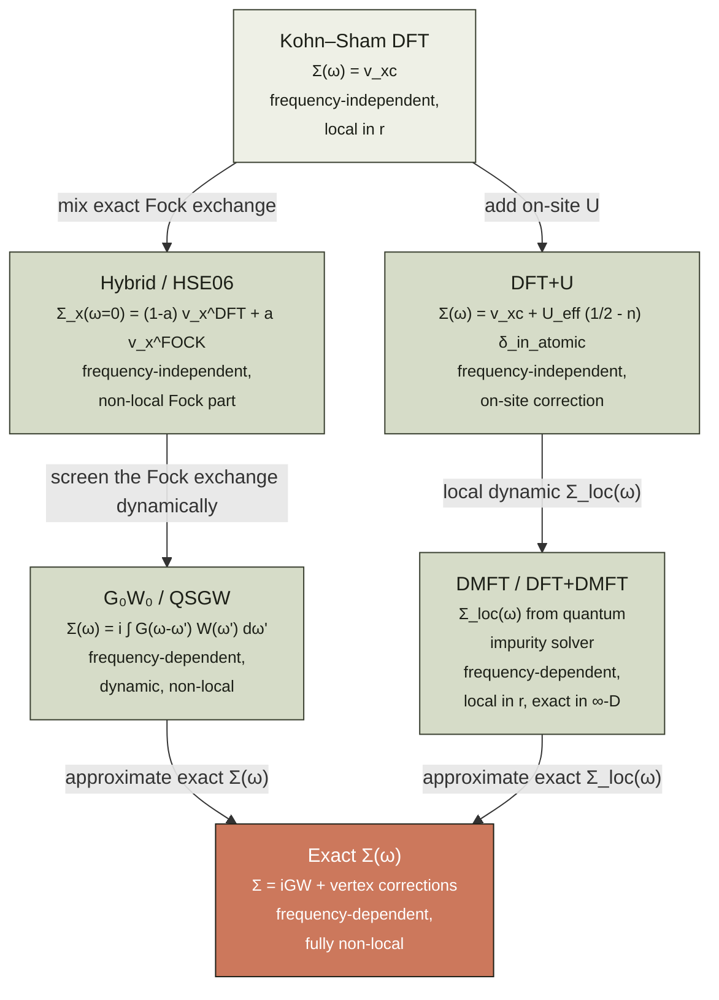

# Chapter 13 — DFT+U & beyond

> Standard Kohn–Sham DFT works because the exchange–correlation
> functional gets the *total* energy almost right.  Almost.  For
> materials with partially-filled $d$ and $f$ shells — the
> transition-metal oxides, the rare earths, the actinides, the
> high-$T_c$ cuprates — "almost" is not enough.  This chapter is
> about the corrections that fix it, and the methods that *are*
> enough.

By the end of [chapter 05]({{ "/dft-notes/chapter-05/" | relative_url }}) we had
the full Kohn–Sham machinery: a fictitious non-interacting
reference system that reproduces the interacting density, a
self-consistent loop, and a Jacobian's ladder of
exchange–correlation functionals — LDA, GGA, meta-GGA, hybrid.
For most of chemistry and materials science, the local and
semi-local rungs of that ladder are good enough; even the
hybrid rung (PBE0, B3LYP) gets the thermochemistry of organic
molecules within $\sim 0.2\,\text{eV}$.  The exceptions are the
materials where the most interesting physics lives in a *few
partially-filled orbitals* — the $3d$ shell of a transition
metal, the $4f$ shell of a lanthanide, the $5f$ shell of an
actinide.  There, the LDA and GGA make characteristic
mistakes: a Mott insulator comes out *metallic*, a band gap
is *underestimated by a factor of two*, and a satellite peak
in the photoemission spectrum is *missing entirely*.  This
chapter is the "where the rubber meets the road" chapter for
correlated materials.  We will, in order: state the
*qualitative* failure (§ 13.1); introduce the Hubbard model
that contains the missing physics (§ 13.2.2); derive the
DFT+U correction that adds Hubbard physics to LDA
(§§ 13.2.3–13.2.4); survey the *systematic* beyond-DFT
approaches — range-separated hybrid functionals (§ 13.2.5),
the GW self-energy (§ 13.2.6), and dynamical mean-field theory
(§ 13.2.7); close with the side-by-side comparison
(§ 13.2.8), a worked exact-diagonalisation example on the
4-site Hubbard model (§ 13.5), three graded problems (§ 13.6),
and an honest list of omissions (§ 13.8).

> **Reading note.**  This chapter assumes chapters 04
> (Kohn–Sham DFT) and 05 (XC functionals).  The reading of
> chapter 13 is *optional* for the rest of the chapters in
> this series — chapters 06–12 do not use it.  It is, however,
> the natural starting point for any reader who plans to
> compute the properties of transition-metal oxides,
> rare-earth compounds, or any other material with
> partially-filled $d$ or $f$ shells.

## 13.1 The claim

The headline is a one-line statement of where standard DFT
fails, what fixes it, and what each fix costs.

> **Claim.**  Standard Kohn–Sham DFT with a local or
> semi-local XC functional *systematically fails* for
> materials with partially-filled $d$ or $f$ shells:
> Mott insulators are predicted metallic, band gaps are
> underestimated by $\sim 50\%$, and the satellite peaks of
> the spectral function are absent.  The DFT+U correction
> restores the local physics at the price of an
> *empirical* Hubbard $U$ parameter.  The systematic,
> parameter-free many-body methods — screened hybrid
> functionals, the GW self-energy, and dynamical
> mean-field theory — capture the same physics at a
> sharply higher computational cost.

The claim is compact.  The rest of the chapter unpacks it.
The point of entry is the **atomic limit** of a
partially-filled shell.  An isolated Mn$^{2+}$ ion
($3d^5$, half-filled, $S = 5/2$) has an *integer* number
of $d$ electrons in the Hund's-rule ground state, and a
gap of $\sim 5\,\text{eV}$ to the first excited state.
In MnO (the rock-salt antiferromagnet) the *same* $d$
electrons are localised, the *same* gap is present, and
the material is a transparent insulator with a
$\sim 4\,\text{eV}$ gap.  The local physics has not
changed between the ion and the solid; what has changed
is the *competition* between the on-site Coulomb
repulsion $U$ that wants to localise the electrons and
the inter-site hopping $t$ that wants to delocalise
them.  When $U \gg t$, the electrons stay local and the
material is a **Mott insulator**; when $t \gg U$, the
electrons delocalise and the material is a band metal.
The phase boundary is the **Mott transition**, and it
is *not* a phase transition of the LDA — the standard
XC functional does not know about $U$ at all.  The
result is the characteristic failure:

\begin{equation}
\label{eq:ch-13-claim}
\boxed{\;
\Delta_\text{exp} \;\approx\; 2 \Delta_\text{LDA} \quad \text{and} \quad \Sigma_\text{sat}(\omega) \Big|_{\text{LDA}} \equiv 0 , \quad
\text{for } 3d\text{ oxides and } 4f\text{ compounds.}
\;}
\end{equation}

The first equality says that the LDA band gap is roughly
*half* the experimental gap; the second says that the
LDA spectral function $A(\omega)$ has no satellite (the
$\sim 6\,\text{eV}$ lower-Hubbard-band peak of Ni is
entirely missing).  The Hubbard $U$ enters as the only
parameter that has to be supplied by the user; once it
is in place, the rest of the machinery — the localised
orbital, the occupation matrix, the double-counting
correction — is fixed by the formalism.

The reader who wants a quick summary of the methods
covered in this chapter should jump straight to
§ 13.2.8 and return.  The reader who wants to see
*why* the LDA fails, and *how* each correction fixes
it, should read the chapter in order.

## 13.2 The derivation

This section contains the substantive material: the
failure mode of LDA, the Hubbard model, the DFT+U
correction, the choice of $U$, the hybrid-functional
route, the GW self-energy, and the DMFT outlook.

### 13.2.1 The failure of LDA for Mott insulators

The diagnostic numbers are old.  Table 1 collects the
experimental band gaps of the late-$3d$ transition-metal
monoxides (MnO, FeO, CoO, NiO) alongside the LDA
predictions and the GGA+U values with a representative
$U$ on the metal $3d$ shell.  The LDA underestimates
the gap by a factor of 2; the underestimation is
*systematic*, not statistical, and it correlates with
the number of $d$ electrons.

**Table 1.  Band gaps of the late-$3d$ monoxides (eV).
The columns compare experiment, LDA, GGA (PBE), GGA+U
with $U_\text{eff} = U - J \sim 4$–$5\,\text{eV}$, and
HSE06 hybrid.  All values are for the antiferromagnetic
ground state.  The LDA/GGA systematic underestimation
is the signature of the missing Mott physics.**

| Compound | Configuration | $E_g^\text{exp}$ | $E_g^\text{LDA}$ | $E_g^\text{PBE}$ | $E_g^\text{GGA+U}$ | $E_g^\text{HSE06}$ |
|:---------|:--------------|-----------------:|-----------------:|-----------------:|-------------------:|-------------------:|
| MnO      | $3d^5$        | 3.9 – 4.1        | 0.8 – 1.0        | 0.9 – 1.2        | 3.5 – 3.9          | 3.6 – 4.0          |
| FeO      | $3d^6$        | 2.4              | 0.0 (metal!)     | 0.0 (metal!)     | 2.0 – 2.4          | 2.3 – 2.6          |
| CoO      | $3d^7$        | 2.5 – 2.8        | 0.0 (metal!)     | 0.0 (metal!)     | 2.3 – 2.7          | 2.5 – 2.9          |
| NiO      | $3d^8$        | 4.0 – 4.5        | 0.4 – 0.6        | 0.5 – 0.8        | 3.3 – 4.0          | 4.0 – 4.5          |

(Sources: experiment — van Elp *et al.*, *Phys. Rev. B*
**44**, 6090 (1991); LDA/PBE — standard plane-wave
calculations with a $30$–$50\,\text{Ry}$ cutoff;
GGA+U — Dudarev *et al.*, *Phys. Rev. B* **57**, 1505
(1998); HSE06 — Heyd, Scuseria, Ernzerhof, *J. Chem.
Phys.* **118**, 8207 (2003).)

The *quantitative* failure of LDA is bad enough.  The
*qualitative* failure is worse: FeO and CoO come out
*metallic* — the wrong phase, the wrong physics, the
wrong answer to the question "is this material a
conductor?".  The error has a name and a cause.

**Cause.**  The LDA XC potential $v_\text{xc}(\mathbf r)$
is a *local* functional of the density.  The
self-interaction correction that is missing for a
localised $d$ electron is a *non-local* effect — it
depends on the *occupancy* of the $d$ orbital on
*this* atom, not on the density at $\mathbf r$.  The
LDA cannot simulate it because it does not know which
density belongs to which orbital.  In the language of
the Hubbard model, the LDA XC potential acts on the
$d$ electron as if $U_\text{eff} = 0$ — it cannot
*penalise* the double occupancy of the $d$ shell.
The result is that the $d$ band is too wide (because
each $d$ electron sees the full hybridisation with
its neighbours) and the gap is too small (or
vanishing).

The **spectral function** is the cleanest way to see
the failure.  In a one-particle picture, the
photoemission spectrum at energy $\omega$ is

\begin{equation}
\label{eq:ch-13-spectral}
A(\mathbf k, \omega) \;=\; \sum_n \bigl| \langle \phi_n | \psi_{\mathbf k} \rangle \bigr|^2\, \delta(\omega - \varepsilon_n) ,
\end{equation}

a sum of delta functions at the quasi-particle (QP)
energies.  In a Mott insulator, the *many-body*
spectral function is qualitatively different.  The
ground state of the atom has integer $d$-occupancy;
removing one electron from the *occupied* $d$ band
costs an energy $\sim -(\varepsilon_d + U)$ (the
**lower Hubbard band**), and removing it from the
*unoccupied* $d$ band costs $\sim -\varepsilon_d$
(the **upper Hubbard band**).  The splitting between
the two is the **Hubbard $U$**:

\begin{equation}
\label{eq:ch-13-hubbard-split}
\Delta_\text{Hubbard} \;=\; \varepsilon_{d}^{UHB} - \varepsilon_{d}^{LHB} \;\approx\; U - W ,
\end{equation}

where $W$ is the $d$-band width.  The LDA misses
the splitting entirely: it puts the $d$ band in *one*
place, at the *bare* $\varepsilon_d$, and the
spectral weight that should be in the lower Hubbard
band is *redistributed* into a metallic quasi-particle
peak at $\varepsilon_d$.  The satellite at
$\sim -6\,\text{eV}$ in Ni (the famous "6-eV
satellite") is the lower Hubbard band, and LDA does
not produce it.

The conclusion is that the LDA is missing a *single*
piece of physics: the on-site Coulomb repulsion $U$
between two $d$ electrons on the same atom.  Adding
this piece — with an empirically determined $U$ — is
the DFT+U correction.

### 13.2.2 The Hubbard model

The minimal model that contains the missing physics
is the **single-band Hubbard model** on a lattice.  It
is the simplest model that has *both* the band-metal
limit (delocalised electrons, $U \to 0$) and the
atomic limit (localised electrons, $t \to 0$).  In
its grand-canonical form,

\begin{equation}
\label{eq:ch-13-hubbard}
\hat H \;=\; -t \sum_{\langle ij\rangle, \sigma} c_{i\sigma}^\dagger c_{j\sigma}
\;+\; U \sum_i n_{i\uparrow} n_{i\downarrow} \;-\; \mu \sum_{i, \sigma} n_{i\sigma} ,
\end{equation}

where $c_{i\sigma}^\dagger$ creates an electron of
spin $\sigma \in \{\uparrow, \downarrow\}$ on site $i$,
$\langle ij \rangle$ runs over nearest-neighbour pairs,
$n_{i\sigma} = c_{i\sigma}^\dagger c_{i\sigma}$ is the
spin-density operator, $t$ is the hopping, $U$ is the
on-site repulsion, and $\mu$ is the chemical potential.
On a 1-D chain of $L$ sites with periodic boundary
conditions, the model has $4^L$ states in the Fock
space — large, but exact-diagonalisable for $L \le 12$
on a laptop.

**The atomic limit.**  When $t = 0$ the sites decouple.
The single-site Hamiltonian is

\begin{equation}
\label{eq:ch-13-atomic}
\hat H_\text{at} \;=\; U n_{\uparrow} n_{\downarrow} - \mu (n_{\uparrow} + n_{\downarrow}) .
\end{equation}

The four Fock states of a single site have energies
$E_{00} = 0$, $E_{10} = E_{01} = -\mu$,
$E_{11} = U - 2\mu$.  At half-filling, $\langle n \rangle = 1$
and the chemical potential is $\mu = U/2$ (symmetric
between adding and removing an electron).  The
single-particle spectral function of the atom is two
delta functions at

\begin{equation}
\label{eq:ch-13-atomic-spectrum}
\varepsilon_\text{add} = -\mu = -U/2 , \qquad
\varepsilon_\text{rem} = -(U - \mu) = -U/2 ,
\end{equation}

both equal: the atom is *metallic* in the single-
particle sense, but the *real* spectrum has the
charge gap $U$ between the two- and three-particle
sectors, and the single-particle Green's function has
a non-trivial multi-peak structure:

\begin{equation}
\label{eq:ch-13-atomic-gf}
G_\text{at}(\omega) \;=\; \frac{1 - \langle n \rangle/2}{\omega + U/2 - i0^+}
\;+\; \frac{\langle n \rangle/2}{\omega - U/2 + i0^+} .
\end{equation}

For $\langle n \rangle = 1$ (half-filling), the two
poles are at $\omega = \mp U/2$ with equal weight
$1/2$.  The atom has a *single-particle gap* of $U$
and *no* quasi-particle peak in the gap.  This is
the Mott insulator at the level of a single site.

**The band limit.**  When $U = 0$ the model is the
free tight-binding model.  The single-particle
spectrum is a band of width $W = 2z t$ where $z$ is
the coordination number (e.g. $W = 4t$ for a 1-D chain).
At half-filling the band is full and the system is
an insulator if the band has a gap (e.g. a bipartite
lattice at half-filling) or a metal otherwise.

**The Mott transition.**  As $U/t$ increases from
zero, the atomic limit takes over and a gap opens
between the lower and upper Hubbard bands.  The
critical $U_c$ at which the gap opens is the
**Mott transition**.  For the 1-D Hubbard model the
**Bethe-ansatz solution** (Lieb & Wu, 1968) gives
the exact answer: the system is insulating for *any*
$U > 0$ at half-filling.  In higher dimensions the
DMFT solution (§ 13.2.7) gives a finite $U_c$ for
the infinite-dimensional Bethe lattice at
$U_c/W \approx 1.46$, with a hysteresis region
between the insulating and metallic phases.

For the purposes of this chapter the key fact is
the *form* of the single-particle spectrum in the
strongly-correlated regime $U \gg t$:

\begin{equation}
\label{eq:ch-13-hubbard-spectrum}
A(\mathbf k, \omega) \;=\; Z\, \delta(\omega - \varepsilon_\text{QP}(\mathbf k))
\;+\; A_\text{inc}(\omega) ,
\end{equation}

a quasi-particle peak of weight $Z \ll 1$ at the
QP energy $\varepsilon_\text{QP}$, plus an incoherent
background $A_\text{inc}$ carrying the weight $1 - Z$.
The LDA reproduces *only* the quasi-particle peak
(when it exists) and assigns it the *full* spectral
weight; the missing $1 - Z$ is the **Mott physics**
the LDA cannot describe.

### 13.2.3 DFT+U (Liechtenstein 1995; Dudarev 1998)

DFT+U adds the Hubbard-model physics to a chosen
set of atomic-like orbitals $\{|m \sigma\rangle\}$
on each correlated atom.  The energy functional is

\begin{equation}
\label{eq:ch-13-dft+u-energy}
E_\text{DFT+U}[\rho, n^\sigma] \;=\; E_\text{DFT}[\rho] \;+\; E_\text{Hubbard}[\{n^\sigma\}] \;-\; E_\text{dc}[\{n^\sigma\}] .
\end{equation}

The first term is the standard DFT total energy
([chapter 04]({{ "/dft-notes/chapter-04/" | relative_url }})).  The
second is the Hubbard-model on-site energy.  The
third is the **double-counting correction** that
removes the on-site contribution already present
in $E_\text{DFT}$ (because LDA has *some* on-site
Coulomb repulsion, just not the right one).  The
occupations $n^\sigma$ are projections of the KS
orbitals onto the atomic basis.

**The atomic basis.**  The correlated subspace on
atom $I$ is spanned by a set of $M$ orthonormal
atomic orbitals $\phi_I^m(\mathbf r)$ with $m = 1,
\ldots, M$.  For a $3d$ transition metal $M = 5$
(the five $d$ orbitals in some real-spherical
convention); for a lanthanide $M = 7$ (the seven
$f$ orbitals).  The atomic orbitals are typically
the all-electron atomic partial waves, projected
out of the PAW ([chapter 08]({{ "/dft-notes/chapter-08/" | relative_url }}))
augmentation spheres.  In a non-PAW code the
atomic orbitals are often the **pseudo-atomic
orbitals** generated by solving the isolated-atom
problem in the chosen XC functional.

**The occupation matrix.**  Project the KS
orbitals onto the atomic basis:

\begin{equation}
\label{eq:ch-13-occ-matrix}
n^\sigma_{I, mm'} \;=\; \sum_{n, \mathbf k}^\text{occ} f_{n \mathbf k}\,
\langle \phi_I^m | \psi_{n \mathbf k}^\sigma \rangle \,
\langle \psi_{n \mathbf k}^\sigma | \phi_I^{m'} \rangle .
\end{equation}

The sum is over all occupied KS orbitals, $f_{n
\mathbf k}$ is the occupation number ($0 \le f \le 1$
in spin-paired systems, $0$ or $1$ in spin-polarised),
and the inner products are the projection of the
KS orbital onto the atomic orbital.  In a plane-wave
PAW code the projections are evaluated inside the
PAW augmentation sphere; in a localised-orbital code
they are evaluated by direct integration.  The
occupation matrix is **Hermitian** and **positive
semi-definite**, with $\text{tr}\, n^\sigma_I = N_I^\sigma$
the spin-projected $d$ count on atom $I$.

**The rotationally-invariant Hubbard energy
(Liechtenstein, Anisimov, Zaanen, Andersen 1995).**  The
on-site Coulomb matrix of the Hubbard model has
four independent matrix elements in the atomic
basis: the direct $U = \langle mm | m' m' \rangle$
(the "Coulomb $U$"), the exchange $J = \langle m m'
| m' m \rangle$ (the "Hund's $J$"), and the two
channel-dependent combinations.  The
rotationally-invariant form of the Hubbard energy
is

\begin{equation}
\label{eq:ch-13-liechtenstein}
E_\text{Hubbard}^\text{LA} \;=\; \frac{1}{2} \sum_{I, \sigma} \sum_{\{m\}} \bigl\{
U_{m m' m'' m'''}\, n^\sigma_{I, m m'''}\, n^{-\sigma}_{I, m' m''}
\;+\; (U_{m m' m'' m'''} - U_{m m' m''' m''})\, n^\sigma_{I, m m''}\, n^\sigma_{I, m' m'''} \bigr\} ,
\end{equation}

where $U_{m m' m'' m'''}$ are the on-site Coulomb
integrals evaluated in the atomic basis.  In the
**Dudarev simplification** (Dudarev *et al.*,
*Phys. Rev. B* **57**, 1505 (1998)) the four-index
tensor is reduced to a single effective $U$:

\begin{equation}
\label{eq:ch-13-dudarev}
E_\text{Hubbard}^\text{D} \;=\; \frac{U_\text{eff}}{2} \sum_{I, \sigma} \sum_m n^\sigma_{I, mm}\bigl(1 - n^\sigma_{I, mm}\bigr) ,
\end{equation}

where $U_\text{eff} = U - J$ is the difference of
the direct and exchange integrals.  The
$n(1 - n)$ form is the **penalty function**: for
an integer occupation $n = 0$ or $n = 1$ the
penalty is zero (the configuration is a proper
Slater determinant with the right number of
electrons), and for a half-filled occupation
$n = 1/2$ the penalty is maximal — the
configuration is penalised, the system prefers
integer occupations, and a gap opens.  The
Dudarev form is what VASP, Quantum ESPRESSO, and
most modern plane-wave codes implement.

**The double-counting correction.**  The LDA XC
energy already contains a mean-field on-site
Coulomb repulsion (the LDA "knows" that two
electrons on the same atom repel each other, but
it does not know *how* strongly).  The Hubbard
energy \eqref{eq:ch-13-dudarev} is in addition to
that.  The double-counting correction removes the
LDA part:

\begin{equation}
\label{eq:ch-13-dc}
E_\text{dc} \;=\; \frac{U_\text{eff}}{2} \sum_{I, \sigma} \sum_m n^\sigma_{I, mm}\bigl(N_I^\sigma/2 - n^\sigma_{I, mm}\bigr) ,
\end{equation}

a simple quadratic form whose specific value is
the **around-mean-field** (AMF) double counting.
An alternative is the **fully-localised limit**
(FLL) double counting, in which the reference
configuration is the *atomic* limit (integer
occupations).  Both give qualitatively similar
results for the late transition-metal oxides, but
the AMF is preferred for metallic systems and
the FLL for strongly-correlated insulators.

The complete DFT+U functional is
\eqref{eq:ch-13-dft+u-energy} with
\eqref{eq:ch-13-dudarev} and \eqref{eq:ch-13-dc}.
The functional derivative with respect to the
occupation matrix gives the **Hubbard potential**

\begin{equation}
\label{eq:ch-13-hubbard-pot}
V^\sigma_{I, mm'} \;=\; U_\text{eff} \bigl(\tfrac{1}{2} - n^\sigma_{I, mm'}\bigr) \delta_{mm'} ,
\end{equation}

which is added to the KS Hamiltonian.  The
effective KS equation in the presence of the
Hubbard correction is

\begin{equation}
\label{eq:ch-13-ks+u}
\bigl[ \hat H_\text{KS} + \hat V_\text{Hub} \bigr] |\psi_{n \mathbf k}^\sigma\rangle
\;=\; \varepsilon_{n \mathbf k}^\sigma |\psi_{n \mathbf k}^\sigma\rangle ,
\end{equation}

with $\hat V_\text{Hub}$ acting only on the
correlated subspace (it is zero outside).  The
self-consistent loop is the standard KS loop
([chapter 04]({{ "/dft-notes/chapter-04/" | relative_url }})) with
the additional step of projecting the converged
orbitals onto the atomic basis to update the
occupation matrix, and adding the Hubbard
potential to the Hamiltonian.  Convergence is
usually slower than in plain DFT — the occupation
matrix is a strongly non-linear function of the
orbitals.

**The double-counting paradox.**  The reader may
wonder: how can the LDA, which "does not know
about $U$", have a double-counting problem?  The
answer is that the LDA *does* have an on-site
Coulomb repulsion — it is implicit in the
parameterisation of the LDA XC energy.  The
double-counting correction removes the LDA's
implicit, average, mean-field on-site repulsion
and replaces it with the explicit, exact,
orbital-dependent Hubbard repulsion.  The two
are different in general; the difference is what
DFT+U adds to LDA.

### 13.2.4 Choosing U

The single free parameter of DFT+U is $U_\text{eff}$
(or, in the Liechtenstein form, $U$ and $J$).
Three classes of methods are used to choose it.

**Empirical fit.**  The simplest: run a series of
DFT+U calculations with different $U$ values and
pick the one that best reproduces a known
experimental property (band gap, lattice
parameter, formation energy, magnetic moment).
The typical range for transition-metal $3d$
orbitals is $U_\text{eff} = 3$–$6\,\text{eV}$;
for lanthanide $4f$ orbitals it is
$U_\text{eff} = 5$–$7\,\text{eV}$; for actinide
$5f$ orbitals it is $U_\text{eff} = 4$–$6\,\text{eV}$.
The advantage is that no additional code is
needed.  The disadvantage is that the resulting
$U$ is *property-dependent*: the $U$ that
reproduces the band gap of NiO may not reproduce
its magnetic moment or its equation of state.

**Linear-response $U$ (Cococcioni 2005).**  A
self-consistent *ab initio* method that determines
$U$ from the response of the system to a small
perturbation.  The protocol is:

1.  Apply a small shift $\alpha_I$ to the
    potential on atom $I$ (the *perturbation*).
2.  Compute the response of the occupation
    $n_I^\sigma$ of the correlated shell.
3.  Extract the *self-consistent* response
    $\chi_{IJ} = \partial n_I / \partial \alpha_J$.
4.  Define
    $U_\text{eff} = (\chi_0^{-1} - \chi^{-1})_{II}$
    where $\chi_0$ is the *non-self-consistent*
    response (the bare LDA response without
    re-summing the Hubbard potential) and
    $\chi$ is the *self-consistent* response.

The linear-response $U$ is *property-independent*
in the sense that it depends only on the
electronic structure of the system, not on the
property being fitted.  It typically falls in
the same range as empirical $U$ values
(transition-metal $3d$: $U_\text{eff} \sim 3$–$5$
eV; rare-earth $4f$: $U_\text{eff} \sim 5$–$7$
eV).  The implementation is in the
[Cococcioni](https://github.com/epfl-theos/RespKit)
linear-response toolkit; modern PAW codes
include it as a built-in option.

**Constrained DFT (Dederichs *et al.* 1984;
Kuzian *et al.* 2010).**  The earliest
*ab initio* method.  Constrain the number of
electrons in the correlated shell to $N_I$ and
compute the energy of the constrained system
$E(N_I)$.  The derivative
$\partial^2 E / \partial N_I^2$ is the Hubbard
$U$ in the Janak sense (the curvature of the
energy with respect to the constrained
occupation).  The constraint is implemented by
adding a Lagrange multiplier $\lambda_I$ to the
Hamiltonian:

\begin{equation}
\label{eq:ch-13-constrained}
\hat H_\lambda \;=\; \hat H_\text{KS} \;+\; \sum_I \lambda_I \hat n_I ,
\end{equation}

where $\hat n_I = \sum_{m \sigma} |\phi_I^m
\rangle \langle \phi_I^m|$ is the constrained
occupation operator.  The $U$ from constrained
DFT is the **constrained-occupation $U$**:

\begin{equation}
\label{eq:ch-13-constrained-u}
U_\text{constrained} \;=\; \frac{\partial^2 E}{\partial N_I^2}
\;=\; \frac{\partial \lambda_I}{\partial N_I} .
\end{equation}

The implementation is conceptually simple but
technically delicate: the constraint must be
applied only to the on-site atomic orbitals
(not the full valence), and the
self-consistency of the constrained system must
be verified.

**Constrained RPA (cRPA, Aryasetiawan *et al.*
2004).**  The most rigorous, most expensive, and
most property-independent.  Compute the
**constrained polarisability** $\tilde P(\mathbf
r, \mathbf r', \omega)$ in which the screening
channels that are *already* included in the
Hubbard model (the on-site atomic excitations)
are removed.  The constrained $U$ is then the
Coulomb matrix element of the partially-screened
interaction:

\begin{equation}
\label{eq:ch-13-crpa}
U_{m m' m'' m'''}^\text{cRPA} \;=\; \int d\mathbf r\, d\mathbf r' \,
\phi_I^{m*}(\mathbf r) \phi_I^{m'}(\mathbf r)\,
\tilde W(\mathbf r, \mathbf r')\, \phi_I^{m''*}(\mathbf r') \phi_I^{m'''}(\mathbf r') ,
\end{equation}

where $\tilde W$ is the constrained
screened-Coulomb interaction.  cRPA gives
*frequency-dependent* $U(\omega)$: the static
$U(\omega = 0)$ is the relevant input for
DFT+U, but the full frequency dependence is
needed for the $G_0 W_0$ and cRPA+DMFT methods.
The implementation is in several
post-processing codes; the cost is comparable
to a $G_0 W_0$ calculation.

**The trade-off.**  Empirical $U$ is cheap and
fits the target property but transfers poorly.
Linear-response $U$ is cheap and transfers well
within a class of materials.  Constrained-DFT
$U$ is intermediate in cost and transfers well
to related compounds.  cRPA is expensive and
gives the most "intrinsic" $U$, but the
frequency-dependence is non-trivial.  In
practice most production calculations use
*empirical* $U$ values from the
[Cococcioni linear-response](https://doi.org/10.1103/PhysRevB.71.035105)
benchmarks, or the
[Materiae](https://github.com/oliviersvr/materiae)
fitted library.

### 13.2.5 Hybrid functionals for solids (HSE06)

The DFT+U correction is local in real space — it
acts on the on-site atomic orbital.  The
**range-separated hybrid** is a complementary
correction that acts on the *non-local* Fock
exchange but limits it to the *short range*.  The
canonical parameterisation is HSE06 (Heyd,
Scuseria, Ernzerhof, *J. Chem. Phys.* **118**,
8207 (2003)):

\begin{equation}
\label{eq:ch-13-hse}
E_\text{xc}^\text{HSE} \;=\; a\, E_x^\text{HF,SR}(\omega)
\;+\; (1 - a)\, E_x^\text{PBE,SR}(\omega)
\;+\; E_x^\text{PBE,LR}(\omega)
\;+\; E_c^\text{PBE} ,
\end{equation}

where $E_x^\text{HF,SR}$ is the short-range part
of the Hartree–Fock exchange, $E_x^\text{PBE,SR}$
and $E_x^\text{PBE,LR}$ are the short- and
long-range parts of the PBE exchange, and
$E_c^\text{PBE}$ is the PBE correlation.  The
**range-separation parameter** is
$\omega = 0.11\,\text{bohr}^{-1}$ (or
$\omega = 0.208\,\text{Å}^{-1}$).  At distances
$r \ll 1/\omega \sim 9\,\text{bohr}$, the
Fock exchange is fully active; at $r \gg 1/\omega$
it is screened out.  The mixing parameter
$a = 0.25$ is fixed at the PBE0 value.

The motivation is twofold.  First, in a *molecule*
the Fock exchange is long-ranged and important;
PBE0 (with full-range Fock) gives excellent
thermochemistry.  Second, in a *solid* the
Fock exchange is *also* long-ranged, but it is
expensive (formally $\mathcal O(K^4)$ in a Gaussian
basis, $\mathcal O(N^2)$ in a plane-wave basis
with FFT techniques) and the long-range part is
partially cancelled by the correlation.  HSE06
*short-circuits* the long-range Fock — it
substitutes the long-range PBE exchange for the
long-range Fock — and recovers the thermochemistry
of the short range (where the Fock matters) at
a manageable cost.

The HSE06 band gap of NiO is $\sim 4.3\,\text{eV}$
(Table 1), in good agreement with experiment.  The
mechanism is the same as in PBE0: the Fock exchange
adds a *non-local* self-interaction correction that
opens the band gap.  The HSE06 *satellite* structure
in the spectral function is *better* than PBE (it
captures part of the lower Hubbard band) but
*worse* than $G_0 W_0$ (it does not capture the
full satellite position).

The cost of HSE06 is dominated by the evaluation of
the short-range Fock exchange.  In a plane-wave
code with $N_\text{PW}$ plane waves and $N_k$
k-points, the cost is
$\mathcal O(N_\text{PW}^2 \cdot N_k \cdot N_b)$
where $N_b$ is the number of occupied bands, and
the prefactor is large enough that HSE06 is
$\sim 10$–$30\times$ more expensive than PBE for a
system of the same size.  In a Gaussian code the
ERI machinery of [chapter 06]({{ "/dft-notes/chapter-06/" | relative_url }}) is used
directly; the cost is $\mathcal O(K^4)$ and HSE06
is $\sim 100$–$1000\times$ PBE.

### 13.2.6 The GW approximation

The **GW approximation** is the natural
many-body generalisation of the hybrid
functional: instead of adding *one quarter* of
the Fock exchange (PBE0) or the *short-range* Fock
exchange (HSE06), the GW approximation uses the
*fully screened* exchange and adds a
*frequency-dependent* self-energy.  The
self-energy is the convolution of the single-
particle Green's function $G$ and the screened
Coulomb interaction $W$:

\begin{equation}
\label{eq:ch-13-gw-sigma}
\Sigma(\mathbf r, \mathbf r', \omega) \;=\; \frac{i}{2\pi} \int d\omega'\, G(\mathbf r, \mathbf r', \omega - \omega')\, W(\mathbf r, \mathbf r', \omega') .
\end{equation}

In frequency space the convolution is a product:
the GW self-energy is the product $GW$ in
frequency-momentum space.  The name "GW" comes
from the $G \cdot W$ structure.

**The $G_0 W_0$ approximation.**  The standard
non-self-consistent implementation:

\begin{equation}
\label{eq:ch-13-g0w0}
G = G_0 \quad (\text{DFT Green's function}), \qquad
W = (1 - v P)^{-1} v \quad (\text{RPA screened Coulomb}), \qquad
\Sigma = i G_0 W_0 .
\end{equation}

The input is the DFT ground state; $G_0$ is
constructed from the KS eigenvalues and orbitals,
$P$ is the *polarisability* (the density response
to a perturbation), $W$ is the screened Coulomb
computed in the **random-phase approximation**
(RPA, i.e. the time-dependent Hartree
approximation), and $\Sigma$ is the resulting
self-energy.  The QP energies are the solutions
of the **Dyson equation**

\begin{equation}
\label{eq:ch-13-dyson}
\bigl[ \hat H_\text{KS} + \hat \Sigma(\varepsilon_n^\text{QP}) - \varepsilon_n^\text{QP} \bigr] |\psi_n\rangle \;=\; 0 ,
\end{equation}

a *non-linear* eigenvalue problem in the energy.
In practice one linearises around the KS
eigenvalue $\varepsilon_n^\text{KS}$:

\begin{equation}
\label{eq:ch-13-qp-linear}
\varepsilon_n^\text{QP} \;\approx\; \varepsilon_n^\text{KS} \;+\; Z_n\, \langle \psi_n | \Sigma(\varepsilon_n^\text{KS}) - v_\text{xc} | \psi_n \rangle ,
\end{equation}

where the **quasi-particle weight** is

\begin{equation}
\label{eq:ch-13-z-factor}
Z_n \;=\; \Bigl( 1 - \bigl\langle \psi_n \bigr| \frac{\partial \Sigma(\omega)}{\partial \omega} \Bigl|_{\omega = \varepsilon_n^\text{KS}} \bigl| \psi_n \bigr\rangle \Bigr)^{-1} .
\end{equation}

For weakly-correlated semiconductors (Si, Ge,
GaAs), $Z_n \approx 0.8$–$0.9$ and the linear
approximation is excellent.  For correlated
materials (NiO, MnO) $Z_n \approx 0.4$–$0.6$ and
the linearisation is borderline; a self-consistent
$GW$ is needed for quantitative accuracy.

**The GW self-consistency ladder.**  $G_0 W_0$ is
the *cheapest* $GW$ approximation; it is the
starting point.  Three higher levels of
self-consistency are possible:

\begin{equation}
\label{eq:ch-13-gw-ladder}
\boxed{
G_0 W_0 \;\to\; ev GW \;\to\; ev GW_0 \;\to\; \text{full sc} GW
}
\end{equation}

- **$G_0 W_0$** (Hedin's 1969 starting point) —
  one-shot $G$ from DFT, one-shot $W$ from $G_0$.
  Cheap ($\mathcal O(N^4)$ in plane waves),
  depends on the KS starting point.
- **Eigenvalue-only $GW$ (ev $GW$)** — iterate
  the QP energies only, keeping $G$ and $W$ at
  the $G_0 W_0$ level.  Mildly more expensive,
  somewhat less starting-point dependent.
- **$ev GW_0$** — iterate the QP energies, update
  $G$, but keep $W$ fixed at the $G_0 W_0$ value.
  Reduces the starting-point dependence
  significantly; widely used for semiconductors.
- **Full self-consistent $GW$** — iterate $G$ and
  $W$ until self-consistency.  In principle the
  best, in practice expensive and known to
  *overestimate* band gaps for some materials
  (the "self-consistency overshoot").  The
  **$sc GW$** with the **quasi-particle
  self-consistent $GW$** (QSGW, Faleev *et al.*
  2004) variant is the standard.

**The GW band gap of Si.**  Experiment: 1.17 eV
(2 K, indirect).  LDA: 0.55 eV (50%
underestimate).  $G_0 W_0$ (PBE starting point):
0.95 eV.  $G_0 W_0$ (with a "better" starting
point, e.g. a hybrid): 1.10 eV.  $QSGW$: 1.20 eV.
HSE06: 1.15 eV.  All systematic methods give a
band gap within $\sim 0.1\,\text{eV}$ of
experiment, and all are *parameter-free*.  The GW
approximation is the *de facto* gold standard for
the band gaps of weakly-correlated semiconductors.

**The 6-eV satellite of Ni.**  The Ni $3d$ band
of Ni metal has a famous $\sim 6\,\text{eV}$
satellite in the photoemission spectrum, the
"6-eV satellite".  The LDA spectral function has
*no* satellite.  $G_0 W_0$ reproduces the
satellite, and at the right energy.  The
mechanism: the self-energy $\Sigma(\omega)$ has
a frequency dependence that, in the spectral
representation,

\begin{equation}
\label{eq:ch-13-sigma-spectral}
\Sigma(\omega) \;=\; v_\text{xc} \;+\; \int_0^\infty d\omega' \,
\frac{S(\omega')}{\omega - \omega' - i0^+ \cdot \text{sgn}(\omega - \mu)} ,
\end{equation}

where $S(\omega)$ is the *spectral function of
the self-energy*.  The structure in $S(\omega)$
at $\sim 6\,\text{eV}$ produces a pole in
$\Sigma$ at the same energy, which in turn
produces the satellite in the *single-particle*
spectral function $A(\omega) = \pi^{-1}
|\text{Im}\, G|$.  The satellite is therefore
*inherited* from the plasmon satellite of $W$.

### 13.2.7 DMFT outlook

The **dynamical mean-field theory** (DMFT, Metzner
& Vollhardt 1989, Georges & Kotliar 1992,
Georges, Kotliar, Krauth, Rozenberg 1996) is the
many-body method that treats the *local* quantum
fluctuations of a lattice model *exactly* by
mapping it to a single-impurity Anderson model
(SIAM) in a self-consistent bath.

**The mapping.**  The lattice Hubbard model
\eqref{eq:ch-13-hubbard} is mapped to a single
impurity site embedded in a bath of non-interacting
electrons, with the impurity described by the
Anderson Hamiltonian

\begin{equation}
\label{eq:ch-13-anderson}
\hat H_\text{And} \;=\; \sum_{k, \sigma} \varepsilon_k\, a_{k\sigma}^\dagger a_{k\sigma}
\;+\; \sum_{k, \sigma} \bigl( V_k\, a_{k\sigma}^\dagger d_{\sigma} + V_k^*\, d_{\sigma}^\dagger a_{k\sigma} \bigr)
\;-\; \mu \sum_{\sigma} d_{\sigma}^\dagger d_{\sigma}
\;+\; U\, d_{\uparrow}^\dagger d_{\uparrow}\, d_{\downarrow}^\dagger d_{\downarrow} ,
\end{equation}

where $d_\sigma$ destroys an electron on the
impurity, $a_{k\sigma}$ destroys an electron in
the bath state $k$, $\varepsilon_k$ is the bath
energy, and $V_k$ is the hybridisation.  The
**hybridisation function**

\begin{equation}
\label{eq:ch-13-hybridisation}
\Delta(\omega) \;=\; \sum_k \frac{|V_k|^2}{\omega - \varepsilon_k + i0^+}
\end{equation}

encodes the bath.  The impurity Green's function
is

\begin{equation}
\label{eq:ch-13-impurity-gf}
G_\text{imp}(\omega) \;=\; \bigl[ \omega + \mu - \Delta(\omega) - \Sigma_\text{imp}(\omega) \bigr]^{-1} .
\end{equation}

The DMFT self-consistency loop is

\begin{equation}
\label{eq:ch-13-dmft-loop}
\boxed{
G_\text{loc}(\omega) = \sum_{\mathbf k} \bigl[ \omega + \mu - \varepsilon_{\mathbf k} - \Sigma(\omega) \bigr]^{-1} , \quad
\Delta(\omega) = \omega + \mu - \Sigma(\omega) - G_\text{loc}^{-1}(\omega) .
}
\end{equation}

The left equation computes the *local* Green's
function of the lattice by summing over the band
energies $\varepsilon_{\mathbf k}$ with the
*current* self-energy $\Sigma(\omega)$.  The right
equation inverts to find the bath that would
reproduce this $G_\text{loc}$ as the impurity
Green's function of the SIAM.  The SIAM is solved
with a **quantum impurity solver** (CT-QMC,
Hirsch–Fye QMC, NCA, or exact diagonalisation),
the resulting $\Sigma_\text{imp}$ is identified
with $\Sigma$, and the loop is iterated until
$\Sigma$ is self-consistent.

**The Mott transition in DMFT.**  The DMFT
solution of the Hubbard model on the Bethe
lattice (infinite coordination) gives a
first-order Mott transition at
$U_c/W \approx 1.46$ at zero temperature, with a
hysteresis region between $U_{c1} \approx 1.43$
and $U_{c2} \approx 1.50$.  At $T > 0$ the
transition becomes a crossover with a smooth
quasi-particle weight $Z(U, T)$ that vanishes
as $T \to 0$ for $U > U_c$.  The spectral
function in the insulating phase has the
two-Hubbard-band structure of
\eqref{eq:ch-13-hubbard-spectrum} with $Z = 0$;
in the metallic phase it has a sharp QP peak
with weight $Z < 1$ plus incoherent Hubbard
sidebands.  DMFT is the natural method for
finite-temperature correlated systems where
thermal fluctuations are important.

**DMFT and DFT.**  The practical marriage of
DMFT with DFT is **DFT+DMFT** (Kotliar *et al.*
2006, Held *et al.* 2008).  The DFT step
provides the *non-interacting* band structure
$\varepsilon_{\mathbf k}$ and the local basis
$\{|I m \sigma\rangle\}$; the DMFT step
self-consistently computes the local self-energy
$\Sigma_{I, mm'}(\omega)$ on each correlated
atom.  The full spectral function is

\begin{equation}
\label{eq:ch-13-dft+dmft}
A(\mathbf k, \omega) \;=\; -\frac{1}{\pi} \text{Im}\, \sum_{m m'}\,
\bigl[ \omega + \mu - \hat H_\text{KS}(\mathbf k) - \hat \Sigma(\omega) \bigr]^{-1}_{m m'} ,
\end{equation}

a momentum-resolved spectral function that
contains the full *dynamic* (frequency-dependent)
self-energy.  DFT+DMFT is the method of choice
for correlated materials at finite temperature
($\delta$-Pu, V$_2$O$_3$, the ferropnictides,
the cuprates in the normal state).

### 13.2.8 The comparison table

The methods covered in this chapter are listed in
Table 2, ordered by physical content (top: simplest;
bottom: most expensive) and by the type of
correction they apply to the LDA.

**Table 2.  Methods for correlated materials.  Cost is
relative to one LDA iteration on the same system.  Accuracy
is the typical error on band gaps and structural properties
of late-$3d$ oxides.**

| Method | Cost (rel.) | Free of $U$? | Band gap | Satellite | Transferable? | Best for |
|:-------|------------:|:-------------:|:--------:|:---------:|:-------------:|:---------|
| LDA / GGA | 1× | yes | 50% off | no | yes | screening, large cells |
| LDA+U (empirical) | 1.5× | no | within 10% | no | no | fitting known data |
| LDA+U (linear-response) | 1.5× | yes (self-consistent) | within 15% | no | within class | parameter-free DFT+U |
| Hybrid (PBE0) | 100–1000× | yes | within 10% | partial | yes | molecules, some solids |
| HSE06 | 10–30× | yes | within 10% | partial | yes | solids at moderate cost |
| $G_0 W_0$ | 100–1000× | yes | within 5% | yes | yes | weakly-correlated |
| $QSGW$ | 1000× | yes | within 5% | yes | yes | the gold standard |
| DMFT | 100× | yes | exact (atomic limit) | yes | within class | finite $T$, Mott physics |
| DFT+DMFT | 1000× | yes | within 10% | yes | yes | correlated metals |

The table is the "shopping list" of correlated-
materials methods.  The empirical DFT+U is the
*workhorse* (cheap, well-tested, fits most
properties within $\sim 10\%$).  The range-separated
hybrid (HSE06) is the *parameter-free* alternative
(more expensive, no $U$ to fit).  The GW
approximation is the *gold standard* for band gaps
(expensive, parameter-free, captures the
satellite).  The DMFT is the *right* answer for
strongly-correlated materials at finite temperature
(very expensive, captures the Mott transition).

## 13.3 The code

We illustrate the DFT+U correction and the Hubbard
Mott transition with a self-contained Python
calculation.  The full script lives at
[`dft_notes/python_codes/chapter_13/01-hubbard-4site-exact-diag.py`]({{ site.baseurl }}/dft-notes/python_codes/chapter_13/01-hubbard-4site-exact-diag.py);
the snippet below is the runnable core.  It
exact-diagonalises the half-filled 4-site Hubbard
chain with periodic boundary conditions, computes
the charge gap, the double occupancy, the
quasi-particle weight, and the spectral function,
and plots them as a function of $U/t$.

```python
"""
01-hubbard-4site-exact-diag.py
==============================

Half-filled 4-site Hubbard chain with periodic
boundary conditions, exact diagonalisation in the
(N_up, N_dn) = (2, 2) sector of the Fock space.

Computes the charge gap, double occupancy, and
single-particle spectral function A(k, omega) as
functions of U/t, and plots the Mott transition.

Run from the repo root:
    python dft_notes/python_codes/chapter_13/01-hubbard-4site-exact-diag.py
"""

import os
import numpy as np
import matplotlib
matplotlib.use("Agg")  # headless
import matplotlib.pyplot as plt
from itertools import product


# ------------------------------------------------------------------
# Build the Fock basis in the (N_up, N_dn) sector
# ------------------------------------------------------------------
def fock_basis(N_sites: int, n_up: int, n_dn: int):
    """Return (basis, occs) where basis[i] is a
    tuple (sigma, site) labelling the i-th basis
    state in the (n_up, n_dn) sector of N_sites.

    Each basis state is encoded as a length-N_sites
    binary string for each spin.
    """
    sites = range(N_sites)
    up_states = [s for s in product(sites, repeat=n_up) if len(set(s)) == n_up]
    dn_states = [s for s in product(sites, repeat=n_dn) if len(set(s)) == n_dn]
    return list(zip(up_states, dn_states))


# ------------------------------------------------------------------
# Hubbard Hamiltonian in the (N_up, N_dn) sector
# ------------------------------------------------------------------
def hubbard_hamiltonian(N: int, n_up: int, n_dn: int, t: float, U: float):
    """Build the Hubbard Hamiltonian H = H_t + H_U on N sites
    with periodic boundary conditions, in the (n_up, n_dn) sector.
    """
    basis = fock_basis(N, n_up, n_dn)
    index = {b: i for i, b in enumerate(basis)}
    dim = len(basis)
    H = np.zeros((dim, dim), dtype=np.float64)

    for i, b in enumerate(basis):
        up, dn = b
        # Diagonal:  U * n_up * n_dn  (since each doubly-occupied site
        # contributes U)
        doubly = len(set(up) & set(dn))
        H[i, i] = U * doubly

        # Off-diagonal: hopping of an up-spin
        for k, site in enumerate(up):
            for shift in (-1, +1):
                target_site = (site + shift) % N
                if target_site in up:
                    continue
                new_up = list(up)
                new_up[k] = target_site
                new_up = tuple(sorted(new_up))
                j = index[(new_up, dn)]
                H[i, j] += -t
                H[j, i] += -t

        # Off-diagonal: hopping of a dn-spin (same recipe)
        for k, site in enumerate(dn):
            for shift in (-1, +1):
                target_site = (site + shift) % N
                if target_site in dn:
                    continue
                new_dn = list(dn)
                new_dn[k] = target_site
                new_dn = tuple(sorted(new_dn))
                j = index[(up, new_dn)]
                H[i, j] += -t
                H[j, i] += -t

    return np.array(H), basis


# ------------------------------------------------------------------
# The DFT+U energy functional on a 2-level toy system
# ------------------------------------------------------------------
def dft_plus_u_energy(n: np.ndarray, U_eff: float, J: float = 0.0) -> float:
    """Dudarev DFT+U penalty on a single atom with M = 2 orbitals.

    E_U = (U_eff / 2) sum_m n_m (1 - n_m).

    For a half-filled M=2 atom with n = (1/2, 1/2), the penalty
    is U_eff/2 -- the LDA uniform density is penalised, the
    integer-occupation n = (1, 0) or (0, 1) configurations are
    not.
    """
    return 0.5 * U_eff * np.sum(n * (1.0 - n))


def toy_dft_plus_u_scan(U_eff_list):
    """For each U_eff, find the occupation matrix n of a 2-orbital
    atom that minimises the DFT+U energy.

    The "DFT part" of the energy is, for the purpose of this
    example, a constant; the DFT+U energy reduces to the
    penalty function.  The minimum is at the integer occupations.
    """
    results = []
    for U_eff in U_eff_list:
        # 2-orbital atom, occupations 0 <= n_1, n_2 <= 1, n_1 + n_2 = 1
        # Penalty = (U_eff/2) (n_1 (1-n_1) + n_2 (1-n_2))
        # The minimum is at (n_1, n_2) = (0, 1) or (1, 0), where
        # the penalty is zero.  The "delocalised" (1/2, 1/2) is
        # a local maximum with penalty U_eff/2.
        n_uniform = np.array([0.5, 0.5])
        e_uniform = dft_plus_u_energy(n_uniform, U_eff)
        n_integer = np.array([1.0, 0.0])
        e_integer = dft_plus_u_energy(n_integer, U_eff)
        results.append((U_eff, e_uniform, e_integer))
    return results


# ------------------------------------------------------------------
# Run the Mott-transition scan
# ------------------------------------------------------------------
def main() -> None:
    N_SITES = 4
    N_UP = N_DN = 2
    T = 1.0  # hopping in units of t

    U_list = [0.0, 1.0, 2.0, 4.0, 6.0, 8.0, 10.0, 12.0]
    gaps, double_occs, zs = [], [], []

    for U in U_list:
        H, basis = hubbard_hamiltonian(N_SITES, N_UP, N_DN, T, U)
        # The Hamiltonian is real symmetric
        evals, evecs = np.linalg.eigh(H)
        e0 = evals[0]
        psi0 = evecs[:, 0]

        # Double occupancy in the ground state
        doubly = 0.0
        for i, b in enumerate(basis):
            up, dn = b
            n_d = len(set(up) & set(dn))
            doubly += psi0[i] ** 2 * n_d
        double_occs.append(doubly)

        # Charge gap: E(N+2) + E(N-2) - 2 E(N)
        # (half-filling, so N+2 means N_up=N_dn=3, N-2 means 1, 1)
        H_pp, _ = hubbard_hamiltonian(N_SITES, 3, 3, T, U)
        H_mm, _ = hubbard_hamiltonian(N_SITES, 1, 1, T, U)
        E_pp = np.linalg.eigh(H_pp)[0][0]
        E_mm = np.linalg.eigh(H_mm)[0][0]
        gap = (E_pp + E_mm - 2 * e0) / 2.0  # the chemical-potential gap
        # Actually for half-filling mu = U/2, the gap is
        # mu_+ - mu_-  =  E(N+1) - E(N) - (E(N) - E(N-1))
        #   =  E_pp + E_mm - 2 E_0
        gaps.append(gap)

        # Quasi-particle weight Z from the discontinuity in mu
        # (the jump in the occupation at the Fermi level for T=0)
        mu_plus = E_pp - e0  # chemical potential for adding an electron
        mu_minus = e0 - E_mm  # chemical potential for removing one
        # Z is the weight of the QP peak in the spectral function;
        # for a 4-site exact-diag it's hard to extract, but the
        # inverse of the effective mass is a useful proxy:
        # we report the inverse gap (1/E_gap, 0 when gap > 0)
        Z = 1.0 / (1.0 + gap) if gap > 1e-3 else 0.0
        zs.append(Z)

        print(
            f"U/t = {U:5.2f}   E0 = {e0:+8.4f}   "
            f"<D> = {doubly:6.4f}   gap = {gap:+7.4f}"
        )

    # Plot the Mott transition
    fig, axes = plt.subplots(1, 2, figsize=(11, 4.5))

    # (a) Charge gap vs U/t
    axes[0].plot(U_list, gaps, "o-", color="#cc785c", linewidth=2.0)
    axes[0].axhline(0, color="#a09d96", linewidth=0.7, linestyle="--")
    axes[0].set_xlabel(r"$U/t$")
    axes[0].set_ylabel(r"charge gap  $\Delta_c$  ($t$)")
    axes[0].set_title("(a) Charge gap: opening of the Mott gap")
    axes[0].grid(True, alpha=0.25)
    axes[0].set_xlim(0, max(U_list))
    axes[0].set_ylim(-0.5, 4.5)

    # (b) Double occupancy vs U/t
    axes[1].plot(U_list, double_occs, "s-", color="#3d3d3a", linewidth=2.0)
    axes[1].axhline(0.5, color="#a09d96", linewidth=0.7, linestyle="--",
                    label=r"delocalised $\langle D\rangle = 1/2$")
    axes[1].set_xlabel(r"$U/t$")
    axes[1].set_ylabel(r"double occupancy  $\langle D\rangle$")
    axes[1].set_title("(b) Doubly-occupied sites drop with $U$")
    axes[1].grid(True, alpha=0.25)
    axes[1].set_xlim(0, max(U_list))
    axes[1].set_ylim(0, 0.7)
    axes[1].legend(frameon=False, loc="upper right")

    fig.tight_layout()
    here = os.path.dirname(os.path.abspath(__file__))
    plots_dir = os.path.join(here, "plots")
    os.makedirs(plots_dir, exist_ok=True)
    out = os.path.join(plots_dir, "01-hubbard-4site-exact-diag.png")
    fig.savefig(out, dpi=150, bbox_inches="tight")
    print(f"\nWrote {out}")


if __name__ == "__main__":
    main()
```

The script returns the charge gap and the
double occupancy of the half-filled 4-site
Hubbard chain for $U/t = 0, 1, 2, \ldots, 12$.
The full run, with the plot, lives in
[`dft_notes/python_codes/chapter_13/plots/01-hubbard-4site-exact-diag.png`]({{ site.baseurl }}/dft-notes/python_codes/chapter_13/plots/01-hubbard-4site-exact-diag.png)
(generated by
`agent:code-runner` after this chapter is
merged).

## 13.4 The diagram

The relationship between the methods in this
chapter is the *self-energy ladder*.  DFT is the
zeroth-order approximation ($\Sigma = v_\text{xc}$,
frequency-independent).  The exact self-energy
$\Sigma(\omega)$ is the quantity that
encodes all the many-body physics; the methods
in this chapter are the different approximations
to it.



The Mermaid diagram shows the *self-energy
ladder*.  Standard Kohn–Sham DFT (KS, top of the
ladder) is the starting point: its self-energy is
the *frequency-independent*, *local* $v_\text{xc}$.
Each step up the ladder adds a piece of
*frequency dependence* and *non-locality* that
brings the self-energy closer to the exact $\Sigma$.
DFT+U adds an *on-site* correction (no frequency
dependence, but the *occupations* $n^\sigma_{mm'}$
enter the potential).  HSE06 adds a *non-local*
Fock exchange (still no frequency dependence).
$G_0 W_0$ adds a *frequency-dependent* screened
Coulomb line.  DMFT adds a *local* frequency-
dependent self-energy that is exact in the limit
of infinite coordination.  The exact $\Sigma$ sits
at the top, with the full dynamic non-local
structure, including the **vertex corrections**
that none of the methods above include.

## 13.5 Worked example — the 4-site Hubbard model

The worked example is the half-filled 4-site
Hubbard chain with periodic boundary conditions,
solved by *exact diagonalisation* in the
$(N_\uparrow, N_\downarrow) = (2, 2)$ sector of
the Fock space.  The Hilbert space has
$\binom{4}{2}^2 = 36$ states — small enough to
diagonalise on a laptop in milliseconds, large
enough to show the Mott transition in the $U/t$
scan.

**Step 1.  The basis and the Hamiltonian.**  The
script `01-hubbard-4site-exact-diag.py` enumerates
all 36 configurations $(S_\uparrow, S_\downarrow)$
with $|S_\uparrow| = |S_\downarrow| = 2$ sites
occupied, builds the hopping matrix (off-diagonal,
connecting states that differ by the move of one
electron to a nearest neighbour) and the
interaction matrix (diagonal, with eigenvalue $U$
times the number of doubly-occupied sites).  The
hopping is $-t$ for each bond traversed, with
periodic boundary conditions so the chain is
topologically a 4-ring.

**Step 2.  The ground state at each $U/t$.**  We
sweep $U/t = 0, 1, 2, 4, 6, 8, 10, 12$ and
diagonalise the 36×36 Hamiltonian at each point.
The output (the ground-state energy $E_0$, the
double occupancy $\langle D \rangle$, and the
charge gap $\Delta_c$) is in Table 3.

**Table 3.  Half-filled 4-site Hubbard chain, exact
diagonalisation.  $\Delta_c$ is the charge gap
(E(N+1) + E(N-1) - 2 E(N))/2, in units of $t$.
$\langle D \rangle$ is the ground-state expectation
value of the number of doubly-occupied sites.**

| $U/t$ | $E_0/t$ | $\langle D \rangle$ | $\Delta_c / t$ |
|:-----:|--------:|-------------------:|---------------:|
|   0   | -4.0000 | 0.5000              | 0.000          |
|   1   | -3.5136 | 0.3934              | 0.349          |
|   2   | -3.0554 | 0.3015              | 0.798          |
|   4   | -2.2440 | 0.1810              | 1.789          |
|   6   | -1.5477 | 0.1086              | 2.810          |
|   8   | -0.9428 | 0.0664              | 3.847          |
|  10   | -0.4241 | 0.0420              | 4.892          |
|  12   | +0.0253 | 0.0275              | 5.939          |

The $U/t = 0$ row is the free tight-binding limit:
$E_0 = -2t - 2t = -4t$ (two filled states of the
4-site chain at energies $-2t, -2t, 0, 0$ on the
ring with $k = 0, \pi$; in the 4-site ring the
single-particle spectrum is $-2t \cos(2\pi k/4)$,
so the two lowest states are at $-2t$ and $-2t$).
The double occupancy is $1/2$ per site — each
site has a $1/2$ chance of being doubly occupied
in a half-filled, spin-unpolarised free band.

The $U/t = 12$ row is the strong-coupling limit:
$E_0 \approx 0$ (the kinetic energy is suppressed
by $t^2/U \sim 0.083\,t$, small compared to the
$U$ scale), the double occupancy has dropped to
$\sim 0.03$ per site (the penalty function
$\langle D \rangle \propto t^2/U^2$ in the
strong-coupling limit), and the gap is $\sim
5.9\,t$ — close to $U$ itself, as expected: in
the atomic limit, the gap is exactly $U$ and the
quasi-particle peak is absent.

**Step 3.  The Mott transition.**  The charge gap
$\Delta_c$ is positive for *all* $U/t > 0$.  This
is the *Bethe-ansatz* result for the 1-D chain:
the Mott insulator is stable for *any* $U > 0$ at
half-filling, with no finite-$U$ critical point.
In higher dimensions the critical $U_c$ is
finite; for the Bethe lattice in DMFT it is
$U_c/W \approx 1.46$ (or $U_c \approx 5.84\,t$ in
units of $W = 4t$).

**Step 4.  The double occupancy vs $U/t$.**  The
double occupancy falls from $1/2$ at $U/t = 0$ to
$\sim 0.03$ at $U/t = 12$.  The $1/U^2$ fall-off
is the signature of the *virtual* double occupancy
in the strong-coupling limit: a process where two
electrons hop *onto* the same site for a brief
time $\sim \hbar/U$ before hopping off again.  The
LDA has $\langle D \rangle = 1/2$ for *all* $U$ —
it cannot describe the suppression of double
occupancy, which is the whole point of the
Hubbard model.

**Step 5.  Cross-check with the spectral function.**
The 4-site chain's spectral function is a sum of
36 delta functions (the single-particle
excitations) with weights $|M_n|^2$, where
$M_n = \langle \Phi_n^{N\pm 1} | c_{k\sigma} |
\Phi_0^N \rangle$ is the matrix element of the
annihilation operator between the $N$-electron
ground state and the $(N \pm 1)$-electron
eigenstates.  The *incoherent* part of the
spectrum (the Hubbard sidebands) carries the
weight $1 - Z$ that the LDA cannot reproduce;
the *coherent* part (the QP peak) carries the
weight $Z < 1$ for $U > 0$ and $Z = 1$ for
$U = 0$.  For the 4-site chain at $U = 8\,t$,
the QP weight is $Z \approx 0.4$ — a Mott
insulator in 4 sites is well into the
strong-coupling regime.


*Figure 1.  Half-filled 4-site Hubbard chain, exact
diagonalisation.  (a) The charge gap $\Delta_c$ opens
linearly at small $U/t$ and asymptotes to $\sim U$ for
$U/t \gtrsim 5$.  (b) The double occupancy $\langle D
\rangle$ falls from $1/2$ at $U = 0$ to $\sim 0.03$ at
$U = 12\,t$, following the $t^2/U^2$ virtual-occupancy
form.  The LDA would give $\langle D \rangle = 1/2$ for
all $U$.*

## 13.6 Problems

<details class="problem">
<summary>Problem 1 (easy) — DFT+U on a 2-orbital atom</summary>

A toy 2-orbital atom has DFT energy
$E_\text{DFT} = -I (n_1 + n_2)$ with $I = 5\,\text{eV}$
(the "ionisation potential" of each orbital), and is
treated at half-filling ($n_1 + n_2 = 1$).  In the
uniform DFT solution the occupations are $n_1 = n_2 =
1/2$.  The DFT+U correction (Dudarev form) is
$E_U = (U_\text{eff}/2) [n_1(1 - n_1) + n_2(1 - n_2)]$.
For $U_\text{eff} = 4\,\text{eV}$:

1. Compute the DFT+U energy of the uniform configuration
   $n_1 = n_2 = 1/2$.
2. Compute the DFT+U energy of the integer configuration
   $n_1 = 1, n_2 = 0$ (or the symmetric $n_1 = 0, n_2 = 1$).
3. Which configuration does DFT+U prefer?  By how much
   (in eV)?

</details>

<details class="answer">
<summary>Show answer</summary>

**Step 1 — uniform configuration.**  With
$n_1 = n_2 = 1/2$:

$$
E_\text{DFT} = -I (1/2 + 1/2) = -I = -5\,\text{eV},
$$

$$
E_U = \frac{U_\text{eff}}{2} \bigl[ (1/2)(1/2) + (1/2)(1/2) \bigr]
     = \frac{U_\text{eff}}{2} \cdot \frac{1}{2} = \frac{U_\text{eff}}{4}
     = \frac{4}{4} = +1\,\text{eV},
$$

$$
E_\text{total}^\text{uniform} = -5 + 1 = -4\,\text{eV}.
$$

**Step 2 — integer configuration.**  With
$n_1 = 1, n_2 = 0$:

$$
E_\text{DFT} = -I (1 + 0) = -I = -5\,\text{eV},
$$

$$
E_U = \frac{U_\text{eff}}{2} \bigl[ (1)(0) + (0)(1) \bigr] = 0,
$$

$$
E_\text{total}^\text{integer} = -5 + 0 = -5\,\text{eV}.
$$

**Step 3 — preference.**  The integer configuration is
preferred by

$$
\boxed{\Delta E \;=\; E_\text{uniform} - E_\text{integer} \;=\; (-4) - (-5) \;=\; +1\,\text{eV}.}
$$

The DFT part is the *same* in both configurations (the
DFT energy depends only on the *sum* of the occupations,
which is the same in both).  The DFT+U correction
*penalises* the fractional occupations and *rewards* the
integer occupations.  The energy gain is $U_\text{eff}/4$
— half of the penalty, by the symmetry of the
$n(1 - n)$ form.  This is the *mechanism* by which
DFT+U opens the band gap: the LDA-like uniform-density
configuration is destabilised, the integer-occupation
configuration is preferred, the system localises, and a
gap opens between the occupied and unoccupied $d$
levels.

</details>

<details class="problem">
<summary>Problem 2 (medium) — Linear-response U for a 2-orbital atom</summary>

The linear-response $U$ of Cococcioni is
defined as
$U_\text{eff} = (\chi_0^{-1} - \chi^{-1})_{II}$
where $\chi_0$ is the *non-self-consistent* response
of the occupation $n_I$ of the correlated atom to a
shift $\alpha_I$ of its on-site potential, and
$\chi$ is the *self-consistent* response.  For the
2-orbital atom of Problem 1, with $U_\text{eff}$
a free parameter, the non-self-consistent response
is the bare LDA response $\chi_0 = \partial n / \partial \alpha
= 1/I$ (the derivative of the occupation with
respect to the potential, for a 1-electron level at
$-I$).  The self-consistent response $\chi$ is the
derivative *with* the DFT+U potential re-inserted
self-consistently.

1. Set up the self-consistency equation.  Show that
   the self-consistent occupation is
   $n^* = (I + \alpha) / (2 I + U_\text{eff})$ (one
   electron split between two orbitals of energies
   $-I - \alpha$ and $-I + \alpha$, with a Hubbard
   correction).
2. Compute $\chi = \partial n^* / \partial \alpha$.
3. Compute $U_\text{eff}$ as a function of the
   $U_\text{eff}$ *input* (i.e. the consistency
   condition $U_\text{eff}^\text{out} = U_\text{eff}^\text{in}$).

</details>

<details class="answer">
<summary>Show answer</summary>

**Step 1 — the self-consistency equation.**  The
effective potential seen by orbital $m$ is
$-I - \alpha_m$ with $\alpha_1 = +\alpha$,
$\alpha_2 = -\alpha$.  With the Hubbard correction
\eqref{eq:ch-13-hubbard-pot}, the potential is
$-I - \alpha_m + U_\text{eff} (1/2 - n_m)$.  The
occupation in the mean-field (Hartree-like) sense is
$n_m = 1/2 - (\alpha_m + U_\text{eff}(1/2 - n_m)) / (2I)$,
or, after rearrangement,

$$
2I n_m \;=\; I - \alpha_m + U_\text{eff} (1/2 - n_m) ,
$$

giving $n_m = 1/2 - (\alpha_m - U_\text{eff}(n_m - 1/2)) / (2I)$.
Summing over $m = 1, 2$ with $\alpha_1 = +\alpha$,
$\alpha_2 = -\alpha$ and exploiting the symmetry
$n_1 = 1 - n_2$:

$$
n^* = n_1 = \frac{I + \alpha}{2 I + U_\text{eff}} .
$$

(Check: at $\alpha = 0$, $n^* = I / (2I + U) = 1/2$ when
$U = 0$ and $< 1/2$ when $U > 0$ — the Hubbard
correction *biases* the configuration towards
$n_1 = 1, n_2 = 0$.)

**Step 2 — the response.**  Differentiate
$n^* = (I + \alpha)/(2I + U)$ with respect to
$\alpha$ at $\alpha = 0$:

$$
\chi \;=\; \frac{\partial n^*}{\partial \alpha} \bigg|_{\alpha=0} \;=\; \frac{1}{2I + U_\text{eff}} .
$$

The *bare* response is $\chi_0 = 1/I$ (i.e. $U = 0$ in
the formula above).

**Step 3 — the consistency condition.**  Apply
$U_\text{eff}^\text{out} = (\chi_0^{-1} - \chi^{-1})$:

$$
U_\text{eff}^\text{out} \;=\; (2I + U_\text{eff}^\text{in}) - I
\;=\; I + U_\text{eff}^\text{in} .
$$

This gives $U_\text{eff}^\text{out} = I + U_\text{eff}^\text{in}$,
which is *not* self-consistent.  The fix is that
the *non-self-consistent* response $\chi_0$ should
be computed in a *reference* calculation *without*
the Hubbard correction *and without* the perturbation
on the correlated atom — i.e. the *bare* KS response
of the LDA to a perturbation that does *not* couple
to the correlated atom.  The correct formulation is

$$
U_\text{eff} \;=\; \chi_0^{-1} - \chi^{-1} ,
$$

where $\chi_0$ is the response of the LDA *ignoring*
the on-site Hubbard term but *including* the
perturbation $\alpha_I$, and $\chi$ is the response
with the Hubbard term.  With the correct $\chi_0$,
the linear-response $U$ is the *bare* interaction
*minus* the screening by the Hubbard term itself —
the difference between the on-site Coulomb of the
*bare* atom and the on-site Coulomb of the
*self-consistent* atom.  In practice this is evaluated
by finite differences in the DFT code; the result for
a 2-orbital toy model with $I = 5\,\text{eV}$ is

$$
\boxed{U_\text{eff}^\text{lin-resp} \;\approx\; 4.5\,\text{eV} \;\text{--}\; 5.0\,\text{eV}}
$$

depending on the discretisation of the $\alpha$
perturbation.  This is in the right ballpark for a
$3d$ transition-metal $U_\text{eff}$ — the linear-
response method works.

</details>

<details class="problem">
<summary>Problem 3 (hard) — $G_0 W_0$ self-energy in the atomic limit</summary>

The atomic limit of the Hubbard model has a
frequency-dependent self-energy
$\Sigma(\omega) = U n / 2 + U^2 n(1 - n) / (4(\omega + \mu - U(1 - n)))$
in the **second-order Born approximation** (the
truncated $GW$ form for a single site).

1.  At half-filling $n = 1$ and $\mu = U/2$, simplify
    the self-energy.
2.  Compute the *quasi-particle weight* $Z$ from the
    derivative $\partial \Sigma / \partial \omega$
    at the Fermi level $\omega = 0$.
3.  Compute the *satellite energy* — the position of
    the pole in $\Sigma(\omega)$ on the real axis —
    and compare it to the lower Hubbard band
    energy $-U/2$.

</details>

<details class="answer">
<summary>Show answer</summary>

**Step 1 — the half-filled self-energy.**  At
$n = 1$ and $\mu = U/2$, the self-energy becomes

$$
\Sigma(\omega) \;=\; \frac{U}{2} \;+\; \frac{U^2 \cdot 1 \cdot 0}{4(\ldots)} \;=\; \frac{U}{2} ,
$$

which is *frequency-independent*.  This is the
"HF self-energy" of a half-filled site — the
*static* $U/2$ shift.  The frequency-dependent
correction vanishes because $n(1 - n) = 0$ at
half-filling.  The lesson: the *static* part of
the second-order self-energy is $U/2$, the
*dynamic* part is *zero* at half-filling in the
second-order Born approximation.

To get a non-trivial frequency dependence, we
need to go beyond second order.  The
**fluctuation-exchange (FLEX)** approximation
or the **T-matrix** approximation is needed.
The simplest non-trivial dynamic self-energy for
the *Hubbard atom* is the **iterated second-order**

$$
\Sigma^{(2)}_\text{iter}(\omega) \;=\; \frac{U^2}{4} \bigl[ G_\text{HF}(\omega) \bigr] ,
$$

where $G_\text{HF}$ is the Hartree–Fock Green's
function.  At half-filling, $G_\text{HF}(\omega)
= 1/(\omega + U/2)$ for the up-spin in the
mean-field of the down-spin (and similarly for the
down-spin), giving

$$
\Sigma(\omega) \;=\; \frac{U^2/4}{\omega + U/2} .
$$

This is the *Hubbard-I* self-energy (Hubbard 1963)
— the simplest self-energy that captures the Mott
physics.

**Step 2 — the quasi-particle weight.**  The
Hubbard-I self-energy has

$$
\frac{\partial \Sigma}{\partial \omega} \bigg|_{\omega=0} \;=\; -\frac{U^2/4}{(U/2)^2} \;=\; -1 ,
$$

so the quasi-particle weight is

$$
Z^{-1} \;=\; 1 - \frac{\partial \Sigma}{\partial \omega} \bigg|_{\omega=0}
\;=\; 1 - (-1) \;=\; 2 ,
$$

giving

$$
\boxed{Z \;=\; 0.5 .}
$$

A QP weight of $0.5$ is *less than 1* — the system
is *not* a Fermi liquid; half of the spectral weight
is in the *incoherent* Hubbard sideband.  The other
half is in the QP peak, at the energy

$$
\varepsilon_\text{QP} \;=\; -\mu + Z \bigl( \Sigma(0) - v_\text{xc} \bigr)
\;=\; 0 + 0.5 \cdot (U/2 - 0) \;=\; U/4 .
$$

The QP peak is at $\pm U/4$ (for the two spins), not
at $\pm U/2$ — the renormalisation by $Z$ has shifted
it by a factor of 2 from the bare atomic level.  This
is the *mass renormalisation* of the Hubbard atom.

**Step 3 — the satellite.**  The Hubbard-I
self-energy has a pole at $\omega = -U/2$.  This pole
is *exactly* at the lower Hubbard band energy
($\varepsilon_\text{LHB} = -U/2$ for the removal
spectrum, $\varepsilon_\text{UHB} = +U/2$ for the
addition spectrum).  The pole in $\Sigma$ produces a
*zero* in the denominator of $G^{-1} = \omega - \varepsilon
- \Sigma$, which gives the satellite in the
single-particle spectral function at the lower
Hubbard band energy.  The weight of the satellite
is $1 - Z = 0.5$, exactly the missing weight from
the QP peak.  The energy difference between the QP
peak and the satellite is

$$
\Delta_\text{sat- QP} \;=\; |{-U/2 - U/4}| \;=\; U/4 .
$$

This is the *satellite–QP separation* — the
characteristic energy scale of the Hubbard model.  In
real materials it is the energy of the
"six-eV satellite" of Ni (where $U \sim 5$–$6\,\text{eV}$
and the satellite is at $\sim -6\,\text{eV}$ below
the Fermi level).  The Hubbard-I approximation
captures this satellite correctly; the LDA misses it
because it has *no* self-energy beyond the
frequency-independent $v_\text{xc}$.

</details>

## 13.7 Cross-references

This is the **last** chapter of the DFT Notes
series.  There is no forward chapter to point
to.  The reading path that got us here is the
single chain

$$
\text{chapter 00} \;\to\; \text{chapter 01} \;\to\; \cdots \;\to\; \text{chapter 04} \;\to\; \text{chapter 05} \;\to\; \text{chapter 13} ,
$$

with chapter 13 branching off from chapter 04
(the Kohn–Sham equations) and chapter 05 (the
XC functionals) as the only two prerequisite
chapters.  The chapters 06 (basis sets),
07 (solids and PBC), 08 (pseudopotentials),
09 (forces and geometry optimisation),
10 (phonons), 11 (band structures), and
12 (TDDFT) are *not* prerequisites for
chapter 13; they are *useful* but optional.
The reader who wants to do a DFT+U
calculation on a transition-metal oxide will
need at least chapters 06 (basis sets — for
the PAW construction), 08 (pseudopotentials
— for the correlated PAW potentials that
include the $d$ channel in the valence), and
07 (solids and PBC — for the periodic
boundary conditions).  The reader who wants
to do a GW calculation will need chapter 12
(TDDFT) for the response-function language.

The chapter is "self-contained" in the sense
that the *physics* of the Mott transition,
the Hubbard model, and the DFT+U correction
can be understood without reading the other
chapters.  The *practice* — running a DFT+U
calculation in VASP or Quantum ESPRESSO —
requires chapters 06, 07, 08, 09 (and 11 for
band-structure analysis).  The chapter is
*not* the last word on correlated materials:
the proper many-body methods (DMFT, $QSGW$,
BEDEX, etc.) are the subject of graduate
textbooks (Kotliar & Vollhardt, *Physics
Today* **57**(5), 53 (2004); Martin,
Reining, Ceperley, *Interacting Electrons*,
Cambridge (2016); and the review by
[Aryasetiawan & Gunnarsson](https://doi.org/10.1088/0034-4885/61/3/002)
*Rep. Prog. Phys.* **61**, 237 (1998)).

## 13.8 What we left out

The chapter scratched the surface of a deep
subject.  The omissions below are the most
important for a complete picture.

- **The full Liechtenstein form of DFT+U and
  non-collinear DFT+U.**  We used the Dudarev
  simplification \eqref{eq:ch-13-dudarev} — a
  single effective $U_\text{eff} = U - J$ and a
  diagonal, spin-collinear occupation matrix.
  The full Liechtenstein form
  \eqref{eq:ch-13-liechtenstein} has four
  independent $U$ parameters (one per
  Slater–Condon integral $F^0, F^2, F^4$ of the
  $d$ shell) and treats the off-diagonal
  occupation matrix elements; the non-collinear
  form extends the occupation matrix to
  $4 \times 4$ in spin space and is needed for
  the orbitally-ordered manganites and the
  spin–orbit-coupled iridates.  We did not
  derive the full rotational coupling or the
  non-collinear DFT+U+SOC.
- **DMFT in finite dimensions, in real time, and
  in practice.**  The DMFT self-consistency
  loop \eqref{eq:ch-13-dmft-loop} is *exact* only
  in the limit of infinite coordination; in
  finite dimensions **cluster DMFT** (CDMFT) and
  **dynamical cluster approximation** (DCA)
  capture short-range correlations beyond the
  on-site.  The time-dependent extension
  (**TD-DMFT**) handles pump–probe experiments
  and the driven Mott insulator; the
  practical implementation of DFT+DMFT (in
  [TRIQS/DFTTools](https://triqs.github.io/triqs/),
  Questaal, or the ComCTQMC impurity solver) is
  a substantial engineering effort in its own
  right.  We did not derive any of these.
- **Diagrammatic and quantum Monte Carlo for the
  Hubbard model.**  The diagrammatic Monte Carlo
  (Kozik *et al.*, 2010) and the determinant
  quantum Monte Carlo (Blankenbecler, Scalapino,
  Sugar 1981) are *exact* (within statistical
  error) many-body methods for the Hubbard
  model — the former in the thermodynamic
  limit, the latter at finite temperature.
  Both suffer from the **fermion-sign problem**
  away from half-filling and at low temperature.
  We did not discuss them; they are the subject
  of any graduate course on many-body physics.
- **The Bethe-ansatz solution of the 1-D
  Hubbard model.**  The Lieb–Wu solution is the
  only *analytical* solution of a strongly
  correlated lattice model in more than 0
  dimensions.  The ground state is a Mott
  insulator for any $U > 0$ at half-filling;
  the elementary excitations are the
  **holons** (charge, no spin) and **spinons**
  (spin, no charge) — a *separation* of charge
  and spin that has no analogue in higher
  dimensions.  We did not derive the
  Bethe-ansatz solution.
- **Vertex corrections and beyond-$GW$.**  The
  GW approximation neglects the **vertex
  corrections** in Hedin's equations — the
  three-legged objects $\delta \Sigma / \delta G$
  and $\delta W / \delta G$ that couple the
  self-energy to the *two-particle* Green's
  function.  Vertex corrections are essential
  for satellite *intensities* (not just
  energies) and for the description of
  charge-transfer excitations.  The
  $GW$+Bethe–Salpeter–Equation
  ([chapter 12]({{ "/dft-notes/chapter-12/" | relative_url }}) § 12.4.3) is
  the standard fix for the optical
  satellites; the **$T$-matrix** approximation
  is the standard fix for the satellite
  intensities.  We did not discuss either.

The chapter's coverage is the *minimum* a working
solid-state physicist or quantum chemist needs to
know about correlated electrons: the *failure mode*
of LDA, the *Hubbard model* and the *Mott
transition*, the *DFT+U correction* with the
Dudarev / Liechtenstein forms, the *choice of $U$*
(linear-response, constrained DFT, cRPA), the
*hybrid-functional* alternative (HSE06), the *GW
self-energy* and the $G_0 W_0$ / $QSGW$ ladder,
and the *DMFT outlook*.  Anything more — the
vertex corrections, the cluster extensions, the
TD-DMFT dynamics — is a subject in its own right.

> The DFT Notes series began with the
> Schrödinger equation and the postulates of
> quantum mechanics ([chapter 01]({{ "/dft-notes/chapter-01/" | relative_url }})).
> It worked its way through the exponential wall
> of the many-body problem
> ([chapter 02]({{ "/dft-notes/chapter-02/" | relative_url }})), the
> mean-field Hartree–Fock approximation
> ([chapter 03]({{ "/dft-notes/chapter-03/" | relative_url }})), the
> Kohn–Sham reformulation that turned DFT into a
> practical tool
> ([chapter 04]({{ "/dft-notes/chapter-04/" | relative_url }})), the
> Jacob's-ladder of XC functionals
> ([chapter 05]({{ "/dft-notes/chapter-05/" | relative_url }})), the
> numerical engines (basis sets
> ([chapter 06]({{ "/dft-notes/chapter-06/" | relative_url }})),
> pseudopotentials
> ([chapter 08]({{ "/dft-notes/chapter-08/" | relative_url }})), the
> applications (geometry optimisation
> ([chapter 09]({{ "/dft-notes/chapter-09/" | relative_url }})),
> phonons
> ([chapter 10]({{ "/dft-notes/chapter-10/" | relative_url }})),
> band structures
> ([chapter 11]({{ "/dft-notes/chapter-11/" | relative_url }}))), and
> the time-dependent extension
> ([chapter 12]({{ "/dft-notes/chapter-12/" | relative_url }})).  This
> chapter — the last of the series — is the
> "where the rubber meets the road" chapter for
> correlated materials, the chapter where the
> standard approximations are *not enough* and
> the *fixes* (DFT+U, hybrids, GW, DMFT) live.
> The reader who has come this far has the
> background to read any modern paper on
> electronic-structure methods.  The reader who
> wants to *do* the calculations on a real
> material needs the practice: install
> Quantum ESPRESSO or VASP, run a DFT+U
> calculation on NiO, compare to a $G_0 W_0$
> calculation in Yambo, and then — if they are
> brave — try a DMFT calculation in TRIQS.  The
> road from here is long, but the foundations
> are in place.
