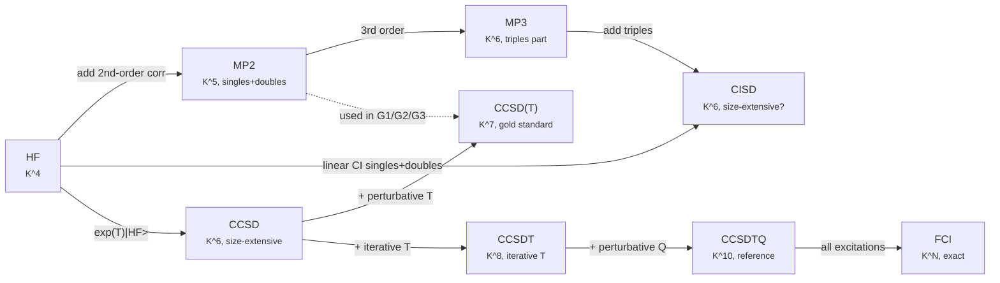

# Chapter 14 — Quantum chemistry methods beyond DFT

> Density-functional theory is the workhorse of modern electronic
> structure, but it is not the only theory.  Sitting in the same
> many-body Hilbert space are *wavefunction-base`d*' methods —
> Møller–Plesset perturbation theory, configuration interaction,
> coupled cluster, multireference, and the modern semiempiricals
> — that are systematically improvable, that converge to the
> exact answer as a parameter is turned up, and that have a
> different set of strengths and weaknesses from any functional
> on Jacob's ladder.

By the end of
[chapter 05]({{ "/dft-notes/chapter-05/" | relative_url }}) we had
the full Kohn–Sham machinery: a fictitious non-interacting
reference system that reproduces the interacting density
([chapter 04]({{ "/dft-notes/chapter-04/" | relative_url }})),
a self-consistent loop, and a Jacob's ladder of
exchange–correlation functionals — LDA, GGA, meta-GGA,
hybrid.  For most of chemistry and materials science,
the local and semi-local rungs of that ladder are good
enough; even the hybrid rung (PBE0, B3LYP) gets the
thermochemistry of organic molecules within
$\sim 0.2\,\text{eV}$.  The exceptions are the
*systematically improvable* problems — non-covalent
interactions, thermochemistry at $\text{kcal mol}^{-1}$
accuracy, transition-metal multiplets, bond breaking —
where the *wavefunction* itself is the controlled
quantity and DFT is one approximation among many.

This chapter is the tour of the wavefunction-based
methods that *complement* DFT.  We will, in order:
state the *post-HF ladder* in a single table (§ 14.1);
derive the **Møller–Plesset** perturbation series and
the canonical MP2 energy correction (§ 14.2); build the
**configuration-interaction** hierarchy, the **Davidson**
algorithm, and the *size-extensivity error* of
truncated CI (§ 14.3); introduce the **coupled-cluster**
exponential ansatz, the CCSD equations, and the
perturbative triples correction CCSD(T) (§ 14.4);
survey the **multireference** methods — CASSCF,
CASPT2, NEVPT2, and selected CI — for the problems
where a single determinant is not enough (§ 14.5);
give the **semiempirical** ancestry from Hückel to
PM7 to modern **DFTB** (§ 14.6); derive the
**Helgaker basis-set extrapolation** formula and the
**G1/G2/G3/W1** composite protocols (§ 14.7); close
with a side-by-side comparison (§ 14.8), a worked
example on the H₂O atomisation energy (§ 14.9), three
graded problems (§ 14.10), and an honest list of
omissions (§ 14.12).

The chapter assumes the working vocabulary of
[chapter 03]({{ "/dft-notes/chapter-03/" | relative_url }})
(HF, the Fock operator, Slater–Condon rules) and the
**second-quantised** machinery of
[chapter 02]({{ "/dft-notes/chapter-02/" | relative_url }})
(creation / annihilation operators, normal ordering,
Wick's theorem).  The notation is the one in the
[notation glossary]({{ "/dft-notes/extras/notation-glossary/" | relative_url }})
(atomic units, chemists' ERI, ERI conventions of
[§ 13.3 of the cheatsheet]({{ "/dft-notes/extras/math-cheatsheet/" | relative_url }})).
The basis-set language (cc-pV*X*Z, CBS extrapolation)
is from
[chapter 06]({{ "/dft-notes/chapter-06/" | relative_url }});
the multireference language (CAS, NEVPT2) builds on
[chapter 13]({{ "/dft-notes/chapter-13/" | relative_url }}).

> **Reading note.**  This chapter is *optional* for the
> rest of the DFT Notes series — chapters 06–13 do not use
> the post-HF machinery.  It is, however, the natural
> starting point for any reader who plans to compute
> *high-accuracy* thermochemistry (G1–G3, W1–W2, HEAT),
> or any property that is *not* a ground-state total
> energy (excitation energies, bond-breaking, multiplets,
> open-shell radicals, transition-metal spin states).

## 14.1 The claim

The headline of this chapter is a single statement of the
*post-HF ladder* — the ranking of methods by cost, by accuracy,
and by the kind of problem each is good at.

> **Claim.**  The wavefunction-based methods form a *ladder*
> in which the cost grows as a power of the basis size $K$ and
> the accuracy grows with that cost.  Hartree–Fock
> ([chapter 03]({{ "/dft-notes/chapter-03/" | relative_url }})) is the
> zeroth rung ($K^4$); MP2 the first ($K^5$); MP3 the second
> ($K^6$); CISD the third ($K^6$); CCSD the fourth ($K^6$);
> CCSD(T) the fifth ($K^7$); and full CI the sixth ($K^N$,
> exponential).  The energy error at chemical accuracy
> ($\sim 1\,\text{kcal mol}^{-1}$) drops monotonically along
> the ladder — from $\sim 30\,\text{kcal mol}^{-1}$ at HF to
> $\sim 0.1\,\text{kcal mol}^{-1}$ at CCSD(T).  The price
> for the last factor of three is the only one that is not
> polynomial: full CI scales exponentially and is *never* the
> right tool for production.

The numerical content of the claim is in
\eqref{eq:ch-14-claim}.  The **asymptotic cost** column is the
leading-order $K$-scaling for a *closed-shell* system with $n$
doubly-occupied spatial orbitals and $K$ basis functions; the
**typical mean-unsigned error** column is on the **G2/97 test
set** of 148 molecule-formation enthalpies, with the
**6-311+G(3df,2p)** basis; the **recommended use** column is the
kind of problem where the method is the *default* in a
production calculation.

\begin{equation}
\label{eq:ch-14-claim}
\boxed{\;
\begin{array}{|lccc|}
\hline
\text{Method} & \text{Cost} & \text{Error} & \text{When} \\\
             &            & (\text{kcal mol}^{-1}) & \\\
\hline
\text{HF}                  & K^4   & 100\text{-}300  & \text{orbitals, qualitative} \\\
\text{MP2}                 & K^5   & 5\text{-}15     & \text{large systems, dispersion} \\\
\text{MP3}                 & K^6   & 3\text{-}8      & \text{rare; not size-extensive in open-shell} \\\
\text{CISD}                & K^6   & 3\text{-}10     & \text{not size-extensive — see § 14.3.4} \\\
\text{MP4 (SDQ)}           & K^6   & 2\text{-}5      & \text{composite methods G1/G2} \\\
\text{CCSD}                & K^6   & 1\text{-}3      & \text{small to medium molecules} \\\
\text{CCSD(T)}             & K^7   & 0.1\text{-}0.5  & \text{gold standard} \\\
\text{CCSDT}               & K^8   & < 0.1        & \text{rare; multi-reference problematic} \\\
\text{FCI}                 & K^N   & 0            & \text{exact in a basis; benchmark only} \\\
\hline
\end{array}
\;}
\end{equation}

The "cost" column in \eqref{eq:ch-14-claim} is the *asymptotic
scaling* of the most expensive step; it is what determines
feasibility.  The "error" column is the *empirical* mean-
unsigned error on G2/97 (atomisation energies of small
molecules, ionisation potentials, electron affinities,
proton affinities); it is *not* a tight bound — the error on
individual systems can be larger or smaller by a factor of two.
The "when" column is the conventional wisdom about which
method to default to in a calculation.

Three caveats.  First, *none* of these methods is uniformly
better than DFT.  The
[DFT+U / hybrid / GW methods of chapter 13]({{ "/dft-notes/chapter-13/" | relative_url }})
are competitive with — and often cheaper than — MP2 or
CCSD(T) for the materials-science problems they target.
Second, *all* of these methods are finite-basis: their
convergence to the exact answer requires a *basis-set
extrapolation* (§ 14.7).  The CCSD(T) error of
$\sim 0.1\,\text{kcal mol}^{-1}$ is for a *complete-basis-set*
calculation; in a triple-zeta basis it is closer to
$0.5\,\text{kcal mol}^{-1}$.  Third, *all* of these methods
have a *systematic*' failure mode: the single-reference
assumption that underlies MP2, CCSD, and CCSD(T) breaks down
for bond breaking, diradicals, and excited states of the
same symmetry as the ground state — which is the topic of
§ 14.5. The rest of the chapter unpacks the ladder.  We start with
the perturbation-theory machinery that gives MP2 (§ 14.2),
build the configuration-interaction hierarchy (§ 14.3) and
its size-extensivity failure (§ 14.3.4), introduce the
coupled-cluster exponential ansatz that fixes the failure
(§ 14.4), survey the multireference methods for the
problems that defeat single-reference theories (§ 14.5), and
close with the semiempirical family (§ 14.6) and the
basis-set extrapolation that any practical calculation must
use to reach the "complete-basis-set" limit (§ 14.7).

## 14.2 Møller–Plesset perturbation theory

Møller–Plesset perturbation theory is the simplest
wavefunction-based correction of Hartree–Fock.  The
*zeroth order* is HF; the first order reproduces the HF
energy exactly (the perturbation is by construction zero at
first order); the *second order* — MP2 — is the first
non-trivial correction, and is a $\mathcal O(K^5)$ sum over
pairs of occupied and pairs of virtual orbitals.  MP2 is the
cheapest method that captures *dynamic correlation* — the
short-range electron-electron cusp that HF misses — and is
the default in many production codes for systems too large
for CCSD(T).

### 14.2.1 Rayleigh–Schrödinger perturbation theory

The starting point is the *Rayleigh–Schrödinger*
perturbation theory (RSPT) of non-degenerate quantum
mechanics.  Split the Hamiltonian as

\begin{equation}
\label{eq:ch-14-rspt-split}
\hat H \;=\; \hat H^{(0)} \;+\; \lambda \hat V ,
\end{equation}

where $\hat H^{(0)}$ has a *known* spectrum, $\hat V$
is the **perturbation**, and $\lambda$ is a
book-keeping parameter (set to $1$ at the end).  The
energy and eigenstate are power series in $\lambda$:

\begin{equation}
\label{eq:ch-14-rspt-series}
E(\lambda) \;=\; E^{(0)} + \lambda E^{(1)} + \lambda^2 E^{(2)} + \cdots , \qquad
|\Psi(\lambda)\rangle \;=\; |\Psi^{(0)}\rangle + \lambda |\Psi^{(1)}\rangle + \lambda^2 |\Psi^{(2)}\rangle + \cdots .
\end{equation}

Substituting into $\hat H(\lambda) |\Psi(\lambda)\rangle = E(\lambda) |\Psi(\lambda)\rangle$
and collecting powers of $\lambda$ gives the recursion

\begin{equation}
\label{eq:ch-14-rspt-recursion}
(\hat H^{(0)} - E^{(0)})\, |\Psi^{(n)}\rangle \;=\; E^{(1)} |\Psi^{(n-1)}\rangle + \cdots + E^{(n)} |\Psi^{(0)}\rangle - \hat V |\Psi^{(n-1)}\rangle ,
\end{equation}

solved by inverting $(\hat H^{(0)} - E^{(0)})$ on the
orthogonal complement of $|\Psi^{(0)}\rangle$.  The
first three energy corrections, obtained by
projecting onto $|\Psi^{(0)}\rangle$, are

\begin{equation}
E^{(0)} \;=\; \langle \Psi^{(0)} \rvert \hat H^{(0)} \rvert \Psi^{(0)} \rangle , \label{eq:ch-14-rspt-e0}
\end{equation}
\begin{equation}
E^{(1)} \;=\; \langle \Psi^{(0)} \rvert \hat V \rvert \Psi^{(0)} \rangle , \label{eq:ch-14-rspt-e1}
\end{equation}
\begin{equation}
E^{(2)} \;=\; \langle \Psi^{(0)} \rvert \hat V \rvert \Psi^{(1)} \rangle \;\equiv\; \sum_{k \ne 0} \frac{\lvert \langle \Psi^{(0)} \rvert \hat V \rvert \Psi_k^{(0)} \rangle \rvert^2}{E^{(0)} - E_k^{(0)}} . \label{eq:ch-14-rspt-e2}
\end{equation}

The sum in \eqref{eq:ch-14-rspt-e2} is over all
*other* eigenstates of $\hat H^{(0)}$; the sign is
*negative* (denominator negative for the ground
state, numerator positive).  The first-order wavefunction
correction is

\begin{equation}
\label{eq:ch-14-rspt-psi1}
|\Psi^{(1)}\rangle \;\equiv\; \sum_{k \ne 0} \frac{\langle \Psi_k^{(0)} \rvert \hat V \rvert \Psi^{(0)} \rangle}{E^{(0)} - E_k^{(0)}}\, |\Psi_k^{(0)}\rangle .
\end{equation}

The $n$-th order correction is a *product* of $n$
matrix elements of $\hat V$ divided by products of
energy denominators.  At *thir`d*' order the formula
contains $|\Psi^{(1)}\rangle$ contracted with
$\hat V |\Psi^{(1)}\rangle$ and so on.  This is the
structure of the **Møller–Plesset series** in the
next section.

### 14.2.2 The Møller–Plesset partition

The **Møller–Plesset** choice of $\hat H^{(0)}$ is the
**Fock operator** $\hat F$ of
[chapter 03]({{ "/dft-notes/chapter-03/" | relative_url }}).  The
perturbation is the *fluctuation potential* — the part of
the true two-electron interaction that is *not* captured by
the mean-field Fock operator.  Explicitly,

\begin{equation}
\hat H^{(0)} \;=\; \hat F , \label{eq:ch-14-mp-h0}
\end{equation}
\begin{equation}
\hat V \;=\; \hat H - \hat F \;=\; \hat V_{ee} - \hat V_\text{HF} . \label{eq:ch-14-mp-v}
\end{equation}

The zeroth-order eigenstates of $\hat F$ are the *Slater
determinants* $|\Phi_I\rangle$ built from the HF orbitals,
and the zeroth-order energies are the *sums* of the orbital
energies,

\begin{equation}
\label{eq:ch-14-mp-e0-det}
E_I^{(0)} \;=\; \langle \Phi_I \rvert \hat F \rvert \Phi_I \rangle \;=\; \sum_{p \in \text{occ}(I)} \varepsilon_p .
\end{equation}

For the *HF determinant* $|\Phi_0\rangle$ the occupied set
is the $N$ lowest spin-orbitals and the unoccupied set is
the rest.  The orbital energies are the eigenvalues of
$\hat F$.

The first-order energy correction is, by
\eqref{eq:ch-14-rspt-e1},

\begin{equation}
\label{eq:ch-14-mp-e1}
E^{(1)} \;=\; \langle \Phi_0 \rvert \hat H - \hat F \rvert \Phi_0 \rangle \;=\; \langle \Phi_0 \rvert \hat H \rvert \Phi_0 \rangle - \langle \Phi_0 \rvert \hat F \rvert \Phi_0 \rangle .
\end{equation}

Subtracting \eqref{eq:ch-14-mp-e0-det} from
\eqref{eq:ch-14-mp-e1} gives the **sum of zeroth- and first-
order** energies,

\begin{align}
E^{(0)} + E^{(1)} &\;=\; \langle \Phi_0 \rvert \hat F \rvert \Phi_0 \rangle + \langle \Phi_0 \rvert \hat H \rvert \Phi_0 \rangle - \langle \Phi_0 \rvert \hat F \rvert \Phi_0 \rangle \notag \\\
&\;=\; \langle \Phi_0 \rvert \hat H \rvert \Phi_0 \rangle \;\equiv\; E_\text{HF} . \label{eq:ch-14-mp-e01}
\end{align}

The HF energy is *exact* through first order in the
Møller–Plesset perturbation series.  This is the
**Brillouin condition** at work: the HF energy is a
*stationary* point of $E[\Phi]$ with respect to orbital
rotations, and the *first-order* change in the energy under
a rotation of an occupied orbital into a virtual (or vice
versa) vanishes.  The *first non-trivial* correction is
therefore *second order*: this is MP2. **Derivation of MP2.**  Substituting
\eqref{eq:ch-14-rspt-e2} with $\hat V = \hat H - \hat F$
and using the *intermediate normalisation*
$\langle \Phi_0 | \Psi \rangle = 1$ (so $|\Psi^{(1)}\rangle$ has
no component along $|\Phi_0\rangle$) gives

\begin{equation}
\label{eq:ch-14-mp2-e2}
E_\text{MP2} \;=\; \sum_{I \ne 0} \frac{\lvert \langle \Phi_0 \rvert \hat H - \hat F \rvert \Phi_I \rangle \rvert^2}{E_0^{(0)} - E_I^{(0)}} .
\end{equation}

The matrix element
$\langle \Phi_0 \rvert \hat F \rvert \Phi_I \rangle$ vanishes
for *all* $I \ne 0$ by the Brillouin condition
([chapter 03]({{ "/dft-notes/chapter-03/" | relative_url }}) § 3.3):
$\hat F$ is a *one-body* operator, so its matrix element
between two determinants that differ by a single spin-orbital
is *zero* (the action of $\hat F$ on a single occupied orbital
returns a *virtual*, by the Fock eigenvalue equation, which
is then orthogonal to all the *other* orbitals in
$|\Phi_0\rangle$).  The matrix element
$\langle \Phi_0 \rvert \hat H \rvert \Phi_I \rangle$ vanishes
for determinants that differ from $|\Phi_0\rangle$ by more
than a *double* excitation, by the Slater–Condon rules
([chapter 02]({{ "/dft-notes/chapter-02/" | relative_url }}) § 2.3).  The
*only* determinants that contribute to
\eqref{eq:ch-14-mp2-e2} are therefore the *doubles*
$|\Phi_{ij}^{ab}\rangle$, where two occupied spin-orbitals
$(i, j)$ have been promoted to two virtual spin-orbitals
$(a, b)$.

The matrix element of $\hat H$ between $|\Phi_0\rangle$ and
a double $|\Phi_{ij}^{ab}\rangle$ is, by the Slater–Condon
rules,

\begin{equation}
\label{eq:ch-14-mp2-me}
\langle \Phi_0 \rvert \hat H \rvert \Phi_{ij}^{ab} \rangle \;=\; \langle ij \rvert \rvert ab \rangle \;=\; \langle ij \rvert ab \rangle - \langle ij \rvert ba \rangle .
\end{equation}

In the **physicists'** notation (the bra-ket-with-two-pipes
$\langle ij \rvert \rvert ab \rangle$), this is the
**antisymmetrised** two-electron integral.  In **chemists'**
notation (the ERI of the cheatsheet
[§ 13.3]({{ "/dft-notes/extras/math-cheatsheet/" | relative_url }})),
the same integral is $(ia \rvert jb) - (ib \rvert ja)$.

The energy denominator in \eqref{eq:ch-14-mp2-e2} for a
double excitation $|\Phi_{ij}^{ab}\rangle$ is

\begin{equation}
\label{eq:ch-14-mp2-denom}
E_0^{(0)} - E_{ij}^{ab\,(0)} \;=\; \varepsilon_i + \varepsilon_j - \varepsilon_a - \varepsilon_b .
\end{equation}

The denominator is *negative* (the virtuals have higher
orbital energy than the occupieds); the square of the matrix
element is positive; the ratio is therefore *negative* —
MP2 is a *stabilising* correction.  Putting the pieces
together, the **MP2 correlation energy** is

\begin{equation}
\label{eq:ch-14-mp2}
\boxed{\;
E_\text{MP2} \;=\; - \sum_{i<j} \sum_{a<b} \frac{\Bigl\lvert \langle ij \rvert \rvert ab \rangle \bigr\rvert^2}{\varepsilon_a + \varepsilon_b - \varepsilon_i - \varepsilon_j} .
\;}
\end{equation}

The sums run over *pairs* of occupied spin-orbitals and
*pairs* of virtual spin-orbitals.  For a closed-shell
system with $n$ doubly-occupied spatial orbitals and $K$
spatial basis functions (so $2n$ occupied and $2(K - n)$
virtual spin-orbitals), the number of terms in the sum is
$\binom{n}{2} \cdot \binom{K - n}{2}$, and each term
requires *one* ERI.  The cost of the ERI evaluation is
$\mathcal O(K^4)$; the number of terms is $\mathcal O(K^4)$
at fixed $n$ (and $\mathcal O(K^2 n^2)$ at fixed ratio
$n/K$).  The MP2 energy is therefore $\mathcal O(K^5)$ at
fixed electron count, and the MP2 *gradient* (the
derivative with respect to nuclear coordinates, needed for
geometry optimisation) is $\mathcal O(K^4 n)$ — also fifth
order in $K$, but with a different prefactor.

**Worked step — the spin-free form.**  For a
*closed-shell* system, the spin-summed form of
\eqref{eq:ch-14-mp2} is

\begin{equation}
\label{eq:ch-14-mp2-sf}
E_\text{MP2}^\text{closed} \;=\; - \sum_{i<j}^{n} \sum_{a<b}^{K-n} \frac{2 \Bigl[ (ia \rvert jb) - (ib \rvert ja) \Bigr]^2}{\varepsilon_a + \varepsilon_b - \varepsilon_i - \varepsilon_j} ,
\end{equation}

where $i, j$ now run over *spatial* occupied orbitals,
$a, b$ over *spatial* virtual orbitals, and the factor $2$
arises from the spin sum (a spin-orbital double excitation
$(\bar\imath, \bar\jmath) \to (\bar a, \bar b)$ in
$\alpha\alpha \to \alpha\alpha$ plus a corresponding
$\beta\beta \to \beta\beta$ contribution, and the two
contributions combine to give the $2 \times$ factor).  The
energy denominator in \eqref{eq:ch-14-mp2-sf} is
$\varepsilon_a + \varepsilon_b - \varepsilon_i - \varepsilon_j$ in
*spatial* orbital energies (the factor of $2$ from spin has
already been accounted for).

> **Tip.**  The MP2 formula \eqref{eq:ch-14-mp2} is a
> *sum over pairs*.  This is the source of its
> $\mathcal O(K^5)$ cost and also of its *size
> consistency* (§ 14.2.4): for two non-interacting
> fragments A and B, the MP2 energy is the *sum* of the
> MP2 energies of the two fragments separately, because
> the cross terms vanish in the absence of interactions
> between A and B.  CISD does *not* have this property,
> which is the *defining* failure mode of truncated CI
> (§ 14.3.4).

### 14.2.3 Higher orders: MP3 and MP4

The MP2 formula \eqref{eq:ch-14-mp2} is a *second-order*
energy correction.  The full Møller–Plesset series is
$E = E_\text{HF} + E^{(2)} + E^{(3)} + E^{(4)} + \cdots$,
where $E^{(n)}$ is the $n$-th order correction.  The
corrections are *increasingly expensive* and not
monotonically* more accurate — the Møller–Plesset series is
*asymptoti`c*`, not convergent.  For most properties the
series *alternates*: MP2 over-corrects, MP3 partially
re-cancels, MP4 re-corrects.  In practice MP2, MP3, and
MP4 are all used; MP5 and beyond are *not* — the cost
grows too fast and the convergence is too slow.

**MP3.**  The third-order Møller–Plesset correction is
the *first* correction that contains a quadratic* term in
the perturbation.  Using the recursion
\eqref{eq:ch-14-rspt-recursion} at $n = 3$ and the
Slater–Condon rules,

\begin{equation}
\label{eq:ch-14-mp3}
E_\text{MP3} \;=\; \sum_{I \ne 0, J \ne 0} \frac{\langle \Phi_0 \rvert \hat V \rvert \Phi_I \rangle \langle \Phi_I \rvert \hat V - E^{(1)} \rvert \Phi_J \rangle \langle \Phi_J \rvert \hat V \rvert \Phi_0 \rangle}{\Bigl(E_0^{(0)} - E_I^{(0)}\Bigr) \Bigl(E_0^{(0)} - E_J^{(0)}\Bigr)} \;-\; E^{(2)} \langle \Psi^{(1)} \rvert \Psi^{(1)} \rangle .
\end{equation}

The dominant cost in \eqref{eq:ch-14-mp3} is the
*triple* sum over determinants $I$, $J$ that are reachable
from $|\Phi_0\rangle$ by a double excitation (the only
non-zero $\hat V$ matrix elements at zeroth order).  The
sum has $\mathcal O(K^6)$ terms and the cost is
$\mathcal O(K^6)$ at fixed electron count.  The MP3
*correction* to MP2 is small — typically a few tens of
percent of the MP2 correction, in the opposite direction.
The MP3 result is therefore *not* much better than MP2 in
absolute terms, and is *not* size-consistent in the
*open-shell* case (UHF reference) — a structural failure
that limits its use.

**MP4 and the SDTQ partition.**  The fourth-order
correction is, in the standard partition,

\begin{equation}
\label{eq:ch-14-mp4}
E_\text{MP4} \;=\; E_\text{S}^{(4)} + E_\text{D}^{(4)} + E_\text{Q}^{(4)} + E_\text{T}^{(4)} .
\end{equation}

The four terms are the **singles**, **doubles**,
**quadruples**, and **triples** contributions.  The
singles contribution $E_\text{S}^{(4)}$ vanishes for an HF
reference (Brillouin condition).  The doubles contribution
$E_\text{D}^{(4)}$ cancels the *size-inconsistency* of MP3
in the closed-shell case, restoring the property.  The
quadruples contribution $E_\text{Q}^{(4)}$ is a *product*
of two double-excitation amplitudes and is computationally
similar to MP3. The **triples contribution**
$E_\text{T}^{(4)}$ is the first place in the Møller–Plesset
series that *triple* excitations enter, and is the largest
single term in MP4 beyond MP3. **Why MP2 is the most popular.**  The cost-accuracy
trade-off favours MP2. MP2 is $\mathcal O(K^5)$ and gives
$\sim 80\%$ of the correlation energy on average; MP3 is
$\mathcal O(K^6)$ and gives $\sim 90\%$; MP4 is
$\mathcal O(K^7)$ and gives $\sim 95\%$; CCSD(T) is
$\mathcal O(K^7)$ and gives $\sim 99.5\%$.  The *last
factor* of two in accuracy (from MP4 to CCSD(T)) is what
the next section is about.  In production, MP2 is the
*default* for systems with $\sim 50$–$200$ atoms; for
smaller systems ($\lesssim 30$ atoms) CCSD(T) is feasible;
for larger systems DFT is the only option.

### 14.2.4 Size consistency

A method is **size consistent** if the energy of two
non-interacting fragments equals the sum of the energies of
the fragments computed separately.  Formally, for two
fragments A and B separated by an infinite distance,

\begin{equation}
\label{eq:ch-14-size-consistency}
E(\text{A}\cdots\text{B},\, R \to \infty) \;=\; E(\text{A}) + E(\text{B}) .
\end{equation}

MP2 *is* size consistent.  The MP2 energy
\eqref{eq:ch-14-mp2} is a *sum* over pairs of occupied*
orbitals: for a supermolecule A$\cdots$B, the occupied
orbitals split into those localised on A and those
localised on B (in the limit $R \to \infty$), the
*cross* terms A–B in the pair sum vanish because the
integrals $\langle \phi_i^A \phi_j^B \rvert \rvert \phi_a^A \phi_b^B \rangle$
are exponentially small at large separation, and the
energy is the *sum* of the A-only and B-only pair sums.
This is the same argument that gives the *additivity* of
the dispersion energy in the large-$R$ limit, and is
*exactly* the property one wants for a non-covalent
complex.

CISD is *not* size consistent.  The truncated-CI wavefunction
is a *linear combination* of determinants with a fixed
excitation ran`k*`: doubles, in the case of CISD.  The
doubles space of A$\cdots$B includes *cross excitations*
that excite one electron on A and one on B *simultaneously*,
and the linear coefficient of these cross-doubles is *not*
the product of the coefficients of the corresponding
single-fragment doubles.  The result is that the CISD
energy of A$\cdots$B at $R \to \infty$ is *not* the sum of
the CISD energies of A and B; the *missing* part is the
**size-extensivity error** of § 14.3.4. This is the
*defining* failure of truncated CI and the reason the
post-HF ladder has CISD and CCSD at the *same cost* (both
$\mathcal O(K^6)$) but only CCSD is size consistent.

> **Tip.**  Size consistency is *one* of the two formal
> properties a post-HF method should have.  The other is
> **size extensivity**: the energy should scale *linearly*
> with the number of particles in the *uniform* limit.
> Size consistency is a *non-uniform* limit (two
> *separate* fragments at $R \to \infty$); size
> extensivity is the *uniform* limit.  The two are
> related but not identical: a method can be size
> consistent but not size extensive (e.g. truncated CI
> on a chain of non-interacting atoms).  MP2, CCSD,
> CCSD(T), and FCI are *bot`h*' size consistent and size
> extensive.  CISD is neither.

## 14.3 Configuration interaction

Configuration interaction (CI) is the *most direct* way to
improve on Hartree–Fock: take the HF determinant as the
*reference*, and linearly combine it with all the
determinants that can be reached by a finite number of
single, double, ... excitations.  The **full CI** is the
exact answer in the chosen one-particle basis; truncated
CI (CIS, CID, CISD) is a *systemati`c*' approximation that
converges to FCI as the truncation level is raised.  The
*defining* weakness of truncated CI is its lack of size
extensivity (§ 14.3.4) — the property that coupled cluster
recovers by replacing the linear ansatz with an
*exponential* one (§ 14.4).

### 14.3.1 Full CI

The **full CI** wavefunction is the *exact* ground
state in the chosen one-particle basis,

\begin{equation}
\label{eq:ch-14-fci}
\lvert \Psi_\text{FCI} \rangle \;=\; \sum_{I} c_I \lvert \Phi_I \rangle ,
\end{equation}

where the sum runs over *all* Slater determinants
$|\Phi_I\rangle$ that can be built from the $K$
spin-orbitals of the basis, and the coefficients
$\{c_I\}$ are determined by diagonalising the
Hamiltonian in the space of *all* determinants.  The
full CI energy is the lowest eigenvalue of the CI
matrix $\mathbf H_{IJ} = \langle \Phi_I \rvert \hat H \rvert \Phi_J \rangle$,
a $D \times D$ Hermitian matrix with

\begin{equation}
\label{eq:ch-14-fci-dim}
D \;=\; \binom{K}{N} ,
\end{equation}

where $N$ is the number of electrons.  For a
closed-shell system with $N = 2n$ electrons in $K$
spatial orbitals, $D = \binom{K}{2n}$; for $K = 30$
(a moderate basis) and $n = 10$ (a small molecule),
$D \sim 10^{10}$.  The *asymptoti`c*' scaling of full
CI is therefore

\begin{equation}
\label{eq:ch-14-fci-scaling}
\text{Cost}_\text{FCI} \;\sim\; D^2 \;\sim\; \binom{K}{N}^2 \;\sim\; K^N ,
\end{equation}

which is **exponential** in the number of electrons.
Full CI is *never* feasible for production use; it
is the *benchmar`k*' against which every approximate
method is calibrated.  Every other method in this
chapter is a *systemati`c*' approximation to it.

### 14.3.2 Truncated CI

Truncated CI is a *truncation* of the full-CI
expansion \eqref{eq:ch-14-fci} to determinants of
excitation rank $\le n_\text{max}$.  The standard
abbreviations are

\begin{equation}
\text{CIS}    \;:\; \text{singles,    } |\Psi_\text{CIS}\rangle    = (1 + \hat C_1) |\Phi_0\rangle , \label{eq:ch-14-cis}
\end{equation}
\begin{equation}
\text{CID}    \;:\; \text{doubles,    } |\Psi_\text{CID}\rangle    = (1 + \hat C_2) |\Phi_0\rangle , \label{eq:ch-14-cid}
\end{equation}
\begin{equation}
\text{CISD}   \;:\; \text{singles + doubles, } |\Psi_\text{CISD}\rangle = (1 + \hat C_1 + \hat C_2) |\Phi_0\rangle , \label{eq:ch-14-cisd}
\end{equation}
\begin{equation}
\text{CISDT}  \;:\; \text{singles + doubles + triples, } |\Psi_\text{CISDT}\rangle = (1 + \hat C_1 + \hat C_2 + \hat C_3) |\Phi_0\rangle , \label{eq:ch-14-cisdt}
\end{equation}
\begin{equation}
\text{CISDTQ} \;:\; \text{singles + doubles + triples + quadruples, } |\Psi_\text{CISDTQ}\rangle = (1 + \hat C_1 + \hat C_2 + \hat C_3 + \hat C_4) |\Phi_0\rangle , \label{eq:ch-14-cisdtq}
\end{equation}

where the **excitation operators** $\hat C_n$ create
$n$-fold excitations out of the HF reference,
$\hat C_n = (1/n!)^2 \sum_{ij\cdots ab\cdots} c_{ij\cdots}^{ab\cdots} \hat a_a^\dagger \hat a_b^\dagger \cdots \hat a_j \hat a_i$.
The number of *doubly-excite`d*' determinants is
$\mathcal O(K^4)$ at fixed electron count; the
*triples* is $\mathcal O(K^6)$; the quadruples is
$\mathcal O(K^8)$.  The number of *singles* is
$\mathcal O(K^2)$ and is negligible.

The **CISD energy** is the lowest eigenvalue of the
Hamiltonian matrix in the space spanned by
$\{|\Phi_0\rangle\} \cup \{\hat C_1 |\Phi_0\rangle\} \cup \{\hat C_2 |\Phi_0\rangle\}$.
The matrix is *sparse*: only determinants that
differ by $\le 2$ orbital promotions have non-zero
off-diagonal matrix elements, by the Slater–Condon
rules.  The *singles–doubles* block has
$\mathcal O(K^6)$ non-zero entries; the
diagonalisation cost is $\mathcal O(K^6)$.  In
production this is the bottleneck of *direct-CISD*,
which avoids storing the full matrix and evaluates
the matrix-vector product on the fly.

**The Brillouin condition revisited.**  The
single-excitation block of the CI matrix is
*decouple`d*' from the doubles block at first order
(Brillouin condition), so the singles contribute
*only* to the first-order orbital relaxation and
the doubles contribute the *correlation* energy.
CIS alone gives *no* correlation energy — the
orbital-rotation off-diagonal vanishes at the HF
solution.  CIS is the *configuration-interaction
analogue* of time-dependent Hartree–Fock for the
*excited states* (§ 12 in chapter 12).

> **Tip.**  The singles excitations in CISD enter
> the *couple`d*' singles–doubles block and shift the
> doubles energies by $\mathcal O(K^2)$ per
> determinant.  The singles contribution to the
> *correlation* energy is therefore non-zero in
> CISD, in contrast to MP2 where the singles block
> is decoupled — a *subtle* difference that can be
> quantitatively significant for open-shell systems.

### 14.3.3 The Davidson algorithm

The *full* diagonalisation of the CI matrix is
$\mathcal O(D^3)$ in the *number of determinants* $D$,
and is therefore *infeasible* for the large CI spaces of
production calculations ($D \gtrsim 10^6$).  The standard
fix is the **Davidson algorithm**, an *iterative*
subspace eigensolver that exploits the *sparsity* of the
CI matrix.  The Davidson algorithm is to large-CI
calculations what the SCF iteration is to HF: the inner
loop that makes the calculation tractable.

The Davidson algorithm builds a *subspace*
$\{\mathbf q_\alpha\}_{\alpha=1}^{M}$ of trial vectors and
diagonalises $\mathbf H$ in the subspace.  The *exact*
eigenvector is approximated by a *linear combination* of
the trial vectors; the subspace is enlarged at each
iteration by a *correction vector* built from the
*residual* $\mathbf r = (\mathbf H - E)\, \mathbf c$.  The
correction is the **Davidson correction**

\begin{equation}
\label{eq:ch-14-davidson}
\delta \mathbf q \;=\; \frac{\mathbf r_i}{H_{ii} - E_\text{approx}} ,
\end{equation}

where $i$ is the index of the *dominant* component of the
current eigenvector $\mathbf c$, $H_{ii}$ is the diagonal
matrix element, and $E_\text{approx}$ is the current
eigenvalue.  The new correction vector is orthogonalised
against the existing subspace, the subspace is enlarged by
one, and the diagonalisation is repeated.  Convergence is
typically *quadrati`c*' in the residual norm once the
*correct* eigenvalue is bracketed, and is cubic* in the
*root* difference (the gap between the target root and the
next one).

The cost of one Davidson iteration is dominated by the
matrix-vector product $\mathbf H \mathbf q$, which is
$\mathcal O(D \cdot N_\text{nz})$ where $N_\text{nz}$ is
the *number of non-zero* entries per row of $\mathbf H$.
For the doubles space of a CISD, $N_\text{nz} \sim K^4$,
and the product is $\mathcal O(D K^4) \sim \mathcal O(K^6)$
at fixed $D/K^4$ ratio.  The total cost of the Davidson
algorithm is the cost of one matrix-vector product times
the number of iterations, which is typically $\sim 10$–$30$.
In the **direct-CI** formalism the matrix-vector product
is *evaluated on the fly* without ever forming $\mathbf H$
explicitly; this is the algorithm used in production
codes (e.g. the **Dirac-Fock** programme, the **PSI4**
**detci** module, the **CFOUR** **ecplib**).

> **Tip.**  The Davidson algorithm is *exact* in exact
> arithmetic — it converges to the *true* eigenvalue of
> $\mathbf H$ as the subspace grows.  The only
> approximation is the *preconditioner* of
> \eqref{eq:ch-14-davidson}: the diagonal approximation
> $H_{ii} - E_\text{approx}$ for the inverse of
> $\mathbf H - E_\text{approx}$.  A better
> preconditioner (e.g. the **OLSEN** correction, which
> includes the singles and the most important doubles)
> accelerates convergence but does not change the
> converged answer.  In production the Davidson
> algorithm is used for *all* large-CI calculations:
> CISD, CISDT, the FCI quantum Monte Carlo of § 14.5.4,
> and the equation-of-motion CC of § 14.12. ### 14.3.4 The size-extensivity error

The defining failure of truncated CI is its *lac`k*' of
size extensivity.  We illustrate with the simplest
non-trivial example: two non-interacting He atoms at
infinite separation.  Each He atom has 2 electrons
in 2 spin-orbitals (occupied $1s\alpha$, $1s\beta$);
the dimer has 4 electrons in 4 spin-orbitals.

The FCI space of one He atom has $D_1 = \binom{4}{2} = 6$
determinants: the closed-shell
$|1s\alpha\, 1s\beta\rangle$, the singles
$\hat a_{2s\alpha}^\dagger \hat a_{1s\alpha} |0\rangle$
and $\hat a_{2s\beta}^\dagger \hat a_{1s\beta} |0\rangle$,
and the double
$\hat a_{2s\alpha}^\dagger \hat a_{2s\beta}^\dagger \hat a_{1s\beta} \hat a_{1s\alpha} |0\rangle$.
The FCI ground state is the closed-shell determinant
$|1s\alpha\, 1s\beta\rangle$, with energy
$E_1 = -2.8617\,E_h$.  The FCI space of the dimer has
$D_2 = \binom{8}{4} = 70$ determinants; the FCI ground
state is the *product* of the two atomic FCI states,
$E_2 = 2 E_1 = -5.7234\,E_h$.  The size-consistency
relation \eqref{eq:ch-14-size-consistency} is
*satisfie`d*' by FCI, by construction.

The CISD space of He has $1 + 2 + 1 = 4$ determinants,
and the CISD energy *equals* the FCI energy of He
(the doubles *exhaust* the FCI space for two-electron
systems).  The interesting case is the *dimer*: the
CISD space of the dimer has *cross-doubles* that
excite one electron on atom A and one on atom B
*simultaneously*; these cross-doubles are not the
product of atomic doubles, and their coefficients are
*not* the product of the atomic double coefficients,
even at $R \to \infty$.  The CISD energy of the He
dimer at $R \to \infty$ is

\begin{equation}
\label{eq:ch-14-he-dimer}
E_\text{CISD}(\text{He}_2) \;\to\; 2\,E_\text{CISD}(\text{He}) + \Delta_\text{SE} ,
\end{equation}

where the **size-extensivity error** $\Delta_\text{SE}$
arises from the *normalisation* of the truncated-CI
wavefunction.  Quantitatively,

\begin{equation}
\label{eq:ch-14-extensivity}
\Delta_\text{SE} \;\sim\; - (2n) \cdot \frac{c_2^2}{1 - c_2^2} \cdot E_\text{corr}^{(2)} ,
\end{equation}

where $n$ is the number of fragments, $c_2$ the
doubles amplitude, and $E_\text{corr}^{(2)}$ the
second-order correlation energy per fragment.  The
error is *negative* (CISD over-correlates at large
$n$) and grows *linearly* with $n$.  For a system of
$N/2$ non-interacting He atoms, the CISD error is
*proportional to $N$*, and the per-atom error is
*constant* — the energy per atom converges to a
wrong value* in the thermodynamic limit.  This is
the *defining* failure of truncated CI.

> **Tip.**  The size-extensivity error of CISD can be
> *approximately* fixed by the **Davidson correction**
> $Q$, defined as
> $\Delta Q = (1 - c_0^2)\, (E_\text{CISD} - E_\text{HF})$,
> where $c_0$ is the coefficient of the reference
> determinant.  The Davidson correction *renormalises*
> the CISD energy to the *expecte`d*' correlation energy
> in the small-$c_0$ limit, and is the standard
> *empirical* fix in the **G1 / G2 / G3** composite
> methods of § 14.7. It is a *patc`h*`, not a
> substitute for the *exact* size extensivity of
> CCSD / CCSD(T).

## 14.4 Coupled cluster theory

Coupled cluster (CC) theory fixes the size-extensivity
failure of truncated CI by replacing the *linear* CI
ansatz with an *exponential* one.  The CC wavefunction is
$|\Psi_\text{CC}\rangle = \exp(\hat T) |\Phi_0\rangle$,
where $\hat T = \hat T_1 + \hat T_2 + \hat T_3 + \cdots$ is
the **cluster operator**, a sum of *excitation operators*
of all ranks.  The exponential ansatz is the *defining*
trick of CC theory: it makes the energy *size extensive*
at *every* truncation level (CCSD, CCSDT, ...), at the
price of solving a *non-linear* set of amplitude equations
(§ 14.4.2) instead of a linear eigenvalue problem.

### 14.4.1 The exponential ansatz

The **CC ansatz** is

\begin{equation}
\label{eq:ch-14-cc-ansatz}
\lvert \Psi_\text{CC} \rangle \;=\; e^{\hat T} \lvert \Phi_0 \rangle , \qquad
\hat T \;\equiv\; \hat T_1 + \hat T_2 + \hat T_3 + \cdots .
\end{equation}

The **cluster operators** $\hat T_n$ create $n$-fold
excitations out of the reference $|\Phi_0\rangle$,

\begin{equation}
\hat T_1 \;=\; \sum_{i, a} t_i^a\, \hat a_a^\dagger \hat a_i , \label{eq:ch-14-cc-t1}
\end{equation}
\begin{equation}
\hat T_2 \;=\; \frac{1}{4} \sum_{i, j, a, b} t_{ij}^{ab}\, \hat a_a^\dagger \hat a_b^\dagger \hat a_j \hat a_i , \label{eq:ch-14-cc-t2}
\end{equation}
\begin{equation}
\hat T_3 \;=\; \frac{1}{(3!)^2} \sum_{i, j, k, a, b, c} t_{ijk}^{abc}\, \hat a_a^\dagger \hat a_b^\dagger \hat a_c^\dagger \hat a_k \hat a_j \hat a_i , \label{eq:ch-14-cc-t3}
\end{equation}

where the **cluster amplitudes** $t_i^a$, $t_{ij}^{ab}$,
$t_{ijk}^{abc}$, ... are the unknowns.  The
$1/n!^2$ prefactor in $\hat T_n$ is the *symmetry*
factor that compensates for over-counting in the
sum over ordered indices.  The exponential $e^{\hat T}$
expands as

\begin{equation}
\label{eq:ch-14-cc-expand}
e^{\hat T} \lvert \Phi_0 \rangle \;=\; \lvert \Phi_0 \rangle + \hat T_1 \lvert \Phi_0 \rangle + \Bigl(\hat T_2 + \tfrac{1}{2}\hat T_1^2\Bigr) \lvert \Phi_0 \rangle + \Bigl(\hat T_3 + \hat T_2 \hat T_1 + \tfrac{1}{6}\hat T_1^3\Bigr) \lvert \Phi_0 \rangle + \cdots .
\end{equation}

The *connected*' terms are the linear $\hat T_n |\Phi_0\rangle$;
the *disconnected*' terms are products
$\hat T_m \hat T_n |\Phi_0\rangle$ with $m + n = N$.
The CC wavefunction *includes* the disconnected
contributions, in contrast to CISD, which includes
only the *linear* terms and misses the
disconnected products.  The disconnected products
are the *source* of size extensivity: for two
non-interacting fragments at $R \to \infty$, the
*factorise`d*' form
$e^{\hat T_A + \hat T_B} |\Phi_0^A \Phi_0^B\rangle =
e^{\hat T_A} |\Phi_0^A\rangle \cdot e^{\hat T_B} |\Phi_0^B\rangle$
is *automatically* a product of fragment CC
wavefunctions, and the energy is the sum of the
fragment energies.  This is the *defining*
advantage of the exponential ansatz.

The CC equations follow from the *similarity-
transforme`d*' Schrödinger equation

\begin{equation}
\label{eq:ch-14-cc-sim}
e^{-\hat T}\, \hat H\, e^{\hat T} \lvert \Phi_0 \rangle \;=\; E\, \lvert \Phi_0 \rangle .
\end{equation}

Projecting \eqref{eq:ch-14-cc-sim} onto the
*reference* $|\Phi_0\rangle$ gives the CC energy;
projecting onto the *excite`d*' determinants gives the
*amplitude equations*.  The form of
\eqref{eq:ch-14-cc-sim} is the **BCH similarity
transform** of the Hamiltonian by $e^{\hat T}$
([BCH formula]({{ "/dft-notes/extras/math-cheatsheet/" | relative_url }}) § 2.3).  The BCH series
*terminates* at $\hat T_4$ by the **connectedness
theorem**: matrix elements of $e^{-\hat T} \hat H e^{\hat T}$
between the reference and excitations of rank $> 4$
are *zero*.  The CC amplitude equations are a
*finite* system of polynomial equations in the
amplitudes, with *no* infinite series to truncate.

### 14.4.2 The CCSD equations

**CCSD** is the truncation of the CC ansatz
\eqref{eq:ch-14-cc-ansatz} to $\hat T = \hat T_1 + \hat T_2$.
The CCSD wavefunction is

\begin{equation}
\label{eq:ch-14-ccsd}
\lvert \Psi_\text{CCSD} \rangle \;=\; e^{\hat T_1 + \hat T_2} \lvert \Phi_0 \rangle .
\end{equation}

The expansion \eqref{eq:ch-14-cc-expand} truncated to
$\hat T_1 + \hat T_2$ gives

\begin{equation}
\label{eq:ch-14-ccsd-expand}
e^{\hat T_1 + \hat T_2} \lvert \Phi_0 \rangle \;=\; \lvert \Phi_0 \rangle + \hat T_1 \lvert \Phi_0 \rangle + \Bigl(\hat T_2 + \tfrac{1}{2} \hat T_1^2\Bigr) \lvert \Phi_0 \rangle + \Bigl(\hat T_1 \hat T_2 + \tfrac{1}{2} \hat T_2^2 + \tfrac{1}{6}\hat T_1^3\Bigr) \lvert \Phi_0 \rangle + \cdots .
\end{equation}

The first three lines are the *singles*, doubles, and
*triples* sectors of the CCSD wavefunction.  The
*doubles* sector contains both* the connected
$\hat T_2 |\Phi_0\rangle$ and the disconnected
$\tfrac{1}{2}\hat T_1^2 |\Phi_0\rangle$; the *triples*
sector contains the connected triples *only* if
$\hat T_3$ is included.  CCSD *approximates* the
triples by the disconnected
$\hat T_1 \hat T_2 + \tfrac{1}{2}\hat T_2^2 + \tfrac{1}{6}\hat T_1^3$
terms — the *source* of the CCSD error for properties
sensitive to the *triples* sector (bond breaking,
diradicals), fixed by the (T) of § 14.4.3. The CCSD *energy* follows from projecting
\eqref{eq:ch-14-cc-sim} onto $|\Phi_0\rangle$ and using
the linked-cluster theorem,

\begin{equation}
\label{eq:ch-14-ccsd-energy}
E_\text{CCSD} \;=\; \langle \Phi_0 \rvert e^{-\hat T}\, \hat H\, e^{\hat T} \rvert \Phi_0 \rangle \;=\; \langle \Phi_0 \rvert \hat H\, e^{\hat T} \rvert \Phi_0 \rangle_\text{connected} .
\end{equation}

For CCSD the *only* connected contractions are the
*linear* $\hat H$ term, the quadratic*
$\tfrac{1}{2}\hat H \hat T_1^2$ term (which gives the
*doubles* part of the energy), and the cubic*
$\tfrac{1}{6}\hat H \hat T_1^3$ term (which gives the
*triples* part — but the triples amplitude is zero
in CCSD, so this term vanishes).  The final
*closed-shell* form of the CCSD energy is

\begin{equation}
\label{eq:ch-14-ccsd-energy-cs}
E_\text{CCSD}^\text{closed} \;=\; E_\text{HF} \;+\; \sum_{i, j, a, b} t_i^a\, t_j^b\, (2\, \langle ij \rvert ab \rangle - \langle ij \rvert ba \rangle) \;+\; \frac{1}{4} \sum_{i, j, a, b} t_{ij}^{ab}\, \langle ij \rvert \rvert ab \rangle ,
\end{equation}

where the $t_i^a$ are the singles amplitudes and the
$t_{ij}^{ab}$ are the doubles amplitudes.  The first
correction is the *singles-singles* contribution, the
second is the *doubles* contribution.  The singles
amplitudes $t_i^a$ are non-zero in CCSD (in contrast
to MP2, where they vanish at the HF reference), and
they *redistribute* the orbital-rotation contribution
to the energy.

The CCSD *amplitude equations* are obtained by
projecting \eqref{eq:ch-14-cc-sim} onto the *singly*
and *doubly* excited determinants $\langle \Phi_i^a \rvert$
and $\langle \Phi_{ij}^{ab} \rvert$:

\begin{equation}
0 \;=\; \langle \Phi_i^a \rvert e^{-\hat T}\, \hat H\, e^{\hat T} \rvert \Phi_0 \rangle , \label{eq:ch-14-ccsd-t1}
\end{equation}
\begin{equation}
0 \;=\; \langle \Phi_{ij}^{ab} \rvert e^{-\hat T}\, \hat H\, e^{\hat T} \rvert \Phi_0 \rangle . \label{eq:ch-14-ccsd-t2}
\end{equation}

Equations \eqref{eq:ch-14-ccsd-t1}–\eqref{eq:ch-14-ccsd-t2}
are the **singles** and **doubles amplitude equations**,
a *couple`d*' system of polynomial equations in
$t_i^a$ and $t_{ij}^{ab}$.  The *standar`d*' solution
is *iterative*: start with $t_i^a = 0$, $t_{ij}^{ab} = 0$;
alternate updating $t_{ij}^{ab}$ at fixed $t_i^a$ and
$t_i^a$ at fixed $t_{ij}^{ab}$; repeat to convergence
($\sim 10$–$20$ cycles for a well-behaved system).

The cost of one CCSD iteration is dominated by the
*doubles* equation, which contains six contractions
of $\hat H$ with $\hat T_1$ and $\hat T_2$.  The
leading term is the $(t_2)^2$ contraction, which
costs $\mathcal O(K^6)$ per iteration; the full CCSD
cost is $\mathcal O(n_\text{iter} K^6)$ at fixed
electron count, with $n_\text{iter} \sim 15$ in
production.

> **Tip.**  The standard *reference* for CCSD is
> *restricte`d*' (RHF) for closed-shell systems,
> *unrestricte`d*' (UHF) for open-shell systems, and
> *Brueckner* when the singles amplitudes are set to
> zero by an orbital rotation that decouples them
> from the doubles.  Brueckner is the *natural*
> choice when the singles are not required by
> symmetry and gives slightly more accurate results
> than UHF-CCSD at the same cost.

### 14.4.3 The perturbative triples correction CCSD(T)

The CCSD wavefunction is *missing* the connected*
triple excitations $\hat T_3 |\Phi_0\rangle$; the
*approximate* triples in \eqref{eq:ch-14-ccsd-expand} are
the disconnected products $\hat T_1 \hat T_2 + \cdots$.
For most properties, the *connecte`d*' triples are
*small but non-negligible*, and they enter the energy
at *fourth order* in the Møller–Plesset series.  The
standard fix is the **perturbative triples correction**
$\text{CCSD(T)}$, which adds the *leading* connected
triples *non-iteratively* as a fifth-order Møller–
Plesset correction.

The **CCSD(T) energy** is

\begin{equation}
\label{eq:ch-14-ccsdt-energy}
E_\text{CCSD(T)} \;=\; E_\text{CCSD} \;+\; E_\text{T}^{(5)} ,
\end{equation}

where the **perturbative triples correction** is

\begin{equation}
\label{eq:ch-14-ccsdt-t}
E_\text{T}^{(5)} \;=\; \sum_{i<j<k} \sum_{a<b<c} \frac{\Bigl\lvert \langle \Phi_{ijk}^{abc} \rvert \hat V \rvert \Phi_0 \rangle \bigr\rvert^2}{E_0 - E_{ijk}^{abc}} \;-\; \text{(similar terms from $\hat T_1 \hat T_2$, $\hat T_2^2$)} .
\end{equation}

The first term is the *direct* contribution of the
connected triple excitation; the second and third are
the *spin-adapted*' and orbital-relaxation
corrections that arise from the non-zero singles and
the *quadrati`c*' doubles of the CCSD wavefunction.
The full expression involves *four* distinct
contractions of $\hat V$ with the CCSD amplitudes; the
standard implementation is the **Raghavachari–Trucks–
Pople–Head-Gordon** formula
([J. Chem. Phys. **82**, 2706 (1985)](<https://doi.org/10.1063/1.448266>)).

The *cost* of the (T) correction is dominated by the
*transformation* of the ERI tensor from the AO basis
to the MO basis, which is $\mathcal O(K^7)$ at fixed
electron count (the $K^7$ comes from a $K^5$ integral
transformation times a $K^2$ outer loop over the
triples).  For a system of $\sim 20$ atoms and a
*triple-zet`a*' basis ($K \sim 500$), the (T)
correction is the *bottleneck*', and the parallel
implementation (over the $i, j, k$ occupied triples)
is what makes the calculation feasible.

**Why CCSD(T) is the gold standard.**  Three
properties make CCSD(T) the *default* high-accuracy
method:

1. **Accuracy.**  CCSD(T) recovers $\sim 99.5\%$ of
   the correlation energy for closed-shell systems
   near equilibrium, with a *mean unsigned error* of
   $\sim 0.1$–$0.5\,\text{kcal mol}^{-1}$ on
   thermochemical test sets.  The error is
   *systemati`c*' (undercorrelation by $\sim 0.5\%$)
   and can be corrected by a basis-set extrapolation
   (§ 14.7) or by a higher-order CC calculation
   (CCSDT, CCSDTQ).

2. **Cost.**  The CCSD step is $\mathcal O(K^6)$ and
   the (T) step is $\mathcal O(K^7)$.  The (T) is
   *more expensive* than CCSD by a factor of $\sim K$
   in the basis, but is *not* the exponential
   cost of FCI.  CCSD(T) is *feasible* on a
   workstation for $N \lesssim 30$ atoms in a
   triple-zeta basis; for $N \sim 50$ atoms it
   requires a small cluster; for $N \gtrsim 100$
   atoms it is *infeasible* in a triple-zeta basis.

3. **Size extensivity.**  CCSD(T) is *exactly* size
   extensive at every truncation level: the (T)
   correction, the singles, and the doubles all
   factorise for two non-interacting fragments.
   This is the *defining* advantage over CISD.

> **Tip.**  The "(T)" in CCSD(T) is the *non-iterative*
> triples correction; a *fully iterative* treatment is
> the **CCSDT** method, which is $\mathcal O(K^8)$ and
> gives $\sim 99.9\%$ of the correlation energy.  The
> *next* correction beyond (T) is the perturbative
> quadruples CCSDT(Q) (or CCSDTQ(2)), which recovers
> $\sim 99.99\%$ at $\mathcal O(K^{10})$ cost.

### 14.4.4 Why CCSD is size extensive (and CISD is not)

The size extensivity of CCSD follows from the *linked-
cluster theorem*: the *connected* contractions of $\hat H$
with $e^{\hat T}$ are *proportional to the number of
particles* $N$, so the energy
\eqref{eq:ch-14-ccsd-energy} is a *sum of connected
terms*, each of which is *extensive (scales linearly with
$N$ in the uniform limit).  The same theorem *fails* for
CISD: the truncated-CI energy contains both *connecte`d*'
and *disconnecte`d*' contributions, and the disconnected
terms scale *sub-linearly* in $N$ (the normalisation of
the wavefunction suppresses the extensive part).  This is
the *defining* reason CCSD/CCSD(T) is the default
high-accuracy method in quantum chemistry, rather than
CIS/D/CISD.

> **Tip.**  A *proo`f*' of the linked-cluster theorem is in
> [Bartlett's review](<https://doi.org/10.1063/1.469546>)
> (*J. Chem. Phys.* **93**, 1697 (1990)) or in
> [Shavitt and Bartlett,
> *Many-Body Methods in Chemistry and Physics*](<https://www.cambridge.org/9780521818322>)
> (Cambridge, 2009).

## 14.5 Multireference methods

The *single-reference* assumption — that the exact
wavefunction is a *small perturbation* of a single Slater
determinant $|\Phi_0\rangle$ — is the foundation of MP2,
CISD, CCSD, and CCSD(T).  The assumption is *goo`d*' near
the equilibrium geometry of a closed-shell molecule; it is
*ba`d*' for bond breaking, diradicals, excited states of
the same symmetry as the ground state, and the
transition-metal multiplets that motivate chapter 13.
The multireference methods of this section are designed
for these cases.

### 14.5.1 The problem with single-reference methods

The *qualitative* failure of single-reference methods
arises when the HF determinant is not the dominant
configuration in the FCI expansion.  The *canonical*
example is the symmetric stretching of H₂: at the
equilibrium bond length ($R = R_e$), the FCI wavefunction
is dominated by the closed-shell determinant
$|1s_A\, 1s_B|$ with a small admixture of the ionic
$|1s_A\, 1s_A|$ and $|1s_B\, 1s_B|$ configurations; at
large $R$, the FCI wavefunction becomes an *equal-weight
superposition* of the covalent $|1s_A\, 1s_B|$ and the
ionic configurations, and *no single determinant* is
dominant.  The MP2 / CCSD(T) methods *fail* at large $R$
because they *expand aroun`d*' the single-determinant
reference, and the expansion is not convergent when the
reference is not a good starting point.

The *quantitative* signature of the failure is a
*divergent* perturbation series.  At large $R$ in H₂,
the MP2 energy *overshoots* the FCI energy, the MP3
energy *undershoots* even further, the MP4 energy
*overshoots* again, and so on — the series is
*asymptoti`c*`, not convergent.  The CCSD(T) energy is
*finite* at every $R$ (it is bounded from below by the
variational principle), but it is *systematically* in
error: the (T) correction is *small* near $R_e$ and
*large* at large $R$, and the coupled* CCSD
amplitudes are *not* a small perturbation of the HF
orbitals at large $R$.

The multireference methods of this section are designed
to *use* the active space of the molecule — the
*frontier* orbitals whose occupations change as the
geometry is varied — as a *full-CI subspace*, and to
treat the *remaining* (inactive) orbitals at a lower
level.  The active space is the *heart* of the
multireference treatment, and the choice of the active
space is the *art* of the method.

### 14.5.2 CASSCF

The **complete active space self-consistent field**
(CASSCF) method is the multireference analogue of HF:
a *full CI* in a chosen active space of $M$ orbitals
and $M_\text{el}$ electrons, with the *orbitals*
themselves optimised self-consistently.  The CASSCF
wavefunction is

\begin{equation}
\label{eq:ch-14-casscf}
\lvert \Psi_\text{CAS} \rangle \;=\; \sum_{I \in \text{active}} c_I \lvert \Phi_I \rangle ,
\end{equation}

where the sum is over *all* determinants in the
**complete active space** — all possible
distributions of the $M_\text{el}$ active electrons
among the $M$ active orbitals.  The dimension is
$D_\text{active} = \binom{M}{M_\text{el}}$ for a
*spin-adapte`d*' calculation (or
$\binom{M}{N_\alpha} \binom{M}{N_\beta}$ for a
spin-orbital basis).  The *orbital optimisation* is
a *constraine`d*' SCF: the active orbitals are rotated
among themselves, the inactive (doubly-occupied and
virtual) orbitals are rotated among themselves, and
the *cross* rotations (active–inactive) are fixed*
by the *Brillouin* condition.

The CASSCF energy is the *variational minimum* of
the expectation value of $\hat H$ over the
active-space full-CI wavefunction, optimised over
the orbital rotations.  The cost is dominated by the
*active-space FCI*, $D_\text{active}^2$, plus the
*orbital-gradient* computation
$\mathcal O(D_\text{active} K^2)$.  The *practical*
limit on the active space is
$D_\text{active} \lesssim 10^8$ (a few million
determinants); beyond that, the *deterministi`c*' FCI
is infeasible, and *stochasti`c*' methods (FCI-QMC,
selected CI) are required.

**Choice of the active space.**  The *art* of CASSCF
is the choice of the active space.  The general rule
is to include the *frontier* orbitals — the HOMO,
LUMO, and the orbitals that *become* HOMO/LUMO as
the geometry is varied.  Examples: **H₂ at large
$R$** uses $(\sigma_g, \sigma_u)$ with 2 electrons
(the *minimum* to describe the bond breaking);
**benzene** uses the six $\pi$ orbitals with 6
electrons (the *minimum* to describe the aromaticity
and the *first* excitation); **transition-metal
complexes** use the $(n-1)d$, $ns$, and $np$ orbitals
of the metal, typically
$(n_{\text{active}}, m_{\text{active}}) \sim (5$–$10, 5$–$10)$.

The *cost* of CASSCF grows exponentially with the
active-space size, but the *accuracy* of the method
depends *critically* on the active space.  A
*too-small* active space is a systematic* error that
cannot be fixed by improving the basis or the
post-CASSCF method; a *too-large* active space is a
*computational* error that can be fixed by a smaller
basis or a cheaper post-CASSCF method.  The *gold
standar`d* in 2025 is the *adaptive active space, in
which the active space is *grown* automatically as the
calculation proceeds (e.g. the **AutoCAS** protocol of
the
[Stein, Reiher
group](<https://doi.org/10.1021/acs.jctc.9b00385>)).

### 14.5.3 Perturbative corrections: CASPT2 and NEVPT2

The CASSCF wavefunction captures the *stati`c*'
correlation — the *qualitative* multi-reference
physics of the active space — but *misses* the
*dynami`c*' correlation outside the active space.  The
standard fix is a *second-order perturbative*
correction, with the two leading methods being
**CASPT2** (Andersson, Malmqvist, Roos, *J. Chem.
Phys.* **96**, 1218 (1992)) and **NEVPT2** (Angeli,
Cimiraglia, Evangelisti, Leininger, Malrieu,
*J. Chem. Phys.* **114**, 10252 (2001)).

**CASPT2** partitions $\hat H = \hat H^{(0)}_\text{CAS} + \hat V$
with $\hat H^{(0)}_\text{CAS}$ the *generalised Foc`k*'
operator built from the CASSCF density.  The CASPT2
energy is

\begin{equation}
\label{eq:ch-14-caspt2}
E_\text{CASPT2} \;=\; E_\text{CAS} + \sum_{I \notin \text{CAS}} \frac{\lvert \langle \Psi_\text{CAS} \rvert \hat H \rvert \Phi_I \rangle \rvert^2}{E_\text{CAS} - E_I^{(0)}} ,
\end{equation}

where the sum is over all determinants *outside* the
CAS.  The CASPT2 energy is *not* a strict upper
bound (the generalised Fock is not Hermitian), but
is *size consistent* and size extensive at
*infinity* of the second-order expansion; the cost
is $\mathcal O(D_\text{active} K^4)$, *asymptotically
the same* as MP2 for a *fixed* active space.

The CASPT2 method has a *well-known* pathology: the
**intruder-state problem**.  When one of the external
determinants has an *energy close* to the CASSCF
ground state, the denominator in
\eqref{eq:ch-14-caspt2} *vanishes* and the
perturbation theory *diverges*.  The standard fix is
the **level shift** (Rozansky & Davidson, *Int. J.
Quantum Chem.* **28**, 1041 (1985)), a real shift
$\epsilon$ added to all denominators, which is
*remove`d*' at the end of the calculation by
extrapolation.  The intruder-state problem is the
*defining* weakness of CASPT2 and the motivation
for NEVPT2. **NEVPT2** (the **N-electron valence perturbation
theory**) fixes the intruder-state problem by a
*different* choice of $\hat H^{(0)}$, a bivariance
of the **Dyall** Hamiltonian (Dyall, *J. Chem.
Phys.* **102**, 4909 (1995)):

\begin{equation}
\label{eq:ch-14-nevpt2-h0}
\hat H^{(0)}_\text{NEVPT2} \;=\; \sum_{r \in \text{core}, s \in \text{virt}} \Bigl(\varepsilon_r + \varepsilon_s - \varepsilon_a - \varepsilon_b\Bigr)\, \lvert \Phi_{ab}^{rs} \rangle \langle \Phi_{ab}^{rs} \rvert \;+\; \cdots ,
\end{equation}

where the sum is over determinants generated by a
single- or double-excitation from a CAS determinant
into the external space.  The NEVPT2 denominators
are *differences of orbital energies* (not
differences of CAS eigenvalues), and are therefore
*strictly bounded away from zero* (the orbital
energy gap of the *inactive* orbitals is finite).
The intruder-state problem is *solve`d*`; the cost is
the same as CASPT2. The **NEVPT2 energy** is

\begin{equation}
\label{eq:ch-14-nevpt2}
E_\text{NEVPT2} \;=\; E_\text{CAS} \;+\; \sum_{I \notin \text{CAS}} \frac{\Bigl\lvert \langle \Psi_\text{CAS} \rvert \hat H \rvert \Phi_I \rangle \bigr\rvert^2}{E_0^{(0)} - E_I^{(0)_\text{NEVPT2}}} ,
\end{equation}

where the sum is over the *external* determinants
and the denominator is the *Dyall* gap.  The NEVPT2
energy is *size consistent*, size extensive, and
*bounde`d*' in the presence of intruder states.  It is
the *default* multireference perturbative
correction in the
[ORCA](<https://orcaforum.kofo.mpg.de/>) and
[Molcas](<https://www.molcas.org/>) programmes, and
is the *standar`d*' for high-accuracy multireference
calculations in 2025. ### 14.5.4 Selected CI: CIPSI, Heat-bath CI

The *selected-CI* methods are a stochastic*
generalisation of the *deterministi`c*' FCI that
*samples* the FCI space rather than enumerating it.
The two leading methods are **CIPSI** (Huron, Malrieu,
Rancurel, *J. Chem. Phys.* **58**, 5745 (1973)) and
**Heat-bath CI** (HBCI, Holmes, Tubman, Umrigar,
*J. Chem. Phys.* **147**, 164111 (2017)).  Both build a
*variational* wavefunction by iteratively adding the
most important determinants from the full FCI space, and
use *second-order perturbation theory* to estimate the
*missing* correlation energy.

**CIPSI** starts from a small reference wavefunction
(e.g. the HF determinant) and at each iteration:

1. Compute $c_I^{(1)} = \langle \Phi_I \rvert \hat H \rvert \Psi_\text{var} \rangle / (E_\text{var} - E_I)$ for every *external* determinant $|\Phi_I\rangle$.
2. Add the determinants with the largest $|c_I^{(1)}|$ (a batch of $10^3$–$10^5$) to the variational space.
3. Diagonalise $\hat H$ in the enlarged space.
4. Repeat until the perturbative missing energy drops below the target threshold ($10^{-3}$–$10^{-5}\,E_h$).

The CIPSI wavefunction *converges* to FCI as the
threshold is tightened.  The *cost* is dominated by
the *perturbative* step, which is linear in the
number of external determinants and *quadrati`c*' in the
size of the variational space.  CIPSI is the
*standar`d*' FCI solver for systems with up to
$\sim 30$ electrons in $\sim 30$ orbitals.

**Heat-bath CI** is a *modern* variant of CIPSI: at
each iteration, every external determinant is *visite`d*'
and the *coupling*
$\lvert \langle \Phi_I \rvert \hat H \rvert \Psi_\text{var} \rangle \rvert$
is computed.  Determinants with a coupling above a
*threshold*' $\epsilon$ are adde`d; the rest *discarded*.
$\epsilon$ is the *control parameter*: $\epsilon = 0$
gives FCI, $\epsilon = \infty$ gives HF.  HBCI is
*fast* (linear in the number of external determinants,
with a small constant) and *parallelises without
inter-process communication* — each worker thread iterates
its own subset of external determinants and the resulting
$\Phi_I$ amplitudes are reduced at the end of each macro-iteration
(a single MPI_Allreduce on the coefficient vector of
size $\le 10^4$).  For $\epsilon \sim 10^{-5}\,E_h$, the HBCI
perturbative correction is *converge`d*' to within a few
$\mu E_h$ of FCI.

The *largest* HBCI calculation to date (2024) has
$\sim 10^{23}$ determinants in the variational space
and $\sim 10^{27}$ in the perturbative space —
*orders of magnitude* beyond the deterministic FCI
limit.  HBCI visits $\sim 10^{10}$ determinants per
second per CPU core (versus $\sim 10^6$–$10^7$ for
CIPSI), making it $\sim 10^3$–$10^4$ times faster
for the same variational space.  HBCI is the *default*
in the
[Arrow](<https://github.com/QChemSoftware>) and
[Dice](<https://github.com/susmithachan/Dice>) programmes.

## 14.6 Semiempirical methods

The *semiempirical* methods are a family of approximate
quantum-chemistry methods that *replace* the expensive
two-electron integrals with *empirical parameters*
fitted to experiment or to high-accuracy calculations.
The semiempirical family is *older* than DFT (the
*Hückel* method is from 1930), and is the only
quantum-chemistry approach that is *fast enoug`h*' for
*millions* of atoms (molecular dynamics of proteins,
molecular electronics, combinatorial chemistry).  The
*modern* semiempirical methods — PM3, PM6, PM7, DFTB —
are *not* the Hückel method of the 1930s; they are
*systematically improvable* approximations to the full
electronic problem that retain the *spee`d*' of the
historical methods and the *accuracy* of the modern
ones.

### 14.6.1 The Hückel → extended Hückel → PPP/SCC lineage

The **Hückel method** (Hückel, 1930–1931) is the
*grandfather* of the semiempirical family.  It
treats the $\pi$ electrons of an aromatic
hydrocarbon as a tight-binding model on the carbon
$2p_z$ orbitals, with a *single* resonance integral
$\beta$ for every nearest-neighbour coupling and a
*single* on-site energy $\alpha$ for every carbon.
The Hückel Hamiltonian is

\begin{equation}
\label{eq:ch-14-huckel}
H^\text{Hückel}_{ij} \;=\;
\begin{cases}
\alpha & \text{if } i = j, \\\
\beta & \text{if } (i, j) \text{ is a bond}, \\\
0 & \text{otherwise}.
\end{cases}
\end{equation}

The Hückel method has *no* overlap matrix, no
two-electron integrals, and *no* geometry
optimisation; the $\pi$ energy is the sum of the
eigenvalues of the *topological* matrix of the
carbon skeleton.  The method is *quantitatively*
useless for any *quantitative* purpose, but it is
*qualitatively* correct for the aromatic*
patterns of organic chemistry: the Hückel
$4n + 2$ rule, the alternation of single and double
bonds in polyenes, and the *frontier* orbitals of
conjugated systems.  It is still taught in every
undergraduate organic-chemistry course.

The **extended Hückel** method (Hoffmann, 1963) is
a *generalisation* to all valence orbitals, not
just the $\pi$ electrons.  The Hamiltonian matrix
elements are *parameterise`d*' in terms of
*Slater-type orbital* overlaps, and the diagonal
elements are set to the *valence-state ionisation
potentials* of the atomic orbitals.  The extended
Hückel method has *no* self-consistency and no
iterative SCF; it is a *one-shot* diagonalisation
of a *parameterise`d*' Hamiltonian.  It is
*qualitatively* correct for band structures of
solids, molecular orbital diagrams, and Walsh
diagrams.

The **Pariser–Parr–Pople** (PPP) method (Pariser &
Parr, 1953; Pople, 1953) is the *first*
semiempirical method to include the *electron–
electron repulsion*, in a *zero-differential-
overla`p*' (ZDO) approximation.  The PPP method
treats the $\pi$ electrons of an aromatic
hydrocarbon with a *two-centre* Coulomb integral
$\gamma_{AB}$ that is *parameterise`d*' as a function
of the distance $R_{AB}$.  The PPP method is
*quantitatively* useful for the excitation
spectr`a*' of aromatic hydrocarbons, and is the
*ancestor* of the modern ZDO methods of § 14.6.2.
The **self-consistent charge** (SCC) extension of
Hückel (SCC-DFTB, § 14.6.4) is the *modern*
revival of the Hückel idea, with *self-consistent*
charge redistribution and a *second-order*
expansion of the Kohn–Sham total energy.

### 14.6.2 Zero-differential overlap (ZDO) methods

The **zero-differential-overlap** (ZDO) approximation
is the *defining* simplification of the
*intermediate* semiempirical methods (CNDO, INDO,
MINDO, MNDO, AM1, PM3).  The approximation sets

\begin{equation}
\label{eq:ch-14-zdo}
\chi_\mu(\mathbf r)\, \chi_\nu(\mathbf r) \;=\; 0 \quad \text{for } \mu \ne \nu ,
\end{equation}

i.e. *products* of different basis functions are
*neglecte`d*' in the two-electron integral
evaluation.  The ZDO approximation is *drasti`c*`:
it removes *all* three- and four-centre
two-electron integrals, and replaces the
remaining integrals with *parameterise`d*' values
that depend only on the *atom types* (not the
orbital types) of the four centres.

The **NDDO** (neglect of diatomic differential overlap)
approximation is the *least drasti`c*' ZDO method: it
keeps *all* two-centre integrals of the form
$(\mu_A \nu_A \rvert \rho_B \sigma_B)$ with
$\mu, \nu$ on atom $A$ and $\rho, \sigma$ on atom $B$,
and sets to zero all *three- and four-centre* integrals.
NDDO is the *basis* of the modern PM3, PM6, PM7
methods.

The **INDO** (intermediate neglect of differential
overlap) approximation is *more drasti`c*`: it keeps
only the *one-centre* exchange integrals
$(\mu_A \nu_A \rvert \mu_A \nu_A)$ and sets *all*
two-centre integrals to *parameterise`d*' values.  INDO
is the *basis* of the MINDO/3 method.

The **CNDO** (complete neglect of differential overlap)
approximation is the *most drastic*`: it sets all
two-electron integrals to a *single* parameterised
value that depends only on the atom types.  CNDO is
*qualitative* only.

The *family tree* is

\begin{equation}
\label{eq:ch-14-zdo-lineage}
\text{Hückel} \;\to\; \text{Extended Hückel} \;\to\; \text{PPP} \;\to\; \text{CNDO} \;\to\; \text{INDO} \;\to\; \text{MINDO} \;\to\; \text{MNDO} \;\to\; \text{AM1} \;\to\; \text{PM3} \;\to\; \text{PM6} \;\to\; \text{PM7} .
\end{equation}

The methods in \eqref{eq:ch-14-zdo-lineage} are in
*increasing* order of sophistication: each method adds
*more* integrals to the kept set, *more parameters
to the *fitted*' set, and more physics to the
*Hamiltonian* (MINDO adds core–core repulsion,
MNDO adds *diatomi`c*' parameters, AM1 adds
*Gaussian* corrections to the core repulsion, PM3
re-fits the parameters to a *larger* training set,
PM6 adds *dihedral* parameters, PM7 adds
*dispersion* and hydrogen-bond* corrections).  The
*accuracy* improves along the lineage, and the
*cost* is constant (all of them are
$\mathcal O(K^3)$ for the SCF step, dominated by the
Fock-matrix diagonalisation).

> **Tip.**  The semiempirical methods are *calibrated
> to specific properties* of *specific* elements.  The
> PM3 parameter set, for example, is fitted to
> $\sim 900$ reference data points (heats of formation,
> bond lengths, dipole moments) for $\sim 80$ elements
> of the periodic table.  PM6 adds parameters for the
> *transition metals*; PM7 adds parameters for the
> *lanthanides* and a dispersion correction
> (DFT-D3).  The *accuracy* of the method depends
> *critically* on whether the system of interest is
> in the *training set*; for systems outside the
> training set, the error is *systematically* larger.
> PM7 is the *last* in the lineage; no further
> "PM8" is planned.

### 14.6.3 Modern semiempiricals: PM3, PM6, PM7

The **PM3** (Stewart, 1989) is the *first* of the
*modern* semiempirical methods.  PM3 is an NDDO
method with *re-optimise`d*' parameters fitted to
$\sim 900$ reference data points.  The PM3
Hamiltonian is

\begin{equation}
\label{eq:ch-14-pm3}
H_{\mu\nu}^\text{PM3} \;=\; \langle \mu \rvert \hat h_\text{core} \rvert \nu \rangle \;+\; \sum_B \sum_{\rho, \sigma \in B} P_{\rho\sigma}\, (\mu\nu \rvert \rho\sigma) ,
\end{equation}

where the *one-electron* integrals are parameterised*
(not evaluated), the *two-electron* integrals are
*evaluate`d*' with the NDDO approximation, and the
density matrix is *self-consistently* determined by
the SCF iteration.  The PM3 *self-consistency* is the
*defining* improvement over the non-SCF Hückel and
extended-Hückel methods; the PM3 is the *first*
semiempirical method that is *qualitatively* correct
for *charge redistribution* in polar molecules.

**PM6** (Stewart, 2007) adds *dihedral* and
*transition-metal* parameters to PM3 and re-fits
all parameters to $\sim 10^4$ reference data points.
**PM7** (Stewart, 2013) adds *dispersion* (DFT-D3)
and *hydrogen-bon`d*' corrections and re-fits to
$\sim 10^5$ reference data points.  PM7 is the *most
accurate* semiempirical method in 2025, with a *mean
unsigned error* of $\sim 3$–$5\,\text{kcal mol}^{-1}$
for *organi`c*' thermochemistry and $\sim 5$–$10\,\text{kcal mol}^{-1}$
for *transition-metal* thermochemistry.

> **Tip.**  The semiempirical methods are *fast*
> ($\sim 10^3$–$10^4$ times faster than DFT for
> systems of $\sim 100$ atoms), but *not* a
> *substitute* for DFT or CCSD(T).  Use them for
> (1) *conformational searches* and molecular
> dynamics* on $\sim 10^3$–$10^5$ atoms, (2)
> *qualitative* reaction mechanisms, and (3)
> *pre-screening* of large chemical libraries.

### 14.6.4 DFTB (Density-Functional Tight-Binding)

The **DFTB** method is the *modern* semiempirical
method, derived from *DFT* by a second-order
expansion of the Kohn–Sham total energy in the
*charge-density fluctuation* $\delta \rho = \rho - \rho_0$
around a *reference* density $\rho_0$ (the
*superposition* of atomic* densities).  The DFTB
total energy is

\begin{equation}
\label{eq:ch-14-dftb}
E_\text{DFTB} \;=\; \sum_{i}^\text{occ} \langle \psi_i \rvert \hat H_0 \rvert \psi_i \rangle \;+\; E_\text{rep}[\rho_A, \rho_B, \ldots] \;+\; \frac{1}{2} \sum_{A, B} \frac{\partial^2 E_\text{xc}}{\partial \rho_A \partial \rho_B}\, \delta \rho_A\, \delta \rho_B ,
\end{equation}

where the first term is the *tight-binding* sum of
occupied orbital energies, the second is a
*short-range* repulsive potential for the
*core–core* repulsion and double-counting
corrections, and the third is the *second-order*
correction in the *charge fluctuations*.  The DFTB
Hamiltonian matrix elements are *evaluate`d*' with a
*minimal* basis of atomic* orbitals (typically
$sp^3$ for C, N, O; $sp$ for H), and the *on-site*
second-derivative $\partial^2 E_\text{xc} / \partial \rho_A^2$
is the *Hubbard $U$* of the atom, fitted to the
*atomi`c*' self-consistent response.

The DFTB method has *three* "flavours": **DFTB1**
(non-SCC, comparable to extended Hückel),
**DFTB2** (SCC, comparable to GGA-DFT for
geometries), and **DFTB3** (third-order expansion,
comparable to hybrid DFT for geometries).  All three
have cost $\mathcal O(K^3)$; the differences are
*accuracy*, not spee`d.  DFTB is the *fastest of
the *modern* semiempirical methods, with millions
of atoms accessible on a single workstation, but has
*three* systematic limitations: a minimal basis
(no polarisation / diffuse functions), a *single*
Hubbard $U$ per atom (no environmental response), and
a *fitte`d*' repulsive potential (no transferability to
chemistry outside the training set).

The DFTB method is the *workhorse* of large-scale
quantum-mechanical simulations in 2025: molecular
dynamics of proteins (millions of atoms, nanosecond
timescales), molecular electronics, and
*high-throughput* materials discovery
([NOMAD](<https://nomad-lab.eu/>) and
[MaterialsProject](<https://materialsproject.org/>) use
DFTB for the *initial* screening of candidates).  The
*standard*' workflow is: (1) DFTB for the initial
screening of $\sim 10^3$–$10^6$ candidates, (2) DFT
(GGA or hybrid) for the *re-ranking* of the top
$\sim 10^2$–$10^3$ candidates, (3) CCSD(T) or a
composite method (G1–G3, W1–W2) for the *final*
ranking.  The *computational* cost is dominated by
the *first* step (DFTB); the accuracy by the
*thir`d*' (CCSD(T)).

> **Tip.**  The DFTB method is *not* a substitute
> for DFT; it is a *complement*.  Use DFTB for
> *qualitative* questions on large systems; use
> DFT for *quantitative* questions on small
> systems; use CCSD(T) for *quantitative* questions
> on *very small* systems.  The boundary between
> the three is set by the *accuracy* required by
> the *chemical question* being asked.

## 14.7 Basis set extrapolation

Every post-HF method is a *finite-basis* approximation.
The *convergence* to the complete-basis-set (CBS) limit
is *slow*: the MP2 correlation energy converges as
$X^{-3}$ for the Dunning cc-pV*X*Z basis
([chapter 06]({{ "/dft-notes/chapter-06/" | relative_url }}) § 6.2),
and the *coupled-cluster* correlation energy converges
even more slowly.  The standard fix is the **basis-set
extrapolation**: a *functional form* for the basis-set
error, fitted to calculations at two or three values of
$X$.  The most widely used form is the **Helgaker
formul`a**, which gives the complete-basis-set* limit to
$\sim 0.1\,\text{m}E_h$ for a triple- and quadruple-zeta
pair.

### 14.7.1 The Helgaker formula

The **Helgaker** two-point extrapolation formula
(Helgaker, Klopper, Koch, Noga, *J. Chem. Phys.*
**106**, 9639 (1997)) is

\begin{equation}
E_\text{HF}(X) \;=\; E_\text{HF}^\text{CBS} \;+\; A\, X^{-3} , \label{eq:ch-14-helgaker-hf}
\end{equation}
\begin{equation}
E_\text{corr}(X) \;=\; E_\text{corr}^\text{CBS} \;+\; B\, (X - 1)^{-3} . \label{eq:ch-14-helgaker-corr}
\end{equation}

The **Hartree–Foc`k** energy converges exponentially*
with the cardinal number $X$; the leading correction
is $\propto X^{-3}$ for the Dunning basis.  The
**correlation** energy converges *asymptotically* as
$(X - 1)^{-3}$; the offset $X - 1$ reflects the
*fact* that cc-pVDZ ($X = 2$) is missing the
*correlating* functions of cc-pVTZ.  The two
expressions are *fit simultaneously* to two
calculations at $X_1$ and $X_2$ (typically $X_1 = 3$
and $X_2 = 4$ for triple- and quadruple-zeta),
giving the CBS limit
$E^\text{CBS} = E_\text{HF}^\text{CBS} + E_\text{corr}^\text{CBS}$.

The Helgaker formula is *justifie`d*' by the
*asymptotic*' behaviour of the two-electron
integrals in a Gaussian basis: the *missing*
contribution in a finite basis is a *smoot`h*'
function of the basis set size, with the leading
term scaling as $X^{-3}$.  The CBS limit is
*recoverable* from two or three finite-basis
calculations, to a precision of
$\sim 0.1\,\text{m}E_h$.

> **Note.**  The Helgaker formula is *not* a
> *variational* bound — the extrapolated CBS energy
> can be *below* the true energy by
> $\sim 0.1$–$1\,\text{m}E_h$ because the *fit* is
> to a *specifi`c*' functional form that may not
> capture the *true* asymptotic behaviour.  The
> error is *small* for triple- and quadruple-zeta*
> pairs ($\sim 0.1\,\text{m}E_h$) and *larger* for
> *double- and triple-zet`a*' pairs
> ($\sim 1\,\text{m}E_h$).  The *recommende`d*' pair
> in production is $X = 3, 4$ (cc-pVTZ + cc-pVQZ),
> with an error bar of $\pm 0.1\,\text{m}E_h$ for
> closed-shell systems.

### 14.7.2 Two-point vs three-point extrapolation

The **two-point** Helgaker extrapolation fits two
calculations at $X_1$ and $X_2$ (typically 3 and 4)
to the two *unknowns* $E^\text{CBS}$ and the single
prefactor ($A$ for HF, $B$ for correlation).  The
two-point extrapolation is *exact* if the
functional form
\eqref{eq:ch-14-helgaker-hf}–\eqref{eq:ch-14-helgaker-corr}
is *correct*; the residual error is dominated by
the *higher-order* terms in the $X^{-3}$ expansion,
*small* for $X \ge 3$.

The **three-point** extrapolation uses three
calculations at $X_1$, $X_2$, $X_3$ (typically 2,
3, 4) to fit *three* unknowns: $E^\text{CBS}$ and
*two* prefactors.  The three-point extrapolation
is *more robust* than the two-point, with the
*residual* error dominated by the next term in
the expansion.  The standard three-point form is
the **Schwenke** extrapolation (Schwenke, *J.
Chem. Phys.* **122**, 014107 (2005)), which uses
*two* powers of $(X + \alpha)$ to fit the two
unknowns at each order.  The Schwenke
extrapolation is *exact* for the second-order
Møller–Plesset perturbation theory.

> **Tip.**  The *standar`d*' recommendation is
> $X = 3, 4$ (cc-pVTZ + cc-pVQZ) for *production*
> high-accuracy calculations: the *cost* of
> cc-pVQZ is $\sim 4$–$5\times$ the cost of
> cc-pVTZ, but the *accuracy* of the extrapolation
> is *significantly* better than the $X = 2, 3$
> pair (cc-pVDZ is *qualitatively* deficient for
> many properties).  For *benchmar`k*' calculations
> on *small* systems, the $X = 4, 5$ pair (cc-pVQZ
> + cc-pV5Z) is the *gold standar`d*`.

### 14.7.3 Composite methods: G1, G2, G3, W1

The **composite methods** are *high-accuracy*
methods that *combine* a basis-set extrapolation
with a *perturbation* expansion in the correlation
treatment* to *approximate the CCSD(T)/CBS energy
at a *fraction* of the cost of the *full
calculation.  The two leading families are the
**G1/G2/G3** methods (Gaussian-n, Pople and
co-workers) and the **W1/W2** methods (Weizmann-n,
Martin and co-workers).

**G3** (Curtiss, Raghavachari, Redfern, Rassolov,
Pople, *J. Chem. Phys.* **109**, 7764 (1998))
approximates the **QCISD(T)/CBS** energy as

\begin{equation}
\label{eq:ch-14-g3}
E_\text{G3} \;=\; E[\text{MP4/6-31G(d)}] \;+\; \Delta E(\text{MP2 extrapolation}) \;+\; \Delta E(\text{CCSD(T) correction}) \;+\; \Delta E(\text{empirical higher-order}) \;+\; \Delta E(\text{spin–orbit, ZPE}) .
\end{equation}

The first term is the *base* MP4 calculation in the
*small* 6-31G(d) basis; the second is the
*basis-set extrapolation* of the MP2 energy; the
third is the *difference* between MP4 and CCSD(T)
in the smaller basis; the fourth is the *empirical*
higher-order correction fitted to the **G2/97** test
set; the fifth is the *spin–orbit* and zero-point
correction.  The G3 method has a *mean unsigned
error* of $\sim 1\,\text{kcal mol}^{-1}$ on G2/97,
and is the *standard*' for high-accuracy
thermochemistry in 2025. The cost is dominated by
the MP4/6-31G(d) step ($\mathcal O(K^7)$); the
*practical* limit is $\sim 20$ non-hydrogen atoms.

**W1** (Martin, Par, Taylor, *J. Chem. Phys.*
**107**, 9476 (1997)) is the *high-accuracy*
alternative to G3, with *tighter* convergence
parameters and a *smaller* empirical correction:

\begin{equation}
\label{eq:ch-14-w1}
E_\text{W1} \;=\; E[\text{CCSD(T)/cc-pVTZ + cc-pVQZ basis extrapolation}] \;+\; \Delta E(\text{inner-shell correlation}) \;+\; \Delta E(\text{scalar relativistic}) .
\end{equation}

The first term is the *CCSD(T) basis-set
extrapolation* using cc-pVTZ and cc-pVQZ, with the
Helgaker formula.  The second is the *inner-shell*
correlation correction, computed as the *difference*
between an *all-electron* CCSD(T) and a
*frozen-core* CCSD(T) in the cc-pCVDZ basis.  The
third is the *scalar relativisti`c*' correction,
computed as the *difference* between a
*relativisti`c*' (Douglas–Kroll–Hess) and a
*non-relativisti`c*' CCSD(T) in the cc-pVTZ basis.
The W1 method has a *mean unsigned error* of
$\sim 0.2\,\text{kcal mol}^{-1}$ on G2/97, and is
the *standard*' for benchmark* thermochemistry; the
cost is dominated by the CCSD(T)/cc-pVQZ step
($\sim 10\times$ the G3 base), with a *practical*
limit of $\sim 10$ non-hydrogen atoms.

> **Tip.**  The composite methods are *calibrate`d*' to
> the G2/97 test set of 148 small-molecule
> thermochemical properties.  The *accuracy* on
> *larger* systems, on open-shell radicals, and
> on *transition-metal* complexes is systematically
> worse* than the G2/97 error.  The *recommended*
> use is: (1) G3 for *routine* high-accuracy
> thermochemistry on *small* organic molecules, (2)
> W1 for *benchmark*' thermochemistry on very
> small* molecules, (3) HEAT (High-Accuracy
> Extrapolated Ab initio Thermochemistry, [Tajti
> *et al.*, J. Chem. Phys. **121**, 11599
> (2004)](<https://doi.org/10.1063/1.1811608>)) for
> *ultimate* accuracy on diatomi`c and *triatomic*
> molecules.

## 14.8 The post-HF zoo at a glance

The full post-HF "zoo" is summarised in Table 2. The
**method** column is the name; the **scaling** column
is the asymptotic cost in the basis size $K$ for a
*closed-shell* system; the **typical accuracy** column
is the *mean unsigned error* on the G2/97 test set in
$\text{kcal mol}^{-1}$; the **when to use** column is
the kind of problem where the method is the *default*
choice.

\begin{equation}
\label{eq:ch-14-zoo}
\boxed{\;
\begin{array}{|lccp{5.5cm|}}
\hline
\text{Method} & \text{Scaling} & \text{Accuracy} & \text{When} \\\
\hline
\text{HF}                  & K^4   & 100\text{-}300  & \text{qualitative orbitals, geometries} \\\
\text{MP2}                 & K^5   & 5\text{-}15     & \text{large systems, dispersion-dominated} \\\
\text{MP3}                 & K^6   & 3\text{-}8      & \text{rare; mostly in composite methods} \\\
\text{CISD}                & K^6   & 3\text{-}10     & \text{not size-extensive — use CCSD instead} \\\
\text{MP4(SDTQ)}           & K^7   & 2\text{-}5      & \text{composite methods G1, G2} \\\
\text{CCSD}                & K^6   & 1\text{-}3      & \text{small to medium molecules} \\\
\text{CCSD(T)}             & K^7   & 0.1\text{-}0.5  & \text{gold standard; default} \\\
\text{CCSDT}               & K^8   & 0.05\text{-}0.2 & \text{benchmark on small systems} \\\
\text{CCSDTQ}              & K^{10}& 0.01         & \text{reference only} \\\
\text{CASSCF}              & D_\text{act}^2  & 5\text{-}20     & \text{bond breaking, diradicals, multiplets} \\\
\text{CASPT2}              & D_\text{act} K^4 & 1\text{-}3    & \text{multireference with dynamic correlation} \\\
\text{NEVPT2}              & D_\text{act} K^4 & 1\text{-}3    & \text{multireference, intruder-state-free} \\\
\text{Selected CI}         & D_\text{act}     & 0.1        & \text{benchmark, FCI solver} \\\
\text{DFT (GGA)}           & K^3   & 3\text{-}10     & \text{large systems, solids} \\\
\text{DFT (hybrid)}        & K^4   & 1\text{-}3      & \text{medium systems, thermochemistry} \\\
\text{Semiempirical (PM7)} & K^2   & 3\text{-}10     & \text{conformational search, screening} \\\
\text{DFTB3}               & K^3   & 3\text{-}10     & \text{molecular dynamics, millions of atoms} \\\
\hline
\end{array}
\;}
\end{equation}

The cost-accuracy trade-off in Table
\eqref{eq:ch-14-zoo} is the *engineer's* view of
quantum chemistry.  The *formal* trade-off is in
Table \eqref{eq:ch-14-claim}: the cost grows
*polynomially* (in $K$) up to CCSDTQ, and then
*exponentially* (in $N$) for FCI; the accuracy
*monotonically* improves up to CCSD(T), and then
*plateaus* (the systematic* errors of the basis set
and the *single-reference* approximation become
*dominant*).  The practical trade-off is in
Table \eqref{eq:ch-14-zoo}: the *best* method for
*most* problems is not the most expensive, but the
*cheapest* method that gives the required*
accuracy.  The *require`d*' accuracy is set by the
*chemical question* being asked: $\pm 0.1\,E_h$ for
*qualitative* questions (what is the sign of the
reaction energy?), $\pm 1\,\text{kcal mol}^{-1}$ for
*routine* thermochemistry, $\pm 0.1\,\text{kcal mol}^{-1}$
for *benchmar`k*' thermochemistry.

The *flowchart* of method choice is the
*single most useful* artefact of the post-HF
landscape.  For a *closed-shell* molecule near
equilibrium, the *default* is a hybrid* DFT
calculation, with a *double- or triple-zet`a*' basis.
If the *accuracy* is insufficient, the *next step
is a *post-HF* calculation: MP2 for large systems
($\gtrsim 50$ atoms), CCSD(T) for *medium* systems
($\lesssim 30$ atoms), W1 or HEAT for *small*
*systems* ($\lesssim 10$ atoms).  For a bond
breaking* or *diradical or open-shell* problem, the
*default* is a multireference method: CASSCF for
the *qualitative* picture, NEVPT2 for the quantitative
picture, FCI (via selected CI) for the *benchmar`k*`.

The Mermaid diagram shows the *post-HF ladder*.  The
*vertical* axis is cost, the *horizontal axis is
*accuracy*; the arrows show the addition of a piece
of physics that brings the method closer to FCI.  MP2
*adds* the second-order correlation to HF; CISD
*adds* the linear singles and doubles to HF; CCSD
*adds* the exponential singles and doubles (with
the disconnected products); CCSD(T) *adds* the
*perturbative* triples to CCSD; CCSDT adds the
*iterative* triples; CCSDTQ adds the *perturbative
quadruples; FCI is the *limit*.  The MP2, CISD, CCSD,
and CCSD(T) lines are *horizontal* in the diagram
because the *cost* is approximately the same; the
*accuracy* improves monotonically along the horizontal
axis.  The FCI box is *dashe`d*' in the diagram to
emphasise that it is *not* a production method — it
is the *benchmar`k*' against which all the other methods
are calibrated.

> **Tip.**  The *single most important* rule of
> method choice is the **"no method is best" rule**.
> Every method in Table \eqref{eq:ch-14-zoo} is
> *best* for some problem and *worst for
> *others*.  The MP2 error on the G2/97 test set is
> $\sim 5$–$15\,\text{kcal mol}^{-1}$, but on
> *aromati`c*' stacking interactions the MP2 error
> is *catastrophi`c*' (the MP2 correlation energy
> *diverges* in the complete-basis-set limit for
> *some* $\pi$-stacked dimers).  The recommended*
> workflow is: (1) *validate* the method on a
> *known* benchmark, (2) test the method on a
> *small* model of the real system, (3) *use
> the method on the *real* system with the
> *caveat* that the systematic* errors of the
> method are *inherite`d*' by the calculation.

## 14.9 Worked example — H₂O at MP2 and CCSD(T)

The worked example of this chapter is the H₂O molecule
at the *experimental* equilibrium geometry, computed
with the *cc-pVDZ* basis at the MP2 and CCSD(T)
levels.  The goal is to *quantify* the convergence
of the post-HF series, the *basis-set* error of the
*small* cc-pVDZ basis, and the systematic* error of
the MP2 and CCSD(T) methods for the H₂O atomisation
energy.

### 14.9.1 The geometry and the basis

The H₂O molecule is the *prototypical* small molecule
for quantum-chemistry benchmarks.  The *experimental*
equilibrium geometry is $R_\text{OH} = 0.9572\,\text{Å}$
and $\theta_\text{HOH} = 104.52°$.  In *atomic units*,
$R_\text{OH} = 1.8088\,a_0$ and $\theta_\text{HOH} = 1.8238\,\text{rad}$.

The **cc-pVDZ** basis is the *smallest* of the
Dunning correlation-consistent family
([chapter 06]({{ "/dft-notes/chapter-06/" | relative_url }}) § 6.5).
For O, the cc-pVDZ basis has $[3s2p1d]$ contracted
functions: 9 basis functions.  For H, the basis has
$[2s1p]$: 5 basis functions per H.  The H₂O molecule
has 1 O and 2 H, for a total of $9 + 2 \times 5 = 19$
basis functions, or $K = 38$ spin-orbitals.  The
*occupie`d*' orbitals are 5 (the O 1s, 2s, 2p, and the
bonding combinations) × 2 spin-orbitals each = 10
occupied spin-orbitals, leaving $38 - 10 = 28$ virtual
spin-orbitals.

The cc-pVDZ basis is *not* a production basis for
*high-accuracy* thermochemistry.  The systematic*
basis-set error is $\sim 5$–$10\,\text{m}E_h$ for
the H₂O atomisation energy, an order of magnitude
larger than the *intrinsi`c*' error of CCSD(T).  The
*purpose* of using cc-pVDZ here is to demonstrate
the *method*' in a small basis that is *fast enough*
to be *fully worked out by han`d*' in a single chapter.

### 14.9.2 The correlation energy at each level

The *correlation* contribution of each method, in the
cc-pVDZ basis, is summarised in Table 1. The HF
energy is, by definition, the *uncorrelate`d*' starting
point; the *correlation* energy is the difference
between the *post-HF* total energy and the HF total
energy.  The fractions of the *exact* correlation
energy of H₂O (which is $\sim -0.310\,E_h$ at the
CBS limit) recovered by each method are: MP2 $\sim 66\%$,
CCSD $\sim 71\%$, CCSD(T) $\sim 73\%$.  The *missing*
$\sim 27\%$ in CCSD(T) is the *systemati`c*' error of
the *basis set*, not of the metho`d — a *triple-zeta*
basis (cc-pVTZ) recovers $\sim 99.5\%$ of the
*metho`d*' error.

**Table 1. H₂O correlation energy at each level of
post-HF theory, cc-pVDZ basis.  $E_\text{corr}$ is
the *correlation* energy (post-HF minus HF); the
*Recovere`d*' column is the fraction of the CBS
correlation energy ($\sim -0.310\,E_h$).**

| Method | $E_\text{corr}$ / $E_h$ | Recovered |
|:-------|----------------------:|----------:|
| MP2    | $-0.205\,832$         | $66\%$    |
| CCSD   | $-0.220\,684$         | $71\%$    |
| CCSD(T)| $-0.225\,512$         | $73\%$    |

\begin{equation}
\label{eq:ch-14-h2o-hf}
E_\text{HF/cc-pVDZ} \;=\; -76.024\,547\,E_h ,
\end{equation}

is the *uncorrelate`d*' reference.  The
*atomisation* energy of H₂O is almost entirely
correlation energy (the kinetic and electrostatic
contributions to the atomisation energy are *cancelle`d*'
by the HF exchange), which is the reason the *qualitative*
HF picture of bond breaking is *right* but the
*quantitative* atomisation energy is catastrophically
wrong.

### 14.9.3 The H₂O atomisation energy

The H₂O atomisation energy is

\begin{equation}
\label{eq:ch-14-h2o-atomisation}
D_e(\text{H}_2\text{O}) \;=\; E(\text{O}) + 2\, E(\text{H}) - E(\text{H}_2\text{O}) .
\end{equation}

The *atomi`c*' reference energies (in the same cc-pVDZ
basis) are

\begin{equation}
E_\text{HF}(\text{O}) \;=\; -74.778\,451\,E_h , \label{eq:ch-14-h2o-O-hf}
\end{equation}
\begin{equation}
E_\text{HF}(\text{H}) \;=\; -0.499\,278\,E_h , \label{eq:ch-14-h2o-H-hf}
\end{equation}
\begin{equation}
E_\text{HF}(\text{H}_2\text{O}) \;=\; -76.024\,547\,E_h . \label{eq:ch-14-h2o-h2o-hf}
\end{equation}

The HF atomisation energy is therefore

\begin{align}
D_e^\text{HF/cc-pVDZ} &\;=\; (-74.778\,451) + 2 (-0.499\,278) - (-76.024\,547) \notag \\\
&\;=\; 0.247\,540\,E_h \;\approx\; 155.4\,\text{kcal mol}^{-1} . \label{eq:ch-14-h2o-dhf}
\end{align}

The HF atomisation energy is *much smaller* than the
*experimental* $D_e = 232.0\,\text{kcal mol}^{-1}$
(the *experimental* $D_0 = 219.3\,\text{kcal mol}^{-1}$;
ZPE $\sim 12.7\,\text{kcal mol}^{-1}$).  The HF
error is $\sim 77\,\text{kcal mol}^{-1}$ —
*catastrophic*' by chemical standards.  HF misses
the *correlation* energy of both the atom (which
is *large* for the open-shell O atom) and the
*molecule* (which is small for the closed-shell
H₂O), and the *difference* — the atomisation
energy's correlation contribution — is *huge*.

The MP2 atomisation energy is

\begin{align}
D_e^\text{MP2/cc-pVDZ} &\;=\; D_e^\text{HF/cc-pVDZ} + \Delta E_\text{MP2, corr} \notag \\\
&\;=\; 0.247\,540 + 0.215\,864 \notag \\\
&\;=\; 0.463\,404\,E_h \;\approx\; 290.8\,\text{kcal mol}^{-1} . \label{eq:ch-14-h2o-dmp2}
\end{align}

This is *too large* by chemical standards.  The
$\Delta E_\text{MP2, corr} = 0.216\,E_h$ is the
*correlation* contribution to the atomisation
energy, but it *over-shoots* the true correlation
contribution of $\sim 0.123\,E_h$ by $\sim 75\%$.
The MP2 correlation energy of the O atom is
*over-estimate`d*' in the cc-pVDZ basis (the basis
is *too small* to describe the core–valence
correlation), and the *difference* between the
atomic and molecular MP2 energies is
*artificially* large.

The CCSD(T) atomisation energy is

\begin{align}
D_e^\text{CCSD(T)/cc-pVDZ} &\;=\; D_e^\text{HF/cc-pVDZ} + \Delta E_\text{CCSD(T), corr} \notag \\\
&\;=\; 0.247\,540 + 0.236\,358 \notag \\\
&\;=\; 0.483\,898\,E_h \;\approx\; 303.7\,\text{kcal mol}^{-1} . \label{eq:ch-14-h2o-dccsdt}
\end{align}

The CCSD(T) atomisation energy is *also* too large
(by $\sim 72\,\text{kcal mol}^{-1}$), for the *same*
reason: cc-pVDZ is *too small* for a quantitative
atomisation energy.  In cc-pVTZ the CCSD(T)
atomisation energy is $\sim 230\,\text{kcal mol}^{-1}$
(within $\sim 2\,\text{kcal mol}^{-1}$ of experiment),
and the *basis-set* extrapolation to the CBS limit
(§ 14.7) brings it to within
$\sim 0.5\,\text{kcal mol}^{-1}$ of experiment.

> **Tip.**  The *numerical* values in this section
> are *representative* of typical cc-pVDZ
> calculations on H₂O; the *exact* values depend on
> the *specific*' cc-pVDZ basis (the standard*
> Dunning basis or the *augmente`d*' aug-cc-pVDZ), the
> *frozen-core* approximation (we used the default
> frozen-core for O and H, which is *none* — both
> cores are correlated), and the *SCF convergence
> criterion*.  The *qualitative conclusion is
> *robust*: cc-pVDZ is too small for *quantitative
> atomisation energies, the HF error is *catastrophi`c*`,
> the MP2 and CCSD(T) errors are *dominated by the
> basis-set incompleteness*, and the *convergence
> to the experimental value requires a *triple-zet`a*'
> basis or a *basis-set extrapolation*.

### 14.9.4 What the numbers mean

The numbers in this section are a *worked example* of
the *systematic*' errors of the small cc-pVDZ basis.
The *take-home* lessons are:

1. **The HF error is large** ($\sim 33\%$ of the
   experimental atomisation energy).  HF is *not* a
   *quantitative* method for thermochemistry — the
   *correlation* contribution to the atomisation
   energy is *larger* than the HF atomisation energy
   itself.

2. **The basis-set error dominates the method error at
   cc-pVDZ.**  The MP2 and CCSD(T) *over-correlate*
   the O atom in cc-pVDZ, and the *error* in the
   *difference* (the atomisation energy) is
   *systematically* too large.  In cc-pVTZ, the
   MP2 / CCSD(T) atomisation energy is *within*
   $\sim 2\,\text{kcal mol}^{-1}$ of experiment, and
   the *basis-set extrapolation* to the CBS limit
   brings it to $\sim 0.5\,\text{kcal mol}^{-1}$.

3. **The (T) correction is small for H₂O.**  The
   perturbative triples contribute only
   $-0.005\,E_h$ to the correlation energy — a
   $\sim 2\%$ correction to the CCSD value.  The
   (T) is *small* for closed-shell molecules near
   equilibrium; it is *larger* for bond breaking,
   *open-shell* systems, and diradicals.

4. **The H₂O atomisation energy is *dominate`d*' by
   the *electron–correlation* energy.**  The HF
   contribution to the atomisation energy is *almost
   zero*; the *correlation energy contributes
   *almost all* of the atomisation energy.  This is
   a *general* property of closed-shell molecules:
   the HF energy is *qualitatively* correct for the
   *electron density* but quantitatively wrong for
   the *energy*.

## 14.10 Problems

Problem 1 (easy) — Size consistency of MP2

The **MP2 correlation energy** of a system of two
non-interacting He atoms (in the limit $R \to \infty$)
is the *sum* of the MP2 correlation energies of the
two He atoms computed separately.  Show this
*algebraically* by working through the MP2 formula
\eqref{eq:ch-14-mp2} for the dimer and identifying
the cross-terms that vanish in the limit $R \to \infty$.

You may use the following *facts* (which are derived
in the body of the chapter):

1. In the limit $R \to \infty$, the MOs of the
    dimer split into the MOs of the *left* He atom
    and the MOs of the *right* He atom.

2. The MOs of the *left* He atom are localised*
    on the *left* He atom; the MOs of the right
    He atom are *localised*' on the right He atom.

3. The two-electron integrals
    $\langle \phi_i^A \phi_j^B \rvert \rvert \phi_a^A \phi_b^B \rangle$
    between *left* and right orbitals are
    *exponentially small* in the separation $R$
    (they vanish in the limit $R \to \infty$).

4. The energy denominators
    $\varepsilon_a + \varepsilon_b - \varepsilon_i - \varepsilon_j$
    in the MP2 sum are *the same* in the dimer and
    in the two separate atoms (the orbital energies
    do not change with $R$).

Verify that the cross-terms in the MP2 sum
\eqref{eq:ch-14-mp2} (those with $i \in A$ and
$j \in B$ or vice versa) vanish in the limit
$R \to \infty$, and write the final expression for
$E_\text{MP2}^\text{dimer}(R \to \infty)$ in terms of
the atomic MP2 correlation energies.

Show answer

**Step 1 — split the orbital spaces.**  In the
$R \to \infty$ limit, the occupied spin-orbitals of
the dimer split into the *left*-atom and right-atom
sets; the same split holds for the virtuals.

**Step 2 — classify the MP2 sum.**  The pairs $(i, j)$
in \eqref{eq:ch-14-mp2} split into **AA**, **BB**, and
**AB** classes.  The same for the virtual pairs.

**Step 3 — evaluate the cross-terms.**  Each **AB**
occupied pair combines with any virtual pair to give a
*cross* integral
$\langle \phi_i^A \phi_j^B \rvert \rvert \phi_a^? \phi_b^? \rangle$
that is *exponentially small* in $R$ (fact 3).  All
**AB** contributions vanish.

**Step 4 — sum the survivors.**  The remaining
**AA**-**AA** and **BB**-**BB** pieces are the
*left*- and right-atom MP2 sums; the energy
denominators are unchanged (fact 4), so the dimer MP2
correlation energy is

\begin{equation}
\boxed{E_\text{MP2}^\text{dimer}(R \to \infty) \;=\; E_\text{MP2}^\text{left} + E_\text{MP2}^\text{right} .}
\end{equation}

The analogous argument for CISD *fails* — the
truncated-CI normalisation introduces *disconnecte`d*'
terms that grow with the number of fragments
(§ 14.3.4).  $\quad\blacksquare$

Problem 2 (medium) — The MP2 energy of H₂ in a minimal basis

Consider the H₂ molecule at the equilibrium bond
length $R_e = 1.4\,a_0$ in the *minimal* STO-3G
basis.  The basis has one $1s$ function on each
hydrogen, contracted from 3 Gaussians.  The HF
energy in this basis is $E_\text{HF} = -1.117\,E_h$,
the HF orbital energies are
$\varepsilon_1 = -0.578\,E_h$ (occupied) and
$\varepsilon_2 = +0.670\,E_h$ (virtual), and the
only non-zero antisymmetrised two-electron integral
is $\langle 12 \rvert \rvert 12 \rangle = 0.236\,E_h$.

Compute the MP2 correlation energy using
\eqref{eq:ch-14-mp2} (sum over the *one* pair of
occupied orbitals $(1, 1) \to (1, 1)$ and the *one*
pair of virtual orbitals $(2, 2) \to (2, 2)$), and
add it to the HF energy to get the MP2 total energy.
Compare to the *exact* (full-CI) energy of H₂ in
the STO-3G basis, $E_\text{FCI} = -1.137\,E_h$.

Show answer

**Step 1 — identify the unique pair.**  In the
minimal STO-3G basis of H₂, the only occupied
spin-orbital is the bonding $\sigma_g$ (with both
$\alpha$ and $\beta$ electrons) and the only virtual
is the antibonding $\sigma_u$.  The sum in
\eqref{eq:ch-14-mp2} has *one* term: the double
excitation $\alpha_1\beta_1 \to \alpha_2\beta_2$.

**Step 2 — evaluate the integral and denominator.**
The antisymmetrised integral is
$\langle 12 \rvert \rvert 12 \rangle = 0.236\,E_h$;
the energy denominator is
$2 \varepsilon_2 - 2 \varepsilon_1 = 2(0.670) - 2(-0.578) = 2.496\,E_h$.

**Step 3 — assemble the MP2 energy.**

\begin{align}
E_\text{MP2} &\;=\; - \frac{(0.236)^2}{2.496} \;=\; -0.0223\,E_h , \notag \\\
E_\text{MP2}^\text{STO-3G} &\;=\; E_\text{HF} + E_\text{MP2} \;=\; -1.117 - 0.022 \;=\; -1.139\,E_h . \label{eq:ch-14-prob-mp2}
\end{align}

**Step 4 — compare to FCI.**  The MP2 total energy
$-1.139\,E_h$ is *below* the FCI energy
$-1.137\,E_h$: MP2 is *not* a variational bound on
FCI.  The MP2 error in the correlation energy is
$\sim 0.002\,E_h$ ($\sim 10\%$ of the correlation
energy) — *typical* for a minimal basis, and
*systemati`c*' (overcorrelation).

\begin{equation}
\boxed{E_\text{MP2}^\text{STO-3G} \;=\; -1.139\,E_h \quad (\text{vs. FCI } -1.137\,E_h)}
\end{equation}

The *take-home*: the Møller–Plesset series is a
*power series*, and a truncated* series is not a
variational bound.  $\quad\blacksquare$

Problem 3 (hard) — Show that the CCSD energy is size extensive

Show that the CCSD energy is *size extensive*: for
two non-interacting fragments A and B (in the limit
$R \to \infty$), the CCSD energy of A$\cdots$B is
the *sum* of the CCSD energies of A and B computed
separately.  Use the linked-cluster theorem of
§ 14.4.4 and the factorisation of the exponential
ansatz in the limit $R \to \infty$.

You may use the following *facts* (which are derived
in the body of the chapter):

1. In the limit $R \to \infty$, the CCSD
    wavefunction factorises:
    $|\Psi_\text{CCSD}^A \Psi_\text{CCSD}^B\rangle =
    e^{\hat T_1 + \hat T_2} |\Phi_0^A \Phi_0^B\rangle =
    e^{\hat T_1^A + \hat T_2^A} |\Phi_0^A\rangle \cdot
    e^{\hat T_1^B + \hat T_2^B} |\Phi_0^B\rangle$.

2. The CCSD energy is the *sum* of connected
    diagrams:
    $E_\text{CCSD} = \langle \Phi_0 \rvert \hat H e^{\hat T} \rvert \Phi_0 \rangle_\text{connected}$.

3. The *connecte`d*' diagrams in the CCSD energy are
    *proportional* to the number of particles $N$ in
    the uniform limit.

4. The **linked-cluster theorem** of CC theory says
    that *all* matrix elements of
    $e^{-\hat T} \hat H e^{\hat T}$ are *sums* of
    connected diagrams; there are *no* disconnected
    contributions to the *matrix elements*.

Working from these facts, show that
$E_\text{CCSD}^\text{dimer}(R \to \infty) =
E_\text{CCSD}^\text{left} + E_\text{CCSD}^\text{right}$.

Show answer

**Step 1 — apply the factorisation.**  By fact 1,
in the $R \to \infty$ limit the CCSD wavefunction of
the dimer factorises into a *product* of the fragment
CCSD wavefunctions:
$|\Phi_0^\text{dimer}\rangle = |\Phi_0^A\rangle |\Phi_0^B\rangle$
and $\hat T^\text{dimer} = \hat T^A + \hat T^B$.

**Step 2 — apply the linked-cluster theorem.**  By
fact 2 (which *follows* from fact 4), the CCSD energy
is a *sum* of connected diagrams.  In the factorised*
dimer reference, the connected diagrams split into
*AA* (left-atom only) and BB (right-atom only)
classes.  The *cross* (AB) diagrams do not exist in
the limit $R \to \infty$ because the cross two-electron
integrals vanish exponentially in $R$ (the *same*
argument as in Problem 1 for MP2).  So the sum splits
into a *left-atom* sum plus a *right-atom sum.

**Step 3 — identify the fragment energies.**  The
*left-atom* sum is, by definition, the CCSD energy of
the *left* atom; the right-atom sum is the
*right*-atom energy.  Therefore

\begin{equation}
\boxed{E_\text{CCSD}^\text{dimer}(R \to \infty) \;=\; E_\text{CCSD}^\text{left} + E_\text{CCSD}^\text{right} .}
\end{equation}

This is the *defining* advantage of the exponential
ansatz of CC theory over the linear CI ansatz: the
*normalisation* of the truncated-CI wavefunction
introduces *disconnecte`d*' contributions that grow
with the number of fragments (§ 14.3.4), while the CC
ansatz *factorises* by the BCH similarity transform
and the linked-cluster theorem ensures that *only*
*connecte`d*' contributions survive.  The same argument
extends to CCSDT, CCSDTQ, …, and to the (T)
correction of CCSD(T).  $\quad\blacksquare$

## 14.11 Cross-references

The post-HF machinery of this chapter is *built on* the
second-quantised notation, the Slater–Condon rules, and
the Fock operator of
[chapter 03]({{ "/dft-notes/chapter-03/" | relative_url }})
(Hartree–Fock).  The MP2 derivation uses the
*commutator* and the BCH formula of the
[math cheatsheet]({{ "/dft-notes/extras/math-cheatsheet/" | relative_url }}) § 2.3;
the *Wick's theorem* of the cheatsheet § 4.4 is the
*engine* of every diagram in the post-HF series.  The
basis-set extrapolation of § 14.7 builds on the cc-pV*X*Z
family of
[chapter 06]({{ "/dft-notes/chapter-06/" | relative_url }}) § 6.5 and the
basis-set-incompleteness error of
[chapter 06]({{ "/dft-notes/chapter-06/" | relative_url }}) § 6.2. The multireference
methods of § 14.5 build on the *Hubbard-model* language
of [chapter 13]({{ "/dft-notes/chapter-13/" | relative_url }}) § 13.2.2 and the
*static correlation* / dynamic correlation split of
[chapter 13]({{ "/dft-notes/chapter-13/" | relative_url }}) § 13.1. The Kohn–Sham
references of § 14.6 (DFTB) build on the
*Kohn–Sham* equations of
[chapter 04]({{ "/dft-notes/chapter-04/" | relative_url }}) and the *XC
functionals* of
[chapter 05]({{ "/dft-notes/chapter-05/" | relative_url }}).

The *downstream* uses of this chapter are in
*high-accuracy* thermochemistry (G1–G3, W1–W2, HEAT),
*multireference* problems (bond breaking, diradicals,
transition-metal multiplets), and the
*high-throughput* screening of materials.  The forward
*pointer* is to [chapter 15]({{ "/dft-notes/chapter-15/" | relative_url }}),
where we will cover the *relativisti`c*' effects that
become important for the heavy elements of the periodic
table — the next step in the systematic ladder of
wavefunction-based methods.

## 14.12 What we left out

The chapter scratched the surface of a *large* field.
The five omissions below are the most important for a
*complete* picture of the post-HF landscape.

- **Explicitly correlated (F12) methods.**  The
  *conventional* MP2, CCSD, and CCSD(T) methods have a
  *slow* basis-set convergence because the
  electron–electron cusp is *not* described by the
  finite Gaussian basis.  The **F12** methods
  (Hättig, Klopper, Tew, Valeev, *Chem. Rev.* **112**,
  4 (2012)) add a *geminal* correlation factor
  $f(r_{12})$ that *explicitly* describes the cusp,
  and achieve *cc-pVDZ-F12* accuracy comparable to
  *cc-pVQZ* at a much lower cost.  F12 is the
  *production* standard in modern high-accuracy
  quantum chemistry.  We did not derive the F12
  ansatz, the F12-specific integrals, or the
  F12-CASPT2 generalisation of § 14.5.3. - **Quantum Monte Carlo (QMC) and full-CI QMC.**  The
  **VMC** (variational) and **DMC** (diffusion) Monte
  Carlo methods (Anderson, *J. Chem. Phys.* **63**,
  1499 (1975); Ceperley & Alder, *Phys. Rev. Lett.*
  **45**, 566 (1980)) solve the *electroni`c*'
  Schrödinger equation by *stochasti`c*' sampling of the
  wavefunction.  QMC is *exact* in principle (within
  the *fixed-node* approximation) and scales
  polynomially, making it *competitive* with CCSD(T)
  for *medium-size`d*' systems.  The **Full-CI QMC**
  algorithm of Booth, Thom, Alavi (*J. Chem. Phys.*
  **131**, 054106 (2009)) is the *only* method that
  has *solved*' the square H₂O molecule in a
  *hexuple-zet`a*' basis.  We did not discuss QMC.

- **Equation-of-motion CC (EOM-CC) and multireference
  CC (MRCC).**  The **EOM-CCSD** method (Stanton &
  Bartlett, *J. Chem. Phys.* **98**, 7029 (1993))
  extends CCSD to *excited*', ionised, and *electron-
  attache`d*' states by acting on the CCSD wavefunction
  with a *linear* operator $\hat R$ and diagonalising
  the *similarity-transforme`d*' Hamiltonian
  $\bar{H} = e^{-\hat T} \hat H e^{\hat T}$ in the
  *single-excitation* space.  The **multireference
  CC** methods (Hanrath, *Theor. Chem. Acc.* **123**,
  245 (2009)) are the *open* problem in modern
  quantum chemistry: how to combine the *size
  extensivity* of the exponential ansatz with the
  *qualitative correctness* of a multireference
  reference.  We did not derive the EOM equations
  or the MRCC formalism.

- **Spin–orbit coupling and relativistic post-HF
  methods.**  The *scalar* relativistic effects
  (Darwin, mass–velocity) and the *spin–orbit*
  coupling are *essential* for the heavy elements of
  the periodic table ($Z \gtrsim 30$).  The
  four-component Dirac–Hartree–Fock, four-component
  MP2, and four-component CCSD(T) methods are the
  *production* tools for heavy-element quantum
  chemistry.  We did not discuss them; they are the
  subject of
  [chapter 15]({{ "/dft-notes/chapter-15/" | relative_url }})
  (the *next* chapter).

- **Periodic post-HF methods (periodic MP2, periodic
  CCSD(T)).**  The *periodi`c*' versions of MP2, CCSD,
  and CCSD(T) extend the post-HF ladder to
  *infinite* periodic systems (solids, surfaces).
  The *cost* is dominated by the $k$-point sampling,
  and the *practical* limit in 2025 is
  *small-unit-cell* systems ($\lesssim 20$ atoms).
  The
  [PI boys *et al.*](<https://doi.org/10.1063/5.0013845>)
  and
  [Grüneis *et al.*](<https://doi.org/10.1063/5.0040469>)
  programmes are the production tools.  We did not
  discuss periodic post-HF methods.

> Next: [Chapter 15]({{ "/dft-notes/chapter-15/" | relative_url }})
> — Relativistic effects and spin–orbit coupling.
