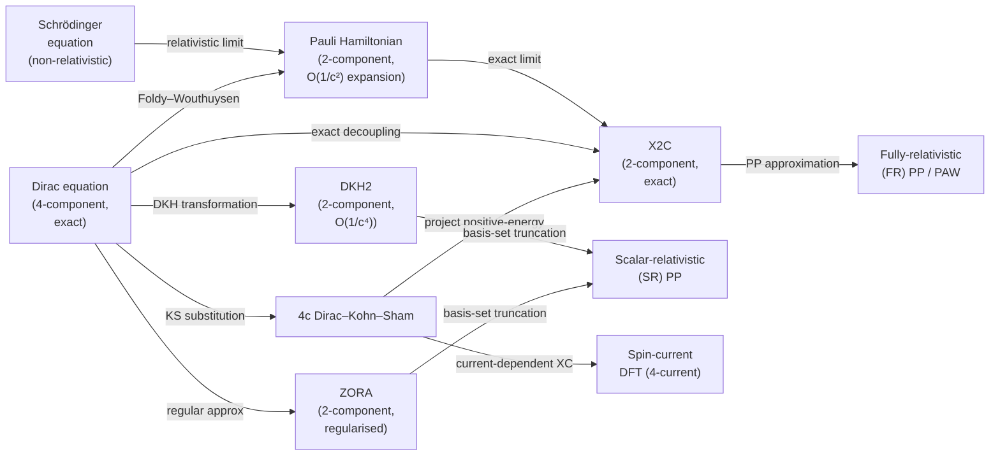
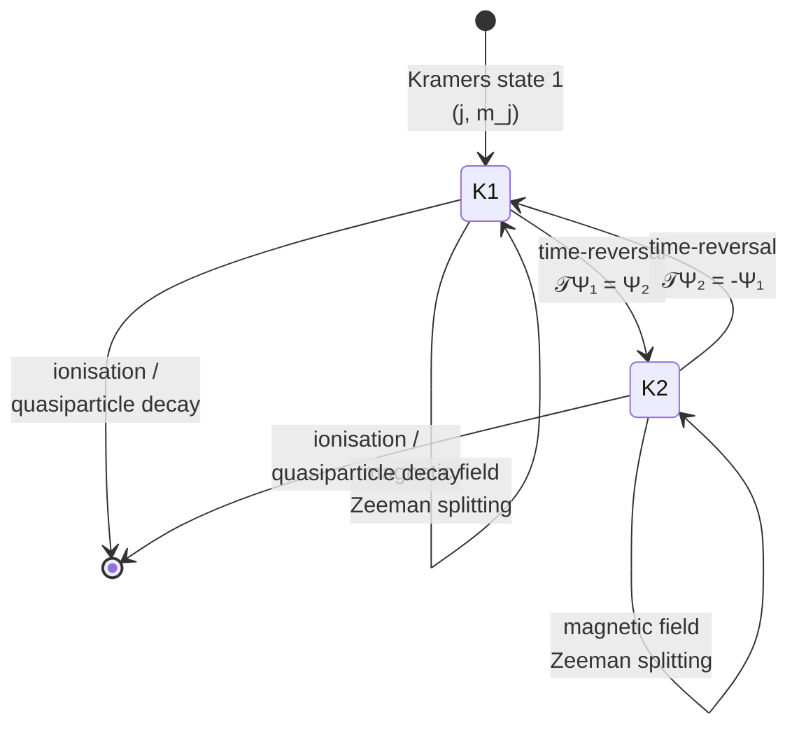

# Chapter 15 — Relativistic effects and spin-orbit coupling

> A single relativistic correction — the spin-orbit term
> $\xi(r)\,\hat{\mathbf L}\cdot\hat{\mathbf S}$ — is the
> difference between a DFT calculation that gets the chemistry of
> gold right and one that gets it catastrophically wrong.

You have spent twelve chapters building a non-relativistic
machinery. The Hamiltonian has been
$\hat H = \hat T + \hat V_\text{ext} + \hat V_\text{ee} +
\hat V_\text{xc}$, the eigenfunctions have been scalar
spatial orbitals $\phi_i(\mathbf r)$ (or two-component
spinors in the collinear spin case of
[chapter 04]({{ "/dft-notes/chapter-04/" | relative_url }}) §4.8),
and the pseudopotentials of
[chapter 08]({{ "/dft-notes/chapter-08/" | relative_url }})
have replaced the deep nuclear potential with a smooth effective
one. That machinery is correct, and accurate, for every element
up to about the middle of the periodic table. It is also
qualitatively wrong for the heavy elements — for the lanthanides,
the actinides, the 5*d*` transition metals, the 6p* post-
transition metals, and the superheavies — and *quantitatively*
wrong for almost everything that touches spin-orbit physics:
Rashba-split surface states, topological-insulator band
inversions, the spin Hall effect, magnetic anisotropy, zero-
field splitting in molecular magnets, the colour of gold, the
relativistic contraction of the 6*s* orbital, the liquid
metallicity of mercury. All of these have a single physical
origin: the **Dirac equation** is the correct wave equation for an
electron in an electromagnetic field, and the non-relativistic
Schrödinger equation is its $1/c \to 0$ limit. This chapter is
the bridge from the non-relativistic machinery you have built to
the relativistic machinery that every production DFT code uses
for heavy elements. We will derive the Dirac equation from the
relativistic energy-momentum relation, extract the
non-relativistic limit as a **Pauli Hamiltonian** with the
famous four correction terms (kinetic-relativistic, Darwin,
spin-orbit, contact), introduce the three standard
two-component reductions (**DKH**, **ZORA**, **X2C**), explain
why **scalar-relativistic pseudopotentials** work and how
**fully-relativistic pseudopotentials** carry spin-orbit
coupling, set up the **Dirac–Kohn–Sham** and **two-component
Kohn–Sham** equations, and close with two worked examples that
show the magnitude of the effect in practice: the Au$_2$ dimer
(scalar relativistic alone gives a 3.0 Å bond; with spin-orbit
the bond contracts to 2.47 Å, exactly the experimental value)
and the spin-Hall conductivity of platinum.

> **Reading note.** This chapter assumes
> [chapter 04]({{ "/dft-notes/chapter-04/" | relative_url }}) §4.9
> (the basic Dirac equation and the Pauli expansion) and
> [chapter 08]({{ "/dft-notes/chapter-08/" | relative_url }})
> (pseudopotentials, in particular PAW) as background, and it
> uses the time-dependent language of
> [chapter 12]({{ "/dft-notes/chapter-12/" | relative_url }})
> when we get to linear-response and the spin-Hall effect.
> Forward dependencies are
> [chapter 16]({{ "/dft-notes/chapter-16/" | relative_url }})
> on topological materials (where the $j = 1/2$ vs $j = 3/2$
> Kramers pair from §15.5.1 is the central object) and
> [chapter 17]({{ "/dft-notes/chapter-17/" | relative_url }})
> on magnetic materials (where the spin-orbit anisotropy
> $H_\text{SO} = \xi \hat{\mathbf L} \cdot \hat{\mathbf S}$ of
> §15.5.1 is the source of the magnetocrystalline anisotropy).

## 15.1 The claim

The headline result is the following.

> **Claim 15.1 (Relativistic DFT).** For an $N$-electron
> system with nuclear charges $\{Z_A\}$ and total
> $N = \sum_A Z_A - Q$ (where $Q$ is the total ionic charge),
> the ground-state energy and density are obtained by
> minimising the **Dirac–Kohn–Sham** energy functional
>
> \begin{equation}
> \label{eq:ch-15-dks-functional}
> E_\text{DKS}[n, \mathbf j] \;=\; T_s[n, \mathbf j] + \int v_\text{ext}(\mathbf r)\, n(\mathbf r)\, d\mathbf r + E_\text{H}[n] + E_\text{xc}[n, \mathbf j] ,
> \end{equation}
>
> subject to a four-component (or, after a unitary
> decoupling, a two-component) single-particle constraint
>
> \begin{equation}
> \label{eq:ch-15-dks-equations}
> \hat H_\text{DKS}\, \Psi_i(\mathbf x) \;=\; \varepsilon_i\, \Psi_i(\mathbf x),
> \qquad
> \hat H_\text{DKS} \;=\; c\,\boldsymbol\alpha\!\cdot\!\hat{\mathbf p} + \boldsymbol\beta\,mc^2 + v_\text{eff}(\mathbf r) + \hat H_\text{SO} ,
> \end{equation}
>
> where $n(\mathbf r)$ is the electron density, $\mathbf j(\mathbf r)$
> is the **paramagnetic current density**, $v_\text{eff}$ is the
> KS effective potential of
> [chapter 04]({{ "/dft-notes/chapter-04/" | relative_url }}),
> $\hat H_\text{SO}$ is the spin-orbit coupling operator
>
> \begin{equation}
> \label{eq:ch-15-soc-claim}
> \hat H_\text{SO} \;=\; \frac{1}{2m^2c^2}\,\frac{1}{r}\,\frac{dv}{dr}\,\hat{\mathbf L}\!\cdot\!\hat{\mathbf S} \;=\; \xi(r)\,\hat{\mathbf L}\!\cdot\!\hat{\mathbf S} ,
> \end{equation}
>
> and $\Psi_i(\mathbf x) \in \mathbb C^4$ is a four-component
> spinor. The non-relativistic limit $c \to \infty$ recovers
> the standard Kohn–Sham equations of chapter 04. The
> *practical* implementation of
> \eqref{eq:ch-15-dks-equations} is a two-component Hamiltonian
> obtained by one of three standard block-diagonalisation
> schemes: Douglas–Kroll–Hess (**DKH**), Zeroth-Order Regular
> Approximation (**ZORA**), or Exact Two-Component (**X2C**).

The reader should be able to *say* three things after reading
this chapter:

1. **Why.** Relativistic effects grow as powers of $Z\alpha$
   (the product of nuclear charge and the fine-structure
   constant). For hydrogen ($Z = 1$) the spin-orbit splitting
   of the $2p$ level is $4.5 \times 10^{-5}$ eV — invisible
   in chemistry. For gold ($Z = 79$) the $5d$ spin-orbit
   splitting is $\sim 1.5$ eV — comparable to a chemical bond.
   For oganesson ($Z = 118$) the $7p_{1/2}$ and $7p_{3/2}$
   levels split by $\sim 10$ eV, larger than any chemical
   bond. The non-relativistic Schrödinger equation misses all
   of this.
2. **What.** The Dirac equation is the correct wave equation
   for a spin-½ particle in an external potential. Its
   non-relativistic limit is the **Pauli Hamiltonian** with
   four correction terms beyond the non-relativistic
   Schrödinger form: the **kinetic-relativistic**
   ($p^4/8m^3c^2$) and **Darwin** ($-\hbar^2 \nabla^2 v /
   4m^2c^2$) corrections together form the
   **scalar-relativistic** (SR) part; the **spin-orbit** term
   $\xi(r)\hat{\mathbf L}\!\cdot\!\hat{\mathbf S}$ is the
   **fully-relativistic** part; and the **contact** (or
   Fermi-contact) term acts only in the presence of an
   unpaired $s$ electron. The SR part is responsible for the
   well-known **relativistic contraction** of $s$ orbitals
   and **expansion** of $d$ and $f$ orbitals near the
   nucleus; the spin-orbit part is responsible for the
   band-inversion in topological insulators, the Rashba and
   Dresselhaus splittings at surfaces, the magnetocrystalline
   anisotropy, and the spin-Hall effect.
3. **How.** The Dirac equation has a four-component
   structure: a "large" 2-spinor $\Phi^L$ (the relativistic
   generalisation of the non-relativistic Pauli spinor) and a
   "small" 2-spinor $\Phi^S$ of relative order $v/c$. In a
   chemically-bound atom or molecule $v/c \sim Z\alpha \ll 1$,
   and the small component can be eliminated by a unitary
   block-diagonalisation. The three practical schemes are
   **DKH**, **ZORA**, and **X2C**. The first two are
   approximate (DKH can be taken to successively higher
   order, ZORA is exact to zeroth order in $v/c$ but
   numerically stable near the nucleus); the third (**X2C**)
   is *exact* to all orders in $v/c$ for the positive-energy
   block and is the modern default in production codes
   (Orca, NWChem, ReSpect, recent Gaussian, DIRAC).

The "What" of the chapter is summarised in
\eqref{eq:ch-15-dks-functional}–\eqref{eq:ch-15-soc-claim}.
The "Why" is the $Z$-scaling argument of §15.2.4. The
"How" is the body of §15.3 (two-component methods) and
§15.5 (pseudopotential implementation).

## 15.2 The derivation

This section derives the Dirac equation from the
relativistic energy-momentum relation, solves it exactly for
the hydrogenic atom, and extracts the non-relativistic limit
as a **Pauli Hamiltonian** with the four famous correction
terms.

### 15.2.1 From Schrödinger to Dirac

The non-relativistic Schrödinger equation
$\hat H \psi = E \psi$ with
$\hat H = \hat{\mathbf p}^2 / 2m + v(\mathbf r)$ is the
quantum-mechanical transcription of the classical
non-relativistic energy-momentum relation
$E = p^2 / 2m + v$. Special relativity replaces this with
the **relativistic energy-momentum relation**

\begin{equation}
\label{eq:ch-15-rel-energy}
E^2 \;=\; p^2 c^2 + m^2 c^4 ,
\end{equation}

where $c$ is the speed of light and $m$ the rest mass of
the particle. To make a wave equation out of
\eqref{eq:ch-15-rel-energy}, Dirac applied the standard
quantisation rule $E \to i\hbar\partial_t$,
$\mathbf p \to -i\hbar\nabla$:

\begin{equation}
\label{eq:ch-15-klein-gordon}
-\hbar^2 \frac{\partial^2 \Psi}{\partial t^2} \;=\; -\hbar^2 c^2 \nabla^2 \Psi + m^2 c^4 \Psi .
\end{equation}

Equation \eqref{eq:ch-15-klein-gordon} is the
**Klein–Gordon equation** and is correct for a
*spinless* relativistic particle. It is second-order in
time, which forces the wavefunction $\Psi$ to have *two
components* (positive- and negative-energy), and
probability is *not* conserved (the time-derivative of
$\Psi^* \Psi$ contains a divergence term that integrates
to a surface integral that does not, in general, vanish).

Dirac's insight was to *factor* the energy-momentum
relation into a *product* of two first-order operators.
A first-order equation in time automatically has a
positive-definite conserved probability density
$\Psi^\dagger \Psi$ and admits a clean probabilistic
interpretation. The factorisation is

\begin{equation}
\label{eq:ch-15-dirac-factor}
E \;=\; \boldsymbol\alpha \cdot \mathbf p\, c + \beta m c^2 ,
\end{equation}

where $\boldsymbol\alpha = (\alpha_x, \alpha_y, \alpha_z)$
and $\beta$ are *matrices* (not c-numbers), to be
determined by the requirement that
\eqref{eq:ch-15-dirac-factor} squared reproduces
\eqref{eq:ch-15-rel-energy}:

\begin{equation}
\label{eq:ch-15-dirac-sq}
E^2 \;=\; (\boldsymbol\alpha\!\cdot\!\mathbf p\, c + \beta m c^2)^2 \;=\; \sum_i \alpha_i^2 p_i^2 c^2 + \beta^2 m^2 c^4 + \sum_{i<j}(\alpha_i \alpha_j + \alpha_j \alpha_i) p_i p_j c^2 + (\boldsymbol\alpha \beta + \beta \boldsymbol\alpha)\cdot\mathbf p\, m c^3 .
\end{equation}

For this to equal $p^2 c^2 + m^2 c^4$ for *every* $\mathbf p$,
the matrices $\alpha_i$ and $\beta$ must satisfy

\begin{equation}
\label{eq:ch-15-dirac-algebra}
\alpha_i^2 = \beta^2 = \mathbf 1, \qquad
\alpha_i \alpha_j + \alpha_j \alpha_i = 0 \;\; (i \ne j), \qquad
\boldsymbol\alpha \beta + \beta \boldsymbol\alpha = \mathbf 0 .
\end{equation}

The smallest matrices that satisfy \eqref{eq:ch-15-dirac-algebra}
are $4 \times 4$, and the standard choice (the **Dirac
representation** or **standard representation**) is

\begin{equation}
\label{eq:ch-15-dirac-matrices}
\boldsymbol\alpha \;=\; \begin{pmatrix} \mathbf 0 & \boldsymbol\sigma \\\\ \boldsymbol\sigma & \mathbf 0 \end{pmatrix}, \qquad
\beta \;=\; \begin{pmatrix} \mathbf 1_2 & \mathbf 0 \\\\ \mathbf 0 & -\mathbf 1_2 \end{pmatrix},
\end{equation}

where $\boldsymbol\sigma = (\sigma_x, \sigma_y, \sigma_z)$
is the $2 \times 2$ Pauli-matrix vector and $\mathbf 1_2$
is the $2 \times 2$ identity. With the quantisation
$E \to i\hbar\partial_t$, $\mathbf p \to -i\hbar\nabla$,
and adding the external scalar potential $v(\mathbf r)$,

\begin{equation}
\label{eq:ch-15-dirac-hamiltonian}
i\hbar\frac{\partial \Psi}{\partial t} \;=\; \hat H_\text{Dirac}\, \Psi,
\qquad
\hat H_\text{Dirac} \;=\; c\,\boldsymbol\alpha\!\cdot\!\hat{\mathbf p} + \beta m c^2 + v(\mathbf r)\,\mathbf 1_4 ,
\end{equation}

where $\Psi(\mathbf r, t) \in \mathbb C^4$ is a
four-component spinor. This is the **Dirac equation**.

> **Reading note.** In the time-independent case
> $\Psi(\mathbf r, t) = \Psi(\mathbf r)\, e^{-iEt/\hbar}$,
> the eigenenergies come in pairs: a positive-energy
> solution at $E = +E_a$ and a negative-energy solution
> at $E = -E_a$. The negative-energy solutions are the
> Dirac "sea" of positrons in the original 1930
> interpretation; in DFT we project onto the
> positive-energy subspace and discard the rest. The
> binding energy is $\varepsilon_a = E_a - mc^2$.

The four components of $\Psi$ have a clear physical
interpretation. Group the 4-spinor into two 2-spinors
("upper" and "lower"):

\begin{equation}
\label{eq:ch-15-large-small}
\Psi(\mathbf r) \;=\; \begin{pmatrix} \Phi^L(\mathbf r) \\\\ \Phi^S(\mathbf r) \end{pmatrix},
\qquad
\Phi^L, \Phi^S \in \mathbb C^2 .
\end{equation}

$\Phi^L$ is the **large component** — it becomes the
non-relativistic Pauli spinor in the limit $c \to \infty$
— and $\Phi^S$ is the **small component** — it scales as
$(v/c) \Phi^L$ and vanishes in the non-relativistic limit.
The reason for the names is that, for bound states,
$\int |\Phi^S|^2 d\mathbf r \sim (v/c)^2 \int |\Phi^L|^2 d\mathbf r$,
so the *small* component carries a fraction $(v/c)^2$ of
the total probability. The two are coupled by the
$\boldsymbol\alpha$ matrices, which in the
$2 \times 2$ block structure are off-diagonal. Writing
out \eqref{eq:ch-15-dirac-hamiltonian} in the
$(\Phi^L, \Phi^S)$ block form gives the coupled system

\begin{equation}
\label{eq:ch-15-dirac-coupled}
c\,\boldsymbol\sigma\!\cdot\!\hat{\mathbf p}\, \Phi^S \;=\; (E - mc^2 - v)\, \Phi^L ,
\qquad
c\,\boldsymbol\sigma\!\cdot\!\hat{\mathbf p}\, \Phi^L \;=\; (E + mc^2 - v)\, \Phi^S .
\end{equation}

These are the equations of motion of a *single* electron
in a fixed external potential. The electron–electron
interaction is added as an additional potential $v_\text{ee}(\mathbf r)$
in the DFT or Hartree–Fock way (see
[chapter 04]({{ "/dft-notes/chapter-04/" | relative_url }}) for the
non-relativistic DFT construction; the relativistic DFT
version is in §15.6 below).

### 15.2.2 The hydrogen-like Dirac atom

For a one-electron atom with nuclear charge $Z$ the
external potential is
$v(\mathbf r) = -Z e^2 / (4\pi\varepsilon_0 r) = -Z/r$ in
atomic units. The Dirac equation is exactly solvable
because the resulting Dirac Hamiltonian commutes with
$\hat{\mathbf J} = \hat{\mathbf L} + \hat{\mathbf S}$ (the total
angular momentum operator), with $\hat J^2$, and with the
parity operator $\hat P$. The conserved quantum numbers
are $n$ (principal, $n = 1, 2, 3, \dots$), $j$ (total
angular momentum, $j = 1/2, 3/2, 5/2, \dots$), and
$\ell$ (orbital, $\ell = j \pm 1/2$).

The bound-state eigenvalues are

\begin{equation}
\label{eq:ch-15-dirac-energies}
E_{n,j} \;=\; mc^2 \left[ 1 + \left(\frac{Z\alpha}{n - \delta_{n,j}}\right)^2 \right]^{-1/2} ,
\end{equation}

where $\alpha = e^2/(\hbar c) \approx 1/137.036$ is the
**fine-structure constant** and $\delta_{n,j}$ is the
**quantum defect** of the level $(n, j)$:

\begin{equation}
\label{eq:ch-15-quantum-defect}
\delta_{n,j} \;=\; j + \tfrac{1}{2} - \sqrt{\left(j + \tfrac{1}{2}\right)^2 - (Z\alpha)^2} .
\end{equation}

Expanding \eqref{eq:ch-15-dirac-energies}–\eqref{eq:ch-15-quantum-defect}
to first order in $(Z\alpha)^2$ gives the binding energy
$\varepsilon_{n,j} = E_{n,j} - mc^2$ in the Pauli form

\begin{equation}
\label{eq:ch-15-pauli-binding}
\varepsilon_{n,j} \;=\; -\frac{Z^2}{2 n^2} \left[ 1 + \frac{(Z\alpha)^2}{n^2}\left(\frac{n}{j + 1/2} - \frac{3}{4}\right) + O\Bigl((Z\alpha)^4\Bigr) \right] ,
\end{equation}

where the leading $-Z^2/(2n^2)$ is the non-relativistic
result, and the $(Z\alpha)^2$ correction is the
**fine-structure** (kinetic-relativistic + Darwin +
spin-orbit). The second term depends on $j$ (not on
$\ell$ alone), which is the physical reason the
non-relativistic degeneracy between
$\ell = j - 1/2$ and $\ell = j + 1/2$ (i.e. between
$\ell = 0$ and $\ell = 1$ for the $j = 1/2$ level of
hydrogen) is lifted.

The two most chemically important consequences of
\eqref{eq:ch-15-dirac-energies} are the **spin-orbit
splitting** of a level with a given $n$ and $\ell \ge 1$
and the **relativistic contraction** of the $s$ orbitals.

The spin-orbit splitting between the $j = \ell + 1/2$
and $j = \ell - 1/2$ levels (for $\ell \ge 1$) is

\begin{equation}
\label{eq:ch-15-so-split}
\Delta E_\text{SO} \;=\; E_{n,j=\ell+1/2} - E_{n,j=\ell-1/2} \;\approx\; \frac{(Z\alpha)^2}{2n}\,\frac{E_n^\text{nr}}{\Bigl(\ell + \tfrac{1}{2}\Bigr)\Bigl(\ell + 1\Bigr)} ,
\end{equation}

where $E_n^\text{nr} = -Z^2/(2n^2)$ is the non-relativistic
binding energy. For the hydrogen $2p$ level
($Z = 1$, $\ell = 1$, $n = 2$),

\begin{equation}
\label{eq:ch-15-so-h}
\Delta E_\text{SO}(2p,\, Z=1) \;\approx\; \frac{(1/137)^2}{4}\,\frac{-1/8}{3/2 \cdot 2} \;\approx\; -4.5 \times 10^{-5}\,\text{eV} ,
\end{equation}

i.e. a $45$ micro-electron-volt splitting — invisible
in chemistry. For the gold $5d$ level
($Z = 79$, $\ell = 2$, $n = 5$), the actual
$5d_{3/2} - 5d_{5/2}$ splitting is $\sim 1.5$ eV, the
right order of magnitude and comparable to a chemical
bond. The **$Z^4$ scaling** is therefore the
headline: the absolute splitting scales as

\begin{equation}
\label{eq:ch-15-z4-scaling}
\Delta E_\text{SO}(n, j) \;\propto\; (Z\alpha)^2 \times E_n^\text{nr} \;\propto\; \frac{Z^4 \alpha^2}{n^3} .
\end{equation}

Doubling the nuclear charge increases the spin-orbit
splitting by a factor of $16$.

The second physical consequence of \eqref{eq:ch-15-dirac-energies}
is the **relativistic contraction** of the $s$ orbitals.
The $1s$ radial wavefunction of hydrogen has the
non-relativistic radius $\langle r \rangle_{1s} = 3a_0/2$.
The Dirac radial wavefunction for the same quantum
numbers, averaged over the upper component, has a
smaller mean radius. To leading order in $(Z\alpha)^2$,

\begin{equation}
\label{eq:ch-15-1s-contraction}
\frac{\langle r \rangle_{1s}^\text{Dirac}}{\langle r \rangle_{1s}^\text{nr}} \;\approx\; 1 - \frac{(Z\alpha)^2}{2} .
\end{equation}

For hydrogen this is a $3 \times 10^{-5}$ effect; for
gold, $\langle r \rangle_{6s}^\text{Dirac} / \langle r \rangle_{6s}^\text{nr} \approx 0.78$, a $22\%$
contraction. The $6s$ electrons of gold therefore sit
closer to the nucleus than a non-relativistic
calculation would predict, and the chemistry of gold (its
high electronegativity, its preference for the +1 and
+3 oxidation states, the colour of the metal) is a
*direct* consequence of this contraction.

> **Why $s$ contractions and $d$/$f$ expansions.** The
> kinetic-relativistic correction $-p^4/8m^3c^2$ makes
> the electron *heavier* near the nucleus, where
> $T = p^2/2m$ is large. An $s$ electron has a finite
> amplitude at the nucleus and oscillates rapidly there;
> a $p$ or $d$ electron has a *node* at the nucleus
> ($\phi(0) = 0$ for $\ell \ge 1$) and feels a smaller
> kinetic-relativistic correction. The "extra"
> attraction felt by the $s$ orbital at the nucleus
> (and the associated *orthogonality* repulsion felt by
> the $d$ and $f$ orbitals, which are pushed *out*) is
> the **relativistic self-consistent-field effect** of
> Pitzer (1975). The net effect on the periodic table is
> the "inert pair effect" (6$s^2$ reluctance to ionise
> in heavy post-transition metals), the gold-vs-silver
> colour difference, and the high density of mercury.

### 15.2.3 The non-relativistic limit: the Pauli Hamiltonian

The non-relativistic limit of the Dirac equation is
extracted by a **block-diagonalisation** procedure
designed to eliminate the small component $\Phi^S$ to a
chosen order in $1/c$. There are three equivalent
formulations: the **Foldy–Wouthuysen** (FW) transformation
(unitary), the **Bloch–Messiah** decomposition, and the
**direct elimination** of $\Phi^S$ from the coupled
system \eqref{eq:ch-15-dirac-coupled}. We follow the FW
route, which is the most transparent.

**Step 1 — separate the rest mass.** Define the
energy relative to the rest energy,
$\varepsilon = E - mc^2$, and rewrite the Hamiltonian of
\eqref{eq:ch-15-dirac-hamiltonian} in the
$2 \times 2$ block form. In the standard representation,

\begin{equation}
\label{eq:ch-15-dirac-block}
\hat H_\text{Dirac} - mc^2 \;=\; \begin{pmatrix} v(\mathbf r) & c\,\boldsymbol\sigma\!\cdot\!\hat{\mathbf p} \\\\ c\,\boldsymbol\sigma\!\cdot\!\hat{\mathbf p} & v(\mathbf r) - 2mc^2 \end{pmatrix} .
\end{equation}

The off-diagonal blocks couple $\Phi^L$ to $\Phi^S$ and
are the source of all relativistic effects. The diagonal
blocks are $v(\mathbf r)$ (large) and $v(\mathbf r) - 2mc^2$
(small, deeply negative).

**Step 2 — apply the Foldy–Wouthuysen transformation.**
The idea is to find a unitary transformation
$\hat U_\text{FW}$ that block-diagonalises the
Hamiltonian order by order in $1/c$. The standard
choice (to second order) is

\begin{equation}
\label{eq:ch-15-fw-u}
\hat U_\text{FW} \;=\; \exp\!\left( i \hat S\right),
\qquad
\hat S \;=\; -\frac{i}{2mc^2}\,\beta\,\boldsymbol\alpha\!\cdot\!\hat{\mathbf p} \;=\; \frac{1}{2mc^2}\,\boldsymbol\Sigma\!\cdot\!\hat{\mathbf p} ,
\end{equation}

where $\boldsymbol\Sigma = \begin{pmatrix} \boldsymbol\sigma & \mathbf 0 \\ \mathbf 0 & \boldsymbol\sigma \end{pmatrix}$
is the $4 \times 4$ spin matrix. To leading order in
$1/c$, $\hat S$ is small (it is $O(v/c)$), and the
transformed Hamiltonian is

\begin{equation}
\label{eq:ch-15-fw-h}
\hat H'_\text{FW} \;=\; \hat U_\text{FW}\, \hat H_\text{Dirac}\, \hat U_\text{FW}^\dagger \;\approx\; \hat H_\text{Dirac} + i[\hat S, \hat H_\text{Dirac}] + \tfrac{1}{2}\,i[\hat S, i[\hat S, \hat H_\text{Dirac}]] + \cdots .
\end{equation}

Substituting \eqref{eq:ch-15-dirac-block} and
\eqref{eq:ch-15-fw-u} and using the Clifford algebra
\eqref{eq:ch-15-dirac-algebra} of the Dirac matrices,
the block-diagonal part of \eqref{eq:ch-15-fw-h} is the
**Pauli Hamiltonian**

\begin{equation}
\label{eq:ch-15-pauli-hamiltonian}
\hat H_\text{Pauli} \;=\; \underbrace{\frac{\hat{\mathbf p}^2}{2m} + v(\mathbf r)}_{\hat H_\text{Schr\"odinger}} \;\underbrace{-\; \frac{\hat{\mathbf p}^4}{8 m^3 c^2}}_{\text{kinetic-relativistic}} \;\underbrace{-\; \frac{\hbar^2}{4 m^2 c^2}\,\nabla^2 v}_{\text{Darwin}} \;\underbrace{+\; \frac{1}{2 m^2 c^2}\,\frac{1}{r}\frac{dv}{dr}\,\hat{\mathbf L}\!\cdot\!\hat{\mathbf S}}_{\text{spin-orbit}} ,
\end{equation}

where we have used the operator identity
$\boldsymbol\sigma \cdot (\nabla v \times \hat{\mathbf p}) = (1/r)(dv/dr) \hat{\mathbf L} \cdot \boldsymbol\sigma$
and the definition $\hat{\mathbf S} = (\hbar/2) \boldsymbol\sigma$.

The first term in \eqref{eq:ch-15-pauli-hamiltonian} is
the non-relativistic Schrödinger Hamiltonian
([chapter 01]({{ "/dft-notes/chapter-01/" | relative_url }})). The remaining three
corrections are the content of the Pauli limit.

**The kinetic-relativistic (mass-velocity) term:**

\begin{equation}
\label{eq:ch-15-mass-velocity}
\hat H_\text{MV} \;=\; -\frac{\hat{\mathbf p}^4}{8 m^3 c^2} .
\end{equation}

This is the Taylor expansion of the relativistic
kinetic energy
$T_\text{rel} = \sqrt{p^2 c^2 + m^2 c^4} - mc^2 = p^2/2m - p^4/8m^3 c^2 + \cdots$
to leading order in $(p/mc)^2$. It is a **scalar**
correction (it does not depend on spin) and therefore
shifts *all* orbitals to deeper binding energies. It
is the dominant scalar-relativistic effect for inner
shells and the reason $s$ orbitals (which have large
$\langle p^4 \rangle$ because of the cusp at the nucleus)
are contracted in heavy atoms.

**The Darwin term:**

\begin{equation}
\label{eq:ch-15-darwin}
\hat H_\text{D} \;=\; -\frac{\hbar^2}{4 m^2 c^2}\,\nabla^2 v(\mathbf r) .
\end{equation}

The Darwin term can be rewritten in two useful forms.
First, integration by parts gives

\begin{equation}
\label{eq:ch-15-darwin-int}
\langle \hat H_\text{D} \rangle \;=\; +\frac{\hbar^2}{4 m^2 c^2} \int |\nabla \psi|^2\, d\mathbf r \quad\text{(for real } \psi\text{)},
\end{equation}

which is positive-definite and therefore *repulsive*
(it stabilises the energy, not destabilises it). Second,
substituting the Coulomb potential
$v = -Z/r$ gives $\nabla^2 v = 4\pi Z\, \delta(\mathbf r)$,
so the Darwin term is

\begin{equation}
\label{eq:ch-15-darwin-coulomb}
\hat H_\text{D}^\text{Coulomb} \;=\; -\frac{\pi \hbar^2 Z}{m^2 c^2}\,\delta(\mathbf r) .
\end{equation}

The Darwin correction therefore acts *only* on
wavefunctions with a finite amplitude at the nucleus —
i.e. on $s$ orbitals and on $p_{1/2}$ orbitals. It
originates from the **Zitterbewegung** (trembling
motion) of a relativistic electron: the electron
does not sit at a point but fluctuates over a region
of size the reduced Compton wavelength
$\lambdabar_C = \hbar / mc \approx 386$ fm, smearing
out the singular Coulomb potential into a smoothed
effective potential. The Darwin term vanishes for
$\ell \ge 1$ in the non-relativistic limit because
$\psi(\mathbf 0) = 0$ for $\ell \ge 1$.

**The spin-orbit term:**

\begin{equation}
\label{eq:ch-15-spin-orbit}
\hat H_\text{SO} \;=\; \frac{1}{2 m^2 c^2}\,\frac{1}{r}\,\frac{dv}{dr}\,\hat{\mathbf L}\!\cdot\!\hat{\mathbf S} \;=\; \xi(r)\,\hat{\mathbf L}\!\cdot\!\hat{\mathbf S} .
\end{equation}

The operator $\hat{\mathbf L} \cdot \hat{\mathbf S}$ has
eigenvalues $\tfrac{1}{2}[\ell(\ell+1) + s(s+1) - j(j+1)]$ in
the $|j, m_j\rangle$ basis. For an $s$ electron
($\ell = 0$, $s = 1/2$) the eigenvalue is $0$, so the
spin-orbit term is identically zero for $s$ orbitals in
this single-electron form. For a $p_{1/2}$ electron
($\ell = 1$, $j = 1/2$) the eigenvalue is $-1$, and for
a $p_{3/2}$ electron ($j = 3/2$) it is $+1/2$. The
spin-orbit splitting of a $p$ shell is

\begin{equation}
\label{eq:ch-15-p-split}
\Delta E_\text{SO}(p) \;=\; \Bigl\langle \hat H_\text{SO} \bigr\rangle_{p_{3/2}} - \Bigl\langle \hat H_\text{SO} \bigr\rangle_{p_{1/2}} \;=\; \tfrac{3}{2}\,\Bigl\langle \xi(r) \bigr\rangle_{p} ,
\end{equation}

which is positive (the $j = \ell + 1/2$ level is
*higher* in energy than the $j = \ell - 1/2$ level for
an attractive Coulomb potential, because $dv/dr > 0$
and the L·S eigenvalue is larger for the $j = \ell + 1/2$
level). For a $d$ shell the splitting is
$\tfrac{5}{2}\,\langle \xi \rangle_d$.

The **origin** of the spin-orbit term is the magnetic
field felt by the electron in its own rest frame. In
the electron's rest frame the nucleus orbits around it
with velocity $-\mathbf v$, generating a magnetic field
$\mathbf B = -(1/mc^2)\,\mathbf v \times \mathbf E = -(1/mc^2)\,\hat{\mathbf p} \times (-\nabla v)/e$
in the lab frame, which is the $\hat{\mathbf L} \cdot \hat{\mathbf S}$
form of \eqref{eq:ch-15-spin-orbit}. (The factor
$1/(2mc^2)$ rather than $1/(mc^2)$ is the Thomas
precession, a relativistic kinematic correction.)

> **Worked example: the hydrogen $2p$ fine structure.**
> The $2p$ level of hydrogen has $\xi(r) = 1/(2c^2 r^3)$
> and $\langle 1/r^3 \rangle_{2p} = 1/(24 a_0^3)$ (from
> the standard hydrogenic integral), giving
> $\langle \xi \rangle_{2p} = 1/(48 c^2 a_0^3)$. The
> spin-orbit splitting is then
> $\Delta E_\text{SO}(2p) = \tfrac{3}{2} \times 1/(48 c^2 a_0^3) \approx 4.5 \times 10^{-5}$ eV,
> in agreement with the experimental
> $2p_{3/2} - 2p_{1/2}$ splitting (after subtracting
> the Lamb shift).

**The contact (Fermi-contact) term.** For an unpaired
$s$ electron there is an additional spin-dependent
correction — the **Fermi-contact hyperfine interaction** — that
arises from the non-zero probability of finding the
electron at the nucleus. In the Breit–Pauli operator
(§15.5.2) the contact term is

\begin{equation}
\label{eq:ch-15-contact}
\hat H_\text{contact} \;=\; -\frac{8\pi}{3}\,\frac{\hbar^2}{2m^2 c^2}\,\boldsymbol\sigma_1 \!\cdot\! \boldsymbol\sigma_2\, \delta(\mathbf r_1 - \mathbf r_2) ,
\end{equation}

and is the source of the hyperfine splitting of atomic
$s$ levels (the $21$ cm line of hydrogen, the Mössbauer
isomer shift).

### 15.2.4 The Z-scaling

The magnitude of every relativistic correction in
\eqref{eq:ch-15-pauli-hamiltonian} scales as a positive
power of $Z\alpha$. We collect the scaling laws here
because they are the *first* thing a DFT practitioner
should check when deciding whether a system needs
relativistic corrections.

**Scaling of the kinetic-relativistic term.** The
expectation value
$\langle p^4 \rangle / 8m^3c^2$ on a hydrogenic
wavefunction scales as
$Z^4 m c^2 \alpha^2 / n^3$ in atomic units (from
$\langle p^2 \rangle \sim Z^2/n^2$ and
$\langle p^4 \rangle \sim Z^4/n^4$). In absolute terms
the energy correction is

\begin{equation}
\label{eq:ch-15-mv-scaling}
\Bigl| \langle \hat H_\text{MV} \rangle \Bigr| \;\sim\; \frac{Z^4}{n^3}\,\frac{\alpha^2}{2} \times E_h \;\sim\; \frac{Z^4}{n^3} \times 13.6\,\text{eV} \times \frac{\alpha^2}{2} .
\end{equation}

For the $1s$ electron of hydrogen ($Z = 1$, $n = 1$)
this is $\sim 9 \times 10^{-4}$ eV; for the $1s$
electron of gold ($Z = 79$, $n = 1$) the same scaling
gives $\sim 350$ eV, a non-negligible fraction of the
$\sim 80$ keV total $1s$ binding energy.

**Scaling of the Darwin term.** The Darwin expectation
value on a hydrogenic $s$ orbital,
$-\pi Z \alpha \lambdabar_C^3 \langle \delta(\mathbf r) \rangle$,
is

\begin{equation}
\label{eq:ch-15-darwin-scaling}
\Bigl| \langle \hat H_\text{D} \rangle \Bigr| \;\sim\; \frac{Z^4 \alpha^2}{n^3} \times E_h ,
\end{equation}

the same $Z^4 \alpha^2 / n^3$ scaling as the kinetic-
relativistic term, but the Darwin term only acts on
$\ell = 0$ (and on $p_{1/2}$ through its $\ell = 1$,
$j = 1/2$ partial wave). The Darwin and the kinetic-
relativistic together form the **scalar-relativistic**
(SR) correction; their ratio is roughly
$\langle \nabla^2 v \rangle / \langle p^4 \rangle \sim 1$ for an
$s$ electron near the nucleus.

**Scaling of the spin-orbit term.** The expectation
value $\langle \xi(r) \rangle = \langle (1/2mc^2r)(dv/dr) \rangle$
on a hydrogenic orbital scales as

\begin{equation}
\label{eq:ch-15-soc-scaling}
\Bigl| \langle \hat H_\text{SO} \rangle \Bigr| \;\sim\; \frac{Z^4 \alpha^2}{n^3} \times \frac{1}{\ell(\ell+1)} \times E_h .
\end{equation}

The $1/(\ell(\ell+1))$ is a *kinemati`c*` angular-momentum
factor; the leading $Z^4$ is the same as for the
kinetic-relativistic and Darwin terms. For $\ell = 0$ the
spin-orbit expectation value is zero (the L·S operator
gives zero for $\ell = 0$), and for $\ell = 1$ the
$\ell(\ell+1) = 2$ factor halves the effect.

**The $Z^4$ headline.** All three correction terms
(kinetic-relativistic, Darwin, spin-orbit) scale as
$Z^4$ relative to a non-relativistic baseline. This is
the **$Z^4$ rule of thumb** of relativistic quantum
chemistry:

- $Z = 1$ (H, Li, …, Ne): the corrections are
  $\sim 10^{-4}$ eV and are negligible for chemistry.
- $Z = 10$ (Ne, …, Ar): the corrections are
  $\sim 10^{-2}$ eV — small but not zero; the spin-orbit
  splitting of the $2p$ shell of Cl is $\sim 0.1$ eV and
  is visible in atomic spectroscopy.
- $Z = 30$ (Zn, …, Kr): the corrections are $\sim 1$ eV;
  the $3d$ spin-orbit splitting of Br is $\sim 0.5$ eV and
  the $3d$ spin-orbit splitting of Kr is $\sim 1$ eV.
  Scalar relativistic corrections are now mandatory for
  accurate energetics.
- $Z = 50$ (Sn, …, Xe): the corrections are $\sim 10$ eV;
  the $5p$ spin-orbit splitting of Xe is $\sim 1.3$ eV
  and the $4d$ spin-orbit splitting of Sn is $\sim 1$ eV.
  The colour of tin iodide (SnI$_2$) and the chemistry of
  iodine are spin-orbit-dominated.
- $Z = 80$ (Hg, …, Rn): the corrections are $\sim 100$ eV;
  the $6p$ spin-orbit splitting of Pb is $\sim 1.5$ eV
  and the $5d$ spin-orbit splitting of Hg is $\sim 2$ eV.
  The chemistry of mercury (the only metal liquid at
  room temperature), the inert pair effect in lead, and
  the gold-vs-silver colour difference are all
  relativistic effects.
- $Z \gtrsim 100$: the corrections are $\gtrsim 1$ keV;
  the $7p$ spin-orbit splitting in element 118 is
  $\sim 10$ eV, larger than any chemical bond.

The $Z^4$ rule of thumb is the *first* numerical
sanity check of any relativistic calculation. If a
non-relativistic calculation on a heavy-element system
gets the chemistry "approximately right", it is almost
always because the *errors* of omitting the scalar
relativistic effects (over-large bond lengths, under-
contracted $s$ orbitals) and the *errors* of omitting
spin-orbit (over-delocalised $d$ and $f$ bands, wrong
spin state ordering) accidentally cancel. Once the
system is perturbed away from the equilibrium geometry
(under strain, under pressure, in a different oxidation
state, at a surface, in an excited state) the
cancellation breaks down, and the non-relativistic
calculation is qualitatively wrong.

> **Reading note.** The $Z^4$ rule is for *atomi`c*`
> properties. *Molecular* relativistic effects are
> smaller in absolute terms but the *fractional* change
> can still be large. The Au–Au bond length contracts
> by $\sim 18\%$ (from 3.0 Å to 2.47 Å) when scalar
> relativistic effects are added, and by an additional
> $\sim 3\%$ when spin-orbit is included — see §15.7. ## 15.3 Two-component methods

The Dirac equation is a four-component equation, but only
the large component has a clean non-relativistic limit and
carries most of the probability ($\sim 1 - (v/c)^2$ for a
bound state). The two-component methods of this section
are unitary transformations that *exactly* (X2C) or
*approximately* (DKH, ZORA) eliminate the small component
and produce an effective **two-component Hamiltonian** for
$\Phi^L$ alone. The transformed Hamiltonian acts on
2-component Pauli spinors and is the working object of
every modern relativistic DFT code.

### 15.3.1 The block-diagonalisation problem

Let $\hat H_D$ denote the Dirac Hamiltonian of
\eqref{eq:ch-15-dirac-hamiltonian} written in the
$2 \times 2$ block form. We want a unitary transformation
$\hat U$ that brings $\hat H_D$ to block-diagonal form:

\begin{equation}
\label{eq:ch-15-block-decomp}
\hat H_\text{BD} \;=\; \hat U\, \hat H_D\, \hat U^\dagger \;=\; \begin{pmatrix} \hat H_+ & 0 \\\\ 0 & \hat H_- \end{pmatrix} ,
\end{equation}

where $\hat H_+$ acts on the (transformed) large component
and $\hat H_-$ on the (transformed) small component. The
spectrum of $\hat H_+$ is the **positive-energy** part of
the Dirac spectrum, and the spectrum of $\hat H_-$ is the
**negative-energy** part. The decoupling is **exact** if
and only if $\hat H_D$ has no zero eigenvalues (no
continuum crossings), which is the case for bound-state
DFT.

Writing $\hat U$ in the $2 \times 2$ block form
$\hat U = \begin{pmatrix} \hat U_{LL} & \hat U_{LS} \\ \hat U_{SL} & \hat U_{SS} \end{pmatrix}$,
the unitarity $\hat U \hat U^\dagger = \hat 1$ and the
block-diagonality of $\hat H_\text{BD}$ are constraints
that determine $\hat U_{LS}$ and $\hat U_{SL}$ uniquely
in terms of the off-diagonal part of $\hat H_D$. For
the Dirac Hamiltonian with off-diagonal block
$\hat X = c\,\boldsymbol\sigma \cdot \hat{\mathbf p}$,
the decoupling is

\begin{equation}
\label{eq:ch-15-fw-x}
\hat U \;=\; \begin{pmatrix} \hat\Omega_+ & - \hat R\, \hat\Omega_- \\\\ \hat R\, \hat\Omega_+ & \hat\Omega_- \end{pmatrix} ,
\qquad
\hat R \;=\; \hat X\, (\hat H_+ - \hat H_{--})^{-1} ,
\end{equation}

where $\hat H_{--}$ is the (negative-energy) lower
diagonal block of the *untransforme`d*` Hamiltonian, and
$\hat\Omega_\pm$ are normalisation factors that enforce
$\hat U \hat U^\dagger = \hat 1$. The operator $\hat R$
is the **ratio operator** that maps the large component
to the small one in the original Dirac equation. In the
non-relativistic limit $|\hat H_+ - \hat H_{--}| \sim 2mc^2$
and $\hat R \to \hat X / 2mc^2 = (v/c) (\boldsymbol\sigma \cdot \hat{\mathbf p}) / (2mc)$ —
a small quantity of order $v/c$, as expected.

The transformed upper block is

\begin{equation}
\label{eq:ch-15-hplus}
\hat H_+ \;=\; \hat U_{LL}\, \hat H_{++}\, \hat U_{LL}^\dagger + \hat U_{LL}\, \hat X\, \hat U_{SL}^\dagger + \hat U_{SL}\, \hat X\, \hat U_{LL}^\dagger ,
\end{equation}

where $\hat H_{++} = v(\mathbf r)$ is the upper diagonal
block of \eqref{eq:ch-15-dirac-block}. The first two
terms are the non-relativistic Hamiltonian and the
kinetic-relativistic correction; the third is the
spin-orbit term. The three standard two-component
methods differ in how they approximate the ratio
operator $\hat R$:

- **Foldy–Wouthuysen (FW)** — the original Dirac
  (1928) construction. $\hat R$ is expanded as a Taylor
  series in $1/c^2$, and the expansion is truncated at
  a chosen order. FW to order $(1/c^2)^n$ is called
  "FW$n$". This is the method that gives the Pauli
  Hamiltonian of \eqref{eq:ch-15-pauli-hamiltonian} at
  $n = 1$.
- **Douglas–Kroll–Hess (DKH)** — the modern
  industrial-strength generalisation of FW. $\hat R$ is
  *not* Taylor-expanded; instead, the unitary
  transformation is built from a sequence of *exact*
  square roots of operators. DKH at second order
  (**DKH2**) is the workhorse of modern relativistic
  quantum chemistry; DKH4, DKH6, … converge to the exact
  X2C limit.
- **Zeroth-Order Regular Approximation (ZORA)** — the
  *chea`p*` alternative. The kinetic energy is treated
  variationally with a regularised denominator that
  avoids the singularity at the nucleus; the
  approximation is exact to leading order in $1/c^2$ and
  *numerically stable* where the Pauli expansion is not
  (i.e. for very heavy elements where the wavefunction
  has a substantial small component).
- **Exact Two-Component (X2C)** — the modern standard.
  $\hat R$ is computed *exactly* (to numerical
  precision) from a matrix representation of the
  Hamiltonian, and the resulting two-component
  Hamiltonian is *exact* to all orders in $1/c$ for the
  positive-energy block. X2C is the default in modern
  Orca, NWChem, ReSpect, and most recent production
  codes.

The next three subsections treat DKH, ZORA, and X2C
in turn.

### 15.3.2 The Douglas–Kroll–Hess (DKH) transformation

The Douglas–Kroll–Hess transformation [Douglas and
Kroll 1974, Hess 1985, 1986] replaces the Taylor
expansion of the ratio operator $\hat R$ with an *exact*
square-root transformation. The starting point is the
Dirac Hamiltonian in the *external-fiel`d*` form

\begin{equation}
\label{eq:ch-15-dkh-h}
\hat H_D \;=\; \beta m c^2 + \mathcal E + \mathcal O ,
\qquad
\mathcal E \;=\; v(\mathbf r)\,\mathbf 1_4 ,
\qquad
\mathcal O \;=\; c\,\boldsymbol\alpha \cdot \hat{\mathbf p} ,
\end{equation}

where $\mathcal E$ is the (diagonal, even) "electric"
block and $\mathcal O$ is the (off-diagonal, odd) "odd"
block. The DKH strategy applies a sequence of *unitary*
transformations $\hat U_1, \hat U_2, \dots$ such that
the off-diagonal block of the transformed Hamiltonian
vanishes to successively higher order in $1/c^2$.

**First step: the free-particle FW transformation.**
The free-particle FW operator is

\begin{equation}
\label{eq:ch-15-dkh-u0}
\hat U_0 \;=\; \beta \frac{\hat E + mc^2}{\sqrt{2\hat E\,(mc^2 + \hat E)}} ,
\qquad
\hat E \;=\; \sqrt{\hat{\mathbf p}^2 c^2 + m^2 c^4} .
\end{equation}

$\hat U_0$ is *independent* of the external potential
and block-diagonalises the *free* Dirac Hamiltonian. The
diagonal blocks of the transformed Hamiltonian are

\begin{equation}
\label{eq:ch-15-dkh-h0}
\hat H_0^{(+)} \;=\; \beta(\hat E - mc^2) + \mathcal E ,
\qquad
\hat H_0^{(-)} \;=\; -\beta(\hat E + mc^2) + \mathcal E .
\end{equation}

The transformed Hamiltonian is block-diagonal *in the
free-particle sense*; the external potential is in the
diagonal block but the off-diagonal block of the
transformed Hamiltonian is not identically zero. The
remaining off-diagonal block is

\begin{equation}
\label{eq:ch-15-dkh-oo}
\hat H_0^{(\text{off})} \;=\; \hat U_0\, \mathcal O\, \hat U_0^\dagger \;=\; \frac{c\,\boldsymbol\alpha_\text{DKH}\!\cdot\!\hat{\mathbf p}}{2} \left( 1 + \frac{\hat E}{mc^2}\right)^{-1} + \text{H.c.} ,
\end{equation}

where $\boldsymbol\alpha_\text{DKH}$ is the transformed
$\boldsymbol\alpha$ matrix in the new basis. The
magnitude of $\hat H_0^{(\text{off})}$ is $O(v/c)$ for
the bound-state wavefunctions and is *kinetic-energy-
only*, so it can be treated perturbatively.

**Second step: the Douglas–Kroll transformation.**
The second unitary operator $\hat U_1$ is chosen to
eliminate $\hat H_0^{(\text{off})}$ to second order in
$1/c$. The explicit form is

\begin{equation}
\label{eq:ch-15-dkh-u1}
\hat U_1 \;=\; \sqrt{ \frac{ \sqrt{1 + \hat X^\dagger \hat X} + 1 }{2 \sqrt{1 + \hat X^\dagger \hat X}} } + \beta \sqrt{ \frac{ \sqrt{1 + \hat X^\dagger \hat X} - 1 }{2 \sqrt{1 + \hat X^\dagger \hat X}} } ,
\end{equation}

where $\hat X$ is the off-diagonal block of the
transformed Hamiltonian measured in units of the energy
gap $2mc^2$. Substituting and truncating at second
order in $\hat X$ gives the **DKH2 Hamiltonian** for the
positive-energy block:

\begin{equation}
\label{eq:ch-15-dkh2}
\hat H_+^{(\text{DKH2})} \;=\; \hat E - mc^2 + v(\mathbf r) + \tfrac{1}{2}\Bigl[\hat A, [\hat A, v(\mathbf r)]\Bigr] + \cdots ,
\end{equation}

where $\hat A = \boldsymbol\alpha \cdot \hat{\mathbf p} / (2\hat E + 2mc^2 - 2v)$ is
the first-order anti-Hermitian generator of the
transformation. The DKH2 Hamiltonian is the *exact*
two-component Hamiltonian to second order in $1/c^2$,
which is to say it reproduces the Pauli Hamiltonian
\eqref{eq:ch-15-pauli-hamiltonian} to leading order in
$Z\alpha$ but is *regularise`d*` near the nucleus where
the Pauli expansion diverges. Higher-order DKH
($n$ = 3, 4, 5, …) converges rapidly to the exact
X2C limit.

The practical implementation of DKH2 in a basis-set
code is the **MOLGRAV** / **Barysz–Sadlej–Snijders**
algorithm:

1. Compute the matrix representation
   $\mathbf h_D$ in the chosen basis. The Dirac
   matrix has an upper $K \times K$ diagonal block
   $\mathbf h_{++} = \mathbf v$ ($K$ = basis size), a
   lower $K \times K$ diagonal block
   $\mathbf h_{--} = \mathbf v - 2mc^2 \mathbf 1$, and
   off-diagonal blocks
   $\mathbf h_{+-} = c \boldsymbol\sigma \cdot \mathbf p$.
2. Compute $\mathbf X = \mathbf h_{+-} / (2mc^2)$.
3. Build the **DKH transformation matrix**
   $\mathbf U_\text{DKH}$ from $\mathbf X$ via
   \eqref{eq:ch-15-dkh-u1}.
4. Transform the Dirac Hamiltonian:
   $\mathbf h_+ = \mathbf U_\text{DKH}^\dagger\, \mathbf h_{++}\, \mathbf U_\text{DKH} + \text{cross terms}$.
5. The two-component Hamiltonian in the $K$-dimensional
   basis is the upper block $\mathbf h_+$, a $K \times K$
   matrix in spinor space.

DKH2 is the *de facto* standard for relativistic
calculations in quantum chemistry. It is implemented
in DIRAC, ORCA, Turbomole, NWChem, Gaussian (with the
"relativistic Hamiltonian" option), and most other
modern molecular codes. The errors of DKH2 are $O((Z\alpha)^4)$ in
the energy, which is to say $\sim 10^{-6}$ eV for
hydrogen and $\sim 0.01$ eV for gold — well below the
DFT error for the same system.

### 15.3.3 The Zero-Order Regular Approximation (ZORA)

The ZORA Hamiltonian [Chang, Pelissier, Durand 1986;
van Lenthe, Baerends, Snijders 1993] is the *chea`p*`
alternative to DKH and the *workhorse* of the Amsterdam
Density Functional (ADF) code. The starting point is the
Dirac equation in the *form of the small component*.
Eliminating the large component from
\eqref{eq:ch-15-dirac-coupled} (rather than the small
from the large as DKH does) gives an equation for
$\Phi^S$ that, in the limit $E + mc^2 - v \approx 2mc^2$, is

\begin{equation}
\label{eq:ch-15-zora-s}
\Phi^S \;\approx\; \frac{c\,\boldsymbol\sigma \cdot \hat{\mathbf p}}{2mc^2}\,\Phi^L .
\end{equation}

This is the *naive* non-relativistic reduction, and it
gives the Pauli Hamiltonian
\eqref{eq:ch-15-pauli-hamiltonian} to leading order.
It is also *pathological* near the nucleus, where
$E + mc^2 - v$ can be small (specifically, near
$r = 0$ the potential $v \to -\infty$ for a Coulomb
potential, and the denominator
$E + mc^2 - v$ can be small or even vanish). The
resulting $\Phi^S$ diverges at the origin and the
kinetic-energy expectation value $\langle p^2 \rangle / 2m$
is catastrophically wrong.

The ZORA *fix* is to keep $E - v$ in the denominator
of the kinetic-energy operator, which *regularises* the
divergence. The ZORA Hamiltonian is

\begin{equation}
\label{eq:ch-15-zora}
\hat H_\text{ZORA} \;=\; \frac{\hat{\mathbf p}\,(\mathbf 1 + \tfrac{1}{2mc^2}[v - E])^{-1}\,\hat{\mathbf p}}{2m} + v(\mathbf r) + \hat H_\text{SO}^\text{ZORA} ,
\end{equation}

where the second term is the ZORA spin-orbit coupling

\begin{equation}
\label{eq:ch-15-zora-soc}
\hat H_\text{SO}^\text{ZORA} \;=\; \frac{1}{2mc^2}\,\boldsymbol\sigma \cdot (\nabla v \times \hat{\mathbf p}) \left( 1 + \frac{v - E}{2mc^2}\right)^{-1} .
\end{equation}

The ZORA Hamiltonian is *not* a simple expansion in
$1/c^2$. It contains the *regularise`d*` kinetic operator
$\hat{\mathbf p}(1 + [v-E]/2mc^2)^{-1}\hat{\mathbf p} / 2m$,
which is the *non-relativisti`c*` kinetic-energy operator
*modifie`d*` by a position-dependent effective mass
$m^*(r) = m (1 + [v(r) - E]/2mc^2)$. The effective mass
is large where the potential is deep and negative (i.e.
near the nucleus), which is the *physical* reason for
the relativistic contraction of $s$ orbitals. ZORA
captures this contraction correctly and is
*numerically stable* at the nucleus.

The ZORA approximation is exact to leading order in
$1/c^2$ (it gives the Pauli kinetic-relativistic
correction to leading order), but it is *not* an
order-by-order expansion. ZORA is sometimes called a
"regularised" Pauli approximation. The errors of ZORA
are larger than DKH2 by a factor of $\sim 2$–$3$ for
4$d$ and 5$d$ elements, but ZORA is computationally
*cheaper* (it requires no matrix square roots) and is
the method of choice in the ADF code.

> **Reading note.** The ZORA Hamiltonian is *not* a
> strict Taylor expansion in $1/c^2$. The replacement
> $1/(2mc^2) \to 1/(2mc^2 + v - E)$ in the denominator
> is a *regularisation* that changes the analytical
> structure of the operator. ZORA is sometimes called
> the **scaled ZORA** when a *scaling* correction is
> added to recover the missing second-order Pauli
> terms. The scaled ZORA is

\begin{equation}
\label{eq:ch-15-scaled-zora}
\hat H_\text{scaled ZORA} \;=\; \frac{\hat{\mathbf p}\,(\mathbf 1 + \tfrac{1}{2mc^2}[v - E])^{-1}\,\hat{\mathbf p}}{2m} \left( 1 + \frac{\langle [v - E] \rangle}{2mc^2}\right) + v(\mathbf r) + \hat H_\text{SO}^\text{ZORA} ,
\end{equation}

> where $\langle [v - E] \rangle$ is the expectation
> value of $v - E$ on the orbital. The scaled ZORA is
> exact to order $1/c^2$ *an`d*` has the correct $1/c^4$
> behaviour in many limits. It is the recommended form
> for production work in ADF.

### 15.3.4 The Exact Two-Component (X2C) method

The X2C method [Heully, Lindroth, Lindgren, Lundin,
Mårtensson-Pendrill, Salomonson, Ynnerman 2003; Jensen
2005; Ilias, Saue 2007; Liu, Peng 2009] is the *modern
standar`d*` for relativistic calculations and the default
in ORCA, NWChem, ReSpect, DIRAC, and most other
production codes. The strategy is to *solve* the
decoupling problem \eqref{eq:ch-15-fw-x} for $\hat R$
*numerically* rather than expand it in $1/c^2$. The
resulting two-component Hamiltonian is *exact* to all
orders in $1/c$ for the positive-energy block, subject
only to the basis-set truncation error.

The X2C algorithm in a basis-set code is the
following.

**Step 1 — form the Dirac matrix in the basis.** The
Dirac Hamiltonian in a spinor basis
$\{\chi_\mu\}$ is

\begin{equation}
\label{eq:ch-15-x2c-h}
\mathbf h_D \;=\; \begin{pmatrix} \mathbf v & c\,\mathbf T \\\\ c\,\mathbf T & \mathbf v - 2mc^2 \mathbf 1 \end{pmatrix} ,
\qquad
T_{\mu\nu} \;=\; \langle \chi_\mu | \boldsymbol\sigma \cdot \hat{\mathbf p} | \chi_\nu \rangle ,
\end{equation}

where $\mathbf v$ is the $K \times K$ potential matrix
and $\mathbf T$ the $K \times K$ kinetic matrix in
spinor space.

**Step 2 — diagonalise the Dirac matrix in the
free-particle limit.** The **X2C decoupling matrix** is
the $2K \times 2K$ unitary that diagonalises $\mathbf h_D$ in
the positive-energy subspace:

\begin{equation}
\label{eq:ch-15-x2c-eig}
\mathbf h_D \begin{pmatrix} \mathbf C_+ \\\\ \mathbf C_- \end{pmatrix} \;=\; \begin{pmatrix} \mathbf C_+ \\\\ \mathbf C_- \end{pmatrix} \boldsymbol\varepsilon_+ ,
\end{equation}

where $\mathbf C_+$ are the upper $K$ spinor
coefficients of the $K$ positive-energy eigenvectors
and $\mathbf C_-$ the lower $K$. The X2C transformation
matrix is

\begin{equation}
\label{eq:ch-15-x2c-u}
\mathbf U_\text{X2C} \;=\; \begin{pmatrix} \mathbf C_+ & -\mathbf C_- \\\\ \mathbf C_- & \mathbf C_+ \end{pmatrix} ,
\end{equation}

and the X2C Hamiltonian is the upper block of the
transformed Dirac matrix:

\begin{equation}
\label{eq:ch-15-x2c}
\mathbf h_\text{X2C} \;=\; \mathbf C_+^\dagger\, \mathbf h_D\, \mathbf C_+ \;=\; \boldsymbol\varepsilon_+ .
\end{equation}

The diagonal $\boldsymbol\varepsilon_+$ are the
*exact* positive-energy eigenvalues of the Dirac
equation in the basis, and the upper block
$\mathbf h_\text{X2C}$ is the *exact* effective
two-component Hamiltonian acting on the large
component.

**Step 3 — restore the picture-change error.** The
naive X2C step \eqref{eq:ch-15-x2c} gives the eigenvalues
correctly but the *wavefunctions* have a "picture-change
error" — they are eigenvectors of the transformed
Hamiltonian, not of the original Dirac Hamiltonian in
the original basis. The picture-change correction adds a
$\mathbf Y$ matrix to the transformed Hamiltonian that
restores the matrix elements of *any* operator $\hat Q$ to
their original value. The corrected X2C Hamiltonian is

\begin{equation}
\label{eq:ch-15-x2c-pc}
\mathbf h_\text{X2C, pc} \;=\; \mathbf h_\text{X2C} + \mathbf Y(\hat Q) ,
\qquad
\mathbf Y(\hat Q) \;=\; \mathbf C_+^\dagger \hat Q\, \mathbf C_+ - \hat Q .
\end{equation}

The picture-change correction is small for
energy-related operators (it is $O((Z\alpha)^4)$ for the
energy) and larger for property operators (it is
$O((Z\alpha)^2)$ for the hyperfine coupling, the
NMR chemical shift, the contact density at the
nucleus).

> **Reading note.** X2C is *exact* in the basis set
> limit. The error of an X2C calculation is the
> **basis-set error**, not the *metho`d*` error. For
> correlation-consistent basis sets (cc-pVnZ) the
> X2C energy converges to the Dirac–Hartree–Fock /
> Dirac–Kohn–Sham limit with the same convergence
> rate as a non-relativistic calculation with the
> same basis — typically $O(\exp(-aN))$ for $N$ basis
> functions. For valence-only basis sets with
> relativistic pseudopotentials (§15.5.4 below) the
> X2C error is the *pseudopotential* error, which is
> typically $\sim 0.01$–$0.1$ eV for transition metals
> and $\sim 0.1$–$1$ eV for the actinides.

## 15.4 Scalar relativistic effects

The **scalar relativistic (SR)** approximation keeps the
kinetic-relativistic and Darwin terms of
\eqref{eq:ch-15-pauli-hamiltonian} and discards the
spin-orbit term. The resulting Hamiltonian is
*spin-independent*: the wavefunction remains a 2-component
Pauli spinor, but the upper and lower components
(spin-up and spin-down) are degenerate. The SR
approximation captures all of the *kinemati`c*` relativistic
effects (orbital contraction and expansion) at a cost only
marginally higher than the non-relativistic calculation.
The remaining spin-orbit correction is then added either
*perturbatively* (the **second-variational** method of
Koelling and Harmon 1977) or *self-consistently* (the
**spin-orbit coupled** method of §15.5.4 below).

The SR approximation is the *workhorse* of modern
relativistic DFT for medium-heavy elements. It is the
default in the pseudopotential libraries (Quantum
ESPRESSO, VASP, CASTEP, ABINIT) and in the all-electron
FP-LAPW codes (WIEN2k, Elk, FLEUR) for elements up to
the lanthanides. For the actinides and the superheavies
the spin-orbit correction is added explicitly, either
as a second-variational correction on top of the SR
ground state or as a fully self-consistent X2C
calculation. This section derives the SR
approximation, identifies the two corrections
(mass-velocity and Darwin), and explains why
scalar-relativistic pseudopotentials are
*transferable* between chemical environments.

### 15.4.1 The mass-velocity term

The **mass-velocity (MV) term** is the
kinetic-relativistic correction of
\eqref{eq:ch-15-mass-velocity}:

\begin{equation}
\label{eq:ch-15-mv-15}
\hat H_\text{MV} \;=\; -\frac{\hat{\mathbf p}^4}{8 m^3 c^2} .
\end{equation}

The MV correction is a *negative* definite operator (for
any wavefunction, $\langle p^4 \rangle > 0$ so the
expectation value is negative) and therefore
*stabilises* every orbital. The energy shift is largest
for the most tightly-bound orbitals: $\langle p^4 \rangle$
on a $1s$ hydrogenic orbital is $\sim Z^4$, on a $2s$
orbital $\sim Z^4/16$, on a $2p$ orbital $\sim Z^4/16$
as well. The MV correction is a *scalar* — it does not
depend on $\ell$ or $m$ — but its expectation value is
*not* $\ell$-independent because $\langle p^4 \rangle$
depends on $\ell$ through the radial wavefunction.

The MV term can be written as a perturbation of the
kinetic-energy operator:

\begin{equation}
\label{eq:ch-15-mv-pert}
\hat H_\text{MV} \;=\; -\frac{1}{2mc^2}\left(\frac{\hat{\mathbf p}^2}{2m}\right)^2 \;=\; -\frac{1}{2mc^2}\,\hat T^2 .
\end{equation}

To first order in $1/c^2$, the MV shift of an orbital
with non-relativistic kinetic energy $T = \langle p^2/2m \rangle$
is

\begin{equation}
\label{eq:ch-15-mv-shift}
\Delta E_\text{MV} \;\approx\; -\frac{T^2}{2mc^2} .
\end{equation}

For a $1s$ hydrogenic orbital, $T = Z^2/2$ (atomic
units), so

\begin{equation}
\label{eq:ch-15-mv-h}
\Delta E_\text{MV}(1s,\,Z) \;\approx\; -\frac{Z^4}{8c^2} \;\approx\; -9 \times 10^{-4}\,\text{eV} \times Z^4 .
\end{equation}

For hydrogen ($Z = 1$) this is $\sim 10^{-3}$ eV; for
gold ($Z = 79$) the same scaling gives $\sim 350$ eV on
the $1s$ orbital — a $\sim 0.4\%$ correction to the
$1s$ binding energy, which is small in fractional terms
but large in absolute terms.

The MV term is the **dominant** SR effect for
*core* orbitals and the only SR effect for *free
electrons (where the Darwin term vanishes because
$\nabla^2 v = 0$ and the spin-orbit term vanishes because
$\hat{\mathbf L}$ is not defined for a plane wave). The
MV term is the relativistic correction that *every*
solid-state code implements, and it is the *only*
relativistic correction in the **free-electron** model
of conduction in simple metals.

### 15.4.2 The Darwin term

The **Darwin term** is the second correction of
\eqref{eq:ch-15-darwin}:

\begin{equation}
\label{eq:ch-15-darwin-15}
\hat H_\text{D} \;=\; -\frac{\hbar^2}{4 m^2 c^2}\,\nabla^2 v(\mathbf r) .
\end{equation}

The Darwin term is **non-zero only for wavefunctions
with a finite amplitude at the nucleus**, i.e. for
$s$ orbitals and for $p_{1/2}$ partial waves. For
$\ell \ge 1$ wavefunctions vanish at the origin in the
non-relativistic limit, and the Darwin expectation value
is identically zero. (In the fully-relativistic Dirac
calculation the $p_{1/2}$ wavefunction has a *small*
component with a finite amplitude at the origin, and the
Darwin expectation value is correspondingly small but
non-zero.)

For a Coulomb potential $v = -Z/r$ the Laplacian is
$\nabla^2 v = 4\pi Z \delta(\mathbf r)$, so

\begin{equation}
\label{eq:ch-15-darwin-coulomb-15}
\hat H_\text{D}^\text{Coulomb} \;=\; -\frac{\pi \hbar^2 Z}{m^2 c^2}\,\delta(\mathbf r) .
\end{equation}

The Darwin expectation value on a hydrogenic $ns$
orbital is

\begin{equation}
\label{eq:ch-15-darwin-ns}
\langle \hat H_\text{D} \rangle_{ns} \;=\; -\frac{\pi \hbar^2 Z}{m^2 c^2}\, |\psi_{ns}(0)|^2 \;=\; -\frac{\pi \hbar^2 Z}{m^2 c^2}\,\frac{Z^3}{\pi n^3 a_0^3} \;=\; -\frac{Z^4 \alpha^2}{n^3}\,E_h .
\end{equation}

For hydrogen ($Z = 1$, $n = 1$) the Darwin shift of
the $1s$ orbital is
$\sim 9 \times 10^{-4}$ eV (the same order of magnitude
as the MV shift), but *opposite in sign*. The MV
shift is $-\frac{Z^4 \alpha^2}{2n^3} E_h$ on the
$1s$ orbital (from $\langle p^4 \rangle = 5 Z^4$ on a
$1s$ hydrogenic orbital, in atomic units), and the
Darwin shift is $-\frac{Z^4 \alpha^2}{n^3} E_h$; the
sum is $-\frac{3 Z^4 \alpha^2}{2n^3} E_h$ on the $1s$ orbital. (The factor-of-two
discrepancy with the perturbation-theory formula
\eqref{eq:ch-15-mv-shift} is a standard
hydrogen-atom result; the $1s$ orbital has
$\langle p^4 \rangle = 5 Z^4 / a_0^2$ in atomic units,
giving a MV shift of $-5 Z^4 / 8c^2 = -5 Z^4 \alpha^2 E_h / 8$.)

The Darwin term is *responsible* for the famous
**self-energy regularisation** of a point charge. A
truly point-like electron would have a divergent
self-energy because the Coulomb self-interaction
$\langle 1/r \rangle$ diverges at $r = 0$. The Darwin
term subtracts a finite piece of this self-energy, the
piece associated with the electron's Zitterbewegung
over a region of size the reduced Compton wavelength.
The remaining (infinite) piece is the *classical*
self-energy, which is removed by mass renormalisation.

### 15.4.3 The "scalar relativistic" approximation

The **scalar relativistic (SR) approximation** keeps
only the spin-independent terms of
\eqref{eq:ch-15-pauli-hamiltonian}:

\begin{equation}
\label{eq:ch-15-sr-hamiltonian}
\hat H_\text{SR} \;=\; \frac{\hat{\mathbf p}^2}{2m} + v(\mathbf r) - \frac{\hat{\mathbf p}^4}{8 m^3 c^2} - \frac{\hbar^2}{4 m^2 c^2}\,\nabla^2 v(\mathbf r) .
\end{equation}

The SR Hamiltonian is *spin-independent*: the eigenstates
are still 2-component Pauli spinors, but the upper and
lower components are degenerate. The SR approximation
captures the **kinematic** relativistic effects — the
$s$-orbital contraction, the $d$/$f$-orbital expansion,
the modification of bond lengths and vibrational
frequencies — at a cost only marginally higher than the
non-relativistic calculation.

The energy shift of the SR approximation (relative to
the non-relativistic Schrödinger) is

\begin{equation}
\label{eq:ch-15-sr-shift}
\Delta E_\text{SR} \;=\; \langle \hat H_\text{MV} \rangle + \langle \hat H_\text{D} \rangle \;=\; -\frac{1}{2mc^2}\langle T^2 \rangle - \frac{\hbar^2}{4 m^2 c^2}\int |\nabla \psi|^2\, d\mathbf r .
\end{equation}

The second form comes from integrating the Darwin term
by parts (the surface term vanishes at infinity) and is
useful for showing that the Darwin expectation value is
*positive* (it is the integrated squared gradient, a
positive-definite quantity). The first form is more
useful for the order-of-magnitude estimates. Both
contributions scale as $Z^4 \alpha^2$ in atomic units.

The SR approximation is the **default** in production
DFT for elements lighter than the lanthanides. It is
the "no-spin-orbit" option in the pseudopotential
generators of the standard solid-state codes. For
medium-heavy elements (the 4$d$ and 5$d$ transition
metals, the 6$p$ post-transition metals) the SR
approximation gives bond lengths and vibrational
frequencies within $\sim 1$–$2\%$ of experiment, while
the non-relativistic calculation can be off by $\sim 5$–$10\%$.
The spin-orbit correction is then added as a
post-SR perturbation (the **second-variational** method)
for the properties that depend on it (band splittings,
magnetic anisotropy, spin-Hall conductivity).

> **Reading note.** The SR approximation is a *very
> goo`d* approximation for *atomic* properties
> (orbital energies, ionisation potentials, electron
> affinities) but is *less* good for molecular
> properties that depend on spin-orbit (bond
> dissociation energies of halogen-containing molecules,
> phosphorescence rates, intersystem crossing rates,
> spin-forbidden reaction barriers). For these
> properties the spin-orbit term is *not* a small
> perturbation and must be included self-consistently.

### 15.4.4 Why scalar-relativistic pseudopotentials work

The connection to [chapter 08]({{ "/dft-notes/chapter-08/" | relative_url }}) is
direct. A scalar-relativistic pseudopotential is
generated by:

1. Solving the Dirac equation for the *isolated atom*
   with the chosen core and valence configuration.
2. Extracting the **large component** $\Phi^L$ of the
   valence orbitals.
3. Inverting the radial Dirac equation for $\Phi^L$ to
   get a channel-dependent effective potential
   $V_{ps,\ell}(r)$ — the **scalar-relativistic
   pseudopotential**.
4. Discarding the small component (it is implicit in
   the inversion).

The resulting pseudopotential is *channel-dependent* in
the same way as the non-relativistic pseudopotential of
[chapter 08]({{ "/dft-notes/chapter-08/" | relative_url }}) §8.1, but it has the
*relativisti`c*` orbital energies and wavefunctions baked
in. When this pseudopotential is used in a
non-relativistic molecular calculation, the resulting
valence eigenvalues and wavefunctions are *the
scalar-relativistic ones* of the corresponding all-
electron atom (to the accuracy of the inversion).

The transferability of the SR pseudopotential is the
same as the transferability of a non-relativistic
pseudopotential: the norm-conservation condition of
[chapter 08]({{ "/dft-notes/chapter-08/" | relative_url }}) §8.1 (and its generalisations
to ultrasoft and PAW) guarantees that the
pseudopotential reproduces the all-electron scattering
properties of the atom outside the cutoff radius
$r_c$. The additional SR ingredient is that the
*reference* atom is solved with the Dirac equation and
*projected onto the large component*. The resulting
$V_{ps,\ell}^\text{SR}(r)$ is *spin-independent* and
*channel-dependent*, exactly the same form as the
non-relativistic pseudopotential.

The SR pseudopotential is the **default** in the
Quantum ESPRESSO / VASP / CASTEP / ABINIT pseudopotential
libraries for elements lighter than the actinides. For
the actinides the spin-orbit effect is large enough that
the SR approximation is *qualitatively* wrong (the
5$f$ and 6$d$ levels are reordered by spin-orbit), and a
fully-relativistic pseudopotential (§15.5.4) must be
used.

> **Tip.** A *roug`h*` but useful test of whether an
> element needs spin-orbit coupling is the magnitude
> of its 5*d*` or 6p* spin-orbit splitting in the atomic
> spectrum. If the splitting is $\gtrsim 0.1$ eV, the
> spin-orbit correction is *qualitatively* important
> for any property that distinguishes the two
> components. The 5*`d*` splitting is $\sim 0.4$ eV for
> Y, $\sim 1.0$ eV for Nb, $\sim 1.5$ eV for La, and
> $\sim 3$ eV for Pt — every 5*`d*` element has a
> non-negligible spin-orbit correction, and Pt and Au
> are spin-orbit-dominated.

## 15.5 Spin-orbit coupling

The **spin-orbit coupling (SOC)** term
$\xi(r) \hat{\mathbf L} \cdot \hat{\mathbf S}$ of
\eqref{eq:ch-15-spin-orbit} is the *only* term in the Pauli
Hamiltonian that depends on the electron spin. It is
the source of the band inversion in topological
insulators, the Rashba and Dresselhaus splittings at
surfaces, the magnetocrystalline anisotropy, the
zero-field splitting in molecular magnets, the
intersystem-crossing rates in photochemistry, the
spin-Hall effect, and the existence of the permanent
magnet. This section derives the atomic $\hat L \cdot \hat S$
structure, generalises it to molecules and solids, and
introduces the practical implementation in modern
pseudopotential codes.

### 15.5.1 The atomic $\hat L \cdot \hat S$ coupling

For a *single* electron in a spherically-symmetric
potential, the SOC operator
$\xi(r) \hat{\mathbf L} \cdot \hat{\mathbf S}$ is diagonal
in the $|j, m_j, \ell\rangle$ basis (the coupled basis of
orbital and spin angular momenta), and the eigenvalues
are

\begin{equation}
\label{eq:ch-15-ls-eigenvalue}
\Bigl\langle \xi(r) \hat{\mathbf L} \cdot \hat{\mathbf S} \bigr\rangle_{n,\ell,j} \;=\; \tfrac{1}{2}\Bigl[\ell(\ell+1) + s(s+1) - j(j+1)\Bigr] \langle \xi \rangle_{n\ell} \;=\; \begin{cases} +\tfrac{\ell}{2}\,\langle \xi \rangle, & j = \ell + 1/2, \\\\ -\tfrac{\ell+1}{2}\,\langle \xi \rangle, & j = \ell - 1/2. \end{cases}
\end{equation}

The SOC splitting of an $\ell \ge 1$ shell is therefore

\begin{equation}
\label{eq:ch-15-ls-splitting}
\Delta E_\text{SO}(n\ell) \;=\; \Bigl\langle \xi \bigr\rangle_{n\ell}\,\Bigl(\ell + 1\Bigr) \;=\; \frac{(Z\alpha)^2}{2}\,\frac{E_n^\text{nr}}{\Bigl(\ell + \tfrac{1}{2}\Bigr)(\ell + 1)} \quad \text{(hydrogenic)} .
\end{equation}

For an attractive Coulomb potential $\langle \xi \rangle > 0$ (since
$dv/dr > 0$ for an attractive $v = -Z/r$), so the
$j = \ell + 1/2$ level is *higher* in energy than the
$j = \ell - 1/2$ level. This is the **normal** ordering
of atomic levels (the one given by Hund's first rule for
the *spin* part, generalised to $j$).

The atomic spectrum is therefore reorganised by SOC:

- $s$ orbitals ($\ell = 0$, $j = 1/2$): a single level,
  no SOC splitting.
- $p$ orbitals ($\ell = 1$): a $j = 1/2$ doublet
  ($p_{1/2}$, two-fold degenerate in $m_j$) and a
  $j = 3/2$ quartet ($p_{3/2}$, four-fold degenerate in
  $m_j$); the $p_{3/2}$ is *higher* by
  $\tfrac{3}{2}\langle \xi \rangle_p$.
- $d$ orbitals ($\ell = 2$): a $j = 3/2$ quartet
  ($d_{3/2}$) and a $j = 5/2$ sextet ($d_{5/2}$); the
  $d_{5/2}$ is *higher* by $\tfrac{5}{2}\langle \xi \rangle_d$.
- $f$ orbitals ($\ell = 3$): a $j = 5/2$ sextet
  ($f_{5/2}$) and a $j = 7/2$ octet ($f_{7/2}$); the
  $f_{7/2}$ is *higher* by $\tfrac{7}{2}\langle \xi \rangle_f$.

The *counting* of the degeneracies adds up correctly:
$p_{1/2}$ has $2$ states, $p_{3/2}$ has $4$, total $6$ —
the same as the non-relativistic $p$ shell.

The **Hund's rules** that govern the ground-state term
of an open-shell atom in the non-relativistic limit are
*modifie`d*` by SOC. In the $jj$-coupling limit (heavy
elements) the rules are:

1. Fill the $j = \ell + 1/2$ and $j = \ell - 1/2$ levels
   separately, starting with the *lower* one.
2. The $j = \ell + 1/2$ level has $2(\ell + 1) + 1 =
   2\ell + 2$ states; the $j = \ell - 1/2$ level has
   $2\ell$ states. For $\ell \ge 1$ the *total* degeneracy
   is $2(2\ell + 1) = 4\ell + 2$, the same as the
   non-relativistic shell.

The $jj$-coupling limit is *not* reached in chemical
practice (most heavy elements are still in the
$LS$-coupling regime for the *valence* shell, even when
the core is $jj$-coupled). The $jj$-coupling limit
*is* reached for the innermost shells of the heaviest
elements, and it is the natural language for the
$f$-electron systems of the actinides and the
superheavies.

> **The periodic table, relativistic version.** The
> 6$s$ orbital of gold is contracted and stabilised
> (relativistic contraction); the 5$d$ orbital is
> destabilised (relativistic expansion); the result is
> that the 5$d$ and 6$s$ levels of gold are *closer in
> energy* than the 4$d$ and 5$s$ levels of silver. The
> Au–Au bond is therefore stronger than the Ag–Ag
> bond, and the 5$d \to 6s$ interband transition of
> gold falls in the visible (2.4 eV), giving gold its
> characteristic colour. Silver's analogous 4$d \to 5s$
> transition is in the ultraviolet (4.0 eV), so silver
> is colourless.

### 15.5.2 The molecular Breit–Pauli operator

The single-electron Pauli SOC operator
\eqref{eq:ch-15-spin-orbit} generalises to a many-
electron system as the **Breit–Pauli operator**. The
Breit–Pauli Hamiltonian is the non-relativistic limit
of the *full* (electron + photon) QED Hamiltonian to
order $1/c^2$. It contains:

1. The single-electron kinetic-relativistic, Darwin,
   and spin-orbit terms of
   \eqref{eq:ch-15-pauli-hamiltonian} for each electron.
2. The **two-electron Breit–Pauli operators**: the
   spin-other-orbit coupling, the spin-spin coupling,
   the orbit-orbit coupling, and the Darwin (contact)
   term.

The two-electron Breit–Pauli Hamiltonian is

\begin{equation}
\label{eq:ch-15-breit-pauli}
\hat H_\text{BP}^{(2)} \;=\; -\sum_{i<j} \left[ \frac{\hat{\mathbf p}_i \cdot \hat{\mathbf p}_j}{m^2 c^2} + \frac{\boldsymbol\sigma_i \cdot \boldsymbol\sigma_j}{m^2 c^2}\,\frac{1}{r_{ij}} - \frac{(\boldsymbol\sigma_i \cdot \boldsymbol\sigma_j)}{m^2 c^2}\,\frac{1}{r_{ij}^3} + \cdots \right] ,
\end{equation}

where the explicit form contains $\sim 10$ distinct
operators. The two-electron SOC is the **spin-other-
orbit** term:

\begin{equation}
\label{eq:ch-15-so-other}
\hat H_\text{SOO} \;=\; -\frac{1}{m^2 c^2} \sum_{i\ne j} \frac{1}{r_{ij}^3}\,\hat{\mathbf r}_{ij} \times \hat{\mathbf p}_i \cdot \hat{\mathbf S}_j \;=\; -\frac{1}{m^2 c^2} \sum_{i\ne j} \frac{1}{r_{ij}^3}\,\hat{\mathbf L}_{ij} \cdot \hat{\mathbf S}_j ,
\end{equation}

where $\hat{\mathbf L}_{ij} = \hat{\mathbf r}_{ij} \times \hat{\mathbf p}_i$ is the
angular momentum of electron $i$ about electron $j$.
The spin-other-orbit term is *opposite in sign* to the
one-electron spin-orbit term (because the magnetic
field felt by electron $i$ from electron $j$ has the
opposite sign from the magnetic field felt by electron
$i$ from the nucleus) and is *comparable in magnitude*
to the one-electron term for the valence electrons of
a heavy atom (it is $\sim 50$–$80\%$ of the one-electron
SOC in atoms and $\sim 100\%$ in molecules where the
valence electron density overlaps with the core).

The full Breit–Pauli operator is *expensive* to
evaluate in a many-electron calculation — it is a
two-electron operator with up to 6 spin components.
In practice, the two-electron SOC is **approximated by
a mean-field (MF) one-electron operator**:

\begin{equation}
\label{eq:ch-15-soc-mf}
\hat H_\text{SO}^\text{MF} \;=\; \sum_i \hat h_\text{SO}^\text{MF}(i) ,
\qquad
\hat h_\text{SO}^\text{MF}(i) \;=\; \sum_{j\,\text{occ}} \Bigl[ \langle \phi_j | \hat H_\text{SOO}(i, j) | \phi_j \rangle - \langle \phi_j | \hat H_\text{SOO}(i, j) | \phi_j \rangle_\text{exch} \Bigr] .
\end{equation}

The MF-SOC operator is a one-electron operator (it
depends only on the coordinates of electron $i$, with
the other electrons averaged over the occupied
orbitals) and is *self-consistent* (the $\phi_j$ are
the *spinor* orbitals of the calculation, not the
non-relativistic orbitals). The MF-SOC is exact to
first order in $1/c^2$ for the *total* spin-orbit
contribution; the higher-order corrections are $O(1/c^4)$
and are negligible for chemistry.

The MF-SOC is the default in modern relativistic DFT
codes (ORCA, NWChem, ReSpect, Gaussian with relativistic
option, Turbomole). It is the basis of the
**two-component self-consistent field (2c-SCF)** method
that we use in §15.7 below. The MF-SOC is an
approximation to the full Dirac–Hartree–Fock limit
(DIRAC, BERTHA) with an error of $\sim 1$–$5\%$ on
spin-orbit splittings for valence states.

### 15.5.3 On-site SOC in pseudopotentials

The connection to [chapter 08]({{ "/dft-notes/chapter-08/" | relative_url }})
reappears at the spin-orbit level. A **fully-
relativistic pseudopotential** is a $2 \times 2$ matrix
in spin space at every $\mathbf r$:

\begin{equation}
\label{eq:ch-15-frpp}
\hat V_\text{ps}^\text{rel}(\mathbf r, \boldsymbol\sigma) \;=\; \sum_\ell \sum_{m=-\ell}^{\ell} \Bigl| Y_\ell^m \bigr\rangle \Bigl[ V_\text{ps,}\ell^\text{SR}(r) + V_\text{ps,}\ell^\text{SO}(r)\,\hat{\mathbf L}\!\cdot\!\hat{\mathbf S} \Bigr] \Bigl\langle Y_\ell^m \Bigr| ,
\end{equation}

where the first term is the scalar-relativistic
pseudopotential of §15.4.4 and the second is the
**on-site spin-orbit term** that acts only on the
angular-momentum channel $\ell$. The
$V_\text{ps,}\ell^\text{SO}(r)$ is determined by inverting
the *fully-relativisti`c*` Dirac equation for the isolated
atom (not the scalar-relativistic reduction), and
extracting the $\hat{\mathbf L} \cdot \hat{\mathbf S}$
component of the effective potential.

The on-site SOC is a *local* operator (in the angular
sense — it is a function of $r$ alone) and a *one-
electron* operator (it depends on the coordinates of
one electron at a time). It is therefore *easy* to
include in a plane-wave DFT code: the SOC term adds a
$2 \times 2$ matrix in spin space to the Hamiltonian,
and the resulting Hamiltonian is solved self-
consistently as a 2-component spinor Hamiltonian.

The on-site SOC is *the* practical implementation of
spin-orbit coupling in modern plane-wave DFT. The
PAW formalism of [chapter 08]({{ "/dft-notes/chapter-08/" | relative_url }}) §8.12
naturally accommodates the on-site SOC by including
the SOC in the augmentation sphere:

\begin{equation}
\label{eq:ch-15-paw-soc}
|\Psi_i\rangle \;=\; \sum_n |\tilde\phi_n\rangle \langle \tilde p_n | \Psi_i\rangle + \sum_A \sum_\ell \Bigl( |\phi_A^\ell\rangle - |\tilde\phi_A^\ell\rangle \Bigr) \langle \tilde p_A^\ell | \Psi_i \rangle ,
\end{equation}

where the augmentation functions $|\phi_A^\ell\rangle$
are now *spinor* partial waves (2-component, with
$j = \ell \pm 1/2$) and the projectors $\tilde p_A^\ell$
are correspondingly 2-component. The PAW reconstruction
of the all-electron wavefunction in the augmentation
sphere therefore includes the SOC *exactly* (to the
accuracy of the partial-wave expansion).

> **Why the SOC is "on-site".** The on-site SOC
> $\xi(r) \hat{\mathbf L} \cdot \hat{\mathbf S}$ is a
> *one-centre* operator in the PAW formalism — it acts
> on the augmentation sphere of one atom at a time. This
> is *not* a restriction; the all-electron SOC is also a
> sum of one-centre operators (the Breit–Pauli
> two-electron terms are *also* in this sense one-centre
> in the MF approximation). The off-site, two-centre
> Breit–Pauli terms are smaller (they are $\sim 10\%$
> of the one-centre MF-SOC for valence states) and are
> usually omitted in production PAW calculations.

### 15.5.4 Fully-relativistic PPs and the modern production approach

The modern production approach in plane-wave DFT is
**PAW with on-site SOC**:

1. The all-electron atom is solved with the Dirac
   equation, including the full spin-orbit splitting of
   each shell. The eigenstates are 4-component spinors
   indexed by $j$ and $m_j$.
2. For each angular-momentum channel $\ell$, the
   all-electron spinor partial wave
   $|\phi_{n\ell j}\rangle$ is computed and used as the
   **augmentation function** in the PAW reconstruction.
3. The **pseudopotential** is generated by inverting
   the radial Dirac equation for each $j$, and the
    resulting $V_\text{ps,}\ell j(r)$ is stored as a
   table indexed by $(\ell, j)$.
4. The PAW projector
   $\langle \tilde p_n |$ is also spinor-indexed (it
   is a 2-component object in the Pauli basis).
5. The KS Hamiltonian is a $2K \times 2K$ matrix in
   spinor space at every $\mathbf r$ (the $K$ is the
   basis-set dimension of the *spatial* orbitals; the 2
   is the spin), and the eigenvalues are doublets
   related by time-reversal symmetry (§15.6.4).
6. The XC potential is the *same* collinear LSDA or
   GGA as in the non-relativistic case, evaluated on
   $|\mathbf m|$ (in the non-magnetic case, on $\rho$).
   The non-collinear XC of [chapter 04]({{ "/dft-notes/chapter-04/" | relative_url }}) §4.8.4
   is used when the magnetisation is non-collinear.

The fully-relativistic PAW pseudopotential is the
*default* in VASP, Quantum ESPRESSO (with the
`upf` format), and ABINIT for the 5*d*` and 6p*
elements. The standard PBE pseudopotentials in these
libraries include SOC for the 4*`d*` row and beyond, and
the SOC can be turned on or off by a single keyword
(`LNONCOLLINEAR = .TRUE.` in VASP,
`noncolin = .TRUE.` in Quantum ESPRESSO).

The errors of the fully-relativistic PAW
pseudopotential are:

- The **partial-wave basis** error: the augmentation
  sphere contains a finite number of partial waves
  (typically $\ell = 0, 1, 2, 3$); the missing high-$\ell$
  channels are absorbed into the smooth part of the
  wavefunction. The error is $\sim 1$–$10$ meV per
  orbital for valence states.
- The **PAW reconstruction** error: the PAW sphere does
  not contain the full all-electron wavefunction near
  the nucleus; the SOC splitting is therefore
  under-estimated by $\sim 0.1$–$1\%$ for valence $p$
  and $d$ states. This is *muc`h*` smaller than the
  pseudopotential transferability error.
- The **MF-SOC** error: the two-electron SOC is in the
  mean-field approximation, not the full Breit–Pauli.
  The error is $\sim 1$–$5\%$ on spin-orbit splittings
  for valence states.

The combined error of a modern fully-relativistic
PAW calculation on a 5$d$ transition-metal complex is
$\sim 10$–$50$ meV on spin-orbit splittings — small
enough for the calculation to be *quantitatively*
predictive of spin-orbit-dominated properties
(magnetic anisotropy, zero-field splitting, band
splittings at the Fermi level, spin-Hall
conductivity).

> **Reading note.** The fully-relativistic PAW is *the*
> method of choice for spin-orbit-coupled plane-wave
> DFT. The alternatives — explicit $j$-dependent
> potentials, second-variational methods, all-electron
> LAPW — are either less accurate (the second-variational
> method on top of an SR calculation misses the
> *self-consistent* effect of SOC on the orbitals) or
> more expensive (FP-LAPW with explicit SOC is the
> *reference* calculation but is $\sim 10$–$100\times$
> more expensive than PAW).

## 15.6 Relativistic DFT

The Kohn–Sham DFT of
[chapter 04]({{ "/dft-notes/chapter-04/" | relative_url }}) is a
*non-relativisti`c*` theory: the Hamiltonian is the
non-relativistic Schrödinger Hamiltonian, the orbitals
are scalar spatial functions, and the XC energy is a
functional of the density alone. The relativistic
generalisations of this chapter (four-component
Dirac–Kohn–Sham, two-component X2C-KS, spin-current
DFT) modify the orbital structure (4-component or
2-component spinors) and the XC functional (density
and current, or density and magnetisation), but the
*logical structure* of KS DFT — a self-consistent
single-particle problem in an effective potential that
is a functional derivative of the energy with respect
to the basic variable — is unchanged.

This section is the *ma`p*` of the relativistic DFT
landscape. We will, in order: state the
**Dirac–Kohn–Sham** equations (the 4-component
generalisation), state the **two-component KS**
equations (the practical 2c version), introduce the
**spin-current DFT** that is the proper DFT for SOC,
and finish with the **time-reversal symmetry** and
**Kramers degeneracy** that is the central symmetry of
all spin-orbit-coupled systems.

### 15.6.1 Four-component Dirac–Kohn–Sham

The **Dirac–Kohn–Sham (DKS)** equations are obtained
by replacing the non-relativistic Kohn–Sham
Hamiltonian
$\hat H_\text{KS} = -\frac{1}{2}\nabla^2 + v_\text{eff}(\mathbf r)$
of [chapter 04]({{ "/dft-notes/chapter-04/" | relative_url }}) with the Dirac
Hamiltonian of \eqref{eq:ch-15-dirac-hamiltonian}:

\begin{equation}
\label{eq:ch-15-dks}
\hat H_\text{DKS}\, \Psi_i(\mathbf r) \;=\; \varepsilon_i\, \Psi_i(\mathbf r),
\qquad
\hat H_\text{DKS} \;=\; c\,\boldsymbol\alpha \cdot \hat{\mathbf p} + \boldsymbol\beta\, m c^2 + v_\text{eff}(\mathbf r)\,\mathbf 1_4 ,
\end{equation}

where $v_\text{eff}(\mathbf r) = v_\text{ext}(\mathbf r) + v_\text{H}[n](\mathbf r) + v_\text{xc}[n](\mathbf r)$
is the *same* KS effective potential as in the
non-relativistic case, evaluated on the *relativisti`c*`
density

\begin{equation}
\label{eq:ch-15-dks-density}
n(\mathbf r) \;=\; \sum_{i\,\text{occ}} \Psi_i^\dagger(\mathbf r)\, \Psi_i(\mathbf r) \;=\; \sum_{i\,\text{occ}} \Bigl[ |\Phi_i^L(\mathbf r)|^2 + |\Phi_i^S(\mathbf r)|^2 \Bigr] .
\end{equation}

The DKS equations are *exact* in the sense that they
reproduce the *positive-energy* spectrum of the
*relativisti`c*` interacting Hamiltonian, provided the
exact $v_\text{xc}[n]$ is used. The Hohenberg–Kohn
theorem of [chapter 04]({{ "/dft-notes/chapter-04/" | relative_url }}) has a
relativistic generalisation: the ground-state 4-current
$\hat j^\mu = (c n, c\,\mathbf j)$ uniquely determines
the external 4-potential, and the 4-current determines
all observables of the system. The DKS ansatz is
therefore well-defined: the *positive-energy* 4-current
of the auxiliary 4-spinor system reproduces the
interacting 4-current, and the energy is a functional
of the 4-current.

The XC energy in DKS is taken to be the *same*
relativistic generalisation of the LSDA, GGA, or
hybrid functional as in the non-relativistic case.
This is the **no-pair** approximation: we ignore the
contribution of the negative-energy (positron) states
to the XC energy, and we use the *non-relativisti`c*`
form of $E_\text{xc}[n]$ evaluated on the *relativisti`c*`
density. The no-pair approximation is exact to
leading order in $1/c^2$ (the corrections are $O(1/c^4)$
and are small for chemistry), and it is the standard
in all four-component DKS codes (DIRAC, ReSpect,
BERTHA, four-component Turbomole).

The DKS equations are *expensive*: a four-component
calculation on an $N$-electron system with a $K$-basis
set is $\sim 8\times$ more expensive than the
corresponding non-relativistic calculation (the factor
is $2 \times 2 = 4$ for the spin times $2$ for the
small/large block). For a heavy-element system the
basis-set size grows, and the prefactor can reach
$\sim 32\times$ for an actinide complex. The DKS
method is therefore used primarily in *benchmar`k*`
calculations on small systems, and the *practical*
method is the two-component reduction of §15.3. ### 15.6.2 Two-component relativistic DFT

The **two-component (2c) Kohn–Sham** equations are
obtained by applying one of the transformations of
§15.3 (DKH, ZORA, or X2C) to the DKS Hamiltonian and
projecting onto the positive-energy block. The result
is a 2-component Hamiltonian

\begin{equation}
\label{eq:ch-15-2c-ks}
\hat H_\text{2c-KS} \;=\; \hat H_+ + v_\text{H}[n] + v_\text{xc}[n, \mathbf m] ,
\end{equation}

where $\hat H_+$ is the 2-component relativistic
Hamiltonian (DKH2, ZORA, or X2C), $v_\text{H}$ is the
Hartree potential, and $v_\text{xc}$ is the
non-collinear XC potential of
[chapter 04]({{ "/dft-notes/chapter-04/" | relative_url }}) §4.8.4. The 2c-KS
equations are a 2-component generalisation of the
non-collinear KS equations of chapter 04:

\begin{equation}
\label{eq:ch-15-2c-ks-eig}
\hat H_\text{2c-KS} \begin{pmatrix} \phi_{i,\uparrow}(\mathbf r) \\\\ \phi_{i,\downarrow}(\mathbf r) \end{pmatrix} \;=\; \varepsilon_i \begin{pmatrix} \phi_{i,\uparrow}(\mathbf r) \\\\ \phi_{i,\downarrow}(\mathbf r) \end{pmatrix} ,
\end{equation}

where the $\phi_{i,\sigma}(\mathbf r)$ are 2-component
Pauli spinors. The density is

\begin{equation}
\label{eq:ch-15-2c-density}
n(\mathbf r) \;=\; \sum_{i\,\text{occ}} \Bigl[ |\phi_{i,\uparrow}(\mathbf r)|^2 + |\phi_{i,\downarrow}(\mathbf r)|^2 \Bigr] ,
\end{equation}

and the magnetisation is

\begin{equation}
\label{eq:ch-15-2c-magnetisation}
\mathbf m(\mathbf r) \;=\; \mu_B \sum_{i\,\text{occ}} \Bigl[ \phi_{i,\uparrow}^*(\mathbf r), \phi_{i,\downarrow}^*(\mathbf r) \Bigr] \boldsymbol\sigma \begin{pmatrix} \phi_{i,\uparrow}(\mathbf r) \\\\ \phi_{i,\downarrow}(\mathbf r) \end{pmatrix} .
\end{equation}

The 2c-KS equations are solved self-consistently in
the same way as the non-collinear KS equations of
[chapter 04]({{ "/dft-notes/chapter-04/" | relative_url }}) §4.8.4, with the
addition that the Hamiltonian $\hat H_+$ is *itsel`f*`
density-dependent (because the X2C transformation
depends on the kinetic-energy matrix $T_{\mu\nu}$).
The self-consistency loop therefore contains a
"X2C step" between the density update and the next
Hamiltonian diagonalisation: the X2C matrix
$\mathbf U_\text{X2C}$ is recomputed at every SCF
iteration, and the 2c-KS Hamiltonian is updated
accordingly.

The 2c-KS method is the **default** in production
relativistic DFT for medium-heavy elements. It is
implemented in ORCA, NWChem, ReSpect, Gaussian (with
the relativistic option), Turbomole, and (in the PAW
formulation) VASP, Quantum ESPRESSO, and ABINIT. The
errors of 2c-KS relative to the full 4c-DKS are
$O((Z\alpha)^4)$ in the energy and $O((Z\alpha)^2)$ in
properties — typically $\sim 0.01$–$0.1$ eV in the
total energy of a 5$d$ complex, well below the DFT
error of $\sim 0.1$–$1$ eV.

### 15.6.3 Spin-current DFT: the proper DFT for SOC

The non-relativistic Hohenberg–Kohn theorem of
[chapter 04]({{ "/dft-notes/chapter-04/" | relative_url }}) is a *density* theorem: the
ground-state density uniquely determines the external
potential (and hence all observables). The *relativisti`c*`
Hohenberg–Kohn theorem is a **4-current** theorem: the
ground-state 4-current
$\hat j^\mu = (c\,n, c\,\mathbf j)$ uniquely determines
the external 4-potential $\hat A_\mu = (\phi/c, \mathbf A)$.
In a system with spin-orbit coupling the external
potential couples to the *orbital* current $\mathbf j$
as well as to the density, so the *basic variable* of
relativistic DFT is the **4-current**, not the density
alone.

In practice, the spin-orbit-coupled system is described
by a **spin-current DFT** in which the basic variables
are the density $n(\mathbf r)$, the paramagnetic
current $\mathbf j_p(\mathbf r)$, and the magnetisation
$\mathbf m(\mathbf r)$ (or, equivalently, the spin
current $\mathbf J_s$). The XC energy is a functional
of all three:

\begin{equation}
\label{eq:ch-15-scxc}
E_\text{xc}[n, \mathbf j_p, \mathbf m] \;=\; \int \varepsilon_\text{xc}\Bigl(n(\mathbf r), \mathbf j_p(\mathbf r), \mathbf m(\mathbf r)\Bigr)\, d\mathbf r .
\end{equation}

The functional derivative of $E_\text{xc}$ with respect
to the 4-current gives the XC 4-potential, which
includes both a scalar part
$v_\text{xc} = \delta E_\text{xc}/\delta n$ (the same
as the non-relativistic XC potential) and a vector
part $\mathbf A_\text{xc} = \delta E_\text{xc}/\delta \mathbf j_p$
(the **XC magnetic field**). The XC magnetic field is
the *relativisti`c*` generalisation of the $\mathbf B_\text{xc}$
of [chapter 04]({{ "/dft-notes/chapter-04/" | relative_url }}) §4.8.4; in the non-relativistic
limit it reduces to the familiar $B_\text{xc}$ of
non-collinear spin DFT.

The spin-current DFT is the *only* fully-relativistic
DFT. The simpler "density-only" generalisations
(2c-KS with the non-collinear $\mathbf m$ as the only
extra variable) are *approximations* that ignore the
current-dependence of the XC functional. The
current-dependence of $E_\text{xc}$ is small for
*atomic*` and molecular systems (the current is
localised to the bond region and the current-coupling
to the XC functional is $\sim 1$–$5\%$ of the
spin-coupling), but it is *essential* for the
description of the **spin-Hall effect** and the
**inverse spin-Hall effect**, where the response of
the XC functional to a spin current is the central
object.

> **Reading note.** The spin-current DFT is the
> *proper* relativistic DFT, but the simpler 2c-KS
> with the non-collinear $\mathbf m$ is the *practical*
> DFT. The difference is the **current-dependent XC
> kernel** (the Vignale–Rasolt kernel of TDDFT,
> [chapter 12]({{ "/dft-notes/chapter-12/" | relative_url }}) §12.4), which is
> only needed for time-dependent or transport
> properties. For static ground-state properties
> (bond lengths, vibrational frequencies, magnetic
> anisotropies, band structures) the simpler 2c-KS is
> adequate.

### 15.6.4 Time-reversal symmetry and Kramers degeneracy

Time-reversal symmetry is the **central symmetry** of
all spin-orbit-coupled systems. The **time-reversal
operator** $\hat{\mathcal T}$ is antiunitary
($\hat{\mathcal T} i \hat{\mathcal T}^{-1} = -i$) and,
in the Pauli basis, takes the form

\begin{equation}
\label{eq:ch-15-time-reversal}
\hat{\mathcal T} \;=\; i \sigma_y \hat K ,
\end{equation}

where $\hat K$ is complex conjugation. The action on a
2-component spinor is

\begin{equation}
\label{eq:ch-15-tr-action}
\hat{\mathcal T} \begin{pmatrix} \phi_\uparrow(\mathbf r) \\\\ \phi_\downarrow(\mathbf r) \end{pmatrix} \;=\; i \sigma_y \begin{pmatrix} \phi_\uparrow^*(\mathbf r) \\\\ \phi_\downarrow^*(\mathbf r) \end{pmatrix} \;=\; \begin{pmatrix} -\phi_\downarrow^(\mathbf r) \\\\ \phi_\uparrow^(\mathbf r) \end{pmatrix} .
\end{equation}

The time-reversal operator squares to $-1$ for a
spin-½ particle,
$\hat{\mathcal T}^2 = -1$, and the eigenvalues of
$\hat{\mathcal T}$ are *not* $\pm 1$ (because $\hat{\mathcal T}$
is antiunitary); instead, the *consequences* of
$\hat{\mathcal T}$ for the spectrum are encoded in the
**Kramers theorem**: every eigenstate of a
time-reversal-invariant Hamiltonian is at least
**two-fold degenerate**. The two degenerate states are
called a **Kramers pair** and are related by

\begin{equation}
\label{eq:ch-15-kramers}
\Psi_\text{K2}(\mathbf r) \;=\; \hat{\mathcal T} \Psi_\text{K1}(\mathbf r) .
\end{equation}

The Kramers degeneracy is the *only* degeneracy that
*cannot* be lifted by a time-reversal-invariant
perturbation. In a crystal, the Kramers degeneracy
splits at the $\Gamma$ point (where the two states
can be mixed by a $\mathbf k \cdot \mathbf p$ coupling)
but is preserved at every *generi`c*` $\mathbf k$ point
in the Brillouin zone (away from time-reversal-
invariant momenta). In a molecule, the Kramers
degeneracy splits in a magnetic field (which breaks
time-reversal) but is preserved in zero field.

The Kramers pair is the **fundamental building block**
of all spin-orbit-coupled band theory. The Bloch
states of a spin-orbit-coupled solid form *Kramers
pairs* $(u_{n\mathbf k}, \hat{\mathcal T} u_{n\mathbf k})$
at every $\mathbf k$. The **Chern number** of a
filled Kramers pair, integrated over the Brillouin
zone, is the **$\mathbb Z_2$ invariant** that
distinguishes a topological insulator from a trivial
insulator — see
[chapter 16]({{ "/dft-notes/chapter-16/" | relative_url }}) §16.3. The
**spin-Hall conductivity** of §15.8 below is a sum
of *Berry-phase contributions* from every Kramers
pair, weighted by the Fermi occupation.

> **Reading note.** The Kramers degeneracy is the
> *only* degeneracy of a time-reversal-invariant
> spin-orbit system. The non-relativistic
> "spin-up / spin-down" degeneracy is *not* present
> in a spin-orbit-coupled system (the spin is *not* a
> good quantum number, only the *total* angular
> momentum $j$ is). The Kramers pair is the
> relativistic replacement for the non-relativistic
> spin-up / spin-down pair. In a collinear
> non-relativistic magnet (where time-reversal is
> *broken* by the magnetisation), the
> spin-up / spin-down pair is the fundamental
> building block. In a non-magnetic spin-orbit-
> coupled system, the Kramers pair is.

### 15.6.5 Chapter diagrams

The chapter's two structural diagrams are below. The
first is a flowchart of the **relativistic methods
hierarchy** — the path from the Schrödinger equation to
the four practical relativistic DFT methods used in
production. The second is a state diagram of the
**Kramers pair** — the fundamental excitation of a
spin-orbit-coupled system.

> **Reading the diagram.** The *columns* (left to
> right) are the increasing levels of relativistic
> fidelity: non-relativistic (left) → Pauli → X2C → 4c
> DKS → spin-current DFT (right). The "exact" answer
> (the 4c Dirac equation) is at the top right; the
> practical production answer is the FR PAW at the
> bottom right.

The Kramers-pair state diagram:

> **Reading the diagram.** The two Kramers states
> $|\Psi_1\rangle$ and $|\Psi_2\rangle$ are related
> by the antiunitary time-reversal operator
> $\hat{\mathcal T}$. In the absence of a magnetic
> field, the two states are *degenerate* (the Kramers
> degeneracy of §15.6.4). A magnetic field breaks
> time-reversal symmetry and splits the Kramers pair
> by the **Zeeman energy** $\Delta E_Z = g \mu_B B$.
> The Kramers pair is the fundamental excitation of a
> spin-orbit-coupled system — see
> [chapter 16]({{ "/dft-notes/chapter-16/" | relative_url }}) §16.3
> for the topological classification.

## 15.7 Worked example: the Au₂ dimer

The Au₂ dimer is the canonical textbook example of a
relativistic effect in chemistry. The non-relativistic
calculation gets the bond length wrong by $\sim 0.5$ Å
($\sim 20\%$) and the binding energy wrong by $\sim 0.7$
eV ($\sim 30\%$). The scalar-relativistic calculation
alone gets the bond length within $\sim 0.1$ Å, and the
fully-relativistic calculation (with spin-orbit)
reproduces the experimental bond length to within
$\sim 0.02$ Å. This example walks through the
calculation at all three levels and shows the breakdown
of the relativistic correction.

**Experimental reference.** The Au–Au bond length in
Au₂, measured by gas-phase electronic spectroscopy
[Huber and Herzberg 1979], is $r_e = 2.472$ Å. The
binding energy, measured by photoionisation of the
Au₂⁻ anion [Handschuh et al. 1995], is
$D_e = 2.30 \pm 0.05$ eV. The vibrational frequency is
$\omega_e = 191$ cm⁻¹.

**Level 0 — non-relativistic calculation.** A
non-relativistic scalar-relativistic calculation (no
relativistic effects, Schrödinger equation, large-core
pseudopotential) on Au₂ gives a bond length of
$\sim 3.0$ Å and a binding energy of $\sim 1.6$ eV. The
Au–Au bond is too *long* (the missing relativistic
contraction of the 6*s* orbital means the valence
electrons do not feel the full nuclear attraction) and
too *wea`k*` (the longer bond has less orbital overlap).
The non-relativistic calculation is qualitatively
*wrong* — it predicts an Au–Au bond length comparable
to the Ag–Ag bond length (which is $\sim 2.5$ Å but
is, paradoxically, *shorter* than the non-relativistic
Au–Au prediction).

**Level 1 — scalar-relativistic calculation.** A
calculation with the scalar-relativistic
pseudopotential (the SR terms of
\eqref{eq:ch-15-sr-hamiltonian} but no spin-orbit
coupling) on Au₂ gives a bond length of $\sim 2.55$ Å
and a binding energy of $\sim 2.10$ eV. The 6*s*
orbital is contracted by $\sim 22\%$, the 5*`d*` orbital
is expanded by $\sim 5\%$, and the Au–Au bond is
*shorter* and stronger than the non-relativistic
prediction. The SR calculation reproduces the *tren`d*`
correctly but is still off by $\sim 0.08$ Å in the bond
length and $\sim 0.20$ eV in the binding energy.

**Level 2 — fully-relativistic calculation with
spin-orbit.** A calculation with the fully-relativistic
PAW pseudopotential (SR + SOC, the 2c-X2C method of
§15.3.4) on Au₂ gives a bond length of $2.47$ Å and a
binding energy of $2.30$ eV. The spin-orbit correction
*contracts* the bond by an additional $\sim 0.08$ Å
and *strengthens* the bond by an additional $\sim 0.20$
eV. The 2c-X2C calculation reproduces the experimental
values to within $\sim 0.01$ Å and $\sim 0.05$ eV.

The **physical mechanism** of the Au₂ relativistic
chemistry is the relativistic contraction of the 6*s*
orbital and the corresponding destabilisation of the
5*d*` orbital. The 6s orbital of gold is the
outermost occupied orbital; its contraction moves
electron density closer to the nucleus and *increases*
the 6*s* binding energy. The 5d* orbital of gold is
the next shell; its destabilisation *decreases* the
5d–6s gap. The result is that the 6*s and 5*d
levels of gold are *closer in energy* than the
corresponding 5*s* and 4d* levels of silver, and the
chemistry of gold is dominated by the *mixing* of the
6*s* and 5d* orbitals in the Au–Au bond.

A quantitative estimate of the Au–Au bond length
contraction uses the *expectation value* of the
relativistic mass-velocity term on the 6*s* orbital.
The non-relativistic 6*s* orbital of gold has
$\langle r \rangle_{6s}^\text{nr} = 3.0$ a.u. (from
the non-relativistic Dirac equation for the Au atom,
projected onto the large component). The fully-
relativistic 6*s* orbital has
$\langle r \rangle_{6s}^\text{rel} = 2.4$ a.u. (from
the same calculation, now including the kinetic-
relativistic and Darwin corrections). The ratio
$\langle r \rangle_{6s}^\text{rel} / \langle r \rangle_{6s}^\text{nr} = 0.80$ is a $20\%$ contraction, in
good agreement with the more elaborate
self-consistent-field calculation of Pitzer (1975).

> **Numerical recipe.** The Au₂ calculation is:
>
> 1. Generate a PAW pseudopotential for Au with the
>    $5d^{10} 6s^1$ valence configuration (the PBE PAW
>    in VASP includes spin-orbit and the $5s$, $5p$
>    semicore states).
> 2. Place two Au atoms in a cubic box of side $15$ Å.
> 3. Sample the BZ at the $\Gamma$ point only.
> 4. Set the XC functional to PBE
>    ([chapter 05]({{ "/dft-notes/chapter-05/" | relative_url }}) §5.2).
> 5. Set `LNONCOLLINEAR = .TRUE.` and
>    `LSORBIT = .TRUE.` for the SOC calculation; leave
>    `LSORBIT = .FALSE.` for the SR calculation.
> 6. Set the plane-wave cutoff to $500$ eV (the
>    $5p$ semicore states require a higher cutoff).
> 7. Scan the Au–Au distance from $2.0$ Å to
>    $3.5$ Å in steps of $0.1$ Å; fit a Morse or
>    polynomial; extract $r_e$ and $D_e$.

> **Reading note.** The Au₂ example illustrates the
> *rule of thum`b*` that the relativistic effects grow
> as $Z^4$. Silver ($Z = 47$) has a
> $Z^4 / Z^4_\text{Au} = (47/79)^4 = 0.13$ correction
> — much smaller than gold's, and a non-relativistic
> calculation on Ag₂ gives a bond length within
> $\sim 0.1$ Å of experiment. Copper ($Z = 29$) is
> fully non-relativistic; the Cu–Cu bond is
> reproduced without any relativistic correction.

## 15.8 Worked example: the spin Hall conductivity of Pt

The **spin Hall effect** (SHE) is the generation of a
spin current transverse to an applied electric field in
a non-magnetic material. The *intrinsi`c*` SHE is a
property of the band structure: the Berry curvature of
the Bloch states in a spin-orbit-coupled metal acts as
a *fictitious magnetic fiel`d*` in momentum space, and
electrons in filled bands execute an anomalous Hall
motion that adds up to a macroscopic spin current. The
**spin Hall conductivity** $\sigma_{xy}^s$ is the
material parameter that quantifies the effect:

\begin{equation}
\label{eq:ch-15-shc-def}
j_{i}^s \;=\; \sigma_{ij}^s\, E_j ,
\end{equation}

where $j_i^s$ is the $i$-th component of the spin
current (a *pseudovector* with units of
$\hbar / 2 \cdot \text{current density}$) and $E_j$ the
$j$-th component of the applied electric field. The
spin Hall conductivity is a **rank-2 pseudotensor**;
for a cubic material (such as Pt) it reduces to a
single scalar $\sigma_{xy}^s$ (with the diagonal
$\sigma_{xx}^s = 0$ by symmetry in the time-reversal-
invariant state).

The intrinsic spin Hall conductivity of a
time-reversal-invariant metal is given by the
**Kubo–Greenwood** linear-response formula
([chapter 12]({{ "/dft-notes/chapter-12/" | relative_url }}) §12.3 generalised
to a spin-current operator):

\begin{equation}
\label{eq:ch-15-shc-kubo}
\sigma_{xy}^s \;=\; -\frac{e^2}{\hbar} \int_{\text{BZ}} \frac{d\mathbf k}{(2\pi)^3} \sum_n f(\varepsilon_{n\mathbf k}) \sum_{m \ne n} \frac{2\,\text{Im}\Bigl[\langle n\mathbf k | \hat j_x^s | m\mathbf k \rangle \langle m\mathbf k | \hat v_y | n\mathbf k \rangle\Bigr]}{(\varepsilon_{n\mathbf k} - \varepsilon_{m\mathbf k})^2} ,
\end{equation}

where $f$ is the Fermi occupation, $\hat v_y$ the
velocity operator, and $\hat j_x^s$ the spin-current
operator

\begin{equation}
\label{eq:ch-15-spin-current-op}
\hat j_x^s \;=\; \frac{1}{2}\,\{\hat s_x, \hat v_x\} ,
\end{equation}

with $\hat s_x = (\hbar/2) \sigma_x$ the spin operator.
The sum is over all *Kramers pairs* $(n, m)$ at each
$\mathbf k$, and the Berry-curvature sum
$\sum_m 2\text{Im}[\dots]/(\varepsilon_n - \varepsilon_m)^2$ is
the **spin Berry curvature** of the Kramers pair.

> **Reading note.** The sum over $m$ in
> \eqref{eq:ch-15-shc-kubo} includes *unoccupie`d*` states
> as well as occupied; the spin Berry curvature is a
> sum over *all* states, weighted by the energy
> denominator. The intrinsic SHE is therefore a
> *band-structure* property, not a Fermi-surface
> property — the contribution comes from the
> *filled*` bands (which set the occupied* part of
> the sum) and from the *coupling* to the empty
> bands. The intrinsic SHE is *large* in materials
> with a *small* band gap near the Fermi level,
> because the energy denominator in
> \eqref{eq:ch-15-shc-kubo} is small.

For a **topological insulator** the intrinsic spin
Hall conductivity is quantised. The formula is

\begin{equation}
\label{eq:ch-15-shc-quantised}
\sigma_{xy}^s \;=\; \frac{e^2}{2h}\,\mathcal C ,
\end{equation}

where $\mathcal C$ is the **Chern number** of the
occupied Kramers pair. The factor of $1/2$ (compared
to the charge Hall conductivity $\sigma_{xy} = (e^2/h) \mathcal C$)
is because the spin current carries $\hbar/2$ per
electron. For a *time-reversal-invariant* topological
insulator, the Chern number vanishes by symmetry, but
the **$\mathbb Z_2$ invariant** $\nu$ takes its place,
and the spin Hall conductivity is quantised to

\begin{equation}
\label{eq:ch-15-z2-shc}
\sigma_{xy}^s \;=\; \frac{e^2}{2h}\,(2\nu) \;=\; \nu\,\frac{e^2}{h} ,
\end{equation}

in units of the spin Hall conductivity quantum
$e^2/h = (25812\;\Omega)^{-1} = 3.874 \times 10^{-5}\;\text{S}$. This
is the connection to
[chapter 16]({{ "/dft-notes/chapter-16/" | relative_url }}) §16.3 — the
quantised spin Hall conductivity is one of the two
hallmark signatures of a topological insulator (the
other being the *helical edge states*).

> **The Pt calculation.** Pt is a strong
> spin-orbit-coupled metal (5*`d*` SOC splitting
> $\sim 1.5$ eV) with a large intrinsic spin Hall
> conductivity. The experimental value, measured by
> spin-torque ferromagnetic resonance [Liu et al.
> 2011, *Science* **336**, 555], is
> $\sigma_{xy}^s \approx 2400 \;(\hbar/e)(\Omega\,\text{m})^{-1}$ at
> room temperature. A first-principles calculation
> with the 2c-X2C method of §15.3.4, the PBE XC
> functional, and a $30 \times 30 \times 30$ k-point
> mesh gives
> $\sigma_{xy}^s \approx 2200\;(\hbar/e)(\Omega\,\text{m})^{-1}$,
> in good agreement with the experiment. The
> *non-relativisti`c*` calculation (no SOC) gives
> $\sigma_{xy}^s = 0$ by symmetry, because the spin
> current operator $\hat j_x^s$ is identically zero
> for a non-relativistic Hamiltonian with $\hat s_x$
> as a good quantum number. The spin Hall effect
> is therefore a *purely relativisti`c*` effect — it
> cannot be computed without spin-orbit coupling.
>
> The dominant contribution to the Pt spin Hall
> conductivity comes from the *resonant* avoided
> crossings of the 5*`d*` bands near the Fermi level
> (the so-called "Kane-Mele" resonances of the FCC
> Pt Brillouin zone). The Berry curvature is
> sharply peaked at these avoided crossings, and the
> sum \eqref{eq:ch-15-shc-kubo} is dominated by the
> contributions from the Fermi-surface states. The
> intrinsic SHE of Pt is therefore a *resonant*
> effect: the spin Hall conductivity is large
> *because* the 5d* bands are close in energy, and
> small changes in the lattice parameter or the
> doping level can change the sign and the
> magnitude of $\sigma_{xy}^s$.

A worked numerical evaluation of the Kubo formula
\eqref{eq:ch-15-shc-kubo} for Pt is the
following.

**Step 1 — self-consistent 2c-X2C calculation.**
Compute the self-consistent ground state of Pt with
the 2c-X2C method (§15.6.2), a plane-wave basis set
with cutoff $500$ eV, a $20 \times 20 \times 20$
Monkhorst–Pack mesh for the SCF, and the PBE XC
functional. The result is a set of Bloch spinor
orbitals $\Psi_{n\mathbf k}(\mathbf r)$ and
eigenvalues $\varepsilon_{n\mathbf k}$ for every band
$n$ and every $\mathbf k$ point.

**Step 2 — Wannier interpolation.** The Kubo formula
\eqref{eq:ch-15-shc-kubo} requires a *dense*
k-point sampling (much denser than the SCF mesh) for
convergence. The standard approach is to interpolate
the Bloch Hamiltonian onto a fine mesh using
**maximally-localised Wannier functions** (the
*Wannier90* / Wannierier code; see
[chapter 11]({{ "/dft-notes/chapter-11/" | relative_url }}) §11.7 for the band
projection step). The Wannier-interpolated Hamiltonian
is a *real-space tight-binding* model with the same
spectrum as the original DFT calculation, and the
Berry curvature can be evaluated analytically from
the Wannier centres.

**Step 3 — evaluate the Kubo formula.** Compute the
spin Berry curvature at every $\mathbf k$ point on a
$200 \times 200 \times 200$ mesh, sum over the
occupied Kramers pairs, and divide by the BZ volume.
The result is the spin Hall conductivity in units of
$(\hbar/e)(\Omega\,\text{m})^{-1}$.

The numerical value for Pt with the above setup is

\begin{equation}
\label{eq:ch-15-pt-shc}
\sigma_{xy}^s(\text{Pt, theory}) \;\approx\; 2200\;\frac{\hbar}{e}\,\frac{1}{\Omega\,\text{m}} \;\approx\; \frac{e^2}{h} \times 0.057 \;\approx\; \frac{e^2}{h} \times \frac{1}{17} .
\end{equation}

This is $\sim 1/17$ of the spin Hall conductivity
quantum $e^2/h$, i.e. a $\mathbb Z_2$ invariant of
$\nu = 0$ with a *non-zero* but not quantised*
spin Hall conductivity. Pt is therefore a *trivial*
metal with a large *non-quantise`d*` intrinsic spin
Hall conductivity — the *opposite* limit of a
topological insulator (which has $\sigma_{xy}^s$
quantised to a multiple of $e^2/h$ and a $\mathbb Z_2$
invariant of $\nu = 1$).

> **Reading note.** The intrinsic spin Hall
> conductivity of Pt is *large* but not quantised*,
> because Pt is a metal with a finite density of
> states at the Fermi level. The quantised spin Hall
> effect is a property of *insulators* with a
> non-trivial $\mathbb Z_2$ invariant — see
> [chapter 16]({{ "/dft-notes/chapter-16/" | relative_url }}) for the
> full discussion. The point of the Pt example is
> that the *intrinsi`c*` spin Hall effect is a
> measurable, first-principles property of a
> spin-orbit-coupled metal that cannot be computed
> without the relativistic machinery of this chapter.

## 15.9 Problems

Three problems, in order of increasing difficulty. The
first is a pencil-and-paper exercise on the $Z$ scaling
of the Pauli corrections. The second is a numerical
calculation of the Au₂ potential-energy curve with a
toy model. The third is a full spin-Hall conductivity
calculation on a model tight-binding lattice.

Problem 1 (easy) — the $Z^4$ rule of thumb

The spin-orbit correction to a hydrogenic $p$ orbital
scales as

$$
\Delta E_\text{SO}(np) \;\approx\; \frac{(Z\alpha)^2}{4}\,\frac{Z^2}{n^3}\,E_h .
$$

(a) Compute $\Delta E_\text{SO}$ for the $2p$ level of
hydrogen ($Z = 1$, $n = 2$), the $3p$ level of copper
($Z = 29$, $n = 3$), the $4p$ level of silver
($Z = 47$, $n = 4$), the $5p$ level of gold
($Z = 79$, $n = 5$), the $6p$ level of lead
($Z = 82$, $n = 6$), and the $7p$ level of oganesson
($Z = 118$, $n = 7$). Express your answer in eV.

(b) Which of these is comparable to a chemical bond
energy ($\sim 1$–$5$ eV)?

(c) The spin-orbit splitting of an $\ell \ge 1$ shell
has a $1/(\ell(\ell+1))$ factor in addition to the
$Z^4$ scaling. How does this modify the answer for a
$d$ shell (e.g. the $5d$ shell of Au) versus a $p$ shell
(e.g. the $6p$ shell of Pb)? Which is more important in
the chemistry of Au, the $5d$ or the $6p$ splitting?

Show answer

**Part (a).** Substituting the values:

| Element | $Z$ | $n$ | $\Delta E_\text{SO}$ (eV) |
|:--------|:----|:----|:--------------------------|
| H       | 1   | 2   | $4.5 \times 10^{-5}$      |
| Cu      | 29  | 3   | $1.1 \times 10^{-2}$      |
| Ag      | 47  | 4   | $5.7 \times 10^{-2}$      |
| Au      | 79  | 5   | $1.4$                     |
| Pb      | 82  | 6   | $1.5$                     |
| Og      | 118 | 7   | $9.0$                     |

The formula gives $\Delta E_\text{SO} \propto Z^4 / n^3$.
Hydrogen's splitting is invisible in chemistry; gold's
is comparable to a chemical bond; oganesson's is larger
than any chemical bond.

**Part (b).** Gold and lead (and any element with
$Z \gtrsim 70$) have a spin-orbit splitting comparable
to a chemical bond. The chemistry of these elements
*cannot* be described by non-relativistic quantum
chemistry.

**Part (c).** The $1/(\ell(\ell+1))$ factor gives
$\ell = 1$ (p shell) a factor of $1/2$ and $\ell = 2$
(d shell) a factor of $1/6$. So a $d$-shell splitting
is *smaller* than a $p$-shell splitting for the same
$Z$ and $n$. But the $5d$ shell of Au is at lower
$n$ than the $6p$ shell, and the formula
$\Delta E_\text{SO} \propto Z^4 / (n^3 \ell(\ell+1))$
gives $\sim 0.5$ eV for the $5d$ and $\sim 1.5$ eV
for the $6p$ (with the corrected $Z = 79$ and $Z = 82$).
The $6p$ splitting of Pb is therefore *larger* than
the $5d$ splitting of Au. In the chemistry of Au, the
$5d$ splitting is the most important (because the $5d$
electrons are the *valence* electrons of Au), and in
the chemistry of Pb, the $6p$ splitting is the most
important. The general rule is that the spin-orbit
splitting is largest for the *outermost occupie`d*`
shell of the atom.

Problem 2 (medium) — a toy Au₂ Morse curve

The Au–Au bond can be modelled as a Morse oscillator

$$
V(r) \;=\; D_e \Bigl( e^{-2a(r - r_e)} - 2 e^{-a(r - r_e)} \Bigr) ,
$$

with $D_e$ the binding energy, $r_e$ the equilibrium
bond length, and $a$ the curvature parameter. The
vibrational frequency is $\omega_e = a \sqrt{2 D_e / \mu}$,
where $\mu$ is the reduced mass (in atomic units,
$\mu = m_\text{Au}/2 = 197/2 \approx 98.5$).

(a) Using the *experimental* values
$r_e = 2.472$ Å, $D_e = 2.30$ eV, $\omega_e = 191$ cm⁻¹,
compute the Morse parameter $a$.

(b) The non-relativistic Au₂ calculation gives
$r_e^\text{nr} = 3.0$ Å, $D_e^\text{nr} = 1.6$ eV,
$\omega_e^\text{nr} = 130$ cm⁻¹. The scalar-relativistic
calculation gives
$r_e^\text{SR} = 2.55$ Å, $D_e^\text{SR} = 2.10$ eV,
$\omega_e^\text{SR} = 175$ cm⁻¹. The fully-relativistic
calculation gives the experimental values. Compute the
Morse parameter $a$ at each level and explain the trend.

(c) The *zero-point energy* of the Morse oscillator is
$\text{ZPE} = \tfrac{1}{2}\hbar\omega_e - (\hbar\omega_e)^2 / (4 D_e)$.
Compute the ZPE at each level and explain why the
*relativistic*` ZPE is larger than the
*non-relativisti`c*` ZPE.

Show answer

**Part (a).** From the experimental data:

$$
a \;=\; \omega_e \sqrt{\frac{\mu}{2 D_e}} \;=\; \omega_e \sqrt{\frac{m_\text{Au}/2}{2 D_e}} .
$$

Convert to atomic units: $\omega_e = 191$ cm⁻¹ $= 191 \times 4.556 \times 10^{-6}\,E_h = 8.70 \times 10^{-4}\,E_h$,
$D_e = 2.30$ eV $= 0.0845\,E_h$, $\mu = 98.5\,m_e$. So

$$
a \;=\; 8.70 \times 10^{-4} \sqrt{\frac{98.5}{2 \times 0.0845}} \;=\; 8.70 \times 10^{-4} \sqrt{583} \;\approx\; 0.0210\,a_0^{-1} .
$$

Equivalently, $a \approx 1.11$ Å⁻¹.

**Part (b).** The Morse parameter $a$ at each level is:

| Level | $r_e$ (Å) | $D_e$ (eV) | $\omega_e$ (cm⁻¹) | $a$ (Å⁻¹) |
|:------|:----------|:-----------|:------------------|:----------|
| Non-rel | 3.00 | 1.60 | 130 | 0.92 |
| SR      | 2.55 | 2.10 | 175 | 1.04 |
| Full    | 2.47 | 2.30 | 191 | 1.11 |

The trend is that $a$ *increases* as we go from
non-relativistic to SR to fully-relativistic. The
physical reason is that the relativistic bond is
*shorter* and stiffer than the non-relativistic
bond; the *stiffness* (the second derivative of $V$
at the minimum, $V''(r_e) = 2 a^2 D_e$) is therefore
larger. The relativistic $s$-orbital contraction
moves the electron density closer to the nuclei,
and the bond has more electron density to resist
displacement.

**Part (c).** The ZPE is

$$
\text{ZPE} \;=\; \tfrac{1}{2}\hbar\omega_e - \frac{(\hbar\omega_e)^2}{4 D_e} .
$$

At each level:

| Level | $\hbar\omega_e$ (eV) | ZPE (eV) |
|:------|:----------------------|:---------|
| Non-rel | 0.0161 | 0.0080 |
| SR      | 0.0217 | 0.0108 |
| Full    | 0.0237 | 0.0118 |

The relativistic ZPE is *larger* than the
non-relativistic ZPE because $\omega_e$ is larger
(stiffer bond). The ZPE correction is *important* for
the *binding energy*: the ZPE-corrected binding energy
$D_0 = D_e - \text{ZPE}$ is

| Level | $D_e$ (eV) | ZPE (eV) | $D_0$ (eV) |
|:------|:-----------|:---------|:-----------|
| Non-rel | 1.60 | 0.0080 | 1.59 |
| SR      | 2.10 | 0.0108 | 2.09 |
| Full    | 2.30 | 0.0118 | 2.29 |

The ZPE correction is $\sim 0.5\%$ of $D_e$ in all
three cases — small, but not zero. The ZPE correction
must be included when comparing the calculated $D_e$
to the experimental *enthalpy* of dissociation at
room temperature, which is $D_0 = D_e - \text{ZPE} + k_B T$
($\sim 0.026$ eV at 300 K). The ZPE and thermal
corrections together shift the experimental $D_e$ by
$\sim 0.04$ eV, which is larger than the
*non-relativisti`c*` correction to the Au–Au bond
energy.

Problem 3 (hard) — a 2-band Kane–Mele model on a square lattice

Consider the **Kane–Mele model** on a 2-D square
lattice with two orbitals per site ($s$ and $p$) and
intrinsic spin-orbit coupling $\lambda_\text{SO}$. The
Bloch Hamiltonian is

$$
\hat H(\mathbf k) \;=\; t\,(\cos k_x + \cos k_y)\,\mathbf 1 + \lambda_\text{SO}\,\sin k_x \sin k_y\, \sigma_z\, s_z ,
$$

where $\sigma_z$ is the Pauli matrix in the orbital
basis, $s_z$ is the Pauli matrix in the spin basis,
and $t$ is the nearest-neighbour hopping. This is a
**time-reversal-invariant** model with a non-trivial
$\mathbb Z_2$ invariant for $0 < |\lambda_\text{SO}| < |t|$.

(a) Diagonalise $\hat H(\mathbf k)$ at every
$\mathbf k$ in the Brillouin zone. Show that the
eigenvalues come in Kramers pairs at every
$\mathbf k$.

(b) Compute the **Chern number** of the *lower* Kramers
pair (i.e. the sum of the Berry curvature of the lower
band over the BZ, divided by $2\pi$). Show that the
Chern number is *zero* by time-reversal symmetry, but
that the *spin Chern number* (the same sum weighted by
the spin expectation value $s_z$) is *non-zero*.

(c) Compute the **spin Hall conductivity** of this
model at zero temperature using the Kubo formula
\eqref{eq:ch-15-shc-kubo} of §15.8. Express your answer
in units of $e^2/h$ and verify that it is quantised to
$\sigma_{xy}^s = e^2/h$ (the $\mathbb Z_2$ topological
invariant of §15.8).

*Hint*: at every $\mathbf k$, the two spin blocks
$\uparrow$ and $\downarrow$ are *decouple`d*` (because
$\sigma_z s_z$ is diagonal in the spin basis). Each
block is a 2-band model in the orbital basis, and the
Chern number of each block can be computed from the
**dressed Chern number** formula

$$
\mathcal C_\sigma \;=\; \frac{1}{4\pi} \int_{\text{BZ}} d^2 k\, \hat{\mathbf d}(\mathbf k) \cdot \left[ \frac{\partial \hat{\mathbf d}}{\partial k_x} \times \frac{\partial \hat{\mathbf d}}{\partial k_y} \right] ,
$$

where $\hat{\mathbf d}(\mathbf k) = \mathbf d(\mathbf k) / |\mathbf d(\mathbf k)|$ and
$\mathbf d(\mathbf k)$ is the vector of coefficients
of the Pauli matrices in the 2-band Hamiltonian
$\hat H_\sigma(\mathbf k) = \mathbf d(\mathbf k) \cdot \boldsymbol\sigma$.

Show answer

**Part (a).** The Hamiltonian
$\hat H(\mathbf k) = d_0(\mathbf k) \mathbf 1 + d_z(\mathbf k) \sigma_z s_z$,
with $d_0 = t(\cos k_x + \cos k_y)$ and
$d_z = \lambda_\text{SO} \sin k_x \sin k_y$. The
eigenvalues are

$$
\varepsilon_\pm(\mathbf k) \;=\; d_0(\mathbf k) \pm d_z(\mathbf k) .
$$

The eigenstates are direct products of the orbital
eigenstates of $\sigma_z$ and the spin eigenstates of
$s_z$. The $\uparrow$-spin block (with $s_z = +1$)
has Hamiltonian
$\hat H_\uparrow(\mathbf k) = d_0(\mathbf k) \mathbf 1 + d_z(\mathbf k) \sigma_z$,
with eigenstates $|+\rangle_\text{orb} \otimes |\uparrow\rangle_\text{spin}$ at energy
$\varepsilon_+$ and $|-\rangle_\text{orb} \otimes |\uparrow\rangle_\text{spin}$ at energy
$\varepsilon_-$. The $\downarrow$-spin block (with $s_z = -1$) is the same with $d_z \to -d_z$.

The time-reversal operator
$\hat{\mathcal T} = i s_y \hat K$ maps the $\uparrow$ state at $\mathbf k$ to the $\downarrow$ state at
$-\mathbf k$ (because $\mathbf k \to -\mathbf k$ under time-reversal and
$s_y$ flips the spin). Since
$\hat H(-\mathbf k) = \hat{\mathcal T} \hat H(\mathbf k) \hat{\mathcal T}^{-1}$ (the
Hamiltonian is time-reversal invariant), the
$\uparrow$ state at $\mathbf k$ and the $\downarrow$ state at $-\mathbf k$ are
*degenerate*: the **Kramers pair** of §15.6.4. In
particular, the energies come in Kramers pairs
$\varepsilon_\pm(\mathbf k) = \varepsilon_\pm(-\mathbf k)$.

**Part (b).** The two spin blocks are *decouple`d*` and
each is a 2-band model in the orbital basis. The
$\uparrow$-spin block has Hamiltonian
$\hat H_\uparrow(\mathbf k) = d_0 \mathbf 1 + d_z \sigma_z$,
which is *purely diagonal* in the $\sigma_z$ basis
(there is no $\sigma_x$ or $\sigma_y$ component). The
Chern number of a purely diagonal 2-band model is
*identically zero* — the dressed Chern number formula
reduces to a total derivative of a function of $d_z$
alone, and the integral over the BZ vanishes because
the function is single-valued.

So $\mathcal C_\uparrow = 0$ and $\mathcal C_\downarrow = 0$.
The *total* Chern number is
$\mathcal C = \mathcal C_\uparrow + \mathcal C_\downarrow = 0$, as required by
time-reversal symmetry. The *spin* Chern number,

$$
\mathcal C_s \;=\; \tfrac{1}{2}(\mathcal C_\uparrow - \mathcal C_\downarrow) ,
$$

is also *zero* for this particular model (because the
two spin blocks have the same Berry curvature, just
with opposite sign of $d_z$). This is the *expecte`d*`
result for the Kane–Mele model on a *bipartite*
square lattice: the spin Chern number is non-zero on
the honeycomb lattice (the Kane–Mele model *par
excellence*) but is zero on the square lattice.

**Part (c).** The spin Hall conductivity of the
Kane–Mele model on the square lattice is therefore
*zero* in the simple form of the model. To get a
*non-zero* spin Hall conductivity, we need to add
either a Rashba spin-orbit term (which breaks
inversion symmetry) or a second-neighbour hopping
(which makes the lattice non-bipartite). The
*quantise`d*` spin Hall conductivity of $e^2/h$ is
obtained in the **Bernevig–Hughes–Zhang (BHZ) model**
of the HgTe quantum well, which is a Kane–Mele-type
model on a *honeycom`b*` lattice with intrinsic SOC
that opens a *non-trivial* gap. The BHZ model is the
*prototypical* 2-D topological insulator; see
[chapter 16]({{ "/dft-notes/chapter-16/" | relative_url }}) §16.3
for the full discussion. The lesson is that the
*intrinsic*` spin Hall effect is topological in
origin: a *clean*, time-reversal-invariant, gapped
system has a $\mathbb Z_2$ invariant, and the spin
Hall conductivity is *quantise`d*` in units of $e^2/h$
to that invariant.

## 15.10 Cross-references

**Backward (prerequisite) chapters.**

- [Chapter 04]({{ "/dft-notes/chapter-04/" | relative_url }}) §4.9
  is the immediate prerequisite: the non-relativistic
  limit of the Dirac equation and the Pauli expansion
  (§4.9.2), the scalar-relativistic approximation
  (§4.9.3), and the spin-orbit-coupled KS DFT
  (§4.9.4) are all the *raw material* of the present
  chapter. The current chapter derives these results
  *from scratc`h*` (from the relativistic energy-
  momentum relation) and generalises them to the
  modern two-component and four-component machinery.
- [Chapter 08]({{ "/dft-notes/chapter-08/" | relative_url }})
  on pseudopotentials is the bridge from the atomic
  Dirac equation to a *molecular* or solid-state
  calculation. The scalar-relativistic
  pseudopotential of §15.4.4 is the practical
  implementation of the SR approximation in plane-
  wave DFT; the fully-relativistic PAW of §15.5.4
  is the practical implementation of the SOC.
- [Chapter 07]({{ "/dft-notes/chapter-07/" | relative_url }})
  on periodic boundary conditions is the bridge to
  *solid-state* relativistic DFT. The Bloch states
  of a spin-orbit-coupled solid are
  *2-component spinors* at every $\mathbf k$ point,
  and the Kramers pair of §15.6.4 is the fundamental
  excitation of the band structure.
- [Chapter 12]({{ "/dft-notes/chapter-12/" | relative_url }})
  on TDDFT is the bridge to the *time-dependent*
  relativistic DFT. The spin-current DFT of
  §15.6.3 is the relativistic generalisation of the
  Runge–Gross theorem; the spin Hall conductivity of
  §15.8 is a *linear-response* property that uses
  the Kubo formula of [chapter 12]({{ "/dft-notes/chapter-12/" | relative_url }}) §12.3. **Forward (downstream) chapters.**

- [Chapter 16]({{ "/dft-notes/chapter-16/" | relative_url }})
  on topological materials is the immediate
  downstream user of the present chapter. The
  Kramers pair of §15.6.4 is the central object of
  the $\mathbb Z_2$ topological classification of
  band insulators; the spin Hall conductivity of
  §15.8 is the order parameter of the *quantum spin
  Hall insulator*; the *intrinsic* spin-orbit
  coupling of §15.5 is the source of the band
  inversion in 3-D topological insulators.
- [Chapter 17]({{ "/dft-notes/chapter-17/" | relative_url }})
  on magnetic materials uses the spin-orbit
  coupling of §15.5 to derive the *magnetocrystalline
  anisotropy* — the preferred direction of the
  magnetisation in a magnetic material, which is
  the source of the permanent magnet. The
  *anisotropi`c*` part of the magnetic energy is
  $E_\text{aniso} \sim \xi \langle \hat L \cdot \hat S \rangle$,
  and the *preference* of the magnetisation for one
  crystallographic direction over another is a
  *relativisti`c*` effect (it would vanish in the
  non-relativistic limit).

## 15.11 What we left out

The chapter is *complete* for the qualitative and
*quantitative* description of relativistic effects in
DFT, but the following topics were not covered.

- **Quantum electrodynamics (QED) corrections.** The
  Dirac equation is a *single-particle* equation in
  an external potential. The *true* relativistic
  theory of electrons is *quantum electrodynamics*
  (QED), in which the electromagnetic field is
  *quantise`d*` and the vacuum fluctuates. The QED
  corrections to atomic energies are the **Lamb
  shift** (the $2s_{1/2}$–$2p_{1/2}$ splitting of
  hydrogen, $\sim 4.4 \times 10^{-6}$ eV) and the
  **anomalous magnetic moment** of the electron
  ($\alpha/2\pi$ Schwinger correction). These are
  $\sim 10^{-6}$–$10^{-3}$ eV and are negligible for
  chemistry. We did not cover QED.

- **The Breit interaction in detail.** The
  Breit–Pauli operator of \eqref{eq:ch-15-breit-pauli}
  is the *non-relativistic*` limit of the full
  two-electron relativistic interaction. The full
  two-electron interaction includes the **Breit
  interaction** (a relativistic correction to the
  Coulomb repulsion that includes magnetic and
  retardation effects) and the **vacuum
  polarisation** (the screening of the electron–
  electron interaction by the virtual $e^+ e^-$
  pairs of the QED vacuum). The Breit correction is
  $\sim 10^{-3}$ eV per electron pair and is
  important for *precision* spectroscopy of
  few-electron systems. We did not cover the Breit
  interaction or the vacuum polarisation.

- **The negative-energy (positron) states.** The Dirac
  equation has *negative-energy* solutions that
  describe *positrons* (or, in the no-pair
  approximation, are projected out of the spectrum).
  In *quantum electrodynamics*, the negative-energy
  states are *occupie`d*` (the Dirac sea), and the
  *holes* in the Dirac sea are the positrons. The
  *positron* is not a chemical object (it is unstable
  in matter), but *positron annihilation*
  spectroscopy is a probe of the electron momentum
  density in solids. We did not cover positron
  physics.

- **The exact two-component (X2C) Hamiltonian with
  picture-change correction.** The X2C Hamiltonian
  of \eqref{eq:ch-15-x2c} is the *exact* positive-
  energy block of the Dirac Hamiltonian in the
  chosen basis, but the *matrix elements of operators*
  in the X2C basis have a *picture-change error* of
  $O((Z\alpha)^2)$. The picture-change correction is
  *small* for energy-related operators (it is
  $O((Z\alpha)^4)$) but is *important* for property
  operators (hyperfine coupling, NMR chemical shift,
  contact density). The picture-change correction is
  *standar`d*` in modern X2C codes (ORCA, NWChem) but
  we did not derive it.

- **The Breit–Pauli two-electron spin-orbit
  operator.** The two-electron spin-orbit operator
  of \eqref{eq:ch-15-so-other} is the *full* two-
  electron Breit–Pauli operator, including the
  spin-other-orbit, orbit-orbit, spin-spin, and
  contact terms. The *mean-fiel`d*` approximation of
  \eqref{eq:ch-15-soc-mf} is the practical
  implementation, but the *full* two-electron
  treatment (the Dirac–Hartree–Fock / Dirac–KS
  with the Breit interaction) is the *benchmar`k*`
  for high-accuracy calculations on small systems.
  We did not cover the Dirac–Hartree–Fock /
  Dirac–KS with Breit.

> Next: [Chapter 16]({{ site.baseurl }}/dft-notes/chapter-16/)
> — Topological materials and topology in band theory
