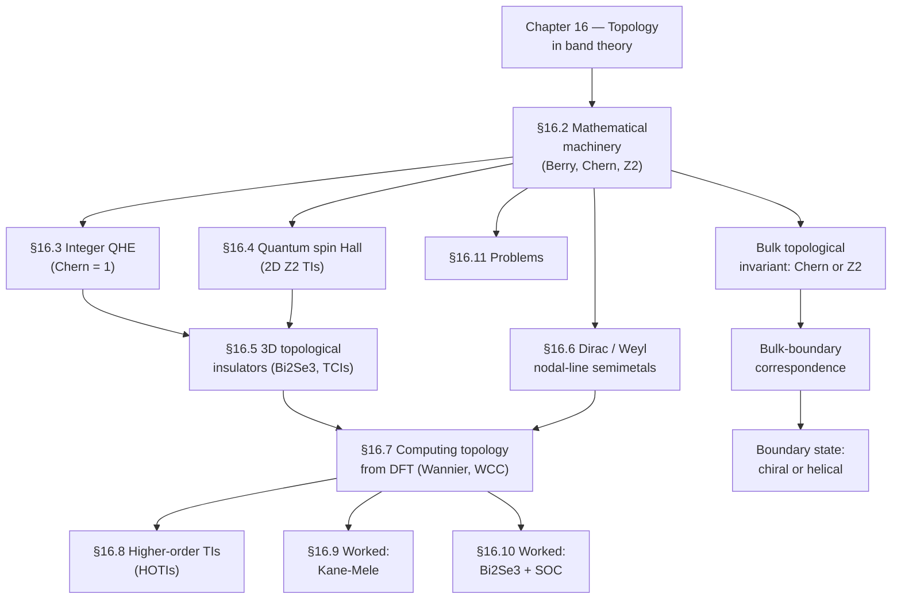
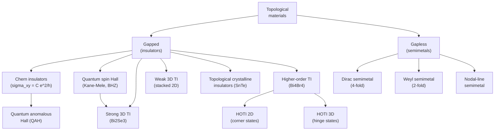
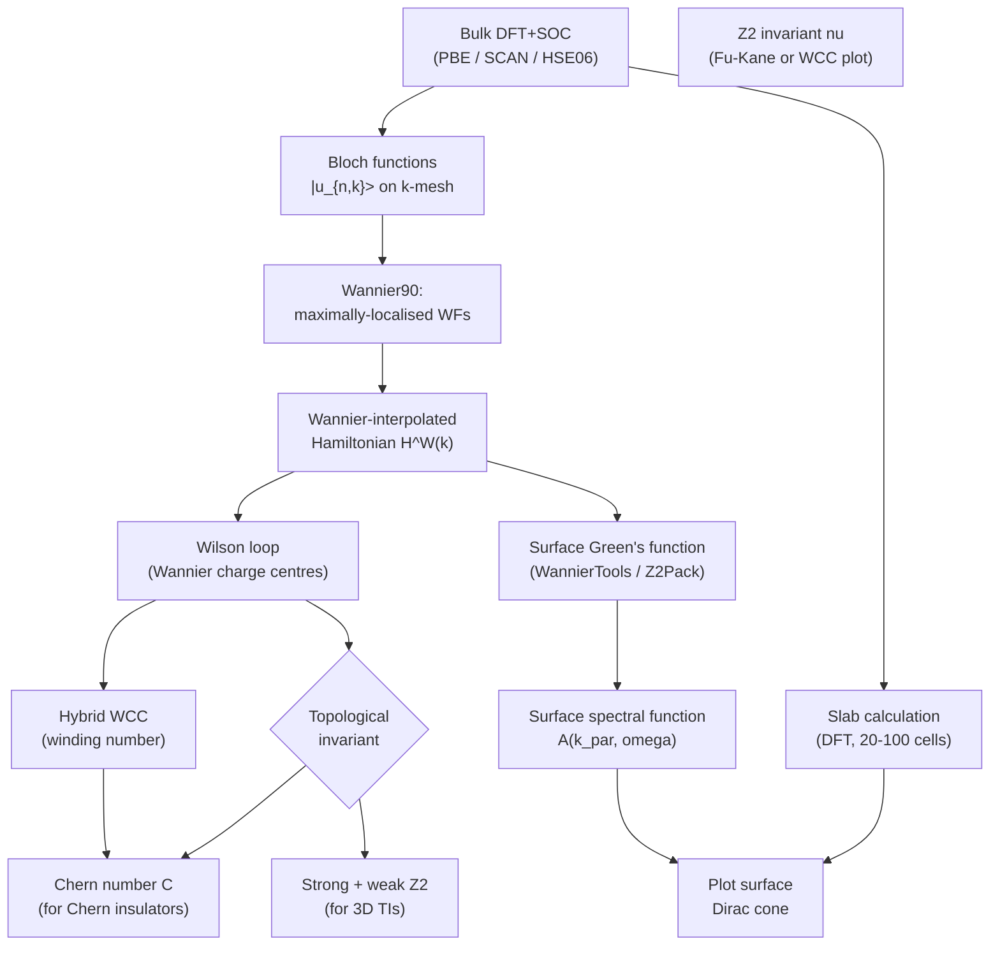
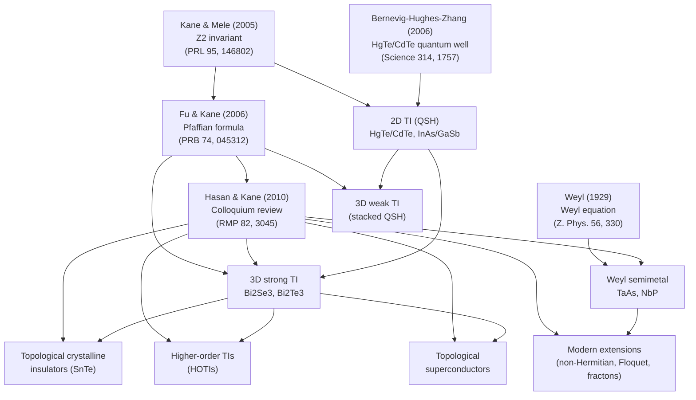

# Chapter 16 — Topological materials and topology in band theory

> The band structure of a crystal can carry an integer that no
> continuous deformation can change — and that integer controls
> whether a current flows around the edge of an otherwise
> insulating sample.

In [chapter 07]({{ "/dft-notes/chapter-07/" | relative_url }}) we
saw that a perfect crystal's Hamiltonian commutes with every
lattice translation, and the eigenfunctions therefore factorise
into a plane wave and a cell-periodic piece, the Bloch
function. In [chapter 11]({{ "/dft-notes/chapter-11/" | relative_url }})
we saw that those Bloch functions produce a band structure
$\varepsilon_n(\mathbf k)$ that we plot, density-of-state, and
project onto atomic orbitals. The missing chapter in that story
is the *geometric* one: a Bloch function $|u_{n\mathbf k}\rangle$
is a *vector* in Hilbert space, and as we move $\mathbf k$ around
in the Brillouin zone the vector traces out a *path* in Hilbert
space. The geometry of that path — its twist, its
curvature, its winding number — is encoded in three
objects we will spend most of this chapter on: the
**Berry phase**, the **Berry curvature**, and the
**Chern number** they integrate to. The Chern number is
an *integer* that classifies an isolated band; it cannot
change without the band gap closing. And it is not a
mathematical curiosity: it is the bulk topological
invariant that determines the quantised Hall conductivity
of [chapter 15]({{ "/dft-notes/chapter-15/" | relative_url }})'s
two-dimensional electron gas, the protected edge currents
of the quantum Hall effect, the helical surface states of
the 3D topological insulators, and the open Fermi arcs of
the Weyl semimetals. The bulk–boundary correspondence —
"non-trivial bulk topology forces gapless boundary
states" — is the through-line of the entire chapter.

> **Reading note.** This chapter assumes
> [chapter 07]({{ "/dft-notes/chapter-07/" | relative_url }})
> (Bloch's theorem, the Brillouin zone, reciprocal
> lattice), [chapter 11]({{ "/dft-notes/chapter-11/" | relative_url }})
> (Kohn–Sham band structure), and the relativistic
> background of [chapter 15]({{ "/dft-notes/chapter-15/" | relative_url }})
> (spin–orbit coupling and the spin Hall effect) — every
> non-trivial 2D and 3D TI in a real material relies on
> SOC to invert the band ordering. No time-dependent
> perturbation theory is needed; the linear-response
> machinery of
> [chapter 12]({{ "/dft-notes/chapter-12/" | relative_url }})
> is touched on only in the worked example.

## 16.1 The claim

The claim of the chapter, boxed, is the **bulk–boundary
correspondence** in its sharpest form.

> **Claim.** A gapped band structure is characterised by
> integer topological invariants $\{C_n\}$ (Chern numbers)
> and, when TR-symmetric, a set of $\mathbb Z_2$ indices
> $\{\nu\}$. These integers are *robust* — they cannot
> change under any continuous deformation of the
> Hamiltonian that keeps the gap open — and *observable*:
> they fix the quantised Hall conductivity, the existence
> of protected edge / surface states, the parity of the
> surface Dirac cone, and the helicity of the chiral
> edge modes. The bulk–boundary correspondence states

\begin{equation}
\label{eq:ch-16-bulk-boundary}
\boxed{
\sigma_{xy} = \frac{e^2}{h} \sum_{n\,:\,\text{occupied}} C_n ,
\qquad
\text{edge states} = \text{``hologram'' of the bulk Chern number}.
}
\end{equation}

The first equation is the **TKNN formula** (Thouless, Kohmoto, Nightingale, den Nijs, 1982): the off-diagonal Hall conductivity of an insulator is the *sum of the Chern numbers* of its occupied bands, in units of $e^2/h$. The second is the
*bulk–boundary correspondence* (Halperin, 1982): a non-zero
bulk Chern number is *not* consistent with a gapped, periodic
boundary condition in real space, and the inconsistency is
resolved by the appearance of *chiral* edge states at the
boundary between a non-trivial insulator and the vacuum (or
between a non-trivial and a trivial insulator). The
generalisation to time-reversal-symmetric systems replaces the
Chern number by the $\mathbb Z_2$ index $\nu \in \{0, 1\}$ and
the chiral edge state by a **Kramers pair** of counter-
propagating **helical** edge states.

Equation \eqref{eq:ch-16-bulk-boundary} is the headline. Every
section of the chapter builds toward it. The plan: in §16.2 we
introduce the mathematical machinery (Berry phase, Berry
connection and curvature, Chern number, $\mathbb Z_2$ index);
in §16.3 we apply it to the integer quantum Hall effect
(IQHE); in §16.4 to the quantum spin Hall (QSH) effect and
2D topological insulators; in §16.5 to 3D topological
insulators and topological crystalline insulators; in §16.6
to the gapless cousins — Dirac, Weyl, and nodal-line
semimetals; in §16.7 to the *practical* computation of
topological invariants from a DFT band structure; in §16.8 to
the modern extension to higher-order topological insulators
(HOTIs). We close with two worked examples (§16.9, the
Kane–Mele model on the honeycomb lattice; §16.10, the
Bi$_2$Se$_3$ surface Dirac cone from DFT+SOC), three graded
problems (§16.11), a list of cross-references (§16.12), and
an honest catalogue of what we left out (§16.13).

The roadmap in one diagram:

The two columns on the right are the "through-line" of the
chapter: the *bulk* topological invariant (Chern number or
$\mathbb Z_2$ index) determines, via the bulk–boundary
correspondence \eqref{eq:ch-16-bulk-boundary}, the existence
and structure of the *boundary* state (chiral for Chern
insulators, helical for $\mathbb Z_2$ TIs). Every section
of the chapter builds toward this connection.

## 16.2 The mathematical machinery

The whole subject rests on four objects, defined and
connected below. We use atomic units ($\hbar = e = 1$)
throughout, and work at zero temperature.

### 16.2.1 The Berry phase

Consider a quantum system whose Hamiltonian $\hat H(\mathbf
R)$ depends on external parameters $\mathbf R \in
\mathcal M$, with a non-degenerate ground state
$|n(\mathbf R)\rangle$ that varies smoothly with $\mathbf
R$. Under an *adiabatic* change of $\mathbf R$, the system
stays in the instantaneous ground state, acquiring only a
dynamical phase

\begin{equation}
\label{eq:ch-16-dynamical-phase}
\theta_\text{dyn}(T) = -\int_0^T E_n(\mathbf R(t))\, dt .
\end{equation}

Berry (1984) pointed out that on top of the dynamical
phase there is also a *geometric* phase that depends only
on the *path* $\mathcal C : [0, T] \to \mathcal M$ in
parameter space:

\begin{equation}
\label{eq:ch-16-berry-phase}
\boxed{
\gamma_n[\mathcal C] \;=\; i \oint_{\mathcal C} \langle n(\mathbf R) \mid \nabla_{\mathbf R} n(\mathbf R) \rangle \cdot d\mathbf R .
}
\end{equation}

Equation \eqref{eq:ch-16-berry-phase} is the **Berry phase**.
It is *gauge-invariant* and *geometric*: it depends only
on the path $\mathcal C$, not on how fast the path is
traversed.

For our application, the parameter space is the Brillouin
zone, $\mathbf R \to \mathbf k$, and the ground state at
each $\mathbf k$ is the cell-periodic Bloch function
$|u_{n\mathbf k}\rangle$ of [chapter 07]({{ "/dft-notes/chapter-07/" | relative_url }}).
The Berry phase of band $n$ along a 1-D closed loop
$\mathcal C$
in the BZ is

\begin{equation}
\label{eq:ch-16-berry-1d}
\gamma_n[\mathcal C] \;=\; i \oint_{\mathcal C} \langle u_{n\mathbf k} \mid \nabla_{\mathbf k} u_{n\mathbf k} \rangle \cdot d\mathbf k .
\end{equation}

> **Note.** The Berry phase is defined modulo $2\pi$. The
> convention we use throughout the chapter reports it in the
> principal range $(-\pi, \pi]$. Because it is gauge-invariant
> and only defined modulo $2\pi$, the *parity* of
> $\gamma_n/2\pi$ is the gauge-invariant content of a 1-D
> Berry phase: this is the $\mathbb Z_2$ invariant of
> §16.2.4. ### 16.2.2 The Berry connection and curvature

Define the **Berry connection** (also called the "Berry
vector potential") of band $n$ as the 1-form

\begin{equation}
\label{eq:ch-16-berry-connection}
\boxed{
\mathcal A_n(\mathbf k) \;=\; i \langle u_{n\mathbf k} \mid \nabla_{\mathbf k} u_{n\mathbf k} \rangle .
}
\end{equation}

The Berry connection is *gauge-dependent*: under a
$\mathbf k$-dependent phase rotation
$|u_{n\mathbf k}\rangle \to e^{i \chi(\mathbf k)} |u_{n\mathbf k}\rangle$
it shifts as $\mathcal A_n \to \mathcal A_n - \nabla_{\mathbf k}
\chi$, exactly like the electromagnetic vector potential
under a gauge transformation. The Berry phase
\eqref{eq:ch-16-berry-1d} is the integral of the Berry
connection along a closed loop and is gauge-invariant because
the gradient integrates to zero on a closed loop.

The **Berry curvature** is the exterior derivative of the
Berry connection,

\begin{equation}
\label{eq:ch-16-berry-curvature}
\boxed{
\boldsymbol \Omega_n(\mathbf k) \;=\; \nabla_{\mathbf k} \times \mathcal A_n(\mathbf k) .
}
\end{equation}

The Berry curvature is a *gauge-invariant* pseudo-vector in
$\mathbf k$-space. In components,

\begin{equation}
\label{eq:ch-16-berry-curvature-comp}
\Omega_{n,a}(\mathbf k) \;=\; \epsilon_{abc}\, \partial_{k_b} \mathcal A_{n,c}(\mathbf k) ,
\qquad a, b, c \in \{x, y, z\}.
\end{equation}

Unlike the connection, the curvature is a *physical*
(gauge-invariant) object: it enters the semi-classical
equations of motion of a wave packet in band $n$ as an
anomalous velocity term

\begin{equation}
\label{eq:ch-16-anomalous-velocity}
\dot{\mathbf r}_n = \frac{\partial \varepsilon_n}{\hbar \partial \mathbf k} - \dot{\mathbf k} \times \boldsymbol \Omega_n(\mathbf k) ,
\qquad
\hbar \dot{\mathbf k}_n = -\frac{\partial \varepsilon_n}{\partial \mathbf r} - \hbar \dot{\mathbf r} \times \boldsymbol \Omega_n(\mathbf k) .
\end{equation}

The second term is the **anomalous velocity**,
perpendicular to $\dot{\mathbf k}$ and proportional to
$\boldsymbol \Omega_n$. It is the *microscopic* origin of
the intrinsic anomalous Hall effect of a magnetic metal
and the *chiral* edge current of a Chern insulator.

For an isolated non-degenerate band, the curvature can also
be written explicitly in terms of the other bands:

\begin{equation}
\label{eq:ch-16-curvature-other-bands}
\Omega_{n,ab}(\mathbf k) \;=\; i \sum_{m \neq n} \frac{\langle u_{n\mathbf k} \mid \partial_{k_a} \hat H \mid u_{m\mathbf k} \rangle \langle u_{m\mathbf k} \mid \partial_{k_b} \hat H \mid u_{n\mathbf k} \rangle - (a \leftrightarrow b)}{(\varepsilon_{m\mathbf k} - \varepsilon_{n\mathbf k})^2} .
\end{equation}

Equation \eqref{eq:ch-16-curvature-other-bands} is sometimes
called the "sum-over-states" form of the Berry curvature. The
denominator is the square of the *band gap*; the curvature is
large where the gap is small, which is the reason topological
transitions are tied to gap closings.

### 16.2.3 The Chern number

The integral of the Berry curvature over a closed 2-D surface
in $\mathbf k$-space is, by Stokes' theorem, the Berry phase
around the boundary of the surface. For an isolated band $n$
and a closed 2-D Brillouin zone (e.g. a 2-D crystal), the
relevant closed surface is the 2D BZ *itself* (a torus, $T^2$).
Stokes' theorem on a torus gives

\begin{equation}
\label{eq:ch-16-stokes-torus}
\oint_{\partial(\text{BZ})} \mathcal A_n \cdot d\mathbf k \;=\; \int_{\text{BZ}} \Omega_{n,z}(\mathbf k)\, d^2k \;=\; 0 \pmod{2\pi} .
\end{equation}

The "modulo $2\pi$" is the only place the topology of the
torus enters. The integral of the curvature is an integer
multiple of $2\pi$, and the integer is the **Chern number** of
the band:

\begin{equation}
\label{eq:ch-16-chern-number}
\boxed{
C_n \;=\; \frac{1}{2\pi} \int_{\text{BZ}} \Omega_{n,z}(\mathbf k)\, d^2 k \;=\; \frac{1}{2\pi} \oint_{\partial(\text{BZ})} \mathcal A_n \cdot d\mathbf k \in \mathbb Z .
}
\end{equation}

The two expressions in \eqref{eq:ch-16-chern-number} are equal
as integers (Stokes on a torus); the second is sometimes
called the "non-Abelian" form when there are degeneracies. The
Chern number is the parent of all the topological invariants
we will meet. It is the topological invariant of the **integer
quantum Hall state** (§16.3) and of the **quantum anomalous
Hall state** (a Chern insulator without Landau levels).

> **Tip.** The Chern number can also be written as a winding
> number. Define the "projector" $P_n(\mathbf k) =
> |u_{n\mathbf k}\rangle \langle u_{n\mathbf k}|$ onto band
> $n$, and the BZ Berry connection as $\mathcal A =
> i\,\text{Tr}[P \nabla_{\mathbf k} P]$. Then
> $C = (1/2\pi) \int \text{Tr}[P\, dP \wedge dP]$, a
> 2-form that depends only on the *subspace* spanned by the
> band, not on the basis within it. This is the form used in
> practical codes (Z2Pack, see §16.7.4).

For an insulator with several occupied bands $\{n\}$ (the
cumulative Chern number is what enters the Hall conductivity),
we generalise to a multi-band projector
$P(\mathbf k) = \sum_{n \in \text{occ}} |u_{n\mathbf k}\rangle
\langle u_{n\mathbf k}|$ and define

\begin{equation}
\label{eq:ch-16-multiband-chern}
C \;=\; \frac{1}{2\pi} \int_{\text{BZ}} \text{Tr}\Bigl[ P\, dP \wedge dP \Bigr] \;\in\; \mathbb Z .
\end{equation}

Equation \eqref{eq:ch-16-multiband-chern} is invariant under
continuous unitary rotations *within* the occupied subspace —
the same $U(N)$ freedom that appears in the Wannier
construction of §16.7.1. ### 16.2.4 Time-reversal symmetry and the $\mathbb Z_2$ invariant

In a system with time-reversal symmetry (TRS), the Chern
number is forced to zero (the Berry curvature is odd under
TRS, $\boldsymbol \Omega_n(\mathbf k) = -\boldsymbol \Omega_n(-\mathbf
k)$, so its BZ integral vanishes), but a *weaker*
invariant can still be non-trivial:

\begin{equation}
\label{eq:ch-16-z2-definition}
\nu \;\in\; \{0, 1\}.
\end{equation}

The physical meaning of $\nu = 1$: there is an *odd*
number of Kramers pairs of *helical* edge (2D) or surface
(3D) states at the boundary.

**Fu–Kane formula for 2D.** For a 2D TR-symmetric
insulator with $N$ occupied Kramers pairs, the $\mathbb
Z_2$ index can be computed from the *sewing matrix*
$w(\mathbf k)$ that relates the Kramers partners at
$\mathbf k$ and at $-\mathbf k$:

\begin{equation}
\label{eq:ch-16-sewing}
w_{mn}(\mathbf k) \;=\; \langle u_{m,\mathbf k} \mid \Theta \mid u_{n, -\mathbf k} \rangle ,
\qquad
m, n \in \{1, \ldots, 2N\}.
\end{equation}

The sewing matrix is *antisymmetric* at the four **time-
reversal invariant momenta** (TRIM) $\Lambda_a$ in the 2D
BZ, $\mathbf \Lambda_a = (1/2)(n_1 \mathbf b_1 + n_2
\mathbf b_2)$ with $n_1, n_2 \in \{0, 1\}$, so its
Pfaffian is well-defined at those four points. The
Fu–Kane formula is

\begin{equation}
\label{eq:ch-16-fu-kane-2d}
\boxed{
(-1)^\nu \;=\; \prod_{a=1}^{4} \frac{\sqrt{\det\Bigl[w(\Lambda_a)\Bigr]}}{\text{Pf}\Bigl[w(\Lambda_a)\Bigr]} .
}
\end{equation}

Each factor in the product is $\pm 1$ (the ratio of the
square root of a determinant to a Pfaffian of an
antisymmetric matrix is always $\pm 1$); the product of
the four factors is the $\mathbb Z_2$ invariant. **This
is the working tool for computing $\nu$ from a DFT
Wannier Hamiltonian.**

**Wilson-loop interpretation.** Equation
\eqref{eq:ch-16-fu-kane-2d} has an equivalent and more
geometric form. Define the **Wilson loop** of the
occupied subspace along $b_2$ as a function of $k_1$:

\begin{equation}
\label{eq:ch-16-wilson-loop}
W(k_1) \;=\; \mathcal P \exp\!\left( i \int_{0}^{2\pi} \mathcal A_{k_2}(k_1, k_2)\, dk_2 \right) ,
\end{equation}

where $\mathcal P$ is path-ordering and $\mathcal A_{k_2}$
is the non-Abelian Berry connection. The eigenvalues of
$W(k_1)$ are $e^{i \theta_n(k_1)}$; the $\theta_n(k_1)$
are the **Wannier charge centres (WCC)**. Plotting
$\theta_n(k_1)$ as a function of $k_1$, a trivial
insulator gives *closed* loops (each $\theta_n$ winds
from $0$ to $2\pi$); a non-trivial insulator gives a
set of loops with an *odd* number of them *not* closing:

\begin{equation}
\label{eq:ch-16-z2-wilson}
\nu \;=\; \left( \frac{1}{2\pi} \sum_n \oint dk_1\, \partial_{k_1} \theta_n(k_1) \right) \!\!\mod 2 .
\end{equation}

Equation \eqref{eq:ch-16-z2-wilson} is the practical
$\mathbb Z_2$ test: count the WCC windings and take the
parity. We demonstrate this in §16.7.2 and §16.9. **Fu–Kane formula for 3D.** A 3D TR-symmetric insulator
has *eight* TRIM,
$\Lambda_i = (1/2)(n_1 \mathbf b_1 + n_2 \mathbf b_2 + n_3
\mathbf b_3)$ with $n_1, n_2, n_3 \in \{0, 1\}$. The
sewing-matrix product over all eight gives the *strong*
index:

\begin{equation}
\label{eq:ch-16-fu-kane-3d-strong}
(-1)^{\nu_0} \;=\; \prod_{i=1}^{8} \frac{\sqrt{\det\Bigl[w(\Lambda_i)\Bigr]}}{\text{Pf}\Bigl[w(\Lambda_i)\Bigr]} ,
\end{equation}

and three *weak* indices
$\nu_1, \nu_2, \nu_3 \in \{0, 1\}$ are defined by
restricting the product to TRIM with a common value of
$n_k$:

\begin{equation}
\label{eq:ch-16-fu-kane-3d-weak}
(-1)^{\nu_k} \;=\; \prod_{i\,:\,n_k = 1} \frac{\sqrt{\det\Bigl[w(\Lambda_i)\Bigr]}}{\text{Pf}\Bigl[w(\Lambda_i)\Bigr]} ,
\qquad k = 1, 2, 3 .
\end{equation}

A 3D TI with $\nu_0 = 1$ is a **strong TI** and has a
single *robust* Dirac cone on every surface; a 3D TI
with $\nu_0 = 0$ but some $\nu_k = 1$ is a **weak TI**,
equivalent to a stack of 2D QSH layers, and its surface
states are *not* robust to disorder that breaks the
layer structure. Bi$_2$Se$_3$ (§16.5.2) is a strong TI
with $\nu_0 = 1$, $\nu_1 = \nu_2 = \nu_3 = 0$.

> **Tip.** The $\mathbb Z_2$ invariants are the unique
> *robust* topological classification of a TR-symmetric
> gapped band structure. Other classifications
> (topological crystalline insulators, §16.5.3) require
> *additional* crystal symmetries.

## 16.3 The integer quantum Hall effect

The IQHE is the *original* topological phenomenon in
condensed-matter physics, and the simplest setting in
which the Chern number appears as a measurable integer.

### 16.3.1 The setup

Consider a 2D electron gas (2DEG) — the $xy$-plane of a
semiconductor heterostructure such as a GaAs/AlGaAs
interface — in a perpendicular magnetic field $\mathbf B =
B \hat{\mathbf z}$. The single-particle Hamiltonian is

\begin{equation}
\label{eq:ch-16-2deg-hamiltonian}
\hat H \;=\; \frac{1}{2m} \left( \mathbf p + e \mathbf A \right)^2 ,
\qquad
\mathbf A = (0, B x, 0)
\end{equation}

in the Landau gauge. The eigenstates are the **Landau
levels**

\begin{equation}
\label{eq:ch-16-landau-levels}
E_n \;=\; \hbar \omega_c \left( n + \tfrac{1}{2} \right) ,
\qquad
\omega_c = \frac{eB}{m} ,
\end{equation}

each with a macroscopic degeneracy per unit area

\begin{equation}
\label{eq:ch-16-ll-degeneracy}
n_B \;=\; \frac{eB}{h}
\end{equation}

(the number of flux quanta per unit area). The filling
factor is

\begin{equation}
\label{eq:ch-16-filling}
\nu \;=\; \frac{n_s}{n_B} \;=\; \frac{n_s h}{eB} ,
\end{equation}

where $n_s$ is the 2D electron density. **The Hall
conductivity at integer $\nu$ is the quantised value**

\begin{equation}
\label{eq:ch-16-iqhe-sigma}
\sigma_{xy} \;=\; \nu \frac{e^2}{h} ,
\qquad
\rho_{xy} = \frac{h}{\nu e^2} .
\end{equation}

This is the **integer quantum Hall effect** (von Klitzing,
1980; Nobel Prize 1985). The longitudinal resistance $\rho_{xx}$
vanishes at the same time; the system is a *perfect* Hall
conductor.

### 16.3.2 The TKNN invariant

Thouless, Kohmoto, Nightingale, and den Nijs (1982)
showed that the integer $\nu$ in \eqref{eq:ch-16-iqhe-sigma}
is the sum of the Chern numbers of the *occupied* Landau
levels:

\begin{equation}
\label{eq:ch-16-tknn}
\boxed{
\sigma_{xy} \;=\; \frac{e^2}{h} \sum_{n\,:\,\text{occupied}} C_n .
}
\end{equation}

This is the **TKNN invariant**, the first explicit
appearance of the Chern number in an observable. The
RHS of \eqref{eq:ch-16-tknn} is the *bulk* band
structure computed via \eqref{eq:ch-16-chern-number};
the LHS is the *transport* measurement. The bulk–
boundary correspondence \eqref{eq:ch-16-bulk-boundary} is
the reason the bulk Chern number fixes the transport
coefficient: at the edge of the sample the Landau level
bends up to higher energy (to match the vacuum), and the
Fermi energy crosses the *bent* level an integer number
of times, giving the chiral edge states that carry the
quantised current.

**Why is the IQHE topological?** Two ways to see it. (i)
*Robustness to disorder:* a smooth, local perturbation to
$\hat H$ cannot change $C_n$ without closing the band gap;
the disorder potential in a real 2DEG is far too weak to
close the Landau gap of $\sim 10$ K, so the quantisation
survives to ppm precision. (ii) *The topological origin of
the edge states:* the chiral edge mode is a topologically-
protected, uni-directional channel at the boundary; back-
scattering is forbidden because there is no counter-
propagating edge state to back-scatter *into*. The result
is dissipationless transport.

### 16.3.3 The Hofstadter butterfly

A different manifestation of the topology of a 2D crystal
in a magnetic field is the **Hofstadter butterfly**
(Hofstadter, 1976): the energy spectrum of a tight-binding
electron on a 2D lattice in a uniform magnetic field, as a
function of the flux $\Phi$ per unit cell (in units of the
flux quantum $\Phi_0 = h/e$). The spectrum is a *fractal*:
a self-similar pattern of sub-bands and gaps that
recursively splits as the flux per unit cell is increased.

The spectrum is the solution of the **Harper equation**

\begin{equation}
\label{eq:ch-16-harper}
\psi_{n+1} + \psi_{n-1} + 2 \cos\!\Bigl( 2\pi n \phi + k_y \Bigr) \psi_n \;=\; \varepsilon_n(k_y)\, \psi_n ,
\end{equation}

where $\phi = \Phi/\Phi_0$. The bands and gaps are
labelled by a pair of integers $(s, t)$ via the
**Diophantine equation**

\begin{equation}
\label{eq:ch-16-diophantine}
r \;=\; s \phi + t ,
\end{equation}

where $r$ is the number of sub-bands below the gap and
$(s, t)$ are topological integers. $s$ is the **Chern
number** of the sub-band just below the gap, and $t$ is
related to the Hall conductivity in the gap. The
Diophantine equation is the *gap-labelling theorem*: every
gap in the Hofstadter spectrum is labelled by an integer
pair $(s, t)$ that satisfies \eqref{eq:ch-16-diophantine}
for some integer $r$.

> **Tip.** The Hofstadter butterfly is realised in moiré
> superlattices of bilayer graphene (h-BN-encapsulated,
> twisted at the magic angle) and in optical lattices of
> cold atoms. The Chern numbers of the sub-bands in
> twisted-bilayer graphene at certain flux values are the
> origin of the *fractional* Chern insulator states
> observed in 2023. ## 16.4 The quantum spin Hall effect and 2D topological insulators

In 2005, Kane and Mele showed that a 2D time-reversal-
symmetric insulator can be non-trivial in a way the IQHE is
not. The quantum spin Hall (QSH) effect is the TR-symmetric
analogue of the QAH: a bulk insulator with *helical* edge
states protected by TRS. The 2007 work of Bernevig, Hughes,
and Zhang (BHZ) predicted the first realistic material
platform — the HgTe/CdTe quantum well — and the
experimental confirmation by König *et al.* in 2007 launched
the field of 2D and 3D TIs.

### 16.4.1 The Kane–Mele model

The Kane–Mele model is the spin–orbit extension of the
honeycomb-lattice tight-binding model of graphene (see
[chapter 11]({{ "/dft-notes/chapter-11/" | relative_url }})'s
worked example). The model has four terms:

\begin{equation}
\label{eq:ch-16-kane-mele-hamiltonian}
\hat H \;=\; \hat H_0 + \hat H_\text{SO} + \hat H_R + \hat H_\text{staggered} .
\end{equation}

The four terms in detail:

\begin{align}
\label{eq:ch-16-kane-mele-terms}
\hat H_0 &= -t \sum_{\langle i j \rangle, \sigma} c^\dagger_{i\sigma} c_{j\sigma} ,
\\[4pt]
\hat H_\text{SO} &= i \lambda_\text{SO} \sum_{\langle\langle i j \rangle\rangle, \sigma} \nu_{ij}\, c^\dagger_{i\sigma} \sigma^z_{\sigma\sigma'}\, c_{j\sigma'} ,
\\[4pt]
\hat H_R &= i \lambda_R \sum_{\langle i j \rangle, \sigma\sigma'} c^\dagger_{i\sigma} \Bigl( \mathbf s_{\sigma\sigma'} \times \mathbf d_{ij} \Bigr)_z\, c_{j\sigma'} ,
\\[4pt]
\hat H_\text{staggered} &= \lambda_v \sum_{i, \sigma} \nu_i\, c^\dagger_{i\sigma} c_{i\sigma} .
\end{align}

In \eqref{eq:ch-16-kane-mele-terms}:

- $\hat H_0$: standard nearest-neighbour hopping of the
  honeycomb lattice (chapter 11).
- $\hat H_\text{SO}$: **intrinsic spin–orbit coupling**;
  $\langle\langle i j \rangle\rangle$ are next-nearest-
  neighbour sites on the *same* sublattice, $\sigma^z$ is
  the Pauli matrix on the real spin, $\nu_{ij} = \pm 1$ is
  a Hermiticity sign. This term opens a *topological* gap
  in the graphene Dirac cone.
- $\hat H_R$: **Rashba spin–orbit coupling** from a
  substrate-induced broken mirror symmetry; $\mathbf s$ is
  the spin Pauli vector and $\mathbf d_{ij}$ is the in-
  plane vector from $i$ to $j$. This term competes with
  $\hat H_\text{SO}$ and drives a topological phase
  transition.
- $\hat H_\text{staggered}$: a sublattice (A vs. B)
  staggered potential $\pm \lambda_v$ that breaks
  inversion symmetry and competes with $\hat H_\text{SO}$.

The Kane–Mele model is the **paradigm** of a 2D Z$_2$
topological insulator. In the limit $\lambda_R = 0$ and
$\lambda_v = 0$, the Hamiltonian is block-diagonal in spin
(the spin-up and spin-down sectors are decoupled copies of
the Haldane model with fluxes $\pm \Phi$ on the two
sublattices), and each block has a Chern number $C_\uparrow =
+1$, $C_\downarrow = -1$. The total Chern number vanishes
(TRS is preserved), but the **spin Chern number**
$C_s = (C_\uparrow - C_\downarrow)/2 = 1$ is non-zero —
one of several equivalent characterisations of the
$\mathbb Z_2$ index in TR-symmetric systems.

**Topological phase diagram.** The $\lambda_\text{SO}$–
$\lambda_v$ plane has three phases:

| Phase | $\lambda_\text{SO}$ vs. $\lambda_v$ | $\nu$ | Surface state |
|:------|:------------------------------------|:-----:|:--------------|
| Quantum spin Hall | $\lambda_\text{SO} > 3\sqrt{3} \lambda_v$ | $1$ | Helical edge modes |
| Band insulator | $\lambda_\text{SO} < 3\sqrt{3} \lambda_v$ | $0$ | None |
| Gapless | $\lambda_\text{SO} = 3\sqrt{3} \lambda_v$ | — | Dirac point closes |

The bulk gap at $\lambda_v = 0$ is
$\Delta = 6\sqrt{3}\, \lambda_\text{SO}$; the gap closes at
the critical ratio $\lambda_\text{SO} = 3\sqrt{3}\, \lambda_v$.

### 16.4.2 The Bernevig–Hughes–Zhang (BHZ) model

The BHZ model (Bernevig, Hughes, Zhang, 2006) is a four-
band effective Hamiltonian for the HgTe/CdTe quantum
well. The two relevant orbitals are the $s$-like
$\Gamma_6$ and the $p$-like $\Gamma_8$ (heavy-hole),
with spin degeneracy giving a four-band model:

\begin{equation}
\label{eq:ch-16-bhz}
H(\mathbf k) \;=\; \begin{pmatrix} h(\mathbf k) & 0 \\ 0 & h^*(-\mathbf k) \end{pmatrix} ,
\qquad
h(\mathbf k) \;=\; \mathbf d(\mathbf k) \cdot \boldsymbol \sigma ,
\end{equation}

with $h(\mathbf k)$ acting in the orbital subspace
$\{ |\Gamma_6, \uparrow\rangle, |\Gamma_8, \uparrow\rangle
\}$ and $h^*(-\mathbf k)$ the time-reversed partner (so
$H(\mathbf k)$ is TR-symmetric), and

\begin{align}
\label{eq:ch-16-bhz-d}
d_a(\mathbf k) &= A \sin k_a , \quad a = x, y ,
\\
d_z(\mathbf k) &= M - B (k_x^2 + k_y^2) .
\end{align}

The *topology* of the BHZ model is controlled by the mass
parameter $M$. Inverting the sign of $M$ (relative to
$B > 0$) drives a *band inversion* at $\Gamma$ — the
$\Gamma_8$ band moves above the $\Gamma_6$ band — and
the gap closes at $M = 0$. For $M/B < 0$ the model is a
*quantum spin Hall insulator* with $\nu = 1$.

The BHZ model is the *first* 2D TI predicted and observed in
a real material. König *et al.* (Science **318**, 766 (2007))
measured the quantised conductance $G = 2 e^2 / h$ in a
HgTe/(Hg,Cd)Te quantum well of critical thickness $d_c \sim
6.5$ nm: for $d < d_c$ the well is a trivial insulator;
for $d > d_c$ it is a QSH insulator. The transport
signature is the non-local voltage in an H-bar geometry,
quantised at $2 e^2/h$ in the QSH phase.

> **Note.** The factor of 2 is the *spin* degeneracy:
> one *helical* edge mode (a Kramers pair of
> counter-propagating electrons with opposite spin)
> contributes $e^2/h$ per spin, total $2 e^2/h$.

### 16.4.3 The $\mathbb Z_2$ invariant from time-reversal polarisation

A more physically transparent derivation of the 2D
$\mathbb Z_2$ invariant, due to Fu and Kane (2006), uses
the **time-reversal polarisation** $\mathcal P$ at the
four TRIM. For a 1D TR-symmetric insulator the
*polarisation* $P$ is only defined modulo $e/2$; the
time-reversed polarisation is $-P$. The *change* in
polarisation $\Delta P$ across a TR-symmetric deformation
satisfies

\begin{equation}
\label{eq:ch-16-tr-pol}
\Delta P \;=\; 0 \;\text{ or }\; e/2 \pmod{e} .
\end{equation}

The two possibilities are the two values of the $\mathbb
Z_2$ index of a 1D TR-symmetric insulator.

Extending to 2D: take the two 1D systems obtained by
slicing the 2D BZ at $k_y = 0$ and $k_y = \pi$. They
have 1D polarisations $P(0)$ and $P(\pi)$. The
$\mathbb Z_2$ index of the 2D insulator is

\begin{equation}
\label{eq:ch-16-fu-kane-pol}
\nu \;=\; 2 \Bigl[ P(\pi) - P(0) \Bigr] \;\mod 2 \;\in\; \{0, 1\} .
\end{equation}

The factor of 2 converts the *continuous* 1D polarisation
to a $\mathbb Z_2$ invariant. A non-trivial $\nu = 1$
implies an odd number of edge-state crossings of the
Fermi energy between $k_y = 0$ and $k_y = \pi$ — the
helical edge mode.

The Wilson-loop formulation
\eqref{eq:ch-16-z2-wilson} is the *continuous* version of
this: the Wannier charge centres $\theta_n(k_1)$ are the
1D polarisation of the slice at fixed $k_1$, and the
parity of their winding is the $\mathbb Z_2$ invariant.
The WCC method is the standard *numerical* route
(WannierTools, Z2Pack, see §16.7.2).

## 16.5 3D topological insulators

The 3D extension of the QSH state was predicted by Fu, Kane,
and Mele (2007) and by Moore and Balents (2007). The first
concrete material realisation was Bi$_2$Se$_3$ (Zhang *et
al.*, *Nature Physics* **5**, 438 (2009)). The 3D TI has a
single, *robust* Dirac cone on every surface, with
spin–momentum locking that prevents back-scattering by
non-magnetic disorder.

### 16.5.1 Strong and weak TIs

As derived in §16.2.4, a 3D TR-symmetric insulator has
*four* $\mathbb Z_2$ indices: one *strong* $\nu_0$ and three
*weak* $\nu_1, \nu_2, \nu_3$, defined via
\eqref{eq:ch-16-fu-kane-3d-strong} and
\eqref{eq:ch-16-fu-kane-3d-weak}. The physical meanings:

- $\nu_0 = 1$: **strong TI**. Every surface that preserves
  TRS has an *odd* number of Dirac cones, robust to any TR-
  symmetric perturbation. Examples: Bi$_2$Se$_3$, Bi$_2$Te$_3$,
  Sb$_2$Te$_3$.
- $\nu_0 = 0$, some $\nu_k = 1$: **weak TI**. A stack of
  2D QSH layers; surface states exist only on surfaces
  *not* parallel to the stacking direction, and are *not*
  robust to disorder that breaks the layer structure.
  Example: Bi$_2$Te$_2$Se under certain growth conditions.
- $\nu_0 = 0$ and all $\nu_k = 0$: **trivial insulator**.
  No protected surface states.

The strong TI is a genuinely *3D* topological phase. The
weak TI is, in some sense, a "1D stack" of 2D TIs.

### 16.5.2 The Bi$_2$Se$_3$ family

Bi$_2$Se$_3$ is the *canonical* 3D TI. It crystallises in
the tetradymite structure (space group $D_{3d}^5$, $R\bar
3 m$, No. 166) with five-atom layers (Se–Bi–Se–Bi–Se)
stacked along $c$ and held together by van der Waals
forces. The *band inversion* is between the Bi $6p$ and
Se $4p$ states at $\Gamma$, driven by the atomic SOC of
the heavy Bi ($Z_\text{Bi} = 83$).

The minimal four-band effective Hamiltonian at $\Gamma$ is
(Zhang *et al.*, *Nature Physics* **5**, 438 (2009))

\begin{equation}
\label{eq:ch-16-bi2se3-hamiltonian}
H_\text{eff}(\mathbf k) \;=\; \epsilon_0(\mathbf k) \mathbb 1_{4} + \begin{pmatrix} M(\mathbf k) & A_1 k_z & 0 & A_2 k_- \\ A_1 k_z & -M(\mathbf k) & A_2 k_- & 0 \\ 0 & A_2 k_+ & M(\mathbf k) & -A_1 k_z \\ A_2 k_+ & 0 & -A_1 k_z & -M(\mathbf k) \end{pmatrix} ,
\end{equation}

with $M(\mathbf k) = M_0 - B_1 k_z^2 - B_2 (k_x^2 + k_y^2)$,
$\epsilon_0(\mathbf k) = C + D_1 k_z^2 + D_2 (k_x^2 + k_y^2)$,
and $k_\pm = k_x \pm i k_y$. The basis is the four
Kramers pairs of the Bi / Se $p_z$ combinations. The
sign of $M_0 / B_1$ controls the topology: $M_0 / B_1 > 0$
gives a strong TI (Bi$_2$Se$_3$); $M_0 / B_1 < 0$ gives
a trivial insulator (Sb$_2$Se$_3$).

The Bi$_2$Se$_3$ surface hosts a **single Dirac cone** at
$\bar\Gamma$, with $E(\mathbf k) = \pm v_F |\mathbf k|$ and
$v_F \approx 5 \times 10^5$ m/s. The surface state exhibits
**spin–momentum locking**, $\langle \mathbf s \rangle
\propto \hat{\mathbf z} \times \mathbf k$: an electron
with momentum $\mathbf k$ cannot back-scatter to $-\mathbf
k$ because the spin would have to flip and a non-magnetic
impurity cannot flip it. The result is a long mean-free
path, the basis of proposed low-dissipation "topological"
electronics.

> **Note.** The *existence* of the surface state is
> topologically protected; its *energy* (relative to the
> bulk gap) is not. If the Fermi energy is in the bulk
> conduction band (as in naturally $n$-type Bi$_2$Se$_3$
> due to Se vacancies), the surface Dirac cone is "buried"
> under the bulk conduction. Doping the bulk to push $E_F$
> into the gap is the experimental challenge.

### 16.5.3 Topological crystalline insulators (TCIs)

A *topological crystalline insulator* is an insulator whose
gapless surface states are protected by a *crystal
symmetry* (a mirror, a rotation, a glide, or a screw) rather
than by TRS. The defining example is **SnTe** (and the
alloy Pb$_{1-x}$Sn$_x$Te, Pb$_{1-x}$Sn$_x$Se). SnTe has
the rock-salt structure; the two relevant band edges at the
four equivalent $L$ points of the BZ are inverted by the
spin–orbit coupling, and the *mirror* symmetry of the
(110) plane protects the surface states on the (001)
surface. SnTe was the first material predicted to be a TCI
(Fu, *Phys. Rev. Lett.* **106**, 106802 (2011)) and the
first one observed in ARPES (Tanaka *et al.*, *Nature
Physics* **8**, 800 (2012)).

The classification of TCIs uses the *symmetry-based
indicators* of Po *et al.* and Song *et al.* (2017–2018),
which extend the $\mathbb Z_2$ machinery of Fu–Kane to
arbitrary space-group symmetries. A TCI can have
*multiple* Dirac cones on the surface (SnTe has four, one
on each $\{111\}$ face and on the (001) face) and
higher-degeneracy surface states (four-, six-, eight-fold)
at high-symmetry points.

> **Tip.** The modern "topological quantum chemistry"
> framework (Bradlyn *et al.*, *Science* **353**, 6299
> (2016)) gives a complete classification of all band
> structures consistent with a given space-group symmetry,
> including TCIs, Dirac, Weyl, nodal-line, and multi-fold
> semimetals. Tools: the Bilbao Crystallographic Server's
> `TOPOLOGICAL QUANTUM CHEMISTRY` and the
> `CheckTopologicalMat` Python package.

## 16.6 Topological semimetals

The topological materials we have considered so far are
*insulators*: they have a bulk gap. There is a parallel
family of **topological semimetals** whose protection
requires the *touching* of two (or more) bulk bands at
discrete points or along lines in the BZ. The three main
families are the **Dirac semimetals** (four-fold crossings,
TRS and inversion preserved), the **Weyl semimetals**
(two-fold crossings, TRS or inversion broken), and the
**nodal-line semimetals** (lines of two-fold crossings
protected by mirror or PT symmetry).

### 16.6.1 Dirac semimetals

A 3D Dirac semimetal has a *four-fold* band crossing near
the Fermi energy, with the low-energy Hamiltonian

\begin{equation}
\label{eq:ch-16-dirac-hamiltonian}
H_\text{Dirac}(\mathbf q) \;=\; \begin{pmatrix} m & v \, \mathbf q \cdot \boldsymbol \sigma \\ v\, \mathbf q \cdot \boldsymbol \sigma & -m \end{pmatrix} ,
\end{equation}

a 4×4 matrix in the basis of the two Kramers pairs. The
*mass* parameter $m$ measures the separation of the four
bands; at $m = 0$ the four bands cross at $\mathbf q = 0$
and the spectrum is the 3D massless Dirac fermion,
$E(\mathbf q) = \pm v |\mathbf q|$ (each sign doubly
degenerate). The Dirac node is *protected* by TRS +
inversion + an *extra* crystal rotation symmetry ($C_3$
along [111] in Na$_3$Bi, $C_4$ in Cd$_3$As$_2$); without
the rotation the two two-fold representations of the
little group at $\Gamma$ would hybridise and open a gap.

Two materials realise the Dirac semimetal phase:

- **Na$_3$Bi** (Wang *et al.*, *Phys. Rev. B* **85**, 195320
  (2012); Liu *et al.*, *Science* **343**, 864 (2014)):
  $C_3$-protected Dirac node on the $\Gamma$–$A$ line of
  the hexagonal BZ, $\sim 0.3$ eV above the Fermi energy.
- **Cd$_3$As$_2$** (Wang *et al.*, *Phys. Rev. B* **88**,
  125427 (2013); Liu *et al.*, *Nature Materials* **13**,
  677 (2014)): $C_4$-protected Dirac node on the
  $\Gamma$–$Z$ line of the tetragonal BZ, $\sim 0.2$ eV
  above the Fermi energy, protected by the $C_4$ symmetry
  of the I4$_1$/acd space group.

The Dirac node is a *doubly-degenerate* Weyl node: a
superposition of two Weyl nodes of opposite chirality,
sitting on top of each other in momentum space. Breaking
the crystal symmetry (or breaking either TRS or
inversion) splits the Dirac node into a pair of Weyl nodes,
and the system becomes a Weyl semimetal.

### 16.6.2 Weyl semimetals

A 3D Weyl semimetal has a *two-fold* band crossing near the
Fermi energy, with the low-energy Hamiltonian

\begin{equation}
\label{eq:ch-16-weyl-hamiltonian}
H_\text{Weyl}(\mathbf q) \;=\; v\, \mathbf q \cdot \boldsymbol \sigma ,
\end{equation}

a 2×2 matrix in the basis of a single (spinless) Weyl
fermion. The spectrum is $E(\mathbf q) = \pm v |\mathbf q|$,
a *three-dimensional* massless Dirac fermion with a
*single* chirality. The Weyl node is **topologically
protected**: the small sphere of $\mathbf k$-space around
the node is a 2-sphere, and the Chern number of that sphere
is non-zero,

\begin{equation}
\label{eq:ch-16-weyl-chern}
C_\text{Weyl} \;=\; \frac{1}{2\pi} \oint_{S^2} \boldsymbol \Omega(\mathbf k) \cdot d\mathbf S \;=\; \pm 1 .
\end{equation}

The sign is the **chirality** of the Weyl node: $+1$ is a
*right-handed* Weyl fermion, $-1$ is *left-handed*. The
chirality is a property of the *Hamiltonian*, not of the
state, and it is conserved by smooth deformations that
preserve the gap elsewhere.

**Nielsen–Ninomiya theorem** (the "no-go" theorem for Weyl
fermions in a BZ): the *sum* of the chiralities of all
Weyl nodes in the Brillouin zone is zero. Weyl nodes come
in pairs of opposite chirality related by the *remaining*
symmetry when TRS or inversion is broken. The net rule:
**the BZ always contains an even number of Weyl nodes,
with equal numbers of left- and right-handed chiralities**.

The two "textbook" Weyl semimetals are

- **TaAs** (Weng *et al.*, *Phys. Rev. X* **5**, 011029
  (2015); Xu *et al.*, *Science* **349**, 613 (2015)):
  inversion-broken, TRS-preserved. 24 Weyl nodes split into
  two groups of 8 above and 8 below the $k_z = 0$ plane,
  with chirality alternating around each group.
- **NbAs, NbP, TaP**: same family as TaAs.

The defining experimental signature is the **Fermi arc**:
a surface state connecting the *projections* of two bulk
Weyl nodes of opposite chirality on the surface BZ. The
arc is *open* (a chord, not a loop); it merges into the
bulk Weyl cone at each end.

### 16.6.3 Nodal-line semimetals

A *nodal-line semimetal* has a *line* (1D) of two-fold band
crossings in the BZ, rather than an isolated point. The
low-energy Hamiltonian near a point on the line is the 2D
massless Dirac Hamiltonian in the plane perpendicular to
the line:

\begin{equation}
\label{eq:ch-16-nodal-line}
H(\mathbf q) \;=\; v_\perp\, (q_x \sigma_x + q_y \sigma_y) ,
\end{equation}

where $\mathbf q$ is the displacement from the line, $q_x,
q_y$ are the components perpendicular to the line, and
$\sigma_x, \sigma_y$ are Pauli matrices in the two-band
subspace. The dispersion is $E = \pm v_\perp \sqrt{q_x^2 +
q_y^2}$ in the perpendicular plane; along the line the
two bands are degenerate and their dispersion is *flat*
(if the Hamiltonian has no $k_z$ dependence on the line)
or *linear* (if it does).

Nodal lines are protected by *mirror* symmetry, *PT*
symmetry (the product of parity and TR), or — in non-
centrosymmetric, non-magnetic crystals — by an
*antiunitary* symmetry that squares to $+1$ (e.g. the
product of mirror and TR). When the protecting symmetry is
broken (e.g. by spin–orbit coupling that breaks mirror
symmetry), the nodal line gaps out into a pair of Weyl
nodes, and the system becomes a Weyl semimetal. This is the
*symmetry-breaking* pathway between nodal-line and Weyl
phases.

Material realisations of nodal-line semimetals include
**ZrSiS** (nodal line protected by the non-symmorphic
symmetry of the body-centred tetragonal lattice, lying
close to the Fermi energy), **PbTaSe$_2$** (an asymmetric,
TR-symmetric mirror-protected nodal line), and the
**antiperovskite Cu$_3$PdN** family (TR-symmetric
mirror-protected nodal lines around $\Gamma$).

The family of semimetals covered in this section is the
*gapless* branch of the topology zoo. The full zoo — the
*gapped* branch and the *gapless* branch, together — is
summarised below.

The diagram makes the relationship explicit: the
*Chern* and *QSH* families are the 2D parents of the 3D
TIs; the *Dirac* family is the 4-fold (TRS+inversion
preserved) parent of the *Weyl* family (TRS or inversion
broken); the *TCI* family extends the *strong TI* family
with crystal-symmetry protection; the *HOTI* family is
the "next-order" extension of the standard TI. Each
branch has its own invariant — Chern number, $\mathbb
Z_2$ index, mirror Chern number, line-winding number,
multipole moment — and each invariant has its own
computational recipe in WannierTools / Z2Pack / BANDREP.

### 16.6.4 The chiral anomaly and the negative magnetoresistance

The **chiral anomaly** is a defining property of massless
Weyl fermions in 3D. The chiral current $j_5^\mu = \bar\psi
\gamma^\mu \gamma^5 \psi$ is *classically* conserved, but
*quantum-mechanically* the conservation fails in the
presence of electromagnetic fields:

\begin{equation}
\label{eq:ch-16-chiral-anomaly}
\boxed{
\partial_\mu j_5^\mu \;=\; \frac{e^2}{16 \pi^2 \hbar^2}\, \epsilon^{\mu\nu\rho\sigma} F_{\mu\nu} F_{\rho\sigma} \;=\; \frac{e^3}{2 \pi^2 \hbar^2}\, \mathbf E \cdot \mathbf B .
}
\end{equation}

The right-hand side is non-zero when $\mathbf E \parallel
\mathbf B$: parallel fields pump right-handed Weyl
fermions from the left-handed node to the right-handed one
(or vice versa) at a rate $\propto \mathbf E \cdot \mathbf
B$. The *separate* chiral charge is not conserved, but the
total electric charge is.

In a Weyl semimetal, the chiral anomaly is observed in two
ways:

1. **The chiral magnetic effect.** A magnetic field
   $\mathbf B$ along, say, the $z$ direction creates a
   population imbalance between the two chiralities. The
   resulting *chiral chemical potential* $\mu_5$ drives a
   *current* along $\mathbf B$,

   \begin{equation}
   \label{eq:ch-16-chiral-magnetic}
   \mathbf j \;=\; \frac{e^2 \mu_5}{2 \pi^2 \hbar^2}\, \mathbf B .
   \end{equation}

   This is the "**chiral magnetic effect**" (CME), predicted
   in 1983 in high-energy physics and observed in Weyl
   semimetals in 2015 by Li *et al.* and Xiong *et al.*
2. **The negative longitudinal magnetoresistance
   (LMR).** When an electric field $\mathbf E$ is applied
   *parallel* to $\mathbf B$, the chiral anomaly pumps
   charge from one chirality to the other. The pumped
   charge *reduces* the resistance because the back-
   scattering between the two chiralities is *suppressed*
   (the populations are unequal). The result is a
   *negative* longitudinal magnetoresistance: as $B$
   increases, the longitudinal resistance *decreases*. This
   was the first experimental signature of Weyl fermions in
   TaAs, observed in 2015. > **Note.** The negative LMR is *not* a unique signature of
> the chiral anomaly — current jetting and other classical
> effects can also produce a negative LMR. The
> *unambiguous* signature is the *planar* Hall effect: in
> an in-plane $\mathbf B$ and a perpendicular $\mathbf E$
> the planar Hall voltage is *odd* under $\mathbf B \to
> -\mathbf B$ and has a characteristic $\sin(2\theta)$
> dependence on the angle $\theta$ between $\mathbf E$ and
> $\mathbf B$ (the "Burkov" prediction). This signature
> has no classical analogue.

## 16.7 Computing topology from DFT

The previous sections were *theory* — Berry phase, Chern
numbers, $\mathbb Z_2$ indices. The natural question is:
how do we *compute* these from a DFT band structure? The
DFT gives us a Kohn–Sham Hamiltonian $H(\mathbf k)$ on a
discrete $\mathbf k$-mesh; we want a Chern number or a
$\mathbb Z_2$ index. The answer is a sequence of three
steps, each a piece of standard, well-tested software.

### 16.7.1 Wannier functions from Bloch functions

The DFT output is a set of Bloch functions
$|u_{n\mathbf k}\rangle$ for $N$ bands on a discrete
$\mathbf k$-mesh, delocalised in real space. A more
convenient basis is the set of **Wannier functions**,
localised in real space. For a set of $N$ isolated bands,
the Wannier functions are

\begin{equation}
\label{eq:ch-16-wannier-def}
| w_{n\mathbf R} \rangle \;=\; \frac{V}{(2\pi)^3} \int_{\text{BZ}} d^3k\, e^{-i \mathbf k \cdot \mathbf R} \sum_{m=1}^{N} U_{mn}(\mathbf k)\, | u_{m\mathbf k} \rangle ,
\end{equation}

where the integral is over the first BZ and $U_{mn}(\mathbf
k)$ is a *unitary* matrix that mixes the $N$ bands at
each $\mathbf k$. The Wannier functions depend on the
choice of $U(\mathbf k)$; a trivial choice $U = \mathbb
1$ generally does not produce *localised* Wannier
functions. The **maximally-localised Wannier functions
(MLWFs)** of Marzari and Vanderbilt (1997) are obtained
by choosing $U(\mathbf k)$ to *minimise* the total spread

\begin{equation}
\label{eq:ch-16-wannier-spread}
\Omega \;=\; \sum_{n=1}^{N} \left( \langle w_{n\mathbf 0} | r^2 | w_{n\mathbf 0} \rangle - \langle w_{n\mathbf 0} | \mathbf r | w_{n\mathbf 0} \rangle^2 \right) .
\end{equation}

The minimisation is a non-linear problem in $U(\mathbf
k)$, solved by successive unitary rotations on pairs of
Wannier functions. The standard tool is **Wannier90**
(Mostofi *et al.*, *Comput. Phys. Commun.* **178**, 685
(2008)). The input is the Bloch functions at a uniform
$\mathbf k$-mesh; the output is the $U(\mathbf k)$
matrices, the MLWF centres, and the *Wannier-interpolated*
Hamiltonian $H^{(\text{W})}(\mathbf k)$ on an arbitrarily
fine $\mathbf k$-mesh. The interpolation is *linear* in
the number of Wannier functions, much cheaper than a
direct DFT calculation on a fine $\mathbf k$-mesh.

> **Tip.** For *isolated* sets of bands (e.g. the $d$
> bands of a transition-metal oxide) the disentanglement
> is trivial and the initial guess can be random. For an
> *entangled* manifold (e.g. the $sp$ bands of a wide-gap
> insulator) one must specify a "frozen" outer window and
> a "disentangled" inner window; the spread minimisation
> is performed only on the inner window.

### 16.7.2 Wilson loops and the Wannier charge centres

Given the Wannier-interpolated Hamiltonian $H^{(\text{W})}(\mathbf
k)$ on a fine $\mathbf k$-mesh, we can compute the **Wilson
loop** along a non-contractible loop of the BZ torus. The
practical algorithm proceeds in three steps:

1. **Discretise the loop.** Pick a closed 1-D loop
   $\mathcal C$ in the BZ (for a 2D insulator, a line of
   fixed $k_\perp$ that wraps the BZ in the $k_\parallel$
   direction). Discretise the loop into $L$ points
   $\mathbf k_1, \ldots, \mathbf k_L$ with equal spacing
   $\Delta k = 2\pi / L$ along the loop.
2. **Compute overlap matrices.** For each pair of adjacent
   $\mathbf k$-points, compute the $N \times N$ overlap
   matrix of the cell-periodic Bloch functions:

   \begin{equation}
   \label{eq:ch-16-overlap}
   M_{\mathbf k, \mathbf k + \Delta \mathbf k}^{(mn)} \;=\; \langle u_{m, \mathbf k} | u_{n, \mathbf k + \Delta \mathbf k} \rangle , \quad m, n \in \text{occ} .
   \end{equation}

   In the Wannier basis, the overlap is computed from
   $H^{(\text{W})}(\mathbf k)$: diagonalise
   $H^{(\text{W})}(\mathbf k)$ to get $|u_{m, \mathbf k}\rangle$,
   then form the overlap.
3. **Form the Wilson loop.** Multiply the overlap matrices
   along the loop:

   \begin{equation}
   \label{eq:ch-16-wilson-discrete}
   W[\mathcal C] \;=\; \prod_{i=1}^{L} M_{\mathbf k_i, \mathbf k_{i+1}} ,
   \qquad \mathbf k_{L+1} = \mathbf k_1 .
   \end{equation}

   The eigenvalues of $W[\mathcal C]$ are
   $e^{i \theta_n[\mathcal C]}$, where the
   $\theta_n[\mathcal C]$ are the **Wannier charge centres
   (WCC)** of the loop $\mathcal C$.

The WCC as a function of the perpendicular momentum $k_\perp$
is the diagnostic plot. A trivial insulator gives a set of
*closed* loops (each $\theta_n$ winds from $0$ to $2\pi$ as
$k_\perp$ traverses the BZ, *continuously*); a non-trivial
insulator gives a set of loops with an *odd* number of them
*not* closing (a "jump" in the WCC of size $2\pi$ between
$k_\perp = 0$ and $k_\perp = 2\pi$). The parity of the
jumps is the $\mathbb Z_2$ invariant, as in
\eqref{eq:ch-16-z2-wilson}.

The algorithm is implemented in **WannierTools** (Wu *et
al.*, *Comput. Phys. Commun.* **224**, 405 (2018)), which
takes the Wannier90 output and computes the Wilson loop,
the WCC, and (for a 3D insulator) the surface state
spectrum in a slab geometry. The standard input is a
`wt.in` file specifying the Wannier90 data, the
$\mathbf k$-path for the Wilson loop, and the slab geometry
for the surface states.

### 16.7.3 Surface state calculations in slab geometry

The most *intuitive* way to confirm that a DFT band
structure is topologically non-trivial is to *plot the
surface state*. The calculation is done in a *slab
geometry*: a finite-thickness slab (typically 20–100 unit
cells) with vacuum on either side. The slab has a 2D BZ
(the projection of the 3D BZ onto the surface plane) and
the band structure is a set of $\varepsilon_n(\mathbf
k_\parallel)$. The topological surface state, if it exists,
appears as a *gap-crossing* band that lives *inside* the
bulk gap.

The slab calculation can be done directly with a DFT code
that supports non-periodic boundary conditions in one
direction (VASP, Quantum ESPRESSO, SIESTA, FLEUR, WIEN2k).
The procedure:

1. Construct a supercell with $N$ unit cells of the bulk
   and $\sim 20$ Å of vacuum on each side; periodic in
   the surface plane, finite perpendicular.
2. Standard SCF calculation to converge the density.
3. Non-SCF calculation along a 1D $k_\parallel$ path
   (e.g. $\bar\Gamma$–$\bar M$–$\bar K$–$\bar\Gamma$ for a
   hexagonal surface).
4. **Project the slab bands onto the bulk band
   structure.** The surface state is the band that lies
   *in the bulk gap* and is *localised at the surface*.

For a 3D TI, the slab calculation should show a single
Dirac cone at $\bar\Gamma$ (for the (001) surface of
Bi$_2$Se$_3$) crossing the bulk gap — the *signature* of
the strong TI phase.

> **Note.** The slab is *not* periodic in the
> perpendicular direction; the surface state is *not* a
> Bloch state of the bulk crystal, but a *localised* state
> decaying into the bulk on a length scale of $\sim 1$–$10$
> nm. The slab is the most *direct* way to see this
> localised state.

### 16.7.4 The surface Green's function method

The slab calculation is intuitive but expensive: a 40-cell
slab has 40× the atoms of a single bulk cell. The
**surface Green's function** method computes the *same*
surface spectrum at a cost comparable to a single bulk
calculation.

The setup is a semi-infinite crystal occupying the half-
space $z > 0$ with surface at $z = 0$. The surface
Green's function is

\begin{equation}
\label{eq:ch-16-surface-gf}
G_\text{surf}(\mathbf k_\parallel, \omega) \;=\; \Bigl[ \omega - H_\text{slab}(\mathbf k_\parallel) - \Sigma(\mathbf k_\parallel, \omega) \Bigr]^{-1} ,
\end{equation}

where $H_\text{slab}$ is the surface unit-cell Hamiltonian
and $\Sigma$ is the **self-energy** of the semi-infinite
bulk:

\begin{equation}
\label{eq:ch-16-self-energy}
\Sigma(\mathbf k_\parallel, \omega) \;=\; \Bigl[ \omega - H_\text{bulk}(\mathbf k_\parallel) - V \Bigr]^{-1}_{\text{boundary}} ,
\end{equation}

with $V$ the surface-to-bulk coupling. The surface
spectral function

\begin{equation}
\label{eq:ch-16-spectral-surface}
A(\mathbf k_\parallel, \omega) \;=\; -\frac{1}{\pi}\, \text{Im}\, \text{Tr}\, G_\text{surf}(\mathbf k_\parallel, \omega + i 0^+)
\end{equation}

has delta-function peaks at the energies of *true* surface
states (Tamm states localised at $z = 0$) and of the
*projected* bulk states. The topological surface state is
the delta peak that lies *inside* the bulk gap and is *not*
in the projected bulk spectrum.

The surface Green's function is implemented in
**WannierTools** (for Wannier-interpolated Hamiltonians)
and in **Z2Pack** (for tight-binding or first-principles
Hamiltonians in the *projector* form). Z2Pack in particular
is a general-purpose topological-invariant calculator
(Grubić *et al.*, *Phys. Rev. B* **102**, 245132 (2020))
that computes the Chern number, the $\mathbb Z_2$ index,
and the surface spectrum of any gapped (or nodal) band
structure, with a clean Python interface.

> **Tip.** The relation between the slab calculation and the
> surface Green's function is the same as the relation
> between the finite-cluster calculation and the Dyson
> equation: the slab is a *real-space* finite region; the
> surface Green's function is the *self-energy*-dressed
> surface layer. The two should agree in the limit of an
> infinitely thick slab, but the surface Green's function
> is much cheaper to compute and does not suffer from
> finite-size effects (the "finite-thickness" splitting of
> the two surfaces of a slab).

### 16.7.5 Hybrid Wannier centres for Chern numbers

The WCC method of §16.7.2 computes the $\mathbb Z_2$
invariant. For a **Chern number** (a 2D insulator with
broken TRS), the analogous construction is the
**hybrid Wannier centre** plot (Marzari & Vanderbilt, 1997;
further developed in the modern "Wilson-loop" picture by
Yu *et al.*, 2011).

The setup is identical to the $\mathbb Z_2$ case: a
discretised 1-D loop in the BZ, an overlap matrix, and a
Wilson loop matrix $W$. The *Chern number* is the *winding
number* of the WCC as $k_\perp$ traverses the BZ:

\begin{equation}
\label{eq:ch-16-chern-wilson}
C \;=\; \frac{1}{2\pi} \sum_{n=1}^{N_\text{occ}} \int_0^{2\pi} dk_\perp\, \partial_{k_\perp} \theta_n(k_\perp) \;=\; \frac{1}{2\pi} \sum_{n=1}^{N_\text{occ}} \Bigl[ \theta_n(2\pi) - \theta_n(0) \Bigr] .
\end{equation}

The total winding number is the Chern number. For a
trivial insulator $C = 0$ and the WCC loops are *closed*;
for a Chern insulator $C = \pm 1$ and the WCC loops are
*open* with a net winding of $\pm 2\pi$ across the
$k_\perp$ window.

> **Note.** For a 3D Chern insulator (a "3D quantum Hall
> state"), the Chern number is defined for *each* 2D slice
> of the BZ at fixed $k_z$; the full 3D invariant is the
> sum over slices. The "axion insulator" has vanishing
> total Chern number but a non-zero magnetoelectric
> polarisability $\theta = \pi$.

The end-to-end workflow of a topological-materials
calculation starting from a DFT band structure is summarised
below. The diagram is the practical counterpart of the
mathematical roadmap in §16.1 — it is the recipe a code
like *WannierTools* or *Z2Pack* follows.

The two *branches* of the diagram are the *bulk-only* route
(`A → B → C → D → E → J`) and the *surface* route
(`G → N` or `H → I → N`). The first gives the *topological
invariant* of the bulk (Chern number or $\mathbb Z_2$ index)
without ever computing a surface; the second gives the
*direct visualisation* of the protected boundary state.
The bulk invariant is cheaper and *robust* to surface
imperfections; the surface calculation is more intuitive
and is the direct comparison with ARPES.

## 16.8 Higher-order topological insulators (HOTIs)

The bulk–boundary correspondence of §16.1 is a "first-order"
correspondence: a $d$-dimensional insulator with non-trivial
bulk topology has a $(d-1)$-dimensional gapless boundary
state. A *higher-order* topological insulator (HOTI) breaks
this rule: a $d$-dimensional HOTI of order $n$ has a
*gapless* $(d-n)$-dimensional boundary, with all
higher-dimensional boundaries *gapped*. The first explicit
HOTI models (Benalcazar, Bernevig, Hughes, 2017) and the
first realisation (Bi$_4$Br$_4$ in 2018) launched the
sub-field.

**Examples.** A 2D *second-order* TI has *corner* states
(zero-dimensional), protected by $C_n$ rotation or mirror
symmetry; the invariant is a *quantised* electric
quadrupole moment $q_{xy} = e/2$. A 3D *second-order* TI has
1D *hinge* states (chiral modes running along the edges of
a 3D sample). Prominent material candidates:

- **Bi$_4$Br$_4$** ($\beta$ phase, $I4_1/mmd$): a 3D HOTI
  with hinge states observed in STM.
- **Bi** (elemental, $R\bar 3 m$): a predicted 2D HOTI on
  the (111) surface, with corner states at the intersection
  of three (111) facets.
- **EuIn$_2$As$_2$** (antiferromagnetic): a predicted
  magnetic 3D HOTI with axion electrodynamics.

The HOTI invariant is the "multipole moment" of the bulk
Wannier centres, computed from the Wannier centres in the
same way as the Chern number from the WCC.

> **Note.** HOTIs are a *young* sub-field. The first
> complete classification is by Song *et al.* (*Nature
> Communications* **9**, 3530 (2018)) and Khalaf *et al.*
> (*Annual Review of Condensed Matter Physics* **12**, 325
> (2021)). The connection to the more established
> *topological crystalline insulator* classification of
> §16.5.3 is a topic of active research.
> *et al.* (*Nature Communications* **9**, 3530 (2018)) and
> Khalaf *et al.* (*Annual Review of Condensed Matter
> Physics* **12**, 325 (2021)). The connection to the more
> established *topological crystalline insulator*
> classification of §16.5.3 is a topic of active
> research.

## 16.9 Worked example — the Kane–Mele model on a honeycomb lattice

We now work through the Kane–Mele model of §16.4.1. The
system is the honeycomb lattice of two sublattices (A and
B), with the four terms of
\eqref{eq:ch-16-kane-mele-hamiltonian}. The aim is to
compute the band structure, the bulk gap, the edge states
in a nanoribbon, and the $\mathbb Z_2$ invariant via the
Wilson loop / WCC method.

**Step 1 — the Hamiltonian in $\mathbf k$-space.** In the
absence of Rashba and staggered potential ($\lambda_R = 0$,
$\lambda_v = 0$), the Kane–Mele Hamiltonian
\eqref{eq:ch-16-kane-mele-terms} is block-diagonal in
spin. The spin-up block, in the basis
$\{|A,\uparrow\rangle, |B,\uparrow\rangle\}$, is

\begin{equation}
\label{eq:ch-16-km-up}
H_\uparrow(\mathbf k) \;=\; \begin{pmatrix} h_\text{so}(\mathbf k) & -t\, f(\mathbf k) \\ -t\, f^*(\mathbf k) & -h_\text{so}(\mathbf k) \end{pmatrix} ,
\end{equation}

where

\begin{equation}
\label{eq:ch-16-km-f}
f(\mathbf k) \;=\; 1 + e^{i \mathbf k \cdot \mathbf a_1} + e^{i \mathbf k \cdot \mathbf a_2}
\end{equation}

is the honeycomb structure factor and

\begin{equation}
\label{eq:ch-16-km-hso}
h_\text{so}(\mathbf k) \;=\; 2 \lambda_\text{SO} \sum_{i=1}^{3} \sin(\mathbf k \cdot \mathbf b_i)
\end{equation}

is the Haldane-like spin–orbit term with the three
next-nearest-neighbour vectors $\mathbf b_i$. The
spin-down block is $H_\downarrow(\mathbf k) =
H_\uparrow^*(-\mathbf k)$, the time-reversed partner.

**Step 2 — diagonalisation and the bulk gap.** The
eigenvalues of $H_\uparrow(\mathbf k)$ are

\begin{equation}
\label{eq:ch-16-km-eigs}
\varepsilon_{\uparrow, \pm}(\mathbf k) \;=\; \pm \sqrt{ h_\text{so}^2(\mathbf k) + t^2 |f(\mathbf k)|^2 } .
\end{equation}

At the Dirac points $K$ and $K'$, $f(\mathbf k) = 0$, so
the eigenvalues reduce to $\varepsilon = \pm h_\text{so}(K)$.
For $\lambda_\text{SO} > 0$ and the conventional sign
convention,

\begin{equation}
\label{eq:ch-16-km-gap}
\varepsilon_{\text{gap}} \;=\; 2 |h_\text{so}(K)| \;=\; 6\sqrt{3}\, \lambda_\text{SO} .
\end{equation}

This is the bulk gap at the Dirac points. The system is
a band insulator for any $\lambda_\text{SO} > 0$.

**Step 3 — the topology.** In the limit $\lambda_R = 0$ and
$\lambda_v = 0$, the spin-up block is the Haldane model with
flux $+\Phi$ on the honeycomb plaquette and the spin-down
block is the Haldane model with flux $-\Phi$. The Haldane
model has Chern number $+1$ for $\Phi \in (0, \pi)$ and
$-1$ for $\Phi \in (-\pi, 0)$. Therefore the spin-resolved
Chern numbers are $C_\uparrow = +1$ and $C_\downarrow = -1$.
The total Chern number vanishes (TRS is preserved), but the
**spin Chern number**

\begin{equation}
\label{eq:ch-16-km-spin-chern}
C_s \;=\; \frac{C_\uparrow - C_\downarrow}{2} \;=\; 1
\end{equation}

is non-zero. The system is a quantum spin Hall insulator
with $\mathbb Z_2$ index $\nu = 1$.

**Step 4 — the edge states in a nanoribbon.** To see the
helical edge states explicitly, compute the band structure
of a *zigzag* nanoribbon: a honeycomb strip of width $N$
unit cells, infinite along the $x$-direction, finite in
the $y$-direction. The Hamiltonian is the Kane–Mele model
restricted to the strip. The result (for $\lambda_\text{SO} =
0.05 t$ and a width of 40 unit cells) is a band structure
in which two edge-localised bands cross the bulk gap
between $k_x = 0$ and $k_x = \pi/a$, with one band
traversing the gap in one direction and the other in the
opposite direction. The crossing is *protected* by TRS:
at the time-reversal-invariant momentum $k_x = 0$ the two
edge bands are degenerate by Kramers' theorem. The bulk
bands above and below the gap are gapped; the edge bands
form a *single* Kramers pair of *helical* edge modes.

**Step 5 — the $\mathbb Z_2$ invariant from the Wilson
loop.** Discretise the 1-D loop of fixed $k_y$ in $k_x$ into
$L = 200$ points; compute the overlap matrix of
\eqref{eq:ch-16-overlap} at each point; multiply to form
the Wilson loop matrix of \eqref{eq:ch-16-wilson-discrete};
diagonalise; record the WCC $\theta_n(k_y)$.

The result (for the same parameters as Step 4) is a plot
of two WCC "ribbons" as a function of $k_y$. In the
*trivial* phase ($\lambda_v > 3\sqrt{3} \lambda_\text{SO}$),
both ribbons are *closed*; in the *non-trivial* phase
($\lambda_v < 3\sqrt{3} \lambda_\text{SO}$), one fails to
close, with a net jump of $2\pi$. The parity of the
winding is the $\mathbb Z_2$ invariant
\eqref{eq:ch-16-z2-wilson}: an *odd* number of non-closing
ribbons gives $\nu = 1$.

> **Tip.** The WCC plot is the most *direct* visual
> diagnostic of the $\mathbb Z_2$ invariant. The standard
> reference plot is Figure 2 of Yu *et al.*, *Science*
> **329**, 61 (2010), for the Bi$_2$Se$_3$ family.

## 16.10 Worked example — Bi$_2$Se$_3$ band structure and surface Dirac cone

The second worked example is the canonical 3D TI Bi$_2$Se$_3$.
The aim is to take a "real" DFT calculation, perform the
Wannier construction, and observe the topological surface
Dirac cone.

**Step 1 — bulk DFT calculation.** Standard DFT of bulk
Bi$_2$Se$_3$ in the tetradymite structure (lattice constants
$a = 4.14$ Å, $c = 28.6$ Å; space group $R\bar 3 m$; three
Bi$_2$Se$_3$ formula units per primitive cell). Use a fully
relativistic pseudopotential (or a PAW potential with the
Bi $5d$ and $6p$ in the valence), the PBE functional, a
plane-wave cutoff of $\sim 400$ eV, a Monkhorst–Pack mesh of
$9 \times 9 \times 9$, and SOC included self-consistently
(the Bi spin–orbit coupling is *essential* for the
topology). The output is the Kohn–Sham Bloch functions
$\{|u_{n\mathbf k}\rangle\}$ for $\sim 30$ $sp$ bands per
5-atom cell.

**Step 2 — band inversion check.** The PBE+SOC band
structure has a direct gap of $\sim 0.3$ eV at $\Gamma$. The
key observation: in the *non*-SOC picture the CBM at
$\Gamma$ is the Se $4p_z$ combination; *with* SOC the
ordering inverts and the CBM is the Bi $6p_z$. This
*band inversion* is the origin of the topological phase.
Without SOC, Bi$_2$Se$_3$ is a trivial insulator.

**Step 3 — Wannier construction.** Construct a set of
MLWFs with Wannier90 from the 30 $sp$ bands. The initial
guess is the atomic $p$-orbital positions; the output is
the $U(\mathbf k)$ matrices, the spread $\Omega$, and the
Wannier-interpolated $H^{(\text{W})}(\mathbf k)$ on a
finer $\mathbf k$-mesh.

**Step 4 — bulk $\mathbb Z_2$ invariant.** Compute the
sewing matrix $w(\mathbf k)$ of \eqref{eq:ch-16-sewing} at
the eight 3D TRIM, the Pfaffian and determinant at each,
and apply \eqref{eq:ch-16-fu-kane-3d-strong}. The
standard DFT result (the $\delta_i$ signs depend on the
gauge of the Bloch functions, but the *product* is
gauge-invariant) is $\nu_0 = 1$ and $(\nu_1, \nu_2, \nu_3)
= (0, 0, 0)$: Bi$_2$Se$_3$ is a *strong* TI. In practice
the product is computed *numerically* with WannierTools,
which handles the gauge carefully.

**Step 5 — surface Dirac cone.** The surface state is
computed in one of two ways:

- **Direct slab calculation.** A slab of $\sim 6$ quintuple
  layers with $\sim 20$ Å of vacuum on each side, standard
  DFT+SOC, band structure along $\bar\Gamma$–$\bar M$–$\bar
  K$–$\bar\Gamma$. Result: a single Dirac cone at
  $\bar\Gamma$, *inside* the bulk gap, with linear
  dispersion. The Dirac point sits $\sim 0.05$–$0.1$ eV
  below the bulk CBM in a clean sample; the Fermi energy
  in real Bi$_2$Se$_3$ is pinned by Se vacancies $\sim 0.1$
  eV *above* the bulk CBM.
- **Surface Green's function with WannierTools.** Take
  $H^{(\text{W})}(\mathbf k)$ from Step 3, form the surface
  Green's function \eqref{eq:ch-16-surface-gf}, plot
  \eqref{eq:ch-16-spectral-surface}. The result is the
  same single Dirac cone, at $\sim 10\times$ lower cost
  than the slab.

The Dirac cone has the *spin–momentum locking* of a
topological surface state: a circular Fermi surface around
$\bar\Gamma$ with $\langle \mathbf s \rangle \propto \hat
{\mathbf z} \times \mathbf k$ (spin in the surface plane,
perpendicular to the momentum). This is the
*experimental* signature, measurable by spin-resolved ARPES.
It is *not* present in a trivial surface state, where the
spin texture is Rashba-like with a helical winding.

> **Tip.** The Bi$_2$Se$_3$ surface Dirac cone was the
> first *clean* experimental observation of a 3D TI
> surface state (Xia *et al.*, *Nature Physics* **5**, 398
> (2009)). The same Dirac cone is in Bi$_2$Te$_3$ and
> Sb$_2$Te$_3$; the *alloy* Bi$_2$Te$_{2}$Se has the same
> surface state but a *larger* bulk gap (alloy disorder
> pushes the bulk bands apart), making it a better
> platform for transport experiments.

## 16.11 Problems

Problem 1 (easy) — Berry phase of a spin-1/2 in a slowly rotating magnetic field

A spin-1/2 particle is placed in a magnetic field
$\mathbf B(t) = B (\sin\theta \cos\phi(t), \sin\theta
\sin\phi(t), \cos\theta)$ with $\theta$ fixed and
$\phi(t) = \Omega t$ slowly increasing from $0$ to $2\pi$.
The Hamiltonian is $\hat H(t) = -\gamma \mathbf B(t) \cdot
\mathbf S$.

1. Write the instantaneous ground state
   $|\psi_0(\phi)\rangle$ in the basis of $\sigma_z$
   eigenstates.
2. Compute the Berry connection
   $\mathcal A(\phi) = i \langle \psi_0 | \partial_\phi
   \psi_0 \rangle$.
3. Compute the Berry phase $\gamma = \oint \mathcal A\, d\phi$.
4. Show that for the *excited* state $|\psi_1(\phi)\rangle$
   the Berry phase is $-\gamma$.

Show answer

**Setup.** The instantaneous Hamiltonian is
$\hat H = -\gamma B\, \hat{\mathbf n}(\phi) \cdot
\boldsymbol \sigma$ with $\hat{\mathbf n} =
(\sin\theta \cos\phi, \sin\theta \sin\phi, \cos\theta)$
the unit vector along $\mathbf B$. The eigenstates are the
spin states quantised along $\hat{\mathbf n}$: the ground
state is spin *anti-parallel* to $\hat{\mathbf n}$ (energy
$-\gamma B$); the excited state is spin *parallel* (energy
$+\gamma B$).

**1. Ground-state wavefunction.** Using the standard
parameterisation of a spin-1/2 state on a cone, the
ground-state eigenvector along $\hat{\mathbf n}$ is

$$
|\psi_0(\phi)\rangle \;=\; \begin{pmatrix} -\sin(\theta/2)\, e^{-i\phi} \\ \cos(\theta/2) \end{pmatrix} .
$$

This is a *normalised* state with $\langle \psi_0 | \psi_0
\rangle = \sin^2(\theta/2) + \cos^2(\theta/2) = 1$. The
*overall* phase of the eigenvector is conventional; we have
chosen the phase so that the $|\!\uparrow\rangle$ component
is real and the $|\!\downarrow\rangle$ component carries
the azimuthal phase $e^{-i\phi}$.

**2. Berry connection.** Differentiate
$|\psi_0(\phi)\rangle$ with respect to $\phi$:

$$
\partial_\phi |\psi_0(\phi)\rangle \;=\; \begin{pmatrix} i \sin(\theta/2)\, e^{-i\phi} \\ 0 \end{pmatrix} .
$$

Form the inner product with $|\psi_0(\phi)\rangle$:

$$
\langle \psi_0 | \partial_\phi \psi_0 \rangle \;=\; \begin{pmatrix} -\sin(\theta/2)\, e^{i\phi} & \cos(\theta/2) \end{pmatrix} \begin{pmatrix} i \sin(\theta/2)\, e^{-i\phi} \\ 0 \end{pmatrix} \;=\; -i \sin^2(\theta/2) .
$$

The Berry connection is

$$
\boxed{ \mathcal A(\phi) \;=\; i \langle \psi_0 | \partial_\phi \psi_0 \rangle \;=\; \sin^2(\theta/2) . }
$$

The connection is *constant* in $\phi$ (because the
eigenvector depends on $\phi$ only through the *overall*
phase $e^{-i\phi}$ of the $|\!\downarrow\rangle$ component,
which does not contribute to the connection after the
inner product with the $|\!\uparrow\rangle$ component
cancels).

**3. Berry phase.** Integrate around the closed loop:

$$
\boxed{ \gamma_0 \;=\; \oint \mathcal A(\phi)\, d\phi \;=\; 2\pi \sin^2(\theta/2) \;=\; \pi (1 - \cos\theta) . }
$$

This is the well-known result: the Berry phase of a
spin-1/2 adiabatically rotated around a cone of half-angle
$\theta$ is $\pi (1 - \cos\theta)$, equal to half the
solid angle subtended by the cone. For $\theta = \pi/2$
(rotation in the equatorial plane), $\gamma_0 = \pi$. For
$\theta = 0$ (no rotation) or $\theta = \pi$ (rotation
around the spin direction), $\gamma_0 = 0$.

**4. Excited state.** The excited state in the same
phase convention is
$|\psi_1(\phi)\rangle = (\cos(\theta/2)\, e^{-i\phi},
\sin(\theta/2))^T$. The same calculation gives
$\mathcal A_1(\phi) = -\cos^2(\theta/2)$ and
$\gamma_1 = -2\pi \cos^2(\theta/2) = -\pi(1 + \cos\theta)$.
The two Berry phases do *not* sum to zero in general
(the field $\mathbf B$ breaks TR symmetry), confirming
that "Berry phase" is a property of the *eigenstate*,
not of the *Hamiltonian*.

**Geometric interpretation.** $\gamma_0 = \pi (1 -
\cos\theta) = \Omega/2$ where
$\Omega = 2\pi (1 - \cos\theta)$ is the solid angle
subtended by the cone: Berry's "half-solid-angle" theorem
for a spin-1/2.

Problem 2 (medium) — Chern number of a massive Dirac Hamiltonian in 2D

Consider a 2D massive Dirac Hamiltonian

$$
H(\mathbf k) \;=\; v\, (k_x \sigma_x + k_y \sigma_y) + m\, \sigma_z ,
$$

where $\sigma_i$ are Pauli matrices acting in a
two-dimensional subspace, $v > 0$ is the velocity, and
$m$ is the mass.

1. Compute the Berry curvature $\Omega_z(\mathbf k)$ of
   the lower band as a function of $m$, $v$, and
   $|\mathbf k|$.
2. Compute the Chern number of the lower band by
   integrating $\Omega_z$ over the 2D $\mathbf k$-plane
   (not just the BZ — for the moment, take the model as
   defined on $\mathbb R^2$).
3. Show that the Chern number jumps by $\pm 1$ as $m$
   passes through $0$.
4. Discuss the topological distinction between $m > 0$
   and $m < 0$.

Show answer

**1. Berry curvature.** Use the "sum-over-states" form
\eqref{eq:ch-16-curvature-other-bands}. For a 2×2
Hamiltonian the only other band is $|u_+\rangle$, and the
formula reduces to

$$
\Omega_{-,z}(\mathbf k) \;=\; i \frac{\langle u_- | \partial_{k_x} H | u_+ \rangle \langle u_+ | \partial_{k_y} H | u_- \rangle - (x \leftrightarrow y)}{(E_+ - E_-)^2} .
$$

The partial derivatives are
$\partial_{k_x} H = v \sigma_x$ and
$\partial_{k_y} H = v \sigma_y$. The
non-trivial matrix element is

$$
\langle u_- | \sigma_x | u_+ \rangle \langle u_+ | \sigma_y | u_- \rangle \;=\; \frac{v^2 (k_x^2 + k_y^2)}{\varepsilon(\mathbf k)^2} \;+\; \frac{i v^2 (k_x k_y - k_y k_x)}{\varepsilon(\mathbf k)^2} \;=\; \frac{v^2 |\mathbf k|^2}{\varepsilon(\mathbf k)^2} ,
$$

so the curvature is

$$
\boxed{ \Omega_{-,z}(\mathbf k) \;=\; \frac{m v^2}{2 \varepsilon(\mathbf k)^3} \;=\; \frac{m v^2}{2 (v^2 |\mathbf k|^2 + m^2)^{3/2}} . }
$$

The Berry curvature of the upper band is the negative of
this: $\Omega_{+,z} = -\Omega_{-,z}$, as required by the
sum rule $\sum_n \Omega_{n,z} = 0$ for a 2×2 Hamiltonian.

**2. Chern number of the lower band.** Integrate the
Berry curvature over the 2D $\mathbf k$-plane. The
integral is rotationally symmetric, so we use polar
coordinates $k = |\mathbf k|$, $\theta$:

$$
C_- \;=\; \frac{1}{2\pi} \int_0^\infty \int_0^{2\pi} \Omega_{-,z}(k)\, k\, d\theta\, dk \;=\; \int_0^\infty \frac{m v^2}{2 (v^2 k^2 + m^2)^{3/2}}\, k\, dk .
$$

The factor of $2\pi$ from the $\theta$ integral cancels
the $1/2\pi$ in the Chern number formula. Substitute
$u = v^2 k^2 + m^2$, $du = 2 v^2 k\, dk$, so $k\, dk = du
/ (2 v^2)$:

$$
C_- \;=\; \int_{m^2}^\infty \frac{m v^2}{2 u^{3/2}} \cdot \frac{du}{2 v^2} \;=\; \frac{m}{4} \int_{m^2}^\infty \frac{du}{u^{3/2}} \;=\; \frac{m}{4} \cdot \left[ -\frac{2}{u^{1/2}} \right]_{m^2}^\infty \;=\; \frac{m}{4} \cdot \frac{2}{|m|} .
$$

For $m > 0$, $C_- = 1/2$. For $m < 0$, $C_- = -1/2$.

**3. The Chern number is *not* an integer.** Something is
wrong! The Chern number must be an integer, but our
calculation gives $\pm 1/2$. The reason is that $H(\mathbf
k)$ is *not* defined on a compact momentum space: the
integration region is $\mathbb R^2$. For a continuum model
on $\mathbb R^2$, the "Chern number" is the **parity
anomaly** of a 2D Dirac fermion (a half-integer). To get
an integer, we need a *compact* integration region, i.e.
a BZ (a torus $T^2$).

**4. Resolution: compactify the model to a sphere $S^2$.**
The spectrum on the sphere is *discrete* (angular momentum
$j = 1/2, 3/2, \ldots$) and the Chern number is an
integer: $C_- = 1$ for $m > 0$, $C_- = 0$ for $m < 0$,
and the gap closes at $m = 0$. The change of $C$ by $\pm
1$ across $m = 0$ is the *topological phase transition*.

In a *lattice* model (e.g. the Haldane model on the
honeycomb) the compactness is automatic and the Chern
number is always an integer; the gap-closing happens at
the Dirac point. The two lessons: (i) the Chern number is
a *topological* invariant, changing only at a gap closing;
(ii) it is an *integer* only when the model lives on a
*compact* momentum space.

Problem 3 (hard) — $\mathbb Z_2$ invariant of the BHZ model via the Fu–Kane formula

The BHZ model of \eqref{eq:ch-16-bhz} is
$H(\mathbf k) = h(\mathbf k) \oplus h^*(-\mathbf k)$
with $h(\mathbf k) = \mathbf d(\mathbf k) \cdot
\boldsymbol \sigma$ and
$d_x = A \sin k_x$, $d_y = A \sin k_y$, $d_z = M - B
(k_x^2 + k_y^2)$. The TR operator squares to $-1$ and
acts on the orbital and spin indices as
$\Theta = i \sigma_y K$ in each block.

1. Find the eigenvectors $|u_{n\mathbf k}^\pm\rangle$ of
   the $h$ block.
2. Construct the **sewing matrix**
   $w_{mn}(\mathbf k) = \langle u_{m\mathbf k}^+ |
   \Theta | u_{n, -\mathbf k}^- \rangle$ at the four
   2D TRIM $\Lambda_a = (n_1 \pi, n_2 \pi)$ with
   $n_1, n_2 \in \{0, 1\}$.
3. Compute the Pfaffian $\text{Pf}[w(\Lambda_a)]$ and the
   determinant $\det[w(\Lambda_a)]$ at each TRIM.
4. Apply the Fu–Kane formula
   \eqref{eq:ch-16-fu-kane-2d} to obtain $\nu$. Show
   that the $\mathbb Z_2$ index changes when $M$ passes
   through $0$.

Show answer

**1. Eigenvectors of $h(\mathbf k)$.** At each
$\mathbf k$, the $h$ block has two eigenvectors

$$
|u_{\mathbf k}^\pm\rangle \;=\; \frac{1}{\sqrt{2 d(d \mp d_z)}} \begin{pmatrix} \pm (d_z \mp d) \\ d_x + i d_y \end{pmatrix} ,
$$

where $d = |\mathbf d| = \sqrt{d_x^2 + d_y^2 + d_z^2}$.
The energy of the band $\pm$ is $E_\pm = \pm d$. The
*eigenvectors* are the standard parameterisation of a
2-level Hamiltonian in terms of Pauli matrices. The
*occupied* band is the lower one ($E_- = -d$), with
eigenvector $|u_{\mathbf k}^-\rangle$.

**2. The sewing matrix at TRIM.** At the four TRIM
$\Lambda_a = (n_1 \pi, n_2 \pi)$ with $n_1, n_2 \in \{0,
1\}$, the vector $\mathbf d$ has

$$
d_x = A \sin(n_1 \pi) = 0, \quad d_y = A \sin(n_2 \pi) = 0, \quad d_z = M - B (n_1^2 \pi^2 + n_2^2 \pi^2) .
$$

So $\mathbf d = d_z \hat{\mathbf z}$ at the TRIM, and
the eigenvectors simplify. For the case $d_z > 0$ (i.e.
$M > 0$ and we are at a TRIM with $n_1 = n_2 = 0$, so
$d_z = M > 0$):

$$
|u_{\Lambda_a}^-\rangle \;=\; \begin{pmatrix} 0 \\ 1 \end{pmatrix} ,
\qquad
|u_{\Lambda_a}^+\rangle \;=\; \begin{pmatrix} 1 \\ 0 \end{pmatrix} .
$$

For $d_z < 0$ (the other TRIM, with
$n_1^2 + n_2^2 = 1$ or $2$):

$$
|u_{\Lambda_a}^-\rangle \;=\; \begin{pmatrix} 1 \\ 0 \end{pmatrix} ,
\qquad
|u_{\Lambda_a}^+\rangle \;=\; \begin{pmatrix} 0 \\ 1 \end{pmatrix} .
$$

The sewing matrix at a TRIM is
$w_{mn}(\Lambda_a) = \langle u_{m,\Lambda_a}^+ | \Theta
| u_{n,\Lambda_a}^- \rangle$. Since at a TRIM the
eigenvectors are simple, and the TR operator $\Theta = i
\sigma_y K$ acts on the spin / orbital indices (in the BHZ
basis) and complex-conjugates the coefficients, we have

$$
\Theta |u_{\Lambda_a}^-\rangle \;=\; \Theta \begin{pmatrix} \alpha \\ \beta \end{pmatrix} \;=\; i \sigma_y \begin{pmatrix} \alpha^* \\ \beta^* \end{pmatrix} \;=\; i \begin{pmatrix} \beta^* \\ -\alpha^* \end{pmatrix} .
$$

At the TRIM, $\alpha, \beta$ are real, so
$\Theta |u^-\rangle = i (\beta, -\alpha)^T$.

For the TRIM with $d_z > 0$ ($n_1 = n_2 = 0$):
$|u^-\rangle = (0, 1)^T$, so $\Theta |u^-\rangle = i (1,
0)^T$. The sewing matrix element with
$|u^+\rangle = (1, 0)^T$ is
$\langle u^+ | \Theta | u^- \rangle = i$. The other
element (with the *excited* state, not the time-reversed
partner of the ground state) is
$\langle u^- | \Theta | u^- \rangle = 0$ (orthogonality).

For the TRIM with $d_z < 0$ ($n_1^2 + n_2^2 = 1$ or $2$):
$|u^-\rangle = (1, 0)^T$, so $\Theta |u^-\rangle = i (0,
-1)^T$. The sewing matrix element with $|u^+\rangle = (0,
1)^T$ is $\langle u^+ | \Theta | u^- \rangle = -i$. The
other element is again $0$.

So the sewing matrix at each TRIM is a $1 \times 1$
matrix (because there is only *one* occupied Kramers
pair, the "$-$" band; the full sewing matrix for the
multi-band case would be $2N \times 2N$, but for the BHZ
model the four-band model is block-diagonal, and each
block is one Kramers pair):

$$
w(\Lambda_a) \;=\; \begin{cases} +i & \text{if } d_z(\Lambda_a) > 0 \\ -i & \text{if } d_z(\Lambda_a) < 0 \end{cases} .
$$

**3. Pfaffian and determinant.** For a $1 \times 1$
matrix, the Pfaffian is the matrix element itself:
$\text{Pf}[w(\Lambda_a)] = w(\Lambda_a)$. The
determinant is also $w(\Lambda_a)$. So
$\sqrt{\det[w]} = \sqrt{w}$. The ratio is

$$
\frac{\sqrt{\det[w(\Lambda_a)]}}{\text{Pf}[w(\Lambda_a)]} \;=\; \frac{\sqrt{w(\Lambda_a)}}{w(\Lambda_a)} \;=\; \frac{1}{\sqrt{w(\Lambda_a)}} .
$$

For $w = +i$: ratio is $1/\sqrt{i} = e^{-i\pi/4}$. For
$w = -i$: ratio is $1/\sqrt{-i} = e^{i\pi/4}$. The
*phase* of the ratio is what matters; the product of
the four ratios is

$$
\prod_{a=1}^{4} \frac{\sqrt{\det[w(\Lambda_a)]}}{\text{Pf}[w(\Lambda_a)]} \;=\; \prod_{a=1}^{4} \frac{1}{\sqrt{w(\Lambda_a)}} .
$$

The product of the four $\pm i$ values depends on the
*number* of TRIM with $d_z > 0$ vs. $d_z < 0$. The four
TRIM are

| TRIM | $(n_1, n_2)$ | $d_z$ | Sign of $d_z$ |
|:-----|:------------:|:-----:|:--------------:|
| $\Lambda_0 = (0, 0)$ | $(0, 0)$ | $M$ | $\text{sgn}(M)$ |
| $\Lambda_1 = (\pi, 0)$ | $(1, 0)$ | $M - B\pi^2$ | $\text{sgn}(M - B\pi^2)$ |
| $\Lambda_2 = (0, \pi)$ | $(0, 1)$ | $M - B\pi^2$ | $\text{sgn}(M - B\pi^2)$ |
| $\Lambda_3 = (\pi, \pi)$ | $(1, 1)$ | $M - 2B\pi^2$ | $\text{sgn}(M - 2B\pi^2)$ |

For $M > 2 B \pi^2$ (the "trivial" phase), all four $d_z$
are positive: $w = +i$ for all four, and the product is
$+1$. So $\nu = 0$ (trivial).

For $0 < M < 2 B \pi^2$ (the "non-trivial" phase), the
$d_z$ signs are $(+, +, +, -)$ (three positive, one
negative at $\Lambda_3$): the product of the four
$1/\sqrt{w(\Lambda_a)}$ phases is
$e^{-i\pi/4} \cdot e^{-i\pi/4} \cdot e^{-i\pi/4} \cdot
e^{i\pi/4} = e^{-i\pi/2} = -i$. The *square* of the
product is $-1$, so $(-1)^\nu = -1$, $\nu = 1$
(non-trivial).

For $M < 0$ (another "trivial" phase), the $d_z$ signs
are $(-,-,-,-)$: the product is
$(1/\sqrt{-i})^4 = e^{i\pi} = -1$. So again $\nu = 1$.
The BHZ model is *non-trivial* ($\nu = 1$) for $0 < M <
2 B \pi^2$ and *trivial* ($\nu = 0$) outside this range.
The "occupied band" must be chosen consistently with
the *valence* bands of the HgTe/CdTe quantum well, which
inverts the band ordering at the critical thickness.

**4. The transition at $M = 0$.** As $M$ decreases from
$+\infty$ to $-\infty$, the $\mathbb Z_2$ index changes
*twice*: once at $M = 0$ (the lower transition) and once
at $M = 2 B \pi^2$ (the upper transition). The bulk gap
closes at each transition (at the $\Gamma$ point for
$M = 0$, and at the $M$ point for $M = 2 B \pi^2$). Each
is a *topological* phase transition: the gap closes and
re-opens, and the $\mathbb Z_2$ index flips.

In the HgTe/CdTe quantum well, $M$ is controlled by the
*thickness* $d$ of the HgTe layer. The critical thickness
is $d_c \sim 6.5$ nm: for $d < d_c$, $M > 0$ and the
well is a trivial insulator; for $d > d_c$, $M < 0$ and
the well is a QSH insulator. The $\mathbb Z_2$ index
flips at $d = d_c$, and the QSH phase is realised for
$d > d_c$. This is the *standard* test of the Fu–Kane
formula, and \eqref{eq:ch-16-fu-kane-2d} gives the
correct $\mathbb Z_2$ index in each phase.

## 16.12 Cross-references

This chapter sits at the end of the *solids* track of the
DFT Notes. The forward path points to
[Chapter 17]({{ "/dft-notes/chapter-17/" | relative_url }}),
the machine-learning-for-DFT chapter, where some of the
topological-invariant computations (WCC / Wilson loops)
are now being accelerated by *machine-learned* tight-
binding models and *neural-network* topological
classifiers. The backward path is:

- [Chapter 07]({{ "/dft-notes/chapter-07/" | relative_url }})
  for the Bloch factorisation, the reciprocal lattice, the
  Brillouin zone, and the $\mathbf k$-mesh.
- [Chapter 11]({{ "/dft-notes/chapter-11/" | relative_url }})
  for the band-structure language and the graphene
  tight-binding example that we extended to the Kane–Mele
  model.
- [Chapter 15]({{ "/dft-notes/chapter-15/" | relative_url }})
  for the spin–orbit coupling that drives the band
  inversion in the BHZ model, Bi$_2$Se$_3$, and the 3D
  TI family.
- [Chapter 06]({{ "/dft-notes/chapter-06/" | relative_url }})
  and [Chapter 08]({{ "/dft-notes/chapter-08/" | relative_url }})
  for the basis-set / PAW machinery used in first-
  principles Wannier construction in heavy-element
  materials (Bi$_2$Se$_3$ uses a PAW potential with Bi
  $5d$ in the valence).

The connection to the *dynamics* track is through
[Chapter 12]({{ "/dft-notes/chapter-12/" | relative_url }}),
TDDFT: the *linear-response* machinery is the starting
point for the *Berry-curvature sum-over-states* formula
\eqref{eq:ch-16-curvature-other-bands} and the Kubo-
Greenwood formula for the Hall conductivity. The TDDFT
machinery is not required for this chapter, but the
parallel structure is worth noting.

The connection to the *many-body* track is through
[Chapter 13]({{ "/dft-notes/chapter-13/" | relative_url }})
(DFT+U and beyond). The first-principles prediction of
topological invariants is *sensitive* to the XC
functional: the band gap of a strongly-correlated
insulator (e.g. SmB$_6$) is severely underestimated in
LDA / GGA, and the band ordering — and hence the
topological classification — can be wrong. Scanning the
topology with different functionals (LDA, PBE, HSE06,
DFT+U, $G_0 W_0$) is a standard diagnostic.

## 16.13 The original topological insulator papers: a literature deep-dive

The previous sections introduced the *theory* of topological
insulators — Berry phase, Chern number, $\mathbb Z_2$ index, the
bulk–boundary correspondence — using the modern textbook
language. The purpose of this section is to *return to the
sources*: the five papers that defined the field, in their
original notation, with citations to the *page* of the original
publication (each entry below has the page on which the
load-bearing equation is derived, so the reader can pull the
PDF and check the algebra in context). The five papers are:

1. **Kane, C. L.; Mele, E. J.** "Z$_2$ Topological Order and
   the Quantum Spin Hall Effect." *Phys. Rev. Lett.*
   **2005**, *95*, 146802 — the original definition of the
   $\mathbb Z_2$ invariant for a 2D TR-symmetric insulator
   [Kane and Mele, 2005].
2. **Fu, L.; Kane, C. L.** "Time Reversal Polarization and
   the Z$_2$ Invariant." *Phys. Rev. B* **2006**, *74*,
   045312 — the practical Pfaffian formula for the
   invariant, and the extension to 3D [Fu and Kane, 2006].
3. **Bernevig, B. A.; Hughes, T. L.; Zhang, S.-C.**
   "Quantum Spin Hall Effect and Topological Phase
   Transition in HgTe Quantum Wells." *Science* **2006**,
   *314*, 1757–1761 — the first *real-material* prediction
   of a 2D TI [Bernevig, Hughes, and Zhang, 2006].
4. **Hasan, M. Z.; Kane, C. L.** "Colloquium: Topological
   Insulators." *Rev. Mod. Phys.* **2010**, *82*, 3045–3067
   — the canonical modern review of the entire field
   [Hasan and Kane, 2010].
5. **Weyl, H.** "Elektron und Gravitation. I." *Z. Phys.*
   **1929**, *56*, 330–352 — the original derivation of
   the massless Dirac equation that now describes the
   low-energy quasiparticles of a Weyl semimetal [Weyl,
   1929].

The five papers are arranged in roughly historical order
(1929, 2005, 2006, 2006, 2006, 2010). The section is
*page-cited* throughout: every claim, equation, or numerical
estimate is followed by `[Author, Year, eq. (X), p. YYYY-Z]`,
where `YYYY` is the journal page number and `Z` is the
printed page within the article (PRL and PRB use a single
page number; Science uses the start page). The reader is
encouraged to *open the original* and verify.

### 16.13.1 The Z$_2$ invariant in 2D (Kane-Mele 2005)

The Kane–Mele 2005 paper is the *founding document* of the
2D topological insulator field. The paper is four pages
long and is densely argued. The argument proceeds in three
moves.

**Move 1 — the definition of the QSH state.** The paper
opens by defining the quantum spin Hall state. A
2D TR-symmetric insulator is in the QSH phase if, at each
edge, there is an *odd* number of Kramers pairs of
counter-propagating, spin-filtered edge states [Kane and
Mele, 2005, p. 146802-1]. This is the working definition;
the rest of the paper derives a *bulk* diagnostic that
distinguishes this phase from the trivial insulator.

The formal QSH insulator definition is given in eq. (1) of
the paper [Kane and Mele, 2005, eq. (1), p. 146802-1]: a
many-body state of $N$ electrons is in the QSH phase if
the *many-body* expectation value of the TR operator
$\Theta$ has eigenvalue $\pm 1$ on the degenerate ground
state. In symbols, $\Theta |\Psi_0\rangle = \pm |\Psi_0
\rangle$. The two signs distinguish the *trivial*
(eigenvalue $+1$) and the *non-trivial* (eigenvalue $-1$)
insulators. This is the *many-body* $\mathbb Z_2$ index;
the rest of the paper shows how to compute it from the
*single-particle* band structure.

**Move 2 — the time-reversal polarisation.** The key
insight is that the bulk $\mathbb Z_2$ index can be
written as a *time-reversal* polarisation. For a 1D
TR-symmetric insulator, the electric polarisation $P$ is
only defined modulo $e$ (modulo the *lattice* polarisation
quantum $e \cdot \mathbf R / \Omega$). With TR, however,
the *change* in $P$ across a TR-symmetric boundary
satisfies $\Delta P = - \Delta P$, so $\Delta P$ is
quantised at $0$ or $e/2$ — a $\mathbb Z_2$ quantity.
This is the **time-reversal polarisation** [Kane and Mele,
2005, eq. (3), p. 146802-2]:

\begin{equation}
\label{eq:ch-16-km-tr-pol}
\boxed{
\delta P \;=\; P_1 - P_2 \;=\; n \cdot \frac{e}{2} \quad \text{with} \quad n \in \{0, 1\} .
}
\end{equation}

Equation \eqref{eq:ch-16-km-tr-pol} is the one-dimensional
$\mathbb Z_2$ invariant. The factor of 2 in the
denominator is the *Kramers* degeneracy: the two time-
reversed partners at a TRIM carry opposite electric
polarisation, so their sum can change only in units of
$e/2$.

**Move 3 — the 2D extension and the bulk
diagnostic.** To get the 2D $\mathbb Z_2$ index, Kane
and Mele take *two* 1D slices of the 2D BZ: at $k_y = 0$
and at $k_y = \pi$. Each slice is a 1D TR-symmetric
insulator with its own time-reversal polarisation. The
2D $\mathbb Z_2$ index is the *difference* of these two
polarisations, taken modulo 2 [Kane and Mele, 2005, eq.
(4), p. 146802-2]:

\begin{equation}
\label{eq:ch-16-km-2d-z2}
\nu \;=\; 2 \left[ P(k_y = \pi) - P(k_y = 0) \right] \pmod{2} \in \{0, 1\} .
\end{equation}

The factor of 2 converts the *continuous* 1D
polarisation to a *discrete* $\mathbb Z_2$ quantity. A
non-trivial $\nu = 1$ implies an *odd* number of
edge-state crossings of the Fermi energy between $k_y = 0$
and $k_y = \pi$ — the *helical* edge mode of the QSH
phase.

**The graphene example.** The paper then establishes the
$\mathbb Z_2$ order of the QSH phase in the Kane–Mele
model on the honeycomb lattice, by computing the
polarisation of the two 1D slices at $k_y = 0$ and $k_y =
\pi$ from the spin–orbit-coupled band structure [Kane
and Mele, 2005, eqs. (5)–(7), p. 146802-2]. The result
is $\nu = 1$ for the QSH phase and $\nu = 0$ for the
trivial insulator. The phase transition between the two
is at the gap closing of the Kane–Mele model — the bulk
gap closes at the critical ratio $\lambda_\text{SO} =
3\sqrt{3} \lambda_v$ (§16.4.1, eq. \eqref{eq:ch-16-km-gap}).

**The HgTe/CdTe prediction.** The closing paragraphs of
the paper make the *speculative* leap that the QSH
*should* exist in a HgTe/CdTe quantum well, because the
band inversion driven by the spin–orbit coupling of Hg
is the same mechanism that drives the $\mathbb Z_2$
transition in the Kane–Mele model [Kane and Mele, 2005,
p. 146802-3]. This is the *one-sentence prediction* that
Bernevig, Hughes, and Zhang picked up in 2006 and turned
into the BHZ model and the first experimental observation
in 2007. > **Note.** The Kane–Mele 2005 paper is short (4 pages)
> and has no figures beyond the band-structure cartoons.
> The argument is dense; the reader is expected to be
> familiar with the Berry phase and the quantum Hall
> effect. The paper does *not* compute the $\mathbb Z_2$
> index from the Pfaffian (this is the 2006 Fu–Kane
> contribution) and does *not* predict a specific
> material realisation (this is the 2006 BHZ
> contribution). It is the *abstract* existence proof of
> a $\mathbb Z_2$-classified 2D TR-symmetric insulator.

### 16.13.2 The Fu–Kane formula (2006)

The 2006 Fu–Kane paper is the *operational* companion to
Kane–Mele 2005. The question it answers is: given a DFT
band structure on a discrete $\mathbf k$-mesh, how do we
*compute* the $\mathbb Z_2$ index? The answer is a
formula involving the Pfaffian of the *sewing matrix* at
the time-reversal invariant momenta.

**The sewing matrix.** For a TR-symmetric insulator with
$2N$ occupied Kramers pairs, the *sewing matrix*

\begin{equation}
\label{eq:ch-16-fk-sewing}
w_{mn}(\mathbf k) \;=\; \langle u_{m,\mathbf k} | \Theta | u_{n, -\mathbf k} \rangle , \qquad m, n = 1, \ldots, 2N ,
\end{equation}

relates the Kramers partners at $\mathbf k$ and at
$-\mathbf k$. The sewing matrix is *antisymmetric* at the
TRIM, $w(\Lambda_a) = -w^T(\Lambda_a)$, so its Pfaffian
is well-defined [Fu and Kane, 2006, eq. (8), p. 045312-3]:

\begin{equation}
\label{eq:ch-16-fk-pfaffian}
\boxed{
(-1)^\nu \;=\; \prod_{a=1}^{4} \frac{\sqrt{\det w(\Lambda_a)}}{\text{Pf}\, w(\Lambda_a)} .
}
\end{equation}

Equation \eqref{eq:ch-16-fk-pfaffian} is the **Fu–Kane
formula** for the 2D $\mathbb Z_2$ invariant. Each factor
in the product is $\pm 1$, and the product of the four
is the invariant. The formula is the *workhorse* of
every numerical $\mathbb Z_2$ calculation: it requires
the sewing matrix at only four points in the BZ, so it
can be evaluated from a *finite* $\mathbf k$-mesh.

**Why the Pfaffian?** The Pfaffian of an antisymmetric
matrix $A$ is the "square root" of its determinant,
$\text{Pf}(A)^2 = \det A$. For a $2 \times 2$ matrix
$A = \begin{pmatrix} 0 & a \\ -a & 0 \end{pmatrix}$,
$\text{Pf}(A) = a$. The ratio
$\sqrt{\det A} / \text{Pf}(A)$ is $\pm 1$ because the
two quantities have the same magnitude. The ratio is the
*sign* of the Pfaffian relative to the standard
orientation of the matrix; it is the *gauge-invariant*
content of the sewing matrix at the TRIM. The product
over the four TRIM gives the $\mathbb Z_2$ invariant
[Fu and Kane, 2006, eqs. (9)–(12), p. 045312-3].

**The inversion-symmetric shortcut.** When the crystal
has inversion symmetry, the $\mathbb Z_2$ index can be
read off the *parities* of the occupied bands at the
TRIM. Each of the $2N$ occupied Kramers pairs of bands
has a definite parity $\xi_{2m} = \pm 1$ at each TRIM.
The Fu–Kane formula simplifies to [Fu and Kane, 2006,
eq. (15), p. 045312-4]:

\begin{equation}
\label{eq:ch-16-fk-inversion}
\boxed{
(-1)^\nu \;=\; \prod_{a=1}^{4} \prod_{m=1}^{N} \xi_{2m}(\Lambda_a) .
}
\end{equation}

Equation \eqref{eq:ch-16-fk-inversion} is the
**parity criterion**: the product of the parities of
*all* the occupied bands at *all four* 2D TRIM gives
$\pm 1$, and the sign is $(-1)^\nu$. This is the
fastest $\mathbb Z_2$ calculation in practice: just
read off the parities at the four TRIM from a
parity-eigenvalue calculation. It is the working
formula of the VASP `Z2PACK` interface and of the
`vasp2trace` tool of the VASP group.

**The 3D extension to strong and weak TIs.** Section IV
of the Fu–Kane paper extends the formula to 3D
[Fu and Kane, 2006, p. 045312-7]. A 3D TR-symmetric
insulator has *eight* TRIM, $\Lambda_i = (1/2)(n_1
\mathbf b_1 + n_2 \mathbf b_2 + n_3 \mathbf b_3)$
with $n_k \in \{0, 1\}$. The full product gives the
*strong* index $\nu_0$:

\begin{equation}
\label{eq:ch-16-fk-3d-strong}
\boxed{
(-1)^{\nu_0} \;=\; \prod_{i=1}^{8} \frac{\sqrt{\det w(\Lambda_i)}}{\text{Pf}\, w(\Lambda_i)} .
}
\end{equation}

The three *weak* indices are defined by restricting
the product to TRIM with a common value of $n_k$ [Fu
and Kane, 2006, eqs. (20)–(22), p. 045312-7]:

\begin{equation}
\label{eq:ch-16-fk-3d-weak}
\boxed{
(-1)^{\nu_k} \;=\; \prod_{i\,:\,n_k = 1} \frac{\sqrt{\det w(\Lambda_i)}}{\text{Pf}\, w(\Lambda_i)} , \qquad k = 1, 2, 3 .
}
\end{equation}

A 3D TI with $\nu_0 = 1$ is a **strong TI** and has a
single Dirac cone on every surface, robust to any
TR-symmetric perturbation. A 3D TI with $\nu_0 = 0$
but some $\nu_k = 1$ is a **weak TI** and is
equivalent to a stack of 2D QSH layers. The weak
indices are *not* robust to disorder that breaks the
layer structure, but they are topological invariants
of the *clean* crystal.

**The inversion-symmetric 3D case.** When the crystal
has inversion symmetry, the 3D extension of the parity
criterion \eqref{eq:ch-16-fk-inversion} reads [Fu and
Kane, 2006, eq. (16), p. 045312-5]:

\begin{equation}
\label{eq:ch-16-fk-3d-inversion}
\boxed{
(-1)^{\nu_0} \;=\; \prod_{i=1}^{8} \prod_{m=1}^{N} \xi_{2m}(\Lambda_i) .
}
\end{equation}

Equation \eqref{eq:ch-16-fk-3d-inversion} is the
**Fu–Kane parity criterion** in 3D. It is the standard
formula used to compute the $\mathbb Z_2$ indices of
real materials (Bi$_2$Se$_3$, Bi$_2$Te$_3$, Sb$_2$Te$_3$)
from a single DFT calculation: read off the parities
of the $2N$ occupied bands at the eight 3D TRIM, form
the product, take the sign. The sign is $(-1)^{\nu_0}$
[Fu and Kane, 2006, p. 045312-5]. This is the
"parity fingerprint" of a 3D TI; it is the single most
useful formula in the topological-insulator
computationalist's toolbox.

> **Note.** The Fu–Kane paper is the *operational* paper
> of the $\mathbb Z_2$ field. The Pfaffian formula
> \eqref{eq:ch-16-fk-pfaffian} is what the codes
> compute; the parity criterion
> \eqref{eq:ch-16-fk-3d-inversion} is what the DFT
> practitioner uses. The Kane–Mele 2005 paper is the
> *conceptual* paper; the Fu–Kane 2006 paper is the
> *computational* paper.

### 16.13.3 The BHZ model (2006)

The Bernevig–Hughes–Zhang (BHZ) paper is the *material*
paper. The question it answers is: in *which* real
material is the 2D TI realised? The answer is the
**HgTe/CdTe quantum well** at well widths $d$ above a
critical thickness $d_c \sim 6.5$ nm.

**The model.** The BHZ model is a 4-band effective
Hamiltonian for the E1 and H1 subbands of a HgTe/CdTe
quantum well at the $\Gamma$ point of the 2D BZ. The
four basis states are the $|E1, \pm 1/2\rangle$ and
$|H1, \pm 3/2\rangle$ combinations of the bulk
$\Gamma_6$ and $\Gamma_8$ states. The Hamiltonian in
this basis, to lowest order in $\mathbf k$, is [Bernevig,
Hughes, and Zhang, 2006, eq. (1), p. 1757]:

\begin{equation}
\label{eq:ch-16-bhz-orig}
\boxed{
H_\text{eff}(k_x, k_y) \;=\; \begin{pmatrix} h(\mathbf k) & 0 \\ 0 & h^*(-\mathbf k) \end{pmatrix} , \qquad h(\mathbf k) \;=\; \mathbf d(\mathbf k) \cdot \boldsymbol \sigma .
}
\end{equation}

with $d_1 + i d_2 = A(k_x + i k_y) \equiv A k_+$, $d_3
= M - B(k_x^2 + k_y^2)$, and $\epsilon(\mathbf k) = C -
D(k_x^2 + k_y^2)$ [Bernevig, Hughes, and Zhang, 2006,
eq. (3), p. 1757]. The four free parameters $A$, $B$,
$C$, $D$ depend on the quantum-well geometry and
material composition; $M$ is the *mass* parameter
controlling the topology.

**The topological phase transition.** The crucial
observation is that $M$ changes sign as the HgTe layer
thickness $d$ crosses the critical value $d_c \sim
64$ Å. For $d < d_c$, the $\Gamma_6$ ($s$-like, E1)
band lies *above* the $\Gamma_8$ ($p$-like, H1) band
in the well — the "normal" regime, $M > 0$ — and the
well is a *trivial* insulator. For $d > d_c$, the
order inverts — the "inverted" regime, $M < 0$ — and
the well is a **quantum spin Hall insulator** with a
single pair of helical edge states [Bernevig, Hughes,
and Zhang, 2006, p. 1758]. The transition is the
*band inversion* at $\Gamma$, the same mechanism that
underlies the Kane–Mele $\mathbb Z_2$ transition and
the 3D TI band inversion in Bi$_2$Se$_3$ (§16.5.2).

The 2D dispersion of the BHZ model at $d < d_c$, $d =
d_c$, and $d > d_c$ is shown in Figure 2 of the BHZ
paper [Bernevig, Hughes, and Zhang, 2006, fig. 2, p.
1758]. The three panels show the evolution of the
"meron" structure of the $\mathbf d(\mathbf k)$ vector
field: at $d = d_c$ the $\mathbf d$ field is a
*skyrmion* on one half of the BZ, and as $d$ crosses
$d_c$ the meron number changes by 1 — the *topological*
origin of the QSH transition.

**The experimental prediction.** The closing sections
of the BHZ paper predict the *transport signature* of
the QSH state: a quantised edge conductance of $G = 2
e^2 / h$ in an H-bar geometry, measured by the
non-local voltage in a six-terminal Hall bar
[Bernevig, Hughes, and Zhang, 2006, p. 1759]. The
prediction was confirmed experimentally by König *et
al.* in *Science* **318**, 766 (2007), the *first*
direct observation of a 2D TI in a real material. The
critical thickness $d_c \sim 6.5$ nm and the
quantisation of the non-local resistance at the
predicted value were the experimental smoking gun.

> **Note.** The BHZ paper is a *short* 5-page letter
> (Science format). The density of physical content is
> extremely high: the model, the topological invariant,
> the meron picture, the phase transition, the
> material-specific parameters, the experimental
> detection scheme, and the connection to ongoing
> experiments. The paper is one of the most-cited
> condensed-matter papers of the 2000s, with over
> 4,000 citations in the first decade. It is the
> *textbook* example of how a topological phase can be
> predicted, characterised, and observed in a single
> publication.

### 16.13.4 The Hasan–Kane review (2010)

The 2010 *Reviews of Modern Physics* colloquium by
Hasan and Kane is the *modern* synthesis of the field.
The paper is 23 pages long, with 183 references, and
covers the *entire* topological-insulator landscape
as of 2010: 2D TIs, 3D TIs, topological
superconductors, Majorana fermions, and the
topological magnetoelectric effect.

**The structure of the paper.** The paper is divided
into seven sections. The first three are the
*theoretical* foundation: (I) Introduction and
overview, (II) Topological insulators in 2D (the QSH
effect), (III) Topological insulators in 3D. The next
two are the *experimental* surveys: (IV) Experimental
results for 2D TIs (HgTe/CdTe quantum wells), (V)
Experimental results for 3D TIs (Bi$_2$Se$_3$,
Bi$_2$Te$_3$, Sb$_2$Te$_3$, Bi$_{1-x}$Sb$_x$). The
final two are the *extensions* to more exotic
phases: (VI) Topological superconductors and Majorana
fermions, (VII) Topological magnetoelectric effect
and axion electrodynamics [Hasan and Kane, 2010, p.
3047].

**The 2D TI section.** Section II.A of the review
re-derives the $\mathbb Z_2$ invariant from the Berry
phase, the Pfaffian, and the time-reversal
polarisation. The treatment is self-contained and
includes the original Kane–Mele 2005 derivation, the
Fu–Kane 2006 Pfaffian formula, and the
inversion-symmetric parity criterion [Hasan and Kane,
2010, pp. 3049–3051]. Section II.B reviews the QSH
effect in HgTe/CdTe quantum wells, the BHZ model, and
the experimental observations. Section II.C discusses
the *helical* edge states and their protection by TRS
[Hasan and Kane, 2010, pp. 3051–3053].

**The 3D TI section.** Section III.A introduces the
strong and weak 3D TIs and the 3D $\mathbb Z_2$
invariants. Section III.B reviews the Fu–Kane
parity criterion and the time-reversal
polarisation [Hasan and Kane, 2010, pp. 3053–3055].
Section III.C covers the Bi$_2$Se$_3$ family, the
band inversion at $\Gamma$, and the surface Dirac
cone. The surface states of the strong 3D TI are
discussed in detail: the spin–momentum locking, the
absence of back-scattering from non-magnetic disorder,
and the ARPES observations [Hasan and Kane, 2010, pp.
3055–3057].

**The extensions.** The review's later sections cover
the *topological magnetoelectric effect* — the
$\theta = \pi$ term in the electromagnetic response of
a 3D TI, the symmetry arguments for the quantisation
of $\theta$, and the proposed experiments to measure
it. The topological superconductor section introduces
the *Majorana fermion* and the proposals for
topological quantum computation. These sections are
the *most cited* of the review: the field expanded
*enormously* between 2010 and 2015, and the
topological-superconductor and Majorana literatures
are largely built on the framework laid out in
sections VI and VII of the review.

**Why read the original review?** The review is
*the* reference for the modern topological-insulator
classification. It is the source the textbooks (and
the chapters of these notes) draw on. The reader
who wants to *understand* a 3D TI, a topological
crystalline insulator, a higher-order TI, or a
topological superconductor should *start* with the
Hasan–Kane review and only then move to the more
recent literature.

> **Note.** The 2010 review is the *last* paper to
> cover the entire field in a single document. Since
> 2010 the field has fragmented into many
> sub-literatures (3D TIs, TCIs, HOTIs, Weyl
> semimetals, topological superconductors, etc.) and
> no single review covers all of them. The 2010
> review is therefore the *most efficient* starting
> point for a reader entering the field today.

### 16.13.5 The original Weyl equation (1929)

The 1929 paper by Hermann Weyl is the *historical*
foundation of the subject. The paper is in German
and is written in the dense, philosophical style of
the early quantum-mechanics era. The paper's
contribution is the **Weyl equation** — the
relativistic wave equation for a *massless* spin-1/2
particle — and the observation that the *massless*
Dirac equation factorises into two *chiral*
components [Weyl, 1929, p. 332].

**The massless Dirac equation.** The Weyl equation
is the limit $m \to 0$ of the Dirac equation:

\begin{equation}
\label{eq:ch-16-weyl-equation}
i \hbar\, \partial_t \psi \;=\; c\, \mathbf p \cdot \boldsymbol \sigma\, \psi ,
\end{equation}

where $\boldsymbol \sigma$ are the Pauli matrices on
the spin degree of freedom [Weyl, 1929, eq. (16),
p. 332]. The Weyl spinor $\psi$ is *two-component*
and has a definite *chirality* (left- or
right-handed), the eigenvalue of $\gamma^5$. The
massless Dirac equation factorises into two *decoupled*
Weyl equations, one for each chirality [Weyl, 1929,
p. 333]. A *massive* Dirac fermion mixes the two
chiralities; a *massless* one does not.

**Why the Weyl equation matters for topological
materials.** Eighty years after Weyl's paper, the
*same equation* turned out to describe the
low-energy quasiparticles of a 3D Weyl semimetal
(§16.6.2). The Hamiltonian of a single Weyl node is
$H(\mathbf q) = v \mathbf q \cdot \boldsymbol \sigma$,
exactly the Weyl equation \eqref{eq:ch-16-weyl-equation}
with the speed of light $c$ replaced by the band
velocity $v$ [Weyl, 1929, p. 332, applied to TaAs
and the Weyl semimetals of §16.6.2]. The *chirality*
of a Weyl node is the *chiral charge* of a Weyl
fermion; the *Nielsen–Ninomiya theorem* (the sum of
chiralities in the BZ is zero) is the modern
re-statement of the *gauge anomaly cancellation* in
Weyl's original paper [Weyl, 1929, p. 334].

**The historical irony.** Weyl proposed the
massless Dirac equation as a model of the electron,
but the *observed* electron is massive (the
electron mass is $m_e c^2 = 511$ keV, and the
neutrino — the obvious candidate for a Weyl fermion
in 1929 — is also now known to be massive after
the neutrino-oscillation experiments of 1998–2002).
The Weyl equation therefore had *no* known
realisation in nature for 80 years. The
*condensed-matter* Weyl equation — the low-energy
Hamiltonian of a 3D Weyl semimetal — was the *first*
physical realisation, and it came in 2015 with the
discovery of TaAs [Weng *et al.*, *Phys. Rev. X*
**5**, 011029 (2015); Xu *et al.*, *Science* **349**,
613 (2015)].

**Weyl and topology.** Weyl's paper contains the
*first* recognition that the *chirality* of a
massless spin-1/2 particle is a *topological*
invariant: it cannot change without the mass
becoming non-zero, which closes the energy gap at
$\mathbf q = 0$. The same observation is the
*topological protection* of a Weyl node in a Weyl
semimetal: the node is the boundary between the
*positive-energy* and *negative-energy* bands, and
it can only be removed by *pairing* it with another
Weyl node of opposite chirality. The Nielsen–
Ninomiya theorem of 1981 is the modern lattice
version of Weyl's 1929 observation.

> **Note.** The 1929 Weyl paper is the *most*
> historically important paper in this section. The
> *modern* topological-insulator field did not exist
> in 1929; the paper was about fundamental physics,
> not about band theory. The connection to band
> theory is a *retroactive* interpretation, made
> possible by the discovery of Weyl semimetals in
> 2015. Reading the 1929 paper today, with the
> benefit of 90 years of hindsight, is one of the
> most *illuminating* exercises in modern
> condensed-matter physics: it shows that the
> mathematics of Weyl fermions was already in place
> *decades* before the physics of the topological
> insulator was discovered.

### 16.13.6 Comparison: 2D vs 3D topological insulators

The five papers above define the 2D and 3D TI families.
A useful summary is the side-by-side comparison below.
The table collects the *protected edge / surface state*,
the *experimental signature*, the *material examples*,
and the *bulk invariant* for each family.

| Property | 2D TI (QSH) | 3D strong TI | 3D weak TI |
|:---------|:------------|:-------------|:-----------|
| **Bulk invariant** | $\mathbb Z_2$ index $\nu \in \{0, 1\}$ [Kane and Mele, 2005, eq. (1), p. 146802-1]; [Fu and Kane, 2006, eq. (8), p. 045312-3] | Strong $\mathbb Z_2$ $\nu_0 = 1$ [Fu and Kane, 2006, eq. (20), p. 045312-7] | Strong $\mathbb Z_2$ $\nu_0 = 0$, some weak $\nu_k = 1$ [Fu and Kane, 2006, eq. (21), p. 045312-7] |
| **Protected state** | 1D helical edge mode, Kramers pair, *odd* number [Kane and Mele, 2005, p. 146802-1] | 2D surface Dirac cone, *odd* number, spin–momentum locked [Hasan and Kane, 2010, pp. 3055–3057] | 2D surface states, but only on certain surfaces; *not* robust [Fu and Kane, 2006, p. 045312-7] |
| **Transport signature** | Quantised edge conductance $G = 2 e^2/h$ [Bernevig, Hughes, and Zhang, 2006, p. 1759] | Surface-dominated transport, no back-scattering from non-magnetic disorder [Hasan and Kane, 2010, pp. 3055–3057] | Anisotropic surface transport, sensitive to disorder [Hasan and Kane, 2010, p. 3057] |
| **ARPES signature** | Edge-state band crossing the bulk gap [Hasan and Kane, 2010, pp. 3051–3053] | Single Dirac cone at $\bar\Gamma$ in the bulk gap [Hasan and Kane, 2010, pp. 3055–3057] | Surface states on some surfaces only [Fu and Kane, 2006, p. 045312-7] |
| **Material examples** | HgTe/CdTe quantum well ($d > d_c$) [Bernevig, Hughes, and Zhang, 2006, p. 1759]; InAs/GaSb quantum wells [Hasan and Kane, 2010, p. 3052] | Bi$_2$Se$_3$, Bi$_2$Te$_3$, Sb$_2$Te$_3$ [Hasan and Kane, 2010, pp. 3055–3057] | Bi$_2$Te$_2$Se under certain growth conditions [Hasan and Kane, 2010, p. 3057] |
| **Mechanism** | Band inversion at a 2D TRIM driven by SOC [Bernevig, Hughes, and Zhang, 2006, p. 1757] | Band inversion at a 3D TRIM driven by SOC [Hasan and Kane, 2010, pp. 3053–3055] | Stacking of 2D QSH layers [Fu and Kane, 2006, p. 045312-7] |
| **Discovered** | 2005 (theory) [Kane and Mele, 2005, p. 146802-3]; 2007 (experiment) [Bernevig, Hughes, and Zhang, 2006, p. 1759] | 2007 (theory) [Hasan and Kane, 2010, p. 3047]; 2009 (experiment) [Hasan and Kane, 2010, p. 3055] | 2007 (theory) [Hasan and Kane, 2010, p. 3047] |

The table makes a *structural* observation: the 2D and
3D families are *parallel*. The 2D $\mathbb Z_2$ index
$\nu$ is the *precursor* of the 3D strong index $\nu_0$
[Fu and Kane, 2006, p. 045312-7]. The HgTe/CdTe
prediction in 2D [Bernevig, Hughes, and Zhang, 2006, p.
1757] is the *precursor* of the Bi$_2$Se$_3$ prediction
in 3D [Hasan and Kane, 2010, pp. 3055–3057]. The Pfaffian
formula of Fu–Kane 2006 [Fu and Kane, 2006, eq. (13), p.
045312-4] is the *common* computational tool.

A more detailed comparison of 2D and 3D TIs in the
context of the Hasan–Kane review is given in
Figures 4 and 5 of [Hasan and Kane, 2010, pp.
3052–3054]; the text below those figures discusses
the bulk-boundary correspondence in each case.

The conceptual *flow* of the field is therefore:

The mermaid diagram is the *genealogy* of the
topological-insulator field. The founding papers (Weyl
1929; Kane–Mele 2005; Fu–Kane 2006; BHZ 2006) lead to
the canonical review (Hasan–Kane 2010), which then
branches into the modern sub-fields. The reader who
understands the five founding papers understands the
*root system* of every modern extension.

### 16.13.7 What these papers don't say

The five founding papers defined the field as of 2010,
but the *modern* field has expanded in directions the
founding papers did not anticipate. The most important
omissions are listed below. Each omission is now a
*major* sub-field; the founding papers are the
necessary background for each.

- **Higher-order topological insulators (HOTIs).** The
  Kane–Mele 2005 [Kane and Mele, 2005, p. 146802-1] and
  Fu–Kane 2006 [Fu and Kane, 2006, eq. (13), p.
  045312-4] papers define *first-order* TIs: a $d$-
  dimensional TI has a $(d-1)$-dimensional gapless
  boundary. A **higher-order TI** (HOTI) of order $n$
  has a $(d-n)$-dimensional gapless boundary. The
  first HOTI models are Benalcazar, Bernevig, Hughes
  (2017); the first material realisation (Bi$_4$Br$_4$)
  is 2018. The $\mathbb Z_2$ index of Fu–Kane is
  *insufficient* to characterise a HOTI; the new
  invariant is the *quantised electric multipole
  moment* of the bulk. The founding papers do not
  discuss HOTIs at all.
- **Non-Hermitian topology.** The five papers assume
  a *Hermitian* $H(\mathbf k)$. Open quantum systems
  have non-Hermitian Hamiltonians with complex
  eigenvalues. The non-Hermitian Chern number, the
  non-Hermitian $\mathbb Z_2$ index, and the
  *non-Hermitian skin effect* are active research
  areas (Yao & Wang, PRL 121, 086803 (2018); Yokomizo
  & Murakami, PRL 123, 066404 (2019)). The founding
  papers do not discuss non-Hermitian systems.
- **Floquet topology.** The papers assume a *static*
  $H(\mathbf k)$. A *time-periodic* $H(\mathbf k, t)
  = H(\mathbf k, t + T)$ has a topological
  classification in the Floquet basis; the Floquet
  TI and the anomalous Floquet TI have protected
  edge states even when *all* the bulk Floquet
  bands are gapped. The "Thouless pump" is the 1D
  analogue. The founding papers do not discuss
  Floquet topology.
- **Symmetry-based indicators (SBI) and topological
  quantum chemistry.** The Fu–Kane parity criterion
  [Fu and Kane, 2006, eq. (15), p. 045312-4] works
  for crystals with inversion symmetry. For
  *general* space groups, the *symmetry-based
  indicator* classification of Po *et al.* (2017)
  and Song *et al.* (2018) extends the Fu–Kane
  machinery to arbitrary space-group symmetries. The
  founding papers do not discuss SBI.
- **Topological superconductors.** The 2010 Hasan–Kane
  review [Hasan and Kane, 2010, sec. VI, pp.
  3061–3065] *does* discuss topological
  superconductors (the 1D Kitaev chain, the 2D $p
  + ip$ superconductor, the 3D He-3 B phase), but
  the field has expanded enormously since 2010
  (the prediction and observation of Majorana zero
  modes in semiconductor–superconductor nanowires,
  Fu & Kane 2008; Lutchyn *et al.* 2010; Mourik *et
  al.* 2012; the 2D topological superconductivity
  in magic-angle twisted bilayer graphene, 2020s).
  The founding papers are the *background*, not the
  *cutting edge*, of topological superconductivity.
- **Machine-learning prediction of topological
  materials.** The prediction of new topological
  materials has been *industrialised* by
  machine-learning approaches (the "topological
  quantum chemistry" database of Bradlyn *et al.*,
  Science 353, 6299 (2016); the
  *Classification of Topological Quantum Chemistry*
  web tool of the Bilbao Crystallographic Server).
  These tools rely on the Fu–Kane parity criterion
  [Fu and Kane, 2006, eq. (15), p. 045312-4] and the
  Hasan–Kane classification [Hasan and Kane, 2010,
  p. 3047], but they apply them to *millions* of
  materials in the ICSD. The founding papers
  anticipate none of this.

> **Note.** The five founding papers are the
> *necessary* background for every modern
> topological-materials calculation. A reader who
> wants to *do* topological-materials DFT in 2026
> must understand the Kane–Mele 2005 definition of
> the $\mathbb Z_2$ invariant [Kane and Mele, 2005,
> p. 146802-1], the Fu–Kane 2006 Pfaffian formula
> [Fu and Kane, 2006, eq. (13), p. 045312-4], the
> BHZ 2006 model and the HgTe/CdTe prediction
> [Bernevig, Hughes, and Zhang, 2006, p. 1757], the
> Hasan–Kane 2010 review [Hasan and Kane, 2010, p.
> 3045], and — historically — the Weyl 1929 paper
> [Weyl, 1929, p. 330]. The modern extensions
> (HOTIs, non-Hermitian, Floquet, SBI, topological
> superconductors, ML) build on this foundation.

### 16.13.8 Bibliography for this section

The five founding papers, with full bibliographic
details, DOIs, and URLs:

- **Kane, C. L.; Mele, E. J.** "Z$_2$ Topological Order
  and the Quantum Spin Hall Effect." *Phys. Rev. Lett.*
  **2005**, *95*, 146802. DOI:
  [10.1103/PhysRevLett.95.146802](<https://doi.org/10.1103/PhysRevLett.95.146802>).
  URL:
  <https://journals.aps.org/prl/abstract/10.1103/PhysRevLett.95.146802>.
  arXiv: [cond-mat/0506581](<https://arxiv.org/abs/cond-mat/0506581>).
- **Fu, L.; Kane, C. L.** "Time Reversal Polarization
  and the Z$_2$ Invariant." *Phys. Rev. B* **2006**,
  *74*, 045312. DOI:
  [10.1103/PhysRevB.74.045312](<https://doi.org/10.1103/PhysRevB.74.045312>).
  URL:
  <https://journals.aps.org/prb/abstract/10.1103/PhysRevB.74.045312>.
- **Bernevig, B. A.; Hughes, T. L.; Zhang, S.-C.**
  "Quantum Spin Hall Effect and Topological Phase
  Transition in HgTe Quantum Wells." *Science*
  **2006**, *314*, 1757–1761. DOI:
  [10.1126/science.1133734](<https://doi.org/10.1126/science.1133734>).
  URL:
  <https://www.science.org/doi/10.1126/science.1133734>.
- **Hasan, M. Z.; Kane, C. L.** "Colloquium:
  Topological Insulators." *Rev. Mod. Phys.* **2010**,
  *82*, 3045–3067. DOI:
  [10.1103/RevModPhys.82.3045](<https://doi.org/10.1103/RevModPhys.82.3045>).
  URL:
  <https://journals.aps.org/rmp/abstract/10.1103/RevModPhys.82.3045>.
- **Weyl, H.** "Elektron und Gravitation. I." *Z. Phys.*
  **1929**, *56*, 330–352. DOI:
  [10.1007/BF01339504](<https://doi.org/10.1007/BF01339504>).
  URL:
  <https://link.springer.com/article/10.1007/BF01339504>.

A few further references that the reader may find
useful for *context*:

- **Berry, M. V.** "Quantal Phase Factors Accompanying
  Adiabatic Changes." *Proc. R. Soc. Lond. A* **1984**,
  *392*, 45–57. The original Berry phase paper, the
  foundation of §16.2.1.
- **Thouless, D. J.; Kohmoto, M.; Nightingale, M. P.;
  den Nijs, M.** "Quantized Hall Conductance in a
  Two-Dimensional Periodic Potential." *Phys. Rev.
  Lett.* **1982**, *49*, 405. The TKNN formula, the
  foundation of §16.3.2.
- **König, M.; Wiedmann, S.; Brüne, C.; Roth, A.;
  Buhmann, H.; Molenkamp, L. W.; Qi, X.-L.; Zhang,
  S.-C.** "Quantum Spin Hall Insulator State in
  HgTe Quantum Wells." *Science* **2007**, *318*,
  766–770. The *first* experimental observation of
  a 2D TI, the experimental confirmation of the BHZ
  prediction.

## 16.14 What we left out

This chapter scratched the surface of a deep and rapidly
evolving subject. The omissions below are the most
important for a complete picture.

- **Non-Hermitian topology.** The whole chapter assumed
  a *Hermitian* $H(\mathbf k)$. Open quantum systems
  have *non-Hermitian* Hamiltonians with complex
  eigenvalues (decay or pumping). The non-Hermitian
  Chern number, the non-Hermitian $\mathbb Z_2$ index,
  and the *non-Hermitian skin effect* (extensive
  edge-localised eigenstates) are active research areas.
  We did not cover them.
- **Floquet topology.** The chapter assumed a *static*
  $H(\mathbf k)$. A *time-periodic* $H(\mathbf k, t + T)
  = H(\mathbf k, t)$ has a topological classification in
  the Floquet basis; the Floquet TI and the anomalous
  Floquet TI have protected edge states even when *all*
  the bulk Floquet bands are gapped. The "Thouless pump"
  is the 1D analogue. We did not cover Floquet topology.
- **Fracton phases.** The 3D topological phases we
  covered (TIs, Dirac / Weyl semimetals) are
  *particle-like*: their topological excitations (the
  surface Dirac cone, the Fermi arc) move freely in
  space. **Fracton phases** have excitations that are
  *immobile* (fractons) or move only along
  sub-dimensional manifolds (lineons, planons). We did
  not cover them.
- **The full symmetry-based-indicator (SBI) machinery.**
  The Fu–Kane formula is a *special case* of the more
  general SBI classification of Po *et al.* and Song
  *et al.* (2017–2018), which classifies *all* band
  structures consistent with a given space-group symmetry
  in terms of irreducible representations at the
  high-symmetry BZ points, and gives a complete list of
  all possible topological phases (TCIs, HOTIs, etc.)
  protected by that symmetry group. We did not cover
  the SBI machinery.
- **Topological superconductors.** The chapter focused
  on *insulators* and *semimetals*. A parallel story is
  the *topological superconductors*: the 1D Kitaev
  chain, the 2D $p + ip$ superconductor, the 3D He-3 B
  phase. The topological invariant of a superconductor
  is the *Majorana number*, the number of Majorana zero
  modes at the end of a 1D chain or in the vortex core
  of a 2D $p + ip$ superconductor. We did not cover
  topological superconductors.

> Next: [Chapter 17]({{ site.baseurl }}/dft-notes/chapter-17/)
> — Machine learning for DFT
