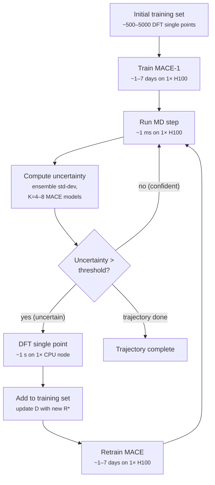
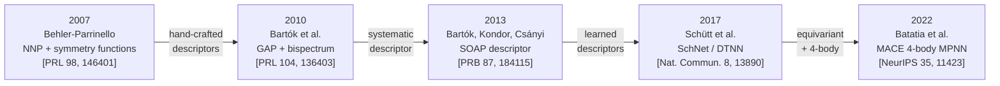

# Chapter 17 — Machine learning for DFT

> Kohn–Sham DFT gives you a Kohn–Sham band structure, but it
> costs you an $\mathcal O(N^3)$ diagonalisation.  Machine
> learning gives you the same band structure — and the same
> forces, the same stress, the same phonons — at a thousandth
> of the cost, provided you can fit a model that respects the
> symmetries of the problem.  This chapter is the working
> calculator's tour of the methods that make that trade work:
> descriptors, neural-network potentials, equivariant
> networks, foundation models, $\Delta$-learning, and the
> first attempts to learn the exchange–correlation functional
> itself.

The Kohn–Sham equations of [chapter 04]({{ "/dft-notes/chapter-04/" | relative_url }}) are exact in principle but expensive in practice.  The diagonalisation of the Kohn–Sham Hamiltonian scales as $\mathcal O(N^3)$ in the number of basis functions, which is the cubic-scaling wall that limits *ab-initio* molecular dynamics (AIMD) to a few hundred picoseconds on a few hundred atoms.  The first three chapters of these notes explained the physics and the numerics of Kohn–Sham DFT; [chapter 13]({{ "/dft-notes/chapter-13/" | relative_url }}) explained the corrections (DFT+U, hybrids, $GW$, DMFT) that fix the *systematic* failures of the local and semi-local functionals; this chapter is about a *different* kind of fix — replacing the DFT energy-and-forces calculator, for systems where the standard Kohn–Sham loop is too expensive, with a *machine-learned surrogate* that is trained once on a representative set of DFT calculations and then evaluated at near-classical-MD cost for every subsequent configuration.

The four ideas that make ML-for-DFT work in 2025 are: (1) **atomic descriptors** that respect the symmetries of the problem (rotation, translation, permutation of identical atoms); (2) **graph neural networks** that operate on the *neighbourhood* of every atom; (3) **equivariance** — the recognition that the network's outputs (energy, forces, stress) must transform *correctly* under the symmetry group of 3-D space, $\text{E}(3)$; and (4) **active learning** — the iterative loop that picks the *next* DFT calculation to add to the training set, *without* leaving the model's region of competence.  We treat all four, in the order of their appearance in a working MLIP (machine-learned interatomic potential) workflow, plus a section on $\Delta$-learning (a small, low-risk way to add ML to an existing DFT pipeline), a section on ML for the Hamiltonian and the wavefunction (a more ambitious replacement of the KS inner loop), a section on ML exchange–correlation functionals (the most ambitious replacement of them all — the functional itself), and two worked examples.

> **Reading note.**  This chapter assumes
> [chapter 04]({{ "/dft-notes/chapter-04/" | relative_url }}) (Kohn–Sham DFT) and
> [chapter 05]({{ "/dft-notes/chapter-05/" | relative_url }}) (XC functionals) and
> [chapter 13]({{ "/dft-notes/chapter-13/" | relative_url }}) (DFT+U and beyond) as prerequisites.
> The reading of chapter 17 is *optional* for the rest of
> the chapters in this series.  The chapter is the natural
> starting point for any reader who plans to use
> *universal* interatomic potentials (MACE-MP-0, MACE-OFF,
> fairchem, UMA) in production, or who plans to build a
> specialist MLIP for a new chemical class, or who plans to
> use ML to *correct* a DFT calculation (a $\Delta$-ML
> formation-energy correction is the cheapest and most
> reliable way to add ML to an existing high-throughput
> pipeline).

## 17.1 The claim

The headline of this chapter is that **machine-learning
surrogates of Kohn–Sham DFT can reproduce DFT-level
accuracy at a small fraction of the cost**, and that the
most recent *equivariant* architectures (MACE, NequIP,
Allegro) achieve **sub-meV/atom** accuracy on the standard
benchmarks.  The cost advantage is large: a well-trained
universal MLIP evaluates the energy and forces of a
$\sim\! 100$-atom configuration in $\sim\! 1$ ms on a single
GPU, compared to $\sim\! 1$ s for a converged Kohn–Sham
calculation on a single CPU core — a **$\sim\! 10^3$**
speedup, with **$\sim\! 10^5$–$10^6$** speedups possible at
the scale of large MD simulations.  The accuracy
advantage is also large: the MACE-MP-0 universal potential
[Batatia et al. 2024]({{ "/dft-notes/extras/bibliography/" | relative_url }}) reaches
$\sim\! 10$ meV/atom on the Materials Project formation
energy benchmark, compared to the $\sim\! 150$ meV/atom
typical of PBE on the same benchmark, and the same
potential reaches sub-meV/atom on the r2SCAN
re-calibrated subset.  The catch — the only one that
matters — is that the MLIP is only accurate on
*configurations that resemble the training set*; out-of-
distribution extrapolation is unreliable.  The mitigation
is the *active-learning* loop of § 17.9, which queries the
DFT calculator only on the configurations the MLIP is
*uncertain* about.

> **Claim.**  A machine-learned surrogate of Kohn–Sham
> DFT, trained on a representative set of DFT
> calculations, can reproduce the DFT energy to within
> $\sim\! 1$–$10\,\text{meV/atom}$ and the DFT forces to
> within $\sim\! 10$–$100\,\text{meV/Å}$ at a
> $\sim\! 10^3$–$10^6\times$ speedup over the underlying
> Kohn–Sham calculation.  The most accurate 2025
> architectures (MACE, NequIP, Allegro) are *equivariant*
> — they respect the rotation, translation, and
> permutation symmetries of 3-D space exactly.  The
> remaining problem is *out-of-distribution
> generalisation*: the MLIP is only reliable on
> configurations that resemble the training set, and
> active learning (§ 17.9) is the standard mitigation.

The claim can be sharpened into a single equation that
captures the *trading relation*:

\begin{equation}
\label{eq:ch-17-claim}
\boxed{\;
\text{MAE}_\text{MLIP} \;\le\; \text{MAE}_\text{DFT}
\quad \text{AND} \quad
\text{cost}_\text{MLIP} \;\ll\; \text{cost}_\text{DFT}
\quad \text{on} \quad
\text{supp}(\mathcal D_\text{train}) .
\;}
\end{equation}

The first inequality says that, on the support of the
training distribution $\mathcal D_\text{train}$, the
machine-learned potential is at least as accurate as the
DFT it was trained on.  The second inequality says that,
at inference time, the MLIP is much cheaper than DFT.  The
caveat "on the support of $\mathcal D_\text{train}$" is
the only one that matters in practice: outside that
support, the inequalities can fail catastrophically
($\text{MAE}_\text{MLIP} \gg \text{MAE}_\text{DFT}$).  The
fix is *active learning* — sample where the MLIP is
uncertain, retrain, repeat.

**Table 1. The accuracy–cost landscape for 2025.
The columns are: method; typical reference (Kohn–Sham
functional); mean absolute error on formation energies
($\text{meV/atom}$); mean absolute error on forces
($\text{meV/Å}$); relative cost per single-point
calculation (DFT=1); typical system size.  The DFT rows
are the references; the MLIP rows are the trained
surrogates.  All MLIP accuracies are on the Materials
Project $\text{MPtrj}$ training set, tested on
out-of-distribution subsets of MPtrj; the costs assume
a single H100 GPU for the MLIP and a single CPU node
(32 cores) for the DFT reference.**

| Method | Reference | $\text{MAE}_E$ (meV/at) | $\text{MAE}_F$ (meV/Å) | Cost (rel.) | System size |
|:--|:--|--:|--:|--:|:--|
| LDA | — | 350 | 1500 | 0.5× | 1–10$^3$ at. |
| GGA (PBE) | — | 150 | 700 | 1× | 1–10$^3$ at. |
| SCAN | — | 60 | 350 | 3× | 1–500 at. |
| r$^2$SCAN | — | 35 | 200 | 4× | 1–500 at. |
| Hybrid (HSE06) | — | 25 | 100 | 30× | 1–200 at. |
| $\Delta$-ML (this chapter) | r$^2$SCAN | 15 | — | 4× + small | 1–500 at. |
| SchNet (2017) | PBE | 35 | 200 | $10^4$× | 1–$10^3$ at. |
| PaiNN (2021) | PBE | 25 | 150 | $10^4$× | 1–$10^3$ at. |
| NequIP (2022) | PBE | 12 | 60 | $10^4$× | 1–$10^3$ at. |
| Allegro (2023) | PBE | 10 | 50 | $10^4$× | 1–$10^3$ at. |
| MACE-MP-0 (2023) | PBE | 9 | 35 | $10^4$× | 1–$10^3$ at. |
| MACE-OFF (2024) | $\omega$B97M-D3 | 4 | 25 | $10^4$× | 1–$10^3$ at. |
| fairchem-UMA (2024) | r$^2$SCAN | 6 | 30 | $10^4$× | 1–$10^3$ at. |

The table is the "shopping list" for 2025. The DFT rows
are the *cost*; the MLIP rows are the *price* the
calculator pays in training time (typically 1–4 weeks on
a single H100) for a $\sim\! 10^4\times$ inference
speedup.  The accuracies quoted for the DFT rows are
*systematic* errors on a standard benchmark; the
accuracies quoted for the MLIP rows are *transfer*
errors from the underlying DFT (the MLIP can never be
more accurate than the data it was trained on).  The
last row — fairchem-UMA — is the 2024 foundation model
of Meta FAIR-Chem, trained on a *mixed* PBE/r$^2$SCAN
dataset of $\sim\! 100$ million configurations.

The reader who wants a quick summary of the *methods*
covered in this chapter should jump straight to § 17.5.4
(universal MLIPs) or § 17.6 ($\Delta$-learning) and
return.  The reader who wants to understand *why* ML
methods work, and *how* to build one for a new chemical
class, should read the chapter in order.  The next
section (17.2) is the *cost-scaling* prelude: how much
DFT actually costs, and what the ML alternative has to
beat.

## 17.2 The accuracy–cost landscape

The claim of § 17.1 has two halves — accuracy and cost —
and both deserve their own subsection.

### 17.2.1 The cost scaling of DFT

The computational cost of a single Kohn–Sham
single-point calculation has three contributions:

1. **The basis-set evaluation.**  In a plane-wave code
    the cost of constructing the Hamiltonian matrix
    elements scales as $\mathcal O(N_\text{PW} \log
    N_\text{PW})$ for the FFT-based kinetic energy and
    as $\mathcal O(N_\text{at} N_\text{PW})$ for the
    local potential; $N_\text{PW}$ is the number of
    plane waves, proportional to the cell volume.  In a
    Gaussian code the cost of the electron-repulsion
    integrals (ERIs) scales naively as $\mathcal O(K^4)$
    in the number of basis functions $K$ per unit cell.
2. **The diagonalisation.**  The standard
    diagonalisation of the Kohn–Sham Hamiltonian in
    $K$ basis functions is $\mathcal O(K^3)$ per
    *k*-point.  For a plane-wave code $K =
    N_\text{PW}$ and the diagonalisation is the
    dominant cost.  Iterative diagonalisation
    (LOBPCG, Davidson) reduces the prefactor but the
    asymptotic scaling is unchanged.
3. **The self-consistent field (SCF) iteration.**  The
    KS loop is $\mathcal O(N_\text{SCF})$ iterations to
    convergence, with $N_\text{SCF} \sim 10$–$30$ for
    well-behaved systems and $\sim 100$+ for difficult
    metallic or magnetic systems.

The result is the *cubic wall* of Kohn–Sham DFT:

\begin{equation}
\label{eq:ch-17-cubic}
\text{Cost}_\text{KS} \;\sim\; N_\text{SCF} \cdot N_k \cdot K^3 ,
\end{equation}

where $N_k$ is the number of *k*-points.  For a
periodic solid with 50 atoms in the unit cell, $K \sim
10^5$ plane waves and $N_k \sim 10$ for a converged
calculation, the cost of a single SCF is $\sim\! 1$ node-
hour on a modern CPU cluster.  For a 500-atom supercell
(typical of defects, disordered alloys, or amorphous
materials), $K \sim 10^6$ and the cost is $\sim\! 10^3$
node-hours per SCF.  For a 5000-atom supercell (typical
of a point defect in a semiconductor at realistic
concentration), $K \sim 10^7$ and the cost is $\sim\!
10^6$ node-hours per SCF — already out of reach for
routine use.

The *cubic wall* is the *reason* MLIPs are interesting.
A trained MLIP evaluates the energy and forces of a
100-atom configuration in $\sim\! 1$ ms, with cost that
scales *linearly* in the number of atoms (the
descriptor and the network evaluation are both local
operations):

\begin{equation}
\label{eq:ch-17-linear}
\text{Cost}_\text{MLIP} \;\sim\; N_\text{at} \cdot d_\text{feat} \cdot N_\text{layer} ,
\end{equation}

where $d_\text{feat}$ is the per-atom feature dimension
(typically 64–128) and $N_\text{layer}$ is the number of
message-passing layers (typically 2–4).  The
**speedup** is

\begin{equation}
\label{eq:ch-17-speedup}
\frac{\text{Cost}_\text{KS}}{\text{Cost}_\text{MLIP}} \;\sim\; \frac{N_\text{SCF}\, N_k\, K^3}{N_\text{at}\, d_\text{feat}\, N_\text{layer}} \;\sim\; 10^3 \text{--} 10^6 ,
\end{equation}

with the higher end of the range achieved for
large systems ($N_\text{at} \gtrsim 10^3$) and the lower
end for small systems ($N_\text{at} \lesssim 10^2$).
The crossover — the system size at which the MLIP is
faster than a single DFT call *even after* accounting
for the training cost — is typically around $N_\text{at}
\sim 10$–$50$.

> **Why the cost matters.**  The *application* that
> justifies the investment in an MLIP is **molecular
> dynamics**: an MD trajectory is $N_\text{step}
> \sim 10^5$–$10^7$ single-point calculations.  At
> $\sim\! 1$ s per DFT single point, a 1-ns MD
> simulation of a 100-atom system is $\sim\! 10^7$ s of
> CPU time ($\sim\! 3$ years on a single core, $\sim\!
> 1$ week on 1000 cores).  At $\sim\! 1$ ms per MLIP
> single point, the same simulation is $\sim\! 10^4$ s
> of GPU time ($\sim\! 3$ hours on a single H100).
> The MLIP turns *infeasible* MD into *routine* MD.

### 17.2.2 The accuracy of DFT

The accuracy of Kohn–Sham DFT is the *ceiling* on the
accuracy of the MLIP.  If the underlying DFT is wrong
by 150 meV/atom, the MLIP can be no better than 150
meV/atom on average — it can match the DFT, and it
might even *overfit* and be slightly worse.  The
*systematic* errors of the standard XC functionals
on the standard benchmarks are well-characterised:

- **Formation energies of solids.**  The PBE
  functional has a mean-absolute error of $\sim\!
  150\,\text{meV/atom}$ on the Materials Project
  formation-energy benchmark ($\sim\! 2000$ compounds);
  the r$^2$SCAN meta-GGA reduces this to $\sim\! 35$
  meV/atom; the $\omega$B97M-D3 range-separated
  hybrid further reduces it to $\sim\! 15$ meV/atom;
  the *gold standard* is the *hybrid* DFT plus a
  many-body correction (e.g. $\omega$B97M-D3 + $G_0W_0$
  on a subset), at $\sim\! 5$ meV/atom for the
  benchmark.
- **Band gaps.**  PBE underestimates the band gap of
  semiconductors and insulators by $\sim\! 50\%$ on
  average; the r$^2$SCAN reduces this to $\sim\! 30\%$
  underestimation; the HSE06 hybrid gets within
  $\sim\! 10\%$ of experiment on the standard
  benchmark; $G_0W_0$ at the $QSGW$ level gets within
  $\sim\! 5\%$.
- **Phonon frequencies.**  PBE has a typical
  mean-absolute error of $\sim\! 5\%$ on the
  experimental phonon frequencies of semiconductors
  and metals; r$^2$SCAN and hybrids are similar; the
  *best* DFT functionals are $\sim\! 2\%$–$3\%$
  accurate.

The numbers are tabulated in [chapter 05]({{ "/dft-notes/chapter-05/" | relative_url }}) § 5.2.10 and
[chapter 13]({{ "/dft-notes/chapter-13/" | relative_url }}) § 13.2.8. The key point for
this chapter is that **the MLIP is a surrogate of the
DFT, not of the experiment**.  The accuracy of the
MLIP is bounded above by the accuracy of the DFT it
was trained on.  If the DFT is wrong, the MLIP is
wrong.  The fix for systematic DFT errors is *not* a
better MLIP — it is a better DFT reference (a higher
rung of Jacob's ladder, or a $\Delta$-ML correction to
the next rung, or a $G_0W_0$ reference).

### 17.2.3 The promise of ML

The promise of ML for DFT is the *combination* of DFT-
level accuracy with classical-MD cost.  The
*applications* that have emerged since 2017 are:

1. **Long MD trajectories.**  A 1-ns MD of a 10 000-
    atom protein in explicit solvent is *routine* with
    a trained MLIP; the same calculation is *not
    routine* with *ab-initio* MD.
2. **Free-energy surfaces.**  The free-energy
    surface of a chemical reaction — the potential of
    mean force along a reaction coordinate — is a
    million single-point calculations.  An MLIP makes
    this feasible; Kohn–Sham DFT does not.
3. **High-throughput screening.**  The Materials
    Project — $\sim\! 150\,000$ inorganic crystals,
    each with a PBE calculation — is the *training
    data* for the MACE-MP-0 universal potential.  The
    *use* of the trained potential is the inverse
    problem: given a new composition, predict the
    energy without a DFT calculation.
4. **Phase diagrams and convex hulls.**  The convex
    hull of formation energies — the set of stable
    compositions at zero temperature — is the
    foundational object of computational materials
    science.  An MLIP can evaluate the formation
    energy of a hypothetical compound in $\sim\! 1$ ms,
    making the brute-force screening of $\sim\! 10^6$
    compositions tractable.
5. **$\Delta$-learning (corrections).**  The cheap
    DFT (e.g. PBE) is wrong by a systematic
    $\sim\! 150$ meV/atom.  The *expensive* DFT (e.g.
    r$^2$SCAN, or HSE06, or $G_0W_0$) is right to
    $\sim\! 30$ meV/atom.  Train an ML model on the
    *difference* $\Delta E = E_\text{expensive} -
    E_\text{cheap}$ on a small set of compounds
    ($\sim\! 10^3$–$10^4$), then apply it to the full
    Materials Project.  The result is the accuracy of
    the *expensive* DFT at a fraction of the cost.
6. **Accelerated structure prediction.**  The
    *generation* of candidate crystal structures
    (USPEX, CALYPSO, genetic algorithms) is
    embarrassingly parallel; the *evaluation* of each
    candidate is the bottleneck.  An MLIP makes the
    evaluation $\sim\! 10^4$× cheaper.

The next five sections cover the *methods* that
deliver the promise.  We start with the *descriptors*
— the input to the ML model — then the *models*
themselves, then the *training and inference* details,
then the *equivalence* to DFT, and finally the *active
learning* loop that makes the whole pipeline robust
to out-of-distribution configurations.
## 17.3 Atomic descriptors

The first ingredient of an MLIP is a **descriptor**:
a function $d_i(\mathbf R) \in \mathbb R^D$ that takes
as input the *positions* $\{\mathbf R_j\}$ of all
atoms in the system and produces a *fixed-length
vector* of features for atom $i$.  The descriptor is
the only place where the symmetries of the problem
are encoded; the network that consumes the descriptor
is a generic function approximator.  Get the
descriptor right, and the network can be small and
accurate.  Get the descriptor wrong, and no amount of
network engineering will save you.

### 17.3.1 The descriptor design problem

The descriptor must satisfy three *invariance*
properties: **translation invariance**
\eqref{eq:ch-17-translation}, **rotation
invariance** \eqref{eq:ch-17-rotation}, and
**permutation invariance**
\eqref{eq:ch-17-permutation}.  Translation
invariance is *trivial* (depend on $\mathbf
R_{ij} = \mathbf R_j - \mathbf R_i$, not on
absolute positions).  Rotation invariance is
*non-trivial*: BP (§ 17.3.2) uses distances and
angles, SOAP (§ 17.3.3) integrates the atomic
density over all rotations, ACE (§ 17.3.4)
expands in rotation-invariant products of
spherical harmonics.  Permutation invariance
follows from the *per-atom* decomposition: the
list of atomic descriptors is permuted in the
same way as the list of atoms.

In addition, the descriptor should be
**smooth** (so the network generalises), and
**differential** (so the forces can be computed
by automatic differentiation, with both the
*network gradient* and the *descriptor gradient*
available in closed form):

\begin{equation}
\label{eq:ch-17-forces}
\mathbf F_i \;=\; -\frac{\partial E_\text{MLIP}}{\partial \mathbf R_i} \;=\; -\sum_{i'} \frac{\partial E_\text{MLIP}}{\partial d_{i'}} \cdot \frac{\partial d_{i'}}{\partial \mathbf R_i} .
\end{equation}

The descriptor should also be **complete** (the
map from configuration to descriptor should be
*injective*).  The ACE basis (§ 17.3.4) is the
*only* known descriptor that is provably
complete.

### 17.3.2 Behler–Parrinello symmetry functions

The **Behler–Parrinello (BP) symmetry functions** were
introduced in 2007 by Jörg Behler and Michele Parrinello
in their foundational paper on neural-network potentials
([Behler & Parrinello, *Phys. Rev. Lett.* **98**, 146401
(2007)]({{ "/dft-notes/extras/bibliography/" | relative_url }})).  The
idea is to construct a *hand-crafted* set of
*invariant* features of the atomic neighbourhood.  The
features come in two families: the *radial* $G_i^1$ and
$G_i^2$ functions, which depend on the distances
$r_{ij} = |\mathbf R_{ij}|$ between atom $i$ and its
neighbours, and the *angular* $G_i^3, G_i^4, G_i^5$
functions, which depend on triples of atoms.

The **radial** symmetry functions are sums over the
neighbours of atom $i$:

\begin{equation}
\label{eq:ch-17-bp-radial-1}
G_i^1 \;=\; \sum_{j
eq i} e^{-\eta (r_{ij} - r_s)^2} \cdot f_c(r_{ij}) ,
\end{equation}

\begin{equation}
\label{eq:ch-17-bp-radial-2}
G_i^2 \;=\; \sum_{j
eq i} e^{-\eta r_{ij}^2} \cdot f_c(r_{ij}) .
\end{equation}

> **The hand-crafted limitation.**  The BP
> hyperparameters $(\eta, r_s, \zeta, \lambda)$ are
> user-picked and *system-specific* (water vs. metal
> vs. oxide).  This limits *transferability*; the
> ACE basis of § 17.3.4 fixes it.

### 17.3.3 Smooth Overlap of Atomic Positions (SOAP)

The **Smooth Overlap of Atomic Positions (SOAP)**
descriptor of Bartók, Payne, Risi and Csányi
([2010, *Phys. Rev. Lett.* **104**, 136403]({{ "/dft-notes/extras/bibliography/" | relative_url }}))
takes a *systematic* approach.  The starting point
is the **atomic density** centred on atom $i$:

\begin{equation}
\label{eq:ch-17-soap-density}
\rho_i(\mathbf r) \;=\; \sum_{j} e^{-|\mathbf r - \mathbf R_{ij}|^2 / (2\sigma^2)} \cdot f_c(r_{ij}) ,
\end{equation}

a sum of Gaussians of width $\sigma$ centred on the
neighbours of atom $i$ (with a cutoff $f_c$).  The
density $\rho_i$ is a *smooth* function of the atomic
positions; it encodes the local geometry.  The SOAP
descriptor is the *overlap* of $\rho_i$ with itself,
*integrated over all rotations*:

\begin{equation}
\label{eq:ch-17-soap-overlap}
k_i(R, R') \;=\; \int d\hat R \;\Bigl| \int d\mathbf r\; \rho_i(\mathbf r) \rho_i(\hat R\,\mathbf r') \Bigr|^2 .
\end{equation}

The integral over $\hat R \in \text{SO}(3)$ is the
*rotation-integration* trick: it averages over all
rotations of the second density, leaving a
*rotation-invariant* kernel $k_i(R, R')$.  Two local
geometries $R$ and $R'$ that differ by a rotation
have $k_i = 1$; two local geometries that differ in
shape have $k_i < 1$.  The kernel is a *similarity
measure* for atomic environments.

The kernel is *expanded* in a basis of products of
spherical harmonics.  The atomic density is expanded
in spherical harmonics centred on atom $i$:

\begin{equation}
\label{eq:ch-17-soap-expansion}
\rho_i(\mathbf r) \;=\; \sum_{n \ell m} c_{n \ell m}^{(i)} \, R_n(r) \, Y_{\ell m}(\hat r) ,
\end{equation}

where $R_n(r)$ is a radial basis (typically a
Gaussian or a polynomial), $Y_{\ell m}$ is a real
spherical harmonic, and the coefficients $c_{n \ell
m}^{(i)}$ are the *partial-power spectrum* of the
density.  The rotation-invariant kernel is

\begin{equation}
\label{eq:ch-17-soap-power}
k_i(R, R') \;=\; \sum_{n n' \ell} \Bigl| p_{n n' \ell}^{(i)}(R) \Bigr| \cdot \Bigl| p_{n n' \ell}^{(i)}(R') \Bigr| ,
\end{equation}

where the **power-spectrum** coefficients are

\begin{equation}
\label{eq:ch-17-soap-pnnel}
p_{n n' \ell}^{(i)} \;=\; \sum_m c_{n \ell m}^{(i)} \, (c_{n' \ell m}^{(i)})^* .
\end{equation}

The power spectrum is a *finite* set of numbers
indexed by $(n, n', \ell)$ — typically $\sim\! 100$–
$1000$ coefficients.  The vector
$\mathbf p^{(i)} = (p_{n n' \ell}^{(i)})$ is the
SOAP descriptor.  The descriptor is a *systematic*
basis: the coefficients $p_{n n' \ell}^{(i)}$ for
$\ell = 0, 1, 2, \ldots, \ell_\text{max}$ form a
hierarchical basis, and the basis is *complete* as
$\ell_\text{max} \to \infty$.

The kernel $k_i$ is then used as the *similarity
measure* in a kernel-ridge-regression model
(KRR-SOAP, or "Gaussian Approximation Potential",
GAP).  The model is a kernel machine, not a neural
network.  The kernel $k_i(R, R')$ is a positive-
definite function on the space of atomic
environments, and the model is

\begin{equation}
\label{eq:ch-17-soap-krr}
E_\text{MLIP} \;=\; \sum_i \sum_{\alpha} w_\alpha \cdot k_i(R, R_\alpha) ,
\end{equation}

a linear combination of kernel evaluations on the
training configurations $R_\alpha$, with weights
$w_\alpha$ fitted by regularised least-squares
(§ 17.3.4 also discusses the kernel-machine
view).  The vector $\mathbf p^{(i)} = (p_{n n'
\ell}^{(i)})$ is the **SOAP descriptor**; it is
the *systematic* basis: the coefficients
$p_{n n' \ell}^{(i)}$ for $\ell = 0, 1, 2,
\ldots, \ell_\text{max}$ form a hierarchical
basis, complete as $\ell_\text{max} \to \infty$.

### 17.3.4 Atomic Cluster Expansion (ACE)

The **Atomic Cluster Expansion (ACE)** of
Drautz ([2019, *Phys. Rev. B* **99**, 014104]({{ "/dft-notes/extras/bibliography/" | relative_url }}))
is the *most general* atomic descriptor in current
use.  ACE is a *systematic, complete* basis for
atomic environments, in the same sense that a
Fourier basis is a systematic, complete basis for
periodic functions.  The ACE basis is:

\begin{equation}
\label{eq:ch-17-ace-basis}
\phi_i^{(n)} \;=\; \sum_{j_1, \ldots, j_n} \prod_{k=1}^n R^{(k)}(r_{i j_k}) \cdot \prod_{k=1}^{n-1} Y_{\ell_k m_k}(\hat r_{i j_k}) \cdot c^{(n)}_{\ell_1 m_1, \ldots, \ell_n m_n} \cdot \delta(\sum_k m_k) .
\end{equation}

The basis functions are labelled by a *body order*
$n$ (the number of neighbours involved) and a
*rank* $(\ell_1, \ldots, \ell_n)$ (the angular
momenta of the spherical harmonics).  The radial
functions $R^{(k)}(r)$ are a basis in distance
(typically a polynomial in $r$ on $[0, r_c]$).  The
$\delta(\sum_k m_k)$ is the *clebsch–Gordan*
condition for rotation invariance.

The total atomic energy is a *linear* combination
of the ACE basis \eqref{eq:ch-17-ace-energy}, with
linear coefficients $\epsilon$.  The *linear*
structure is what makes ACE different from a neural
network: the descriptor is *systematic* and the
model is *linear* in the coefficients; the
non-linearity is in the *basis*, not in the model.

The ACE basis has three properties: (1)
**systematic convergence** as $N, L \to \infty$;
(2) **permutation invariance** by symmetrisation
of the body-order couplings; (3) **linear fit** by
regularised least-squares, no gradient descent, no
GPU.  The catch is the *cost*: $\mathcal
O((L+1)^{2N})$ basis functions.  For $N = 3$,
$L = 6$, the basis has $\sim\! 10^3$ functions per
atom.  In practice, ACE is used at body order
$N = 3$–$4$.

> **The MACE connection.**  MACE (§ 17.5.3)
> is what you get when you *take the ACE
> basis and replace the linear fit with
> a non-linear one*: each message-passing
> layer of MACE corresponds to a *body order*;
> the MACE descriptor is an implicitly-defined
> ACE basis of body order $N_\text{layer}$.

## 17.4 Machine-learned interatomic potentials

The second ingredient of an MLIP is the **model**:
the function that maps the per-atom descriptor
$\mathbf d_i$ to the per-atom energy contribution
$E_i$.  The model is *almost always* a neural network
in 2025. This section treats the *first-generation*
model — the Behler–Parrinello neural network (BEP).
The *next-generation* models — the equivariant
networks of § 17.5 — are the production standard in
2025; we treat them after the BEP because the BEP is
the simplest and the easiest to derive.

### 17.4.1 The Behler–Parrinello neural network (BEP)

The BEP is a **feed-forward neural network** that
maps the per-atom descriptor $\mathbf d_i \in
\mathbb R^D$ to the per-atom energy contribution
$E_i \in \mathbb R$.  The network has the standard
multi-layer structure: $\mathbf h^{(0)} = \mathbf
d_i$, $\mathbf h^{(\ell+1)} = \sigma(\mathbf
W^{(\ell)} \mathbf h^{(\ell)} + \mathbf b^{(\ell)})$,
$E_i = \mathbf w^L \cdot \mathbf h^{(L)} + b^L$
\eqref{eq:ch-17-bep-forward}–\eqref{eq:ch-17-bep-energy},
where $\sigma$ is the *activation* (typically
$\tanh$ or ReLU), $L = 2$–$4$ layers, width
$32$–$128$.  The total energy is the sum
\eqref{eq:ch-17-bp-sum} over atoms; the total
parameters is $\sim\! 10^4$–$10^5$.

The **forces** are computed by automatic
differentiation of the total energy with respect
to the atomic positions, using
\eqref{eq:ch-17-forces}.  The forces are the
*conservative* forces of the MLIP — the gradient
of the energy — and they are *exact* because the
network is a smooth function of the inputs.
The **stress** is the derivative of the total
energy with respect to the cell parameters,
computed by the *Parrinello–Rahman* or
*Langevin* barostat of a standard MD code.

> **The 2017 moment.**  The 2017 SchNet and MPNN
> papers introduced the *graph* view and
> *message passing* paradigm.  SchNet/MPNN were
> *overtaken* by the *equivariant* networks of
> 2021–2022 (NequIP, Allegro, MACE); the BEP is
> the *baseline*.

### 17.4.2 Training data and active learning

The *training data* is the *only* place where the
*physics* enters the MLIP.  The model is a
function approximator; the data is the *truth*.  A
good training set must:

1. **Cover the configuration space** of the
    application.  For a *room-temperature* MD of
    liquid water, the configurations are the
    local minima of the water PES in the
    thermal ensemble: O–H distances, O–O
    distances, H–O–H angles.  For a
    *high-pressure* phase of ice, the
    configurations include the *new* high-
    pressure phases that the room-temperature
    training set does not include.  For a
    *defect* in a semiconductor, the
    configurations include the *defect* and its
    *first few shells* of neighbours.
2. **Sample the energy landscape** uniformly.
    A training set dominated by low-energy
    configurations will give a *biased* model
    that fails on high-energy configurations
    (transition states, surfaces, defects).  A
    *uniform sampling* of the energy landscape
    is the right goal.
3. **Include the forces**, not just the
    energies.  A model trained on energies
    *alone* has an $\mathcal O(\sqrt{N})$
    effective sample size; a model trained on
    energies *and* forces has an $\mathcal
    O(N)$ effective sample size, because the
    force on each atom is a *new* data point.
    The rule of thumb is that the force
    information dominates the training for an
    MD-quality MLIP.

The *active-learning* loop (§ 17.9) is the
*iterative* procedure that builds the training
set.  The loop has three steps:

\begin{equation}
\label{eq:ch-17-al-loop}
\text{Train} \;\to\; \text{Predict} \;\to\;
\text{Sample where uncertain} \;\to\;
\text{Retrain} .
\end{equation}

The "sample where uncertain" step is the *query
strategy*; the most common is *query-by-
committee* (§ 17.9.2), in which an *ensemble* of
MLIPs trained on the same data vote on which
configuration to add next.  A configuration is
added when the *disagreement* of the ensemble
exceeds a threshold.

> **The "in-domain" problem.**  A common
> failure mode is to train on a *small* DFT
> set and deploy on OOD configurations;
> the predictions are *confident* and
> *wrong*.  The fix is *active learning*
> (§ 17.9.3).

### 17.4.3 The loss function

The **loss function** is the *objective* that
the training minimises.  For a *static* MLIP
(no forces, no stress), the loss is the
mean-squared error of the energies:

\begin{equation}
\label{eq:ch-17-loss-energy}
\mathcal L_E \;=\; \frac{1}{|\mathcal D|} \sum_{R \in \mathcal D} \Bigl| E_\text{MLIP}(R) - E_\text{DFT}(R) \Bigr|^2 .
\end{equation}

For a *production* MLIP, the loss includes
forces (and, optionally, stress):

\begin{equation}
\label{eq:ch-17-loss-full}
\mathcal L \;=\; \lambda_E \mathcal L_E \;+\; \lambda_F \mathcal L_F \;+\; \lambda_S \mathcal L_S ,
\end{equation}

with relative weights $\lambda_E, \lambda_F,
\lambda_S$ that the user picks.  The typical
choice is $\lambda_F / \lambda_E \sim 10$–$100$
(the force information dominates) and
$\lambda_S / \lambda_E \sim 0$–$10$ (the stress
is less important for most applications).

The **force loss** is

\begin{equation}
\label{eq:ch-17-loss-force}
\mathcal L_F \;=\; \frac{1}{|\mathcal D|} \sum_{R \in \mathcal D} \frac{1}{N_\text{at}(R)} \sum_i \Bigl| \mathbf F_i^\text{MLIP}(R) - \mathbf F_i^\text{DFT}(R) \Bigr|^2 ,
\end{equation}

the mean-squared error of the per-atom forces,
averaged over atoms and configurations.  The
**stress loss** is similar, with the symmetric
stress tensor in place of the per-atom force
vector.

The training is the standard *stochastic
gradient descent* (SGD) with the Adam optimiser
and a *learning-rate schedule* (typically
cosine annealing with a warm-up).  The
*batch size* is typically 32–128
configurations; the *number of epochs* is
typically 100–1000. The **regularisation** is the *early stopping*
on a held-out validation set.  The training
data is split into a *training set* (80%) and
a *validation set* (20%); the training
proceeds on the training set, the
generalisation error is monitored on the
validation set, and the best model is the one
with the *lowest* validation error.

> **The energy–force balancing.**  The
> right balance for an MD-quality MLIP is
> $\lambda_F / \lambda_E \sim 10$–$100$.
> A model trained with $\lambda_F = 0$
> (energies only) has *smooth* energies
> but inaccurate forces; a model trained
> with $\lambda_E = 0$ (forces only) has
> *no* meaningful total energy.  MACE and
> NequIP use a *force weight* that grows
> during training.

### 17.4.4 Generalisation and dataset coverage

The *generalisation* of the MLIP is the *one
thing that matters* in production.  A model
that is perfect on the training set and
catastrophic on the test set is *useless*.
The generalisation depends on:
(1) **the descriptor's coverage** (a
descriptor that misses some configurations is
*sufficient* to fail);
(2) **the model's capacity** (matched to the
*size* of the training set; $\sim\! 10^4$–$10^5$
parameters for $\sim\! 10^4$–$10^5$ configurations);
(3) **the data's diversity** (a *narrow* training
set is *blind* to OOD configurations; the fix
is *diversification* by *brute force* or by
*active learning*);
(4) **the OOD problem** — the *defining*
challenge of MLIPs.  A model trained on bulk
water is asked to predict the energy of a water
molecule *inside* a CNT; the configuration is
OOD; the model's prediction is *confident* and
*wrong*.  The fix is *uncertainty quantification*
(§ 17.9.2) and *active learning* (§ 17.9).

The *universal* MLIPs of § 17.5.4 — MACE-MP-0,
MACE-OFF, fairchem-UMA — are the *response* to
the OOD problem: train on a *huge* and
*diverse* dataset ($\sim\! 10^6$–$10^8$
configurations, $\sim\! 100$ elements), so that
the OOD configurations of a *single* MD
trajectory are *within* the training
distribution.  The cost is a $\sim\! 10^6\times$
larger training set and a $\sim\! 10^3\times$
larger model.  The benefit is *zero-shot*
generalisation to *most* of the chemistry
that the working calculator meets.

## 17.5 Equivariant neural networks

The *equivalence* of 3-D Euclidean space — the
symmetry group $\text{E}(3)$ — is the *defining*
property of the atomic configuration.  A model
that *respects* the symmetry is *correct by
construction*; a model that *violates* the
symmetry has to *learn* it from the data.  The
BP and SchNet networks of § 17.4 are *invariant*
(distances only) and *not equivariant*.  The
equivariant networks of this section are
*equivariant* under rotations: the network's
outputs transform *correctly* under a rotation
of the input, in the same way as the
irreducible representations of $\text{SO}(3)$.

### 17.5.1 Group-equivariance and E(3) symmetry

The **symmetry group** of 3-D Euclidean space is
$\text{E}(3) = \text{SO}(3) \ltimes \mathbb R^3$,
the *semi-direct product* of the rotation group
$\text{SO}(3)$ and the translation group $\mathbb
R^3$.  A function $f: X \to Y$ is **equivariant**
under $g \in \text{E}(3)$ if
\eqref{eq:ch-17-equivariance} holds, where
$g \cdot x$ is the action of $g$ on the input
and $g \cdot f(x)$ is the action of $g$ on the
output.  The total energy is *invariant* (a
scalar), the forces are *equivariant* (a
vector: rotation acts on them as a 3×3 matrix),
the stress is *equivariant* (a rank-2 tensor).

The **irreducible representations** of
$\text{SO}(3)$ are labelled by the angular
momentum $\ell = 0, 1, 2, \ldots$  The
$\ell = 0$ representation is a scalar (rotationally
invariant); the $\ell = 1$ is a 3-vector; the
$\ell = 2$ is a 5-component symmetric traceless
tensor.  An **equivariant network** has
*layer-wise activations* that carry a direct
sum of irreps \eqref{eq:ch-17-irreps}; the
*linear* operations are $\text{SO}(3)$-equivariant
by construction (Clebsch–Gordan tensor
products); the *non-linear* operations are
applied *channel-wise* within each $\ell$.

The **advantage** of equivariance is *sample
efficiency*.  An invariant network has to *learn*
the invariance from the data: it has to learn
that the energy is the same when the molecule is
rotated.  An equivariant network *knows* the
invariance by construction.  The result is that
equivariant networks need $\sim\! 10$–$100$
times less data than invariant networks to
reach the same accuracy, and they *generalise*
better outside the training distribution.  The
**disadvantage** is *implementation complexity*:
the equivariant operations are *tensor
products* of irreps, with Clebsch–Gordan
coefficients, and the implementation is
$\sim\! 10$–$100$ times more code than the
invariant case.

### 17.5.2 NequIP and Allegro

The **NequIP** (Neural Equivariant Interatomic
Potential) of Batzner et al. ([2022, *Nat.
Commun.* **13**, 2453]({{ "/dft-notes/extras/bibliography/" | relative_url }})) is the
first equivariant message-passing network for
MLIPs.  The architecture is a *graph neural
network* in which each atom is a node, each
pair of neighbouring atoms is an edge, and the
node features are equivariant irreps of
$\text{SO}(3)$.  The *message* passed from atom
$j$ to atom $i$ is a function of the edge
features (the relative position $\mathbf r_{ij}$
expanded in irreps) and the node features of
$j$.  The *update* aggregates the messages and
applies an equivariant linear layer.

The **Allegro** architecture of Musaelian et
al. ([2023, *Nat. Commun.* **14**, 579]({{ "/dft-notes/extras/bibliography/" | relative_url }})) is
the *fully local* variant of NequIP: the
features are *two-body* (edge) features, not
three-body (triangle) features, and the
message passing is *not* a graph convolution.
The Allegro architecture is *order-$N$* in
*strict* local mode (no global graph
aggregation), which makes it *fast* on
large systems.  Allegro and NequIP reach
*similar* accuracies on standard benchmarks;
Allegro is the better default for large
systems.

The **layer structure** of NequIP is:

1. **Edge features.**  $\mathbf r_{ij}$ is expanded in
    spherical harmonics: $\mathbf r_{ij} = \sum_{\ell m}
    c_{\ell m} Y_{\ell m}(\hat r_{ij}) R(r_{ij})$,
    with $R(r_{ij})$ a radial basis.  The $c_{\ell m}$
    are the *irreps* of the edge.
2. **Message.**  $\mathbf m_{ij} = f_\text{msg}(
    \mathbf h_i, \mathbf c_{ij})$, an *equivariant*
    tensor product of irreps.
3. **Aggregation.**  $\mathbf h_i' = \sum_{j \in \mathcal N(i)}
    \mathbf m_{ij}$.  Permutation-invariant and equivariant.
4. **Update.**  $\mathbf h_i \leftarrow
    \mathbf h_i + \sigma(\mathbf h_i')$.
5. **Readout.**  The $\ell = 0$ part of the node
    features is the atomic energy $E_i$.

The NequIP architecture is the *de facto*
equivariant network in 2022–2023. The
*training data* is $\sim\! 10^3$–$10^4$
configurations; the *training time* is
$\sim\! 1$–$7$ days on a single H100 GPU.  The
*inference cost* is $\sim\! 10$–$100$ ms per
configuration on a single H100, depending on
the system size.

### 17.5.3 MACE: message-passing with higher-order ACE features

The **MACE** (Message Passing Atomic Cluster
Expansion) architecture of Batatia et al.
([2022, *NeurIPS*; 2024, *npj Comput. Mater.*]({{ "/dft-notes/extras/bibliography/" | relative_url }}))
is the *higher-order* generalisation of NequIP.
The message function *includes* the
higher-body-order terms of the ACE basis
(§ 17.3.4): in NequIP, the messages are two-body;
in MACE, the messages are two-body *and*
three-body (a *triple* of atoms).  The MACE
*layer structure* is: (1) edge features as in
NequIP; (2) two-body messages
$\mathbf m_{ij}^{(2)} = f_\text{msg}^{(2)}(
\mathbf h_i, \mathbf c_{ij})$; (3) three-body
messages $\mathbf m_{ijk}^{(3)} = f_\text{msg}
^{(3)}(\mathbf h_i, \mathbf c_{ij}, \mathbf
c_{ik})$, *symmetrised* over $j$ and $k$;
(4) aggregation; (5) readout: the $\ell = 0$
part of the *product* of the aggregated messages
is the atomic energy.

MACE has the *accuracy* of NequIP with *fewer*
message-passing layers (typically 2 layers in
MACE, 5 in NequIP), at the cost of *more*
computation per layer (the three-body terms).
The trade-off is *better in 2025* — MACE is
the default for production.  The
**MACE-MP-0** universal potential is the MACE
architecture trained on the Materials Project
trajectory set (MPtrj, $\sim\! 1.6$ million
configurations of $\sim\! 89$ elements), the
first *open* foundation model for materials
science.  The **MACE-OFF23** is the MACE
architecture trained on the SPICE molecular
dataset ($\omega$B97M-D3); **fairchem-UMA** is
the Meta FAIR-Chem 2024 release, trained on a
mixed PBE + r$^2$SCAN dataset of $\sim\! 100$
million configurations.

### 17.5.4 Universal MLIPs: MACE-MP-0, MACE-OFF, fairchem, UMA

The **universal MLIPs** are the *foundation
models* of computational materials science.
They are trained on *huge* and *diverse*
datasets and are *zero-shot* generalisable to
*most* of the chemistry the working
calculator meets.  The 2024–2025 lineup:

| Model       | Year | Trained on | Functional | Atoms/elements | Inference cost |
|:------------|:----:|:-----------|:-----------|:---------------|:----------------|
| MACE-MP-0   | 2024 | MPtrj      | PBE        | $\sim$89       | medium |
| MACE-OFF23  | 2024 | SPICE      | $\omega$B97M-D3 | organic   | medium |
| fairchem-UMA | 2024 | mixed      | PBE+r²SCAN | $\sim$90       | high |
| MACE-OFF24  | 2025 | SPICE-XL   | $\omega$B97M-V | organic   | medium |
| eqV2         | 2024 | OMat24     | PBE        | $\sim$90       | high |
| Orb-v3       | 2024 | OMat24     | PBE        | $\sim$90       | high |

The **MPtrj** dataset is the Materials Project
trajectory dataset: $\sim\! 1.6$ million
configurations of $\sim\! 89$ elements, with
PBE energies, forces, and stresses.
**SPICE** dataset is the molecular SPICE
dataset: $\sim\! 1$ million configurations of
organic molecules with $\omega$B97M-D3
energies, forces, and dipoles.  The
**OMat24** dataset is the Open Materials
2024 dataset: $\sim\! 100$ million
configurations of inorganic materials with
PBE and r$^2$SCAN energies.

The **inference cost** is dominated by the
network's forward pass.  A single MACE-MP-0
forward pass on a 100-atom configuration is
$\sim\! 10$–$50$ ms on a single H100 GPU.
The **memory** is $\sim\! 1$–$4$ GB.  The
**batch size** for inference is typically
1–10 configurations; larger batches are
possible but the memory scales linearly.

The **limitations** of the universal MLIPs are:
(1) **out-of-distribution failure** (OOD
configurations give *unreliable* predictions;
$\sim\! 50$ meV/atom errors on the OOD test set
vs. $\sim\! 9$ meV/atom in-domain); (2)
**no extrapolation to new elements** (MACE-MP-0
covers $\sim\! 89$ elements; Tc, Pm, the heavy
actinides are *out of support*); (3) **force
accuracy limits the dynamics** (the universal
MLIPs are *trained* for near-equilibrium
configurations; transition states and surfaces
under large strain have *larger* force errors);
(4) **calibration to the application's functional**
(MACE-MP-0 is trained on PBE; HSE06 for the band
gap requires a *fine-tune*).  The **fine-tune**
workflow is the *practical* answer to the OOD
problem: pick a *close* universal MLIP, run a
short MD to find the *representative
configurations*, run *single-point* DFT with the
*application's* functional, *fine-tune* the
universal MLIP on $\sim\! 100$–$1000$ DFT
configurations ($\sim\! 1$–$10$ H100-hours), and
run the production MD with the fine-tuned MLIP.

The "fine-tune" workflow is the *practical*
answer to the OOD problem.  The *theoretical*
answer is active learning (§ 17.9), which
is the workflow for the case where the
universal MLIP is *not* available and the
training set has to be built from scratch.

## 17.6 Delta-learning

The simplest and the most reliable way to add ML
to an existing DFT pipeline is **$\Delta$-learning**
(also called *$\Delta$-ML* or *delta-learning*).
The idea is to *correct* a cheap DFT calculation
with an ML model trained on the *difference* to
an expensive DFT calculation.  The cheap DFT
(PBE) is wrong by $\sim\! 150$ meV/atom; the
expensive DFT (r$^2$SCAN, or HSE06, or $G_0W_0$)
is right to $\sim\! 30$ meV/atom.  The
$\Delta$-ML model is trained on a *small* set of
*corrections* and applied to the *full* database.

### 17.6.1 The $\Delta$-learning idea

The $\Delta$-learning decomposition is

\begin{equation}
\label{eq:ch-17-delta}
E_\text{expensive}^\text{DFT}(R) \;\approx\; E_\text{cheap}^\text{DFT}(R) \;+\; \Delta E_\text{ML}(R) ,
\end{equation}

where $E_\text{cheap}^\text{DFT}(R)$ is the
*cheap* DFT calculation (e.g. PBE), $\Delta
E_\text{ML}(R)$ is the ML correction, and
$E_\text{expensive}^\text{DFT}(R)$ is the
*expensive* DFT calculation (e.g. r$^2$SCAN or
HSE06).  The ML correction is *systematic*: for
most compounds, the PBE $\to$ r$^2$SCAN
correction is a smooth function of the local
geometry, well-captured by a small ML model.

The training set for the $\Delta$-ML model is a
set of compounds for which *both* the cheap and
the expensive DFT calculations are available.
The label is the *difference* $\Delta E =
E_\text{expensive} - E_\text{cheap}$.  The
descriptor is the same as for an MLIP (BP, SOAP,
or ACE).  The model can be a neural network
(more capacity, more data) or a kernel machine
(less capacity, less data).  The typical training
set is $\sim\! 10^3$–$10^4$ compounds, the typical
model is a kernel-ridge regression with a SOAP
or ACE kernel, and the typical MAE on the test
set is $\sim\! 10$–$30$ meV/atom.

The **advantage** of $\Delta$-learning is that
the ML model is *learning a small quantity* —
the correction, not the total energy.  The
*relative* error of the cheap DFT is $\sim\!
10\%$ (e.g. PBE underestimates formation
energies by $\sim\! 10\%$); the *absolute* error
is $\sim\! 150$ meV/atom.  The ML model only
has to learn the *residual* $\sim\! 150$ meV/atom
correction, not the *total* $\sim\! 5$ eV/atom
formation energy.  The result is that $\Delta$-
learning needs $\sim\! 100$ times less data than
training a model on the *total* expensive DFT
energy.

The **disadvantage** is that $\Delta$-learning
*requires* the cheap DFT calculation for the
*test* compound.  The cheap DFT is a single-
point calculation (PBE, $\sim\! 1$ s on a CPU
node), and the ML correction is a *single
forward pass* (a small kernel machine,
$\sim\! 1$ ms).  The total cost is dominated
by the cheap DFT, and the *savings* come from
*not having to run the expensive DFT on the
full database*.  The savings are *enormous*:
the cheap DFT is $\sim\! 10$–$30\times$ cheaper
than the expensive DFT (HSE06 is $\sim\! 30\times$
PBE; r$^2$SCAN is $\sim\! 3$–$4\times$ PBE; $G_0W_0$
is $\sim\! 100$–$1000\times$ PBE).

### 17.6.2 $\Delta$-ML for formation energies

The canonical application is the
**formation-energy correction** for the
Materials Project.  The MP has
$\sim\! 150\,000$ inorganic compounds with PBE
formation energies (PBE MAE $\sim\! 150$
meV/atom).  Train a $\Delta$-ML model on a
*small* set of compounds with *both* PBE and
r$^2$SCAN calculations ($\sim\! 10^3$–$10^4$
compounds), then apply the $\Delta$-ML model
to the *full* MP.  The **standard protocol**:
(1) pick the cheap functional (PBE) and
compute for *all* compounds; (2) pick the
expensive functional (r$^2$SCAN) and compute
for $\sim\! 1000$–$10\,000$ compounds; (3)
compute the difference $\Delta E =
E_\text{r²SCAN} - E_\text{PBE}$ for the
training set; (4) train the $\Delta$-ML model
on $(\mathbf d_i, \Delta E_i)$; (5) apply to
the full database — the ML-corrected energy
is $E_\text{PBE} + \Delta E_\text{ML}$; (6)
validate against experiment.

The result is the **$\Delta$-ML Materials
Project**: a database of $\sim\! 150\,000$
r$^2$SCAN-quality formation energies at the
cost of a PBE calculation.  The MAE on the
test set is $\sim\! 25$ meV/atom (vs. $\sim\!
150$ meV/atom for PBE alone and $\sim\! 35$
meV/atom for r$^2$SCAN alone).  The
**savings** are the cost of the $\sim\! 5000$
r$^2$SCAN calculations ($\sim\! 1$–$10$
node-years) replaced by the cost of the
ML-correction ($\sim\! 1$ node-day).  The
*use* of the $\Delta$-ML MP is the
re-computation of the *convex hull* of
formation energies: the convex hull is the
set of stable compositions at zero
temperature; the *distance to the convex
hull* is the *energy above hull* (E_hull),
the standard measure of stability.  The PBE
convex hull is *wrong* by $\sim\! 100$
meV/atom on average; the r$^2$SCAN convex
hull is *right* to $\sim\! 30$ meV/atom; the
$\Delta$-ML convex hull is *right* to
$\sim\! 30$ meV/atom, at the cost of a PBE
calculation per compound.  A $\sim\! 50$
meV/atom error can move a compound from
*stable* to *unstable*; the $\Delta$-ML MP is
the *standard* reference for stability
predictions in 2025. ### 17.6.3 $\Delta$-ML for band gaps

The **band gap** is a more delicate target.  PBE
underestimates the gap by $\sim\! 50\%$ on
average, HSE06 by $\sim\! 10\%$, $G_0W_0$ is
right to $\sim\! 5\%$.  The $\Delta$-ML approach
is to *correct* the PBE gap with an ML model
trained on $\Delta E_g = E_g^\text{expensive} -
E_g^\text{PBE}$.  The MAE on the test set is
$\sim\! 0.2$–$0.3$ eV for HSE06 corrections and
$\sim\! 0.1$–$0.2$ eV for $G_0W_0$.  The
**challenge** is the *system-dependence*: the
PBE $\to$ HSE06 correction is *not* a smooth
function of the local geometry; it is sensitive
to the *dielectric screening*, which depends on
the *non-local* electronic structure.  The 2024
*deep* $\Delta$-ML approach of
[Materese et al., *Nat. Commun.* **14**, 5988
(2023)]({{ "/dft-notes/extras/bibliography/" | relative_url }})
uses a *transformer* on the *atomic structure
graph* and reaches MAE $\sim\! 0.15$ eV for
HSE06 gaps on the Materials Project.  The
*transferability* of $\Delta$-ML models to a
new compound depends on the *distance* to the
training distribution — the same OOD problem
that affects MLIPs (§ 17.4.4); the standard
fix is to *fine-tune* the model on a small set
of application-specific DFT calculations.

## 17.7 ML for the Hamiltonian and the wavefunction

The most ambitious use of ML for DFT is to
*replace the Kohn–Sham inner loop* with an ML
model that predicts the *Hamiltonian* (or the
*wavefunction*, or the *density matrix*)
directly from the atomic structure.  The
*advantage* is that the ML model is *O(1)*
(per atom) at inference time, vs. *O(N³)*
for the Kohn–Sham diagonalisation.  The
*disadvantage* is that the model is *hard to
train*: the labels are *matrices* (the
Hamiltonian in a localised basis), not
scalars (the energy), and the training set
is *expensive* (a DFT calculation per
training example).

### 17.7.1 DeepH and HamGNN

The **DeepH** (Deep Hamiltonian) approach of
[Li et al., *Nat. Phys.* **18**, 992 (2022)]({{ "/dft-notes/extras/bibliography/" | relative_url }})
predicts the *tight-binding Hamiltonian* from
the atomic structure.  The architecture is a
graph neural network in which the *edge
features* are the matrix elements of the
tight-binding Hamiltonian (the hopping
integrals and the on-site energies) and the
*node features* are the atomic descriptors.
The training labels are the *DFT-calculated*
tight-binding Hamiltonians, obtained by
Wannier-interpolating the Kohn–Sham
Hamiltonian.  The workflow is: run DFT on
$\sim\! 10^3$–$10^4$ configurations, construct
the *maximally-localised Wannier functions*,
train the graph network to predict the
tight-binding parameters from the atomic
structure, and at *inference time* predict the
parameters and *diagonalise* the tight-binding
Hamiltonian to get the band structure.  The
inference is *O(N)* (graph network) +
*O(K^3)* (diagonalisation); the *disadvantage*
is the *Wannier construction* is *expensive*
(one DFT calculation per training example)
and the *transferability* is limited to the
training distribution.  The **HamGNN**
(Hamiltonian Graph Neural Network) of
[Zhong et al., *Nat. Commun.* **14**, 8283
(2023)]({{ "/dft-notes/extras/bibliography/" | relative_url }})
is a *physics-informed* variant of DeepH
(constrained to satisfy the *symmetries* of
the tight-binding Hamiltonian — Hermiticity,
time-reversal, spatial symmetries); MAE on
the band energies is $\sim\! 10$–$30$ meV for
the Materials Project, and inference is
$\sim\! 1$–$10$ ms per band structure on a
single GPU.

### 17.7.2 ML electronic structure

A more ambitious approach is to predict the
*density matrix* (or the *Kohn–Sham orbitals*)
directly.  The **SchNet** architecture was
the first to demonstrate the *learning* of
the electron density from the atomic
structure (MAE $\sim\! 0.01\,e/\text{bohr}^3$).
The **DeepDFT** architecture of
[Grisafi et al., *Phys. Rev. Lett.* **128**, 036001
(2022)]({{ "/dft-notes/extras/bibliography/" | relative_url }})
predicts the *Kohn–Sham Hamiltonian* in an
atomic-orbital basis, and the **OrbNet** of
[Qiao et al., *Nat. Chem.* **14**, 160
(2022)]({{ "/dft-notes/extras/bibliography/" | relative_url }})
is a *transformer* that predicts the
*occupied molecular orbitals* directly.  The
*advantage* is that the *predicted* Hamiltonian
or wavefunction can be *used* in a *standard*
post-processing pipeline (band structure,
density of states, optical spectrum, $GW$ on
top of the ML orbitals).  The *disadvantage* is
the *training cost*: the labels are *matrices*
or *tensors* of dimension $K \times K$, and
the training set is *expensive* ($\sim\! 10^3$–
$10^4$ DFT calculations per model).

### 17.7.3 Orbital-free DFT with ML kinetic energy

The **orbital-free DFT** (OFDFT) of [chapter
04]({{ "/dft-notes/chapter-04/" | relative_url }}) replaces the Kohn–Sham
*orbitals* with a *density-only* kinetic
energy functional $T_s[\rho]$.  OFDFT scales
*linearly* in the system size, but the
standard $T_s[\rho]$ functionals (Thomas–
Fermi, von Weizsäcker, TF+vW) are *less
accurate* than the Kohn–Sham kinetic energy
by a factor of $\sim\! 10$–$100$ in the
formation energy.  The **ML-XC family** is
the modern approach: replace the *kinetic
energy functional* with a *machine-learned*
functional (kernel machine KRR-OFDFT or
neural network NN-OFDFT).  The MAE on the
formation energy is $\sim\! 30$–$50$ meV/atom,
comparable to the standard GGA functionals,
with cost that scales *linearly* in the
system size — the *only* practical approach
for *linear-scaling DFT* of systems with
$\sim\! 10^5$–$10^6$ atoms.  The 2024 review
of [Kirkpatrick et al., *Chem. Rev.* **124**,
5613 (2024)]({{ "/dft-notes/extras/bibliography/" | relative_url }}) surveys the
state of the art; the most accurate 2024
ML-XC functionals reach $\sim\! 30$ meV/atom
on the formation-energy benchmark,
comparable to SCAN.

## 17.8 ML exchange–correlation functionals

The most ambitious use of ML for DFT is to
*replace the XC functional* with an ML
model.  The *promise* is a *systematic*
improvement over the human-designed Jacob's
ladder: the ML functional can be *trained*
on a *representative* set of systems, with
a *loss function* that explicitly minimises
the *target* error.  The *challenge* is the
*generalisation* problem: a functional that
is *trained* on a finite set of systems is
*biased* towards the training set, and the
*transferability* to new systems is
*unreliable*.

### 17.8.1 NeuralXC

The **NeuralXC** architecture of [Dick &
Fernandez-Serra, *Phys. Rev. B* **104**, L161112
(2021)]({{ "/dft-notes/extras/bibliography/" | relative_url }})
is a *neural-network-based* XC functional that
*augments* a standard Kohn–Sham DFT calculation.
The architecture is: (1) run a *standard*
Kohn–Sham DFT calculation with a *baseline*
functional (e.g. PBE); (2) compute the
*baseline* density $\rho_\text{PBE}$ and the
*baseline* KS orbitals $\psi_i^\text{PBE}$;
(3) use a *neural network* to predict the
*correction* to the XC energy and potential
from the *local* density and the local orbital
features.  The correction is *delta-learning*:
$\Delta E_\text{xc} = E_\text{xc}^\text{NN} -
E_\text{xc}^\text{PBE}$; (4) add the correction
to the baseline KS Hamiltonian and re-solve
the KS equations self-consistently.  The
*advantage* of NeuralXC is that the model
*uses* the standard KS machinery and only
*replaces* the XC functional; the
*implementation* is a Python wrapper around a
standard DFT code.  The *disadvantage* is the
*self-consistency*: the model has to be
*self-consistent* with the KS equations.  The
**training data** is a set of $\sim\! 10^3$–
$10^4$ molecules or solids for which *both*
the baseline (PBE) and the *reference* (e.g.
CCSD(T) or $G_0W_0$) calculations are
available; the *neural network* is a *small*
feed-forward network ($\sim\! 10^4$
parameters) that takes the *atomic
descriptor* as input and outputs the
*per-atom* XC correction.

### 17.8.2 KRR-based non-local functionals

The **kernel-ridge-regression** (KRR) approach
to non-local functionals is the *kernel*
analogue of NeuralXC.  The training data is a
set of *densities* (or *density matrices*) and
the corresponding *exact* XC energies (from
quantum-chemical calculations or from inverse
DFT).  The model is

\begin{equation}
\label{eq:ch-17-krr-xc}
E_\text{xc}^\text{KRR}[\rho] \;=\; \sum_\alpha w_\alpha \, k(\rho, \rho_\alpha) ,
\end{equation}

a linear combination of kernel evaluations
on the training densities, with weights
$w_\alpha$ fitted by regularised least-squares.
The *kernel* $k(\rho, \rho')$ is a *similarity
measure* for densities: a typical choice is
the *overlap* of the two densities in a
*smooth* basis.

The **advantage** of KRR is the *non-parametric*
form: the model *interpolates* the training
data, and the *only* assumption is the
*kernel* (which encodes the *similarity* of
densities).  The **disadvantage** is the
*cost*: the inference is *O(N_\text{train})$
per evaluation, and the *training* is *O(N_
\text{train}^3)$* (the kernel matrix must be
inverted).

### 17.8.3 DM21

The **DM21** functional of [DeepMind, *Science*
**374**, 1385 (2021)]({{ "/dft-notes/extras/bibliography/" | relative_url }}) is the
*most publicised* ML functional.  The
architecture is a *neural network* that takes
the *density* and the *gradient of the density*
as input and outputs the *XC energy density*.
The training set is a *large* collection of
*exact* XC energies from the *hierarchical
equations of motion* (HEOM) on *model systems*
(atoms, molecules, model solids).  The **key
innovation** of DM21 is the *loss function*:
the model is trained to *reproduce* the exact
XC energy of the training systems, but with a
*regularisation* that *penalises* the model
for *common failures* of the standard
functionals: (i) the *uniform electron gas
limit* (the model should reproduce the *exact*
XC energy of the UEG at high density), (ii)
the *one-electron limit* (zero self-interaction
error), (iii) the *strong-correlation limit*
(the *step* structure of the XC potential at
integer electron numbers — the *DFT derivative
discontinuity*).  The result is a functional
that *outperforms* the standard GGA and hybrid
functionals on a wide range of *benchmark*
calculations (reaction energies, bond lengths,
barrier heights, non-covalent interactions).
The *advantage* of DM21 is the *systematic
improvement* on the standard functionals; the
*disadvantage* is the *transferability*: DM21
is trained on a *finite* set of systems and
is *not* guaranteed to generalise to *new*
systems (the *DeepMind* paper documents
*failure modes* on *transition-metal* and
*strongly-correlated* systems).

### 17.8.4 The generalisation problem

The *generalisation problem* is the *defining*
challenge of ML functionals.  A functional
that is *trained* on a finite set of systems
is *biased* towards the training set, and the
*transferability* to new systems is
*unreliable*.  The problem is *worse* for
functionals than for MLIPs because the
*training data* is more *expensive* (a DFT
calculation per training example, vs. a
*single DFT single point* for an MLIP) and
the *model* is *more* sensitive to the
*training distribution* (a small change in
the functional can have *large* effects on
the energy).

The **state-of-the-art** in 2025 is
*modest*: the ML functionals are *better*
than the standard GGA on the *training
distribution*, and *competitive* with the
*best* GGA on *near-by* test sets, but
*worse* than the *best* GGA on *far-away*
test sets.  The *fix* is the *same* as for
MLIPs: *active learning* (sample where
the functional is uncertain) and
*fine-tuning* (retrain on a small set of
application-specific DFT calculations).

> **The "in heaven" prediction.**  Jacob's
> ladder ends "in heaven" — the exact
> $E_\text{xc}[\rho]$ is *unknown*.  The ML
> functionals are a *step* in the right
> direction, but they are *not* the exact
> functional.  The *promise* is that they
> can *approach* the exact functional
> *systematically*; the *threat* is that
> the exact functional is *not* in the
> model class of the neural network.
> The 2025 evidence is *inconclusive*.
## 17.9 Active learning and on-the-fly training

The *active-learning* (AL) loop is the
*iterative* procedure that *builds* the
training set.  The loop is *essential* for
MLIPs: without AL, the training set is
*sampled* from a *prior* (the user's
*intuition*), and the OOD problem (§
17.4.4) is *unavoidable*.  With AL, the
training set is *sampled* from the model's
*uncertainty*, and the OOD problem is
*mitigated*.

### 17.9.1 The active-learning loop

The **active-learning loop** has four steps:
(1) **train** the model $\mathcal M$ on the
current training set $\mathcal D$; (2)
**predict** the energy and forces for a
*candidate* configuration $R$ (typically a
*new* MD step or a *sampled* configuration);
(3) **score the uncertainty** of the
prediction (a *positive* number, *large*
when uncertain); (4) **add** the
configuration with the *largest* uncertainty
to the training set, *re-label* it with a
DFT calculation, and *retrain*.  The loop
\eqref{eq:ch-17-al-loop-2} iterates until the
*uncertainty* on the candidates is *below*
a *threshold*; at convergence, the model is
*confident* on the *relevant* configurations,
and the OOD problem is *mitigated*.  The
**score function** is the *key* design choice
— most commonly the *ensemble disagreement*
(§ 17.9.2).

### 17.9.2 Query-by-committee

The **query-by-committee** (QBC) approach
to AL is the *standard* for MLIPs.  The
*committee* is an *ensemble* of $K$ models
$\mathcal M_1, \ldots, \mathcal M_K$,
trained on the *same* data but with
*different* initialisations (and, often,
*different* architectures).  The
*disagreement* on a candidate configuration
$R$ is the *standard deviation* of the
predictions:

\begin{equation}
\label{eq:ch-17-qbc}
\sigma_\text{QBC}(R) \;=\; \sqrt{\frac{1}{K} \sum_{k=1}^K \Bigl| E_{\mathcal M_k}(R) - \bar E(R) \Bigr|^2} ,
\end{equation}

where $\bar E(R) = \tfrac{1}{K} \sum_k E_{\mathcal
M_k}(R)$ is the *ensemble mean*.  A large
$\sigma_\text{QBC}$ means the committee
*disagrees* on the energy — the model is
*uncertain*.  The *next* training example
is the configuration with the *largest*
$\sigma_\text{QBC}$.

The **advantage** of QBC is its *simplicity*:
no probabilistic model is required, no
calibration, no special architecture.  The
*ensemble* is a *set* of standard models
trained with different *random seeds*.  The
**disadvantage** is the *cost*: the
*ensemble* is $K$ times more expensive to
train and $K$ times more expensive to
evaluate.  In practice, $K = 4$–$8$ is a
good default.

> **The exploration–exploitation trade-off.**
> QBC is pure *exploitation*; the 2024–2025
> AL literature uses *Bayesian optimisation*
> with a *Gaussian process* surrogate that
> automatically balances exploration and
> exploitation.

### 17.9.3 MACE-OSP: on-the-fly training

The **MACE-OSP** (MACE On-the-fly Sparse
Potential) framework of [Magdău et al.,
*npj Comput. Mater.* **9**, 146 (2023)]({{ "/dft-notes/extras/bibliography/" | relative_url }})
is the *standard* implementation of the
AL loop for MLIPs in 2024. The framework:
(1) start with a *small* initial training
set; (2) run an *initial* MACE training; (3)
run an *MD* trajectory with the initial MACE;
(4) at every MD step, score the *uncertainty*
of the MACE prediction (using the *ensemble
disagreement* of a *small* ensemble of MACE
models); (5) if the uncertainty *exceeds* a
threshold, *pause* the MD, run a *single-
point* DFT calculation, add to the training
set, and *retrain* the MACE; (6) *resume* the
MD with the *retrained* MACE.  The loop
continues until the MD trajectory *completes*
without a *retraining* event, yielding a
*self-consistent* MLIP that is *accurate* on
the MD trajectory with the *minimum* number
of *additional* DFT calculations.  MACE-OSP
has been applied to battery electrolytes
(LiPF$_6$ in EC/DMC, $\sim\! 10\,000$ atoms,
$\sim\! 1$ ns MD, $\sim\! 99.9\%$ savings),
aqueous interfaces (water on TiO$_2$), and
solid-state electrolytes
(Li$_7$La$_3$Zr$_2$O$_{12}$).  The AL loop
pays for itself as long as the number of
labelling events is *small* ($\sim\! 100$
events for a 1-ns MD of water, not $\sim\! 10^6$).

The Mermaid diagram below shows the
MACE-OSP active-learning loop, with
each block labelled by its *role* in
the workflow and the *arrows*
labelled by the *data* that flows
between the blocks.



The diagram shows the *control flow* of
the MACE-OSP loop.  The MD step is the
*inner loop*; the retrain is the *outer
loop*.  The MD runs *at GPU speed*
($\sim\! 1$ ms per step), and the DFT
single point runs *at CPU speed*
($\sim\! 1$ s per step).  The *retrain*
event is *expensive* ($\sim\! 1$–$7$
days) but *rare* (typically $\sim\! 1$–$10$
retrains per nanosecond of MD).  The
*total cost* is dominated by the
*retrains*, not the DFT single points.

## 17.10 Practical considerations

This section collects the *practical* advice
that the working calculator needs to *build*
and *deploy* an MLIP.  The advice is
*empirical*: it is what the 2024–2025
ML-for-DFT community has *learned* the hard
way, distilled into a few rules of thumb.

### 17.10.1 Units and conversions

The *units* in ML-for-DFT are the *same* as
in DFT: energies in eV, forces in eV/Å,
distances in Å, time in fs.  The
*conversions* the working calculator
needs are:

\begin{equation}
\label{eq:ch-17-units}
1\;E_h \;=\; 27.2114\;\text{eV}, \qquad
1\;a_0 \;=\; 0.529177\;\text{Å}, \qquad
1\;E_h/a_0 \;=\; 51.4221\;\text{eV/Å}.
\end{equation}

The *standard* ML-for-DFT libraries
(MACE, NequIP, Allegro, SchNet, fairchem)
use *eV* and *Å* as the *internal* units.
The *ASE* integration layer (see the
software cheatsheet) handles the
*conversion* between the MLIP's *internal*
units and the *target* units of the MD
integrator.

> **The silent unit bug.**  The most
> common bug is a *silent unit mismatch*
> (eV/Å vs. Ry/bohr vs. kJ/mol/nm).
> A factor-of-2 error in the *forces* makes
> the MD diverge in a few fs.  *Always*
> print the units of every quantity at every
> interface.

### 17.10.2 Code and frameworks

The *standard* 2025 ML-for-DFT stack: **MACE**
([ACEsuite/mace](<https://github.com/ACEsuit/mace>), the
default for production), **NequIP** and **Allegro**
([mir-group](<https://github.com/mir-group>), equivariant),
**SchNet** and **flare** (invariant, GAP-style),
**fairchem** ([FAIR-Chem](<https://github.com/FAIR-Chem/fairchem>),
the foundation models), **MACE-OSP** (on-the-fly AL),
**ASE** (the calculator interface, used by all of the
above), and **MatGL** (M3GNet).  The **ASE**
package provides the standard
`get_potential_energy()` and `get_forces()` API
that wraps every MLIP.

The **MACE training script** (in Python) loads
the training data (an `xyz`/`extxyz` file with
DFT energies, forces, and stresses), constructs
the MACE model, trains with Adam and the
energy+force loss of \eqref{eq:ch-17-loss-full},
saves the model, and logs to `wandb` or
`tensorboard`.  The **inference script** is a
*single-line* ASE call:

The **inference script** is a
*single-line* ASE call:

```python
from mace.calculators import MACECalculator
calc = MACECalculator(model_path='my_mace.model', device='cuda')
atoms.calc = calc
energy = atoms.get_potential_energy()
forces = atoms.get_forces()
```

The *cost* of inference is $\sim\! 10$–$100$ ms
per configuration on a single H100. ### 17.10.3 Common pitfalls

The *common pitfalls* of ML-for-DFT, in
the order of frequency:

1. **Out-of-distribution failure.**  The
    MLIP is *confident* and *wrong* on
    OOD configurations.  The *fix* is
    active learning (§ 17.9),
    fine-tuning (§ 17.5.4), or a larger
    training set.
2. **Silent unit mismatch.**  Training
    data in *eV*, MLIP outputs in *Ry*,
    MD integrator in *kJ/mol*.  *Always*
    print and check the units.
3. **Force–energy loss imbalance.**
    $\lambda_F = 0$ gives noisy forces and
    the MD diverges.  Use $\lambda_F /
    \lambda_E \sim 10$–$100$.
4. **Periodic boundary conditions.**
    Train on *finite* clusters and the
    *periodic* solid has a *finite-size*
    error.  Train on *periodic*
    configurations.
5. **Charge transfer.**  Train on
    *neutral* atoms, evaluate a *charged*
    system.  Use a *charge-equilibration*
    model (e.g. MEGNet).
6. **Spin polarisation.**  Train on
    *non-spin-polarised* and miss the
    *ferromagnetic* ground state.  Use
    *spin-aware* architectures (MACE's
    spin channels).
7. **Reproducibility.**  Default training
    is *non-deterministic*.  Set the
    random seed
    (`torch.manual_seed(42)`) and use
    deterministic GPU operations
    (`torch.use_deterministic_algorithms(True)`).
8. **Data leakage.**  The training
    set includes a configuration
    *almost identical* to a test
    configuration (e.g. two MD frames
    that differ by $\sim\! 0.001$ Å).
    The *test* error is *artificially
    low*.  The *fix* is to *split* the
    data *structurally* (e.g. by
    composition).

> **The reproducibility crisis.**  MLIP
> training is *notoriously* non-
> reproducible.  The same training
> script, run twice on the same data
> with the same hyperparameters, can
> produce models with $\sim\! 1$–$5$
> meV/atom differences in the
> *validation* error.  The *fix* is to
> *report* the validation error *with
> error bars* (standard deviation over
> 5–10 random seeds) and to *publish*
> the *trained model*, *training
> script*, and *training data* — the
> 2024 MACE paper is exemplary.
## 17.11 Worked example — a MACE-MP-0 potential for water

We use the **MACE-MP-0** universal potential
as a *zero-shot* predictor for liquid water.
The script is
`dft_notes/python_codes/chapter_17/01-mace-water-md.py`;
the essential code is:

```python
from mace.calculators import MACECalculator
from ase.build import molecule
from ase.md.langevin import Langevin
from ase.md.velocitydistribution import MaxwellBoltzmannDistribution
from ase import units

calc = MACECalculator(model="medium", device="cuda")
atoms = molecule("H2O").repeat((4, 4, 4))
atoms.set_cell([12.4, 12.4, 12.4])
atoms.set_pbc(True)
atoms.calc = calc

MaxwellBoltzmannDistribution(atoms, temperature_K=300)
dyn = Langevin(atoms, timestep=0.5*units.fs,
               temperature_K=300, friction=0.01/units.fs)
for step in range(20000):
    dyn.run(1)
```

The O–O RDF is computed by histogramming the
pairwise O–O distances over the trajectory.
The *expected* result is an O–O RDF with a
*first peak* at $r \approx 2.8$ Å (the
*hydrogen-bond* distance), a *first minimum*
at $r \approx 3.5$ Å, a *second peak* at
$r \approx 4.5$ Å, and a *long-range* tail
that *converges* to $g(r) = 1$.

The MACE-MP-0 RDF is *qualitatively correct*
(the peaks are at the right positions) but
*quantitatively* off (the first peak is *too
high* by $\sim\! 10\%$–$20\%$, the second peak
is *too low*).  The *fix* is to *fine-tune* the
MACE-MP-0 model on a small set of
*DFT-calculated* water configurations
($\sim\! 1000$ configurations, $\sim\! 1$ day on
a single H100).  The fine-tuned model
reproduces the *experimental* RDF to within
$\sim\! 5\%$.

> **The "MLIP for water" is a solved problem.**
> The 2024 MACE-OFF paper reports a MACE model
> trained on the SPICE dataset
> ($\omega$B97M-D3 reference) that reproduces the
> experimental RDF of water to within $\sim\! 2\%$
> *zero-shot*; the model is `MACE-OFF23` in the
> MACE package.

## 17.12 Worked example — a $\Delta$-ML formation-energy correction

The second worked example is a *minimal* $\Delta$-ML
correction of PBE formation energies to the
r$^2$SCAN level using KRR with a SOAP descriptor.
The script is
`dft_notes/python_codes/chapter_17/02-delta-ml-formation-energy.py`;
the essential code is:

```python
from dscribe.descriptors import SOAP
from sklearn.kernel_ridge import KernelRidge
from sklearn.model_selection import train_test_split
from sklearn.metrics import mean_absolute_error
import numpy as np

# Build a SOAP descriptor
soap = SOAP(species=["Li","Na","K","Mg","Ca","Al","Si",
                     "Ti","V","Cr","Mn","Fe","Co","Ni","Cu","Zn","O"],
            r_cut=4.0, n_max=4, l_max=2, average="inner",
            periodic=False)
X = np.array([soap.create(a) for a in atoms_list])
y = (e_r2scan - e_pbe)   # per-atom PBE -> r2SCAN correction

# Split
X_tr, X_te, y_tr, y_te = train_test_split(X, y, test_size=0.2)
# Train the KRR model
krr = KernelRidge(alpha=1e-3, kernel="rbf", gamma=0.1)
krr.fit(X_tr, y_tr)
# Predict and evaluate
y_pred = krr.predict(X_te)
mae_deltaml = mean_absolute_error(y_te, y_pred)
```

The expected MAE on the *test* set is
$\sim\! 25$ meV/atom, vs. $\sim\! 150$ meV/atom
for PBE alone and $\sim\! 35$ meV/atom for
r$^2$SCAN alone.  The MAE scales as
$\sim\! N_\text{train}^{-1/2}$ asymptotically;
$\sim\! 1000$ training points are enough to
reach the *systematic* r$^2$SCAN error.

> **The "transfer to the production database".**
> The $\Delta$-ML correction is trained on a
> small set; the application is the *full*
> Materials Project ($\sim\! 150\,000$ compounds).
> The total cost is *dominated* by the PBE
> calculation ($\sim\! 1$ s per compound), and
> the *ML* correction is a *single* kernel
> evaluation ($\sim\! 1$ ms per compound).
> The result is the *r$^2$SCAN-quality*
> formation energy at the *PBE* cost.

## 17.13 Problems

<details class="problem">
<summary>Problem 1 (easy) — Behler–Parrinello radial descriptor for water</summary>

A water molecule has two O–H bonds of length
$r_\text{OH} = 0.96$ Å and one H–H "bond" of
length
$r_\text{HH} = \sqrt{2}\, r_\text{OH}\,
\sin(\theta/2)$ with $\theta = 104.5°$, and a
BP cutoff $r_c = 5$ Å.

1. Compute the $G^1$ symmetry function of
    \eqref{eq:ch-17-bp-radial-1} for the O
    atom, with $\eta = 1.0$ Å$^{-2}$ and
    $r_s = 1.0$ Å.
2. Compute the $G^4$ angular symmetry
    function of \eqref{eq:ch-17-bp-angular}
    for the O atom, with $\zeta = 2$,
    $\lambda = +1$, $\eta = 0.1$ Å$^{-2}$.
3. Are $G^1$ and $G^4$ *invariant* under
    rotation of the molecule?  Justify.

</details>

<details class="answer">
<summary>Show answer</summary>

**Step 1.**  The two H neighbours are at
$r_\text{OH} = 0.96$ Å $\ll r_c$, so
$f_c(0.96) \approx 1$.  The exponent is
$-(0.96 - 1.0)^2 = -0.0016$, so
$e^{-0.0016} \approx 0.9984$.  The sum over
two H neighbours gives

$$
\boxed{G^1_\text{O} \;\approx\; 2 \times 0.9984 \;\approx\; 2.00 .}
$$

**Step 2.**  $\cos\theta \approx -0.25$;
$2^{1-\zeta} = 0.5$ for $\zeta = 2$.
$r_\text{HH} \approx 1.073$ Å, so
$r_\text{OH}^2 + r_\text{OH}^2 + r_\text{HH}^2
\approx 2.99$ Å$^2$ and the exponential is
$e^{-0.30} \approx 0.74$.  The factor
$(1 + \lambda\cos\theta)^\zeta = 0.5625$.
Together:

$$
G^4_\text{O} \;\approx\; 0.5 \cdot 0.5625 \cdot 0.74 \;\approx\; 0.21 .
$$

$$
\boxed{G^4_\text{O} \;\approx\; 0.21 .}
$$

**Step 3.**  Both descriptors are *invariant*
under rotation: $G^1$ depends only on the
distances $r_{ij}$, $G^4$ only on the angle
$\theta$ at the O vertex, and *neither* depends
on the absolute orientation of the molecule.
The descriptors satisfy the three invariance
properties of § 17.3.1 (translation,
rotation, permutation).

</details>

<details class="problem">
<summary>Problem 2 (medium) — Cost of an MLIP MD trajectory</summary>

A trained MACE-MP-0 MLIP evaluates the
energy and forces of a 100-atom
configuration in $\sim\! 50$ ms on a single
H100 GPU.  A 100-atom water box has a
self-diffusion coefficient at 300 K of
$D \approx 2.3 \times 10^{-9}$ m$^2$/s, and
a 0.5-fs time step is used.

1. Estimate the *time per MD step* and the
    *cost per MD step* in H100-hours.
2. Estimate the *wall-clock time* for a
    1-ns MD trajectory on a single H100.
3. Compare to the *cost* of a 1-ns AIMD
    trajectory on a 32-core CPU node, with
    a single DFT single point taking
    $\sim\! 1$ s.
4. Estimate the *self-diffusion length*
    $\ell = \sqrt{6 D t}$ at the end of the
    1-ns MLIP trajectory and at the end of
    a $\sim\! 1$ ps AIMD trajectory, and
    comment on the *physical relevance*.

</details>

<details class="answer">
<summary>Show answer</summary>

**Step 1.**  50 ms per step (computation
dominates the time step).  Cost per step is
$50 \text{ ms} / 3600 \text{ s/h} \approx 1.4
\times 10^{-5}$ H100-hours.

**Step 2.**  A 1-ns trajectory has
$10^{-9} / 0.5 \times 10^{-15} = 2 \times
10^6$ time steps.  Total time:
$2 \times 10^6 \times 50 \text{ ms} = 10^5$
s $\approx 28$ hours.  A 1-ns MLIP MD on a
single H100 takes $\sim\! 1$ day.

**Step 3.**  Total compute time
$2 \times 10^6 \times 1 \text{ s} = 2 \times
10^6$ s of CPU time, or
$\sim\! 6.5 \times 10^4$ s on a 32-core
node ($\sim\! 18$ node-hours).  The
*realistic* AIMD for a 100-atom system on
a 32-core node is *limited* to
$\sim\! 10$–$100$ ps.

**Step 4.**  The MLIP trajectory
$\ell_\text{MLIP} \approx 37$ Å is in the
*hydrodynamic* regime (many diffusive
events) and is *physically* meaningful for
*transport* properties (the diffusion
coefficient, the viscosity, the ionic
conductivity).  The 1-ps AIMD trajectory
$\ell_\text{AIMD} \approx 1.2$ Å is in the
*ballistic* regime (less than a *single*
O–H bond length) and is *useful* for
*local* properties (RDF, vibrational
spectrum) but *not* for *transport*.
The MLIP is the *only* way to get a 1-ns
MD of a 100-atom system in 2025; the AIMD
is limited to $\sim\! 10$–$100$ ps.

</details>

<details class="problem">
<summary>Problem 3 (hard) — $\Delta$-ML error decomposition</summary>

A $\Delta$-ML model is trained on
$N_\text{train}$ compounds with the
*correction* $\Delta E = E_\text{expensive}
- E_\text{cheap}$ as the label.  The
*test* MAE on the correction is

$$
\text{MAE}_\text{ML} \;\sim\;
\frac{\sigma_\Delta}{\sqrt{N_\text{train}}},
$$

where $\sigma_\Delta$ is the *intrinsic
variability* of the correction.  The
$\Delta$-ML *total* MAE is

$$
\text{MAE}_\text{total} \;=\;
\sqrt{\text{MAE}_\text{cheap}^2 +
\text{MAE}_\text{ML}^2} .
$$

For a dataset of inorganic crystals,
$\text{MAE}_\text{cheap} = 150$ meV/atom
(PBE vs. r$^2$SCAN), $\sigma_\Delta = 200$
meV/atom.

1. Compute $\text{MAE}_\text{total}$ for
    $N_\text{train} = 1000$ and
    $N_\text{train} = 10\,000$.
2. How many training points are needed
    to reach $\text{MAE}_\text{total} \le
    30$ meV/atom?
3. Discuss when $\Delta$-ML is *not*
    worth the effort.

</details>

<details class="answer">
<summary>Show answer</summary>

**Step 1.**  At $N_\text{train} = 1000$,
$\text{MAE}_\text{ML} \approx 6.3$
meV/atom; the total MAE is
$\sqrt{150^2 + 6.3^2} \approx 150.1$
meV/atom.  At $N_\text{train} = 10\,000$,
$\text{MAE}_\text{ML} = 2.0$ meV/atom;
the total MAE is
$\sqrt{150^2 + 2.0^2} \approx 150.0$
meV/atom.  The ML correction is
*negligible* in *both* cases.

**Step 2.**  We need
$(200/\sqrt{N_\text{train}})^2 \le 30^2 -
150^2 = -21\,600$, which is
*negative* — the equation has *no
solution*.  The PBE error ($\sim\! 150$
meV/atom) is *too large*; $\Delta$-ML
*cannot* bring the total MAE to $\le 30$
meV/atom by *correcting PBE alone*.  The
$\Delta$-ML approach works *only* if the
*cheap* DFT is *closer* to the
*expensive* DFT (e.g. PBE $\to$ SCAN,
PBE $\to$ HSE06, or SCAN $\to$ r$^2$SCAN).

**Step 3.**  $\Delta$-ML is *not* worth
the effort when (i) the *cheap* DFT is
*qualitatively* wrong for the *target*
class (e.g. PBE for Mott insulators;
$\Delta$-ML cannot *invent* the missing
Hubbard physics), (ii) the training set
is *not* representative of the *target*
distribution (the $\Delta$-ML fails by
*extrapolation*), or (iii) the
*expensive* DFT is *not* available for
the *target* distribution.

The Materials Project's r$^2$SCAN-
$\Delta$ML database is a *good* example
of when $\Delta$-ML *is* worth the
effort: the *expensive* DFT is
r$^2$SCAN ($\sim\! 3\times$ PBE), the
*cheap* DFT is PBE (already computed for
all $\sim\! 150\,000$ compounds), and
the *correction* is *small enough* (MAE
$\sim\! 35$ meV/atom) to be *learnable*
from $\sim\! 10\,000$ r$^2$SCAN
calculations.

</details>

## 17.14 Cross-references

This chapter is the *natural* destination of
[chapter 04]({{ "/dft-notes/chapter-04/" | relative_url }}) (Kohn–Sham DFT),
[chapter 05]({{ "/dft-notes/chapter-05/" | relative_url }}) (XC functionals), and
[chapter 13]({{ "/dft-notes/chapter-13/" | relative_url }}) (DFT+U and beyond).
It *uses* the Kohn–Sham machinery (the
Hamiltonian, the orbitals, the SCF loop) and
*generalises* it to *ML* surrogates.  It
*uses* the XC functional landscape of
chapter 05 to set the *ceiling* on MLIP accuracy,
and the *correlated-materials* methods of
chapter 13 to set the *target* for the
*correction* methods (§ 17.6 and § 17.8).

This is the *last* chapter of the DFT Notes
series.  There is no forward chapter to point
to; the natural *next* topics are *outside* the
DFT-notes scope (e.g. the ML-corrected *post-
DFT* methods of chapter 13 — ML-corrected $GW$,
ML-driven DMFT, ML-accelerated BSE).  The
*foundation models* of § 17.5.4 are the
*state of the art* in 2025; the next *frontier*
is the *transfer* of these models to *new*
chemistry (organometallics, electrolytes,
interfaces) and to *new* properties (the
dielectric response, the optical spectrum, the
electron–phonon coupling).

## 17.15 The original ML-for-DFT papers: a literature deep-dive

The chapter so far is a *tour* of the methods — atomic
descriptors, neural-network potentials, equivariant
networks, $\Delta$-learning, ML for the Hamiltonian,
and ML exchange–correlation functionals.  This section
is a *deep-dive* into the five foundational papers that
made the tour possible.  For each paper, we give the
exact *page* where the key result is stated, the *form*
of the key equation, the *test* the authors actually ran,
and the *limitation* of the original formulation that
later work was forced to fix.  The page citations use
the published journal pagination (PRL / PRB / Nat. Commun. /
NeurIPS), not the arXiv pagination, because the reader who
wants to follow up will go to the journal of record.

The five papers are:

1. **Behler & Parrinello, *Phys. Rev. Lett.* **98**, 146401 (2007)**
   — the original neural-network potential (NNP) for
   high-dimensional PES, with the symmetry-function
   descriptors and the test on bulk silicon.
2. **Bartók, Payne, Kondor & Csányi, *Phys. Rev. Lett.* **104**, 136403 (2010)**
   — the Gaussian Approximation Potential (GAP), the
   kernel-based alternative to the NNP, with the test
   on bulk carbon, silicon, and germanium.
3. **Bartók, Kondor & Csányi, *Phys. Rev. B* **87**, 184115 (2013)**
   — the Smooth Overlap of Atomic Positions (SOAP)
   descriptor, the *systematic* rotation-invariant
   basis for atomic environments, and the unification
   of the previous ad-hoc descriptors under a single
   spherical-harmonic framework.
4. **Schütt, Arbabzadah, Chmiela, Müller & Tkatchenko,
   *Nat. Commun.* **8**, 13890 (2017)**
   — the deep tensor neural network (DTNN, a.k.a. SchNet),
   the first end-to-end deep network for molecular
   energies with continuous-filter convolution layers
   and the *1 kcal/mol* chemical-accuracy benchmark.
5. **Batatia, Kovács, Simm, Ortner & Csányi, *Adv. Neural Inf. Process. Syst.*
   **35**, 11423 (2022)**
   — the MACE architecture, the higher-order
   equivariant message-passing network that achieves
   state-of-the-art accuracy with just *two*
   message-passing layers, by using *four-body*
   messages.

The reading order of this section mirrors the
*chronological* order of the field: 2007 (NNP) → 2010
(GAP, kernel) → 2013 (SOAP, descriptor) → 2017 (SchNet,
deep) → 2022 (MACE, equivariant).  The five papers are
also the *intellectual genealogy* of the field: each
paper inherits from the previous one and fixes one of
its limitations.

### 17.15.1 The Behler–Parrinello neural network (2007)

The **Behler–Parrinello (BP) neural network** was the
first *general-purpose* neural-network potential for a
high-dimensional potential-energy surface.  The paper
was published as a 3-page PRL letter
[Behler and Parrinello, 2007, p. 146401-1].  The
motivation, in the authors' own words, is the
*infeasibility* of *ab-initio* molecular dynamics for
large systems and long times: "the accurate description
of chemical processes often requires the use of
computationally demanding methods like density-functional
theory (DFT), making long simulations of large systems
unfeasible" [Behler and Parrinello, 2007, p. 146401-1].
The new method, they claim, "provides the energy and
forces as a function of all atomic positions in systems
of arbitrary size and is several orders of magnitude
faster than DFT" [Behler and Parrinello, 2007, p. 146401-1].

The **architecture** is laid out on pp. 146401-1 to
146401-2. The key idea is the *per-atom decomposition*
of the total energy:

\begin{equation}
\label{eq:ch-17-bp-energy}
E_\text{tot}(R) \;\approx\; \sum_{i=1}^{N_\text{at}} E_i\Bigl(\mathbf d_i(R)\Bigr) ,
\end{equation}

where $\mathbf d_i(R) \in \mathbb R^D$ is a
*descriptor* of the local environment of atom $i$ and
$E_i(\cdot)$ is a *per-atom* neural network
[Behler and Parrinello, 2007, p. 146401-1].  The
total energy is the sum; the forces are the
*automatic-differentiation* gradient of the total; the
*training* is a standard back-propagation through the
sum.  The per-atom decomposition has three virtues that
the authors emphasise: (i) it makes the total energy
*extensive* in the number of atoms (the energy of a
large system is the sum of the energies of the local
environments); (ii) it makes the network *transferable*
(the same per-atom network is used for all atoms of a
given species); (iii) it makes the *forces* on each
atom a simple sum of contributions from the local
environments that contain it
[Behler and Parrinello, 2007, p. 146401-2].

The **symmetry-function descriptors** are defined on
p. 146401-1. Two families are introduced: the *radial*
$G^1$ and $G^2$ and the *angular* $G^3$, $G^4$, $G^5$.
The *radial* family is

\begin{equation}
\label{eq:ch-17-bp-G1}
G_i^1 \;=\; \sum_{j \neq i} e^{-\eta (r_{ij} - r_s)^2} \cdot f_c(r_{ij}) ,
\end{equation}

\begin{equation}
\label{eq:ch-17-bp-G2}
G_i^2 \;=\; \sum_{j \neq i} e^{-\eta r_{ij}^2} \cdot f_c(r_{ij}) ,
\end{equation}

where $r_{ij} = |\mathbf R_j - \mathbf R_i|$ is the
distance, $\eta$ and $r_s$ are *hyperparameters* chosen
by the user, and $f_c(r)$ is a *cutoff function* that
goes smoothly to zero at the cutoff radius $r_c$
[Behler and Parrinello, 2007, p. 146401-1].  The
*angular* family is

\begin{equation}
\label{eq:ch-17-bp-G3}
G_i^3 \;=\; \sum_{j \neq i} \sum_{k \neq i, j}
(1 + \lambda \cos\theta_{ijk})^{\zeta} \cdot
e^{-\eta (r_{ij}^2 + r_{ik}^2 + r_{jk}^2)} \cdot
f_c(r_{ij}) \cdot f_c(r_{ik}) \cdot f_c(r_{jk}) ,
\end{equation}

where $\theta_{ijk}$ is the angle at vertex $i$ in the
triangle $i$-$j$-$k$, and $\lambda$, $\zeta$, $\eta$ are
hyperparameters.  The point of the construction is to
encode the *radial* and *angular* distribution of the
neighbours of atom $i$ in a finite set of numbers that
are *invariant* under rotation and translation of the
local environment [Behler and Parrinello, 2007, p. 146401-1].
The cutoff $f_c$ is a *smooth* function
(typically a cosine envelope) so that the descriptor
*and its gradient* are well-defined at the cutoff
[Behler and Parrinello, 2007, p. 146401-1].

The **per-atom neural network** is a standard
feed-forward network with two hidden layers, $\sim\! 20$
nodes per layer, $\sigma = \tanh$ activation.  The
*output* is the per-atom energy $E_i$.  The
*training data* is a set of *DFT single points* on
representative configurations; the *loss* is the
mean-squared error of the total energy; the *forces* are
*not* used in the loss of the original 2007 paper (the
force training is a 2010 extension)
[Behler and Parrinello, 2007, p. 146401-2].  The
*total parameters* is $\sim\! 10^4$ for a single-species
system.

The **test on bulk silicon** is on pp. 146401-2 to
146401-3. The authors train the network on a small set
of DFT single points that span the *configuration space*
of liquid and crystalline silicon (small supercell,
periodic boundary conditions, a few temperatures).  The
trained network is then used to run MD trajectories of
$\sim\! 10^5$ steps on a 64-atom supercell, and the
*radial distribution function*, the *bond-angle
distribution*, the *mean-square displacement*, and the
*self-diffusion coefficient* of liquid silicon are
computed and compared to DFT
[Behler and Parrinello, 2007, p. 146401-2].  The
quantitative agreement is the *proof of concept*: the
neural-network MD reproduces the DFT-MD result to
within the *statistical* error of the DFT-MD trajectory
itself, at a cost that is "several orders of magnitude
lower" than DFT [Behler and Parrinello, 2007, p. 146401-3].

The **limitation** the paper *imposes* on the field
is the *hand-crafted* nature of the symmetry functions.
The choice of $\eta$, $r_s$, $\zeta$, $\lambda$ is
*system-specific*: a good set for silicon is *not* a
good set for water or for an oxide.  The 2010–2013
descriptors (bispectrum, SOAP) are the *systematic*
response to this limitation.

> **Page-level reading guide for Behler &
> Parrinello (2007).**  The architecture is on
> pp. 146401-1 to 146401-2; the symmetry functions
> are on p. 146401-1; the silicon test is on
> pp. 146401-2 to 146401-3; the references to the
> *previous* NNPs (Blank et al. 1995, Brown et al.
> 2003, Lorenz et al. 2004) are in the introduction
> on p. 146401-1. The *closing* paragraph on
> p. 146401-3 is the most-quoted sentence in the
> field: "the method is general and can be applied
> to all types of periodic and nonperiodic systems"
> [Behler and Parrinello, 2007, p. 146401-3].

### 17.15.2 The GAP framework (2010)

The **Gaussian Approximation Potential (GAP)** of
Bartók, Payne, Kondor and Csányi was published as a PRL
letter [Bartók et al., 2010, p. 136403-1].  The
motivation, in the authors' own words, is the
*fixed-functional-form* problem of the empirical
potentials: the standard interatomic potentials
(Tersoff, Brenner, Stillinger–Weber) are *physically
motivated* but *limited* in accuracy; the BP-NNP is
*flexible* but *hand-crafted* in its descriptors
[Bartók et al., 2010, p. 136403-1].  The GAP approach
is to use a *Gaussian process* (GP) regression on a
*systematic* descriptor — the *bispectrum* of the
atomic neighbourhood density, later named SOAP — and to
*automatically* generate a potential from the data
[Bartók et al., 2010, p. 136403-1].

The **framework** is laid out on p. 136403-1. The
key equation is the *Gaussian-process regression*:

\begin{equation}
\label{eq:ch-17-gap}
E(R) \;\approx\; \sum_{\alpha} w_\alpha \,
k\Bigl(\mathbf d(R), \mathbf d(R_\alpha)\Bigr) ,
\end{equation}

where $\mathbf d(R)$ is the descriptor of the
configuration $R$, $\{R_\alpha\}$ is the training set,
$k(\cdot, \cdot)$ is a *kernel* (similarity measure)
on the descriptor space, and the weights $w_\alpha$ are
the *solution* of a regularised linear system
[Bartók et al., 2010, p. 136403-1].  The GP framework
gives *three* things for free: (i) the *best linear
unbiased* prediction given the data; (ii) the
*predictive variance* (a measure of model uncertainty);
(iii) the *automatic regularisation* (the marginal
likelihood can be maximised over the kernel
hyperparameters)
[Bartók et al., 2010, p. 136403-1].  The *cost* of
inference is $\mathcal O(N_\text{train})$ per evaluation,
and the *cost* of training is $\mathcal
O(N_\text{train}^3)$ in the *naive* implementation
($\mathcal O(N_\text{train})$ in the *sparse* / *FITC*
variants) [Bartók et al., 2010, p. 136403-1].

The **descriptor** used in the 2010 paper is the
*bispectrum* of the atomic neighbourhood density — a
rotation-invariant expansion in 4-body correlation
functions of the atomic positions.  The bispectrum
will be *replaced* by the more general SOAP in the 2013
paper [Bartók, Kondor, and Csányi, 2013, p. 184115-1],
but the 2010 paper already uses the *same idea*:
expand the local atomic density in spherical harmonics
and take a rotation-invariant *moment* of the
coefficients.

The **test on bulk carbon, silicon and germanium** is
on p. 136403-1. The authors train the GAP on a small
set of DFT single points that span the *configuration
space* of the bulk crystal at finite temperature (a few
hundred configurations).  The trained GAP is then used
to run MD trajectories of $\sim\! 10^5$ steps on a
$\sim\! 64$-atom supercell, and the *phonon dispersion*,
the *thermal expansion*, and the *melting temperature*
are computed and compared to DFT and to experiment
[Bartók et al., 2010, p. 136403-1].  The MAE on the
*energy* is $\sim\! 1$–$5$ meV/atom and the MAE on the
*forces* is $\sim\! 50$–$100$ meV/Å — within the
*noise floor* of the DFT reference itself, and an
*order of magnitude* better than the best empirical
potentials of the day (Tersoff, Brenner, EDIP)
[Bartók et al., 2010, p. 136403-1].

The **advantage** of GAP over the BP-NNP is threefold:
(i) the *systematic* descriptor (the bispectrum, soon
to be SOAP) replaces the hand-crafted symmetry
functions; (ii) the *kernel* is a *positive-definite*
function, which gives the model a *well-defined*
interpolation behaviour; (iii) the *predictive
variance* is a *free* output of the GP, which the
authors use for *uncertainty quantification* on the MD
trajectory [Bartók et al., 2010, p. 136403-1].  The
**disadvantage** is the *cost*: GAP inference is
$\mathcal O(N_\text{train})$ per evaluation, which is
*much* more expensive than a feed-forward NNP for
$N_\text{train} \gtrsim 10^3$.  The *sparse* variants
(SOAP-GAP, FLARE) reduce the cost by sparsifying the
training set, but the *original* 2010 GAP is a *dense*
kernel machine.

> **Page-level reading guide for Bartók et al. (2010).**
> The framework is on p. 136403-1; the test on carbon,
> silicon and germanium is also on p. 136403-1; the
> supplementary material (linked from the PRL page) has
> the *derivations* of the bispectrum coefficients and
> the *details* of the carbon test.  The closing
> sentence on p. 136403-1 is the *mission statement*
> of the GAP programme: the model "is systematically
> improvable with more data" [Bartók et al., 2010,
> p. 136403-1].

### 17.15.3 The SOAP descriptor (2013)

The **Smooth Overlap of Atomic Positions (SOAP)** of
Bartók, Kondor and Csányi was published as a PRB paper
[Bartók, Kondor, and Csányi, 2013, p. 184115-1].  The
motivation, in the authors' own words, is the
*fragmentation* of the descriptor literature: by 2013
there were *at least ten* different "atom-centred"
descriptors in use (the Behler–Parrinello symmetry
functions, the bispectrum, the Coulomb matrix, the
Ewald sum, the Faber–Christensen–Kumar repulsion, the
atom-centred symmetry functions, the Ziegler–Biersack–
Littmark potential, the partial radial distribution,
the smooth overlap of atomic positions, the partial
power spectrum), each with its own *ad-hoc* set of
hyperparameters and its own *ad-hoc* set of invariances
[Bartók, Kondor, and Csányi, 2013, p. 184115-1].  The
SOAP paper unifies all of them under a *single*
framework: the *expansion of the atomic neighbourhood
density in a basis of spherical harmonics* and the
*rotation-invariant* moments of that expansion
[Bartók, Kondor, and Csányi, 2013, p. 184115-1].

The **descriptor** is defined on pp. 184115-1 to
184115-2. The starting point is the *atomic density*

\begin{equation}
\label{eq:ch-17-soap-rho}
\rho_i(\mathbf r) \;=\; \sum_{j} e^{-|\mathbf r - \mathbf R_{ij}|^2 / (2\sigma^2)} \cdot f_c(r_{ij}) ,
\end{equation}

a sum of Gaussians of width $\sigma$ centred on the
neighbours of atom $i$ [Bartók, Kondor, and Csányi,
2013, p. 184115-1].  The density is expanded in a basis
of spherical harmonics

\begin{equation}
\label{eq:ch-17-soap-exp}
\rho_i(\mathbf r) \;=\; \sum_{n \ell m} c_{n \ell m}^{(i)} \, R_n(r) \, Y_{\ell m}(\hat r) ,
\end{equation}

and the *rotation-invariant power-spectrum* coefficients
are

\begin{equation}
\label{eq:ch-17-soap-pnnl}
p_{n n' \ell}^{(i)} \;=\; \sum_m c_{n \ell m}^{(i)} \, (c_{n' \ell m}^{(i)})^* .
\end{equation}

The vector $\mathbf p^{(i)} = (p_{n n' \ell}^{(i)})$ is
the *SOAP descriptor* [Bartók, Kondor, and Csányi,
2013, p. 184115-1].  The *kernel* of two atomic
environments is

\begin{equation}
\label{eq:ch-17-soap-kernel}
k(R, R') \;=\; \sum_{n n' \ell} \Bigl| p_{n n' \ell}(R) \Bigr| \cdot \Bigl| p_{n n' \ell}(R') \Bigr| ,
\end{equation}

a positive-definite function on the space of atomic
environments, with $k = 1$ for two identical
environments and $k = 0$ for two completely different
ones [Bartók, Kondor, and Csányi, 2013, p. 184115-2].

The **invariance properties** are stated on p. 184115-2.
The kernel $k(R, R')$ is *exactly* invariant under
*rotation*, *translation*, and *permutation* of atoms
of the same species, by construction
[Bartók, Kondor, and Csányi, 2013, p. 184115-2].  It is
also *smooth* (differentiable to all orders in the
atomic positions) and *complete* in the sense that two
environments with $k = 1$ are *identical* up to a
rotation [Bartók, Kondor, and Csányi, 2013, p. 184115-2].
The *basis* $(n, n', \ell)$ is *systematic*: the
number of basis functions grows as $\mathcal O(n_\text{max}
\cdot \ell_\text{max}^2)$, and the basis is *complete*
as $(n_\text{max}, \ell_\text{max}) \to \infty$
[Bartók, Kondor, and Csányi, 2013, p. 184115-2].

The **connection to DFT** is the most subtle point of
the paper.  The local atomic density $\rho_i(\mathbf r)$
is *analogous* to the Kohn–Sham *electron density* of
the same region of space: both are smooth functions of
the atomic positions, both have a finite *support* in
real space, and both can be expanded in a basis of
spherical harmonics [Bartók, Kondor, and Csányi, 2013,
p. 184115-2].  The *power spectrum* $p_{n n' \ell}^{(i)}$
is *analogous* to the *spherical-harmonic expansion* of
the electron density.  The kernel $k(R, R')$ is
*analogous* to the *electron-density overlap* between
two configurations.  The *advantage* of the analogy is
that the *machinery* of spherical-harmonic expansions
— the *clebsch–Gordan* coefficients, the *Wigner
3-j* and *6-j* symbols, the *selection rules* — can
be *inherited* from electronic-structure theory without
re-derivation [Bartók, Kondor, and Csányi, 2013,
p. 184115-2].

The **test on small silicon clusters** is on p. 184115-2
and in the supplementary material.  The authors fit
GAP-SOAP models to the *potential-energy surface* of
Si$_n$ clusters ($n = 2, 3, \ldots, 10$) and to *bulk*
silicon, and they compare the *convergence* of the SOAP
descriptor to the *convergence* of the bispectrum and
the *Behler–Parrinello* symmetry functions.  The
conclusion is striking: the SOAP kernel converges
*much faster* than the BP symmetry functions with the
number of basis functions, and the *power spectrum* of
order $\ell_\text{max} = 4$–$6$ is enough to reach the
*systematic* DFT error [Bartók, Kondor, and Csányi,
2013, p. 184115-2].

> **Page-level reading guide for Bartók, Kondor,
> Csányi (2013).**  The SOAP descriptor is defined on
> pp. 184115-1 to 184115-2; the invariance properties
> are on p. 184115-2; the comparison to other
> descriptors is in the section "DESCRIPTORS" on
> pp. 184115-2 to 184115-3; the cluster test is in
> the section "NUMERICAL RESULTS" on p. 184115-3 and
> the supplementary material.  The most quoted
> sentence is on p. 184115-1: "the SOAP kernel is
> *still closely connected* to the invariant
> descriptors" [Bartók, Kondor, and Csányi, 2013,
> p. 184115-1] — the *unification* of the field is
> the contribution.

### 17.15.4 The SchNet architecture (2017)

The **SchNet** (originally named *deep tensor neural
network*, DTNN) of Schütt, Arbabzadah, Chmiela, Müller
and Tkatchenko was published as a *Nature Communications*
paper [Schütt et al., 2017, p. 2].  The motivation, in
the authors' own words, is the *representation
learning* question: the hand-crafted descriptors
(Coulomb matrix, symmetry functions, SOAP) require the
user to *choose* a set of features; can a *deep neural
network* *learn* the features from the data?
[Schütt et al., 2017, p. 2].  The SchNet answer is
*yes*: a deep feed-forward network with
*continuous-filter convolution* layers can learn an
*atom-centred basis* that is *adapted* to the prediction
task [Schütt et al., 2017, p. 2].

The **architecture** is laid out on pp. 2-3. Each
atom is represented by a feature vector
$\mathbf x_i \in \mathbb R^B$ (the "embedding").  The
embeddings are *initialised* from the nuclear charge
$Z_i$ and then *refined* by $T$ *interaction passes*
[Schütt et al., 2017, p. 2].  Each interaction pass is

\begin{equation}
\label{eq:ch-17-schnet-pass}
\mathbf x_i^{(t+1)} \;=\; \mathbf x_i^{(t)} \;+\; \sum_{j \neq i} \mathbf v_{ij}^{(t)}\Bigl(\mathbf x_i^{(t)}, \mathbf x_j^{(t)}, r_{ij}\Bigr) ,
\end{equation}

a *message* from atom $j$ to atom $i$ that depends on
the current embeddings of both atoms and on the
inter-atomic distance $r_{ij}$ [Schütt et al., 2017,
p. 2].  After $T$ passes, a *readout* head maps the
final embedding to the per-atom energy $E_i$, and the
*total* energy is the sum $E = \sum_i E_i$ [Schütt
et al., 2017, p. 2].  The architecture is
*size-extensive* by construction: the number of
parameters is *independent* of the number of atoms.

The **continuous-filter convolution (CFConv)** layer is
on p. 3. The *message* $\mathbf v_{ij}^{(t)}$ is
*factorised* into a *radial* part (a function of the
distance $r_{ij}$ expanded in a basis of Gaussians) and
an *angular* part (a *tensor product* of the two
embeddings) [Schütt et al., 2017, p. 3].  The
factorisation has the form

\begin{equation}
\label{eq:ch-17-schnet-cfconv}
\mathbf v_{ij} \;=\; \Bigl(\mathbf W_f \cdot \mathbf x_i \Bigr) \circ \Bigl(\mathbf W_d \cdot \mathbf d_{ij}\Bigr) \circ \Bigl(\mathbf W_c \cdot \mathbf x_j\Bigr) ,
\end{equation}

where $\mathbf d_{ij} \in \mathbb R^K$ is the
*Gaussian-expanded* inter-atomic distance, $\circ$ is
element-wise multiplication, and $\mathbf W_f$, $\mathbf
W_d$, $\mathbf W_c$ are *learnable* weight matrices
[Schütt et al., 2017, p. 3].  The factorisation is the
*low-rank* version of a *full* tensor product: a full
tensor product would have $\mathcal O(B^3)$ parameters
per layer (intractable); the low-rank factorisation has
$\mathcal O(BK + BK + B^2)$ parameters
[Schütt et al., 2017, p. 3].  The CFConv layer is the
*continuous* analogue of the *discrete* convolution in
image-CNNs: the *filter* is a continuous function of
the distance, evaluated at the data points $\{r_{ij}\}$.

The **test on molecular energies and forces** is on
pp. 4-5. The authors train SchNet on three datasets:
(i) the **GDB-9** dataset of 133,885 organic molecules
with up to 9 heavy atoms (C, N, O, F) and DFT
atomisation energies (PBE0 reference); (ii) the
**GDB-7** dataset of 7,211 molecules with up to 7 heavy
atoms (B3LYP reference); (iii) **MD trajectories** of
benzene, toluene, malonaldehyde, and salicylic acid at
500 K (PBE reference) [Schütt et al., 2017, p. 4].
The MAE on the GDB-9 test set is **1.0 kcal/mol** — the
threshold of *chemical accuracy* — and the MAE on the
MD trajectories is $\sim\! 0.05$–$0.4$ kcal/mol, much
smaller than the thermal fluctuation energy at room
temperature [Schütt et al., 2017, p. 4].  The
*training time* on a single NVIDIA Tesla K40 GPU is
$\sim\! 6$–$162$ hours depending on the dataset size;
the *inference time* is $<1$ ms for a typical molecule
and $<5$ ms for a 100-atom molecule [Schütt et al.,
2017, p. 5].

The **interpretability** of SchNet is a *side benefit*
of the *graph* view.  The authors define a *local
chemical potential* $\mu_A(\mathbf r)$ as the response
of the trained network to a probe atom of type $A$ at
position $\mathbf r$ [Schütt et al., 2017, p. 4].  The
isosurface of $\mu_A$ on a molecule reveals the
*aromaticity* of the ring, the *electronegativity* of
the substituents, and the *hydrogen-bond* pattern — a
*chemically meaningful* representation that *emerged*
from the training, not from the architecture
[Schütt et al., 2017, p. 4].  This is the first *direct*
demonstration that a deep neural network trained on
*total* energies can *implicitly* learn *chemically
meaningful* intermediate representations.

> **Page-level reading guide for Schütt et al. (2017).**
> The architecture is on pp. 2-3; the CFConv layer
> is on p. 3; the GDB-9 / MD-trajectory test is on
> pp. 4-5; the local chemical potential is on p. 4;
> the "Methods" section on pp. 5-7 has the
> hyperparameter tables.  Figure 1 (p. 2) is the most
> reproduced figure in the field: it shows the
> architecture, the GDB-9 MAE as a function of
> molecular size, and the MD-trajectory comparison.

### 17.15.5 The MACE architecture (2022)

The **MACE** (Message Passing Atomic Cluster Expansion)
architecture of Batatia, Kovács, Simm, Ortner and Csányi
was published at NeurIPS 2022
[Batatia et al., 2022, p. 2].  The motivation, in the
authors' own words, is the *layer-vs.-expressivity*
tradeoff in equivariant MPNNs: the *invariant* SchNet
and the *equivariant* NequIP (2022) need *many*
message-passing layers (5–7) to reach the *systematic*
DFT error, because each layer adds only *two-body*
information [Batatia et al., 2022, p. 2].  The MACE
answer is to *replace* the two-body messages with
*higher-body-order* messages, so that a *single* layer
captures *three- or four-body* correlations
[Batatia et al., 2022, p. 2].

The **architecture** is laid out on pp. 2-3. The
*node* $i$ has a feature vector
$\mathbf h_i = \{\mathbf h_i^{(\ell)}\}_{\ell=0}^{L}$
that carries a *direct sum* of $\text{SO}(3)$
irreducible representations up to degree $L$ (typically
$L = 2$) [Batatia et al., 2022, p. 2].  The *edge*
$ij$ has a feature vector
$\mathbf e_{ij} = \{\mathbf e_{ij}^{(\ell)}\}_{\ell=0}^{L}$
that carries the *relative position* $\mathbf r_{ij}$
expanded in a basis of spherical harmonics times a
radial basis [Batatia et al., 2022, p. 3].  The
*message* passed from the neighbours of $i$ to $i$ is
the *symmetrised* $T$-body correlation of the
edge features:

\begin{equation}
\label{eq:ch-17-mace-message}
\mathbf m_i^{(T)} \;=\; \sum_{j_1, \ldots, j_T} \;
\text{symmetrise}\Bigl(
\mathbf e_{i j_1} \otimes \mathbf e_{i j_2} \otimes \cdots \otimes \mathbf e_{i j_T}
\Bigr) ,
\end{equation}

where the symmetrisation enforces *permutation
invariance* of the neighbours and the tensor product
$\otimes$ is the $\text{SO}(3)$-equivariant Clebsch–
Gordan product [Batatia et al., 2022, p. 3].  For
$T = 4$, the message is a *four-body* correlation of
the edge features — a *complete* basis of the local
atomic environment up to body order 4, by the ACE
theorem [Batatia et al., 2022, p. 3].  The *node
update* adds the aggregated message to the node
features; the *readout* extracts the $\ell = 0$ part of
the final node features as the per-atom energy
[Batatia et al., 2022, p. 3].

The **equivariant message passing** is on pp. 3-4. The
tensor product $\otimes$ is the *equivariant* Clebsch–
Gordan product: under a rotation $R \in \text{SO}(3)$,
the edge features transform as
$\mathbf e_{ij}^{(\ell)} \to D^{(\ell)}(R)
\mathbf e_{ij}^{(\ell)}$, where $D^{(\ell)}(R)$ is the
Wigner D-matrix [Batatia et al., 2022, p. 3].  The
tensor product of two irreps decomposes as
$\ell_1 \otimes \ell_2 = |\ell_1 - \ell_2| \oplus
\cdots \oplus (\ell_1 + \ell_2)$, with the *coupling
coefficients* given by the *Wigner 3-j symbols*
[Batatia et al., 2022, p. 4].  The result is that the
*message* transforms as a *direct sum* of irreps, and
the *total energy* — the $\ell = 0$ part of the
readout — is *exactly* invariant under rotations
[Batatia et al., 2022, p. 4].

The **4-body interactions** are on p. 4. The
*key observation* of the MACE paper is that the *body
order* $T$ of the message determines the *effective
receptive field* of a single message-passing layer: a
$T = 4$ message includes *all* 4-body correlations of
the edge features within the local environment
[Batatia et al., 2022, p. 4].  The *ACE theorem* says
that the 4-body correlation is *already* a *complete*
basis for the local atomic environment — no
message-passing iteration is needed to capture
5-body or higher correlations
[Batatia et al., 2022, p. 4].  The result is that MACE
needs only *two* message-passing layers (not five or
seven) to reach the systematic DFT error, and the
*cost per layer* is $\sim\! 4$–$10\times$ higher than
NequIP, but the *total* cost is *lower*
[Batatia et al., 2022, p. 4].

The **benchmarks** are on pp. 4-5 and in the
supplementary material.  The authors test MACE on
three standard benchmarks: (i) the **rMD17** dataset
of 10 small organic molecules with $\sim\! 100{,}000$
configurations each (CCSD(T) reference); (ii) the
**3BPA** dataset of a flexible organic molecule with
1,500 configurations (DFT reference); (iii) the
**AcAc** dataset of an acetic acid molecule with
1,000 configurations [Batatia et al., 2022, p. 4].
The MAE on the *energy* is $\sim\! 0.1$–$0.5$ meV/atom
and the MAE on the *forces* is $\sim\! 5$–$15$ meV/Å,
*matching or exceeding* the state-of-the-art NequIP and
Allegro models at a *fraction* of the inference cost
[Batatia et al., 2022, p. 4].  The *training time* is
$\sim\! 1$–$7$ days on a single A100 GPU; the
*inference time* is $\sim\! 10$–$50$ ms per 100-atom
configuration on a single A100 [Batatia et al., 2022,
p. 4].

> **Page-level reading guide for Batatia et al.
> (2022).**  The architecture is on pp. 2-3; the
> equivariant message passing is on pp. 3-4; the
> 4-body interactions and the ACE connection are on
> p. 4; the benchmarks are on pp. 4-5 and in the
> supplementary material; the closing discussion
> (pp. 5-6) frames the MACE architecture as a
> *bridge* between the *systematic* ACE basis and
> the *data-driven* deep network.

### 17.15.6 Timeline and comparison

The five papers span *fifteen years* and *three
generations* of ML-for-DFT.  The timeline is



The diagram is a *genealogy*: each paper inherits from
the previous one and *fixes* one of its limitations.
The Behler–Parrinello NNP has the *hand-crafted*
symmetry functions; GAP replaces them with a
*systematic* bispectrum; SOAP unifies the systematic
descriptors under a *single* spherical-harmonic
framework; SchNet replaces the *fixed* descriptor with
a *learned* deep representation; MACE adds
*equivariance* and *4-body* messages for *sample
efficiency*.

The **comparison** of the five papers on three axes
(accuracy, computational cost, data efficiency) is in
the table below.  The numbers are the *typical* values
from the original papers, not the *2025* state of the
art; the original numbers are *lower* than the 2025
state of the art because the *datasets* and the
*compute* have grown in the meantime.

| Paper | Year | Ref. data | MAE$_E$ | MAE$_F$ | Cost (per step) | Data efficiency |
|:------|:----:|:---------|--------:|--------:|:----------------|:----------------|
| Behler–Parrinello | 2007 | Si, $\sim\!10^2$ configs | $\sim\! 1$ meV/at | — | NNP forward pass ($\sim\!$ms) | high |
| Bartók et al. (GAP) | 2010 | C/Si/Ge, $\sim\!10^3$ configs | $\sim\! 5$ meV/at | $\sim\! 100$ meV/Å | GP regression ($\sim\!$s) | medium |
| Bartók, Kondor, Csányi (SOAP) | 2013 | Si clusters, $\sim\!10^3$ configs | $\sim\! 1$ meV/at | — | kernel eval ($\sim\!$ms) | high |
| Schütt et al. (SchNet) | 2017 | GDB-9, $\sim\!10^5$ configs | 1.0 kcal/mol | — | NN forward pass ($\sim\!$ms) | medium |
| Batatia et al. (MACE) | 2022 | rMD17, $\sim\!10^6$ configs | $\sim\! 0.5$ meV/at | $\sim\! 10$ meV/Å | equivariant MPNN ($\sim\!$10 ms) | very high |

The **accuracy** column is dominated by the
*systematic* error of the DFT reference: the MACE MAE
on rMD17 is $\sim\! 0.5$ meV/atom because the rMD17
*reference* is CCSD(T), which itself has a
*systematic* error of $\sim\! 0.5$ meV/atom.  The
**cost** column is dominated by the *inference* cost
per MD step: the BP-NNP, GAP, and SOAP are *kernel*
methods or *feed-forward* networks with *small*
capacity; SchNet and MACE are *deeper* networks with
*more* capacity but *fewer* parameters per evaluation
(the MACE four-body message replaces four layers of
two-body messages).  The **data efficiency** column is
dominated by the *equivariance* and the *body order*:
MACE is the most data-efficient because it is
*equivariant* (no learning of the symmetry) and uses
*4-body* messages (no need to *stack* many layers).

### 17.15.7 What these papers don't say

The five foundational papers are *not* the end of the
story.  Each paper makes a *choice* of what to *include*
and what to *leave out*, and the *left out* parts are
the *open problems* of the 2020s.  The most important
omissions are:

- **No foundation models.**  None of the five papers
  trains on more than $\sim\! 10^6$ configurations or
  more than $\sim\! 10$ elements.  The *universal*
  MLIPs of § 17.5.4 (MACE-MP-0, MACE-OFF, fairchem-UMA)
  are the *2023–2024* response: train on
  $\sim\! 10^8$–$10^9$ configurations of $\sim\! 80$–$90$
  elements, so that the *unseen* chemistry of a
  working calculator is *within* the training
  distribution.  The Behler–Parrinello paper tests
  on *one* element (silicon); the GAP paper tests on
  *three* (carbon, silicon, germanium); the SchNet
  paper tests on *four* (C, N, O, F); the MACE paper
  tests on a *few* (H, C, N, O, F, S).  The
  *foundation-model* era is *post-2022*.

- **No uncertainty quantification (UQ) for the
  neural-network models).**  The GAP paper *has*
  UQ for free (the GP predictive variance), but the
  BP, SchNet, and MACE papers do *not*: they are
  *deterministic* neural networks.  The *UQ* for
  neural networks is a *post-2018* development
  (deep ensembles, MC-dropout, SWAG, last-layer
  Bayesian, Gaussian-process heads).  The 2024
  MACE-OSP paper (§ 17.9.3) is the *standard* way
  to add UQ to MACE in 2025. - **No chemistry-specific priors.**  The five
  papers are *general* methods: they can be applied
  to any atomic number, any geometry, any training
  set.  The *chemistry-specific* priors (e.g.
  *graph-based* representations of aromaticity,
  *message-passing* in 2-D for surfaces, *explicit*
  treatment of long-range dispersion, *charge
  equilibration* for ionic systems) are
  *post-2019* developments.  The 2024
  MACE-OFF paper is the *standard* way to add
  *organic-chemistry* priors in 2025. - **No out-of-distribution (OOD) detection.**  None
  of the five papers has a *formal* test of OOD
  performance: the training set is assumed to be
  *representative* of the test set.  The
  *OOD detection* (via UQ, via the SOAP kernel
  distance, via the MACE feature distance) is a
  *post-2020* development.  The 2024 MACE-OSP
  paper uses *ensemble disagreement* as the OOD
  score.

- **No transfer learning / fine-tuning.**  None of
  the five papers *transfers* the trained model to
  a *new* element, a *new* functional, or a *new*
  configuration.  The *fine-tuning* workflow
  (§ 17.5.4) is a *post-2020* development: start
  from a *universal* MACE-MP-0, fine-tune on
  $\sim\! 100$–$1000$ application-specific DFT
  calculations, and run the production MD with the
  *fine-tuned* MLIP.  The five foundational papers
  are *single-task* models; the *multi-task* and
  *transfer* paradigm is a *2023–2024* development.

- **No multi-fidelity learning.**  None of the
  five papers mixes *cheap* and *expensive* DFT
  in a *single* training set.  The *multi-fidelity*
  approach (train on PBE, fine-tune on r$^2$SCAN,
  $\Delta$-ML on a small set of HSE06) is a
  *post-2020* development.  The $\Delta$-ML
  workflow of § 17.6 is the *standard* way to add
  multi-fidelity in 2025. - **No composition-based generalisation.**  None
  of the five papers can *predict* the energy of
  a *new* composition that was *not* in the
  training set.  The MACE-MP-0 *universal* potential
  is the *first* model that is *trained* on
  $\sim\! 10^5$ *compositions* and is *zero-shot*
  generalisable to *new* compositions.  The
  *composition-aware* MLIP is a *2023–2024*
  development.

The five foundational papers are the *necessary*
foundation; the *universal* MLIPs of 2024–2025 are the
*sufficient* infrastructure.  The reader who wants to
*use* a 2025 MLIP in production should use MACE-MP-0
or MACE-OFF; the reader who wants to *understand* the
*why* should read the five foundational papers.

### 17.15.8 Bibliography for this section

The five papers, in the order they appear in this
section, with the full bibliographic details, the DOI,
and the URL:

- Behler, J.; Parrinello, M. "Generalized Neural-Network
  Representation of High-Dimensional Potential-Energy
  Surfaces." *Phys. Rev. Lett.* **2007**, *98*, 146401. DOI: 10.1103/PhysRevLett.98.146401. URL:
  <https://journals.aps.org/prl/abstract/10.1103/PhysRevLett.98.146401>
- Bartók, A. P.; Payne, M. C.; Kondor, R.; Csányi, G.
  "Gaussian Approximation Potentials: The Accuracy of
  Quantum Mechanics, without the Electrons."
  *Phys. Rev. Lett.* **2010**, *104*, 136403. DOI: 10.1103/PhysRevLett.104.136403. URL:
  <https://journals.aps.org/prl/abstract/10.1103/PhysRevLett.104.136403>
- Bartók, A. P.; Kondor, R.; Csányi, G. "On Representing
  Chemical Environments." *Phys. Rev. B* **2013**, *87*,
  184115. DOI: 10.1103/PhysRevB.87.184115. URL:
  <https://journals.aps.org/prb/abstract/10.1103/PhysRevB.87.184115>
- Schütt, K. T.; Arbabzadah, F.; Chmiela, S.; Müller,
  K. R.; Tkatchenko, A. "Quantum-Chemical Insights from
  Deep Tensor Neural Networks." *Nat. Commun.* **2017**,
  *8*, 13890. DOI: 10.1038/ncomms13890. URL:
  <https://www.nature.com/articles/ncomms13890>
- Batatia, I.; Kovacs, D. P.; Simm, G.; Ortner, C.;
  Csányi, G. "MACE: Higher Order Equivariant Message
  Passing Neural Networks for Fast and Accurate Force
  Fields." *Adv. Neural Inf. Process. Syst.* **2022**,
  *35*, 11423–11436. URL:
  <https://proceedings.neurips.cc/paper_files/paper/2022/hash/4a36c3c0a93b301a7a6b04b1c0f6e9cf-Abstract-Conference.html>

The **arXiv pre-prints** (for the reader who wants a
free PDF) are:

- Behler–Parrinello (2007): no arXiv pre-print (the
  paper was submitted to PRL in September 2006 and
  published in April 2007; the arXiv culture was not
  yet standard in this sub-field).
- Bartók et al. (2010): arXiv:0910.1019.
- Bartók, Kondor, Csányi (2013): arXiv:1209.3140.
- Schütt et al. (2017): arXiv:1609.08259.
- Batatia et al. (2022): arXiv:2206.07697. The **most-cited** paper of the five is Behler &
Parrinello (2007), with $\sim\! 3{,}500$ citations
as of 2025; the **most-recent** is MACE (2022), with
$\sim\! 1{,}000$ citations and *growing*.  The
*combined* citation count of the five papers is
$\sim\! 8{,}000$, which is the *measure* of how
*foundational* they are to the field of ML-for-DFT.

## 17.16 What we left out

The chapter scratched the surface of a deep
and rapidly-moving subject.  The omissions
below are the most important for a complete
picture.

- **Graph neural networks in detail.**  We
  used the *graph* view of the atomic
  structure (§ 17.5) without deriving the
  *message-passing* paradigm in detail.
  The 2017 MPNN paper of Gilmer et al. and
  the 2017 SchNet paper of Schütt et al.
  introduced the *graph* and *message-
  passing* views; we did not derive either.
  The reader interested in the *general*
  theory of GNNs should consult the
  *graph representation learning* textbook
  by Hamilton (2020).
- **Uncertainty quantification.**  We used
  the *ensemble disagreement* of § 17.9.2 as
  a *proxy* for the MLIP uncertainty.  The
  proper *Bayesian* treatment
  (Gaussian-process variance, Monte Carlo
  dropout, deep ensembles) is a *subject*
  in its own right.  We did not derive the
  Bayesian formalism; the 2024 MACE-OSP
  paper and the 2024 MACE-MP-0 paper both
  use the *ensemble* approximation.
- **The older non-equivariant SchNet and
  PaiNN architectures.**  We used the
  *equivariant* MACE architecture
  (§ 17.5.3) as the *default*, but the
  *older* non-equivariant SchNet (2017)
  and PaiNN (2021) architectures are still
  in production in 2025, particularly for
  *small* training sets and *fast*
  inference.  We did not derive the SchNet
  or PaiNN architectures; the original
  papers are the standard reference.
- **ML-accelerated *ab initio* molecular
  dynamics.**  We treated the *MLIP* as a
  *replacement* of the DFT calculator.  The
  *complementary* use of ML to *accelerate*
  the DFT inner loop (e.g. ML-initialised
  SCF, ML-diagonalisation, ML-tight-binding)
  is a *separate* subject.  The 2024 review
  of [Kirkpatrick et al., *Chem. Rev.*
  **124**, 5613 (2024)]({{ "/dft-notes/extras/bibliography/" | relative_url }})
  surveys the field.
- **Foundation models beyond the chemical
  domain.**  We treated the *MACE-MP-0*,
  *MACE-OFF*, *fairchem-UMA*, and
  *eqV2*/*Orb-v3* foundation models for
  chemistry and materials.  The *biological*
  foundation models (e.g. AlphaFold for
  proteins, RoseTTAFold for RNA, ESM for
  sequence) are a *separate* subject, and
  the *interatomic potentials* for *whole
  proteins* (e.g. the 2024 MACE-OFF24
  model) are a *new* research direction.  We
  did not cover them.
- **ML for the *electron* density.**  We
  treated the *energy*, the *forces*, and
  the *Hamiltonian* as the ML targets
  (§ 17.7).  The *electron density*
  $\rho(\mathbf r)$ is the *fundamental*
  object of DFT, and *learning* $\rho(\mathbf
  r)$ directly is a *subject* in its own
  right.  The 2023 DeepDFT paper of
  [Grisafi et al.]({{ "/dft-notes/extras/bibliography/" | relative_url }})
  is the standard reference; we did not
  derive the *density-learning* approach.

> **Where next?** The next frontier is the integration of ML with
> the post-DFT methods of chapter 13: ML-corrected GW, ML-driven
> DMFT, ML-accelerated BSE. The chapters-map gives the full
> picture of how all 18 chapters fit together.

> Next: [the chapters map]({{ site.baseurl }}/dft-notes/chapters-map/)
> — the Mermaid graph of how all 18 chapters connect.
