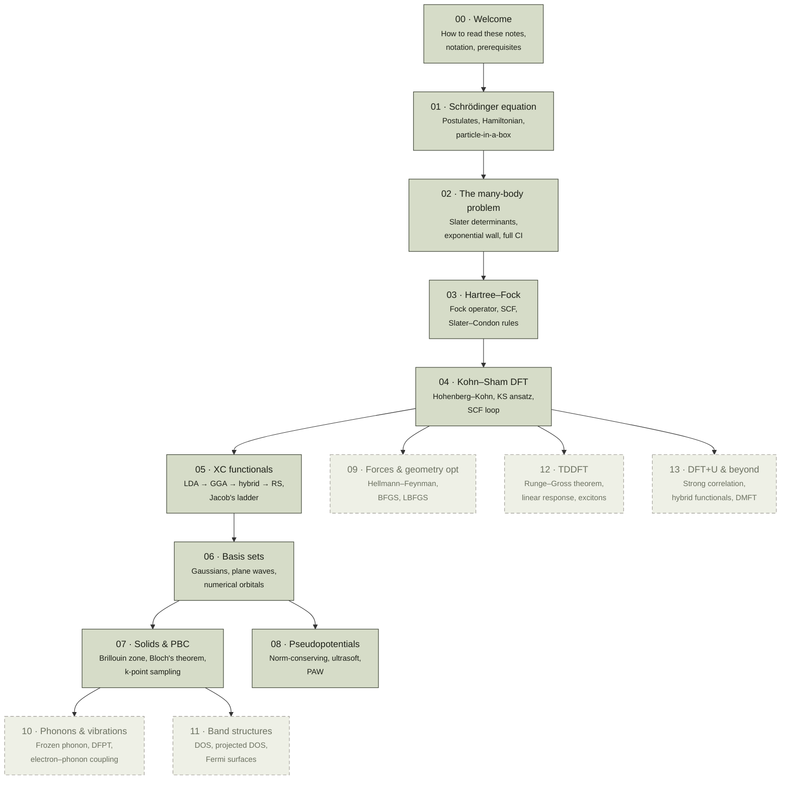

# Chapters map

> The full DFT Notes knowledge graph.  Boxes are chapters; arrows
> are "depends on" (read this after the arrow's source).  Boxes
> with a dashed border are planned but not yet written.

This is the **canonical index** of every chapter that exists or
will exist in this knowledge base.  For a human-readable list,
see the [chapter index]({{ site.baseurl }}/dft-notes/).

## Tracks

The chapters above split into three conceptual tracks after
chapter 05:

- **Methods track** (always relevant) — 06 basis sets, 08
  pseudopotentials, 13 DFT+U.
- **Solids track** (for periodic systems) — 07 PBC, 10 phonons,
  11 band structures.
- **Dynamics track** (for time-dependent phenomena) — 09 forces
  (technically static, but it's the first step), 12 TDDFT.

You don't have to read all of them.  Pick the track that matches
your problem domain.

## Conventions

- Each chapter follows the [template]({{ site.baseurl }}/agents.md#the-chapter-rigor-checklist)
  in `agents.md`.  All derivations are step-by-step; no
  calculation is omitted; problem sets have hidden answers.
- The Python code that runs in a chapter also lives in
  [`dft_notes/python_codes/`]({{ site.baseurl }}/dft-notes/python_codes/).
  Each chapter has its own subfolder there; scripts are
  numbered in the order they appear in the chapter; plots are
  committed alongside the script.

> This map is a **living document**.  Every time
> `agent:content-writer` lands a new chapter,
> `agent:diagram-artist` updates this Mermaid graph.
