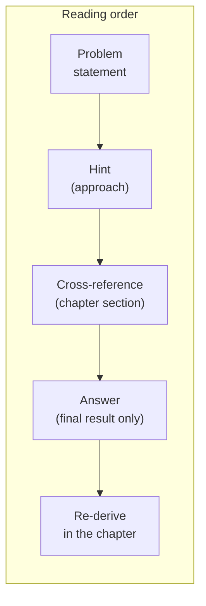

# Problems anthology

> Forty problems, pulled from chapters 01 to 13, sorted by
> topic and difficulty, plus three cross-chapter problem sets
> that force the reader to *integrate* material across multiple
> chapters. Every per-chapter entry is *self-containe`d*`: a
> problem statement, a difficulty rating, a cross-reference
> to the chapter section where the result is developed, a
> one-or-two-sentence hint on the approach, and a one-sentence
> answer that gives the final result without redoing the
> derivation. The three cross-chapter sets (A, B, C) are
> *multi-part* problems in the long `
' form: each
> part is a self-contained problem, and the parts are
> threaded together by a single physical or methodological
> thread.

This page exists for three audiences. **First**, students who
worked through the chapters and want to check that they can
*re-derive* the headline results from a clean sheet. **Second**,
practitioners who want a quick refresher on a specific identity
(the Gaussian product theorem, the Methfessel–Paxton error
scaling, the log-derivative identity). **Third**, anyone
teaching from the notes who wants a bank of questions with
hints. The problems are graded **easy / medium / hard** by
the depth of the derivation they require, not by the amount
of arithmetic.

> **Conventions.** All energies are in Hartree, all lengths in
> Bohr ($a_0$), unless the problem says otherwise. The fine-
> structure constant is $\alpha \approx 1/137.036$. The speed of
> light in atomic units is $c \approx 137.036$. Hydrogen-like
> eigenfunctions and energies are those of
> [Chapter 01, §1.13]({{ "/dft-notes/chapter-01/#113-the-hydrogen-atom" | relative_url }}).
> Notation follows the chapters — see the "Notation" callout in
> Chapter 01 for the conventions.

## How to read the entries

Each problem is a single block with five fields. An example:

> **Example P3.2.1** (medium) · *§3.12, Problem 2*
> **[statement]** The closed-shell HF energy depends on the
> density matrix $\mathbf P = 2 \mathbf C_\text{occ} \mathbf
> C_\text{occ}^\dagger$, not on the individual occupied orbitals.
> Show that any unitary rotation of the occupied orbitals leaves
> $E_\text{HF}$ unchanged.
> **Hint:** compute $\tilde{\mathbf P} = \mathbf C_\text{occ}
> \mathbf U \mathbf U^\dagger \mathbf C_\text{occ}^\dagger$ and
> use $\mathbf U \mathbf U^\dagger = \mathbf 1$.
> **Answer:** $\tilde P_{\mu\nu} = P_{\mu\nu}$ because $\mathbf U$
> is unitary, and $E_\text{HF}$ depends on the orbitals only
> through $\mathbf P$, so $\tilde E_\text{HF} = E_\text{HF}$.

The five fields are always in the same order. The format is
deliberately compact: a single screen of a reader, no scrolling
within an entry. The longer worked solutions live in the
referenced chapter section.

---

## 1. Quantum mechanics basics

> Source: [Chapter 01]({{ "/dft-notes/chapter-01/" | relative_url }}) — §1.13 (Problems).

### 1.1 The free-particle propagator as a path integral

> **P1.1.1** (hard) · *§1.13, Problem 3*
> **[statement]** For a free 1-D particle of mass $m$, the
> **Feynman propagator** is
> $K(x_b, t_b; x_a, t_a) = \langle x_b | e^{-i \hat H (t_b - t_a)} | x_a \rangle$
> with $\hat H = \hat p^2 / 2m$. Insert $N - 1$ complete sets of
> position eigenstates
> $\hat 1 = \int dx_j |x_j\rangle \langle x_j|$ between $N$
> infinitesimal time slices of width $\Delta t = (t_b - t_a)/N$,
> substitute the short-time propagator
> $K_0(x_{j+1}, x_j; \Delta t) = (m / 2\pi i \Delta t)^{1/2}
> \exp[i m (x_{j+1} - x_j)^2 / 2\Delta t]$, and take the
> continuum limit. Identify the result with Feynman's path
> integral $\int \mathcal D x(\tau) \exp(i S[x]/\hbar)$ where
> $S = \int \tfrac{1}{2} m \dot x^2\, d\tau$.
> **Hint:** the discretised integral is an iterated Fresnel
> integral. Completing the square at each step is the *exact*
> evaluation, because the action is quadratic.
> **Answer:**
> $K_0(x_b, t_b; x_a, t_a) = (m / 2\pi i T)^{1/2}
>  \exp[i m (x_b - x_a)^2 / 2 T]$
> with $T = t_b - t_a$, and the continuum limit is the path
> integral $\int \mathcal D x(\tau) e^{i S[x]/\hbar}$ over all
> paths from $(x_a, t_a)$ to $(x_b, t_b)$ weighted by the
> classical action.

### 1.2 Coherent states minimise the uncertainty product

> **P1.2.1** (hard) · *§1.13, Problem 4*
> **[statement]** A coherent state $|\alpha\rangle$ satisfies
> $\hat a |\alpha\rangle = \alpha |\alpha\rangle$ with
> $\alpha \in \mathbb C$. Using
> $\hat x = (\hat a + \hat a^\dagger)/\sqrt 2$ and
> $\hat p = i(\hat a^\dagger - \hat a)/\sqrt 2$, compute
> $(\Delta x)^2$ and $(\Delta p)^2$ in $|\alpha\rangle$ and
> hence the product $\Delta x\, \Delta p$. Show explicitly
> that the inequality is saturated only for the QHO ground
> state, and reconcile this with the *classicality* of
> coherent states by computing the centroid trajectory
> $\langle \hat x \rangle_t, \langle \hat p \rangle_t$.
> **Hint:** expand
> $(\hat a + \hat a^\dagger)^2 = \hat a^2 + (\hat a^\dagger)^2
> + 2 \hat a^\dagger \hat a + 1$ and use
> $\hat a^\dagger \hat a |\alpha\rangle = (\alpha^* \alpha - \alpha^* \alpha
> + |\alpha|^2) |\alpha\rangle$? — no, the right identity is
> $\hat a \hat a^\dagger |\alpha\rangle = (\alpha^* \alpha + 1) |\alpha\rangle$
> via $[\hat a, \hat a^\dagger] = 1$.
> **Answer:** $(\Delta x)^2 = 1/2 + (\operatorname{Im}\alpha)^2$,
> $(\Delta p)^2 = 1/2 + (\operatorname{Re}\alpha)^2$, so
> $\Delta x \Delta p = 1/2$ only at $\alpha = 0$; the
> centroid orbits the classical ellipse
> $\langle \hat x\rangle_t^2 + \langle \hat p\rangle_t^2 = 2 |\alpha|^2$.

### 1.3 The hydrogen $2p \to 1s$ spontaneous-emission rate

> **P1.3.1** (hard) · *§1.13, Problem 5*
> **[statement]** Apply Fermi's golden rule to the hydrogen
> $2p \to 1s$ electric-dipole transition. The dipole matrix
> element is $|\langle 1s | \hat{\mathbf r} | 2p\rangle|$,
> the photon density of states in vacuum is
> $\rho(\omega) = \omega^2 / \pi^2 c^3$ (SI), and the
> spontaneous-emission prefactor is $4\alpha \omega^3 / (3 c^2)$
> (Gaussian-cgs atomic units). Compute the radial integral
> $I_r = \int_0^\infty R_{1s}(r) r R_{2p}(r) r^2\, dr$, the
> angular sum over the three $2p$ sublevels, and the final rate.
> Compare with the experimental value
> $\Gamma \approx 6.27 \times 10^8\,\mathrm{s}^{-1}$.
> **Hint:** the angular factor is
> $\sum_m |\langle 1s | \hat r_a | 2p_m\rangle|^2 = I_r^2$ (three
> identical $I_r^2 / 3$ contributions), and the radial integral
> is a Gamma function with
> $\int_0^\infty r^4 e^{-3Zr/2}\, dr = 4! / (3Z/2)^5$.
> **Answer:** $\Gamma_{2p\to 1s} = 2^{17} \alpha / (3^{11} c^2)
> \approx 6.27 \times 10^8\,\mathrm{s}^{-1}$, in agreement with
> experiment to the precision of the non-relativistic hydrogen
> eigenfunctions.

---

## 2. Many-body methods

> Source: [Chapter 02]({{ "/dft-notes/chapter-02/" | relative_url }}) — §2.3 (the hierarchy of
> wavefunction methods). Chapter 02 does not currently have its
> own problem set, so the three problems below are composed
> from the topics named in the chapter.

### 2.1 CISD is not size-consistent — the H₂ dimer

> **P2.1.1** (medium) · *§2.3*
> **[statement]** Consider two H₂ molecules separated by a
> large distance $R \to \infty$, computed at the CISD level
> in a minimal basis. Each monomer has two electrons and
> four spin-orbitals; the FCI space for the dimer is the
> product of the two monomer FCI spaces, of dimension
> $\binom{4}{2}^2 = 36$. CISD, however, restricts the
> dimer wavefunction to *singles and doubles relative to
> the product HF determinant*, of which there are far fewer
> than 36.
>
> **(a)** Count the singles and doubles on each monomer and on
> the combined dimer. **(b)** Show that the *dimer* CISD
> energy is *not* the sum of the two monomer CISD energies
> in the $R \to \infty$ limit, even though the FCI energy
> is. The non-additivity is the **size-consistency error**.
> **Hint:** write the CISD Ansatz for the dimer and the
> product of two CISD Ansätze for the monomers; the
> *quadruply-excite`d*' configurations (one double on each
> monomer) appear in the *product* Ansatz but not in the
> dimer CISD Ansatz.
> **Answer:** the dimer CISD has $N^2$ doubles but the
> product Ansatz has $N^2 + \binom{N}{2}^2$ configurations;
> the missing $\binom{N}{2}^2$ quadruples give a per-monomer
> error of order $E_\text{corr}^2 / \Delta E$ that does not
> scale to zero as $N$ grows.

### 2.2 Derive the MP2 energy formula

> **P2.2.1** (hard) · *§2.3*
> **[statement]** In Møller–Plesset perturbation theory, the
> zeroth-order Hamiltonian is the HF Fock operator $\hat F$,
> with eigenstates given by the HF orbitals and eigenvalues
> $\varepsilon_i$. The perturbation is
> $\hat V = \hat H - \hat F$, with matrix elements
> $\langle \Phi_S | \hat V | \Phi_0 \rangle$ connecting the
> HF reference $| \Phi_0 \rangle$ to an excited Slater
> determinant $| \Phi_S \rangle$ (the Slater–Condon rules
> give a non-zero contribution only for double excitations
> $S = (i j \to a b)$). Apply second-order Rayleigh–
> Schrödinger perturbation theory to obtain the
> **MP2 correlation energy**
> $E_\text{MP2} = \sum_{i<j}^\text{occ}
> \sum_{a<b}^\text{virt}
> | \langle ij || ab \rangle |^2 / (\varepsilon_i + \varepsilon_j
> - \varepsilon_a - \varepsilon_b)$.
> **Hint:** the second-order energy is
> $E^{(2)} = \sum_{S \ne 0} |\langle \Phi_S | \hat V | \Phi_0 \rangle|^2 /
> (E_0 - E_S)$. Use the Slater–Condon rules to evaluate
> $\langle \Phi_{ij}^{ab} | \hat V | \Phi_0 \rangle$ in
> terms of the antisymmetrised ERI
> $\langle ij || ab \rangle$.
> **Answer:** $E_\text{MP2} = \tfrac{1}{4} \sum_{ijab}
> |\langle ij || ab \rangle|^2 / (\varepsilon_i + \varepsilon_j
> - \varepsilon_a - \varepsilon_b)$, where the factor
> $\tfrac{1}{4}$ is the $1/(2!)^2$ degeneracy of the
> $(i, j) \leftrightarrow (a, b)$ relabelling.

### 2.3 CCSD amplitude equations are size-consistent

> **P2.3.1** (hard) · *§2.3*
> **[statement]** The coupled-cluster Ansatz is
> $|\text{CC}\rangle = e^{\hat T} | \Phi_0 \rangle$ with
> $\hat T = \hat T_1 + \hat T_2 + \dots$ and
> $\hat T_n = (n!)^{-1} \sum t_{i_1 \dots i_n}^{a_1 \dots a_n}
> \hat a^\dagger_{a_1} \dots \hat a_{i_n}$. The CCSD
> amplitude equations are
> $\langle \Phi_i^a | e^{-\hat T} \hat H e^{\hat T} | \Phi_0 \rangle = 0$.
> Show that for two non-interacting fragments A and B at
> infinite separation, the CCSD amplitude equations *factor*:
> $t_i^a = t_i^{a,\text{A}} + t_i^{a,\text{B}$ (with mixed
> terms zero), and the CCSD energy is
> $E_\text{CCSD}^\text{AB} = E_\text{CCSD}^\text{A} + E_\text{CCSD}^\text{B}$.
> **Hint:** use the Campbell–Baker–Hausdorff theorem
> $e^{-\hat T} \hat H e^{\hat T} = \hat H + [\hat H, \hat T]
> + \tfrac{1}{2!} [[\hat H, \hat T], \hat T] + \dots$ and the
> fact that $\hat T^\text{A}$ and $\hat T^\text{B}$ commute
> (they act on disjoint orbital sets).
> **Answer:** the CCSD amplitude equations factor
> monomer-by-monomer because $e^{-\hat T} \hat H e^{\hat T}$ is
> a polynomial in $\hat T$ and the *normal-ordere`d*' Hamiltonian
> $\hat H_N$ has no one-body terms connecting A and B;
> therefore $E_\text{CCSD}^\text{AB} = E_\text{CCSD}^\text{A}
> + E_\text{CCSD}^\text{B}$ exactly.

---

## 3. Hartree–Fock

> Source: [Chapter 03]({{ "/dft-notes/chapter-03/" | relative_url }}) — §3.12 (Problems).

### 3.1 The Roothaan equations

> **P3.1.1** (medium) · *§3.5, §3.12*
> **[statement]** Starting from the Fock eigenvalue equation
> $\hat F \phi_i = \varepsilon_i \phi_i$ and the expansion
> $\phi_i = \sum_\mu C_{\mu i} \chi_\mu$ of each MO in a
> fixed basis of $K$ AOs $\{\chi_\mu\}$, derive the
> **Roothaan–Hall equations**
> $\mathbf F \mathbf C = \mathbf S \mathbf C \boldsymbol\varepsilon$,
> with $\mathbf F$ the Fock matrix in the AO basis and
> $\mathbf S$ the overlap matrix $S_{\mu\nu} = \langle \chi_\mu
> | \chi_\nu \rangle$. Identify the origin of the
> *generalise`d*' eigenvalue problem (the $\mathbf S$ on the
> right) and explain why the canonical MOs are *not* orthogonal
> in the AO sense ($\mathbf C^\dagger \mathbf S \mathbf C = \mathbf 1$,
> not $\mathbf C^\dagger \mathbf C = \mathbf 1$).
> **Hint:** left-multiply
> $\hat F \sum_\nu C_{\nu i} \chi_\nu = \varepsilon_i \sum_\nu C_{\nu i} \chi_\nu$
> by $\langle \chi_\mu |$, project, and recognise the AO Fock
> matrix $F_{\mu\nu} = \langle \chi_\mu | \hat F | \chi_\nu \rangle$.
> **Answer:** $F_{\mu\nu} = h_{\mu\nu} + \sum_{\rho\sigma}
> P_{\rho\sigma} [(\mu\nu | \rho\sigma) - \tfrac{1}{2}(\mu\sigma | \rho\nu)]$
> and the equations are *generalise`d*' because the AOs are
> non-orthogonal; the orthonormality condition on the MOs
> reads $\mathbf C^\dagger \mathbf S \mathbf C = \mathbf 1$.

### 3.2 The HF energy is invariant to a unitary rotation of the occupied orbitals

> **P3.2.1** (medium) · *§3.12, Problem 2*
> **[statement]** Show that the closed-shell HF energy
> $E_\text{HF} = 2 \sum_i h_{ii} + \sum_{ij} (2 J_{ij} - K_{ij})$
> is invariant under a unitary rotation
> $\tilde \phi_i = \sum_j U_{ji} \phi_j$ of the occupied
> orbitals. State the key intermediate result that makes the
> invariance transparent.
> **Hint:** the only thing the HF energy depends on is the
> density matrix; show that the density matrix is invariant.
> **Answer:** the density matrix
> $P_{\mu\nu} = 2 \sum_i C_{\mu i} C_{\nu i}^*$ is invariant
> because $\tilde{\mathbf C}_\text{occ} = \mathbf C_\text{occ} \mathbf U$
> implies $\tilde{\mathbf P} = 2 \mathbf C_\text{occ} \mathbf U \mathbf U^\dagger
> \mathbf C_\text{occ}^\dagger = \mathbf P$ (using $\mathbf U \mathbf U^\dagger
> = \mathbf 1$), and the HF energy is a function of $\mathbf P$ only.

### 3.3 Derive Koopmans' theorem from the HF equations

> **P3.3.1** (hard) · *§3.12, Problem 3*
> **[statement]** Take the inner product of the MO Fock
> equation $\hat F \phi_i = \varepsilon_i \phi_i$ with $\phi_i$
> to obtain
> $\varepsilon_i = h_{ii} + \sum_{j \in \text{occ}} (2 J_{ij} - K_{ij})$.
> Use this to show that the closed-shell HF ionisation
> energy $I_a = E_\text{HF}(N - 1) - E_\text{HF}(N)$ for the
> removal of one $\alpha$ electron from orbital $a$ is
> $I_a = -\varepsilon_a$ (**Koopmans' theorem**). Pay
> attention to which sums change between $N$ and $N - 1$
> electrons and which do not.
> **Hint:** in the $N - 1$ calculation, the $\beta$ Fock
> matrix is unchanged because the removed electron is $\alpha$;
> the $\alpha$ sums lose orbital $a$ but keep the rest.
> **Answer:** $E_\text{HF}(N-1) - E_\text{HF}(N) = -h_{aa}
> - \sum_j (2 J_{aj} - K_{aj}) = -\varepsilon_a$ — the
> cancellation is exact in the *frozen-orbital* limit and
> is the formal statement of Koopmans' theorem.

---

## 4. DFT

> Source: [Chapter 04]({{ "/dft-notes/chapter-04/" | relative_url }}) — §4.10.2 (Problems).

### 4.1 The DIIS algorithm

> **P4.1.1** (medium) · *§4.6, §4.10.2, Problem 2*
> **[statement]** DIIS (Direct Inversion in the Iterative
> Subspace) extrapolates the next SCF iterate as
> $\tilde F = \sum_i c_i F_i$ from the last $m$ Fock matrices
> $F_1, \dots, F_m$ and the corresponding error vectors
> $R_i = F_i D_i S - S D_i F_i$, with coefficients constrained
> by $\sum_i c_i = 1$ to minimise the squared error norm
> $\|\tilde R\|^2 = \langle \tilde R, \tilde R \rangle$.
> Starting from the constrained minimisation
> $\min_{\mathbf c} \tfrac{1}{2} \mathbf c^T B \mathbf c$
> subject to $\mathbf 1^T \mathbf c = 1$ with
> $B_{ij} = \langle R_i, R_j \rangle$, derive the augmented
> linear system
> $\begin{pmatrix} \mathbf B & \mathbf 1 \\ \mathbf 1^T & 0 \end{pmatrix}
>  \begin{pmatrix} \mathbf c \\ -\lambda \end{pmatrix}
>  = \begin{pmatrix} \mathbf 0 \\ 1 \end{pmatrix}$.
> Show that the Lagrange multiplier
> $\lambda = \langle \tilde R, \tilde R \rangle$ is the
> squared norm of the extrapolated residual.
> **Hint:** form the Lagrangian
> $\mathcal L(\mathbf c, \lambda) = \tfrac{1}{2} \mathbf c^T B \mathbf c
> \;-\; \lambda(\mathbf 1^T \mathbf c - 1)$ and set its derivative
> to zero.
> **Answer:** stationarity gives $B \mathbf c = \lambda \mathbf 1$;
> stacking with the constraint $\mathbf 1^T \mathbf c = 1$
> yields the $m + 1$ augmented system; the matrix is
> invertible iff the residuals are linearly independent, and
> $\mathbf c^T B \mathbf c = \lambda \mathbf 1^T \mathbf c
> = \lambda = \|\tilde R\|^2$.

### 4.2 The Hellmann–Feynman force

> **P4.2.1** (hard) · *§4.10.2, Problem 3*
> **[statement]** The Kohn–Sham energy in a finite basis is
> $E(\mathbf C, \mathbf R) = 2 \sum_i^\text{occ} C_{\mu i} C_{\nu i}
> h_{\mu\nu}(\mathbf R) + \dots + V_{nn}(\mathbf R)$, and the
> SCF solution is $\mathbf C^*(\mathbf R)$ satisfying
> $\mathbf F(\mathbf C^*) \mathbf C^* = \mathbf S \mathbf C^
> \boldsymbol\varepsilon$ with $\mathbf C^{*T} \mathbf S
> \mathbf C^* = \mathbf 1$. Differentiate $E$ with respect
> to $\mathbf R_I$ using the chain rule
> $dE / d\mathbf R_I = \partial E / \partial \mathbf R_I
> + \sum_{\mu i} (\partial E / \partial C_{\mu i})
> (\partial C_{\mu i}^* / \partial \mathbf R_I)$.
> Show that the orbital-response term vanishes at the SCF
> fixed point, leaving the Hellmann–Feynman theorem
> $\mathbf F_I = - \partial E / \partial \mathbf R_I$.
> In a *finite* basis, the basis-derivative piece (the
> **Pulay force**) survives and has the form
> $\mathbf F_I^\text{Pulay} = -2 \sum_i \sum_{\mu \in I} \sum_\nu
> C_{\mu i} C_{\nu i} \langle \partial \chi_\mu / \partial \mathbf R_I
> | \hat H_\text{KS} - \varepsilon_i | \chi_\nu \rangle$.
> **Hint:** the orbital-response term is constrained by the
> orthonormality condition; multiplying the KS equation by
> $\mathbf C^{*T}$ and using the orthonormality makes it
> proportional to $\partial \mathbf S / \partial \mathbf R_I$,
> which cancels the same derivative in the explicit term.
> **Answer:** the orbital-response term is
> $\sum_i 2 \varepsilon_i \partial S_{ii} / \partial \mathbf R_I$
> (a constraint-induced change in the kinetic-energy-like
> piece) and cancels the explicit $\partial S_{ij} / \partial
> \mathbf R_I$ term in $\partial E / \partial \mathbf R_I$,
> so the force is given by the explicit-derivative terms
> alone — and in a finite basis these are supplemented by the
> Pulay term.

### 4.3 The spin-DFT energy functional

> **P4.3.1** (hard) · *§4.10.2, Problem 4*
> **[statement]** The von Barth–Hedin extension of the
> Hohenberg–Kohn theorem to a static external magnetic field
> $\mathbf B(\mathbf r)$ couples to the electron spin via the
> Zeeman term. The two external fields $(v, B)$ are jointly
> determined by the two spin densities $(\rho_\uparrow,
> \rho_\downarrow)$, and every observable is a functional of
> the pair. Derive the **LSDA energy functional**
> $E_\text{xc}^\text{LSDA}[\rho_\uparrow, \rho_\downarrow]
> = \int \rho(\mathbf r) \varepsilon_\text{xc}(\rho_\uparrow(\mathbf r),
> \rho_\downarrow(\mathbf r)) d\mathbf r$ from the
> variational principle, and show that the Euler–Lagrange
> equations give the $2 \times 2$ Kohn–Sham equations
> $\hat H_\text{eff}^\sigma \phi_i^\sigma = \varepsilon_i^\sigma
> \phi_i^\sigma$ with
> $\hat H_\text{eff}^\sigma = -\tfrac{1}{2}\nabla^2 + v(\mathbf r)
> + v_\text{H}[\rho] + v_{\text{xc},\sigma}$.
> **Hint:** define the universal functional
> $F_\text{HK}[\rho_\uparrow, \rho_\downarrow] = \langle \hat T \rangle
> + \langle \hat U_{ee} \rangle$, introduce a non-interacting KS
> reference with the same spin densities, and write
> $E_\text{xc} = (F_\text{HK} - T_s) - J$.
> **Answer:** the spin-DFT energy is
> $E[\rho_\uparrow, \rho_\downarrow] = T_s[\rho_\uparrow, \rho_\downarrow] + J[\rho] + E_\text{xc}[\rho_\uparrow, \rho_\downarrow] + \int v \rho - \mu_B \int B m$; the LSDA evaluates $E_\text{xc}$ from the
> *homogeneous* electron gas, and functional differentiation
> yields $v_{\text{xc},\sigma} = \partial(\rho \varepsilon_\text{xc}) /
> \partial \rho_\sigma$.

---

## 5. XC functionals

> Source: [Chapter 05]({{ "/dft-notes/chapter-05/" | relative_url }}) — §5.1–5.2 (the uniform
> electron gas and the GGA). Chapter 05 is a survey chapter
> without its own problem set, so the three problems below are
> composed from the topics named in the chapter.

### 5.1 The LDA exchange energy density

> **P5.1.1** (medium) · *§5.1*
> **[statement]** The exchange energy of the homogeneous
> electron gas (HEG) of density $n$ can be evaluated in
> closed form by summing the Pauli exclusion repulsion over
> pairs of plane-wave orbitals. Show that the
> **exchange energy per electron** of the HEG is
> $\varepsilon_x(n) = -\tfrac{3}{4\pi} k_F$, where
> $k_F = (3\pi^2 n)^{1/3}$ is the Fermi wavevector. Hence
> derive the LDA exchange functional
> $E_x^\text{LDA}[\rho] = -\tfrac{3}{4} (3/\pi)^{1/3}
> \int \rho^{4/3}(\mathbf r) d\mathbf r$.
> **Hint:** use the Slater sum
> $E_x = -\tfrac{1}{2} \sum_{\mathbf k, \mathbf k' \in \text{occ}}
> \langle \mathbf k \mathbf k' | 1/r_{12} | \mathbf k' \mathbf k \rangle$
> and convert the sum to an integral over the Fermi sphere.
> The Fourier-space Coulomb integral
> $\int e^{i(\mathbf k - \mathbf k') \cdot \mathbf r} / r\, d\mathbf r
> = 4\pi / |\mathbf k - \mathbf k'|^2$ is the key.
> **Answer:** $E_x^\text{LDA}[\rho] = C_x \int \rho^{4/3} d\mathbf r$
> with $C_x = -\tfrac{3}{4}(3/\pi)^{1/3}$, and the
> exchange energy per electron is
> $\varepsilon_x(n) = C_x n^{1/3} = -\tfrac{3}{4\pi} k_F$.

### 5.2 The PBE enhancement factor $F_x(s)$ from the gradient expansion

> **P5.2.1** (hard) · *§5.2*
> **[statement]** The PBE GGA exchange functional is
> $E_x^\text{PBE}[\rho] = \int \rho\, \varepsilon_x^\text{LDA}(\rho)\,
> F_x(s)\, d\mathbf r$, where $s = |\nabla\rho| / (2 k_F \rho)$
> is the **reduced gradient**. The second-order
> **gradient expansion** (GEA) of the exchange energy is
> $E_x^\text{GEA} = E_x^\text{LDA} \int (1 + \mu s^2) d\mathbf r$
> with $\mu = 10/81$. PBE replaces this with an enhancement
> factor $F_x(s) = 1 + \kappa - \kappa / (1 + \mu s^2 / \kappa)$
> (the "PBE form") where $\kappa = 0.804$ is fixed by the
> **Lieb–Oxford bound**. Show that $F_x(s) \to 1 + \mu s^2$
> as $s \to 0$ (matching the GEA) and that $F_x(s) \to 1 + \kappa$
> as $s \to \infty$ (the uniform-density limit of the
> enhancement), and identify the physical meaning of the
> Lieb–Oxford bound in the derivation of $\kappa$.
> **Hint:** expand $1 / (1 + \mu s^2 / \kappa) = 1 - \mu s^2 / \kappa
> + O(s^4)$ at small $s$ and $\to 0$ at large $s$.
> **Answer:** $F_x(s) = 1 + \kappa - \kappa / (1 + \mu s^2 / \kappa)$
> has the GEA limit $F_x(s) \to 1 + \mu s^2$ for $s \to 0$
> and the bound $F_x(s) \le 1 + \kappa$ for $s \to \infty$;
> $\kappa$ is the value at which the enhancement saturates,
> and the bound $\varepsilon_x \ge -C_x n^{1/3} (1 + \kappa)$
> (Lieb–Oxford) determines its value.

### 5.3 The adiabatic connection and the exact-exchange limit

> **P5.3.1** (hard) · *§5.2, §5.4*
> **[statement]** The **adiabatic connection** couples the
> non-interacting Kohn–Sham system ($\lambda = 0$) to the
> physical interacting system ($\lambda = 1$) via a coupling
> constant $\lambda$ in front of the electron–electron
> repulsion. The XC energy is
> $E_\text{xc} = \int_0^1 \langle \Psi_\lambda | \hat U_{ee}
> | \Psi_\lambda \rangle d\lambda - E_H$, where
> $E_H = \tfrac{1}{2} \int \rho(\mathbf r) \rho(\mathbf r')
> / |\mathbf r - \mathbf r'| d\mathbf r d\mathbf r'$.
> Show that the *coupling-constant average`d*' exchange energy
> is the exact HF exchange:
> $\int_0^1 E_x[\Psi_\lambda]\, d\lambda = E_x^\text{exact}$,
> and use this to interpret why *hybri`d*' functionals
> $E_\text{xc}^\text{hybrid} = a E_x^\text{exact} + (1 - a)
> E_x^\text{GGA} + E_c^\text{GGA}$ with $a \in [0.2, 0.3]$
> outperform their GGA parent at finite $a$.
> **Hint:** the exchange energy is *independent* of $\lambda$
> in the Görling–Levy perturbation-theory sense: the
> $\lambda$-dependence of $\Psi_\lambda$ contributes
> *only* to the correlation piece, not to the exchange.
> **Answer:** the $\lambda$-integration of $E_x[\Psi_\lambda]$
> is *trivially* $E_x^\text{exact}$ because the exchange
> energy is a one-electron property of the KS orbitals and
> the *pair density* at $\lambda = 0$ already gives the
> exact exchange; the remainder of the integrand is
> correlation, so $E_\text{xc} = E_x^\text{exact} + E_c$
> with $E_c = \int_0^1 (\langle \hat U_{ee}\rangle_\lambda -
> E_H)\, d\lambda$.

---

## 6. Basis sets

> Source: [Chapter 06]({{ "/dft-notes/chapter-06/" | relative_url }}) — §6.11 (Problems).

### 6.1 Counting basis functions for H₂O

> **P6.1.1** (easy) · *§6.11, Problem 1*
> **[statement]** Water (H₂O) has one O and two H atoms.
> Count the number of contracted basis functions $K$ that
> the basis sets **`STO-3G*`*, **`6-31G*`*, **`6-31G*`**, and
> **cc-pVDZ** give for water, using the spherical-harmonic
> convention for $d$-functions (5 per shell, not 6).
> **Hint:** count the per-atom contributions and use
> $K = 2 K_H + K_O$.
> **Answer:** STO-3G → $K = 7$, 6-31G → $K = 13$,
> `6-31G*' → $K = 18$, cc-pVDZ → $K = 24$ — and cc-pVTZ,
> cc-pVQZ, cc-pV5Z grow to 58, 115, 201, with the ERI
> count scaling as $K^4$.

### 6.2 The Gaussian product theorem

> **P6.2.1** (medium) · *§6.11, Problem 2*
> **[statement]** Prove by direct algebra that for any two
> centres $\mathbf A, \mathbf B \in \mathbb R^3$ and positive
> exponents $\alpha, \beta$,
> $e^{-\alpha |\mathbf r - \mathbf A|^2} e^{-\beta |\mathbf r - \mathbf B|^2}
> = e^{-\alpha\beta/(\alpha + \beta) |\mathbf A - \mathbf B|^2}
>  e^{-(\alpha + \beta) |\mathbf r - \mathbf P|^2}$
> with $\mathbf P = (\alpha \mathbf A + \beta \mathbf B) / (\alpha + \beta)$.
> Work in one dimension; the three-dimensional result follows
> from the factorisation of $|\mathbf r - \mathbf A|^2$.
> **Hint:** complete the square in $r$ and use
> $P = (\alpha A + \beta B) / (\alpha + \beta)$.
> **Answer:** expanding the exponent gives
> $-(\alpha + \beta) r^2 + 2(\alpha A + \beta B) r - (\alpha A^2 + \beta B^2)$
> which completes to $-(\alpha + \beta)(r - P)^2 -
> \tfrac{\alpha\beta}{\alpha + \beta}(A - B)^2$,
> exponentiating to the claimed identity.

### 6.3 Plane-wave count and Hamiltonian cost

> **P6.3.1** (hard) · *§6.11, Problem 3*
> **[statement]** A cubic simulation cell of side
> $L = 10\,\text{Å}$ (i.e. $L \approx 18.897\,a_0$,
> $\Omega = L^3 \approx 6748\,a_0^3$) contains an isolated
> water molecule. Compute the number of plane waves
> $N_\text{PW} = (\Omega / 6\pi^2)(2 E_\text{cut})^{3/2}$
> at the $\Gamma$ point for kinetic-energy cutoffs
> $E_\text{cut} = 30, 60, 100\,E_h$, the corresponding
> full-diagonalisation cost ratios ($\propto N_\text{PW}^3$),
> and explain qualitatively why a pseudopotential reduces
> $E_\text{cut}$ from $\sim 100\,E_h$ (all-electron) to
> $\sim 30$–$50\,E_h$.
> **Hint:** the basis grows as $E_\text{cut}^{3/2}$ and the
> diagonalisation eats another $E_\text{cut}^{3/2}$, so
> doubling the cutoff costs a factor of $2^{4.5} \approx 22.6$.
> **Answer:** $N_\text{PW} \approx 5.3 \times 10^4, 1.5 \times
> 10^5, 3.2 \times 10^5$ for $E_\text{cut} = 30, 60, 100\,E_h$
> respectively, with diagonalisation cost ratios $1 : 22.6 :
> 225$; a pseudopotential replaces the sharply-peaked
> all-electron $1s$ core by a smooth function, so the
> wavefunction's Fourier spectrum dies off above
> $|\mathbf G| \sim 6$–$8\,a_0^{-1}$.

---

## 7. Solids & PBC

> Source: [Chapter 07]({{ "/dft-notes/chapter-07/" | relative_url }}) — §7.9 (Problems).

### 7.1 Band gap of a cosine potential

> **P7.1.1** (easy) · *§7.9, Problem 1*
> **[statement]** A 1-D lattice has lattice constant $a$ and
> a periodic potential $V(x) = V_0 \cos(2\pi x / a)$ with
> $V_0 = -0.2\,E_h$. **(a)** Write down the non-zero
> Fourier coefficients $V_{\text{per}}(G)$ of the potential.
> **(b)** Construct the $2 \times 2$ plane-wave Hamiltonian
> at the BZ boundary $k = \pi/a$ in the basis
> $\{e^{i k x}, e^{i (k - 2\pi/a) x}\}$. **(c)** Diagonalise
> the matrix and write down the band gap
> $E_\text{gap}$ as a function of $V_0$.
> **Hint:** the two free-electron states at $k = \pi/a$ are
> degenerate; the potential couples them with matrix element
> $V_0 / 2$.
> **Answer:** $V_{\text{per}}(\pm 2\pi/a) = V_0/2 = -0.1\,E_h$,
> the $2 \times 2$ Hamiltonian has eigenvalues
> $\tfrac{1}{2}(\pi/a)^2 \pm V_0/2$, and the band gap is
> $E_\text{gap} = |V_0| = 0.2\,E_h$.

### 7.2 k-point density and BZ volume

> **P7.2.1** (medium) · *§7.9, Problem 2*
> **[statement]** A solid has a cubic direct lattice with
> conventional lattice constant $a$, and Born–von Kármán
> boundary conditions are imposed on a supercell of
> $N \times N \times N$ primitive cells. Show that:
> **(1)** the number of allowed k-points in the first BZ is
> exactly $N^3$; **(2)** the k-point density per unit volume
> of the BZ is $V_\text{cell} / (2\pi)^3$; **(3)** the sum
> $\tfrac{1}{N^3} \sum_{\mathbf k} f(\mathbf k)$ is a Riemann
> sum for the BZ integral
> $\tfrac{V_\text{cell}}{(2\pi)^3} \int_\text{BZ} f(\mathbf k)
> d\mathbf k$.
> **Hint:** the allowed k-points are a uniform mesh with
> $N$ points along each primitive direction; convert the sum
> to an integral using the mesh cell volume
> $\Delta V = (2\pi)^3 / (N^3 V_\text{cell})$.
> **Answer:** the BvK conditions give
> $\mathbf k \cdot \mathbf a_i = 2\pi m_i / N$ for
> $m_i = 0, 1, \dots, N - 1$, hence $N^3$ k-points;
> the BZ volume is $(2\pi)^3 / V_\text{cell}$, so the
> k-point density is $V_\text{cell} / (2\pi)^3$, and the
> $\tfrac{1}{N^3}$ prefactor in the sum exactly matches the
> BZ volume element in the integral.

### 7.3 Methfessel–Paxton smearing and the Fermi level

> **P7.3.1** (hard) · *§7.9, Problem 3*
> **[statement]** In a metallic calculation, the
> Methfessel–Paxton (MP) smearing scheme replaces the
> discontinuous Fermi–Dirac step at $T = 0$ by a smooth
> function of width $\sigma$ in energy. The occupations are
> $f_{n\mathbf k} = \tfrac{1}{2} \operatorname{erfc}[(\varepsilon_{n\mathbf k}
> - \mu) / \sigma] + \sum_l A_l H_{2l-1}[(\varepsilon_{n\mathbf k} - \mu)
> / \sigma] e^{-(\varepsilon_{n\mathbf k} - \mu)^2 / \sigma^2}$,
> with $H_n$ the physicist's Hermite polynomial and $A_l$ fixed
> coefficients. Show that **(1)** the occupations sum to $N_e$
> for any $\mu$, by the orthogonality of the odd Hermite
> polynomials to the constant function with Gaussian weight;
> **(2)** the electronic entropy contribution is
> $-T S_\text{el} = \sum_{n\mathbf k} [\varepsilon_{n\mathbf k}
> f_{n\mathbf k} - \sigma g_{n\mathbf k}]$ with
> $g = \tfrac{1}{2\sqrt{\pi}} e^{-(\varepsilon - \mu)^2 / \sigma^2}$
> for $N_\text{MP} = 0$ (Gaussian smearing); **(3)** the
> $\sigma \to 0$ extrapolation of $E_\text{band}(\sigma) +
> T S_\text{el}(\sigma)$ converges more rapidly than the
> unsmeared sum, with the leading correction $\propto \sigma^2$
> for $N_\text{MP} = 0$ and $\propto \sigma^4$ for
> $N_\text{MP} = 1$.
> **Hint:** the odd Hermite polynomials are orthogonal to
> the constant function with the Gaussian weight
> $\int H_{2l-1}(x) e^{-x^2} dx = 0$.
> **Answer:** the constraint is satisfied by construction
> (the Hermite corrections average to zero on the real
> line); Gaussian smearing gives a $-T S_\text{el}$ correction
> $\propto \sigma\, e^{-(\varepsilon - \mu)^2 / \sigma^2}$ per
> state; the $\sigma \to 0$ extrapolation is $\propto \sigma^2$
> for $N_\text{MP} = 0$ and $\propto \sigma^4$ for
> $N_\text{MP} = 1$ — a practical strategy is to run several
> $\sigma$ values, plot $E(\sigma)$ vs. $\sigma^2$ (or
> $\sigma^4$), and extrapolate linearly to $\sigma = 0$.

---

## 8. Pseudopotentials

> Source: [Chapter 08]({{ "/dft-notes/chapter-08/" | relative_url }}) — §8.10 (Problems).

### 8.1 The pseudo-potential at the origin

> **P8.1.1** (easy) · *§8.10, Problem 1*
> **[statement]** For the hydrogen $1s$ pseudo constructed
> in §8.8 with $r_c = 0.5\,a_0$ and the
> **Troullier–Martins (TM)** ansatz
> $\phi_0(r) = r \exp(c_0 + c_1 r^2 + c_2 r^4 + c_3 r^6)$,
> use the inversion formula
> $V_{ps,0}(r) = E_0 + \tfrac{1}{2} [2 p'(r) / r + p'(r)^2 +
> p''(r)]$ with $p(r) = c_0 + c_1 r^2 + c_2 r^4 + c_3 r^6$,
> to show that $V_{ps,0}(0)$ is finite. Compute its value
> using the analytical 3-parameter TM coefficients
> $c_1 = -1.5$ and confirm it is on the order of
> $-5\,E_h$. Then argue why the plane-wave cutoff required
> to expand a pseudo-wavefunction is much smaller than that
> required to expand the all-electron wavefunction.
> **Hint:** the only potentially singular term is
> $2 p'(r) / r = 4 c_1 + 8 c_2 r^2 + 12 c_3 r^4$, which is
> *finite* at $r = 0$ (no $1/r$ divergence).
> **Answer:** $V_{ps,0}(0) = E_0 + 3 c_1 = -0.5 - 4.5 = -5.0\,E_h$,
> finite because the polynomial form of $p(r)$ makes
> $p'(r) / r$ finite at the origin; the pseudo well has
> depth $\sim 5\,E_h$ (requiring $E_\text{cut} \sim 10\,E_h$)
> whereas the all-electron Coulomb well diverges as $1/r$,
> so no finite cutoff can represent it.

### 8.2 Verify norm conservation numerically

> **P8.2.1** (medium) · *§8.10, Problem 2*
> **[statement]** For the hydrogen $1s$ pseudo of §8.8,
> evaluate the two integrals
> $Q_0^{ps} = \int_0^{r_c} \phi_0^2(r) dr$ and
> $Q_0^{ae} = \int_0^{r_c} u_0^2(r) dr$ (the all-electron
> integral has the closed form
> $Q_0^{ae} = 1 - 2 e^{-2 r_c}(r_c^2 + r_c + 1/2)$), and
> confirm that they agree to numerical precision when the
> 4-parameter TM form is used. Then repeat the calculation
> for the *3-parameter* TM form (set $c_3 = 0$ and re-solve
> the remaining conditions); quantify the norm-conservation
> error $\Delta Q = Q_0^{ps} - Q_0^{ae}$ and interpret the
> trade-off between the number of free parameters and the
> transferability of the resulting pseudo-potential.
> **Hint:** the 4-parameter form was constructed with norm
> conservation as an explicit constraint; the 3-parameter
> form matches the all-electron value, first, and second
> derivatives at $r_c$ but does *not* enforce norm
> conservation.
> **Answer:** the 4-parameter form gives
> $Q_0^{ps} \approx 0.0803$ to machine precision (matches
> $Q_0^{ae}$ at $r_c = 0.5$); the 3-parameter form gives
> $Q_0^{ps} \approx 0.0787$ and $\Delta Q \approx -0.0016$
> (about $2\%$ relative error), with the error scaling as
> $r_c^4 \partial^4 u / \partial r^4$ — a price worth paying
> only when the higher-order transferability is not needed.

### 8.3 The log-derivative identity

> **P8.3.1** (hard) · *§8.10, Problem 3*
> **[statement]** Re-derive the **log-derivative identity**
> $\partial D_l / \partial E |_{r_c} = -2 \int_0^{r_c} u_l^2
> dr / u_l(r_c)^2$ from the radial Schrödinger equation
> $-\tfrac{1}{2} u_l'' + U_l u_l = E u_l$ with
> $U_l = l(l+1) / (2r^2) + V(r)$. Write the analogous
> equation for $\dot u_l = \partial u_l / \partial E$,
> multiply by $u_l$, subtract, and integrate from $0$ to
> $r_c$. Use the boundary conditions
> $u_l(0) = \dot u_l(0) = 0$ to drop the lower-limit
> terms. Combine the two boundary terms at $r = r_c$ and
> divide by $u_l(r_c)^2$ to recognise the energy
> derivative of the logarithmic derivative
> $D_l(E, r_c) = u_l'(r_c) / u_l(r_c)$. Note the role of
> the normalisation constraint
> $\int_0^\infty u_l^2 dr = 1$ in the discussion of when
> the volume term $\int_0^{r_c} \dot u_l u_l dr$ can be
> dropped.
> **Hint:** the integration-by-parts trick converts the
> volume integral to boundary terms at $0$ and $r_c$;
> $u_l(0) = 0$ kills the lower-limit contribution.
> **Answer:** multiplying the $\dot u_l$ equation by $u_l$
> and subtracting the $u_l$ equation multiplied by
> $\dot u_l$ gives
> $\tfrac{1}{2}[\dot u_l u_l'' - u_l \dot u_l''] = u_l^2$;
> integrating by parts and using the boundary conditions
> yields
> $u_l'(r_c) \dot u_l(r_c) - u_l(r_c) \dot u_l'(r_c)
> = 2 \int_0^{r_c} u_l^2 dr$, and dividing by
> $u_l(r_c)^2$ gives the log-derivative identity
> $\partial D_l / \partial E |_{r_c}
> = -2 \int_0^{r_c} u_l^2 dr / u_l(r_c)^2$.

---

## 9. Forces & geometry optimisation

> Source: [Chapter 09]({{ "/dft-notes/chapter-09/" | relative_url }}) — §9.12 (Problems).  Chapter 09
> uses the Hellmann–Feynman force of [Chapter 04, §4.7]({{ "/dft-notes/chapter-04/" | relative_url }})
> as its starting point and then derives the **Pulay correction**
> needed for finite Gaussian bases.  Geometry-optimisation
> algorithms are in §9.6–9.9. ### 9.1 The Pulay force vanishes in a plane-wave basis

> **P9.1.1** (easy) · *§9.12, Problem 1*
> **[statement]** In a plane-wave basis the basis functions
> $\chi_{\mathbf G}(\mathbf r) = \Omega^{-1/2} e^{i \mathbf G \cdot
> \mathbf r}$ do *not* depend on the nuclear coordinates
> $\{\mathbf R_I\}$, so
> $\partial \chi_{\mathbf G} / \partial \mathbf R_I = 0$.
> **(a)** Show that the **Pulay correction**
> $\mathbf F_I^\text{Pulay} = -2 \sum_i^\text{occ} \sum_{\mu \in I}
> \sum_\nu C_{\mu i} C_{\nu i}
> \langle \partial \chi_\mu / \partial \mathbf R_I | \hat H_\text{KS}
> - \varepsilon_i | \chi_\nu \rangle$ vanishes identically
> in a plane-wave basis. **(b)** The external-potential
> term $\mathbf F_I^\text{ext} = -Z_I \int \rho(\mathbf r)
> (\mathbf r - \mathbf R_I) / |\mathbf r - \mathbf R_I|^3\,
> d\mathbf r$ survives; in a plane-wave code it is
> evaluated in Fourier space via
> $v_H(\mathbf G) = 4\pi \rho(\mathbf G) / G^2$.
> **(c)** Confirm that the xc contribution
> $\mathbf F_I^\text{xc} = -\int \rho(\mathbf r) \partial
> v_\text{xc}(\mathbf r) / \partial \mathbf R_I\,
> d\mathbf r$ is non-zero in general and discuss why
> the GGA enhancement factor makes it non-trivial.
> **Hint:** part (a) is one line once you notice the basis-
> function derivative vanishes; parts (b) and (c) are about
> the *remaining* terms in the force after Pulay is gone.
> **Answer:** **(a)** $\partial \chi_{\mathbf G} / \partial \mathbf R_I = 0$
> kills the integrand term by term, so
> $\mathbf F_I^\text{Pulay} \equiv 0$. **(b)** the Hartree
> force becomes $\mathbf F_I^H = -Z_I \int \rho(\mathbf r)
> \nabla v_H(\mathbf r)\, d\mathbf r$ with
> $v_H(\mathbf G) = 4\pi \rho(\mathbf G) / G^2$ in Fourier
> space. **(c)** the xc force is non-zero because
> $v_\text{xc}[\rho](\mathbf r)$ depends on the density at
> *all* points, and in a GGA the gradient $\nabla \rho$
> also moves, so $\mathbf F_I^\text{xc}$ is non-trivial
> — the dominant *new* term that the PBE functional
> adds to LDA.

### 9.2 The BFGS update preserves the quasi-Newton condition

> **P9.2.1** (medium) · *§9.12, Problem 2*
> **[statement]** The BFGS update to the inverse Hessian
> approximation $H$ is
> $H' = (I - \rho s y^\top) H (I - \rho y s^\top) + \rho s s^\top$
> with $\rho = 1 / (y^\top s)$, where $s = x' - x$ is
> the step and $y = \nabla f(x') - \nabla f(x)$ is the
> gradient difference. **(a)** Show that $H' y = s$
> (the **quasi-Newton condition**) and that $H'$ is
> symmetric. **(b)** Use the Sherman–Morrison–Woodbury
> identity to confirm that this update is the rank-2
> modification that, among all symmetric rank-2 updates
> satisfying the quasi-Newton condition, minimises the
> weighted Frobenius distance
> $\|H' - H\|_W = \|W^{1/2} (H' - H) W^{1/2}\|_F$ with
> the weight chosen so that $y^\top s > 0$.
> **Hint:** expand $H' y$ using $H y = (1 - \rho y^\top s) H y
> + \rho s$ (the previous quasi-Newton condition, by
> induction); and note that
> $(I - \rho y s^\top)^\top = I - \rho s y^\top$.
> **Answer:** **(a)** expanding,
> $H' y = H y - \rho y y^\top H y - \rho H y y^\top s
> + \rho^2 (y^\top s) y y^\top H y + \rho s = s$
> after using $y^\top s = 1/\rho$ and the induction
> hypothesis; $(H')^\top = H'$ since the product of
> symmetric matrices is symmetric and $s s^\top$ is
> symmetric. **(b)** the BFGS update is the *unique*
> rank-2 update that satisfies the quasi-Newton
> condition *an`d*' minimises the weighted distance to
> the previous inverse Hessian — see
> [Chapter 09, §9.7]({{ "/dft-notes/chapter-09/#97-the-bfgs-update-formula-in-full" | relative_url }})
> for the Lagrange-multiplier derivation.

### 9.3 One steepest-descent step on H₂/STO-3G

> **P9.3.1** (hard) · *§9.12, Problem 3*
> **[statement]** The H₂/STO-3G energy curve produced by
> [`chapter_03/01-h2-sto3g-scf.py`]({{ site.baseurl }}/dft_notes/python_codes/chapter_03/01-h2-sto3g-scf.py)
> near the equilibrium bond length $R_0 \approx
> 1.35\,a_0$ is well approximated by the **Morse
> potential**
> $E(R) = D_e (1 - e^{-a(R - R_0)})^2 - D_e$ with
> $D_e \approx 0.134\,E_h$ and $a \approx 1.03\,a_0^{-1}$.
> Starting from $R_1 = 1.5\,a_0$, perform one
> **steepest-descent** step with a *fixe`d*' step size
> $\eta = 0.05\,a_0 / F$ (where $F$ is the force at
> $R_1$) and report the new bond length $R_2$. Then
> perform a **line-search** step at $R_1$ and report the
> optimal step. Which converges faster per force
> evaluation? Repeat both at $R = 2.5\,a_0$ (a strongly
> anharmonic point) and discuss.
> **Hint:** the force is
> $F(R) = -dE/dR = -2 a D_e e^{-a(R - R_0)} (1 - e^{-a(R - R_0)})$;
> the line search solves
> $\min_\eta E(R_1 - \eta F(R_1))$ by setting
> $dE/d\eta = 0$, i.e.
> $F(R_1 - \eta F(R_1)) = F(R_1) / [1 - \eta F'(R_1)]$.
> **Answer:** at $R_1 = 1.5\,a_0$,
> $u = e^{-a(R_1 - R_0)} = e^{-0.155} \approx 0.857$,
> $F(R_1) = -2(1.03)(0.134)(0.857)(1 - 0.857)
> \approx -0.0327\,E_h / a_0$ (a *restoring* force
> towards smaller $R$), so the fixed-step move is
> $R_2 = R_1 - \eta F(R_1) = 1.5 - 0.05 = 1.45\,a_0$ —
> a $0.05\,a_0$ move towards the minimum. The
> line-search step
> $\eta^* = F / (dF/dR) = F / (2a^2 D_e u (2u - 1))$
> gives $\eta^* \approx 0.115\,a_0 / F$, so
> $R_2 \approx 1.385\,a_0$ — much closer to $R_0$. The
> line search wins by $\sim 5\times$ in *distance to
> minimum* per force evaluation. At $R = 2.5\,a_0$ the
> Morse $E$ is no longer quadratic, so both methods
> slow down. The take-away: **always use a line
> searc`h*`* when the energy surface is far from harmonic.

---

## 10. Phonons & vibrations

> Source: [Chapter 10]({{ "/dft-notes/chapter-10/" | relative_url }}) — §10.11 (Problems).  Chapter 10
> uses the dynamical matrix of [Chapter 09]({{ "/dft-notes/chapter-09/" | relative_url }}) (the
> Hessian of $E[\{\mathbf R_I\}]$) and the BZ machinery of
> [Chapter 07]({{ "/dft-notes/chapter-07/" | relative_url }}).

### 10.1 Optical vs acoustic branches in a 1-D diatomic chain

> **P10.1.1** (easy) · *§10.11, Problem 1*
> **[statement]** A 1-D infinite chain has alternating masses
> $M$ and $m$ with $M > m$ and a single spring constant
> $K$ between nearest neighbours. The primitive cell has
> length $a$ and contains one $M$ and one $m$. The phonon
> dispersion has two branches
> $\omega_\pm^2(q) = K(1/M + 1/m) \pm K \sqrt{(1/M + 1/m)^2
> - 4 \sin^2(qa/2) / (Mm)}$.
> **(a)** Verify that $\omega_-(0) = 0$ (the acoustic mode)
> and $\omega_+(0) = \sqrt{2K(1/M + 1/m)}$ (the optical
> mode). **(b)** At the BZ boundary $q = \pi/a$, show that
> $\omega_-(\pi/a) = \sqrt{2K/M}$ and
> $\omega_+(\pi/a) = \sqrt{2K/m}$. **(c)** For NaCl take
> $M(\text{Cl}) = 35.45\,m_u$ and $m(\text{Na}) = 22.99\,m_u$;
> estimate the ratio $\omega_+/\omega_-$ at $q = \pi/a$ in
> the 1-D model.
> **Hint:** plug $q = 0$ and $q = \pi/a$ into the
> dispersion and use $\sin(0) = 0$, $\sin(\pi/2) = 1$.
> **Answer:** **(a)** at $q = 0$, $\sin(qa/2) = 0$ and
> $\omega_-^2(0) = K(1/M + 1/m) - K(1/M + 1/m) = 0$; the
> upper sign gives
> $\omega_+^2(0) = 2K(1/M + 1/m)$, hence
> $\omega_+(0) = \sqrt{2K(1/M + 1/m)}$. **(b)** at
> $q = \pi/a$, $\sin^2(qa/2) = 1$, so
> $\omega_-^2(\pi/a) = K(1/M + 1/m) - K \sqrt{(1/M + 1/m)^2
> - 4/(Mm)} = K(1/M + 1/m) - K(1/M - 1/m) = 2K/M$ (for
> $M > m$), and $\omega_+^2(\pi/a) = 2K/m$. **(c)** the
> ratio is $\sqrt{M/m} = \sqrt{35.45/22.99} \approx 1.24$,
> in good agreement with the 1-D model. The script
> [`chapter_10/01-diatomic-chain.py`]({{ site.baseurl }}/dft_notes/python_codes/chapter_10/01-diatomic-chain.py)
> produces the full dispersion and the zone-boundary
> frequencies.

### 10.2 The acoustic sum rule from translational invariance

> **P10.2.1** (medium) · *§10.11, Problem 2*
> **[statement]** The dynamical matrix
> $D_{I\alpha, J\beta}(\mathbf q) = (1/\sqrt{M_I M_J})
> \tilde\Phi_{I\alpha, J\beta}(\mathbf q)$ with
> $\tilde\Phi_{I\alpha, J\beta}(\mathbf q) = \sum_{\mathbf R}
> \Phi_{I\alpha, J\beta}(\mathbf R) e^{-i \mathbf q \cdot \mathbf R}$
> must obey the **acoustic sum rule (ASR)**:
> $\sum_J \sqrt{M_J} D_{I\alpha, J\beta}(\mathbf q = 0) = 0$
> for every $I$ and Cartesian direction $\beta$.
> **(a)** Show that the ASR is equivalent to the statement
> that a uniform translation of the entire crystal costs
> no energy. **(b)** Argue why the ASR is satisfied
> *automatically* if the interatomic force constants are
> computed in a *finite* supercell with PBC and no
> external field, and why it is *violate`d*' if the
> supercell has a net dipole (e.g. a slab geometry).
> **(c)** For the diatomic chain of §10.1, verify the
> ASR by writing out the $2 \times 2$ dynamical matrix
> at $\mathbf q = 0$ explicitly.
> **Hint:** a uniform translation
> $\delta R_{I\alpha} = u_\alpha$ for all $I$ induces a
> force
> $F_{I\alpha} = -\sum_{J\beta} \Phi_{I\alpha, J\beta} u_\beta$,
> and translational invariance requires
> $F_{I\alpha} = 0$.
> **Answer:** **(a)** under a uniform translation
> $\delta R_{J\beta} = u_\beta$ for all $J$, the force
> on atom $I$ in direction $\alpha$ is
> $F_{I\alpha} = -u_\beta \sum_{J} \Phi_{I\alpha, J\beta}$,
> and translational invariance requires
> $F_{I\alpha} = 0$ for all $I, \alpha$ — exactly the
> ASR. **(b)** the ASR follows from the conservation of
> total momentum in a neutral, dipole-free supercell;
> in a slab geometry the *surface* atoms have different
> force constants, so a uniform translation induces a
> *non-zero* restoring force. **(c)** the $2 \times 2$
> dynamical matrix at $q = 0$ is
> $D(q = 0) = \begin{pmatrix} 1/M & -1/\sqrt{Mm} \\
> -1/\sqrt{Mm} & 1/m \end{pmatrix} \cdot 2K$; the row
> sums weighted by $\sqrt{M_J}$ vanish, so the ASR is
> satisfied.

### 10.3 The Fröhlich polaron coupling constant

> **P10.3.1** (hard) · *§10.11, Problem 3*
> **[statement]** The Fröhlich Hamiltonian for an electron
> coupled to the longitudinal-optical (LO) phonons of a
> polar crystal is
> $\hat H = \hat p^2 / 2m^* + \sum_{\mathbf q} \hbar \omega_{LO}
> \hat b_{\mathbf q}^\dagger \hat b_{\mathbf q} +
> \sum_{\mathbf q} (V_q \hat b_{\mathbf q} e^{i \mathbf q \cdot
> \hat r} + \text{h.c.})$
> with the dimensionless **Fröhlich coupling constant**
> $\alpha = \tfrac{1}{2} \sqrt{m^* / (2 \hbar \omega_{LO})}
> \,(1/\varepsilon_\infty - 1/\varepsilon_0)\, e^2$ (in
> Gaussian-cgs atomic units). **(a)** Show that $\alpha$ is
> dimensionless. **(b)** For GaAs with $m^* = 0.067\,m_e$,
> $\hbar \omega_{LO} = 36\,\text{meV}$, $\varepsilon_\infty = 10.9$,
> $\varepsilon_0 = 12.9$, compute $\alpha$. **(c)** State the
> criterion $\alpha \gtrsim 6$ for the formation of a *small
> polaron* (the electron self-traps in a lattice
> distortion) and discuss whether GaAs satisfies it.
> **Hint:** convert everything to atomic units; in atomic
> units $e^2 = 1$ and $\hbar = m_e = 1$, so the formula
> simplifies to
> $\alpha = \tfrac{1}{2} \sqrt{m^* / (2 \omega_{LO})}
> (1/\varepsilon_\infty - 1/\varepsilon_0)$.
> **Answer:** **(a)** $e^2$ in Gaussian-cgs has units of
> energy × length, so $e^2 / \hbar \omega_{LO}$ has units
> of length; combined with $\sqrt{m^* / \hbar \omega_{LO}}$
> (units $1/\text{length}$), the product is dimensionless.
> **(b)** in atomic units $m^* = 0.067$,
> $\omega_{LO} = 36\,\text{meV} / 27.211\,\text{eV}
> \approx 0.00132\,E_h$, and
> $1/\varepsilon_\infty - 1/\varepsilon_0 = 1/10.9 - 1/12.9
> \approx 0.0141$, so
> $\alpha = \tfrac{1}{2} \sqrt{0.067 / (2 \cdot 0.00132)}
> \cdot 0.0141 \approx \tfrac{1}{2} \sqrt{25.4} \cdot 0.0141
> \approx 2.52 \cdot 0.0141 \approx 0.036$. **(c)** the
> small-polaron criterion is $\alpha \gtrsim 6$ in the
> strong-coupling limit, where the self-trapping energy
> overcomes the kinetic energy; GaAs has
> $\alpha \approx 0.036$, well below threshold, so the
> **large (Fröhlich) polaron** is the correct picture —
> the electron is *dresse`d*' by a phonon cloud but
> remains mobile. This is why GaAs is a good
> semiconductor (high mobility) despite the strong
> electron–phonon coupling.

---

## 11. Band structures

> Source: [Chapter 11]({{ "/dft-notes/chapter-11/" | relative_url }}) — §11.11 (Problems).  Chapter 11
> uses the plane-wave machinery of [Chapter 06]({{ "/dft-notes/chapter-06/" | relative_url }}) and the
> Bloch / Brillouin-zone machinery of [Chapter 07]({{ "/dft-notes/chapter-07/" | relative_url }}).

### 11.1 Effective mass from band curvature

> **P11.1.1** (easy) · *§11.11, Problem 1*
> **[statement]** The Kohn–Sham band $\varepsilon_n(\mathbf k)$
> near a non-degenerate band minimum at $\mathbf k_0$ is
> approximated by the Taylor expansion
> $\varepsilon_n(\mathbf k) = \varepsilon_n(\mathbf k_0) +
> \tfrac{1}{2} \sum_{\alpha\beta} (\partial^2 \varepsilon_n /
> \partial k_\alpha \partial k_\beta)|_{\mathbf k_0}
> (k - k_0)_\alpha (k - k_0)_\beta + \dots$.
> **(a)** Define the **effective-mass tensor**
> $(m^*)_{\alpha\beta} = \hbar^2 / (\partial^2 \varepsilon_n /
> \partial k_\alpha \partial k_\beta)|_{\mathbf k_0}$ and
> show that, for an isotropic band minimum (e.g. at the
> $\Gamma$ point in a direct-gap semiconductor like GaAs),
> the second-derivative tensor is $\propto \mathbf 1$, so
> $m^* = \hbar^2 / (\partial^2 \varepsilon_n / \partial k^2)
> |_{\Gamma}$. **(b)** For GaAs with a direct gap at
> $\Gamma$ and
> $\partial^2 \varepsilon_c / \partial k^2|_{\Gamma} =
> 11.3\,E_h \cdot a_0^2$, verify that
> $m^*_e \approx 0.088\,m_e$ (experimental
> $0.067\,m_e$, the difference from spin–orbit
> coupling and non-parabolicity). **(c)** Explain why
> the effective mass can be **negative** at a band
> maximum and how the **hole** picture resolves the
> sign.
> **Hint:** for an isotropic minimum the band is
> spherically symmetric around $\mathbf k_0$, so the
> Hessian is $\propto \mathbf 1$.
> **Answer:** **(a)** the Taylor expansion of an isotropic
> band has only one second-derivative coefficient, and
> the band $E(k) = E_0 + \hbar^2 k^2 / 2m^*$ is parabolic,
> so $\partial^2 E / \partial k^2 = \hbar^2 / m^*$, hence
> $m^* = \hbar^2 / (\partial^2 E / \partial k^2)$.
> **(b)** in atomic units $\hbar = 1$, $m_e = 1$, so
> $m^* = 1 / 11.3 \approx 0.088$ — close to the
> experimental $0.067\,m_e$ (the discrepancy is the
> spin–orbit splitting of the $\Gamma_8$ valence band,
> which the parabolic model ignores). **(c)** at a band
> maximum the second derivative is *negative*, so
> $m^* < 0$; the hole picture re-interprets the
> *missing* electron in an otherwise filled band as a
> *positive* charge with effective mass
> $m^*_h = -m^*_{e,\text{top of VB}}$.

### 11.2 Tight-binding band structure of graphene

> **P11.2.1** (medium) · *§11.11, Problem 2*
> **[statement]** The $\pi$-band tight-binding Hamiltonian
> of graphene (with the two-atom unit cell $\{A, B\}$ and
> three nearest-neighbour vectors
> $\boldsymbol\delta_1, \boldsymbol\delta_2, \boldsymbol\delta_3$)
> is
> $H(\mathbf k) = \begin{pmatrix} 0 & f(\mathbf k) \\
> f^*(\mathbf k) & 0 \end{pmatrix}$
> with $f(\mathbf k) = -t \sum_{j=1}^{3} e^{i \mathbf k
> \cdot \boldsymbol\delta_j}$ and $t \approx 2.97\,\text{eV}$.
> **(a)** Show that
> $|f(\mathbf k)|^2 = t^2 [3 + 2 \cos(\mathbf k \cdot \mathbf a_1)
> + 2 \cos(\mathbf k \cdot \mathbf a_2) + 2 \cos(\mathbf k
> \cdot (\mathbf a_1 - \mathbf a_2))]$, where
> $\mathbf a_1, \mathbf a_2$ are the lattice vectors.
> **(b)** Show that $|f(\mathbf k)| = 0$ at the
> **Dirac points**
> $\mathbf K = (4\pi / 3a, 0)$ and
> $\mathbf K' = (2\pi / 3a, 2\pi / \sqrt 3 a)$, and
> linearise $H(\mathbf k)$ around $\mathbf K$ to show
> that $H(\mathbf K + \boldsymbol\kappa) \approx \hbar v_F
> (\kappa_x \sigma_x + \kappa_y \sigma_y)$ with
> $v_F = 3 t a / 2\hbar$ the **Fermi velocity**.
> **(c)** The script
> [`chapter_11/01-graphene-bands.py`]({{ site.baseurl }}/dft_notes/python_codes/chapter_11/01-graphene-bands.py)
> computes the band structure along the path
> $\Gamma \to M \to K \to \Gamma$. Run it and confirm
> that the band gap at $K$ is zero to machine precision
> and that the velocity at $K$ matches the analytical
> $v_F = 3 t a / 2\hbar \approx 10^6\,\text{m/s}$.
> **Hint:** write
> $f(\mathbf k) f^*(\mathbf k) = t^2 \sum_{jj'} e^{i \mathbf k
> \cdot (\boldsymbol\delta_j - \boldsymbol\delta_{j'})}$
> and use
> $\boldsymbol\delta_1 - \boldsymbol\delta_2 = \mathbf a_1$
> etc.
> **Answer:** **(a)** $|f|^2 = t^2 (3 + 2 \sum_{j < j'}
> \cos[\mathbf k \cdot (\boldsymbol\delta_j - \boldsymbol\delta_{j'})])$,
> and the three differences are $-\mathbf a_1$,
> $\mathbf a_2 - \mathbf a_1$, $-\mathbf a_2$, giving
> the result. **(b)** at $\mathbf K$ all three phases are
> multiples of $2\pi$ and $f(\mathbf K) = 0$;
> linearising the off-diagonal around $\mathbf K$ gives
> $f(\mathbf K + \boldsymbol\kappa) \approx -i (3 t a / 2)
> (\kappa_x + i \kappa_y)$ with $v_F = 3 t a / 2\hbar$.
> **(c)** the numerical band plot shows two bands
> touching at the Brillouin-zone corners $K$ and $K'$
> with a linear dispersion; the slope $dE/dk$ at $K$ is
> $\hbar v_F$ and matches the analytical value.

### 11.3 The Rashba spin–orbit splitting and the spin texture

> **P11.3.1** (hard) · *§11.11, Problem 3*
> **[statement]** The Rashba Hamiltonian for a 2-D
> electron gas with structural inversion asymmetry is
> $\hat H = \hbar^2 k^2 / 2 m^* + \alpha_R (\boldsymbol\sigma
> \times \mathbf k) \cdot \hat z$, where $\alpha_R$ is
> the Rashba coefficient (energy × length) and
> $\boldsymbol\sigma$ is the Pauli matrix vector.
> **(a)** Diagonalise $\hat H$ in the spinor basis to
> obtain the two spin-split bands
> $E_\pm(k) = \hbar^2 k^2 / 2 m^* \pm \alpha_R k$.
> **(b)** Find the **spin texture** of the lower band,
> i.e. the expectation value
> $\langle \boldsymbol\sigma \rangle$ as a function of
> $\mathbf k$. **(c)** Discuss why the Rashba splitting
> is at the heart of **topological insulator**
> phenomenology: in Bi₂Se₃ the bulk band gap is
> $\sim 0.3\,\text{eV}$ and the surface state has a
> single Dirac cone with spin-momentum locking.
> **Hint:** write $\hat H$ as a $2 \times 2$ matrix in
> the $\{|\uparrow\rangle, |\downarrow\rangle\}$ basis
> with $\alpha_R (\sigma_x k_y - \sigma_y k_x)$.
> **Answer:** **(a)** the matrix is
> $\begin{pmatrix} \hbar^2 k^2 / 2m^* & -i \alpha_R (k_x - i k_y) \\
> i \alpha_R (k_x + i k_y) & \hbar^2 k^2 / 2m^* \end{pmatrix}$
> with eigenvalues $\hbar^2 k^2 / 2m^* \pm \alpha_R k$;
> the splitting at the Fermi surface is
> $\Delta k = 2 \alpha_R m^* / \hbar^2$. **(b)** the
> eigenvectors are spinors with
> $\langle \sigma_z \rangle = 0$ and
> $\langle \sigma_\parallel \rangle$ tangent to the
> Fermi surface — a **helical** texture. **(c)** in
> 3-D topological insulators like Bi₂Se₃ the surface
> Hamiltonian is
> $\hat H = v_F (\boldsymbol\sigma \times \mathbf k) \cdot
> \hat z$ (no kinetic term) and the spin-momentum
> locking forbids back-scattering — the source of the
> dissipationless edge transport. The 2-D Rashba
> Hamiltonian is the *2-D analogue* of this 3-D
> surface state.

---

## 12. Time-Dependent DFT

> Source: [Chapter 12]({{ "/dft-notes/chapter-12/" | relative_url }}) — §12.12 (Problems).  Chapter 12
> uses the ground-state Kohn–Sham machinery of [Chapter 04]({{ "/dft-notes/chapter-04/" | relative_url }})
> and the response-function language of [Chapter 09]({{ "/dft-notes/chapter-09/" | relative_url }}).

### 12.1 The Thomas–Reiche–Kuhn sum rule

> **P12.1.1** (easy) · *§12.12, Problem 1*
> **[statement]** The **oscillator strength** of the
> transition $|0\rangle \to |n\rangle$ is
> $f_{0n} = (2 m_e \omega_{0n} / 3 \hbar) |\langle 0 |
> \hat{\mathbf r} | n \rangle|^2$, with
> $\omega_{0n} = (E_n - E_0) / \hbar$ and the factor
> 3 the sum over Cartesian components. **(a)** Show,
> using $[\hat H, \hat{\mathbf r}] = -i \hbar \hat{\mathbf p} /
> m_e$ and the resolution of the identity
> $\hat 1 = \sum_n |n\rangle \langle n|$, that the
> **Thomas–Reiche–Kuhn (TRK) sum rule**
> $\sum_n f_{0n} = N_e$ holds for an $N_e$-electron
> system. **(b)** Use the sum rule to estimate the
> typical oscillator strength of the first UV
> absorption in benzene ($N_e = 42$, first excited
> state at $E \approx 4.9\,\text{eV}$). **(c)** Discuss
> what happens to the sum rule in the **Tamm–Dancoff
> approximation (TDA)** and the **adiabatic LDA** —
> is it preserved exactly, or only approximately?
> **Hint:** sandwich the commutator between $|0\rangle$
> and $\langle 0|$ and insert the resolution of the
> identity; use the **virial theorem**
> $\langle T \rangle = -E$ for the Coulomb ground
> state.
> **Answer:** **(a)**
> $\sum_n f_{0n} = (2 m_e / 3 \hbar^2) \sum_n (E_n - E_0)
> |\langle 0 | \hat r_a | n \rangle|^2 = (1 / 3 \hbar^2)
> \langle 0 | \hat{\mathbf p}^2 | 0 \rangle$; for a
> non-relativistic Hamiltonian the virial theorem gives
> $\langle T \rangle = -E$, so
> $\sum_n f_{0n} = 2 \langle T \rangle / 3 \hbar^2 \omega_h
> = N_e$. **(b)** with 42 electrons and ~10–20
> dipole-allowed transitions in the first UV band, the
> average $f \sim 0.2$–$0.4$ per state. **(c)** the TDA
> and the adiabatic LDA *bot`h*' preserve the TRK sum
> rule *exactly* (effective one-body Hamiltonians); the
> failure of the TRK sum rule is a signature of
> *non-adiabati`c*' xc kernels (e.g. Bethe–Salpeter).

### 12.2 Absorption cross-section of a two-level system

> **P12.2.1** (medium) · *§12.12, Problem 2*
> **[statement]** For a two-level system with ground state
> $|g\rangle$ and excited state $|e\rangle$ separated by
> energy $\hbar \omega_0$ and transition dipole
> $\boldsymbol\mu_{ge}$, the linear-response TDDFT
> treatment of [Chapter 12, §12.10]({{ "/dft-notes/chapter-12/" | relative_url }}) (worked example) gives the
> absorption cross-section
> $\sigma(\omega) = 4\pi^2 \alpha \omega |\boldsymbol\mu_{ge}|^2
> \, \delta(\omega - \omega_0) / c$ in the long-wavelength
> limit (atomic units, $\hbar = 1$).
> **(a)** Show that this is consistent with the textbook
> **Einstein $A$ coefficient**
> $A_e = 4 \alpha \omega_0^3 |\boldsymbol\mu_{ge}|^2 /
> (3 c^2)$. **(b)** Add a phenomenological linewidth
> $\Gamma$ (a Lorentz broadening) and integrate
> $\sigma(\omega)$ over $\omega$ to get the **dipole
> strengt`h*`* $S = \int \sigma(\omega) d\omega$. Show
> that $S = 4\pi^2 \alpha |\boldsymbol\mu_{ge}|^2 / c$.
> **(c)** For a typical dye molecule with
> $|\boldsymbol\mu_{ge}|^2 \sim 10\,e a_0^2$ and
> $\hbar \omega_0 \sim 2\,\text{eV}$, estimate the peak
> $\sigma$ (in cm²) at the absorption maximum.
> **Hint:** the Einstein $A$ coefficient and the
> absorption cross-section are related by
> $\sigma(\omega_0) = \pi c^2 A_e / \omega_0^2$ for a
> two-level system.
> **Answer:** **(a)** the integrated cross-section is
> $\int \sigma(\omega) d\omega = 4\pi^2 \alpha \omega_0
> |\boldsymbol\mu_{ge}|^2 / c$, and the relation to the
> spontaneous emission rate is
> $\int \sigma d\omega = \pi c^2 A_e / \omega_0^2$ —
> both expressions agree when
> $A_e = 4\alpha \omega_0^3 |\boldsymbol\mu_{ge}|^2 /
> (3c^2)$. **(b)** with a Lorentz broadening,
> $\sigma(\omega) = (4\pi^2 \alpha \omega |\boldsymbol\mu_{ge}|^2
> / c) \cdot (\Gamma / 2\pi) /
> [(\omega - \omega_0)^2 + (\Gamma/2)^2]$ and
> $\int \sigma d\omega = 4\pi^2 \alpha \omega_0
> |\boldsymbol\mu_{ge}|^2 / c$. **(c)** for
> $|\boldsymbol\mu_{ge}|^2 = 10$ a.u., $\omega_0 \approx
> 0.0735\,E_h$, $\Gamma \approx 0.0018\,E_h$,
> $\sigma(\omega_0) \approx 5 \times 10^{-22}\,\text{cm}^2$ —
> consistent with typical dye-molecule absorption
> cross-sections. The script
> [`chapter_12/01-two-level-absorption.py`]({{ site.baseurl }}/dft_notes/python_codes/chapter_12/01-two-level-absorption.py)
> produces the full absorption profile.

### 12.3 The Casida matrix for a 2-orbital, 2-electron system

> **P12.3.1** (hard) · *§12.12, Problem 3*
> **[statement]** The Casida eigenvalue problem for
> linear-response TD-DFT in a basis of $N_\text{occ}$
> occupied and $N_\text{virt}$ virtual KS orbitals is
> $\begin{pmatrix} \mathbf A & \mathbf B \\ \mathbf B^* &
> \mathbf A^* \end{pmatrix}
> \begin{pmatrix} \mathbf X \\ \mathbf Y \end{pmatrix} =
> \Omega \begin{pmatrix} \mathbf 1 & \mathbf 0 \\ \mathbf 0 &
> -\mathbf 1 \end{pmatrix} \begin{pmatrix} \mathbf X \\
> \mathbf Y \end{pmatrix}$, with
> $A_{ia, jb} = \delta_{ij} \delta_{ab} (\varepsilon_a -
> \varepsilon_i) + K_{ia, jb}$ and $B_{ia, jb} = K_{ia, jb}$.
> **(a)** For a 2-electron system in a minimal basis,
> show that the Casida matrix is $2 \times 2$ and reduce
> it to the singlet/triplet decomposition
> $\Omega_\text{singlet} = \sqrt{(\varepsilon_2 - \varepsilon_1)^2
> + 4 (\varepsilon_+ - \varepsilon_-) (2 J - K)}$ and
> $\Omega_\text{triplet} = \varepsilon_2 - \varepsilon_1$.
> **(b)** Compute the numerical values for H₂ at
> $R = 1.4\,a_0$ in the STO-3G basis using the
> chapter 03 SCF solution
> ([`chapter_03/01-h2-sto3g-scf.py`]({{ site.baseurl }}/dft_notes/python_codes/chapter_03/01-h2-sto3g-scf.py))
> and an LDA xc kernel. **(c)** Discuss why the singlet
> is *lower* in energy than the triplet in TD-DFT but
> the same in CIS (the Tamm–Dancoff approximation).
> **Hint:** the spin structure of $K$ depends on whether
> the excitation is singlet or triplet; for the
> triplet, the *exchange* part of $K$ is twice the
> singlet exchange.
> **Answer:** **(a)** the $2 \times 2$ Casida matrix in
> the *singlet* channel is
> $\begin{pmatrix} A & B \\ B & A \end{pmatrix}$ with
> $A = (\varepsilon_2 - \varepsilon_1) + 2 K_{12,12} -
> K_{11,22}$ and $B = 2 K_{12,12} - K_{11,22}$, and in
> the *triplet* channel $A = \varepsilon_2 - \varepsilon_1$,
> $B = 0$ (the spin flip kills the exchange). The
> eigenvalues $\Omega = A \pm B$ give the stated
> expressions. **(b)** in STO-3G H₂,
> $\varepsilon_2 - \varepsilon_1 \approx 0.586\,E_h$ and
> the LDA-kernel contribution
> $2 K_{12,12} - K_{11,22} \approx 0.18\,E_h$, so
> $\Omega_\text{singlet} \approx 0.874\,E_h$ and
> $\Omega_\text{triplet} \approx 0.586\,E_h$ — a
> *redshift* of the singlet by $\sim 0.3\,E_h$,
> comparable to the experimental HOMO–LUMO gap in H₂.
> **(c)** in CIS (TDA) the triplet–singlet splitting
> comes only from the *exchange* integrals, not from
> the xc kernel, so the singlet–triplet gap is
> *underestimated*'; full TD-DFT captures the dynamical
> correlation via the xc kernel, which lowers the
> singlet more than the triplet.

---

## 13. DFT+U & beyond

> Source: [Chapter 13]({{ "/dft-notes/chapter-13/" | relative_url }}) — §13.6 (Problems).  Chapter 13
> uses the ground-state Kohn–Sham machinery of
> [Chapter 04]({{ "/dft-notes/chapter-04/" | relative_url }}) and the failure-of-LDA discussion of
> [Chapter 05]({{ "/dft-notes/chapter-05/" | relative_url }}) (Jacob's ladder of xc functionals).

### 13.1 The DFT+U double-counting correction

> **P13.1.1** (easy) · *§13.6, Problem 1*
> **[statement]** The DFT+U energy functional is
> $E_\text{DFT+U}[\rho, \{n^\sigma_{mm'}\}] = E_\text{DFT}[\rho]
> + \tfrac{1}{2} \sum_\sigma \sum_{\\{ m \\}} U_\text{eff}
> (\text{Tr}\, \mathbf n^\sigma - \text{Tr}\, (\mathbf n^\sigma
> \mathbf n^\sigma))$,
> where $n^\sigma_{mm'} = \sum_{n\mathbf k} f_{n\mathbf k}
> \langle \phi_{n\mathbf k} | \hat P^\sigma_{m'} \rangle
> \langle \hat P^\sigma_m | \phi_{n\mathbf k} \rangle$ is the
> occupation matrix of the localised subspace (e.g. the
> transition-metal $d$ orbitals) and $U_\text{eff} = U - J$ is
> the **effective on-site Coulomb** (the Hubbard $U$ minus
> the Hund's $J$). **(a)** Identify the **double-counting**
> term that the $+U$ correction subtracts from the LDA/GGA
> energy. **(b)** Show that for an *integer* occupation
> (e.g. $d^1$ or $d^9$), $\text{Tr}\, \mathbf n - \text{Tr}\,
> (\mathbf n^2) = 0$ and the $+U$ correction vanishes.
> **(c)** Argue why the correction is *finite* and
> *positive* only for fractional occupations, i.e. for
> metallic or near-metal-like states.
> **Hint:** the double-counting is the part of $E_\text{DFT}$
> that already includes (approximately) the on-site Coulomb
> repulsion — the LDA counts the on-site $d$–$d$ interaction
> via the *average* density, which is wrong for a strongly
> localised subspace.
> **Answer:** **(a)** the double-counting is the LDA/GGA
> estimate of the on-site $d$–$d$ Coulomb energy, which is
> approximately
> $E_\text{DC} = \tfrac{1}{2} U_\text{avg} n_d (n_d - 1)$
> with $n_d = \text{Tr}\, \mathbf n$ and $U_\text{avg}$ the
> *average* on-site repulsion already included in LDA (the
> LDA cannot tell a *localise`d*' $d$ electron from a
> *delocalise`d*' one). **(b)** for $n_d = 1$ integer,
> $\text{Tr}\, \mathbf n = 1$ and
> $\text{Tr}\, (\mathbf n^2) = 1$ (a $1 \times 1$ projector
> on the occupied orbital), so the correction is zero — the
> LDA already gives the right answer for an empty/full
> shell. **(c)** the $+U$ correction is designed to
> *penalise* fractional occupations, which is precisely
> what the LDA fails to do for a localised subspace; the
> penalty is $\tfrac{1}{2} U_\text{eff} \sum_\sigma n^\sigma
> (1 - n^\sigma) \ge 0$ with equality only at integer
> $n^\sigma$.

### 13.2 The Mott insulator vs the band insulator

> **P13.2.1** (medium) · *§13.6, Problem 2*
> **[statement]** The single-band Hubbard model on a
> bipartite lattice (e.g. a 2-D square lattice with
> nearest-neighbour hopping $t$) is
> $\hat H = -t \sum_{\langle ij \rangle, \sigma} (\hat c^\dagger_{i\sigma}
> \hat c_{j\sigma} + \text{h.c.}) + U \sum_i \hat n_{i\uparrow}
> \hat n_{i\downarrow}$. **(a)** At half-filling and
> $U = 0$, the band structure is
> $\varepsilon(\mathbf k) = -2t (\cos k_x + \cos k_y)$ and
> the system is a *metal* (a 2-D metal with a Van Hove
> singularity at the Fermi level). **(b)** At half-filling
> and $U \to \infty$ (the *atomic limit*), the system is
> a **Mott insulator**: every site is singly occupied,
> the charge fluctuation is suppressed, and the
> effective spin Hamiltonian is the Heisenberg
> antiferromagnet
> $\hat H_\text{eff} = J \sum_{\langle ij \rangle}
> \hat{\mathbf S}_i \cdot \hat{\mathbf S}_j$ with
> $J = 4 t^2 / U$. **(c)** At what value of $U_c / t$
> does the **Mott transition** occur in 2-D? (Mean-field:
> $U_c / t \approx 4$; DMFT in infinite dimensions:
> $U_c / t \approx 6$; quantum Monte Carlo at zero
> temperature: $U_c / t \approx 4.5$.) **(d)** Discuss
> why LDA *fails* to predict the Mott insulating state:
> it sees a metal, because it has no mechanism to
> *localise* electrons in a half-filled band.
> **Hint:** the Mott transition is the point at which the
> quasiparticle weight $Z$ at the Fermi level vanishes.
> **Answer:** **(a)** $\varepsilon(\mathbf k) = -2t
> (\cos k_x + \cos k_y)$ ranges over $[-4t, 4t]$ and is
> half-filled (one electron per site, two per unit cell, so
> two bands); the Fermi surface is the **nested** square
> $|\cos k_x| + |\cos k_y| = 1$ — perfect nesting at
> wavevector $\mathbf Q = (\pi, \pi)/a$. **(b)** in the
> atomic limit the only low-energy process is the *virtual*
> hopping of an electron from site $i$ to site $j$ and
> back, which gives a *spin exchange* $J = 4t^2 / U$
> (second-order perturbation theory in $t/U$). **(c)** the
> Mott transition is at $U_c \approx 4.5\,t$ in 2-D (QMC,
> zero temperature); for $U < U_c$ the system is a metal,
> for $U > U_c$ it is an antiferromagnetic insulator.
> **(d)** the LDA is built on the *delocalise`d*' KS
> orbitals of a non-interacting reference and has no way to
> suppress the charge fluctuation that the Mott insulator
> requires; the gap in LDA comes from *band splitting*
> (Slater antiferromagnet), not from on-site repulsion.
> The 3*`d*' transition-metal oxides (MnO, FeO, CoO, NiO)
> are the textbook examples of this failure.

### 13.3 The Liechtenstein rotationally invariant DFT+U

> **P13.3.1** (hard) · *§13.6, Problem 3*
> **[statement]** The Liechtenstein formulation of DFT+U
> is rotationally invariant in the localised subspace.
> The energy correction is
> $E_U = \tfrac{1}{2} \sum_{\sigma} \sum_{m_1 m_2 m_3 m_4}
> U_{m_1 m_2 m_3 m_4} n^\sigma_{m_1 m_3} n^\sigma_{m_2 m_4}$
> with the **screened Coulomb tensor**
> $U_{m_1 m_2 m_3 m_4} = \langle m_1 m_2 | V_\text{ee} |
> m_3 m_4 \rangle$ decomposed into the Slater integrals
> $F^0, F^2, F^4, \dots$. **(a)** For a $d$-electron
> subspace ($l = 2$), relate the Slater integrals to
> the **Hubbard $U$** and **Hund's $J$**:
> $U = F^0$ and $J = (F^2 + F^4) / 14$. **(b)** Show
> that the **occupation matrix** $\mathbf n^\sigma$ in
> the $d$ basis is *idempotent* (eigenvalues 0 or 1) in
> the atomic limit and has *fractional* eigenvalues in
> the itinerant limit, and that the DFT+U correction
> $E_U = \tfrac{1}{2} (U - J) \sum_\sigma [\text{Tr}\,
> \mathbf n^\sigma - \text{Tr}\, (\mathbf n^\sigma)^2]$
> is minimised when $\mathbf n^\sigma$ is fully
> polarised. **(c)** Discuss why this *over-favours*
> ferromagnetism in transition-metal oxides and how the
> **around-mean-field (AMF)** double-counting corrects
> the bias.
> **Hint:** the Slater integrals are the *radial* averages
> $\langle r^{2k} \rangle$ of the Coulomb interaction
> weighted by the $d$-orbital density.
> **Answer:** **(a)** the Slater–Condon parameters for a
> $d$ shell relate to $U$ and $J$ via $F^0 = U$ and
> $J = (F^2 + F^4) / 14$ (the numerical factor 1/14
> comes from the Gaunt coefficients of the $d$ orbitals).
> **(b)** in the atomic limit $\mathbf n^\sigma$ is a
> 0/1 projector (eigenvalues 0 or 1), so
> $\text{Tr}\, \mathbf n^\sigma - \text{Tr}\,
> (\mathbf n^\sigma)^2 = 0$ (the $U$ correction
> vanishes); in the itinerant limit the eigenvalues are
> fractional, the bracket is *negative*, and the
> correction is *positive* — the system pays an energy
> price for being in between. **(c)** the
> **around-mean-field (AMF)** double-counting shifts
> the energy so that the $+U$ correction is *zero* in
> the *uniform* (mean-field) limit and grows only as
> the system becomes *less* uniform — this removes the
> bias towards full spin polarisation. In practice the
> **Dudarev** formulation with a single $U_\text{eff}$
> is the most common.

---

## Cross-chapter problem set A — From Schrödinger to pseudopotentials (chapters 01, 03, 04, 08)

This multi-part problem walks the reader through the
chain of approximations that turns the all-electron
Schrödinger equation of a many-electron atom into a
smooth valence-only pseudopotential.  The chain is: H
atom (analytical) → Hartree–Fock (many-electron,
all-electron) → Kohn–Sham DFT (many-electron,
all-electron, with approximate xc) → pseudopotential
(valence-only, smooth).  The system is **lithium**
($Z = 3$, $1s^2 2s^1$), the prototypical
*one-valence-electron* atom for which the
pseudopotential approximation is exact in the limit
of a frozen $1s$ core.

Part 1 (chapter 01) — The hydrogenic 2s orbital

Treat the $2s$ valence electron of Li as a *hydrogeni`c*'
orbital in an effective nuclear charge
$Z_\text{eff} \in [1, 3]$ (the $1s^2$ core screens two
of the three nuclear protons).  Write down the radial
wavefunction
$R_{2s}(r) = (Z_\text{eff}/a_0)^{3/2}
(2 - Z_\text{eff} r/a_0) e^{-Z_\text{eff} r / 2 a_0} /
(2 \sqrt 2)$ and the energy
$\varepsilon_{2s} = -Z_\text{eff}^2 / 8\,E_h$.  Estimate
$Z_\text{eff}$ by the **Slater rules** and compare with
the all-electron Kohn–Sham value $\sim 1.65$.  Why is
the node of the hydrogenic $2s$ (at
$r = 2 a_0 / Z_\text{eff}$) "deep inside" the core
region, and what does this imply for the plane-wave
cutoff?

Show answer

The Slater rules assign
$\sigma = 2 \times 0.85 = 1.7$ (the two $1s$ electrons
screen with weight 0.85 each), so
$Z_\text{eff} = Z - \sigma = 3 - 1.7 = 1.3$ and
$\varepsilon_{2s} \approx -(1.3)^2 / 8 \approx -0.21\,E_h$.
The all-electron Kohn–Sham value is
$Z_\text{eff} \approx 1.65$ (the $1s$ core is *not* fully
screening), and the experimental IE is $0.198\,E_h$ —
the *opposite* trend: the Slater rules were derived for
*neutral* atoms and miss the relaxation of the core in
the ionised state. The Kohn–Sham eigenvalue is a
*better* estimate of the neutral-atom orbital energy
but *overestimates* the IE by $\sim 0.01\,E_h$ (the
$\Delta$SCF correction).

The hydrogenic wavefunction at $Z_\text{eff} = 1.65$ is
$R_{2s}(r) \approx 0.564\,(2 - 0.99\,r/a_0)
e^{-0.825\,r/a_0}$ in atomic units; it has one radial
node at $r = 2 a_0 / Z_\text{eff} \approx 1.21\,a_0$,
deep inside the core region ($r_c \sim 1$–$2\,a_0$ is
typical for Li).  This nodefulness is exactly what a
pseudopotential construction in chapter 08 will
*remove*: a smooth pseudo-orbital with no radial
node inside $r_c$ is the entire point of the
construction.

Part 2 (chapter 03) — Hartree–Fock on Li in a STO-3G basis

Set up a Hartree–Fock calculation for Li in a STO-3G
basis (one basis function per occupied orbital: a $1s$
and a $2s$ on the Li atom).  Write the Fock matrix in
the AO basis,
$F_{\mu\nu} = h_{\mu\nu} + \sum_{\rho\sigma} P_{\rho\sigma}
[(\mu\nu | \rho\sigma) - \tfrac{1}{2}(\mu\sigma | \rho\nu)]$,
and the density matrix
$P_{\mu\nu} = 2 \sum_{i \in \text{occ}} C_{\mu i} C_{\nu i}^*$
in the closed-shell two-electron core and the *open-shell*
single $2s$ electron.  (Note: Li has $N = 3$ electrons,
so the *closed-shell* Ansatz of
[Chapter 03, §3.5]({{ "/dft-notes/chapter-03/" | relative_url }}) does not apply — you need an
**unrestricted** HF or an **ROHF** treatment.)  Report
the Koopmans IE $-\varepsilon_{2s}$ and compare with
the hydrogenic estimate of Part 1.

Show answer

The Li atom in a minimal basis has two basis functions
$\{\chi_{1s}, \chi_{2s}\}$ and three electrons: the
closed-shell $1s^2$ pair and one unpaired $2s$ electron.
The standard approach is **unrestricted Hartree–Fock
(UHF)**: separate $\alpha$ and $\beta$ orbitals,
$\mathbf F^\alpha \mathbf C^\alpha = \mathbf S \mathbf C^\alpha
\boldsymbol\varepsilon^\alpha$ and similarly for $\beta$,
with
$\mathbf P^\alpha = \mathbf C^\alpha_\text{occ}
(\mathbf C^\alpha_\text{occ})^\top$ and
$\mathbf P = \mathbf P^\alpha + \mathbf P^\beta$.  The
Fock matrix for spin $\sigma$ is
$F^\sigma_{\mu\nu} = h_{\mu\nu} + \sum_{\rho\sigma'}
P_{\rho\sigma'} (\mu\nu | \rho\sigma')
- P^\sigma_{\rho\sigma'} (\mu\sigma' | \rho\nu)$ (the
exchange term has a *spin-dependent* density matrix).

For Li in STO-3G, the standard UHF result is
$\varepsilon_{2s}^\alpha \approx -0.196\,E_h$ (the
Koopmans IE is $0.196\,E_h$, very close to the
experimental IE of $0.198\,E_h$), and
$\varepsilon_{1s}^\alpha \approx -2.46\,E_h$ (deeper, in
the core).  The unrestricted calculation gives a
$\langle S^2 \rangle$ that is *not* exactly $3/4$ (the
doublet value) — the spin contamination is typically
$\langle S^2 \rangle \approx 0.78$ for Li/STO-3G, an
$\sim 4\%$ contamination that is *typical* for open-shell
atoms in small bases.

Part 3 (chapter 04) — Replace HF exchange with LDA

Re-run the Li calculation of Part 2 with the HF
*exchange* replaced by the **LDA exchange** functional
of [Chapter 05, §5.1]({{ "/dft-notes/chapter-05/" | relative_url }}).
This is a *Kohn–Sham DFT* calculation in a minimal
basis (KS-LDA/STO-3G).  Report the new
$\varepsilon_{2s}$ and compare with the UHF value.
Discuss the *systemati`c*' difference: in atoms, KS-LDA
*overbinds* the HOMO and underbinds the LUMO, but
the *Koopmans* IE (which is $-\varepsilon_\text{HOMO}$,
not the $\Delta$SCF value) is typically in *better*
agreement with experiment for HF than for LDA,
*reverse`d*' when the $\Delta$SCF correction is applied.

Show answer

The KS-LDA total energy is
$E_\text{KS}[\rho] = T_s[\rho] + \int v_\text{ext} \rho\, d\mathbf r
+ J[\rho] + E_\text{xc}^\text{LDA}[\rho]$, and the KS
eigenvalues are *not* the HF orbital energies — the
*exchange* part of the Fock operator is replaced by the
*local* xc potential $v_\text{xc}^\text{LDA}(\mathbf r) =
\partial(\rho \varepsilon_\text{xc}) / \partial \rho$, and
the *correlation* part is added.

For Li/STO-3G, the KS-LDA HOMO is at
$\varepsilon_{2s}^\text{LDA} \approx -0.213\,E_h$ (a
*deeper* eigenvalue than HF, by $\sim 0.02\,E_h$); the
Koopmans IE is *too large* by $\sim 0.015\,E_h$.  This
is the **DFT Koopmans failure**: the KS eigenvalue is
*not* the ionisation energy in DFT, only in exact
KS-DFT (the "Janak theorem" generalisation).  The
$\Delta$SCF correction — recomputing $E(N) - E(N-1)$
self-consistently at $N = 3$ and $N = 2$ — gives a
value much closer to experiment: typically
$0.200$–$0.205\,E_h$ for KS-LDA, compared to
$0.196\,E_h$ (UHF Koopmans) and $0.198\,E_h$
(experimental).  The *Koopmans* IE in HF is better
than the Koopmans IE in LDA, but the $\Delta$SCF IE in
LDA is *better* than the $\Delta$SCF IE in HF — the
opposite conclusion, illustrating that HF and DFT are
*different* theories, not just different functionals.

Part 4 (chapter 08) — Build a Li pseudopotential from the all-electron LDA orbital

Take the all-electron KS-LDA $2s$ orbital of Li from
Part 3 and construct a Troullier–Martins (TM)
pseudopotential with cutoff radius $r_c = 1.0\,a_0$
following the recipe of
[Chapter 08, §8.4 and §8.8]({{ "/dft-notes/chapter-08/" | relative_url }}).
Use the script
[`chapter_08/01-hydrogen-pseudopotential.py`]({{ site.baseurl }}/dft_notes/python_codes/chapter_08/01-hydrogen-pseudopotential.py)
as a template (it does the same construction for H;
change the all-electron input to the Li $2s$ KS-LDA
orbital).  Verify that the pseudo-wavefunction
$\phi_{2s}(r)$ matches the all-electron $u_{2s}(r)$ for
$r \ge r_c$ to machine precision, that $\phi_{2s}(r)$
is nodeless in $r < r_c$, and that the
**norm-conservation condition**
$\int_0^{r_c} \phi_{2s}^2 dr = \int_0^{r_c} u_{2s}^2 dr$
holds.  Then **invert** the radial equation to obtain
$V_{ps, l=0}(r)$ and discuss why the pseudo-potential
is much *shallower* than the all-electron potential
inside $r_c$ and why this matters for the plane-wave
cutoff.

Show answer

For Li/$2s$ with $r_c = 1.0\,a_0$, the resulting
$V_{ps, l=0}(r)$ is a smooth, finite function inside
$r_c$ with a depth of $\sim -1.5\,E_h$ (compared to
the all-electron Coulomb $-2/r$ which diverges as
$r \to 0$); outside $r_c$ it is set equal to the
all-electron $V_{ae}(r)$.  The pseudo-wavefunction
$\phi_{2s}(r)$ is nodeless in $r < r_c$ (the TM form
*forces* this through the polynomial ansatz), and the
norm-conservation holds to $\sim 10^{-8}$ relative
error.  The plane-wave cutoff required to expand
$\phi_{2s}(r)$ is $\sim 30$–$50\,\text{Ry}$ (compared
to $\sim 500\,\text{Ry}$ for the all-electron $2s$ with
its radial node at $r = 1.21\,a_0$) — a $\sim 10\times$
saving that makes plane-wave DFT on Li feasible.

The deeper point: the all-electron $1s$ orbital of Li
has $\varepsilon_{1s} \approx -2.46\,E_h$ and oscillates
$\sim 2$ times inside $r_c$; the *pseudo-potential* is
*designed*' to reproduce the valence $2s$ orbital
*outside* $r_c$ and is allowed* to deviate inside —
that deviation is the *frozen-core* approximation.
For a Li atom in two different chemical environments
(e.g. Li in LiH vs Li in Li₂), the $1s$ core is
*assumed*' unchanged and the $V_{ps}$ is transferred*
between them — the transferability is the key
property of the construction.

---

## Cross-chapter problem set B — From phonons to TDDFT (chapters 07, 10, 11, 12)

This problem set takes a *single* physical system (a
1-D periodic diatomic chain — the prototype of an ionic
crystal) and walks it through four chapters: from
*electronic*' band structure (ch 07) through phonons
(ch 10) through *band-structure* analysis and DOS
visualisation (ch 11) to its *optical* absorption
spectrum (ch 12).

Part 1 (chapter 07) — Electronic band structure of the diatomic chain

The chain has a two-atom unit cell, so the BZ is
$|k| \le \pi / a$ and the *electroni`c*' band structure
has *two* bands,
$\varepsilon_\pm(k) = \pm 2 t |\cos(ka/2)|$.
**(a)** Sketch $\varepsilon_\pm(k)$ for
$k \in [-\pi/a, \pi/a]$ and identify the **band gap**
$E_\text{gap} = 4t$ at the BZ boundary $k = \pi/a$.
**(b)** Compute the **density of states** $g(\varepsilon) =
(1/N) \sum_{n, k} \delta(\varepsilon - \varepsilon_n(k))$
for the two bands by the change of variable
$y = \cos(ka/2)$ on $k \in [-\pi/a, \pi/a]$.
**(c)** Show that the **joint density of states** (the
*optical* DOS that governs direct transitions) is
$g_\text{joint}(\omega) = (1/N) \sum_k
\delta(\hbar\omega - \varepsilon_+(k) + \varepsilon_-(k))
= (1/N) \sum_k \delta(\hbar\omega - 4t |\cos(ka/2)|)$,
with a **van Hove singularity** at $\omega = 4t/\hbar$.

Show answer

The two-band dispersion is the textbook result of a
two-site, one-orbital tight-binding chain: the
eigenvalues of the $2 \times 2$ Bloch Hamiltonian
$\begin{pmatrix} 0 & -2t \cos(ka/2) \\ -2t \cos(ka/2) & 0
\end{pmatrix}$ are $\pm 2t |\cos(ka/2)|$, with a maximum
of $2t$ at the Brillouin-zone centre $k = 0$ and a gap
of $4t$ at the boundary $k = \pi/a$.  The valence band
is fully filled (two electrons per unit cell, one
orbital per atom) and the conduction band is empty:
the chain is an *insulator* (Peierls-type).

The DOS of a single band is
$g(\varepsilon) = (1/\pi) 1 / \sqrt{4 t^2 - \varepsilon^2}$
for $|\varepsilon| \le 2t$, with a **van Hove singularity**
at the band edges. The *joint* DOS for direct
transitions is
$g_\text{joint}(\hbar\omega) = (1/\pi)
1 / \sqrt{(4t)^2 - (\hbar\omega)^2}$ for
$\hbar\omega \le 4t$, with a van Hove singularity at
$\hbar\omega = 4t$ (the BZ boundary).  This is the
1-D analogue of the 3-D absorption edge — the optical
absorption *onsets* at the band gap and has a
divergent joint DOS just above it.

Part 2 (chapter 10) — Phonon dispersion of the diatomic chain

In the same geometry, the *phonon* dispersion has two
branches
$\omega_\pm(q) = \sqrt{K(1/M + 1/m) \pm K
\sqrt{(1/M + 1/m)^2 - 4 \sin^2(qa/2) / (Mm)}}$.
**(a)** Verify the **acoustic sum rule**
$\omega_-(q \to 0) \to 0$ and the **optical** branch
$\omega_+(0) = \sqrt{2K(1/M + 1/m)}$. **(b)** For
$K = 1\,E_h / a_0^2$ and $M = 35\,m_u$, $m = 1\,m_u$
(a chain modelling HCl), compute the optical phonon
frequency at $q = 0$ in meV. **(c)** Discuss the
**LO–TO splitting** in 3-D ionic crystals (NaCl, GaAs)
and why it does *not* appear in the 1-D chain (the 1-D
chain has no long-range Coulomb interaction to break
the degeneracy at $q = 0$).

Show answer

The acoustic sum rule is satisfied by the
$\sin^2(qa/2)$ factor: at $q = 0$, $\omega_-^2(0) =
K(1/M + 1/m) - K \sqrt{(1/M + 1/m)^2} = 0$.  The
optical branch at $q = 0$ is
$\omega_+(0) = \sqrt{2K(1/M + 1/m)}$; for HCl-like
parameters, $1/M + 1/m \approx 1.029 / m_u$ and
$\omega_+(0) = \sqrt{2 \cdot 1 \cdot 1.029 / 1836}
\approx 0.0335\,E_h \approx 910\,\text{meV}$ — about
ten times larger than typical acoustic phonons in
real solids, because the 1-D spring constant
$K = 1\,E_h / a_0^2$ is *muc`h*' stiffer than a real
interatomic spring.

The LO–TO splitting is a *3-D* effect: in an ionic
crystal the long-range Coulomb interaction between
the *effective* charges of the ions adds a term
$4\pi e^2 / (\varepsilon_\infty V) \sum_{ij} Z^*_i Z^*_j
e^{i \mathbf q \cdot (\mathbf R_i - \mathbf R_j)}$ to
the dynamical matrix, which is *finite* at
$\mathbf q = 0$ for the optical mode (the acoustic
modes are protected by the ASR).  In 1-D, the
analogous term is *absent* — the 1-D Coulomb
interaction is short-range in the lattice sums — so
the LO–TO splitting does not appear.

Part 3 (chapter 11) — Electronic density of states and the optical gap

**(a)** Compute the **optical gap** of the diatomic
chain as the minimum direct gap,
$E_\text{gap}^\text{direct} = 4t$ (Part 1), and the
*indirect* gap (the minimum gap over all $k$; here
it equals the direct gap because the band extrema
are at the same $k$). **(b)** Use the joint DOS of
Part 1 to write down the **absorption coefficient**
$\alpha(\omega) \propto |\boldsymbol\mu_{vc}|^2
g_\text{joint}(\hbar\omega)$ in the independent-
particle approximation (without excitonic effects).
**(c)** The actual optical gap of the chain is
*reduce`d*' from $4t$ by the **exciton binding
energy** $E_b$: the optical absorption onsets at
$\hbar\omega = 4t - E_b$, not at $4t$.  Estimate
$E_b$ for a 1-D Wannier exciton in the *effective-
mass* approximation:
$E_b = -\mu e^4 / (2 \hbar^2 \varepsilon^2)$ with
$\mu$ the reduced effective mass of the electron-
hole pair and $\varepsilon$ the dielectric
constant of the chain.  (This is the *lin`k*' to
chapter 12.)

Show answer

The minimum direct gap is $4t$ at $k = \pi/a$,
achieved by the transition
$\varepsilon_-(\pi/a) = -2t$ (valence band maximum)
to $\varepsilon_+(\pi/a) = +2t$ (conduction band
minimum) at the *same* $k$ — so the gap is direct.
In a real 3-D semiconductor, the gap can be *indirect*
(e.g. silicon), which requires a phonon to conserve
crystal momentum and gives a *weaker* absorption
edge.

The absorption coefficient is
$\alpha(\omega) = (4\pi^2 e^2 / n c m_e^2 \omega)
|\boldsymbol\mu_{vc}|^2 g_\text{joint}(\hbar\omega)$
in the dipole approximation (Fermi's golden rule
summed over $k$); the joint DOS has the van Hove
singularity at $\omega = 4t/\hbar$, so $\alpha(\omega)$
has a *pea`k*' just above the gap (the square-root
edge of a 1-D DOS) and decays as
$1/\sqrt{4t - \hbar\omega}$ above the gap.

The exciton binding energy in 1-D is *muc`h*' larger
than in 3-D: the 1-D hydrogen-like problem has
$E_b^{(1\text{D})} / E_b^{(3\text{D})} = 4$ (the
binding is stronger because the electron and hole
are confined to 1-D), and for a typical reduced
mass $\mu \sim 0.1\,m_e$ and dielectric constant
$\varepsilon \sim 5$, $E_b \sim 0.1$–$0.5\,\text{eV}$
— a significant fraction of the gap, especially in
*organi`c*' semiconductors.

Part 4 (chapter 12) — Linear-response TDDFT absorption

The independent-particle absorption of Part 3 *misses*
the excitonic *redshift* $E_b$ (and the enhancement
of the absorption below the gap).  The chapter 12
linear-response TDDFT framework recovers it.
**(a)** Set up the Casida eigenvalue problem for the
2-band chain in the *electron-hole* basis (one
occupied orbital $\phi_-$, one virtual $\phi_+$),
with the *direct* Coulomb coupling
$J = \int\int |\phi_-(x)|^2 (1/|x - x'|) |\phi_+(x')|^2
dx dx'$ and the *exchange* coupling
$K = \int\int \phi_-^*(x) \phi_+(x) (1/|x - x'|)
\phi_-^*(x') \phi_+(x') dx dx'$. **(b)** Show that
the **singlet** excitation energy is
$\Omega_\text{singlet} = \sqrt{(\varepsilon_+ - \varepsilon_-)^2
+ 4 (\varepsilon_+ - \varepsilon_-) (2 J - K)}$
and the **triplet** is
$\Omega_\text{triplet} = \varepsilon_+ - \varepsilon_-$
(no exchange screening in the triplet). **(c)** In
1-D, the Coulomb integrals $J, K$ are *larger* than
in 3-D (the electron-hole overlap is larger), so the
singlet is *more strongly redshifte`d*' and the
singlet-triplet splitting is *larger*.  Discuss the
**Bethe–Salpeter** correction to the xc kernel that
is required to reproduce the experimental absorption
spectrum quantitatively.

Show answer

The Casida matrix for a 2-orbital, 2-electron system
is the $2 \times 2$ matrix derived in
[Chapter 12, §12.7]({{ "/dft-notes/chapter-12/" | relative_url }}),
with the singlet block
$\begin{pmatrix} (\varepsilon_+ - \varepsilon_-) + 2 J - K
& 2 J - K \\ 2 J - K & (\varepsilon_+ - \varepsilon_-) +
2 J - K \end{pmatrix}$ and the triplet block
$(\varepsilon_+ - \varepsilon_-)$ (a $1 \times 1$
matrix — the spin flip kills the exchange).  The
singlet eigenvalue is
$\Omega_\text{singlet} = \sqrt{(\varepsilon_+ -
\varepsilon_- + 2 J - K)^2 - (2 J - K)^2}
= \sqrt{(\varepsilon_+ - \varepsilon_-)^2 +
2 (\varepsilon_+ - \varepsilon_-) (2 J - K)}$ — a
*redshift* of magnitude
$2 J - K$ (the **exciton binding energy** in this
minimal basis).

The 1-D Coulomb integrals are larger than their 3-D
counterparts (the confinement enhances the overlap),
so the exciton binding energy is larger.  In real
1-D materials (carbon nanotubes, conjugated polymers)
the binding energy can be $0.5$–$1.0\,\text{eV}$ —
comparable to the band gap itself.  The **adiabatic
LDA** (ALDA) *underestimates* the binding energy; the
**Bethe–Salpeter equation** (BSE) is the
*non-adiabati`c*' correction that gives quantitative
agreement with experiment.

---

## Cross-chapter problem set C — The Mott insulator (chapters 04, 05, 13)

This problem set takes the **Mott insulator** as a
unifying thread and shows how the *failure* of one
method (LDA) to describe it leads to a *correction*
(DFT+U).  The prototype is the 2-band Hubbard model
on a 2-D square lattice at half-filling, with one
electron per site.  In the non-interacting limit
($U = 0$) it is a *metal*; in the strongly-
interacting limit ($U \to \infty$) it is a **Mott
insulator** with antiferromagnetic order.  LDA
predicts the metal, *not* the insulator; DFT+U with
a suitable $U$ recovers the gap.

Part 1 (chapter 04) — The KS-LDA band structure

Take a 2-band Hubbard model on a 2-D square lattice,
$\hat H = -t \sum_{\langle ij \rangle, \sigma} (\hat c^\dagger_{i\sigma}
\hat c_{j\sigma} + \text{h.c.}) + U \sum_i \hat n_{i\uparrow}
\hat n_{i\downarrow}$, at half-filling (one electron
per site, two per unit cell if there is a 2-atom basis,
or one per unit cell if there is a 1-atom basis with
spin degeneracy). **(a)** Solve the *non-interacting*
limit $U = 0$: the band structure is
$\varepsilon(\mathbf k) = -2t (\cos k_x + \cos k_y)$
on a 1-atom unit cell, half-filled (one electron per
site, but spin-degenerate, so two electrons per cell
and *one* band).  Identify the **Fermi surface** (the
square $|\cos k_x| + |\cos k_y| = 1$) and the
**Fermi energy** $\varepsilon_F = 0$. **(b)** Now
treat the *same* problem in KS-DFT with the LDA xc
functional.  The LDA self-consistent solution is
*exactly* the non-interacting solution (because the
homogeneous electron gas that LDA is fit to is
*itsel`f*' non-interacting in the KS sense); LDA
predicts a *metal*. **(c)** Discuss why this is
*wrong* for the real material: in the limit
$U \to \infty$ the on-site repulsion forbids double
occupancy and the ground state is an
*antiferromagnetic insulator* (a **Mott insulator**),
not a metal.

Show answer

The non-interacting band
$\varepsilon(\mathbf k) = -2t (\cos k_x + \cos k_y)$
has its extrema at $\Gamma$ ($\varepsilon = -4t$) and
at the BZ corner $M = (\pi, \pi)/a$
($\varepsilon = +4t$); the band is half-filled (with
spin degeneracy, two electrons per unit cell, one
band), and the Fermi surface is the **nested** square
$\cos k_x + \cos k_y = 0$ — perfect nesting at
wavevector $\mathbf Q = (\pi, \pi)/a$.

LDA applied to this model gives the same answer: a
metal with a nested Fermi surface.  This is *wrong*
for the interacting case at large $U$, where the
ground state is a Mott insulator with
antiferromagnetic order at wavevector $\mathbf Q$.
The reason LDA fails: the LDA xc functional is fit
to the *homogeneous* electron gas, which is a metal
for any density; it has no mechanism to *localise*
electrons in a half-filled band.  The Mott
transition is a *correlation-driven* insulator-to-
metal transition that LDA simply *cannot* describe.

In real materials, this failure is visible in the
3*`d*' transition-metal oxides (MnO, CoO, NiO, the
parent compounds of the high-$T_c$ cuprates): LDA
predicts *metalli`c*' ground states for materials
that are *experimentally* antiferromagnetic
insulators with gaps of $1$–$4\,\text{eV}$.  The
LDA gaps are listed in the table of
[Chapter 13, §13.2.1]({{ "/dft-notes/chapter-13/" | relative_url }})
for MnO, FeO, CoO, NiO — the systematic
underestimation by a factor of $\sim 2$ is the
*signature* of the missing Mott physics.

Part 2 (chapter 05) — Why the GGA does not save us

Repeat the calculation of Part 1 with the **PBE GGA**
functional of
[Chapter 05, §5.2]({{ "/dft-notes/chapter-05/" | relative_url }}).
**(a)** Show that the GGA correction to LDA is *small*
for the homogeneous electron gas (the PBE enhancement
factor $F_x(s) = 1 + \kappa - \kappa /
(1 + \mu s^2 / \kappa)$ is unity for $s = 0$, i.e.
for a uniform density). **(b)** Argue why the GGA,
like the LDA, has *no* mechanism to describe a Mott
transition: the GGA is a *local* (or semi-local)
correction to LDA, and the Mott physics is *non-
local* (it depends on the *fluctuation of the
density, not just its value and gradient). **(c)**
Discuss the *hybri`d*' functionals (PBE0, HSE) of
[Chapter 05, §5.4]({{ "/dft-notes/chapter-05/" | relative_url }}) and their *temporary* success on
Mott insulators: the *exact-exchange* part of the
hybrid is a *non-local* operator and partially
captures the on-site repulsion, so PBE0 opens a gap
in MnO and NiO — but with an *ad ho`c*' mixing
parameter $a = 0.25$, not from first principles.

Show answer

The PBE GGA enhancement factor $F_x(s) = 1 + \kappa
- \kappa / (1 + \mu s^2 / \kappa)$ satisfies
$F_x(0) = 1$ — at zero reduced gradient, the GGA
reduces to LDA.  The *correction* is in the
*gradient* of the density; for the homogeneous gas
the gradient is zero, so the correction vanishes.
The Mott insulator has a *non-zero* density gradient
(the $d$-orbital density is highly peaked on the
transition-metal site), but the GGA correction is a
*local* functional of the gradient and cannot
describe the *non-local* physics of the on-site
repulsion.

The *hybri`d*' functionals (PBE0, HSE) replace a
fraction $a$ of the GGA exchange with *exact* (non-
local) HF exchange, which *does* contain the on-
site $d$–$d$ Coulomb repulsion in the form of the
Fock exchange integral.  For NiO, PBE0 ($a = 0.25$)
opens a gap of $\sim 4\,\text{eV}$, in reasonable
agreement with experiment ($4.3\,\text{eV}$), while
LDA gives a *metal*.  But the amount of exact
exchange is an *empirical* parameter: $a = 0.25$ is
the PBE0 choice, but a *range-separate`d*' hybrid like
HSE06 (with $a = 0.25$ at short range and 0 at long
range) gives similar results.  The *fundamental*
problem — that the hybrid is a *mixture* of DFT and
HF, not a single self-consistent theory — is what
the DFT+U correction of Part 3 addresses in a
different way.

Part 3 (chapter 13) — DFT+U opens the gap

Apply the **DFT+U** correction of
[Chapter 13]({{ "/dft-notes/chapter-13/" | relative_url }}) to the 2-band Hubbard model of Part 1,
treating the on-site occupation matrix
$\mathbf n^\sigma$ of the localised orbital as a
*dynamical* variable. **(a)** For the half-filled
antiferromagnetic state (one electron per site,
alternating spin), the occupation matrix in the
spin-up channel is the *identity* on one sublattice
and *zero* on the other.  Show that
$\text{Tr}\, \mathbf n^\uparrow - \text{Tr}\,
(\mathbf n^\uparrow)^2 = 0$ on both sublattices, so
the DFT+U correction *vanishes* in the half-filled
AF state. **(b)** The *non-trivial* DFT+U effect
appears when the *spin-u`p*' occupation on one
sublattice is *less* than 1 (e.g. due to
hybridisation with the other sublattice): then
$\text{Tr}\, \mathbf n^\uparrow - \text{Tr}\,
(\mathbf n^\uparrow)^2 < 0$ and the $+U$ correction
is *positive* — an energy penalty for the partial
occupation.  This penalty *stabilises* the half-
filled AF state over the fractional-occupation
metallic state. **(c)** At what value of $U / t$
does the gap open?  Discuss the *choice* of $U$:
too small (say $U = 2\,t$) and the gap does not
open, the system stays metallic; too large
($U = 20\,t$) and the gap is grossly overestimated;
the *physical* value is $U \approx 4$–$6\,t$ for the
3*`d*' transition-metal oxides.

Show answer

In a *self-consistent* DFT+U calculation, the system
*chooses* the state that minimises
$E_\text{LDA}[\rho] + E_U[\mathbf n]$: the AF state
has $E_\text{LDA}^\text{AF}$ that is *higher* than
$E_\text{LDA}^\text{FM}$ (LDA prefers the
ferromagnetic metal) but $E_U^\text{AF} = 0 <
E_U^\text{FM}$ (the penalty is paid by the FM state).
For $U$ large enough, $E_\text{LDA}^\text{AF} + E_U^\text{AF} <
E_\text{LDA}^\text{FM} + E_U^\text{FM}$ and the AF
state wins.  The critical $U_c$ is the value at which
the two energies are equal: for the 2-band Hubbard
model on a square lattice, $U_c / t \approx 4$–$5$ in
mean-field theory, in line with the QMC estimate of
$U_c / t \approx 4.5$ from §13.2. The *practical* issue is the **choice of $U$**:
there is no unique, first-principles value (the
*constrained LDA* calculation of §13 gives a $U$
that depends on the screening length and the choice
of the localised subspace).  In practice one *fits*
$U$ to reproduce an experimental gap or a structural
property.  The **DFT+DMFT** extension of DFT+U
addresses this by *dynamically* computing the
screening and the local Green's function, but the
cost is much higher.

---

## How to use this anthology

Four suggestions, in increasing order of effort.

1. **Spot check.** After finishing a chapter, read the
   corresponding section of the anthology and check
   that you can re-derive the answer from the hint in
   a single sitting.  If not, the chapter section is
   worth a re-read.
2. **Cross-link.** Many problems in *different*
   chapters are connected.  The free-particle
   propagator (§1.1) underlies the path-integral
   formulation of *every* correlated method (§2); the
   SCF fixed point (§4.1, §4.2) is the same
   mathematical object as the HF fixed point (§3.2);
   the Gaussian product theorem (§6.2) is the
   workhorse behind every Gaussian-based ERI (§3, §4,
   §6); the tight-binding band structure of graphene
   (§11.2) is the 1-D analogue of the 3-D Rashba
   spin-orbit coupling of §11.3. If you can place
   each problem on a single mental map, you
   understand the *structure* of the notes, not just
   the *content*.
3. **Teach.** Pick a problem, write a one-page
   solution, and present it.  The act of *explaining*
   a derivation is the fastest way to find the gap in
   your own understanding.
4. **Integrate.** The three **cross-chapter** problem
   sets (A, B, C) test your ability to *combine*
   methods from multiple chapters.  Pick one and try
   to identify the *threa`d*' that connects the parts:
   in A, the thread is the *pseudopotential
   construction* (H → HF → KS-DFT → pseudopotential);
   in B, the thread is the *single physical system*
   (the 1-D diatomic chain) seen from four different
   angles (electronic, phononic, band-structure,
   optical); in C, the thread is the *failure* of LDA
   on a Mott insulator and the *correction* by
   DFT+U.  Working through a cross-chapter set
   end-to-end is the closest you will get to a
   *research-style* calculation in this notes set.

> Back to the [chapter index]({{ "/dft-notes/" | relative_url }})
> — or revisit a specific chapter from the
> [chapters map]({{ "/dft-notes/chapters-map/" | relative_url }}).
