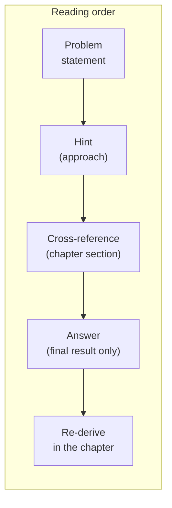

# Problems anthology

> Twenty-four problems, pulled from chapters 01 to 08, sorted by
> topic and difficulty. Every entry is *self-contained*: a problem
> statement, a difficulty rating, a cross-reference to the chapter
> section where the result is developed, a one-or-two-sentence hint
> on the approach, and a one-sentence answer that gives the final
> result without redoing the derivation.

This page exists for three audiences. **First**, students who
worked through the chapters and want to check that they can
*re-derive* the headline results from a clean sheet. **Second**,
practitioners who want a quick refresher on a specific identity
(the Gaussian product theorem, the Methfessel–Paxton error
scaling, the log-derivative identity). **Third**, anyone
teaching from the notes who wants a bank of questions with
hints. The problems are graded **easy / medium / hard** by
the depth of the derivation they require, not by the amount
of arithmetic.

> **Conventions.** All energies are in Hartree, all lengths in
> Bohr ($a_0$), unless the problem says otherwise. The fine-
> structure constant is $\alpha \approx 1/137.036$. The speed of
> light in atomic units is $c \approx 137.036$. Hydrogen-like
> eigenfunctions and energies are those of
> [Chapter 01, §1.10]({{ "/dft-notes/chapter-01/#110-the-hydrogen-atom" | relative_url }}).
> Notation follows the chapters — see the "Notation" callout in
> Chapter 01 for the conventions.

## How to read the entries

Each problem is a single block with five fields. An example:

> **Example P3.2.1** (medium) · *§3.12, Problem 2*
> **[statement]** The closed-shell HF energy depends on the
> density matrix $\mathbf P = 2 \mathbf C_\text{occ} \mathbf
> C_\text{occ}^\dagger$, not on the individual occupied orbitals.
> Show that any unitary rotation of the occupied orbitals leaves
> $E_\text{HF}$ unchanged.
> **Hint:** compute $\tilde{\mathbf P} = \mathbf C_\text{occ}
> \mathbf U \mathbf U^\dagger \mathbf C_\text{occ}^\dagger$ and
> use $\mathbf U \mathbf U^\dagger = \mathbf 1$.
> **Answer:** $\tilde P_{\mu\nu} = P_{\mu\nu}$ because $\mathbf U$
> is unitary, and $E_\text{HF}$ depends on the orbitals only
> through $\mathbf P$, so $\tilde E_\text{HF} = E_\text{HF}$.

The five fields are always in the same order. The format is
deliberately compact: a single screen of a reader, no scrolling
within an entry. The longer worked solutions live in the
referenced chapter section.

---

## 1. Quantum mechanics basics

> Source: [Chapter 01]({{ "/dft-notes/chapter-01/" | relative_url }}) — §1.13 (Problems).

### 1.1 The free-particle propagator as a path integral

> **P1.1.1** (hard) · *§1.13, Problem 3*
> **[statement]** For a free 1-D particle of mass $m$, the
> **Feynman propagator** is
> $K(x_b, t_b; x_a, t_a) = \langle x_b | e^{-i \hat H (t_b - t_a)} | x_a \rangle$
> with $\hat H = \hat p^2 / 2m$. Insert $N - 1$ complete sets of
> position eigenstates
> $\hat 1 = \int dx_j |x_j\rangle \langle x_j|$ between $N$
> infinitesimal time slices of width $\Delta t = (t_b - t_a)/N$,
> substitute the short-time propagator
> $K_0(x_{j+1}, x_j; \Delta t) = (m / 2\pi i \Delta t)^{1/2}
> \exp[i m (x_{j+1} - x_j)^2 / 2\Delta t]$, and take the
> continuum limit. Identify the result with Feynman's path
> integral $\int \mathcal D x(\tau) \exp(i S[x]/\hbar)$ where
> $S = \int \tfrac{1}{2} m \dot x^2\, d\tau$.
> **Hint:** the discretised integral is an iterated Fresnel
> integral. Completing the square at each step is the *exact*
> evaluation, because the action is quadratic.
> **Answer:**
> $K_0(x_b, t_b; x_a, t_a) = (m / 2\pi i T)^{1/2}
>  \exp[i m (x_b - x_a)^2 / 2 T]$
> with $T = t_b - t_a$, and the continuum limit is the path
> integral $\int \mathcal D x(\tau) e^{i S[x]/\hbar}$ over all
> paths from $(x_a, t_a)$ to $(x_b, t_b)$ weighted by the
> classical action.

### 1.2 Coherent states minimise the uncertainty product

> **P1.2.1** (hard) · *§1.13, Problem 4*
> **[statement]** A coherent state $|\alpha\rangle$ satisfies
> $\hat a |\alpha\rangle = \alpha |\alpha\rangle$ with
> $\alpha \in \mathbb C$. Using
> $\hat x = (\hat a + \hat a^\dagger)/\sqrt 2$ and
> $\hat p = i(\hat a^\dagger - \hat a)/\sqrt 2$, compute
> $(\Delta x)^2$ and $(\Delta p)^2$ in $|\alpha\rangle$ and
> hence the product $\Delta x\, \Delta p$. Show explicitly
> that the inequality is saturated only for the QHO ground
> state, and reconcile this with the *classicality* of
> coherent states by computing the centroid trajectory
> $\langle \hat x \rangle_t, \langle \hat p \rangle_t$.
> **Hint:** expand
> $(\hat a + \hat a^\dagger)^2 = \hat a^2 + (\hat a^\dagger)^2
> + 2 \hat a^\dagger \hat a + 1$ and use
> $\hat a^\dagger \hat a |\alpha\rangle = (\alpha^* \alpha - \alpha^* \alpha
> + |\alpha|^2) |\alpha\rangle$? — no, the right identity is
> $\hat a \hat a^\dagger |\alpha\rangle = (\alpha^* \alpha + 1) |\alpha\rangle$
> via $[\hat a, \hat a^\dagger] = 1$.
> **Answer:** $(\Delta x)^2 = 1/2 + (\operatorname{Im}\alpha)^2$,
> $(\Delta p)^2 = 1/2 + (\operatorname{Re}\alpha)^2$, so
> $\Delta x \Delta p = 1/2$ only at $\alpha = 0$; the
> centroid orbits the classical ellipse
> $\langle \hat x\rangle_t^2 + \langle \hat p\rangle_t^2 = 2 |\alpha|^2$.

### 1.3 The hydrogen $2p \to 1s$ spontaneous-emission rate

> **P1.3.1** (hard) · *§1.13, Problem 5*
> **[statement]** Apply Fermi's golden rule to the hydrogen
> $2p \to 1s$ electric-dipole transition. The dipole matrix
> element is $|\langle 1s | \hat{\mathbf r} | 2p\rangle|$,
> the photon density of states in vacuum is
> $\rho(\omega) = \omega^2 / \pi^2 c^3$ (SI), and the
> spontaneous-emission prefactor is $4\alpha \omega^3 / (3 c^2)$
> (Gaussian-cgs atomic units). Compute the radial integral
> $I_r = \int_0^\infty R_{1s}(r) r R_{2p}(r) r^2\, dr$, the
> angular sum over the three $2p$ sublevels, and the final rate.
> Compare with the experimental value
> $\Gamma \approx 6.27 \times 10^8\,\mathrm{s}^{-1}$.
> **Hint:** the angular factor is
> $\sum_m |\langle 1s | \hat r_a | 2p_m\rangle|^2 = I_r^2$ (three
> identical $I_r^2 / 3$ contributions), and the radial integral
> is a Gamma function with
> $\int_0^\infty r^4 e^{-3Zr/2}\, dr = 4! / (3Z/2)^5$.
> **Answer:** $\Gamma_{2p\to 1s} = 2^{17} \alpha / (3^{11} c^2)
> \approx 6.27 \times 10^8\,\mathrm{s}^{-1}$, in agreement with
> experiment to the precision of the non-relativistic hydrogen
> eigenfunctions.

---

## 2. Many-body methods

> Source: [Chapter 02]({{ "/dft-notes/chapter-02/" | relative_url }}) — §2.3 (the hierarchy of
> wavefunction methods). Chapter 02 does not currently have its
> own problem set, so the three problems below are composed
> from the topics named in the chapter.

### 2.1 CISD is not size-consistent — the H₂ dimer

> **P2.1.1** (medium) · *§2.3*
> **[statement]** Consider two H₂ molecules separated by a
> large distance $R \to \infty$, computed at the CISD level
> in a minimal basis. Each monomer has two electrons and
> four spin-orbitals; the FCI space for the dimer is the
> product of the two monomer FCI spaces, of dimension
> $\binom{4}{2}^2 = 36$. CISD, however, restricts the
> dimer wavefunction to *singles and doubles relative to
> the product HF determinant*, of which there are far fewer
> than 36.
>
> **(a)** Count the singles and doubles on each monomer and on
> the combined dimer. **(b)** Show that the *dimer* CISD
> energy is *not* the sum of the two *monomer* CISD energies
> in the $R \to \infty$ limit, even though the FCI energy
> is. The non-additivity is the **size-consistency error**.
> **Hint:** write the CISD Ansatz for the dimer and the
> product of two CISD Ansätze for the monomers; the
> *quadruply-excited* configurations (one double on each
> monomer) appear in the *product* Ansatz but *not* in the
> dimer CISD Ansatz.
> **Answer:** the dimer CISD has $N^2$ doubles but the
> product Ansatz has $N^2 + \binom{N}{2}^2$ configurations;
> the missing $\binom{N}{2}^2$ quadruples give a per-monomer
> error of order $E_\text{corr}^2 / \Delta E$ that does not
> scale to zero as $N$ grows.

### 2.2 Derive the MP2 energy formula

> **P2.2.1** (hard) · *§2.3*
> **[statement]** In Møller–Plesset perturbation theory, the
> zeroth-order Hamiltonian is the HF Fock operator $\hat F$,
> with eigenstates given by the HF orbitals and eigenvalues
> $\varepsilon_i$. The perturbation is
> $\hat V = \hat H - \hat F$, with matrix elements
> $\langle \Phi_S | \hat V | \Phi_0 \rangle$ connecting the
> HF reference $| \Phi_0 \rangle$ to an excited Slater
> determinant $| \Phi_S \rangle$ (the Slater–Condon rules
> give a non-zero contribution only for double excitations
> $S = (i j \to a b)$). Apply second-order Rayleigh–
> Schrödinger perturbation theory to obtain the
> **MP2 correlation energy**
> $E_\text{MP2} = \sum_{i<j}^\text{occ}
> \sum_{a<b}^\text{virt}
> | \langle ij || ab \rangle |^2 / (\varepsilon_i + \varepsilon_j
> - \varepsilon_a - \varepsilon_b)$.
> **Hint:** the second-order energy is
> $E^{(2)} = \sum_{S \ne 0} |\langle \Phi_S | \hat V | \Phi_0 \rangle|^2 /
> (E_0 - E_S)$. Use the Slater–Condon rules to evaluate
> $\langle \Phi_{ij}^{ab} | \hat V | \Phi_0 \rangle$ in
> terms of the antisymmetrised ERI
> $\langle ij || ab \rangle$.
> **Answer:** $E_\text{MP2} = \tfrac{1}{4} \sum_{ijab}
> |\langle ij || ab \rangle|^2 / (\varepsilon_i + \varepsilon_j
> - \varepsilon_a - \varepsilon_b)$, where the factor
> $\tfrac{1}{4}$ is the $1/(2!)^2$ degeneracy of the
> $(i, j) \leftrightarrow (a, b)$ relabelling.

### 2.3 CCSD amplitude equations are size-consistent

> **P2.3.1** (hard) · *§2.3*
> **[statement]** The coupled-cluster Ansatz is
> $|\text{CC}\rangle = e^{\hat T} | \Phi_0 \rangle$ with
> $\hat T = \hat T_1 + \hat T_2 + \dots$ and
> $\hat T_n = (n!)^{-1} \sum t_{i_1 \dots i_n}^{a_1 \dots a_n}
> \hat a^\dagger_{a_1} \dots \hat a_{i_n}$. The CCSD
> amplitude equations are
> $\langle \Phi_i^a | e^{-\hat T} \hat H e^{\hat T} | \Phi_0 \rangle = 0$.
> Show that for two non-interacting fragments A and B at
> infinite separation, the CCSD amplitude equations *factor*:
> $t_i^a = t_i^{a,\text{A}} + t_i^{a,\text{B}}$ (with mixed
> terms zero), and the CCSD energy is
> $E_\text{CCSD}^\text{AB} = E_\text{CCSD}^\text{A} + E_\text{CCSD}^\text{B}$.
> **Hint:** use the Campbell–Baker–Hausdorff theorem
> $e^{-\hat T} \hat H e^{\hat T} = \hat H + [\hat H, \hat T]
> + \tfrac{1}{2!} [[\hat H, \hat T], \hat T] + \dots$ and the
> fact that $\hat T^\text{A}$ and $\hat T^\text{B}$ commute
> (they act on disjoint orbital sets).
> **Answer:** the CCSD amplitude equations factor
> monomer-by-monomer because $e^{-\hat T} \hat H e^{\hat T}$ is
> a polynomial in $\hat T$ and the *normal-ordered* Hamiltonian
> $\hat H_N$ has no one-body terms connecting A and B;
> therefore $E_\text{CCSD}^\text{AB} = E_\text{CCSD}^\text{A}
> + E_\text{CCSD}^\text{B}$ exactly.

---

## 3. Hartree–Fock

> Source: [Chapter 03]({{ "/dft-notes/chapter-03/" | relative_url }}) — §3.12 (Problems).

### 3.1 The Roothaan equations

> **P3.1.1** (medium) · *§3.5, §3.12*
> **[statement]** Starting from the Fock eigenvalue equation
> $\hat F \phi_i = \varepsilon_i \phi_i$ and the expansion
> $\phi_i = \sum_\mu C_{\mu i} \chi_\mu$ of each MO in a
> fixed basis of $K$ AOs $\{\chi_\mu\}$, derive the
> **Roothaan–Hall equations**
> $\mathbf F \mathbf C = \mathbf S \mathbf C \boldsymbol\varepsilon$,
> with $\mathbf F$ the Fock matrix in the AO basis and
> $\mathbf S$ the overlap matrix $S_{\mu\nu} = \langle \chi_\mu
> | \chi_\nu \rangle$. Identify the origin of the
> *generalised* eigenvalue problem (the $\mathbf S$ on the
> right) and explain why the canonical MOs are *not* orthogonal
> in the AO sense ($\mathbf C^\dagger \mathbf S \mathbf C = \mathbf 1$,
> not $\mathbf C^\dagger \mathbf C = \mathbf 1$).
> **Hint:** left-multiply
> $\hat F \sum_\nu C_{\nu i} \chi_\nu = \varepsilon_i \sum_\nu C_{\nu i} \chi_\nu$
> by $\langle \chi_\mu |$, project, and recognise the AO Fock
> matrix $F_{\mu\nu} = \langle \chi_\mu | \hat F | \chi_\nu \rangle$.
> **Answer:** $F_{\mu\nu} = h_{\mu\nu} + \sum_{\rho\sigma}
> P_{\rho\sigma} [(\mu\nu | \rho\sigma) - \tfrac{1}{2}(\mu\sigma | \rho\nu)]$
> and the equations are *generalised* because the AOs are
> non-orthogonal; the orthonormality condition on the MOs
> reads $\mathbf C^\dagger \mathbf S \mathbf C = \mathbf 1$.

### 3.2 The HF energy is invariant to a unitary rotation of the occupied orbitals

> **P3.2.1** (medium) · *§3.12, Problem 2*
> **[statement]** Show that the closed-shell HF energy
> $E_\text{HF} = 2 \sum_i h_{ii} + \sum_{ij} (2 J_{ij} - K_{ij})$
> is invariant under a unitary rotation
> $\tilde \phi_i = \sum_j U_{ji} \phi_j$ of the occupied
> orbitals. State the key intermediate result that makes the
> invariance transparent.
> **Hint:** the only thing the HF energy depends on is the
> density matrix; show that the density matrix is invariant.
> **Answer:** the density matrix
> $P_{\mu\nu} = 2 \sum_i C_{\mu i} C_{\nu i}^*$ is invariant
> because $\tilde{\mathbf C}_\text{occ} = \mathbf C_\text{occ} \mathbf U$
> implies $\tilde{\mathbf P} = 2 \mathbf C_\text{occ} \mathbf U \mathbf U^\dagger
> \mathbf C_\text{occ}^\dagger = \mathbf P$ (using $\mathbf U \mathbf U^\dagger
> = \mathbf 1$), and the HF energy is a function of $\mathbf P$ only.

### 3.3 Derive Koopmans' theorem from the HF equations

> **P3.3.1** (hard) · *§3.12, Problem 3*
> **[statement]** Take the inner product of the MO Fock
> equation $\hat F \phi_i = \varepsilon_i \phi_i$ with $\phi_i$
> to obtain
> $\varepsilon_i = h_{ii} + \sum_{j \in \text{occ}} (2 J_{ij} - K_{ij})$.
> Use this to show that the closed-shell HF ionisation
> energy $I_a = E_\text{HF}(N - 1) - E_\text{HF}(N)$ for the
> removal of one $\alpha$ electron from orbital $a$ is
> $I_a = -\varepsilon_a$ (**Koopmans' theorem**). Pay
> attention to which sums change between $N$ and $N - 1$
> electrons and which do not.
> **Hint:** in the $N - 1$ calculation, the $\beta$ Fock
> matrix is unchanged because the removed electron is $\alpha$;
> the $\alpha$ sums lose orbital $a$ but keep the rest.
> **Answer:** $E_\text{HF}(N-1) - E_\text{HF}(N) = -h_{aa}
> - \sum_j (2 J_{aj} - K_{aj}) = -\varepsilon_a$ — the
> cancellation is exact in the *frozen-orbital* limit and
> is the formal statement of Koopmans' theorem.

---

## 4. DFT

> Source: [Chapter 04]({{ "/dft-notes/chapter-04/" | relative_url }}) — §4.10.2 (Problems).

### 4.1 The DIIS algorithm

> **P4.1.1** (medium) · *§4.6, §4.10.2, Problem 2*
> **[statement]** DIIS (Direct Inversion in the Iterative
> Subspace) extrapolates the next SCF iterate as
> $\tilde F = \sum_i c_i F_i$ from the last $m$ Fock matrices
> $F_1, \dots, F_m$ and the corresponding error vectors
> $R_i = F_i D_i S - S D_i F_i$, with coefficients constrained
> by $\sum_i c_i = 1$ to minimise the squared error norm
> $\|\tilde R\|^2 = \langle \tilde R, \tilde R \rangle$.
> Starting from the constrained minimisation
> $\min_{\mathbf c} \tfrac{1}{2} \mathbf c^T B \mathbf c$
> subject to $\mathbf 1^T \mathbf c = 1$ with
> $B_{ij} = \langle R_i, R_j \rangle$, derive the augmented
> linear system
> $\begin{pmatrix} \mathbf B & \mathbf 1 \\ \mathbf 1^T & 0 \end{pmatrix}
>  \begin{pmatrix} \mathbf c \\ -\lambda \end{pmatrix}
>  = \begin{pmatrix} \mathbf 0 \\ 1 \end{pmatrix}$.
> Show that the Lagrange multiplier
> $\lambda = \langle \tilde R, \tilde R \rangle$ is the
> squared norm of the extrapolated residual.
> **Hint:** form the Lagrangian
> $\mathcal L(\mathbf c, \lambda) = \tfrac{1}{2} \mathbf c^T B \mathbf c
> \;-\; \lambda(\mathbf 1^T \mathbf c - 1)$ and set its derivative
> to zero.
> **Answer:** stationarity gives $B \mathbf c = \lambda \mathbf 1$;
> stacking with the constraint $\mathbf 1^T \mathbf c = 1$
> yields the $m + 1$ augmented system; the matrix is
> invertible iff the residuals are linearly independent, and
> $\mathbf c^T B \mathbf c = \lambda \mathbf 1^T \mathbf c
> = \lambda = \|\tilde R\|^2$.

### 4.2 The Hellmann–Feynman force

> **P4.2.1** (hard) · *§4.10.2, Problem 3*
> **[statement]** The Kohn–Sham energy in a finite basis is
> $E(\mathbf C, \mathbf R) = 2 \sum_i^\text{occ} C_{\mu i} C_{\nu i}
> h_{\mu\nu}(\mathbf R) + \dots + V_{nn}(\mathbf R)$, and the
> SCF solution is $\mathbf C^*(\mathbf R)$ satisfying
> $\mathbf F(\mathbf C^*) \mathbf C^* = \mathbf S \mathbf C^*
> \boldsymbol\varepsilon$ with $\mathbf C^{*T} \mathbf S
> \mathbf C^* = \mathbf 1$. Differentiate $E$ with respect
> to $\mathbf R_I$ using the chain rule
> $dE / d\mathbf R_I = \partial E / \partial \mathbf R_I
> + \sum_{\mu i} (\partial E / \partial C_{\mu i})
> (\partial C_{\mu i}^* / \partial \mathbf R_I)$.
> Show that the orbital-response term vanishes at the SCF
> fixed point, leaving the Hellmann–Feynman theorem
> $\mathbf F_I = - \partial E / \partial \mathbf R_I$.
> In a *finite* basis, the basis-derivative piece (the
> **Pulay force**) survives and has the form
> $\mathbf F_I^\text{Pulay} = -2 \sum_i \sum_{\mu \in I} \sum_\nu
> C_{\mu i} C_{\nu i} \langle \partial \chi_\mu / \partial \mathbf R_I
> | \hat H_\text{KS} - \varepsilon_i | \chi_\nu \rangle$.
> **Hint:** the orbital-response term is constrained by the
> orthonormality condition; multiplying the KS equation by
> $\mathbf C^{*T}$ and using the orthonormality makes it
> proportional to $\partial \mathbf S / \partial \mathbf R_I$,
> which cancels the same derivative in the explicit term.
> **Answer:** the orbital-response term is
> $\sum_i 2 \varepsilon_i \partial S_{ii} / \partial \mathbf R_I$
> (a constraint-induced change in the kinetic-energy-like
> piece) and cancels the explicit $\partial S_{ij} / \partial
> \mathbf R_I$ term in $\partial E / \partial \mathbf R_I$,
> so the force is given by the explicit-derivative terms
> alone — and in a finite basis these are supplemented by the
> Pulay term.

### 4.3 The spin-DFT energy functional

> **P4.3.1** (hard) · *§4.10.2, Problem 4*
> **[statement]** The von Barth–Hedin extension of the
> Hohenberg–Kohn theorem to a static external magnetic field
> $\mathbf B(\mathbf r)$ couples to the electron spin via the
> Zeeman term. The two external fields $(v, B)$ are jointly
> determined by the two spin densities $(\rho_\uparrow,
> \rho_\downarrow)$, and every observable is a functional of
> the pair. Derive the **LSDA energy functional**
> $E_\text{xc}^\text{LSDA}[\rho_\uparrow, \rho_\downarrow]
> = \int \rho(\mathbf r) \varepsilon_\text{xc}(\rho_\uparrow(\mathbf r),
> \rho_\downarrow(\mathbf r)) d\mathbf r$ from the
> variational principle, and show that the Euler–Lagrange
> equations give the $2 \times 2$ Kohn–Sham equations
> $\hat H_\text{eff}^\sigma \phi_i^\sigma = \varepsilon_i^\sigma
> \phi_i^\sigma$ with
> $\hat H_\text{eff}^\sigma = -\tfrac{1}{2}\nabla^2 + v(\mathbf r)
> + v_\text{H}[\rho] + v_{\text{xc},\sigma}$.
> **Hint:** define the universal functional
> $F_\text{HK}[\rho_\uparrow, \rho_\downarrow] = \langle \hat T \rangle
> + \langle \hat U_{ee} \rangle$, introduce a non-interacting KS
> reference with the same spin densities, and write
> $E_\text{xc} = (F_\text{HK} - T_s) - J$.
> **Answer:** the spin-DFT energy is
> $E[\rho_\uparrow, \rho_\downarrow] = T_s[\rho_\uparrow, \rho_\downarrow]
> + J[\rho] + E_\text{xc}[\rho_\uparrow, \rho_\downarrow] + \int v \rho
> - \mu_B \int B m$; the LSDA evaluates $E_\text{xc}$ from the
> *homogeneous* electron gas, and functional differentiation
> yields $v_{\text{xc},\sigma} = \partial(\rho \varepsilon_\text{xc}) /
> \partial \rho_\sigma$.

---

## 5. XC functionals

> Source: [Chapter 05]({{ "/dft-notes/chapter-05/" | relative_url }}) — §5.1–5.2 (the uniform
> electron gas and the GGA). Chapter 05 is a survey chapter
> without its own problem set, so the three problems below are
> composed from the topics named in the chapter.

### 5.1 The LDA exchange energy density

> **P5.1.1** (medium) · *§5.1*
> **[statement]** The exchange energy of the homogeneous
> electron gas (HEG) of density $n$ can be evaluated in
> closed form by summing the Pauli exclusion repulsion over
> pairs of plane-wave orbitals. Show that the
> **exchange energy per electron** of the HEG is
> $\varepsilon_x(n) = -\tfrac{3}{4\pi} k_F$, where
> $k_F = (3\pi^2 n)^{1/3}$ is the Fermi wavevector. Hence
> derive the LDA exchange functional
> $E_x^\text{LDA}[\rho] = -\tfrac{3}{4} (3/\pi)^{1/3}
> \int \rho^{4/3}(\mathbf r) d\mathbf r$.
> **Hint:** use the Slater sum
> $E_x = -\tfrac{1}{2} \sum_{\mathbf k, \mathbf k' \in \text{occ}}
> \langle \mathbf k \mathbf k' | 1/r_{12} | \mathbf k' \mathbf k \rangle$
> and convert the sum to an integral over the Fermi sphere.
> The Fourier-space Coulomb integral
> $\int e^{i(\mathbf k - \mathbf k') \cdot \mathbf r} / r\, d\mathbf r
> = 4\pi / |\mathbf k - \mathbf k'|^2$ is the key.
> **Answer:** $E_x^\text{LDA}[\rho] = C_x \int \rho^{4/3} d\mathbf r$
> with $C_x = -\tfrac{3}{4}(3/\pi)^{1/3}$, and the
> exchange energy per electron is
> $\varepsilon_x(n) = C_x n^{1/3} = -\tfrac{3}{4\pi} k_F$.

### 5.2 The PBE enhancement factor $F_x(s)$ from the gradient expansion

> **P5.2.1** (hard) · *§5.2*
> **[statement]** The PBE GGA exchange functional is
> $E_x^\text{PBE}[\rho] = \int \rho\, \varepsilon_x^\text{LDA}(\rho)\,
> F_x(s)\, d\mathbf r$, where $s = |\nabla\rho| / (2 k_F \rho)$
> is the **reduced gradient**. The second-order
> **gradient expansion** (GEA) of the exchange energy is
> $E_x^\text{GEA} = E_x^\text{LDA} \int (1 + \mu s^2) d\mathbf r$
> with $\mu = 10/81$. PBE replaces this with an enhancement
> factor $F_x(s) = 1 + \kappa - \kappa / (1 + \mu s^2 / \kappa)$
> (the "PBE form") where $\kappa = 0.804$ is fixed by the
> **Lieb–Oxford bound**. Show that $F_x(s) \to 1 + \mu s^2$
> as $s \to 0$ (matching the GEA) and that $F_x(s) \to 1 + \kappa$
> as $s \to \infty$ (the uniform-density limit of the
> enhancement), and identify the physical meaning of the
> Lieb–Oxford bound in the derivation of $\kappa$.
> **Hint:** expand $1 / (1 + \mu s^2 / \kappa) = 1 - \mu s^2 / \kappa
> + O(s^4)$ at small $s$ and $\to 0$ at large $s$.
> **Answer:** $F_x(s) = 1 + \kappa - \kappa / (1 + \mu s^2 / \kappa)$
> has the GEA limit $F_x(s) \to 1 + \mu s^2$ for $s \to 0$
> and the bound $F_x(s) \le 1 + \kappa$ for $s \to \infty$;
> $\kappa$ is the value at which the enhancement saturates,
> and the bound $\varepsilon_x \ge -C_x n^{1/3} (1 + \kappa)$
> (Lieb–Oxford) determines its value.

### 5.3 The adiabatic connection and the exact-exchange limit

> **P5.3.1** (hard) · *§5.2, §5.4*
> **[statement]** The **adiabatic connection** couples the
> non-interacting Kohn–Sham system ($\lambda = 0$) to the
> physical interacting system ($\lambda = 1$) via a coupling
> constant $\lambda$ in front of the electron–electron
> repulsion. The XC energy is
> $E_\text{xc} = \int_0^1 \langle \Psi_\lambda | \hat U_{ee}
> | \Psi_\lambda \rangle d\lambda - E_H$, where
> $E_H = \tfrac{1}{2} \int \rho(\mathbf r) \rho(\mathbf r')
> / |\mathbf r - \mathbf r'| d\mathbf r d\mathbf r'$.
> Show that the *coupling-constant averaged* exchange energy
> is the exact HF exchange:
> $\int_0^1 E_x[\Psi_\lambda]\, d\lambda = E_x^\text{exact}$,
> and use this to interpret why *hybrid* functionals
> $E_\text{xc}^\text{hybrid} = a E_x^\text{exact} + (1 - a)
> E_x^\text{GGA} + E_c^\text{GGA}$ with $a \in [0.2, 0.3]$
> outperform their GGA parent at finite $a$.
> **Hint:** the exchange energy is *independent* of $\lambda$
> in the Görling–Levy perturbation-theory sense: the
> $\lambda$-dependence of $\Psi_\lambda$ contributes
> *only* to the correlation piece, not to the exchange.
> **Answer:** the $\lambda$-integration of $E_x[\Psi_\lambda]$
> is *trivially* $E_x^\text{exact}$ because the exchange
> energy is a one-electron property of the KS orbitals and
> the *pair density* at $\lambda = 0$ already gives the
> exact exchange; the remainder of the integrand is
> correlation, so $E_\text{xc} = E_x^\text{exact} + E_c$
> with $E_c = \int_0^1 (\langle \hat U_{ee}\rangle_\lambda -
> E_H)\, d\lambda$.

---

## 6. Basis sets

> Source: [Chapter 06]({{ "/dft-notes/chapter-06/" | relative_url }}) — §6.11 (Problems).

### 6.1 Counting basis functions for H₂O

> **P6.1.1** (easy) · *§6.11, Problem 1*
> **[statement]** Water (H₂O) has one O and two H atoms.
> Count the number of contracted basis functions $K$ that
> the basis sets **STO-3G**, **6-31G**, **6-31G\***, and
> **cc-pVDZ** give for water, using the spherical-harmonic
> convention for $d$-functions (5 per shell, not 6).
> **Hint:** count the per-atom contributions and use
> $K = 2 K_H + K_O$.
> **Answer:** STO-3G → $K = 7$, 6-31G → $K = 13$,
> 6-31G\* → $K = 18$, cc-pVDZ → $K = 24$ — and cc-pVTZ,
> cc-pVQZ, cc-pV5Z grow to 58, 115, 201, with the ERI
> count scaling as $K^4$.

### 6.2 The Gaussian product theorem

> **P6.2.1** (medium) · *§6.11, Problem 2*
> **[statement]** Prove by direct algebra that for any two
> centres $\mathbf A, \mathbf B \in \mathbb R^3$ and positive
> exponents $\alpha, \beta$,
> $e^{-\alpha |\mathbf r - \mathbf A|^2} e^{-\beta |\mathbf r - \mathbf B|^2}
> = e^{-\alpha\beta/(\alpha + \beta) |\mathbf A - \mathbf B|^2}
>  e^{-(\alpha + \beta) |\mathbf r - \mathbf P|^2}$
> with $\mathbf P = (\alpha \mathbf A + \beta \mathbf B) / (\alpha + \beta)$.
> Work in one dimension; the three-dimensional result follows
> from the factorisation of $|\mathbf r - \mathbf A|^2$.
> **Hint:** complete the square in $r$ and use
> $P = (\alpha A + \beta B) / (\alpha + \beta)$.
> **Answer:** expanding the exponent gives
> $-(\alpha + \beta) r^2 + 2(\alpha A + \beta B) r - (\alpha A^2 + \beta B^2)$
> which completes to $-(\alpha + \beta)(r - P)^2 -
> \tfrac{\alpha\beta}{\alpha + \beta}(A - B)^2$,
> exponentiating to the claimed identity.

### 6.3 Plane-wave count and Hamiltonian cost

> **P6.3.1** (hard) · *§6.11, Problem 3*
> **[statement]** A cubic simulation cell of side
> $L = 10\,\text{Å}$ (i.e. $L \approx 18.897\,a_0$,
> $\Omega = L^3 \approx 6748\,a_0^3$) contains an isolated
> water molecule. Compute the number of plane waves
> $N_\text{PW} = (\Omega / 6\pi^2)(2 E_\text{cut})^{3/2}$
> at the $\Gamma$ point for kinetic-energy cutoffs
> $E_\text{cut} = 30, 60, 100\,E_h$, the corresponding
> full-diagonalisation cost ratios ($\propto N_\text{PW}^3$),
> and explain qualitatively why a pseudopotential reduces
> $E_\text{cut}$ from $\sim 100\,E_h$ (all-electron) to
> $\sim 30$–$50\,E_h$.
> **Hint:** the basis grows as $E_\text{cut}^{3/2}$ and the
> diagonalisation eats another $E_\text{cut}^{3/2}$, so
> doubling the cutoff costs a factor of $2^{4.5} \approx 22.6$.
> **Answer:** $N_\text{PW} \approx 5.3 \times 10^4, 1.5 \times
> 10^5, 3.2 \times 10^5$ for $E_\text{cut} = 30, 60, 100\,E_h$
> respectively, with diagonalisation cost ratios $1 : 22.6 :
> 225$; a pseudopotential replaces the sharply-peaked
> all-electron $1s$ core by a smooth function, so the
> wavefunction's Fourier spectrum dies off above
> $|\mathbf G| \sim 6$–$8\,a_0^{-1}$.

---

## 7. Solids & PBC

> Source: [Chapter 07]({{ "/dft-notes/chapter-07/" | relative_url }}) — §7.9 (Problems).

### 7.1 Band gap of a cosine potential

> **P7.1.1** (easy) · *§7.9, Problem 1*
> **[statement]** A 1-D lattice has lattice constant $a$ and
> a periodic potential $V(x) = V_0 \cos(2\pi x / a)$ with
> $V_0 = -0.2\,E_h$. **(a)** Write down the non-zero
> Fourier coefficients $V_{\text{per}}(G)$ of the potential.
> **(b)** Construct the $2 \times 2$ plane-wave Hamiltonian
> at the BZ boundary $k = \pi/a$ in the basis
> $\{e^{i k x}, e^{i (k - 2\pi/a) x}\}$. **(c)** Diagonalise
> the matrix and write down the band gap
> $E_\text{gap}$ as a function of $V_0$.
> **Hint:** the two free-electron states at $k = \pi/a$ are
> degenerate; the potential couples them with matrix element
> $V_0 / 2$.
> **Answer:** $V_{\text{per}}(\pm 2\pi/a) = V_0/2 = -0.1\,E_h$,
> the $2 \times 2$ Hamiltonian has eigenvalues
> $\tfrac{1}{2}(\pi/a)^2 \pm V_0/2$, and the band gap is
> $E_\text{gap} = |V_0| = 0.2\,E_h$.

### 7.2 k-point density and BZ volume

> **P7.2.1** (medium) · *§7.9, Problem 2*
> **[statement]** A solid has a cubic direct lattice with
> conventional lattice constant $a$, and Born–von Kármán
> boundary conditions are imposed on a supercell of
> $N \times N \times N$ primitive cells. Show that:
> **(1)** the number of allowed k-points in the first BZ is
> exactly $N^3$; **(2)** the k-point density per unit volume
> of the BZ is $V_\text{cell} / (2\pi)^3$; **(3)** the sum
> $\tfrac{1}{N^3} \sum_{\mathbf k} f(\mathbf k)$ is a Riemann
> sum for the BZ integral
> $\tfrac{V_\text{cell}}{(2\pi)^3} \int_\text{BZ} f(\mathbf k)
> d\mathbf k$.
> **Hint:** the allowed k-points are a uniform mesh with
> $N$ points along each primitive direction; convert the sum
> to an integral using the mesh cell volume
> $\Delta V = (2\pi)^3 / (N^3 V_\text{cell})$.
> **Answer:** the BvK conditions give
> $\mathbf k \cdot \mathbf a_i = 2\pi m_i / N$ for
> $m_i = 0, 1, \dots, N - 1$, hence $N^3$ k-points;
> the BZ volume is $(2\pi)^3 / V_\text{cell}$, so the
> k-point density is $V_\text{cell} / (2\pi)^3$, and the
> $\tfrac{1}{N^3}$ prefactor in the sum exactly matches the
> BZ volume element in the integral.

### 7.3 Methfessel–Paxton smearing and the Fermi level

> **P7.3.1** (hard) · *§7.9, Problem 3*
> **[statement]** In a metallic calculation, the
> Methfessel–Paxton (MP) smearing scheme replaces the
> discontinuous Fermi–Dirac step at $T = 0$ by a smooth
> function of width $\sigma$ in energy. The occupations are
> $f_{n\mathbf k} = \tfrac{1}{2} \operatorname{erfc}[(\varepsilon_{n\mathbf k}
> - \mu) / \sigma] + \sum_l A_l H_{2l-1}[(\varepsilon_{n\mathbf k} - \mu)
> / \sigma] e^{-(\varepsilon_{n\mathbf k} - \mu)^2 / \sigma^2}$,
> with $H_n$ the physicist's Hermite polynomial and $A_l$ fixed
> coefficients. Show that **(1)** the occupations sum to $N_e$
> for any $\mu$, by the orthogonality of the odd Hermite
> polynomials to the constant function with Gaussian weight;
> **(2)** the electronic entropy contribution is
> $-T S_\text{el} = \sum_{n\mathbf k} [\varepsilon_{n\mathbf k}
> f_{n\mathbf k} - \sigma g_{n\mathbf k}]$ with
> $g = \tfrac{1}{2\sqrt{\pi}} e^{-(\varepsilon - \mu)^2 / \sigma^2}$
> for $N_\text{MP} = 0$ (Gaussian smearing); **(3)** the
> $\sigma \to 0$ extrapolation of $E_\text{band}(\sigma) +
> T S_\text{el}(\sigma)$ converges more rapidly than the
> unsmeared sum, with the leading correction $\propto \sigma^2$
> for $N_\text{MP} = 0$ and $\propto \sigma^4$ for
> $N_\text{MP} = 1$.
> **Hint:** the odd Hermite polynomials are orthogonal to
> the constant function with the Gaussian weight
> $\int H_{2l-1}(x) e^{-x^2} dx = 0$.
> **Answer:** the constraint is satisfied by construction
> (the Hermite corrections average to zero on the real
> line); Gaussian smearing gives a $-T S_\text{el}$ correction
> $\propto \sigma\, e^{-(\varepsilon - \mu)^2 / \sigma^2}$ per
> state; the $\sigma \to 0$ extrapolation is $\propto \sigma^2$
> for $N_\text{MP} = 0$ and $\propto \sigma^4$ for
> $N_\text{MP} = 1$ — a practical strategy is to run several
> $\sigma$ values, plot $E(\sigma)$ vs. $\sigma^2$ (or
> $\sigma^4$), and extrapolate linearly to $\sigma = 0$.

---

## 8. Pseudopotentials

> Source: [Chapter 08]({{ "/dft-notes/chapter-08/" | relative_url }}) — §8.10 (Problems).

### 8.1 The pseudo-potential at the origin

> **P8.1.1** (easy) · *§8.10, Problem 1*
> **[statement]** For the hydrogen $1s$ pseudo constructed
> in §8.8 with $r_c = 0.5\,a_0$ and the
> **Troullier–Martins (TM)** ansatz
> $\phi_0(r) = r \exp(c_0 + c_1 r^2 + c_2 r^4 + c_3 r^6)$,
> use the inversion formula
> $V_{ps,0}(r) = E_0 + \tfrac{1}{2} [2 p'(r) / r + p'(r)^2 +
> p''(r)]$ with $p(r) = c_0 + c_1 r^2 + c_2 r^4 + c_3 r^6$,
> to show that $V_{ps,0}(0)$ is finite. Compute its value
> using the analytical 3-parameter TM coefficients
> $c_1 = -1.5$ and confirm it is on the order of
> $-5\,E_h$. Then argue why the plane-wave cutoff required
> to expand a pseudo-wavefunction is much smaller than that
> required to expand the all-electron wavefunction.
> **Hint:** the only potentially singular term is
> $2 p'(r) / r = 4 c_1 + 8 c_2 r^2 + 12 c_3 r^4$, which is
> *finite* at $r = 0$ (no $1/r$ divergence).
> **Answer:** $V_{ps,0}(0) = E_0 + 3 c_1 = -0.5 - 4.5 = -5.0\,E_h$,
> finite because the polynomial form of $p(r)$ makes
> $p'(r) / r$ finite at the origin; the pseudo well has
> depth $\sim 5\,E_h$ (requiring $E_\text{cut} \sim 10\,E_h$)
> whereas the all-electron Coulomb well diverges as $1/r$,
> so no finite cutoff can represent it.

### 8.2 Verify norm conservation numerically

> **P8.2.1** (medium) · *§8.10, Problem 2*
> **[statement]** For the hydrogen $1s$ pseudo of §8.8,
> evaluate the two integrals
> $Q_0^{ps} = \int_0^{r_c} \phi_0^2(r) dr$ and
> $Q_0^{ae} = \int_0^{r_c} u_0^2(r) dr$ (the all-electron
> integral has the closed form
> $Q_0^{ae} = 1 - 2 e^{-2 r_c}(r_c^2 + r_c + 1/2)$), and
> confirm that they agree to numerical precision when the
> 4-parameter TM form is used. Then repeat the calculation
> for the *3-parameter* TM form (set $c_3 = 0$ and re-solve
> the remaining conditions); quantify the norm-conservation
> error $\Delta Q = Q_0^{ps} - Q_0^{ae}$ and interpret the
> trade-off between the number of free parameters and the
> transferability of the resulting pseudo-potential.
> **Hint:** the 4-parameter form was constructed with norm
> conservation as an explicit constraint; the 3-parameter
> form matches the all-electron value, first, and second
> derivatives at $r_c$ but does *not* enforce norm
> conservation.
> **Answer:** the 4-parameter form gives
> $Q_0^{ps} \approx 0.0803$ to machine precision (matches
> $Q_0^{ae}$ at $r_c = 0.5$); the 3-parameter form gives
> $Q_0^{ps} \approx 0.0787$ and $\Delta Q \approx -0.0016$
> (about $2\%$ relative error), with the error scaling as
> $r_c^4 \partial^4 u / \partial r^4$ — a price worth paying
> only when the higher-order transferability is not needed.

### 8.3 The log-derivative identity

> **P8.3.1** (hard) · *§8.10, Problem 3*
> **[statement]** Re-derive the **log-derivative identity**
> $\partial D_l / \partial E |_{r_c} = -2 \int_0^{r_c} u_l^2
> dr / u_l(r_c)^2$ from the radial Schrödinger equation
> $-\tfrac{1}{2} u_l'' + U_l u_l = E u_l$ with
> $U_l = l(l+1) / (2r^2) + V(r)$. Write the analogous
> equation for $\dot u_l = \partial u_l / \partial E$,
> multiply by $u_l$, subtract, and integrate from $0$ to
> $r_c$. Use the boundary conditions
> $u_l(0) = \dot u_l(0) = 0$ to drop the lower-limit
> terms. Combine the two boundary terms at $r = r_c$ and
> divide by $u_l(r_c)^2$ to recognise the energy
> derivative of the logarithmic derivative
> $D_l(E, r_c) = u_l'(r_c) / u_l(r_c)$. Note the role of
> the normalisation constraint
> $\int_0^\infty u_l^2 dr = 1$ in the discussion of when
> the volume term $\int_0^{r_c} \dot u_l u_l dr$ can be
> dropped.
> **Hint:** the integration-by-parts trick converts the
> volume integral to boundary terms at $0$ and $r_c$;
> $u_l(0) = 0$ kills the lower-limit contribution.
> **Answer:** multiplying the $\dot u_l$ equation by $u_l$
> and subtracting the $u_l$ equation multiplied by
> $\dot u_l$ gives
> $\tfrac{1}{2}[\dot u_l u_l'' - u_l \dot u_l''] = u_l^2$;
> integrating by parts and using the boundary conditions
> yields
> $u_l'(r_c) \dot u_l(r_c) - u_l(r_c) \dot u_l'(r_c)
> = 2 \int_0^{r_c} u_l^2 dr$, and dividing by
> $u_l(r_c)^2$ gives the log-derivative identity
> $\partial D_l / \partial E |_{r_c}
> = -2 \int_0^{r_c} u_l^2 dr / u_l(r_c)^2$.

---

## How to use this anthology

Three suggestions, in increasing order of effort.

1. **Spot check.** After finishing a chapter, read the
   corresponding section of the anthology and check that you
   can re-derive the answer from the hint in a single sitting.
   If not, the chapter section is worth a re-read.
2. **Cross-link.** Many problems in *different* chapters are
   connected. The free-particle propagator (§1.1) underlies
   the path-integral formulation of *every* correlated method
   (§2); the SCF fixed point (§4.1, §4.2) is the same
   mathematical object as the HF fixed point (§3.2); the
   Gaussian product theorem (§6.2) is the workhorse behind
   every Gaussian-based ERI (§3, §4, §6). If you can place
   each problem on a single mental map, you understand the
   *structure* of the notes, not just the *content*.
3. **Teach.** Pick a problem, write a one-page solution, and
   present it. The act of *explaining* a derivation is the
   fastest way to find the gap in your own understanding.

> Back to the [chapter index]({{ "/dft-notes/" | relative_url }})
> — or revisit a specific chapter from the
> [chapters map]({{ "/dft-notes/chapters-map/" | relative_url }}).
